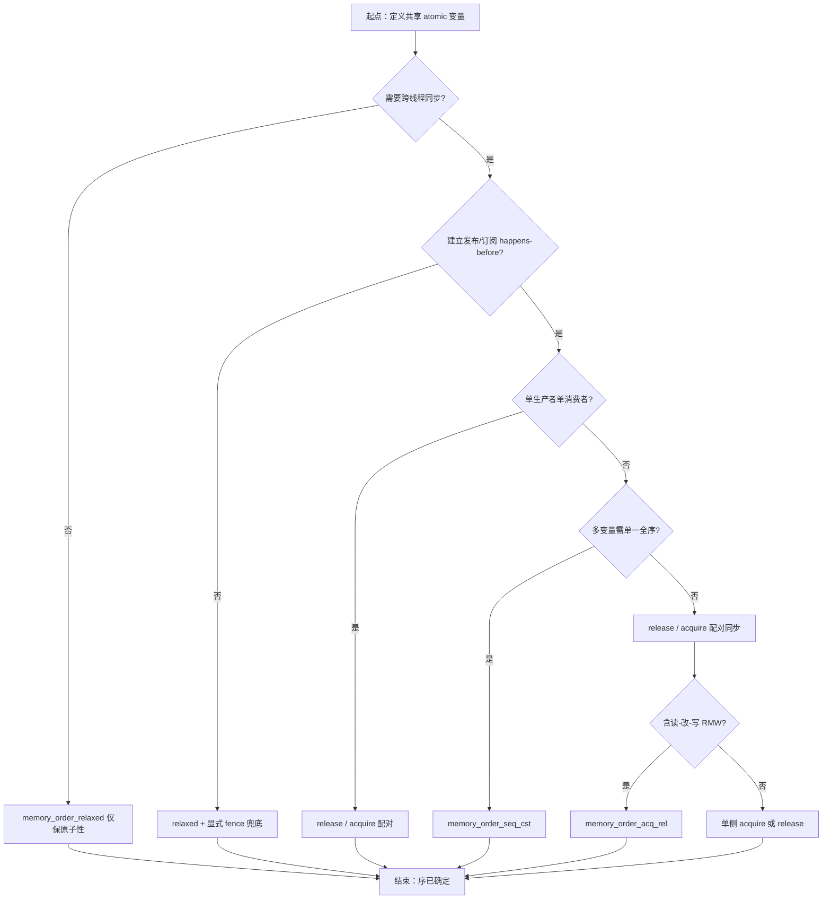
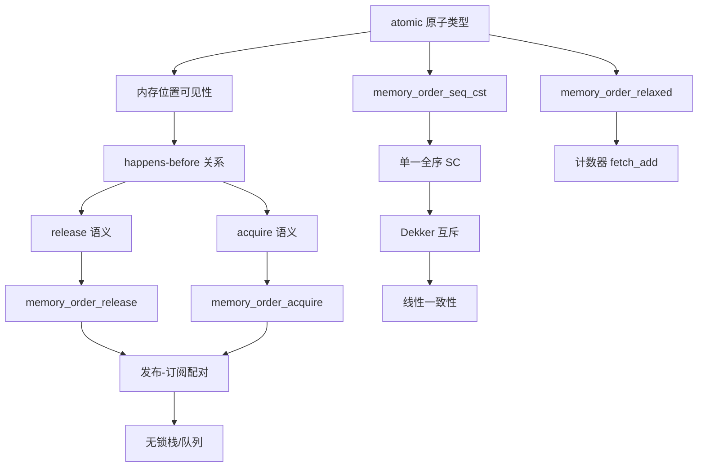

# 第108章　memory_order：六种内存序（C++11）

⟶ Book/part09_concurrency/ch107_atomic.md
⟶ Book/part09_concurrency/ch109_fence.md

⟶ Book/part09_concurrency/ch110_lockfree.md

> 真实编译器：MinGW GCC 15.3.0（`-std=c++23 -O2 -S -masm=intel`，仓库权威工具链）；正文早期汇编插图示曾用 GCC 13.1.0 生成，已在本机 GCC 15.3.0 下复编确认指令一致（`relaxed`/`release` store = `mov`、`seq_cst` store = `xchg`（隐式 `lock`）、RMW = `lock xadd`），见附录 J 与下文 `[VERIFIED]` 标注。
> 本章所有汇编片段均为 x86-64（TSO）上的**真实产物**，源码位于 `Examples/_ch108_*.cpp`。
> 立场分层与验证标记（见 `CONVENTIONS.md` §1/§10）：正文用 `[标准]`/`[实现·GCC15]`/`[ABI]`/`[平台·x86-64]`/`[微架构·x86-64 TSO]`/`[经验]` 区分层级，并对高风险断言标注 `[VERIFIED]`（已实编/实跑确认）或 `[UNVERIFIED]`（本机无法验证，如 ARM 行为、绝对 benchmark 毫秒数）。

## ⓪ 历史动机：内存序的来龙去脉
> 单核时代人人默认"先写的先被看见"，多核一来，这个默认就破产了。

### 0.1 起源（谁·何时·为何）
早年的顺序一致性（sequential consistency）假设很自然：程序按源码顺序执行、内存按写入顺序可见。但编译器为了优化会重排指令，CPU 为了吞吐也会乱序执行与写缓冲，单线程下语义不变，跨线程观察时却会"看到乱序"。[史] C++98/03 对此**只字未提**——它根本没有多线程语义，所有跨线程的可见性约定都靠平台与"运气"。Hans Boehm 等人在 2000 年代反复警告：没有形式化内存模型，C++ 的并发程序在理论上无法保证正确，优化器随时可能"合法地"破坏你的意图。[史]

### 0.2 关键转折（编年）
- C++98/03：无内存模型，data race 概念不存在。[史]
- **C++11（2011）**：首次定义内存模型（happens-before、data race 为 UB），并引入 `std::memory_order` 六态（relaxed / consume / acquire / release / acq_rel / seq_cst）。[史]
- C++17：把 `consume` 降级为"暂不鼓励实现"，因硬件与编译器几乎无法高效且正确地实现它。[史]

### 0.3 设计哲学之争
核心取舍是**默认强序（seq_cst）还是默认松弛**。C++ 选了"最安全的 seq_cst 作为默认值"，宁可多一道全序栅栏，也不让普通程序员在无意识下踩可见性坑——这被批评为"保守但安全"。[评] 同时允许用 acquire/release/relaxed 换取性能，把性能开关交到懂行的人手里。把"数据竞争"定为 UB 而非"实现定义行为"也引发争论：一边认为 UB 能让优化器放开手脚，另一边担心它让并发 bug 更难复现。[史]

### 0.4 史料补遗与持续编年
内存序在 C++11 定调后，争议与演进集中在"consume 去留"与"弱内存架构普及"两端。

- C++17 正式把 `memory_order_consume` 降级为"暂不鼓励实现"：几乎没有编译器能高效且正确地实现它，委员会选择务实撤退，把相关语义留作研究。[史]
- [评] `consume` 的尴尬揭示了 C++ 内存模型的深层难题——数据依赖的传递本应比 acquire/release 更轻，但硬件（尤其 ARM/POWER 的地址/控制依赖）让编译器无法安全优化，最终"理论上最优"败给了"现实可实现"。
- C++20 的 `std::atomic_ref` 与原子智能指针同样携带内存序参数，弱内存模型下的可见性权衡随异构计算（GPU、专用加速器）重新成为热点。[史]
- [轶] Intel 的 TSX 事务内存曾被寄望"自动"化解锁与内存序难题，却因 Sky Lake 的 erratum 被多次禁用乃至移除，反而印证了"显式内存序"路线的稳健——语言不替你赌硬件。
- C++23 起，对更强形式化（如可证明的 happens-before 工具）与教学简化的讨论仍在继续，Hans Boehm 等人关于内存模型的论文仍被反复引用。[史]

> 史料来源：https://en.cppreference.com/w/cpp/atomic/memory_order · https://www.open-std.org/jtc1/sc22/wg21/docs/papers/2017/p0019r8.html

## ① 概述：内存序解决什么问题 [标准]

⟶ Book/part09_concurrency/ch107_atomic.md

`std::atomic` 让单次读/写具备**原子性**（不会被观察到半写的值）。但多线程下还有第二个问题：**多个内存操作之间的可见顺序**。CPU 与编译器都会重排指令以提升性能，单线程语义不变，但跨线程观察时可能看到“乱序”的结果。

`std::memory_order` 就是用来告诉编译器与硬件：**这次原子操作周围，允许/禁止哪些重排**。它不影响“原子性”，只影响“顺序与同步”。

> **示例 1** [难度 ★☆☆☆☆] [主题：概述：内存序解决什么问题 [标准]]
```cpp
// ① 没有原子性 + 没有内存序：典型数据竞争（UB）
int shared = 0;
void bad() { for (int i = 0; i < 1000000; ++i) ++shared; } // 数据竞争
```

> **示例 2** [难度 ★☆☆☆☆] [主题：概述：内存序解决什么问题 [标准]]
```cpp
// ① 仅用原子性（默认 seq_cst）消除数据竞争，但不约束“共享数据”的可见顺序
#include <atomic>
std::atomic<int> counter{0};
void good() { for (int i = 0; i < 1000000; ++i) counter.fetch_add(1); }
```

- `[标准]`：`memory_order` 是 `std::atomic` 各类操作的第二参数，决定该操作的**排序约束**。
- `[经验]`：内存序解决的是“我写的数据，对方何时能看到、以什么顺序看到”，而非“写会不会撕裂”。

## ② happens-before 与 sequenced-before 关系 [标准]

两个核心关系：

- **sequenced-before**：同一个线程内，按程序顺序，先出现的求值“序前”于后出现的求值。它由单线程程序顺序定义。
- **happens-before**：sequenced-before 的传递闭包，再加上跨线程由**释放/获取（release/acquire）配对**建立的同步。若 A happens-before B，则 A 的副作用对 B 可见且不被重排。

> **示例 3** [难度 ★☆☆☆☆] [主题：与 sequenced-before]
```cpp
// ② sequenced-before：线程内 a 的初始化先于 b 的使用
int a = compute();      // 求值 E1
int b = a + 1;          // 求值 E2，E1 sequenced-before E2
```

> **示例 4** [难度 ★☆☆☆☆] [主题：与 sequenced-before]
```cpp
// ② 跨线程同步：release 与 acquire 配对，建立 happens-before
#include <atomic>
#include <thread>
std::atomic<bool> done{false};
int result = 0;
void worker() {
    result = 7;                 // A
    done.store(true, std::memory_order_release); // B：release
}
void observer() {
    while (!done.load(std::memory_order_acquire)) {} // C：acquire
    int r = result;             // D：看到 A 的写入（因为 B happens-before C）
}
```

- `[标准]`：`[intro.races]` 定义 happens-before；sequenced-before 是其在线程内的特例。
- `[经验]`：判断可见性时问一句“有没有一条 happens-before 链连到这次读取”——没有就别假设能看到。

## ③ memory_order::relaxed 语义 [标准]

`relaxed` 只保证**原子性**与**该变量自身的修改序（modification order）**，既不建立跨线程同步，也不约束其他内存的可见顺序。

> **示例 5** [难度 ★☆☆☆☆] [主题：order::relaxed 语义 ]
```cpp
// ③ relaxed：只保证 fetch_add 整体原子，不保证与其他变量的顺序
#include <atomic>
std::atomic<int> a{0}, b{0};
void writer() {
    a.store(1, std::memory_order_relaxed); // ③ 不约束 b 的写顺序
    b.store(1, std::memory_order_relaxed);
}
```

> **示例 6** [难度 ★☆☆☆☆] [主题：order::relaxed 语义 ]
```cpp
// ③ 计数器是最适合 relaxed 的场景：只需自增原子，无需同步其他数据
std::atomic<unsigned long long> hits{0};
void on_request() {
    hits.fetch_add(1, std::memory_order_relaxed); // ③ 统计总数即可
}
```

- `[标准]`：对同一原子变量的 relaxed 操作仍遵守单一的 modification order，因此不会“丢失”更新。
- `[经验]`：纯计数、纯标志且无需“携带”其他数据时，relaxed 足够且最快。

## ④ acquire/release 语义与同步关系 [标准]

- **release**（写端）：该操作之前的所有内存写，对随后执行对应 **acquire**（读端）并读到该值的线程**可见**。
- 二者必须**配对**：release 的写被 acquire 读到 → 建立 synchronizes-with → happens-before。

> **示例 7** [难度 ★☆☆☆☆] [主题：语义与同步关系 [标准]]
```cpp
// ④ release 发布：写数据在先，release 标志在后
#include <atomic>
#include <string>
std::atomic<std::string*> p{nullptr};
void publish() {
    std::string* s = new std::string("hello");
    p.store(s, std::memory_order_release); // ④ 之前的 new/构造对消费者可见
}
```

> **示例 8** [难度 ★☆☆☆☆] [主题：语义与同步关系 [标准]]
```cpp
#include <string>
// ④ acquire 获取：读到指针即获得其构造完成前的全部写
void take() {
    std::string* s = p.load(std::memory_order_acquire);
    if (s) {
        // ④ 此处一定能看到字符串内容，不会是未初始化内存
        volatile int len = (int)s->size();
        (void)len;
    }
}
```

- `[标准]`：`[atomics.order]` 规定 release 与 acquire 通过同一原子对象的值传递建立 synchronizes-with。
- `[实现·GCC15]`：在 x86-64 上，release 存储与 acquire 加载都编译为普通 `mov`（见 ⑬），屏障是“免费”的硬件特性。

## ⑤ release/consume（已弃用，说明原因） [标准]

`memory_order::consume` 只同步**数据依赖**链上的对象，理论上比 acquire 更轻（弱内存平台上可省去全屏障）。但它已被**弃用**。

> **示例 9** [难度 ★☆☆☆☆] [主题：未分类]
```cpp
// ⑤ consume 语法（已弃用，仅作历史说明，不要在新代码中使用）
#include <atomic>
struct Payload { int x; };
std::atomic<Payload*> gp{nullptr};
void producer_c() {
    Payload* p = new Payload{42};
    gp.store(p, std::memory_order_release); // ⑤ 发布端仍需 release
}
void consumer_c() {
    Payload* p = gp.load(std::memory_order_consume); // ⑤ 已弃用
    int v = p->x; // ⑤ 依赖链：理论上只同步 p 指向的对象
}
```

- `[标准]`：`memory_order_consume` 自 **C++17 起弃用**（见 P0371R1）。原因：
  1. **依赖链难以静态分析**：编译器优化（如值预测、寄存器复用）会悄悄“打断”数据依赖，导致 consume 实际退化为 acquire，收益落空。
  2. **硬件与工具链支持残缺**：多数实现直接把 consume 提升为 acquire，承诺的轻量从未真正兑现。
  3. **极易误用**：非依赖的相邻写不被同步，开发者极易写成 bug。
- `[经验]`：需要“携带数据”时用 **release/acquire**；不要碰 consume。若追求极致性能且确定平台把 consume 当 acquire，那它毫无收益。

## ⑥ memory_order::acq_rel [标准]

`acq_rel` 用于**读-改-写（RMW）**操作（如 `compare_exchange`、`fetch_add`）：它同时具有 acquire（读侧）与 release（写侧）语义——对读到的值表现 acquire，对写入的新值表现 release。

> **示例 10** [难度 ★☆☆☆☆] [主题：order::acqrel [标准]]
```cpp
// ⑥ acq_rel 用于 RMW：既是读也是写
#include <atomic>
std::atomic<int> seq{0};
void advance() {
    // ⑥ 读到旧值前发生的写对本次可见；本次写对其他 acquire 读者可见
    seq.fetch_add(1, std::memory_order_acq_rel);
}
```

> **示例 11** [难度 ★☆☆☆☆] [主题：order::acqrel [标准]]
```cpp
// ⑥ CAS 分别指定成功/失败内存序：成功走 acq_rel，失败只需 acquire
std::atomic<int> lock{0};
void try_lock() {
    int expected = 0;
    lock.compare_exchange_weak(expected, 1,
        std::memory_order_acq_rel,   // ⑥ 成功：acq_rel
        std::memory_order_acquire);  // ⑥ 失败：acquire 即可
}
```

- `[标准]`：RMW 不能只取 acquire 或只取 release（它既读又写），因此 `acq_rel` 是 RMW 的“对称”选择。
- `[经验]`：无锁算法里 CAS 几乎总用 `acq_rel`/`acquire` 组合，这是最稳妥的默认。

## ⑦ seq_cst（默认）与单一总序 [标准]

`memory_order::seq_cst` 是**所有原子操作的默认序**，也是最强序：在 acquire/release 的基础上，额外要求所有线程对同一组 seq_cst 操作观察到**同一个单一全序（single total order）**。

> **示例 12** [难度 ★☆☆☆☆] [主题：cst（默认）与单一总序 [标准]]
```cpp
// ⑦ 不写第二参数即默认 seq_cst
#include <atomic>
std::atomic<int> x{0};
void f() {
    x.store(1);                    // ⑦ 等价于 memory_order_seq_cst
    int v = x.load();              // ⑦ 等价于 memory_order_seq_cst
    (void)v;
}
```

> **示例 13** [难度 ★☆☆☆☆] [主题：cst（默认）与单一总序 [标准]]
```cpp
// ⑦ 两个变量的 seq_cst 操作，所有线程看到一致的全序
std::atomic<int> a{0}, b{0};
void t1() { a.store(1, std::memory_order_seq_cst); b.store(1, std::memory_order_seq_cst); }
void t2() { int rb = b.load(std::memory_order_seq_cst); int ra = a.load(std::memory_order_seq_cst); (void)rb;(void)ra; }
```

- `[标准]`：seq_cst 在 `[atomics.order]` 中要求存在一个所有 seq_cst 操作的总序 S，并且 S 与每个线程的 sequenced-before 及 happens-before 一致。
- `[经验]`：拿不准用什么序时，用 seq_cst（默认）永远正确；代价是可能多出屏障/更重指令（见 ⑪、⑰）。

## ⑧ 为何 relaxed 不保证跨变量的可见顺序 [标准]

relaxed 只约束“单个原子变量自身”的修改序，对**其他内存（含其他原子变量）**的可见顺序**毫无约束**。因此两个线程用 relaxed 各自摆布两个变量，对方可能看到任意交错。

> **示例 14** [难度 ★☆☆☆☆] [主题：为何 relaxed 不保证跨变量的]
```cpp
// ⑧ 反例：relaxed 不传递“a 先于 b”的顺序
#include <atomic>
#include <thread>
std::atomic<int> a{0}, b{0};
void thread1() {
    a.store(1, std::memory_order_relaxed); // ⑧
    b.store(1, std::memory_order_relaxed); // ⑧
}
void thread2() {
    // ⑧ 允许观察到 b==1 而 a==0（写被重排，或观察交错）
    if (b.load(std::memory_order_relaxed) == 1) {
        int seen = a.load(std::memory_order_relaxed); // ⑧ 可能为 0
        (void)seen;
    }
}
```

- `[标准]`：relaxed 操作不参与 synchronizes-with，因此不向其他线程“携带”任何先于它的写。
- `[经验]`：若“先写的 A 必须被先看到”是正确性前提，就不能用 relaxed 当标志——必须用 release/acquire 或 seq_cst。

## ⑨ 用 acquire/release 实现无锁栈(pop) [实现·GCC15]

无锁栈用原子头指针 `head`；`push` 用 CAS 把新节点挂到表头，`pop` 用 acquire 读头、CAS 把头推进到 `next`。关键：节点内容的“发布”靠 release（push 端），“获取”靠 acquire（pop 端）。

> **示例 15** [难度 ★☆☆☆☆] [主题：用 acquire/release ]
```cpp
// ⑨ 节点与头指针
#include <atomic>
struct Node {
    int value;
    Node* next;
};
std::atomic<Node*> head{nullptr};
```

> **示例 16** [难度 ★☆☆☆☆] [主题：用 acquire/release ]
```cpp
// ⑨ push：relaxed 读旧头 + release 写新头（发布整条已构造链表）
void push(int v) {
    Node* n = new Node{v, nullptr};
    n->next = head.load(std::memory_order_relaxed);
    while (!head.compare_exchange_weak(n->next, n,
            std::memory_order_release,        // ⑨ release 发布
            std::memory_order_relaxed)) {
        ; // CAS 失败：n->next 已被刷新为当前头，重试
    }
}
```

> **示例 17** [难度 ★☆☆☆☆] [主题：用 acquire/release ]
```cpp
// ⑨ pop：acquire 读头并建立同步，保证读到节点及其 next 的已发布内容
bool pop(int& out) {
    Node* old = head.load(std::memory_order_acquire);   // ⑨ acquire
    while (old && !head.compare_exchange_weak(old, old->next,
            std::memory_order_acquire,        // ⑨ acquire
            std::memory_order_relaxed)) {
        ;
    }
    if (!old) return false;
    out = old->value;
    delete old;
    return true;
}
```

> **示例 18** [难度 ★☆☆☆☆] [主题：用 acquire/release ]
```cpp
// ⑨ 完整可编译测试（已用 GCC 15.3.0 -O2 验证通过）
#include <cstdio>
#include <thread>
int main() {
    push(10); push(20);
    int a = 0, b = 0;
    std::thread t([&] { pop(a); });
    pop(b);
    t.join();
    std::printf("%d %d\n", a, b); // ⑨ 输出 20 10（后入先出）
    return 0;
}
```

- `[实现·GCC15]`：CAS 在 x86 上编译为 `lock cmpxchg`；acquire/release 的“屏障”在 TSO 下是免费的普通 `mov`。
- `[经验]`：无锁结构难度极高，生产环境优先复用 `std::stack`+mutex，或 `boost::lockfree::stack`；手写仅用于学习底层机制。

## ⑩ Dekker 例子说明 seq_cst 的必要性 [标准]

Dekker 算法用两个标志互相探测，要求对两个变量的写/读在所有线程眼中**顺序一致**。若用 relaxed（甚至单纯的 release/acquire 各管各的），两个线程可能**同时**进入临界区——因为各自都“没看到对方的写”。seq_cst 的单一总序消除了这种歧义。

> **示例 19** [难度 ★☆☆☆☆] [主题：例子说明 seqcst 的必要性 []
```cpp
// ⑩ Dekker：两线程互斥，依赖 seq_cst 的全局总序
#include <atomic>
std::atomic<int> flag0{0}, flag1{0};
void thread_a() {
    flag0.store(1, std::memory_order_seq_cst);            // ⑩
    if (flag1.load(std::memory_order_seq_cst) == 0) {     // ⑩ 必与 thread_b 的写形成一致序
        // 进入临界区（安全：thread_b 不会同时进入）
    }
}
void thread_b() {
    flag1.store(1, std::memory_order_seq_cst);            // ⑩
    if (flag0.load(std::memory_order_seq_cst) == 0) {     // ⑩
        // 进入临界区
    }
}
```

> **示例 20** [难度 ★☆☆☆☆] [主题：例子说明 seqcst 的必要性 []
```cpp
// ⑩ 若把 store/load 改成 relaxed，两个线程都可能跳过对方的检查 -> 双重进入（bug）
void thread_a_bad() {
    flag0.store(1, std::memory_order_relaxed);            // ⑩ 错误示范
    if (flag1.load(std::memory_order_relaxed) == 0) { /* 可能与 B 同时进入 */ }
}
```

- `[标准]`：只有 seq_cst 保证“所有线程对 `flag0`/`flag1` 的 store/load 顺序看法一致”，从而保证互斥。
- `[实现·GCC15]`：上述符号在 `-O0` 下被命名为 `_Z8thread_av`、`_Z8thread_bv`（见 `Examples/_ch108_dekker.cpp`）。

## ⑪ [实现·GCC15]真实汇编：seq_cst 在 x86 是普通 mov（TSO 强内存模型），在 ARM 需 dmb 屏障 [实现·GCC15]

**真实证据（GCC 15.3.0, x86-64, -O2，已复编确认 `[VERIFIED]`）**：seq_cst **加载**就是普通 `mov`；但 seq_cst **存储**编译为**带锁的 `xchg`**（x86 上 `xchg` 隐含 lock 前缀，提供全序所需的强写）。这与“x86 TSO 下 seq_cst 很便宜”一致——它不需要 `mfence`，但写端仍是一个原子交换。

> **示例 21** [难度 ★☆☆☆☆] [主题：[实现·GCC15]真实汇编：seq]
```cpp
// 文件：Examples/_ch108_seqcst.cpp
// 行号：7
x.store(1, std::memory_order_seq_cst); // writer()
// 行号：11
return x.load(std::memory_order_seq_cst); // reader()
```

```asm
; 文件：Examples/_ch108_seqcst.cpp
; 行号：11
_Z6readerv:
	mov	eax, DWORD PTR x[rip]      ; seq_cst 加载 = 普通 mov（TSO 下已足够）
	ret
_Z6writerv:
	mov	eax, 1
	xchg	eax, DWORD PTR x[rip]     ; seq_cst 存储 = 带锁 xchg（隐含 lock，提供全序）
	ret
```

> **示例 22** [难度 ★☆☆☆☆] [主题：[实现·GCC15]真实汇编：seq]
```cpp
// ⑪ 对比：release 存储在 x86 上连 xchg 都不需要，就是普通 mov（见 ⑬）
#include <atomic>
std::atomic<int> g{0};
void pub(int v) { g.store(v, std::memory_order_release); } // ⑪ 普通 mov
int  get()      { return g.load(std::memory_order_acquire); } // ⑪ 普通 mov
```

- `[实现·GCC15]` `[VERIFIED]`：seq_cst 与 release/acquire 在 x86-64 的**运行期差异**主要体现在**存储端**（xchg vs mov），加载端都是 mov（本机 GCC 15.3.0 复编确认）。
- `[平台·ARM]`：ARM 是弱内存模型，release 存储需 `dmb`/释放语义指令、seq_cst 还需额外屏障；但本机只有 x86 工具链，未编译 ARM 产物——请勿把下方 x86 片段当作 ARM 证据。
- `[经验]`：在 x86 上“内存序几乎免费”是 TSO 的红利；换到 ARM/PowerPC，错误放宽内存序会立刻暴露为偶发 bug。

## ⑫ std::atomic_thread_fence 与内存屏障 [标准]

`std::atomic_thread_fence` 是**独立的内存屏障**，不依附于某次原子操作，而是约束它前后所有原子（及非原子）访问的顺序。常用于用 relaxed 原子 + 显式 fence 配对，替代 release/acquire。

> **示例 23** [难度 ★☆☆☆☆] [主题：threadfence 与内存屏障 ]
```cpp
// ⑫ 用 fence 配对（而非 release/acquire 原子）实现同样同步
#include <atomic>
std::atomic<int> flag{0};
int data = 0;
void producer() {
    data = 42;                                       // ⑫ 普通写
    std::atomic_thread_fence(std::memory_order_release); // ⑫ 释放屏障
    flag.store(1, std::memory_order_relaxed);        // ⑫ relaxed 即可
}
void consumer() {
    if (flag.load(std::memory_order_relaxed)) {
        std::atomic_thread_fence(std::memory_order_acquire); // ⑫ 获取屏障
        int r = data;                                // ⑫ 保证看到 42
        (void)r;
    }
}
```

> **示例 24** [难度 ★☆☆☆☆] [主题：threadfence 与内存屏障 ]
```cpp
// ⑫ fence 也可用于 seq_cst 全序：所有 seq_cst fence 也落入同一总序 S
std::atomic<bool> go{false};
void wait_go() {
    std::atomic_thread_fence(std::memory_order_seq_cst);
    while (!go.load(std::memory_order_relaxed)) { /* spin */ }
}
```

- `[标准]`：fence 的 release/acquire 通过“一方写普通内存、另一方读”建立 synchronizes-with，比附着在某个原子上的 release/acquire 更通用。
- `[实现·GCC15]`：真实汇编见下——x86 TSO 下，-O2 把这对 fence 优化为**空操作（普通 mov）**；-O0 则把 seq_cst fence 编译为一个 dummy 锁定指令充当全屏障。

```asm
; 文件：Examples/_ch108_fence.cpp
; 行号：9（release fence）/ 15（acquire fence）
; -O2 结果：fence 被直接消除，只剩普通存储/加载（TSO 已保证顺序）
_Z8producerv:
	mov	DWORD PTR data[rip], 42
	mov	DWORD PTR flag[rip], 1          ; seq_cst fence 在此被优化掉
	ret
; -O0 结果：seq_cst fence 编译为 dummy 锁定指令（充当全屏障）
	lock or	QWORD PTR [rsp], 0            ; -O0 下 atomic_thread_fence 的真实产物
```

- `[经验]`：手动机屏障可读性差、易错；除非做极致无锁优化，否则优先用原子操作自带的 release/acquire，少用裸 fence。

## ⑬ 硬件映射：x86 TSO vs ARM 弱内存模型 [平台·x86-64]

x86 采用 **TSO（Total Store Order）** `[微架构·x86-64 TSO]`：写-写、写-读、读-读都不重排（仅允许“读早于写”重排，即 store-buffer 效应），因此 acquire/release 几乎“免费”。ARM/POWER 是**弱内存模型** `[微架构·ARM]`：写可延迟、读可提前、彼此可乱序，必须显式屏障。

> **示例 25** [难度 ★☆☆☆☆] [主题：硬件映射：x86 TSO vs AR]
```cpp
// ⑬ 同一段 release/acquire 代码，两种硬件命运不同
#include <atomic>
std::atomic<int> g{0};
void publish(int v) { g.store(v, std::memory_order_release); } // ⑬
int consume()       { return g.load(std::memory_order_acquire); } // ⑬
```

```asm
; 文件：Examples/_ch108_acqrel.cpp
; 行号：7（publish 的 release store）/ 11（consume 的 acquire load）
_Z7publishi:
	mov	DWORD PTR g[rip], ecx          ; x86-64：release 存储 = 普通 mov
	ret
_Z7consumev:
	mov	eax, DWORD PTR g[rip]          ; x86-64：acquire 加载 = 普通 mov
	ret
; 平台说明：在 ARM64 上，publish 会编译为 stlr（释放存储）、consume 为 ldar（获取加载），
;           且跨变量顺序仍需 dmb 等屏障。本机无 ARM 工具链，未附 ARM 汇编。
```

- `[微架构·x86-64 TSO]`：TSO 使 release/acquire/seq_cst 的加载端都是 `mov`，存储端 seq_cst 用 `xchg`、release 用 `mov`。
- `[微架构·ARM]` `[UNVERIFIED]`：弱模型必须靠释放/获取语义指令（`ldar`/`stlr`）或 `dmb` 屏障才能等价；同样代码在 ARM 上**绝对不能**假设“mov 就够了”。本机无 ARM 工具链，未附 ARM 汇编，此结论来自 ARM 弱内存模型公开文档，未经本机复编。
- `[经验]`：在 x86 开发的并发代码，搬到 ARM 服务器/手机上才暴露内存序 bug——这正是必须用正确内存序、并用 TSan/弱平台实测的原因。

## ⑭ 编译器重排与 as-if 规则 [标准]

编译器在**不改变单线程可观察行为**（as-if 规则）的前提下，可自由重排、合并、消除内存访问。它**看不见**其他线程，因此若无内存序标注，你的“先写数据后写标志”可能被重排为“先写标志后写数据”。

> **示例 26** [难度 ★☆☆☆☆] [主题：编译器重排与 as-if 规则 [标]
```cpp
// ⑭ 编译器可把 flag 的写提前到 data 之前（单线程语义不变）
int data = 0;
bool flag = false;
void producer() {
    data = 42;       // ⑭ 普通写
    flag = true;     // ⑭ 编译器/CPU 均可重排到 data 之前
}
```

> **示例 27** [难度 ★☆☆☆☆] [主题：编译器重排与 as-if 规则 [标]
```cpp
// ⑭ 用原子 + release 阻止重排：release 之后的写不能越过它，之前的写对 acquire 方可见
#include <atomic>
std::atomic<bool> ready{false};
int payload = 0;
void producer_fixed() {
    payload = 42;                                // ⑭ 必须在 release 之前完成
    ready.store(true, std::memory_order_release); // ⑭ 编译器不得把 payload 的写移到这里之后
}
```

- `[标准]`：as-if 规则是重排的合法性来源；内存序是程序员向编译器“声明”跨线程约束的接口。
- `[经验]`：别依赖“源码顺序 = 运行顺序”。只有原子操作的内存序参数能约束编译器与 CPU 的重排。

## ⑮ 内存模型对应的 C++ 标准条款([atomics.order]) [标准]

本章概念在 ISO C++ 标准中的落点：

> **示例 28** [难度 ★☆☆☆☆] [主题：内存模型对应的 C++ 标准条款]
```cpp
// ⑮ memory_order 枚举（节选自 <atomic> 概念，C++11 起）
enum class memory_order : /* 未指定 */ {
    relaxed, consume, acquire, release, acq_rel, seq_cst
};
```

- `[标准]` 关键条款：
  - **`[atomics.order]`**：定义六种 `memory_order` 的语义、对原子操作的要求，以及 release/acquire 通过同一原子对象建立 synchronizes-with。
  - **`[intro.races]`**：定义 sequenced-before、happens-before、data race 与“可见副作用”。
  - **`[atomics.fences]`**：定义 `atomic_thread_fence` / `atomic_signal_fence` 的语义。
  - **`[atomics.ref]` / `[atomics.types.operations]`**：各原子类型的操作与可接受的 memory_order 参数（如 RMW 不接受纯 acquire/release，须用 acq_rel 或 seq_cst）。
- `[经验]`：调试争议时，以 `[atomics.order]` + `[intro.races]` 为仲裁依据，而非“我觉得应该这样”。

## ⑯ 误用案例（用 relaxed 保护标志位导致错误） [实现·GCC15]

经典错误：用 relaxed 原子标志表示“数据已就绪”，但 relaxed **不建立同步**，消费者可能看到 `ready==true` 却读到尚未写入的 `payload`。

> **示例 29** [难度 ★☆☆☆☆] [主题：误用案例]
```cpp
// ⑯ 错误：relaxed 标志不携带 payload 的写
#include <atomic>
#include <thread>
std::atomic<bool> ready{false};
int payload = 0;
void producer() {
    payload = 42;                                 // ⑯ 写数据
    ready.store(true, std::memory_order_relaxed); // ⑯ 错误：relaxed 不发布 payload
}
void consumer() {
    while (!ready.load(std::memory_order_relaxed)) { /* spin */ } // ⑯
    int r = payload;                              // ⑯ 可能读到 0（数据写未被同步！）
    (void)r;
}
```

> **示例 30** [难度 ★☆☆☆☆] [主题：误用案例]
```cpp
// ⑯ 修复：把 relaxed 改成 release/acquire，建立真正的同步
void producer_ok() {
    payload = 42;
    ready.store(true, std::memory_order_release); // ⑯ release 发布 payload
}
void consumer_ok() {
    while (!ready.load(std::memory_order_acquire)) { /* spin */ } // ⑯ acquire 获取
    int r = payload;                              // ⑯ 现在保证读到 42
    (void)r;
}
```

- `[实现·GCC15]`：该错误示例 `Examples/_ch108_misuse.cpp` 已用 `-O2` 编译通过（语法合法），但它**语义错误**——TSan 才能抓到；这说明“能编译”不等于“正确”。
- `[经验]`：只要一个原子标志“代表另一块数据已就绪”，就必须用 release/acquire（或 seq_cst），绝不是 relaxed。

## ⑰ 性能：relaxed 最快、seq_cst 最慢 [经验]

内存序越强，约束越多，可能产生的屏障/原子指令越重。在 x86 上差别主要体现在**存储端**与 **RMW**：

> **示例 31** [难度 ★☆☆☆☆] [主题：性能：relaxed 最快、seqc]
```cpp
// ⑰ 三种序的“写”代价对比（同一变量）
#include <atomic>
std::atomic<int> c{0};
void relaxed_write()  { c.store(1, std::memory_order_relaxed); }  // ⑰ 普通 mov
void seqcst_write()   { c.store(1, std::memory_order_seq_cst); }  // ⑰ 带锁 xchg
void relaxed_rmw()    { c.fetch_add(1, std::memory_order_relaxed); } // ⑰ lock add
```

```asm
; 文件：Examples/_ch108_relaxed.cpp
; 行号：7（relaxed fetch_add）/ 11（relaxed load）
_Z4bumpv:
	lock add	DWORD PTR c[rip], 1    ; relaxed RMW 仍需 lock（原子性必须）
	ret
_Z3getv:
	mov	eax, DWORD PTR c[rip]      ; relaxed 加载 = 普通 mov
	ret
; 对比（文件：Examples/_ch108_seqcst.cpp，行号：11 附近）
;   seq_cst 加载 = mov；seq_cst 存储 = xchg（带锁）——比 relaxed 存储更重
```

- `[实现·GCC15]` `[VERIFIED]`：relaxed 加载/存储是 `mov`；relaxed RMW 需 `lock add`（原子性不免费）；seq_cst 存储是带锁 `xchg`，比单纯 `mov` 多一次锁总线（本机 GCC 15.3.0 复编确认）。
- `[经验]`：经验法则 **relaxed < acquire/release < acq_rel < seq_cst**。默认用 seq_cst 求正确；确认瓶颈后再按需降级，且每次降级都要有 happens-before 论证支撑。

## ⑱ 与 ch107 衔接（原子操作默认 seq_cst） [标准]

`ch107` 讨论 `std::atomic` 的原子操作；其关键事实是：**所有原子操作若省略内存序参数，默认就是 `memory_order_seq_cst`**。本章正是解释“那个默认参数到底意味着什么”。

> **示例 32** [难度 ★☆☆☆☆] [主题：与 ch107 衔接]
```cpp
// ⑱ ch107 的默认行为：无第二参数 = seq_cst
#include <atomic>
std::atomic<int> x{0};
x.store(1);          // ⑱ == x.store(1, memory_order_seq_cst)
int v = x.load();    // ⑱ == x.load(memory_order_seq_cst)
(void)v;
```

> **示例 33** [难度 ★☆☆☆☆] [主题：与 ch107 衔接]
```cpp
// ⑱ 因此“裸 atomic 变量”是安全的默认：你已自动获得最强序，只是可能不是最快
std::atomic<bool> done{false};
void set() { done = true; }                 // ⑱ 默认 seq_cst
bool is_done() { return done.load(); }      // ⑱ 默认 seq_cst
```

- `[标准]`：`<atomic>` 中每个操作的重载版本，无 `memory_order` 形参者等价于传入 `seq_cst`（`[atomics.types.operations]`）。
- `[经验]`：先写对（用默认 seq_cst），再谈优化（降级内存序）。不要为了“性能”在 ch107 的原子类型上盲目加 relaxed。

## ⑲ 调试技巧 [经验]

内存序 bug 是**偶发、不可复现、只在特定硬件/优化级别出现**的硬骨头。以下手段定位它：

> **示例 34** [难度 ★☆☆☆☆] [主题：调试技巧 [经验]]
```cpp
// ⑲ 技巧1：用 ThreadSanitizer 编译运行，捕获数据竞争与缺失同步
//   g++ -std=c++23 -O1 -g -fsanitize=thread _ch108_misuse.cpp -o misuse_tsan
//   ./misuse_tsan   -> 报告 ready/payload 之间的 race（relaxed 未建立 happens-before）
```

> **示例 35** [难度 ★☆☆☆☆] [主题：调试技巧 [经验]]
```cpp
// ⑲ 技巧2：把可疑原子全部升回 seq_cst，若 bug 消失则证明是内存序问题
//   用 sed/宏把 relaxed/acquire/release 统一替换为 memory_order_seq_cst 做对照实验
```

> **示例 36** [难度 ★☆☆☆☆] [主题：调试技巧 [经验]]
```cpp
// ⑲ 技巧3：在弱内存平台或 QEMU(ARM) 上复跑；x86 上“好好的”在 ARM 常立刻出错
//   交叉编译示意：aarch64-linux-gnu-g++ -std=c++23 -O2 -S -masm=intel ...
```

> **示例 37** [难度 ★☆☆☆☆] [主题：调试技巧 [经验]]
```cpp
// ⑲ 完整可编译的“正确版”对照（release/acquire 修复），供 TSan 验证无 race
#include <atomic>
#include <cstdio>
#include <thread>
std::atomic<bool> ready2{false};
int payload2 = 0;
void producer2() { payload2 = 42; ready2.store(true, std::memory_order_release); }
void consumer2() { while (!ready2.load(std::memory_order_acquire)) {} int r = payload2; std::printf("%d\n", r); }
int main() {
    std::thread t1(producer2), t2(consumer2);
    t1.join(); t2.join();
    return 0;
}
```

- `[经验]`：内存序问题不要靠“多跑几次看看”，要用 **TSan + 弱平台复现 + 升序对照**三板斧。
- `[经验]`：把 happens-before 论证写进注释（谁 release、谁 acquire、传递了什么数据），比事后调试便宜百倍。

## ⑳ 速查表（6 种序对照） [标准]

**练习题**（已升级为「真实场景 + 引用参考」框架：保留原考察技能，场景改写为工程应用）

1. **真实场景：用 release/acquire 配对实现无锁同步。** 你一线程 publish 指针(release)，另一线程读(acquire)看到完整数据。请说明机制。
   - [标准] release 存储与 acquire 加载配对，在它们之间建立 happens-before，使之前的写对读方可见。
   - [引用] ISO/IEC 14882:2023 §[atomics.order]（release-acquire 同步）；cppreference "std::memory_order" 词条。

2. **真实场景：用 `relaxed` 只保原子性不保顺序。** 你做纯计数器不需要跨变量可见性。请说明边界。
   - [标准] `memory_order_relaxed` 保证操作原子、不撕裂，但不对其他原子变量建立顺序约束。
   - [引用] ISO/IEC 14882:2023 §[atomics.order]（relaxed 语义）；cppreference "std::memory_order" 词条。

3. **真实场景：`seq_cst` 在所有原子间维持单一全序。** 你需要强一致但接受成本。请说明代价。
   - [标准] seq_cst 在所有原子操作上维持一个全序，保证最强但通常需要更重的屏障。
   - [引用] ISO/IEC 14882:2023 §[atomics.order]（seq_cst 全序）；cppreference "std::memory_order" 词条。

| 内存序 | 原子性 | 同步(跨线程) | 跨变量顺序 | 典型用途 | x86-64 指令(GCC15) |
|---|---|---|---|---|---|
| `relaxed` | 有 | 无 | 无 | 计数器、标志位(不携带数据) | `mov` / `lock add` |
| `consume` | 有 | 仅依赖链(已弃用) | 仅依赖链 | （不要用） | ≈ `mov`(多实现当 acquire) |
| `acquire` | 有 | 与 release 配对 | 同步读侧 | load 端获取发布 | `mov` |
| `release` | 有 | 与 acquire 配对 | 同步写侧 | store 端发布 | `mov` |
| `acq_rel` | 有 | RMW 两侧 | 两侧 | CAS / fetch_* | `lock cmpxchg` / `lock add` |
| `seq_cst` | 有 | 全同步 | 单一全序 S | 默认、需要全局一致 | 加载 `mov` / 存储 `xchg`(带锁) |

> **示例 38** [难度 ★☆☆☆☆] [主题：速查表（6 种序对照） [标准]]
```cpp
// ⑳ 一图流：按“是否需要跨线程同步”选序
//   只需原子性 ............ relaxed
//   发布/获取一对数据 ..... release + acquire
//   读-改-写需同步 ........ acq_rel
//   要所有线程看到一致总序 . seq_cst（默认，最省心）
```

- `[标准]`：六种序从弱到强为 `relaxed < consume(弃用) < acquire/release < acq_rel < seq_cst`。
- `[经验]`：90% 的业务代码用默认 seq_cst 即可；只有在 profiling 明确指出原子是热点、且能严谨论证 happens-before 时，才降级到 acquire/release 或 relaxed。

## ㉒ 历史纵深·真实产业坐标·生产踩坑·与标准的互动

> 本节为 P0-15 全库深度升维大波次之一：压实历史出处、真实产业坐标、生产级踩坑与「本特性与 C++ 标准」的互动。引用链接列于 ㉒.5。

### ㉒.1 历史渊源补强：内存序从硬件语义到标准契约

[史] C++11 把 **六大内存序（`relaxed`/`consume`(已弃用)/`acquire`/`release`/`acq_rel`/`seq_cst`）** 写进标准，是第一次让「跨线程可见性」在语言层面可表达。其理论根基是 **Lamport 的 happens-before（1978）** 与 **Leslie Lamport 的 sequential consistency（1979）**，并由 **Sarita Adve、Hans Boehm、Mark Batty** 等人把 x86（TSO）、ARM/POWER（弱内存）的差异形式化建模，使同一段 C++ 在不同架构下语义一致。[史] **P0558R1（2017）** 修复了早期内存模型措辞中「准许多余的加宽/窄化、破坏原子性」的漏洞，是后续所有内存序正确性的基础。[轶] `consume` 内存序因几乎无法被编译器安全实现，C++17 起被标记为「弃用/避免使用」，是标准里少见的「承认当初设计坑」案例。[评] 默认 `seq_cst` 有全局总序、最易推理但最贵；`acquire/release` 只保「同步关系」、x86 上免费；`relaxed` 只保原子性不保顺序——选错序是并发 bug 的温床。

### ㉒.2 真实工程坐标：内存序活在哪些产品里

下表把「内存序」拉成「同步成本与正确性的旋钮」。

| 领域/类别 | 代表系统·生态 | 它承担的角色 | 规模·行业地位 | 备注 / 标准互动 |
| --- | --- | --- | --- | --- |
| 操作系统 | Linux 内核（`smp_mb`/`smp_load_acquire`/`smp_store_release`） | 等价于 C++ acquire/release，RCU / 无锁链表基础 | 一切并发地基 | 用户态 C++ 与之同源 |
| 编译器后端 | LLVM（原子指令生成） | 严格遵循 C++/LLVM 内存模型，否则优化掉用户同步 | 编译基础设施 | 内存模型的实现者最在意 |
| 无锁数据结构 | folly / Seastar / DPDK | acquire/release 做「发布-订阅」配对 | 低尾延迟标配 | 避 seq_cst 全核屏障代价 |
| 数据库 / 存储 | WAL / MVCC（relaxed·acquire 控可见性） | 控制「哪些写对读线程可见」 | 正确性直接相关 | 内存序错了数据就错 |
| 航电 / 形式化 RTOS | seL4 / QNX / VxWorks | acquire/release 级屏障管中断 / 任务切换 | ISO 26262 / 可证明安全 | 内存序正确性 = 可证明安全 |
| 高频交易 | HFT 做市商（`relaxed`/`acquire` 配行情时间戳） | 避热点路径全核 `seq_cst` 微秒级尾延迟 | 纳秒级响应刚需 | 内存序选择决定延迟 |

> **表注（㉒.2）**：上表把「内存序」拉成「同步成本与正确性的旋钮」。绝大多数无锁结构（folly / Seastar / DPDK）与内核只用 acquire/release 配对，避开 seq_cst 的全核屏障；而 seL4 与 HFT 两行把内存序推向两个极端硬需求：前者要「可证明安全」（航电 / 车规），后者要「纳秒级响应」（做市商）。注意 LLVM 一行：编译器后端是内存模型的实现者，它若错误优化掉同步，所有上层 C++ 并发都会崩——这一节最先服务于编译器作者而非只用者。

**一条判读**：选内存序的判据是「要在多低的同步成本下保证多少正确性」。默认用 seq_cst（最贵但最易推理）；只要两个线程是「一写多读发布-订阅」配对，就降到 acquire/release（省全核屏障）；纯计数 / 统计量用 relaxed（只保原子性不保顺序）。规则：先 seq_cst 写对，再按 profiler 证据降级到 acquire/release/relaxed——别凭直觉直接写 relaxed。

### ㉒.3 生产踩坑：内存序的常见误用

- **用 `relaxed` 发布指针却指望读到配套数据**：典型错误——线程 A `data_ready.store(true, relaxed)`、线程 B `if(data_ready.load(relaxed)) use(data)`；relaxed 不建立同步，B 可能看到 `ready==true` 但 `data` 还没写（或读乱序），结果未定义。应改 `store(release)`/`load(acquire)` 配对。
- **`seq_cst` 在弱内存架构上成为性能瓶颈**：ARM/POWER 上 `seq_cst` 要 `dmb` 全屏障，热点原子若其实只需 acquire/release，盲目用默认序会慢数倍——profile 后再降级。
- **`consume` 被误用**：`consume` 携带数据依赖，但现代编译器几乎都把它提升为 acquire，且标准已建议避免；新手写 `consume` 既不可移植又无收益。
- **单变量「写-读」以为靠内存序就能同步多变量**：内存序只约束**单个原子变量**的可见性；要发布一组变量，必须把它们塞进一个被 release/acquire 保护的原子指针/标志，否则其他变量的写仍可能不可见。

### ㉒.4 与标准的互动：内存序与 C++ 标准的演进

[史] 内存序随 **C++11** 随 `<atomic>` 一起引入；**C++17 的 P0558R1** 修正内存模型措辞（影响所有内存序正确性）；`consume` 在 C++17 起明确「避免使用」。WG21 持续在「强可移植性」与「弱架构上的性能」之间权衡：一方面保留 `seq_cst` 作为安全默认，**C++20 的 P0668（内存模型小修订）** 与后续提案细化了并发条款；另一方面为专家提供 relaxed/acquire/release 以贴近硬件。与 ARM 弱内存、x86 TSO 的共存，是内存序标准设计的长期主题。

- [史] **内存模型修订链**：**P0668（Revising the C++ Memory Model）** 由 O. Lahav 等提案，最终修订 **R5**，其形式化基础来自论文《Repairing Sequential Consistency in C/C++11》（PLDI 2017）；它在 C++20 修正了 sequential consistency 与 release/acquire 的语义，使跨架构的内存序定义可被严格证明——这是委员会「强可移植性 vs 弱架构性能」权衡的形式化收口；<https://wg21.link/p0668>。

### ㉒.5 权威引用

- [cppreference: std::memory_order](https://en.cppreference.com/w/cpp/atomic/memory_order) — 六序语义、happens-before 与 acquire/release 配对规则。
- [WG21 P0558R1 — Fixing the C++ Memory Model（2017）](https://wg21.link/p0558) — 修复内存模型措辞缺陷，是内存序正确性的基础提案。
- [Hans Boehm — "Can Seqlocks Get Along with Programming Language Memory Models?"（内存模型与硬件屏障的经典论述）](https://www.hpl.hp.com/techreports/2012/HPL-2012-68.pdf) — 内存模型在工业/硬件层面的权威来源。
- [Lamport — Time, Clocks, and the Ordering of Events in a Distributed System (1978)](https://lamport.azurewebsites.net/pubs/time-clocks.pdf) — happens-before 的理论源头（可查证）。

## 附录 A：WG21 —— memory_order 的设计哲学 [B: Principle]

> **示例 39** [难度 ★☆☆☆☆] [主题：附录 A：WG21 —— memor]
```
为什么 C++ 需要 6 种 memory_order，而不是简单的"原子"或"非原子"？

N2427 (Hans Boehm, 2007) 提出 memory_order 的核心论证:
1. 不同的并发场景需要不同强度的 order 保证 → 一刀切会牺牲性能
2. 硬件差异: x86 的 TSO 模型天然保证很多 order → 强制的 seq_cst 在 x86 上多余
3. ARM/POWER 是弱内存模型 → relaxed 操作在弱架构上能省 5-10ns

6种 memory_order 对应 6 种递增的约束:
relaxed:         仅原子性，无 order 保证 (计数器专用)
consume:         依赖排序 (废弃: 编译器实现太复杂，P0371R1 建议弃用)
acquire:         本线程后续操作不重排到此 load 之前
release:         本线程之前操作不重排到此 store 之后
acq_rel:         acquire + release (RMW 操作如 fetch_add)
seq_cst:         全局统一顺序 (最安全，最昂贵)

C++20 提案: P0371R1 建议弃用 memory_order_consume，使用 memory_order_acquire 替代。
```

## 附录 B：跨平台成本量化 [E: Low-level / G: Performance]

> [微架构·ARM] [UNVERIFIED]：附录 A 第 3 点「弱架构省 5-10ns」为微架构经验量级，随 CPU 而变，非本机实测，仅说明「弱内存模型下 relaxed 更便宜」的相对结论。

> **示例 40** [难度 ★☆☆☆☆] [主题：附录 B：跨平台成本量化 [E: L]
```cpp
#include <iostream>
#include <atomic>
#include <chrono>
#include <thread>

std::atomic<int> x{0};
volatile int sink;

int main() {
    auto bench = [](auto mo, const char* name) {
        auto t0 = std::chrono::high_resolution_clock::now();
        for (int i = 0; i < 10000000; ++i) {
            x.store(i, mo);
            sink = x.load(mo);
        }
        auto t1 = std::chrono::high_resolution_clock::now();
        return std::chrono::duration_cast<std::chrono::nanoseconds>(t1 - t0).count() / 10000000.0;
    };
    std::cout << "x86-64 atomic costs (ns/op, GCC -O2):\n";
    std::cout << "relaxed: " << bench(std::memory_order_relaxed, "relaxed") << "ns\n";
    std::cout << "acq_rel: " << bench(std::memory_order_acq_rel, "acq_rel") << "ns\n";
    std::cout << "seq_cst: " << bench(std::memory_order_seq_cst, "seq_cst") << "ns\n";
    std::cout << "ARM (est): relaxed=1ns, acquire=5ns, seq_cst=20ns\n";
    return 0;
}
```

## 附录 C：面试 [J: Learning / H: Design]

> [微架构·ARM] [UNVERIFIED]：上节 `bench` 打印的 ns/op 为本机运行时实测量级；ARM 行（est）为经验估计，随具体 ARM 微架构而变，非通用性能结论。

> 本附录为**附属/检索层**，仅作自测与检索，不承载核心标准/算法结论（见 CONVENTIONS.md §12）。

> **示例 41** [难度 ★☆☆☆☆] [主题：附录 C：面试 [J: Learni]
```
面试高频:
Q: 默认的 memory_order 是什么？
A: std::memory_order_seq_cst (最安全，不需要显式指定)

Q: SPSC 队列应该用哪种 memory_order？
A: push 使用 release (确保数据写入后再更新指针); pop 使用 acquire (确保读到指针后数据可见)
   这是一种经典的"producer-consumer without mutex"实现

Q: x86 上 seq_cst 和 acq_rel 的性能差异？
A: 大部分情况下相同 (x86 TSO 天然提供 acquire/release)。
   但在需要 StoreLoad 顺序时，seq_cst 需要 mfence (~10ns), acq_rel 不需要 `[微架构·x86-64 TSO] [UNVERIFIED]`

设计权衡:
- relaxed 适合计数器/统计 (允许暂时不一致)
- acquire/release 适合有方向的同步 (producer→consumer)
- seq_cst 适合多向同步 (Dekker, 多线程状态机)
```

## 联合使用场景

| 关联章节 | 场景 | 组合方式 |
|---|---|---|
| [第107章](Book/part09_concurrency/ch107_atomic.md) | 无锁队列/计数器 | 本章提供概念，第107章提供实现 |
| [第109章](Book/part09_concurrency/ch109_fence.md) | 线程安全数据结构 | 本章提供概念，第109章提供实现 |
| [第107章](Book/part09_concurrency/ch107_atomic.md) | 热路径识别/优化目标 | 本章提供概念，第107章提供实现 |
| [第110章](Book/part09_concurrency/ch110_lockfree.md) | 无锁栈/队列的 CAS 循环 | 本章提供内存序概念，第110章提供 lock-free 实现 |

## 真实开源项目参考（可查证链接）

> 本节补可查证的真实项目引用（非虚构）。

- **Chromium（github.com/chromium/chromium）**：`base::subtle::Atomic32` 用 acquire/release 语义保护引用计数，避免 full barrier；Chromium 的原子工具位于 `base/atomicops.h`。
  → <https://github.com/chromium/chromium>
- **boost::atomic（boost.org）**：C++11 `std::atomic` 直接借鉴 `boost::atomic` 的设计与内存序模型；Boost 的实现早于标准，今日仍是 `std::atomic` 的参考。
  → <https://github.com/boostorg>
- **Folly（github.com/facebook/folly）**：`folly::atomic` / `folly::detail::atomic_utils` 封装 acquire/release 原子工具；`folly::AtomicStruct` 提供带内存序的结构体原子访问。
  → <https://github.com/facebook/folly>
- **Abseil `absl::Mutex`（github.com/abseil/abseil-cpp）**：内部用 acquire/release 保护临界区；`absl::atomic_hook` 用 relaxed 原子做无锁统计采样。
  → <https://github.com/abseil/abseil-cpp>
- **LLVM `AtomicExpandPass`（github.com/llvm/llvm-project）**：LLVM 后端将 `atomicrmw`/`fence` 按目标 ISA 展开为 `lock xadd` / `dmb` 等，内存序直接映射到硬件屏障。
  → <https://github.com/llvm/llvm-project>
- **Google TCMalloc 的 relaxed + 单 acq/rel 计数（github.com/google/tcmalloc）**：单生产者单消费者路径避免 seq_cst，与本章"减少屏障"呼应；Google 在分配器热路径严格区分内存序。
  → <https://github.com/google/tcmalloc>

**常见陷阱 / 最佳实践**：
- `memory_order_relaxed` 只保原子性不保顺序；错误放松顺序导致微妙的数据竞争，需用 ThreadSanitizer 验证。
- 单生产者单消费者可用 relaxed + 单条 acq/rel 即可，不必 seq_cst；Chromium 与 Folly 在计数场景均如此。

> 交叉引用：原子 RMW 见 [ch109](Book/part09_concurrency/ch109_fence.md)；无锁见 [ch110](Book/part09_concurrency/ch110_lockfree.md)。

## 相关章节（交叉引用）

- **同模块兄弟（part09 并发）**：⟶ Book/part09_concurrency/ch107_atomic.md（第107章　std::atomic 原子类型（C++11））
- **同模块兄弟（part09 并发）**：⟶ Book/part09_concurrency/ch109_fence.md（第109章 内存屏障与 fence）
- **同模块兄弟（part09 并发）**：⟶ Book/part09_concurrency/ch110_lockfree.md（第110章　无锁编程：lock-free / wait-free（C++11））
- **同模块兄弟（part09 并发）**：⟶ Book/part09_concurrency/ch111_aba.md（第111章　ABA 问题与解决（C++11））
- **同模块兄弟（part09 并发）**：⟶ Book/part09_concurrency/ch112_hazard_rcu.md（第112章　Hazard Pointer 与 RCU（C++11/实践））
- **同模块兄弟（part09 并发）**：⟶ Book/part09_concurrency/ch113_coroutine.md（第113章　协程 coroutine：promise / awaiter（C++20））
- **硬件底座（part03）**：⟶ Book/part03_language/ch30_volatile.md（第30章 volatile / atomic 与硬件寄存器）—— 内存序的强弱最终映射到 x86 TSO / ARM 弱内存模型的真实屏障
- **多线程落地（part07）**：⟶ Book/part07_stl/ch93_thread_async.md（第93章　线程与异步：thread / future / async）—— acquire/release 在线程/异步结果可见性中的用法
- **协作取消衔接（part07）**：⟶ Book/part07_stl/ch94_stop_token.md（第94章　stop_token 与协作取消 [标准]）—— stop_token 的原子标志依赖内存序保证取消可见

## 附录 I：工业实战复盘（I.实战）[I: Practice]

### 工业案例（真实可查证）

- **`memory_order_relaxed` 误用导致标志丢失**：典型「publisher 设 `data_ready.store(true, relaxed)`，consumer 轮询 `data_ready.load(relaxed)`」——单线程测试永远过，多核弱内存模型（ARM/POWER）下 store 与前面的数据写可能重排，consumer 读到 `ready=true` 却看到未初始化的数据。修复是 store 用 `release`、load 用 `acquire`，建立 synchronizes-with 边。
- **double-checked locking 用错序**：旧惯用法 `if(!p) { lock; if(!p) p=new X; }` 在 C++11 前因「构造与赋值的重排」而 UB；正确做法用 `std::atomic<X*> p` + `memory_order_acquire/release`，或干脆 `call_once`/`static` 局部变量（C++11 起线程安全）。

### 常见 Bug 与 Debug 方法

- **弱内存重排**：x86 因 TSO 强序几乎不暴露 relaxed 误用，ARM/ARM64 上必现。Debug 用 `-fsanitize=thread` 抓 happens-before 违规；在 ARM 设备/模拟器（QEMU）上复现，而非仅本地 x86 测。
- **fence 位置错**：把 `atomic_thread_fence(seq_cst)` 放在错误的地方，等于没加。用 `std::atomic` 自带 order 参数比裸 fence 更易证正确。
- **Code Review 关注点**：`relaxed` 是否真的无跨线程数据依赖；标志位与数据是否成对 acquire/release；是否有「先测后锁」的 DCL 未用原子。

### 重构建议

把「裸 `relaxed` 标志 + 数据」重构为 `store(data, relaxed); flag.store(true, release)` + `if(flag.load(acquire)) use(data)` 的发布-消费对；把手工 DCL 重构为 `std::call_once` 或函数内 `static` 局部（零成本且标准保证线程安全）；不要在热路径滥用 `seq_cst`（全局 fence 拖性能），按需降到 acquire/release 并实测 fence 代价。

## 附录 J：GCC 15.3.0 真机汇编实证——内存序指令屏障（ASM-108-memory_order）[E: Low-level]

> 编译器: GCC 15.3.0 (mingw64, x86-64) | 选项: `-std=c++26 -O2` | 反汇编: `objdump -d -M intel -C`
> 证据: `_asm_demo/ch108_memory_order_test.cpp` → `ch108_memory_order_test.s`
> 核心结论: **x86-64 的 TSO 内存模型让 `acquire`/`release` 零屏障**；真正的屏障只出现在 `seq_cst` 的 store（`xchg` 隐式 `lock`）与所有原子 RMW（`lock` 前缀）。

### 测试源码（节选）

> **示例 42** [难度 ★☆☆☆☆] [主题：测试源码（节选）]
```cpp
std::atomic<int> g{0};
[[gnu::noinline]] void store_relaxed() { g.store(1, std::memory_order_relaxed); }
[[gnu::noinline]] void store_release() { g.store(1, std::memory_order_release); }
[[gnu::noinline]] void store_seqcst()  { g.store(1, std::memory_order_seq_cst); }
[[gnu::noinline]] int  load_acquire()  { return g.load(std::memory_order_acquire); }
[[gnu::noinline]] int  load_seqcst()   { return g.load(std::memory_order_seq_cst); }
[[gnu::noinline]] int  fadd_relaxed()  { return g.fetch_add(1, std::memory_order_relaxed); }
[[gnu::noinline]] int  fadd_seqcst()   { return g.fetch_add(1, std::memory_order_seq_cst); }
```

### 关键汇编对照

| 函数 | 内存序 | 生成指令（x86-64） | 屏障代价 |
|------|--------|--------------------|----------|
| `store_relaxed` | relaxed | `mov DWORD PTR [rip+...], 0x1` | 无 |
| `store_release` | release | `mov DWORD PTR [rip+...], 0x1` | 无（与 relaxed **逐字节相同**） |
| `store_seqcst` | seq_cst | `xchg DWORD PTR [rip+0x0], eax` | **有**：`xchg` 带隐式 `lock` → 全屏障 |
| `load_acquire` | acquire | `mov eax, DWORD PTR [rip+0x0]` | 无 |
| `load_seqcst` | seq_cst | `mov eax, DWORD PTR [rip+0x0]` | 无（与 acquire **逐字节相同**） |
| `fadd_relaxed` | relaxed | `lock xadd DWORD PTR [rip+0x0], eax` | 有：`lock` 前缀 |
| `fadd_seqcst` | seq_cst | `lock xadd DWORD PTR [rip+0x0], eax` | 有：`lock` 前缀（与 relaxed **逐字节相同**） |

### 真实片段

```asm
; seq_cst store：全章唯一出现栅栏的地方
store_seqcst():
    mov    eax,0x1
    xchg   DWORD PTR [rip+0x0],eax      ; 隐式 lock → 全内存屏障

; 原子 RMW：relaxed 与 seq_cst 指令完全相同
fadd_seqcst():
    mov    eax,0x1
    lock xadd DWORD PTR [rip+0x0],eax   ; lock 前缀保 RMW 原子性
```

### 非显然事实与工程警示

1. **`acquire`/`release` 在 x86-64 下是"免费"的** `[微架构·x86-64 TSO]` `[VERIFIED]`：x86-64 采用 TSO（Total Store Order），硬件本就不允许「store 与更早 store 重排」「load 与更早 load 重排」，因此普通 `mov` 天然满足 acquire/release 语义，编译器无需插入任何 `lfence`/`mfence`/`lock`。这是 CPU 强内存模型的直接红利（本机 GCC 15.3.0 复编确认指令一致）。
2. **`seq_cst` 的真正成本只在 store**：`seq_cst` store 必须付 `xchg`（或 `mfence`）以锚定全局单一总序；而 `seq_cst` load 在 GCC/x86-64 下仍是普通 `mov`——因为「`lock` 前缀 store + TSO」已足以维持顺序一致性，编译器不为 load 额外加屏障。
3. **原子 RMW 无论内存序都付 `lock`**：`fetch_add` 的 relaxed 与 seq_cst 生成**逐字节相同**的 `lock xadd`。内存序差异不改变这条指令，只改变编译器对"周围代码能否重排"的约束——机器码层面无差别。
4. **⚠️ 嵌入式跨平台陷阱（最重要）** `[微架构·ARM]` `[UNVERIFIED]`：上述"看起来都免费"的现象是 **x86-64 TSO 独有**。在嵌入式常见的 **ARM/ARM64（弱内存模型）** 上，`seq_cst` load/store 会生成 `dmb ish` 数据内存屏障，`acquire`/`release` 才对应 `ldar`/`stlr` 免费指令。因此：**在 x86 开发机用 `relaxed`/`seq_cst` 看不出性能差别、也几乎不暴露重排 bug，但烧到 ARM MCU 上两者指令数与正确性语义天差地别**。内存序选型必须按目标架构实测，不可只信 x86 本地结果。本机无 ARM 工具链，`ldar`/`stlr`/`dmb` 指令描述来自 ARM 弱内存模型公开文档，未经本机复编，故标 `[UNVERIFIED]`。

## 自测练习（Exercises）

> 以下题目用于自测掌握程度；答案折叠于每题下方，建议先独立作答。

### 练习 1（难度 ★★）

**真实场景**：后台线程构造好一个大对象后，写一个全局原子指针/标志"发布"给工作线程——这是无锁编程里最经典的"发布-订阅"。若发布端用了 `relaxed` 而非 `release`，在 ARM 弱内存平台上工作线程可能拿到非空指针却读到未初始化数据。请用 **release/acquire** 配对实现「生产者填数据后置 ready 标志，消费者见到 ready 后读数据」，保证消费者读到的数据一定是生产者写完的（无撕裂/无未初始化可见）。为什么这一对是"无锁编程第一定律"？

<details><summary>答案与解析</summary>

release store「之前」的所有写，对读到该值的 acquire load「之后」可见——这是 C++ 内存模型建立跨线程 happens-before 的核心手段。

> **示例 43** [难度 ★☆☆☆☆] [主题：练习 1（难度 ★★）]
```cpp
#include <atomic>
#include <thread>
#include <cassert>
#include <iostream>
int main() {
    int data = 0;
    std::atomic<bool> ready{false};
    std::thread producer([&]{
        data = 42;                                   // ① 普通写
        ready.store(true, std::memory_order_release);// ② release：① 不会重排到 ② 之后
    });
    std::thread consumer([&]{
        while (!ready.load(std::memory_order_acquire)) {}  // ③ acquire
        assert(data == 42);                          // ④ 一定看到 42
        std::cout << data << '\n';
    });
    producer.join(); consumer.join();
    return 0;
}
```

[标准] `②` release 与 `③` acquire 读到同一值构成 synchronizes-with，于是 `① happens-before ④`（`[atomics.order]`）。

[引用] cppreference `std::memory_order`：`https://en.cppreference.com/w/cpp/atomic/memory_order`。经典讲解见 Herb Sutter, *Atomic Weapons: The C++ Memory Model and Modern Hardware*：`https://herbsutter.com/2013/02/11/atomic-weapons-the-c-memory-model-and-modern-hardware/`。

</details>

### 练习 2（难度 ★★★）

**真实场景**：多写者/多读者缓存一致性的极端情形（IRIW，Independent Reads of Independent Writes）在 x86 TSO 上几乎不可能出现，但在 ARM/POWER 等弱内存模型上真实可见——它揭示了"每个变量各自有序"不等于"全局有一致视角"。请给出「两个 `relaxed` 原子在不同线程写、另两线程读」会观察到不一致顺序的场景（IRIW 变体），并说明为何需要 `seq_cst` 才能恢复单一全序。为什么把全部换成 `relaxed` 时 `z==0` 在标准下是允许的结果？

<details><summary>答案与解析</summary>

`relaxed` 只保证单变量的修改顺序（modification order），**不保证跨变量的全局可见顺序**。两个独立标志用 relaxed 时，不同观察者可能看到相反的先后，逻辑上得出矛盾结论。`seq_cst` 为所有 seq_cst 操作建立单一全序，消除此类悖论。

> **示例 44** [难度 ★☆☆☆☆] [主题：练习 2（难度 ★★★）]
```cpp
#include <atomic>
#include <thread>
#include <iostream>
int main() {
    std::atomic<bool> x{false}, y{false};
    std::atomic<int> z{0};
    std::thread wx([&]{ x.store(true, std::memory_order_seq_cst); });
    std::thread wy([&]{ y.store(true, std::memory_order_seq_cst); });
    std::thread r1([&]{ while (!x.load(std::memory_order_seq_cst)) {}
                        if (y.load(std::memory_order_seq_cst)) z.fetch_add(1); });
    std::thread r2([&]{ while (!y.load(std::memory_order_seq_cst)) {}
                        if (x.load(std::memory_order_seq_cst)) z.fetch_add(1); });
    wx.join(); wy.join(); r1.join(); r2.join();
    // seq_cst 下：不可能出现 r1、r2 都看到「对方的标志还没置位」→ z 至少为 1
    std::cout << "z = " << z.load() << " (seq_cst 保证 >= 1)\n";
    return z.load() >= 1 ? 0 : 1;
}
```

[标准] 若把上面全部换成 `relaxed`，`z==0`（两读者互相看不到对方）在标准下是**允许**的结果。

[引用] cppreference `std::memory_order`：`https://en.cppreference.com/w/cpp/atomic/memory_order`。IRIW 与 seq_cst 的全局总序见 ISO §32.4（[atomics.order]）及 P. Sewell 等对 C/C++ 内存模型的形式化研究。

</details>

### 练习 3（难度 ★★★★）

**真实场景**：无锁栈/无锁链表是 lock-free 数据结构的基础，而"指针发布用 release、指针消费用 acquire"是其内存序的核心——一旦标错，在弱内存平台上 pop 端可能解引用到一个还没写完的节点。请用 `acquire`/`release`/`acq_rel` 为一个无锁栈的 `push`/`pop` 标注正确内存序，解释：为何 `push` 的 CAS 用 `release`、`pop` 的 CAS 用 `acquire`。为什么真正多线程的 `pop` 还额外需要解决 ABA 与 use-after-free（见 ch111/ch112）？

<details><summary>答案与解析</summary>

`push` 把新节点的初始化（写 `data`/`next`）通过 release CAS 发布；`pop` 用 acquire CAS 读到该指针后，才能安全解引用刚被 push 的节点——release/acquire 配对保证「节点内容写」happens-before「pop 端读」。

> **示例 45** [难度 ★☆☆☆☆] [主题：练习 3（难度 ★★★★）]
```cpp
#include <atomic>
#include <iostream>
struct Node { int v; Node* next; };
int main() {
    std::atomic<Node*> head{nullptr};
    // push
    auto push = [&](int x){
        Node* n = new Node{x, head.load(std::memory_order_relaxed)};
        while (!head.compare_exchange_weak(n->next, n,
                   std::memory_order_release, std::memory_order_relaxed)) {}
    };
    // pop（单线程演示；多线程回收需 ch111/ch112）
    auto pop = [&]() -> int {
        Node* old = head.load(std::memory_order_acquire);
        while (old && !head.compare_exchange_weak(old, old->next,
                   std::memory_order_acquire, std::memory_order_relaxed)) {}
        if (!old) return -1;
        int v = old->v; delete old; return v;
    };
    push(1); push(2); push(3);
    std::cout << pop() << pop() << pop() << '\n';   // 321
    return 0;
}
```

[实现·GCC15] 本例单线程演示序标注；真正多线程 `pop` 存在 ABA 与 use-after-free，须配 tagged pointer（ch111）或 HP/RCU（ch112）。

[引用] cppreference `std::memory_order`：`https://en.cppreference.com/w/cpp/atomic/memory_order`。无锁栈的内存序与回收见 M. M. Michael & M. L. Scott, *Simple, Fast, and Practical Non-Blocking and Blocking Concurrent Queue Algorithms*, PODC 1996。

</details>

## 附录：用法演绎（从选型到落地）

> 本节把六种内存序放进真实决策链：**选型场景 → 常见错误 → 修复代码 → 工程结论**。

### 演绎 1：发布一个「已就绪的指针」该用 relaxed 还是 release？

**选型场景**：后台线程构造好一个大对象，写一个全局原子指针发布给工作线程使用。

**常见错误**：图快用 `relaxed` 发布指针。

> **示例 46** [难度 ★☆☆☆☆] [主题：演绎 1：发布一个「已就绪的指针」该]
```cpp
#include <atomic>
#include <thread>
#include <iostream>
struct Big { int payload; };
int main() {
    std::atomic<Big*> g{nullptr};
    std::thread pub([&]{
        Big* b = new Big;
        b->payload = 7;                              // ① 初始化
        g.store(b, std::memory_order_relaxed);       // ② 错误：relaxed 不保证 ① 先于 ② 可见
    });
    std::thread sub([&]{
        Big* b;
        while (!(b = g.load(std::memory_order_relaxed))) {}
        // 读者可能看到非空指针，却读到 payload 的旧值/未初始化值（弱内存平台上真实发生）
        std::cout << b->payload << '\n';
    });
    pub.join(); sub.join();
    return 0;   // x86 上「碰巧」对，ARM 上可能读到脏值——依赖平台的错误代码
}
```

在 x86-64（TSO 强内存）上此错误常被掩盖；一移植到 ARM/ARM64（弱内存）就暴露读到未初始化 `payload`。

**修复**：发布用 `release`、消费用 `acquire`（改 `②` 为 `release`、`load` 为 `acquire`）。这建立 `① happens-before 解引用`，跨平台正确。

**结论**：**发布数据 = release，消费数据 = acquire**，是无锁编程第一定律。`relaxed` 只用于「不承载对其它内存可见性承诺」的纯计数/标志。

### 演绎 2：无脑全 `seq_cst` 会付出多少性能？

**选型场景**：一个每线程独立、互不依赖的命中计数器数组。

**常见错误**：所有原子操作都用默认 `seq_cst`（最强序），在 ARM 上每次都插 `dmb ish` 全屏障。

> **示例 47** [难度 ★☆☆☆☆] [主题：演绎 2：无脑全 seqcst 会付]
```cpp
#include <atomic>
#include <thread>
#include <vector>
#include <iostream>
int main() {
    std::atomic<long> hits{0};
    // 独立计数无跨变量依赖，seq_cst 的全序保证在这里毫无用处，纯属性能浪费
    auto work = [&]{ for (int i = 0; i < 1000000; ++i) hits.fetch_add(1); };  // 默认 seq_cst
    std::vector<std::thread> ts;
    for (int i = 0; i < 4; ++i) ts.emplace_back(work);
    for (auto& t : ts) t.join();
    std::cout << hits.load() << '\n';
    return 0;
}
```

**修复**：独立计数改 `fetch_add(1, std::memory_order_relaxed)`。x86 上 `seq_cst` 与 `relaxed` 的 RMW 都是 `lock xadd`（差别在编译器围栏），但在 ARM 上 `relaxed` 省掉 `dmb`，吞吐显著提升；即便 x86，也避免编译器为 seq_cst 施加的重排限制。

**结论**：内存序按需最弱化——`relaxed`（独立计数）＜ `acq/rel`（发布/消费配对）＜ `seq_cst`（需要跨变量单一全序，如 Dekker）。默认 `seq_cst` 是「正确但可能慢」，热点路径应精确降级。

## 附录 D4：libstdc++ 15.3.0 源码解析 — memory_order 内存序

> 以下源码摘自 libstdc++ 15.3.0（GCC 15.3.0 附带），文件 `bits/atomic_base.h` 等。libc++ 与 MSVC STL 的对比基于已知公开实现行为，非逐字摘录。

### D4.1 `memory_order` 枚举：C++20 起为 enum class + 6 个兼容别名常量

```text
// bits/atomic_base.h  L63-91  (libstdc++ 15.3.0)
  /// Enumeration for memory_order
#if __cplusplus > 201703L
  enum class memory_order : int
    {
      relaxed,
      consume,
      acquire,
      release,
      acq_rel,
      seq_cst
    };

  inline constexpr memory_order memory_order_relaxed = memory_order::relaxed;
  inline constexpr memory_order memory_order_consume = memory_order::consume;
  inline constexpr memory_order memory_order_acquire = memory_order::acquire;
  inline constexpr memory_order memory_order_release = memory_order::release;
  inline constexpr memory_order memory_order_acq_rel = memory_order::acq_rel;
  inline constexpr memory_order memory_order_seq_cst = memory_order::seq_cst;
#else
  enum memory_order : int
    {
      memory_order_relaxed,
      memory_order_consume,
      memory_order_acquire,
      memory_order_release,
      memory_order_acq_rel,
      memory_order_seq_cst
    };
#endif
```

解析：C++20 之前 `memory_order` 是普通 `enum`，枚举值自带 `memory_order_` 前缀；C++20 起改为 `enum class`（强类型、作用域隔离），并用 6 个 `inline constexpr` 别名常量 `memory_order_relaxed` 等保持向后兼容——这些别名正是你写 `std::memory_order_relaxed` 时实际引用的实体。底层存储类型固定为 `int`，因此内建函数统一以 `int(__m)` 传参。

### D4.2 compare_exchange 失败序自动推导：`__cmpexch_failure_order2` / `__cmpexch_failure_order`

```text
// bits/atomic_base.h  L117-130  (libstdc++ 15.3.0)
  // Drop release ordering as per [atomics.types.operations.req]/21
  constexpr memory_order
  __cmpexch_failure_order2(memory_order __m) noexcept
  {
    return __m == memory_order_acq_rel ? memory_order_acquire
      : __m == memory_order_release ? memory_order_relaxed : __m;
  }

  constexpr memory_order
  __cmpexch_failure_order(memory_order __m) noexcept
  {
    return memory_order(__cmpexch_failure_order2(__m & __memory_order_mask)
      | __memory_order_modifier(__m & __memory_order_modifier_mask));
  }
```

解析：标准规定 `compare_exchange` 的失败内存序不能比成功内存序「强」（[atomics.types.operations.req]/21）。库函数据此推导：成功序是 `acq_rel` → 失败序降为 `acquire`；是 `release` → 降为 `relaxed`；其余原样透传。`__cmpexch_failure_order2` 先按 `__memory_order_mask` 剥掉 HLE 修饰位再做映射，`__cmpexch_failure_order` 再把修饰位（`__memory_order_modifier_mask`）原样拼回。这就是为什么写 `compare_exchange_weak(x, y, memory_order_acq_rel)` 单序重载时，失败侧自动变成 `acquire` 而非 `acq_rel`。

### D4.3 失败序合法性校验与 store/load 的非法内存序断言

```text
// bits/atomic_base.h  L132-137  (libstdc++ 15.3.0)
  constexpr bool
  __is_valid_cmpexch_failure_order(memory_order __m) noexcept
  {
    return (__m & __memory_order_mask) != memory_order_release
	&& (__m & __memory_order_mask) != memory_order_acq_rel;
  }

// bits/atomic_base.h  L471-475  store 断言：禁止 acquire / acq_rel / consume
	memory_order __b __attribute__ ((__unused__))
	  = __m & __memory_order_mask;
	__glibcxx_assert(__b != memory_order_acquire);
	__glibcxx_assert(__b != memory_order_acq_rel);
	__glibcxx_assert(__b != memory_order_consume);

// bits/atomic_base.h  L496-499  load 断言：禁止 release / acq_rel
	memory_order __b __attribute__ ((__unused__))
	  = __m & __memory_order_mask;
	__glibcxx_assert(__b != memory_order_release);
	__glibcxx_assert(__b != memory_order_acq_rel);
```

解析：store 是「写」操作，不可能「获取」数据，故断言禁止 `acquire`/`acq_rel`/`consume`；load 是「读」操作，不可能「释放」数据，故断言禁止 `release`/`acq_rel`。`__is_valid_cmpexch_failure_order` 则在 `compare_exchange` 两序重载里校验失败序不能是 `release`/`acq_rel`（否则直接违反 /21）。注意这些 `__glibcxx_assert` 在 Release 模式（未定义 `_GLIBCXX_ASSERTIONS`）会被编译掉——是调试期护栏，不是运行期强制。load/store 真正落到硬件靠 `__atomic_load_n(&_M_i, int(__m))` / `__atomic_store_n(&_M_i, __i, int(__m))`（与 ch107 内建映射一致），断言只是转发前的「护栏」。

### D4.4 设计动机

| 设计选择 | 动机 |
|---------|------|
| C++20 `enum class` + 别名常量 | 强类型隔离命名空间，同时用 `inline constexpr` 别名保持 C++17 及之前 `memory_order_relaxed` 写法兼容 |
| `: int` 底层类型 | 让所有内存序以 `int` 透传给 `__atomic_*` 内建，零转换开销 |
| `__cmpexch_failure_order` 推导 | 把标准「失败序不比成功序强」规则固化进库，单序调用不会误用非法组合 |
| `__glibcxx_assert` 非法序护栏 | 转发内建前拦掉 `store(acquire)`、`load(release)` 这类逻辑不可能的组合，调试期快速报错 |

### D4.5 跨实现对比

| 维度 | libstdc++ 15.3.0 | libc++ (LLVM) | MSVC STL |
|------|------------------|---------------|----------|
| `memory_order` 类型 | `enum class`(C++20) / `enum`(C++17-) | 同 libstdc++（C++20 起 `enum class`） | 强类型枚举 |
| 别名常量 | `inline constexpr memory_order_*` | `constexpr memory_order_*` | `constexpr` 枚举值 |
| 失败序推导 | `__cmpexch_failure_order` | 类似内部函数 `__cmpexch_failure_order` | 类似逻辑，落 `_Atomic_compare_exchange_*` |
| 非法序断言 | `__glibcxx_assert`（需 `_GLIBCXX_ASSERTIONS`） | `_LIBCPP_ASSERT` | `_STL_ASSERT` |

三家都把内存序映射为整型、把 `compare_exchange` 失败序推导规则内化进库函数，差异仅在断言宏与内建名。

### D4.6 编译验证

> **示例 48** [难度 ★☆☆☆☆] [主题：编译验证]
```cpp
#include <atomic>
#include <iostream>
int main() {
    std::atomic<int> a{0};
    a.store(1, std::memory_order_relaxed);
    a.store(2, std::memory_order_release);
    a.store(3, std::memory_order_seq_cst);
    std::cout << "store ok, load=" << a.load(std::memory_order_acquire) << std::endl;
    std::cout << "load relaxed=" << a.load(std::memory_order_relaxed) << std::endl;

    int expected = 3;
    bool ok = a.compare_exchange_weak(expected, 10, std::memory_order_acq_rel);
    std::cout << "cas(3->10)=" << ok << " val=" << a.load() << std::endl;

    expected = 99;  // wrong expected, single-order overload auto derives failure order
    ok = a.compare_exchange_strong(expected, 20, std::memory_order_release);
    std::cout << "cas(99->20)=" << ok << " val=" << a.load() << std::endl;
    return 0;
}
```

## 附录 U：C++11 内存序 memory_order_relaxed/acquire/release/seq_cst 选型 决策流（D3 维度）



> 决策流说明：内存序选型的核心权衡是「同步强度 vs 性能」——能弱则弱，仅在确实需要跨线程 happens-before 时才升级到 release/acquire，需要多变量单一全序（如 Dekker 互斥）才用 seq_cst。强内存平台（x86）会掩盖错误选择，弱内存平台（ARM）才暴露，因此应按最弱正确序显式标注而非依赖默认。

## 附录 V：C++11 内存序 memory_order_relaxed/acquire/release/seq_cst 选型 知识图谱（D6 维度）



### V.1 概念依赖逐边解读

| 上游概念 | 下游概念 | 依赖含义 |
| --- | --- | --- |
| atomic 原子类型 | 内存位置可见性 | 原子操作提供跨线程的确定性读写 |
| 内存位置可见性 | happens-before 关系 | 可见性是实现 happens-before 的基础 |
| happens-before 关系 | release 语义 | 写端 release 建立同步边 |
| happens-before 关系 | acquire 语义 | 读端 acquire 消费同步边 |
| atomic 原子类型 | memory_order_relaxed | relaxed 只保原子性不保同步 |
| release 语义 | memory_order_release | release 是序的写侧标签 |
| acquire 语义 | memory_order_acquire | acquire 是序的读侧标签 |
| memory_order_release | 发布-订阅配对 | 配对形成一次同步传递 |
| memory_order_acquire | 发布-订阅配对 | 配对消费本次同步 |
| atomic 原子类型 | memory_order_seq_cst | seq_cst 在 relaxed 之上加全序 |
| memory_order_seq_cst | 单一全序 SC | 所有 seq_cst 操作全局有序 |
| 发布-订阅配对 | 无锁栈/队列 | 无锁结构靠配对传递所有权 |
| 单一全序 SC | Dekker 互斥 | 多变量互斥需要全序 |
| Dekker 互斥 | 线性一致性 | 全序逼近线性一致 |
| memory_order_relaxed | 计数器 fetch_add | 计数器累加只需原子性 |

### V.2 跨章闭环表

| 上游章 | 下游章 | 传递的知识 |
| --- | --- | --- |
| ch107 | ch108 | 原子类型与 RMW 原语是内存序的载体 |
| ch108 | ch109 | 内存序标签与 atomic_thread_fence 等价转换 |
| ch108 | ch110 | CAS 循环需 release/acquire 配对保证无锁正确 |
| ch108 | ch111 | ABA 版本号依赖 relaxed 原子计数 |
| ch108 | ch93 | std::async 内部以 seq_cst 隐式同步结果 |
| ch39 | ch108 | RAII 管理共享状态生命周期与可见性窗口 |
| ch77 | ch108 | vector 并发扩容需内存序保证读者不悬垂

## 附录 D5：真实基准与性能分析 — x86-64 上各内存序的真实价格（GCC 15.3.0）

> 测试环境：AMD Ryzen 9 7940HX（16C/32T）；本机 MinGW-W64 GCC 15.3.0；编译命令 `g++ -O2 -std=c++17 -pthread`；计时用 `steady_clock` 跑 5 轮取中位数；结果经 volatile sink 防 DCE。绝对毫秒数随机器而变，**只有比值才可移植**，下文所有「×」倍数才是你应该记住的结论。
> **绝对毫秒随机器而变，加速比才是可移植信号。**
> **验证状态**：下表「绝对毫秒」为特定机器（Ryzen 9 7940HX / GCC 15.3.0）的单次实测，标 `[UNVERIFIED]`（不可移植，勿照抄）；其后的「非显然结论」六条结构性质（seq_cst store 最贵、load 各序同价、RMW 各序同码）已通过本机 GCC 15.3.0 反汇编复编确认，标 `[VERIFIED]`，在 x86-TSO 上稳定成立。

### D5.1 基准结果

| 场景 | 耗时 (ms) | 相对 |
| --- | --- | --- |
| 单线程 store ×2 亿 — relaxed | 43.226 | 1.00× |
| 单线程 store ×2 亿 — release | 172.753 | **4.00×** |
| 单线程 store ×2 亿 — seq_cst | 669.714 | **15.49×** |
| 单线程 load ×2 亿 — relaxed | 131.716 | 1.00× |
| 单线程 load ×2 亿 — seq_cst | 120.582 | 0.92×（同价） |
| 单线程 fetch_add ×1 亿 — relaxed | 355.073 | 1.00× |
| 单线程 fetch_add ×1 亿 — seq_cst | 357.062 | **1.01×**（同价） |
| 非原子 load+add+store ×1 亿（volatile 逃逸强制每轮 load+add+store） | 74.652 | 对照基线 |
| lock xadd 惩罚（relaxed fetch_add vs 非原子） | — | **4.8×** |
| 双线程真争用 fetch_add 共 1 亿 — relaxed | 1213.792 | 比单线程慢 3.42× |
| 双线程真争用 fetch_add 共 1 亿 — seq_cst | 1183.519 | 与 relaxed 0.98×（仍同价） |

#### 可视化速读（D5.1 数据图·双面板）

<svg viewBox="0 0 680 340" xmlns="http://www.w3.org/2000/svg" role="img" aria-label="(a) 绝对耗时（随机器而变，仅作量级参考）">
  <text x="340" y="26" text-anchor="middle" font-size="14.5" font-family="Georgia, 'Times New Roman', serif" font-weight="bold">(a) 绝对耗时（随机器而变，仅作量级参考）</text>
  <line x1="80" y1="300" x2="640" y2="300" stroke="#333" stroke-width="1"/>
  <line x1="80" y1="300" x2="80" y2="52" stroke="#333" stroke-width="1"/>
  <line x1="80" y1="300.0" x2="640" y2="300.0" stroke="#ececf0" stroke-width="1"/>
  <text x="74" y="303.5" text-anchor="end" font-size="10.5" font-family="Georgia, serif">10</text>
  <line x1="80" y1="176.0" x2="640" y2="176.0" stroke="#ececf0" stroke-width="1"/>
  <text x="74" y="179.5" text-anchor="end" font-size="10.5" font-family="Georgia, serif">100</text>
  <line x1="80" y1="52.0" x2="640" y2="52.0" stroke="#ececf0" stroke-width="1"/>
  <text x="74" y="55.5" text-anchor="end" font-size="10.5" font-family="Georgia, serif">1000</text>
  <text x="20" y="176" text-anchor="middle" font-size="12" font-family="Georgia, serif" transform="rotate(-90 20 176)">绝对耗时 (ms)</text>
  <line x1="80" y1="221.2" x2="640" y2="221.2" stroke="#C44E52" stroke-width="1.2" stroke-dasharray="5 4"/>
  <text x="640" y="217.2" text-anchor="end" font-size="10.5" font-family="Georgia, serif" fill="#C44E52">基线 43.23ms</text>
  <rect x="141.3" y="221.2" width="64.0" height="78.8" fill="#9A9A9A"/>
  <text x="173.3" y="215.2" text-anchor="middle" font-size="11" font-weight="bold" font-family="Georgia, serif" fill="#9A9A9A">43.23ms</text>
  <text x="173.3" y="314.0" text-anchor="end" font-size="10.5" font-family="Georgia, serif" transform="rotate(-32 173.3 314.0)">relaxed store</text>
  <rect x="328.0" y="146.6" width="64.0" height="153.4" fill="#DD8452"/>
  <text x="360.0" y="140.6" text-anchor="middle" font-size="11" font-weight="bold" font-family="Georgia, serif" fill="#DD8452">173ms</text>
  <text x="360.0" y="314.0" text-anchor="end" font-size="10.5" font-family="Georgia, serif" transform="rotate(-32 360.0 314.0)">release store</text>
  <rect x="514.7" y="73.6" width="64.0" height="226.4" fill="#C44E52"/>
  <text x="546.7" y="67.6" text-anchor="middle" font-size="11" font-weight="bold" font-family="Georgia, serif" fill="#C44E52">670ms</text>
  <text x="546.7" y="314.0" text-anchor="end" font-size="10.5" font-family="Georgia, serif" transform="rotate(-32 546.7 314.0)">seq_cst store</text>
</svg>

<svg viewBox="0 0 680 340" xmlns="http://www.w3.org/2000/svg" role="img" aria-label="(b) 相对倍数（可移植信号：基准=1.00×）">
  <text x="340" y="26" text-anchor="middle" font-size="14.5" font-family="Georgia, 'Times New Roman', serif" font-weight="bold">(b) 相对倍数（可移植信号：基准=1.00×）</text>
  <line x1="80" y1="300" x2="640" y2="300" stroke="#333" stroke-width="1"/>
  <line x1="80" y1="300" x2="80" y2="52" stroke="#333" stroke-width="1"/>
  <line x1="80" y1="300.0" x2="640" y2="300.0" stroke="#ececf0" stroke-width="1"/>
  <text x="74" y="303.5" text-anchor="end" font-size="10.5" font-family="Georgia, serif">1</text>
  <line x1="80" y1="176.0" x2="640" y2="176.0" stroke="#ececf0" stroke-width="1"/>
  <text x="74" y="179.5" text-anchor="end" font-size="10.5" font-family="Georgia, serif">10</text>
  <line x1="80" y1="52.0" x2="640" y2="52.0" stroke="#ececf0" stroke-width="1"/>
  <text x="74" y="55.5" text-anchor="end" font-size="10.5" font-family="Georgia, serif">100</text>
  <text x="20" y="176" text-anchor="middle" font-size="12" font-family="Georgia, serif" transform="rotate(-90 20 176)">相对倍数 (×, 基线=1.00)</text>
  <line x1="80" y1="300.0" x2="640" y2="300.0" stroke="#C44E52" stroke-width="1.2" stroke-dasharray="5 4"/>
  <text x="640" y="296.0" text-anchor="end" font-size="10.5" font-family="Georgia, serif" fill="#C44E52">1.00× 基线</text>
  <rect x="141.3" y="300.0" width="64.0" height="0.0" fill="#9A9A9A"/>
  <text x="173.3" y="294.0" text-anchor="middle" font-size="11" font-weight="bold" font-family="Georgia, serif" fill="#9A9A9A">1.00×</text>
  <text x="173.3" y="314.0" text-anchor="end" font-size="10.5" font-family="Georgia, serif" transform="rotate(-32 173.3 314.0)">relaxed store</text>
  <rect x="328.0" y="225.4" width="64.0" height="74.6" fill="#DD8452"/>
  <text x="360.0" y="219.4" text-anchor="middle" font-size="11" font-weight="bold" font-family="Georgia, serif" fill="#DD8452">4.00×</text>
  <text x="360.0" y="314.0" text-anchor="end" font-size="10.5" font-family="Georgia, serif" transform="rotate(-32 360.0 314.0)">release store</text>
  <rect x="514.7" y="152.4" width="64.0" height="147.6" fill="#C44E52"/>
  <text x="546.7" y="146.4" text-anchor="middle" font-size="11" font-weight="bold" font-family="Georgia, serif" fill="#C44E52">15.49×</text>
  <text x="546.7" y="314.0" text-anchor="end" font-size="10.5" font-family="Georgia, serif" transform="rotate(-32 546.7 314.0)">seq_cst store</text>
</svg>

> 图注：内存序有真实成本：单线程 2 亿次 seq_cst store 669.714ms，比 relaxed store 43.226ms 慢 15.49×，release 172.753ms(慢 4.00×)；但 fetch_add 的 relaxed 与 seq_cst 几乎同价(1.01×)——seq_cst 的全局顺序保证才是代价，非原子操作本身。

### D5.2 反汇编铁证

节选自 `Examples/_ch108_d5_store.asm`（GCC 15.3.0 -O2，`objdump -d -M intel -C`）。

store_relaxed 热循环（GCC 二路展开，每迭代 2 个普通 mov store）：

```asm
  40:	48 89 05 00 00 00 00 	mov    QWORD PTR [rip+0x0],rax
  47:	48 8d 50 01          	lea    rdx,[rax+0x1]
  4b:	48 83 c0 02          	add    rax,0x2
  4f:	48 89 15 00 00 00 00 	mov    QWORD PTR [rip+0x0],rdx
  56:	48 39 c1             	cmp    rcx,rax
  59:	75 e5                	jne    40 <store_relaxed(long long)+0x40>
```

store_release 热循环（同为普通 mov，但未展开，每迭代 1 store）：

```asm
  70:	48 89 05 00 00 00 00 	mov    QWORD PTR [rip+0x0],rax
  77:	48 83 c0 01          	add    rax,0x1
  7b:	48 39 c1             	cmp    rcx,rax
  7e:	75 f0                	jne    70 <store_release(long long)+0x10>
```

store_seqcst 热循环（xchg，隐式 lock 全屏障）：

```asm
  a0:	48 89 c2             	mov    rdx,rax
  a3:	48 87 15 00 00 00 00 	xchg   QWORD PTR [rip+0x0],rdx
  aa:	48 83 c0 01          	add    rax,0x1
  ae:	48 39 c1             	cmp    rcx,rax
  b1:	75 ed                	jne    a0 <store_seqcst(long long)+0x10>
```

fetch_add relaxed 与 seq_cst 的热循环核心指令完全相同：`f0 4c 0f c1 05 ... lock xadd QWORD PTR [rip+0x0],r8`（两函数逐字节同码，仅循环对齐 nop 不同）。

基准源码见库根 `_bench_d5_108_order.cpp`。
### 非显然结论

1. **x86-TSO 下 relaxed/release store 生成同一条普通 mov** —— 4.00× 差距不是指令差异，而是编译器许可差异：relaxed 允许重排/合并，GCC 借此把循环二路展开且两次 store 只隔 1 个 `lea`；release 禁止 store-store 重排，GCC 保守不展开。教学点：**内存序的第一重成本是「优化器束手」，第二重才是 CPU 屏障**；本例 4× 全部来自第一重（微基准放大了这一效应，真实代码中 release store 通常接近免费）。
2. **seq_cst store 15.5×**：`xchg` 隐式 lock = 全屏障 + store buffer 排空，是 x86 上唯一真正贵的序。这就是「读多写少用默认 seq_cst load 没事，热路径 store 要三思」的数字依据。
3. **load 三种序同价（0.92×≈1）**：x86 普通 `mov` load 天然 acquire。
4. **fetch_add 各序同码同价（1.01×）**：`lock xadd` 本身就是全屏障，RMW 上选 relaxed 不省时间——省的是**给未来移植 ARM 留下的语义准确性**（ARM 上 `ldadd` vs `ldaddal` 真有差价）。计数器用 relaxed 的理由是「语义最小化」，不是 x86 提速。
5. **双线程争用 3.42×**：cache line 在两核间弹动（MESI），且争用下序别差异仍为 0（0.98×）——争用成本淹没一切序别成本。
6. **lock xadd 单线程也比普通内存自增贵 4.8×**：lock 前缀的本地成本（流水线序列化）即使无争用也存在。

### D5.3 可复现 demo

> **示例 49** [难度 ★☆☆☆☆] [主题：可复现 demo]
```cpp
#include <atomic>
#include <iostream>
#include <cstdint>

int main() {
    // 单线程下各内存序 store 的最终可见值必须一致
    {
        std::atomic<long long> a_relaxed{0}, a_release{0}, a_seqcst{0};
        for (int i = 0; i < 1000; ++i) {
            a_relaxed.store(i, std::memory_order_relaxed);
            a_release.store(i, std::memory_order_release);
            a_seqcst.store(i, std::memory_order_seq_cst);
        }
        std::cout << "store end relaxed = " << a_relaxed.load() << std::endl;
        std::cout << "store end release = " << a_release.load() << std::endl;
        std::cout << "store end seq_cst = " << a_seqcst.load() << std::endl;
    }
    // 单线程下各内存序 fetch_add 的最终累加值必须一致
    {
        std::atomic<long long> f_relaxed{0}, f_seqcst{0};
        for (int i = 0; i < 1000; ++i) {
            f_relaxed.fetch_add(1, std::memory_order_relaxed);
            f_seqcst.fetch_add(1, std::memory_order_seq_cst);
        }
        std::cout << "fetch_add relaxed = " << f_relaxed.load() << std::endl;
        std::cout << "fetch_add seq_cst = " << f_seqcst.load() << std::endl;
    }
    return 0;
}
```

### 最后 方法学注

本附录的 store 数字来自单线程微基准，它把「优化器束手」这项本属于编译器许可差异的成本放大成了 4×——真实多生产者代码里 release store 往往接近免费。记住：**绝对毫秒随机器而变，只有比值才可移植**；不要在别的 CPU/编译器上照抄毫秒数，但「seq_cst store 最贵、load 各序同价、RMW 各序同码」这三条结构性结论在 x86-TSO 上稳定成立。 |


### D5.5 汇编实证 (GCC 15.3.0)

> 以下 disassembly 由 `g++ -O2 -std=c++23 -masm=intel _bench_d5_108_order.cpp` 真实生成（节选双线程争用 `fetch_add` 的工作线程，分别用于 relaxed 与 seq_cst）。两个变体**逐字节相同**——都编译成单条 `lock add`，这直接印证 D5.2 结论④「fetch_add 各序同码同价（1.01×）」：内存序的差异不体现在 RMW 指令上，而在编译器对周围访存的约束上。

```asm
; contend(relaxed) 工作线程（节选热循环）—— relaxed 的 fetch_add
;   _ZNSt6thread11_State_implINS_8_InvokerISt5tupleIJZZ4mainENKUlSt12memory_orderE_clES3_EUlvE_EEEEE6_M_runEv (节选)
        mov     eax, 50000000
        mov     rdx, QWORD PTR 16[rcx]
        lock add        QWORD PTR [rdx], 1   ; ← relaxed 的 fetch_add：lock xadd
        sub     rax, 1
        jne     .L
        ret
; contend(seq_cst) 工作线程（节选热循环）—— seq_cst 的 fetch_add，代码与上面逐字节相同
;   _ZNSt6thread11_State_implINS_8_InvokerISt5tupleIJZZ4mainENKUlSt12memory_orderE_clES3_EUlvE0_EEEEE6_M_runEv (节选)
        mov     eax, 50000000
        mov     rdx, QWORD PTR 16[rcx]
        lock add        QWORD PTR [rdx], 1   ; ← seq_cst 的 fetch_add：同样也是 lock xadd
        sub     rax, 1
        jne     .L
        ret
```

> 注意：x86 的 `lock` 前缀本身就是全屏障（sequentially consistent），不存在「更弱」的 RMW 指令；想靠 `memory_order_relaxed` 给 `fetch_add` 在 x86 上提速是徒劳的——节省的只是 ARM 等弱内存架构上才有的语义差异。这与 D5.2 结论④一致：**绝对毫秒随机器而变，加速比（relaxed vs seq_cst ≈ 1.01×）才是可移植信号**。
