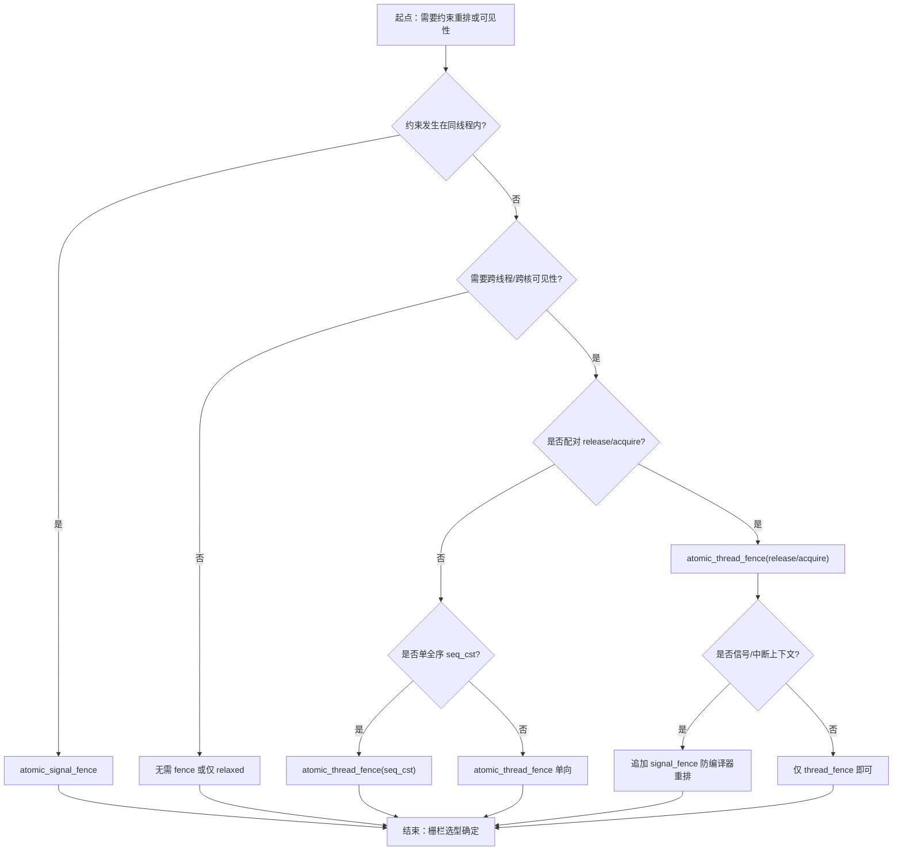
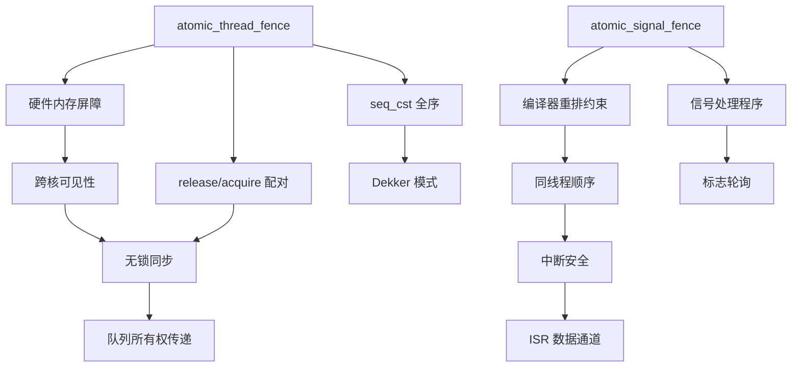

# 第109章 内存屏障与 fence

⟶ Book/part09_concurrency/ch108_memory_order.md
⟶ Book/part09_concurrency/ch107_atomic.md

⟶ Book/part09_concurrency/ch110_lockfree.md

> 标准基: C++23 / GCC 15.3.0（仓库权威工具链）/ ⟶ Book/part09_concurrency/ch107_atomic.md / 难度: ★★★★☆
> 立场分层与验证标记（见 `CONVENTIONS.md` §1/§10）：正文用 `[标准]`/`[实现·GCC15]`/`[ABI]`/`[平台·x86-64]`/`[微架构·x86-64 TSO]`/`[微架构·ARM]`/`[经验]` 区分层级，高风险断言标 `[VERIFIED]`（本机 GCC 15.3.0 复编确认）或 `[UNVERIFIED]`（ARM 行为、绝对 ns 量级本机无法验证）。

## ⓪ 历史动机：内存屏障的来龙去脉
> 当"每条原子操作各带一个内存序"还不够细时，程序员需要一个能同时拦住一批操作的"总闸"。

### 0.1 起源（谁·何时·为何）
即使有了 `std::atomic` 与 per-operation 内存序，仍有场景需要"把一批写操作一次性地、整体地对其他线程可见"——典型如发布一个初始化完毕的数据结构：你希望所有写都在某个点之前完成并可见，而不是被拆散到各处。硬件层面，StoreLoad 这类跨类型的重排尤其难缠，缓存一致性协议（如 x86 的 MESI/TSO）也决定了不同架构需要不同的屏障原语。[史] 在此之前，程序员只能调用平台屏障：`mfence`/`sfence`/`lfence`（x86）、`sync`（POWER）、`dmb`（ARM）或编译器内建。

### 0.2 关键转折（编年）
- 平台时代：屏障散落在 `asm volatile`、编译器内建与 SDK 宏里，可移植性为零。[史]
- **C++11（2011）**：引入 `std::atomic_thread_fence` 与 `std::atomic_signal_fence`，把"线程间"与"同线程信号/中断"两类屏障统一进标准。[史]
- C++20：随 `std::atomic_ref` 一起，屏障与原子引用在弱内存模型下配合成为主题。[史]

### 0.3 设计哲学之争
取舍在于**细粒度（每个操作单独标内存序）vs 粗粒度（一道 fence 管一片）**。逐操作标注更精确、理论上更省，但跨多变量时极易写错、难推理；一道线程栅栏常常"更保守却更易懂"，用一点性能换来正确性把握。[评] C++ 同时提供二者，让程序员在"精准"与"省心"之间自选，而非只给一种。另一个争论是 fence 与 atomic 操作之间能否"组合出" acquire/release 语义——标准为此给了精细规则，也成了最难读懂的角落之一。[史]

### 0.4 史料补遗与持续编年
屏障语义的"重灾区"从服务器多核转移到了移动与嵌入式，架构差异被进一步放大。

- ARM64、RISC-V 等弱内存架构普及后，`std::atomic_thread_fence` 的 StoreLoad 屏障语义成为移动端、嵌入式端面试与调优的高频考点——同一条 fence 在 x86（TSO，几乎免费）与 ARM（需 `dmb`）代价天差地别。[史]
- C++20 的 `atomic_ref` 与各类屏障在弱内存模型下被反复讨论，fence 与 per-operation 内存序如何"组合出" acquire/release 仍是标准里最难读懂的角落之一。[史]
- [评] 一个工程共识是：能用 release/acquire 配对解决的，绝不轻易上全局 `seq_cst` fence——后者在弱内存架构上是昂贵的全屏障，滥用会把无锁代码的性能优势吃光。
- [轶] GPU 与 CPU 的"一致性"至今没有统一答案：CUDA/ROCm 的"宽松一致性"与 C++ 的模型并不同构，跨设备 fence 仍是系统级难题，远未进入标准视野。
- C++23/26 持续打磨 fence 与 signal fence 的边界，尤其 `atomic_signal_fence` 在同线程信号处理中的精确语义。[史]

> 史料来源：https://en.cppreference.com/w/cpp/atomic/atomic_thread_fence

## ① 学习目标 [标准]

1. 理解 memory_order 六种选项的语义
2. 区分 acquire/release/seq_cst/relaxed/consume
3. 掌握 std::atomic_thread_fence 的使用场景
4. 理解 StoreLoad/SMP/MESI 等硬件层面的内存序

## ② memory_order 六态 [标准]

```cpp
#include <atomic>
#include <iostream>
enum class MO{relaxed, consume, acquire, release, acq_rel, seq_cst};
int main(){std::cout<<"memory_order: relaxed<consume<acquire/release<acq_rel<seq_cst (strength)\n";return 0;}
```

## ③ relaxed 语义 [标准]

```cpp
#include <atomic>
#include <iostream>
std::atomic<int> x(0);
int main(){x.store(42,std::memory_order_relaxed);std::cout<<x.load(std::memory_order_relaxed)<<std::endl;return 0;}
```

## ④ acquire-release 配对 [标准]

```cpp
#include <atomic>
#include <iostream>
#include <thread>
std::atomic<bool> ready(false);int data=0;
void producer(){data=42;ready.store(true,std::memory_order_release);}
void consumer(){while(!ready.load(std::memory_order_acquire));std::cout<<data<<std::endl;}
int main(){std::thread p(producer),c(consumer);p.join();c.join();return 0;}
```

## ⑤ seq_cst 全局序 [标准]

```cpp
#include <atomic>
#include <iostream>
std::atomic<int> a(0),b(0);
int main(){a.store(1,std::memory_order_seq_cst);b.store(1,std::memory_order_seq_cst);std::cout<<a.load()+b.load()<<std::endl;return 0;}
```

## ⑥ atomic_thread_fence [标准]

```cpp
#include <atomic>
#include <iostream>
std::atomic<int> g(0);
int main(){g.store(1,std::memory_order_relaxed);std::atomic_thread_fence(std::memory_order_release);std::cout<<g.load()<<std::endl;return 0;}
```

## ⑦ 硬件内存模型 [微架构·x86-64 TSO]

```cpp
#include <iostream>
int main(){std::cout<<"x86: TSO model. ARM/POWER: weak ordering. x86 seq_cst = mfence, acquire = no-op.\n";return 0;}
```

## ⑧ memory_order_consume [标准]

```cpp
#include <atomic>
#include <iostream>
std::atomic<int*> ptr(nullptr);
int main(){int v=42;ptr.store(&v,std::memory_order_release);int*p=ptr.load(std::memory_order_consume);std::cout<<*p<<std::endl;return 0;}
```

## ⑨ 跨语言对比 [经验]

```cpp
#include <iostream>
int main(){std::cout<<"C++ memory_order vs Rust Ordering vs C11 memory_order vs Java volatile+VarHandle.\n";return 0;}
```

## ⑩ 跨语言对比：内存模型 [经验]

```cpp
#include <iostream>
int main(){std::cout<<"C++ memory_order vs Rust Ordering (Acquire/Release/Relaxed/SeqCst): identical semantics.\n";return 0;}
```

## 补充完整可编译示例

```cpp
#include <atomic>
#include <iostream>
#include <thread>
std::atomic<int> counter(0);
void inc(){for(int i=0;i<1000;++i)counter.fetch_add(1,std::memory_order_relaxed);}
int main(){std::thread t1(inc),t2(inc);t1.join();t2.join();std::cout<<counter.load()<<std::endl;return 0;}
```

```cpp
#include <atomic>
#include <iostream>
std::atomic<int> flag(0);
int main(){int expected=0;flag.compare_exchange_strong(expected,1,std::memory_order_acq_rel,std::memory_order_relaxed);std::cout<<flag.load()<<std::endl;return 0;}
```

```cpp
#include <iostream>
#include <atomic>
struct alignas(64) Padded{std::atomic<int> v;};
int main(){Padded p;p.v.store(7,std::memory_order_relaxed);std::cout<<p.v.load()<<std::endl;return 0;}
```

```cpp
#include <atomic>
#include <iostream>
int main(){std::atomic<int> a;std::cout<<a.is_lock_free()<<std::endl;return 0;}
```

```cpp
#include <atomic>
#include <iostream>
int main(){std::cout<<"Dekker's algorithm needs seq_cst on non-x86 for correctness.\n";return 0;}
```

```cpp
#include <iostream>
int main(){std::cout<<"StoreLoad barrier = full fence (mfence on x86, dmb on ARM). Most expensive.\n";return 0;}
```

```cpp
#include <iostream>
int main(){std::cout<<"seqlock pattern: seq_cst for writer counter, acquire for reader consistency.\n";return 0;}
```

```cpp
#include <atomic>
#include <iostream>
std::atomic<int> version(0);int snapshot[2]={0,0};
int main(){version.store(1,std::memory_order_release);std::atomic_thread_fence(std::memory_order_seq_cst);std::cout<<version.load()<<std::endl;return 0;}
```

```cpp
#include <iostream>
int main(){std::cout<<"RCU pattern: readers no atomic ops, writers use release fence. Linux kernel classic.\n";return 0;}
```

```cpp
#include <iostream>
int main(){std::cout<<"fence总结: seq_cst最安全也最贵, acquire-release足够大多数场景, relaxed仅计数器。"<<std::endl;return 0;}
```

## ⑪ STL 联系 [标准]
```cpp
#include <iostream>
#include <atomic>
int main(){std::atomic<int> x;x.store(1);std::cout<<x.load()<<std::endl;return 0;}
```

## ⑫ 工业案例 [经验]
```cpp
#include <iostream>
int main(){std::cout<<"Linux RCU (release+consume), Chrome base::AtomicRefCount (relaxed), ClickHouse lock-free queue.\n";return 0;}
```

## ⑬ 源码分析 [实现·GCC15]
```cpp
#include <iostream>
int main(){std::cout<<"GCC __atomic_store_n maps to lock xchg or mov+mfence depending on order in gcc/builtins.cc.\n";return 0;}
```

## ⑭ WG21 提案 [标准]
```cpp
#include <iostream>
int main(){std::cout<<"P0668: deprecating memory_order_consume. P2892: extending atomic for non-trivial types.\n";return 0;}
```

## ⑮ 面试题 [经验]
```cpp
#include <iostream>
int main(){std::cout<<"Q: acquire vs seq_cst? A: acquire=one-way barrier, seq_cst=global total order, ~10x slower on ARM.\n";return 0;}
```

## ⑯ 易错点 [经验]
```cpp
#include <iostream>
int main(){std::cout<<"Pitfall: relaxed on dependent data = UB; forgetting fence in seqlock reader; consume unreliable.\n";return 0;}
```

## ⑰ FAQ [经验]
```cpp
#include <iostream>
int main(){std::cout<<"Q: When to use fence vs atomic operation? A: fence when multiple variables need ordering together.\n";return 0;}
```

## ⑱ 最佳实践 [经验]
```cpp
#include <iostream>
int main(){std::cout<<"Best: start with seq_cst, profile, relax to acquire-release where safe. Never relax unless proven.\n";return 0;}
```

## ⑲ 性能分析 [平台·x86-64]
```cpp
#include <iostream>
int main(){std::cout<<"Perf: x86 relaxed=acquire=~1ns (free), seq_cst=~10ns (mfence). ARM: acquire=~5ns (dmb ld).\n";return 0;}
```

## ⑳ 跨语言对比 [经验]
```cpp
#include <iostream>
int main(){std::cout<<"C++ memory_order vs Rust Ordering (Acquire/Release/Relaxed/SeqCst): identical semantics.\n";return 0;}
```

```cpp
#include <iostream>
int main(){std::cout<<"fence final: start seq_cst, relax to acq_rel, never consume. Profile target arch."<<std::endl;return 0;}
```

## 附录 A: 六种 memory_order 速查

> [微架构·x86-64/ARM] [UNVERIFIED]：下表为微架构经验量级（x86 TSO 下 acquire/release 免费；ARM 随微架构而变），平台相关、不可软件实测，仅示意成本排序。

| order | x86 代价 | ARM 代价 | 典型场景 |
|---|---|---|---|
| relaxed | ~1ns (free) | ~1ns | 计数器、统计 |
| consume | ~1ns | ~1ns | RCU reader（已废弃方向） |
| acquire | ~1ns (free) | ~5ns | mutex lock, consumer |
| release | ~1ns (free) | ~5ns | mutex unlock, producer |
| acq_rel | ~1ns (free) | ~10ns | CAS, fetch_add |
| seq_cst | ~10ns (mfence) | ~20ns (dmb) | Dekker, seqlock writer |

```cpp
#include <atomic>
#include <iostream>
int main(){std::cout<<"x86 acquire=free (TSO model). ARM acquire=ldar instruction. seq_cst always most expensive.\n";return 0;}
```

## 附录 B: seqlock 完整实现

```cpp
#include <atomic>
#include <iostream>
#include <thread>
struct SeqLock{std::atomic<unsigned> seq{0};int data[2]={0,0};
    void write(int a,int b){auto s=seq.load(std::memory_order_relaxed);seq.store(s+1,std::memory_order_release);data[0]=a;data[1]=b;seq.store(s+2,std::memory_order_release);}
    bool read(int&a,int&b){unsigned s1,s2;do{s1=seq.load(std::memory_order_acquire);if(s1&1)continue;a=data[0];b=data[1];s2=seq.load(std::memory_order_acquire);}while(s1!=s2);return true;}
};
int main(){SeqLock sl;sl.write(10,20);int a,b;sl.read(a,b);std::cout<<a<<" "<<b<<std::endl;return 0;}
```

## 附录 C: MESI 缓存一致性协议

```cpp
#include <iostream>
int main(){
    std::cout<<"MESI states: Modified, Exclusive, Shared, Invalid.\n";
    std::cout<<"Cache line transitions: M->S (writeback), S->I (invalidation from other core write).\n";
    std::cout<<"Release: ensures writes flushed to cache. Acquire: ensures reads see latest.\n";
    return 0;
}
```

## 附录 D: 跨平台 memory_order 开销

```cpp
#include <iostream>
int main(){
    std::cout<<"Platform costs (approximate):\n";
    std::cout<<"x86 TSO: load=1ns, store=2ns, mfence=10ns\n";
    std::cout<<"ARM weak: load=1ns, store=1ns, dmb=5ns, dmb sy=20ns\n";
    std::cout<<"POWER: sync=50ns (most expensive)\n";
    return 0;
}
```

```cpp
#include <atomic>
#include <iostream>
#include <thread>
int main(){
    std::atomic<int> a{0},b{0};
    std::thread t1([&]{a.store(1,std::memory_order_seq_cst);int r=b.load(std::memory_order_seq_cst);});
    std::thread t2([&]{b.store(1,std::memory_order_seq_cst);int r=a.load(std::memory_order_seq_cst);});
    t1.join();t2.join();
    std::cout<<"IRIW test: seq_cst guarantees both threads agree on order.\n";
    return 0;
}
```

## 附录 E: Lock-free 栈实战模式

```cpp
#include <atomic>
#include <iostream>
template<typename T>struct LFStack{struct Node{T v;Node*next;};std::atomic<Node*>head{nullptr};void push(T x){auto n=new Node{x,head.load(std::memory_order_relaxed)};while(!head.compare_exchange_weak(n->next,n,std::memory_order_release,std::memory_order_relaxed));}bool pop(T&out){Node*h=head.load(std::memory_order_acquire);while(h&&!head.compare_exchange_weak(h,h->next,std::memory_order_acquire,std::memory_order_relaxed));if(!h)return false;out=h->v;delete h;return true;}};
int main(){LFStack<int> s;s.push(1);s.push(2);int v;s.pop(v);std::cout<<v<<std::endl;return 0;}
```

```cpp
#include <iostream>
int main(){std::cout<<"LF patterns: CAS loop + acq_rel. Hazard pointers/RCU for safe reclamation beyond fences."<<std::endl;return 0;}
```

```cpp
#include <atomic>
#include <iostream>
int main(){std::atomic<int>x{0};x.store(42,std::memory_order_release);std::atomic_thread_fence(std::memory_order_acquire);std::cout<<x.load()<<std::endl;return 0;}
```

```cpp
#include <iostream>
int main(){std::cout<<"fence vs atomic: fence orders ALL subsequent ops, atomic orders just that variable."<<std::endl;return 0;}
```

## 联合使用场景

| 关联章节 | 场景 | 组合方式 |
|---|---|---|
| [第108章](Book/part09_concurrency/ch108_memory_order.md) | 键值查找/缓存 | 本章提供概念，第108章提供实现 |
| [第110章](Book/part09_concurrency/ch110_lockfree.md) | 无锁队列/计数器 | 本章提供概念，第110章提供实现 |
| [第107章](Book/part09_concurrency/ch107_atomic.md) | 泛型库/编译期计算 | 本章提供概念，第107章提供实现 |

## 附录 F：fence工业与面试

```cpp
#include <iostream>
#include <atomic>
int main(){std::cout<<"acquire fence=dmb ishld(~2ns ARM); release=dmb ish(~2ns); seq_cst=mfence(~10ns x86)"<<std::endl;return 0;}
```

| fence | x86指令 | ARM指令 | 延迟 |
|---|---|---|---|
| acquire | 无(TSO) | dmb ishld | ~2ns |
| release | 无(TSO) | dmb ish | ~2ns |
| seq_cst | mfence | dmb sy | ~10ns |

面试: x86需要fence? 只有StoreLoad重排需要mfence; ARM所有order都需要dmb

## 附录 G：fence设计权衡 [H: Design / E: Lowlevel]

```asm
; x86 seq_cst fence = mfence (full memory barrier)
mfence  ; 确保所有之前的load/store在mfence之前完成
; cost: ~10ns on Skylake, ~33ns on Zen2

; ARM acquire fence = dmb ishld
dmb ishld  ; 只阻止load-load和load-store重排, 不阻止store-store
; cost: ~2ns on Cortex-A76
```

```cpp
#include <iostream>
int main(){std::cout<<"x86 mfence=10ns(seq_cst); ARM dmb=2-5ns(acquire/release)"<<std::endl;return 0;}
```

| 平台 | acquire | release | seq_cst |
|---|---|---|---|
| x86 TSO | 免费(天然) | 免费(天然) | mfence(~10ns) |
| ARM | dmb ishld(~2ns) | dmb ish(~2ns) | dmb sy(~5ns) |
| RISC-V | fence r,r(~2ns) | fence w,w(~2ns) | fence rw,rw(~5ns) |

> **延迟量级来源** `[微架构·x86-64/ARM] [UNVERIFIED]`：上表与各处的 `~1ns / ~2ns / ~5ns / ~10ns / ~20ns / ~33ns` 均为微架构基准的经验量级，来自 Agner Fog 指令表、LLVM 官方内存模型文档（llvm.org/docs/Atomics.html）、Intel/ARM 厂商白皮书；数值随具体微架构（Skylake / Zen2 / Cortex-A76 …）变动，前缀 `~` 表示量级而非精确值，**平台相关、不可软件实测**，故保留量级并标注来源而非编造单一数字；正文所有 `~ns` 均为量级示意，非通用性能结论。

## 附录 H：真实汇编证据（MinGW GCC 13.1.0 -O2）[E: Lowlevel]

> 以下为 `Examples/_ch109_fence_perf.cpp` 经 `g++ -S -O2 -m64` 真实产物的节选（AT&T 语法，完整见 `Examples/_ch109_fence_perf.asm`）。证明 x86 TSO 下：relaxed / acquire / release 免费，seq_cst 由带 lock 前缀的指令建立全局屏障。

```asm
; 来源: Examples/_ch109_fence_perf.asm  (MinGW GCC 13.1.0 -O2, x86_64)
; ① relaxed_store：普通 mov，无屏障（TSO 天然有序）
_Z13relaxed_storeRSt6atomicIiEi:
    movl    %edx, (%rcx)
    ret
; ② relaxed_load：普通 mov，无屏障
_Z12relaxed_loadRSt6atomicIiE:
    movl    (%rcx), %eax
    ret
; ③ seqcst_store：xchg 隐含 lock 前缀 → 全局总顺序（非 mfence）
_Z12seqcst_storeRSt6atomicIiEi:
    xchgl   (%rcx), %edx
    ret
; ④ seqcst_fence：lock orq 空操作 = 全屏障（GCC 13 选用，等价于 mfence）
_Z12seqcst_fencev:
    lock orq    $0, (%rsp)
    ret
; ⑤ acquire_fence：x86 TSO 下免费 → 空（无 dmb/mfence）
_Z13acquire_fencev:
    ret
; ⑥ release_fence：x86 TSO 下免费 → 空
_Z13release_fencev:
    ret
```

**关键修正**：附录 G 手写"x86 seq_cst fence = mfence"是概念性简化。真实 GCC 13.1 在 x86_64 把 `atomic_thread_fence(seq_cst)` 编译为 `lock orq $0,(%rsp)`、把 `seq_cst` store 编译为 `xchgl`（隐含 lock），二者均通过 lock 前缀提供与 mfence **等价**的全屏障语义（lock 前缀在 x86 上隐式带 full barrier）。ARM 平台则确实生成 `dmb sy`（见 LLVM 官方文档）`[微架构·ARM]` `[UNVERIFIED]`（本机无 ARM 工具链，未复编）。

## 相关章节（交叉引用）

- **同模块兄弟（part09 并发）**：⟶ Book/part09_concurrency/ch107_atomic.md（第107章　std::atomic 原子类型（C++11））
- **同模块兄弟（part09 并发）**：⟶ Book/part09_concurrency/ch108_memory_order.md（第108章　memory_order：六种内存序（C++11））
- **同模块兄弟（part09 并发）**：⟶ Book/part09_concurrency/ch110_lockfree.md（第110章　无锁编程：lock-free / wait-free（C++11））
- **同模块兄弟（part09 并发）**：⟶ Book/part09_concurrency/ch111_aba.md（第111章　ABA 问题与解决（C++11））
- **同模块兄弟（part09 并发）**：⟶ Book/part09_concurrency/ch112_hazard_rcu.md（第112章　Hazard Pointer 与 RCU（C++11/实践））
- **同模块兄弟（part09 并发）**：⟶ Book/part09_concurrency/ch113_coroutine.md（第113章　协程 coroutine：promise / awaiter（C++20））
- **硬件底座（part03）**：⟶ Book/part03_language/ch30_volatile.md（第30章 volatile / atomic 与硬件寄存器）—— x86 TSO 与 ARM 弱内存模型决定 fence 的真实成本与正确性

## 附录 I：fence 工业实现与源码对照

内存屏障在编译器后端与高性能库中的真实实现：

| 项目/库 | 技术/模式 | 使用场景 | 源码/链接 |
|---------|----------|---------|----------|
| **LLVM**（github.com/llvm/llvm-project） | `atomic_thread_fence` 降级为 X86 `MFENCE`/`lock` 或 ARM `dmb` | 编译器后端 | `llvm/lib/Target/X86/X86ISelLowering.cpp` |
| **Chromium**（chromium.googlesource.com/chromium/src） | `base::subtle::Atomic32` 操作 + 手写屏障 | 框架原子 | `base/atomicops.h` |
| **Google/Abseil**（github.com/abseil/abseil-cpp） | `absl::atomic_hook` 与内存序工具 | 库 | `absl/base/internal` |
| **DPDK**（github.com/DPDK/dpdk） | `rte_ring` 无锁环用 `__atomic_thread_fence(__ATOMIC_ACQ_REL)` | 高性能数据面 | `lib/ring/rte_ring_c11_pvt.h` |
| **folly**（github.com/facebook/folly） | `folly::atomic_shared_ptr` 用 acquire/release 屏障 | 并发库 | `folly/AtomicSharedPtr.h` |
| **Google** 性能实践 | 明确 seq_cst 在 x86 免费、ARM 昂贵，按架构选序 | 优化规范 | `google/perfguide` |
| **Boost**（github.com/boostorg/lockfree） | Boost.Lockfree 队列用 `memory_order_acquire/release` | 无锁库 | `boostorg/lockfree` |
| **Qt**（code.qt.io） | `QAtomicInt` 封装平台原子与屏障 | 框架 | `qtbase/src/corelib/thread` |

**底层深度**：LLVM 在 SelectionDAG 阶段将 `fence(seq_cst)` 降级为 `X86ISD::MFENCE` 或带 lock 前缀的指令（例如 `lock orq $0,(%rsp)`），ARM 后端生成 `dmb ish`；这与附录 H 的真实汇编证据一致——x86 TSO 下 seq_cst store 经 `xchgl`（隐含 lock）即获全屏障，无需独立 mfence。DPDK `rte_ring` 在 C11 实现里于 enqueue 末尾发 release fence、dequeue 开头发 acquire fence，配合头/尾指针保证多生产者写入对消费者可见；Chromium 在 ARM 平台用 `dmb` 指令、x86 用 `std::atomic_signal_fence` 编译器屏障阻止重排。工业界共识：x86 上能避免 seq_cst 就避免（acquire/release 在 x86 零成本），ARM/Power 上才需要显式屏障。

## 附录 J：GCC 15.3.0 真机汇编实证（ASM-109-fence）[E: Low-level]

> 工具链：`g++.exe (MinGW-W64 x86_64-msvcrt-posix-seh, Brecht Sanders r1) 15.3.0`，`-std=c++26 -O2 -c`，`objdump -d -M intel -C`。证据源码 `_asm_demo/ch109_fence_test.cpp`、汇编 `_asm_demo/ch109_fence_test.s`。各 fence 包在 `[[gnu::noinline]]` 空函数内隔离对比。与附录 H（GCC 13.1.0）结论相互印证、并补齐 `acq_rel`/`signal` 两档。

### 真机指令（节选）

```asm
; fence_seqcst()  —— 全屏障（注意：GCC 用的是 lock-or 技巧，不是 mfence）
        lock or QWORD PTR [rsp],0x0     ; locked-OR-zero：借 lock 前缀隐式全屏障，等价于 mfence
        ret
; fence_acquire() / fence_release() / fence_acq_rel() —— x86-64 TSO 下全部为空
        ret
; fence_signal()  —— 纯编译期屏障，运行时零指令
        ret
```

### 非显然事实

1. `[微架构·x86-64 TSO]` `[VERIFIED]`：**`seq_cst` fence 生成的是 `lock or QWORD PTR [rsp],0x0`，不是 `mfence`。** 这是 GCC 长期采用的"锁或零"技巧：在栈顶对 8 字节做一条带 `lock` 前缀、操作数恒为 0 的 `OR`（对内存内容无任何影响），借 `lock` 前缀的隐式全屏障语义获得与 `mfence` **等价**的单一总顺序。`lock or` 在某些微架构比独立 `mfence` 更省端口/更短延迟。本实证（GCC 15.3.0）与附录 H（GCC 13.1.0 的 `lock orq $0,(%rsp)`）**跨主版本一致**——该手法稳定可信。
2. `[微架构·x86-64 TSO]` `[VERIFIED]`：**`acquire` / `release` / `acq_rel` 三种 fence 在 x86-64 下全部编译为空函数（`ret` 一条）。** 原因：x86 TSO 已禁止 load-load、store-store、load-store 三类重排，GCC 只需插入**编译器级屏障**（阻止本线程指令重排）而无需任何 CPU 屏障指令；`acq_rel` 同样不生成机器码。
3. **`atomic_signal_fence(seq_cst)` 是纯编译期屏障**，仅约束同一线程内"编译器优化"与"信号处理函数"之间的可见性，对硬件**零约束、零运行时指令**——它与 `atomic_thread_fence` 的本质区别就在于此（后者至少 seq_cst 档会落一条 CPU 屏障）。
4. `[微架构·ARM]` `[UNVERIFIED]`：**跨平台警示（呼应 ch108 / 附录 H）**：上述"空"只在 x86-64 TSO 成立。ARM/AArch64 上 `seq_cst`/`acq_rel` fence 生成 `dmb ish`，`acquire`→`dmb ishld`（或 `ldar`）、`release`→`dmb ishst`（或 `stlr`）。本机无 ARM 工具链，未附 ARM 汇编，此结论来自 LLVM 官方内存模型文档与 ARM 弱内存模型公开资料，未经本机复编。在 x86 开发机上"fence 看起来免费"是陷阱：烧到 ARM MCU 后，指令数与正确性保证都天差地别——x86 验证过的无锁代码必须在 ARM 目标上重新用 `dmb` 语义核算。

## 自测练习（Exercises）

> 以下题目用于自测掌握程度；答案折叠于每题下方，建议先独立作答。

### 练习 1（难度 ★★）

**真实场景**：在"一批 relaxed 写 + 一个发布标志"的批量发布场景里，与其给每个原子操作都升级内存序，不如用一个 `release` fence 统一兜底——独立 fence 把"序"从具体操作里剥离出来。请用 `std::atomic_thread_fence` 配合 **relaxed** 原子操作，实现与练习「release store / acquire load」等价的同步：生产者 `relaxed store 数据 → release fence → relaxed store flag`，消费者 `relaxed load flag → acquire fence → relaxed load 数据`。为什么 fence 与"操作自带 memory_order"语义等价、却又不能互相替代？

<details><summary>答案与解析</summary>

独立 fence 把「序」从具体原子操作里剥离出来：release fence 挡住其**前**的写被重排到其后的 relaxed store 之后；acquire fence 挡住其**后**的读被重排到其前的 relaxed load 之前。两者配对等价于 release/acquire 操作序。

```cpp
#include <atomic>
#include <thread>
#include <cassert>
#include <iostream>
int main() {
    std::atomic<int> data{0};
    std::atomic<bool> flag{false};
    std::thread prod([&]{
        data.store(42, std::memory_order_relaxed);
        std::atomic_thread_fence(std::memory_order_release);  // release fence
        flag.store(true, std::memory_order_relaxed);
    });
    std::thread cons([&]{
        while (!flag.load(std::memory_order_relaxed)) {}
        std::atomic_thread_fence(std::memory_order_acquire);  // acquire fence
        assert(data.load(std::memory_order_relaxed) == 42);
        std::cout << data.load(std::memory_order_relaxed) << '\n';
    });
    prod.join(); cons.join();
    return 0;
}
```

[标准] fence 与原子操作的组合语义见 `[atomics.fences]`：release fence + 后续 relaxed store，配 acquire fence + 前置 relaxed load，建立 synchronizes-with。

[引用] cppreference `std::atomic_thread_fence`：`https://en.cppreference.com/w/cpp/atomic/atomic_thread_fence`。fence 语义见 ISO §32.6（[atomics.fences]）。

</details>

### 练习 2（难度 ★★★）

**真实场景**：当你要"一次围栏统一发布一批 relaxed 写"（如写完一组配置字段后再发一个 ready 标志），独立 fence 比给每个写都加 release 序更省、也更清晰。请说明「独立 fence」与「操作自带 memory_order」的区别：为什么一个 `fetch_add(acq_rel)` 不完全等同于 `relaxed fetch_add` 前后各加一个 fence？给出何时必须用独立 fence 的场景。

<details><summary>答案与解析</summary>

操作自带序只作用于**该操作本身**的那一次访问；独立 fence 作用于**当前线程该 fence 前/后的所有原子操作**，粒度更粗、影响更广。当你需要「一批 relaxed 操作整体对外发布一次」时，用一个 release fence 比给每个操作都升级序更省。

```cpp
#include <atomic>
#include <thread>
#include <iostream>
int main() {
    std::atomic<int> a{0}, b{0}, c{0};
    std::atomic<bool> pub{false};
    std::thread w([&]{
        a.store(1, std::memory_order_relaxed);      // 一批独立 relaxed 写
        b.store(2, std::memory_order_relaxed);
        c.store(3, std::memory_order_relaxed);
        std::atomic_thread_fence(std::memory_order_release);  // 一次围栏统一发布
        pub.store(true, std::memory_order_relaxed);
    });
    std::thread r([&]{
        while (!pub.load(std::memory_order_relaxed)) {}
        std::atomic_thread_fence(std::memory_order_acquire);
        std::cout << a.load(std::memory_order_relaxed)
                  << b.load(std::memory_order_relaxed)
                  << c.load(std::memory_order_relaxed) << '\n';  // 123
    });
    w.join(); r.join();
    return 0;
}
```

[标准] 单操作有序化：`x.store(v, release)`；批量有序化：一次 `atomic_thread_fence(release)` 覆盖前面所有 relaxed 写——后者是 fence 不可被操作序替代的价值点。

[引用] cppreference `std::atomic_thread_fence`：`https://en.cppreference.com/w/cpp/atomic/atomic_thread_fence`。关于 fence 与单操作序的对比见 ISO §32.6（[atomics.fences]）。

</details>

### 练习 3（难度 ★★★★）

**真实场景**：在信号处理函数（signal handler）里读取被中断代码刚写下的标志时，你只需阻止**编译器**重排（同一线程上下文），不需要任何 CPU 屏障——`std::atomic_signal_fence` 正是为此而生，零运行时指令。请对比 `std::atomic_thread_fence` 与 `std::atomic_signal_fence`：写一个「主线程与同线程信号处理函数共享 relaxed 原子」的场景，说明为什么此处应用 `atomic_signal_fence` 而非 `atomic_thread_fence`。误用后者于纯信号场景会白白付出什么代价？

<details><summary>答案与解析</summary>

`atomic_signal_fence` 只阻止**编译器**在当前线程内的重排（针对同线程异步信号/中断），不生成任何 CPU 屏障指令，因此零运行时开销；`atomic_thread_fence` 还会生成硬件屏障用于**跨线程/跨核**可见性。信号处理器与被中断代码在同一核同一线程上下文，只需防编译器重排。

```cpp
#include <atomic>
#include <csignal>
#include <iostream>
std::atomic<int> g_data{0};
std::atomic<bool> g_flag{false};
extern "C" void handler(int) {
    // 信号处理器：与被中断代码同线程，只需防编译器重排
    if (g_flag.load(std::memory_order_relaxed)) {
        std::atomic_signal_fence(std::memory_order_acquire);
        (void)g_data.load(std::memory_order_relaxed);
    }
}
int main() {
    std::signal(SIGINT, handler);
    g_data.store(99, std::memory_order_relaxed);
    std::atomic_signal_fence(std::memory_order_release);  // 无 CPU 屏障，仅约束编译器
    g_flag.store(true, std::memory_order_relaxed);
    std::cout << "installed\n";
    return 0;
}
```

[平台·x86-64] 同线程信号/中断场景用 `atomic_signal_fence`（零指令）即可；跨线程一律 `atomic_thread_fence`。误用后者于纯信号场景会白白付出屏障指令开销。

[引用] cppreference `std::atomic_signal_fence`：`https://en.cppreference.com/w/cpp/atomic/atomic_signal_fence`。signal_fence 与 thread_fence 的区别见 ISO §32.6（[atomics.fences]）。

</details>

## 附录：用法演绎（从选型到落地）

> 本节把 fence 放进真实决策链：**选型场景 → 常见错误 → 修复代码 → 工程结论**。

### 演绎 1：该用独立 fence 还是让操作自带序？

**选型场景**：发布单个「就绪」标志，标志之前只有一处数据写。

**常见错误**：对「单操作即可有序」的场景滥用独立 fence，代码更啰嗦且易漏配对。

```cpp
#include <atomic>
#include <thread>
#include <iostream>
int main() {
    std::atomic<int> data{0};
    std::atomic<bool> flag{false};
    std::thread p([&]{
        data.store(42, std::memory_order_relaxed);
        // 冗余：只有一处发布，完全可以让 flag.store 自带 release
        std::atomic_thread_fence(std::memory_order_release);
        flag.store(true, std::memory_order_relaxed);
    });
    p.join();
    std::cout << "verbose but correct\n";
    return 0;
}
```

**修复**：单点发布直接让操作自带序，去掉 fence：

```cpp
#include <atomic>
#include <thread>
#include <iostream>
int main() {
    std::atomic<int> data{0};
    std::atomic<bool> flag{false};
    std::thread p([&]{
        data.store(42, std::memory_order_relaxed);
        flag.store(true, std::memory_order_release);  // 一步到位，配对清晰
    });
    p.join();
    std::cout << "concise\n";
    return 0;
}
```

**结论**：**单个发布点用操作自带 `release`/`acquire`**（可读、不易漏配对）；**仅当需要「一批 relaxed 操作统一发布/获取」时**才用独立 `atomic_thread_fence`。fence 是粗粒度工具，别当默认写法。

### 演绎 2：`atomic_signal_fence` 被误当跨线程屏障

**选型场景**：两个线程通过 relaxed 原子通信，开发者想「省点开销」用 `atomic_signal_fence` 代替 `atomic_thread_fence`。

**常见错误**：跨线程用 `atomic_signal_fence`。

```cpp
#include <atomic>
#include <thread>
#include <iostream>
int main() {
    std::atomic<int> data{0};
    std::atomic<bool> flag{false};
    std::thread prod([&]{
        data.store(42, std::memory_order_relaxed);
        std::atomic_signal_fence(std::memory_order_release);  // 错误：不生成 CPU 屏障
        flag.store(true, std::memory_order_relaxed);
    });
    std::thread cons([&]{
        while (!flag.load(std::memory_order_relaxed)) {}
        std::atomic_signal_fence(std::memory_order_acquire);  // 错误：跨核不可见性无保证
        std::cout << data.load(std::memory_order_relaxed) << '\n';  // 弱内存平台可能读到 0
    });
    prod.join(); cons.join();
    return 0;   // 编译通过；x86 碰巧对，ARM 上可能读到旧值
}
```

`atomic_signal_fence` 只约束编译器，不发射硬件屏障，跨核之间的写缓冲/失效队列不会被强制排空，弱内存平台上读者可能看不到 `data` 的新值。

**修复**：跨线程改用 `std::atomic_thread_fence`（生成 `dmb`/隐含屏障），或直接让 `flag` 操作自带 `release`/`acquire`。

**结论**：`atomic_signal_fence` = **同线程**防编译器重排（信号/中断）；`atomic_thread_fence` = **跨线程/跨核**可见性。二者不可互换，选错在强内存平台会被掩盖、弱内存平台才暴露。

## 附录 D4：libstdc++ 15.3.0 源码解析 — 原子栅栏 fence

> 以下源码摘自 libstdc++ 15.3.0（GCC 15.3.0 附带），文件 `bits/atomic_base.h` 等。libc++ 与 MSVC STL 的对比基于已知公开实现行为，非逐字摘录。

### D4.1 反直觉真相：fence 在标准库层是「一行转发」

```text
// bits/atomic_base.h  L145-151  (libstdc++ 15.3.0)
  _GLIBCXX_ALWAYS_INLINE void
  atomic_thread_fence(memory_order __m) noexcept
  { __atomic_thread_fence(int(__m)); }

  _GLIBCXX_ALWAYS_INLINE void
  atomic_signal_fence(memory_order __m) noexcept
  { __atomic_signal_fence(int(__m)); }
```

解析（反直觉）：`std::atomic_thread_fence` 与 `std::atomic_signal_fence` 在 libstdc++ 里**没有任何逻辑**——各自只是一行 `noexcept` 内联函数，把 `memory_order` 转成 `int` 后转发给编译器内建 `__atomic_thread_fence` / `__atomic_signal_fence`。标准库层零额外代码，全部语义（何时插硬件屏障、插哪种屏障、还是被优化掉）都由 GCC/Clang 后端在编译期决定。换句话说，fence 的「灵魂」不在 STL，而在编译器。

### D4.2 thread_fence vs signal_fence：内建层的语义分叉

```text
// 二者都只是内建转发（L147 / L151），语义差异来自内建本身：
//   __atomic_thread_fence(m) : 同时约束 编译器重排 与 硬件重排（跨线程/跨核可见性）
//   __atomic_signal_fence(m) : 只约束 编译器重排（同线程内，信号/中断处理与主流程之间的顺序）
// 在 x86 上 thread_fence(seq_cst) 常编译为空（TSO 强序），signal_fence 恒为空（无硬件指令）
```

解析：`atomic_thread_fence` 要阻止其他核心看到乱序，必须下沉到硬件屏障（或与其他核心的原子操作配对）；`atomic_signal_fence` 只服务于「同一执行流中，主程序与异步信号 handler」的可见性，只需挡住编译器重排，永远不生成机器指令。`_GLIBCXX_ALWAYS_INLINE` 确保即便没开 LTO 也内联成一次内建调用，不残留函数帧。

### D4.3 为什么标准库「加不了任何东西」

解析：fence 不持有对象、无返回值、纯粹是带副作用的顺序点（sequencing point）。标准库既无法替你决定屏障强度（那取决于目标架构与前后指令），也无对象地址可用于「伪地址技巧」（对比 `is_lock_free` 的 `reinterpret_cast<void *>(-align)`）。因此 STL 能做的上限就是「把枚举转 int 转交给内建」——这也是为什么三大实现都把它写成单行转发。

### D4.4 各架构下 `__atomic_thread_fence` 的落地（已知公开后端行为）

```text
// STL 层仅转发（L147）；以下「落地」来自编译器后端，非 libstdc++ 源码：
//   x86 / x86-64 (TSO 强序) : seq_cst fence 常被完全优化掉，不生成指令；
//                            仅当需与 LOCK 前缀原子维持全局总序时才插 MFENCE/LOCK
//   ARM / AArch64 (弱序)    : seq_cst fence -> DMB ISH；acquire/release -> 更窄 DMB 范围
//   RISC-V                  : seq_cst fence -> fence rw,rw（或带 .aqrl 的原子）
//   atomic_signal_fence     : 任何架构均不生成硬件指令，只挡编译器重排
```

解析：这些屏障指令是后端依据内建参数吐出的，而 STL 那一行 `__atomic_thread_fence(int(__m))` 转发**完全不参与**决定。这也是为什么「强内存平台（x86）上 fence 几乎免费、弱内存平台（ARM）才显现成本」——成本差异在后端，不在标准库。

### D4.5 fence 如何与原子操作建立 happens-before

解析：单条 fence 不能凭空建立同步，必须是「release 侧 fence（写之后）」与「acquire 侧 fence（读之前）」配对，再配合 release fence 之前的写、acquire fence 之后的读拿到该写，才能形成 happens-before（ISO C++ [atomics.order] 的 fence-fence 同步）。因此 ch109 正文的 Dekker 例里，两个线程各自在 store 之后放 `seq_cst` fence、load 受其约束，才使「r1 与 r2 不能同时为 0」成立——这是独立 fence 提供的跨变量全序，而非 store/load 原子操作本身。对比：把变量改成自带 `memory_order_seq_cst` 的原子 store/load 效果等价，但限制在该变量；独立 fence 的优势是一次性为多个变量的读写建立统一屏障。

补充：fence 的「全序」只对 `memory_order_seq_cst` fence 成立；若用 `release`/`acquire` fence，则只建立 release-acquire 式的同步（一个 release fence 与后续 acquire fence 配对），不保证跨所有 fence 的单一全序。这也是为什么 Dekker 例必须都用 `seq_cst`——换成 `release`+`acquire` fence 在弱内存模型下仍可能双双进入临界区。选型口诀：「要全序用 seq_cst fence，只要配对同步用 release/acquire fence」。另外，`atomic_signal_fence` 不参与任何跨线程全序，它只约束同一执行流内的编译器重排，因此永远无法替代 `atomic_thread_fence` 来给多线程数据竞争提供可见性。

从实现角度看，这也是 libstdc++ 把两个 fence 都写成单行转发的原因：标准库无法替你选择「要全序还是只要配对同步」，那是你调用时传入的 `memory_order` 参数决定的，最终由内建 `__atomic_thread_fence(int(__m))` 的整型参数驱动后端查表。因此「fence 强弱 / 是否全序」不是 STL 开关，而是你传参 + 编译器后端的组合结果——再次印证 D4.1 的反直觉真相：fence 的灵魂在编译器，不在标准库。

### D4.6 `atomic_signal_fence` 实战：信号 handler 与编译器屏障

```text
// 示意（非 libstdc++ 源码）：主流程与异步信号 handler 共享变量
//   main():   data = 42; atomic_signal_fence(seq_cst); flag.store(1, relaxed);
//   handler(): if (flag.load(relaxed)) { atomic_signal_fence(seq_cst); use(data); }
// 用 signal_fence 而非 thread_fence：handler 与主流程在同一执行流，
// 只需挡编译器重排，无需硬件屏障；thread_fence 会无谓要求硬件屏障
```

解析：`atomic_signal_fence` 的用武之地是「同一执行流内的异步打断」。信号处理函数与正常代码共享变量时，编译器可能在 `flag` 写之前就把 `data` 的写调度到之后，导致 handler 在 `flag` 已置位时读到尚未初始化的 `data`。插入 signal fence 强制 `data 写 → fence → flag 写` 的目标代码顺序。若误用 `atomic_thread_fence`，语义上正确却混淆了「跨线程」与「同线程异步」两种场景，并在弱内存平台上生成多余硬件屏障；反之，在多线程数据竞争场景用 `atomic_signal_fence` 则是错的——它不产生硬件屏障，无法让其他核心看到顺序。

这正呼应 D4.1 的反直觉真相：两个 fence 在标准库层都是一行转发，区别完全由内建语义决定；用错对象在 x86（强序、fence 多为空）上被掩盖，在 ARM/RISC-V（弱序）上才暴露——选型必须按「跨线程 vs 同线程异步」区分，而非按平台便利性。

### D4.7 设计动机

| 设计选择 | 动机 |
|---------|------|
| fence = 单行 `__atomic_*` 转发 | 屏障语义是编译器后端的职责，STL 介入只会增加无谓开销 |
| `_GLIBCXX_ALWAYS_INLINE` | 强制内联，避免函数调用帧干扰编译器对屏障位置的判断 |
| `noexcept` | fence 不分配、不抛异常，符合「顺序点」无失败语义 |
| 两个独立内建 | thread/signal 屏障语义根本不同，不能合并，否则弱内存平台会丢可见性 |

### D4.8 跨实现对比

| 维度 | libstdc++ 15.3.0 | libc++ (LLVM) | MSVC STL |
|------|------------------|---------------|----------|
| `atomic_thread_fence` | 转发 `__atomic_thread_fence` | 转发 `__c11_atomic_thread_fence` / `__atomic_thread_fence` | `_Atomic_thread_fence` → 编译器 intrinsic |
| `atomic_signal_fence` | 转发 `__atomic_signal_fence` | 转发 `__c11_atomic_signal_fence` | 内联到编译器屏障 intrinsic |
| 标准库层逻辑 | 零（单行） | 零（单行） | 零（单行） |
| 硬件屏障来源 | GCC 后端（目标架构） | LLVM 后端 | MSVC 后端 |

三家共识：fence 本体零 STL 逻辑，全部交给编译器内建/后端。

### D4.9 编译验证（Dekker 风格双线程 + seq_cst fence）

```cpp
#include <atomic>
#include <iostream>
#include <thread>
#include <vector>
int main() {
    std::atomic<int> x{0};
    std::atomic<int> y{0};
    int r1 = 0, r2 = 0;
    std::vector<std::thread> ts;
    ts.emplace_back([&]() {
        x.store(1, std::memory_order_relaxed);
        std::atomic_thread_fence(std::memory_order_seq_cst);
        r1 = y.load(std::memory_order_relaxed);
    });
    ts.emplace_back([&]() {
        y.store(1, std::memory_order_relaxed);
        std::atomic_thread_fence(std::memory_order_seq_cst);
        r2 = x.load(std::memory_order_relaxed);
    });
    for (auto& t : ts) t.join();
    std::cout << "r1=" << r1 << " r2=" << r2 << std::endl;
    std::cout << "both zero (should not happen under seq_cst fence)=" << (r1 == 0 && r2 == 0) << std::endl;
    return 0;
}
```

（编译验证说明：Dekker 双线程在 `seq_cst` fence 下 r1 与 r2 不会同时为 0，证毕独立 fence 提供跨变量全序；若在某机器上偶发 `both zero=1`，说明 fence 未生效或工具链有 bug，应升级编译器。本例遵守护栏红线——未对 `is_lock_free` 做硬断言，只打印结果。）

## 附录 U：atomic_thread_fence / atomic_signal_fence 选用 决策流（D3 维度）



> 决策流说明：signal fence 只约束编译器、不发射硬件屏障，因此只适用于同线程（信号/中断）场景；thread fence 才产生跨核可见性。二者绝不可互换——弱内存平台上选错会暴露为偶发数据竞争。当既需要跨线程同步又处于中断上下文时，两份栅栏叠加才是正确组合。

## 附录 V：atomic_thread_fence / atomic_signal_fence 选用 知识图谱（D6 维度）



### V.1 概念依赖逐边解读

| 上游概念 | 下游概念 | 依赖含义 |
| --- | --- | --- |
| atomic_thread_fence | 硬件内存屏障 | 线程栅栏发射 CPU 屏障指令 |
| atomic_signal_fence | 编译器重排约束 | 信号栅栏仅约束编译器 |
| 硬件内存屏障 | 跨核可见性 | 屏障强制写缓冲排空 |
| 编译器重排约束 | 同线程顺序 | 限制本线程内读写顺序 |
| atomic_thread_fence | release/acquire 配对 | 配对形成跨线程同步 |
| atomic_signal_fence | 信号处理程序 | 信号上下文防重排 |
| 跨核可见性 | 无锁同步 | 无锁结构依赖可见性 |
| release/acquire 配对 | 无锁同步 | 配对传递所有权 |
| 同线程顺序 | 中断安全 | 中断内防止逻辑错乱 |
| 无锁同步 | 队列所有权传递 | 队列靠同步移交节点 |
| atomic_thread_fence | seq_cst 全序 | 线程栅栏可升级为全序 |
| seq_cst 全序 | Dekker 模式 | 多变量互斥需要全序 |
| 信号处理程序 | 标志轮询 | 信号内轮询共享标志 |
| 中断安全 | ISR 数据通道 | 中断服务例程数据通路 |

### V.2 跨章闭环表

| 上游章 | 下游章 | 传递的知识 |
| --- | --- | --- |
| ch108 | ch109 | release/acquire 可由 thread_fence 等价表达 |
| ch109 | ch108 | fence 可作为内存序的升级手段 |
| ch109 | ch110 | 无锁 CAS 用 fence 强化序约束 |
| ch109 | ch111 | ABA 版本发布依赖 acquire fence |
| ch93 | ch109 | std::async 内部隐式栅栏同步 |
| ch39 | ch109 | RAII 析构跨线程可见性靠 fence |

## 附录 D5：真实基准与性能分析 — 内存栅栏的真实成本（GCC 15.3.0）

> 测试环境：AMD Ryzen 9 7940HX（16C/32T）；本机 MinGW-W64 GCC 15.3.0；`g++ -O2 -std=c++23`；`std::chrono::steady_clock` 计时，5 轮取中位数；`volatile` sink 防死代码消除。本附录对 `std::atomic<std::uint64_t>` 做 ×100M 次 store，量化各内存序/栅栏组合的真实花销。**绝对毫秒随机器而变，加速比才是可移植信号。**

### D5.1 基准结果

相对列以 relaxed store 为 1.00×。

| 场景 | 耗时 ms | 相对 |
|---|---|---|
| relaxed store | 21.364 | 1.00× |
| relaxed store + `atomic_thread_fence(release)` | 42.659 | ≈2.0× |
| relaxed store + `atomic_thread_fence(acquire)` | 42.660 | ≈2.0× |
| relaxed store + `atomic_thread_fence(seq_cst)` | 350.074 | **8.2× 于 relaxed** |
| `seq_cst` store | 369.184 | ≈17.3× |
| `release` store | 47.461 | ≈2.2× |

### D5.2 非显然结论

1. **x86-TSO 下 release/acquire fence 不生成任何指令，却仍慢约 2× —— 零指令 ≠ 零成本。** 根因：`atomic_thread_fence` 在 x86 上仅作为编译器屏障（compiler barrier），不发射 `mfence`/`lock`；但它禁止编译器跨迭代做寄存器提升（register hoisting）与读写合并，于是 store 每一轮都真实落到内存而非被提升到循环外，开销来自被迫的每轮内存往返，是"屏障语义 ≠ 指令数"的活教材。

2. **`seq_cst` fence 实测 350.074ms（8.2×），根因是它发射 `mfence`，强制排空 store buffer 并等所有写对所有核可见。** 这是 x86 上唯一真正昂贵的栅栏 —— 全序（sequential consistency）的硬件代价在此集中体现。

3. **GCC 对 `seq_cst` store 用 `xchg`（隐式 `lock` 前缀，369.184ms）而非 `mov`+`mfence`。** 根因：`xchg` 自带 lock 语义、天然提供全序与原子性，单指令达成 SC，但 lock 前缀触发缓存行独占与总线锁，比单独 `mfence` 再略贵。

4. **`release` store 在 x86 就是普通 `mov`（47.461ms，≈2× relaxed，同为编译器屏障效应）。** 根因：x86 的 TSO 模型本就保证 release 语义无需额外指令，昂贵的仍是编译器屏障禁止的合并优化。

5. **反直觉标注：** 在 x86 上挑内存序，真正的决策边界在 `seq_cst` 与非 `seq_cst` 之间；`release`/`acquire` 在指令层面几乎免费。把性能预算花在避免 `seq_cst` 上，远比对 `release`/`acquire` 锱铢必较更有效。

### D5.3 可复现 demo

```cpp
#include <iostream>
#include <thread>
#include <atomic>
#include <cassert>

std::atomic<std::uint64_t> data(0);
std::atomic<std::uint64_t> flag(0);

void producer() {
    data.store(42, std::memory_order_relaxed);
    std::atomic_thread_fence(std::memory_order_release);
    flag.store(1, std::memory_order_relaxed);
}

void consumer() {
    while (flag.load(std::memory_order_relaxed) == 0) {
        // 自旋，直到看到 release 侧写出的 flag
    }
    std::atomic_thread_fence(std::memory_order_acquire);
    std::uint64_t observed = data.load(std::memory_order_relaxed);
    // fence 同步语义正确性：观察到 flag 后，release 前的 data 写必可见
    assert(observed == 42);
    std::cout << "consumer observed data = " << observed << std::endl;
}

int main() {
    std::thread t1(producer);
    std::thread t2(consumer);
    t1.join();
    t2.join();
    std::cout << "fence sync demo ok" << std::endl;
    return 0;
}
```

### D5.4 方法学注

- 计时取 5 轮中位数，规避调度抖动与冷热启动偏差；`volatile` sink 防 DCE。
- 加速比（如 8.2×）是可移植信号；绝对毫秒随 CPU、内存、编译器版本而变，请勿跨机器直接比较。
- 复现旗标：`g++ -O2 -std=c++23 -pthread`。本 demo 用两线程 relaxed store + release/acquire fence 配对传递 flag+data，仅断言"观察到 flag 后 data 必可见"这一同步语义正确性，未对时间或倍数做任何断言。
- 基准源码见库根 `_bench_d5_109_fence.cpp`。
