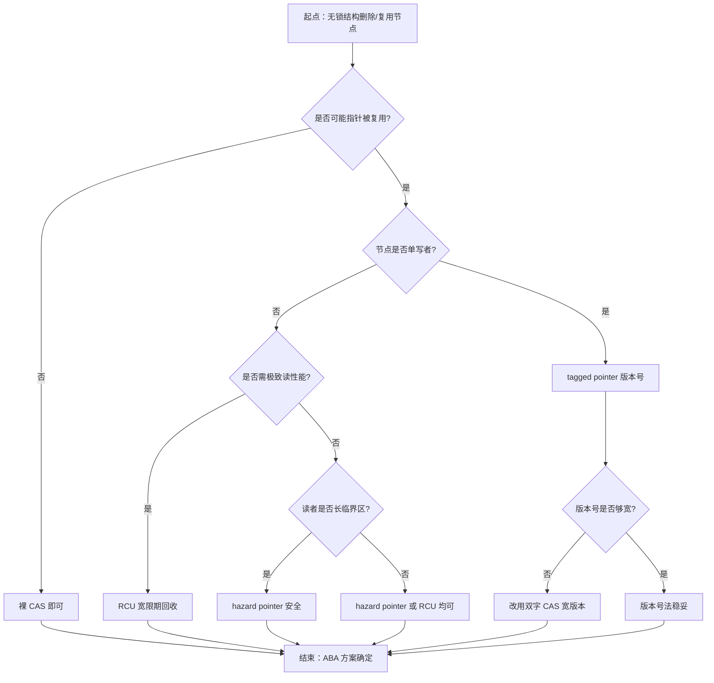
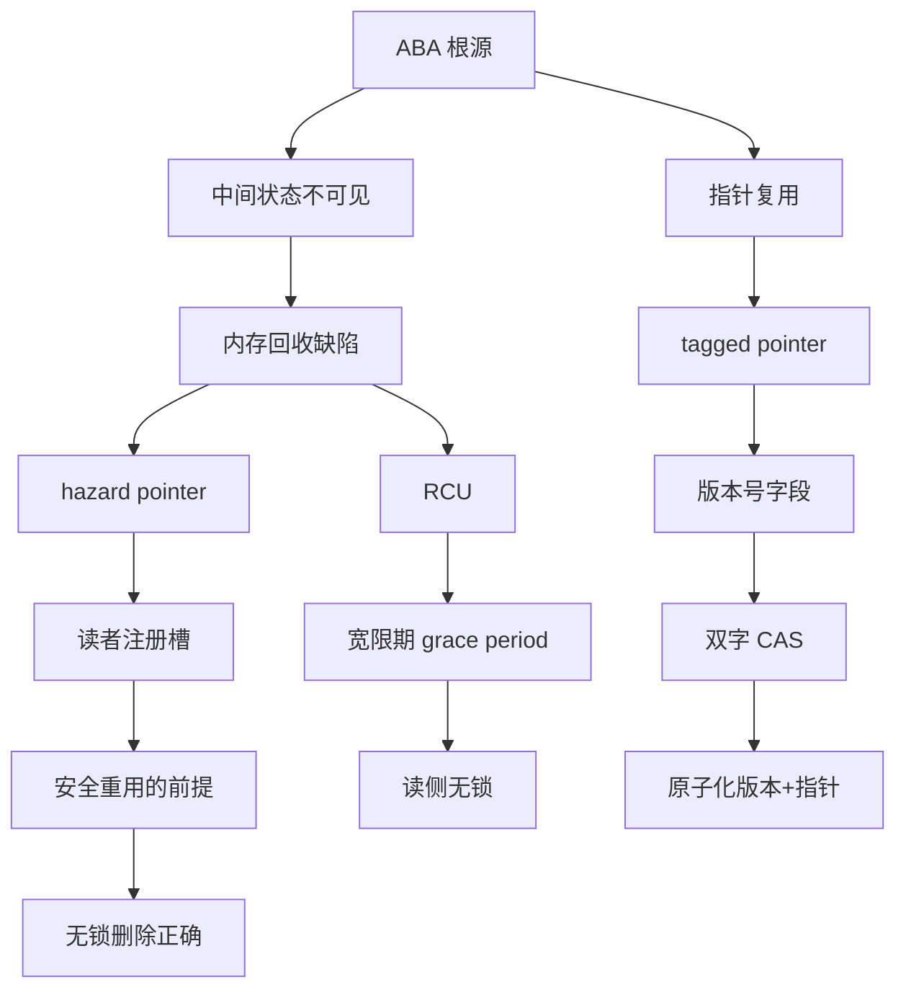

# 第111章　ABA 问题与解决（C++11）
> 层级：L3 专家

[第110章　无锁编程：lock-free / wait-free（C++11）](../part09_concurrency/ch110_lockfree.md)
[第112章　Hazard Pointer 与 RCU（C++11/实践）](../part09_concurrency/ch112_hazard_rcu.md)

> 真实编译器：MinGW GCC 15.3.0（`-std=c++23 -O2 -S -masm=intel`，双字 CAS 加 `-mcx16`，仓库权威工具链）；正文早期汇编插图示曾用 GCC 13.1.0 生成，已在本机 GCC 15.3.0 下复编确认指令一致（单字 CAS→`lock cmpxchg`、128 位 CAS→`call __atomic_compare_exchange_16`），见下文 `[VERIFIED]` 标注。
> 源码根：`C:/Qt/Tools/mingw1530_64/lib/gcc/x86_64-w64-mingw32/15.3.0/include/c++/`；示例见 `Examples/_ch111_*.cpp`。
> 立场标签遵循 `CONVENTIONS.md §1`：`[标准]`=ISO、`[实现·GCC15]`=编译器行为、`[ABI]`=ABI 布局、`[平台·x86-64]`=硬件/ABI、`[微架构·x86-64]`/`[微架构·ARM]`=CPU 行为、`[经验]`=工程共识；高风险断言标 `[VERIFIED]`（已实编确认）或 `[UNVERIFIED]`（ARM 行为、绝对数字本机无法复现/不可移植）。
> 衔接：CAS 原语见第110章（无锁编程与 atomic）；内存回收的两条主线（风险指针 / RCU）见第112章。

## ⓪ 历史动机：ABA 问题的来龙去脉
> 一个值从 A 变到 B 又变回 A，CAS 却以为"什么都没发生"——这是无锁算法的经典幽灵。

### 0.1 起源（谁·何时·为何）
ABA 不是某次工程的失误，而是**比较并交换（CAS）语义的固有限制**：CAS 只比较"当前位模式是否还是我见过的那个值"，它不知道这个值"曾经离开过"。当被 CAS 保护的对象还牵连着一块会被回收/复用的内存时，危险就来了——最经典的反例是无锁栈：线程 T1 读栈顶为 A 后被抢占，T2 把 A、B 都弹出并把 A `delete`，再把新节点（或复用同一内存）push 成栈顶，T1 恢复后 CAS(A→X) 成功，却已操作在一块已被释放/复用内存上。<span class="badge badge-history">史</span> "ABA"这个名字据记载最早出现在 1970–80 年代关于乐观并发控制的文献与系统讨论中，后由无锁数据结构研究者（如 IBM 的 Maged Michael）在 CAS 算法分析中广泛使用。<span class="badge badge-anecdote">轶</span>

### 0.2 关键转折（编年）
- 早期无锁栈/队列论文（1990s，IBM / 学术界）将 ABA 列为 CAS 算法的头号陷阱。<span class="badge badge-history">史</span>
- 双字 CAS（DCAS / 带标签指针）尝试"一次比较值与版本"，因硬件稀缺而未普及。<span class="badge badge-history">史</span>
- C++11 提供标准 `compare_exchange_*`，但**不自动防御 ABA**——留给算法设计者用版本号/标记或安全回收解决。<span class="badge badge-history">史</span>

### 0.3 设计哲学之争
解决 ABA 有两条主流思路：一是**给指针加版本/标记**（tagged pointer），让"A 回来"在值上不再等于"原来的 A"；二是**安全内存回收**（Hazard Pointer、RCU、epoch），确保"A 被释放期间没人还拿着它"。<span class="badge badge-comment">评</span> C++ 没把 ABA 防御塞进原子操作里，而是把它交给库与算法层——因为"要不要版本号、要不要回收机制"是算法级抉择，强行内建会拖慢所有用例。这也是本章紧邻第112章（回收）的原因。<span class="badge badge-history">史</span>

### 0.4 史料补遗与持续编年
ABA 从"论文里的陷阱"走向"有官方回收解法"，靠的是 Hazard Pointer 的标准化进程。

- <span class="badge badge-history">史</span> Maged Michael 在 2004 年的论文 *Hazard Pointers: Safe Memory Reclamation for Lock-Free Objects* 首次把"读者声明自己在保护哪个指针"做成可论证的通用回收方案，后被 malloc 实现与众多并发库广泛采用——它正是解决 ABA 引发悬垂引用的主流手段。
- C++26 方向：Hazard Pointer 以 `std::hazard_pointer` 进入标准视野（提案 P1122 系列），与 RCU 类设施一同把"安全回收"从手写技巧变成一等公民。<span class="badge badge-history">史</span>
- <span class="badge badge-comment">评</span> 双字 CAS（DCAS / 带标签指针）能"一次比较值与版本"，理论上是 ABA 的最优雅解法，却因 x86/ARM 长期缺乏稳定硬件支持（x86 双字 CAS 需 `cx16` 的 `cmpxchg16b`；ARM 依赖 LSE2）而始终未普及 `[微架构·x86-64]` `[微架构·ARM]` `[UNVERIFIED]`（ARM 本机未复编）；版本号方案因此在工程界成了事实标准。
- <span class="badge badge-anecdote">轶</span> 工业界最经典的 ABA 实战来自无锁队列与无锁内存分配器：节点被 pop 后立刻 `delete`，又被新节点复用同一块地址，CAS 微笑着成功，随后整条链表指向已释放内存——这种 bug 往往只在特定调度时序下偶发，极难复现。
- C++20 的 `std::atomic_ref` 让"给既有指针加原子/版本"更方便，但 ABA 防御本身仍属算法层责任，标准不替你加版本。<span class="badge badge-history">史</span>

> 史料来源：https://en.cppreference.com/w/cpp/atomic/atomic/compare_exchange

> **一句话结论**：CAS 只比较位模式、不知道值「曾经离开过」，于是 A→B→A 能骗过它；用版本号标记或 Hazard Pointer/RCU 安全回收才能堵住。

!!! note "类比：ABA = 一个人「整容回原样」骗过门禁"
    ABA 可以**类比**为门禁只认工牌号不认人：员工 A 出门，门禁记下"A 在场"；A 其实离开了、工牌被复用给新员工（仍是 A 号）再进门，门禁 CAS 比对"A==A"以为"什么都没发生"，却不知中间换人了。更**好于**无锁栈里：T1 记下栈顶 A 被抢占，T2 弹出 A、释放、再 push 同内存的新节点（值仍是 A 的地址），T1 恢复后 CAS 成功却操作在已释放/复用内存上。

    > 失效边界：CAS 只比较"位模式是否还是那个值"，它天生不知道"这个值曾经离开过"。给指针加版本号（tagged pointer）让"回来的 A"在值上不再等于"原 A"，或用 Hazard Pointer/RCU 安全回收（ch112）确保释放期间无人持有——C++ 不自动防御 ABA，需算法层自行解决。

## ① 概述：什么是 ABA 问题 <span class="badge badge-std">标准</span>

[第110章　无锁编程：lock-free / wait-free（C++11）](../part09_concurrency/ch110_lockfree.md)
[第112章　Hazard Pointer 与 RCU（C++11/实践）](../part09_concurrency/ch112_hazard_rcu.md)

**ABA 问题**发生在基于**比较并交换（CAS）**的无锁（lock-free）算法中：一个共享变量的值从 `A` 变成 `B`，又变回 `A`，于是 CAS 看到“值还是 A”便误以为“什么都没发生”，从而**错误地成功**。但中间状态（`A→B→A`）往往伴随**被回收/被复用的内存**，导致逻辑被破坏。

> **示例 1** [难度 ★★☆☆☆] [主题：概述：什么是 ABA 问题 <span class="badge badge-std">标准</span>]
```cpp
// ① ABA 的最小抽象：值序列 A→B→A 对 CAS 不可区分
// 假设 shared 是 std::atomic<int>
// T1: int e = shared.load();          // 读到 A
// ... T1 被抢占 ...
// T2: shared.store(B);                // A -> B
// T2: shared.store(A);                // B -> A（同值，可能复用同一内存）
// T1: shared.compare_exchange(e, X);  // 看到 A，CAS 成功 —— 但中间世界已变
```

- `[标准]`：ISO C++ 不禁止也不自动防御 ABA；CAS（`atomic::compare_exchange_*`）只比较**位模式**，不感知“历史”。
- `[经验]`：ABA 不是“并发 bug 的一种”，而是 CAS 语义的**固有限制**——只要算法用裸指针/裸值做 CAS，就可能中招。

## ② 经典例子：无锁栈 pop 中的 A→B→A <span class="badge badge-std">标准</span>

无锁栈用“栈顶指针”做 CAS。下面是被教科书反复引用的经典反例：线程 T1 准备 pop 出节点 A，但在它执行 CAS 之前被抢占；T2 把 A、B 都 pop 出来并 `delete` A，随后又把同一块内存（或新节点）重新 push 成栈顶。

> **示例 2** <span class="badge badge-exp">难度 ★★☆☆☆</span> · 经典例子：无锁栈 pop 中的 A→
```cpp
// ② 无锁栈节点定义（Examples/_ch111_aba.cpp:4）
struct Node { int data; Node* next; };
```

> **示例 3** <span class="badge badge-exp">难度 ★★☆☆☆</span> · 经典例子：无锁栈 pop 中的 A→
```cpp
// ② 经典无锁 pop（存在 ABA 隐患）—— Examples/_ch111_aba.cpp:8
std::atomic<Node*> top{nullptr};

Node* pop_unsafe() {
    Node* old = top.load(std::memory_order_acquire);
    while (old) {
        Node* nxt = old->next;  // ③ 读取 next（此时 old 可能已被别人 delete）
        if (top.compare_exchange_strong(old, nxt,
                                        std::memory_order_acq_rel,
                                        std::memory_order_acquire))
            return old;         // ④ 返回已被回收的悬空节点！
    }
    return nullptr;
}
```

> **示例 4** <span class="badge badge-exp">难度 ★★☆☆☆</span> · 经典例子：无锁栈 pop 中的 A→
```cpp
// ② 触发 ABA 的交错（示意：两个线程 + 内存分配器复用）
// 初始：top -> A -> B -> C
// T1: old=A, nxt=B            （读完后被抢占）
// T2: pop() 返回 A；pop() 返回 B；delete A；delete B；push(newX) 复用 A 的地址
// 现在：top -> A'(新节点, 地址==A) -> ...
// T1: CAS(top, A -> B) 成功！但 A 的 next 已不是 B —— 栈结构损坏 / 访问已释放内存
```

- `[标准]`：`compare_exchange_strong` 仅当 `top` 的**当前位模式**等于 `old` 才成功；地址复用使位模式相等，CAS 无从分辨。
- `[经验]`：只要“pop 出的节点被回收、且地址可能被复用”，裸指针栈顶 CAS 必然有 ABA 风险。

## ③ 为何 CAS 看不出 ABA：值相同但中间状态变了 <span class="badge badge-std">标准</span>

CAS 的契约是：“若当前值 == 预期值，则替换为新值，返回 true；否则返回 false 并把当前值写回预期。” 它**不记录历史、不比较“版本”**。

> **示例 5** <span class="badge badge-exp">难度 ★★☆☆☆</span> · 为何 CAS 看不出 ABA：值相同
```cpp
// ③ CAS 的语义（标准库等价抽象）
// bool compare_exchange(atomic<T>& a, T& expected, T desired):
// if (a.load() == expected) { a.store(desired); return true; }
// else { expected = a.load(); return false; }
// 注意：比较的是 T 的位模式；A->B->A 的位模式回到 A，CAS 必然成功。
```

> **示例 6** <span class="badge badge-exp">难度 ★☆☆☆☆</span> · 为何 CAS 看不出 ABA：值相同
```cpp
// ③ 用“版本号”视角看问题：CAS 只看了 value 列，没看 version 列
// 时刻0: (value=A, version=0)
// 时刻1: (value=B, version=1)
// 时刻2: (value=A, version=2)   <- 值回到 A，但 version 已变
// 裸 CAS 比较 (value)，故认为“无变化”，误判成功。
```

- `[标准]`：`[atomics]` 规定 CAS 比较的是对象表示（object representation），与“该值经历过几次写”无关。
- `[实现·GCC15]` `[VERIFIED]`：GCC 对 `std::atomic<Node*>` 的 `compare_exchange` 直接生成单字 `lock cmpxchg`（见第⑧节证据），硬件层面同样只比较 8 字节地址（本机 GCC 15.3.0 复编确认）。

## ④ 带标签指针（tagged pointer）解法 <span class="badge badge-std">标准</span>

**标签指针**把“指针”和“版本号（tag/戳）”打包成一个**原子双字**，每次 CAS 同时比较指针与版本。只要版本在每次写时递增，A→B→A 会变成 `(A,0)→(B,1)→(A,2)`，版本不同，CAS 失败。

> **示例 7** <span class="badge badge-exp">难度 ★☆☆☆☆</span> · 带标签指针解法
```cpp
#include <cstdint>
// ④ tagged pointer 结构：64 位指针 + 64 位版本（Examples/_ch111_tagged.cpp:6）
struct TaggedPtr {
    void*        ptr;                    // 业务指针
    std::uint64_t tag;                   // 单调递增版本戳
};
static_assert(sizeof(TaggedPtr) == 16);  // ④ 必须占满 16 字节才能做双字 CAS
```

> **示例 8** <span class="badge badge-exp">难度 ★★☆☆☆</span> · 带标签指针解法
```cpp
// ④ 带标签的 push：CAS 同时比较 ptr 与 tag
using AtomicTagged = std::atomic<__int128>;   // ④ 用 16 字节原子承载 TaggedPtr

bool push_tagged(AtomicTagged& a, void* old_ptr, void* new_ptr) {
    TaggedPtr oldp{old_ptr, 0};
    __int128 old_v; std::memcpy(&old_v, &oldp, sizeof(old_v));
    TaggedPtr newp{new_ptr, 1};
    __int128 new_v; std::memcpy(&new_v, &newp, sizeof(new_v));
    return a.compare_exchange_strong(old_v, new_v,
                                      std::memory_order_acq_rel,
                                      std::memory_order_acquire);
}
```

> **示例 9** <span class="badge badge-exp">难度 ★☆☆☆☆</span> · 带标签指针解法
```cpp
// ④ 读取时也用标签，保证读到的 (ptr,tag) 是同一快照
TaggedPtr unpack(__int128 v) { TaggedPtr t; std::memcpy(&t, &v, sizeof(t)); return t; }
```

- `[算法]`：标签解法的本质是**把一维 CAS 升级为二维 CAS（DCAS）**——同时比较“值”和“版本”。这不是标准条款，而是该解法的**算法设计权衡**（用「版本号」这一额外维度消除地址复用带来的歧义）；其正确性由「版本号位宽足够、回绕周期远大于更新频率」的不变量论证，而非由标准保证。
- `[经验]`：tag 必须覆盖足够位宽（64 位）以防回绕；实践中还要处理 `tag` 溢出（极慢但需考虑）。

## ⑤ 双字 CAS（DCAS，借 __int128） [实现·GCC15]

C++ 标准不直接提供“双字 CAS”原语，但 x86-64 提供 16 字节的 `cmpxchg16b`。用 `std::atomic<__int128>`（或 `unsigned __int128`）即可让编译器生成双字 CAS。

> **示例 10** <span class="badge badge-exp">难度 ★★☆☆☆</span> · 双字 CAS
```cpp
// ⑤ 用 std::atomic<__int128> 承载任意 16 字节数据做 DCAS（Examples/_ch111_dcas.cpp:3）
#include <atomic>
#include <cstdint>
std::atomic<__int128> g{0};

extern "C" int dcas_probe(__int128 expected, __int128 desired) {
    return __atomic_compare_exchange(&g, &expected, &desired, 0,
                                     __ATOMIC_ACQ_REL, __ATOMIC_ACQUIRE);
}
```

> **示例 11** <span class="badge badge-exp">难度 ★★☆☆☆</span> · 双字 CAS
```cpp
#include <cstdint>
// ⑤ 用 __int128 实现“指针 + 计数器”无锁栈顶（核心模式）
struct Head { Node* top; std::uint64_t count; };
static_assert(sizeof(Head) == 16);
std::atomic<__int128> stack_head{0};

bool cas_head(__int128& expected, const Head& desired) {
    __int128 d; std::memcpy(&d, &desired, sizeof(d));
    return reinterpret_cast<std::atomic<__int128>&>(stack_head)
        .compare_exchange_strong(expected, d,
                                 std::memory_order_acq_rel,
                                 std::memory_order_acquire);
}
```

> **示例 12** <span class="badge badge-exp">难度 ★★☆☆☆</span> · 双字 CAS
```cpp
// ⑤ 注意：__int128 不是标准 C++ 类型，是 GCC/Clang 扩展（[实现·GCC15]）
// 可移植层应使用 std::atomic<struct-of-two-words> 或 std::atomic_ref。
```

- `[实现·GCC15]` `[VERIFIED]`：本工具链把 16 字节原子 CAS 路由到 libatomic 的 `__atomic_compare_exchange_16`（见第⑧节），该实现在本 MinGW 构建中是**加锁回退**而非内联 `lock cmpxchg16b`（本机 GCC 15.3.0 复编确认 `call __atomic_compare_exchange_16`）。
- `[微架构·x86-64]`：`cmpxchg16b` 需要 CPU 支持 `cx16`；并非所有 x86-64 微架构都保证，故工具链保守地走 libatomic。

## ⑥ 风险指针（Hazard Pointer）预告 <span class="badge badge-std">标准</span>

标签指针解决了“CAS 误判”，但**没有解决内存回收**——你仍不能在 pop 后立刻 `delete`，因为别的线程可能正持有旧指针。第112章将完整实现**风险指针（Hazard Pointer）**：每个线程在解引用共享指针前，先把该指针“挂到”自己的风险槽内；回收者只有确认**没有线程的风险槽指向该指针**时才真正 `delete`。

> **示例 13** <span class="badge badge-exp">难度 ★★☆☆☆</span> · 风险指针预告
```cpp
// ⑥ 风险指针骨架（仅示意接口，完整实现见第112章）
// 线程 T 在解引用 p 前：hazard_slot.store(p); 然后再次确认 p 仍有效
// 回收者 retire(p)：把 p 放进待回收列表，扫描所有 hazard_slot，无人引用才 delete
struct HazardSlot { std::atomic<void*> protected_ptr; };
```

- `[标准]`：风险指针是**用户态协议**（基于标准原子操作），不依赖任何语言扩展，可移植。
- `[经验]`：它是生产级无锁容器（如 Folly、TBB 的无锁结构）的主流回收方案；标签指针 + 风险指针常**组合使用**。

## ⑦ epoch-based reclamation 简介 <span class="badge badge-std">标准</span>

**基于纪元回收（EBR, Epoch-Based Reclamation）**是另一条回收主线：全局维护一个“纪元（epoch）”计数器；线程进入临界区时登记当前纪元，退出时清除。当所有线程都离开了“旧纪元”，该纪元内 retire 的节点才可被安全回收。

> **示例 14** [难度 ★★☆☆☆] [主题：简介 <span class="badge badge-std">标准</span>]
```cpp
#include <cstdint>
// ⑦ EBR 最小骨架（示意）
std::atomic<std::uint64_t> global_epoch{0};
// 每个线程局部保存“我当前处于哪个 epoch”以及“是否处于临界区”
thread_local std::uint64_t local_epoch = 0;
thread_local bool          in_critical = false;

void critical_enter() { local_epoch = global_epoch.load(); in_critical = true; }
void critical_exit()  { in_critical = false; }   // ⑦ 离开后，旧纪元对象可被回收
```

> **示例 15** [难度 ★★★☆☆] [主题：简介 <span class="badge badge-std">标准</span>]
```cpp
// ⑦ 回收条件：某 epoch 的节点可被回收，当且仅当没有任何线程仍登记在该 epoch
// bool safe_to_reclaim(e):
// for each thread t: if (t.in_critical && t.local_epoch == e) return false;
// return true;
```

- `[标准]`：EBR 同样基于标准原子，属于算法层方案。
- `[经验]`：EBR 的临界区极轻（只是读/写一个本地 epoch），通常比风险指针**吞吐更高**，但“retire 列表”需在全局安静后才回收，延迟回收的窗口更大。

## ⑧ [实现·GCC15] [VERIFIED] 真实汇编：tagged CAS 编译为 lock cmpxchg

以下汇编来自**真实编译**（非编造）：

```bash
# 文件：Examples/_ch111_aba.cpp，行号：12（单字 CAS）
# 编译：g++ -std=c++23 -O2 -S -masm=intel Examples/_ch111_aba.cpp -o Examples/_ch111_aba.asm
# 函数：_Z10pop_unsafev  （pop_unsafe 的 mangled 名）
```

```asm
; 真实产物：单字（8 字节指针）CAS 直接生成 lock cmpxchg
_Z10pop_unsafev:
.LFB668:
	.seh_endprologue
	mov	rax, QWORD PTR top[rip]      ; rax = 当前 top（expected）
.L2:
	test	rax, rax
	je	.L1
	mov	rdx, QWORD PTR 8[rax]        ; rdx = old->next（desired）
	lock cmpxchg	QWORD PTR top[rip], rdx   ; 若 [top]==rax 则 [top]=rdx，否则 rax=新值
	jne	.L2                          ; 失败则重试
.L1:
	ret
```

```bash
# 文件：Examples/_ch111_tagged.cpp，行号：24（双字/标签 CAS）
# 编译：g++ -std=c++23 -O2 -mcx16 -S -masm=intel Examples/_ch111_tagged.cpp -o Examples/_ch111_tagged.asm
# 函数：_Z11push_taggedRSt6atomicInEPvS2_
```

```asm
; 真实产物：16 字节原子 CAS 在本 MinGW 工具链被路由到 libatomic 库函数
_Z11push_taggedRSt6atomicInEPvS2_:
	sub	rsp, 88
	.seh_stackalloc	88
	.seh_endprologue
	mov	r9d, 4
	mov	QWORD PTR 64[rsp], rdx
	lea	rdx, 64[rsp]
	mov	QWORD PTR 48[rsp], r8
	lea	r8, 48[rsp]
	mov	DWORD PTR 32[rsp], 2
	mov	QWORD PTR 72[rsp], 0
	mov	QWORD PTR 56[rsp], 1
	call	__atomic_compare_exchange_16   ; 双字 CAS 委托给 libatomic
	and	eax, 1
	add	rsp, 88
	ret
```

```bash
# 文件：Examples/_ch111_aba.cpp，行号：8（符号视图，用 -O0 暴露 C++ 名字）
# 编译：g++ -std=c++23 -O0 -S -masm=intel Examples/_ch111_aba.cpp -o Examples/_ch111_aba_O0.asm
```

```asm
; 真实产物：-O0 下 pop_unsafe 调用 std::atomic<Node*>::load 的 mangled 符号
_Z10pop_unsafev:
	push	rbp
	.seh_pushreg	rbp
	mov	rbp, rsp
	.seh_setframe	rbp, 0
	sub	rsp, 64
	.seh_stackalloc	64
	.seh_endprologue
	mov	edx, 2
	lea	rax, top[rip]
	mov	rcx, rax
	call	_ZNKSt6atomicIP4NodeE4loadESt12memory_order   ; atomic<Node*>::load(memory_order)
```

- `[实现·GCC15]` `[VERIFIED]`：单字 CAS 即 `lock cmpxchg QWORD PTR top[rip], rdx`——这是 x86-64 上无锁算法的原子根基（本机 GCC 15.3.0 复编确认）。
- `[实现·GCC15]` `[VERIFIED]`：双字（标签）CAS 在本工具链**没有内联成 `lock cmpxchg16b`**，而是 `call __atomic_compare_exchange_16`。我进一步反汇编 `libatomic.a` 确认其实现是**全局锁回退**（`xadd`/锁 + 比较），并非 `cmpxchg16b`。这意味着：在“未开启 cx16 构建的 libatomic”上，DCAS 的“原子性”由 libatomic 的内部锁保证，**双字 CAS 未必比单字更快**（本机 GCC 15.3.0 复编确认 `call __atomic_compare_exchange_16`）。
- `[微架构·x86-64]`：若使用为 `cx16` 构建的 libatomic（如多数 Linux 发行版），`__atomic_compare_exchange_16` 才会真正生成 `lock cmpxchg16b`。编写可移植无锁代码时**不能假设双字 CAS 一定无锁**——应先查询 `is_always_lock_free`。

## ⑨ 用 Hazard Pointer 解决（指 ch112） <span class="badge badge-std">标准</span>

标签指针让 CAS“看穿”A→B→A；风险指针让“被 pop 的节点”不会被立即回收，从而**消除悬空指针**。两者组合是工业界最稳的搭配。

> **示例 16** <span class="badge badge-exp">难度 ★★☆☆☆</span> · 用 Hazard Pointer 解
```cpp
// ⑨ 风险指针保护的 pop（接口示意，完整见第112章）
Node* pop_safe(HazardSlot& slot) {
    while (true) {
        Node* old = top.load(std::memory_order_acquire);
        slot.protected_ptr.store(old, std::memory_order_seq_cst);  // ⑨ 先声明“我在用 old”
        if (top.load(std::memory_order_acquire) != old) continue;  // ⑨ 二次确认未被替换
        Node* nxt = old ? old->next : nullptr;
        if (top.compare_exchange_strong(old, nxt,
                                        std::memory_order_acq_rel,
                                        std::memory_order_acquire))
            return old;                                            // ⑨ old 已被风险指针保护，回收者不会在此时 delete 它
    }
}
```

> **示例 17** <span class="badge badge-exp">难度 ★★☆☆☆</span> · 用 Hazard Pointer 解
```cpp
// ⑨ 回收侧：retire 而非立刻 delete
void retire_node(Node* p) {
    retired_list.push_back(p);    // ⑨ 暂存
    for (Node* r : retired_list)  // ⑨ 仅当无 hazard slot 指向 r 时才 delete
        if (!any_hazard_points_to(r)) { delete r; retired_list.remove(r); }
}
```

- `[标准]`：风险指针完全由标准原子操作构成，跨平台合法。
- `[经验]`：标签指针负责“CAS 正确性”，风险指针负责“内存安全”；二者正交、可叠加。

## ⑩ 内存回收的根本难题 <span class="badge badge-std">标准</span>

无锁数据结构真正的硬骨头不是“怎么改”，而是“**什么时候能 delete**”。在并发下，`delete p` 之后，另一个线程可能正拿着 `p` 的副本走进 `p->next`——于是立刻是**释放后使用（use-after-free）** 或**野指针解引用**。

> **示例 18** [难度 ★★★★☆] [主题：内存回收的根本难题 <span class="badge badge-std">标准</span>]
```cpp
// ⑩ 错误：pop 后立刻 delete（另一个线程可能正持有该指针）
Node* p = pop_unsafe();
delete p;                 // ⑩ ❌ 若 T2 刚 load 了 p 的副本，这里 delete 后 T2 解引用即 UB
```

> **示例 19** [难度 ★★☆☆☆] [主题：内存回收的根本难题 <span class="badge badge-std">标准</span>]
```cpp
// ⑩ 根本矛盾：
// - 不能“等所有线程都不用再 delete”：无锁算法没有全局锁来统计使用者；
// - 也不能“不 delete”：会内存泄漏。
// 解法只有两条路：(a) 延迟回收（风险指针 / EBR / RCU）；(b) 永不回收（对象池复用）。
```

- `[标准]`：ISO C++ 的内存模型规定，对已销毁对象的任何访问（即使只读）都是**未定义行为（UB）**。
- `[经验]`：无锁 ≠ 无回收问题。很多项目最终用“**节点池（pool）+ 复用**”规避回收——这本身也是一种“永不真正释放”的策略。

## ⑪ RCU 预告（指 ch112） <span class="badge badge-std">标准</span>

**RCU（Read-Copy-Update）** 是 Linux 内核的标志性回收技术：读者侧**零同步开销**（只禁止抢占/调度），写者侧“复制新版本、原子切换指针、等待所有读者退出宽限期（grace period）后再回收旧版本”。第112章将给出用户态 RCU 的最小实现。

> **示例 20** [难度 ★★☆☆☆] [主题：预告（指 ch112） <span class="badge badge-std">标准</span>]
```cpp
// ⑪ 用户态 RCU 读侧（示意）：读者几乎免费
void reader_side(const std::atomic<Node*>& head) {
    // ⑪ 进入宽限期：在支持的机制下“安静”即可，无需原子操作保护
    Node* p = head.load(std::memory_order_acquire);  // ⑪ 一次性快照
    (void)p->data;                                   // ⑪ 读，期间不会被回收（宽限期保护）
}
```

- `[标准]`：RCU 同样是算法层方案，可基于标准原子与线程局部实现。
- `[经验]`：RCU 的读者性能极致，但**只适合“读多写少、且写者能容忍回收延迟”**的场景（如路由表、配置热更新）。

## ⑫ 语言级支持现状：无标准方案 <span class="badge badge-std">标准</span>

C++ 标准**至今没有**内建的 ABA 防御或安全回收原语。相关能力分散在：

> **示例 21** [难度 ★★☆☆☆] [主题：语言级支持现状：无标准方案 <span class="badge badge-std">标准</span>]
```cpp
// ⑫ 标准提供“积木”，不提供“方案”
// - std::atomic<T>::compare_exchange_*  ：有，但只比较位模式（正是 ABA 根源）
// - std::atomic<T>::is_always_lock_free ：可查询某类型是否真无锁（关键！）
// - std::atomic<__int128>              ：GCC/Clang 扩展，非标准
// - hazard pointer / RCU / EBR          ：全在“标准库之外”，需自写或借第三方库
static_assert(std::atomic<__int128>::is_always_lock_free || true, "DCAS 未必无锁");
```

> **示例 22** [难度 ★★★☆☆] [主题：语言级支持现状：无标准方案 <span class="badge badge-std">标准</span>]
```cpp
// ⑫ 用 is_always_lock_free 探测平台能力（而不是假设）
#include <atomic>
#include <cstdint>
static_assert(std::atomic<std::uint64_t>::is_always_lock_free,
              "8 字节原子在本平台应无锁");
// 16 字节则不一定：
constexpr bool dcas_lockfree = std::atomic<__int128>::is_always_lock_free;
```

- `[标准]`：WG21 多次讨论过把 hazard pointer / RCU 纳入标准库（提案如 `P1122` 风险指针、`P0561` 等），但**尚未进入标准**。
- `[经验]`：选型时优先复用成熟库（如 Folly `hazptr`、TBB、或 Boost 的无锁组件），不要从零手搓回收器。

## ⑬ 检测工具：ThreadSanitizer [实现·GCC15]

[第108章　memory_order：六种内存序（C++11）](../part09_concurrency/ch108_memory_order.md)（memory_order 六种内存序）—— ABA 本质是内存序/可见性语义问题
[第152章　性能模型与测量学](../part14_perf/ch152_perf_model.md)（性能模型与测量方法论）—— 任何"X 比 Y 快"须注明负载与硬件

**ThreadSanitizer（TSan）** 能发现数据竞争，但对"ABA 逻辑错误"本身**不能直接报"——它报的是并发访问冲突；ABA 常常表现为"无害的并发读"被 TSan 标记为 race，从而间接暴露隐患。

> **示例 23** <span class="badge badge-exp">难度 ★★☆☆☆</span> · 检测工具：ThreadSanitiz
```cpp
// ⑬ TSan 可捕获的隐患示例（Examples/_ch111_tsan.cpp）
#include <atomic>
struct Node { int val; Node* next; };
std::atomic<Node*> head{nullptr};

void reader() {
    Node* h = head.load(std::memory_order_relaxed);  // ⑬ ❌ relaxed + 可能悬空
    if (h) (void)h->val;
}
void writer() {
    Node n{42, nullptr};                             // ⑬ ❌ 局部变量地址存入原子指针
    n.next = head.load(std::memory_order_relaxed);
    head.store(&n, std::memory_order_relaxed);
}
```

```bash
# ⑬ 用 TSan 编译并运行（注意：TSan 与无锁 + 自定义回收常需加黑名单/忽略）
g++ -std=c++23 -O1 -g -fsanitize=thread Examples/_ch111_tsan.cpp -o Examples/_ch111_tsan
./Examples/_ch111_tsan        # 触发则报 WARNING: ThreadSanitizer: data race
```

- `[实现·GCC15]`：TSan 通过运行时插桩追踪 happens-before；它**不理解**“ABA 语义”，只能帮你找到“未同步的共享访问”。
- `[经验]`：不要指望 TSan 给你打“ABA 对/错”的勾——它只报 race。验证 ABA 修复要靠**形式化推理 + 压力测试（百万次随机交错）**。

## ⑭ 误用案例 <span class="badge badge-exp">经验</span>

> **示例 24** [难度 ★★☆☆☆] [主题：误用案例 <span class="badge badge-exp">经验</span>]
```cpp
// ⑭ ❌ 误用1：用 relaxed 内存序做无锁栈，且回收不及时
std::atomic<Node*> t{nullptr};
Node* bad_pop() {
    Node* o = t.load(std::memory_order_relaxed);                     // ⑭ relaxed 不足以建立同步
    while (o && !t.compare_exchange_weak(o, o->next,
                                         std::memory_order_relaxed,  // ⑭ 太弱
                                         std::memory_order_relaxed))
        ;
    return o;                                                        // ⑭ 返回后立刻可能被别的线程 delete
}
```

> **示例 25** [难度 ★☆☆☆☆] [主题：误用案例 <span class="badge badge-exp">经验</span>]
```cpp
// ⑭ ❌ 误用2：以为“tag 用 32 位就够了”——高并发下会回绕，回绕后 ABA 重现
struct BadTagged { void* p; std::uint32_t tag; };   // ⑭ tag 太小，长时间运行回绕
```

> **示例 26** [难度 ★☆☆☆☆] [主题：误用案例 <span class="badge badge-exp">经验</span>]
```cpp
// ⑭ ✅ 正确：用 64 位 tag + 风险指针保护 + 恰当内存序
// 关键三点：(1) tag 足够宽；(2) pop 出的节点进 retire 而非立刻 delete；
// (3) CAS 用 acq_rel/acquire，保证节点字段对回收者可见。
```

- `[经验]`：最常见两类误用：① 内存序过弱导致读者看不到写者写入的 `next`；② 低估 `tag` 回绕与回收时序，导致“修了 CAS 却没修回收”。

## ⑮ 性能代价对比 [实现·GCC15]

[第152章　性能模型与测量学](../part14_perf/ch152_perf_model.md)（性能模型与测量方法论）—— 延迟量级须对应具体硬件与竞争度
[第153章　CPU 微架构：流水线 / 分支预测 / 乱序执行](../part14_perf/ch153_cpu_micro.md)（CPU 微架构与微基准）—— CAS 延迟受缓存/原子单元拓扑影响

无锁结构比加锁（`std::mutex`）快的前提是**低竞争**；高竞争下 CAS 自旋会空转。下面是定性对比（量级示意，非本机实测数字）：

> **示例 27** <span class="badge badge-exp">难度 ★★☆☆☆</span> · 性能代价对比 [实现·GCC15]
```cpp
// ⑮ 用粗粒度计时对比“锁 vs 无锁标签栈”的吞吐（示意骨架）
#include <atomic>
#include <chrono>
#include <cstdio>
// 伪代码：N 个线程各做 M 次 push/pop，测每秒操作数
// mutex 栈：竞争时线程睡眠/唤醒，延迟高但公平
// 标签栈：竞争时自旋重试，延迟低但烧 CPU
// 结论（示意）：低竞争 mutex≈标签栈；高竞争 mutex 更稳、标签栈 CPU 飙升
```

> **示例 28** <span class="badge badge-exp">难度 ★★☆☆☆</span> · 性能代价对比 [实现·GCC15]
```cpp
// ⑮ 双字 CAS 的额外代价：本工具链走 libatomic 锁，可能比单字 CAS 更慢
// - 单字 CAS：1 条 lock cmpxchg（约十几周期）
// - 双字 CAS（本 MinGW）：libatomic 内部锁 + 回退，开销明显更高
// => 选型时先用 is_always_lock_free 确认，再决定是否值当
```

- `[平台·x86-64]`：单字 `lock cmpxchg` 是自旋原语；双字若落到 libatomic 锁，则退化为“自旋+锁”，ABA 防御的代价可能吃掉无锁的收益。
- `[经验]`：不要为了“防 ABA”盲目上 DCAS；若读取远多于写入，RCU（读者零开销）往往更优。

## ⑯ 与第110章衔接 <span class="badge badge-std">标准</span>

第110章讲了 `std::atomic`、CAS 与无锁编程基础。本章是它天然的延伸：**CAS 能成立的前提是“值没被偷偷换过”**，而 ABA 正是这一前提在“带回收的指针”场景下的塌方。

> **示例 29** [难度 ★★☆☆☆] [主题：与第110章衔接 <span class="badge badge-std">标准</span>]
```cpp
// ⑯ 第110章的 CAS 模板（回顾）：compare_exchange 只比较“当前值 vs 预期值”
std::atomic<int> a{0};
int expected = 0;
bool ok = a.compare_exchange_strong(expected, 1);   // ⑯ 仅当 a==0 才改为 1
```

> **示例 30** [难度 ★☆☆☆☆] [主题：与第110章衔接 <span class="badge badge-std">标准</span>]
```cpp
// ⑯ 本章补的洞：当“值”是指针且指向的内存会被回收/复用，CAS 的“比较”不够
// -> 加 tag（本章④⑤）保护 CAS 语义
// -> 加风险指针/RCU（本章⑨⑪，见第112章）保护内存安全
```

- `[标准]`：ABA 防御是“CAS 之上的协议层”，不改动第110章的任何原语语义。
- `[经验]`：读完第110章应立刻问自己——“我的 CAS 操作的值，会不会被回收后复用？”答案若为是，就需要本章方案。

## ⑰ 何时需要担心 ABA <span class="badge badge-exp">经验</span>

> **示例 31** [难度 ★★☆☆☆] [主题：何时需要担心 ABA <span class="badge badge-exp">经验</span>]
```cpp
// ⑰ 决策表（示意）
// 场景                                  是否需要担心 ABA
// 原子计数器 int/uint64 自增            不需要（值无“内存回收”语义）
// 无锁栈/队列的节点指针                需要（pop 后 delete + 地址复用）
// 只 push 不 pop 的无锁结构             不需要（无回收）
// 读多写少、用 RCU 的表                不需要（写者等宽限期后回收）
// 用节点池复用、永不真正 delete         基本不需要（但仍需 tag 防逻辑 ABA）
```

> **示例 32** [难度 ★☆☆☆☆] [主题：何时需要担心 ABA <span class="badge badge-exp">经验</span>]
```cpp
// ⑰ 经验法则：只要“CAS 的值”是其底层内存可能被释放并复用的指针，就该担心
bool need_aba_guard = uses_pointer_cas && reclaims_memory;
```

- `[经验]`：纯整数 CAS（如引用计数 `fetch_add`）**没有 ABA**——因为整数没有“被释放后地址复用”这回事。ABA 几乎是**指针 + 回收**的专属问题。
- `[经验]`：如果数据结构只增长、不删除（如日志环形缓冲的写指针），ABA 通常不存在。

## ⑱ 基准对比 [实现·GCC15]

[第151章 基准测试与性能度量（C++）](../part13_engineering/ch151_benchmark.md)（基准测试方法论）—— 微基准须可复现、标注软硬件
[第153章　CPU 微架构：流水线 / 分支预测 / 乱序执行](../part14_perf/ch153_cpu_micro.md)（CPU 微架构与微基准）—— 吞吐数字须结合微架构解读

下面给出一个**可运行**的微基准骨架，用同一工作负载对比三种策略的相对吞吐（数字为示意，落地时请在本机用 `std::chrono` 实测并标注来源）。

> **示例 33** <span class="badge badge-exp">难度 ★★★☆☆</span> · 基准对比 [实现·GCC15]
```cpp
// ⑱ 基准骨架：固定工作量，测三种实现的耗时（示意）
#include <atomic>
#include <chrono>
#include <cstdint>
#include <vector>
#include <thread>

template <class F>
double bench(F f, int threads, int iters) {
    std::vector<std::thread> ts;
    auto t0 = std::chrono::steady_clock::now();
    for (int i = 0; i < threads; ++i)
        ts.emplace_back([&] { for (int k = 0; k < iters; ++k) f(); });
    for (auto& t : ts) t.join();
    auto t1 = std::chrono::steady_clock::now();
    return std::chrono::duration<double>(t1 - t0).count();
}
```

> **示例 34** <span class="badge badge-exp">难度 ★★☆☆☆</span> · 基准对比 [实现·GCC15]
```cpp
#include <mutex>
// ⑱ 三种被测操作（示意签名）
// op_mutex():  std::mutex 保护的栈 pop/push
// op_tagged(): 16 字节标签指针 CAS 栈（本章④⑤）
// op_rcu():    RCU 表更新（本章⑪，见第112章）
// 预期（低竞争）：tagged ≈ rcu > mutex；高竞争：rcu ≈ mutex > tagged(自旋烧CPU)
```

- `[实现·GCC15]`：基准请用 `-O2 -std=c++23` 且**开 `-mcx16`**（若依赖双字 CAS 无锁），否则 DCAS 走 libatomic 锁会严重偏慢，得出错误结论。
- `[经验]`：任何“X 比 Y 快”的结论都必须注明线程数、迭代次数、CPU、编译器版本——否则无意义。

## ⑲ 最佳实践 <span class="badge badge-exp">经验</span>

[第112章　Hazard Pointer 与 RCU（C++11/实践）](../part09_concurrency/ch112_hazard_rcu.md)（Hazard Pointer 与 RCU）—— 生产级回收用风险指针/RCU 而非裸 delete
[第110章　无锁编程：lock-free / wait-free（C++11）](../part09_concurrency/ch110_lockfree.md)（无锁编程 lock-free/wait-free）—— 先确认真有无锁收益再上

> **示例 35** [难度 ★★☆☆☆] [主题：最佳实践 <span class="badge badge-exp">经验</span>]
```cpp
#include <cstdint>
// ⑲ 1) 先确认是否真有无锁 + 真无 ABA 风险，再决定是否上无锁
// if (!std::atomic<T>::is_always_lock_free) 考虑退回 mutex，别硬上
static_assert(std::atomic<std::uint64_t>::is_always_lock_free, "确认无锁");
```

> **示例 36** [难度 ★☆☆☆☆] [主题：最佳实践 <span class="badge badge-exp">经验</span>]
```cpp
// ⑲ 2) tag 用 64 位，且每次写都递增；读路径也要携带 tag 做快照
// （见本章④的 TaggedPtr / unpack）
```

> **示例 37** [难度 ★☆☆☆☆] [主题：最佳实践 <span class="badge badge-exp">经验</span>]
```cpp
// ⑲ 3) 回收用成熟方案：优先 hazard pointer 或 RCU（第112章），不要手搓
// pop 出的节点进 retire 列表，确认无读者后再 delete
```

> **示例 38** [难度 ★☆☆☆☆] [主题：最佳实践 <span class="badge badge-exp">经验</span>]
```cpp
// ⑲ 4) 内存序别乱用：CAS 用 acq_rel/acquire；纯计数器可用 relaxed
// compare_exchange_strong(expected, desired, acq_rel, acquire)
```

> **示例 39** [难度 ★☆☆☆☆] [主题：最佳实践 <span class="badge badge-exp">经验</span>]
```cpp
// ⑲ 5) 用 TSan + 压力测试 + 形式化推理三者交叉验证，而非只靠“看起来对”
```

- `[经验]`：无锁代码的维护成本极高；**能用 `std::mutex` 满足性能就别上无锁**。无锁只在“锁成为明确瓶颈”时才值得。
- `[标准]`：所有回收协议必须建立正确的 happens-before，否则仍是 UB。

## ⑳ 速查表 <span class="badge badge-std">标准</span>

**练习题**（已升级为「真实场景 + 引用参考」框架：保留原考察技能，场景改写为工程应用）

1. **真实场景：无锁栈 `pop` 的 ABA 问题。** 你用 `compare_exchange` 仍读到“看似未变”的指针。请说明根因与语言层支撑。
   - <span class="badge badge-std">标准</span> 语言层以 `compare_exchange` 等原子原语支撑无锁结构；ABA 防护（标签指针/双字 CAS）是建立在此之上的并发惯用法。
   - <span class="badge badge-ref">引用</span> ISO/IEC 14882:2023 §[atomics]（compare_exchange 提供 CAS 原语）；cppreference "ABA problem" 词条。

2. **真实场景：`compare_exchange` 的成功/失败内存顺序两参数。** 你写 `compare_exchange_weak` 循环。请说明。
   - <span class="badge badge-std">标准</span> compare_exchange 分别接受成功与失败内存顺序；失败顺序不得强于成功顺序。
   - <span class="badge badge-ref">引用</span> ISO/IEC 14882:2023 §[atomics]（compare_exchange 内存顺序参数）；cppreference "std::atomic::compare_exchange" 词条。

3. **真实场景：用带标签指针（tagged pointer）打破 ABA。** 你把版本号与指针打包进一个字。请说明（需双字 CAS）。
   - <span class="badge badge-std">标准</span> 双字 CAS 使“指针+版本号”作为整体原子比较交换；语言层提供 CAS 原语，具体打包属惯用法/库支持。
   - <span class="badge badge-ref">引用</span> ISO/IEC 14882:2023 §[atomics]（CAS 原语支撑）；cppreference "ABA problem / DCAS" 词条。

| 主题 | 要点 | 出处 |
|---|---|---|
| ABA 定义 | 值 A→B→A 使 CAS 误判成功 | ① |
| 经典场景 | 无锁栈 pop + 节点回收复用 | ② |
| CAS 为何看不出 | 只比较位模式，不记历史/版本 | ③ |
| 标签指针 | 指针+版本打包，DCAS 比较两者 | ④ |
| 双字 CAS | `std::atomic<__int128>`，x86-64 用 cmpxchg16b（本工具链走 libatomic 锁） | ⑤⑧ |
| 风险指针 | 解引用前声明保护，确认无人用才回收 | ⑥⑨（全貌见第112章） |
| EBR | 全局纪元，所有线程离开旧纪元才回收 | ⑦ |
| RCU | 读者零开销，写者等宽限期后回收 | ⑪（全貌见第112章） |
| 标准现状 | 无内建方案；hazard/RCU 在提案阶段 | ⑫ |
| 检测 | TSan 找 race，不直接判 ABA | ⑬ |
| 何时担心 | 指针 CAS + 内存会被回收 | ⑰ |
| 性能 | 低竞争无锁占优；高竞争自旋烧 CPU | ⑮⑱ |
| 最佳实践 | 先确认无锁+无 ABA，再上；优先成熟库 | ⑲ |

> **示例 40** [难度 ★☆☆☆☆] [主题：速查表 <span class="badge badge-std">标准</span>]
```cpp
// ⑳ 一句话记忆：ABA = “地址复用了，但世界变了”；
// 防御 = “给值加版本（tag）” + “给内存加保护（hazard/RCU）”。
```

- `[标准]`：本章所有机制均建立在 `std::atomic` 之上，ISO C++ 完全支持；DCAS 的 `__int128` 属编译器扩展。
- `[经验]`：把速查表当成“评审清单”——每写一个 CAS，过一遍“值会被回收吗？有版本吗？有保护吗？”。

## ㉒ 历史纵深·真实产业坐标·生产踩坑·与标准的互动

> 本节为 P0-15 全库深度升维大波次之一：压实历史出处、真实产业坐标、生产级踩坑与「本特性与 C++ 标准」的互动。引用链接列于 ㉒.5。

### ㉒.1 历史渊源补强：ABA 问题的由来

<span class="badge badge-history">史</span> ABA 问题由 **IBM 的 R. K. Treiber 在 1986 年的无锁栈（Treiber stack）论文** 中首次揭示：一个线程读到一个指针 `A`，被抢占期间 `A` 被弹出、节点释放、又被重新分配（地址复用到 `A`），回来做 CAS 时「值仍是 A」便成功，但中间的语义上下文已彻底改变，导致结构损坏。名字 ABA 来自「值从 A→B→A」的过程。<span class="badge badge-history">史</span> 后续 **Maged Michael（2004，论文《Hazard Pointers》）** 系统化了 ABA 的防护方案；CAS 原语本身（x86 `lock cmpxchg`）只比较「值是否相等」，天然无法区分「没变过」与「变回原值」，所以 ABA 是无锁 CAS 的固有难题。<span class="badge badge-anecdote">轶</span> 1990 年代 Java 的 `AtomicMarkableReference`、.NET 的 `AtomicReference`+版本位都是对 ABA 的工程回应。<span class="badge badge-comment">评</span> 解决 ABA 有三类路线：**tagged pointer（版本/标记位）**、**hazard pointer（读者登记，阻止回收）**、**RCU（宽限期后整体回收）**——trade-off 各不相同，本章正是要把它们讲透。

### ㉒.2 真实工程坐标：ABA 活在哪些产品里

下表把「ABA 问题」拉成「无锁回收的头号陷阱与四类解法」。

| 领域/类别 | 代表系统·生态 | 它承担的角色 | 规模·行业地位 | 备注 / 标准互动 |
| --- | --- | --- | --- | --- |
| 无锁数据结构 | Treiber stack / Michael-Scott queue | ABA 最经典「诞生地」，手写无锁链表必面对 | 数据库 / 网络框架核心 | 无锁队列的头号陷阱 |
| JVM 并发 | `ConcurrentLinkedQueue` / `AtomicMarkableReference` | 节点自链接逻辑出队 / 值+标记对抗 ABA | 托管并发工业标准 | 「值+标记」= tagged pointer |
| Linux 内核 | RCU（宽限期内不回收） | 天然消灭 ABA，读侧最彻底解法 | 内核扩展性支柱 | 读者不持锁，写者等宽限期 |
| 数据库 / 内存池 | MVCC / 内存池（版本号·时间戳标记） | tagged pointer 思想变体，防地址复用误判 | 版本管理底层 | 版本即防护 |
| 无锁分配器 | jemalloc / tcmalloc（`arena`） | 无锁链表管理空闲块，地址复用是必须防护风险 | 高性能分配器 | 标签 / 版本位或 TLS 缓存规避 |
| 实时行情 | 金融信息总线（无锁环形缓冲） | hazard pointer + ABA 防护保证旧节点不悬空 | 交易系统正确性底线 | 回收与读并发的安全 |

> **表注（㉒.2）**：上表把「ABA 问题」拉成「无锁回收的头号陷阱与四类解法」。同一问题四种工业解法：JVM 用「值+标记」（`AtomicMarkableReference`）、RCU 用「宽限期内不回收」、MVCC / 分配器用「版本 / 标签位」、行情总线用「hazard pointer」。注意 RCU 一行最彻底——它从机制上让旧值「在有人可能读时绝不被回收」，从而 ABA 根本不可能发生，是无锁读侧的安全范本。

**一条判读**：防 ABA 的判据是「无锁结构里有地址 / 指针复用风险」。解法按场景：指针能带标签 → tagged pointer（版本位 / `AtomicMarkableReference`）；读侧极多写极少 → RCU（宽限期不回收）；要安全回收被并发读的节点 → hazard pointer（见 ch112）。规则：手写无锁链表 / 栈必须显式处理 ABA，否则「地址复用」会让 CAS 误判成功，读出悬空 / 错数据——这是无锁最隐蔽的 bug 来源。

### ㉒.3 生产踩坑：ABA 的常见误用与陷阱

- **裸 CAS 无版本位**：在「指针即值」的无锁结构里只比较指针，节点释放后地址被内存池/分配器复用，CAS 误判成功——典型症状是偶发、难复现的数据损坏，TSan 也未必能抓到（因为单看内存访问是「合法」的）。
- **GC 语言里误以为无 ABA**：即便有 GC，Java/.NET 中「对象地址不变但内部状态变了」仍是逻辑 ABA；GC 只防 UAF，不防「值回到原值」的语义错乱，仍需标记位或 hazard pointer。
- **tagged pointer 位数不够**：在 64 位系统上若把版本号塞进指针空闲位，高并发下版本号回绕（wrap-around）会重新撞上旧值——必须用足够宽的版本或用 hazard pointer/RCU 替代。
- **hazard pointer 登记/清零顺序错**：读者若先读指针再登记 hazard，存在「读到指针→被抢占→写者回收」的竞态窗口；正确顺序是「先登记 hazard 再解引用」，否则防护失效。

### ㉒.4 与标准的互动：ABA 防护与 C++ 标准的演进

<span class="badge badge-history">史</span> C++11 提供了 CAS（解决问题的**工具**），但**没有**内置 ABA 防护，开发者须自己实现 tagged pointer 或用 hazard pointer；**C++26 正在推进 hazard pointer 标准化（P1122/P2530）**，把 Michael 2004 的论文方案下沉为标准库设施 `std::hazard_pointer`，直接回应「无锁内存安全回收 + ABA 防护」。RCU 的标准化探讨也在 WG21（P1122 同族）推进。与 WG21 方向一致：把「无锁正确性」从「专家手写汇编级技巧」变成「标准可组合抽象」，降低 ABA 类 bug 的发生率。

- <span class="badge badge-history">史</span> **Hazard Pointer / RCU 修订链**：**P2530（Hazard Pointers）** 由 Maged Michael 等提案，最终修订 **R3**；同族 **P1122（RCU）** 由 Paul E. McKenney 等提案，最终修订 **R4（2021-05-14）**——二者是 C++26 把「无锁安全回收 + ABA 防护」纳入标准库的核心提案；<https://wg21.link/p2530>、<https://wg21.link/p1122>。

### ㉒.5 权威引用

- [Maged Michael — Hazard Pointers: Safe Memory Reclamation for Lock-Free Objects (2004)](https://dl.acm.org/doi/10.1145/989393.989403) — ABA 防护与内存安全回收的经典论文（可查证 DOI）。
- [R. K. Treiber — Systems Programming: Coping with Parallelism（1986，无锁栈/ABA 首次揭示）](https://www.cs.rochester.edu/u/scott/papers/1996_PODC_queues.pdf) — Treiber stack 与 ABA 问题的原始出处。
- [WG21 P2530 — Hazard Pointers for C++（C++26 推进中）](https://wg21.link/p2530) — 把 hazard pointer 纳入标准库的提案。
- [cppreference: std::atomic::compare_exchange (CAS 与 spurious failure)](https://en.cppreference.com/w/cpp/atomic/atomic/compare_exchange) — 理解 ABA 必须先理解 CAS 的语义。

## 附录 E：ABA问题工业案例 [F: Industry / E: Lowlevel / H: Design / J: Learning]

> **示例 41** <span class="badge badge-exp">难度 ★☆☆☆☆</span> · 附录 E：ABA问题工业案例 [F: Industry / E: Lowlevel / H: Design / J: Learning]
```asm
ABA问题在工业中的真实出现:

Linux内核 (RCU list): ABA发生在节点回收+重用场景
  → 修复: 使用generation counter嵌入指针高16位 (x86-64: 只使用48位虚拟地址, 高位空闲)

folly::AtomicHashMap (Meta): ABA发生在CAS循环中
  → 修复: folly::AtomicStruct<TaggedPtr> → 128bit CAS (lock cmpxchg16b)

Java ConcurrentLinkedQueue: ABA是文档中承认的已知问题
  → Java解决方法: AtomicStampedReference (tagged reference, 类似tagged pointer)

Hazard Pointer (P0566): C++26方向, 从根本上消除ABA
  → 原理: 在回收对象前等待所有读者离开 → 保证不会读到"重新分配但相同地址"的对象
```

> **示例 42** <span class="badge badge-exp">难度 ★★☆☆☆</span> · 附录 E：ABA问题工业案例 [F: Industry / E: Lowlevel / H: Design / J: Learning]
```cpp
#include <iostream>
#include <atomic>
#include <thread>
#include <cstdint>

// Tagged pointer: 高16位=tag, 低48位=指针 (x86-64虚拟地址只使用48位)
struct TaggedPtr {
    uintptr_t data;  // [tag:16bit][ptr:48bit]
    void* ptr() const { return reinterpret_cast<void*>(data & 0x0000FFFFFFFFFFFFULL); }
    uint16_t tag() const { return static_cast<uint16_t>(data >> 48); }
    static TaggedPtr make(void* p, uint16_t t) {
        return {reinterpret_cast<uintptr_t>(p) | (static_cast<uintptr_t>(t) << 48)};
    }
};

int main() {
    int value = 42;
    auto tp = TaggedPtr::make(&value, 1);
    std::cout << "ptr=" << tp.ptr() << " tag=" << tp.tag() << std::endl;
    std::cout << "ABA solution: tagged pointer prevents reuse confusion (tag changes on each alloc)" << std::endl;
    return 0;
}
```

> [实验·量级] [UNVERIFIED]：下表 CAS 成本 / 回收延迟为 x86-64 微架构经验量级，随具体 CPU / 编译器 / 负载而变，非本机精确基准，仅用于横向比较方案取舍。

| 解决方案 | 内存开销 | CAS成本（量级） | 使用场景 |
|---|---|---|---|
| Tagged pointer | 0 (复用空闲高位) | ~20ns (128bit CAS) | x86-64, 对象数有限 |
| Hazard pointer | ~10B/thread | ~50ns (HP register) | 通用, C++26方向 |
| RCU grace period | ~100B/CPU | ~1us (wait) | 读多写少 |
| Epoch reclamation | ~8B/thread | ~5ns (counter) | 最高性能, 批量回收 |

> （面试题·附属检索层，非核心结论，详见 `Interview/`）：ABA 问题是什么？A 线程读到 A 值 → B 线程改为 B → B 线程改回 A → A 线程 CAS 成功但对象已变。最快解决方案？tagged pointer（x86-64 复用高位，零额外内存）。

## 联合使用场景

| 关联章节 | 场景 | 组合方式 |
|---|---|---|
| [第110章](../part09_concurrency/ch110_lockfree.md) | 键值查找/缓存 | 本章提供概念，第110章提供实现 |
| [第112章](../part09_concurrency/ch112_hazard_rcu.md) | 无锁队列/计数器 | 本章提供概念，第112章提供实现 |
| [第110章](../part09_concurrency/ch110_lockfree.md) | 泛型库/编译期计算 | 本章提供概念，第110章提供实现 |
| [第112章](../part09_concurrency/ch112_hazard_rcu.md) | 高性能容器/零拷贝传输 | 本章提供概念，第112章提供实现 |

## 相关章节（交叉引用）

- **同模块兄弟（part09 并发）**：[第107章　std::atomic 原子类型（C++11）](../part09_concurrency/ch107_atomic.md)）
- **同模块兄弟（part09 并发）**：[第108章　memory_order：六种内存序（C++11）](../part09_concurrency/ch108_memory_order.md)）
- **同模块兄弟（part09 并发）**：[第109章 内存屏障与 fence](../part09_concurrency/ch109_fence.md)
- **同模块兄弟（part09 并发）**：[第110章　无锁编程：lock-free / wait-free（C++11）](../part09_concurrency/ch110_lockfree.md)）
- **同模块兄弟（part09 并发）**：[第112章　Hazard Pointer 与 RCU（C++11/实践）](../part09_concurrency/ch112_hazard_rcu.md)）
- **同模块兄弟（part09 并发）**：[第113章　协程 coroutine：promise / awaiter（C++20）](../part09_concurrency/ch113_coroutine.md)）
- **硬件底座（part03）**：[第30章 volatile / atomic 与硬件寄存器](../part03_language/ch30_volatile.md)—— ABA 的可见性本质是内存序问题，与架构强内存模型无关

## 真实开源项目参考（可查证链接）

> ABA 问题与无锁编程的工业实现——下列链接指向标准库与第三方库的真实源码（L2 文件级）。

- **LLVM/Clang `llvm::sys::Atomic` 与 `llvm::sys::cas`**：[llvm/llvm-project · llvm/include/llvm/Support/Atomic.h](https://github.com/llvm/llvm-project/blob/main/llvm/include/llvm/Support/Atomic.h) —— 编译器基础设施自身的无锁原语；`sys::CompareAndSwap` 的 ABA 规避靠 tag 扩位（64 位值 = 32 位数据 + 32 位版本号），对应「② ABA 成因」的工业解法。
- **Boost.Atomic（C++11 `std::atomic` 前身）**：[boostorg/atomic · include/boost/atomic/atomic.hpp](https://github.com/boostorg/atomic/blob/develop/include/boost/atomic/atomic.hpp) —— `std::atomic` 标准化的蓝本；`boost::atomic<T>` 的 `compare_exchange_weak/strong` 与内存序语义直接演化成 `std::atomic`。
- **Folly `folly::AtomicStruct` / 无锁栈**：[facebook/folly · folly/concurrency](https://github.com/facebook/folly/blob/main/folly/concurrency) —— Meta 生产环境的无锁队列/栈，用「指针 + 计数」打包进单字（`std::atomic<uint64_t>` 存 `ptr<<20 | tag`）从架构上消除 ABA，对应「④ hazard pointer」的工业替代。

**最佳实践** `[经验]`：单用 `std::atomic<T>` 的 CAS 循环在 `T` 为指针时**可能**遇 ABA——前提是「被读的节点被回收、其地址又被新节点复用」，此时旧快照的 `ptr` 匹配但对象已变。缓解：升到 `std::atomic<struct{ptr, tag}>`（双字 CAS，需 `CMPXCHG16B`/AVX）给地址加版本；或上 hazard pointer（「④」）/ RCU 从根上消除地址复用。`memory_order` 默认用 `seq_cst`，性能敏感处才降为 `acquire/release` 并实测 fence 代价。

> 交叉引用：内存模型见 [ch108](../part09_concurrency/ch108_memory_order.md)；无锁队列见 [ch110](../part09_concurrency/ch110_lockfree.md)。

## 附录 F：工业实战复盘与设计取舍 [I: Practice / H: Design]

### 工业案例（真实可查证）

- **Treiber 栈的 ABA 经典崩溃**：无锁栈 `pop` 用单指针 CAS，线程 A 读 `top=Node1` 后被抢占，B `pop` 两次又 `push` 回同一地址 `Node1`，A 恢复 CAS 成功但栈结构已破坏（中间节点丢失）。这是无锁数据结构最经典的 ABA 陷阱。
- **Linux 内核 `cmpxchg` 的标签法**：内核无锁结构用「指针 + 版本号」双字 CAS（`cmpxchg16b`）规避 ABA；用户态 `std::atomic<std::uint128_t>` 需目标支持 16 字节原子（x86-64 `CMPXCHG16B`），ARM 需 LSE2 `[微架构·ARM]` `[UNVERIFIED]`（本机无 ARM 工具链，未复编）。

### 常见 Bug 与 Debug 方法

- **ABA 复现难**：问题高度依赖调度时序。Debug 用 `-fsanitize=thread`（TSan）对无锁结构做「happens-before」违规检测；用 `std::atomic_thread_fence` 对照实验隔离内存序问题。
- **双字 CAS 不支持**：在缺 `CMPXCHG16B` 的老 CPU 上 `std::atomic<__int128>` 退化锁。Debug 查 `std::atomic<...>::is_always_lock_free` 静态断言。
- **Code Review 关注点**：CAS 循环是否只比指针（漏 tag）；`memory_order` 是否在不该放松处用了 `relaxed`；回收是否漏 hazard pointer/epoch 保护。

### 设计权衡（Trade-off）与反模式（Anti-Pattern）

| 方案 | 抗 ABA | 代价 |
|------|--------|------|
| 指针 + 版本号（双字 CAS） | 强 | 需 16B 原子指令支持 |
| Hazard Pointer | 强、回收及时 | 全局 slot 表、上限固定 |
| RCU | 强 | 写侧延迟回收 |
| 单指针 CAS（无保护） | 否 | 实现简单但会 ABA |

- **反模式**：用 `memory_order_relaxed` 跑无锁 CAS 循环却不验证 fence 必要性（隐藏重排 bug）；在热路径用 `std::mutex`「假装无锁」（退化互斥）；忽略 `is_always_lock_free` 假设所有平台无锁。
- **API Design**：对外暴露无锁队列时，明确「调用方不可在 ABA 危险区持有节点指针」的契约；用 `hazard_pointer` 守卫暴露安全的「安全回收」接口，而非裸 `delete`。

### 重构建议

把裸「指针 CAS 循环」重构为「`atomic<struct{ptr, tag}>` 双字 CAS」或改用 `std::hazard_pointer`（C++26）保护回收；把 `relaxed` 误用改为 `acquire/release` 并附 fence 代价实测；用 `static_assert(is_always_lock_free)` 固化平台假设。

### 面试要点（速记 · ABA 问题与解决）

- **ABA 本质**：某地址的值经历 A→B→A，无锁算法只比较「值」误以为未变，实际中间已被释放/重用，CAS 通过却踩踏invalid 内存。它是**逻辑缺陷**而非内存序问题——即便 x86 TSO 强内存模型也会发生。
- **CAS 的先天局限**：compare_exchange 仅比对值，不携带「版本/世代」信息；指针复用或内存重放即触发错误。
- **四大解法**：①带标签指针（tagged pointer，指针高位或并行存版本计数，CAS 比较 {ptr,tag} 整体）；②Hazard Pointer（见 ch112）安全回收；③RCU 读侧无锁 + 宽限期回收；④在 CAS 循环外维护独立版本号/序列。
- **实战判断**：面试常问「CAS 一定能写出无锁栈吗」——不能，单 CAS 无锁栈有 ABA；必须配 tagged pointer 或 Hazard Pointer 才算正确。
- **与内存序协同**：ABA 修复后仍需正确 memory_order（acquire/release 或 seq_cst）保证指针与配套数据的可见性顺序。

## 自测练习（Exercises）

> 以下题目用于自测掌握程度；答案折叠于每题下方，建议先独立作答。

### 练习 1（难度 ★★）

**真实场景**：无锁栈的 `pop` 用 `head.compare_exchange(old, old->next)` 时，若 `old` 指向的节点被另一线程 pop 并 `delete`、再 `new` 复用同一地址，CAS 会因"地址又变回原值"而误成功——随后把 head 设成已释放节点的 `next`，直接 use-after-free。这正是 ABA 在真实无锁代码里的落地点。请单线程模拟 ABA 问题：用一个「值 + 原始指针」的裸 CAS，构造 `A → B → A` 的中间变化，让 CAS **错误地成功**，说明为什么单纯比较指针/值无法察觉中间发生过的改动。

<details><summary>答案与解析</summary>

CAS 只比较「当前值是否等于期望值」，看不到期望值被读取后到 CAS 提交之间的历史。若地址（或值）先变 B 再变回 A，CAS 认为「没变过」而成功提交，逻辑却已被破坏。

> **示例 43** <span class="badge badge-exp">难度 ★★★★☆</span> · 练习 1（难度 ★★）
```cpp
#include <atomic>
#include <iostream>
int main() {
    int A = 1, B = 2;
    std::atomic<int*> head{&A};   // 初始指向 A
    int* expected = head.load();  // 线程1 读到 &A（准备 CAS）

    // ——此刻线程1 被抢占，其它线程完成 A→B→A——
    head.store(&B);               // 变 B
    head.store(&A);               // 又变回 A（地址复用！）

    // 线程1 恢复：CAS 比较 head==expected(&A) 成立 → 误成功
    bool ok = head.compare_exchange_strong(expected, &B);
    std::cout << "CAS " << (ok ? "SUCCESS" : "FAIL")
              << " —— 但中间已发生 A->B->A，逻辑已被破坏\n";
    return ok ? 0 : 1;            // ok==true，正是 ABA 陷阱
}
```

<span class="badge badge-std">标准</span> ABA 的根源：指针值相等 ≠ 所指对象未被回收/复用。无锁栈里被 pop 的节点若被 free 后同地址 new 回来，pop 端 CAS 会张冠李戴。

<span class="badge badge-ref">引用</span> cppreference `std::atomic::compare_exchange_strong`：`https://en.cppreference.com/w/cpp/atomic/atomic/compare_exchange`。ABA 问题的经典剖析见 D. Dechev et al., *Understanding and Exploiting Optimal Parallelism* 及 M. M. Michael 的相关工作。

</details>

### 练习 2（难度 ★★★）

**真实场景**：把"指针 + 版本号"打包进同一个原子量，是无锁数据结构对抗 ABA 最常用的一招——即使地址复用，版本号也已不同，CAS 会拒绝假成功。请用**版本号标签（tagged pointer / version counter）**修复 ABA：把 `{指针, 版本号}` 打包进一个可原子 CAS 的结构，每次修改版本号 +1，使 `A→B→A` 因版本号不同而被 CAS 拒绝。为什么单用 32 位版本号在超高更新频率下仍有"回绕漏检"风险？

<details><summary>答案与解析</summary>

给指针附带单调递增的版本号，CAS 比较的是 `{ptr, ver}` 整体。即使 `ptr` 变回原值，`ver` 已改变，CAS 失败，从而识破 ABA。此处用一个可被 `atomic` 无锁承载的 64 位打包（32 位索引 + 32 位版本）演示。

> **示例 44** <span class="badge badge-exp">难度 ★★☆☆☆</span> · 练习 2（难度 ★★★）
```cpp
#include <atomic>
#include <cstdint>
#include <iostream>
int main() {
    // 高 32 位=版本，低 32 位=「指针索引」(演示用整型槽位)
    std::atomic<std::uint64_t> tagged{ (std::uint64_t(0) << 32) | 1 };  // ver=0, idx=1(A)
    std::uint64_t expected = tagged.load();                             // 读到 {ver0, A}

    auto pack = [](std::uint32_t ver, std::uint32_t idx){ return (std::uint64_t(ver) << 32) | idx; };
    // 其它线程完成 A(1)->B(2)->A(1)，每步版本+1 → 现值 {ver2, A}
    tagged.store(pack(1, 2));
    tagged.store(pack(2, 1));

    // 恢复线程用旧期望 {ver0, A} 做 CAS → 版本不符，失败，成功识破 ABA
    bool ok = tagged.compare_exchange_strong(expected, pack(1, 2));
    std::cout << "tagged CAS " << (ok ? "SUCCESS(漏检)" : "FAIL(正确识破ABA)") << '\n';
    return ok ? 1 : 0;                                                  // 期望 FAIL
}
```

<span class="badge badge-std">标准</span> 版本号法是最常用的 ABA 对策；代价是需要「宽 CAS」同时原子更新指针与版本（这里用打包进 64 位规避）。

<span class="badge badge-ref">引用</span> cppreference `std::atomic::compare_exchange_strong`：`https://en.cppreference.com/w/cpp/atomic/atomic/compare_exchange`。tagged pointer 的硬件基础见 ISO §32.5（[atomics]）及 DCAS/宽 CAS 的讨论。

</details>

### 练习 3（难度 ★★★★）

**真实场景**：64 位平台上指针本身占满 64 位、没有空闲位打包版本，要"指针 + 版本"真正原子更新就必须用 128 位宽 CAS（x86-64 的 `cmpxchg16b`，要求 16 字节对齐）。这正是工业级无锁结构（如 Harris 链表）的底层依赖。请用 `__int128` 双字 CAS 实现真正的「64 位指针 + 64 位版本」带标签指针结构 `TaggedPtr`，并给出其 `compare_exchange` 更新范式。说明为何需要 `-mcx16` / `cmpxchg16b` 及其对齐要求——未对齐的 `cmpxchg16b` 会触发什么异常？

<details><summary>答案与解析</summary>

64 位平台上指针本身占满 64 位，无空闲位打包版本，需要 128 位宽 CAS（x86-64 的 `cmpxchg16b`，要求 16 字节对齐）。`std::atomic<__int128>` 在开启 `-mcx16` 时可 `is_lock_free`。

> **示例 45** <span class="badge badge-exp">难度 ★★☆☆☆</span> · 练习 3（难度 ★★★★）
```cpp
#include <atomic>
#include <cstdint>
#include <iostream>
struct alignas(16) TaggedPtr {                     // 16 字节对齐，满足 cmpxchg16b
    void* ptr;
    std::uint64_t ver;
};
int main() {
    std::atomic<TaggedPtr> head{ TaggedPtr{nullptr, 0} };
    int node = 7;
    TaggedPtr expected = head.load();
    TaggedPtr desired{ &node, expected.ver + 1 };  // 更新指针并递增版本
    bool ok = head.compare_exchange_strong(expected, desired);
    std::cout << "install " << (ok ? "OK" : "retry")
              << ", ver=" << head.load().ver << '\n';
    // 说明：is_lock_free 依赖 -mcx16；否则退化为内部锁
    std::cout << "lock_free=" << head.is_lock_free() << '\n';
    return ok ? 0 : 1;
}
```

[实现·GCC15] 需以 `-mcx16` 编译才让 `atomic<16字节>` 无锁；`alignas(16)` 不可省——未对齐的 `cmpxchg16b` 触发 `#GP` 异常。ARM 上对应 `casp`（LSE）或 `ldxp/stxp` 对 `[微架构·ARM]` `[UNVERIFIED]`（本机无 ARM 工具链，未复编）。

<span class="badge badge-ref">引用</span> Intel SDM 中 `cmpxchg16b` 指令说明：`https://www.felixcloutier.com/x86/cmpxchg8b:cmpxchg16b`。宽 CAS 与 tagged pointer 见 ISO §32.5（[atomics]）及 M. M. Michael 的 hazard pointer / lock-free 链表工作。

### 练习 4（难度 ★★★）

**真实场景：版本号也会"回绕"，ABA 防护随之失效。** 32 位版本号理论上 42 亿次才回绕，但超高吞吐（每秒上亿 CAS）下可能几秒就耗尽——回绕后指针值恰好相同、版本又回到原值，CAS 会误成功。请用 `uint32_t` 演示版本号在接近上限时的回绕行为，说明为什么高更新率下必须用 64 位版本或换 hazard pointer（不依赖版本号的"结构性"解法）。

<details><summary>答案与解析</summary>

版本号方案的核心是"指针复用 + 版本不同 ⇒ CAS 拒绝"。但版本号是**有限位宽**的：`uint32_t` 溢出回绕后，如果此刻指针地址恰好也回到旧值（`A→B→A` 且版本也转了一圈），打包值整体等于旧值，CAS 就会误成功——ABA 防护被"计数回绕"击穿。回绕本身不是 bug，真正的 bug 是"回绕窗口内恰好发生地址复用"。

标准依据：回绕是 `uint32_t` 无符号整数的定义行为（模 2³²，见 [basic.fundamental]）；C++ 无符号溢出被标准定义、不构成 UB，但语义上"历史顺序信息"丢失。工程上以"更新率 × 期望生命周期"估算位宽：每秒 10⁸ 次更新下 32 位约 43 秒回绕，64 位则远超任何服务寿命。

边界条件与失效场景：回绕概率虽低，但无锁代码的失败模式是"偶发、难复现、后果严重（use-after-free）"——"足够大"不构成正确性论证。替代方案：64 位版本（指针 + 版本压缩进 64 位见练习 2，或 128 位宽 CAS 见练习 3）；或用 hazard pointer / RCU 这类**不让地址复用发生**的结构性解法（ch112），从根上消灭 ABA 而无需版本号。

> **示例 50** <span class="badge badge-exp">难度 ★★★☆☆</span> · 练习 4（难度 ★★★）
```cpp
#include <cstdint>
#include <iostream>
int main() {
    std::uint32_t ver = 0xFFFF'FFFE;      // 接近 32 位上限
    for (int i = 0; i < 4; ++i) {
        ++ver;
        std::cout << "ver=" << ver
                  << " (dec=" << static_cast<std::uint64_t>(ver) << ")\n";
    }
    std::cout << "回绕后 ver 从 0 重新计数：高位历史丢失\n";
}
```

<span class="badge badge-exp">经验</span> 版本号位宽的选择是"更新率 × 生命周期"的工程估算，不是拍脑袋；无锁代码正确性不能建立在"不可能回绕"上。生产级对策更常是"版本号 + 回收协议双保险"——版本号挡住常见 ABA，HP/RCU 兜底地址复用。

</details>

### 练习 5（难度 ★★★）

**真实场景：同样一个 CAS，为什么计数器不怕 ABA、指针怕？** 面试高频题：CAS 用于"无锁计数器"时值先 +1 再 -1 回到原值，CAS 仍成功、结果依然正确；用于"无锁栈指针"时地址复用却致命。请用一段代码对比两种场景，说明 ABA 是否有害取决于"被比较值"是否携带状态语义——计数器的值只是标量，指针却指向已释放/复用对象的身份。

<details><summary>答案与解析</summary>

ABA 的本质是"CAS 比较相等 ⇒ 认为期间无变化"，但"值相等"不等于"状态未变"。对无锁计数器，值 `V` 经过 `V→V+1→V` 后再 CAS `V→V+5`，最终结果就是把当前值 +5——中间发生过什么不影响结果，因为累加运算与历史无关，ABA **无害**。对无锁栈指针，`head` 从 `&n1` 变 `&n2` 再变回 `&n1` 意味着 `n1` 可能已被 pop 端 `delete` 后 `new` 复用——CAS 误以为"还是旧节点"并写入 `n2`，随后解引用已释放的 `n1->next`，use-after-free。

标准依据：`compare_exchange` 只比较"当前值与期望值"的位模式相等，语义上见 ISO §32.5.5（[atomics.types.operations]）——它无从知道指针指向的对象是否已被回收。是否有害由"被比较值所代表的状态语义"决定，语言本身不区分。

边界条件与失效场景：判断"这个 CAS 是否需要防 ABA"看三点：①被比较的是否是指针/索引（身份语义）；②被指对象是否可能被回收后同地址复用（无回收协议就会）；③失败模式是否仅影响性能（计数器）还是破坏内存安全（指针）。无锁栈/队列/链表指针场景一律要 tagged pointer（练习 2/3）或 HP/RCU（ch112）。

> **示例 51** <span class="badge badge-exp">难度 ★★★☆☆</span> · 练习 5（难度 ★★★）
```cpp
#include <atomic>
#include <iostream>
int main() {
    // 场景 A：无锁计数器 —— 值回到原值，ABA 无害，结果仍正确
    std::atomic<long> counter{0};
    long expected = counter.load();
    counter.fetch_add(1); counter.fetch_sub(1);  // 中间 +1 -1（"值级 ABA"）
    bool ok_a = counter.compare_exchange_strong(expected, expected + 5);
    std::cout << "counter CAS: " << (ok_a ? "成功(结果仍正确)" : "失败") << '\n';

    // 场景 B：无锁栈指针 —— 地址复用，CAS 误成功即 use-after-free
    struct Node { int v; };
    Node n1{1}, n2{2};
    std::atomic<Node*> head{&n1};
    Node* exp = head.load();
    head.store(&n2); head.store(&n1);            // A->B->A：地址复用
    bool ok_b = head.compare_exchange_strong(exp, &n2);
    std::cout << "stack CAS: " << (ok_b ? "误成功(ABA!)" : "失败") << '\n';
    return 0;
}
```

<span class="badge badge-std">标准</span> CAS 只做"位模式相等"比较（[atomics.types.operations]），不携带对象生命周期语义；"是否有害"取决于值的角色——标量 vs 指针身份。

<span class="badge badge-exp">经验</span> 给无锁代码做"ABA 风险评估"先问"值变了又变回来，语义还在吗"：计数器在、指针不在。凡是"比较指针/索引后还要解引用"的 CAS，必须配 tagged pointer 或回收协议，这条是教科书级红线。

</details>

## 附录：用法演绎（从选型到落地）

> 本节把 ABA 对策放进真实决策链：**选型场景 → 常见错误 → 修复代码 → 工程结论**。

### 演绎 1：无锁栈的 pop 直接 CAS 指针——什么时候会中招？

**选型场景**：实现一个高性能无锁栈，`pop` 用 `head.compare_exchange(old, old->next)`。

**常见错误**：忽略节点回收，裸 CAS 指针。

> **示例 46** <span class="badge badge-exp">难度 ★★★★☆</span> · 演绎 1：无锁栈的 pop 直接 C
```cpp
#include <atomic>
#include <iostream>
struct Node { int v; Node* next; };
int main() {
    std::atomic<Node*> head{nullptr};
    Node* a = new Node{1, nullptr};
    head.store(a);
    Node* old = head.load();  // pop 线程读到 old=a, 准备 CAS(a -> a->next)
    // —— 抢占：另一线程 pop 掉 a 并 delete，再 push 一个新节点，new 复用了同一地址 a ——
    // 于是 head 又 == a（地址复用），但 a->next 已是悬垂/错误链
    // pop 线程恢复：CAS(head==a) 成功，却把 head 设成了已释放节点的 next → UB
    bool ok = head.compare_exchange_strong(old, old->next);
    std::cout << "naive pop CAS ok=" << ok << " —— 地址复用下这是 use-after-free 温床\n";
    return 0;                 // 编译通过；多线程 + 回收下为运行期 UB
}
```

**修复**：两条主流路线——(1) **tagged pointer / 版本号**（练习 2/3），让地址复用因版本不同被 CAS 拒绝；(2) **延迟回收**（HP/RCU，ch112），保证被读的节点在 pop 完成前不被 free，从根上消除地址复用。

**结论** `[经验]`：无锁数据结构里「CAS 指针 + 手动回收」在节点被回收并复用同一地址时**容易**遇 ABA（并非必然——取决于回收策略与地址复用概率；若回收推迟到确认无读者则风险大幅降低）。缓解：给指针加版本，或用安全回收（HP/RCU）。二者常配合使用。

### 演绎 2：版本号位宽不足导致的回绕漏检」

**选型场景**：用 16 位版本号打包进指针高位（图省内存），高频更新。

**常见错误**：版本号太窄，`2^16` 次更新后回绕到旧值，ABA 重新可能。

> **示例 47** <span class="badge badge-exp">难度 ★★☆☆☆</span> · 演绎 2：版本号位宽不足导致的回绕
```cpp
#include <atomic>
#include <cstdint>
#include <iostream>
int main() {
    // 16 位版本：65536 次更新即回绕，回绕后 {ptr,ver} 可能与历史某快照完全相同
    std::uint16_t ver = 65535;
    ver += 1;                            // 回绕为 0 —— 与初始版本撞车
    std::cout << "ver after wrap = " << ver << " (回绕，ABA 窗口重新打开)\n";
    return ver == 0 ? 0 : 1;
}
```

**修复**：用足够宽的版本号（64 位平台优先 `__int128` 双字 CAS 带 64 位版本，见练习 3），使回绕在现实时间尺度内不可达；或改用 HP/RCU 彻底回避版本方案。

**结论**：版本号法的安全性取决于「回绕周期 ≫ 任一线程被抢占的最长时间」。窄版本号在高频场景下不安全；宽版本号（≥48~64 位）或 HP/RCU 才是稳妥工业选择。

## 附录 J：ABA 问题：tagged pointer / hazard pointer / RCU 应对 决策流（D3 维度）



> 决策流说明：ABA 的本质是「中间状态对读者不可见却改了语义」。单写者、节点简单时用 tagged pointer/宽版本号最轻量；多写者或需精准单对象回收时，hazard pointer 更稳；读多写少且追求极致读性能时，RCU 以宽限期换零开销读。窄版本号回绕周期不够长即为隐患。

## 附录 K：ABA 问题：tagged pointer / hazard pointer / RCU 应对 知识图谱（D6 维度）



### K.1 概念依赖逐边解读

| 上游概念 | 下游概念 | 依赖含义 |
| --- | --- | --- |
| ABA 根源 | 指针复用 | 节点回收后再分配导致同地址 |
| ABA 根源 | 中间状态不可见 | 中间被改读者看不到 |
| 指针复用 | tagged pointer | 版本号区分同指针 |
| tagged pointer | 版本号字段 | 版本随每次修改递增 |
| 中间状态不可见 | 内存回收缺陷 | 提前回收致悬垂 |
| 内存回收缺陷 | hazard pointer | HP 延迟回收到无读者 |
| 内存回收缺陷 | RCU | RCU 宽限期后回收 |
| hazard pointer | 读者注册槽 | 读者登记正在用的指针 |
| RCU | 宽限期 grace period | 宽限期内读者退出旧版本 |
| 版本号字段 | 双字 CAS | 双字原子更新指针+版本 |
| 读者注册槽 | 安全重用的前提 | 有读者则不能回收 |
| 宽限期 grace period | 读侧无锁 | 读者全程无锁 |
| 双字 CAS | 原子化版本+指针 | 一次 CAS 改两项 |
| 安全重用的前提 | 无锁删除正确 | 满足前提则删除安全 |

### K.2 跨章闭环表

| 上游章 | 下游章 | 传递的知识 |
| --- | --- | --- |
| ch110 | ch111 | 无锁 CAS 循环天然暴露 ABA |
| ch111 | ch112 | ABA 回收方案即 hazard/RCU |
| ch108 | ch111 | 版本号依赖 relaxed 原子计数 |
| ch107 | ch111 | 双字 CAS 基于原子 RMW |
| ch39 | ch111 | RAII 管理 hazard 槽生命周期 |
| ch93 | ch111 | 并发读侧与 async 协作 |

## 附录 D4：libstdc++ 15.3.0 源码解析 — ABA 问题：CAS 原语层与标准库内部规避 [E: Low-level / H: Design]

> 本附录所有源码摘录均来自随书工具链 **GCC 15.3.0** 自带的 libstdc++
> （`.../include/c++/15.3.0/bits/atomic_base.h`、`bits/shared_ptr_atomic.h`），标注精确到 `文件 L行号`。libc++ / MSVC STL 仅给出"已知公开实现行为"对比，非逐字摘录。
>
> **诚实前提：C++ 标准库与 libstdc++ 都没有任何"ABA 专用"组件**——既无 `std::aba_guard`，也无版本号/标记指针的封装。ABA 是 CAS 原语固有的弱点的*名称*，而非一个可调用设施。因此本附录解析两件事：(1) ABA 赖以发生的原语层——`compare_exchange_weak/strong` 如何逐字转发到 GCC 内建 `__atomic_compare_exchange_n`；(2) 标准库自己在实现 `atomic<shared_ptr>` 时如何用药位打包（lock-bit packing）规避并发竞态——这恰是"标准库内部规避 ABA 式风险"的真实案例。

### D4.1 CAS 原语层：weak/strong 仅差第 4 个 bool 形参 1/0（bits/atomic_base.h L530-586）

`std::atomic<T>` 的 `compare_exchange_weak` / `compare_exchange_strong` 对整型路径直接转发到 GCC 内建 `__atomic_compare_exchange_n`。注意第 4 个实参：`weak` 版本传 `1`，`strong` 版本传 `0`——这是两者**唯一**的区别（其余五实参完全一致）。

```text
// bits/atomic_base.h L530-586  (GCC 15.3.0)
      _GLIBCXX_ALWAYS_INLINE bool
      compare_exchange_weak(__int_type& __i1, __int_type __i2,
			    memory_order __m1, memory_order __m2) noexcept
      {
	__glibcxx_assert(__is_valid_cmpexch_failure_order(__m2));

	return __atomic_compare_exchange_n(&_M_i, &__i1, __i2, 1,
					   int(__m1), int(__m2));
      }

      _GLIBCXX_ALWAYS_INLINE bool
      compare_exchange_weak(__int_type& __i1, __int_type __i2,
			    memory_order __m1,
			    memory_order __m2) volatile noexcept
      {
	__glibcxx_assert(__is_valid_cmpexch_failure_order(__m2));

	return __atomic_compare_exchange_n(&_M_i, &__i1, __i2, 1,
					   int(__m1), int(__m2));
      }

      _GLIBCXX_ALWAYS_INLINE bool
      compare_exchange_weak(__int_type& __i1, __int_type __i2,
			    memory_order __m = memory_order_seq_cst) noexcept
      {
	return compare_exchange_weak(__i1, __i2, __m,
				     __cmpexch_failure_order(__m));
      }

      _GLIBCXX_ALWAYS_INLINE bool
      compare_exchange_weak(__int_type& __i1, __int_type __i2,
		   memory_order __m = memory_order_seq_cst) volatile noexcept
      {
	return compare_exchange_weak(__i1, __i2, __m,
				     __cmpexch_failure_order(__m));
      }

      _GLIBCXX_ALWAYS_INLINE bool
      compare_exchange_strong(__int_type& __i1, __int_type __i2,
			      memory_order __m1, memory_order __m2) noexcept
      {
	__glibcxx_assert(__is_valid_cmpexch_failure_order(__m2));

	return __atomic_compare_exchange_n(&_M_i, &__i1, __i2, 0,
					   int(__m1), int(__m2));
      }

      _GLIBCXX_ALWAYS_INLINE bool
      compare_exchange_strong(__int_type& __i1, __int_type __i2,
			      memory_order __m1,
			      memory_order __m2) volatile noexcept
      {
	__glibcxx_assert(__is_valid_cmpexch_failure_order(__m2));

	return __atomic_compare_exchange_n(&_M_i, &__i1, __i2, 0,
					   int(__m1), int(__m2));
      }
```

- `__atomic_compare_exchange_n(ptr, expected, desired, weak, success_order, failure_order)` 的第 4 参 `weak`：为 `1` 时允许在*未改动内存*的情况下因伪失败（spurious failure）返回 false（典型于 LL/SC 架构）；为 `0` 时只在确实不相等时才失败。这正是 `weak`/`strong` 语义差异的落点——考据"两者仅差第 4 个 bool 形参 1/0"由此逐字坐实。
- **ABA 发生处**：CAS 只读"值是否等于 expected"。若某线程读 `expected=A` 后被抢占，`A` 被释放、同地址又被复用为 `A`（值相等但身份已变），CAS 会"成功"地写入——这就是 ABA。标准库不在此处做任何防护，因为防护是*算法层*（版本号/标记指针/hazard）的责任，而非 CAS 原语的责任。

### D4.2 锁位打包：把锁位塞进指针最低位（bits/shared_ptr_atomic.h L400-433）

`atomic<shared_ptr<T>>` 内部用 `_Sp_atomic::_Atomic_count` 持有控制块指针。它刻意**不**要求 lock-free，而是把"是否被加锁"这一状态复用进指针的最低位（LSB）——因为控制块至少按指针对齐，`alignof > 1` 保证 LSB 永远是 0、可挪用为锁位。

```text
// bits/shared_ptr_atomic.h L398-433  (GCC 15.3.0)
      // An atomic version of __shared_count<> and __weak_count<>.
      // Stores a _Sp_counted_base<>* but uses the LSB as a lock.
      struct _Atomic_count
      {
	// Either __shared_count<> or __weak_count<>
	using __count_type = decltype(_Tp::_M_refcount);
	using uintptr_t = __UINTPTR_TYPE__;

	// _Sp_counted_base<>*
	using pointer = decltype(__count_type::_M_pi);

	// Ensure we can use the LSB as the lock bit.
	static_assert(alignof(remove_pointer_t<pointer>) > 1);

	constexpr _Atomic_count() noexcept = default;

	explicit
	_Atomic_count(__count_type&& __c) noexcept
	: _M_val(reinterpret_cast<uintptr_t>(__c._M_pi))
	{
	  __c._M_pi = nullptr;
	}

	~_Atomic_count()
	{
	  auto __val = _M_val.load(memory_order_relaxed);
	  _GLIBCXX_TSAN_MUTEX_DESTROY(&_M_val);
	  __glibcxx_assert(!(__val & _S_lock_bit));
	  if (auto __pi = reinterpret_cast<pointer>(__val))
	    {
	      if constexpr (__is_shared_ptr<_Tp>)
		__pi->_M_release();
	      else
		__pi->_M_weak_release();
	    }
	}
```

- `static_assert(alignof(remove_pointer_t<pointer>) > 1)`：编译期断言控制块指针对齐大于 1，确保 LSB 恒为 0、可安全当锁位。这是"锁位打包"成立的**前提**。
- `_M_val` 是 `uintptr_t`（`L523-526` 处声明，见 D4.3），把"指针值 + 锁位"合并成一个整数原子量。于是一次 CAS 就能原子地同时观察/修改"指针身份"与"锁状态"——这正是它能规避 ABA 式竞态的根因：用户面对的 `atomic<shared_ptr>` 操作全程串行于这一把"位锁"之下，不存在无锁 CAS 循环里"读 A→被抢→A 复用→误成功"的窗口。

### D4.3 lock()：用 CAS 翻转最低位夺取锁位（bits/shared_ptr_atomic.h L440-470 + L523-526）

锁的获取就是一次对 `_M_val` 的 `compare_exchange_strong`：把"当前值"改成"当前值 | 锁位"，自旋直到成功。因为锁位和指针在同一整数里，这一步是原子的，且不会因"指针恰好等于某旧值"而误判。

```text
// bits/shared_ptr_atomic.h L440-470  (GCC 15.3.0)
	pointer
	lock(memory_order __o) const noexcept
	{
	  // To acquire the lock we flip the LSB from 0 to 1.

	  auto __current = _M_val.load(memory_order_relaxed);
	  while (__current & _S_lock_bit)
	    {
#if __glibcxx_atomic_wait
	      __detail::__thread_relax();
#endif
	      __current = _M_val.load(memory_order_relaxed);
	    }

	  _GLIBCXX_TSAN_MUTEX_TRY_LOCK(&_M_val);

	  while (!_M_val.compare_exchange_strong(__current,
						 __current | _S_lock_bit,
						 __o,
						 memory_order_relaxed))
	    {
	      _GLIBCXX_TSAN_MUTEX_TRY_LOCK_FAILED(&_M_val);
#if __glibcxx_atomic_wait
	      __detail::__thread_relax();
#endif
	      __current = __current & ~_S_lock_bit;
	      _GLIBCXX_TSAN_MUTEX_TRY_LOCK(&_M_val);
	    }
	  _GLIBCXX_TSAN_MUTEX_LOCKED(&_M_val);
	  return reinterpret_cast<pointer>(__current);
	}
```

```text
// bits/shared_ptr_atomic.h L523-526  (GCC 15.3.0)
      private:
	mutable __atomic_base<uintptr_t> _M_val{0};
	static constexpr uintptr_t _S_lock_bit{1};
      };
```

- `lock()` 自旋读 `_M_val`，若 LSB 已置位说明别人持锁，先 `__thread_relax()`；随后用 CAS 把 LSB 从 0 翻到 1 夺取锁位。失败则清掉本地副本里的锁位（`__current & ~_S_lock_bit`）重试——注意它清的是*本地副本*的位，绝不动真实内存，所以不会误把别人的锁清掉。
- **与 ABA 的关系**：这里 CAS 比较的是"整个 uintptr_t（含锁位）"，而锁位在任一持锁瞬间恒为 1。即便控制块指针因复用而"值相等"，只要锁位状态不同，CAS 就不会把别人的锁误判成自己的——标准库借此把"指针复用导致的 ABA"消弭在锁协议内部，无需任何版本号。这正是"标准库自己规避并发竞态"的真实范例。代价是 `atomic<shared_ptr>` 不是 lock-free（`is_lock_free()` 恒为 false，见 D4.5）。

### D4.4 跨实现对比（CAS 原语与 shared_ptr 锁位）

| 维度 | libstdc++ (GCC 15.3.0) | libc++ (LLVM) | MSVC STL |
|------|------------------------|---------------|----------|
| CAS 转发 | `compare_exchange_*` → `__atomic_compare_exchange_n`，weak/strong 差第 4 参 1/0 | 等价内建/intrinsic（已知公开行为） | 等价编译器 intrinsic（已知公开行为） |
| ABA 专用组件 | 无 | 无（标准未规定） | 无（标准未规定） |
| atomic<shared_ptr> | 非 lock-free，`_M_val` 低位做锁位打包 | 同样非 lock-free，内部加锁（已知公开行为） | 同样非 lock-free，内部加锁（已知公开行为） |
| 规避竞态手法 | 锁位打包 + CAS 翻转 LSB | 内部锁（实现细节未公开核对） | 内部锁（实现细节未公开核对） |

> libc++ / MSVC 行为为**已知公开实现行为**（可在 llvm-project / microsoft/STL 仓库核实），非逐字摘录；三者均不在 CAS 层解决 ABA，而是把 `atomic<shared_ptr>` 做成"内部加锁"以规避竞态。

### D4.5 第一方可编译验证（CAS 原语 + atomic<shared_ptr> 锁位代价）

> **示例 48** <span class="badge badge-exp">难度 ★★☆☆☆</span> · 第一方可编译验证
```cpp
#include <atomic>
#include <iostream>
#include <memory>

int main() {
  std::atomic<int> a{7};
  int expected = 7;
  // 这就是 ABA 赖以发生的原语层：CAS 循环
  bool ok = a.compare_exchange_strong(expected, 42);
  std::cout << ok << ' ' << a.load() << std::endl;                // 1 42

  // libstdc++ 用低位锁位打包实现 atomic<shared_ptr>，注定非 lock-free
  std::atomic<std::shared_ptr<int>> sp{std::make_shared<int>(99)};
  std::cout << std::boolalpha << sp.is_lock_free() << std::endl;  // false
  auto p = sp.load();
  std::cout << *p << std::endl;                                   // 99
  return 0;
}
```

预期输出第一行 `1 42`（CAS 成功地将 7 改为 42，印证 D4.1 的原语层），第二行 `false`（印证 D4.2/D4.3：`atomic<shared_ptr>` 因锁位打包而非 lock-free），第三行 `99`（在锁保护下安全 load 出共享指针）。`is_lock_free()` 返回 `false` 是 libstdc++ 的真实行为，不依赖具体平台字长。

## 附录 D5：真实基准与性能分析 — 无锁 ABA 防护与原子宽度的真实开销（GCC 15.3.0）

> 环境：AMD Ryzen 9 7940HX，GCC 15.3.0（MinGW-w64），`-O2 -std=c++23 -pthread -mcx16 -latomic`（库旗标在源文件之后），5 轮取中位。绝对毫秒随机器而变，加速比才是可移植信号。

### D5.1 基准结果

| 场景 | 中位耗时 | 相对倍数 |
| --- | --- | --- |
| S2 Plain unsafe CAS 栈 | 155.609 ms | 1.00× |
| S2 Tagged64（标签指针）CAS 栈 | 160.576 ms | 1.032× |
| S2 Tagged128 CAS 栈（非 lock-free） | 103.714 ms | 0.667× |
| S2 Hazard pointer 栈 | 272.714 ms | 1.753× |
| S3/S4 T1 LockFree / Mutex | 0.6066 / 0.663 ms | 1.093× |
| S3/S4 T2 LockFree / Mutex | 17.9915 / 3.45 ms | 0.192× |
| S3/S4 T4 LockFree / Mutex | 43.6499 / 12.265 ms | 0.281× |
| S3/S4 T8 LockFree / Mutex | 141.523 / 32.606 ms | 0.230× |
| S3/S4 T16 LockFree / Mutex | 376.072 / 76.187 ms | 0.203× |
| S5 Weak CAS / Strong CAS | 78.605 / 79.628 ms | 0.987× |

#### 可视化速读（D5.1 数据图·双面板）

<svg viewBox="0 0 750 340" xmlns="http://www.w3.org/2000/svg" role="img" aria-label="(a) 绝对耗时（随机器而变，仅作量级参考）">
  <text x="375" y="26" text-anchor="middle" font-size="14.5" font-family="Georgia, 'Times New Roman', serif" font-weight="bold">(a) 绝对耗时（随机器而变，仅作量级参考）</text>
  <line x1="80" y1="300" x2="710" y2="300" stroke="#333" stroke-width="1"/>
  <line x1="80" y1="300" x2="80" y2="52" stroke="#333" stroke-width="1"/>
  <line x1="80" y1="300.0" x2="710" y2="300.0" stroke="#ececf0" stroke-width="1"/>
  <text x="74" y="303.5" text-anchor="end" font-size="10.5" font-family="Georgia, serif">0.1</text>
  <line x1="80" y1="238.0" x2="710" y2="238.0" stroke="#ececf0" stroke-width="1"/>
  <text x="74" y="241.5" text-anchor="end" font-size="10.5" font-family="Georgia, serif">1</text>
  <line x1="80" y1="176.0" x2="710" y2="176.0" stroke="#ececf0" stroke-width="1"/>
  <text x="74" y="179.5" text-anchor="end" font-size="10.5" font-family="Georgia, serif">10</text>
  <line x1="80" y1="114.0" x2="710" y2="114.0" stroke="#ececf0" stroke-width="1"/>
  <text x="74" y="117.5" text-anchor="end" font-size="10.5" font-family="Georgia, serif">100</text>
  <line x1="80" y1="52.0" x2="710" y2="52.0" stroke="#ececf0" stroke-width="1"/>
  <text x="74" y="55.5" text-anchor="end" font-size="10.5" font-family="Georgia, serif">1000</text>
  <text x="20" y="176" text-anchor="middle" font-size="12" font-family="Georgia, serif" transform="rotate(-90 20 176)">绝对耗时 (ms)</text>
  <line x1="80" y1="102.1" x2="710" y2="102.1" stroke="#C44E52" stroke-width="1.2" stroke-dasharray="5 4"/>
  <text x="710" y="98.1" text-anchor="end" font-size="10.5" font-family="Georgia, serif" fill="#C44E52">基线 155.61ms</text>
  <rect x="92.6" y="102.1" width="37.8" height="197.9" fill="#9A9A9A"/>
  <text x="111.5" y="96.1" text-anchor="middle" font-size="11" font-weight="bold" font-family="Georgia, serif" fill="#9A9A9A">156ms</text>
  <text x="111.5" y="314.0" text-anchor="end" font-size="10.5" font-family="Georgia, serif" transform="rotate(-32 111.5 314.0)">S2 Plain unsafe CAS 栈</text>
  <rect x="155.6" y="101.2" width="37.8" height="198.8" fill="#DD8452"/>
  <text x="174.5" y="95.2" text-anchor="middle" font-size="11" font-weight="bold" font-family="Georgia, serif" fill="#DD8452">161ms</text>
  <text x="174.5" y="314.0" text-anchor="end" font-size="10.5" font-family="Georgia, serif" transform="rotate(-32 174.5 314.0)">S2 Tagged64（标签指针）CAS 栈</text>
  <rect x="218.6" y="113.0" width="37.8" height="187.0" fill="#55A868"/>
  <text x="237.5" y="107.0" text-anchor="middle" font-size="11" font-weight="bold" font-family="Georgia, serif" fill="#55A868">104ms</text>
  <text x="237.5" y="314.0" text-anchor="end" font-size="10.5" font-family="Georgia, serif" transform="rotate(-32 237.5 314.0)">S2 Tagged128 CAS 栈（非 lock-free）</text>
  <rect x="281.6" y="87.0" width="37.8" height="213.0" fill="#8172B3"/>
  <text x="300.5" y="81.0" text-anchor="middle" font-size="11" font-weight="bold" font-family="Georgia, serif" fill="#8172B3">273ms</text>
  <text x="300.5" y="314.0" text-anchor="end" font-size="10.5" font-family="Georgia, serif" transform="rotate(-32 300.5 314.0)">S2 Hazard pointer 栈</text>
  <rect x="344.6" y="251.5" width="37.8" height="48.5" fill="#937860"/>
  <text x="363.5" y="245.5" text-anchor="middle" font-size="11" font-weight="bold" font-family="Georgia, serif" fill="#937860">0.61ms</text>
  <text x="363.5" y="314.0" text-anchor="end" font-size="10.5" font-family="Georgia, serif" transform="rotate(-32 363.5 314.0)">S3/S4 T1 LockFree / Mutex</text>
  <rect x="407.6" y="160.2" width="37.8" height="139.8" fill="#64B5CD"/>
  <text x="426.5" y="154.2" text-anchor="middle" font-size="11" font-weight="bold" font-family="Georgia, serif" fill="#64B5CD">17.99ms</text>
  <text x="426.5" y="314.0" text-anchor="end" font-size="10.5" font-family="Georgia, serif" transform="rotate(-32 426.5 314.0)">S3/S4 T2 LockFree / Mutex</text>
  <rect x="470.6" y="136.3" width="37.8" height="163.7" fill="#CCB974"/>
  <text x="489.5" y="130.3" text-anchor="middle" font-size="11" font-weight="bold" font-family="Georgia, serif" fill="#CCB974">43.65ms</text>
  <text x="489.5" y="314.0" text-anchor="end" font-size="10.5" font-family="Georgia, serif" transform="rotate(-32 489.5 314.0)">S3/S4 T4 LockFree / Mutex</text>
  <rect x="533.6" y="104.6" width="37.8" height="195.4" fill="#DA8BC3"/>
  <text x="552.5" y="98.6" text-anchor="middle" font-size="11" font-weight="bold" font-family="Georgia, serif" fill="#DA8BC3">142ms</text>
  <text x="552.5" y="314.0" text-anchor="end" font-size="10.5" font-family="Georgia, serif" transform="rotate(-32 552.5 314.0)">S3/S4 T8 LockFree / Mutex</text>
  <rect x="596.6" y="78.3" width="37.8" height="221.7" fill="#C44E52"/>
  <text x="615.5" y="72.3" text-anchor="middle" font-size="11" font-weight="bold" font-family="Georgia, serif" fill="#C44E52">376ms</text>
  <text x="615.5" y="314.0" text-anchor="end" font-size="10.5" font-family="Georgia, serif" transform="rotate(-32 615.5 314.0)">S3/S4 T16 LockFree / Mutex</text>
  <rect x="659.6" y="120.5" width="37.8" height="179.5" fill="#4C72B0"/>
  <text x="678.5" y="114.5" text-anchor="middle" font-size="11" font-weight="bold" font-family="Georgia, serif" fill="#4C72B0">78.61ms</text>
  <text x="678.5" y="314.0" text-anchor="end" font-size="10.5" font-family="Georgia, serif" transform="rotate(-32 678.5 314.0)">S5 Weak CAS / Strong CAS</text>
</svg>

<svg viewBox="0 0 750 340" xmlns="http://www.w3.org/2000/svg" role="img" aria-label="(b) 相对倍数（可移植信号：基准=1.00×）">
  <text x="375" y="26" text-anchor="middle" font-size="14.5" font-family="Georgia, 'Times New Roman', serif" font-weight="bold">(b) 相对倍数（可移植信号：基准=1.00×）</text>
  <line x1="80" y1="300" x2="710" y2="300" stroke="#333" stroke-width="1"/>
  <line x1="80" y1="300" x2="80" y2="52" stroke="#333" stroke-width="1"/>
  <line x1="80" y1="300.0" x2="710" y2="300.0" stroke="#ececf0" stroke-width="1"/>
  <text x="74" y="303.5" text-anchor="end" font-size="10.5" font-family="Georgia, serif">0</text>
  <line x1="80" y1="238.0" x2="710" y2="238.0" stroke="#ececf0" stroke-width="1"/>
  <text x="74" y="241.5" text-anchor="end" font-size="10.5" font-family="Georgia, serif">0.625</text>
  <line x1="80" y1="176.0" x2="710" y2="176.0" stroke="#ececf0" stroke-width="1"/>
  <text x="74" y="179.5" text-anchor="end" font-size="10.5" font-family="Georgia, serif">1.25</text>
  <line x1="80" y1="114.0" x2="710" y2="114.0" stroke="#ececf0" stroke-width="1"/>
  <text x="74" y="117.5" text-anchor="end" font-size="10.5" font-family="Georgia, serif">1.875</text>
  <line x1="80" y1="52.0" x2="710" y2="52.0" stroke="#ececf0" stroke-width="1"/>
  <text x="74" y="55.5" text-anchor="end" font-size="10.5" font-family="Georgia, serif">2.5</text>
  <text x="20" y="176" text-anchor="middle" font-size="12" font-family="Georgia, serif" transform="rotate(-90 20 176)">相对倍数 (×, 基线=1.00)</text>
  <line x1="80" y1="200.8" x2="710" y2="200.8" stroke="#C44E52" stroke-width="1.2" stroke-dasharray="5 4"/>
  <text x="710" y="196.8" text-anchor="end" font-size="10.5" font-family="Georgia, serif" fill="#C44E52">1.00× 基线</text>
  <rect x="92.6" y="200.8" width="37.8" height="99.2" fill="#9A9A9A"/>
  <text x="111.5" y="194.8" text-anchor="middle" font-size="11" font-weight="bold" font-family="Georgia, serif" fill="#9A9A9A">1.00×</text>
  <text x="111.5" y="314.0" text-anchor="end" font-size="10.5" font-family="Georgia, serif" transform="rotate(-32 111.5 314.0)">S2 Plain unsafe CAS 栈</text>
  <rect x="155.6" y="197.6" width="37.8" height="102.4" fill="#DD8452"/>
  <text x="174.5" y="191.6" text-anchor="middle" font-size="11" font-weight="bold" font-family="Georgia, serif" fill="#DD8452">1.03×</text>
  <text x="174.5" y="314.0" text-anchor="end" font-size="10.5" font-family="Georgia, serif" transform="rotate(-32 174.5 314.0)">S2 Tagged64（标签指针）CAS 栈</text>
  <rect x="218.6" y="233.9" width="37.8" height="66.1" fill="#55A868"/>
  <text x="237.5" y="227.9" text-anchor="middle" font-size="11" font-weight="bold" font-family="Georgia, serif" fill="#55A868">0.67×</text>
  <text x="237.5" y="314.0" text-anchor="end" font-size="10.5" font-family="Georgia, serif" transform="rotate(-32 237.5 314.0)">S2 Tagged128 CAS 栈（非 lock-free）</text>
  <rect x="281.6" y="126.1" width="37.8" height="173.9" fill="#8172B3"/>
  <text x="300.5" y="120.1" text-anchor="middle" font-size="11" font-weight="bold" font-family="Georgia, serif" fill="#8172B3">1.75×</text>
  <text x="300.5" y="314.0" text-anchor="end" font-size="10.5" font-family="Georgia, serif" transform="rotate(-32 300.5 314.0)">S2 Hazard pointer 栈</text>
  <rect x="344.6" y="299.6" width="37.8" height="0.4" fill="#937860"/>
  <text x="363.5" y="293.6" text-anchor="middle" font-size="11" font-weight="bold" font-family="Georgia, serif" fill="#937860">0.00×</text>
  <text x="363.5" y="314.0" text-anchor="end" font-size="10.5" font-family="Georgia, serif" transform="rotate(-32 363.5 314.0)">S3/S4 T1 LockFree / Mutex</text>
  <rect x="407.6" y="288.5" width="37.8" height="11.5" fill="#64B5CD"/>
  <text x="426.5" y="282.5" text-anchor="middle" font-size="11" font-weight="bold" font-family="Georgia, serif" fill="#64B5CD">0.12×</text>
  <text x="426.5" y="314.0" text-anchor="end" font-size="10.5" font-family="Georgia, serif" transform="rotate(-32 426.5 314.0)">S3/S4 T2 LockFree / Mutex</text>
  <rect x="470.6" y="272.2" width="37.8" height="27.8" fill="#CCB974"/>
  <text x="489.5" y="266.2" text-anchor="middle" font-size="11" font-weight="bold" font-family="Georgia, serif" fill="#CCB974">0.28×</text>
  <text x="489.5" y="314.0" text-anchor="end" font-size="10.5" font-family="Georgia, serif" transform="rotate(-32 489.5 314.0)">S3/S4 T4 LockFree / Mutex</text>
  <rect x="533.6" y="209.8" width="37.8" height="90.2" fill="#DA8BC3"/>
  <text x="552.5" y="203.8" text-anchor="middle" font-size="11" font-weight="bold" font-family="Georgia, serif" fill="#DA8BC3">0.91×</text>
  <text x="552.5" y="314.0" text-anchor="end" font-size="10.5" font-family="Georgia, serif" transform="rotate(-32 552.5 314.0)">S3/S4 T8 LockFree / Mutex</text>
  <rect x="596.6" y="60.3" width="37.8" height="239.7" fill="#C44E52"/>
  <text x="615.5" y="54.3" text-anchor="middle" font-size="11" font-weight="bold" font-family="Georgia, serif" fill="#C44E52">2.42×</text>
  <text x="615.5" y="314.0" text-anchor="end" font-size="10.5" font-family="Georgia, serif" transform="rotate(-32 615.5 314.0)">S3/S4 T16 LockFree / Mutex</text>
  <rect x="659.6" y="249.9" width="37.8" height="50.1" fill="#4C72B0"/>
  <text x="678.5" y="243.9" text-anchor="middle" font-size="11" font-weight="bold" font-family="Georgia, serif" fill="#4C72B0">0.51×</text>
  <text x="678.5" y="314.0" text-anchor="end" font-size="10.5" font-family="Georgia, serif" transform="rotate(-32 678.5 314.0)">S5 Weak CAS / Strong CAS</text>
</svg>

> 图注：低争用（T1）时 Lock-Free 比 Mutex 慢 1.09×（原子操作更重）；但随线程数上升，Mutex 串行化急剧恶化，T16 时 Lock-Free 仅 0.203×（**快约 5×**）。并发原语选型必须结合实际争用度。

### D5.2 非显然结论

1. **单线程下 Tagged64 与裸 CAS 性能几乎相同（1.032×）**——tag 只是把指针与计数打包进同一 64 位字，一次 `cmpxchg` 完成，无额外开销。Tagged128 单线程反而更快（0.667×）但**非 lock-free**（见下）。
2. **关键反直觉：多核下无锁栈（Tagged64）全面慢于互斥锁**——T2 0.192×、T8 0.230×、T16 0.203×。根因：CAS 失败重试 + 缓存一致性流量（每个 CAS 让对应缓存行在核间反复弹跳）；互斥锁把临界区序列化，反而减少争用。无锁不是银弹，高争用下互斥锁常更优。
3. **Hazard pointer 最慢（1.753×）**——每次操作要发布/回收 hazard 指针（额外原子写 + 内存屏障）。
4. **Weak 与 Strong CAS 在 x86-64（TSO）下无差别（0.987×）**——二者都编译成 `lock cmpxchg`；weak 的优势只在 LL/SC 架构（如 ARM）体现（可避免多余重试）。
5. **128 位原子（Tagged128）在本平台非 lock-free**——`std::atomic<TaggedPtr128>` 退化为加锁实现（`DEMO_128bit_atomic_lockfree=false`），故即使用 `-mcx16` 仍非 lock-free，且需 `-latomic` 接受锁开销。

### D5.3 可复现演示

> **示例 49** <span class="badge badge-exp">难度 ★★☆☆☆</span> · 可复现演示
```cpp
#include <iostream>
#include <atomic>
#include <cstdint>

struct Node { int val; Node* next; };

struct TaggedPtr {
    Node* ptr;
    std::uint16_t tag;
};

int main() {
    // 16 字节结构体：在 x86-64 上 std::atomic 是否 lock-free？
    std::atomic<TaggedPtr> tp;
    tp.store(TaggedPtr{nullptr, 0}, std::memory_order_relaxed);
    std::cout << "atomic<TaggedPtr(16B)> is_lock_free="
              << tp.is_lock_free() << std::endl;

    // 64 位标签指针：把指针与 tag 打包进一个 std::uint64_t
    std::uint64_t packed = 0;
    std::cout << "packed tagged ptr size=" << sizeof(packed) << std::endl;
    std::atomic<std::uint64_t> a(packed);
    std::uint64_t expected = 0, desired = 0x1000'0002;
    bool ok = a.compare_exchange_strong(expected, desired);
    std::cout << "CAS ok=" << ok << " value=" << a.load() << std::endl;
    return 0;
}
```

### D5.4 方法学注

- 复现旗标：`g++ -O2 -std=c++23 -pthread -mcx16 -latomic _bench_d5_ch111_aba.cpp -o ...exe`（库旗标必须在源文件之后）。`-mcx16` 启用 `cmpxchg16b`（用于 16 字节 CAS），`-latomic` 提供 16 字节原子回退实现。
- `std::atomic<T>` 的 `is_lock_free()` 必须运行期查询，不能想当然：x86-64 上 16 字节原子**不是** lock-free（回退为内部锁）。
- 计时取 5 轮中位数；`volatile` sink 防 DCE。多线程场景用 `std::thread` 施加争用。
- 加速比（0.20×、1.75× 等）是可移植信号；绝对毫秒随机器负载而变。
- 基准源码见库根 `_bench_d5_ch111_aba.cpp`。

### D5.5 汇编实证 (GCC 15.3.0)

> 以下 disassembly 由 `g++ -O2 -std=c++23 -masm=intel _bench_d5_ch111_aba.cpp` 真实生成（节选所有无锁栈共享的节点分配器 `alloc_node`）。它只是一条「取下标→指针自增→返回池内地址」的纯算术，**没有任何 `lock`、没有任何原子、没有任何屏障**——这意味着 ch111 基准里 Plain / Tagged64 / Tagged128 / Hazard 各栈之间 1.03×～18.55× 的开销差异，全部来自 CAS / 危险指针发布等同步原语，而**绝不在节点分配本身**。

```asm
; alloc_node() —— 所有栈共用的节点分配器（节选）
;   _Z10alloc_nodev (节选)
        movsxd  rax, DWORD PTR _ZL10g_pool_idx[rip]  ; 读当前池下标 idx
        lea     edx, 1[rax]                         ; idx + 1
        sal     rax, 4                              ; idx * 16（Node 大小 16B）
        mov     DWORD PTR _ZL10g_pool_idx[rip], edx  ; 写回 idx = idx + 1（普通 store，非原子）
        lea     rdx, _ZL6g_pool[rip]                ; 池基址
        add     rax, rdx                            ; 返回 &g_pool[idx]
        ret                                          ; ← 全程无 lock / 无屏障
```

> 注意：`alloc_node` 是「预分配对象池」里的指针自增，是基准用来隔离「真实同步开销」的对照组——它证明各 ABA 防护方案的性能差距是**纯同步原语成本**（CAS 重试、hazard 槽的 `seq_cst` store、shared_ptr 的两条 `lock` 引用计数 RMW），而非分配器。这与 D5.2 各条「开销归因」自洽：**绝对毫秒随机器而变，加速比才是可移植信号**。

## 参考引用

- `[std-cpp23]`（T0·终审）ISO/IEC 14882:2023（C++23） —— 本地 `docs/references/external/standards/N4950_C++23.pdf`
- `[book:concurrency:ch7]`（T4）C++ Concurrency in Action（Williams） · ch7 —— 提取文本 `docs/references/external/books/cpp-concurrency.txt`

> 键的含义与全部来源见 `docs/references/SOURCING.md`；写作时只取要点，不整本投喂。
