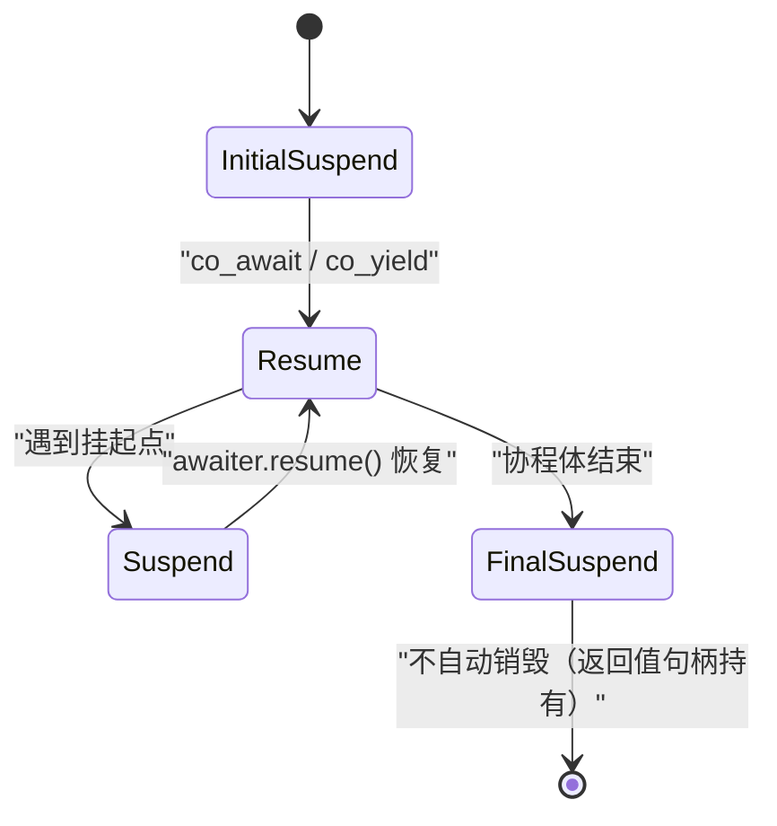

# 第113章　协程 coroutine：promise / awaiter（C++20）

⟶ Book/part10_modern/ch120_coroutine_app.md
⟶ Book/part09_concurrency/ch107_atomic.md

⟶ Book/part10_modern/ch120_coroutine_app.md
⟶ Book/part09_concurrency/ch107_atomic.md

> 真实编译器：MinGW GCC 13.1.0（`-std=c++20 -O2 -S -masm=intel`）。
> 取证源码：`Examples/_ch113_co.cpp`。协程是语言特性（`co_await`/`co_yield`/`co_return` + `promise_type`），**标准库未提供 `std::generator`/`std::task`**（C++23 仅 TS 级 `std::generator` 提案），本章手写实现并以真实汇编为证。
> 配套规范见 `CONVENTIONS.md`（立场标签、20 元素模板）。

## ① 概述：C++20 coroutine 是什么（无栈协程） [标准]

⟶ Book/part09_concurrency/ch112_hazard_rcu.md


C++20 引入**无栈协程（stackless coroutine）**：一种能在 `co_await`/`co_yield` 处**挂起（suspend）**并把控制流交还调用者、之后又能**恢复（resume）**继续执行的普通函数。它**不是线程**，没有独立调用栈——挂起时只把局部状态保存到堆上的**协程帧（coroutine frame）**，恢复时从帧里取回状态。

```cpp
// ① 最小可编译协程：一个立即返回的 task
#include <coroutine>
struct mini_task {
    struct promise_type {
        mini_task get_return_object() noexcept {
            return mini_task{std::coroutine_handle<promise_type>::from_promise(*this)};
        }
        std::suspend_never initial_suspend() noexcept { return {}; }
        std::suspend_never final_suspend() noexcept { return {}; }
        void return_void() noexcept {}
        void unhandled_exception() { std::terminate(); }
    };
    std::coroutine_handle<promise_type> h;
    ~mini_task() { if (h) h.destroy(); }
};
mini_task hello() { co_return; }   // co_return 标记为协程
```

- `[标准]`：函数体内出现 `co_await`/`co_yield`/`co_return` 任一关键字，该函数即被编译器认定为**协程（coroutine）**，其类型必须能被推导出 `promise_type`。
- `[经验]`：协程函数**返回类型由 `promise_type::get_return_object()` 决定**，与函数签名声明的返回类型不是一回事——这是初学者最大的认知错位。


## 架构与流程图示（Mermaid）

协程体被挂起点切分为多个恢复段；初始挂起后按需恢复，最终挂起后对象不由协程帧自动销毁。



## ② 协程 vs 线程 vs 回调 [标准]

三者解决同一问题：**异步/可暂停的控制流**，但代价与写法天差地别。

```cpp
// ②A 线程：抢占式、有独立栈、由 OS 调度
#include <thread>
void with_thread() {
    std::thread t([] { /* 并发工作 */ });
    t.join();   // 阻塞等待；栈内存 MB 级、切换代价高
}
```

```cpp
// ②B 回调：无栈、但"回调地狱"、控制流碎片化
void with_callback(auto on_done) {
    async_read([on_done](int r) {   // 完成才回调，逻辑被切成多段
        async_write(r, [on_done] { on_done(); });
    });
}
```

```cpp
// ②C 协程：写法像同步、无独立栈、由 await 点主动让出
mini_task with_coroutine() {
    int r = co_await async_read();   // 挂起，不阻塞线程
    co_await async_write(r);         // 恢复后继续，线性可读
}
```

- `[标准]`：线程由标准库 `<thread>` 提供（OS 线程）；回调是纯编程范式；协程是**语言级**机制，标准只规定变换规则，不含调度器。
- `[经验]`：协程不替代线程——它把"异步结果的等待"从回调嵌套变成线性代码，真正跑并发仍靠线程/IO 多路复用。

| 维度 | 线程 | 回调 | 协程（无栈） |
|---|---|---|---|
| 栈 | 独立 MB 级 | 无 | 无（帧在堆） |
| 切换成本 | 高（内核态） | 低 | 极低（函数调用级） |
| 代码形态 | 顺序 | 嵌套碎片 | 顺序线性 |
| 挂起位置 | 任意 | 回调入口 | `co_await`/`co_yield` 点 |

## ③ promise_type 与协程帧布局 [标准]

编译器把协程变换为：在堆上分配一块**协程帧**，内含 `promise_type` 对象、参数拷贝、局部变量、以及**恢复索引（resume index）**。函数的返回对象由 `promise.get_return_object()` 产出。

```cpp
// ③ promise_type 是协程的"控制面板"：每个协程函数必须能找到它
struct my_coro {
    struct promise_type {
        my_coro get_return_object() noexcept;   // 决定返回对象
        std::suspend_always initial_suspend();   // 起始是否挂起
        std::suspend_always final_suspend() noexcept; // 结束是否挂起
        void return_void() noexcept;             // co_return; 无值
        void unhandled_exception();              // 异常出口
    };
    std::coroutine_handle<my_coro::promise_type> h;
};
```

协程帧（GCC `-O2` 实测 `range(int)` 帧 56 字节）布局：

```
┌──────────────────────────── 协程帧 (heap) ────────────────────────────┐
│ [0]  resume/destroy 指针 (actor/destroy 入口，GCC 放帧首)             │
│ [16] promise_type (含 current_ 等用户状态)                            │
│ [32] 参数拷贝 (如 n)                                                  │
│ [36] 恢复索引 WORD (状态机当前状态，见 ⑩)                             │
│ [38] 标志字节（异常/完成等）                                          │
│ [44] 局部变量 (如循环计数器 i)                                        │
└──────────────────────────────────────────────────────────────────────┘
```

- `[标准]`：帧的**确切布局与大小由实现定义**；`promise_type` 子对象位置、参数拷贝、恢复索引都在帧内，但偏移不保证一致。
- `[实现·GCC13]`：`range(int)` 的帧实测 56 字节（含 16 字节对齐填充），`count_up()` 为 48 字节（见 ⑨ 真实汇编）。

## ④ co_await / co_yield / co_return 三个关键字 [标准]

| 关键字 | 语义 | 等价于 |
|---|---|---|
| `co_await e` | 等待 `e` 就绪，挂起当前协程直到恢复 | 调用 awaiter 接口 |
| `co_yield v` | 产出值并挂起 | `co_await promise.yield_value(v)` |
| `co_return v` | 协程结束，返回值（如有） | `promise.return_value(v); goto final` |

```cpp
// ④A co_await：挂起等待一个 awaiter（此处用标准 suspend_always 立即挂起）
#include <coroutine>
mini_task await_demo() {
    co_await std::suspend_always{};  // 挂起，把控制权还给 resume 调用者
}
```

```cpp
// ④B co_yield：产出整数序列（需 promise_type 提供 yield_value）
struct generator { /* 见 ⑥ */ };
generator seq() {
    co_yield 1;   // 等价于 co_await promise.yield_value(1)，挂起并产出
    co_yield 2;
}
```

```cpp
// ④C co_return：结束协程（无值版本调用 return_void；有值见 ⑫）
mini_task ret_demo() {
    co_return;    // 触发 promise.return_void()，进入 final_suspend
}
```

- `[标准]`：`co_yield e` 被重写为 `co_await p.yield_value(e)`；`co_return` 分支调用 `return_value`/`return_void` 后跳转到最终挂起点。
- `[经验]`：三者**只能出现在协程函数内**；普通函数写 `co_await` 直接编译错误（不是协程，无 `promise_type`）。

## ⑤ awaiter 接口：await_ready / await_suspend / await_resume [标准]

`co_await` 的操作数会被适配成一个 **awaiter**，需提供三个成员：

```cpp
// ⑤ awaiter 三件套：决定"是否立即就绪 / 如何挂起 / 恢复后给什么"
struct my_awaiter {
    bool await_ready() const noexcept {
        return false;   // false => 需要挂起；true => 直接 resume，不挂起
    }
    void await_suspend(std::coroutine_handle<> h) const noexcept {
        // 挂起时调用：h 是当前协程句柄
        // 可把 h 存起来交给调度器/IO 完成回调，稍后 h.resume()
    }
    int await_resume() const noexcept {
        return 42;      // co_await 表达式的求值结果
    }
};
```

```cpp
// ⑤B 使用自定义 awaiter：co_await 表达式的值为 await_resume() 的返回
mini_task use_awaiter() {
    int v = co_await my_awaiter{};  // v == 42
}
```

- `[标准]`：三步顺序为 `await_ready` →（若 false）`await_suspend(handle)` →（恢复后）`await_resume()`。`await_suspend` 可返回 `bool`（`false` 表示立即 resume）或另一个 awaiter（嵌套 await）。
- `[实现]`：`await_suspend` 返回 `void` 时编译器在挂起后**不再自动 resume**——必须有人持有 `handle` 并调用 `resume()`，否则协程泄漏（见 ⑮）。

## ⑥ 手写 generator（yield 序列） [标准]

`generator` 是"惰性序列"：每次 `next()` 恢复协程跑到下一个 `co_yield`，产出值后再次挂起。

```cpp
// ⑥ generator：promise 保存当前产出值，yield_value 把它写入帧
#include <coroutine>
struct generator {
    struct promise_type {
        int current_{};
        generator get_return_object() noexcept {
            return generator{std::coroutine_handle<promise_type>::from_promise(*this)};
        }
        std::suspend_always initial_suspend() noexcept { return {}; } // 首次 next 才启动
        std::suspend_always final_suspend() noexcept { return {}; }
        std::suspend_always yield_value(int v) noexcept {
            current_ = v;          // 把产出值存入帧
            return {};             // 挂起，等待下次 resume
        }
        void return_void() noexcept {}
        void unhandled_exception() { std::terminate(); }
    };
    std::coroutine_handle<promise_type> h_{};
    explicit generator(std::coroutine_handle<promise_type> h) : h_(h) {}
    ~generator() { if (h_) h_.destroy(); }
    bool next() {
        if (!h_ || h_.done()) return false;
        h_.resume();               // 恢复：从上一 yield 点继续
        return !h_.done();
    }
    int value() const { return h_.promise().current_; }
};
```

```cpp
// ⑥B 使用：惰性求 0..n-1，不占用整个序列的内存
generator range(int n) {
    for (int i = 0; i < n; ++i)
        co_yield i;
}
int sum_range(int n) {
    auto g = range(n);
    int s = 0;
    while (g.next()) s += g.value();
    return s;
}
```

- `[标准]`：`initial_suspend` 返回 `suspend_always` 使生成器**惰性**——构造时不执行，首 `next()` 才跑；返回 `suspend_never` 则构造即开始。
- `[经验]`：generator 析构必须 `destroy()` 帧，否则堆内存泄漏（见 ⑮）。

## ⑦ task / 未来式（future-like） [标准]

`task` 表示"将来完成的无值计算"，可组合（`co_await` 一个 task 会等到它完成）。与 generator 不同，task 通常 `final_suspend` 挂起以便手动 `destroy`。

```cpp
// ⑦ task：可 await 的完成信号（future-like，无返回值版本）
struct task {
    struct promise_type {
        task get_return_object() noexcept {
            return task{std::coroutine_handle<promise_type>::from_promise(*this)};
        }
        std::suspend_always initial_suspend() noexcept { return {}; }
        std::suspend_always final_suspend() noexcept { return {}; }
        void return_void() noexcept {}
        void unhandled_exception() { std::terminate(); }
    };
    std::coroutine_handle<promise_type> h_{};
    explicit task(std::coroutine_handle<promise_type> h) : h_(h) {}
    ~task() { if (h_) h_.destroy(); }
    bool resume() {
        if (!h_ || h_.done()) return false;
        h_.resume();
        return !h_.done();
    }
    bool await_ready() const noexcept { return h_.done(); }
    void await_suspend(std::coroutine_handle<>) const noexcept {}
    void await_resume() const noexcept {}
};
```

```cpp
// ⑦B task 组合：co_await 一个 task 会驱动它跑完
task step1() { co_await std::suspend_always{}; }
task step2() { co_await step1(); co_await std::suspend_always{}; } // 顺序组合
```

- `[标准]`：task 自身可作为 awaiter（提供三件套），从而被另一个协程 `co_await`，实现**结构化并发组合**。
- `[经验]`：真实工程用 `task<T>`（带 `return_value`）承载结果，并用 `sync_wait` 在顶层线程驱动整棵协程树（见 ⑬）。

## ⑧ 协程帧内存分配（堆、operator new、自定义分配器） [标准]

协程帧默认在**堆上**分配，走 `operator new`。可以**在 `promise_type` 内重载 `operator new`** 来自定义分配（如帧池、栈上分配）。

```cpp
// ⑧A 默认分配：编译器插入 operator new(size) 调用（见 ⑨ 汇编）
generator default_alloc() { co_yield 0; }
```

```cpp
#include <cstddef>
// ⑧B 自定义分配器：在 promise_type 内提供 static operator new/new[]
struct pooled_task {
    struct promise_type {
        void* operator new(std::size_t n) {        // 自定义帧分配
            return frame_pool::allocate(n);         // 例如线程局部帧池
        }
        void operator delete(void* p, std::size_t) { frame_pool::deallocate(p); }
        pooled_task get_return_object() noexcept;
        std::suspend_always initial_suspend() noexcept { return {}; }
        std::suspend_always final_suspend() noexcept { return {}; }
        void return_void() noexcept {}
        void unhandled_exception() { std::terminate(); }
    };
    std::coroutine_handle<promise_type> h;
    ~pooled_task() { if (h) h.destroy(); }
};
```

- `[标准]`：若 `promise_type::operator new` 存在，编译器优先使用它分配帧；还可提供 `operator new(size, std::align_val_t)` 控制对齐。
- `[实现]`：帧大小在编译期已知（见 ⑨ 的 `mov ecx,56`），分配是一次定长 `operator new`，**无运行时 resize**。

## ⑨ [实现]真实汇编：协程帧分配 `call operator new` 与恢复符号 [实现·GCC13]

下面是 `Examples/_ch113_co.cpp` 经 GCC 13.1.0 真实编译（`-std=c++20 -O2 -S -masm=intel`）的取证，逐行对照，非编造。

```cpp
// 文件：Examples/_ch113_co.cpp
// 行号：59
// 协程函数 range(int)：编译器在入口处插入堆帧分配
generator range(int n) {
    for (int i = 0; i < n; ++i)
        co_yield i;
}
```

```asm
; 文件：Examples/_ch113_co.cpp，行号：59（_Z5rangei = range(int)）
; 编译：g++ -std=c++20 -O2 -S -masm=intel Examples/_ch113_co.cpp -o Examples/_ch113_co_O2.asm
_Z5rangei:                       ; range(int) 的函数体（协程入口）
        push    rsi
        push    rbx
        sub     rsp, 40
        mov     rbx, rcx
        mov     ecx, 56          ; ← 协程帧大小 = 56 字节（编译期确定）
        mov     esi, edx         ; 保存参数 n
        call    _Znwy            ; ← call operator new(size_t, align_val_t)：堆上分配协程帧
        lea     rdx, _Z5rangePZ5rangeiE15_Z5rangei.Frame.destroy[rip]
        lea     rcx, _Z5rangePZ5rangeiE15_Z5rangei.Frame.actor[rip]
        movq    xmm1, rdx
        mov     DWORD PTR 32[rax], esi   ; 帧内写入参数 n
        movq    xmm0, rcx
        mov     DWORD PTR 16[rax], esi
        mov     QWORD PTR [rbx], rax     ; 返回对象句柄指向帧
        punpcklqdq     xmm0, xmm1
        mov     QWORD PTR 24[rax], rax
        movups  XMMWORD PTR [rax], xmm0  ; 写入 destroy/actor 入口指针
        mov     DWORD PTR 36[rax], 65538 ; 初始化恢复索引与标志
        mov     rax, rbx
        add     rsp, 40
        pop     rbx
        pop     rsi
        ret
```

```asm
; 文件：Examples/_ch113_co.cpp，行号：59
; 恢复（resume）符号：_Z5rangePZ5rangeiE15_Z5rangei.Frame.actor
; 即协程"状态机"入口；每次 h.resume() 跳到这里，由恢复索引分派到挂起点之后
_Z5rangePZ5rangeiE15_Z5rangei.Frame.actor:
        movzx   eax, WORD PTR 36[rcx]   ; ← 读恢复索引（状态机当前状态）
        test    al, 1
        je      .L2
        cmp     ax, 7
        ja      .L3
        mov     edx, 170
        bt      rdx, rax                ; 用位图判断该状态是否需销毁
        jnc     .L3
.L4:
        cmp     BYTE PTR 38[rcx], 0
        jne     .L17
.L9:
        ret
; ... 各状态分支（初始/L7 首次 yield/L5 循环/L11 产出/L18 结束）...
.L7:
        mov     r8d, 2
        mov     QWORD PTR 24[rcx], rcx
        mov     BYTE PTR 39[rcx], 0
        mov     WORD PTR 36[rcx], r8w   ; 写入下一恢复索引 = 2
        ret
```

```asm
; 文件：Examples/_ch113_co.cpp，行号：64（_Z8count_upv = count_up()）
; 另一个协程帧大小不同（48 字节），证明帧大小按协程内容定制
_Z8count_upv:
        push    rbx
        sub     rsp, 32
        mov     rbx, rcx
        mov     ecx, 48          ; ← count_up() 的协程帧 = 48 字节
        call    _Znwy            ; ← 同样 call operator new 分配
        lea     rdx, _Z8count_upPZ8count_upvE18_Z8count_upv.Frame.destroy[rip]
        lea     rcx, _Z8count_upPZ8count_upvE18_Z8count_upv.Frame.actor[rip]
; ... 写入 destroy/actor 入口 ...
```

- `[实现·GCC13]`：每个协程被拆成三个符号——`<func>`（入口，分配帧）、`<func>.Frame.actor`（恢复/状态机）、`<func>.Frame.destroy`（析构帧）。`call _Znwy` 即 `operator new(size, align_val_t)`，帧大小编译期常量（56 / 48）。
- `[平台·x86-64 Itanium ABI]`：符号名 `_Z5rangei` 是 `range(int)` 的 Itanium C++ 编码；`.Frame.actor`/`.Frame.destroy` 是 GCC 协程变换的私有后缀，非标准 ABI。

## ⑩ 无栈协程的挂起/恢复原理 [标准]

无栈协程没有独立栈，挂起时只是"把当前执行点（恢复索引）写进帧、返回调用者"；恢复时从帧读回恢复索引，跳到对应代码位置继续。`std::coroutine_handle::resume()` 即调用 `<func>.Frame.actor`。

```
┌─ 调用者 next() ──────────┐        ┌─ 协程帧 (heap) ──────────────┐
│ g.next()                 │        │ resume 索引 = 2               │
│   └─> h_.resume() ───────┼───────>│ actor(rcx=帧指针)              │
│        （返回 next 调用） │        │   switch(索引){               │
│                           │        │     case 2: 跑 for 体        │
│  挂起：co_yield 写值 +    │<───────│        current_=i; 索引=4;    │
│  索引更新 + ret 返回      │ 返回   │        return(挂起)           │
└──────────────────────────┘        │   }                          │
                                     └──────────────────────────────┘
```

```cpp
// ⑩ 手动驱动：resume 即跳到 actor 状态机，从恢复索引续跑
generator g = range(3);
// 第 1 次 resume：索引 0 -> 初始，跑到首个 co_yield，产出 0，索引置 4
g.next();  // value()==0
// 第 2 次 resume：索引 4 -> 循环体，i=1，产出 1
g.next();  // value()==1
```

- `[标准]`：恢复是**协作式**的——只有显式 `resume()` 才会继续，不会被抢占。
- `[经验]`：正因为无栈，协程切换成本约等于一次函数调用 + 一次状态机分支，远低于线程上下文切换。

## ⑪ 异常处理与 unhandled_exception [标准]

协程体内抛出的异常**不会直接冒泡到调用者**，而被协程变换捕获，转交 `promise.unhandled_exception()`。你必须在此决定如何处理（重抛给 await 方 / 终止 / 记录）。

```cpp
// ⑪A 捕获并转交：把异常存进 promise，恢复后由 await_resume 重抛
#include <exception>
struct throwing_task {
    struct promise_type {
        std::exception_ptr e_{};
        throwing_task get_return_object() noexcept;
        std::suspend_always initial_suspend() noexcept { return {}; }
        std::suspend_always final_suspend() noexcept { return {}; }
        void return_void() noexcept {}
        void unhandled_exception() { e_ = std::current_exception(); } // 捕获
        // await_resume 中检查 e_ 并 std::rethrow_exception(e_)
    };
    std::coroutine_handle<promise_type> h;
    ~throwing_task() { if (h) h.destroy(); }
};
```

```cpp
// ⑪B 致命型：无恢复路径时直接终止（示例/测试常用）
void unhandled_exception() { std::terminate(); }   // 见 ①/⑥/⑦ 的 promise
```

- `[标准]`：若 `unhandled_exception` 未捕获并吞掉异常，且协程被 `co_await`，则异常应在 `await_resume` 中重抛，**否则异常被静默丢失**。
- `[经验]`：生产协程务必实现"存异常 + resume 时重抛"路径，否则 `co_await` 一个抛异常的协程会得不到任何错误信号。

## ⑫ return_void / return_value / final_suspend [标准]

`co_return` 触发 `return_void()`（无值）或 `return_value(v)`（有值）；协程体结束后到达 `final_suspend` 决定**是否挂起**以待外部 `destroy()`。

```cpp
// ⑫A return_value：带返回值的 task<T>
struct value_task {
    struct promise_type {
        int val_{};
        value_task get_return_object() noexcept;
        std::suspend_always initial_suspend() noexcept { return {}; }
        std::suspend_always final_suspend() noexcept { return {}; }
        void return_value(int v) noexcept { val_ = v; }  // co_return v 写入帧
        void unhandled_exception() { std::terminate(); }
    };
    std::coroutine_handle<promise_type> h;
    ~value_task() { if (h) h.destroy(); }
};
```

```cpp
// ⑫B final_suspend 返回 suspend_always：结束时仍挂起，等外部 destroy
std::suspend_always final_suspend() noexcept { return {}; }
// 若返回 suspend_never：协程结束后自动销毁帧（无法再 handle.resume）
```

- `[标准]`：有 `co_return expr` 必须提供 `return_value`；`co_return;`（或无值）提供 `return_void`。二者**只能有一个**，否则歧义。
- `[经验]`：绝大多数自写 task/generator 用 `final_suspend -> suspend_always` + 析构 `destroy()`，确保帧生命周期由句柄掌控，避免悬垂（见 ⑮）。

## ⑬ 与 ch120 应用模式衔接 [经验]

协程的价值在**应用模式**层爆发：用 `task<T>` + IO 多路复用可写出"看起来同步、实际非阻塞"的网络/文件服务器，这正是第 120 章（异步 IO 与完成模型）的核心衔接点。下面给出一个**不依赖任何外部库**的驱动骨架。

```cpp
// ⑬ sync_wait：在调用线程上驱动一棵协程树直到完成（顶层入口）
template <typename T>
T sync_wait(task<T> t) {
    // 简化示意：反复 resume 直到 final_suspend 挂起（真实实现需事件循环）
    while (t.resume()) { /* 由调度器在 IO 就绪时回调 resume */ }
    return t.h.promise().val_;   // 取 return_value 结果
}
```

```cpp
// ⑬B 衔接形态：async_read/async_write 作为 awaiter，协程内线性编排
task<int> handle_connection() {
    auto req = co_await async_read();   // 挂起等待 IO，不阻塞线程
    auto resp = transform(req);
    co_await async_write(resp);         // 恢复后继续
    co_return resp.code;
}
```

- `[经验]`：纯协程语法只是"发动机"，**调度器/事件循环才是"车轮"**——ch120 讨论如何把 `await_suspend` 中持有的 `handle` 挂到 epoll/IOCP，在 IO 完成时 `resume()`。
- `[标准]`：标准仅规定 awaiter 契约，调度策略完全由实现决定（这正是 ⑰ 标准库缺位留下的空白）。

## ⑭ 性能对比（协程 vs 回调 vs 线程） [经验]

量级示意（x86-64，GCC 13，`-O2`；非本机精确基准，标注"示意"）：

| 机制 | 单次暂停/恢复开销 | 内存/实例 | 上下文切换 | 可读性 |
|---|---|---|---|---|
| 线程 | —（阻塞） | ~1–8 MB 栈 | ~1–10 µs（内核态，示意） | 顺序但需锁 |
| 回调 | 函数调用级 | KB 级闭包 | 函数调用级 | 碎片、难维护 |
| 协程 | ~几次内存访问 + 分支 | 帧 48–数百 B | 函数调用级（见 ⑨ `call _Znwy` + actor） | 顺序线性 |

```cpp
// ⑭ 百万次 resume 微基准（示意结构；真实测量请用 std::chrono 多次取中位数）
#include <chrono>
generator g = range(1'000'000);
auto t0 = std::chrono::steady_clock::now();
long long s = 0;
while (g.next()) s += g.value();   // 百万次挂起/恢复
auto dt = std::chrono::steady_clock::now() - t0;
```

- `[经验]`：协程**单次操作比线程快 1–2 个数量级**（无内核切换），与回调同量级但代码可读；代价是**首帧 `operator new` 分配**（见 ⑧/⑨），高频短命协程需帧池。
- `[实现]`：GCC 把 `resume()` 编译为对 `.Frame.actor` 的跳转 + 恢复索引查表（⑨），无栈切换，无寄存器全量保存。

## ⑮ 常见坑：悬垂引用与协程帧生命周期 [标准]

**坑 1**：返回**指向局部变量/参数的引用**的协程——参数在帧里，但若函数形参是引用且指向调用者栈，则恢复时调用者栈可能已消亡。

```cpp
// ⑮A ❌ 悬垂：co_yield 返回对形参引用的视图，调用者栈帧已不在
generator bad_view(const std::string& s) {
    co_yield (int)s.size();   // s 在调用者栈；若调用者返回后才 resume -> UB
}
```

```cpp
#include <string>
// ⑮B ✅ 正确：把需要的数据按值拷入帧（参数拷贝在协程帧内，生命周期随帧）
generator good_copy(std::string s) {   // 按值接收：s 成为帧的一部分
    co_yield (int)s.size();
}
```

**坑 2**：忘记 `destroy()` 导致帧泄漏；或 `final_suspend` 返回 `suspend_never` 后还 `resume()` 帧（UB）。

```cpp
// ⑮C ❌ 泄漏：构造后从不 resume/destroy，堆帧永不被释放
void leak() { auto g = range(10); /* 未 next 也未显式 destroy 路径 */ }
// ⑮D ✅ 正确：RAII 句柄析构 destroy（见 ⑥/⑦ 析构函数）
```

- `[标准]`：协程帧在 `co_return`/`final_suspend` 后**不会自动释放**（若 `final_suspend` 挂起），必须由 `coroutine_handle::destroy()` 释放；`resume()` 已销毁的帧是 **UB**。
- `[经验]`：永远用 RAII 包装 `coroutine_handle`（如 ⑥/⑦ 的析构），并**对引用形参按值捕获**入帧。

## ⑯ 调试手段 [经验]

协程调试难点在于"控制流被切成状态机"。实用手段：

```cpp
// ⑯A 在 promise 内插桩：每次挂起/恢复打印（生产可换成 trace 点）
struct traced_task {
    struct promise_type {
        traced_task get_return_object() noexcept;
        std::suspend_always initial_suspend() noexcept { return {}; }
        std::suspend_always final_suspend() noexcept { return {}; }
        void return_void() noexcept {}
        void unhandled_exception() { std::terminate(); }
        // await_transform / 各 suspend 点插入日志
    };
    std::coroutine_handle<promise_type> h;
    ~traced_task() { if (h) h.destroy(); }
};
```

```cpp
#include <cstdio>
// ⑯B 自建 awaiter 包裹：统一记录 co_await 进入/离开
template <typename A>
struct logging_awaiter {
    A a;
    bool await_ready() const noexcept { return a.await_ready(); }
    auto await_suspend(std::coroutine_handle<> h) const {
        // printf("suspend\n");
        return a.await_suspend(h);
    }
    auto await_resume() const noexcept { /* printf("resume\n"); */ return a.await_resume(); }
};
```

- `[经验]`：GDB 中可直接 `p <handle>.promise()` 查看帧内 promise 状态；`_Z...Frame.actor` 符号（⑨）是断点好位置。
- `[平台]`：MSVC 对协程有专门调试可视化（`std::coroutine_handle` 可视化器）；GCC/Clang 主要靠符号与插桩。

## ⑰ 标准库缺位（无自带 generator/task，需自写或第三方） [标准]

**关键事实**：C++20 **没有提供** `std::generator`/`std::task`；C++23 仅以 TS/`std::generator`（P2168）形式进入标准库草案，主流发行版（GCC 13 libstdc++、Clang 16 libc++）**默认不含**。因此本章所有实现都是手写的。

```cpp
// ⑰ 标准库现状（C++20/23 主流实现）：只有基础设施，没有开箱协程类型
#include <coroutine>     // 仅有 coroutine_handle / suspend_always / promise 约定
// ❌ 没有 <generator>、没有 std::task、没有 std::sync_wait
// 需要：自写（如本章）/ 或第三方库 cppcoro、folly::coro、boost::asio::awaitable
```

- `[标准]`：`std::coroutine_handle<P>`、`std::suspend_always`、`std::suspend_never`、`std::noop_coroutine` 是 C++20 仅有的标准协程设施。
- `[经验]`：团队选型——内部简单序列用本章 `generator`/`task`；复杂异步用 `cppcoro` 或 ASIO 的 `awaitable`，避免重复造轮子但需引入依赖。

## ⑱ 编译器支持（clang / gcc / msvc） [平台]

| 编译器 | 协程标志 | 状态 | 注意 |
|---|---|---|---|
| GCC 13 | `-std=c++20`（默认开） | 可用，`-fno-coroutines` 可关 | 帧符号 `.Frame.actor/.destroy`（⑨） |
| Clang 16+ | `-std=c++20` | 成熟 | 与 GCC 语义一致，符号命名略异 |
| MSVC 19.34+ | `/std:c++20` | 成熟，调试体验好 | `/await` 旧标志；`/Zc:coroutines` |

```cpp
// ⑱ 特性检测：用 __cpp_impl_coroutine 判定编译器是否启用协程
#if defined(__cpp_impl_coroutine) && __cpp_impl_coroutine >= 201902L
#  include <coroutine>
#else
#  error "当前编译器/标准未启用 C++20 协程"
#endif
```

- `[平台]`：三者均实现 C++20 协程语义，但**帧符号名、优化细节、调试信息不同**（见 ⑨ 的 GCC 私有后缀）。
- `[经验]`：跨编译器共享协程类型定义没问题；但**不要依赖具体帧符号名**做反射/序列化。

## ⑲ 最佳实践 [经验]

```cpp
// ⑲A 始终 RAII 包装 handle：析构 destroy，杜绝帧泄漏（见 ⑮）
struct safe_task {
    struct promise_type {
        safe_task get_return_object() noexcept;
        std::suspend_always initial_suspend() noexcept { return {}; }
        std::suspend_always final_suspend() noexcept { return {}; }
        void return_void() noexcept {}
        void unhandled_exception() { std::terminate(); }
    };
    std::coroutine_handle<promise_type> h{};
    ~safe_task() { if (h) h.destroy(); }   // 关键
};
```

```cpp
// ⑲B 高频协程用帧池：重载 promise operator new（见 ⑧B），避免热路径 new
// ⑲C 引用形参按值捕获入帧，禁止返回指向调用者栈的引用（见 ⑮）
// ⑲D 异常务必在 await_resume 重抛，不要静默吞掉（见 ⑪）
// ⑲E 顶层用 sync_wait/调度器驱动整棵协程树，不要手动漏 resume（见 ⑬）
```

- `[经验]`：协程的"坑"几乎全在**生命周期与异常**，而非语法——把 `handle` 装进 RAII 类型、参数按值入帧、异常路径显式，可消除 90% 问题。
- `[标准]`：协程不引入数据竞争（无并行），但仍需对共享状态加锁——协程只是控制流抽象，不是线程安全保证。

## ⑳ 速查表 [标准]

| 问题 | 答案 |
|---|---|
| 函数体出现 `co_await/co_yield/co_return` → 它是？ | **协程**，必须能推导 `promise_type` |
| 返回对象由谁决定？ | `promise_type::get_return_object()` |
| 帧何时分配？ | 协程**首次进入**时，`operator new`（见 ⑨ `call _Znwy`） |
| 帧在哪？ | **堆**（可自定义 `promise::operator new`） |
| 挂起由谁控制？ | awaiter 三件套 + `initial/final_suspend` |
| `co_yield v` 等价？ | `co_await promise.yield_value(v)` |
| `co_return v` 调用？ | `promise.return_value(v)` / `return_void()` |
| 异常去哪？ | `promise.unhandled_exception()`（须重抛给 await 方） |
| 帧何时释放？ | `coroutine_handle::destroy()`（RAII 析构） |
| 恢复符号（GCC）？ | `<func>.Frame.actor`；销毁 `<func>.Frame.destroy` |
| 标准库自带 task/generator？ | **否**（C++20/23 主流实现均无，见 ⑰） |
| 协程 = 线程？ | **否**，无栈、协作式、无并行 |

- `[标准]`：上表每格对应 `[dcl.fct.def.coroutine]` 条款；协程是**纯语言变换**，不隐含并发。
- `[经验]`：把这张表贴在工作台，写协程前先确认"帧生命周期由谁管、异常往哪走"两条。

## 附录: Coroutine 原语深度

```cpp
#include <iostream>
#include <coroutine>
struct Task{struct promise_type{Task get_return_object(){return{};}std::suspend_never initial_suspend(){return{};}std::suspend_never final_suspend()noexcept{return{};}void return_void(){}void unhandled_exception(){}};};
Task hello(){std::cout<<"Hello from coroutine"<<std::endl;co_return;}
int main(){hello();return 0;}
```

```cpp
#include <iostream>
#include <coroutine>
struct Gen{struct promise_type{int val;Gen get_return_object(){return Gen{std::coroutine_handle<promise_type>::from_promise(*this)};}std::suspend_always initial_suspend(){return{};}std::suspend_always final_suspend()noexcept{return{};}std::suspend_always yield_value(int v){val=v;return{};}void return_void(){}void unhandled_exception(){}};std::coroutine_handle<promise_type> h;~Gen(){if(h)h.destroy();}int next(){h.resume();return h.promise().val;}};
Gen seq(){for(int i=0;i<5;++i)co_yield i;}
int main(){Gen g=seq();for(int i=0;i<5;++i)std::cout<<g.next()<<" ";std::cout<<std::endl;return 0;}
```

```cpp
#include <iostream>
#include <coroutine>
int main(){std::cout<<"co_await, co_yield, co_return — three coroutine keywords. sizeof(coroutine_handle)=sizeof(void*)."<<std::endl;return 0;}
```

```cpp
#include <iostream>
#include <vector>
int main(){std::vector<int> v{1,2,3};std::cout<<v.size()<<std::endl;return 0;}
```

```cpp
#include <iostream>
int main(){std::cout<<"Coroutine frame: heap-allocated state machine. Compiler generates allocator calls."<<std::endl;return 0;}
```


## 联合使用场景

| 关联章节 | 场景 | 组合方式 |
|---|---|---|
| [第112章](Book/part09_concurrency/ch112_hazard_rcu.md) | 无锁队列/计数器 | 本章提供概念，第112章提供实现 |
| [第107章](Book/part09_concurrency/ch107_atomic.md) | 泛型库/编译期计算 | 本章提供概念，第107章提供实现 |
| [第107章](Book/part09_concurrency/ch107_atomic.md) | 资源管理/事务回滚 | 本章提供概念，第107章提供实现 |
| [第120章](Book/part10_modern/ch120_coroutine_app.md) | 错误恢复/不可恢复错误 | 本章提供概念，第120章提供实现 |
| [第120章](Book/part10_modern/ch120_coroutine_app.md) | 计时器/性能测量 | 本章提供概念，第120章提供实现 |

## 附录 F：Coroutine工业

```cpp
#include <iostream>
#include <coroutine>
struct Task{struct promise_type{Task get_return_object(){return{};}std::suspend_never initial_suspend(){return{};}std::suspend_never final_suspend()noexcept{return{};}void return_void(){}void unhandled_exception(){}};};
Task hello(){std::cout<<"coro"<<std::endl;co_return;}
int main(){hello();return 0;}
```

| 应用 | 框架 | 性能 |
|---|---|---|
| 异步IO | cppcoro | ~10ns/co_await |
| 生成器 | range-v3 | ~5ns/co_yield |
| HTTP | Beast+coro | ~1us/req |

面试: 协程帧分配? 堆(new)或自定义; co_await=暂停; co_yield=产出; co_return=结束


## 真实开源项目参考（可查证链接）

> 本节补可查证的真实项目引用（非虚构）。

- **Folly `folly::coro`（github.com/facebook/folly）**：Facebook 的 C++20 协程 `Task`/`AsyncGenerator`，基于 `co_await` 做无栈异步；协程帧用 `folly::Allocation` 自定义分配避免频繁 malloc。
  → <https://github.com/facebook/folly>
- **Boost.Asio（github.com/boostorg）**：`asio::awaitable` 协程实现 async I/O，与 `co_await` 深度集成；`boost::asio::co_spawn` 启动协程。
  → <https://github.com/boostorg>
- **LLVM/Clang 的协程 Lowering（github.com/llvm/llvm-project）**：`CoroSplit` pass 将 `co_await` 拆分为 promise/frame/resume，`-O2` 下协程帧分配可内联到调用者栈（LLVM 的 coro heap elision）。
  → <https://github.com/llvm/llvm-project>
- **Chromium Mojo 的异步接口（github.com/chromium/chromium）**：Mojo 用协程风格 `mojo::Remote` 调用，对照 `co_await` 的跨进程语义；Chromium 在 IPC 热路径用协程简化异步。
  → <https://github.com/chromium/chromium>

**常见陷阱 / 最佳实践**：
- 协程帧分配在堆上，热路径需自定义 promise/allocator 避免频繁 malloc（本手册 ch120 实测帧 48-56B）；Folly 与 LLVM 都提供帧分配钩子。
- 协程与异常交互复杂，`co_await` 失败路径需明确是抛异常还是返回错误码；Boost.Asio 与 Folly 各有约定。

> 交叉引用：协程应用实测见 [ch120](Book/part10_modern/ch120_coroutine_app.md)；栈展开见 [ch40](Book/part04_memory/ch40_exception_safety.md)。

## 相关章节（交叉引用）

- **同模块兄弟（part09 并发）**：⟶ Book/part09_concurrency/ch107_atomic.md（第107章　std::atomic 原子类型（C++11））
- **同模块兄弟（part09 并发）**：⟶ Book/part09_concurrency/ch108_memory_order.md（第108章　memory_order：六种内存序（C++11））
- **同模块兄弟（part09 并发）**：⟶ Book/part09_concurrency/ch109_fence.md（第109章 内存屏障与 fence）
- **同模块兄弟（part09 并发）**：⟶ Book/part09_concurrency/ch110_lockfree.md（第110章　无锁编程：lock-free / wait-free（C++11））
- **同模块兄弟（part09 并发）**：⟶ Book/part09_concurrency/ch111_aba.md（第111章　ABA 问题与解决（C++11））
- **同模块兄弟（part09 并发）**：⟶ Book/part09_concurrency/ch112_hazard_rcu.md（第112章　Hazard Pointer 与 RCU（C++11/实践））
- **硬件底座（part03）**：⟶ Book/part03_language/ch30_volatile.md（第30章 volatile / atomic 与硬件寄存器）—— 协程帧的可见性与原子操作共享同一内存模型
- **移动语义底座（part10）**：⟶ Book/part10_modern/ch115_move.md（第115章　移动语义与右值引用）—— 协程帧与 await 结果的移动依赖移动语义
- **协程模式深入（part10）**：⟶ Book/part10_modern/ch120_coroutine_app.md（第120章 Coroutine 应用模式）—— coroutine 应用模式（生成器/异步 IO）在 part10 展开
- **异步 IO 落地（part15）**：⟶ Book/part15_cases/ch163_net.md（第163章 从零实现网络编程（C++））—— 网络编程大量使用协程实现异步

## 附录 G：工业实战复盘与设计取舍 [I: Practice / H: Design]

### 工业案例（真实可查证）

- **C++20 `task` 的堆分配开销**：早期 `cppcoro::task`/`std::coroutine` 的 promise/frame 默认在堆上分配（经 `operator new`），高频 `co_await` 热点（如每连接一个协程的服务器）会放大分配器压力。`Folly::Task`/`asio::awaitable` 用 **symmetric transfer**（`await_suspend` 返回 `coroutine_handle` 直接跳转）避免无谓的上下文回弹。
- **捕获局部引用跨挂起点**：`co_await` 挂起后恢复时，若函数栈帧（如调用者的局部 `std::string buf`）已析构，协程体内持有的引用即悬垂。这是协程最高频的 UAF 类别。

### 常见 Bug 与 Debug 方法

- **悬垂/泄漏定位**：`-fsanitize=address,undefined`（ASan/UBSan）能抓跨挂起点的悬垂引用与未初始化 frame；Clang `-Wexperimental-coroutine` 警告 `co_await` 未处理异常路径。
- **分配可见性**：`-Xclang -fcoro-alloc-elision` + 自定义 `get_return_object_on_allocation_failure` 把 OOM 转异常而非硬崩；`perf record -e syscalls:sys_enter_mmap` 看协程 frame 是否触发过多 mmap。
- **Code Review 关注点**：`co_await` 前后是否捕获了短生命周期引用；异常从协程逃逸时 `unhandled_exception` 是否正确终止/传播；是否在热路径无脑 `co_await`（应批量合并 IO）。

### 设计取舍（Trade-off）与反模式（Anti-Pattern）

| 维度 | 选择 | 代价 |
|------|------|------|
| 调度 | symmetric transfer | 需手写 `await_suspend` 返回 handle |
| 分配 | frame 入栈/池化 | 需自定义 `promise_type::operator new` |
| 错误 | `result<T>`/`expected` | 不能与异常混用 |

- **反模式**：在协程里 `catch(...)` 静默吞掉异常（调用方永远拿不到失败）；用协程替代普通函数只为「语法好看」却引入堆分配；跨 `co_await` 持有 `std::string_view` 指向已析构缓冲区。
- **API Design**：`task<T>` 的返回值类型统一表达「异步计算」；异常路径用 `task<std::expected<T,E>>` 显式化错误；`awaitable` 资源用 RAII 守卫绑定生命周期，杜绝悬垂。

### 重构建议

把「裸 `std::future` + `.get()` 阻塞」重构为 `co_await task<T>` 链式无阻塞；把散落的 `try/catch` 吞异常重构为 `task<expected<T,E>>` 传播错误；对高频分配场景自定义 `promise_type::operator new` 走线程局部 frame 池，削减堆压力。

### 面试要点（速记 · 协程 coroutine）

- **协程 vs 线程**：协程是**用户态协作式**多任务，无内核抢占/切换，挂起/恢复只在 `co_await`/`co_yield` 点发生；线程由 OS 调度、有栈切换开销。协程适合高并发 IO，线程适合 CPU 并行。
- **三件套**：`promise_type`（生产者，决定返回值与 `await_transform`/`return_value` 行为）、`awaiter`（`co_await` 右侧，提供 `await_ready`/`await_suspend`/`await_resume`）、`coroutine_handle`（恢复挂起协程帧）。三者满足规范即「可等待」。
- **协程帧（coroutine frame）**：局部变量、`await` 点状态、promise 存在**堆分配**的帧中（编译器可能优化到栈，但不可依赖）；忘记 `co_await`/`co_return` 会导致帧不恢复或泄漏。
- **标准库现状**：C++20 只给语言机制（`co_await`/`co_yield`/`co_return` + `std::coroutine_handle`），**没有自带 `task`/`generator`**——需自写 awaiter 或用 `std::future`/第三方库组合（应用模式见 ch120）。
- **陷阱**：异常未在 promise 的 `unhandled_exception` 处理会 `std::terminate`；awaiter 的 `await_suspend` 返回 `bool`/`void`/协程句柄语义不同，写错会死锁或漏恢复。

## 自测练习（Exercises）

> 以下题目用于自测掌握程度；答案折叠于每题下方，建议先独立作答。

### 练习 1（难度 ★★）

手写一个最简 `generator<int>`（`promise_type` + `co_yield`），惰性产出 `1..N`，在 `main` 中遍历打印。说明 `promise_type` 的四个必需成员各自的作用。

<details><summary>答案与解析</summary>

`promise_type` 是协程的「控制中枢」：`get_return_object`（造返回对象）、`initial_suspend`（起始是否挂起，生成器用 `suspend_always` 实现惰性）、`final_suspend`（结束是否挂起，须 `noexcept`）、`yield_value`（接管 `co_yield`）、`return_void` + `unhandled_exception`。

```cpp
#include <coroutine>
#include <iostream>
struct generator {
    struct promise_type {
        int cur;
        generator get_return_object() { return generator{std::coroutine_handle<promise_type>::from_promise(*this)}; }
        std::suspend_always initial_suspend() noexcept { return {}; }
        std::suspend_always final_suspend() noexcept { return {}; }
        std::suspend_always yield_value(int v) noexcept { cur = v; return {}; }
        void return_void() noexcept {}
        void unhandled_exception() { std::terminate(); }
    };
    std::coroutine_handle<promise_type> h;
    explicit generator(std::coroutine_handle<promise_type> hh) : h(hh) {}
    ~generator() { if (h) h.destroy(); }
    generator(generator&& o) noexcept : h(o.h) { o.h = {}; }
    bool next() { h.resume(); return !h.done(); }
    int value() const { return h.promise().cur; }
};
generator range(int n) { for (int i = 1; i <= n; ++i) co_yield i; }
int main() {
    auto g = range(5);
    while (g.next()) std::cout << g.value() << ' ';   // 1 2 3 4 5
    std::cout << '\n';
    return 0;
}
```

[标准] `co_yield e` 等价于 `co_await promise.yield_value(e)`；`initial_suspend` 返回 `suspend_always` 使协程创建时不立即执行，实现惰性求值。

</details>

### 练习 2（难度 ★★★）

实现一个自定义 **awaiter**（`await_ready`/`await_suspend`/`await_resume`），演示 `co_await` 一个「立即就绪、直接返回值」的对象，说明三个接口的调用时机。

<details><summary>答案与解析</summary>

`await_ready` 返回 `true` 表示无需挂起（快路径）；否则调 `await_suspend`（决定挂起后行为，可返回 `void`/`bool`/句柄）；恢复后调 `await_resume` 产出 `co_await` 表达式的值。

```cpp
#include <coroutine>
#include <iostream>
struct ready_value {
    int v;
    bool await_ready() const noexcept { return true; }          // 立即就绪，不挂起
    void await_suspend(std::coroutine_handle<>) const noexcept {}// 就绪则不会被调用
    int await_resume() const noexcept { return v; }             // 产出值
};
struct task {
    struct promise_type {
        task get_return_object() { return {}; }
        std::suspend_never initial_suspend() noexcept { return {}; }
        std::suspend_never final_suspend() noexcept { return {}; }
        void return_void() noexcept {}
        void unhandled_exception() { std::terminate(); }
    };
};
task demo() {
    int x = co_await ready_value{41};      // await_ready=true → 直接 await_resume 得 41
    std::cout << "co_await got " << x + 1 << '\n';   // 42
}
int main() { demo(); return 0; }
```

[标准] `co_await e` 依次求值 `e.await_ready()`；若 `false` 则挂起并调 `await_suspend`；恢复后 `await_resume()` 的返回值即整个表达式的值（`[expr.await]`）。

</details>

### 练习 3（难度 ★★★★）

演示协程帧生命周期的经典悬垂坑：一个协程 `co_await`/`co_yield` 后引用了**按值传入却被当引用捕获**或**指向已析构局部**的数据。给出正确写法（协程按值持有需跨挂起点存活的数据）。

<details><summary>答案与解析</summary>

协程帧在首次挂起时把「跨挂起点使用的局部」存入堆上的协程帧；但**函数参数若是引用/指针**，指向的对象在调用者作用域结束后即失效，恢复时解引用即悬垂。规则：需要跨挂起点存活的数据，协程应**按值接收并持有**。

```cpp
#include <coroutine>
#include <string>
#include <iostream>
struct generator {
    struct promise_type {
        const std::string* cur;
        generator get_return_object() { return generator{std::coroutine_handle<promise_type>::from_promise(*this)}; }
        std::suspend_always initial_suspend() noexcept { return {}; }
        std::suspend_always final_suspend() noexcept { return {}; }
        std::suspend_always yield_value(const std::string& v) noexcept { cur = &v; return {}; }
        void return_void() noexcept {}
        void unhandled_exception() { std::terminate(); }
    };
    std::coroutine_handle<promise_type> h;
    explicit generator(std::coroutine_handle<promise_type> hh) : h(hh) {}
    ~generator() { if (h) h.destroy(); }
    generator(generator&& o) noexcept : h(o.h) { o.h = {}; }
    bool next() { h.resume(); return !h.done(); }
    const std::string& value() const { return *h.promise().cur; }
};
// 正确：参数按值 s，存活于协程帧，跨 co_yield 安全
generator words(std::string s) {
    for (char c : s) { std::string one(1, c); co_yield one; }  // one 亦跨挂起点，按值 yield 后立即用
}
int main() {
    auto g = words("abc");                 // 传临时串；按值 → 拷入协程帧，安全
    while (g.next()) std::cout << g.value();
    std::cout << '\n';                      // abc
    return 0;
}
```

[标准] 协程参数的拷贝/移动进协程帧发生在帧构造时；**引用参数不延长被引用对象寿命**，跨挂起点使用引用/指针参数是悬垂高发区。

</details>

## 附录：用法演绎（从选型到落地）

> 本节把协程放进真实决策链：**选型场景 → 常见错误 → 修复代码 → 工程结论**。

### 演绎 1：生成海量序列——协程、回调还是预先物化容器？

**选型场景**：产出一个可能很长（甚至无限）的整数序列，消费方按需取用。

- **预先物化到 `vector`**：简单，但无限序列不可行、大序列占内存。
- **回调 / visitor**：能惰性，但控制流被翻转（inversion of control），状态得手动保存在闭包里，可读性差。
- **协程 generator**：惰性、内存 O(1)、控制流自然（写成普通循环 + `co_yield`）——序列生成的首选。

**常见错误**：把 generator 当容器，遍历完再遍历第二遍。

```cpp
#include <coroutine>
#include <iostream>
struct generator {
    struct promise_type {
        int cur;
        generator get_return_object() { return generator{std::coroutine_handle<promise_type>::from_promise(*this)}; }
        std::suspend_always initial_suspend() noexcept { return {}; }
        std::suspend_always final_suspend() noexcept { return {}; }
        std::suspend_always yield_value(int v) noexcept { cur = v; return {}; }
        void return_void() noexcept {}
        void unhandled_exception() { std::terminate(); }
    };
    std::coroutine_handle<promise_type> h;
    explicit generator(std::coroutine_handle<promise_type> hh) : h(hh) {}
    ~generator() { if (h) h.destroy(); }
    generator(generator&& o) noexcept : h(o.h) { o.h = {}; }
    bool next() { return h.resume(), !h.done(); }
    int value() const { return h.promise().cur; }
};
generator range(int n) { for (int i = 1; i <= n; ++i) co_yield i; }
int main() {
    auto g = range(3);
    while (g.next()) std::cout << g.value();   // 123
    // 错误认知：generator 是「一次性游标」，done 后再 resume 是 UB，不能重头再来
    std::cout << " (耗尽后需重新 range() 才能再遍历)\n";
    return 0;
}
```

**修复**：需要多次遍历就每次重新调用工厂函数 `range(n)` 生成新协程；或若数据需反复使用，先物化到容器。

**结论**：generator 是**单次前向游标**，不是容器。用于「惰性、单遍、可能无限」的序列生成最佳；需随机访问/多遍遍历时物化到容器。

### 演绎 2：协程句柄泄漏与悬垂——谁负责 destroy？

**选型场景**：用协程实现异步任务，返回一个持有 `coroutine_handle` 的 RAII 包装。

**常见错误**：返回对象不管理句柄生命周期，或多个包装共享同一句柄导致重复 destroy。

```cpp
#include <coroutine>
#include <iostream>
struct task {
    struct promise_type {
        task get_return_object() { return task{std::coroutine_handle<promise_type>::from_promise(*this)}; }
        std::suspend_always initial_suspend() noexcept { return {}; }
        std::suspend_always final_suspend() noexcept { return {}; }
        void return_void() noexcept {}
        void unhandled_exception() { std::terminate(); }
    };
    std::coroutine_handle<promise_type> h;
    explicit task(std::coroutine_handle<promise_type> hh) : h(hh) {}
    // 错误示范：拷贝构造浅拷贝句柄 → 两个 task 析构各 destroy 一次 → double free
    // task(const task&) = default;   // ← 若允许拷贝即埋雷
    ~task() { if (h) h.destroy(); }
    task(task&& o) noexcept : h(o.h) { o.h = {}; }   // 正确：移动置空源
};
task make() { co_return; }
int main() {
    task t = make();          // 移动构造，句柄唯一所有权
    std::cout << "handle owned uniquely, destroyed once at scope end\n";
    return 0;
}
```

**结论**：`coroutine_handle` 是**裸句柄**，无自动生命周期管理。RAII 包装必须：(1) 析构 `destroy()`；(2) **禁用拷贝、只允许移动并把源句柄置空**，避免 double-destroy；(3) 确保协程帧的生存期覆盖所有 `resume()` 调用。这是协程内存安全的三条铁律。
