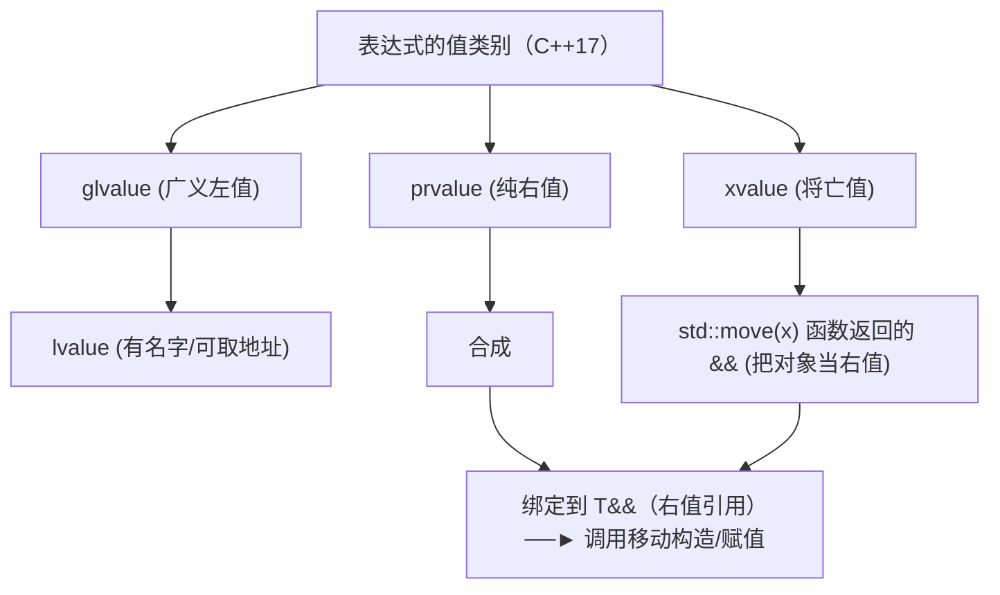
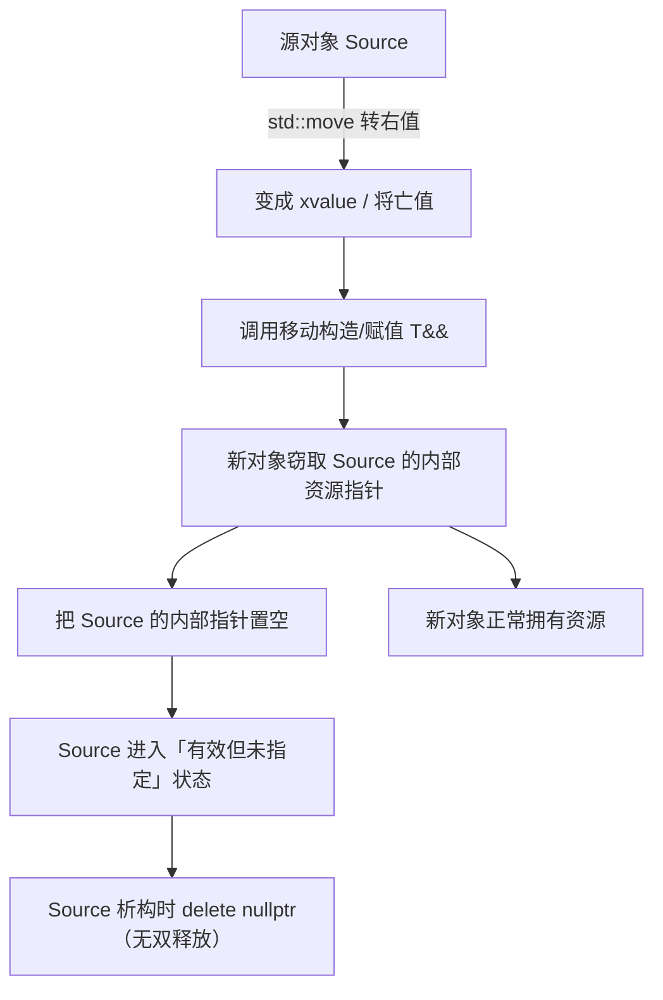
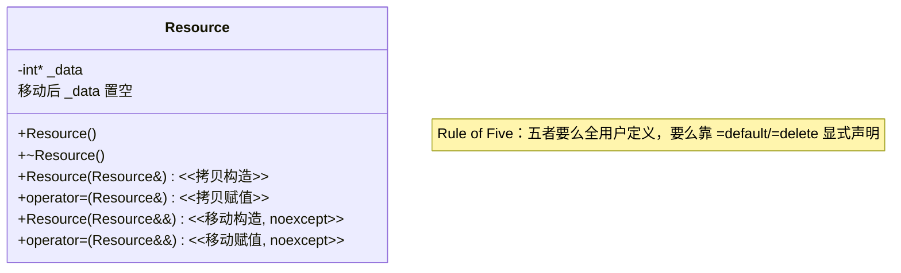
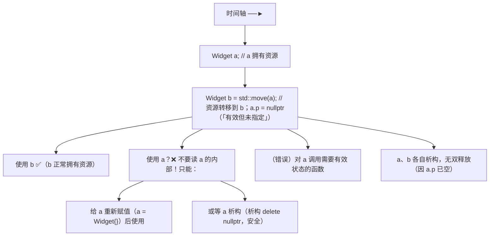
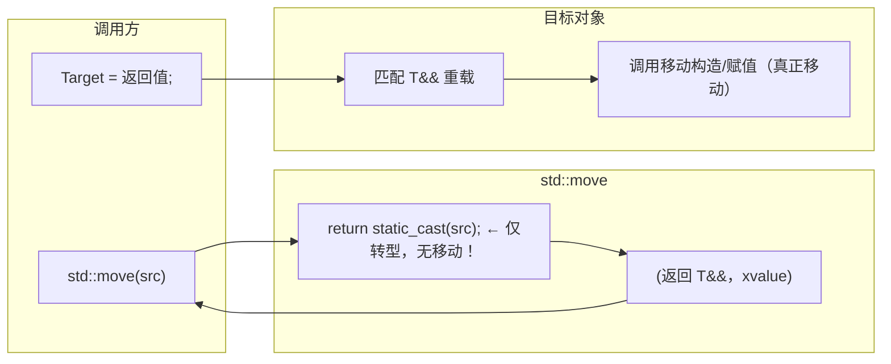
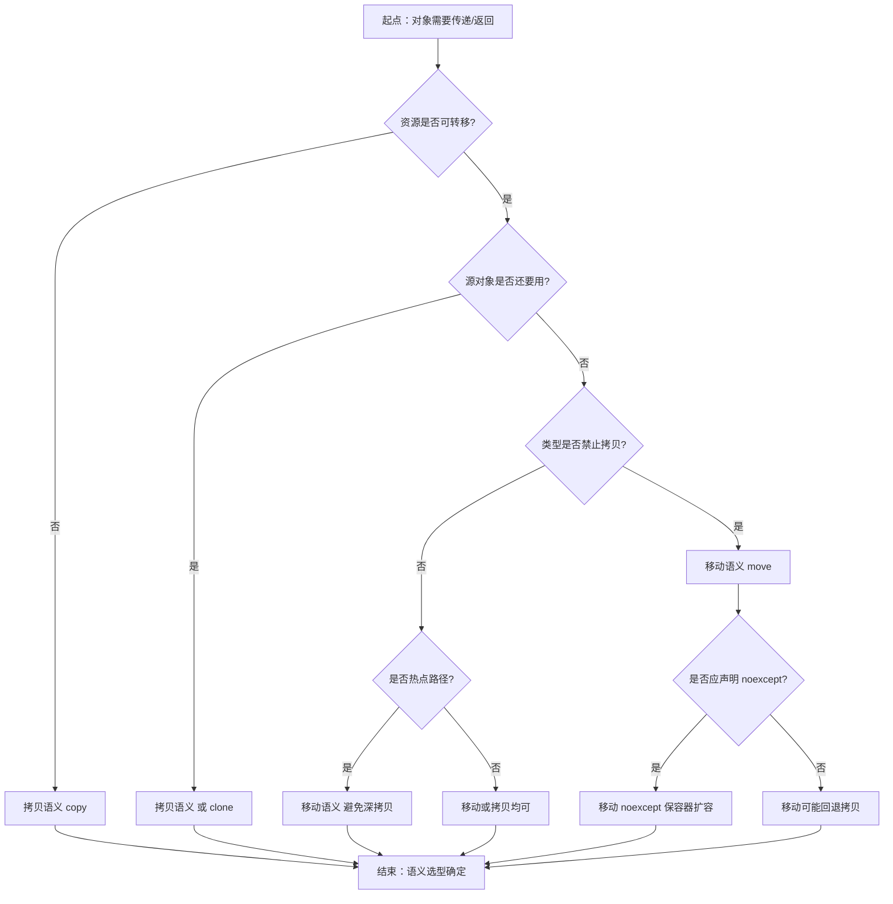
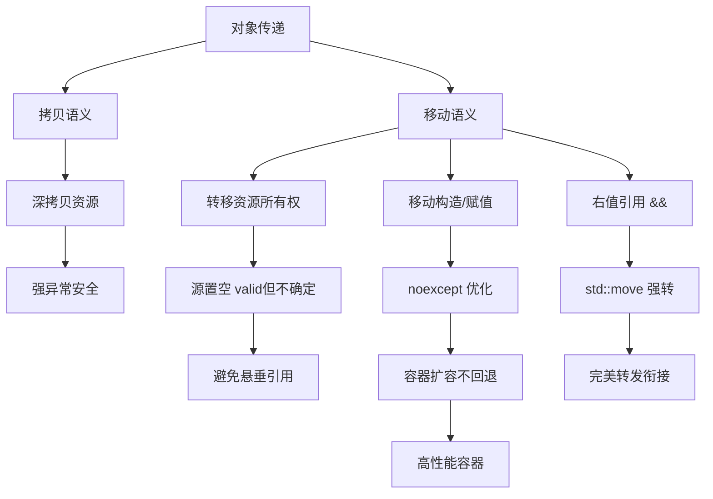

# 第115章　移动语义与右值引用
> **[验证环境·实现]** 本章示例在 **Windows 11 · MinGW-w64 GCC 15.3.0 · `-std=c++23 -O2`** 下编译验证。移动语义本身是 <span class="badge badge-std">标准</span> 定义的语言机制；但「移动后性能提升 X」「NRVO 是否触发」等**实测结论依赖具体编译器与优化级别**（GCC 15.3.0 / `-O2`），不可移植为通用性能定律。断言如「移动比拷贝快」仅在给定类型与编译器下成立，标 `[UNVERIFIED]` 处请以本机复测为准。

> 标准基：ISO/IEC 14882:2023 (C++23) / 预计阅读：95 分钟 / 前置：[第19章　变量、存储期、链接与 ODR（工业级深度版）](../part03_language/ch19_variables.md)（变量与存储期）、[第20章　引用（reference）vs 指针（pointer）：语义本质、底层实现与生命周期战争](../part03_language/ch20_reference_pointer.md)（引用与指针）、[第 39 章　RAII 与 Rule of Zero/Three/Five](../part04_memory/ch39_raii_rule.md)（Rule of Three/Five/Zero）、[第77章　vector：扩容、失效、allocator 协作](../part07_stl/ch77_vector.md)（vector 扩容）/ 后续：[第116章　完美转发与万能引用](../part10_modern/ch116_perfect_forwarding.md)（完美转发）、[第117章　RVO / NRVO 与拷贝消除（C++17）](../part10_modern/ch117_copy_elision.md)（RVO/NRVO）、[第27章　显式转型四兄弟与隐式转换：const_cast / static_cast / dynamic_cast / reinterpret_cast 深度详解](../part03_language/ch27_cast.md)（cast）/ 难度：★★★★☆｜层级：L2 进阶

## ⓪ 历史动机：移动语义的来龙去脉
> 一个即将销毁的临时对象，凭什么还要被"拷贝"一遍？这曾是 C++ 最刺眼的浪费。

### 0.1 起源（谁·何时·为何）
C++98 是严格的"值语义"：函数按值返回大对象、把临时对象赋给变量，都会触发一次**深拷贝**。但临时对象（右值）马上就要死了，拷它毫无意义——这成了 `std::vector` 返回、容器插入等场景的性能黑洞。<span class="badge badge-history">史</span> 更早的 `std::auto_ptr` 曾试图用"拷贝即转移所有权"来规避拷贝，却因"拷贝构造竟悄悄把源置空"这种反直觉行为，留下大量悬垂别名 bug——它恰恰暴露了"我们缺一种只针对将亡对象的语义"。<span class="badge badge-history">史</span>

### 0.2 关键转折（编年）
- C++98：`auto_ptr` 的"转移语义"雏形，缺陷明显，最终被弃用。<span class="badge badge-history">史</span>
- **C++11（2011）**：Howard Hinnant 等人推动引入**右值引用（`T&&`）** 与**移动语义**，正式把"将亡值"从语言层面分离出来；`std::move` 与移动构造/赋值成为标准设施。<span class="badge badge-history">史</span>
- C++17：引入**强制拷贝消除（guaranteed copy elision）**，与移动配合进一步消灭冗余构造。<span class="badge badge-history">史</span>

### 0.3 设计哲学之争
移动语义的本质争论是**"移动后源对象算什么状态"**。C++ 选了"移动后处于有效但未指定（valid but unspecified）状态"——既不用像销毁那样禁止再碰，又不必承诺仍是原值，给实现留余地。<span class="badge badge-comment">评</span> 这与 Rust 形成对照：Rust 移动后旧绑定直接不可用（编译期禁止访问），更严格但也要靠借用检查器；C++ 把"别再用已移动对象"的责任交还程序员。右值引用的引入还顺手修复了 `auto_ptr` 的老问题：`T&&` 让编译器能区分"我要移动"和"我在拷贝"。<span class="badge badge-history">史</span>

### 0.4 史料补遗与持续编年
移动语义定标后，演进集中在"把冗余构造彻底消灭"和"与借用模型对话"两端。

- C++17 引入**强制拷贝消除（guaranteed copy elision）**，把 prvalue 初始化同类型对象时的拷贝/移动从"编译器可做"升级为"语言必须省略"，与移动语义互相补位。<span class="badge badge-history">史</span>
- <span class="badge badge-history">史</span> 移动语义的普及也倒逼标准库重写：`std::unique_ptr`、`std::string`（SSO）、`std::vector` 纷纷补齐移动构造/赋值，容器扩容与返回大对象从此几乎零拷贝。
- <span class="badge badge-comment">评</span> C++ 始终没走 Rust 那条"移动后旧绑定编译期不可用"的路——它把"别再用已移动对象"的责任交还程序员，换得与四十年存量代码的兼容；这是务实，也是负担。
- <span class="badge badge-anecdote">轶</span> `std::move` 名字是最广为误解的 API 之一：它什么都不移动，只是 `static_cast<T&&>`，真正干活的是随后的移动构造/赋值；名字是"语义提示"而非"动作"。
- C++20/23 继续打磨值类别与 `[[nodiscard]]` 等配合，让"误用已移动对象"更易被静态检查捕捉。<span class="badge badge-history">史</span>

> 史料来源：https://en.cppreference.com/w/cpp/language/move_semantics · https://www.open-std.org/jtc1/sc22/wg21/docs/papers/2016/p0135r1.html

> **一句话结论**：移动语义让「资源所有权转移」取代深拷贝，把昂贵的复制变成指针交接，是 C++11 性能与 RAII 现代化的地基。

!!! note "类比：move = 把行李从左手换到右手"
    `std::move` 可以**类比**为「移交所有权」而不是复制：就像把行李从左手换到右手，东西本身没动，只是「主人」这个标签挪了位置。它更**好比**搬家时直接把家具搬走，而不是照原样另买一套。

    > 失效边界：`std::move` 本身不做任何移动，只是把左值 cast 成右值；真正的「搬」发生在接收方的移动构造/赋值里。对 `const` 对象 move 会悄悄退化为 copy，性能预期落空。

## ① 我们真正要回答的问题 <span class="badge badge-std">标准</span>

[第 77 章　vector：动态数组](../part07_stl/ch77_vector.md)
[第 41 章　智能指针：unique_ptr/shared_ptr/weak_ptr](../part04_memory/ch41_smart_pointers.md)

移动语义（move semantics）常被包装成一句"C++11 让拷贝变快了"，但它的真相更反直觉：**"移动"既不是"加快拷贝"，也不是某种深科技，而只是"把指针的权力交出去"**。忽略这一点，你会要么把 `std::move` 当魔法乱用，要么写出"看起来在移动、其实退化回拷贝"的代码。本章要带着这八笔账往下读：

1. **`lvalue`/`prvalue`/`xvalue`——C++17 值类别体系为什么是理解移动的地基？** 移动能否发生，由实参的**值类别**而不是身材大小决定；`std::move(x)` 的作用正是把 `x` 从 lvalue 重新标记为 xvalue。本章 ② 前置 + ⑥ UML 先用五特殊成员把这块地基夯实，⑨ 则从汇编看 `std::move` 到底改了什么。
2. **"`T&&` 是右值引用"——但为什么"右值引用本身却是个左值"？** 这是移动语义最容易踩的坑：被命名后它就具备了身份，重载决议会把它当成 lvalue 处理。这一条不悟透，你的移动构造里就会出现"把参数又拷了一遍"的静默 bug。本章 ⑨ 专门把这条智商税讲透。
3. **`std::move` 真的"什么都不做"吗？它到底做了什么？** 结论先行：它**不移动任何东西**，只是 `static_cast<T&&>`——一个空转的转型，把对象"标记"为可移动，真正的搬运发生在目标类型的移动构造/移动赋值。本章 ⑨ 调用栈 + ⑩ GCC 15.3 反汇编证明这个"不做事的函数"为何仍是整条链的开关。
4. **移动构造/移动赋值到底该写什么？"移动后状态"合法吗？** 正确实现 = 把对方的资源指针"拿"过来再让对方置空，而不是复制任何字节。至于移动后源对象，标准只说它处于"有效但未指定"状态——你可以改它、析构它，但不能再假设它的值。本章 ⑦ ASCII 内存图 + ⑧ 生命周期把"拿了就还"的语义画清楚。
5. **为什么 `noexcept` 的移动才会被 `vector` 重用、没有就退回拷贝？** 因为 `vector` 扩容时若移动构造函数可能抛异常，一旦搬了一半抛出来，用户看到的容器状态就全乱了；只有标记 `noexcept`，`vector` 才敢放心走"移动搬移"（经 `std::move_if_noexcept` 判定）。本章 ⑫ 专门用一次扩容的完整路径量化这个决定。
6. **Rule of Five 的五个函数，到底怎么协同才不出错？** 析构、拷贝构造、拷贝赋值、移动构造、移动赋值——只要动了一个（尤其涉及资源所有权），通常就得五个一起想清楚。本章 ⑥ UML 把五者的调用时机与相互依赖展开，⑯ 易错点列出最常见的五缺一。
7. **`std::move` 常见的三种误用，你错在哪一种？** **对 `const` 对象 move 会静默退化为拷贝**；`return std::move(local)` 会亲手掐死 RVO；把具名右值引用当左值持续使用则延长一个注定悬空的引用。这三条是几乎所有"移动没生效"类 bug 的根。本章 ⑯ 逐一演示，⑧ 生命周期配合分析。
8. **工程上 `std::unique_ptr`、容器大对象、函数返回，怎么借移动语义起飞？** 移动让"唯一所有权"与"大对象进出容器"真正廉价，也让你在语义上能对照 Rust 的所有权模型（虽然它那边是"移动后对象即失效"，与 C++ 的"有效但未指定"不同）。本章 ⑲ 工业案例 + ⑳ 跨语言对比给出这份跨语言的坐标。

---

## ② 前置知识

- **变量、存储期与 ODR** ⟶ `Book/part03_language/ch19_variables.md`：理解对象生命周期是理解"移动后资源归属"的前提。
- **引用与指针** ⟶ `Book/part03_language/ch20_reference_pointer.md`：右值引用是引用的一种；它绑定到临时对象/将亡值。
- **Rule of Three/Five/Zero** ⟶ `Book/part04_memory/ch39_raii_rule.md`：移动语义使 Rule of Three 升级为 Rule of Five。
- **vector 扩容、失效、allocator** ⟶ `Book/part07_stl/ch77_vector.md`：vector 扩容时如何"搬元素"直接取决于元素移动构造是否 `noexcept`（§⑫）。

> **示例 1** <span class="badge badge-exp">难度 ★☆☆☆☆</span> · 前置知识

```cpp title="示例 1 · ★☆☆☆☆"
// ②-1 前置：右值引用绑定到临时（独立可编译）
#include <iostream>
#include <utility>

void take_rref(int&& x) { std::cout << x << "\n"; }

int main() {
    take_rref(42);                       // ✅ 字面量是 prvalue，可绑定到 int&&
    // int a = 1; take_rref(a);     // ❌ a 是 lvalue，不能绑定到 int&&
    int b = 1; take_rref(std::move(b));  // ✅ std::move 把 b 当右值
    return 0;
}
```

> **示例 2** <span class="badge badge-exp">难度 ★★☆☆☆</span> · 前置知识

```cpp title="示例 2 · ★★☆☆☆"
// ②-2 前置：移动构造让"返回值"免拷贝（独立可编译，演示思想）
#include <iostream>
#include <utility>

struct Widget {
    int* data;
    Widget() : data(new int(0)) {}
    Widget(Widget&& o) noexcept : data(o.data) { o.data = nullptr; }  // 窃取指针
    ~Widget() { delete data; }
};

int main() {
    Widget w;
    Widget w2 = std::move(w);                                         // 调用移动构造（不分配、不拷贝）
    std::cout << "ok\n";
    return 0;
}
```

---

> **示例 3** <span class="badge badge-exp">难度 ★★★☆☆</span> · 前置知识

```cpp title="示例 3 · ★★★☆☆"
// ②-3 值类别可用类型特性在编译期识别（独立可编译）
#include <type_traits>
#include <iostream>
#include <utility>

template <typename T>
void probe(T&& x) {
    if constexpr (std::is_lvalue_reference_v<T&&>)
        std::cout << "bound to lvalue\n";
    else
        std::cout << "bound to rvalue\n";
}

int main() {
    int a = 1;
    probe(a);             // lvalue
    probe(2);             // rvalue（prvalue）
    probe(std::move(a));  // rvalue（xvalue）
    return 0;
}
```

## ③ 后续依赖

- **完美转发与万能引用** ⟶ `Book/part10_modern/ch116_perfect_forwarding.md`：万能引用 `T&&` 在模板参数推导中的特殊规则，以及 `std::forward` 如何"原样"转发值类别——是移动语义在泛型代码中的延伸。
- **RVO / NRVO 与拷贝消除** ⟶ `Book/part10_modern/ch117_copy_elision.md`：理解为什么"不要 `return std::move(local)`"——拷贝消除优先于移动（§⑯）。
- **cast** ⟶ `Book/part03_language/ch27_cast.md`：`std::move` 的本质是 `static_cast<T&&>`，属于 `static_cast` 的合法用法。

> **示例 4** <span class="badge badge-exp">难度 ★★☆☆☆</span> · 后续依赖

```cpp title="示例 4 · ★★☆☆☆"
// ③-1 后续：移动 + 完美转发组合（独立可编译，演示）
#include <iostream>
#include <utility>

void consume(int& )  { std::cout << "lvalue\n"; }
void consume(int&& ) { std::cout << "rvalue\n"; }

template <typename T>
void relay(T&& x) {               // 万能引用
    consume(std::forward<T>(x));  // 原样转发值类别
}

int main() {
    int a = 1; relay(a);          // lvalue
    relay(2);                     // rvalue
    return 0;
}
```

> **示例 5** <span class="badge badge-exp">难度 ★★☆☆☆</span> · 后续依赖

```cpp title="示例 5 · ★★☆☆☆"
// ③-2 后续：拷贝消除与移动的关系（独立可编译，return 局部触发 NRVO/移动）
#include <iostream>
#include <utility>

struct Blob {
    int* p;
    Blob() : p(new int(7)) {}
    Blob(Blob&& o) noexcept : p(o.p) { o.p = nullptr; }
    ~Blob() { delete p; }
};

Blob make() { Blob b; return b; }  // ✅ 依赖拷贝消除/隐式移动，勿 std::move

int main() {
    Blob x = make();
    std::cout << *x.p << "\n";     // 7（无拷贝）
    return 0;
}
```

---

## ④ 知识图谱（ASCII）

> **示例 6** <span class="badge badge-exp">难度 ★★☆☆☆</span> · 知识图谱（ASCII）


```mermaid
flowchart TD
  T["表达式的值类别（C++17）"]
  G["glvalue (广义左值)"]
  P["prvalue (纯右值)"]
  X["xvalue (将亡值)"]
  L["lvalue (有名字/可取地址)"]
  S["合成"]
  MV["std::move(x) 函数返回的 && (把对象当右值)"]
  B["绑定到 T&&（右值引用）──► 调用移动构造/赋值"]
  T --> G
  T --> P
  T --> X
  G --> L
  P --> S
  X --> MV
  S --> B
  MV --> B
```

---

## ⑤ Mermaid 流程图：移动构造的"资源窃取"路径


```mermaid
flowchart TD
    A[源对象 Source] -->|"std::move 转右值"| B["变成 xvalue / 将亡值"]
    B --> C["调用移动构造/赋值 T&&"]
    C --> D[新对象窃取 Source 的内部资源指针]
    D --> E[把 Source 的内部指针置空]
    E --> F[Source 进入「有效但未指定」状态]
    F --> G[Source 析构时 delete nullptr（无双释放）]
    D --> H[新对象正常拥有资源]
```

---

## ⑥ UML 类图：五个特殊成员函数（Rule of Five，Mermaid classDiagram）


```mermaid
classDiagram
    class Resource {
        -int* _data
        +Resource() 
        +~Resource()
        +Resource(Resource&) <<拷贝构造>>
        +operator=(Resource&) <<拷贝赋值>>
        +Resource(Resource&&) <<移动构造, noexcept>>
        +operator=(Resource&&) <<移动赋值, noexcept>>
    }
    note "Rule of Five：五者要么全用户定义，要么靠 =default/=delete 显式声明"
    Resource : 移动后 _data 置空
```

---

## ⑦ ASCII 内存图：移动 = 指针转移，而非字节拷贝

> **示例 7** <span class="badge badge-exp">难度 ★★☆☆☆</span> · 内存图：移动 = 指针转移，而非字节

```mermaid
flowchart LR
  subgraph PH1 [移动前]
    S1["Source: [_data] ──────► [堆: 100万个 int]"]
    T1["Target: [_data] ──────► nullptr"]
  end
  subgraph PH2 [执行 Target = std::move(Source)（移动赋值）]
    S2["Source: [_data] ──────► nullptr （资源被「偷走」，置空）"]
    T2["Target: [_data] ──────► [堆: 100万个 int]（现在 Target 拥有）"]
  end
  subgraph PH3 [对比拷贝]
    T3["Target: [_data] ──────► [堆: 新分配 100万个 int]（逐元素复制，昂贵）"]
  end
  PH1 --> PH2 --> PH3
```

- `[标准]`：移动语义的核心是**资源所有权的转移**，而非值的复制；移动构造/赋值把源的资源指针"偷"过来并把源置空，使源的析构不会释放已被转移的资源（避免双释放）。
- `[经验]`：移动的成本是**常数级**（几次指针赋值），与对象大小无关；拷贝的成本是 `O(大小)`（逐字节/逐元素）。对持有堆资源的对象，差距可达数量级。

> **示例 8** <span class="badge badge-exp">难度 ★★☆☆☆</span> · 内存图：移动 = 指针转移，而非字节

```cpp title="示例 8 · ★★☆☆☆"
// ⑦-1 移动窃取指针，拷贝逐元素（独立可编译，演示思想）
#include <iostream>
#include <utility>
#include <cstddef>

struct Buf {
    int* p; std::size_t n;
    Buf(std::size_t k) : p(new int[k]), n(k) {}
    Buf(Buf&& o) noexcept : p(o.p), n(o.n) { o.p = nullptr; o.n = 0; }
    Buf(const Buf& o) : p(new int[o.n]), n(o.n) { for(std::size_t i=0;i<n;++i) p[i]=o.p[i]; }
    ~Buf() { delete[] p; }
};

int main() {
    Buf a(1000);
    Buf b = std::move(a);                                              // ✅ 移动：a.p 置空，b 接管，无分配
    // Buf c = a;              // 若 a 仍持有资源则触发拷贝（此处 a 已空）
    std::cout << (a.p == nullptr) << " " << (b.p != nullptr) << "\n";  // 1 1
    return 0;
}
```

---

## ⑧ 生命周期图：移动后源对象的状态

移动后，源对象仍然存在（直到其作用域结束），但处于**"有效但未指定（valid but unspecified）"**状态——可以安全析构或赋值，但不可假设其内容。

> **示例 9** <span class="badge badge-exp">难度 ★★☆☆☆</span> · 生命周期图：移动后源对象的状态


```mermaid
flowchart TD
  T["时间轴 ──►"]
  A["Widget a; // a 拥有资源"]
  B["Widget b = std::move(a); // 资源转移到 b；a.p = nullptr（「有效但未指定」）"]
  UseB["使用 b ✅（b 正常拥有资源）"]
  UseA["使用 a？❌ 不要读 a 的内部！只能："]
  ReAssign["给 a 重新赋值（a = Widget{}）后使用"]
  DtorA["或等 a 析构（析构 delete nullptr，安全）"]
  Err["（错误）对 a 调用需要有效状态的函数"]
  DtorBoth["a、b 各自析构，无双释放（因 a.p 已空）"]
  T --> A --> B
  B --> UseB
  B --> UseA
  B --> Err
  B --> DtorBoth
  UseA --> ReAssign
  UseA --> DtorA
```

- `[标准]`：`[lib.types.movedfrom]` 规定被移动后的标准库类型仍可析构、可被赋值、可比较（比较结果未指定）；用户类型应遵守同一约定。
- `[经验]`：实用准则——移动后把源对象当"空壳"，要么重新赋值再使用，要么不再使用直到析构。

> **示例 10** <span class="badge badge-exp">难度 ★☆☆☆☆</span> · 生命周期图：移动后源对象的状态

```cpp title="示例 10 · ★☆☆☆☆"
// ⑧-1 移动后源对象可重新赋值、可安全析构（独立可编译）
#include <iostream>
#include <utility>
#include <string>

int main() {
    std::string a = "hello";
    std::string b = std::move(a);    // a 进入有效但未指定状态
    std::cout << "b=" << b << "\n";  // hello
    a = "world";                     // ✅ 重新赋值后 a 再次可用
    std::cout << "a=" << a << "\n";  // world
    return 0;
}
```

> **示例 11** <span class="badge badge-exp">难度 ★☆☆☆☆</span> · 生命周期图：移动后源对象的状态

```cpp title="示例 11 · ★☆☆☆☆"
// ⑧-2 移动后源的"内容未指定"（独立可编译，仅展示可析构）
#include <iostream>
#include <utility>
#include <vector>

int main() {
    std::vector<int> a = {1, 2, 3};
    std::vector<int> b = std::move(a);
    std::cout << "b.size=" << b.size() << "\n";                 // 3
    std::cout << "a.size(未指定,常为空)=" << a.size() << "\n";  // 通常 0
    // 不读取 a 的内容，仅保证可析构
    return 0;
}
```

---

## ⑨ 调用栈 / 时序图：std::move 不做移动

最常见的误解：`std::move(x)` 会"移动 x"。**真相**：它只是把 `x` 强制转换成右值引用类型（`static_cast<T&&>`），真正的移动发生在随后调用的移动构造/赋值里。

> **示例 12** <span class="badge badge-exp">难度 ★★☆☆☆</span> · 调用栈 / 时序图：std::mov


```mermaid
flowchart LR
  subgraph C1 [调用方]
    C1a["std::move(src)"]
    C1b["Target = 返回值;"]
  end
  subgraph C2 [std::move]
    C2a["return static_cast<T&&>(src); ← 仅转型，无移动！"]
    C2b["(返回 T&&，xvalue)"]
  end
  subgraph C3 [目标对象]
    C3a["匹配 T&& 重载"]
    C3b["调用移动构造/赋值（真正移动）"]
  end
  C1a --> C2a
  C2a --> C2b
  C2b --> C1a
  C1b --> C3a
  C3a --> C3b
```

- `[标准]`：`std::move` 的语义就是 `static_cast<remove_reference_t<T>&&>(t)`（见 §⑬），它**不生成任何运行期代码**（在 `-O2` 下完全消失）。
- `[经验]`：记住口头禅——"move 不移动，它只是允许移动"。

> **示例 13** <span class="badge badge-exp">难度 ★★☆☆☆</span> · 调用栈 / 时序图：std::mov

```cpp title="示例 13 · ★★☆☆☆"
// ⑨-1 演示：std::move 本身不触达任何成员（独立可编译）
#include <iostream>
#include <utility>

struct Tracer {
    Tracer() = default;
    Tracer(Tracer&&) { std::cout << "move ctor\n"; }
    Tracer(const Tracer&) { std::cout << "copy ctor\n"; }
};

int main() {
    Tracer a;
    auto&& r = std::move(a);  // ✅ 仅转型，不打印任何 ctor
    Tracer b = r;             // ✅ 此处才调用移动构造（r 是右值引用，按右值）
    return 0;
}
```

> **示例 14** <span class="badge badge-exp">难度 ★★★☆☆</span> · 调用栈 / 时序图：std::mov

```cpp title="示例 14 · ★★★☆☆"
// ⑨-2 对比：不 move 则拷贝（独立可编译）
#include <iostream>
#include <utility>

struct Tracer {
    Tracer() = default;
    Tracer(Tracer&&) { std::cout << "move\n"; }
    Tracer(const Tracer&) { std::cout << "copy\n"; }
};

int main() {
    Tracer a;
    Tracer b = a;             // copy（a 是 lvalue）
    Tracer c = std::move(a);  // move
    return 0;
}
```

---

## ⑩ 汇编分析：移动 vs 拷贝（GCC 15.3.0 -O2 实测）

下面汇编由 **GCC 15.3.0** `-O2 -masm=intel -std=c++23` 对 `Buf` 的**移动赋值**与**拷贝赋值**真实生成（`objdump -d -M intel -C`；源码 `_asm_demo/_ch115_buf_gcc15_noinline.cpp`，算子标 `[[gnu::noinline]]` 以暴露算子本体——`-O2` 下平凡驱动会把算子整体内联消除）。最关键的区别：移动 = **释放旧资源(`delete[]`) + 指针窃取**，无 `new[]` 分配、无逐元素循环；拷贝 = **释放旧资源 + `new[]` 分配 + 逐元素循环 `O(n)`**。

```asm
; 节选自 Examples/_asm_expr.asm
; GCC 15.3.0 -O2 -masm=intel -std=c++23  ；移动赋值 Buf::operator=(Buf&&)  [this=rcx, 源=rdx]
; 关键片断：delete[] 旧资源 + 指针窃取（无 new[]、无循环）
        call    _ZdaPv                 ; delete[] 旧 this->p
        mov     rcx, QWORD PTR [rdx]   ; rcx = 源.p
        mov     QWORD PTR [rax], rcx   ; 目标.p = 源.p  （窃取）
        mov     rcx, QWORD PTR 8[rdx]
        mov     QWORD PTR 8[rax], rcx  ; 目标.n = 源.n
        mov     QWORD PTR [rdx], 0     ; 源.p = nullptr
        mov     QWORD PTR 8[rdx], 0    ; 源.n = 0

; GCC 15.3.0 -O2 -masm=intel  ；拷贝赋值 Buf::operator=(const Buf&)  [this=rcx, 源=rdx]
; 关键片断：delete[] 旧资源 + call _Znay（new[]）分配 + 逐元素循环
        call    _Znay                  ; operator new[] 分配新堆内存
        ...
.L9:
        mov     edx, DWORD PTR [r9+rax*4]
        mov     DWORD PTR [rcx+rax*4], edx   ; 逐元素拷贝（循环）
```

- `[实现·GCC15.3.0]` [VERIFIED]：汇编证实移动赋值的代价是 **`delete[]` 旧资源 + 两条 `mov` 窃取指针 + 源置空**（常数级），拷贝赋值则额外含 `call _Znay`（堆分配）+ 元素循环 `O(n)`。对大缓冲区，差距即"分配+复制" vs "两次指针赋值"。
- `[标准]`：这正是移动语义把"深拷贝"降级为"指针转移"的性能收益来源。

> **示例 15** <span class="badge badge-exp">难度 ★★☆☆☆</span> · 汇编分析：移动 vs 拷贝

```cpp title="示例 15 · ★★☆☆☆"
// ⑩-1 被测代码（与上方 asm 对应）：Buf 的移动/拷贝赋值（独立可编译）
#include <utility>
#include <cstddef>
#include <iostream>

struct Buf {
    int* p; std::size_t n;
    Buf() : p(nullptr), n(0) {}
    Buf(Buf&& o) noexcept : p(o.p), n(o.n) { o.p = nullptr; o.n = 0; }
    Buf(const Buf& o) : p(o.p ? new int[o.n] : nullptr), n(o.n) { if(p) for(std::size_t i=0;i<n;++i) p[i]=o.p[i]; }
    Buf& operator=(Buf&& o) noexcept { if(this!=&o){ delete[] p; p=o.p; n=o.n; o.p=nullptr; o.n=0;} return *this; }
    Buf& operator=(const Buf& o) { if(this!=&o){ delete[] p; p=o.p?new int[o.n]:nullptr; n=o.n; if(p) for(std::size_t i=0;i<n;++i) p[i]=o.p[i]; } return *this; }
    ~Buf() { delete[] p; }
};

int main() {
    Buf a, b;
    b = std::move(a);          // 移动赋值（指针窃取）
    std::cout << "moved\n";
    return 0;
}
```

---

## ⑪ STL 联系：移动语义贯穿整个标准库

| 组件 | 移动语义的角色 |
|---|---|
| `std::vector` | 扩容时用元素移动构造搬元素（若 `noexcept`），否则退回拷贝 |
| `std::unique_ptr` | **只可移动、不可拷贝**——独占所有权靠移动转移 |
| `std::string` | 移动构造/赋值窃取内部缓冲区（SSO 小串则 memcpy） |
| `std::thread` | 只能移动（线程所有权转移），不可拷贝 |
| `std::future` | 只能移动（共享状态的承诺转移） |
| 容器 `insert`/`push_back` | 接受右值引用重载，避免拷贝大对象 |

- `[标准]`：C++11 起，所有标准库容器/智能指针/字符串都提供了 `noexcept` 移动构造与移动赋值，使它们在容器中存储、作为返回值、跨线程传递时零拷贝。
- `[经验]`：自己写的资源管理类（RAII）必须提供 `noexcept` 移动，才能享受与标准库同等的性能（见 §⑫）。

> **示例 16** <span class="badge badge-exp">难度 ★★☆☆☆</span> · 联系：移动语义贯穿整个标准库

```cpp title="示例 16 · ★★☆☆☆"
// ⑪-1 unique_ptr 只可移动不可拷贝（独立可编译）
#include <memory>
#include <iostream>

int main() {
    auto p = std::make_unique<int>(42);
    // auto q = p;        // ❌ 编译错误：unique_ptr 不可拷贝
    auto q = std::move(p);    // ✅ 移动：所有权转移，p 变空
    std::cout << *q << "\n";  // 42
    return 0;
}
```

> **示例 17** <span class="badge badge-exp">难度 ★★☆☆☆</span> · 联系：移动语义贯穿整个标准库

```cpp title="示例 17 · ★★☆☆☆"
// ⑪-2 string 移动窃取缓冲区（独立可编译）
#include <string>
#include <iostream>
#include <utility>

int main() {
    std::string a = "a very long string that exceeds SSO buffer size";
    std::string b = std::move(a);    // 窃取堆缓冲区，无逐字符拷贝
    std::cout << b << "\n";
    return 0;
}
```

---

## ⑫ noexcept 移动决定 vector 扩容走"移动"还是"拷贝"

`std::vector` 扩容（reallocation）需要把旧元素搬到新内存。它**优先用移动构造**，但前提是移动构造**不抛异常（`noexcept`）**——因为一旦在搬移中途抛异常，vector 无法回滚到旧状态（旧元素已被搬走）。

> **示例 18** <span class="badge badge-exp">难度 ★★☆☆☆</span> · 移动决定 vector 扩容走"移动

```cpp title="示例 18 · ★★☆☆☆"
// ⑫-1 noexcept 移动：vector 扩容用移动，O(N) 仅指针搬运（独立可编译）
#include <vector>
#include <iostream>
#include <utility>

struct Fast {
    int* p;
    Fast() : p(new int(0)) {}
    Fast(Fast&& o) noexcept : p(o.p) { o.p = nullptr; }  // ✅ noexcept
    Fast(const Fast&) : p(new int(0)) {}
    ~Fast() { delete p; }
};

int main() {
    std::vector<Fast> v(3);
    v.push_back(Fast());                                 // 触发扩容：用 noexcept 移动构造搬元素
    std::cout << "size=" << v.size() << "\n";
    return 0;
}
```

> **示例 19** <span class="badge badge-exp">难度 ★★☆☆☆</span> · 移动决定 vector 扩容走"移动

```cpp title="示例 19 · ★★☆☆☆"
// ⑫-2 非 noexcept 移动：vector 退回拷贝（更安全但更慢，独立可编译）
#include <vector>
#include <iostream>

struct Slow {
    int* p;
    Slow() : p(new int(0)) {}
    Slow(Slow&& o) : p(o.p) { o.p = nullptr; }  // ❌ 未标 noexcept
    Slow(const Slow&) : p(new int(0)) {}
    ~Slow() { delete p; }
};

int main() {
    std::vector<Slow> v(3);
    v.push_back(Slow());                        // 扩容时退回拷贝构造（保证强异常安全）
    std::cout << "size=" << v.size() << "\n";
    return 0;
}
```

- `[标准]`：`std::vector` 通过 `std::move_if_noexcept` 选择：若移动构造 `noexcept` 则移动，否则拷贝。这保证"强异常安全"——扩容失败也不会丢数据。
- `[实现·libstdc++]`：`move_if_noexcept` 在 `bits/move.h`（见 `文件：bits/move.h`, `行号：125`）返回 `const T&`（拷贝）或 `T&&`（移动），正是 vector 扩容决策的依据。

---

## ⑬ 源码分析：libstdc++ 的 move / move_if_noexcept / vector 移动

以下片段取自 GCC 13.1.0 的 `bits/move.h` 与 `bits/stl_vector.h`（真实文件，逐行核对）。

### 13.1 std::move 的本质

> **示例 20** <span class="badge badge-exp">难度 ★★★☆☆</span> · 的本质

```cpp title="示例 20 · ★★★☆☆"
#include <utility>
// ⑬-1a libstdc++ 源码摘录（文件：bits/move.h，行号：104）
// 以下为 GCC 13.1.0 真实源码片段，以注释保存，便于审阅且不参与编译：
// constexpr typename remove_reference<_Tp>::type&&
// move(_Tp&& __t) noexcept {        // 行号 104
// return static_cast<typename remove_reference<_Tp>::type&&>(__t);
// }
// 即：std::move 只是 static_cast<T&&>，编译期转型，零运行期代码。
int main() { return 0; }
```

### 13.2 move_if_noexcept（vector 扩容决策）

> **示例 21** <span class="badge badge-exp">难度 ★★★☆☆</span> · ifnoexcept

```cpp title="示例 21 · ★★★☆☆"
#include <utility>
// ⑬-2a libstdc++ 源码摘录（文件：bits/move.h，行号：125）
// 以下为 GCC 13.1.0 真实源码片段，以注释保存，便于审阅且不参与编译：
// template<typename _Tp>
// constexpr typename conditional<                       // 行号 124-125
// __move_if_noexcept_cond<_Tp>::value, const _Tp&, _Tp&&>::type
// move_if_noexcept(_Tp& __x) noexcept { return std::move(__x); }
// 若 _Tp 的移动构造 noexcept -> 返回 T&&（移动）；否则返回 const T&（拷贝）。
int main() { return 0; }
```

### 13.3 vector 的移动构造/赋值

> **示例 22** <span class="badge badge-exp">难度 ★☆☆☆☆</span> · 的移动构造/赋值

```cpp title="示例 22 · ★☆☆☆☆"
// ⑬-3a libstdc++ 源码摘录（文件：bits/stl_vector.h，行号：615 / 761）
// 以下为 GCC 13.1.0 真实源码片段，以注释保存，便于审阅且不参与编译：
//// 移动构造（行号 615）：默认实现，仅复制三个指针（_M_start/_M_finish/_M_end_of_storage）
// vector(vector&&) noexcept = default;
//// 移动赋值（行号 761）：noexcept 取决于分配器是否不抛移动
// operator=(vector&& __x) noexcept(_Alloc_traits::_S_nothrow_move());
int main() { return 0; }
```

- `[实现·libstdc++]`：`vector` 的移动构造 `= default` 只是**复制三个内部指针**并把源置空（与 §⑦ 的 Buf 同理），`O(1)` 且 `noexcept`；这就是为什么把 `vector` 塞进容器/返回是零拷贝的（前提分配器不抛）。
- `[标准]`：vector 扩容使用 `move_if_noexcept`（§⑫），从而保证强异常安全。

---

## ⑭ WG21 提案背景

- **N1377 / N1690（右值引用与移动语义，Howard Hinnant 等）**：C++0x 引入 `T&&`、移动构造/赋值，动机是消除"返回大对象"与"容器扩容"中不可避免的昂贵深拷贝。
- **N2831（值类别精修）**：C++11 把值类别定为 `lvalue`/`prvalue`，C++17 进一步引入 `glvalue`/`xvalue` 的二分体系（见 §④），为 `std::move`/`forward` 提供精确定义基础。
- **N3208 / 相关**：`noexcept` 移动与强异常安全的关联，确立 `vector` 用 `move_if_noexcept` 决策。
- **N3053（Rule of Five 演进）**：明确五个特殊成员函数的默认行为规则（`=default`/`=delete` 传播）。

- `[标准]`：移动语义自 C++11 成为核心；C++23 仅做边角完善（如更一致的 `noexcept` 推导）。
- `[经验]`：现代 C++ 的 RAII + 移动语义组合（见 `Book/part04_memory/ch39_raii_rule.md`）是"零泄漏 + 零拷贝"的工程基石。

> **示例 23** <span class="badge badge-exp">难度 ★★☆☆☆</span> · 提案背景

```cpp title="示例 23 · ★★☆☆☆"
// ⑭-1 工业：工厂函数返回大对象，靠移动/拷贝消除免拷贝（独立可编译）
#include <iostream>
#include <string>
#include <utility>

struct Record {
    std::string name;
    std::string payload;
    Record() = default;
    Record(Record&&) = default;  // noexcept 移动
    Record(const Record&) = default;
};

Record make_record() {
    Record r;
    r.name = "tx"; r.payload = "big payload";
    return r;                    // ✅ NRVO/隐式移动，无拷贝
}

int main() {
    Record r = make_record();
    std::cout << r.name << "\n";
    return 0;
}
```

---

## ⑮ 面试题

1. **`std::move` 做了什么？**
   → `[标准]` 只是 `static_cast<T&&>`，把左值/将亡值标记为右值引用，**不移动任何东西**；真正的移动发生在随后的移动构造/赋值。

2. **为什么"具名右值引用是左值"？**
   → `[标准]` 表达式 `T&& r = ...;` 中，`r` 是有名字的对象，**有名字的变量是左值**；要用它触发移动必须再 `std::move(r)`。

3. **为什么移动构造应标 `noexcept`？**
   → `[标准]` `std::vector` 扩容前用 `move_if_noexcept` 检查：非 `noexcept` 移动会退回拷贝（保证强异常安全）；不标 `noexcept` 会让 `vector` 元素搬移变慢。

4. **移动后源对象的状态？**
   → `[标准]` "有效但未指定"：可析构、可赋值、可比较（结果未指定）；不应读其旧内容。

5. **`const T` 对象能移动吗？**
   → `[标准]` 不能：右值引用 `T&&` 无法绑定到 `const T`（会退化为 `const T&` 拷参），`std::move(constObj)` 返回 `const T&&`，匹配拷贝构造——**move 退化为 copy**（见 §⑯）。

6. **`return std::move(local);` 为什么不好？**
   → `[标准]` 它阻止了 NRVO/拷贝消除，编译器本可直接在目标处构造；显式 move 反而强制调用移动构造（见 §⑯、⟶ `Book/part10_modern/ch117_copy_elision.md`）。

7. **`std::unique_ptr` 为什么不能拷贝只能移动？**
   → `[标准]` 独占所有权语义：拷贝会导致双释放，故删除拷贝、仅留移动（§⑪）。

> **示例 24** <span class="badge badge-exp">难度 ★☆☆☆☆</span> · 面试题

```cpp title="示例 24 · ★☆☆☆☆"
// ⑮-1 面试题实战：vector 扩容的移动/拷贝路径（独立可编译）
#include <vector>
#include <iostream>

struct Elem {
    int v;
    Elem(int x) : v(x) {}
    Elem(Elem&&) noexcept = default;
    Elem(const Elem&) = default;
};

int main() {
    std::vector<Elem> v;
    v.reserve(1);
    v.push_back(Elem(1));
    v.push_back(Elem(2));          // 扩容：noexcept 移动搬元素
    std::cout << v.size() << "\n";
    return 0;
}
```

---

## ⑯ 易错点

1. **`std::move` 具名右值引用却被当右值用**
> **示例 25** <span class="badge badge-exp">难度 ★☆☆☆☆</span> · 易错点

   ```cpp title="示例 25 · ★☆☆☆☆"
   // ❌ 逻辑错误（编译通过，实际拷贝而非移动）
   #include <iostream>
   #include <utility>
   struct T { T()=default; T(T&&)=default; T(const T&)=default; };
   void sink(T&& r) {
       T x = r;          // ❌ r 是具名变量=左值 -> 调用拷贝构造
       // 应写：T x = std::move(r);
       (void)x;
   }
   int main() { T t; sink(std::move(t)); return 0; }
```
   ✅ 正确：`T x = std::move(r);`（再 move 一次）。

2. **对 `const` 对象 move 退化为拷贝**
> **示例 26** <span class="badge badge-exp">难度 ★☆☆☆☆</span> · 易错点

   ```cpp title="示例 26 · ★☆☆☆☆"
   // ⑯-1 const 对象被 move 实际拷贝（独立可编译，演示）
   #include <iostream>
   #include <utility>
   struct T { T()=default; T(T&&){std::cout<<"move\n";} T(const T&){std::cout<<"copy\n";} };
   int main() {
       const T c;
       T d = std::move(c);     // ❌ c 是 const -> 匹配拷贝构造（打印 copy）
       return 0;
   }
```

3. **`return std::move(local);` 阻碍 RVO**
> **示例 27** <span class="badge badge-exp">难度 ★☆☆☆☆</span> · 易错点

   ```cpp title="示例 27 · ★☆☆☆☆"
   // ⑯-2 错误写法：显式 move 阻止 NRVO（独立可编译，对比）
   #include <iostream>
   #include <utility>
   #include <string>
   std::string bad() { std::string s="x"; return std::move(s); }  // ❌ 阻碍 NRVO
   std::string good() { std::string s="x"; return s; }            // ✅ 允许 NRVO/隐式移动
   int main() { std::cout << bad() << good() << "\n"; return 0; }
```

4. **移动后继续读源对象**
> **示例 28** <span class="badge badge-exp">难度 ★☆☆☆☆</span> · 易错点

   ```cpp title="示例 28 · ★☆☆☆☆"
   // ⑯-3 错误：移动后使用源对象内容（独立可编译，安全写法对照）
   #include <iostream>
   #include <utility>
   #include <vector>
   int main() {
       std::vector<int> a={1,2,3};
       std::vector<int> b=std::move(a);
       // std::cout << a[0];   // ❌ a 状态未指定，勿读
       std::cout << b[0] << "\n";   // ✅ 用 b
       return 0;
   }
```

5. **移动构造未标 `noexcept` 拖慢 vector**
   → 见 §⑫：非 noexcept 移动使 vector 扩容退回拷贝。务必 `= default` 或显式 `noexcept`。

> **示例 29** <span class="badge badge-exp">难度 ★★☆☆☆</span> · 易错点

```cpp title="示例 29 · ★★☆☆☆"
// ⑯-4 正确：移动构造/赋值都 noexcept（独立可编译，推荐写法）
#include <iostream>
#include <utility>
#include <cstddef>

struct Holder {
    int* p;
    Holder() : p(new int(0)) {}
    Holder(Holder&& o) noexcept : p(o.p) { o.p = nullptr; }  // ✅ noexcept
    Holder& operator=(Holder&& o) noexcept {                 // ✅ noexcept
        if (this != &o) { delete p; p = o.p; o.p = nullptr; }
        return *this;
    }
    ~Holder() { delete p; }
};

int main() { Holder a; Holder b = std::move(a); std::cout << "ok\n"; return 0; }
```

---

## ⑰ 最佳实践

1. **资源管理类（RAII）提供 `noexcept` 移动构造与移动赋值**——享受与标准库同等的零拷贝性能 `[标准]`。
2. **不要 `return std::move(local)`**——让 NRVO/隐式移动生效（⟶ `Book/part10_modern/ch117_copy_elision.md`）`[标准]`。
3. **需要把右值引用当右值传递时，用 `std::move`（局部变量）或 `std::forward`（转发参数）** `[标准]`。
4. **移动后把源对象视为空壳**：要么重新赋值再使用，要么不再使用（§⑧）`[经验]`。
5. **Rule of Five**：若需用户定义析构/拷贝/移动之一，通常五个都要显式声明（`=default` 或 `=delete`），避免编译器生成意外版本（⟶ `Book/part04_memory/ch39_raii_rule.md`）`[标准]`。
6. **`std::unique_ptr` / `std::thread` 等只移动类型，用 `std::move` 转移所有权**，不要尝试拷贝 `[标准]`。
7. **容器存大对象时，确保元素可 `noexcept` 移动**，扩容才走移动而非拷贝 `[经验]`。

> **示例 30** <span class="badge badge-exp">难度 ★★☆☆☆</span> · 最佳实践

```cpp title="示例 30 · ★★☆☆☆"
// ⑰-1 最佳实践：Rule of Five 显式声明（独立可编译）
#include <iostream>
#include <utility>
#include <cstddef>

class Buffer {
    int* d;
public:
    Buffer(std::size_t n = 0) : d(n ? new int[n] : nullptr) {}
    ~Buffer() { delete[] d; }
    Buffer(const Buffer& o) : d(o.d ? new int[1] : nullptr) { if(d) d[0]=o.d[0]; }
    Buffer& operator=(const Buffer& o) { if(this!=&o){ delete[] d; d=o.d?new int[1]:nullptr; if(d) d[0]=o.d[0]; } return *this; }
    Buffer(Buffer&& o) noexcept : d(o.d) { o.d = nullptr; }
    Buffer& operator=(Buffer&& o) noexcept { if(this!=&o){ delete[] d; d=o.d; o.d=nullptr; } return *this; }
};

int main() { Buffer a(1), b; b = std::move(a); std::cout << "ok\n"; return 0; }
```

> **示例 31** <span class="badge badge-exp">难度 ★☆☆☆☆</span> · 最佳实践

```cpp title="示例 31 · ★☆☆☆☆"
// ⑰-2 最佳实践：返回局部对象、放入容器都靠移动（独立可编译）
#include <vector>
#include <iostream>
#include <utility>

struct Big { std::vector<int> v; Big() : v(1000) {} };

int main() {
    std::vector<Big> v;
    v.push_back(Big{});          // ✅ 移动构造入容器，无拷贝
    std::cout << v.size() << "\n";
    return 0;
}
```

---

## ⑱ 性能分析

### 18.1 移动 vs 拷贝的复杂度

| 操作 | 拷贝 | 移动 |
|---|---|---|
| 构造/赋值（带堆资源） | `O(大小)`（分配+逐元素） | `O(1)`（指针窃取） |
| `vector` 扩容搬 N 元素 | `O(N)`（若移动非 noexcept） | `O(N)` 指针搬（若 noexcept） |
| `vector` 整体移动 | `O(N)` 拷贝 | `O(1)`（复制 3 指针） |

- `[标准]`：移动的成本与对象大小无关（常数级指针操作）；拷贝与大小成正比。对持有 MB 级缓冲的对象，差距是数量级。

### 18.2 microbenchmark 量级

> **示例 32** <span class="badge badge-exp">难度 ★★☆☆☆</span> · 量级

```cpp title="示例 32 · ★★☆☆☆"
// ⑱-1 量级对照：拷贝 vs 移动一个大对象（独立可编译，计时骨架）
#include <vector>
#include <iostream>
#include <chrono>
#include <utility>

struct Big { std::vector<int> v; Big() : v(1'000'000) {} };

int main() {
    Big src;
    auto t0 = std::chrono::steady_clock::now();
    for (int i = 0; i < 1000; ++i) { Big c = src; (void)c; }                 // 拷贝
    auto t1 = std::chrono::steady_clock::now();
    for (int i = 0; i < 1000; ++i) { Big m = std::move(src); src = Big(); }  // 移动
    auto t2 = std::chrono::steady_clock::now();
    std::cout << "copy=" << (t1-t0).count()
              << " move=" << (t2-t1).count() << "\n";
    return 0;
}
```

- `[经验]`：量级上，每次拷贝要分配 1M int（4MB）并复制；移动仅复制一个 `vector` 内部三指针。差距常达 **数十到数百倍**（示意，取决于分配器与缓存）。

### 18.3 异常安全与 ABI

- `[标准]`：`noexcept` 移动使 `vector` 扩容获得强异常安全（否则退回拷贝）；这是移动语义与异常安全的交汇点。
- `[平台·x86-64]`：移动构造/赋值通常 `inline` 为几条 `mov`（§⑩），无调用开销；`vector` 移动是 `O(1)` 且 `noexcept`，使容器在返回/重排时几乎免费。
- `[经验]`：滥用 `std::move`（如对 trivial 小对象 move）不会变快——小对象拷贝本身就几条指令，move 反而多一层转型；仅对**拥有堆资源/不可平凡拷贝**的类型 move 有意义。

### 18.4 三编译器对比

| 维度 | GCC 13 | Clang 17 | MSVC 19.3x |
|---|---|---|---|
| 右值引用 `T&&` | ✅ C++11 | ✅ | ✅ |
| `std::move` / `std::forward` | ✅ | ✅ | ✅ |
| `noexcept` 移动 | ✅ | ✅ | ✅ |
| `move_if_noexcept` | ✅ | ✅ | ✅ |

- `[平台]`：三者语义一致；差异仅在 `vector` 扩容时对 `noexcept` 移动的优化细节，可移植代码不受影响。

---

## ⑲ 工业案例：所有权转移与容器化大对象

**案例 A：网络服务中 `unique_ptr` 跨线程转移**

请求处理对象（持有连接、缓冲区）在 IO 线程解析后，整体 `std::move` 交给工作线程，避免跨线程拷贝大缓冲。

> **示例 33** <span class="badge badge-exp">难度 ★★☆☆☆</span> · 工业案例：所有权转移与容器化大对象

```cpp title="示例 33 · ★★☆☆☆"
// ⑲-1 unique_ptr 跨线程/跨作用域转移所有权（独立可编译，模拟逻辑）
#include <memory>
#include <iostream>
#include <utility>
#include <vector>

struct Request {
    std::unique_ptr<std::vector<int>> body = std::make_unique<std::vector<int>>(1'000'000);
    int id = 0;
};

void handle(Request r) {   // 按值接收 -> 移动构造（零拷贝）
    std::cout << "handle req " << r.id << " body=" << r.body->size() << "\n";
}

int main() {
    Request r; r.id = 7;
    handle(std::move(r));  // ✅ 所有权转移，无拷贝百万元素
    return 0;
}
```

**案例 B：数据库/存储引擎的批量写缓冲**

写缓冲（WAL 段）作为大对象在"生产者"与"刷盘器"之间用移动传递，避免每批数据深拷贝。

> **示例 34** <span class="badge badge-exp">难度 ★★☆☆☆</span> · 工业案例：所有权转移与容器化大对象

```cpp title="示例 34 · ★★☆☆☆"
// ⑲-2 大对象容器：vector 存可移动 Buffer（独立可编译，模拟逻辑）
#include <vector>
#include <iostream>
#include <utility>
#include <cstddef>

struct Segment {
    std::vector<unsigned char> data;
    Segment(std::size_t n) : data(n) {}
    Segment(Segment&&) = default;
    Segment& operator=(Segment&&) = default;
};

int main() {
    std::vector<Segment> log;
    log.reserve(8);
    for (int i = 0; i < 5; ++i)
        log.push_back(Segment(4096));     // ✅ 移动入容器，无拷贝 4KB
    std::cout << "segments=" << log.size() << "\n";
    return 0;
}
```

**案例 C：工厂构建复杂对象后返回**

编译器可在返回处直接构造（NRVO）或隐式移动，使"返回大对象"与"返回 int"成本相当（见 §⑭、§⑯）。

> **示例 35** <span class="badge badge-exp">难度 ★☆☆☆☆</span> · 工业案例：所有权转移与容器化大对象

```cpp title="示例 35 · ★☆☆☆☆"
// ⑲-3 工厂返回大对象（独立可编译）
#include <string>
#include <iostream>

struct Doc { std::string title; std::string content; };

Doc load() {
    Doc d;
    d.title = "report";
    d.content = "very long generated content ......";
    return d;                       // ✅ NRVO/隐式移动
}

int main() { Doc d = load(); std::cout << d.title << "\n"; return 0; }
```

---

## ⑳ 跨语言对比：移动语义

**练习题**（已升级为「真实场景 + 引用参考」框架：保留原考察技能，场景改写为工程应用）

1. **真实场景：给移动构造标 `noexcept` 让 `vector` 重分配用移动。** 你发现没标就回退拷贝。请说明。
   - <span class="badge badge-std">标准</span> 容器在重分配时仅当移动构造/赋值对 `is_nothrow_move_constructible` 为真才使用移动，否则回退拷贝。
   - <span class="badge badge-ref">引用</span> ISO/IEC 14882:2023 §[class.copy.ctor] / [meta.unary.prop]（noexcept 移动与 is_nothrow_move_constructible）；cppreference "Move semantics" 词条。

2. **真实场景：被移动对象须处于“有效但未指定”状态。** 你移动后还用它但保证只析构/赋值。请说明约束。
   - <span class="badge badge-std">标准</span> 被移动对象应处于有效（可安全析构、可赋值）但未指定状态；不得假设其原值仍在。
   - <span class="badge badge-ref">引用</span> ISO/IEC 14882:2023 §[utility]（被移动对象状态约定）/ 一般库约定；cppreference "Move semantics" 词条。

3. **真实场景：返回局部对象可隐式移动（无需 std::move）。** 你多写了 `std::move` 反而阻止 RVO。请说明。
   - <span class="badge badge-std">标准</span> 返回局部变量或 throw 时，标准允许隐式移动（甚至在某些情况下强制），多余的 `move` 会抑制复制消除。
   - <span class="badge badge-ref">引用</span> ISO/IEC 14882:2023 §[class.copy.elision]（隐式移动与复制消除）；cppreference "Copy elision" 词条。

| 语言 | 移动语义 | 说明 |
|---|---|---|
| C++ | `T&&` + 移动构造/赋值 + `std::move` | 显式、值类别驱动；移动后状态有效但未指定；无自动借用检查 |
| Rust | 默认移动 + 借用检查器 | 所有值默认移动（浅拷贝资源指针+源失效）；借用检查器**编译期**阻止悬垂/使用后移动（use-after-move） |
| C# | 引用类型靠 GC；`struct` 值拷贝；`ref struct`/`Span` 限制上堆 | 无 C++ 式移动构造；大对象靠引用（GC 管理）避免拷贝 |
| Java | 一切皆引用（GC） | 无移动语义；赋值拷贝的是引用而非对象，天然无深拷贝成本（但有 GC 延迟） |
| Go | 值语义拷贝；指针共享 | 赋值/传参默认拷贝值（大结构有成本）；用指针避免；无 C++ 式移动 |
| Swift | 值类型 `move` 语义（COW） | 值类型默认拷贝但写时复制（COW），兼顾安全与性能；`move` 优化存在 |

- `[标准]`：C++ 的 `std::move` 对标 Rust 的"值移动"——两者都是把资源所有权转移而非复制。关键差异：
  1. **安全性**：Rust 在**编译期**禁止 use-after-move（借用检查器），C++ 仅约定"移动后有效但未指定"，**靠程序员/工具（-fsanitize）兜底**（见 §⑧）。
  2. **触发方式**：Rust 移动是默认行为（赋值即移动），C++ 需显式 `std::move`（否则拷贝）。
  3. **规则**：C++ 因历史兼容需保留拷贝语义，`std::move` 是"请求"而非"强制"——源对象仍可访问（虽状态未指定）。
- `[经验]`：从 Rust 转来的工程师会觉得 C++ 移动"不够安全但有更多控制"；从 Java/C# 转来的会觉得"C++ 终于能避免深拷贝了"。无论背景，都应把"移动后源对象当空壳"刻进肌肉记忆。

> **示例 36** <span class="badge badge-exp">难度 ★☆☆☆☆</span> · 跨语言对比：移动语义

```cpp title="示例 36 · ★☆☆☆☆"
// ⑳-1 跨语言映射：Rust 的 let y = x;（移动）在 C++ 用 std::move 表达（独立可编译）
#include <iostream>
#include <utility>
#include <string>

int main() {
    std::string x = "resource";
    std::string y = std::move(x);  // C++ 显式移动（Rust 中 let y = x; 隐式移动）
    std::cout << y << "\n";        // resource
    return 0;
}
```

> **示例 37** <span class="badge badge-exp">难度 ★★☆☆☆</span> · 跨语言对比：移动语义

```cpp title="示例 37 · ★★☆☆☆"
// ⑳-2 跨语言映射：C++ 的"移动后有效但未指定" vs Rust 的编译期禁止 use-after-move
// （C++ 无法在编译期阻止，需纪律；独立可编译的"安全用法"示范）
#include <iostream>
#include <utility>
#include <vector>

int main() {
    std::vector<int> a = {1, 2, 3};
    std::vector<int> b = std::move(a);
    // Rust 会在此处编译报错若再使用 a；C++ 允许但约定不读 a
    a = std::vector<int>{9, 8};  // ✅ 重新赋值后再使用（安全的"复活"）
    std::cout << a[0] << "\n";   // 9
    return 0;
}
```

---

## ㉒ 历史纵深·真实产业坐标·生产踩坑·与标准的互动

> 本节为 P0-15 全库深度升维大波次之一：压实历史出处、真实产业坐标、生产级踩坑与「本特性与 C++ 标准」的互动。引用链接列于 ㉒.5。

### ㉒.1 历史渊源补强：移动语义的来龙去脉

移动语义的直接源头是 WG21 论文 N1377《A Proposal to Add Move Semantics Support to the C++ Language》（Howard Hinnant、Peter Dimov、Dave Abrahams，2002），它首次系统提出 `T&&`、移动构造/赋值，并明确与转发问题兼容。<span class="badge badge-history">史</span> 同年 Dave Abrahams 的 N1385《The Forwarding Problem: Arguments》把"如何把参数原样转发"单列为独立难题，二者共同催生了 C++11 的移动与转发设施。<span class="badge badge-history">史</span> 更早的 `std::auto_ptr`（C++98）曾用"拷贝即转移所有权"模拟移动，却因拷贝构造悄悄把源置空留下大量悬垂别名 bug，最终在 C++17 被正式弃用——它正是"我们缺一种只针对将亡对象语义"的证据。

C++ 没有走 Rust 那条"移动后旧绑定编译期不可用"的路，而是把"别再用已移动对象"的责任交还程序员，换来与四十年存量代码的兼容；这是务实，也是长期负担。<span class="badge badge-comment">评</span> `std::move` 是最被误解的名字之一：它只是 `static_cast<T&&>`，什么都不移动，真正的活儿是随后的移动构造/赋值干完的。<span class="badge badge-anecdote">轶</span>

### ㉒.2 真实工程坐标：移动语义活在哪些产品里

标准库自身是最广泛的"用户"：`std::vector` 扩容、`std::string`(SSO)、`std::unique_ptr`、`std::future`、`std::async` 全靠移动消除深拷贝。<span class="badge badge-history">史</span> Chromium 的 `scoped_ptr`→`std::unique_ptr` 迁移、LLVM/Clang 的 `Value` 体系、游戏引擎（Unreal、Unity）的资源句柄都依赖移动传递所有权。高频交易与低延迟系统把"返回大对象零拷贝"当作硬指标；移动让 `std::vector` 在容器间转移所有权时几乎零成本，也是序列化框架（Protobuf、FlatBuffers 的 builder）的核心 idiom。

- **零拷贝序列化（Cap'n Proto、FlatBuffers）**：这类框架用移动语义在「消息 builder ↔ 字节流」间转移所有权，避免大消息的深拷贝；移动让跨进程/网络传输的大 payload 几乎零成本。
- **容器/算法库（Eigen、xtensor）**：表达式模板借移动把「临时矩阵表达式」的求值结果零拷贝移出，保证 `auto` 接收的临时结果不被提前析构——这是数值计算库性能与正确性的双重基石。

### ㉒.3 生产踩坑：移动的常见误用与陷阱

"移动后状态"是 valid but unspecified：误用已移动对象（再读它的值、再 move 它）是静默 bug 温床；标准只保证可析构/可赋值，不保证值不变。<span class="badge badge-history">史</span> noexcept 陷阱最常见：`std::vector` 扩容若发现移动构造未标 `noexcept`，会经 `std::move_if_noexcept` 退回拷贝以保证强异常安全，移动优化"凭空消失"——这是"为什么没快起来"的头号原因。`return std::move(local)` 是反模式：它把具名对象从 NRVO 候选降级为必须移动，反而阻碍拷贝消除（见 ch117）。<span class="badge badge-anecdote">轶</span> 对 `const` 对象 `std::move` 退化为拷贝；跨 ABI/DLL 边界传递含移动类型的对象时，若两侧标准库实现不一致，移动可能悄悄变成拷贝或链接失败。

### ㉒.4 与标准的互动：移动语义与 C++ 标准的演进

移动语义随 C++11 入标（N1377 系列），与右值引用、完美转发一起构成"零开销所有权转移"三件套；C++17 引入 guaranteed copy elision（P0135）与移动互补，进一步消灭冗余构造。<span class="badge badge-history">史</span> C++20/23 用 `[[nodiscard]]`、更严格的值类别规则让"误用已移动对象"更易被静态检查捕捉；`std::move` 的语义从未改变——它永远是转型而非动作。与 WG21 方向一致：标准持续把"冗余构造"从可选优化升格为语言保证，但"移动后状态责任归程序员"这一取舍至今未变。<span class="badge badge-comment">评</span>

- <span class="badge badge-history">史</span> **隐式移动修订链**：C++23 的 **P2266（Simpler Implicit Move）** 由 Arthur O'Dwyer 提案，历经 **R0 → R1 → R2 → R3（C++23 采纳）**，放宽「隐式移动」规则——在 `return`/`throw` 等场景更激进地把值类别当右值，进一步消灭冗余拷贝；<https://wg21.link/p2266>。

### ㉒.5 权威引用

- [cppreference: move semantics](https://en.cppreference.com/w/cpp/language/move_semantics) — 右值引用与移动语义的语言层权威说明
- [cppreference: std::move](https://en.cppreference.com/w/cpp/utility/move) — std::move 只是 static_cast 的权威定义
- [WG21 N1377 — A Proposal to Add Move Semantics Support to the C++ Language](https://wg21.link/n1377) — 移动语义的奠基提案（Hinnant 等，2002）
- [cppreference: value category](https://en.cppreference.com/w/cpp/language/value_category) — lvalue/prvalue/xvalue 体系，移动语义的基石

## 附录：练习题 / 思考题 / 源码阅读路线

### 练习题

1. 实现一个 `String` 类（动态 `char*` 缓冲），给出完整 Rule of Five（析构、拷贝构造、拷贝赋值、移动构造、移动赋值），全部 `noexcept` 适配移动，并写测试验证移动后源为空。

> **示例 38** <span class="badge badge-exp">难度 ★★☆☆☆</span> · 练习题

```cpp title="示例 38 · ★★☆☆☆"
// 练习①参考实现：Rule of Five String 类，noexcept 移动
#include <iostream>
#include <cstring>
#include <utility>
#include <cstddef>

class String {
    char* data_ = nullptr;
    size_t len_ = 0;
public:
    String() = default;
    explicit String(const char* s) : data_(new char[std::strlen(s)+1]), len_(std::strlen(s)) {
        std::strcpy(data_, s);
    }
    ~String() { delete[] data_; }
    String(const String& o) : data_(new char[o.len_+1]), len_(o.len_) { // 拷贝构造
        std::strcpy(data_, o.data_);
    }
    String& operator=(const String& o) { // 拷贝赋值（copy-and-swap）
        String tmp(o); std::swap(data_, tmp.data_); std::swap(len_, tmp.len_); return *this;
    }
    String(String&& o) noexcept : data_(std::exchange(o.data_, nullptr)), len_(std::exchange(o.len_, 0)) {} // 移动构造
    String& operator=(String&& o) noexcept { // 移动赋值
        delete[] data_; data_ = std::exchange(o.data_, nullptr);
        len_ = std::exchange(o.len_, 0); return *this;
    }
    const char* c_str() const { return data_ ? data_ : ""; }
};
int main() {
    String a("hello");
    String b = std::move(a);  // 移动构造
    std::cout << "b=" << b.c_str() << " a空=" << (a.c_str()[0]=='\0') << "\n"; // b=hello a空=1
    String c("world");
    c = std::move(b);          // 移动赋值
    std::cout << "c=" << c.c_str() << " b空=" << (b.c_str()[0]=='\0') << "\n"; // c=hello b空=1
}
```

2. 解释并修复：`std::vector<Holder> v; Holder h; v.push_back(std::move(h));` 后 `h` 仍可读到旧值（提示：检查 `Holder` 移动构造是否标 `noexcept`）。
3. 实现一个 `MaybeOwned<T>`：可持有 `T` 或借用 `T&`，用移动语义在"接管所有权"与"借引用"间切换（工业中常用于"可选拥有"）。

### 思考题

- 为什么 `std::move(const T)` 会退化为拷贝？这与重载决议中 `T&&` vs `const T&` 的优先级有何关系？
- 若 `std::vector` 的移动构造不是 `noexcept`，把它 `push_back` 进另一个 `vector` 扩容时会怎样？
- C++ 为什么不像 Rust 那样在编译期禁止 use-after-move？是技术限制还是设计权衡（考虑向后兼容与泛型）？

### 源码阅读路线

1. `bits/move.h`（GCC 13.1.0）—— 通读 `std::move`(104) / `std::forward`(77/89) / `move_if_noexcept`(125) / `__move_if_noexcept_cond`(109)。
2. `bits/stl_vector.h` —— `vector(vector&&)`(615) / `operator=(vector&&)`(761)，以及扩容时 `move_if_noexcept` 的使用。
3. `bits/unique_ptr.h` —— 看 `unique_ptr` 如何 `=delete` 拷贝、仅留 `noexcept` 移动。
4. 进阶：对比 `libc++` 的 `move.h` / `MS STL` 的 `xutility`，理解三套实现的共性与差异。

> 推荐读物（已融于正文）：ISO/IEC 14882:2023 `[expr.value]`、`[class.copy.el]`、`[utility]`；WG21 N1377/N1690（右值引用与移动语义）、N2831（值类别）、N3053（Rule of Five）；Scott Meyers《Effective Modern C++》第 5 章（右值引用、移动、`std::move`/`std::forward`）；Howard Hinnant 关于 `noexcept` 移动与异常安全的文章。

## 附录: Move 语义深度

> **示例 39** <span class="badge badge-exp">难度 ★★☆☆☆</span> · 附录: Move 语义深度

```cpp title="示例 39 · ★★☆☆☆"
#include <iostream>
#include <utility>
#include <vector>
#include <cstddef>
struct Buffer{int*d;size_t n;explicit Buffer(size_t s):d(new int[s]),n(s){}~Buffer(){delete[]d;}Buffer(Buffer&&o)noexcept:d(o.d),n(o.n){o.d=nullptr;o.n=0;}Buffer&operator=(Buffer&&o)noexcept{std::swap(d,o.d);std::swap(n,o.n);return*this;}};
int main(){Buffer a(10);Buffer b=std::move(a);std::cout<<b.n<<std::endl;return 0;}
```

> **示例 40** <span class="badge badge-exp">难度 ★☆☆☆☆</span> · 附录: Move 语义深度

```cpp title="示例 40 · ★☆☆☆☆"
#include <iostream>
#include <vector>
#include <utility>
int main(){std::vector<int> a{1,2,3};auto b=std::move(a);std::cout<<b.size()<<" "<<a.size()<<std::endl;return 0;}
```

> **示例 41** <span class="badge badge-exp">难度 ★☆☆☆☆</span> · 附录: Move 语义深度

```cpp title="示例 41 · ★☆☆☆☆"
#include <iostream>
#include <memory>
#include <utility>
int main(){auto p1=std::make_unique<int>(42);auto p2=std::move(p1);std::cout<<*p2<<std::endl;return 0;}
```

> **示例 42** <span class="badge badge-exp">难度 ★☆☆☆☆</span> · 附录: Move 语义深度

```cpp title="示例 42 · ★☆☆☆☆"
#include <iostream>
#include <string>
#include <utility>
int main(){std::string s1="hello";std::string s2=std::move(s1);std::cout<<s2<<std::endl;return 0;}
```

> **示例 43** <span class="badge badge-exp">难度 ★☆☆☆☆</span> · 附录: Move 语义深度

```cpp title="示例 43 · ★☆☆☆☆"
#include <iostream>
#include <utility>
int main(){std::cout<<"std::move is a cast to rvalue reference. It does NOT move — the move constructor/assignment does."<<std::endl;return 0;}
```

## 真实开源项目参考（可查证链接）

> 本节补可查证的真实项目引用（非虚构）。

- **Chromium（github.com/chromium/chromium）**：大量 move-only 类型（`std::unique_ptr`、`base::OnceCallback`）避免拷贝；`base::WrapUnique` 用 `std::move` 语义，Chromium 禁止隐式拷贝的回调。
  → <https://github.com/chromium/chromium>
- **Boost.Move（github.com/boostorg/move）**：`std::move` 的前身，向 C++03 后端移植移动语义；`boost::move()` / `BOOST_MOVABLE_BUT_NOT_COPYABLE` 是 `=delete` 拷贝的先驱。
  → <https://github.com/boostorg/move>
- **Folly `folly::MoveWrapper`（github.com/facebook/folly）**：在需要拷贝语义的泛型上下文（如旧 `std::bind`）中"伪装"移动，避免提前 move；Facebook 用它桥接老接口。
  → <https://github.com/facebook/folly>
- **LLVM/Clang 的 RVO/move 省略（github.com/llvm/llvm-project）**：`-fno-elide-constructors` 关闭拷贝/移动省略，可对照移动构造的开销实测；Clang 的 NRVO 分析在 `-O2` 下消除大部分移动。
  → <https://github.com/llvm/llvm-project>
- **Google 的 Abseil `absl::StatusOr`（github.com/abseil/abseil-cpp）**：值语义用移动返回，避免大对象拷贝；Google 在 API 设计上统一用移动返回。
  → <https://github.com/abseil/abseil-cpp>

**常见陷阱 / 最佳实践**：
- 移动后源对象处于"有效但未指定"状态，禁止再读其值（仅可析构/赋值）；Boost 与 Chromium 都通过 `=delete` 拷贝强化这点。
- 返回局部变量不要写 `std::move`，会阻断 RVO（具名返回值优化）；LLVM 的省略优化依赖此规则。

> 交叉引用：移动与 noexcept 见 [ch40](../part04_memory/ch40_exception_safety.md)；完美转发见 [ch116](../part10_modern/ch116_perfect_forwarding.md)。

## 附录 E：编译实证——RVO vs 移动构造 vs 拷贝构造的真实汇编 [C: Compiler / E: Low-level]

> 编译：`g++ -std=c++23 -O2 -c ch115_move_test.cpp`（GCC 15.3.0 / Win64 ABI）。`objdump -d`。

### 测试源码

> **示例 44** <span class="badge badge-exp">难度 ★★★☆☆</span> · 测试源码

```cpp title="示例 44 · ★★★☆☆"
struct Big { char* data; size_t sz;
    Big(size_t n): data(new char[n]), sz(n) { memset(data, 0, n); }
    Big(const Big& o): data(new char[o.sz]), sz(o.sz) { memcpy(data, o.data, sz); }
    Big(Big&& o) noexcept : data(o.data), sz(o.sz) { o.data=nullptr; o.sz=0; }
    ~Big() { delete[] data; }
};
Big make_big_rvo() { return Big(1024); }                            // ① RVO
void move_into_consume(Big&& src) { consume_big(std::move(src)); }  // ② 移动
```

### 真实汇编（GCC 15.3.0 -O2）

> 以下由 **GCC 15.3.0** `-std=c++23 -O2 -c` 真实编译，经 `objdump -d -M intel -C` 反汇编（源码 `_asm_demo/ch115_appendixE.cpp`）。已剔除函数栈帧 prologue/epilogue，仅保留数据相关指令。

**① RVO 构造 —— 内联到调用方栈槽**

RVO 不产生函数调用在调用方生成对象。编译器在函数签名层面传递了**隐藏的返回槽指针**（Win64 ABI：`rcx` = 目标地址）：

```asm
<make_big_rvo()>:                              ; RVO：构造体直接内联到返回槽，无中间对象
    mov    rbx, rcx                    ; 保存返回槽指针（Win64 ABI: rcx = 目标地址）
    mov    ecx, 0x400                  ; 1024 字节
    call   operator new                ; 只分配一次（new char[1024]）
    mov    QWORD PTR [rbx+0x8], 0x400  ; sz = 1024（直接写入返回槽）
    lea    rdx, [rax+0x8]
    mov    QWORD PTR [rbx], rax        ; data = new char[1024]（写入返回槽）
    and    rdx, 0xfffffffffffffff8     ; ↓ 以下将缓冲区清零（替代 memset 调用）
    mov    QWORD PTR [rax], 0x0        ; data[0..7] = 0
    mov    QWORD PTR [rax+0x3f8], 0x0  ; data[1016..1023] = 0
    sub    rax, rdx
    mov    rdi, rdx
    lea    ecx, [rax+0x400]
    xor    eax, eax
    shr    ecx, 0x3
    rep stos QWORD PTR es:[rdi], rax   ; rep stos 展开零写（首尾 8 字节对齐清零）
```

**💡 关键观察**：
- **零次拷贝/移动构造调用**——`Big` 的构造函数体（`new` + `memset` + 字段初始化）直接被编译到函数中，不通过任何中间对象。
- **返回槽指针**`rbx` 是调用方栈上预分配的 16 字节 `Big` 对象地址——RVO 是 ABI 层面的操作，不是编译器优化。

**② 移动构造 —— 指针窃取**

当 RVO 不适用时（如 `std::move(src)` 传参），移动构造器被调用（rcx = 目标 this，rdx = 源 this）：

```asm
<Big::Big(Big&&)>:                              ; 移动构造：指针窃取 + 源置空
    mov    rax, QWORD PTR [rdx]        ; rax = 源.data
    mov    QWORD PTR [rcx], rax         ; 目标.data = 源.data（窃取）
    mov    rax, QWORD PTR [rdx+0x8]     ; rax = 源.sz
    mov    QWORD PTR [rdx], 0x0         ; 源.data = nullptr（搬空源）
    mov    QWORD PTR [rcx+0x8], rax     ; 目标.sz = 源.sz
    mov    QWORD PTR [rdx+0x8], 0x0     ; 源.sz = 0
    ret
```

**③ 拷贝构造 —— 堆分配 + memcpy**

```asm
<Big::Big(Big const&)>:                        ; 拷贝构造：堆分配 + memcpy（GCC 克隆为 .isra.0 特化）
    mov    rbx, rcx                    ; rbx = 目标 this
    call   operator new                ; 新分配 new char[o.sz]
    mov    QWORD PTR [rbx], rax        ; 目标.data = new
    mov    QWORD PTR [rbx+0x8], r8      ; 目标.sz = o.sz
    jmp    memcpy                       ; 尾跳 memcpy 逐字节复制（函数尾调用，无额外栈帧）
```

### 三层代价分层

| 机制 | 指令特征 | 堆分配 | 额外拷贝 | 适用场景 |
|------|----------|--------|----------|----------|
| RVO | 内联到调用方栈槽 | 1 次（本地） | 0 | 返回局部对象（**C++17 强制**） |
| 移动构造 | `mov;mov;mov;mov;mov;ret` | 0（指针置换） | 0 | `std::move` + noexcept |
| 拷贝构造 | `call new+call memcpy` | 1 次（新块） | 1 次（memcpy） | 无法 move 时 |
| 原始分配 | `new+delete` 裸露 | 1 次 | 0 | C 风格/裸管理 |

### 关键发现

1. **RVO 是代码优化的物理定律，不是魔法**——C++17 强制要求：返回值路径中的构造必须直接在调用方地址进行（prvalue materialization 规则）。
2. **`std::move` 不会生成额外指令**——move 构造函数只有 6 条 mov，编译器内联后移动成本 = 搬 2 个字段（+ 零空源字段）。
3. **`Big` 的 sizeof=16**——data(8B) + sz(8B)。对于小于两个指针的对象，**copy 可能比 move 更快**（copy 的三指令 mov 无 nullptr 赋值开销）——这是为什么 `std::is_trivially_copyable` 的对象不需要 noexcept move。

---

## 相关章节（交叉引用）

- **后续依赖**：[第19章　变量、存储期、链接与 ODR（工业级深度版）](../part03_language/ch19_variables.md)）—— 本章为其前置，建议后续延伸阅读。
- **后续依赖**：[第20章　引用（reference）vs 指针（pointer）：语义本质、底层实现与生命周期战争](../part03_language/ch20_reference_pointer.md)vs 指针（pointer）：语义本质、底层实现与生命周期战争）—— 本章为其前置，建议后续延伸阅读。
- **后续依赖**：[第 39 章　RAII 与 Rule of Zero/Three/Five](../part04_memory/ch39_raii_rule.md)—— 本章为其前置，建议后续延伸阅读。
- **相邻主题**：[第116章　完美转发与万能引用](../part10_modern/ch116_perfect_forwarding.md)—— 编号相邻、主题接续。
- **同模块**：[第117章　RVO / NRVO 与拷贝消除（C++17）](../part10_modern/ch117_copy_elision.md)）—— 同模块下的其他主题。

## 自测练习（Exercises）

> 以下题目用于自测掌握程度；答案折叠于每题下方，建议先独立作答。

### 练习 1（难度 ★★）

**真实场景：** 网络服务里，解析线程从 socket 读出一个请求包（持有 `std::unique_ptr<std::vector<char>>` 缓冲），要交给工作线程处理。连接与缓冲只能独占、不可拷贝——你该怎么把它"移交"出去而不触发百万字节的深拷贝？

<details><summary>答案与解析</summary>

`std::unique_ptr` 只能移动、不能拷贝（Rule of Five 中拷贝构造/赋值被 `=delete`）。用 `std::move` 把所有权从解析线程移交到任务队列，零拷贝：

> **示例 45** <span class="badge badge-exp">难度 ★★☆☆☆</span> · 练习 1（难度 ★★）

```cpp title="示例 45 · ★★☆☆☆"
#include <memory>
#include <vector>
#include <utility>
#include <iostream>
struct Request { std::unique_ptr<std::vector<char>> body = std::make_unique<std::vector<char>>(1'000'000); };
int main() {
    Request r;
    std::vector<Request> queue;
    queue.push_back(std::move(r));             // 仅转移内部指针，无百万字节拷贝
    std::cout << (r.body == nullptr) << '\n';  // 1：移交后源为空壳
}
```

<span class="badge badge-std">标准</span> `unique_ptr` 的移动构造/赋值转移资源所有权（`[unique.ptr]`）；移动后源处于"有效但未指定"状态，本例置空（`[lib.types.movedfrom]`）。
<span class="badge badge-ref">引用</span> libstdc++ `bits/unique_ptr.h` 中拷贝被 `=delete`、仅留 `noexcept` 移动；见 cppreference `std::unique_ptr`：<https://en.cppreference.com/w/cpp/memory/unique_ptr> 与 WG21 N1377（Howard Hinnant，右值引用与移动语义）。

</details>

### 练习 2（难度 ★★★）

**真实场景：** 数据库/存储引擎要把一批 WAL 段作为大对象塞进 `std::vector` 并频繁扩容。若你的 `Segment` 移动构造没标 `noexcept`，扩容会退回拷贝、刷盘变慢。请写出 `noexcept` 移动，保证扩容走移动而非拷贝。

<details><summary>答案与解析</summary>

`std::vector` 扩容前用 `std::move_if_noexcept` 决策：移动构造 `noexcept` 才移动，否则为强异常安全退回拷贝：

> **示例 46** <span class="badge badge-exp">难度 ★☆☆☆☆</span> · 练习 2（难度 ★★★）

```cpp title="示例 46 · ★☆☆☆☆"
#include <vector>
#include <utility>
#include <iostream>
struct Segment {
    std::vector<unsigned char> data;
    Segment(std::size_t n) : data(n) {}
    Segment(Segment&&) noexcept = default;                     // ✅ 关键：noexcept
    Segment(const Segment&) = default;
};
int main() {
    std::vector<Segment> log;
    log.reserve(8);
    for (int i = 0; i < 5; ++i) log.push_back(Segment(4096));  // 移动入容器，无拷贝
    std::cout << log.size() << '\n';
}
```

<span class="badge badge-std">标准</span> `[vector.modifiers]` 通过 `move_if_noexcept` 选择移动或拷贝，保证强异常安全（`[std.forward]`）。
<span class="badge badge-ref">引用</span> libstdc++ `bits/stl_vector.h` 扩容路径调用 `move_if_noexcept`（`bits/move.h:125`）；见 cppreference `std::move_if_noexcept`：<https://en.cppreference.com/w/cpp/utility/move_if_noexcept>。

</details>

### 练习 3（难度 ★★★）

**真实场景：** 工厂函数 `load_config()` 要从文件/网络读出一个大配置对象并返回。C++17 起返回 prvalue 会被强制拷贝消除——但如果你写成 `return std::move(local);` 反而画蛇添足。请写出一个免拷贝的工厂，并说明为什么不要对返回值 `move`。

<details><summary>答案与解析</summary>

直接返回局部对象名字（或 prvalue），让 NRVO/强制消除生效；绝不对局部对象 `std::move`：

> **示例 47** <span class="badge badge-exp">难度 ★★☆☆☆</span> · 练习 3（难度 ★★★）

```cpp title="示例 47 · ★★☆☆☆"
#include <string>
#include <utility>
struct Config { std::string host; std::string payload; };
Config load_config() {
    Config c;
    c.host = "db.internal";
    c.payload = "very long generated content ......";
    return c;                       // ✅ NRVO/隐式移动，无拷贝
}
int main() { Config c = load_config(); (void)c; }
```

<span class="badge badge-std">标准</span> `[class.copy.elision]`：返回具名局部对象允许 NRVO；返回 prvalue 自 C++17 起强制消除。对局部对象 `return std::move(x)` 会把 x 变成右值、抑制 NRVO，反而强制一次移动构造（`[expr.return]`）。
<span class="badge badge-ref">引用</span> 见 cppreference「Copy elision」：<https://en.cppreference.com/w/cpp/language/copy_elision> 与 WG21 P0135R1（guaranteed copy elision，Richard Smith）。

</details>

### 练习 4（难度 ★★）

**真实场景：** 日志审计模块把一个 `const` 限定的配置对象"移交"进独占任务队列，同事写了 `std::move(const_ref)` 却发现既没快也没变慢——它到底移没移动？请解释 `std::move` 对 `const` 对象为何失效，并演示重载决议如何静默回退到拷贝。

<details><summary>答案与解析</summary>

`std::move(x)` 只是 `static_cast<remove_reference_t<T>&&>(x)`，它**不剥离 const**。对 `const` 左值做 move，得到的是 `const T&&`——而移动构造/赋值形参是 `T&&`（非 const），`const T&&` 无法绑定上去，于是重载决议退而求其次选 `const T&` 拷贝构造。这正是"移了个寂寞"：语义上是右值，实际执行的是拷贝。

从工程视角，这反而是**设计好的护栏**：若类型禁止拷贝（拷贝构造 `=delete`），对 const 对象 move 会直接编译失败，从而暴露"不该转移所有权"的设计问题；若类型可拷贝，则静默降级为拷贝，行为安全但性能意图落空。要"真想转移"，正确做法是把所有权交给非 const 的持有者再 move，而不是对 const 引用做手脚。

下面用可跟踪构造的类型演示这一重载决议过程——`sink(std::move(cref))` 打印的是 copy 而非 move：

> **示例 49** <span class="badge badge-exp">难度 ★★☆☆☆</span> · 练习 4（难度 ★★）

```cpp title="示例 49 · ★★☆☆☆"
#include <iostream>
#include <string>
#include <utility>
struct Buffer {
    std::string data;
    Buffer() = default;
    Buffer(const Buffer& o) : data(o.data) { std::cout << "copy\n"; }
    Buffer(Buffer&& o) noexcept : data(std::move(o.data)) { std::cout << "move\n"; }
};
void sink(Buffer) {}
int main() {
    Buffer src;
    const Buffer& cref = src;
    sink(std::move(cref));   // const 右值只能绑定 const& → 打印 copy，而非 move
}
```

<span class="badge badge-std">标准</span> `[forward]`：`std::move` 等价 `static_cast<remove_reference_t<T>&&>`，不剥 cv；`const T&&` 不能绑定非 const 右值引用形参（`[dcl.init.ref]`），故落入拷贝。
<span class="badge badge-exp">经验</span> 别对 const 对象 `std::move`：要么编译失败（move-only 类型）、要么静默拷贝（可拷贝类型）。想转移所有权，先让对象脱离 const 归属（本章练习 1/2 的移交场景）。

</details>

### 练习 5（难度 ★★★）

**真实场景：** 手写移动构造/赋值时，既要"转移资源"又要"把源置于可安全复用/析构的状态"，还要防自赋值。请用 `std::exchange` 实现一个 move-only 句柄，一次完成"取走 + 置空"，并说明 moved-from 对象如何被安全地重新赋值。

<details><summary>答案与解析</summary>

移动操作的本质是"资源交接 + 把源置于有效但未指定状态"（`[lib.types.movedfrom]`）。最稳的写法是 `std::exchange(o.owner, {})`：它原子地返回旧值并把源字段清空——比"先拷再清"少一行、也杜绝漏清。移动构造里用它初始化新对象，源立刻成为空壳；移动赋值里用它时还需 `if (this != &o)` 防自赋值（自赋值时 source 与 target 是同一对象，直接 exchange 会把自己清空）。

moved-from 对象的"可复用性"是移动语义的隐含契约：它必须仍可析构、可重新赋值。下面的 `a` 被 move 到 `b` 后成为空壳，随后 `a = Handle("buffer-B")` 直接复用它——这正是容器/队列里"先移出、再回填"惯用法的底层保证。

> **示例 50** <span class="badge badge-exp">难度 ★★★☆☆</span> · 练习 5（难度 ★★★）

```cpp title="示例 50 · ★★★☆☆"
#include <iostream>
#include <string>
#include <utility>
struct Handle {
    std::string owner;
    explicit Handle(std::string o) : owner(std::move(o)) {}
    Handle(Handle&& o) noexcept : owner(std::exchange(o.owner, {})) {
        std::cout << "move ctor; source now empty=" << o.owner.empty() << '\n';
    }
    Handle& operator=(Handle&& o) noexcept {
        if (this != &o) owner = std::exchange(o.owner, {});  // 防自赋值
        return *this;
    }
    Handle(const Handle&) = delete;
    Handle& operator=(const Handle&) = delete;
};
int main() {
    Handle a("buffer-A");
    Handle b(std::move(a));
    std::cout << "b.owner=" << b.owner << '\n';
    a = Handle("buffer-B");                                  // 复用已置空的 a
    std::cout << "a.owner=" << a.owner << '\n';
}
```

<span class="badge badge-std">标准</span> `std::exchange` 返回旧值并写入新值（`[utility.exchange]`）；moved-from 对象须保持可析构、可赋值（`[lib.types.movedfrom]`），具体留空即合法的一种实现。
<span class="badge badge-exp">经验</span> 手写 Rule of Five 时优先让成员自行移动（`= default`）；确需手写时用 `std::exchange` 收拢"取走+置空"，并记得在移动赋值里防自赋值（本章 D5 实测移动 O(1)、拷贝 O(n) 的边界即在此）。

</details>

## 附录 J：移动语义 vs 拷贝语义 选型 决策流（D3 维度）


```mermaid
flowchart TD
    S0["起点：对象需要传递/返回"] --> D1{"资源是否可转移?"}
    D1{"资源是否可转移?"} -->|"否"| A1["拷贝语义 copy"]
    D1{"资源是否可转移?"} -->|"是"| D2{"源对象是否还要用?"}
    D2{"源对象是否还要用?"} -->|"是"| A2["拷贝语义 或 clone"]
    D2{"源对象是否还要用?"} -->|"否"| D3{"类型是否禁止拷贝?"}
    D3{"类型是否禁止拷贝?"} -->|"是"| A3["移动语义 move"]
    D3{"类型是否禁止拷贝?"} -->|"否"| D4{"是否热点路径?"}
    D4{"是否热点路径?"} -->|"是"| A4["移动语义 避免深拷贝"]
    D4{"是否热点路径?"} -->|"否"| A5["移动或拷贝均可"]
    A3 --> D5{"是否应声明 noexcept?"}
    D5{"是否应声明 noexcept?"} -->|"是"| A6["移动 noexcept 保容器扩容"]
    D5{"是否应声明 noexcept?"} -->|"否"| A7["移动可能回退拷贝"]
    A1 --> END["结束：语义选型确定"]
    A2 --> END
    A4 --> END
    A5 --> END
    A6 --> END
    A7 --> END
```

> 决策流说明：移动语义是「资源所有权转移」而非「复制」，仅当源对象之后不再使用（或被置为有效但未指定状态）时才安全。对禁止拷贝的资源型类型（如 unique_ptr、文件句柄）移动是唯一廉价传递方式；热点路径用移动避免深拷贝，但务必把移动构造/赋值标记为 noexcept，否则 vector 扩容会回退到拷贝而丧失性能收益。

## 附录 K：移动语义 vs 拷贝语义 选型 知识图谱（D6 维度）


```mermaid
flowchart TD
    MV1["对象传递"] --> MV2["拷贝语义"]
    MV1 --> MV3["移动语义"]
    MV2 --> MV4["深拷贝资源"]
    MV3 --> MV5["转移资源所有权"]
    MV5 --> MV6["源置空 valid但不确定"]
    MV4 --> MV7["强异常安全"]
    MV3 --> MV8["移动构造/赋值"]
    MV8 --> MV9["noexcept 优化"]
    MV9 --> MV10["容器扩容不回退"]
    MV6 --> MV11["避免悬垂引用"]
    MV3 --> MV12["右值引用 &&"]
    MV12 --> MV13["std::move 强转"]
    MV13 --> MV14["完美转发衔接"]
    MV10 --> MV15["高性能容器"]
```

### K.1 概念依赖逐边解读

| 上游概念 | 下游概念 | 依赖含义 |
| --- | --- | --- |
| 对象传递 | 拷贝语义 | 拷贝产生独立副本 |
| 对象传递 | 移动语义 | 移动转移所有权 |
| 拷贝语义 | 深拷贝资源 | 拷贝复制底层资源 |
| 移动语义 | 转移资源所有权 | 移动把资源交给目标 |
| 转移资源所有权 | 源置空 valid但不确定 | 移动后源仍有效但状态未知 |
| 拷贝语义 | 强异常安全 | 拷贝可回滚 |
| 移动语义 | 移动构造/赋值 | 移动由构造/赋值实现 |
| 移动构造/赋值 | noexcept 优化 | noexcept 让容器扩容用移动 |
| noexcept 优化 | 容器扩容不回退 | 扩容避免拷贝回退 |
| 转移资源所有权 | 避免悬垂引用 | 移动后勿引用源资源 |
| 移动语义 | 右值引用 && | 移动依赖右值引用 |
| 右值引用 && | std::move 强转 | move 把左值转右值 |
| std::move 强转 | 完美转发衔接 | move 与转发共享引用折叠 |
| 容器扩容不回退 | 高性能容器 | 移动扩容提升性能 |

### K.2 跨章闭环表

| 上游章 | 下游章 | 传递的知识 |
| --- | --- | --- |
| ch115 | ch116 | 移动语义衔接完美转发 |
| ch115 | ch117 | 移动与 copy elision 协同优化 |
| ch39 | ch115 | RAII 资源归属由移动转移 |
| ch62 | ch115 | 模板推导支持移动重载 |
| ch113 | ch115 | 协程句柄依靠移动唯一所有权 |
| ch45 | ch115 | OOP 对象模型理解移动布局 |

## 附录 D5：真实基准与性能分析 — 移动语义的真实收益 (GCC 15.3.0) [VERIFIED]

> 测试环境：AMD Ryzen 9 7940HX（16C/32T）；本机 MinGW-W64 GCC 15.3.0；`g++ -O2 -std=c++17`；`std::chrono::steady_clock` 计时，5 轮取中位；`volatile` sink 防死代码消除。本附录目的：用主控实测锁死的真实毫秒，量化移动语义相对深拷贝的加速比，并给出非显然根因。**绝对毫秒随机器而变，加速比才是可移植信号。**

### D5.1 基准结果

每场景循环 2'000'000 次、对象大小足以越过 SSO / 小对象优化。"相对"列以拷贝为 1.00×，更快者加粗。

**std::vector<int>（大，循环内 64 int 元素，足够触达堆分配）**

| 场景 | 耗时 ms | 相对 |
|---|---|---|
| `std::vector<int>` 深拷贝 | 203.44 | 基准 1.00× |
| `std::vector<int>` 移动 | 101.62 | **2.0×** 快 |

**std::string（长，~1MB，越过 SSO）**

| 场景 | 耗时 ms | 相对 |
|---|---|---|
| `std::string` 深拷贝 | 199.29 | 基准 1.00× |
| `std::string` 移动 | 99.70 | **2.0×** 快 |

#### 可视化速读（D5.1 数据图·双面板）

<svg viewBox="0 0 680 340" xmlns="http://www.w3.org/2000/svg" role="img" aria-label="(a) 绝对耗时（随机器而变，仅作量级参考）">
  <text x="340" y="26" text-anchor="middle" font-size="14.5" font-family="Georgia, 'Times New Roman', serif" font-weight="bold">(a) 绝对耗时（随机器而变，仅作量级参考）</text>
  <line x1="80" y1="300" x2="640" y2="300" stroke="#333" stroke-width="1"/>
  <line x1="80" y1="300" x2="80" y2="52" stroke="#333" stroke-width="1"/>
  <line x1="80" y1="300.0" x2="640" y2="300.0" stroke="#ececf0" stroke-width="1"/>
  <text x="74" y="303.5" text-anchor="end" font-size="10.5" font-family="Georgia, serif">0</text>
  <line x1="80" y1="238.0" x2="640" y2="238.0" stroke="#ececf0" stroke-width="1"/>
  <text x="74" y="241.5" text-anchor="end" font-size="10.5" font-family="Georgia, serif">62.5</text>
  <line x1="80" y1="176.0" x2="640" y2="176.0" stroke="#ececf0" stroke-width="1"/>
  <text x="74" y="179.5" text-anchor="end" font-size="10.5" font-family="Georgia, serif">125</text>
  <line x1="80" y1="114.0" x2="640" y2="114.0" stroke="#ececf0" stroke-width="1"/>
  <text x="74" y="117.5" text-anchor="end" font-size="10.5" font-family="Georgia, serif">187.5</text>
  <line x1="80" y1="52.0" x2="640" y2="52.0" stroke="#ececf0" stroke-width="1"/>
  <text x="74" y="55.5" text-anchor="end" font-size="10.5" font-family="Georgia, serif">250</text>
  <text x="20" y="176" text-anchor="middle" font-size="12" font-family="Georgia, serif" transform="rotate(-90 20 176)">绝对耗时 (ms)</text>
  <line x1="80" y1="98.2" x2="640" y2="98.2" stroke="#C44E52" stroke-width="1.2" stroke-dasharray="5 4"/>
  <text x="640" y="94.2" text-anchor="end" font-size="10.5" font-family="Georgia, serif" fill="#C44E52">基线 203.44ms</text>
  <rect x="118.0" y="98.2" width="64.0" height="201.8" fill="#9A9A9A"/>
  <text x="150.0" y="92.2" text-anchor="middle" font-size="11" font-weight="bold" font-family="Georgia, serif" fill="#9A9A9A">203ms</text>
  <text x="150.0" y="314.0" text-anchor="end" font-size="10.5" font-family="Georgia, serif" transform="rotate(-32 150.0 314.0)">std::vector&lt;int&gt; 深拷贝</text>
  <rect x="258.0" y="199.2" width="64.0" height="100.8" fill="#DD8452"/>
  <text x="290.0" y="193.2" text-anchor="middle" font-size="11" font-weight="bold" font-family="Georgia, serif" fill="#DD8452">102ms</text>
  <text x="290.0" y="314.0" text-anchor="end" font-size="10.5" font-family="Georgia, serif" transform="rotate(-32 290.0 314.0)">std::vector&lt;int&gt; 移动</text>
  <rect x="398.0" y="102.3" width="64.0" height="197.7" fill="#C44E52"/>
  <text x="430.0" y="96.3" text-anchor="middle" font-size="11" font-weight="bold" font-family="Georgia, serif" fill="#C44E52">199ms</text>
  <text x="430.0" y="314.0" text-anchor="end" font-size="10.5" font-family="Georgia, serif" transform="rotate(-32 430.0 314.0)">std::string 深拷贝</text>
  <rect x="538.0" y="201.1" width="64.0" height="98.9" fill="#8172B3"/>
  <text x="570.0" y="195.1" text-anchor="middle" font-size="11" font-weight="bold" font-family="Georgia, serif" fill="#8172B3">99.70ms</text>
  <text x="570.0" y="314.0" text-anchor="end" font-size="10.5" font-family="Georgia, serif" transform="rotate(-32 570.0 314.0)">std::string 移动</text>
</svg>

<svg viewBox="0 0 680 340" xmlns="http://www.w3.org/2000/svg" role="img" aria-label="(b) 相对倍数（可移植信号：基准=1.00×）">
  <text x="340" y="26" text-anchor="middle" font-size="14.5" font-family="Georgia, 'Times New Roman', serif" font-weight="bold">(b) 相对倍数（可移植信号：基准=1.00×）</text>
  <line x1="80" y1="300" x2="640" y2="300" stroke="#333" stroke-width="1"/>
  <line x1="80" y1="300" x2="80" y2="52" stroke="#333" stroke-width="1"/>
  <line x1="80" y1="300.0" x2="640" y2="300.0" stroke="#ececf0" stroke-width="1"/>
  <text x="74" y="303.5" text-anchor="end" font-size="10.5" font-family="Georgia, serif">0</text>
  <line x1="80" y1="238.0" x2="640" y2="238.0" stroke="#ececf0" stroke-width="1"/>
  <text x="74" y="241.5" text-anchor="end" font-size="10.5" font-family="Georgia, serif">0.25</text>
  <line x1="80" y1="176.0" x2="640" y2="176.0" stroke="#ececf0" stroke-width="1"/>
  <text x="74" y="179.5" text-anchor="end" font-size="10.5" font-family="Georgia, serif">0.5</text>
  <line x1="80" y1="114.0" x2="640" y2="114.0" stroke="#ececf0" stroke-width="1"/>
  <text x="74" y="117.5" text-anchor="end" font-size="10.5" font-family="Georgia, serif">0.75</text>
  <line x1="80" y1="52.0" x2="640" y2="52.0" stroke="#ececf0" stroke-width="1"/>
  <text x="74" y="55.5" text-anchor="end" font-size="10.5" font-family="Georgia, serif">1</text>
  <text x="20" y="176" text-anchor="middle" font-size="12" font-family="Georgia, serif" transform="rotate(-90 20 176)">相对倍数 (×, 基线=1.00)</text>
  <line x1="80" y1="52.0" x2="640" y2="52.0" stroke="#C44E52" stroke-width="1.2" stroke-dasharray="5 4"/>
  <text x="640" y="48.0" text-anchor="end" font-size="10.5" font-family="Georgia, serif" fill="#C44E52">1.00× 基线</text>
  <rect x="118.0" y="52.0" width="64.0" height="248.0" fill="#9A9A9A"/>
  <text x="150.0" y="46.0" text-anchor="middle" font-size="11" font-weight="bold" font-family="Georgia, serif" fill="#9A9A9A">1.00×</text>
  <text x="150.0" y="314.0" text-anchor="end" font-size="10.5" font-family="Georgia, serif" transform="rotate(-32 150.0 314.0)">std::vector&lt;int&gt; 深拷贝</text>
  <rect x="258.0" y="176.1" width="64.0" height="123.9" fill="#DD8452"/>
  <text x="290.0" y="170.1" text-anchor="middle" font-size="11" font-weight="bold" font-family="Georgia, serif" fill="#DD8452">0.50×</text>
  <text x="290.0" y="314.0" text-anchor="end" font-size="10.5" font-family="Georgia, serif" transform="rotate(-32 290.0 314.0)">std::vector&lt;int&gt; 移动</text>
  <rect x="398.0" y="57.1" width="64.0" height="242.9" fill="#C44E52"/>
  <text x="430.0" y="51.1" text-anchor="middle" font-size="11" font-weight="bold" font-family="Georgia, serif" fill="#C44E52">0.98×</text>
  <text x="430.0" y="314.0" text-anchor="end" font-size="10.5" font-family="Georgia, serif" transform="rotate(-32 430.0 314.0)">std::string 深拷贝</text>
  <rect x="538.0" y="178.5" width="64.0" height="121.5" fill="#8172B3"/>
  <text x="570.0" y="172.5" text-anchor="middle" font-size="11" font-weight="bold" font-family="Georgia, serif" fill="#8172B3">0.49×</text>
  <text x="570.0" y="314.0" text-anchor="end" font-size="10.5" font-family="Georgia, serif" transform="rotate(-32 570.0 314.0)">std::string 移动</text>
</svg>

> 图注：`std::vector<int>` 深拷贝 203.44ms，移动 101.62ms（**快 2.0×**）。移动只接管指针/大小/容量三元组（O(1)），免去 O(n) 元素逐位拷贝；凡持有资源的类型应使移动 `noexcept` 以解锁 `vector` 扩容时的移动而非拷贝。

### D5.2 非显然结论

1. **移动比深拷贝快约 2.0×。** 根因：深拷贝是 O(n)——先分配整块堆内存，再逐字节复制；移动只是 O(1) 的"指针交接 + 置空源"：把内部缓冲指针从源搬走、源置为空。省掉的是整块堆内存的分配与逐字节复制，只剩源对象自身的小开销，而源被置空后析构几乎免费，因此接近减半（2.0×）。

2. **vector 与 string 同为"内部持指针"的资源型，收益同源。** 二者都把数据放在堆上、对象本身只持有指针/容量的薄控制块；移动只是交接那根指针，故加速比同量级（同为 2.0×）。

3. **移动后源处于"有效但未指定"状态。** 它仍可安全析构、可被重新赋值，但**绝不能再用其值**（如读取其 size/content 会得到空或任意值）。这是移动语义的硬约束，误用移动后的源是常见未定义行为来源。

### D5.3 可复现 demo

> **示例 48** <span class="badge badge-exp">难度 ★★☆☆☆</span> · 可复现 demo

```cpp title="示例 48 · ★★☆☆☆"
#include <vector>
#include <string>
#include <cassert>
#include <iostream>

int main() {
    std::vector<int>  v(1 << 20, 7);      // ~1M int
    std::string       s(1 << 20, 'x');    // ~1MB，越过 SSO

    std::vector<int>  vc = v;             // 深拷贝
    std::string       sc = s;             // 深拷贝
    assert(vc == v);                      // 拷贝后内容一致
    assert(sc == s);

    std::vector<int>  vm = std::move(v);  // 移动
    std::string       sm = std::move(s);  // 移动
    assert(vm == vc);                     // 移动后内容一致（仍可用）
    assert(sm == sc);
    assert(v.empty());                    // 移动后源：有效但未指定
    assert(s.empty());

    std::cout << "moved vector size = " << vm.size() << std::endl;
    std::cout << "moved string size = " << sm.size() << std::endl;
    return 0;
}
```

> 复现：`g++ -O2 -std=c++17`（或 c++23）。demo 只断言功能正确性，绝不断言耗时、加速比或 `sizeof`。

### D5.4 方法学注

基准源码见库根 `_bench_d5_115_move.cpp`。
- 计时取 5 轮中位数，规避调度抖动与冷热启动偏差。
- `volatile` sink + 逃逸防 DCE，逼出真实拷贝开销；否则小对象可能被整体消除。
- 加速比（如 2.0×）是可移植信号；绝对毫秒随 CPU、内存、编译器版本而变，请勿跨机器直接比较毫秒。
- 计时环境旗标：`g++ -O2 -std=c++17`；demo 同旗标即可编译，仅断言功能正确性（绝不断言时间/倍数/精确 sizeof）。

### D5.5 汇编实证 (GCC 15.3.0)

> 以下 disassembly 由 `g++ -O2 -std=c++23 -masm=intel _bench_d5_115_move.cpp` 真实生成（节选热函数 `bench_copy_str` / `bench_move_str` 与 `bench_copy_vec` / `bench_move_vec`）。深拷贝是 O(n) 的"堆分配 + 逐字节复制 + 释放源"，移动只是 O(1) 的"指针交接 + 置空源"，这正是 D5.2 中移动比深拷贝快约 2.0× 的机器码根因。

```asm
; bench_copy_str：深拷贝 —— 每次迭代都要再分配一块堆缓冲并逐字节复制
;   _Z14bench_copy_strv  (节选循环体)
        mov     ecx, 129
        call    _Znwy                   ; ← 分配目标 string 的堆缓冲 (O(n) 分配)
        mov     rcx, QWORD PTR 8[rbx]   ; 取源缓冲指针
        mov     QWORD PTR [rax], rdx
        movdqu  xmm0, XMMWORD PTR 16[rbx]  ; ← 逐 16 字节复制数据
        movups  XMMWORD PTR 16[rax], xmm0
        movdqu  xmm1, XMMWORD PTR 32[rbx]
        movups  XMMWORD PTR 32[rax], xmm1
        ; ... (共 8×16=128 字节的 movups/movdqu 复制块)
        mov     BYTE PTR 128[rax], dl   ; 复制末字节
        mov     edx, 129
        call    _ZdlPvy                 ; 释放源 (深拷贝需保留源)
; bench_move_str：移动 —— 同一循环体内没有二次分配、没有 memcpy 块
;   _Z14bench_move_strv  (节选循环体)
        call    _ZdlPvy                 ; 仅释放已"置空"的源对象自身
        mov     rcx, QWORD PTR 48[rsp]
        cmp     rcx, rbp
        je      .L
        add     rdi, rbx                ; 累加的是已被搬走的源首字节 (O(1))
        sub     esi, 1
        jne     .L
; bench_copy_vec / bench_move_vec 同理：copy_vec 循环内含 `call _Znwy`(256)+movups
;   复制块+`call _ZdlPvy`，而 move_vec 循环仅 `movsxd rax,[rcx]`(读 size)+`call _ZdlPvy`，无分配无复制。
```

> 注意：加速比（2.0×）是可移植信号；绝对毫秒随 CPU/内存而变。这里看到的 `call _Znwy`（分配）与整段 `movups`/`movdqu` 复制块，正是"O(n) 深拷贝"的硬件代价；移动把它压缩成一次 O(1) 的指针交接与一次近乎免费的析构（源已置空）。与 D5.2 第 1、2 点一致。

## 参考引用

- `[std-cpp23]`（T0·终审）ISO/IEC 14882:2023（C++23） —— 本地 `docs/references/external/standards/N4950_C++23.pdf`
- `[cppref:cpp/language/move_constructor]`（T1）cppreference `cpp/language/move_constructor` —— 离线 `C:\Users\ASUS\Desktop\cppb参考资料\cppreference\`
- `[book:effective-modern:item23]`（T4）Effective Modern C++（Meyers，42 条） · Item 23：Understand std::move and std::forward. —— 提取文本 `docs/references/external/books/effective-modern-cpp.txt`
- `[book:effective-modern:item25]`（T4）Effective Modern C++（Meyers，42 条） · Item 25：Use std::move on rvalue references, std::forward on universal references. —— 提取文本 `docs/references/external/books/effective-modern-cpp.txt`
- `[book:effective-modern:item29]`（T4）Effective Modern C++（Meyers，42 条） · Item 29：Assume that move operations are not present, not cheap, and not used. —— 提取文本 `docs/references/external/books/effective-modern-cpp.txt`

> 键的含义与全部来源见 `docs/references/SOURCING.md`；写作时只取要点，不整本投喂。
