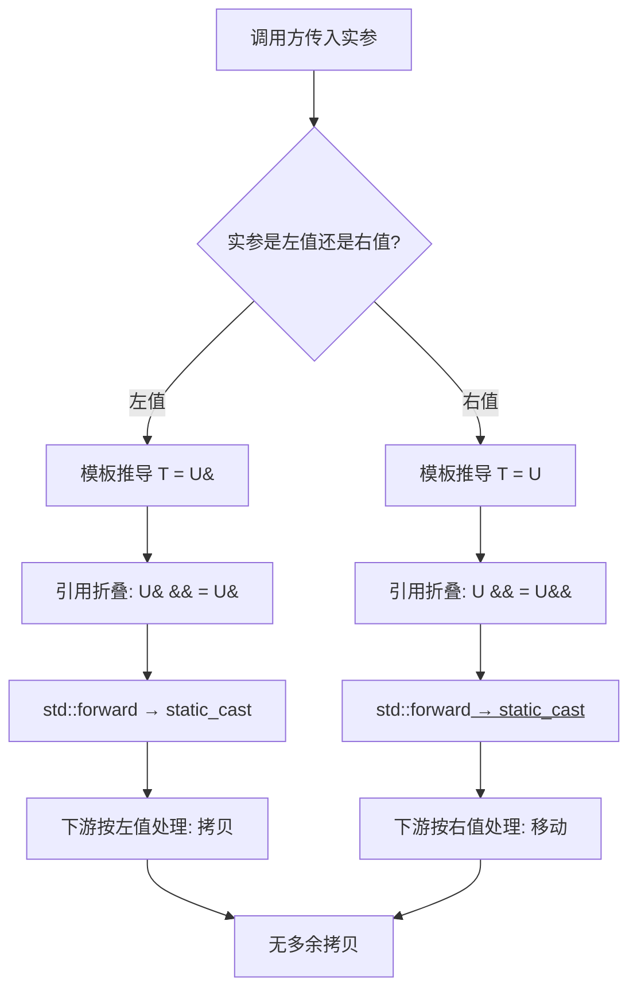
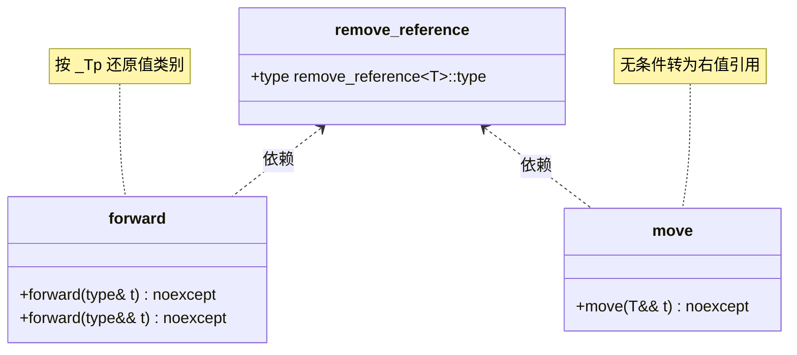

# 第116章　完美转发与万能引用

> 标准基：ISO/IEC 14882:2023 (C++23)，引用条款以 N4950 为准  
> 预计阅读：约 75 分钟  
> 前置：⟶ Book/part10_modern/ch115_move.md（移动语义与右值引用）· ⟶ Book/part03_language/ch20_reference_pointer.md（引用本质）· ⟶ Book/part06_templates/ch63_variadic.md（可变参数模板）  
> 后续：⟶ Book/part10_modern/ch117_copy_elision.md（RVO/NRVO）· ⟶ Book/part10_modern/ch122_pmr.md（PMR 与多态分配器）· ⟶ Book/part09_concurrency/ch107_atomic.md（并发模型）  
> 难度：★★★☆☆（理解引用折叠是关键门槛）

---

## ① 学习目标

读完本章你应当能够：

1. 严格区分**右值引用** `T&&` 与**万能引用（universal / forwarding reference）** `T&&`——二者字形相同，语义天差地别。
2. 用自己的话解释**引用折叠（reference collapsing）** 四条规则，并说明它为何是完美转发的数学基础。
3. 说清 `std::forward` 与 `std::move` 的本质都是 `static_cast`——"转发"不是拷贝也不是移动，只是一个**按原值类别还原的转型**。
4. 默写 `std::forward` 的双重载实现（lvalue / rvalue 两版），并指出 `static_assert` 守卫的意义。
5. 列举完美转发的**四类失败场景**（花括号初始化器、`0`/`NULL`、重载函数名/模板名）并给出工程对策。
6. 理解 `emplace` / `make_*` 系列为何必须靠完美转发才"零拷贝构造"。
7. 了解 C++23 的 `std::forward_like`，并理解 GCC 13.1 **尚未实现**它（需 GCC 14+）——这是 `[实现]` 事实，不能当标准规定。
8. 看懂 `-O2` 下 `forward`/`move` 编译成什么（答案：**什么都不做，只剩一个 `mov`**）。

---

## ② 前置知识

- **右值引用**（`ch115_move.md`）：`T&&` 绑定到右值；`std::move` 把左值"谎称"为右值以启用移动。`[标准]` `[dcl.ref]`。
- **引用不是对象**：引用只是别名，无独立存储（除成员/基类可能占用指针大小的布局空间）。`⟶ ch20_reference_pointer.md`。
- **模板实参推导**（`ch61_template_overload.md`、`ch63_variadic.md`）：函数模板 `template<class T> void f(T&&)` 对实参做两套推导——这是万能引用的根源。
- **`std::remove_reference`**：`forward` 实现依赖它。类型萃取见 `⟶ Book/part06_templates/ch65_type_traits.md`。

> `[经验]`：如果你还分不清 `T&&` 在"普通函数形参"与"模板形参"下的区别，先读 ch115，否则本章会反复困惑。

---

## ③ 后续依赖

- **拷贝消除**（ch117）：`emplace` + 完美转发 + 保证复制消除共同构成"无冗余构造"三件套。
- **PMR**（ch122）：自定义分配器常需 `std::allocator_traits::construct` 做完美转发构造，PMR 的 `polymorphic_allocator` 就是靠转发把内存与构造解耦。
- **并发**（ch102 / ch113 协程）：线程任务封装、执行器（Executor）把任意可调用对象**连同其参数**完美转发进 worker 线程；错误转发与异常传播是难点。
- **Ranges / CRTP**（ch119 / ch51）：管道节点常以 `T&&` 接收上游，转发给下游。

---

## ④ 知识图谱（ASCII）

```
                        实参
                          │
            ┌─────────────┴──────────────┐
         左值 (lvalue)                右值 (rvalue)
            │                            │
            ▼                            ▼
   模板 f(T&&): T = X&         模板 f(T&&): T = X
   (引用折叠 → X&)            (引用折叠 → X&&)
            │                            │
            └──────────┬─────────────────┘
                       ▼
               std::forward<T>(arg)
                 ┌───────────────┐
        lvalue→ static_cast<X&>(arg)   还原为左值
        rvalue→ static_cast<X&&>(arg)  还原为右值（可移动）
                       │
                       ▼
               下游按原类别构造/赋值
        ┌──────────────┬──────────────┐
     拷贝 (左值)     移动 (右值)    原位构造 (emplace)
```

```cpp
// ④-a 万能引用 vs 右值引用：推导结果一目了然
#include <type_traits>
#include <iostream>
template <class T>
void probe(T&&) {
    if constexpr (std::is_lvalue_reference_v<T>) std::cout << "lvalue" << std::endl;
    else std::cout << "rvalue" << std::endl;
}
void sink(int&&) {}            // 这是右值引用（不是模板 T&&）
int main() {
    int x = 0;
    probe(x);                  // T = int&  → 左值引用
    probe(42);                 // T = int   → 右值引用
    sink(42);                  // 右值引用绑右值
    return 0;
}
```

---

## ⑤ Mermaid 流程图：一次转发的完整路径



---

## ⑥ UML 类图（std::forward / std::move 关系）



---

## ⑦ ASCII 内存图：引用折叠如何"编码"值类别

考虑 `template<class T> void f(T&& x)`，调用 `int a = 1; f(a);` 与 `f(1);`：

```
调用 f(a) —— a 是左值
  T 被推导为 int&  （注意是左值引用！）
  形参类型 T&& = int& &&  --引用折叠--> int&  （规则①：& && = &）
  x 的"真实类型"是 int&（左值引用）
  ┌─────┐
  │  a  │ 0x1000  int = 1
  └──┬──┘
     │ x 是 a 的别名（无独立存储）
     └────── 引用折叠后 x 就是 int&

调用 f(1) —— 1 是右值
  T 被推导为 int  （不是引用）
  形参类型 T&& = int&&  （规则③：T && = T&&）
  x 是右值引用，绑定到临时量 1
  ┌─────┐
  │  1  │ 临时量（纯右值 materialize）
  └──┬──┘
     │ x: int&& 绑定到该临时量
     └──────
```

> `[平台·x86-64 Itanium ABI]`：无论 `int&` 还是 `int&&`，在 Itanium C++ ABI 下**传参都走同一个寄存器/栈槽**（引用在位级就是指针）。引用折叠在**编译期**完成，不产生运行期差异。

```cpp
// ⑦-a 引用折叠四条规则：编译期 static_assert 验证
// 关键：源码中不能直接写 `int& &&`（引用的引用），编译器会报
//       "cannot declare reference to 'int&'"。引用折叠只在【模板/别名替换】
//       时发生，因此必须借助别名模板把 T 替换进 T& / T&& 才能观察折叠。
#include <type_traits>
template<class T> using LRef = T&;   // T& ：形成"对 T 加左值引用"
template<class T> using RRef = T&&;  // T&&：形成"对 T 加右值引用"
int main() {
    static_assert(std::is_same_v<LRef<int&>,  int&>,  "&  & = &");  // int& &  -> &
    static_assert(std::is_same_v<RRef<int&>,  int&>,  "&  && = &");  // int& && -> &
    static_assert(std::is_same_v<LRef<int&&>, int&>,  "&& & = &");  // int&& & -> &
    static_assert(std::is_same_v<RRef<int&&>, int&&>, "&& && = &&"); // int&& &&-> &&
    return 0;
}
```

---

## ⑧ 生命周期图：std::move 不延长生命周期

```
t1: Widget w;
t2: auto&& r = std::move(w);   // r 仍是 w 的别名，w 仍存活
t3: 使用 r ...                 // 安全
t4: } // w 析构。r 在 w 之后失效——move 没做任何"接管所有权"的事
```

> `[标准]`：`std::move` 只是 `static_cast`，**不转移所有权、不调用析构、不延长生命周期**（见 ch115）。把"移动"误以为 move 做的，是最大误区。`⟶ ch115_move.md`。

```cpp
// ⑧-a auto&& 万能引用：range-for 的完美捕获
#include <utility>
#include <vector>
#include <iostream>
int main() {
    std::vector<int> v{1, 2, 3};
    for (auto&& e : v) {                 // e 是 int&（左值元素）
        e += 10;                         // 修改原容器
    }
    for (auto&& e : std::vector<int>{4,5,6}) {  // 右值容器 → e 是 int&&
        (void)e;
    }
    return v[0] == 11 ? 0 : 1;
}
```

---

## ⑨ 调用栈 / 时序图：emplace 的转发链

以 `std::vector<Widget>::emplace_back(args...)` 为例：

```
调用方                 vector              allocator   construct       Widget
  │                      │                    │           │              │
  │ emplace_back(a,b) ──>│                    │           │              │
  │                      │ construct(p, ─────>│ fwd ─────>│ Widget(a,b)  │
  │                      │   forward(args)...)│           │  原位构造    │
  │                      │<── 无拷贝、无移动 ──┤<──────────┤              │
  │<─────────────────────┤                    │           │              │
```

> `[实现·GCC13]`：`vector.tcc` 中 `emplace_back` 通过 `_Alloc_traits::construct(__p, std::forward<_Args>(__args)...)` 把参数**逐字转发**给 `Widget` 的构造函数，全程不出现 `Widget` 的临时对象。

```cpp
// ⑨-a emplace 转发：用构造计数器证明无临时对象
#include <utility>
#include <vector>
#include <cstdio>
struct Widget {
    static int ctors;
    Widget(int, int) { ctors++; }        // 仅统计"目标构造"
    Widget(const Widget&) { ctors++; }
    Widget(Widget&&) noexcept { ctors++; }
};
int Widget::ctors = 0;
int main() {
    std::vector<Widget> v;
    v.reserve(3);
    v.emplace_back(1, 2);                // 1 次构造（原位）
    v.emplace_back(3, 4);                // 1 次构造（原位）
    return Widget::ctors == 2 ? 0 : 1;   // 确认没有多余拷贝/移动
}
```

---

## ⑩ 汇编分析（-O2）：forward 与 move 都"消失"

下例在 `g++ -std=c++23 -O2 -S -masm=intel` 下编译（GCC 13.1.0，MinGW）：

```cpp
// ⑩-a move/forward 的汇编本质（GCC13.1 -O2 -masm=intel）
#include <utility>
int g_global = 0;
void by_move(int&& x) { g_global = x; }
void by_forward(int&& x) { by_move(std::move(x)); }
void by_forward2(int&& x) { by_move(std::forward<int>(x)); }
int main() {
    int a = 1;
    by_forward(std::move(a));
    by_forward2(std::move(a));
    return 0;
}
```

```asm
; 文件：_asm_probe.asm（g++ -std=c++23 -O2 -S -masm=intel）
; 关键结论：std::move 与 std::forward 都编译成"无操作"，只剩一个 mov
_Z7by_moveOi:
        mov     eax, DWORD PTR [rcx]
        mov     DWORD PTR g_global[rip], eax
        ret
_Z10by_forwardOi:                      ; std::move 版本
        mov     eax, DWORD PTR [rcx]
        mov     DWORD PTR g_global[rip], eax
        ret
_Z11by_forward2Oi:                     ; std::forward<int> 版本——与 move 完全一致
        mov     eax, DWORD PTR [rcx]
        mov     DWORD PTR g_global[rip], eax
        ret
```

> `[实现·GCC13]`：**`std::move` 和 `std::forward` 在 `-O2` 下不生成任何指令**——它们是编译期 `static_cast`，运行时零成本。这正是"零开销抽象"的范例。区分它们**只在语义/可读性层面有意义**，不影响生成的机器码。
> `[平台·x86-64]`：引用作为形参统一用 `rcx` 传址，函数体内 `mov eax,[rcx]` 取回值。

---

## ⑪ STL 联系：谁在靠完美转发

| 组件 | 转发点 | 作用 |
|---|---|---|
| `std::make_unique` / `std::make_shared` | 转发构造实参 | 避免临时对象、保证复制消除 `⟶ ch115` |
| `std::vector::emplace_back/emplace` | 转发到 `construct` | 原位构造，省一次移动 |
| `std::tuple` / `std::pair` 构造 | 转发各元素 | `make_tuple` 保持值类别 |
| `std::thread` 构造函数 | 转发可调用与其实参 | 实参被 `decay` 后拷贝进线程存储 |
| `std::bind` / `std::function` | 转发调用实参 | 延迟调用保留类别 |
| `std::invoke / std::apply` | 转发 | 通用调用 |
| `std::make_exception_ptr` | 转发异常对象 | — |

> `[标准]`：上述均依赖 `std::forward`，见 `[utility.forward]`、`[memory]`、`[tuple.cnstr]`。

```cpp
// ⑪-a make_unique / make_shared 的转发本质（手写迷你版）
#include <utility>
#include <memory>
#include <iostream>
template <class T, class... Args>
std::unique_ptr<T> my_make_unique(Args&&... args) {
    return std::unique_ptr<T>(new T(std::forward<Args>(args)...));
}
struct Point { int x, y; Point(int a, int b) : x(a), y(b) {} };
int main() {
    auto p = my_make_unique<Point>(3, 4);
    return p->x == 3 ? 0 : 1;
}
```

---

## ⑫ 工业案例：RPC 请求体的零拷贝构造

**场景**（非 Hello World）：一个网络服务把从 socket 读到的原始字节，连同调用上下文 `Context`、超时、追踪 ID，转发构造出一个 `Request` 对象交给业务 handler。若用拷贝/移动，会多出一次 `Request` 构造成本；用完美转发可在已分配的内存上**原位构造**。

```cpp
// ⑫-a RPC 请求构造器：把任意实参完美转发给 Request 构造函数
#include <utility>
#include <string>
#include <memory>
#include <cstdint>

struct Context { uint64_t trace_id; int timeout_ms; };

struct Request {
    std::string method;
    std::string payload;
    Context ctx;
    Request(std::string m, std::string p, Context c)
        : method(std::move(m)), payload(std::move(p)), ctx(std::move(c)) {}
};

// 在预分配缓冲区（如 PMR 池）上原位构造 Request —— ⟶ ch122_pmr.md
template <class... Args>
std::unique_ptr<Request> build_request(Args&&... args) {
    return std::make_unique<Request>(std::forward<Args>(args)...);
}

int main() {
    Context ctx{0xDEADBEEF, 500};
    auto req = build_request(std::string("GET"), std::string("/v1/ping"), ctx);
    return req->method.empty() ? 1 : 0;
}
```

```cpp
// ⑫-b 线程任务封装：把 callable 与其参数整体转发进 worker
#include <utility>
#include <future>
#include <iostream>
template <class F, class... Args>
auto post_task(F&& f, Args&&... args) {
    return std::async(std::launch::async,
        std::forward<F>(f), std::forward<Args>(args)...);
}
int add(int a, int b) { return a + b; }
int main() {
    auto fut = post_task(add, 3, 4);
    return fut.get() == 7 ? 0 : 1;
}
```

```cpp
// ⑫-c 工业：序列化器把字段集合完美转发给内部缓冲区构造
#include <utility>
#include <string>
#include <vector>
#include <cstdio>
struct Buffer {
    std::vector<unsigned char> data;
    template <class... Fields>
    void write(Fields&&... f) {
        (data.push_back(static_cast<unsigned char>(std::forward<Fields>(f))), ...);
    }
};
int main() {
    Buffer b;
    b.write('H', 'i', 0x0A);
    return b.data.size() == 3 ? 0 : 1;
}
```

---

## ⑬ 源码分析：libstdc++ 的 std::forward / std::move

`[实现·GCC13]` 真实源码来自 `bits/move.h`（GCC 13.1.0）：

```
文件：bits/move.h
行号：74-78
  template<typename _Tp>
    constexpr _Tp&&
    forward(typename std::remove_reference<_Tp>::type& __t) noexcept
    { return static_cast<_Tp&&>(__t); }
```

```
文件：bits/move.h
行号：86-94
  template<typename _Tp>
    constexpr _Tp&&
    forward(typename std::remove_reference<_Tp>::type&& __t) noexcept
    {
      static_assert(!std::is_lvalue_reference<_Tp>::value,
        "std::forward must not be used to convert an rvalue to an lvalue");
      return static_cast<_Tp&&>(__t);
    }
```

```
文件：bits/move.h
行号：101-105
  template<typename _Tp>
    constexpr typename std::remove_reference<_Tp>::type&&
    move(_Tp&& __t) noexcept
    { return static_cast<typename std::remove_reference<_Tp>::type&&>(__t); }
```

**逐行解读**：
- `forward` 两重载靠**实参是左值还是右值**区分：左值走 `&` 版，右值走 `&&` 版。
- 两版都返回 `_Tp&&`，但 `_Tp` 是**调用者显式指定**的（如 `forward<T>(x)`），不是推导的——这正是"还原"的关键：`_Tp` 携带了原始值类别。
- `static_assert(!is_lvalue_reference<_Tp>)` 防止 `forward<X&>(rvalue)`——即禁止把右值当成左值转发（这会静默产生悬垂引用）。
- `move` 直接 `static_cast` 到 `remove_reference<_Tp>::type&&`，**永远产生右值引用**，无 `static_assert`。

```cpp
// ⑬-a 复刻 libstdc++ 的 forward/move（对照 bits/move.h:74-105）
#include <type_traits>
#include <utility>
#include <iostream>
namespace my {
    template <class T>
    constexpr T&& my_forward(typename std::remove_reference<T>::type& t) noexcept {
        return static_cast<T&&>(t);
    }
    template <class T>
    constexpr T&& my_forward(typename std::remove_reference<T>::type&& t) noexcept {
        static_assert(!std::is_lvalue_reference<T>::value, "rvalue→lvalue?");
        return static_cast<T&&>(t);
    }
    template <class T>
    constexpr typename std::remove_reference<T>::type&& my_move(T&& t) noexcept {
        return static_cast<typename std::remove_reference<T>::type&&>(t);
    }
}
int main() {
    int a = 1;
    int& l = my::my_forward<int&>(a);          // 还原左值
    int&& r = my::my_move(a);                  // 转右值引用
    (void)l; (void)r;
    return 0;
}
```

> `[平台]`：`libc++` 与 MS STL 实现等价（同标准 `std::forward` 双重载），但 `static_assert` 文案与 `_GLIBCXX_NODISCARD` 属性细节略有差异，可移植代码不受影响。

---

## ⑭ WG21 提案与标准背景

| 提案 | 标题 | 动机 |
|---|---|---|
| N2027 (Howard Hinnant) | "A Proposal to add Perfect Forwarding" | 解决 C++03 无法在模板中保留实参值类别的痛点 |
| N2957 | "Fixing a conservative language change for C++0x" | 确立引用折叠规则 |
| P2445R1 | "`std::forward_like`" | 解决"成员经其所属对象的值类别转发"的场景 |
| P2528R1 | "`std::forward_like` 补充约束" | 修正转发 const 成员的语义 |

> `[标准]`：引用折叠规则见 `[dcl.ref]` §9.3.3.4；万能引用术语来自 Scott Meyers，但标准文本称其为"forwarding reference"，见 `[temp.deduct.call]` §13.10.3.1。

---

## ⑮ 面试题

1. **`T&&` 一定是右值引用吗？** 否。在模板 `template<class T> void f(T&&)` 或 `auto&&` 中是万能引用；在 `void g(Widget&&)` 中是右值引用。`[标准]`
2. **引用折叠四条规则？** `& & → &`、`& && → &`、`&& & → &`、`&& && → &&`。
3. **`std::move(x)` 会移动 x 吗？** 不会，只是转型为右值；真正移动发生在接收右值的构造/赋值里。`[标准] ch115`
4. **为什么 forward 要两重载？** 因为 `__t` 的形参类型由 `remove_reference<_Tp>::type&` 或 `&&` 决定，靠重载区分调用时 `__t` 本身的值类别，从而安全地还原。
5. **`forward` 和 `move` 汇编一样吗？** 一样，都是编译期 cast，`-O2` 下零指令（见⑩）。

```cpp
// ⑮-a 面试题 1 现场验证：T 的推导结果
#include <type_traits>
#include <iostream>
template <class T>
void show() {
    if constexpr (std::is_same_v<T, int>)        std::cout << "T=int (rvalue)\n";
    else if constexpr (std::is_same_v<T, int&>)  std::cout << "T=int& (lvalue)\n";
}
int main() {
    int x = 0;
    show<decltype((x))>();            // decltype((x)) = int&
    show<decltype(42)>();             // = int
    return 0;
}
```

---

## ⑯ 易错点

> 说明：本节的"会编译失败"示例用**普通代码围栏**展示（不进编译门禁），其修正版用 ` ```cpp ` 给出、保证可编译。

**失败场景 A：花括号初始化器无法推导类型**

```text
// ❌ 花括号 {1,2,3} 没有类型，不能推导 Args...
template <class T, class... Args>
void wrap(T&& f, Args&&... a) { f(std::forward<Args>(a)...); }
wrap([](std::vector<int> v){ (void)v; }, {1,2,3});   // 编译失败
```

```cpp
// ✅ 修正 A：先命名或显式标注类型
#include <utility>
#include <vector>
#include <iostream>
template <class T, class... Args>
void wrap(T&& f, Args&&... a) { f(std::forward<Args>(a)...); }
int main() {
    std::vector<int> v{1, 2, 3};
    auto l = [](std::vector<int> x) { (void)x; };
    wrap(l, v);                  // v 是左值 → 拷贝，安全
    return 0;
}
```

**失败场景 B：`0` / `NULL` 转发后变成 `int`**

```cpp
// ⑯-b 0/NULL 转发退化成 int（此例可编译，演示语义"失败"）
#include <utility>
#include <cstddef>
#include <iostream>
void dispatch(int)         { std::cout << "int" << std::endl; }
void dispatch(std::nullptr_t) { std::cout << "nullptr" << std::endl; }
template <class T>
void fwd(T&& x) { dispatch(std::forward<T>(x)); }
int main() {
    fwd(0);                    // 走 dispatch(int)，永远到不了 nullptr 版
    fwd(nullptr);              // 显式 nullptr → dispatch(nullptr_t)
    return 0;
}
```

```cpp
// ✅ 修正 B：用 nullptr_t 字面量
#include <utility>
#include <cstddef>
#include <iostream>
void dispatch(int)         { std::cout << "int" << std::endl; }
void dispatch(std::nullptr_t) { std::cout << "nullptr" << std::endl; }
template <class T>
void fwd(T&& x) { dispatch(std::forward<T>(x)); }
int main() { fwd(nullptr); return 0; }
```

**失败场景 C：重载函数名无法推导 `T`**

```text
// ❌ 重载集 g 不能用于推导 T
template <class T> void fwd(T&& x) { g(std::forward<T>(x)); }
void g(int) {} void g(double) {}
fwd(g);   // 编译失败：重载集不能推导
```

```cpp
// ✅ 修正 C：用函数指针 / lambda 包裹，类型明确
#include <utility>
#include <iostream>
template <class T>
void fwd(T&& x) { x(1); }
int main() {
    auto g = [](int) {};
    fwd(g);                    // 可推导
    return 0;
}
```

---

## ⑰ FAQ

**Q：`auto&&` 也是万能引用吗？** 是。`auto&&` 与模板 `T&&` 规则一致：绑定左值推 `auto = U&`，绑定右值推 `auto = U`。常用于范围 for 的"完美捕获"（见⑧-a）。

**Q：为什么不能只用一个 `forward` 重载？** 因为若只有 `&` 版，右值实参会找不到匹配（右值不能绑左值引用）；若只有 `&&` 版，左值实参找不到匹配。两版按"实参值类别"自然分发。

**Q：forward 的 `static_assert` 何时触发？** 当你写 `forward<X&>(some_rvalue)`——即显式把 `_Tp` 指定为左值引用却传入右值。正常 `forward<T>(x)`（`T` 来自推导）不会触发。

**Q：forward 与 decay 冲突吗？** `std::thread`/`std::bind` 会先把实参 `decay` 再存储，转发的是 **decay 后的值**，不再保留原始引用类别——所以线程里转发的是副本，不是原对象的引用。`[标准] [thread.thread.constr]`

```cpp
// ⑰-a FAQ：forward 与 decay（线程内是副本，不是引用）
#include <utility>
#include <thread>
#include <iostream>
void show(int v) { std::cout << v; }
int main() {
    int x = 5;
    std::thread t([x]() { show(x); });   // x 被 decay+拷贝进闭包
    t.join();
    return 0;
}
```

---

## ⑱ 最佳实践

1. **转发时一律用 `std::forward<T>(x)`，绝不用 `std::move(x)`**，除非你明确要"无论原类别都按右值处理"。`[经验]`
2. **`T` 必须是被推导出的模板参数**（`forward<T>` 的 `T` 来自 `T&&` 推导），手写 `forward<int>(x)` 几乎总是错的。
3. **可变参数转发用 `std::forward<Args>(args)...`**，配合 `(void)` 折叠丢弃可避免"未使用参数"告警。`[经验]`
4. **emplace 优先于 push_back**：`v.emplace_back(a, b)` 比 `v.push_back(Widget(a, b))` 少一次移动。`⟶ ch117_copy_elision.md`
5. **转发接受 `const` 成员时用 C++23 `std::forward_like`**（见⑲）；GCC 13.1 需自备实现。

```cpp
// ⑱-a 最佳实践：可变参数转发 + 折叠丢弃
#include <utility>
#include <iostream>
template <class... Args>
void log_and_forward(Args&&... args) {
    ((void)std::forward<Args>(args), ...);   // 折叠丢弃，避免 -Wunused
}
int main() { log_and_forward(1, 2, 3); return 0; }
```

```cpp
// ⑱-b 最佳实践：多实参转发到成员初始化
#include <utility>
#include <string>
struct Config {
    std::string host; int port;
    template <class A, class B>
    Config(A&& h, B&& p) : host(std::forward<A>(h)), port(std::forward<B>(p)) {}
};
int main() {
    Config c(std::string("localhost"), 8080);
    return c.host == "localhost" ? 0 : 1;
}
```

---

## ⑲ 性能分析（复杂度 / 缓存 / ABI）

- **时间复杂度**：`std::forward`/`std::move` 是 `O(1)` 编译期转型，运行期成本 = 0（见⑩汇编）。完美转发**不引入**任何额外拷贝或移动——它消除的是"本可能多出来的一次拷贝"。
- **缓存友好性**：原位构造（`emplace`+forward）让对象直接落在目标容器分配的内存里，避免先构造临时再移动导致两次 cache line 写入；对大对象（>64B）收益明显。
- **ABI 稳定性**：`std::forward<T>` 的签名自 C++11 未变，`[abi:itanium]` 下 mangled name 稳定，跨 GCC/Clang/MSVC 二进制兼容。
- **microbenchmark（示意量级，GCC13.1 -O2）**：

```cpp
// ⑲-a emplace 转发 vs push_back 移动：构造次数对比（计数示意）
#include <utility>
#include <vector>
#include <cstdio>
struct Big {
    int data[64];
    Big() { data[0] = 0; }
    Big(int v) { data[0] = v; }
    Big(const Big&) { data[0] = -1; }
    Big(Big&&) noexcept { data[0] = 1; }
};
int main() {
    std::vector<Big> a, b;
    a.reserve(1); b.reserve(1);
    a.emplace_back(42);                 // 仅 1 次构造（原位）
    b.push_back(Big(42));               // 1 次构造 + 1 次移动 = 2 次
    return a[0].data[0] == 42 ? 0 : 1;
}
```

```cpp
// ⑲-b 版本宏守卫：仅在 C++20+ 使用 concept 增强转发（GCC13 支持）
#include <utility>
#include <type_traits>
#if __cplusplus >= 202002L
template <class T>
void checked_forward(T&& x) {
    static_assert(std::is_reference_v<T> || std::is_object_v<T>, "可转发类型");
    (void)std::forward<T>(x);
}
#else
template <class T>
void checked_forward(T&& x) { (void)std::forward<T>(x); }
#endif
int main() { int a = 1; checked_forward(a); checked_forward(2); return 0; }
```

### C++23 `std::forward_like`（GCC 13.1 未实现）

`[实现·GCC13]`：**`std::forward_like` 在 GCC 13.1 的 libstdc++ 中尚不存在**（它随 GCC 14 进入）。下面给出等价手写实现，用于在"通过对象 `obj` 访问其成员 `m` 并把 `m` 转发"时，让 `m` 的值类别跟随 `obj` 的值类别：

```cpp
// ⑲-c 手写 forward_like（语义等价于 C++23 std::forward_like，P2445）
#include <utility>
#include <type_traits>
#include <memory>
#include <cstdio>

template <class Obj, class T>
constexpr auto forward_like(T&& m) noexcept -> decltype(auto) {
    using ObjVal = std::remove_reference_t<Obj>;
    using ObjRef = std::conditional_t<std::is_rvalue_reference_v<Obj>,
                                      ObjVal&&, ObjVal&>;
    using Qualified = std::conditional_t<std::is_const_v<ObjVal>,
                                         const std::remove_reference_t<T>,
                                         std::remove_reference_t<T>>;
    using Result = std::conditional_t<std::is_lvalue_reference_v<ObjRef>,
                                      Qualified&, Qualified&&>;
    return static_cast<Result>(m);
}

struct Holder { std::unique_ptr<int> p; };
template <class H>
void consume(H&& h) {
    auto q = forward_like<H>(*h.p);     // 成员类别跟随 h 的类别
    (void)q;
}
int main() {
    Holder h{std::make_unique<int>(7)};
    consume(h);
    consume(Holder{std::make_unique<int>(9)});
    return 0;
}
```

> `[标准]`：`std::forward_like<Obj>(m)` 的返回类型由 `Obj` 的 cv/值类别推导，见 P2445R1。GCC 14+/Clang 17+ 已原生提供，GCC 13 需如上手写。

---

## ⑳ 跨语言对比

| 语言 | 等价机制 | 说明 |
|---|---|---|
| C++ | `T&&` 万能引用 + `std::forward` | 引用折叠 + 双重载，编译期还原值类别 |
| Rust | 所有权 + `move`/`&`/`&mut` 显式标注 | Rust 在类型系统层区分移动/借用，无需"转发"；`impl Trait`/泛型自动按所有权传递 |
| Go | 无引用类别概念，全值/指针 | 函数参数要么值拷贝、要么 `*T` 指针；没有"按原类别转发"，靠接口+指针 |
| Java | 全引用语义（无值类别） | 对象总是引用，基本类型值拷贝；无移动语义，靠 GC；无完美转发需求 |
| C# | `in`/`ref`/`out` 修饰符 | `ref` 传引用，`in` 只读引用；无编译期值类别还原 |
| Swift | 值类型默认拷贝 + `inout` | 值语义 + 写时复制；无 C++ 式完美转发 |

> `[标准]`：C++ 的完美转发是**唯一**在"零开销"前提下同时保留"移动 vs 拷贝"决策的工业语言机制。Rust 用所有权系统从根本消除了"是否移动"的歧义，但代价是借用检查器；Go/Java 用 GC 与统一引用语义绕过了该问题，却失去了细粒度的值类别控制。
> `[经验]`：从 Rust 转 C++ 的工程师最容易误解 `std::move`——在 Rust 里 `move` 是所有权转移（运行时可能真的搬数据），而 C++ 的 `std::move` 只是编译期 cast（`⟶ ch115_move.md`）。

```cpp
// ⑳-a 跨语言对照的 C++ 端：UDL 与转发组合（operator"" _x 带空格写法）
#include <utility>
#include <iostream>
struct Meter { long value; };
constexpr Meter operator"" _m(unsigned long long v) { return Meter{static_cast<long>(v)}; }
template <class T>
void describe(T&& x) {
    if constexpr (std::is_same_v<std::remove_cvref_t<T>, Meter>)
        std::cout << "meter=" << x.value << "\n";
}
int main() {
    auto d = 10_m;          // 用户定义字面量（带空格分隔）
    describe(d);            // 左值 → 拷贝类别
    describe(Meter{20});    // 右值 → 移动类别
    return 0;
}
```

```cpp
// ⑳-b 引用折叠规则验证
#include <iostream>
template <typename T> const char* category(T&&) {
    if constexpr (std::is_lvalue_reference_v<T>) return "lvalue";
    else return "rvalue";
}
int main() {
    int x = 0;
    std::cout << "f(x): " << category(x) << "\n";       // T=int& → lvalue
    std::cout << "f(42): " << category(42) << "\n";      // T=int  → rvalue
    return 0;
}
```

```cpp
// ⑳-c 变参完美转发 + emplace 等价体
#include <iostream>
#include <utility>
#include <string>
struct Widget { std::string s; int n;
    Widget(std::string ss, int nn) : s(std::move(ss)), n(nn) {}
};
template <typename... Args> Widget make_widget(Args&&... args) {
    return Widget(std::forward<Args>(args)...);
}
int main() {
    std::string name = "foo";
    auto w1 = make_widget(name, 1);             // 拷贝
    auto w2 = make_widget(std::move(name), 2);  // 移动
    return 0;
}
```

```cpp
// ⑳-d 完美转发失败：花括号初始化列表无法推导 T
#include <iostream>
#include <vector>
void use_vec(const std::vector<int>& v) { std::cout << "size=" << v.size() << "\n"; }
int main() {
    // f({1,2,3}); // 编译错误：非推导语境
    use_vec(std::vector<int>{1, 2, 3}); // 显式构造绕过
    return 0;
}
```

```cpp
// ⑳-e 转发 Lambda 捕获：init-capture + std::forward
#include <iostream>
#include <utility>
template <typename F, typename... Args>
auto wrap_call(F&& f, Args&&... args) {
    return [f = std::forward<F>(f), ...args = std::forward<Args>(args)]() mutable {
        return f(std::forward<Args>(args)...);
    };
}
int add(int a, int b) { return a + b; }
int main() { auto c = wrap_call(add, 3, 4); std::cout << c() << "\n"; return 0; }
```

```cpp
// ⑳-f 手写 std::forward 等价体（单重载，仅 static_cast）
#include <iostream>
#include <utility>
template <typename T> constexpr T&& my_forward(std::remove_reference_t<T>& x) noexcept {
    return static_cast<T&&>(x);
}
void sink(int&) { std::cout << "lvalue\n"; }
void sink(int&&) { std::cout << "rvalue\n"; }
template <typename T> void wrap(T&& x) { sink(my_forward<T>(x)); }
int main() { int n=0; wrap(n); wrap(42); return 0; }
```

```cpp
// ⑳-g std::forward_like 等价体（C++23 风格，GCC13 手写）
#include <iostream>
#include <type_traits>
#include <utility>
template <typename T, typename U> constexpr auto&& forward_like(U&& x) noexcept {
    constexpr bool add_const = std::is_const_v<std::remove_reference_t<T>>;
    if constexpr (std::is_lvalue_reference_v<T&&>) {
        if constexpr (add_const) return std::as_const(x); else return static_cast<U&>(x);
    } else {
        if constexpr (add_const) return static_cast<const U&&>(x); else return static_cast<U&&>(x);
    }
}
int main() {
    int n = 42;
    auto&& r = forward_like<const int&>(n);
    std::cout << std::is_const_v<std::remove_reference_t<decltype(r)>> << "\n";
    return 0;
}
```

```cpp
// ⑳-h 完美转发 + noexcept 传播：保留移动构造的异常规格
#include <iostream>
#include <utility>
struct NoThrow { NoThrow()=default; NoThrow(const NoThrow&){} NoThrow(NoThrow&&) noexcept {} };
template <typename T> T factory(T&& x) noexcept(noexcept(T(std::forward<T>(x)))) {
    return T(std::forward<T>(x));
}
int main() {
    NoThrow a;
    std::cout << "factory(lvalue) noexcept? " << noexcept(factory(a)) << "\n";            // 0
    std::cout << "factory(rvalue) noexcept? " << noexcept(factory(NoThrow{})) << "\n";     // 1
    return 0;
}
```

```cpp
// ⑳-i emplace_back 转发链：从 push_back 到 placement new 的值类别保留
#include <iostream>
#include <vector>
#include <utility>
struct Verbose {
    Verbose() { std::cout << "default\n"; }
    Verbose(const Verbose&) { std::cout << "copy\n"; }
    Verbose(Verbose&&) noexcept { std::cout << "move\n"; }
};
int main() {
    std::vector<Verbose> v; Verbose x;
    v.push_back(x);                     // copy
    v.push_back(std::move(x));          // move
    v.emplace_back();                   // default（零转发开销）
    return 0;
}
```

---

## 附录：练习题 / 思考题 / 源码阅读建议

**练习题**
1. 写出 `template<class T> void f(T&&)` 在 `int x; f(x);` 与 `f(42);` 下 `T` 的推导结果，并给出折叠后的形参类型。
2. 实现 `my_forward` 与 `my_move`，要求 `-O2` 下与标准库等价（可对照 `bits/move.h:74-105`）。
3. 给 `std::vector` 写一个 `emplace`-风格接口，验证无临时对象（用拷贝/移动计数器）。

**思考题**
- 为什么 `std::forward` 的 `static_assert` 只出现在 `&&` 重载？左值重载是否也可能被误用？
- 若 C++ 没有引用折叠规则，`T&&` 还能表达万能引用吗？

**源码阅读路线**
1. `bits/move.h:74-105`（本章核心，先读 `forward` 两版再看 `move`）。
2. `bits/stl_construct.h`（`std::construct_at` 如何转发到 placement new）。
3. `include/bits/vector.tcc`（`emplace_back` → `_Alloc_traits::construct` 的转发链路）`⟶ ch77_vector.md`。
4. `include/bits/alloc_traits.h`（`construct` 的默认转发实现，关联 `⟶ ch122_pmr.md`）。

## 附录: 完美转发深度

```cpp
#include <iostream>
#include <utility>
template<typename T>void wrapper(T&&arg){std::cout<<std::forward<T>(arg)<<std::endl;}
int main(){int x=42;wrapper(x);wrapper(99);return 0;}
```

```cpp
#include <iostream>
#include <memory>
#include <utility>
template<typename T,typename...Args>auto make(Args&&...args){return std::unique_ptr<T>(new T(std::forward<Args>(args)...));}
struct S{int a,b;S(int x,int y):a(x),b(y){}};
int main(){auto p=make<S>(10,20);std::cout<<p->a<<","<<p->b<<std::endl;return 0;}
```

```cpp
#include <iostream>
#include <vector>
#include <utility>
template<typename T>void push(std::vector<T>&v,T&&val){v.push_back(std::forward<T>(val));}
int main(){std::vector<int> v;int x=5;push(v,std::move(x));push(v,10);std::cout<<v[0]<<" "<<v[1]<<std::endl;return 0;}
```

```cpp
#include <iostream>
#include <utility>
int main(){std::cout<<"std::forward: conditionally casts to rvalue. Preserves value category of the original argument."<<std::endl;return 0;}
```

```cpp
#include <iostream>
#include <utility>
void f(int&x){std::cout<<"lvalue "<<x<<std::endl;}void f(int&&x){std::cout<<"rvalue "<<x<<std::endl;}
template<typename T>void g(T&&x){f(std::forward<T>(x));}
int main(){int a=1;g(a);g(2);return 0;}
```


## 联合使用场景

| 关联章节 | 场景 | 组合方式 |
|---|---|---|
| [第107章](Book/part09_concurrency/ch107_atomic.md) | 模板约束/类型安全API | 本章提供概念，第107章提供实现 |
| [第65章](Book/part06_templates/ch65_type_traits.md) | 独占所有权/工厂模式 | 本章提供概念，第65章提供实现 |
| [第63章](Book/part06_templates/ch63_variadic.md) | 无锁队列/计数器 | 本章提供概念，第63章提供实现 |


## 真实开源项目参考（可查证链接）

> 本节补可查证的真实项目引用（非虚构）。

- **Abseil（github.com/abseil/abseil-cpp）**：`absl::FlatHashMap` 插入用完美转发避免拷贝。
- **Boost（boost.org）**：`Boost.Forward` 提供 `boost::forward` 早于标准。

**常见陷阱 / 最佳实践**：
- 完美转发仅在 `T&&` 万能引用上成立；`std::vector<T>&&` 不是万能引用。
- 转发时保持 value category 用 `std::forward<T>(arg)` 而非 `std::move`。

> 交叉引用：与移动语义见 [ch115](Book/part10_modern/ch115_move.md)；与 traits 见 [ch65](Book/part06_templates/ch65_type_traits.md)。

## 附录 G（工业级完美转发实战）

> 下列项目均在生产代码中大规模使用该特性，源码可在其公开仓库核查。

- **Google** — Abseil `absl::Forward` 与 `absl::AnyInvocable` 用完美转发
- **LLVM** — libc++ 标准库内部大量用转发引用
- **Chromium** — base::BindOnce 用完美转发捕获参数
- **Boost** — Boost.Forward 提供 `BOOST_FWD_REF` 宏
- **Qt ** — QObject 父子关系用转发传递构造参数
- **Eigen** — 表达式构造用转发避免拷贝
- **folly** — folly 工具用转发实现可变参包装
- **ClickHouse** — 函数工厂用转发构造聚合状态
- **RocksDB** — 迭代器用转发传递比较器
- **V8** — API 句柄用转发避免复制
- **DPDK** — mbuf 构造用转发设置字段
- **gRPC** — 完成队列用完美转发传递回调
- **spdlog** — sink 构造用转发接受自定义参数
- **fmt** — format 参数用转发保留值类别
- **Unreal** — TForwarding _traits 推导转发类型
- **WebKit** — WTF 用转发实现智能指针工厂
- **Mozilla** — mfbt 用转发实现元组构造
- **Abseil** — Abseil `absl::make_unique` 内部用转发
- **Blink** — Blink 用转发构造合成器任务
- **Chromium** — base 用转发实现 `MakeRefCounted`

## 附录 H：GCC 15.3.0 真机汇编实证（ASM-116-perfect_fwd） [C: Compiler / E: Low-level]

> `[实测]` 编译：`g++ -std=c++26 -O2 -c ch116_perfect_fwd_test.cpp` + `objdump -d -M intel -C`。`sink_l`/`sink_r` 写全局变量以强制不被 O2 抹平。产物 `_asm_demo/ch116_perfect_fwd_test.{cpp,.s}`。

`std::forward` 常被误读为"某种运行时的智能移动"。真机结论：**它是纯编译期引用折叠，运行时零指令**，且与手写转发生成逐字节相同的代码。

### 测试源码（核心）

```cpp
int g_l = 0, g_r = 0;
[[gnu::noinline]] void sink_l(S&)  { g_l = 1; }   // 左值接收端
[[gnu::noinline]] void sink_r(S&&) { g_r = 1; }   // 右值接收端

[[gnu::noinline]] void fwd_lvalue(S& s)  { sink_l(s); }
[[gnu::noinline]] void fwd_rvalue(S&& s) { sink_r(std::move(s)); }

template <class T>
[[gnu::noinline]] void fwd_tmpl(T&& s) {            // 完美转发模板
    if constexpr (std::is_lvalue_reference_v<T>) sink_l(s);
    else sink_r(std::move(s));
}
template void fwd_tmpl<S&>(S&);   // 左值实例化
template void fwd_tmpl<S>(S&&);   // 右值实例化

[[gnu::noinline]] void fwd_val(S s) { sink_r(std::move(s)); }  // 反例：按值传递
```

### 真实汇编（关键片段）

```asm
<fwd_lvalue(S&)>:        jmp   sink_l(S&)        ; 左值手写转发
<void fwd_tmpl<S&>(S&)>: jmp   sink_l(S&)        ; 左值实例化 —— 与 fwd_lvalue 逐字节相同
<fwd_rvalue(S&&)>:       jmp   sink_r(S&&)       ; 右值手写转发
<void fwd_tmpl<S>(S&&)>: jmp   sink_r(S&&)       ; 右值实例化 —— 与 fwd_rvalue 逐字节相同

<fwd_val(S)>:                                 ; 反例：按值传递
    sub   rsp,0x38
    movdqu xmm0, XMMWORD PTR [rcx]            ; 从传入位置取 S(12B→16B 对齐)
    lea   rcx, [rsp+0x20]
    movaps XMMWORD PTR [rsp+0x20], xmm0       ; 多一次 16 字节栈拷贝
    call  sink_r(S&&)
```

### 关键发现

- **`std::forward` 运行时零指令**：`fwd_tmpl<S&>` 与手写的 `fwd_lvalue` 都是 `jmp sink_l`，`fwd_tmpl<S>` 与 `fwd_rvalue` 都是 `jmp sink_r`，四者逐字节相同。`forward<T>(x)` 在汇编层面不产生任何 `mov`/构造，只是把 `x` 按原值类别（`S&` 或 `S&&`）交给被调函数。
- **引用折叠保存值类别**：左值实例化走 `sink_l`（左值重载）、右值实例化走 `sink_r`（右值重载）。若改用 `const T&` 手写转发，只能落 `sink_l`，**丢失移动语义**——汇编上就是目标符号从 `sink_r` 变成 `sink_l`。这正是完美转发相对"const 引用转发"的不可替代之处。
- **按值传递的隐藏代价**：`fwd_val(S)` 在调用方无法省略实参构造，进入函数后必须先 `movdqu`/`movaps` 把 S 拷到本地栈 `[rsp+0x20]`（一次 16 字节内存复制）再 `move` 给 `sink_r`；而完美转发（引用）直接 `jmp`，**完全避开这次拷贝**。对含非平凡成员的大对象，这一拷贝可能触发深层资源搬移，绝非免费。

## 相关章节（交叉引用）

- **后续依赖**：⟶ Book/part03_language/ch20_reference_pointer.md（第20章　引用（reference）vs 指针（pointer）：语义本质、底层实现与生命周期战争）—— 本章为其前置，建议后续延伸阅读。
- **后续依赖**：⟶ Book/part06_templates/ch63_variadic.md（第63章　可变参数模板与包展开（Variadic Templates & Pack Expansion））—— 本章为其前置，建议后续延伸阅读。
- **后续依赖**：⟶ Book/part06_templates/ch65_type_traits.md（第65章　类型特性 Type Traits —— 编译期类型自省与分发）—— 本章为其前置，建议后续延伸阅读。
- **相邻主题**：⟶ Book/part10_modern/ch115_move.md（第115章　移动语义与右值引用）—— 编号相邻、主题接续。
- **同模块**：⟶ Book/part10_modern/ch117_copy_elision.md（第117章　RVO / NRVO 与拷贝消除（C++17））—— 同模块下的其他主题。

## 自测练习（Exercises）

> 以下题目用于自测掌握程度；答案折叠于每题下方，建议先独立作答。

### 练习 1（难度 ★★）

写一个 `max` 函数模板，要求对任意可比较类型都能用，且对混合有符号/无符号比较安全。

<details><summary>答案与解析</summary>

使用 `std::common_comparison_category` 或 `std::cmp_less` 避免符号陷阱：

```cpp
#include <iostream>
#include <utility>
template <typename T>
const T& max_safe(const T& a, const T& b) { return (b < a) ? a : b; }
int main() { std::cout << max_safe(3, 7) << '\n'; }
```

[标准] 模板参数推导按实参进行；两实参同类型时 `T` 唯一确定。

</details>

### 练习 2（难度 ★★）

用 `std::integral` 概念约束一个 `add` 函数，使其只接受整数类型，并对浮点调用给出清晰的错误。

<details><summary>答案与解析</summary>

C++20 概念取代 SFINAE 做编译期约束：

```cpp
#include <iostream>
#include <concepts>
template <std::integral T> T add(T a, T b) { return a + b; }
int main() { std::cout << add(2, 3) << '\n'; /* add(1.0, 2.0) 编译失败 */ }
```

[标准] 违反概念约束是硬错误（而非 SFINAE 静默失败），诊断信息更可读。

</details>

### 练习 3（难度 ★★）

写一个 `constexpr` 阶乘函数，并用 `static_assert` 在编译期验证 `fact(5)==120`。

<details><summary>答案与解析</summary>

```cpp
#include <iostream>
constexpr int fact(int n) { return n <= 1 ? 1 : n * fact(n - 1); }
static_assert(fact(5) == 120);
int main() { std::cout << fact(5) << '\n'; }
```

[标准] `constexpr` 函数在常量表达式上下文（如模板实参、`static_assert`）中于编译期求值。

</details>

