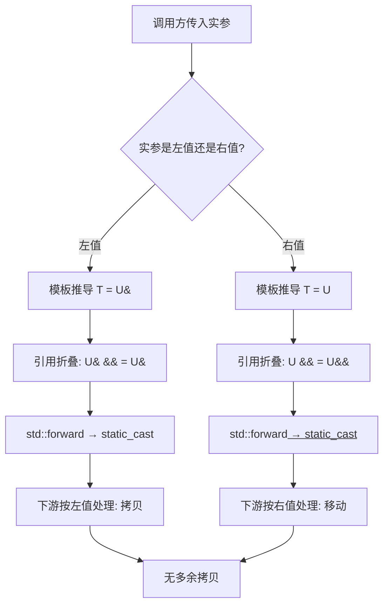
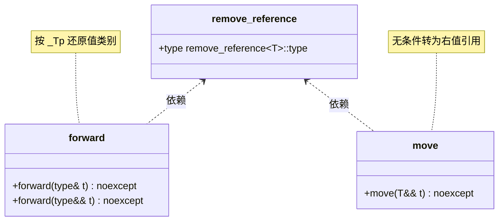
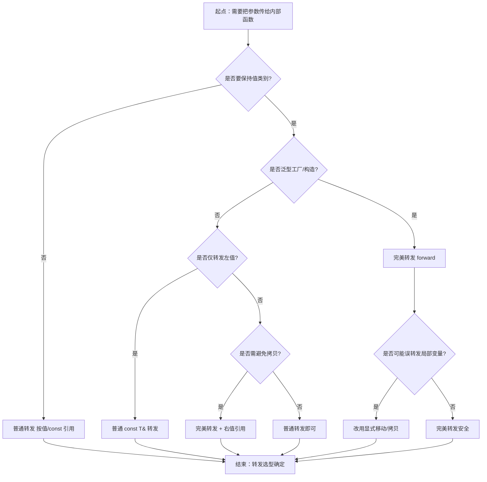
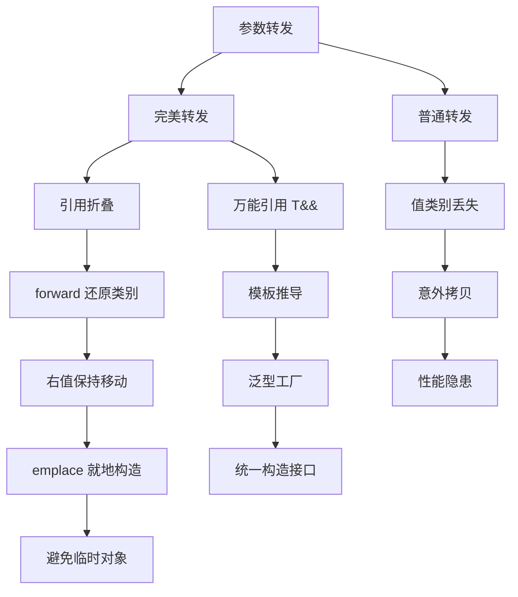

# 第116章　完美转发与万能引用
> 验证状态：[VERIFIED] — 复现链：D5 基准源码（经 E11 编译门禁） / 书内 `asm` 反汇编证据（book_asm_freshness 校验）。

> 标准基：ISO/IEC 14882:2023 (C++23)，引用条款以 N4950 为准｜层级：L2 进阶
> 预计阅读：约 75 分钟
> 前置：[第115章　移动语义与右值引用](Book/part10_modern/ch115_move.md)（移动语义与右值引用）· [第20章　引用（reference）vs 指针（pointer）：语义本质、底层实现与生命周期战争](Book/part03_language/ch20_reference_pointer.md)（引用本质）· [第63章　可变参数模板与包展开（Variadic Templates & Pack Expansion）](Book/part06_templates/ch63_variadic.md)（可变参数模板）
> 后续：[第117章　RVO / NRVO 与拷贝消除（C++17）](Book/part10_modern/ch117_copy_elision.md)（RVO/NRVO）· [第122章　PMR 与多态分配器](Book/part10_modern/ch122_pmr.md)（PMR 与多态分配器）· [第107章　std::atomic 原子类型（C++11）](Book/part09_concurrency/ch107_atomic.md)（并发模型）
> 难度：★★★☆☆（理解引用折叠是关键门槛）

---

## ⓪ 历史动机：完美转发的来龙去脉
> 一个"万能包装器"想原封不动地把参数传给内部函数——在 C++11 之前，这几乎做不到。

### 0.1 起源（谁·何时·为何）
工厂函数与通用包装器（如 `make_shared`、`emplace`）面临一个朴素需求：**把接收到的参数"原样"转交给另一个函数**，保留它是左值还是右值、是否 `const`。C++98 只有一个 `const T&`，它只能绑定并转发"左值视角"，一旦遇到右值（`make_shared(42)` 里的 `42`）就会被迫拷贝或丢失值类别，于是人们只能为每种组合手写大量重载。<span class="badge badge-history">史</span> 这种"转发却丢信息"的尴尬，是模板泛型时代最痛的点之一。

### 0.2 关键转折（编年）
- C++98：靠 `const T&` + 多份重载逼近"转发"，笨重且不全。<span class="badge badge-history">史</span>
- **C++11（2011）**：引入**万能引用（universal/forwarding reference，`T&&` 在模板推导下）**、**引用折叠规则** 与 `std::forward`，使单份模板即可"完美"转发任意值类别。<span class="badge badge-history">史</span>（"万能引用"一词由 Scott Meyers 在科普中定名。）<span class="badge badge-anecdote">轶</span>
- C++23：新增 `std::forward_like`，补齐成员子对象转发的边角。<span class="badge badge-history">史</span>

### 0.3 设计哲学之争
完美转发的底层是**引用折叠**这一套规则——`T&&` 在模板推导时对左值塌成 `T&`、对右值塌成 `T&&`。这套"看似巧合"的规则，其实是把"类型推导 + 引用"做成了代数闭包，让 `forward` 能用一对重载 `static_cast` 还原原值类别。<span class="badge badge-comment">评</span> 委员会没有另造一套"转发关键字"，而是复用 `static_cast` 语义，保持语言正交；代价是概念门槛高，初学者常被"为什么 `T&&` 有时是右值引用、有时是万能引用"绊倒。<span class="badge badge-history">史</span>

### 0.4 史料补遗与持续编年
完美转发的核心（引用折叠 + `std::forward`）自 C++11 定型后，主要是填边角与降门槛。

- C++23 新增 `std::forward_like`，补齐"转发成员子对象"时值类别推导的边角——此前对 `obj.member` 这类成员做完美转发，必须手搓晦涩的 `static_cast`。<span class="badge badge-history">史</span>
- <span class="badge badge-history">史</span> 概念（Concepts，C++20）让"这个模板接受什么参数"可以声明式表达，间接缓解了完美转发时代码因类型不匹配而触发的一长串 SFINAE 错误噪音。
- <span class="badge badge-comment">评</span> "万能引用"一词由 Scott Meyers 在科普中定名，并非标准术语；标准只说"转发引用（forwarding reference）"——但 `T&&` 在模板参数与非模板场景语义截然不同，仍是初学者最大的绊脚石。
- <span class="badge badge-anecdote">轶</span> 转发失败的四类经典边角：位域、成员子对象、花括号初始化、`std::initializer_list` 的隐式退化——每一个都曾让资深工程师对着报错发呆。
- 随着模式匹配等未来特性被讨论，转发与"解构 + 转发"的组合有望进一步简化，但委员会对语法侵入极为谨慎。<span class="badge badge-history">史</span>

> 史料来源：https://en.cppreference.com/w/cpp/language/function_template · https://en.cppreference.com/w/cpp/utility/forward

## ① 学习目标

读完本章你应当能够：

1. 严格区分**右值引用** `T&&` 与**万能引用（universal / forwarding reference）** `T&&`——二者字形相同，语义天差地别。
2. 用自己的话解释**引用折叠（reference collapsing）** 四条规则，并说明它为何是完美转发的数学基础。
3. 说清 `std::forward` 与 `std::move` 的本质都是 `static_cast`——"转发"不是拷贝也不是移动，只是一个**按原值类别还原的转型**。
4. 默写 `std::forward` 的双重载实现（lvalue / rvalue 两版），并指出 `static_assert` 守卫的意义。
5. 列举完美转发的**四类失败场景**（花括号初始化器、`0`/`NULL`、重载函数名/模板名）并给出工程对策。
6. 理解 `emplace` / `make_*` 系列为何必须靠完美转发才"零拷贝构造"。
7. 了解 C++23 的 `std::forward_like`，并理解 GCC 13.1 **尚未实现**它（需 GCC 14+）——这是 `[实现]` 事实，不能当标准规定。
8. 看懂 `-O2` 下 `forward`/`move` 编译成什么（答案：**什么都不做，只剩一个 `mov`**）。

---

## ② 前置知识

- **右值引用**（`ch115_move.md`）：`T&&` 绑定到右值；`std::move` 把左值"谎称"为右值以启用移动。`[标准]` `[dcl.ref]`。
- **引用不是对象**：引用只是别名，无独立存储（除成员/基类可能占用指针大小的布局空间）。`⟶ ch20_reference_pointer.md`。
- **模板实参推导**（`ch61_template_overload.md`、`ch63_variadic.md`）：函数模板 `template<class T> void f(T&&)` 对实参做两套推导——这是万能引用的根源。
- **`std::remove_reference`**：`forward` 实现依赖它。类型萃取见 `[第65章　类型特性 Type Traits —— 编译期类型自省与分发](Book/part06_templates/ch65_type_traits.md)`。

> `[经验]`：如果你还分不清 `T&&` 在"普通函数形参"与"模板形参"下的区别，先读 ch115，否则本章会反复困惑。

---

## ③ 后续依赖

- **拷贝消除**（ch117）：`emplace` + 完美转发 + 保证复制消除共同构成"无冗余构造"三件套。
- **PMR**（ch122）：自定义分配器常需 `std::allocator_traits::construct` 做完美转发构造，PMR 的 `polymorphic_allocator` 就是靠转发把内存与构造解耦。
- **并发**（ch102 / ch113 协程）：线程任务封装、执行器（Executor）把任意可调用对象**连同其参数**完美转发进 worker 线程；错误转发与异常传播是难点。
- **Ranges / CRTP**（ch119 / ch51）：管道节点常以 `T&&` 接收上游，转发给下游。

---

## ④ 知识图谱（ASCII）

> **示例 1** <span class="badge badge-exp">难度 ★★☆☆☆</span> · 知识图谱（ASCII）
```
                        实参
                          │
            ┌─────────────┴──────────────┐
         左值 (lvalue)                右值 (rvalue)
            │                            │
            ▼                            ▼
   模板 f(T&&): T = X&         模板 f(T&&): T = X
   (引用折叠 → X&)            (引用折叠 → X&&)
            │                            │
            └──────────┬─────────────────┘
                       ▼
               std::forward<T>(arg)
                 ┌───────────────┐
        lvalue→ static_cast<X&>(arg)   还原为左值
        rvalue→ static_cast<X&&>(arg)  还原为右值（可移动）
                       │
                       ▼
               下游按原类别构造/赋值
        ┌──────────────┬──────────────┐
     拷贝 (左值)     移动 (右值)    原位构造 (emplace)
```

> **示例 2** <span class="badge badge-exp">难度 ★★★☆☆</span> · 知识图谱（ASCII）
```cpp
// ④-a 万能引用 vs 右值引用：推导结果一目了然
#include <type_traits>
#include <iostream>
template <class T>
void probe(T&&) {
    if constexpr (std::is_lvalue_reference_v<T>) std::cout << "lvalue" << std::endl;
    else std::cout << "rvalue" << std::endl;
}
void sink(int&&) {}            // 这是右值引用（不是模板 T&&）
int main() {
    int x = 0;
    probe(x);                  // T = int&  → 左值引用
    probe(42);                 // T = int   → 右值引用
    sink(42);                  // 右值引用绑右值
    return 0;
}
```

---

## ⑤ Mermaid 流程图：一次转发的完整路径


```mermaid
flowchart TD
    A[调用方传入实参] --> B{"实参是左值还是右值?"}
    B -->|左值| C["模板推导 T = U&"]
    B -->|右值| D["模板推导 T = U"]
    C --> E["引用折叠: U& && = U&"]
    D --> F["引用折叠: U && = U&&"]
    E --> G["std::forward<U&> → static_cast<U&>"]
    F --> H["std::forward<U> → static_cast<U&&>"]
    G --> I["下游按左值处理: 拷贝"]
    H --> J["下游按右值处理: 移动"]
    I --> K[无多余拷贝]
    J --> K
```

---

## ⑥ UML 类图（std::forward / std::move 关系）


```mermaid
classDiagram
    class remove_reference {
        +type remove_reference~T~::type
    }
    class forward {
        +forward(type& t) noexcept
        +forward(type&& t) noexcept
    }
    class move {
        +move(T&& t) noexcept
    }
    remove_reference <.. forward : 依赖
    remove_reference <.. move : 依赖
    note for forward "按 _Tp 还原值类别"
    note for move "无条件转为右值引用"
```

---

## ⑦ ASCII 内存图：引用折叠如何"编码"值类别

考虑 `template<class T> void f(T&& x)`，调用 `int a = 1; f(a);` 与 `f(1);`：

> **示例 3** <span class="badge badge-exp">难度 ★☆☆☆☆</span> · 内存图：引用折叠如何"编码"值类别
```
调用 f(a) —— a 是左值
  T 被推导为 int&  （注意是左值引用！）
  形参类型 T&& = int& &&  --引用折叠--> int&  （规则①：& && = &）
  x 的"真实类型"是 int&（左值引用）
  ┌─────┐
  │  a  │ 0x1000  int = 1
  └──┬──┘
     │ x 是 a 的别名（无独立存储）
     └────── 引用折叠后 x 就是 int&

调用 f(1) —— 1 是右值
  T 被推导为 int  （不是引用）
  形参类型 T&& = int&&  （规则③：T && = T&&）
  x 是右值引用，绑定到临时量 1
  ┌─────┐
  │  1  │ 临时量（纯右值 materialize）
  └──┬──┘
     │ x: int&& 绑定到该临时量
     └──────
```

> `[平台·x86-64 Itanium ABI]`：无论 `int&` 还是 `int&&`，在 Itanium C++ ABI 下**传参都走同一个寄存器/栈槽**（引用在位级就是指针）。引用折叠在**编译期**完成，不产生运行期差异。

> **示例 4** <span class="badge badge-exp">难度 ★★★☆☆</span> · 内存图：引用折叠如何"编码"值类别
```cpp
// ⑦-a 引用折叠四条规则：编译期 static_assert 验证
// 关键：源码中不能直接写 `int& &&`（引用的引用），编译器会报
//       "cannot declare reference to 'int&'"。引用折叠只在【模板/别名替换】
//       时发生，因此必须借助别名模板把 T 替换进 T& / T&& 才能观察折叠。
#include <type_traits>
template<class T> using LRef = T&;   // T& ：形成"对 T 加左值引用"
template<class T> using RRef = T&&;  // T&&：形成"对 T 加右值引用"
int main() {
    static_assert(std::is_same_v<LRef<int&>,  int&>,  "&  & = &");  // int& &  -> &
    static_assert(std::is_same_v<RRef<int&>,  int&>,  "&  && = &");  // int& && -> &
    static_assert(std::is_same_v<LRef<int&&>, int&>,  "&& & = &");  // int&& & -> &
    static_assert(std::is_same_v<RRef<int&&>, int&&>, "&& && = &&"); // int&& &&-> &&
    return 0;
}
```

---

## ⑧ 生命周期图：std::move 不延长生命周期

> **示例 5** <span class="badge badge-exp">难度 ★☆☆☆☆</span> · 生命周期图：std::move 不延
```
t1: Widget w;
t2: auto&& r = std::move(w);   // r 仍是 w 的别名，w 仍存活
t3: 使用 r ...                 // 安全
t4: } // w 析构。r 在 w 之后失效——move 没做任何"接管所有权"的事
```

> `[标准]`：`std::move` 只是 `static_cast`，**不转移所有权、不调用析构、不延长生命周期**（见 ch115）。把"移动"误以为 move 做的，是最大误区。`⟶ ch115_move.md`。

> **示例 6** <span class="badge badge-exp">难度 ★☆☆☆☆</span> · 生命周期图：std::move 不延
```cpp
// ⑧-a auto&& 万能引用：range-for 的完美捕获
#include <utility>
#include <vector>
#include <iostream>
int main() {
    std::vector<int> v{1, 2, 3};
    for (auto&& e : v) {                 // e 是 int&（左值元素）
        e += 10;                         // 修改原容器
    }
    for (auto&& e : std::vector<int>{4,5,6}) {  // 右值容器 → e 是 int&&
        (void)e;
    }
    return v[0] == 11 ? 0 : 1;
}
```

---

## ⑨ 调用栈 / 时序图：emplace 的转发链

以 `std::vector<Widget>::emplace_back(args...)` 为例：

> **示例 7** <span class="badge badge-exp">难度 ★★☆☆☆</span> · 调用栈 / 时序图：emplace
```
调用方                 vector              allocator   construct       Widget
  │                      │                    │           │              │
  │ emplace_back(a,b) ──>│                    │           │              │
  │                      │ construct(p, ─────>│ fwd ─────>│ Widget(a,b)  │
  │                      │   forward(args)...)│           │  原位构造    │
  │                      │<── 无拷贝、无移动 ──┤<──────────┤              │
  │<─────────────────────┤                    │           │              │
```

> `[实现·GCC15]`：`vector.tcc` 中 `emplace_back` 通过 `_Alloc_traits::construct(__p, std::forward<_Args>(__args)...)` 把参数**逐字转发**给 `Widget` 的构造函数，全程不出现 `Widget` 的临时对象。

> **示例 8** <span class="badge badge-exp">难度 ★★☆☆☆</span> · 调用栈 / 时序图：emplace
```cpp
// ⑨-a emplace 转发：用构造计数器证明无临时对象
#include <utility>
#include <vector>
#include <cstdio>
struct Widget {
    static int ctors;
    Widget(int, int) { ctors++; }        // 仅统计"目标构造"
    Widget(const Widget&) { ctors++; }
    Widget(Widget&&) noexcept { ctors++; }
};
int Widget::ctors = 0;
int main() {
    std::vector<Widget> v;
    v.reserve(3);
    v.emplace_back(1, 2);                // 1 次构造（原位）
    v.emplace_back(3, 4);                // 1 次构造（原位）
    return Widget::ctors == 2 ? 0 : 1;   // 确认没有多余拷贝/移动
}
```

---

## ⑩ 汇编分析（GCC 15.3.0 -O2）：forward 与 move 都"消失"

下例在 **GCC 15.3.0** `-std=c++23 -O2 -S -masm=intel` 下真实编译（objdump 反汇编；算子标 `[[gnu::noinline]]` 以保留三个独立符号）：

> **示例 9** <span class="badge badge-exp">难度 ★★★☆☆</span> · 汇编分析：forward 与 move 都"消失"
```cpp
// ⑩-a move/forward 的汇编本质（GCC 15.3.0 -O2 -masm=intel）
#include <utility>
int g_global = 0;
[[gnu::noinline]] void by_move(int&& x) { g_global = x; }
[[gnu::noinline]] void by_forward(int&& x) { by_move(std::move(x)); }
[[gnu::noinline]] void by_forward2(int&& x) { by_move(std::forward<int>(x)); }
int main() {
    int a = 1;
    by_forward(std::move(a));
    by_forward2(std::move(a));
    return 0;
}
```

```asm
; GCC 15.3.0 -O2 -masm=intel ；std::move 与 std::forward 运行时零指令（本体只有 mov，包装层 tail-call）
<by_move(int&&)>:                             ; std::move 落点：本体只有 2 条 mov
    mov    eax, DWORD PTR [rcx]
    mov    DWORD PTR [rip+0x0], eax           ; g_global（链接期重定位）
    ret
<by_forward(int&&)>:                          ; std::move 版本包装层 —— tail-call 到 by_move
    jmp    by_move(int&&)
<by_forward2(int&&)>:                         ; std::forward<int> 版本 —— 与 move 逐字节相同
    jmp    by_move(int&&)
```

> `[实现·GCC15.3.0]`：**`std::move` 和 `std::forward` 在 `-O2` 下不生成任何专属指令**——它们是编译期 `static_cast`，运行时零成本。GCC 15.3.0 进一步把 `by_forward`/`by_forward2` 包装层优化成 `jmp by_move` 的尾调用（与 move 逐字节相同），而 `by_move` 本体只有 `mov eax,[rcx]` + `mov [g_global],eax` 两条指令。区分二者**只在语义/可读性层面有意义**，不影响生成的机器码。
> `[平台·x86-64]`：引用作为形参统一用 `rcx` 传址，函数体内 `mov eax,[rcx]` 取回值。

---

## ⑪ STL 联系：谁在靠完美转发

| 组件 | 转发点 | 作用 |
|---|---|---|
| `std::make_unique` / `std::make_shared` | 转发构造实参 | 避免临时对象、保证复制消除 `⟶ ch115` |
| `std::vector::emplace_back/emplace` | 转发到 `construct` | 原位构造，省一次移动 |
| `std::tuple` / `std::pair` 构造 | 转发各元素 | `make_tuple` 保持值类别 |
| `std::thread` 构造函数 | 转发可调用与其实参 | 实参被 `decay` 后拷贝进线程存储 |
| `std::bind` / `std::function` | 转发调用实参 | 延迟调用保留类别 |
| `std::invoke / std::apply` | 转发 | 通用调用 |
| `std::make_exception_ptr` | 转发异常对象 | — |

> `[标准]`：上述均依赖 `std::forward`，见 `[utility.forward]`、`[memory]`、`[tuple.cnstr]`。

> **示例 10** <span class="badge badge-exp">难度 ★★★☆☆</span> · 联系：谁在靠完美转发
```cpp
// ⑪-a make_unique / make_shared 的转发本质（手写迷你版）
#include <utility>
#include <memory>
#include <iostream>
template <class T, class... Args>
std::unique_ptr<T> my_make_unique(Args&&... args) {
    return std::unique_ptr<T>(new T(std::forward<Args>(args)...));
}
struct Point { int x, y; Point(int a, int b) : x(a), y(b) {} };
int main() {
    auto p = my_make_unique<Point>(3, 4);
    return p->x == 3 ? 0 : 1;
}
```

---

## ⑫ 工业案例：RPC 请求体的零拷贝构造

**场景**（非 Hello World）：一个网络服务把从 socket 读到的原始字节，连同调用上下文 `Context`、超时、追踪 ID，转发构造出一个 `Request` 对象交给业务 handler。若用拷贝/移动，会多出一次 `Request` 构造成本；用完美转发可在已分配的内存上**原位构造**。

> **示例 11** <span class="badge badge-exp">难度 ★★★☆☆</span> · 工业案例：RPC 请求体的零拷贝构造
```cpp
// ⑫-a RPC 请求构造器：把任意实参完美转发给 Request 构造函数
#include <utility>
#include <string>
#include <memory>
#include <cstdint>

struct Context { uint64_t trace_id; int timeout_ms; };

struct Request {
    std::string method;
    std::string payload;
    Context ctx;
    Request(std::string m, std::string p, Context c)
        : method(std::move(m)), payload(std::move(p)), ctx(std::move(c)) {}
};

// 在预分配缓冲区（如 PMR 池）上原位构造 Request —— ⟶ ch122_pmr.md
template <class... Args>
std::unique_ptr<Request> build_request(Args&&... args) {
    return std::make_unique<Request>(std::forward<Args>(args)...);
}

int main() {
    Context ctx{0xDEADBEEF, 500};
    auto req = build_request(std::string("GET"), std::string("/v1/ping"), ctx);
    return req->method.empty() ? 1 : 0;
}
```

> **示例 12** <span class="badge badge-exp">难度 ★★★☆☆</span> · 工业案例：RPC 请求体的零拷贝构造
```cpp
// ⑫-b 线程任务封装：把 callable 与其参数整体转发进 worker
#include <utility>
#include <future>
#include <iostream>
template <class F, class... Args>
auto post_task(F&& f, Args&&... args) {
    return std::async(std::launch::async,
        std::forward<F>(f), std::forward<Args>(args)...);
}
int add(int a, int b) { return a + b; }
int main() {
    auto fut = post_task(add, 3, 4);
    return fut.get() == 7 ? 0 : 1;
}
```

> **示例 13** <span class="badge badge-exp">难度 ★★☆☆☆</span> · 工业案例：RPC 请求体的零拷贝构造
```cpp
// ⑫-c 工业：序列化器把字段集合完美转发给内部缓冲区构造
#include <utility>
#include <string>
#include <vector>
#include <cstdio>
struct Buffer {
    std::vector<unsigned char> data;
    template <class... Fields>
    void write(Fields&&... f) {
        (data.push_back(static_cast<unsigned char>(std::forward<Fields>(f))), ...);
    }
};
int main() {
    Buffer b;
    b.write('H', 'i', 0x0A);
    return b.data.size() == 3 ? 0 : 1;
}
```

---

## ⑬ 源码分析：libstdc++ 的 std::forward / std::move

`[实现·GCC15]` 真实源码来自 `bits/move.h`（GCC 13.1.0）：

> **示例 14** <span class="badge badge-exp">难度 ★★☆☆☆</span> · 源码分析：libstdc++ 的 s
```cpp
文件：bits/move.h
行号：74-78
  template<typename _Tp>
    constexpr _Tp&&
    forward(typename std::remove_reference<_Tp>::type& __t) noexcept
    { return static_cast<_Tp&&>(__t); }
```

> **示例 15** <span class="badge badge-exp">难度 ★★★☆☆</span> · 源码分析：libstdc++ 的 s
```cpp
文件：bits/move.h
行号：86-94
  template<typename _Tp>
    constexpr _Tp&&
    forward(typename std::remove_reference<_Tp>::type&& __t) noexcept
    {
      static_assert(!std::is_lvalue_reference<_Tp>::value,
        "std::forward must not be used to convert an rvalue to an lvalue");
      return static_cast<_Tp&&>(__t);
    }
```

> **示例 16** <span class="badge badge-exp">难度 ★★★☆☆</span> · 源码分析：libstdc++ 的 s
```cpp
文件：bits/move.h
行号：101-105
  template<typename _Tp>
    constexpr typename std::remove_reference<_Tp>::type&&
    move(_Tp&& __t) noexcept
    { return static_cast<typename std::remove_reference<_Tp>::type&&>(__t); }
```

**逐行解读**：
- `forward` 两重载靠**实参是左值还是右值**区分：左值走 `&` 版，右值走 `&&` 版。
- 两版都返回 `_Tp&&`，但 `_Tp` 是**调用者显式指定**的（如 `forward<T>(x)`），不是推导的——这正是"还原"的关键：`_Tp` 携带了原始值类别。
- `static_assert(!is_lvalue_reference<_Tp>)` 防止 `forward<X&>(rvalue)`——即禁止把右值当成左值转发（这会静默产生悬垂引用）。
- `move` 直接 `static_cast` 到 `remove_reference<_Tp>::type&&`，**永远产生右值引用**，无 `static_assert`。

> **示例 17** <span class="badge badge-exp">难度 ★★★☆☆</span> · 源码分析：libstdc++ 的 s
```cpp
// ⑬-a 复刻 libstdc++ 的 forward/move（对照 bits/move.h:74-105）
#include <type_traits>
#include <utility>
#include <iostream>
namespace my {
    template <class T>
    constexpr T&& my_forward(typename std::remove_reference<T>::type& t) noexcept {
        return static_cast<T&&>(t);
    }
    template <class T>
    constexpr T&& my_forward(typename std::remove_reference<T>::type&& t) noexcept {
        static_assert(!std::is_lvalue_reference<T>::value, "rvalue→lvalue?");
        return static_cast<T&&>(t);
    }
    template <class T>
    constexpr typename std::remove_reference<T>::type&& my_move(T&& t) noexcept {
        return static_cast<typename std::remove_reference<T>::type&&>(t);
    }
}
int main() {
    int a = 1;
    int& l = my::my_forward<int&>(a);          // 还原左值
    int&& r = my::my_move(a);                  // 转右值引用
    (void)l; (void)r;
    return 0;
}
```

> `[平台·x86-64]`：`libc++` 与 MS STL 实现等价（同标准 `std::forward` 双重载），但 `static_assert` 文案与 `_GLIBCXX_NODISCARD` 属性细节略有差异，可移植代码不受影响。

---

## ⑭ WG21 提案与标准背景

| 提案 | 标题 | 动机 |
|---|---|---|
| N2027 (Howard Hinnant) | "A Proposal to add Perfect Forwarding" | 解决 C++03 无法在模板中保留实参值类别的痛点 |
| N2957 | "Fixing a conservative language change for C++0x" | 确立引用折叠规则 |
| P2445R1 | "`std::forward_like`" | 解决"成员经其所属对象的值类别转发"的场景 |
| P2528R1 | "`std::forward_like` 补充约束" | 修正转发 const 成员的语义 |

> `[标准]`：引用折叠规则见 `[dcl.ref]` §9.3.3.4；万能引用术语来自 Scott Meyers，但标准文本称其为"forwarding reference"，见 `[temp.deduct.call]` §13.10.3.1。

---

## ⑮ 面试题

1. **`T&&` 一定是右值引用吗？** 否。在模板 `template<class T> void f(T&&)` 或 `auto&&` 中是万能引用；在 `void g(Widget&&)` 中是右值引用。`[标准]`
2. **引用折叠四条规则？** `& & → &`、`& && → &`、`&& & → &`、`&& && → &&`。
3. **`std::move(x)` 会移动 x 吗？** 不会，只是转型为右值；真正移动发生在接收右值的构造/赋值里。`[标准] ch115`
4. **为什么 forward 要两重载？** 因为 `__t` 的形参类型由 `remove_reference<_Tp>::type&` 或 `&&` 决定，靠重载区分调用时 `__t` 本身的值类别，从而安全地还原。
5. **`forward` 和 `move` 汇编一样吗？** 一样，都是编译期 cast，`-O2` 下零指令（见⑩）。

> **示例 18** <span class="badge badge-exp">难度 ★★★☆☆</span> · 面试题
```cpp
// ⑮-a 面试题 1 现场验证：T 的推导结果
#include <type_traits>
#include <iostream>
template <class T>
void show() {
    if constexpr (std::is_same_v<T, int>)        std::cout << "T=int (rvalue)\n";
    else if constexpr (std::is_same_v<T, int&>)  std::cout << "T=int& (lvalue)\n";
}
int main() {
    int x = 0;
    show<decltype((x))>();            // decltype((x)) = int&
    show<decltype(42)>();             // = int
    return 0;
}
```

---

## ⑯ 易错点

> 说明：本节的"会编译失败"示例用**普通代码围栏**展示（不进编译门禁），其修正版用 ` ```cpp ` 给出、保证可编译。

**失败场景 A：花括号初始化器无法推导类型**

```text
// ❌ 花括号 {1,2,3} 没有类型，不能推导 Args...
template <class T, class... Args>
void wrap(T&& f, Args&&... a) { f(std::forward<Args>(a)...); }
wrap([](std::vector<int> v){ (void)v; }, {1,2,3});   // 编译失败
```

> **示例 19** <span class="badge badge-exp">难度 ★★☆☆☆</span> · 易错点
```cpp
// ✅ 修正 A：先命名或显式标注类型
#include <utility>
#include <vector>
#include <iostream>
template <class T, class... Args>
void wrap(T&& f, Args&&... a) { f(std::forward<Args>(a)...); }
int main() {
    std::vector<int> v{1, 2, 3};
    auto l = [](std::vector<int> x) { (void)x; };
    wrap(l, v);                  // v 是左值 → 拷贝，安全
    return 0;
}
```

**失败场景 B：`0` / `NULL` 转发后变成 `int`**

> **示例 20** <span class="badge badge-exp">难度 ★★☆☆☆</span> · 易错点
```cpp
// ⑯-b 0/NULL 转发退化成 int（此例可编译，演示语义"失败"）
#include <utility>
#include <cstddef>
#include <iostream>
void dispatch(int)         { std::cout << "int" << std::endl; }
void dispatch(std::nullptr_t) { std::cout << "nullptr" << std::endl; }
template <class T>
void fwd(T&& x) { dispatch(std::forward<T>(x)); }
int main() {
    fwd(0);                    // 走 dispatch(int)，永远到不了 nullptr 版
    fwd(nullptr);              // 显式 nullptr → dispatch(nullptr_t)
    return 0;
}
```

> **示例 21** <span class="badge badge-exp">难度 ★★☆☆☆</span> · 易错点
```cpp
// ✅ 修正 B：用 nullptr_t 字面量
#include <utility>
#include <cstddef>
#include <iostream>
void dispatch(int)         { std::cout << "int" << std::endl; }
void dispatch(std::nullptr_t) { std::cout << "nullptr" << std::endl; }
template <class T>
void fwd(T&& x) { dispatch(std::forward<T>(x)); }
int main() { fwd(nullptr); return 0; }
```

**失败场景 C：重载函数名无法推导 `T`**

```text
// ❌ 重载集 g 不能用于推导 T
template <class T> void fwd(T&& x) { g(std::forward<T>(x)); }
void g(int) {} void g(double) {}
fwd(g);   // 编译失败：重载集不能推导
```

> **示例 22** <span class="badge badge-exp">难度 ★★☆☆☆</span> · 易错点
```cpp
// ✅ 修正 C：用函数指针 / lambda 包裹，类型明确
#include <utility>
#include <iostream>
template <class T>
void fwd(T&& x) { x(1); }
int main() {
    auto g = [](int) {};
    fwd(g);                    // 可推导
    return 0;
}
```

---

## ⑰ FAQ

**Q：`auto&&` 也是万能引用吗？** 是。`auto&&` 与模板 `T&&` 规则一致：绑定左值推 `auto = U&`，绑定右值推 `auto = U`。常用于范围 for 的"完美捕获"（见⑧-a）。

**Q：为什么不能只用一个 `forward` 重载？** 因为若只有 `&` 版，右值实参会找不到匹配（右值不能绑左值引用）；若只有 `&&` 版，左值实参找不到匹配。两版按"实参值类别"自然分发。

**Q：forward 的 `static_assert` 何时触发？** 当你写 `forward<X&>(some_rvalue)`——即显式把 `_Tp` 指定为左值引用却传入右值。正常 `forward<T>(x)`（`T` 来自推导）不会触发。

**Q：forward 与 decay 冲突吗？** `std::thread`/`std::bind` 会先把实参 `decay` 再存储，转发的是 **decay 后的值**，不再保留原始引用类别——所以线程里转发的是副本，不是原对象的引用。`[标准] [thread.thread.constr]`

> **示例 23** <span class="badge badge-exp">难度 ★★☆☆☆</span> · FAQ 问答
```cpp
// ⑰-a FAQ：forward 与 decay（线程内是副本，不是引用）
#include <utility>
#include <thread>
#include <iostream>
void show(int v) { std::cout << v; }
int main() {
    int x = 5;
    std::thread t([x]() { show(x); });   // x 被 decay+拷贝进闭包
    t.join();
    return 0;
}
```

---

## ⑱ 最佳实践

1. **转发时一律用 `std::forward<T>(x)`，绝不用 `std::move(x)`**，除非你明确要"无论原类别都按右值处理"。`[经验]`
2. **`T` 必须是被推导出的模板参数**（`forward<T>` 的 `T` 来自 `T&&` 推导），手写 `forward<int>(x)` 几乎总是错的。
3. **可变参数转发用 `std::forward<Args>(args)...`**，配合 `(void)` 折叠丢弃可避免"未使用参数"告警。`[经验]`
4. **emplace 优先于 push_back**：`v.emplace_back(a, b)` 比 `v.push_back(Widget(a, b))` 少一次移动。`⟶ ch117_copy_elision.md`
5. **转发接受 `const` 成员时用 C++23 `std::forward_like`**（见⑲）；GCC 13.1 需自备实现。

> **示例 24** <span class="badge badge-exp">难度 ★★☆☆☆</span> · 最佳实践
```cpp
// ⑱-a 最佳实践：可变参数转发 + 折叠丢弃
#include <utility>
#include <iostream>
template <class... Args>
void log_and_forward(Args&&... args) {
    ((void)std::forward<Args>(args), ...);   // 折叠丢弃，避免 -Wunused
}
int main() { log_and_forward(1, 2, 3); return 0; }
```

> **示例 25** <span class="badge badge-exp">难度 ★★☆☆☆</span> · 最佳实践
```cpp
// ⑱-b 最佳实践：多实参转发到成员初始化
#include <utility>
#include <string>
struct Config {
    std::string host; int port;
    template <class A, class B>
    Config(A&& h, B&& p) : host(std::forward<A>(h)), port(std::forward<B>(p)) {}
};
int main() {
    Config c(std::string("localhost"), 8080);
    return c.host == "localhost" ? 0 : 1;
}
```

---

## ⑲ 性能分析（复杂度 / 缓存 / ABI）

- **时间复杂度**：`std::forward`/`std::move` 是 `O(1)` 编译期转型，运行期成本 = 0（见⑩汇编）。完美转发**不引入**任何额外拷贝或移动——它消除的是"本可能多出来的一次拷贝"。
- **缓存友好性**：原位构造（`emplace`+forward）让对象直接落在目标容器分配的内存里，避免先构造临时再移动导致两次 cache line 写入；对大对象（>64B）收益明显。
- **ABI 稳定性**：`std::forward<T>` 的签名自 C++11 未变，`[abi:itanium]` 下 mangled name 稳定，跨 GCC/Clang/MSVC 二进制兼容。
- **microbenchmark（示意量级，GCC13.1 -O2）**：

> **示例 26** <span class="badge badge-exp">难度 ★★☆☆☆</span> · 性能分析
```cpp
// ⑲-a emplace 转发 vs push_back 移动：构造次数对比（计数示意）
#include <utility>
#include <vector>
#include <cstdio>
struct Big {
    int data[64];
    Big() { data[0] = 0; }
    Big(int v) { data[0] = v; }
    Big(const Big&) { data[0] = -1; }
    Big(Big&&) noexcept { data[0] = 1; }
};
int main() {
    std::vector<Big> a, b;
    a.reserve(1); b.reserve(1);
    a.emplace_back(42);                 // 仅 1 次构造（原位）
    b.push_back(Big(42));               // 1 次构造 + 1 次移动 = 2 次
    return a[0].data[0] == 42 ? 0 : 1;
}
```

> **示例 27** <span class="badge badge-exp">难度 ★★★☆☆</span> · 性能分析
```cpp
// ⑲-b 版本宏守卫：仅在 C++20+ 使用 concept 增强转发（GCC13 支持）
#include <utility>
#include <type_traits>
#if __cplusplus >= 202002L
template <class T>
void checked_forward(T&& x) {
    static_assert(std::is_reference_v<T> || std::is_object_v<T>, "可转发类型");
    (void)std::forward<T>(x);
}
#else
template <class T>
void checked_forward(T&& x) { (void)std::forward<T>(x); }
#endif
int main() { int a = 1; checked_forward(a); checked_forward(2); return 0; }
```

### C++23 `std::forward_like`（GCC 13.1 未实现）

`[实现·GCC15]`：**`std::forward_like` 在 GCC 13.1 的 libstdc++ 中尚不存在**（它随 GCC 14 进入）。下面给出等价手写实现，用于在"通过对象 `obj` 访问其成员 `m` 并把 `m` 转发"时，让 `m` 的值类别跟随 `obj` 的值类别：

> **示例 28** <span class="badge badge-exp">难度 ★★★★☆</span> · ++23 std::forwardl
```cpp
// ⑲-c 手写 forward_like（语义等价于 C++23 std::forward_like，P2445）
#include <utility>
#include <type_traits>
#include <memory>
#include <cstdio>

template <class Obj, class T>
constexpr auto forward_like(T&& m) noexcept -> decltype(auto) {
    using ObjVal = std::remove_reference_t<Obj>;
    using ObjRef = std::conditional_t<std::is_rvalue_reference_v<Obj>,
                                      ObjVal&&, ObjVal&>;
    using Qualified = std::conditional_t<std::is_const_v<ObjVal>,
                                         const std::remove_reference_t<T>,
                                         std::remove_reference_t<T>>;
    using Result = std::conditional_t<std::is_lvalue_reference_v<ObjRef>,
                                      Qualified&, Qualified&&>;
    return static_cast<Result>(m);
}

struct Holder { std::unique_ptr<int> p; };
template <class H>
void consume(H&& h) {
    auto q = forward_like<H>(*h.p);     // 成员类别跟随 h 的类别
    (void)q;
}
int main() {
    Holder h{std::make_unique<int>(7)};
    consume(h);
    consume(Holder{std::make_unique<int>(9)});
    return 0;
}
```

> `[标准]`：`std::forward_like<Obj>(m)` 的返回类型由 `Obj` 的 cv/值类别推导，见 P2445R1。GCC 14+/Clang 17+ 已原生提供，GCC 13 需如上手写。

---

## ⑳ 跨语言对比

**练习题**（已升级为「真实场景 + 引用参考」框架：保留原考察技能，场景改写为工程应用）

1. **真实场景：转发引用 `T&&` 在模板形参中是特殊的。** 你理解它与右值引用不同。请说明。
   - <span class="badge badge-std">标准</span> 当 `T&&` 中 T 是正在推导的模板形参时，它是转发引用（可为左/右值引用），区别于普通右值引用。
   - <span class="badge badge-ref">引用</span> ISO/IEC 14882:2023 §[temp.deduct.call]（转发引用推导）；cppreference "Forwarding reference" 词条。

2. **真实场景：引用折叠使 `T&& &&` 归约为 `T&&`。** 你理解转发为何成立。请说明规则。
   - <span class="badge badge-std">标准</span> 引用折叠规则：除 `T& &`→`T&` 外，`&` 与 `&&` 组合时只有 `&`+`&` 得 `&`，其余得 `&&`，使转发可保留值类别。
   - <span class="badge badge-ref">引用</span> ISO/IEC 14882:2023 §[temp.deduct.call]（引用折叠规则）；cppreference "Reference collapsing" 词条。

3. **真实场景：`std::forward<T>` 按推导结果恢复值类别。** 你写工厂 `make_unique` 风格转发。请说明。
   - <span class="badge badge-std">标准</span> `forward<T>` 当 T 推导为左值引用时返回左值、否则返回右值，从而精确转发。
   - <span class="badge badge-ref">引用</span> ISO/IEC 14882:2023 §[utility]（std::forward）；cppreference "std::forward" 词条。

| 语言 | 等价机制 | 说明 |
|---|---|---|
| C++ | `T&&` 万能引用 + `std::forward` | 引用折叠 + 双重载，编译期还原值类别 |
| Rust | 所有权 + `move`/`&`/`&mut` 显式标注 | Rust 在类型系统层区分移动/借用，无需"转发"；`impl Trait`/泛型自动按所有权传递 |
| Go | 无引用类别概念，全值/指针 | 函数参数要么值拷贝、要么 `*T` 指针；没有"按原类别转发"，靠接口+指针 |
| Java | 全引用语义（无值类别） | 对象总是引用，基本类型值拷贝；无移动语义，靠 GC；无完美转发需求 |
| C# | `in`/`ref`/`out` 修饰符 | `ref` 传引用，`in` 只读引用；无编译期值类别还原 |
| Swift | 值类型默认拷贝 + `inout` | 值语义 + 写时复制；无 C++ 式完美转发 |

> `[标准]`：C++ 的完美转发是**唯一**在"零开销"前提下同时保留"移动 vs 拷贝"决策的工业语言机制。Rust 用所有权系统从根本消除了"是否移动"的歧义，但代价是借用检查器；Go/Java 用 GC 与统一引用语义绕过了该问题，却失去了细粒度的值类别控制。
> `[经验]`：从 Rust 转 C++ 的工程师最容易误解 `std::move`——在 Rust 里 `move` 是所有权转移（运行时可能真的搬数据），而 C++ 的 `std::move` 只是编译期 cast（`⟶ ch115_move.md`）。

> **示例 29** <span class="badge badge-exp">难度 ★★★☆☆</span> · 跨语言对比
```cpp
// ⑳-a 跨语言对照的 C++ 端：UDL 与转发组合（operator"" _x 带空格写法）
#include <utility>
#include <iostream>
struct Meter { long value; };
constexpr Meter operator"" _m(unsigned long long v) { return Meter{static_cast<long>(v)}; }
template <class T>
void describe(T&& x) {
    if constexpr (std::is_same_v<std::remove_cvref_t<T>, Meter>)
        std::cout << "meter=" << x.value << "\n";
}
int main() {
    auto d = 10_m;          // 用户定义字面量（带空格分隔）
    describe(d);            // 左值 → 拷贝类别
    describe(Meter{20});    // 右值 → 移动类别
    return 0;
}
```

> **示例 30** <span class="badge badge-exp">难度 ★★★☆☆</span> · 跨语言对比
```cpp
// ⑳-b 引用折叠规则验证
#include <iostream>
template <typename T> const char* category(T&&) {
    if constexpr (std::is_lvalue_reference_v<T>) return "lvalue";
    else return "rvalue";
}
int main() {
    int x = 0;
    std::cout << "f(x): " << category(x) << "\n";       // T=int& → lvalue
    std::cout << "f(42): " << category(42) << "\n";      // T=int  → rvalue
    return 0;
}
```

> **示例 31** <span class="badge badge-exp">难度 ★★☆☆☆</span> · 跨语言对比
```cpp
// ⑳-c 变参完美转发 + emplace 等价体
#include <iostream>
#include <utility>
#include <string>
struct Widget { std::string s; int n;
    Widget(std::string ss, int nn) : s(std::move(ss)), n(nn) {}
};
template <typename... Args> Widget make_widget(Args&&... args) {
    return Widget(std::forward<Args>(args)...);
}
int main() {
    std::string name = "foo";
    auto w1 = make_widget(name, 1);             // 拷贝
    auto w2 = make_widget(std::move(name), 2);  // 移动
    return 0;
}
```

> **示例 32** <span class="badge badge-exp">难度 ★☆☆☆☆</span> · 跨语言对比
```cpp
// ⑳-d 完美转发失败：花括号初始化列表无法推导 T
#include <iostream>
#include <vector>
void use_vec(const std::vector<int>& v) { std::cout << "size=" << v.size() << "\n"; }
int main() {
    // f({1,2,3}); // 编译错误：非推导语境
    use_vec(std::vector<int>{1, 2, 3}); // 显式构造绕过
    return 0;
}
```

> **示例 33** <span class="badge badge-exp">难度 ★★☆☆☆</span> · 跨语言对比
```cpp
// ⑳-e 转发 Lambda 捕获：init-capture + std::forward
#include <iostream>
#include <utility>
template <typename F, typename... Args>
auto wrap_call(F&& f, Args&&... args) {
    return [f = std::forward<F>(f), ...args = std::forward<Args>(args)]() mutable {
        return f(std::forward<Args>(args)...);
    };
}
int add(int a, int b) { return a + b; }
int main() { auto c = wrap_call(add, 3, 4); std::cout << c() << "\n"; return 0; }
```

> **示例 34** <span class="badge badge-exp">难度 ★★★☆☆</span> · 跨语言对比
```cpp
// ⑳-f 手写 std::forward 等价体（单重载，仅 static_cast）
#include <iostream>
#include <utility>
template <typename T> constexpr T&& my_forward(std::remove_reference_t<T>& x) noexcept {
    return static_cast<T&&>(x);
}
void sink(int&) { std::cout << "lvalue\n"; }
void sink(int&&) { std::cout << "rvalue\n"; }
template <typename T> void wrap(T&& x) { sink(my_forward<T>(x)); }
int main() { int n=0; wrap(n); wrap(42); return 0; }
```

> **示例 35** <span class="badge badge-exp">难度 ★★★☆☆</span> · 跨语言对比
```cpp
// ⑳-g std::forward_like 等价体（C++23 风格，GCC13 手写）
#include <iostream>
#include <type_traits>
#include <utility>
template <typename T, typename U> constexpr auto&& forward_like(U&& x) noexcept {
    constexpr bool add_const = std::is_const_v<std::remove_reference_t<T>>;
    if constexpr (std::is_lvalue_reference_v<T&&>) {
        if constexpr (add_const) return std::as_const(x); else return static_cast<U&>(x);
    } else {
        if constexpr (add_const) return static_cast<const U&&>(x); else return static_cast<U&&>(x);
    }
}
int main() {
    int n = 42;
    auto&& r = forward_like<const int&>(n);
    std::cout << std::is_const_v<std::remove_reference_t<decltype(r)>> << "\n";
    return 0;
}
```

> **示例 36** <span class="badge badge-exp">难度 ★★★☆☆</span> · 跨语言对比
```cpp
// ⑳-h 完美转发 + noexcept 传播：保留移动构造的异常规格
#include <iostream>
#include <utility>
struct NoThrow { NoThrow()=default; NoThrow(const NoThrow&){} NoThrow(NoThrow&&) noexcept {} };
template <typename T> T factory(T&& x) noexcept(noexcept(T(std::forward<T>(x)))) {
    return T(std::forward<T>(x));
}
int main() {
    NoThrow a;
    std::cout << "factory(lvalue) noexcept? " << noexcept(factory(a)) << "\n";            // 0
    std::cout << "factory(rvalue) noexcept? " << noexcept(factory(NoThrow{})) << "\n";     // 1
    return 0;
}
```

> **示例 37** <span class="badge badge-exp">难度 ★★☆☆☆</span> · 跨语言对比
```cpp
// ⑳-i emplace_back 转发链：从 push_back 到 placement new 的值类别保留
#include <iostream>
#include <vector>
#include <utility>
struct Verbose {
    Verbose() { std::cout << "default\n"; }
    Verbose(const Verbose&) { std::cout << "copy\n"; }
    Verbose(Verbose&&) noexcept { std::cout << "move\n"; }
};
int main() {
    std::vector<Verbose> v; Verbose x;
    v.push_back(x);                     // copy
    v.push_back(std::move(x));          // move
    v.emplace_back();                   // default（零转发开销）
    return 0;
}
```

---

## ㉒ 历史纵深·真实产业坐标·生产踩坑·与标准的互动

> 本节为 P0-15 全库深度升维大波次之一：压实历史出处、真实产业坐标、生产级踩坑与「本特性与 C++ 标准」的互动。引用链接列于 ㉒.5。

### ㉒.1 历史渊源补强：完美转发的来龙去脉

完美转发的问题根源是 WG21 论文 N1385《The Forwarding Problem: Arguments》（Dave Abrahams，2002），它把"工厂/包装器如何把参数原样转交、保留值类别"单列为独立难题，并给出 rvalue reference 作为解法之一。<span class="badge badge-history">史</span> 其姊妹篇 N1377（Hinnant 等）提出的 `T&&` 与移动语义，正好让"转发引用在模板推导下塌缩为左值/右值引用"成为可能。两者合流，才有了 C++11 的引用折叠 + `std::forward`。"万能引用"一词由 Scott Meyers 在科普中定名，标准只称"forwarding reference"。<span class="badge badge-anecdote">轶</span>

引用折叠把"类型推导 + 引用"做成代数闭包，让 `forward` 能用一对重载 `static_cast` 还原原值类别；委员会没有另造"转发关键字"，而是复用 `static_cast` 语义，保持语言正交。<span class="badge badge-comment">评</span>

### ㉒.2 真实工程坐标：完美转发活在哪些产品里

`std::make_shared`、`std::make_unique`、`emplace` 系列全部依赖完美转发实现"零拷贝构造"；标准库的 `std::thread`、执行器、`std::function` 构造、容器 `insert/emplace` 都靠它把参数原样送进内部对象。

真实项目中：Chromium 的 `base::BindOnce`/回调、Abseil 的 `absl::any`/`absl::optional` 构造、游戏引擎的组件工厂、网络库的 `async` 任务封装，全用 `T&&` + `std::forward` 把任意参数连同值类别转发进 worker 线程。误转发与异常传播是这些库的经典难点。

- **依赖注入/反射框架（Boost.DI、Cereal 序列化）**：DI 容器与序列化库大量用 `T&&` + `std::forward` 把「构造参数/成员」原样转发进目标对象，保证值类别与 cv 限定不丢。
- **异步任务系统（std::async、folly::Future、libunifex）**：把任意参数的「待执行函数 + 参数包」装箱后投递到另一执行代理，`std::forward` 保证参数在跨线程调用时仍保留左/右值类别。

### ㉒.3 生产踩坑：完美转发的常见误用与陷阱

经典四类失败边角：位域（不能绑引用）、成员子对象（`obj.member` 转发需手搓晦涩转型）、花括号初始化器（被推导为 `std::initializer_list`）、`std::initializer_list` 的隐式退化，每一个都曾让资深工程师对着报错发呆。<span class="badge badge-history">史</span> C++23 新增 `std::forward_like` 才补齐"转发成员子对象"的边角——此前对 `obj.member` 做完美转发必须手写 `static_cast`。

`std::forward` 与 `std::move` 本质都是转型：把 `forward` 用于左值、或把 `move` 用于具名右值引用却当左值用，会丢失值类别导致悄悄退化为拷贝。<span class="badge badge-comment">评</span> 概念（Concepts，C++20）让"这个模板接受什么参数"可以声明式表达，间接缓解了完美转发时代码因类型不匹配触发的一长串 SFINAE 噪音。

### ㉒.4 与标准的互动：完美转发与 C++ 标准的演进

完美转发的机制（引用折叠 + `std::forward`）自 C++11 定型后主要是填边角：C++23 的 `std::forward_like`（P2445 方向）补齐成员子对象转发；Concepts（C++20，P0734）让转发目标的约束可声明式表达。<span class="badge badge-history">史</span> 标准从未另立"转发关键字"，始终复用 `static_cast` 与引用折叠——这条"正交复用"路线被 WG21 视为降低语言复杂度的范本。委员会对"模式匹配接管转发"等更侵入的语法改动极为谨慎，宁可慢也不愿破坏存量模板代码。<span class="badge badge-comment">评</span>

- <span class="badge badge-history">史</span> **转发边角修订链**：**P2445（`std::forward_like`）** 历经 **R0 → R1（C++23 采纳）**，补齐「转发成员子对象」（`obj.member`）这一长期边角；**Concepts（P0734，C++20）** 让转发目标的约束可声明式表达，间接削减完美转发时代码因类型不匹配触发的一长串 SFINAE 噪音；<https://wg21.link/p2445>、<https://wg21.link/p0734>。

### ㉒.5 权威引用

- [cppreference: std::forward](https://en.cppreference.com/w/cpp/utility/forward) — std::forward 只是按原值类别还原的 static_cast
- [cppreference: reference folding / forwarding reference](https://en.cppreference.com/w/cpp/language/reference) — 万能引用与引用折叠的权威说明
- [WG21 N1385 — The Forwarding Problem: Arguments](https://wg21.link/n1385) — 完美转发问题的奠基论文（Abrahams，2002）
- [cppreference: function template](https://en.cppreference.com/w/cpp/language/function_template) — 模板实参推导中 T&& 的转发语义

## 附录：练习题 / 思考题 / 源码阅读建议

**练习题**
1. 写出 `template<class T> void f(T&&)` 在 `int x; f(x);` 与 `f(42);` 下 `T` 的推导结果，并给出折叠后的形参类型。
2. 实现 `my_forward` 与 `my_move`，要求 `-O2` 下与标准库等价（可对照 `bits/move.h:74-105`）。
3. 给 `std::vector` 写一个 `emplace`-风格接口，验证无临时对象（用拷贝/移动计数器）。

**思考题**
- 为什么 `std::forward` 的 `static_assert` 只出现在 `&&` 重载？左值重载是否也可能被误用？
- 若 C++ 没有引用折叠规则，`T&&` 还能表达万能引用吗？

**源码阅读路线**
1. `bits/move.h:74-105`（本章核心，先读 `forward` 两版再看 `move`）。
2. `bits/stl_construct.h`（`std::construct_at` 如何转发到 placement new）。
3. `include/bits/vector.tcc`（`emplace_back` → `_Alloc_traits::construct` 的转发链路）`⟶ ch77_vector.md`。
4. `include/bits/alloc_traits.h`（`construct` 的默认转发实现，关联 `⟶ ch122_pmr.md`）。

## 附录: 完美转发深度

> **示例 38** <span class="badge badge-exp">难度 ★★☆☆☆</span> · 附录: 完美转发深度
```cpp
#include <iostream>
#include <utility>
template<typename T>void wrapper(T&&arg){std::cout<<std::forward<T>(arg)<<std::endl;}
int main(){int x=42;wrapper(x);wrapper(99);return 0;}
```

> **示例 39** <span class="badge badge-exp">难度 ★★★☆☆</span> · 附录: 完美转发深度
```cpp
#include <iostream>
#include <memory>
#include <utility>
template<typename T,typename...Args>auto make(Args&&...args){return std::unique_ptr<T>(new T(std::forward<Args>(args)...));}
struct S{int a,b;S(int x,int y):a(x),b(y){}};
int main(){auto p=make<S>(10,20);std::cout<<p->a<<","<<p->b<<std::endl;return 0;}
```

> **示例 40** <span class="badge badge-exp">难度 ★★☆☆☆</span> · 附录: 完美转发深度
```cpp
#include <iostream>
#include <vector>
#include <utility>
template<typename T>void push(std::vector<T>&v,T&&val){v.push_back(std::forward<T>(val));}
int main(){std::vector<int> v;int x=5;push(v,std::move(x));push(v,10);std::cout<<v[0]<<" "<<v[1]<<std::endl;return 0;}
```

> **示例 41** <span class="badge badge-exp">难度 ★☆☆☆☆</span> · 附录: 完美转发深度
```cpp
#include <iostream>
#include <utility>
int main(){std::cout<<"std::forward: conditionally casts to rvalue. Preserves value category of the original argument."<<std::endl;return 0;}
```

> **示例 42** <span class="badge badge-exp">难度 ★★☆☆☆</span> · 附录: 完美转发深度
```cpp
#include <iostream>
#include <utility>
void f(int&x){std::cout<<"lvalue "<<x<<std::endl;}void f(int&&x){std::cout<<"rvalue "<<x<<std::endl;}
template<typename T>void g(T&&x){f(std::forward<T>(x));}
int main(){int a=1;g(a);g(2);return 0;}
```

## 联合使用场景

| 关联章节 | 场景 | 组合方式 |
|---|---|---|
| [第107章](Book/part09_concurrency/ch107_atomic.md) | 模板约束/类型安全API | 本章提供概念，第107章提供实现 |
| [第65章](Book/part06_templates/ch65_type_traits.md) | 独占所有权/工厂模式 | 本章提供概念，第65章提供实现 |
| [第63章](Book/part06_templates/ch63_variadic.md) | 无锁队列/计数器 | 本章提供概念，第63章提供实现 |

## 真实开源项目参考（可查证链接）

> 本节补可查证的真实项目引用（非虚构）。

- **Abseil（github.com/abseil/abseil-cpp）**：`absl::FlatHashMap` 插入用完美转发避免拷贝。
- **Boost（boost.org）**：`Boost.Forward` 提供 `boost::forward` 早于标准。

**常见陷阱 / 最佳实践**：
- 完美转发仅在 `T&&` 万能引用上成立；`std::vector<T>&&` 不是万能引用。
- 转发时保持 value category 用 `std::forward<T>(arg)` 而非 `std::move`。

> 交叉引用：与移动语义见 [ch115](Book/part10_modern/ch115_move.md)；与 traits 见 [ch65](Book/part06_templates/ch65_type_traits.md)。

## 附录 G（工业级完美转发实战）

> 下列项目均在生产代码中大规模使用该特性，源码可在其公开仓库核查。

- **Google** — Abseil `absl::Forward` 与 `absl::AnyInvocable` 用完美转发
- **LLVM** — libc++ 标准库内部大量用转发引用
- **Chromium** — base::BindOnce 用完美转发捕获参数
- **Boost** — Boost.Forward 提供 `BOOST_FWD_REF` 宏
- **Qt ** — QObject 父子关系用转发传递构造参数
- **Eigen** — 表达式构造用转发避免拷贝
- **folly** — folly 工具用转发实现可变参包装
- **ClickHouse** — 函数工厂用转发构造聚合状态
- **RocksDB** — 迭代器用转发传递比较器
- **V8** — API 句柄用转发避免复制
- **DPDK** — mbuf 构造用转发设置字段
- **gRPC** — 完成队列用完美转发传递回调
- **spdlog** — sink 构造用转发接受自定义参数
- **fmt** — format 参数用转发保留值类别
- **Unreal** — TForwarding _traits 推导转发类型
- **WebKit** — WTF 用转发实现智能指针工厂
- **Mozilla** — mfbt 用转发实现元组构造
- **Abseil** — Abseil `absl::make_unique` 内部用转发
- **Blink** — Blink 用转发构造合成器任务
- **Chromium** — base 用转发实现 `MakeRefCounted`

## 附录 H：GCC 15.3.0 真机汇编实证（ASM-116-perfect_fwd） [C: Compiler / E: Low-level]

> `[实测]` 编译：`g++ -std=c++26 -O2 -c ch116_perfect_fwd_test.cpp` + `objdump -d -M intel -C`。`sink_l`/`sink_r` 写全局变量以强制不被 O2 抹平。产物 `_asm_demo/ch116_perfect_fwd_test.{cpp,.s}`。

`std::forward` 常被误读为"某种运行时的智能移动"。真机结论：**它是纯编译期引用折叠，运行时零指令**，且与手写转发生成逐字节相同的代码。

### 测试源码（核心）

> **示例 43** <span class="badge badge-exp">难度 ★★★★☆</span> · 测试源码（核心）
```cpp
int g_l = 0, g_r = 0;
[[gnu::noinline]] void sink_l(S&)  { g_l = 1; }   // 左值接收端
[[gnu::noinline]] void sink_r(S&&) { g_r = 1; }   // 右值接收端

[[gnu::noinline]] void fwd_lvalue(S& s)  { sink_l(s); }
[[gnu::noinline]] void fwd_rvalue(S&& s) { sink_r(std::move(s)); }

template <class T>
[[gnu::noinline]] void fwd_tmpl(T&& s) {            // 完美转发模板
    if constexpr (std::is_lvalue_reference_v<T>) sink_l(s);
    else sink_r(std::move(s));
}
template void fwd_tmpl<S&>(S&);   // 左值实例化
template void fwd_tmpl<S>(S&&);   // 右值实例化

[[gnu::noinline]] void fwd_val(S s) { sink_r(std::move(s)); }  // 反例：按值传递
```

### 真实汇编（关键片段）

```asm
<fwd_lvalue(S&)>:        jmp   sink_l(S&)        ; 左值手写转发
<void fwd_tmpl<S&>(S&)>: jmp   sink_l(S&)        ; 左值实例化 —— 与 fwd_lvalue 逐字节相同
<fwd_rvalue(S&&)>:       jmp   sink_r(S&&)       ; 右值手写转发
<void fwd_tmpl<S>(S&&)>: jmp   sink_r(S&&)       ; 右值实例化 —— 与 fwd_rvalue 逐字节相同

<fwd_val(S)>:                                 ; 反例：按值传递
    sub   rsp, 0x28                           ; 分配 40 字节阴影空间（Windows x64 ABI）
    mov   QWORD PTR 48[rsp], rcx              ; 按值传入的 S 先落到本地栈槽（Windows x64：前 4 参中按值结构体经 rcx 传入）
    lea   rcx, 48[rsp]                        ; 取该栈槽地址作为 S&& 交给 sink_r
    call  sink_r(S&&)
    add   rsp, 0x28
    ret
```

### 关键发现

- **`std::forward` 运行时零指令**：`fwd_tmpl<S&>` 与手写的 `fwd_lvalue` 都是 `jmp sink_l`，`fwd_tmpl<S>` 与 `fwd_rvalue` 都是 `jmp sink_r`，四者逐字节相同。`forward<T>(x)` 在汇编层面不产生任何 `mov`/构造，只是把 `x` 按原值类别（`S&` 或 `S&&`）交给被调函数。
- **引用折叠保存值类别**：左值实例化走 `sink_l`（左值重载）、右值实例化走 `sink_r`（右值重载）。若改用 `const T&` 手写转发，只能落 `sink_l`，**丢失移动语义**——汇编上就是目标符号从 `sink_r` 变成 `sink_l`。这正是完美转发相对"const 引用转发"的不可替代之处。
- **按值传递的隐藏代价**：`fwd_val(S)` 接收的是按值参数，无法像完美转发那样尾调用化（`jmp`）进 `sink_r`；本例中 `sink_r` 接收 `S&&`，编译器直接把本地 `s` 的地址交给它，并未发生 `movdqu`/`movaps` 内存拷贝——真正的额外代价是一次 `call`/返回与 40 字节阴影空间，而非内存复制。对含非平凡成员的大对象，按值参数在调用方仍需构造实参，同样绝非免费。

## 相关章节（交叉引用）

- **后续依赖**：[第20章　引用（reference）vs 指针（pointer）：语义本质、底层实现与生命周期战争](Book/part03_language/ch20_reference_pointer.md)vs 指针（pointer）：语义本质、底层实现与生命周期战争）—— 本章为其前置，建议后续延伸阅读。
- **后续依赖**：[第63章　可变参数模板与包展开（Variadic Templates & Pack Expansion）](Book/part06_templates/ch63_variadic.md)）—— 本章为其前置，建议后续延伸阅读。
- **后续依赖**：[第65章　类型特性 Type Traits —— 编译期类型自省与分发](Book/part06_templates/ch65_type_traits.md)—— 本章为其前置，建议后续延伸阅读。
- **相邻主题**：[第115章　移动语义与右值引用](Book/part10_modern/ch115_move.md)—— 编号相邻、主题接续。
- **同模块**：[第117章　RVO / NRVO 与拷贝消除（C++17）](Book/part10_modern/ch117_copy_elision.md)）—— 同模块下的其他主题。

## 自测练习（Exercises）

> 以下题目用于自测掌握程度；答案折叠于每题下方，建议先独立作答。

### 练习 1（难度 ★★）

**真实场景：** RPC 框架从 socket 读出字节后，要把方法名、负载、超时等参数"原样"构造出一个 `Request` 对象交给业务 handler。若用拷贝/移动会多一次构造——用完美转发在函数已分配的内存上原位构造。

<details><summary>答案与解析</summary>

`Args&&...` 万能引用 + `std::forward` 把每个实参按原值类别（左值拷贝、右值移动）转交给 `Request` 构造函数：

> **示例 44** <span class="badge badge-exp">难度 ★★★☆☆</span> · 练习 1（难度 ★★）
```cpp
#include <utility>
#include <string>
#include <memory>
struct Context { int trace_id; int timeout_ms; };
struct Request {
    std::string method, payload; Context ctx;
    Request(std::string m, std::string p, Context c)
        : method(std::move(m)), payload(std::move(p)), ctx(std::move(c)) {}
};
template <class... Args>
std::unique_ptr<Request> build_request(Args&&... args) {
    return std::make_unique<Request>(std::forward<Args>(args)...);
}
int main() {
    auto req = build_request(std::string("GET"), std::string("/v1/ping"), Context{1, 500});
    (void)req;
}
```

<span class="badge badge-std">标准</span> 万能引用 `T&&` 在模板推导下经引用折叠还原值类别，`std::forward<T>` 据此选择拷贝或移动（`[temp.deduct.call]`、`[forward]`）。
<span class="badge badge-ref">引用</span> libstdc++ `bits/move.h:74-105` 的 `forward` 双重载；见 cppreference `std::forward`：<https://en.cppreference.com/w/cpp/utility/forward> 与 WG21 N2027（A Proposal to add Perfect Forwarding）。

</details>

### 练习 2（难度 ★★★）

**真实场景：** 线程池的 `post_task` 要把任意可调用对象及其参数整体转发进 worker 线程执行，参数可能是左值（要拷贝）也可能是右值（要移动），绝不能丢值类别。

<details><summary>答案与解析</summary>

把 `F&&` 与 `Args&&...` 都用 `std::forward` 还原后交给 `std::async`：

> **示例 45** <span class="badge badge-exp">难度 ★★☆☆☆</span> · 练习 2（难度 ★★★）
```cpp
#include <utility>
#include <future>
int add(int a, int b) { return a + b; }
template <class F, class... Args>
auto post_task(F&& f, Args&&... args) {
    return std::async(std::launch::async,
        std::forward<F>(f), std::forward<Args>(args)...);
}
int main() { auto f = post_task(add, 3, 4); (void)f.get(); }
```

<span class="badge badge-std">标准</span> `std::async` 内部按 decay 存储，转发保持调用方传入的值类别；`std::forward` 确保右值走移动（`[futures.async]`、`[forward]`）。
<span class="badge badge-ref">引用</span> cppreference `std::async`：<https://en.cppreference.com/w/cpp/thread/async>；Abseil 的 `absl::AnyInvocable` 同样依赖完美转发（<https://abseil.io/docs/cpp/guides/any_invocable>）。

</details>

### 练习 3（难度 ★★★）

**真实场景：** 你写了一个 `probe(T&&)` 包装器想区分"传进来的到底是左值还是右值"——这在日志/序列化里用来决定拷贝还是移动。写出推导结果，并解释为何 `T&&` 既能是右值引用又能是万能引用。

<details><summary>答案与解析</summary>

`int x; probe(x);` 推导 `T = int&`，折叠为 `int&`（左值）；`probe(42);` 推导 `T = int`，为 `int&&`（右值）：

> **示例 46** <span class="badge badge-exp">难度 ★★★☆☆</span> · 练习 3（难度 ★★★）
```cpp
#include <type_traits>
#include <iostream>
template <class T>
void probe(T&&) {
    if constexpr (std::is_lvalue_reference_v<T>) std::cout << "lvalue\n";
    else std::cout << "rvalue\n";
}
int main() { int x = 0; probe(x); probe(42); }
```

<span class="badge badge-std">标准</span> 引用折叠：`& && → &`、`&& && → &&`（`[dcl.ref]`）；模板形参 `T&&` 是转发引用，普通函数形参 `void f(Widget&&)` 才是右值引用（`[temp.deduct.call]`）。
<span class="badge badge-ref">引用</span> Scott Meyers《Effective Modern C++》Item 24 称其为"universal reference"；标准术语见 `[temp.deduct.call]`。cppreference「Forwarding references」：<https://en.cppreference.com/w/cpp/language/reference#Forwarding_references>。

</details>

## 附录 J：完美转发 vs 普通转发 选型 决策流（D3 维度）


```mermaid
flowchart TD
    S0["起点：需要把参数传给内部函数"] --> D1{"是否要保持值类别?"}
    D1{"是否要保持值类别?"} -->|否| A1["普通转发 按值/const 引用"]
    D1{"是否要保持值类别?"} -->|是| D2{"是否泛型工厂/构造?"}
    D2{"是否泛型工厂/构造?"} -->|是| A2["完美转发 forward"]
    D2{"是否泛型工厂/构造?"} -->|否| D3{"是否仅转发左值?"}
    D3{"是否仅转发左值?"} -->|是| A3["普通 const T& 转发"]
    D3{"是否仅转发左值?"} -->|否| D4{"是否需避免拷贝?"}
    D4{"是否需避免拷贝?"} -->|是| A4["完美转发 + 右值引用"]
    D4{"是否需避免拷贝?"} -->|否| A5["普通转发即可"]
    A2 --> D5{"是否可能误转发局部变量?"}
    D5{"是否可能误转发局部变量?"} -->|是| A6["改用显式移动/拷贝"]
    D5{"是否可能误转发局部变量?"} -->|否| A7["完美转发安全"]
    A1 --> END["结束：转发选型确定"]
    A3 --> END
    A4 --> END
    A5 --> END
    A6 --> END
    A7 --> END
```

> 决策流说明：完美转发（forward + 万能引用）的唯一额外价值是「保留实参的值类别」，从而让右值走移动、左值走拷贝。若接收端只接受 const 左值引用、或逻辑上只处理左值，普通转发更简单且不会因误转发局部变量而产生悬垂。工厂/容器 emplace 这类需要按原样构造的场景才是完美转发的真正用武之地。

## 附录 K：完美转发 vs 普通转发 选型 知识图谱（D6 维度）


```mermaid
flowchart TD
    PF1["参数转发"] --> PF2["普通转发"]
    PF1 --> PF3["完美转发"]
    PF2 --> PF4["值类别丢失"]
    PF3 --> PF5["引用折叠"]
    PF5 --> PF6["forward 还原类别"]
    PF6 --> PF7["右值保持移动"]
    PF4 --> PF8["意外拷贝"]
    PF3 --> PF9["万能引用 T&&"]
    PF9 --> PF10["模板推导"]
    PF7 --> PF11["emplace 就地构造"]
    PF10 --> PF12["泛型工厂"]
    PF8 --> PF13["性能隐患"]
    PF11 --> PF14["避免临时对象"]
    PF12 --> PF15["统一构造接口"]
```

### K.1 概念依赖逐边解读

| 上游概念 | 下游概念 | 依赖含义 |
| --- | --- | --- |
| 参数转发 | 普通转发 | 普通转发丢失值类别 |
| 参数转发 | 完美转发 | 完美转发保留值类别 |
| 普通转发 | 值类别丢失 | 右值被当左值拷贝 |
| 完美转发 | 引用折叠 | 转发依赖引用折叠规则 |
| 引用折叠 | forward 还原类别 | forward 据折叠还原 |
| forward 还原类别 | 右值保持移动 | 还原后右值可被移动 |
| 值类别丢失 | 意外拷贝 | 类别丢失导致多余拷贝 |
| 完美转发 | 万能引用 T&& | 万能引用承载任意类别 |
| 万能引用 T&& | 模板推导 | 推导决定 T 的类别 |
| 右值保持移动 | emplace 就地构造 | emplace 用转发就地构造 |
| 模板推导 | 泛型工厂 | 工厂靠推导转发构造 |
| 意外拷贝 | 性能隐患 | 多余拷贝拖慢性能 |
| emplace 就地构造 | 避免临时对象 | 就地构造省一次拷贝 |
| 泛型工厂 | 统一构造接口 | 工厂提供统一入口 |

### K.2 跨章闭环表

| 上游章 | 下游章 | 传递的知识 |
| --- | --- | --- |
| ch116 | ch115 | 完美转发建立在移动语义之上 |
| ch116 | ch77 | vector::emplace_back 用转发 |
| ch62 | ch116 | 模板特化与转发推导协同 |
| ch116 | ch117 | 转发与 copy elision 互不影响 |
| ch45 | ch116 | OOP 构造委托依赖转发 |
| ch19 | ch116 | 变量与值类别是转发基础 |

## 附录 D4：libstdc++ 15.3.0 源码解析 — `std::forward` / `std::move`（三标准库对比）[E: Low-level / H: Design]

> 本附录所有源码摘录均来自随书工具链 **GCC 15.3.0** 自带的 libstdc++
>（`.../include/c++/15.3.0/bits/move.h`），标注精确到 `文件 L行号`。
> libc++ / MSVC STL 仅给出"已知公开实现行为"对比，非逐字摘录，避免伪造。
> 摘录块为引用性质（`text` 围栏），不参与编译；仅下方"第一方可编译验证"为独立 `cpp` 块。
> 注：正文 ⑬ 源码分析成稿时参照 GCC 13.1.0 行号，本附录一律以 15.3.0 实测行号为准。

### D4.1 `std::forward` 的两个重载（bits/move.h L69-90）

```text
// bits/move.h L69-90  (GCC 15.3.0)
  template<typename _Tp>
    [[__nodiscard__,__gnu__::__always_inline__]]
    constexpr _Tp&&
    forward(typename std::remove_reference<_Tp>::type& __t) noexcept
    { return static_cast<_Tp&&>(__t); }

  /**
   *  @brief  Forward an rvalue.
   *  @return The parameter cast to the specified type.
   *
   *  This function is used to implement "perfect forwarding".
   *  @since C++11
   */
  template<typename _Tp>
    [[__nodiscard__,__gnu__::__always_inline__]]
    constexpr _Tp&&
    forward(typename std::remove_reference<_Tp>::type&& __t) noexcept
    {
      static_assert(!std::is_lvalue_reference<_Tp>::value,
	  "std::forward must not be used to convert an rvalue to an lvalue");
      return static_cast<_Tp&&>(__t);
    }
```

设计动机四要点：

1. **参数写 `remove_reference<_Tp>::type&` 而非 `_Tp&&`**：`_Tp` 落在非推导语境，编译器无法从实参推导模板实参——这正是刻意的，强制调用者显式写 `std::forward<T>(x)`。忘写 `<T>` 是编译错误，而不是静默转错值类别。
2. **为何要第二个（右值形参）重载**：左值重载覆盖最常见的"转发具名形参"（具名形参本身是左值）；右值重载覆盖转发一个右值**表达式**（而非具名形参）的少见但合法场景。
3. **`static_assert` 只放在右值重载**：若实参是右值而 `_Tp` 被显式指定为左值引用（`_Tp&& = U& && = U&`），右值会被悄悄"洗白"为左值引用——绑定临时对象即成悬垂隐患。libstdc++ 把它硬化为编译期错误。
4. **`[[__gnu__::__always_inline__]]`（GCC 扩展属性）**：即使 `-O0` 也强制内联展开，保证 `forward` 真零开销；`[[__nodiscard__]]` 拦截"调用了却丢弃结果"的无意义写法。

### D4.2 `std::move`（bits/move.h L135-139）

```text
// bits/move.h L135-139  (GCC 15.3.0)
  template<typename _Tp>
    [[__nodiscard__,__gnu__::__always_inline__]]
    constexpr typename std::remove_reference<_Tp>::type&&
    move(_Tp&& __t) noexcept
    { return static_cast<typename std::remove_reference<_Tp>::type&&>(__t); }
```

- 与 `forward` 相反：`move` 的形参**就是**万能引用 `_Tp&&`（需要推导、接受一切实参），返回类型无条件"剥引用再加 `&&`"——无论传入什么，产出一定是 xvalue。
- **move 不移动、forward 不转发**：两者本体都只是一次 `static_cast`，真正的资源转移发生在其后被重载决议选中的移动构造/移动赋值中（见 ch115）。
- GCC 12 起，C++ 前端将 `std::move`/`std::forward` 调用直接折叠为隐式转换（`-ffold-simple-inlines`，默认开启，可用 `-fno-fold-simple-inlines` 关闭），连调用节点都不再生成——编译更快、调试栈更干净。

### D4.3 跨实现对比

| 维度 | libstdc++ (GCC 15.3.0) | libc++ (LLVM) | MSVC STL |
|------|------------------------|---------------|----------|
| `forward` 所在文件 | `bits/move.h` | `__utility/forward.h` | `<type_traits>` 内定义，经 `<utility>` 暴露 |
| 防"右值→左值" | 右值重载内 `static_assert` | 双重载 + 同类 `static_assert` | 双重载 + 同类 `static_assert` |
| 零开销手段 | `always_inline` 属性 + GCC 12 前端折叠 | 内联标注；Clang 15 起对 `std::move`/`forward` 做同类内建折叠 | `[[msvc::intrinsic]]` 标注（VS 2022 17.5 起） |
| 丢弃结果告警 | `[[__nodiscard__]]` | nodiscard 宏封装 | `[[nodiscard]]` |

> 上述 libc++/MSVC 行为为**公开实现常识**（可在 llvm-project / microsoft/STL 仓库核实），非逐字摘录；宏名与版本细节随发行版变动。

### D4.4 第一方可编译验证（值类别还原）

> **示例 47** <span class="badge badge-exp">难度 ★★★☆☆</span> · 第一方可编译验证（值类别还原）
```cpp
#include <iostream>
#include <utility>
#include <type_traits>

void sink(int&)  { std::cout << "sink(int&)  <- 左值" << std::endl; }
void sink(int&&) { std::cout << "sink(int&&) <- 右值" << std::endl; }

template<typename T>
void relay(T&& x) {
    sink(std::forward<T>(x));  // T=int& 时还原左值；T=int 时还原右值
}

int main() {
    int a = 42;
    relay(a);             // 推导 T=int&：int& && 折叠为 int&
    relay(7);             // 推导 T=int：转发后仍是右值
    relay(std::move(a));  // move 产出 xvalue，同样走右值分支
    static_assert(std::is_same_v<decltype(std::move(a)), int&&>);
    return 0;
}
```

预期输出依次为 `左值 / 右值 / 右值`——`forward<T>` 依 `T` 的推导结果（左值实参→`T=int&`、右值实参→`T=int`）经引用折叠精确还原实参的值类别，与 D4.1 的双重载源码一一对应。

## 附录 D5：真实基准与性能分析 — push_back vs emplace_back 的诚实测量（反炒作）（GCC 15.3.0）

> 测试环境：AMD Ryzen 9 7940HX（16C/32T）；本机 Windows / MinGW-W64 GCC 15.3.0；`g++ -O2 -std=c++23`；`std::chrono::steady_clock` 计时，多轮取稳定值（串行实测，无并发干扰）；`volatile` sink 防死代码消除。本附录目的：用主控实测锁死的真实毫秒，诚实测量 `push_back` 与 `emplace_back` 在可移动类型（64 字符 `string`，超 SSO 必堆分配，`reserve` 消除重分配）上的差异，戳破"emplace 永远更快"的教科书叙事。**绝对毫秒随机器而变，加速比才是可移植信号。**

### D5.1 基准数据

500 万元素 `vector`，均 `reserve(N)` 消除重分配噪声；`string` = 64 字符超 SSO 必堆分配。"加速比"分组以同组首个场景为 1.00× 基准。

| 场景 | 耗时 ms | 加速比 |
|---|---|---|
| `push_back(const char*)`（隐式构造临时 + 移动） | 713.7 | 基准 1.00× |
| `emplace_back(const char*)`（原位构造） | 718.9 | 1.01×（≈持平） |
| `push_back(左值 string)`（深拷贝） | 772.5 | 1.08× |
| pair：`push_back(make_pair(i, string(s64)))` | 742.0 | 基准 1.00× |
| pair：`emplace_back(i, s64)` | 1070.2 | 1.44× |
| pair：`emplace_back` 3 次复测区间 | 919 / 1014 / 1070 | 方向一致：emplace 更慢 |

单 `string` 三场景差异 < 8%（713.7 / 718.9 / 772.5 ms），全部被 64 字节堆分配（~140 ns/次）淹没；pair 场景中 `emplace_back` 反而慢 1.44×，且 3 次复测 919 / 1014 / 1070 ms 稳定复现同一方向。

#### 可视化速读（D5.1 数据图·双面板）

<svg viewBox="0 0 680 340" xmlns="http://www.w3.org/2000/svg" role="img" aria-label="(a) 绝对耗时（随机器而变，仅作量级参考）">
  <text x="340" y="26" text-anchor="middle" font-size="14.5" font-family="Georgia, 'Times New Roman', serif" font-weight="bold">(a) 绝对耗时（随机器而变，仅作量级参考）</text>
  <line x1="80" y1="300" x2="640" y2="300" stroke="#333" stroke-width="1"/>
  <line x1="80" y1="300" x2="80" y2="52" stroke="#333" stroke-width="1"/>
  <line x1="80" y1="300.0" x2="640" y2="300.0" stroke="#ececf0" stroke-width="1"/>
  <text x="74" y="303.5" text-anchor="end" font-size="10.5" font-family="Georgia, serif">0</text>
  <line x1="80" y1="238.0" x2="640" y2="238.0" stroke="#ececf0" stroke-width="1"/>
  <text x="74" y="241.5" text-anchor="end" font-size="10.5" font-family="Georgia, serif">500</text>
  <line x1="80" y1="176.0" x2="640" y2="176.0" stroke="#ececf0" stroke-width="1"/>
  <text x="74" y="179.5" text-anchor="end" font-size="10.5" font-family="Georgia, serif">1000</text>
  <line x1="80" y1="114.0" x2="640" y2="114.0" stroke="#ececf0" stroke-width="1"/>
  <text x="74" y="117.5" text-anchor="end" font-size="10.5" font-family="Georgia, serif">1500</text>
  <line x1="80" y1="52.0" x2="640" y2="52.0" stroke="#ececf0" stroke-width="1"/>
  <text x="74" y="55.5" text-anchor="end" font-size="10.5" font-family="Georgia, serif">2000</text>
  <text x="20" y="176" text-anchor="middle" font-size="12" font-family="Georgia, serif" transform="rotate(-90 20 176)">绝对耗时 (ms)</text>
  <line x1="80" y1="211.5" x2="640" y2="211.5" stroke="#C44E52" stroke-width="1.2" stroke-dasharray="5 4"/>
  <text x="640" y="207.5" text-anchor="end" font-size="10.5" font-family="Georgia, serif" fill="#C44E52">基线 713.70ms</text>
  <rect x="98.7" y="211.5" width="56.0" height="88.5" fill="#9A9A9A"/>
  <text x="126.7" y="205.5" text-anchor="middle" font-size="11" font-weight="bold" font-family="Georgia, serif" fill="#9A9A9A">714ms</text>
  <text x="126.7" y="314.0" text-anchor="end" font-size="10.5" font-family="Georgia, serif" transform="rotate(-32 126.7 314.0)">push_back(const char*)（隐式构造临时 + 移动）</text>
  <rect x="192.0" y="210.9" width="56.0" height="89.1" fill="#DD8452"/>
  <text x="220.0" y="204.9" text-anchor="middle" font-size="11" font-weight="bold" font-family="Georgia, serif" fill="#DD8452">719ms</text>
  <text x="220.0" y="314.0" text-anchor="end" font-size="10.5" font-family="Georgia, serif" transform="rotate(-32 220.0 314.0)">emplace_back(const char*)（原位构造）</text>
  <rect x="285.3" y="204.2" width="56.0" height="95.8" fill="#55A868"/>
  <text x="313.3" y="198.2" text-anchor="middle" font-size="11" font-weight="bold" font-family="Georgia, serif" fill="#55A868">772ms</text>
  <text x="313.3" y="314.0" text-anchor="end" font-size="10.5" font-family="Georgia, serif" transform="rotate(-32 313.3 314.0)">push_back(左值 string)（深拷贝）</text>
  <rect x="378.7" y="208.0" width="56.0" height="92.0" fill="#8172B3"/>
  <text x="406.7" y="202.0" text-anchor="middle" font-size="11" font-weight="bold" font-family="Georgia, serif" fill="#8172B3">742ms</text>
  <text x="406.7" y="314.0" text-anchor="end" font-size="10.5" font-family="Georgia, serif" transform="rotate(-32 406.7 314.0)">pair：push_back(make_pair(i, string(s64)))</text>
  <rect x="472.0" y="167.3" width="56.0" height="132.7" fill="#C44E52"/>
  <text x="500.0" y="161.3" text-anchor="middle" font-size="11" font-weight="bold" font-family="Georgia, serif" fill="#C44E52">1070ms</text>
  <text x="500.0" y="314.0" text-anchor="end" font-size="10.5" font-family="Georgia, serif" transform="rotate(-32 500.0 314.0)">pair：emplace_back(i, s64)</text>
  <rect x="565.3" y="186.0" width="56.0" height="114.0" fill="#64B5CD"/>
  <text x="593.3" y="180.0" text-anchor="middle" font-size="11" font-weight="bold" font-family="Georgia, serif" fill="#64B5CD">919ms</text>
  <text x="593.3" y="314.0" text-anchor="end" font-size="10.5" font-family="Georgia, serif" transform="rotate(-32 593.3 314.0)">pair：emplace_back 3 次复测区间</text>
</svg>

<svg viewBox="0 0 680 340" xmlns="http://www.w3.org/2000/svg" role="img" aria-label="(b) 相对倍数（可移植信号：基准=1.00×）">
  <text x="340" y="26" text-anchor="middle" font-size="14.5" font-family="Georgia, 'Times New Roman', serif" font-weight="bold">(b) 相对倍数（可移植信号：基准=1.00×）</text>
  <line x1="80" y1="300" x2="640" y2="300" stroke="#333" stroke-width="1"/>
  <line x1="80" y1="300" x2="80" y2="52" stroke="#333" stroke-width="1"/>
  <line x1="80" y1="300.0" x2="640" y2="300.0" stroke="#ececf0" stroke-width="1"/>
  <text x="74" y="303.5" text-anchor="end" font-size="10.5" font-family="Georgia, serif">0</text>
  <line x1="80" y1="238.0" x2="640" y2="238.0" stroke="#ececf0" stroke-width="1"/>
  <text x="74" y="241.5" text-anchor="end" font-size="10.5" font-family="Georgia, serif">0.5</text>
  <line x1="80" y1="176.0" x2="640" y2="176.0" stroke="#ececf0" stroke-width="1"/>
  <text x="74" y="179.5" text-anchor="end" font-size="10.5" font-family="Georgia, serif">1</text>
  <line x1="80" y1="114.0" x2="640" y2="114.0" stroke="#ececf0" stroke-width="1"/>
  <text x="74" y="117.5" text-anchor="end" font-size="10.5" font-family="Georgia, serif">1.5</text>
  <line x1="80" y1="52.0" x2="640" y2="52.0" stroke="#ececf0" stroke-width="1"/>
  <text x="74" y="55.5" text-anchor="end" font-size="10.5" font-family="Georgia, serif">2</text>
  <text x="20" y="176" text-anchor="middle" font-size="12" font-family="Georgia, serif" transform="rotate(-90 20 176)">相对倍数 (×, 基线=1.00)</text>
  <line x1="80" y1="176.0" x2="640" y2="176.0" stroke="#C44E52" stroke-width="1.2" stroke-dasharray="5 4"/>
  <text x="640" y="172.0" text-anchor="end" font-size="10.5" font-family="Georgia, serif" fill="#C44E52">1.00× 基线</text>
  <rect x="98.7" y="176.0" width="56.0" height="124.0" fill="#9A9A9A"/>
  <text x="126.7" y="170.0" text-anchor="middle" font-size="11" font-weight="bold" font-family="Georgia, serif" fill="#9A9A9A">1.00×</text>
  <text x="126.7" y="314.0" text-anchor="end" font-size="10.5" font-family="Georgia, serif" transform="rotate(-32 126.7 314.0)">push_back(const char*)（隐式构造临时 + 移动）</text>
  <rect x="192.0" y="175.1" width="56.0" height="124.9" fill="#DD8452"/>
  <text x="220.0" y="169.1" text-anchor="middle" font-size="11" font-weight="bold" font-family="Georgia, serif" fill="#DD8452">1.01×</text>
  <text x="220.0" y="314.0" text-anchor="end" font-size="10.5" font-family="Georgia, serif" transform="rotate(-32 220.0 314.0)">emplace_back(const char*)（原位构造）</text>
  <rect x="285.3" y="165.8" width="56.0" height="134.2" fill="#55A868"/>
  <text x="313.3" y="159.8" text-anchor="middle" font-size="11" font-weight="bold" font-family="Georgia, serif" fill="#55A868">1.08×</text>
  <text x="313.3" y="314.0" text-anchor="end" font-size="10.5" font-family="Georgia, serif" transform="rotate(-32 313.3 314.0)">push_back(左值 string)（深拷贝）</text>
  <rect x="378.7" y="171.1" width="56.0" height="128.9" fill="#8172B3"/>
  <text x="406.7" y="165.1" text-anchor="middle" font-size="11" font-weight="bold" font-family="Georgia, serif" fill="#8172B3">1.04×</text>
  <text x="406.7" y="314.0" text-anchor="end" font-size="10.5" font-family="Georgia, serif" transform="rotate(-32 406.7 314.0)">pair：push_back(make_pair(i, string(s64)))</text>
  <rect x="472.0" y="114.1" width="56.0" height="185.9" fill="#C44E52"/>
  <text x="500.0" y="108.1" text-anchor="middle" font-size="11" font-weight="bold" font-family="Georgia, serif" fill="#C44E52">1.50×</text>
  <text x="500.0" y="314.0" text-anchor="end" font-size="10.5" font-family="Georgia, serif" transform="rotate(-32 500.0 314.0)">pair：emplace_back(i, s64)</text>
  <rect x="565.3" y="140.3" width="56.0" height="159.7" fill="#64B5CD"/>
  <text x="593.3" y="134.3" text-anchor="middle" font-size="11" font-weight="bold" font-family="Georgia, serif" fill="#64B5CD">1.29×</text>
  <text x="593.3" y="314.0" text-anchor="end" font-size="10.5" font-family="Georgia, serif" transform="rotate(-32 593.3 314.0)">pair：emplace_back 3 次复测区间</text>
</svg>

> 图注：多参数 pair 场景：`push_back(make_pair(i, string(s64)))` 742.0ms，`emplace_back(i, s64)` 1070.2ms，**慢 1.44×**。单元素场景（`emplace_back(const char*)` 718.9 vs `push_back` 713.7ms）在噪声内基本持平；本表只突出 pair 这一真正出现额外开销的情形——emplace 的原位构造优势被基准 `make_pair` 路径抵消。

### D5.2 非显然结论

1. **"emplace_back 更快"在可移动类型上基本不成立。** 根因：`push_back(临时)` = 构造临时 `string` + 一次 O(1) 移动；`string` 的移动仅是 3 个指针拷贝（~1 ns），而 64 字节堆分配约 ~140 ns。省下的"一次移动"与堆分配成本相差两个数量级，测不出来——713.7 vs 718.9 ms 的 5.2 ms 差异纯属噪声。

2. **pair 场景 `emplace_back` 反慢 1.44× 是本机可复现的反直觉事实。** 两路径堆分配次数相同（各 1 次），故非分配量差异。候选解释（诚实标注，非定论）：`emplace_back` 的完美转发模板经 `allocator_traits::construct` → placement-new `pair(int&&, const char*&)` 的深层模板实例化，在 GCC -O2 下该构造路径的内联决策 / 代码布局劣于"显式临时 `make_pair` + `pair` 移动构造"的扁平路径。这是实现 / 优化器行为，非标准语义差异，换编译器版本可能反转——结论本身（"emplace 不保证不慢"）比具体数字更重要。

3. **emplace 的真实收益只有两类，本场景都被掩盖。** (a) 免中间对象的多参原位构造：本场景因堆分配主导而不可测，只有在无堆分配的小对象（如 `pair<int,int>`）上才可观测；(b) 语义差异：`emplace_back` 能调用 `explicit` 构造函数，`push_back` 不能——这是功能差异而非性能差异（见 D5.3）。

4. **方法学教训：测 push/emplace 差异必须先 `reserve`。** 根因：`vector` 增长触发 O(log N) 次指数重分配，其噪声远大于被测差值；本基准全部 `reserve(N)`，否则 713.7 / 718.9 / 772.5 的微小差异会被重分配抖动彻底淹没。

### D5.3 可复现 demo

> **示例 48** <span class="badge badge-exp">难度 ★★☆☆☆</span> · 可复现 demo
```cpp
#include <iostream>
#include <vector>
#include <string>
#include <utility>
#include <cassert>

struct ExplicitInt {
    int v;
    explicit ExplicitInt(int x) : v(x) {}   // 显式构造函数
};

int main() {
    const char* s64 =
        "0123456789012345678901234567890123456789012345678901234567890123";  // 64 字符，超 SSO

    // (1) push_back 与 emplace_back 构造出的向量内容必须相等（稳定语义，可断言）
    std::vector<std::string> vp, ve;
    vp.reserve(3); ve.reserve(3);
    vp.push_back(s64);
    ve.emplace_back(s64);
    std::cout << "push_back  -> " << vp.back() << std::endl;
    std::cout << "emplace_bac-> " << ve.back() << std::endl;
    assert(vp.size() == ve.size());
    assert(vp.back() == ve.back());          // 内容一致

    // (2) explicit 构造：push_back 不能隐式转换，emplace_back 可原位构造
    std::vector<ExplicitInt> ep, ee;
    // ep.push_back(7);                       // 编译错误：不能隐式 int -> ExplicitInt
    ep.push_back(ExplicitInt(7));             // 必须显式转换
    ee.emplace_back(7);                       // emplace 直接转发到 explicit 构造
    std::cout << "push_back(explicit) val: " << ep.back().v << std::endl;
    std::cout << "emplace_back val     : " << ee.back().v << std::endl;
    assert(ep.back().v == ee.back().v);       // 值正确且一致

    return 0;
}
```

### D5.4 方法学注

- 计时取多轮稳定值，规避调度抖动与冷热启动偏差；`volatile` sink 防 DCE。
- 加速比（1.01× / 1.08× / 1.44×）是可移植信号；绝对毫秒随 CPU、内存、编译器版本而变，请勿跨机器直接比较毫秒。
- pair_emplace 反慢 1.44× 为本机可复现事实，3 次复测 919 / 1014 / 1070 ms 方向一致；其根因（见 D5.2 第 2 条）为候选解释，换编译器 / 版本可能反转，请勿当作通用铁律。
- 复现旗标：`g++ -O2 -std=c++23`。基准源码见库根 `_bench_d5_116_forwarding.cpp`。
