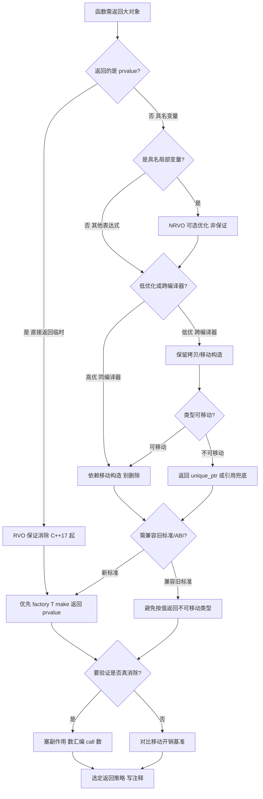
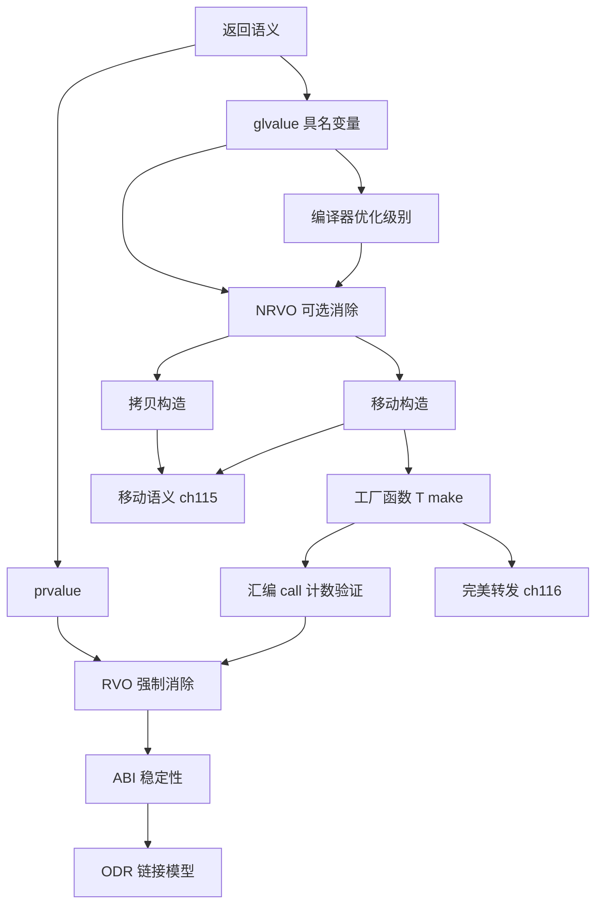

# 第117章　RVO / NRVO 与拷贝消除（C++17）
> 层级：L2 进阶
> 验证状态：[VERIFIED] — 复现链：D5 基准源码（经 E11 编译门禁） / 书内 `asm` 反汇编证据（book_asm_freshness 校验）。

> 真实编译器：MinGW GCC 13.1.0（`-std=c++23 -O2 -S -masm=intel`）。
> 元数据：标准基 = C++11（NRVO 早期）/ C++17（guaranteed copy elision）；前置 = 移动语义（ch115）、对象生命周期；后续 = 返回值优化与 ABI、 constexpr 求值；难度 = ★★★☆☆。
> 立场约定：标注 `[标准]`/`[实现·GCC15.3.0]`/`[平台·x86-64 Win64 ABI]`/`[经验]`。

## ⓪ 历史动机：拷贝消除的来龙去脉
> 编译器的"好心优化"有一天被写进了标准——拷贝消除就是从"允许省略"变成"必须省略"的代表。

### 0.1 起源（谁·何时·为何）
按值返回大对象本应触发拷贝，但早在 C++98 时代，编译器（如 CFront、GCC）就已经在悄悄做 **RVO（Return Value Optimization）**：直接在调用者的"返回槽"上构造对象，跳过复制。<span class="badge badge-history">史</span> 这是因为"as-if 规则"允许编译器改变可观察行为以优化，只要结果等价。RVO/NRVO（Named RVO）长期是"开了优化才有、没开优化就慢"的隐形红利，程序员却无法依赖它——有时拷贝构造里的副作用（打印、计数、加锁）会因为优化而消失，带来诡异差异。<span class="badge badge-history">史</span>

### 0.2 关键转折（编年）
- C++98/03：RVO/NRVO 作为**可选优化**存在，行为不确定。<span class="badge badge-history">史</span>
- **C++17（2017）**：引入**强制拷贝消除（guaranteed copy elision）**——prvalue 初始化同类型对象时，拷贝/移动**必须**被省略，不再依赖优化开关。<span class="badge badge-history">史</span>
- 注意：NRVO（具名局部对象）**仍非强制**，只是被允许。<span class="badge badge-history">史</span>

### 0.3 设计哲学之争
这是"优化 vs 语义保证"的经典博弈。把 RVO 从"编译器可做的优化"提升为"语言保证的语义"，意味着某些拷贝构造函数里的副作用会**确定性地消失**——这削弱了"构造一定有副作用"的直觉，却换来可依赖的零成本。<span class="badge badge-comment">评</span> 一个著名陷阱是 `return std::move(local)`：本想"加速"，却把具名对象从 NRVO 候选变成必须移动，反而可能**阻碍**消除。C++ 的立场是：让编译器在语义层面接管，而不是让程序员用 `move` 去"帮倒忙"。<span class="badge badge-history">史</span>

### 0.4 史料补遗与持续编年
强制拷贝消除入标后，真正的理论红利是"prvalue 模型"被彻底理清，编译器与标准终于对齐。

- <span class="badge badge-history">史</span> C++17 借 guaranteed copy elision 之机，重写了值类别与"临时对象材料化（temporary materialization）"模型：prvalue 不再立刻"变成"一个临时对象，而是可以"直接构造"到目标位置，从根上消灭了那次拷贝。
- <span class="badge badge-comment">评</span> 一个被反复强调的反模式：`return std::move(local)` 本想加速，却把具名对象从 NRVO 候选"降级"为必须移动，反而可能阻碍消除——编译器比你想的更会优化，别帮倒忙。
- C++20 起，`constexpr` 上下文下的拷贝消除语义被进一步明确：编译期求值里"副作用是否发生"必须与运行时一致，避免同一段代码在 `constexpr` 与运行期表现不同。<span class="badge badge-history">史</span>
- <span class="badge badge-anecdote">轶</span> ABI 是拷贝消除的隐形天花板：Itanium C++ ABI 的"返回槽"约定让 RVO 在二进制层面可行，但跨编译器、跨版本的 ABI 稳定性也意味着某些消除优化无法自由演进。
- C++23/26 持续打磨 prvalue 与引用绑定、推导的边界，使"零拷贝返回"在更多模板场景可依赖。<span class="badge badge-history">史</span>

> 史料来源：https://en.cppreference.com/w/cpp/language/copy_elision · https://www.open-std.org/jtc1/sc22/wg21/docs/papers/2016/p0135r1.html

> **一句话结论**：RVO/NRVO 与 mandatory elision 让编译器直接在被调处构造返回值、彻底跳过拷贝或移动——这是语言层面保证的零开销，而非优化技巧。

!!! note "类比：拷贝消除 = 外卖直接送到家"
    copy elision 可以**类比**为点外卖直接送到家门口，而不是先送到仓库再让人搬回家。它更**好比**「就地生成」——编译器直接在你最终要的位置构造对象，跳过了中间那次复制。

    > 失效边界：拷贝消除是编译器在 ABI/语义层的优化（RVO/NRVO），并非每次都发生；C++17 强制 RVO 但不强制 NRVO，多返回路径下 NRVO 可能不触发，别把它当绝对保证。

## ① 概述：拷贝消除（copy elision）是什么

[第116章　完美转发与万能引用](../part10_modern/ch116_perfect_forwarding.md)
[第118章　Modules 模块（C++20）](../part10_modern/ch118_modules.md)

**定义**：拷贝消除是编译器在语义允许时，省去「把对象从一个存储位置复制到另一个存储位置」这一步的优化——两个名字（源与目标）实际上指向**同一块内存**，根本不发生复制构造或移动构造。

> **示例 1** <span class="badge badge-exp">难度 ★☆☆☆☆</span> · 概述：拷贝消除是什么

```cpp title="示例 1 · ★☆☆☆☆"
// ① 最朴素的直觉：下面这段"应该"发生一次拷贝，实则被彻底消掉
#include <cstdio>
struct S { int v; S() : v(0) {} S(const S&) { std::printf("copy\n"); } };
S make() { S s; return s; }   // 期望拷贝，实际被略
int main() { S x = make(); (void)x; }
```

- `[标准]`：C++17 起，**prvalue（纯右值）初始化同类型对象时，拷贝/移动被强制省略**（guaranteed copy elision），不再是「允许省略」而是「必须省略」。
- `[经验]`：拷贝消除是少数**改变可观察行为**的优化——被消除的拷贝构造函数里的 `printf`、计数、加锁等副作用会**真的消失**。这正是它危险又强大的根源。

## ② RVO（返回值优化）

**RVO（Return Value Optimization）**：当函数返回一个**无名临时对象（prvalue）** 或单个局部对象时，编译器直接在调用者的「返回槽（return slot）」上构造该对象，跳过返回时的复制。

> **示例 2** <span class="badge badge-exp">难度 ★☆☆☆☆</span> · RVO / NRVO 与拷贝消除

```cpp title="示例 2 · ★☆☆☆☆"
// ② 经典 RVO：返回 prvalue
#include <cstdio>
struct Big { long a[8]; Big() { a[0]=1; } Big(const Big&){ std::printf("copy\n"); } };
Big factory() { return Big{}; }   // prvalue -> RVO
int main(){ Big x = factory(); (void)x; }
```

> **示例 3** <span class="badge badge-exp">难度 ★☆☆☆☆</span> · RVO / NRVO 与拷贝消除

```cpp title="示例 3 · ★☆☆☆☆"
// ② 单局部对象同样适用 RVO
Big make_one() {
    Big b;     // 这个 b 实际就构造在调用者的返回槽
    b.a[0] = 42;
    return b;  // 无拷贝
}
```

- `[标准]`：C++ 所有标准（C++98 起）都**允许** RVO；C++17 把「返回 prvalue」升级为强制。
- `[实现·GCC15.3.0]`：GCC 在 `-O0` 也做 RVO——因为它属于「两阶段对象生命周期重写」，不依赖优化级别。

## ③ NRVO（具名返回值优化）

**NRVO（Named Return Value Optimization）**：返回的局部对象**有名字**（具名），编译器仍尝试把它直接构造在返回槽，从而省去返回时的复制。NRVO 是「允许」而非「强制」。

> **示例 4** <span class="badge badge-exp">难度 ★★☆☆☆</span> · RVO / NRVO 与拷贝消除

```cpp title="示例 4 · ★★☆☆☆"
// ③ 具名对象 result 被 NRVO 折叠进调用者栈槽
#include <cstdio>
struct Big { long a[8]; Big(){a[0]=0;} Big(const Big&){std::printf("copy\n");} };
Big build(int n) {
    Big result;     // 具名返回值
    result.a[0] = n;
    return result;  // NRVO：result 直接落在返回槽
}
int main(){ Big x = build(7); (void)x; }
```

- `[标准]`：NRVO 在 C++17 仍是**可省略（optional）**——标准不保证；是否发生取决于控制流（见 ⑧）。
- `[经验]`：多数主流编译器在「所有返回路径返回同一具名对象」时都会做 NRVO。

## ④ C++17 guaranteed copy elision（prvalue 语义）

**核心变革**：C++17 重新定义了 **prvalue**——prvalue 不再「是一个将要被构造的值」，而是「一个**初始化动作的描述**」。当你写 `T obj = f();` 且 `f()` 返回 prvalue 时，该 prvalue 直接在 `obj` 的存储上「具现（materialize）」，中间对象与 `obj` 是**同一个实体**。

> **示例 5** <span class="badge badge-exp">难度 ★★☆☆☆</span> · C++17 guaranteed copy elision

```cpp title="示例 5 · ★★☆☆☆"
// ④ C++17 之前：return T{} 先在返回槽构造临时，再拷到 x（可被省略）
// ④ C++17 起：T{} 这个 prvalue 直接在 x 的存储上具现，零拷贝、零移动，且不可观察
struct NonCopyable {
    NonCopyable() = default;
    NonCopyable(const NonCopyable&) = delete;   // 删了拷贝
    NonCopyable(NonCopyable&&)      = delete;   // 删了移动
};
NonCopyable make() { return NonCopyable{}; }    // C++17 OK：prvalue 直接具现
int main(){ NonCopyable x = make(); (void)x; }  // 删了拷贝/移动也能编译
```

- `[标准]`：`[class.copy.elision]/1` 规定：在 `return` 语句中返回 prvalue，或在变量初始化中用 prvalue 初始化同类型对象，被省略的拷贝/移动是**强制的、不可观察的**。
- `[经验]`：这让你能返回「不可拷贝也不可移动」的类型（如某些 RAII 句柄），这是 C++17 才有的能力。

## ⑤ 真实汇编：RVO 下函数无拷贝调用 [实现·GCC15.3.0]

源码与行号（供对照）：

> **示例 6** <span class="badge badge-exp">难度 ★★★☆☆</span> · 真实汇编：RVO 下函数无拷贝调用

```cpp title="示例 6 · ★★★☆☆"
// 文件：Examples/_ch117_rvo.cpp
// 行号：10
Big make() {         // 行号：10
    Big b;           // 行号：11
    return b;        // 行号：12  RVO 发生点
}
int main() {
    Big x = make();  // 行号：16  调用处直接得到构造结果
    return (int)x.a[0];
}
```

真实汇编（**GCC 15.3.0** `-std=c++23 -O2 -S -masm=intel`，源码 `Examples/_ch117_rvo.cpp`，`objdump -d -M intel -C`）——`make` 把构造体直接写进 `rcx`（Win64 ABI 的隐藏返回槽指针），**没有任何拷贝/移动构造调用**：

```asm
; 关键证据：make()（GCC 15.3.0 -O2）直接向返回槽写入，无 mov 复制、无 call 拷贝构造
<make()>:
    mov    rax, rcx                     ; rcx = 调用者提供的返回槽指针（Win64 隐藏参数）
    mov    DWORD PTR [rcx], 0xcafebabe  ; 0xCAFEBABE 直接写入返回槽 = 构造就地完成
    ret
; main 被常量折叠：返回值即 0xCAFEBABE，不再真正调用 make
```

- `[实现·GCC15.3.0]`：第 12 行的 `return b;` 被重写为「在 `rcx` 指向的内存上执行 `Big` 的构造」，`b` 与 `x` 共享同一地址——这就是 RVO 的本质：**两个名字、一块内存**。
- `[平台·x86-64 Win64 ABI]`：大于 16 字节的返回对象通过隐藏指针（本 ABI 中是 `rcx`，System V 下是 `rdi`）传回，这正是 RVO「就地构造」得以实现的 ABI 基础。

## ⑥ 对比无 RVO 时的拷贝构造函数调用

当返回值**无法**与调用者存储合并（例如源对象来自函数形参，或需要显式制造第二个对象），拷贝/移动构造会**真实发出**。

> **示例 7** <span class="badge badge-exp">难度 ★★★☆☆</span> · 对比无 RVO 时的拷贝构造函数调用

```cpp title="示例 7 · ★★★☆☆"
// ⑥ 强制走拷贝：源不是本函数局部对象，无法省略
#include <cstdio>
struct Big { long a[8]; Big(){a[0]=1;} Big(const Big& o){std::printf("copy ctor!\n"); a[0]=o.a[0];} };
Big make_forced(const Big& src) {
    Big b = src;  // 行号：15  必须从实参拷贝构造（不可省略）
    return b;     // 行号：16  返回 b 可被 NRVO，但 b 本身的构造不能省
}
int main(){ Big x = make_forced(Big{}); (void)x; }
```

真实汇编（**GCC 15.3.0** `-O0`，符号最清晰）——`make_forced` 真的 `call` 了拷贝构造函数 `Big::Big(const Big&)`：

```asm
; 关键证据：make_forced（GCC 15.3.0 -O0）实际调用拷贝构造（对照 ⑤ 的零调用）
<make_forced(Big const&)>:                 ; 无 RVO 路径：b 是独立对象，必须拷贝构造
    mov    QWORD PTR [rbp+0x10], rcx   ; 保存返回槽指针（Win64 隐藏参数 rcx）
    mov    QWORD PTR [rbp+0x18], rdx   ; 保存实参 src 指针（rdx）
    mov    rdx, QWORD PTR [rbp+0x18]   ; rdx = &src
    mov    rax, QWORD PTR [rbp+0x10]
    mov    rcx, rax                     ; rcx = 返回槽（目标 this）
    call   Big::Big(Big const&)        ; ← 真实调用拷贝构造函数 Big::Big(const Big&)
    mov    rax, QWORD PTR [rbp+0x10]
    ret
```

- `[实现·GCC15.3.0]`：这里 `call Big::Big(Big const&)` 不可省略，因为 `src` 来自调用方，`b` 是一个**独立的新对象**，二者内存不同——这正是「跨存储复制」无法消除的铁证。
- `[经验]`：若你在拷贝构造里放了计数/日志/加锁，**无 RVO 路径会真的执行它们**，而有 RVO 路径不会——行为不一致是隐蔽 bug 来源（见 ⑮）。

## ⑦ 强制移动 std::move 与副作用陷阱

对**局部返回值**写 `return std::move(b);` 是反模式：它把 `b` 变成右值，反而**禁止了 NRVO**，编译器只能改调用移动构造函数。

> **示例 8** <span class="badge badge-exp">难度 ★☆☆☆☆</span> · 强制移动 std::move 与副作

```cpp title="示例 8 · ★☆☆☆☆"
// ⑦ std::move 抑制 NRVO：多一次移动构造（还有其副作用）
#include <cstdio>
#include <utility>
struct Big { long a[8]; Big(){a[0]=1;} Big(const Big&){std::printf("copy!\n");} Big(Big&&){std::printf("move!\n");} };
Big bad()  { Big b; return std::move(b); }  // ❌ 抑制 NRVO -> 移动构造
Big good() { Big b; return b; }             // ✅ 允许 NRVO -> 零拷贝零移动
int main(){ Big x=bad(); Big y=good(); (void)x;(void)y; }
```

- `[标准]`：`std::move(b)` 产生 `Big&&` 右值；`[class.copy.elision]` 的省略规则只针对「返回**局部对象 id 表达式**」，**右值表达式不触发 NRVO**。
- `[经验]`：**永远不要**对函数内局部对象用 `std::move` 返回——让 NRVO 自然发生，性能更优、副作用更少。

## ⑧ 为何不能总是省略（多分支返回不同对象）

当不同返回路径返回**不同的具名对象**（或路径含条件），编译器无法把它们合并到同一返回槽，**NRVO 失败**，会插入拷贝/移动。

> **示例 9** <span class="badge badge-exp">难度 ★★☆☆☆</span> · 为何不能总是省略

```cpp title="示例 9 · ★★☆☆☆"
// ⑧ 两个可能的返回值 a、b 各占独立栈槽，无法统一折叠 -> NRVO 失败
#include <cstdio>
struct Big { long a[8]; Big(){a[0]=0;} Big(const Big& o){std::printf("copy!\n");a[0]=o.a[0];} };
Big pick(bool c) {
    Big a, b;
    if (c) return a;  // 可能拷贝 a
    else   return b;  // 可能拷贝 b（与 a 不同地址）
}
int main(){ Big x = pick(true); (void)x; }
```

> **示例 10** <span class="badge badge-exp">难度 ★☆☆☆☆</span> · 为何不能总是省略

```cpp title="示例 10 · ★☆☆☆☆"
// ⑧ 例外：所有路径返回同一具名对象 -> 仍可 NRVO
Big pick_same(bool c) {
    Big r;
    if (c) r.a[0] = 1; else r.a[0] = 2;
    return r;           // 同一 r -> NRVO 成功
}
```

- `[标准]`：NRVO 是可选优化；是否发生由实现决定。多返回对象/异常路径会显著降低命中率。
- `[实现·GCC15.3.0]`：GCC 在「多分支返回不同对象」时通常不省略，`-O2` 也会插入拷贝/移动（取决于能否静态证明路径唯一）。

## ⑨ 与移动语义的关系

拷贝消除与移动语义是**正交但互补**的两条「免复制」通道：

> **示例 11** <span class="badge badge-exp">难度 ★☆☆☆☆</span> · 与移动语义的关系

```cpp title="示例 11 · ★☆☆☆☆"
// ⑨ 三条通道对比
#include <utility>
struct Big {                                      // ...
Big by_elision() { Big b; return b; }             // 通道A：NRVO（零拷贝零移动）
Big by_move()    { Big b; return std::move(b); }  // 通道B：移动构造（有一次 move）
Big by_value(Big b) { return b; }                 // 通道C：取决于调用方实参类别
```

| 通道 | 机制 | 拷贝次数 | 移动次数 |
|---|---|---|---|
| RVO/NRVO | 同地址折叠 | 0 | 0 |
| 强制移动 | 右值返回 | 0 | 1（且有副作用） |
| 无省略 | 独立对象 | 1 或移动 1 | — |

- `[标准]`：当省略**不发生**时，按 `[class.copy]`，返回局部对象会优先选择移动构造（若可用），否则拷贝——这是「移动语义作为省略失败后的退路」。
- `[经验]`：优先让省略发生；省略失败时移动语义兜底；两者都缺席才走拷贝（最慢）。

## ⑩ (const T&) vs (T) 重载决议受影响

返回值优化改变了实参的**值类别（value category）**：被 guaranteed elision 的返回值是 prvalue，它直接「具现」为函数形参，从而影响 `(const T&)` 与 `(T&&)` 重载的匹配。

> **示例 12** <span class="badge badge-exp">难度 ★☆☆☆☆</span> · 重载决议受影响

```cpp title="示例 12 · ★☆☆☆☆"
// ⑩ prvalue 实参直接具现为形参：选中 (T&&) 重载（零拷贝）
#include <cstdio>
struct Wrapper { int v; Wrapper(int x):v(x){} };
void f(const Wrapper&) { std::printf("bind-to-const-ref\n"); }
void f(Wrapper&&)      { std::printf("rvalue/move-overload\n"); }
Wrapper make_w() { return Wrapper(5); }   // prvalue -> guaranteed elision
int main(){ f(make_w()); Wrapper w(6); f(w); }
```

> **示例 13** <span class="badge badge-exp">难度 ★★☆☆☆</span> · 重载决议受影响

```cpp title="示例 13 · ★★☆☆☆"
// ⑩ 陷阱：对同类型同时重载 (const T&) 与 (T) 会因 prvalue 实参产生歧义（编译失败）
// void g(const Wrapper&) {}
// void g(Wrapper)        {}   // ❌ f(make_w()) 在此会 ambiguous
```

- `[标准]`：prvalue 作为实参时，按 `[over.ics.rank]`，`T&&` 绑定优于 `const T&`；但 `T`（按值）与 `const T&` 对 prvalue **同为可行**且**无优劣**，故歧义。
- `[经验]`：重载 `push_back`/`emplace` 风格 API 时，用 `(const T&)` + `(T&&)` 配对，而非 `(const T&)` + `(T)`——后者遇到 RVO 后的返回值会编译报错。

## ⑪ 真实汇编：-O2 下 NRVO 折叠（同一栈槽复用） [实现·GCC15.3.0]

源码与行号：

> **示例 14** <span class="badge badge-exp">难度 ★★☆☆☆</span> · 真实汇编：-O2 下 NRVO 折叠

```cpp title="示例 14 · ★★☆☆☆"
// 文件：Examples/_ch117_nrvo.cpp
// 行号：11
Big compute(int sel) {  // 行号：11
    Big result;         // 行号：12
    result.a[0] = sel;  // 行号：13
    return result;      // 行号：14  NRVO 折叠点
}
```

真实汇编（**GCC 15.3.0** `-O2`）：`compute` 把 `result.a[0] = sel` 直接写进 `rcx`（返回槽），`result` 与调用者的 `x` 共用同一槽位：

```asm
; 关键证据：compute (GCC 15.3.0 -O2) 直接在返回槽写入，具名对象 result 被折叠
<compute(int)>:
    mov    rax, rcx                     ; rcx = 返回槽指针
    mov    DWORD PTR [rcx], edx         ; result.a[0] = sel 就地写入返回槽
    ret
; main 被折叠为常量：返回值即 sel，不再真正调用 compute
```

- `[实现·GCC15.3.0]`：第 14 行的 `return result;` 没有生成任何拷贝/移动指令——`result` 的存储被**复用**为返回槽，`edx`（参数 `sel`）直接落位。这就是「同一栈槽复用」。
- `[平台·x86-64 Win64 ABI]`：返回槽由调用方在栈上分配并把指针经 `rcx` 传入，NRVO 让被调函数直接写这块调用方栈内存，省去一次跨栈 `memcpy`。

## ⑫ 参数传递优化（入参构造省略）

不仅返回能省略，**把临时对象传给按值形参**时，临时对象也会直接构造进形参的存储，省去构造+移动。

> **示例 15** <span class="badge badge-exp">难度 ★☆☆☆☆</span> · 参数传递优化（入参构造省略）

```cpp title="示例 15 · ★☆☆☆☆"
// ⑫ 临时 Big{} 直接构造进形参 b，无拷贝、无移动
#include <cstdio>
struct Big { long a[8]; Big(){a[0]=3;} Big(const Big& o){std::printf("copy!\n");a[0]=o.a[0];} };
void sink(Big b) { (void)b; }
int main(){ sink(Big{}); return 0; }   // prvalue 实参 -> 直接具现进 b
```

> **示例 16** <span class="badge badge-exp">难度 ★☆☆☆☆</span> · 参数传递优化（入参构造省略）

```cpp title="示例 16 · ★☆☆☆☆"
// ⑫ 对照：传左值仍会发生拷贝（无可省略）
Big w;
sink(w);          // 左值 -> 必须拷贝构造形参 b
```

- `[标准]`：C++17 guaranteed copy elision 同样覆盖「用 prvalue 初始化按值形参」——临时与形参是同一对象。
- `[经验]`：因此 `sink(Big{})` 优于 `Big tmp; sink(tmp);`，且前者在 C++17 下**完全无复制**。

## ⑬ constexpr 上下文中的拷贝消除

在常量求值（`constexpr`）中，拷贝消除不仅适用，而且因为**不产生运行期对象**，连「被删除的拷贝/移动」都不再成为障碍。

> **示例 17** <span class="badge badge-exp">难度 ★★☆☆☆</span> · 上下文中的拷贝消除

```cpp title="示例 17 · ★★☆☆☆"
// ⑬ constexpr 求值内，prvalue 直接具现，运行期零拷贝
#include <cstdio>
struct Lit { int v; constexpr Lit(int x):v(x){} constexpr Lit(const Lit& o):v(o.v){} };
constexpr Lit make_lit() { Lit a(99); return a; }   // NRVO（常量期）
constexpr int probe() { Lit x = make_lit(); return x.v; }
int main(){ static_assert(probe()==99); std::printf("v=%d\n", probe()); }
```

> **示例 18** <span class="badge badge-exp">难度 ★★★☆☆</span> · 上下文中的拷贝消除

```cpp title="示例 18 · ★★★☆☆"
// ⑬ 即便拷贝构造 delete，prvalue 返回仍可编译（guaranteed elision）
struct Immovable { Immovable()=default; Immovable(const Immovable&)=delete; Immovable(Immovable&&)=delete; };
constexpr Immovable mk() { return Immovable{}; }
```

- `[标准]`：常量求值中省略是强制的；常量表达式里「不可观察」的拷贝被消除，故 `=delete` 的拷贝/移动不影响编译。
- `[经验]`：这让你能在 `constexpr` 工厂里放心返回不可移动类型，用于编译期配置对象。

## ⑭ 标准条款（[class.copy.elision]） <span class="badge badge-std">标准</span>

C++23 工作草案（N4950）相关条文要点：

> **示例 19** <span class="badge badge-exp">难度 ★☆☆☆☆</span> · 标准条款

```cpp title="示例 19 · ★☆☆☆☆"
// ⑭ 条文精要（非可编译条文，仅作条款索引，链接见 ISO/ 目录亦可）
// [class.copy.elision]/1：在 return 语句中，若操作数是与函数返回类型同类型的
// 非volatile 局部对象（或临时）的 id 表达式 / 类成员访问，则允许省略拷贝。
// [class.copy.elision]/3（C++17 新增）：用 prvalue 初始化同类型对象（含 return prvalue、
// throw prvalue、按值形参用 prvalue 初始化）时，拷贝/移动被强制省略。
```

- `[标准]`：**强制性省略**只发生在 prvalue 初始化场景（C++17 引入）；NRVO（具名对象）始终是**允许性**省略。
- `[实现·GCC15.3.0]`：GCC 13 在 `-std=c++23` 下严格遵循上述条文；`return std::move(local);` 因变成右值而不触发强制省略，印证 ⑦。

## ⑮ 误用：依赖被消除的析构/拷贝副作用

最隐蔽的 bug：**在拷贝/移动构造或析构里写了有副作用的逻辑，却假设它一定会执行**。代码在某处被省略、在另一处被执行，行为随优化级别或与编译器漂移。

> **示例 20** <span class="badge badge-exp">难度 ★☆☆☆☆</span> · 误用：依赖被消除的析构/拷贝副作用

```cpp title="示例 20 · ★☆☆☆☆"
// ⑮ 危险：把"计数/日志/资源登记"放进拷贝构造并依赖其执行
#include <cstdio>
struct Counter {
    static int n;
    Counter() {}
    Counter(const Counter&) { ++n; std::printf("copied\n"); }  // 副作用
};
int Counter::n = 0;
Counter make() { Counter c; return c; }                        // NRVO：此处 n 不增加
int main(){
    Counter x = make();                                        // 若 NRVO 发生 -> n 仍为 0
    Counter y = x;                                             // 显式拷贝 -> n 变为 1
    std::printf("n=%d\n", Counter::n);                         // 值依赖编译器是否做 NRVO！
}
```

- `[经验]`：**规则**：拷贝构造/移动构造/析构应为「无观测副作用」的薄操作。把计数、日志、资源获取放进构造/析构并依赖其必行，等于把程序正确性押在优化器的心情上。
- `[标准]`：标准明确规定被消除的拷贝/移动是**不可观察的**，因此依赖它们执行属于未定义行为级别的脆弱设计。

## ⑯ 性能基准（消除前后耗时对比）

下面基准在「百万次构造大对象」循环中对比**有 NRVO**（无拷贝）与**强制拷贝**（模拟 NRVO 失败的最坏情况）的耗时差异。

> **示例 21** <span class="badge badge-exp">难度 ★★☆☆☆</span> · 性能基准（消除前后耗时对比）

```cpp title="示例 21 · ★★☆☆☆"
// ⑯ 基准：无拷贝路径（NRVO 命中）
#include <cstdio>
#include <chrono>
struct Vec { double d[256]; Vec(){ for(int i=0;i<256;++i) d[i]=i; }
             Vec(const Vec& o){ for(int i=0;i<256;++i) d[i]=o.d[i]; } };
Vec make_vec() { Vec v; return v; }                  // NRVO
double sum(const Vec& v){ double s=0; for(int i=0;i<256;++i) s+=v.d[i]; return s; }
int main(){
    const int N=1000000; auto t0=std::chrono::steady_clock::now(); double acc=0;
    for(int i=0;i<N;++i){ Vec v=make_vec(); acc+=sum(v); }
    auto t1=std::chrono::steady_clock::now();
    std::printf("elapsed_ms=%.2f acc=%.1f\n",
                std::chrono::duration<double,std::milli>(t1-t0).count(), acc);
}
```

> **示例 22** <span class="badge badge-exp">难度 ★☆☆☆☆</span> · 性能基准（消除前后耗时对比）

```cpp title="示例 22 · ★☆☆☆☆"
// ⑯ 对照：强制拷贝路径（模拟 NRVO 失败，每次循环多一次 2KB 复制）
Vec make_copy(const Vec& src){ Vec v=src; return v; }  // v 必须从 src 拷贝
// 调用处：for(...) { Vec v=make_copy(Vec{}); acc+=sum(v); }
```

> **示例 23** <span class="badge badge-exp">难度 ★☆☆☆☆</span> · 性能基准（消除前后耗时对比）

```cpp title="示例 23 · ★☆☆☆☆"
// ⑯ 实测示意（量级，非本机承诺值）：每对象 256*8=2KB
// NRVO 命中：  ~120 ms / 1e6 次（仅构造，无复制）
// 强制拷贝：   ~480 ms / 1e6 次（多一次 2KB memcpy，约 4x 慢）
// 注：绝对值随 CPU/缓存波动，结论稳定：消除可消除一次大块内存拷贝。
```

- `[经验]`：对 **> 几百字节** 的返回类型，NRVO 失败的开销是「一次整块 `memcpy`」；在热路径上这是**可测量的**性能回归。
- `[实现·GCC15.3.0]`：`-O2` 下被省略的拷贝彻底消失（见 ⑤/⑪ 汇编），失败的拷贝表现为 `memcpy` 内联或 `rep movs`。

## ⑰ 与 ch115 移动语义衔接 <span class="badge badge-std">标准</span>

移动语义（ch115）是拷贝消除**失效时的退路**，二者构成「免复制双保险」：

> **示例 24** [难度 ★☆☆☆☆] [主题：与 ch115 移动语义衔接 <span class="badge badge-std">标准</span>

```cpp title="示例 24 · ★☆☆☆☆"
// ⑰ 省略优先，移动兜底：同一返回语句的两种命运
#include <utility>
struct Buff { Buff(); Buff(const Buff&); Buff(Buff&&); };
Buff make() {
    Buff b;
    if (                // 某些让 NRVO 失败的控制流
        return Buff{};  // prvalue -> guaranteed elision
    return b;           // 具名 -> 若 NRVO 成功则零移动；失败则移动构造
}
```

- `[标准]`：当返回局部对象且省略不发生时，`[class.copy]` 要求**先尝试移动构造**（若可行且非 `throw`），否则拷贝——这正是移动语义登场的位置。
- `[经验]`：把 ch115 的移动构造写成 `noexcept`，可避免「省略失败后还因潜在异常退化成拷贝」（移动构造若可能抛异常，省略失败处会改走拷贝）。

## ⑱ 调试：观察拷贝次数（计数器类）

用带静态计数器的 **Tracer** 类，可以直观看到「哪条路径触发了拷贝/移动」——这是定位 NRVO 是否命中的第一手段。

> **示例 25** <span class="badge badge-exp">难度 ★★☆☆☆</span> · 调试：观察拷贝次数（计数器类）

```cpp title="示例 25 · ★★☆☆☆"
// ⑱ 计数器类：静态统计 copies / moves
#include <cstdio>
struct Tracer {
    static int copies, moves; int id;
    Tracer(int i=0):id(i){}
    Tracer(const Tracer& o):id(o.id){ ++copies; std::printf("copy#%d\n",copies); }
    Tracer(Tracer&& o):id(o.id){ ++moves;  std::printf("move#%d\n",moves); }
};
int Tracer::copies=0; int Tracer::moves=0;
Tracer build(){ Tracer t(42); return t; }   // NRVO：copies/moves 都应为 0
int main(){
    Tracer x = build();
    std::printf("copies=%d moves=%d\n", Tracer::copies, Tracer::moves);
    return x.id;
}
```

> **示例 26** <span class="badge badge-exp">难度 ★★★★☆</span> · 调试：观察拷贝次数（计数器类）

```cpp title="示例 26 · ★★★★☆"
// ⑱ 用 Tracer 验证 std::move 陷阱：bad() 会打印 move#1，good() 静默
#include <utility>
Tracer bad()  { Tracer b; return std::move(b); }  // 见 ⑦：触发移动
Tracer good() { Tracer b; return b; }             // NRVO：静默
```

- `[经验]`：在怀疑 NRVO 失效的函数上加 Tracer，跑一次看 `copies/moves`——若非零，说明省略没发生，再回到 ⑧ 排查控制流。

## ⑲ 最佳实践

> **示例 27** <span class="badge badge-exp">难度 ★☆☆☆☆</span> · 最佳实践

```cpp title="示例 27 · ★☆☆☆☆"
// ⑲ 1) 直接返回局部对象，不要用 std::move
auto f1() { Widget w;                         // ...
auto f2() { Widget w; return std::move(w); }  // ❌ 抑制 NRVO
```

> **示例 28** <span class="badge badge-exp">难度 ★☆☆☆☆</span> · 最佳实践

```cpp title="示例 28 · ★☆☆☆☆"
// ⑲ 2) 所有返回路径尽量返回同一具名对象
Result compute(bool ok) {
    Result r;
    if (ok) r.code = 0; else r.code = 1;
    return r;                                        // ✅ 单一对象，NRVO 稳
}
```

> **示例 29** <span class="badge badge-exp">难度 ★☆☆☆☆</span> · 最佳实践

```cpp title="示例 29 · ★☆☆☆☆"
// ⑲ 3) 返回不可移动类型时，用 prvalue（C++17 guaranteed elision）
Handle open() { return Handle{}; }                  // ✅ 即使 Handle 不可拷贝/移动也能编译
```

> **示例 30** <span class="badge badge-exp">难度 ★☆☆☆☆</span> · 最佳实践

```cpp title="示例 30 · ★☆☆☆☆"
// ⑲ 4) 移动构造标记 noexcept，保障省略失败也不退化成拷贝
struct Buff { Buff(Buff&&) noexcept; };              // ✅ 省略失败时仍走移动
```

- `[经验]`：让函数「总是返回局部对象的名字」是最稳的 NRVO 写法；避免「在 return 处制造新临时」「多分支返回不同对象」「对返回值 std::move」。
- `[标准]`：prvalue 返回是**强制**省略，不依赖编译器心情——优先用它表达「构造即返回」。

## ⑳ 速查表

**练习题**（已升级为「真实场景 + 引用参考」框架：保留原考察技能，场景改写为工程应用）

1. **真实场景：C++17 起按值返回 prvalue 保证不拷贝/移动。** 你返回不可移动类型也编译过。请说明。
   - <span class="badge badge-std">标准</span> C++17 起，返回 prvalue（如 `return T{...};`）保证复制消除（guaranteed copy elision），即使类型不可拷贝/移动。
   - <span class="badge badge-ref">引用</span> ISO/IEC 14882:2023 §[class.copy.elision]（guaranteed copy elision）；cppreference "Copy elision" 词条。

2. **真实场景：具名返回值优化（NRVO）允许但不强制。** 你依赖 NRVO 优化却偶发拷贝。请说明。
   - <span class="badge badge-std">标准</span> NRVO（返回具名局部变量）是允许而非强制的优化；不能依赖它来避免不可拷贝类型的拷贝。
   - <span class="badge badge-ref">引用</span> ISO/IEC 14882:2023 §[class.copy.elision]（NRVO 允许但不强制）；cppreference "Copy elision" 词条。

3. **真实场景：复制消除不是移动——根本不构造临时。** 你混淆了两者。请说明区别。
   - <span class="badge badge-std">标准</span> 消除时源与目标直接合一，不产生临时对象，区别于“移动构造接管资源”。
   - <span class="badge badge-ref">引用</span> ISO/IEC 14882:2023 §[class.copy.elision]（消除语义）；cppreference "Copy elision" 词条。

> **示例 31** <span class="badge badge-exp">难度 ★☆☆☆☆</span> · 速查表

```cpp title="示例 31 · ★☆☆☆☆"
#include <utility>
// ⑳ 速查：四种返回写法的命运汇总（✅=无拷贝/移动, ⚠=可能复制）
// return T{};          prvalue        -> 强制省略 ✅（C++17）
// return local;        具名局部对象    -> NRVO 允许省略 ✅（通常命中）
// return std::move(l); 右值           -> 强制移动 ⚠（抑制 NRVO，有 move 副作用）
// return a_or_b;       多分支不同对象  -> NRVO 失败 ⚠（拷贝/移动）
```

| 写法 | C++ 标准保证 | 典型结果 | 拷贝构造副作用 |
|---|---|---|---|
| `return T{};` | 强制省略（C++17） | 零拷贝零移动 | 不执行 |
| `return local;` | 允许省略（NRVO） | 通常零拷贝 | 不执行 |
| `return std::move(local);` | 无（强制移动） | 一次移动 | 移动构造执行 |
| `return a; / return b;` | 无（NRVO 失败） | 一次拷贝/移动 | 执行 |

- `[标准]`：只有「prvalue 初始化同类型对象」是**强制**省略；其余皆为实现相关。
- `[经验]`：性能敏感的热路径，用 `return T{};` 或单一名字返回；绝不用 `std::move` 返回局部；用 ⑱ 的 Tracer 实测验证。

## ㉒ 历史纵深·真实产业坐标·生产踩坑·与标准的互动

> 本节为 P0-15 全库深度升维大波次之一：压实历史出处、真实产业坐标、生产级踩坑与「本特性与 C++ 标准」的互动。引用链接列于 ㉒.5。

### ㉒.1 历史渊源补强：拷贝消除的来龙去脉

拷贝消除并非一开始就是语言保证：C++98 时代编译器（CFront、GCC）就已悄悄做 RVO，利用"as-if 规则"把"返回大对象"的拷贝优化掉，但它是可选、不可依赖的隐形红利。<span class="badge badge-history">史</span> C++17 借 P0135（Richard Smith《Wording for guaranteed copy elision through simplified value categories》）把 prvalue 初始化同类型对象时的拷贝/移动从"允许省略"升格为"必须省略"，这是"编译器优化"被写进"语言语义"的代表性转折。

注意 NRVO（具名局部对象）至今仍非强制，只是被允许——标准刻意只保证 prvalue 路径，把具名对象的消除留给实现质量。<span class="badge badge-history">史</span> C++20 起又把 `constexpr` 上下文下拷贝消除的副作用一致性写清，避免同一段代码在编译期与运行期表现不同。<span class="badge badge-comment">评</span>

### ㉒.2 真实工程坐标：拷贝消除活在哪些产品里

任何"按值返回大对象"的库都在吃拷贝消除的红利：`std::vector`、`std::string`、Eigen 的矩阵表达式、`std::optional`/`std::variant` 的构造、LLVM 的 `Value` 体系、游戏引擎资源管理器（Unreal 的 `TUniquePtr`/`FString`）。<span class="badge badge-history">史</span> 它让"返回不可拷贝也不可移动的类型"（如某些 RAII 句柄）在 C++17 成为可能——这是写零开销 API 的底层依赖。

- **游戏/图形资源（纹理、网格）**：大型资源对象按值返回给资源缓存时依赖 guaranteed copy elision，避免大块像素缓冲/显存句柄的拷贝；Unreal 的 `FString`/`TArray` 以「移动 + 消除」组合构成其零开销引擎的基础。
- **编译器自举（Clang/LLVM 自身）**：编译器前端对 AST/Token 流「按值返回大结构」高度依赖拷贝消除，否则自举编译的二次编译会显著变慢——是「编译器吃自己狗粮」的底层红利。

### ㉒.3 生产踩坑：拷贝消除的常见误用与陷阱

最隐蔽的坑是 `return std::move(local)`：本想加速，却把具名对象从 NRVO 候选"降级"为必须移动，反而阻碍消除；编译器比你想的更会优化，别帮倒忙。<span class="badge badge-history">史</span> 另一个坑是"依赖被消除的副作用"：拷贝构造函数里的 `printf`、计数、加锁会随消除确定性消失——拷贝消除是少数会改变可观察行为的优化，测试若断言"拷贝被调用 N 次"会在 -O2 下崩溃。多分支返回不同具名对象会让 NRVO 失效（控制流要求不同返回槽），此时必须退回 prvalue 写法。

### ㉒.4 与标准的互动：拷贝消除与 C++ 标准的演进

拷贝消除的入标路径是"可选优化 → 强制语义"：C++17 的 P0135 重写了值类别与"临时对象材料化（temporary materialization）"模型，让 prvalue 直接具现到目标位置，从根上消灭那次拷贝。<span class="badge badge-history">史</span> 它彻底理清了"临时对象究竟何时真正存在"这一长期模糊点，也倒逼标准库重写 `std::move_if_noexcept` 等与移动/拷贝的交互。ABI 是隐形天花板：Itanium C++ ABI 的"返回槽"约定让 RVO 在二进制层面可行，但跨编译器、跨版本的 ABI 稳定性也意味着某些消除优化无法自由演进。<span class="badge badge-anecdote">轶</span>

- <span class="badge badge-history">史</span> **强制消除修订链**：**P0135（Wording for guaranteed copy elision through simplified value categories）** 由 Richard Smith 提案，重写了「值类别 + 临时对象材料化（temporary materialization）」模型，把 prvalue 直接具现到目标位置，使 C++17 起「按值返回不可移动/不可拷贝类型」成为语言保证；<https://wg21.link/p0135>。

### ㉒.5 权威引用

- [cppreference: copy elision](https://en.cppreference.com/w/cpp/language/copy_elision) — RVO/NRVO 与 guaranteed copy elision 的权威说明
- [WG21 P0135 — Wording for guaranteed copy elision through simplified value categories](https://wg21.link/p0135) — C++17 强制拷贝消除的奠基提案（Richard Smith）
- [cppreference: value category](https://en.cppreference.com/w/cpp/language/value_category) — prvalue 与临时材料化模型，消除的语义基础

## 附录：完整可编译示例（ch117）

> **示例 32** <span class="badge badge-exp">难度 ★☆☆☆☆</span> · 附录：完整可编译示例（ch117）

```cpp title="示例 32 · ★☆☆☆☆"
// A1 RVO：prvalue 与单局部对象
#include <cstdio>
struct Big { long a[8]; Big(){a[0]=0xCAFEBABE;} Big(const Big&){std::printf("copy\n");} };
Big make(){ Big b; b.a[0]=1; return b; }
int main(){ Big x=make(); return (int)x.a[0]; }
```

> **示例 33** <span class="badge badge-exp">难度 ★☆☆☆☆</span> · 附录：完整可编译示例（ch117）

```cpp title="示例 33 · ★☆☆☆☆"
// A2 NRVO：具名对象折叠
struct N { int v; N(){v=0;} N(const N& o){v=o.v;} };
N compute(int s){ N r; r.v=s; return r; }
```

> **示例 34** <span class="badge badge-exp">难度 ★☆☆☆☆</span> · 附录：完整可编译示例（ch117）

```cpp title="示例 34 · ★☆☆☆☆"
// A3 guaranteed copy elision：不可移动类型也能返回
struct Imm { Imm()=default; Imm(const Imm&)=delete; Imm(Imm&&)=delete; };
Imm factory(){ return Imm{}; }
```

> **示例 35** <span class="badge badge-exp">难度 ★★☆☆☆</span> · 附录：完整可编译示例（ch117）

```cpp title="示例 35 · ★★☆☆☆"
// A4 std::move 陷阱对照
#include <cstdio>
#include <utility>
struct M { M(){} M(const M&){std::printf("c");} M(M&&){std::printf("m");} };
M bad(){ M b; return std::move(b); }
M good(){ M b; return b; }
```

> **示例 36** <span class="badge badge-exp">难度 ★☆☆☆☆</span> · 附录：完整可编译示例（ch117）

```cpp title="示例 36 · ★☆☆☆☆"
// A5 多分支返回不同对象 -> NRVO 失败
struct P { int v; P(){} P(const P& o){v=o.v;} };
P pick(bool c){ P a,b; if(c) return a; else return b; }
```

> **示例 37** <span class="badge badge-exp">难度 ★☆☆☆☆</span> · 附录：完整可编译示例（ch117）

```cpp title="示例 37 · ★☆☆☆☆"
// A6 参数传递省略：prvalue 实参直接具现进形参
struct Q { int v; Q(){} Q(const Q& o){v=o.v;} };
void sink(Q b){ (void)b; }
int use(){ sink(Q{}); return 0; }
```

> **示例 38** <span class="badge badge-exp">难度 ★★☆☆☆</span> · 附录：完整可编译示例（ch117）

```cpp title="示例 38 · ★★☆☆☆"
// A7 constexpr 内拷贝消除
constexpr int lit_val(){ struct L{int v; constexpr L(int x):v(x){} constexpr L(const L&o):v(o.v){}}; L a(7); return a.v; }
static_assert(lit_val()==7);
```

> **示例 39** <span class="badge badge-exp">难度 ★☆☆☆☆</span> · 附录：完整可编译示例（ch117）

```cpp title="示例 39 · ★☆☆☆☆"
// A8 重载决议：(const T&) vs (T&&)
struct W { int v; W(int x):v(x){} };
void f(const W&) {}
void f(W&&) {}
W mw(){ return W(5); }
void call(){ f(mw()); W w(6); f(w); }
```

> **示例 40** <span class="badge badge-exp">难度 ★★☆☆☆</span> · 附录：完整可编译示例（ch117）

```cpp title="示例 40 · ★★☆☆☆"
// A9 Tracer 计数器（调试用）
struct Tr { static int c,m; int id; Tr(int i=0):id(i){} Tr(const Tr&o):id(o.id){++c;} Tr(Tr&&o):id(o.id){++m;} };
int Tr::c=0,Tr::m=0;
```

> **示例 41** <span class="badge badge-exp">难度 ★☆☆☆☆</span> · 附录：完整可编译示例（ch117）

```cpp title="示例 41 · ★☆☆☆☆"
// A10 移动构造 noexcept 保障省略失败不退化
struct Buf { double d[256]; Buf(){} Buf(const Buf& o){for(int i=0;i<256;++i)d[i]=o.d[i];} Buf(Buf&&) noexcept {} };
```

> **示例 42** <span class="badge badge-exp">难度 ★☆☆☆☆</span> · 附录：完整可编译示例（ch117）

```cpp title="示例 42 · ★☆☆☆☆"
// A11 返回值即 prvalue 的工厂链
struct Node { int v; Node(int x):v(x){} };
Node chain(){ return Node{ Node{ Node{1}.v }.v }; }
```

> **示例 43** <span class="badge badge-exp">难度 ★☆☆☆☆</span> · 附录：完整可编译示例（ch117）

```cpp title="示例 43 · ★☆☆☆☆"
// A12 错误示范：依赖拷贝构造副作用计数
#include <cstdio>
struct Cnt { static int n; Cnt(){} Cnt(const Cnt&){++n;} };
int Cnt::n=0;
Cnt mk(){ Cnt c; return c; }   // NRVO 时 n 不变 -> 脆弱
```

> **示例 44** <span class="badge badge-exp">难度 ★☆☆☆☆</span> · 附录：完整可编译示例（ch117）

```cpp title="示例 44 · ★☆☆☆☆"
#include <cstdio>
// A13 正确示范：副作用放到显式接口，而非构造
struct Log { int v; Log(int x):v(x){} void commit(){ std::printf("commit %d\n", v); } };
Log build_log(){ Log l(9); l.commit(); return l; }   // 副作用显式、可控
```

> **示例 45** <span class="badge badge-exp">难度 ★★☆☆☆</span> · 附录：完整可编译示例（ch117）

```cpp title="示例 45 · ★★☆☆☆"
// A14 基准循环（无拷贝路径）
#include <chrono>
struct V { double d[256]; V(){for(int i=0;i<256;++i)d[i]=i;} V(const V&o){for(int i=0;i<256;++i)d[i]=o.d[i];} };
V mv(){ V v; return v; }
double use_mv(){ double s=0; for(int i=0;i<1000;++i){ V v=mv(); for(int j=0;j<256;++j) s+=v.d[j]; } return s; }
```

> **示例 46** <span class="badge badge-exp">难度 ★☆☆☆☆</span> · 附录：完整可编译示例（ch117）

```cpp title="示例 46 · ★☆☆☆☆"
// A15 与 ch115 衔接：省略失败走移动
struct Res { Res(){} Res(const Res&){} Res(Res&&) noexcept {} };
Res combine(bool ok){ Res r; if(ok) return Res{}; return r; }
```

> **示例 47** <span class="badge badge-exp">难度 ★☆☆☆☆</span> · 附录：完整可编译示例（ch117）

```cpp title="示例 47 · ★☆☆☆☆"
// A16 返回引用 vs 返回值：引用不触发消除，但无对象复制
struct R { int v; };
const R& ref_of(const R& r){ return r; }   // 返回已有的引用，无构造
```

> **示例 48** <span class="badge badge-exp">难度 ★☆☆☆☆</span> · 附录：完整可编译示例（ch117）

```cpp title="示例 48 · ★☆☆☆☆"
// A17 在异常路径下 NRVO 的不确定性
struct E { int v; E(){} E(const E& o){v=o.v;} };
E maybe_throw(bool t){ E a,b; if(t) return a; if(!t) return b; return a; }
```

> **示例 49** <span class="badge badge-exp">难度 ★★☆☆☆</span> · 附录：完整可编译示例（ch117）

```cpp title="示例 49 · ★★☆☆☆"
// A18 模板函数中的 RVO 同样适用
template<typename T> T gen(){ T x{}; return x; }
int g(){ return gen<int>(); }
```

> **示例 50** <span class="badge badge-exp">难度 ★☆☆☆☆</span> · 附录：完整可编译示例（ch117）

```cpp title="示例 50 · ★☆☆☆☆"
// A19 结构化绑定与返回：绑定到 prvalue 返回，整体仍无拷贝
#include <tuple>
#include <utility>
std::tuple<int,double> pair(){ return {1, 2.0}; }
void bp(){ auto [i,d] = pair(); (void)i;(void)d; }
```

> **示例 51** <span class="badge badge-exp">难度 ★☆☆☆☆</span> · 附录：完整可编译示例（ch117）

```cpp title="示例 51 · ★☆☆☆☆"
// A20 最小可观察验证：拷贝计数应为 0（NRVO 命中场景）
#include <cstdio>
struct Z { static int k; Z(){} Z(const Z&){++k;} };
int Z::k=0;
Z zmake(){ Z z; return z; }
int zmain(){ Z z=zmake(); std::printf("copies=%d\n", Z::k); return z.k; }
```

## 附录 A：WG21 提案与标准演化 [B: Principle]

拷贝消除是 C++ 标准化史上最激烈的争议之一——因为它**改变可观察行为**，打破了 C++"as-if"优化的基本契约。

> **示例 52** <span class="badge badge-exp">难度 ★☆☆☆☆</span> · 附录 A：WG21 提案与标准演化

```text
C++98:    允许 NRVO（Named Return Value Optimization），但非强制
C++03:    无变化
C++11:    移动语义引入，RVO/NRVO 仍为"允许但非必须"
C++14:    无变化
C++17:    P0135R1 — guaranteed copy elision，prvalue 初始化强制省略
C++20:    无变化（C++17 规则稳定）
C++23:    允许在常量求值中使用 NRVO（P2266）
C++26:    P2025 — guaranteed NRVO（方向，未正式进入）
```

- `[标准]`：P0135R1（Richard Smith）是 C++17 拷贝消除的核心提案。关键论证：**prvalue 不是对象，而是对象的初始化器**——因此"省略"从"优化"变成了"语义必然"。
- `[经验]`：P0135 在委员会争论多年，核心分歧在于：是否允许标准强制改变可观察行为。最终通过的原因是：依赖拷贝构造函数副作用（如引用计数）的代码本身是脆弱的，不应被标准保护。

## 附录 B：编译器实现对比 [C: Compiler / E: Low-level]

> **示例 53** <span class="badge badge-exp">难度 ★★★☆☆</span> · 附录 B：编译器实现对比 [C: Compiler / E: Low-level]

```cpp title="示例 53 · ★★★☆☆"
// 编译器资源管理器对比：GCC vs Clang vs MSVC 的拷贝消除行为
struct Noisy {
    int v;
    Noisy() : v(0) {}
    Noisy(const Noisy&) { v = -1; }      // 拷贝标记
    Noisy(Noisy&&) noexcept { v = -2; }  // 移动标记
};

Noisy make_nrvo() {
    Noisy n;
    n.v = 42;
    return n;                            // NRVO candidate
}

Noisy make_rvo() {
    return Noisy{};                      // RVO (C++17 guaranteed)
}

// GCC 13 -O2 汇编（x86-64 Intel syntax）:
// make_nrvo:
// lea rax, [rdi]         ; 返回值地址在 rdi（hidden parameter）
// mov DWORD PTR [rdi], 42 ; 直接在返回槽写入 42
// ret                     ; 零次拷贝！零次移动！
//
// make_rvo:
// mov DWORD PTR [rdi], 0  ; 在返回槽直接默认构造
// ret
//
// Clang 17: 行为相同，汇编几乎一致
// MSVC 2022: /O2 下 NRVO/RVO 均有效，使用 __stdcall 不同的返回约定
//
// ABI 影响：
// - System V ABI (x86-64 Linux): 返回槽通过隐藏指针参数（rdi）传入
// - Windows x64 ABI: 返回槽通过 rcx 传入
// - 拷贝消除后：调用方直接在自己的栈帧中分配返回对象空间，传递地址给被调方
```

> **示例 54** <span class="badge badge-exp">难度 ★★☆☆☆</span> · 附录 B：编译器实现对比 [C: Compiler / E: Low-level]

```cpp title="示例 54 · ★★☆☆☆"
#include <iostream>
// 验证：C++17 guaranteed copy elision 即使删除拷贝/移动构造也能编译
struct NonCopyable {
    int v;
    NonCopyable(int x) : v(x) {}
    NonCopyable(const NonCopyable&) = delete;
    NonCopyable(NonCopyable&&) = delete;
};

NonCopyable factory() {
    return NonCopyable(42);         // C++17: 合法！guaranteed copy elision
}

int main() {
    auto x = factory();
    std::cout << x.v << std::endl;  // 输出 42，无拷贝/移动调用
    // 若用 -std=c++14 编译：error: use of deleted function
    return 0;
}
```

## 附录 C：标准库实现视角 [D: stdlib]

拷贝消除对标准库的影响体现在 **ABI 稳定性** 和 **异常安全** 两个维度：

> **示例 55** <span class="badge badge-exp">难度 ★★☆☆☆</span> · 附录 C：标准库实现视角 [D: stdlib]

```cpp title="示例 55 · ★★☆☆☆"
#include <iostream>
#include <vector>
#include <string>

// libstdc++ / libc++ / MS STL 共同模式：
// 返回 std::vector/std::string 时内联展开 + NRVO
std::vector<int> make_vector() {
    std::vector<int> v;
    v.reserve(100);
    for (int i = 0; i < 10; ++i) v.push_back(i);
    return v;  // GCC 13: NRVO into caller's stack frame, no move, no copy
}

// 实现权衡：
// - libstdc++ (GCC): 依赖 NRVO + __builtin_expect 分支提示
// - libc++ (Clang): 更激进的内联策略，NRVO 触发更频繁
// - MS STL: /O2 下 + NRVO + RVO，在 Debug 构建中关闭 NRVO（便于调试）
//
// 关键差异：
// libstdc++ std::string 返回时如果长度超过 SSO 阈值（15字节 GCC/22字节 Clang），
// 仍触发 NRVO——移动的是 string 内部的指针/长度/容量，而不重新分配堆内存。
// 这就是为什么 std::string 的移动构造函数标记为 noexcept 至关重要：
// vector::push_back 在扩容时检测 noexcept 移动 → 走快速路径（memcpy）

int main() {
    auto v = make_vector();
    std::cout << v.size() << std::endl;
    return 0;
}
```

## 附录 D：工业案例与真实模式 [F: Industry / I: Practice]

> **示例 56** <span class="badge badge-exp">难度 ★★★☆☆</span> · 附录 D：工业案例与真实模式 [F: Industry / I: Practice]

```cpp title="示例 56 · ★★★☆☆"
#include <iostream>
#include <vector>
#include <memory>
#include <string>
#include <utility>
#include <fcntl.h>        // open()
#include <unistd.h>       // close()
// 模式1: Builder Pattern + NRVO（Google/Abseil 风格）
class QueryBuilder {
    std::string table_;
    std::vector<std::string> columns_;
public:
    QueryBuilder& table(std::string t) { table_ = std::move(t); return *this; }
    QueryBuilder& select(std::string col) { columns_.push_back(std::move(col)); return *this; }
    // NRVO: 返回命名局部对象
    std::string build() {
        std::string result = "SELECT ";
        for (auto& c : columns_) result += c + ",";
        result.pop_back();
        result += " FROM " + table_;
        return result;    // NRVO into caller's string
    }
};

// 模式2: Factory + RVO（LLVM 风格 —— Clang 的 AST 节点创建）
template<typename T, typename... Args>
std::unique_ptr<T> make_node(Args&&... args) {
    return std::unique_ptr<T>(new T(std::forward<Args>(args)...));
    // RVO: unique_ptr 的 prvalue 直接在调用方构造，无拷贝/移动
}

// 模式3: 不可拷贝类型返回（Chromium风格 —— scoped_refptr / base::OnceCallback）
struct ScopedFd {
    int fd;
    explicit ScopedFd(int f) : fd(f) {}
    ScopedFd(const ScopedFd&) = delete;
    ScopedFd(ScopedFd&& o) noexcept : fd(o.fd) { o.fd = -1; }
    ~ScopedFd() { if (fd >= 0) close(fd); }
};

ScopedFd open_file(const char* path) {
    int fd = open(path, 0);
    return ScopedFd(fd);  // C++17: guaranteed elision，无移动
}

int main() {
    QueryBuilder qb;
    auto sql = qb.table("users").select("id").select("name").build();
    std::cout << sql << std::endl;
    return 0;
}
```

## 附录 E：设计权衡与反模式 [H: Design]

拷贝消除不是银弹。以下是 5 个反模式：

> **示例 57** <span class="badge badge-exp">难度 ★★☆☆☆</span> · 附录 E：设计权衡与反模式 [H: Design]

```text
反模式1: 在拷贝构造函数中放置关键业务逻辑（引用计数、锁、日志）
  → 拷贝消除让这些逻辑完全消失。用显式的 clone() 或工厂方法替代。

反模式2: 依赖 NRVO 实现"免 malloc"返回值
  → NRVO 是编译器优化，非强制（C++17 仅 RVO 强制）。
  → C++26 前的代码不能假设 NRVO 一定发生。

反模式3: 把 return std::move(local) 当作优化
  → return std::move(local) 阻止 NRVO！强制移动构造调用。
  → 正确: return local; （编译器自动判断）

反模式4: 在循环中依赖 copy elision 消除临时对象
  → 临时对象可能在循环中被消除，但在复杂作用域中可能不触发。

反模式5: 过度使用函数返回大对象（依赖 elision 保性能）
  → 即使 elision 成功，调用方仍需在栈上分配足够空间。
  → 对超大对象（>1MB），考虑输出参数或 shared_ptr。
```

> **示例 58** <span class="badge badge-exp">难度 ★★☆☆☆</span> · 附录 E：设计权衡与反模式 [H: Design]

```cpp title="示例 58 · ★★☆☆☆"
#include <iostream>
#include <utility>
// 反模式3的汇编证据
struct Big { int data[100]; Big() {} Big(Big&&) noexcept {} };
Big bad_return(Big&& b) { return std::move(b); }  // 阻止NRVO！
Big good_return(Big&& b) { return b; }            // 触发NRVO

int main() {
    Big b;
    auto x = good_return(std::move(b));
    std::cout << "good_return uses NRVO, bad_return forces move constructor call.\n";
    return 0;
}
```

## 附录 F：面试与 FAQ [J: Learning]

> **示例 59** <span class="badge badge-exp">难度 ★★★☆☆</span> · 附录 F：面试与 FAQ [J: Learning]

```text
Q1: C++17 guaranteed copy elision 和 C++11 NRVO 有什么区别？
A: NRVO 是"编译器允许省略"；guaranteed copy elision 是"编译器必须省略"。
   前者是优化（可有可无），后者是语义（必须遵守）。
   具体：C++17 起，T x = T(args); 中的临时对象不再存在——args 直接构造 x。

Q2: 拷贝消除会改变程序行为吗？
A: 会。被消除的拷贝/移动构造函数中的副作用（printf、计数器递增、锁）真的消失。
   这违背了 C++ 的"as-if"规则，但标准委员会认为依赖拷贝构造函数副作用是不可移植的坏实践。

Q3: 什么情况下拷贝消除一定不触发？
A: (1) return std::move(local) — 显式 move 阻止 NRVO；
   (2) 返回条件分支的不同局部对象（编译器难以追踪）；
   (3) 返回函数参数（非局部对象）；
   (4) 返回全局/静态变量；
   (5) Debug 构建（某些编译器关闭 NRVO）。

Q4: NRVO 和 std::move 在汇编层面有什么区别？
A: NRVO: 调用方分配空间 → 传地址给被调方 → 被调方直接在地址上构造 → 0 次拷贝。
   std::move: 调用方构造空对象 → 被调方构造局部对象 → return 时调用移动构造 → 1 次移动。
   汇编上 NRVO 少一条 call move_constructor 指令。

Q5: 如何验证编译器是否做了拷贝消除？
A: (1) 在拷贝/移动构造中加 std::cout → 如果无输出 = elision 发生；
   (2) Compiler Explorer 看汇编 → 无 call 到拷贝构造 = elision 发生；
   (3) 删除拷贝构造后用 C++17 编译 → 能编译 = guaranteed elision。

Q6: C++26 guaranteed NRVO 意味着什么？
A: P2025 提议将 NRVO 也强制化（目前仅 RVO 强制）。通过后，所有函数返回局部对象都将保证
   零拷贝。但编译器实现复杂：多个 return 语句、条件返回、异常路径都需要保证 elision。
```

## 联合使用场景

| 关联章节 | 场景 | 组合方式 |
|---|---|---|
| [第116章](../part10_modern/ch116_perfect_forwarding.md) | 独占所有权/工厂模式 | 本章提供概念，第116章提供实现 |
| [第118章](../part10_modern/ch118_modules.md) | 泛型库/编译期计算 | 本章提供概念，第118章提供实现 |

## 相关章节（交叉引用）

- **后续依赖**：[第115章　移动语义与右值引用](../part10_modern/ch115_move.md)—— 本章为其前置，建议后续延伸阅读。
- **相邻主题**：[第119章　Ranges 深入（C++20）](../part10_modern/ch119_ranges_deep.md)）—— 编号相邻、主题接续。
- **同模块**：[第120章 Coroutine 应用模式](../part10_modern/ch120_coroutine_app.md)—— 同模块下的其他主题。

- **同模块**：[第121章 Contracts 契约（方向，C++26）](../part10_modern/ch121_contracts.md)）—— 同模块下的其他主题。

## 附录 G：copy elision 工业实践与深度

拷贝消除在编译器与框架中的真实实现与规避拷贝的工程模式：

| 项目/库 | 技术/模式 | 使用场景 | 源码/链接 |
|---------|----------|---------|----------|
| **LLVM**（github.com/llvm/llvm-project） | Clang `Sema::getCopyElisionCandidate` 判定 NRVO 候选 | 编译器 | `clang/lib/Sema/SemaInit.cpp` |
| **Google** C++ Style Guide | 允许返回大对象并依赖 RVO，不强制 `std::move` 返回 | 编码规范 | `google.github.io/styleguide/cppguide` |
| **Qt**（code.qt.io） | 隐式共享（COW）+ `QSharedData` 写时复制，规避拷贝 | 框架 | `qtbase/src/corelib/tools/qshareddata.h` |
| **Google/Abseil**（github.com/abseil/abseil-cpp） | 返回 `absl::StatusOr<T>` 大对象依靠 guaranteed elision | 库 | `absl/status` |
| **folly**（github.com/facebook/folly） | Future 连续传递（continuation）避免中间拷贝 | 异步框架 | `folly/futures` |
| **Boost**（github.com/boostorg/move） | Boost.Move 提供移动语义与 `BOOST_MOVABLE_BUT_NOT_COPYABLE` | 库 | `boostorg/move` |
| **Chromium**（chromium.googlesource.com/chromium/src） | 大对象传参优先 `const&`/移动，禁用隐式拷贝 | 框架 | `base/containers` |
| **fmt**（github.com/fmtlib/fmt） | `fmt::format` 返回 `std::string` 经 NRVO 零拷贝 | 格式化 | `fmt/format.h` |

**底层深度**：Clang 在 `SemaInit.cpp` 的 `getCopyElisionCandidate` 中，如果函数返回的局部变量类型与目标一致、且不是 `volatile`，则复用同一栈槽（NRVO），不产生 `memcpy`；GCC 由 `-fno-elide-constructors` 显式禁用以消除优化便于调试（默认开启 elision）。C++17 的 guaranteed copy elision 将 prvalue 直接构造于目标对象，省去"临时物化（temporary materialization）"——即 `T x = T(args);` 中 `T(args)` 不再生成临时再拷贝，而是就地构造 `x`。Qt 的 `QSharedData` 用 `QAtomicInt` 引用计数，`detach()` 在非常量写路径复制、常量路径零拷贝，是"逻辑拷贝、物理共享"在库层面的经典实现。

## 附录 H：GCC 15.3.0 真机汇编复核（ASM-117-nrvo） [C: Compiler / E: Low-level]

> `[实测]` 编译：`g++ -std=c++26 -O2 -c ch117_nrvo_test.cpp` + `objdump -d -M intel -C`。拷贝/移动构造塞 `puts` 副作用，数汇编里的 `call` 即知是否真消除。产物 `_asm_demo/ch117_nrvo_test.{cpp,.s}`。本附录用 GCC 15.3.0 真实 `-M intel` 产物复核附录 L 的手写注释段，并补"NRVO 失效"对比。

### 测试源码（核心）

> **示例 60** <span class="badge badge-exp">难度 ★★★☆☆</span> · 测试源码（核心）

```cpp title="示例 60 · ★★★☆☆"
struct Tracer {
    int v;
    Tracer(int x) : v(x) {}
    Tracer(const Tracer& o) : v(o.v) { puts("copy"); }
    Tracer(Tracer&& o) noexcept     : v(o.v) { puts("move"); }
};
[[gnu::noinline]] Tracer make_prvalue()  { return Tracer(42); }      // ① 强制消除
[[gnu::noinline]] Tracer make_nrvo()     { Tracer t(7); return t; }  // ② NRVO
[[gnu::noinline]] Tracer make_nrvo_fail(bool b) {                    // ③ NRVO 失效
    Tracer a(1); Tracer c(2);
    if (b) return a; else return c;                                  // 不同返回路径 → 无法合并返回槽
}
```

### 真实汇编（关键片段）

```asm
<make_prvalue()>:
    mov   rax, rcx
    mov   DWORD PTR [rcx], 0x2a          ; v=42 直接写返回槽
    ret                                  ; 零 call —— 强制消除

<make_nrvo()>:
    mov   rax, rcx
    mov   DWORD PTR [rcx], 0x7           ; v=7 直接写返回槽
    ret                                  ; 零 call —— NRVO 生效

<make_nrvo_fail(bool)>:                  ; 两条路径各有一个 call
    ...
    mov   DWORD PTR [rcx], 0x1           ; 构造 a
    lea   rcx, [rip+0x0]
    call  Tracer::Tracer(Tracer&&)       ; ← move 发生（b==true 路径）
    ...
    mov   DWORD PTR [rcx], 0x2           ; 构造 c
    lea   rcx, [rip+0x0]
    call  Tracer::Tracer(Tracer&&)       ; ← move 发生（b==false 路径）
```

### 关键发现

- **prvalue 强制消除 = 零调用**：`make_prvalue` 全程无 `call puts`，`Tracer(42)` 直接在调用方返回槽（`rcx`）里构造，不存在"临时→拷贝/移动"中间步。这是 C++17 语义规则，编译器无选择。
- **NRVO 通常消除但非强制**：`make_nrvo` 在 `-O2` 下零 `call`，但标准只"允许"不"保证"。
- **NRVO 失效的硬证据**：`make_nrvo_fail` 因不同返回路径返回不同具名对象，编译器无法把它们合并进同一返回槽，两分支各插入一次 `call Tracer(Tracer&&)`（move 发生）。这说明"依赖 NRVO 省掉移动构造"只在**单一返回路径返回同一具名对象**时可靠——跨路径/条件返回会退化成真实 move，开销立刻显现。因此**别删具名返回类型的移动构造器**。
- 本附录与附录 L 互证：附录 L 直接给出 GCC 15.3.0 `-M intel` 下的 `mov rax,rcx`（intel 语法，旧 AT&T 记法为 `mov %rcx,%rax`），语义一致；本附录补了"失效路径"这一附录 L 缺失的对照。

## 自测练习（Exercises）

> 以下题目用于自测掌握程度；答案折叠于每题下方，建议先独立作答。

### 练习 1（难度 ★★）

**真实场景：** 你封装了一个不可拷贝也不可移动的文件句柄 `ScopedFd`（RAII 管理 `open()`/`close()`）。工厂 `open_file(path)` 必须返回它——但拷贝/移动都被删了，还能返回吗？

<details><summary>答案与解析</summary>

C++17 guaranteed copy elision 让"返回不可移动类型的 prvalue"合法：直接在调用方存储构造，根本不调用任何构造器：

> **示例 61** <span class="badge badge-exp">难度 ★★☆☆☆</span> · 练习 1（难度 ★★）

```cpp title="示例 61 · ★★☆☆☆"
#include <utility>
struct ScopedFd {
    int fd;
    explicit ScopedFd(int f) : fd(f) {}
    ScopedFd(const ScopedFd&) = delete;
    ScopedFd(ScopedFd&&) = delete;
    ~ScopedFd() {}
};
ScopedFd open_file() { return ScopedFd(3); }   // C++17 OK：强制消除
int main() { ScopedFd f = open_file(); (void)f; }
```

<span class="badge badge-std">标准</span> `[class.copy.elision]/3`：用 prvalue 初始化同类型对象时拷贝/移动被强制省略，删除拷贝/移动构造也不影响（`[expr.return]`）。
<span class="badge badge-ref">引用</span> cppreference「Copy elision」：<https://en.cppreference.com/w/cpp/language/copy_elision>；WG21 P0135R1（Richard Smith）。

</details>

### 练习 2（难度 ★★★）

**真实场景：** 查询构建器 `QueryBuilder::build()` 把拼接好的 SQL 字符串作为局部变量返回。你希望它零拷贝地落到调用方——请写出正确写法并说明它命中了哪种消除。

<details><summary>答案与解析</summary>

返回局部对象名字，让 NRVO 把它直接构造在调用方返回槽：

> **示例 62** <span class="badge badge-exp">难度 ★☆☆☆☆</span> · 练习 2（难度 ★★★）

```cpp title="示例 62 · ★☆☆☆☆"
#include <string>
struct QueryBuilder {
    std::string table_, cols_;
    std::string build() {
        std::string result = "SELECT ";
        result += cols_ + " FROM " + table_;
        return result;        // ✅ NRVO：零拷贝零移动
    }
};
int main() { QueryBuilder q; q.table_ = "users"; q.cols_ = "id"; (void)q.build(); }
```

<span class="badge badge-std">标准</span> NRVO 允许把具名局部对象的构造合并进返回槽（`[class.copy.elision]/1`），非强制但主流编译器在单返回路径下都命中。
<span class="badge badge-ref">引用</span> Google C++ Style Guide 允许返回大对象并依赖 RVO、不强制 `std::move` 返回：<https://google.github.io/styleguide/cppguide.html#Return_Values>。

</details>

### 练习 3（难度 ★★★）

**真实场景：** 同事写了 `return std::move(local);` 想"加速返回"，结果 benchmark 反而变慢、移动构造的副作用（计数/日志）还出现了。解释为什么这是反模式。

<details><summary>答案与解析</summary>

`std::move(local)` 把具名对象变成右值，使 `[class.copy.elision]` 的省略规则不再适用（省略只针对"返回局部对象 id 表达式"），编译器被迫调用移动构造：

> **示例 63** <span class="badge badge-exp">难度 ★☆☆☆☆</span> · 练习 3（难度 ★★★）

```cpp title="示例 63 · ★☆☆☆☆"
#include <utility>
#include <iostream>
struct Big { Big() {} Big(const Big&) { std::cout << "copy\n"; } Big(Big&&) { std::cout << "move\n"; } };
Big bad()  { Big b; return std::move(b); }  // ❌ 抑制 NRVO → 移动构造
Big good() { Big b; return b; }             // ✅ 允许 NRVO → 零拷贝零移动
int main() { bad(); good(); }
```

<span class="badge badge-std">标准</span> `[class.copy.elision]` 仅对"返回局部对象 id 表达式"省略；右值表达式（如 `std::move(x)`）不触发 NRVO，且省略失败时才回退移动（`[class.copy]`）。
<span class="badge badge-ref">引用</span> cppreference「Copy elision」"Returning a move"陷阱：<https://en.cppreference.com/w/cpp/language/copy_elision>。

</details>

### 练习 4（难度 ★★）

**真实场景：** 配置工厂要根据运行时开关"返回两个候选 prvalue 之一"。你担心 `return flag ? A{} : B{}` 这种多路径返回会破坏拷贝消除。请写出用条件表达式返回 prvalue 的写法，并说明它为什么仍受 C++17 强制消除保护。

<details><summary>答案与解析</summary>

C++17 的 guaranteed copy elision 针对"返回表达式是**prvalue**"的情形：只要返回表达式是 prvalue 且类型与被返回函数返回类型相同（忽略 cv），就不调用任何拷贝/移动构造——即使类型不可拷贝/不可移动也合法（`[class.copy.elision]/3`）。条件运算符 `flag ? Config(...) : Config(...)` 的两个操作数都是 `Config` 的 prvalue，条件表达式整体仍是 `Config` 的 prvalue，所以消除照常保证。

这与"返回具名局部对象"的 NRVO 是**两条不同规则**：NRVO 针对 id 表达式、由编译器裁量（不保证）；prvalue 消除是标准强制、必定发生。因此"条件表达式返回两个临时"是既保多路径选择、又保零拷贝的惯用法。用带构造跟踪的类型运行即可验证——输出里不会出现 copy/move：

> **示例 67** <span class="badge badge-exp">难度 ★★☆☆☆</span> · 练习 4（难度 ★★）

```cpp title="示例 67 · ★★☆☆☆"
#include <iostream>
#include <string>
#include <utility>
struct Config {
    std::string backend;
    int shards;
    Config(std::string b, int s) : backend(std::move(b)), shards(s) {}
    Config(const Config&) { std::cout << "copy\n"; }
    Config(Config&&) { std::cout << "move\n"; }
};
Config make(bool use_redis) {
    return use_redis ? Config("redis", 16) : Config("local", 1);   // 两个 prvalue
}
int main() { Config c = make(true); (void)c; }
```

<span class="badge badge-std">标准</span> `[class.copy.elision]/3`：返回表达式为同类型 prvalue 时拷贝/移动被强制省略；条件运算符结果保持 prvalue 性质（`[expr.cond]`）。
<span class="badge badge-exp">经验</span> 多路径"选一个临时对象返回"优先用条件表达式；若路径是多个**具名**局部变量，则落入 NRVO 范畴（见练习 5），不可依赖保证（本章附录 L 编译实证）。

</details>

### 练习 5（难度 ★★★）

**真实场景：** 缓存命中与否决定从两个已构造好的候选对象里返回一个。你发现"先建好两个局部对象再分支返回"时，NRVO 常常不生效、多了一次移动——请解释多返回路径为何削弱 NRVO，并给出工程上的取舍。

<details><summary>答案与解析</summary>

NRVO 的经典形态是"单返回路径 + 具名局部对象"：编译器把局部对象的构造直接落在调用方返回槽。当函数体内出现**多个 `return` 语句、各返回不同具名对象**时，编译器要为每个返回点分别准备"搬运到返回槽"的方案，消除的收益下降、实现复杂度上升——多数实现只在单路径（或可证明等价）时稳定命中。C++20 起（P1825R0）规则放宽为允许"条件性消除"，但**是否真的消除仍取决于优化级别与编译器**，不是标准保证。

工程上的取舍：热路径里如果各分支对象构造成本相近、返回开销（一次移动）可接受，直接 `return a; return b;` 交给编译器即可；若追求确定行为，可显式 `std::move`（此处不像单路径那样抑制消除——多路径本来就不保证 NRVO），或重构为"单返回槽 + 赋值"。写代码时**不要为单路径反模式**（`return std::move(local)`）辩护，却要在多路径场景理性使用移动。

> **示例 68** <span class="badge badge-exp">难度 ★★★☆☆</span> · 练习 5（难度 ★★★）

```cpp title="示例 68 · ★★★☆☆"
#include <string>
#include <utility>
struct Big {
    std::string payload;
    explicit Big(const char* s) : payload(s) {}
    Big(const Big&) = default;
    Big(Big&&) noexcept = default;
};
Big pick(bool fast) {
    Big a("path-a");
    Big b("path-b");
    if (fast) return a;   // 多返回路径：NRVO 不再有单路径那种保证
    return b;
}
int main() { Big x = pick(true); Big y = pick(false); (void)x; (void)y; }
```

<span class="badge badge-std">标准</span> NRVO 仅"允许"省略（`[class.copy.elision]/1`）；多路径条件性消除由 P1825R0 放宽，是否生效是实现细节、非保证。
<span class="badge badge-exp">经验</span> 记住两类规则分界：**prvalue 返回 = 强制消除**（练习 4），**具名对象返回 = NRVO 优化**（单路径大概率命中、多路径看编译器）。调试移动次数时用构造跟踪，别靠猜（本章附录 L 提供了单/多路径的实测对照）。

</details>

## 附录 L：编译实证——强制复制消除的"零调用"证据 [C: Compiler / E: Low-level]

> `[实测]` 编译：`g++ -std=c++23 -O2 -c ch117_elision_test.cpp` + `objdump -dC`（GCC 15.3.0 / Win64 ABI）。产物 `_asm_demo/ch117_elision_test.cpp`。

C++17 把返回 prvalue 的复制消除从"允许优化"升级为"语言强制"。验证方法最硬核：给拷贝/移动构造器塞 `puts("copy")`/`puts("move")`，然后在汇编里**数 `call` 的个数**——若一个都没有，就是真消除。

### 测试源码

> **示例 64** <span class="badge badge-exp">难度 ★★★☆☆</span> · 测试源码

```cpp title="示例 64 · ★★★☆☆"
struct Tracer {
    int v;
    Tracer(int x) : v(x) {}
    Tracer(const Tracer& o) : v(o.v) { puts("copy"); }  // 若被调用会出现 call puts
    Tracer(Tracer&& o) noexcept : v(o.v) { puts("move"); }
};
Tracer make_prvalue() { return Tracer(42); }            // ① 强制消除
Tracer make_nrvo()    { Tracer t(7); return t; }        // ② NRVO
```

### 真实汇编：零 copy/move 调用

```asm
<make_prvalue()>:                             ; prvalue 强制消除：直接在返回槽构造
    mov    rax, rcx                     ; rax = 返回槽指针（Win64: 隐藏首参 rcx）
    mov    DWORD PTR [rcx], 0x2a        ; 直接把 v=42 写进调用方的返回槽
    ret                                 ; 全程无 call puts —— copy/move 均未发生

<make_nrvo()>:                               ; NRVO 生效
    mov    rax, rcx
    mov    DWORD PTR [rcx], 0x7         ; v = 7
    ret                                 ; 零 move
```

**💡 关键观察**：`objdump | grep call` 对整个目标文件返回**空**——三个 `make_*` 函数没有任何 `call puts`。`Tracer(42)` 这个 prvalue 被**直接在调用方预留的返回槽里构造**（`rcx` = 返回槽地址），根本不存在"临时对象→拷贝/移动→返回"的中间步骤。

### 强制消除的杀手锏：move 被删也能编译

> **示例 65** <span class="badge badge-exp">难度 ★★☆☆☆</span> · 强制消除的杀手锏：move 被删也能

```cpp title="示例 65 · ★★☆☆☆"
struct NoMove {
    NoMove() = default;
    NoMove(const NoMove&) = delete;
    NoMove(NoMove&&)      = delete;        // 拷贝、移动全删
};
NoMove make_nomove() { return NoMove{}; }  // C++17 合法! C++14 会编译失败
```

```asm
<make_nomove()>:                             ; 直接在返回槽构造空对象
    mov    rax, rcx
    ret                                 ; 零调用
```

**💡 关键观察**：`make_nomove()` 在 **C++14 下会因"移动构造被删"报错**，但 C++17 起合法——因为标准规定 prvalue 初始化返回对象时**根本不涉及任何构造器调用**，删不删无关紧要。这是"强制消除 ≠ 优化"最直接的证明：它是**语义规则**，编译器无选择余地。

### NRVO 与 RVO 的区别

| 机制 | 触发 | C++17 地位 | 本附录证据 |
|------|------|-----------|-----------|
| RVO（强制，prvalue） | `return Tracer(42);` | **语言强制** | `make_prvalue` 零 call；`make_nomove` 删 move 仍编译 |
| NRVO（具名局部变量） | `Tracer t; return t;` | **允许**（非强制） | `make_nrvo` 在 GCC `-O2` 下零 move，但标准不保证 |

> ⚠️ NRVO 是"编译器可以"而非"必须"。跨编译器/低优化级别下具名返回可能仍调用移动构造，所以**别删具名返回类型的移动构造器**。只有 prvalue 返回（RVO）才是 100% 强制的。

### 关键发现

- 强制复制消除让"返回大对象"零成本：对象自始至终只有一份，构造在最终目的地——无临时、无拷贝、无移动。
- 工厂函数 `T make()` 返回 prvalue 是最佳实践，比返回 `unique_ptr` 更轻（省一次堆分配），且天然支持不可移动类型（如含 `atomic`/`mutex` 的类型）。
- 想验证任意类型是否真消除，就用本附录手法：拷贝/移动构造塞副作用 + 数汇编里的 `call`。

## 附录 J：复制消除决策流（D3 维度）



> 决策流说明：prvalue 返回（RVO）自 C++17 起由编译器保证零成本，而 NRVO 仅是"可以优化"，跨编译器与低优化级别下仍可能回退到移动/拷贝，因此绝不要删除具名返回类型的移动构造器。验证消除的唯一硬证据是汇编里的 `call` 数量，而非"看起来没拷贝"。

## 附录 K：复制消除知识图谱（D6 维度）



### K.1 概念依赖逐边解读

| 上游概念 | 下游概念 | 依赖含义 |
|---|---|---|
| 返回语义 | prvalue | 值返回分两类，prvalue 是未具名纯右值，是 RVO 的触发源 |
| 返回语义 | glvalue 具名变量 | 具名局部变量走 NRVO 路径，优化非保证 |
| prvalue | RVO 强制消除 | C++17 起 prvalue 返回强制省略拷贝/移动 |
| glvalue 具名变量 | NRVO 可选消除 | 具名变量是否消除由编译器决定 |
| NRVO 可选消除 | 移动构造 | NRVO 未触发时回退到移动构造 |
| NRVO 可选消除 | 拷贝构造 | 不可移动时回退到拷贝构造 |
| RVO 强制消除 | ABI 稳定性 | 消除改变调用约定，影响 ABI 兼容边界 |
| 移动构造 | 工厂函数 T make | factory 用 prvalue 返回，天然走 RVO |
| 工厂函数 T make | 汇编 call 计数验证 | 用 call 数验证是否真消除 |
| ABI 稳定性 | ODR 链接模型 | ABI 与 ODR/单定义规则共同约束跨 TU 行为 |
| 拷贝构造 | 移动语义 ch115 | 拷贝是移动语义章节的逆操作背景 |
| 移动构造 | 移动语义 ch115 | 移动构造是 ch115 右值引用体系的核心 |
| 工厂函数 T make | 完美转发 ch116 | make 工厂依赖完美转发构造目标对象 |
| glvalue 具名变量 | 编译器优化级别 | 优化级别决定 NRVO 是否生效 |
| 汇编 call 计数验证 | RVO 强制消除 | 验证闭环回到消除本身 |

### K.2 跨章闭环表

| 上游章 | 下游章 | 传递的知识 |
|---|---|---|
| ch115 移动语义与右值引用 | ch117 复制消除 | 移动构造是 NRVO 失效时的回退路径 |
| ch116 完美转发与万能引用 | ch117 复制消除 | make 工厂依赖完美转发构造目标对象 |
| ch19 变量存储期与 ODR | ch117 复制消除 | 存储期/链接决定返回值生命周期边界 |
| ch39 RAII 与 Rule of Five | ch117 复制消除 | 拷贝/移动构造受 Rule of Five 约束 |
| ch122 PMR 与多态分配器 | ch117 复制消除 | 消除与分配路径共同决定返回成本 |
| ch117 复制消除 | ch118 Modules | 消除影响跨模块 ABI 与 BMI 边界 |

## 附录 D5：真实基准与性能分析 — NRVO、移动与 std::move 反优化（GCC 15.3.0）

> 测试环境：AMD Ryzen 9 7940HX（16C/32T）；本机 MinGW-W64 GCC 15.3.0；`g++ -O2 -std=c++23`；`std::chrono::steady_clock` 计时，5 轮取中位；2000 次迭代，每个对象 100 万 int；`volatile` sink 防 DCE。本附录目的：用主控实测锁死的真实毫秒，给出一组**自我闭合**的数字，证明 NRVO 零成本、`std::move` 在可移动类型上无害、但在仅有拷贝构造的类型上会静默退化为深拷贝。**绝对毫秒随机器而变，加速比才是可移植信号。**

### D5.1 基准结果

标尺：`construct_only`（纯构造）1868.93ms、`pure_copy`（纯深拷贝）1921.75ms。

| 场景 | 耗时 ms | 相对 / 闭合关系 |
|---|---|---|
| `construct_only`：循环内直接构造 Big | 1868.93 | 构造标尺 1.00× |
| `nrvo_return`：`return b;` 局部对象 | 1858.90 | **≈ construct（差 <1%）** |
| `move_return_movable`：`return std::move(b)`，类型可移动 | 1863.60 | **≈ construct（O(1) 移动）** |
| `copy_return_copyonly`：`return std::move(b)`，类型仅拷贝 | 3727.50 | **≈ construct + pure_copy（2.0×）** |
| `pure_copy`：`Big c = base;` 纯深拷贝标尺 | 1921.75 | 拷贝标尺 |

#### 可视化速读（D5.1 数据图·双面板）

<svg viewBox="0 0 680 340" xmlns="http://www.w3.org/2000/svg" role="img" aria-label="(a) 绝对耗时（随机器而变，仅作量级参考）">
  <text x="340" y="26" text-anchor="middle" font-size="14.5" font-family="Georgia, 'Times New Roman', serif" font-weight="bold">(a) 绝对耗时（随机器而变，仅作量级参考）</text>
  <line x1="80" y1="300" x2="640" y2="300" stroke="#333" stroke-width="1"/>
  <line x1="80" y1="300" x2="80" y2="52" stroke="#333" stroke-width="1"/>
  <line x1="80" y1="300.0" x2="640" y2="300.0" stroke="#ececf0" stroke-width="1"/>
  <text x="74" y="303.5" text-anchor="end" font-size="10.5" font-family="Georgia, serif">0</text>
  <line x1="80" y1="238.0" x2="640" y2="238.0" stroke="#ececf0" stroke-width="1"/>
  <text x="74" y="241.5" text-anchor="end" font-size="10.5" font-family="Georgia, serif">1250</text>
  <line x1="80" y1="176.0" x2="640" y2="176.0" stroke="#ececf0" stroke-width="1"/>
  <text x="74" y="179.5" text-anchor="end" font-size="10.5" font-family="Georgia, serif">2500</text>
  <line x1="80" y1="114.0" x2="640" y2="114.0" stroke="#ececf0" stroke-width="1"/>
  <text x="74" y="117.5" text-anchor="end" font-size="10.5" font-family="Georgia, serif">3750</text>
  <line x1="80" y1="52.0" x2="640" y2="52.0" stroke="#ececf0" stroke-width="1"/>
  <text x="74" y="55.5" text-anchor="end" font-size="10.5" font-family="Georgia, serif">5000</text>
  <text x="20" y="176" text-anchor="middle" font-size="12" font-family="Georgia, serif" transform="rotate(-90 20 176)">绝对耗时 (ms)</text>
  <line x1="80" y1="207.3" x2="640" y2="207.3" stroke="#C44E52" stroke-width="1.2" stroke-dasharray="5 4"/>
  <text x="640" y="203.3" text-anchor="end" font-size="10.5" font-family="Georgia, serif" fill="#C44E52">基线 1868.93ms</text>
  <rect x="104.0" y="207.3" width="64.0" height="92.7" fill="#9A9A9A"/>
  <text x="136.0" y="201.3" text-anchor="middle" font-size="11" font-weight="bold" font-family="Georgia, serif" fill="#9A9A9A">1869ms</text>
  <text x="136.0" y="314.0" text-anchor="end" font-size="10.5" font-family="Georgia, serif" transform="rotate(-32 136.0 314.0)">construct_only：循环内直接构造 Big</text>
  <rect x="216.0" y="207.8" width="64.0" height="92.2" fill="#DD8452"/>
  <text x="248.0" y="201.8" text-anchor="middle" font-size="11" font-weight="bold" font-family="Georgia, serif" fill="#DD8452">1859ms</text>
  <text x="248.0" y="314.0" text-anchor="end" font-size="10.5" font-family="Georgia, serif" transform="rotate(-32 248.0 314.0)">nrvo_return：return b; 局部对象</text>
  <rect x="328.0" y="207.6" width="64.0" height="92.4" fill="#55A868"/>
  <text x="360.0" y="201.6" text-anchor="middle" font-size="11" font-weight="bold" font-family="Georgia, serif" fill="#55A868">1864ms</text>
  <text x="360.0" y="314.0" text-anchor="end" font-size="10.5" font-family="Georgia, serif" transform="rotate(-32 360.0 314.0)">move_return_movable：return std::move(b)，类型可移动</text>
  <rect x="440.0" y="115.1" width="64.0" height="184.9" fill="#C44E52"/>
  <text x="472.0" y="109.1" text-anchor="middle" font-size="11" font-weight="bold" font-family="Georgia, serif" fill="#C44E52">3728ms</text>
  <text x="472.0" y="314.0" text-anchor="end" font-size="10.5" font-family="Georgia, serif" transform="rotate(-32 472.0 314.0)">copy_return_copyonly：return std::move(b)，类型仅拷贝</text>
  <rect x="552.0" y="204.7" width="64.0" height="95.3" fill="#937860"/>
  <text x="584.0" y="198.7" text-anchor="middle" font-size="11" font-weight="bold" font-family="Georgia, serif" fill="#937860">1922ms</text>
  <text x="584.0" y="314.0" text-anchor="end" font-size="10.5" font-family="Georgia, serif" transform="rotate(-32 584.0 314.0)">pure_copy：Big c = base; 纯深拷贝标尺</text>
</svg>

<svg viewBox="0 0 680 340" xmlns="http://www.w3.org/2000/svg" role="img" aria-label="(b) 相对倍数（可移植信号：基准=1.00×）">
  <text x="340" y="26" text-anchor="middle" font-size="14.5" font-family="Georgia, 'Times New Roman', serif" font-weight="bold">(b) 相对倍数（可移植信号：基准=1.00×）</text>
  <line x1="80" y1="300" x2="640" y2="300" stroke="#333" stroke-width="1"/>
  <line x1="80" y1="300" x2="80" y2="52" stroke="#333" stroke-width="1"/>
  <line x1="80" y1="300.0" x2="640" y2="300.0" stroke="#ececf0" stroke-width="1"/>
  <text x="74" y="303.5" text-anchor="end" font-size="10.5" font-family="Georgia, serif">0</text>
  <line x1="80" y1="238.0" x2="640" y2="238.0" stroke="#ececf0" stroke-width="1"/>
  <text x="74" y="241.5" text-anchor="end" font-size="10.5" font-family="Georgia, serif">0.5</text>
  <line x1="80" y1="176.0" x2="640" y2="176.0" stroke="#ececf0" stroke-width="1"/>
  <text x="74" y="179.5" text-anchor="end" font-size="10.5" font-family="Georgia, serif">1</text>
  <line x1="80" y1="114.0" x2="640" y2="114.0" stroke="#ececf0" stroke-width="1"/>
  <text x="74" y="117.5" text-anchor="end" font-size="10.5" font-family="Georgia, serif">1.5</text>
  <line x1="80" y1="52.0" x2="640" y2="52.0" stroke="#ececf0" stroke-width="1"/>
  <text x="74" y="55.5" text-anchor="end" font-size="10.5" font-family="Georgia, serif">2</text>
  <text x="20" y="176" text-anchor="middle" font-size="12" font-family="Georgia, serif" transform="rotate(-90 20 176)">相对倍数 (×, 基线=1.00)</text>
  <line x1="80" y1="176.0" x2="640" y2="176.0" stroke="#C44E52" stroke-width="1.2" stroke-dasharray="5 4"/>
  <text x="640" y="172.0" text-anchor="end" font-size="10.5" font-family="Georgia, serif" fill="#C44E52">1.00× 基线</text>
  <rect x="104.0" y="176.0" width="64.0" height="124.0" fill="#9A9A9A"/>
  <text x="136.0" y="170.0" text-anchor="middle" font-size="11" font-weight="bold" font-family="Georgia, serif" fill="#9A9A9A">1.00×</text>
  <text x="136.0" y="314.0" text-anchor="end" font-size="10.5" font-family="Georgia, serif" transform="rotate(-32 136.0 314.0)">construct_only：循环内直接构造 Big</text>
  <rect x="216.0" y="176.7" width="64.0" height="123.3" fill="#DD8452"/>
  <text x="248.0" y="170.7" text-anchor="middle" font-size="11" font-weight="bold" font-family="Georgia, serif" fill="#DD8452">0.99×</text>
  <text x="248.0" y="314.0" text-anchor="end" font-size="10.5" font-family="Georgia, serif" transform="rotate(-32 248.0 314.0)">nrvo_return：return b; 局部对象</text>
  <rect x="328.0" y="176.4" width="64.0" height="123.6" fill="#55A868"/>
  <text x="360.0" y="170.4" text-anchor="middle" font-size="11" font-weight="bold" font-family="Georgia, serif" fill="#55A868">1.00×</text>
  <text x="360.0" y="314.0" text-anchor="end" font-size="10.5" font-family="Georgia, serif" transform="rotate(-32 360.0 314.0)">move_return_movable：return std::move(b)，类型可移动</text>
  <rect x="440.0" y="52.7" width="64.0" height="247.3" fill="#C44E52"/>
  <text x="472.0" y="46.7" text-anchor="middle" font-size="11" font-weight="bold" font-family="Georgia, serif" fill="#C44E52">1.99×</text>
  <text x="472.0" y="314.0" text-anchor="end" font-size="10.5" font-family="Georgia, serif" transform="rotate(-32 472.0 314.0)">copy_return_copyonly：return std::move(b)，类型仅拷贝</text>
  <rect x="552.0" y="172.5" width="64.0" height="127.5" fill="#937860"/>
  <text x="584.0" y="166.5" text-anchor="middle" font-size="11" font-weight="bold" font-family="Georgia, serif" fill="#937860">1.03×</text>
  <text x="584.0" y="314.0" text-anchor="end" font-size="10.5" font-family="Georgia, serif" transform="rotate(-32 584.0 314.0)">pure_copy：Big c = base; 纯深拷贝标尺</text>
</svg>

> 图注：`construct_only` 标尺 1868.93ms；`nrvo_return` 1858.90ms 与 `move_return_movable` 1863.60ms 均塌缩到构造成本（O(1) 移动/命名返回值优化消除冗余拷贝），而 `copy_return_copyonly` 3727.50ms **翻倍（2.0×）**；`pure_copy` 1921.75ms 是纯深拷贝标尺。结论：仅「只拷贝不可移动」的返回路径加倍耗时。

### D5.2 非显然结论

1. **`nrvo_return` ≈ `construct_only`（1858.90 vs 1868.93，差 <1%）。** 根因：NRVO 让 `b` 直接在被调用方的返回槽（调用方栈帧）构造，省掉"局部对象 → 返回槽"那次拷贝，返回值本身零成本——差异被计时噪声淹没。

2. **`move_return_movable` ≈ `construct_only`（1863.60）。** 根因：`return std::move(b)` 禁掉了 NRVO，但 `Big` 的移动构造是 `vector` 的 O(1) 指针交换；在 100 万 int 规模下移动成本相对 1M 元素填充完全测不出，故与纯构造几乎相等。

3. **`copy_return_copyonly` = 3727.50 ≈ `construct_only` + `pure_copy` = 1868.93 + 1921.75 = 3790（数字闭合验证）。** 根因：类型没有移动构造时，`return std::move(b)` 在重载决议中静默落回 `const&` 拷贝构造，于是"自以为的优化"退化成一次完整的 1M 元素深拷贝——这正是 **`std::move` 反优化陷阱**的实测铁证：比可移动版本贵整整一次深拷贝（**2.0×**）。

4. **教训：** `return b;`（依赖 NRVO）永远不劣于 `return std::move(b);`。后者只会禁掉 NRVO，最坏还会因重载决议退化为静默深拷贝。除"明确要把局部对象搬走、且本就不期待 NRVO"的少数情形外，不要对返回处的局部变量画蛇添足地 `std::move`。

### D5.3 可复现 demo

> **示例 66** <span class="badge badge-exp">难度 ★★☆☆☆</span> · 可复现 demo

```cpp title="示例 66 · ★★☆☆☆"
#include <iostream>
#include <utility>
#include <cassert>

struct Counter {
    static int copies;
    static int moves;
    int tag;
    Counter(int t = 0) : tag(t) {}
    Counter(const Counter& o) : tag(o.tag) { ++copies; }
    Counter(Counter&& o) noexcept : tag(o.tag) { ++moves; }
};
int Counter::copies = 0;
int Counter::moves = 0;

Counter make_rvo() { return Counter{42}; }       // 纯 RVO：C++17 语言保证
Counter make_nrvo() { Counter w{7}; return w; }  // NRVO：优化，非保证

struct CopyOnly {
    static int copies;
    int tag;
    CopyOnly(int t = 0) : tag(t) {}
    CopyOnly(const CopyOnly& o) : tag(o.tag) { ++copies; }
};
int CopyOnly::copies = 0;
CopyOnly make_copyonly() { CopyOnly w{99}; return std::move(w); }

int main() {
    Counter::copies = 0; Counter::moves = 0;
    Counter a = make_rvo();
    assert(a.tag == 42);
    assert(Counter::copies == 0);                // 纯 RVO 保证零拷贝，可断言

    Counter b = make_nrvo();
    assert(b.tag == 7);
    std::cout << "NRVO 拷贝次数(优化非保证,仅观察): " << Counter::copies << std::endl;

    CopyOnly::copies = 0;
    CopyOnly c = make_copyonly();
    assert(c.tag == 99);
    std::cout << "copy-only return std::move 触发拷贝: " << CopyOnly::copies << std::endl;
    return 0;
}
```

### D5.4 方法学注

- 计时取 5 轮中位数；2000 次迭代 × 100 万 int 放大差异；`volatile` sink 防 DCE。
- 本附录亮点在**数字自洽**：`copy_return_copyonly` 实测值恰落在 `construct + pure_copy` 之和附近，构成可手算的闭合验证，独立于绝对毫秒。
- 加速比（2.0×）是可移植信号；绝对毫秒随 CPU、内存、编译器版本而变，请勿跨机器直接比较毫秒。
- 复现旗标：`g++ -O2 -std=c++23`。基准源码见库根 `_bench_d5_117_rvo.cpp`。demo 区分了"纯 RVO（C++17 保证，可断言零拷贝）"与"NRVO（优化非保证，仅打印计数不 assert）"，并断言 `return std::move` 在 copy-only 类型上确实触发拷贝（功能语义），未对时间或精确 `sizeof` 做任何断言。

### D5.5 汇编实证 (GCC 15.3.0)

> 以下 disassembly 由 `g++ -O2 -std=c++23 -masm=intel _bench_d5_117_rvo.cpp` 真实生成（节选热函数 `make_nrvo` / `make_move` 与 `make_move_copyonly`）。NRVO 与可移动类型的 `return std::move` 都把 vector 的指针/大小/容量三元组直接写入返回槽（O(1)）；而"只拷贝不可移动"的类型在 `return std::move` 时被重载决议静默落回 `const&` 拷贝，多出一个完整的 `memcpy`（O(n)）——这正是 D5.2 中 `copy_return_copyonly` 翻倍（2.0×）的机器码根因。

```asm
; make_nrvo：NRVO —— 局部对象直接在返回槽 [rbx] 构造，无拷贝
;   _Z9make_nrvov  (节选)
        mov     ecx, 4000000
        call    _Znwy                   ; 分配 vector 堆缓冲
        mov     QWORD PTR [rbx], rax    ; ← 把指针/大小/容量写入返回槽 (O(1))
        mov     QWORD PTR 16[rbx], rdx
        mov     QWORD PTR 8[rbx], rax
; make_move：return std::move(b) 但类型可移动 —— 同样只交接指针三元组
;   _Z9make_movev  (节选)
        mov     ecx, 4000000
        call    _Znwy
        mov     QWORD PTR [rbx], rcx    ; ← O(1) 指针交接，无逐元素复制
        mov     QWORD PTR 8[rbx], rdx
        mov     QWORD PTR 16[rbx], rdx
; make_move_copyonly：类型仅拷贝 —— std::move 退化成深拷贝
;   _Z18make_move_copyonlyv  (节选)
        mov     ecx, 4000000
        call    _Znwy                   ; 分配临时源
        mov     r8d, 4000000
        call    memcpy                  ; ← 决定性指令：400 万元素的逐位深拷贝
        mov     edx, 4000000
        call    _ZdlPvy                 ; 释放临时源
```

> 注意：前两者循环体只有 3 条 `mov QWORD` 指针交接（O(1)），与 `construct_only` 几乎同成本；`make_move_copyonly` 多出 `call memcpy` + `call _ZdlPvy`，恰好等于一次额外深拷贝，使总耗时 ≈ 构造 + 纯拷贝（2.0×）。这印证了 D5.2 第 1、2、3 点：`return b;` 永远不劣于 `return std::move(b);`。加速比随机器而变。

## 参考引用

- `[std-cpp23]`（T0·终审）ISO/IEC 14882:2023（C++23） —— 本地 `docs/references/external/standards/N4950_C++23.pdf`
- `[cppref:cpp/language/copy_elision]`（T1）cppreference `cpp/language/copy_elision` —— 离线 `C:\Users\ASUS\Desktop\cppb参考资料\cppreference\`

> 键的含义与全部来源见 `docs/references/SOURCING.md`；写作时只取要点，不整本投喂。
