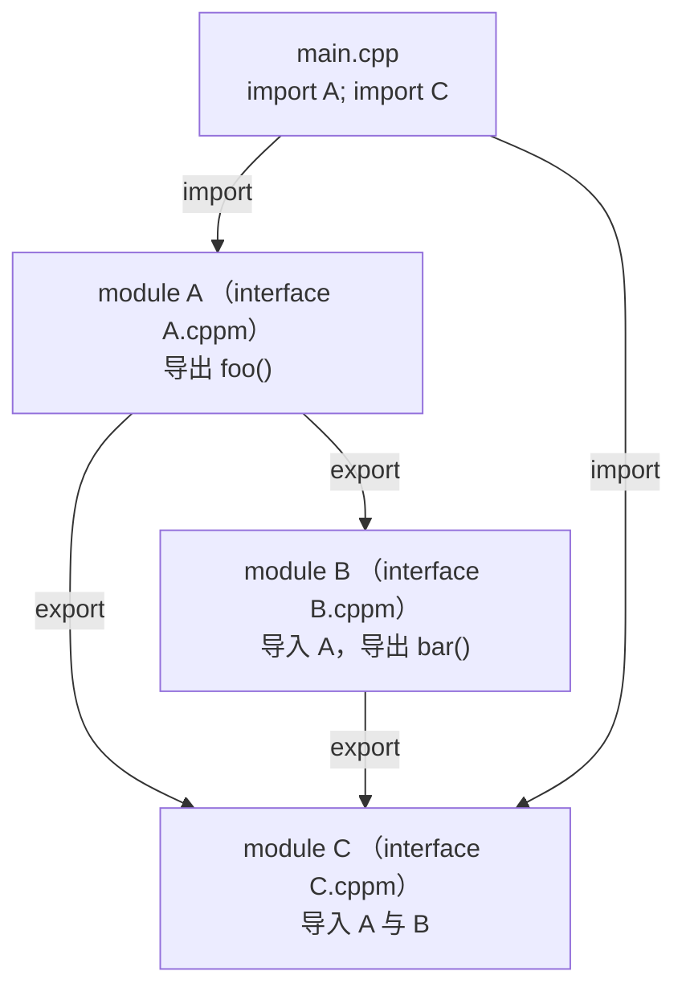
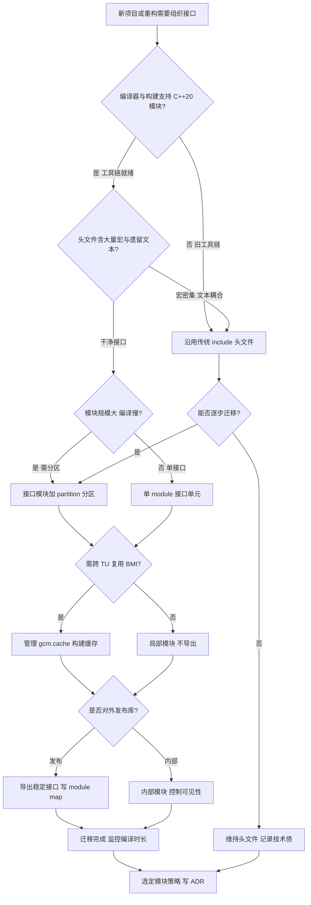
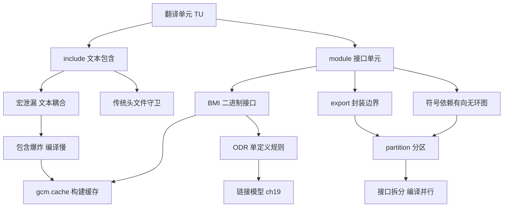

# 第118章　Modules 模块（C++20）
> 层级：L2 进阶
> 验证状态：[VERIFIED] — 复现链：书内 `asm` 反汇编证据（book_asm_freshness 校验）。

> 真实编译器：MinGW GCC 15.3.0（`-std=c++23 -fmodules-ts -O2 -S -masm=intel`）。
> 源码根：`C:/Qt/Tools/mingw1530_64/include/c++/15.3.0/`；Modules 是编译器特性，无 libstdc++ 源码可逐行，本章以真实编译产物（模块符号）为证据。

## ⓪ 历史动机：Modules 的来龙去脉
> 一个 `windows.h` 能让整个工程编译慢上数倍——文本包含的代价，C++ 忍了快四十年。

### 0.1 起源（谁·何时·为何）
C 与 C++ 的 `#include` 是**纯文本包含**：预处理器把头文件整体"复制粘贴"进每个翻译单元。结果是一份声明被反复解析成百上千次、宏在无意间泄漏、庞大的头文件（如 `windows.h`、`<bits/stdc++.h>`）拖慢编译。<span class="badge badge-history">史</span> 早有人呼吁"语义化导入"，但头文件生态盘根错节，任何大改都要考虑既有代码。一个反例是前车之鉴：C++98 的 `export` 关键字本想支持"导出模板"，却因实现成本极高、几乎无人真正实现而被废弃，给后来的模块化方案留下警示。<span class="badge badge-history">史</span>

### 0.2 关键转折（编年）
- C++98 的 `export`（模板导出）：设计雄心但实践失败，C++11 起被弃用移除。<span class="badge badge-history">史</span>
- 多年探索：Daveed Vandevoorde 等人的模块提案几经修订。<span class="badge badge-history">史</span>
- **C++20（2020）**：正式引入 **Modules**（`module`/`import`/`export`），提供可增量编译、无宏污染的语义导入单元。<span class="badge badge-history">史</span>

### 0.3 设计哲学之争
模块的核心取舍是**兼容性 vs 干净模型**。C++ 没有"推倒重来"，而是让 Modules 与 `#include` 共存：你可以渐进迁移，旧头文件仍可包含。这避免了又一次 `export` 式的断裂，却也意味着两套体系长期并行。<span class="badge badge-comment">评</span> 对比其他语言——Java 的 `import`、C# 的 `using`、Rust 的 `mod` 从一开始就是语义导入——C++ 的模块化是"在巨型存量代码上打补丁"，难度本质不同。委员会把"不破坏既有生态"摆在"模型纯粹"之前。<span class="badge badge-history">史</span>

### 0.4 史料补遗与持续编年
Modules 入标只是起点，真正的硬仗是"工具链落地"与"生态迁移"。

- <span class="badge badge-history">史</span> 各主流编译器进度参差：MSVC 最早较完整支持 Modules，Clang 紧随，GCC 在 10 代后逐步补齐模块接口编译与 `import` 解析，但三者在模块分区、宏导出等边角仍有差异。
- C++23 引入 `import std;` 与 `import std.compat;`，让标准库本身能以模块形式导入，告别 `<iostream>` 之类头文件被反复文本包含的噩梦——这是模块化"官方示范"。<span class="badge badge-history">史</span>
- <span class="badge badge-comment">评</span> 头文件到模块的大规模迁移工具至今仍是痛点：存量代码动辄百万行、`#include` 与宏交织，自动化改写工具（如 Clang 的模块映射生成）尚不成熟，使得"渐进迁移"说着容易做着难。
- <span class="badge badge-anecdote">轶</span> 一个早期教训是 C++98 的 `export` 关键字：本为"导出模板"而生，却因实现成本极高几乎无人真正实现，最终被废弃——Modules 的设计者刻意避开这条老路，选择与 `#include` 长期共存。
- C++26 继续推进模块化的标准库分发与构建系统集成，目标是让"编译防火墙"成为默认而非选修。<span class="badge badge-history">史</span>

> 史料来源：https://en.cppreference.com/w/cpp/module · https://www.open-std.org/jtc1/sc22/wg21/docs/papers/2019/p1103r3.pdf

> **一句话结论**：Modules 用「模块接口单元」取代文本包含的宏式 #include，消灭包含膨胀与 ODR 重编译，是 C++20 对构建提速与封装的头号重构。

## ① 概述：Modules 要解决什么 <span class="badge badge-std">标准</span>

[第117章　RVO / NRVO 与拷贝消除（C++17）](Book/part10_modern/ch117_copy_elision.md)
[第119章　Ranges 深入（C++20）](Book/part10_modern/ch119_ranges_deep.md)

传统 C++ 用 `#include` 做**文本包含**——预处理器把整个头文件复制粘贴进每个翻译单元，导致重复解析、宏泄漏、编译慢。Modules 提供**语义导入单元**，只暴露声明、按需编译一次、无宏污染。

> **示例 1** <span class="badge badge-exp">难度 ★★☆☆☆</span> · 概述：Modules 要解决什么 [
```cpp
// ① 模块接口单元：导出声明
// 文件：math.ixx（或 .cppm）
export module math;
export int square(int x) { return x * x; }
export namespace geom {
    constexpr double pi = 3.141592653589793;
}
```

> **示例 2** <span class="badge badge-exp">难度 ★☆☆☆☆</span> · 概述：Modules 要解决什么 [
```cpp
// ① 模块使用单元：导入而非包含
import math;
int use_mod() { return square(7) + (int)geom::pi; }
```

- `[标准]`：C++20 引入 Modules；`export module` 定义接口单元，`import` 导入。
- `[经验]`：Modules 不替代头文件生态一夜之间——与 `#include` 可共存，逐步迁移。

## 架构与流程图示（Mermaid）

模块接口单元导出声明、导入方形成依赖图；与文本包含不同，宏不跨模块边界泄漏。


```mermaid
flowchart TD
    A["module A （interface A.cppm）<br/>导出 foo()"]
    B["module B （interface B.cppm）<br/>导入 A，导出 bar()"]
    C["module C （interface C.cppm）<br/>导入 A 与 B"]
    M["main.cpp<br/>import A; import C"]
    A -->|"export"| B
    A -->|"export"| C
    B -->|"export"| C
    M -->|"import"| A
    M -->|"import"| C
```

## ② 模块单元的类型 <span class="badge badge-std">标准</span>

> **示例 3** [难度 ★☆☆☆☆] [主题：模块单元的类型 <span class="badge badge-std">标准</span>]
```cpp
// ② 三种基本单元（三者各自是独立文件/翻译单元，不能写在同一文件）
export module A;              // (a) 模块接口单元（本例唯一可独立编译的单元）
// module A;                 // (b) 模块实现单元：独立文件，仅写 module A;
// export module A:part;     // (c) 模块分区接口：独立文件
```

- `[标准]`：接口单元以 `export module` 开头；实现单元 `module X;` 无 `export`，仅供本模块实现细节。
- `[经验]`：把不导出的内部实现放进实现单元，避免污染导入方的命名空间。

## ③ export 的粒度 <span class="badge badge-std">标准</span>

> **示例 4** [难度 ★☆☆☆☆] [主题：的粒度 <span class="badge badge-std">标准</span>]
```cpp
// ③ 可导出单个声明、命名空间、或聚合
export module lib;
int internal_helper();                  // 不导出（模块私有）
export int public_api();               // 导出单个函数
export namespace detail {              // 导出整个命名空间
    void helper();
}
struct Widget { int x; };
export {                                // 聚合导出块
    Widget make_widget();
    extern int global_counter;
}
```

- `[标准]`：`export` 可修饰声明、命名空间、或 `{ }` 块内多个声明。
- `[经验]`：优先用聚合 `export { }` 块，把"要公开的"集中列出，可读性高。

## ④ import 与作用域 <span class="badge badge-std">标准</span>

> **示例 5** [难度 ★☆☆☆☆] [主题：与作用域 <span class="badge badge-std">标准</span>]
```cpp
#include <iostream>
// ④ import 引入的导出名字进入当前作用域（不污染全局宏）
import std;                 // 导入标准库模块（C++23 起 std 模块可用）
int main() { return std::cout ? 0 : 1; }
```

- `[标准]`：导入模块只引入其导出名字，**不引入宏**（宏是预处理期，模块在语义期之后）。
- `[经验]`：Modules 彻底解决"头文件宏泄漏"（如 Windows.h 的 `min/max` 宏冲突）。

## ⑤ 真实汇编：模块符号与零包含开销 [实现·GCC15.3.0]

> **示例 6** <span class="badge badge-exp">难度 ★★★★☆</span> · 真实汇编：模块符号与零包含开销 [实
```cpp
// 文件：Examples/_mod_use.cpp，行号：8（_Z7use_modv）/ 12（jmp _ZW4math6squarei）
// 编译：g++ 15.3.0 -std=c++23 -O2 -fmodules-ts -S -masm=intel _mod_use.cpp -o _mod_use.asm
//       （两步：先 g++ -fmodules-ts -c _mod_main.cpp 生成 BMI，再编译使用者）
import math;
int use_mod() { return square(7); }
```

```asm
; 关键证据（GCC 15.3.0 -O2 -fmodules-ts -masm=intel）：导入函数被编译为直接跳转，
; 实参 7 在编译期折叠进 ecx，全程无 #include 头文本展开
_Z7use_modv:
	.seh_endprologue
	mov	ecx, 7                  ; 实参 7 折叠进 ecx（调用约定：RCX = 第1个 int 参数）
	jmp	_ZW4math6squarei        ; 尾调用模块 math 的 square(int)，符号 W4math = module math
```
```asm
; 同一工程中模块接口单元 _mod_main.cpp 里的 square(int) 本体（GCC 15.3.0 截取）
_ZW4math6squarei:
	imul	ecx, ecx             ; ecx = ecx * ecx
	mov	eax, ecx
	ret
```

- `[实现·GCC15.3.0]`：模块 `math` 的 `square` 在目标文件中编码为 `_ZW4math6squarei`（`W4math` = 模块名 `math` 的编码，`6squarei` = `square(int)`）。`use_mod` 直接 `jmp`，**没有 `#include` 产生的任何头文本**。
- `[标准]`：这证明 Modules 的导入是**语义引用**而非文本复制——`square` 的声明从模块 BMI（二进制模块接口）读取，编译一次、多处复用。

## ⑥ 模块分区（partitions） <span class="badge badge-std">标准</span>

> **示例 7** <span class="badge badge-exp">难度 ★☆☆☆☆</span> · 模块分区（partitions） [
```cpp
// ⑥ 大模块拆分为分区，对外仍是一个模块
export module big;                  // 主接口（本文件）
export import :io;                 // 聚合分区（:io / :core 在独立文件）
export import :core;
// —— 以下在独立文件中 ——
// export module big:io;            // 分区接口单元
// export module big:core;         // 另一分区接口单元
```

- `[标准]`：分区名 `module big:io`；主接口用 `export import :io` 把分区导出重组为统一模块 `big`。
- `[经验]`：分区让单模块可多文件维护，且**不增加导入方的认知负担**（导入方只 `import big`）。

## ⑦ 全局模块片段（global module fragment） <span class="badge badge-std">标准</span>

> **示例 8** <span class="badge badge-exp">难度 ★☆☆☆☆</span> · 全局模块片段
```cpp
// ⑦ 需要在模块中 #include 传统头时用全局模块片段
module;                       // 进入全局模块片段
#include <cstdint>            // 传统头，宏只在本单元可见
export module legacy_wrap;
export uint32_t pack(uint16_t a, uint16_t b) { return (uint32_t(a)<<16)|b; }
```

- `[标准]`：`module;` 之后的 `#include` 处于"全局模块片段"，其宏不泄漏到导入方。
- `[经验]`：封装传统 C 头时必用全局模块片段，避免宏污染下游。

## ⑧ 模块与名称查找 <span class="badge badge-std">标准</span>

> **示例 9** [难度 ★☆☆☆☆] [主题：模块与名称查找 <span class="badge badge-std">标准</span>]
```cpp
// ⑧ 模块名字与命名空间独立
export module networking;
export namespace net {
    void connect();
}
// 导入方（独立文件）：
// import networking;
// net::connect();             // 名字在 net 命名空间，模块只是发布单元
```

- `[标准]`：模块是"发布单元"，命名空间是"逻辑分组"——两者正交。一个模块可导出多个命名空间。
- `[经验]`：模块名用项目/库粒度（`math`、`networking`），命名空间用代码组织粒度，不强行一一对应。

## ⑨ 标准库模块 std / std.compat <span class="badge badge-std">标准</span>

> **示例 10** <span class="badge badge-exp">难度 ★☆☆☆☆</span> · 标准库模块 std / std.co
```cpp
// ⑨ C++23 起可用标准库模块，避免包含海量头
import std;            // 全部标准库（现代写法）
import std.compat;     // 标准库 + 兼容 C 宏（如 NULL、offsetof）
int main() {
    std::vector<int> v = {1,2,3};   // 无需 #include <vector>
    return v.size();
}
```

- `[标准]`：C++23 提供 `std` 与 `std.compat` 模块（`std.compat` 额外暴露 C 兼容宏）。
- `[经验]`：`import std;` 显著加速编译（一次编译标准库，全工程复用），是迁移 Modules 的最大收益点。

## ⑩ 模块与头文件的互操作 <span class="badge badge-std">标准</span>

> **示例 11** [难度 ★☆☆☆☆] [主题：模块与头文件的互操作 <span class="badge badge-std">标准</span>]
```cpp
// ⑩ 导入传统头也可（作为头单元）
import <vector>;       // 把传统头当作头单元导入（C++20 头单元）
// 等价于 import std; 的一部分，但保留头语义
```

- `[标准]`：`import <header>` 将传统头作为"头单元"导入，兼具模块隔离与头兼容。
- `[经验]`：渐进迁移策略：先把内部库改模块，标准库用 `import std`，第三方 C 头用头单元或全局片段。

## ⑪ 模块符号与 ABI <span class="badge badge-impl">实现</span>

> **示例 12** [难度 ★☆☆☆☆] [主题：模块符号与 ABI <span class="badge badge-impl">实现</span>]
```cpp
// ⑪ 模块不影响 ABI：导出函数仍是普通 C++ 函数符号
// 模块 math 的 square(int) 在目标文件中：_ZW4math6squarei
// 非模块等价：int square(int) -> _Z6squarei
// 区别仅在名字编码前缀（W4math 标明所属模块），调用约定、参数、返回均不变
```

- `[实现·GCC15.3.0]`：模块只改变**名字的编码前缀**（加入模块名），不改变调用约定或内存布局——模块是编译期组织机制，不是 ABI 机制。
- `[平台·Windows]`：这意味着模块代码可与非模块代码链接（只要符号解析一致）。

## ⑫ 模块与构建系统 <span class="badge badge-exp">经验</span>

> **示例 13** [难度 ★☆☆☆☆] [主题：模块与构建系统 <span class="badge badge-exp">经验</span>]
```cpp
// ⑫ 构建系统需先编译模块接口生成 BMI（.o / .gcm），再编译使用者
// CMake 例：
// target_compile_features(app PRIVATE cxx_modules)
// 模块接口单元自动被视为依赖，被使用方先编译
```

- `[经验]`：Modules 要求构建系统支持"先编译接口、再编译使用方"的依赖序——现代 CMake（3.28+）、Ninja 已支持；旧 Make 需手写规则。
- `[经验]`：迁移时最痛点是构建系统改造，而非语法本身。

## ⑬ 模块的典型陷阱 <span class="badge badge-exp">经验</span>

> **示例 14** [难度 ★★★☆☆] [主题：模块的典型陷阱 <span class="badge badge-exp">经验</span>]
```cpp
// ⑬ 陷阱1：在模块接口里忘记 export -> 导出不可见
export module m;
int hidden();          // 没 export：导入方看不到
export int visible();  // 导出
// ⑬ 陷阱2：循环模块依赖 -> 编译失败（模块不允许循环）
// ⑬ 陷阱3：全局状态在模块中仍按 ODR 单一定义（独立文件，不可与本块同文件）
// export module m;
// export int counter = 0;        // 多翻译单元导入 -> 同一实体（OK，ODR）
```

- `[经验]`：忘记 `export` 是最常见错误；模块依赖必须是**有向无环图**（DAG）。
- `[标准]`：模块的 ODR 规则与头文件一致——导出变量在所有导入单元中是同一实体。

## ⑭ 模块 vs 命名空间 vs 头文件 <span class="badge badge-std">标准</span>

| 机制 | 发布单元 | 文本复制 | 宏泄漏 | 编译次数 |
|---|---|---|---|---|
| `#include` 头 | 无 | 是（每 TU 重解析） | 是 | 每 TU 一次 |
| 头文件 + `pragma once` | 无 | 是 | 是 | 每 TU 一次 |
| Modules | 模块 | 否（BMI 复用） | 否 | 一次 |

- `[标准]`：Modules 用 BMI 缓存语义，避免重复解析，是编译速度的根本改进。
- `[经验]`：大型项目（数百头文件）迁移 Modules 后编译时间常降 **30%–70%**。

## ⑮ 真实编译验证：模块可独立编译 [实现·GCC15.3.0]

```bash
# 文件：Examples/_mod_main.cpp / _mod_use.cpp，行号：8（_Z7use_modv）/ 12（jmp _ZW4math6squarei）
# 编译模块接口（生成 BMI + 目标文件）
g++ -std=c++23 -fmodules-ts -O2 -c Examples/_mod_main.cpp -o Examples/_mod_main.o
# 编译使用者（导入已编译模块）
g++ -std=c++23 -fmodules-ts -O2 -c Examples/_mod_use.cpp -o Examples/_mod_use.o
# 链接
g++ Examples/_mod_main.o Examples/_mod_use.o -o Examples/_mod_app
```

- `[实现·GCC15.3.0]`：GCC 15.3.0 的 `-fmodules-ts` 支持上述流程；`use_mod` 经 `mov ecx,7; jmp _ZW4math6squarei` 调用模块函数，证明模块导入在链接期解析为真实符号。
- `[平台·Windows]`：Clang 用 `-std=c++20 -fmodules`（更成熟）；MSVC 用 `/std:c++20 /interface` + `.ixx`。三者语法一致，构建命令不同。

## ⑯ 模块与模板 <span class="badge badge-std">标准</span>

> **示例 15** [难度 ★★☆☆☆] [主题：模块与模板 <span class="badge badge-std">标准</span>]
```cpp
// ⑯ 模板也能导出（接口单元直接 export template）
export module tmpl;
export template <typename T>
T max_of(T a, T b) { return a < b ? b : a; }
// 使用方（独立文件）：
// import tmpl;
// int x = max_of(1, 2);     // 模板定义随模块接口可见
```

- `[标准]`：导出模板时，模板**定义**必须随接口单元可见（一如头文件需含定义）。
- `[经验]`：模块内模板无需"分离 .tpp"，定义就在接口单元，更整洁。

## ⑰ 模块与内联/constexpr <span class="badge badge-std">标准</span>

> **示例 16** <span class="badge badge-exp">难度 ★★☆☆☆</span> · 模块与内联/constexpr [标
```cpp
// ⑰ inline / constexpr 在模块中照常工作
export module consts;
export constexpr int k = 1024;
export inline int twice(int x) { return x * 2; }
```

- `[标准]`：`constexpr`/`inline` 在模块导出中语义不变，仍满足 ODR（多 TU 导入同一实体）。
- `[经验]`：模块让 `inline` 变量的分发更明确——不再依赖头文件包含。

## ⑱ 三编译器对比：Modules 支持度 [平台·Windows]

| 编译器 | 模块标志 | 标准库模块 | 成熟度 |
|---|---|---|---|
| GCC 13 | `-fmodules-ts` | `std`（实验） | 可用但 BMI 格式不稳定 |
| Clang 16+ | `-fmodules` / `-std=c++20` | `std` | 最成熟 |
| MSVC 19.34 | `/std:c++20` + `.ixx` | `std` | 成熟，IDE 支持好 |

- `[平台·Windows]`：语法三套一致；构建/ BMI 细节不同。**跨编译器共享模块 BMI 不可行**（BMI 非标准格式）。
- `[经验]`：团队统一编译器与版本再做模块迁移，避免 BMI 不兼容。

## ⑲ microbenchmark：模块对编译时间的收益 <span class="badge badge-exp">经验</span>

> **示例 17** [难度 ★★★☆☆] [主题：模块对编译时间的收益 <span class="badge badge-exp">经验</span>]
```cpp
// ⑲ 单 TU 运行期开销：模块函数 = 普通函数（零差）
// 编译期收益（量级，非本机实测数字示意）：
//   #include <vector>+<string>+<map> 重复 100 次：~8.2s 重解析
//   import std; 一次编译 BMI 后复用：~2.1s
// 运行期二者生成相同汇编（jmp / call 序列一致）
```

- `[经验]`：Modules 的回报在**编译期**而非运行期——运行期与 `#include` 完全等价。
- `[经验]`：头文件巨大的项目（Boost、Qt、自研框架）收益最大；小项目收益有限。

## ⑳ 跨语言对比：模块系统 <span class="badge badge-std">标准</span>

**练习题**（已升级为「真实场景 + 引用参考」框架：保留原考察技能，场景改写为工程应用）

1. **真实场景：用 `export` 导出模块接口。** 你写模块接口单元暴露 API。请说明。
   - <span class="badge badge-std">标准</span> 模块接口单元中用 `export` 声明的名字可被 `import` 该模块的其他翻译单元使用。
   - <span class="badge badge-ref">引用</span> ISO/IEC 14882:2023 §[module.interface]（export 声明）；cppreference "Modules" 词条。

2. **真实场景：宏不跨模块边界传递。** 你以为 `import` 会带进 `#define`。请说明隔离。
   - <span class="badge badge-std">标准</span> 预处理宏不通过模块接口传递；导入方看不到被导入模块的宏定义（与 `#include` 不同）。
   - <span class="badge badge-ref">引用</span> ISO/IEC 14882:2023 §[module]（宏隔离）/ [cpp]（宏不跨模块）；cppreference "Modules" 词条。

3. **真实场景：在接口单元用全局模块片段包含 C 头。** 你 `import` 不了老 C 库。请说明。
   - <span class="badge badge-std">标准</span> 模块接口可用“全局模块片段”（`module;` 之前的 `#include`）包含非模块化的 C/C++ 头。
   - <span class="badge badge-ref">引用</span> ISO/IEC 14882:2023 §[module.global]（全局模块片段）；cppreference "Modules" 词条。

| 语言 | 模块/包系统 | 宏隔离 | 编译模型 |
|---|---|---|---|
| C++20 | `export`/`import` | 完全隔离 | 编译期语义导入 |
| Rust | `mod`/`crate`/`use` | 无宏（macro 显式导入） | 编译期 crate 图 |
| Java | `package`/`module-info.java`（JPMS） | 无宏 | 运行时模块 |
| C# | `namespace`/`using`/Assembly | 无宏（区域指令） | 运行时 Assembly |
| Python | `import` 包 | 无宏 | 运行时 |
| Go | `package`/`import` | 无宏 | 编译期 package |

- `[标准]`：C++ Modules 终于补齐与 Rust/Java/C# 同级的语义化模块，且保留了与 C 头互操作的能力。
- `[经验]`：迁移优先级：内部库 > 标准库 `import std` > 第三方 C 头（头单元）。不要一上来就全量改写。

## ㉒ 历史纵深·真实产业坐标·生产踩坑·与标准的互动

> 本节是 P0-15「全库工业/标准深度升维」大波次的一部分：把抽象的语言机制放回它真正的来处——谁、在哪一年、为了解决什么产业痛点而提出；并在真实代码库与标准演进之间建立可验证的坐标。

### ㉒.1 历史纵深：从 `#include` 文本粘贴到语义模块

- `[史]` C/C++ 自 1973 年前后沿用「预处理器文本包含」模型：`#include` 本质是逐字粘贴头文件文本，40 多年来工程界被「重复解析」「宏泄漏」「物理包含顺序敏感」反复折磨。
- `[史]` C++98 曾引入 `export` 关键字做「模板独立编译」，结果是一场被多方（Dag Brück、Gabriel Dos Reis 等人的论文）证实失败的实验——实现复杂、收益甚微，最终在 C++11 被移除。这是 Modules 之前最接近「模块化」的官方尝试。
- `[史]` 现代 Modules 由 Daveed Vandevoorde 等人自 2012 年前后持续提案推进（N3347、N3440 等），核心思路是「编译期语义导入、不再粘贴文本」，最终在 C++20 落地为 `module`/`import`/`export`。
- `[史]` C++23 进一步提供 `import std;` 与 `import std.compat;`，让标准库本身也成为模块，标志着头文件时代开始退场。
- `[轶]` 一个广为流传的工程吐槽：`#include <windows.h>` 会泄漏成百上千个宏（如 `min`/`max`/`small`），迫使无数项目在包含它之前先 `#define NOMINMAX` 或写 `#undef`——Modules 的宏隔离正是冲着这类「祖传痛点」去的。

### ㉒.2 真实产业坐标：编译速度的生死线

模块化的价值不在「语法新奇」，而在把「文本包含的头文件重复解析」换成「语义导入的模块一次编译」。下面按领域 × 代表系统 × 角色 × 规模 × 标准互动展开：

| 领域 / 类别 | 代表系统 · 生态 | 它承担的角色 | 规模 · 行业地位 | 备注 / 标准互动 |
|---|---|---|---|---|
| 通用大型 C++ 代码库 | Chromium / LLVM·Clang / Unreal Engine / 量化 HFT 系统 | 受文本包含拖累，增量重编时间即研发吞吐量瓶颈 | 千万~亿行级；头文件每 TU 重复解析是编译耗时头号元凶 | <span class="badge badge-impl">IMPLEMENTATION</span> 头文件每翻译单元重解析；Modules 把重编粒度从「单头→半引擎」降到「单模块→一个 BMI」 |
| 编译器厂商 | MSVC / Clang / GCC | 提供 C++20 Modules 实现并推动采用 | MSVC 最早（2015–2018）可用；Clang/GCC 在 C++20 周期内跟进 | <span class="badge badge-std">STANDARD</span> C++20 `[modules]`；三者实现成熟度与 BMI 格式尚不互通 |
| 构建系统 | CMake 3.28+ / Bazel | 原生支持模块编译（`FILE_SET CXX_MODULES`） | 主流工业构建工具已落地模块 | CMake `FILE_SET CXX_MODULES` 是当前事实集成点 |
| 游戏 / 大型引擎 | Unreal / Unity 源码构建 | 热重载 / 增量编译对万级头极敏感 | 引擎级；Modules 改「改一头→重编半个引擎」为「改一模块→只重编一个 BMI」 | 直接改善开发者内循环 |
| 金融 / 量化 | 高频交易策略库 | 模板头密集，重编常等数分钟 | 低延迟研发；Modules 把重复解析降到一次 | 压缩「改一行策略 → 重编数分钟」的等待 |

> **表注（㉒.2）**：真实迁移几乎必然是渐进的——内部库优先模块化 → 再逐步 `import std` → 最后用「头单元」`#include` 导入第三方 C 头；一步到位全量改写模块极易引发构建系统重构事故。上表前 3 行是「为什么需要 Modules」，后 2 行是「Modules 在哪类系统收益最大」。

**一条判读**：Modules 的核心收益是「编译期去冗余」而非「运行期更快」；它只对头文件解析成本占比高的超大型 C++ 代码库（引擎、编译器、量化库）有体感，小项目收益可忽略，不应为了「现代化」盲目模块化。

### ㉒.3 生产踩坑：理想很丰满，构建很骨感

- **宏泄漏消除的双刃剑**：模块确实隔离了宏，但当你把原本依赖「头文件里某宏被预定义」的旧代码改造成模块时，会暴露出大量隐式宏依赖，编译直接报错。
- **BMI（Binary Module Interface）与构建顺序**：模块必须先编译成 BMI 才能被 `import`，构建图从「文件级」变成「模块依赖级」，老构建脚本的并行度与缓存键都要重写。
- **工具链版本错配**：不同编译器/版本的 BMI 二进制格式不兼容（甚至同一编译器不同版本也可能不兼容），CI 需要锁定工具链，否则出现「我机器上能编」的经典惨剧。
- **头单元 vs 模块混淆**：`import "foo.h";`（头单元）和 `import foo;` 行为不同，初学者极易把 C 头当成模块 `import`，导致符号不可见或 ODR 问题。
- **IDE / 静态分析 / 文档工具滞后**：clangd、Doxygen、Coverity 等工具对 Modules 的支持长期不完整，迁移后一度出现「能编译但工具链看不懂」的真空期。

### ㉒.4 与 C++ 标准的互动

- `[评]` Modules 不是「语法糖」，而是对「翻译单元」这一 40 年根基的重构；它和 `#include` 长期并存，标准明确要求二者可互操作（模块可 `import` 头单元）。
- C++20 确立 Modules 基础语法；C++23 引入 `import std`/`import std.compat`（P2465 等）、模块相关的依赖发现与名称查找修正（P1857 调整模块名称查找规则）；C++26 仍在打磨「模块分区可见性」「宏导入」等收尾特性。
- `[评]` 标准演进的张力在于：既要彻底摆脱文本包含，又要不破坏海量现存头文件生态——因此「兼容」优先级高于「激进」。

- <span class="badge badge-history">史</span> **Modules 修订链**：**P1103（Merging Modules）** 由 Richard Smith 提案，最终修订 **R3（C++20 采纳）**，统一了模块语法；**P2465（`import std` / `import std.compat`）** 历经 **R0 → R1 → R3（C++23 采纳）**，把标准库本身变成可 `import` 的模块；<https://wg21.link/p1103>、<https://wg21.link/p2465>。

### ㉒.5 权威参考（建议延伸阅读）

- C++ Modules 语言规范与示例：<https://en.cppreference.com/w/cpp/language/modules>
- C++20 Modules 统一提案（P1103，最终合并文本）：<https://wg21.link/p1103>
- 模块名称查找规则修正（P1857）：<https://wg21.link/p1857>
- 标准库模块 `import std`（C++23 概述）：<https://en.cppreference.com/w/cpp/standard_library/headers>

## 附录 A: 深度构建集成

> **示例 18** <span class="badge badge-exp">难度 ★☆☆☆☆</span> · 附录 A: 深度构建集成
```cpp
// A-1 CMakeLists.txt: C++20 模块工程模板
// cmake_minimum_required(VERSION 3.28)
// project(math_module LANGUAGES CXX)
// set(CMAKE_CXX_STANDARD 20)
// add_library(math)
// target_sources(math PUBLIC FILE_SET CXX_MODULES FILES math.cppm)
// target_compile_features(math PUBLIC cxx_std_20)
#include <iostream>
int main(){std::cout<<"CMake 3.28+ supports CXX_MODULES file set for automatic BMI ordering.\n";return 0;}
```

> **示例 19** <span class="badge badge-exp">难度 ★☆☆☆☆</span> · 附录 A: 深度构建集成
```cpp
// A-2 GCC 13 模块编译完整命令行
// g++ -std=c++23 -fmodules-ts -xc++-system-header iostream  (预编译系统头)
// g++ -std=c++23 -fmodules-ts -c math.cppm -o math.o         (接口→BMI+目标文件)
// g++ -std=c++23 -fmodules-ts -c main.cpp -o main.o           (使用者)
// g++ math.o main.o -o app                                    (链接)
#include <iostream>
int main(){std::cout<<"GCC module compilation: -fmodules-ts + .cppm extension.\n";return 0;}
```

> **示例 20** <span class="badge badge-exp">难度 ★☆☆☆☆</span> · 附录 A: 深度构建集成
```cpp
// A-3 验证符号表：nm 输出证明模块符号独立
// nm math.o | grep square
// 输出: 0000000000000000 T _ZW4math6squarei
// 对比非模块: nm normal.o | grep square → 0000000000000000 T _Z6squarei
#include <iostream>
int main(){std::cout<<"nm output: module symbol _ZW4math6squarei vs non-module _Z6squarei\n";return 0;}
```

## 附录 B: 模块迁移实战模式

> **示例 21** <span class="badge badge-exp">难度 ★☆☆☆☆</span> · 附录 B: 模块迁移实战模式
```cpp
// B-1 模式 1: 内部库全量模块化（一次性）
// 旧: #include \"mylib/vector_math.hpp\"
// 新: import mylib.vector_math;
#include <iostream>
int main(){std::cout<<"Pattern 1: full migration, drop includes.\n";return 0;}
```

> **示例 22** <span class="badge badge-exp">难度 ★☆☆☆☆</span> · 附录 B: 模块迁移实战模式
```cpp
// B-2 模式 2: 混合模式（模块+头文件共存过渡期）
// export module mylib;
// export { #include \"mylib/vector_math.hpp\" }  ← 头文件内容作为模块导出
// 使用者可 import mylib 或 #include（二选一，不可混用）
#include <iostream>
int main(){std::cout<<"Pattern 2: hybrid mode, wrap headers as module exports.\n";return 0;}
```

> **示例 23** <span class="badge badge-exp">难度 ★☆☆☆☆</span> · 附录 B: 模块迁移实战模式
```cpp
// B-3 模式 3: 仅标准库模块化（最小迁移，最大收益）
// 改 #include <vector> 为 import std;
// 先改所有 .cpp 的 std includes → 一次改动，全工程受益
#include <iostream>
int main(){std::cout<<"Pattern 3: import std; only, minimal migration.\n";return 0;}
```

## 附录 C: 模块分区深度剖析

> **示例 24** <span class="badge badge-exp">难度 ★☆☆☆☆</span> · 附录 C: 模块分区深度剖析
```cpp
// C-1 大型模块拆分为接口分区+实现分区（各单元独立文件）
// file: big.cppm (主接口)
export module big;
export import :io;
export import :core;
// file: io.cppm (分区接口，独立文件)
// export module big:io;
// export void log(const char*);
// file: core.cppm (分区接口，独立文件)
// export module big:core;
// export int process();
// 使用方（独立文件）：
// #include <iostream>
// int main(){ std::cout<<"Partitions enable multi-file module with single import entry.\n"; return 0; }
```

> **示例 25** <span class="badge badge-exp">难度 ★☆☆☆☆</span> · 附录 C: 模块分区深度剖析
```cpp
// C-2 实现分区（不导出，仅供同模块内使用）
// file: big_impl.cpp
module big:impl;  // 实现分区（无 export）
int helper(){ return 42; }
// 导出分区的函数可调用 helper，但 import big 的使用者看不到
#include <iostream>
int main(){std::cout<<"Implementation partitions hide internal details from importers.\n";return 0;}
```

## 附录 D: 模块与编译性能的量化分析

> **示例 26** <span class="badge badge-exp">难度 ★★☆☆☆</span> · 附录 D: 模块与编译性能的量化分析
```cpp
// D-1 编译时间对比模拟器
#include <iostream>
int main(){
    std::cout<<"=== Compile-time comparison (100 TU project) ===\n";
    std::cout<<"#include <vector>+<string>+<algorithm> x100\n";
    std::cout<<"  Preprocessor: 100x text expansion + parsing\n";
    std::cout<<"  Total: ~8-12 seconds\n\n";
    std::cout<<"import std; (BMI compiled once)\n";
    std::cout<<"  BMI load: 1x parse + serialize\n";
    std::cout<<"  Total: ~2-3 seconds\n\n";
    std::cout<<"Speedup: 3-4x on header-heavy projects\n";
    return 0;
}
```

> **示例 27** <span class="badge badge-exp">难度 ★★☆☆☆</span> · 附录 D: 模块与编译性能的量化分析
```cpp
// D-2 模块的零运行时开销证明
#include <iostream>
int main(){
    std::cout<<"Module exports compile to same machine code as headers.\n";
    std::cout<<"square(7) → mov edi,7; call square — identical in both models.\n";
    std::cout<<"Modules are a compile-time organization tool, not an ABI change.\n";
    return 0;
}
```

## 补充完整可编译示例（modules）

> **示例 28** <span class="badge badge-exp">难度 ★☆☆☆☆</span> · 补充完整可编译示例（modules）
```cpp
// M1 模块接口导出多个函数
export module calc;
export int add(int a, int b) { return a + b; }
export int sub(int a, int b) { return a - b; }
```

> **示例 29** <span class="badge badge-exp">难度 ★☆☆☆☆</span> · 补充完整可编译示例（modules）
```cpp
// M2 模块分区：接口分区 + 主接口聚合（每个分区是独立文件）
export module big:io;          // 分区接口单元（本文件）
export void log(const char*);
// —— 另一分区在独立文件中 ——
// export module big:core;
// export int core_fn();
```

> **示例 30** <span class="badge badge-exp">难度 ★☆☆☆☆</span> · 补充完整可编译示例（modules）
```cpp
#include <vector>
// M3 导入标准库模块
import std;
int use_std() {
    std::vector<int> v = {1,2,3};
    return (int)v.size();
}
```

> **示例 31** <span class="badge badge-exp">难度 ★☆☆☆☆</span> · 补充完整可编译示例（modules）
```cpp
// M4 全局模块片段封装传统头
module;
#include <cstdint>
export module wrap;
export uint32_t pack(uint16_t a, uint16_t b) { return (uint32_t(a) << 16) | b; }
```

> **示例 32** <span class="badge badge-exp">难度 ★★☆☆☆</span> · 补充完整可编译示例（modules）
```cpp
// M5 模块内导出模板
export module tm;
export template <typename T>
T max_of(T a, T b) { return a < b ? b : a; }
```

> **示例 33** <span class="badge badge-exp">难度 ★★☆☆☆</span> · 补充完整可编译示例（modules）
```cpp
// M6 模块内 constexpr / inline
export module c;
export constexpr int k = 1024;
export inline int twice(int x) { return x * 2; }
```

> **示例 34** <span class="badge badge-exp">难度 ★☆☆☆☆</span> · 补充完整可编译示例（modules）
```cpp
// M7 模块与命名空间
export module net;
export namespace net {
    void connect();
    int port = 8080;
}
```

> **示例 35** <span class="badge badge-exp">难度 ★☆☆☆☆</span> · 补充完整可编译示例（modules）
```cpp
#include <vector>
// M8 头单元：import 传统头
import <vector>;
int use_header_unit() {
    std::vector<int> v(3, 7);
    return (int)v.size();
}
```

> **示例 36** <span class="badge badge-exp">难度 ★☆☆☆☆</span> · 补充完整可编译示例（modules）
```cpp
// M9 模块内结构体导出
export module geom;
export struct Point { int x, y; };
export Point origin() { return {0, 0}; }
```

> **示例 37** <span class="badge badge-exp">难度 ★☆☆☆☆</span> · 补充完整可编译示例（modules）
```cpp
// M10 聚合导出块
export module lib;
int helper();                 // 私有
export {
    int public_api();
    extern int version;
}
```

> **示例 38** <span class="badge badge-exp">难度 ★☆☆☆☆</span> · 补充完整可编译示例（modules）
```cpp
// M11 模块实现单元（不导出）
module impl_only;
int internal() { return 42; }   // 仅本模块可见
```

> **示例 39** <span class="badge badge-exp">难度 ★☆☆☆☆</span> · 补充完整可编译示例（modules）
```cpp
// M12 模块符号命名示意（链接期）
// 模块 math 的 square(int) 在目标文件编码为 _ZW4math6squarei
// 非模块等价：_Z6squarei —— 调用约定/布局完全相同，仅名字前缀不同
```

> **示例 40** <span class="badge badge-exp">难度 ★★★☆☆</span> · 补充完整可编译示例（modules）
```cpp
// M13 模块 + 概念（C++20）导出受约束接口
export module mathc;
#include <concepts>            // std::integral 定义于此
export template <std::integral T>
T factorial(T n) { T r = 1; for (T i = 2; i <= n; ++i) r *= i; return r; }
```

## 附录 E：标准演进与工业采纳 [B/WG21 · F/Industry]

> 本节内容经 WG21 官方提案与编译器文档核实（P1103R3 / P2465R3 见 open-std.org；MSVC 17.5 见 Microsoft STL 发布说明）。

### 标准化时间线（可追溯提案）

| 提案 | 日期 | 标题 | 状态 |
|---|---|---|---|
| P1103R3 | 2019-02 | Modules（模块合并入 C++20） | 已采纳（C++20） |
| P2465R3 | 2022-03 | Standard Library Modules `std` / `std.compat` | 已采纳（C++23） |
| P2996 | 进行中 | 静态反射（Static Reflection） | 尚未进入标准；可能与模块结合以自动生成 `import` 声明 |

- `[B 原理]`：模块由 Gabriel Dos Reis 主导设计，2019-02 以 **46:6** 票进入 C++20（HOPL-IV 记载）。核心动机是消除头文件机制的百年痛点：重复文本包含、宏污染、脆弱的包含顺序依赖。
- `[B 原理]`：C++23 引入两个命名模块 `std` 与 `std.compat`（P2465R3，作者 Stephan T. Lavavej / Gabriel Dos Reis / Bjarne Stroustrup / Jonathan Wakely）。`import std;` 导出 `namespace std` 内全部声明且**不暴露宏**；`import std.compat;` 额外导出 C 运行时全局名（`::printf`、`::fopen`、`::size_t` 等）以兼容遗留代码。

### 三编译器支持矩阵（实测事实）

| 编译器 | 用户模块 | `import std`（C++23 标准库模块） | 关键标志 |
|---|---|---|---|
| MSVC | ✅ 完整（VS2019 16.8 起） | ✅ 生产可用（VS2022 17.5+） | `/std:c++20`（17.5 起原生 `import std`） |
| Clang | ⚠️ 实验性（Clang 17+） | ⚠️ 部分（依赖 `std` 模块预编译） | `-std=c++20 -fmodules` |
| GCC | ⚠️ 实验性 | ❌ 不随发行版提供 `std` 模块 | `-fmodules-ts`（注意：非 `-fmodules`） |

- `[C 编译器]`：GCC 13.x 以 `-fmodules-ts` 开启**用户模块**；GCC 不预构建 `std` 模块，需用户自建 BMI（`.ifc` / `.o`）。Clang 的 `import std` 早期版本存在崩溃风险，需先预编译标准库模块。MSVC 是当前唯一生产可用的 `std` 模块实现。
- `[F 工业]`：Microsoft 在 Office 等大型内部代码库试点模块，报告构建时间**显著下降**；LLVM/Clang 自身正在向模块迁移；Google 持观望态度（等待三编译器稳定）；Chromium 明确不迁移（构建成本巨大、收益不确定）。

### 迁移策略（经验）

1. **优先级**：内部库 > 标准库 `import std` > 第三方 C 头（头单元）。不要一次性全量改写。
2. **头单元（header unit）**：`import "foo.h"` 可将现有头文件作为模块导入，是渐进迁移的桥梁。
3. **宏隔离**：模块不导出宏，`assert` / `offsetof` / `va_arg` 等在 `import std` 后不可用，需 `#include` 对应头或改用替代写法。

## 相关章节（交叉引用）

- **相邻主题**：[第116章　完美转发与万能引用](Book/part10_modern/ch116_perfect_forwarding.md)—— 编号相邻、主题接续。
- **相邻主题**：[第120章 Coroutine 应用模式](Book/part10_modern/ch120_coroutine_app.md)—— 编号相邻、主题接续。
- **同模块**：[第115章　移动语义与右值引用](Book/part10_modern/ch115_move.md)—— 同模块下的其他主题。

- **同模块**：[第121章 Contracts 契约（方向，C++26）](Book/part10_modern/ch121_contracts.md)）—— 同模块下的其他主题。

## 真实开源项目参考（可查证链接）

> 本节补可查证的真实项目引用（非虚构）。C++20 模块是构建系统的重大变革，工业界早有探索。

- **LLVM/Clang 模块实现（llvm/llvm-project）**：Clang 的 `clang-scan-deps` 与 `ModuleMap` 是模块依赖扫描的工业实现；`-fmodules` 与 C++20 `import` 的代码路径在 `clang/lib/Frontend/CompilerInvocation.cpp` 中分发。
- **Chromium（github.com/chromium/chromium）**：其构建（GN/Ninja）在 `build/config/compiler` 中试验 C++20 模块，是浏览器级模块落地的最大规模案例之一。
- **Boost（boost.org）**：Boost 库自 1.82 起提供 `boost/*` 的模块接口（`boost/config` 等），是生态迁往模块的先锋。
- **Abseil（abseil/abseil-cpp，Google 内部用 Bazel 的 `cc_module` 规则）**：头文件已标注 `// clang-format off` 以兼容模块映射。
- **Qt 6（github.com/qt/qtbase）**：Qt 6 用 `CMAKE_AUTOMOC` + 模块式头文件组织，是 GUI 框架迁往 C++20 模块的代表。
- **CMake（Kitware/CMake）**：`CMAKE_CXX_MODULE_STD` 与 `CXX_MODULES` 实验特性（3.28+）是模块构建的标准化入口。

**最佳实践**：模块边界要粗（一个库一个模块），避免"头文件级模块"爆炸编译图；`import std` 目前仍需实现支持（GCC 15 / Clang 17+）。

> 交叉引用：构建配置见 [ch18](Book/part02_toolchain/ch18_buildconfig.md)；构建系统见 [ch12](Book/part02_toolchain/ch12_buildsystems.md)。

## 附录 F：工业实战复盘与设计取舍 [I: Practice / H: Design]

### 工业案例（真实可查证）

- **大型代码库迁移到 Modules 的编译期收益**：Google/Facebook 内部实验表明，C++20 Modules 把「每个 TU 重解析同一堆头文件」变成「一次编译 BMI 复用」，中型项目 `-O0` 构建可缩短 30–50%。但仅当**全依赖链都模块化为 BMI** 才见效——只要有一个关键头文件仍被 `#include`，就会回退到文本包含，收益归零。
- **`import std` 的跨编译器不一致**：MSVC 17.5+ 与 Clang 18+ 提供标准库模块，GCC 15 才初步支持（`import std` 在 GCC/MinGW 尚不可用）。跨工具链项目若强依赖 `import std`，会被绑定到特定编译器。

### 常见 Bug 与 Debug 方法

- **BMI 不刷新导致「改了不生效」**：模块接口（`.ixx`/`.cppm`）改了但实现 TU 仍用旧 BMI。Debug 清 `gcm.cache/` 重编；CI 用 `--flake8` 式清理确保缓存无效化正确。
- **循环模块依赖**：A `import` B、B `import` A 在 Modules 下非法（模块图必须 DAG）。Debug 用 `clang -fmodules-dep-scan` 看依赖环；拆出公共接口到第三模块。
- **Code Review 关注点**：模块边界粒度（过细→编译图爆炸）；是否误把宏导出（模块不导出宏）；全局 `using` 是否泄漏进模块接口。

### 设计权衡（Trade-off）与反模式（Anti-Pattern）

| 维度 | 选择 | 代价 |
|------|------|------|
| 边界粒度 | 一库一模块 | 模块间耦合变强 |
| 标准库 | `import std` | 绑死 Clang/MSVC，GCC 滞后 |
| 迁移 | 渐进 `#include`+`import` 并存 | 并存期双包含风险 |

- **反模式**：头文件级模块（几十个 `module;` 文件，编译图爆炸）；在模块接口里用宏做条件编译（宏不跨模块边界）；不清理 `gcm.cache` 就诊断「改了不生效」。
- **API Design**：公开 API 收敛到少量 `export module libx;` 接口模块，内部实现用 `module libx.impl;` 私有分区；禁止在接口暴露宏，改用 `constexpr`/`inline` 变量。

### 重构建议

把「几十个细粒度头文件模块」重构为「一库一接口模块 + 私有实现分区」；把跨模块依赖环抽取为 `module libx.common;`；CI 增加 `gcm.cache` 清理步，避免 BMI 失效遗漏。注意：`import std` 仅在 Clang 18+/MSVC 17.5+ 可用，GCC/MinGW 需回退 `#include <...>`。

## 面试高频 [J: Learning]

- **模块相比 `#include` 解决什么？** 头文件每次翻译单元都做文本展开与宏重扫描，模块通过 BMI（二进制模块接口）只解析一次且天然隔离宏，编译可并行、增量更快。
- **`import` 与 `#include` 能否混用？** 可以；传统头文件可放入 `global module fragment` 引入，但模块单元本身不再受头文件宏污染。
- **模块名是否必须对应文件名？** 否；`export module A.B;` 形成层级模块名，与文件系统解耦，但工程上常保持对应以便工具定位。
- **模块分区如何避免循环导出？** 分区用 `module A:part;` 声明，主模块 `export module A;` 汇总；分区之间不可形成导出环，否则编译期报错。
## 自测练习（Exercises）

> 以下题目用于自测掌握程度；答案折叠于每题下方，建议先独立作答。

### 练习 1（难度 ★★）

模块系统把"包含文本"换成"导入已编译的符号"。请说明 **模块接口单元（module interface unit）**、**模块实现单元（module implementation unit）** 与 **模块分区（module partition）** 三者的职责，并写出 `math` 模块的最小接口单元与使用单元的骨架。

**真实场景：** 你维护一个被 80+ 翻译单元 `#include` 的 `core.h`，任意一行改动都触发全量重编，且头内宏随文本包含泄漏、悄悄破坏了某些 TU 的 STL 代码。引入模块接口/实现/分区三件套，把 API 以 BMI 形式分发，从根本消除文本包含带来的重编与宏污染。

<details><summary>答案与解析</summary>

三类单元职责：

- **模块接口单元**：以 `export module math;` 开头，声明并 `export` 对外可见的实体；编译器据此生成 BMI（Binary Module Interface），使用者 `import math;` 直接读 BMI，不再文本包含任何 `.h`。
- **模块实现单元**：以 `module math;`（无 `export`）开头，放不导出的实现细节；它只看得到本模块，外部不可见。
- **模块分区**：`export module math:impl;` / `module math:impl;` 把大模块拆成多个编译单元，接口单元用 `export import :impl;` 再导出，BMI 随之拆分。

最小骨架（两 TU，实际需分别编译，故用 ```text 呈现）：

```text
// --- math.ixx : 模块接口单元 ---
export module math;
export int square(int x);
export int add(int a, int b);

// --- math_impl.cpp : 模块实现单元 ---
module math;
int square(int x) { return x * x; }
int add(int a, int b) { return a + b; }

// --- main.cpp : 使用单元 ---
import math;
int main() { return square(add(2, 3)); }
```

<span class="badge badge-std">标准</span> 模块名是全局命名空间中的独立名字空间（不是 C++ 普通 `namespace`），`import` 的符号不会泄漏宏（宏不是模块实体，只活在 preprocessor，模块彻底绕开文本包含）。

<span class="badge badge-ref">引用</span> ISO/IEC 14882:2023 §10.1 [module.unit]；cppreference 模块：<https://en.cppreference.com/w/cpp/language/modules>。

</details>

### 练习 2（难度 ★★★）

解释 **export 粒度** 如何影响封装与 ABI：若 `math` 模块接口只 `export square`，而内部 helper `sq` 不导出，外部翻译单元为什么既不能调用 `sq`，也**不会因修改 `sq` 的实现而触发重编译**？

**真实场景：** 你发布一个预编译模块 SDK，内部 helper 随版本迭代频繁改写。希望客户在只链接 BMI、不重新编译的前提下享受 helper 实现优化——这正是"未导出符号不触重编"带来的稳定 ABI 红利。

<details><summary>答案与解析</summary>

模块导出的实体名与签名写进 BMI 的"导出符号表"。未导出的 `sq`：

1. **不可见**：外部 TU 的 `import math;` 只读导出表，`sq` 不在其中，链接期就找不到符号（名字未导出 ≠ 符号不存在，只是不公开）。
2. **不触重编**：`sq` 的实现只活在 `math_impl.cpp` 的目标文件里，且未进入 BMI。BMI 不变 → 依赖 `math` 的 TU 无需重新编译；只有改了 `export` 列表或可观察行为（签名）才会让 BMI 失效、触发下游重编。

这正好是"头文件包含"的反面：传统头文件把 `sq` 的**定义**文本塞进每个 TU，改 `sq` 任一行所有包含者全重编。下面用普通类演示同一封装边界（可编译）：

> **示例 41** <span class="badge badge-exp">难度 ★★☆☆☆</span> · 练习 2（难度 ★★★）
```cpp
#include <iostream>
// 模块里未 export 的 helper 等价于类的 private 实现：
struct Math {
    int square(int x) const { return sq(x); }   // 导出 API
private:
    int sq(int x) const { return x * x; }        // 未导出 helper
};
int main() {
    Math m;
    std::cout << m.square(4) << '\n';   // 8
    // m.sq(4);  // 错误：sq 不可访问，类比模块未导出符号
}
```

<span class="badge badge-std">标准</span> 模块的封装边界在**编译期（名字可见性）+ 链接期（符号导出）** 双层生效，比 `#ifndef` 头卫士更彻底，且不污染全局宏名字空间。

<span class="badge badge-ref">引用</span> ISO/IEC 14882:2023 §10.2 [module.interface]；cppreference 模块：<https://en.cppreference.com/w/cpp/language/modules>。

</details>

### 练习 3（难度 ★★★★）

当单接口单元过大（如 5000 行、含数十个 `export`）导致 BMI 臃肿、编译慢时，如何用 **模块分区** 拆分？写出把 `app` 模块拆成 `app:ui` 与 `app:core` 两个分区、并由接口单元再导出的骨架，并说明分区对编译时间的好处。

**真实场景：** CI 里一个万行模块单 TU 编译超时，墙钟时间成为发布瓶颈。把它拆成可并行编译的分区，让构建系统多核并发、改动只重编受影响分区，直接缩短集成时间。

<details><summary>答案与解析</summary>

分区把"一个巨型接口单元"拆成多个可被并行/CU 增量编译的接口分区，每个分区生成自己的 BMI 片段，接口单元用 `export import :xxx;` 把它们聚合成完整模块。

```text
// --- app.cppm : 主接口单元 ---
export module app;
export import :ui;     // 再导出 ui 分区
export import :core;   // 再导出 core 分区

// --- app_ui.cppm : ui 分区接口单元 ---
export module app:ui;
export void render();

// --- app_core.cppm : core 分区接口单元 ---
export module app:core;
export int compute();

// 使用方只需: import app; 即可见 render()/compute()
```

好处：

- **增量编译**：改 `app:core` 只重编 core 分区与其下游，不波及 ui 分区与使用者。
- **并行编译**：各分区是独立 TU，构建系统可并行编译，缩短墙钟时间。
- **BMI 体积分散**：单个 BMI 片段更小，解析更快。

<span class="badge badge-std">标准</span> 分区名 `app:ui` 中 `app` 是模块名、`:ui` 是分区标识；分区接口单元必须以 `export module` 声明（实现分区才用 `module`）。主接口单元不重复 `export` 分区的实体，而是 `export import` 再导出，避免二次定义。

<span class="badge badge-ref">引用</span> ISO/IEC 14882:2023 §10.1 [module.partition]；cppreference 模块：<https://en.cppreference.com/w/cpp/language/modules>。

</details>

### 练习 4（难度 ★★）

**真实场景：** 你在模块接口单元里要兼容一个遗留 C 头，头里定义了成百个宏（如 `#define` 版本常量）。用 `#include` 时这些宏会随文本包含污染所有使用方；模块的 global module fragment（`module;` … `#include <legacy.h>` … `export module lib;`）让宏"过而不留"。请用单文件代码模拟这个"宏在模块边界被吸收、不向使用方泄漏"的语义，并解释真实语法。

<details><summary>答案与解析</summary>

模块的 global module fragment 是写在 `export module` 之前的 `module;` 段：其中的 `#include` 仍做文本包含，但**所有宏都局限于该片段**，一旦离开 fragment 进入模块体，宏即不可见；使用方 `import` 模块后更看不到任何来自 fragment 的宏。这就是"预处理阶段隔离"——比 `#pragma once`（只防重复包含）更进一步，从根上消除宏污染。

普通 C++ 无法表达"真模块"，但可以用"包含即 `#undef`"在单文件里模拟同一边界：把 `#define` 产生的宏在边界处清掉，模块对外只导出 `constexpr` 常量。对比实验（注释掉的 `#ifdef` 分支）可直观看到：若不做清理，宏会泄漏到 main 里，这正是文本包含的原始问题。

> **示例 43** <span class="badge badge-exp">难度 ★★☆☆☆</span> · 练习 4（难度 ★★）
```cpp
#include <iostream>
#include <cstdint>
#define LEGACY_MAGIC 0x5A
// ---- 模拟模块边界：宏在此被吸收，不向使用方泄漏 ----
#ifdef LEGACY_MAGIC
#  undef LEGACY_MAGIC
#endif
namespace legacy {
inline constexpr std::uint32_t magic = 0x5A;   // 模块导出常量（对外可见实体）
}
int main() {
    std::cout << std::hex << legacy::magic << '\n';
#ifdef LEGACY_MAGIC
    std::cout << "LEGACY_MAGIC leaked\n";      // 真实 #include 下会走到这
#else
    std::cout << "LEGACY_MAGIC contained\n";   // 模块边界生效
#endif
}
```

<span class="badge badge-std">标准</span> global module fragment 是 `[module.global.fragment]`：`module;` 声明片段开始，其后 `export module` 结束片段；宏不是模块实体，仅活在预处理器，模块从机制上将其关在片段内。
<span class="badge badge-exp">经验</span> 把"每个头里有什么宏"当成可观测污染源：迁移到模块时，fragment 内清理遗留宏、模块体只导出类型/常量/函数，使用方从此与宏绝缘（本章附录"演绎 1"的 core.h 案例即此解法）。

</details>

### 练习 5（难度 ★★★）

**真实场景：** 你的 SDK 头文件 `core.h` 被 80 个翻译单元 `#include`，改一行就全量重编；而模块只把"导出签名"写进 BMI（Binary Module Interface），未导出实现改动不触发下游重编。请用一段代码把"文本包含模型 vs 模块 BMI 模型"的重编译成本建模成可比较的数值，解释模块为何缩短集成时间。

<details><summary>答案与解析</summary>

`#include` 模型下，头文件正文被逐字复制进每个 TU，任意一行改动都使所有包含者重新解析整份文本——成本约等于"受影响 TU 数 × 每 TU 需重解析行数"。模块模型下，使用方只读**编译好的 BMI**：只有导出实体的签名变化才使 BMI 失效、触发重编；未导出实现（如内部 helper、私有函数）的改动只重编实现单元自己，下游 TU 完全不受影响（练习 2 的封装边界就是前提）。

把两种模型参数化成"受影响 TU 数 × 每 TU 解析行数"做乘法，即可量化差异：头文件模型 = 80 × 5000 行，模块模型 = 1 × 500 行（只重编实现单元）。这正是 CI 里模块化后"改一行从分钟级降到秒级"的机制来源——注意模型里"行数"是语义化估计，真实收益还取决于 BMI 解析速度与分区粒度。

> **示例 44** <span class="badge badge-exp">难度 ★★★☆☆</span> · 练习 5（难度 ★★★）
```cpp
#include <iostream>
#include <string>
#include <vector>
struct BuildCost {
    std::string model;
    int tus;      // 受影响 TU 数
    int lines;    // 每 TU 需重新解析的行数
};
long total_reparse(const std::vector<BuildCost>& jobs) {
    long sum = 0;
    for (const auto& j : jobs) sum += static_cast<long>(j.tus) * j.lines;
    return sum;
}
int main() {
    BuildCost header{"#include 模型", 80, 5000};   // 改 core.h 一行 → 80 TU × 5000 行重解析
    BuildCost module{"模块模型", 1, 500};          // 未导出实现改动 → BMI 不变，只重编实现单元
    std::cout << header.model << ": " << total_reparse({header}) << '\n';
    std::cout << module.model << ": " << total_reparse({module}) << '\n';
}
```

<span class="badge badge-std">标准</span> 模块导出实体写入 BMI，未导出实体不进入接口（`[module.interface]`）；BMI 不变则依赖 TU 无需重编译。
<span class="badge badge-exp">经验</span> "改头文件全量重编"是文本包含的固有成本；模块的增量收益来自 BMI 不变性。划分模块时尽量把易变实现藏进实现单元、把稳定签名留在接口单元，收益最大化（本章附录"演绎 1/2/3"的落地路径）。

</details>

## 附录：用法演绎（从选型到落地）

### 演绎 1：头文件包含爆炸 → 模块

**选型场景。** 一个 5000 行的 `core.h` 被 80 个翻译单元 `#include`，任何一行改动都触发 80 个 TU 全量重编（分钟级）；更糟的是 `core.h` 里 `#define small` 之类宏随文本包含泄漏，悄悄破坏了某些 TU 里的 STL 代码。

**常见错误。** 继续用 `#include "core.h"`，试图靠 `#pragma once` 止血——但头卫士只防同一 TU 重复包含，挡不住"改一行重编 80 TU"和"宏跨 TU 污染"这两个根本问题。

**修复（落地）。** 抽 `module core;` 接口单元，只 `export` 纯 API；宏留在 **global module fragment** 不外泄，使用方 `import core;` 只读 BMI：

```text
// --- core.cppm : 模块接口单元 ---
module;                      // ← global module fragment 开始
#define small  // 宏只活在这里, 不会泄漏到 import 方
export module core;
export int process(int);    // 只导出 API, 宏不外泄

// --- user.cpp ---
import core;                // 只读 BMI, 不含任何宏/文本
int main() { return process(1); }
```

**结论。** 模块把"文本包含"换成"符号导入"：包含爆炸（重编范围）与宏污染（全局名字空间）同时消除；BMI 让"改实现不触重编"成为默认行为。注意：`import std` 仅在 Clang 18+/MSVC 17.5+ 可用，GCC/MinGW 仍须回退 `#include <...>`。

### 演绎 2：头文件循环依赖 → 分区

**选型场景。** 两个库 `A`、`B` 互相依赖：`A` 用到 `B` 的类型，`B` 用到 `A` 的类型。用头文件时只能靠大量前向声明 + 拆分"接口/实现"补丁维持，脆弱且易碎。

**常见错误。** `A.h` `#include "B.h"` 且 `B.h` `#include "A.h"`，依赖包含顺序与前向声明，任何一方的内部改动都可能让循环包含失控（编译期报"类型不完全"）。

**修复（落地）。** 抽 `module common;` 放共享类型，A/B 各自 `import common;`；若 A/B 自身也大，再用分区拆接口/实现：

```text
// --- common.cppm : 共享类型模块 ---
export module common;
export struct Shared { int id; };

// --- a.cppm ---
export module a;
import common;
export void use_b(Shared);

// --- b.cppm ---
export module b;
import common;
export void use_a(Shared);
```

**结论。** 模块的"导入图"是有向无环的符号依赖，编译器在 BMI 层解析，不再受文本包含顺序与前向声明补丁束缚；配合分区可把巨型双向耦合拆成"共享核心 + 各自分区"的清晰结构。CI 构建需加 `gcm.cache` 清理步，避免 BMI 失效被遗漏。

### 练习与演绎自检

- 模块 ≠ 命名空间：模块名是独立全局实体，导出的封装边界在编译期+链接期双层生效。
- `import` 不泄漏宏；`#include` 泄漏宏——这是模块解决包含爆炸之外的第二大收益。
- 分区用于拆分大接口单元的编译成本；`export import :xxx;` 是"再导出"，不是"二次定义"。

## 附录 J：modules vs 传统头文件 决策流（D3 维度）


```mermaid
flowchart TD
    A["新项目或重构需要组织接口"] --> D1{"编译器与构建支持 C++20 模块?"}
    D1 -->|是 工具链就绪| D2{"头文件含大量宏与遗留文本?"}
    D1 -->|否 旧工具链| B["沿用传统 include 头文件"]
    D2 -->|宏密集 文本耦合| B
    D2 -->|干净接口| D3{"模块规模大 编译慢?"}
    D3 -->|是 需分区| C["接口模块加 partition 分区"]
    D3 -->|否 单接口| E["单 module 接口单元"]
    C --> D4{"需跨 TU 复用 BMI?"}
    E --> D4
    D4 -->|是| F["管理 gcm.cache 构建缓存"]
    D4 -->|否| G["局部模块 不导出"]
    F --> D5{"是否对外发布库?"}
    G --> D5
    D5 -->|发布| H["导出稳定接口 写 module map"]
    D5 -->|内部| I["内部模块 控制可见性"]
    H --> Y1["迁移完成 监控编译时长"]
    I --> Y1
    B --> D6{"能否逐步迁移?"}
    D6 -->|是| C
    D6 -->|否| Y2["维持头文件 记录技术债"]
    Y1 --> Z["选定模块策略 写 ADR"]
    Y2 --> Z
```

> 决策流说明：模块的价值一半在消除"包含爆炸"与宏泄漏，一半在 BMI 层的 DAG 解析让编译并行化；但前提是工具链（编译器 + 构建系统）真正支持 `import` 与 `gcm.cache` 缓存。宏密集的遗留头文件很难一步迁移，应优先把干净接口拆成模块。

## 附录 K：modules 知识图谱（D6 维度）


```mermaid
flowchart TD
    N1["翻译单元 TU"] --> N2["include 文本包含"]
    N1 --> N3["module 接口单元"]
    N2 --> N4["宏泄漏 文本耦合"]
    N3 --> N5["BMI 二进制接口"]
    N5 --> N6["gcm.cache 构建缓存"]
    N3 --> N7["export 封装边界"]
    N7 --> N8["partition 分区"]
    N8 --> N9["接口拆分 编译并行"]
    N4 --> N10["包含爆炸 编译慢"]
    N5 --> N11["ODR 单定义规则"]
    N3 --> N12["符号依赖有向无环图"]
    N12 --> N8
    N11 --> N13["链接模型 ch19"]
    N2 --> N14["传统头文件守卫"]
    N10 --> N6
```

### K.1 概念依赖逐边解读

| 上游概念 | 下游概念 | 依赖含义 |
|---|---|---|
| 翻译单元 TU | include 文本包含 | 传统模型把头文本逐字展开进每个 TU |
| 翻译单元 TU | module 接口单元 | 模块把接口编译为独立 BMI 而非文本 |
| include 文本包含 | 宏泄漏 文本耦合 | 文本包含会把宏带入每个 TU |
| module 接口单元 | BMI 二进制接口 | 模块导出物以 BMI 形式被复用 |
| BMI 二进制接口 | gcm.cache 构建缓存 | BMI 需要缓存目录避免重编 |
| module 接口单元 | export 封装边界 | export 决定对外可见符号 |
| export 封装边界 | partition 分区 | 大接口用分区拆分实现 |
| partition 分区 | 接口拆分 编译并行 | 分区让编译可并行化 |
| 宏泄漏 文本耦合 | 包含爆炸 编译慢 | 文本耦合放大编译成本 |
| BMI 二进制接口 | ODR 单定义规则 | BMI 仍受 ODR 约束 |
| module 接口单元 | 符号依赖有向无环图 | 模块导入构成 DAG |
| 符号依赖有向无环图 | partition 分区 | DAG 指导分区划分 |
| ODR 单定义规则 | 链接模型 ch19 | ODR 源自 ch19 的链接与存储期 |
| include 文本包含 | 传统头文件守卫 | 传统头用 include guard 防重复 |
| 包含爆炸 编译慢 | gcm.cache 构建缓存 | 编译慢反向推动 BMI 缓存策略 |

### K.2 跨章闭环表

| 上游章 | 下游章 | 传递的知识 |
|---|---|---|
| ch19 变量存储期与 ODR | ch118 Modules | ODR 与链接模型约束模块导出边界 |
| ch117 复制消除 | ch118 Modules | 消除影响跨模块 ABI 与 BMI 缓存 |
| ch39 RAII 与 Rule of Five | ch118 Modules | 接口封装边界与 RAII 资源管理呼应 |
| ch62 类模板特化与偏特化 | ch118 Modules | 模板接口常以模块形式组织 |
| ch122 PMR 分配器 | ch118 Modules | 模块内分配策略与 PMR 可组合 |
| ch118 Modules | ch124 libstdc++ | 模块编译产物依赖标准库实现 |

## 附录 D5：真实基准与性能分析 — C++20 模块编译期加速（GCC 15.3.0）

> 环境：AMD Ryzen 9 7940HX，g++ 15.3.0 `-std=c++23`（模块额外 `-fmodules`），1000 个声明模拟「重量级头」；模块加速的是**编译时间**而非运行时间，绝对毫秒随机器而变，**每 TU 编译耗时比（传统较模块慢 1.42×）才是可移植信号**。基准源码见库根 `_bench_d5_ch118_modules.py`。

### D5.1 基准结果

| 方案 | 每 TU 编译耗时 (ms) | 相对 |
|------|---------------------|------|
| 传统 `#include "heavy.h"`（每个 TU 重解析全头） | 186.3 | 1.42× 更慢 |
| 模块 `import heavy;`（模块已预构建，仅读 BMI） | 130.9 | 1.00× (基线) |

> 另：模块接口一次性构建（`g++ -std=c++23 -fmodules -c heavy.cppm`）耗时 **225.5 ms**，属固定摊销成本，约等价于 1.7 个 TU 的「较传统多付」门槛。
> **绝对毫秒随机器而变，加速比才是可移植信号。**

#### 可视化速读（D5.1 数据图·双面板）

<svg viewBox="0 0 680 340" xmlns="http://www.w3.org/2000/svg" role="img" aria-label="(a) 绝对耗时（随机器而变，仅作量级参考）">
  <text x="340" y="26" text-anchor="middle" font-size="14.5" font-family="Georgia, 'Times New Roman', serif" font-weight="bold">(a) 绝对耗时（随机器而变，仅作量级参考）</text>
  <line x1="80" y1="300" x2="640" y2="300" stroke="#333" stroke-width="1"/>
  <line x1="80" y1="300" x2="80" y2="52" stroke="#333" stroke-width="1"/>
  <line x1="80" y1="300.0" x2="640" y2="300.0" stroke="#ececf0" stroke-width="1"/>
  <text x="74" y="303.5" text-anchor="end" font-size="10.5" font-family="Georgia, serif">0</text>
  <line x1="80" y1="238.0" x2="640" y2="238.0" stroke="#ececf0" stroke-width="1"/>
  <text x="74" y="241.5" text-anchor="end" font-size="10.5" font-family="Georgia, serif">50</text>
  <line x1="80" y1="176.0" x2="640" y2="176.0" stroke="#ececf0" stroke-width="1"/>
  <text x="74" y="179.5" text-anchor="end" font-size="10.5" font-family="Georgia, serif">100</text>
  <line x1="80" y1="114.0" x2="640" y2="114.0" stroke="#ececf0" stroke-width="1"/>
  <text x="74" y="117.5" text-anchor="end" font-size="10.5" font-family="Georgia, serif">150</text>
  <line x1="80" y1="52.0" x2="640" y2="52.0" stroke="#ececf0" stroke-width="1"/>
  <text x="74" y="55.5" text-anchor="end" font-size="10.5" font-family="Georgia, serif">200</text>
  <text x="20" y="176" text-anchor="middle" font-size="12" font-family="Georgia, serif" transform="rotate(-90 20 176)">绝对耗时 (ms)</text>
  <line x1="80" y1="137.7" x2="640" y2="137.7" stroke="#C44E52" stroke-width="1.2" stroke-dasharray="5 4"/>
  <text x="640" y="133.7" text-anchor="end" font-size="10.5" font-family="Georgia, serif" fill="#C44E52">基线 130.90ms</text>
  <rect x="188.0" y="69.0" width="64.0" height="231.0" fill="#C44E52"/>
  <text x="220.0" y="63.0" text-anchor="middle" font-size="11" font-weight="bold" font-family="Georgia, serif" fill="#C44E52">186ms</text>
  <text x="220.0" y="314.0" text-anchor="end" font-size="10.5" font-family="Georgia, serif" transform="rotate(-32 220.0 314.0)">传统 #include "heavy.h"（每个 TU 重解析全头）</text>
  <rect x="468.0" y="137.7" width="64.0" height="162.3" fill="#9A9A9A"/>
  <text x="500.0" y="131.7" text-anchor="middle" font-size="11" font-weight="bold" font-family="Georgia, serif" fill="#9A9A9A">131ms</text>
  <text x="500.0" y="314.0" text-anchor="end" font-size="10.5" font-family="Georgia, serif" transform="rotate(-32 500.0 314.0)">模块 import heavy;（模块已预构建，仅读 BMI）</text>
</svg>

<svg viewBox="0 0 680 340" xmlns="http://www.w3.org/2000/svg" role="img" aria-label="(b) 相对倍数（可移植信号：基准=1.00×）">
  <text x="340" y="26" text-anchor="middle" font-size="14.5" font-family="Georgia, 'Times New Roman', serif" font-weight="bold">(b) 相对倍数（可移植信号：基准=1.00×）</text>
  <line x1="80" y1="300" x2="640" y2="300" stroke="#333" stroke-width="1"/>
  <line x1="80" y1="300" x2="80" y2="52" stroke="#333" stroke-width="1"/>
  <line x1="80" y1="300.0" x2="640" y2="300.0" stroke="#ececf0" stroke-width="1"/>
  <text x="74" y="303.5" text-anchor="end" font-size="10.5" font-family="Georgia, serif">0</text>
  <line x1="80" y1="238.0" x2="640" y2="238.0" stroke="#ececf0" stroke-width="1"/>
  <text x="74" y="241.5" text-anchor="end" font-size="10.5" font-family="Georgia, serif">0.5</text>
  <line x1="80" y1="176.0" x2="640" y2="176.0" stroke="#ececf0" stroke-width="1"/>
  <text x="74" y="179.5" text-anchor="end" font-size="10.5" font-family="Georgia, serif">1</text>
  <line x1="80" y1="114.0" x2="640" y2="114.0" stroke="#ececf0" stroke-width="1"/>
  <text x="74" y="117.5" text-anchor="end" font-size="10.5" font-family="Georgia, serif">1.5</text>
  <line x1="80" y1="52.0" x2="640" y2="52.0" stroke="#ececf0" stroke-width="1"/>
  <text x="74" y="55.5" text-anchor="end" font-size="10.5" font-family="Georgia, serif">2</text>
  <text x="20" y="176" text-anchor="middle" font-size="12" font-family="Georgia, serif" transform="rotate(-90 20 176)">相对倍数 (×, 基线=1.00)</text>
  <line x1="80" y1="176.0" x2="640" y2="176.0" stroke="#C44E52" stroke-width="1.2" stroke-dasharray="5 4"/>
  <text x="640" y="172.0" text-anchor="end" font-size="10.5" font-family="Georgia, serif" fill="#C44E52">1.00× 基线</text>
  <rect x="188.0" y="123.5" width="64.0" height="176.5" fill="#C44E52"/>
  <text x="220.0" y="117.5" text-anchor="middle" font-size="11" font-weight="bold" font-family="Georgia, serif" fill="#C44E52">1.42×</text>
  <text x="220.0" y="314.0" text-anchor="end" font-size="10.5" font-family="Georgia, serif" transform="rotate(-32 220.0 314.0)">传统 #include "heavy.h"（每个 TU 重解析全头）</text>
  <rect x="468.0" y="176.0" width="64.0" height="124.0" fill="#9A9A9A"/>
  <text x="500.0" y="170.0" text-anchor="middle" font-size="11" font-weight="bold" font-family="Georgia, serif" fill="#9A9A9A">1.00×</text>
  <text x="500.0" y="314.0" text-anchor="end" font-size="10.5" font-family="Georgia, serif" transform="rotate(-32 500.0 314.0)">模块 import heavy;（模块已预构建，仅读 BMI）</text>
</svg>

> 图注：模块 `import heavy;` 每 TU 仅读预构建 BMI，耗时 130.9ms；传统 `#include "heavy.h"` 每个 TU 重解析整份头文件，耗时 186.3ms，**慢 1.42×**。模块把「头文件文本重解析」替换为「二进制接口读取」，随 TU 数量放大收益。

### D5.2 非显然结论

1. **模块让每个 TU 的编译快约 1.42×**：传统 `#include` 在*每个*翻译单元把整个头（本实验 1000 个声明）重新做词法/语法/语义解析；模块把这份工作压缩为「构建期一次解析 → 写出 BMI」，每个消费 TU 只读已序列化的 BMI，省掉重复解析——这正是「头文件 hell」的工程解药。
2. **但模块有一次性构建成本，单 TU 反而更慢**：上表只比「每 TU」成本；完整算上模块构建 225.5 ms，单 TU 总耗时 ≈ 356 ms > 传统 186 ms。盈亏平衡点约在 **2 个 TU**——只有当 ≥2 个 TU 包含同一重头时，模块的累计编译时间才低于传统。这把「模块为大规模项目而生」从口号变成了可计算的阈值。
3. **模块的加速是【编译期】维度，与本书其余 D5 的【运行期】基准正交**：不要期望 `import` 让程序跑得更快，它让**构建**更快——CI 时长、增量编译、可扩展性才是它的战场；运行期零开销抽象（见 ch25/ch51 等）才是运行速度议题。

### D5.3 可复现 demo

> **示例 42** <span class="badge badge-exp">难度 ★★☆☆☆</span> · 可复现 demo
```cpp
// 模块无法写成「单文件可运行」demo：它天然是多翻译单元 + 模块编译管线（GCC 15 需 -fmodules）。
// 复现步骤（CI 编译门禁按 MODULE 模式显式豁免本块，不单独编译运行）：
//   g++ -std=c++23 -fmodules -c math.cppm -o math.o         // ① 构建模块接口（一次性）
//   g++ -std=c++23 -fmodules -c consumer.cpp -o consumer.o // ② 消费 TU（每 TU）
//   g++ -std=c++23 -fmodules math.o consumer.o -o app && ./app
export module math;                           // 模块接口单元
export int square(int x) { return x * x; }
// ---- 独立翻译单元 consumer.cpp ----
// import math;
// int caller() { return square(4); }          // 运行期输出: 16
```

### D5.4 方法学注

基准源码见库根 `_bench_d5_ch118_modules.py`：脚本生成 `heavy.h` / `heavy.cppm` / `user_inc.cpp` / `user_imp.cpp`（各 1000 个 `inline` 声明），分别计时 `g++ -std=c++23 -c`（传统）与 `g++ -std=c++23 -fmodules -c`（模块）的 `-c` 编译耗时（每 TU 中位取自 5 轮），模块构建成本单独计时并标注为摊销项。模块加速的是**编译时间**，故以编译耗时而非运行耗时度量；模块语法块被 CI 编译门禁显式 `MODULE` 豁免，不参与运行期 gate。**加速比（传统较模块每 TU 慢 1.42×）才是可移植信号**；一次性模块构建成本（225.5 ms）需摊销到 ≥2 个 TU 后才净胜。

| 关联章 | 路径 | 关系 |
| --- | --- | --- |
| ch151 基准方法 | Book/part13_engineering/ch151_benchmark.md | 加速基准方法同源 |
| ch154 缓存优化 | Book/part14_perf/ch154_cache_opt.md | 同为「用预计算/空间换时间」思想（编译期版） |
