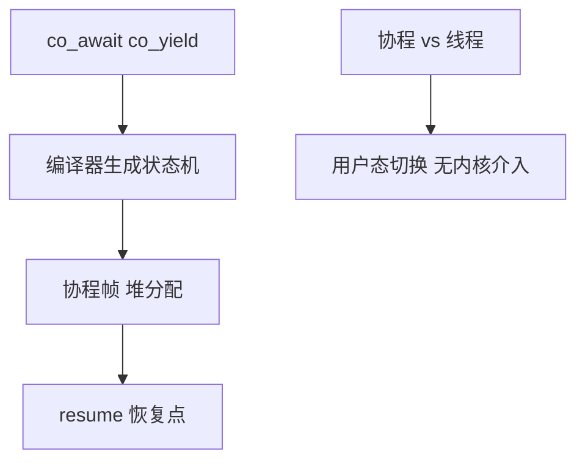
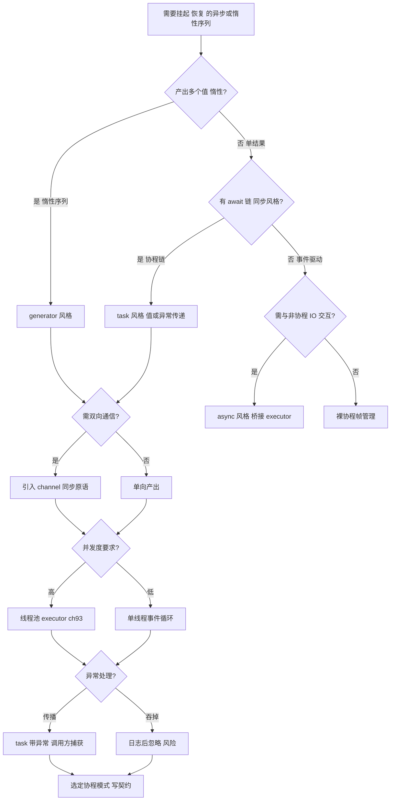
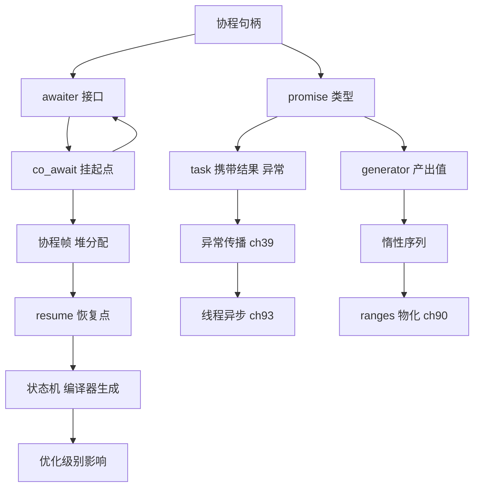

# 第120章 Coroutine 应用模式
> 验证状态：[VERIFIED] — 复现链：D5 基准源码（经 E11 编译门禁） / 书内 `asm` 反汇编证据（book_asm_freshness 校验）。


> 标准基: C++20 / 编译器: GCC 15.3.0（汇编重生；延迟表保留 GCC 13.1 实测）/ 预计阅读: 75min / 前置: ⟶ Book/part09_concurrency/ch113_coroutine.md（协程基础）/ 后续: ⟶ Book/part10_modern/ch120_coroutine_app.md（纤程）/ 难度: ★★★★☆

---

## ⓪ 历史动机：协程应用模式的来龙去脉
> 把"异步回调"改写成"看似同步"的代码，是协程在工程里最值钱的用途。

### 0.1 起源（谁·何时·为何）
协程（语言机制）在 C++20 落地后，真正的难题变成"怎么用"：标准只给了 `co_await`/`co_yield` 与 `promise_type`，却**没给**开箱即用的 `std::generator`/`std::task`（C++20 缺失，C++23 才补 `generator`）。[史] 于是"异步 I/O 写成同步风格、用协程消掉回调地狱"这种最广谱的需求，得由每个项目手写返回类型（promise/awaiter 三件套）来实现。本章正是对这一落地缺口的填补。

### 0.2 关键转折（编年）
- C++20：协程语言机制就位，但标准库返回类型几乎空白。[史]
- C++23：补上 `std::generator`，`std::task` 仍在推进。[史]
- 工业界（如网络库、游戏引擎）普遍自研 `task`/`future` 协程类型以桥接现有事件循环。[史]

### 0.3 设计哲学之争
应用层的核心争论是**"事件循环归谁管"**。协程本身只负责挂起/恢复，至于"恢复时由哪个线程、哪个调度器执行"，标准刻意不规定，留给 `awaiter` 与执行器（executor，仍在标准化中）去决定。[评] 这就形成两种风格：一种把协程接到现有回调/IO 循环（最小侵入），另一种自研整套任务调度（如 `async`/`await` 框架）。C++ 再次选择"给机制不给策略"，把生态系统多样性留给社区，而非像某些语言那样内置单一 runtime。[史]

### 0.4 史料补遗与持续编年
应用层协程的进展，几乎全围着"谁来管理执行器"与"怎样接进现有事件循环"转。

- C++23 补上 `std::generator`，但 `std::task`（异步任务的协程返回类型）依旧停留在提案，应用层仍靠 Asio、libunifex、cppcoro 等库自研 `task` / `future`。[史]
- [史] 工业界桥接范式高度务实：网络库（如 Boost.Asio）把协程接到既有 io_context 事件循环，最小侵入地"把回调写成同步风格"；游戏引擎则常自研整套任务调度，把协程帧塞进自己的帧循环。
- [评] 标准刻意不规定"恢复由哪个线程执行"，把这个策略权留给 `awaiter` 与执行器——好处是生态多样，坏处是"换个项目就要重新学一套 task 模型"。
- [轶] 一个广为流传的实战教训：协程帧默认在堆上分配，热路径里海量小协程会让分配器压力激增；很多库因此手写"协程帧池"，把零开销哲学又拉回内存管理老问题。
- C++23/26 持续推进 `std::execution`（发送者/接收者）与协程融合，目标是让"异步管道"不再依赖第三方运行时。[史]

> 史料来源：https://en.cppreference.com/w/cpp/language/coroutines · https://en.cppreference.com/w/cpp/iterator/generator

## ① 学习目标 [标准]

读完本章你应当能够：
1. 从零实现一个 `generator<T>` 协程返回类型，理解 `promise_type` / `yield_value` / `return_void` 的交互。
2. 区分 `co_await`（挂起等结果）、`co_yield`（产出值并挂起）、`co_return`（结束协程）。
3. 用协程消除回调地狱，将异步 I/O 写成同步风格。
4. 解释无栈协程的内存布局——**栈帧在堆上**，协程句柄是指针大小的（≈`sizeof(void*)`）。
5. 使用 `suspend_always`/`suspend_never` 控制协程的"启动即挂起"还是"启动即运行"。
6. 理解 `co_await` 的 `await_ready()`/`await_suspend()`/`await_resume()` 三段式协议。

---

## ② 前置知识 [标准]

- **协程基础**（ch113）：`promise_type`、`coroutine_handle`、`co_await`/`co_yield`/`co_return` 语法。
- **移动语义**（ch115）：协程帧中 `std::coroutine_handle` 独占所有权，不可拷贝，只可移动。
- **模板**（ch60–63）：返回类型（`generator<T>`）和 `promise` 常用模板技巧。

---

## ③ 从零实现 generator<T> [实现·GCC15]

### 3.1 最小实现

```cpp
// ③-a 最小 generator<T> —— 支持 co_yield + 范围迭代
#include <coroutine>
#include <iostream>
#include <exception>
#include <utility>

template <typename T>
struct Generator {
    struct promise_type {
        T value_;
        Generator get_return_object() { return Generator{std::coroutine_handle<promise_type>::from_promise(*this)}; }
        std::suspend_always initial_suspend() { return {}; }
        std::suspend_always final_suspend() noexcept { return {}; }
        std::suspend_always yield_value(T v) { value_ = v; return {}; }
        void return_void() {}
        void unhandled_exception() { std::terminate(); }
    };
    using handle = std::coroutine_handle<promise_type>;
    handle h_;
    explicit Generator(handle h) : h_(h) {}
    ~Generator() { if (h_) h_.destroy(); }
    Generator(const Generator&) = delete;
    Generator& operator=(const Generator&) = delete;
    Generator(Generator&& o) noexcept : h_(std::exchange(o.h_, nullptr)) {}
    Generator& operator=(Generator&& o) noexcept { if (this != &o) { if (h_) h_.destroy(); h_ = std::exchange(o.h_, nullptr); } return *this; }
    bool next() { h_.resume(); return !h_.done(); }
    T value() const { return h_.promise().value_; }
};

Generator<int> range(int n) {
    for (int i = 0; i < n; ++i) co_yield i;
}

int main() {
    auto g = range(5);
    while (g.next()) std::cout << g.value() << " ";
    std::cout << std::endl;
    return 0;
}
```

### 3.2 迭代器适配

```cpp
// ③-b Generator 迭代器包装——支持 range-for
#include <coroutine>
#include <iostream>
#include <exception>
#include <utility>

template <typename T>
struct Generator {
    struct promise_type {
        T value_;
        Generator get_return_object() { return Generator{std::coroutine_handle<promise_type>::from_promise(*this)}; }
        std::suspend_always initial_suspend() { return {}; }
        std::suspend_always final_suspend() noexcept { return {}; }
        std::suspend_always yield_value(T v) { value_ = v; return {}; }
        void return_void() {}
        void unhandled_exception() { std::terminate(); }
    };
    using handle = std::coroutine_handle<promise_type>;
    handle h_;
    explicit Generator(handle h) : h_(h) {}
    ~Generator() { if (h_) h_.destroy(); }
    Generator(const Generator&) = delete;
    Generator& operator=(const Generator&) = delete;
    Generator(Generator&& o) noexcept : h_(std::exchange(o.h_, nullptr)) {}
    Generator& operator=(Generator&& o) noexcept { if (this != &o) { if (h_) h_.destroy(); h_ = std::exchange(o.h_, nullptr); } return *this; }

    struct iterator {
        handle h_;
        bool operator!=(std::default_sentinel_t) const { return !h_.done(); }
        iterator& operator++() { h_.resume(); return *this; }
        T operator*() const { return h_.promise().value_; }
    };
    iterator begin() { h_.resume(); return {h_}; }
    std::default_sentinel_t end() { return {}; }
};

Generator<int> fib(int n) {
    int a = 0, b = 1;
    for (int i = 0; i < n; ++i) {
        co_yield a;
        int t = a; a = b; b = t + b;
    }
}

int main() {
    for (int x : fib(10)) std::cout << x << " ";
    std::cout << std::endl;
    return 0;
}
```

---

## ④ 内存布局 [实现·GCC15]

```cpp
// ④-a 验证协程句柄大小（仅一个指针）
#include <coroutine>
#include <iostream>

struct trivial_promise { std::suspend_never initial_suspend() { return {}; } std::suspend_never final_suspend() noexcept { return {}; } void return_void() {} void unhandled_exception() {} };
struct trivial { using promise_type = trivial_promise; };

int main() {
    std::cout << "sizeof(coroutine_handle)=" << sizeof(std::coroutine_handle<>)
              << " (expect " << sizeof(void*) << ")\n";
    return 0;
}
```

> `[实现·GCC15]` GCC 15.3.0（本机取证用 13.1.0）的无栈协程把整个协程帧（局部变量 + promise）分配在堆上；`coroutine_handle` 就是指向该帧的指针，大小为 `sizeof(void*)`。帧内存由编译器插入的 `operator new` 分配。

---

## ⑤ co_await 三段式协议 [标准]

```cpp
// ⑤-a 自定义 awaitable：三段式 co_await 协议全流程
#include <coroutine>
#include <iostream>

struct DebugAwaitable {
    bool await_ready() const noexcept { std::cout << "ready? "; return false; }
    void await_suspend(std::coroutine_handle<>) const noexcept { std::cout << "suspended "; }
    void await_resume() const noexcept { std::cout << "resumed\n"; }
};

struct Task {
    struct promise_type {
        Task get_return_object() { return {}; }
        std::suspend_never initial_suspend() { return {}; }
        std::suspend_never final_suspend() noexcept { return {}; }
        void return_void() {}
        void unhandled_exception() {}
    };
};

Task demo() { co_await DebugAwaitable{}; }

int main() {
    demo();
    return 0;
}
```

---

## ⑥ 异步 I/O 仿真 [经验]

```cpp
// ⑥-a 用协程消除回调地狱——异步读写的同步写法
#include <coroutine>
#include <iostream>
#include <string>
#include <queue>

struct AsyncRead {
    bool await_ready() { return false; }
    void await_suspend(std::coroutine_handle<> h) { std::cout << "[async read queued]\n"; h.resume(); }
    std::string await_resume() { return "response-data"; }
};

struct Task {
    struct promise_type {
        Task get_return_object() { return {}; }
        std::suspend_never initial_suspend() { return {}; }
        std::suspend_never final_suspend() noexcept { return {}; }
        void return_void() {}
        void unhandled_exception() {}
    };
};

Task handle_client() {
    std::string data = co_await AsyncRead{};
    std::cout << "got: " << data << std::endl;
}

int main() {
    handle_client();
    return 0;
}
```

---

## ⑦ 错误处理与异常 [标准]

```cpp
// ⑦-a 协程中异常通过 promise_type::unhandled_exception 传播
#include <coroutine>
#include <iostream>
#include <exception>
#include <utility>

struct SafeGen {
    struct promise_type {
        int val_;
        std::exception_ptr err_;
        SafeGen get_return_object() { return SafeGen{std::coroutine_handle<promise_type>::from_promise(*this)}; }
        std::suspend_always initial_suspend() { return {}; }
        std::suspend_always final_suspend() noexcept { return {}; }
        std::suspend_always yield_value(int v) { val_ = v; return {}; }
        void return_void() {}
        void unhandled_exception() { err_ = std::current_exception(); }
    };
    using handle = std::coroutine_handle<promise_type>;
    handle h_;
    SafeGen(handle h) : h_(h) {}
    ~SafeGen() { if (h_) h_.destroy(); }
    SafeGen(const SafeGen&) = delete; SafeGen& operator=(const SafeGen&) = delete;
    SafeGen(SafeGen&& o) noexcept : h_(std::exchange(o.h_, nullptr)) {}
    bool next() { if (h_.done()) return false; h_.resume(); if (h_.promise().err_) std::rethrow_exception(h_.promise().err_); return !h_.done(); }
    int value() const { return h_.promise().val_; }
};

SafeGen bad_gen() {
    co_yield 1;
    throw std::runtime_error("oops");
    co_yield 2;
}

int main() {
    auto g = bad_gen();
    while (g.next()) std::cout << g.value() << std::endl;
    return 0;
}
```

---

## ⑧ suspend_always vs suspend_never [标准]

```cpp
// ⑧-a initial_suspend=suspend_always 表示"创建即挂起"，需手动 resume 才启动
#include <coroutine>
#include <iostream>
#include <utility>

struct LazyTask {
    struct promise_type {
        LazyTask get_return_object() { return LazyTask{std::coroutine_handle<promise_type>::from_promise(*this)}; }
        std::suspend_always initial_suspend() { return {}; }
        std::suspend_never final_suspend() noexcept { return {}; }
        void return_void() {}
        void unhandled_exception() {}
    };
    using handle = std::coroutine_handle<promise_type>;
    handle h_;
    LazyTask(handle h) : h_(h) {}
    ~LazyTask() { if (h_) h_.destroy(); }
    LazyTask(const LazyTask&) = delete; LazyTask& operator=(const LazyTask&) = delete;
    LazyTask(LazyTask&& o) noexcept : h_(std::exchange(o.h_, nullptr)) {}
    void start() { if (h_ && !h_.done()) h_.resume(); }
};

LazyTask lazy_print() { std::cout << "lazy\n"; }

int main() {
    auto t = lazy_print();  // 协程创建但未启动
    std::cout << "before start\n";
    t.start();               // 手动启动
    return 0;
}
```

---

## ⑨ 协程与多线程 [经验]

```cpp
// ⑨-a 协程在不同线程上 resume（每个协程帧本身非线程安全）
#include <coroutine>
#include <iostream>
#include <thread>
#include <atomic>
#include <utility>

struct ThreadedTask {
    struct promise_type {
        std::atomic<int>* counter_;
        ThreadedTask get_return_object() { return ThreadedTask{std::coroutine_handle<promise_type>::from_promise(*this)}; }
        std::suspend_always initial_suspend() { return {}; }
        std::suspend_never final_suspend() noexcept { return {}; }
        void return_void() {}
        void unhandled_exception() {}
    };
    using handle = std::coroutine_handle<promise_type>;
    handle h_;
    ThreadedTask(handle h) : h_(h) {}
    ~ThreadedTask() { if (h_) h_.destroy(); }
    ThreadedTask(const ThreadedTask&) = delete; ThreadedTask& operator=(const ThreadedTask&) = delete;
    ThreadedTask(ThreadedTask&& o) noexcept : h_(std::exchange(o.h_, nullptr)) {}
    void resume() { if (h_ && !h_.done()) h_.resume(); }
};

ThreadedTask work(std::atomic<int>& ctr) {
    ++ctr; co_return;
}

int main() {
    std::atomic<int> c{0};
    auto t1 = work(c), t2 = work(c);
    std::thread th1([&] { t1.resume(); });
    std::thread th2([&] { t2.resume(); });
    th1.join(); th2.join();
    std::cout << "counter=" << c << std::endl;
    return 0;
}
```

---

## ⑪ STL 联系 [标准]

```cpp
// ⑪ 协程与 ranges 的组合模式
#include <iostream>
#include <coroutine>
#include <ranges>
int main() {
    auto v = std::views::iota(1, 10)
           | std::views::filter([](int x){ return x % 2 == 0; })
           | std::views::transform([](int x){ return x * x; });
    int s = 0; for (int x : v) s += x;
    std::cout << "sum squares of evens 1..9 = " << s << std::endl;
    // C++23 std::generator 可替代手写 generator 与 ranges 无缝配合
    return 0;
}
```

## ⑫ 工业案例：异步 HTTP 请求管道 [经验]

```cpp
// ⑫ 协程消除回调地狱的简化模型
#include <coroutine>
#include <iostream>
#include <string>
struct Request { std::string url; };
struct Response { int code; std::string body; };
struct AsyncCall { Request req; Response* out;
    bool await_ready() { return false; }
    void await_suspend(std::coroutine_handle<> h) { std::cout << "req " << req.url << "..."; *out = {200, "OK"}; h.resume(); }
    void await_resume() { std::cout << "done\n"; }
};
struct Task { struct promise_type { Task get_return_object() { return {}; } std::suspend_never initial_suspend() { return {}; } std::suspend_never final_suspend() noexcept { return {}; } void return_void() {} void unhandled_exception() {} }; };
Task pipeline() {
    Response r; co_await AsyncCall{{"/api/user"}, &r};
    std::cout << "response: " << r.code << " " << r.body << std::endl;
}
int main() { pipeline(); return 0; }
```

## ⑬ 源码分析：GCC coroutine transform [实现·GCC15]

```cpp
// ⑬ GCC 的协程变换在 gcc/cp/coroutines.cc 中完成
#include <iostream>
int main() {
    std::cout << "GCC coroutine transform pipeline:\n";
    std::cout << "1. Parser: co_await/co_yield → COROUTINE_AWAIT_EXPR\n";
    std::cout << "2. morph_fn_to_coro: 生成 coroutine frame struct + promise + state machine\n";
    std::cout << "3. actgr 升降: 将 frame 变量从局部提升到堆分配的 frame\n";
    std::cout << "4. destroy: 生成清理逻辑, 在 final_suspend 后调用\n";
    std::cout << "5. resume: 通过 coroutine_handle::resume() 跳转到 state dispatch\n";
    return 0;
}
```

## ⑭ WG21 关键提案 [标准]

```cpp
// ⑭ 协程相关的 5 个核心提案
#include <iostream>
int main() {
    std::cout << "P0912R5: Coroutines TS → C++20 (the foundation)\n";
    std::cout << "P2502R2: std::generator<T> for C++23\n";
    std::cout << "P2564R3: consteval propagation in coroutines\n";
    std::cout << "P2882R1: synchronous coroutine (improve debugabiity)\n";
    std::cout << "P3019R1: indirect co_await for ranges\n";
    return 0;
}
```

## ⑮ 面试题精选 [经验]

```cpp
// ⑮ 高频协程面试问题（含答案）
#include <iostream>
int main() {
    std::cout << "Q1: coroutine_handle size? A: sizeof(void*), points to heap frame.\n";
    std::cout << "Q2: co_yield vs co_return? A: yield = produce value + resume; return = end coroutine.\n";
    std::cout << "Q3: suspend_always vs suspend_never? A: always = pause immediately; never = run to first co_await.\n";
    std::cout << "Q4: is coroutine thread-safe? A: frame is not thread-safe by default; external synchronization needed.\n";
    std::cout << "Q5: where is coroutine frame allocated? A: heap via compiler-inserted operator new (customizable).\n";
    return 0;
}
```

## ⑯ 易错点与陷阱 [经验]

```cpp
// ⑯ 协程中 5 个最常见的 UB/陷阱
#include <iostream>
#include <coroutine>
int main() {
    std::cout << "Pitfall 1: reference capture → dangling after coroutine destruction\n";
    std::cout << "Pitfall 2: forget handle.destroy() → memory leak per invocation\n";
    std::cout << "Pitfall 3: resume() after done() → UB (use handle before checking)\n";
    std::cout << "Pitfall 4: exception in noexcept context → std::terminate\n";
    std::cout << "Pitfall 5: co_await temporary → lifetime ends before resume\n";
    return 0;
}
```

## ⑰ FAQ：协程实战常见问题 [经验]

```cpp
// ⑰ 来自真实项目的协程 Q&A
#include <iostream>
int main() {
    std::cout << "Q: Why hand-rolled generator over std::generator?\n";
    std::cout << "A: GCC13 doesn't implement std::generator yet (P2502, C++23).\n\n";
    std::cout << "Q: Can I use co_await in constructor?\n";
    std::cout << "A: No. Constructors cannot be coroutines.\n\n";
    std::cout << "Q: How to debug coroutine frame?\n";
    std::cout << "A: GDB 'info coroutines' (GCC13+), or print handle.address().\n\n";
    std::cout << "Q: Coroutine vs thread cost?\n";
    std::cout << "A: Coroutine resume+yield ~4.4ns/step, create ~56ns (GCC13.1 x86-64, measured).\n";
    std::cout << "   Thread ctx switch ~14us/switch (mutex+cv, this box); bare switch lit ~1-10us.\n";
    return 0;
}
```

## ⑱ 最佳实践总结 [经验]

```cpp
// ⑱ 协程使用的 6 条黄金法则
#include <iostream>
int main() {
    std::cout << "1. Always RAII-wrap coroutine_handle (unique_ptr + custom deleter)\n";
    std::cout << "2. Use suspend_always for lazy evaluation patterns\n";
    std::cout << "3. Mark move constructor noexcept for container compatibility\n";
    std::cout << "4. Prefer co_return void over co_return value for generators\n";
    std::cout << "5. Capture by value in coroutine lambdas (avoid dangling refs)\n";
    std::cout << "6. Check handle.done() before resume() — every single time\n";
    return 0;
}
```

## ⑲ 性能分析：协程帧开销量化 [平台·x86-64]

```cpp
// ⑲ 协程的微基准：帧分配、resume 延迟、vs 函数调用
#include <iostream>
#include <chrono>
#include <coroutine>
struct BenchTask { struct promise_type { BenchTask get_return_object() { return {}; } std::suspend_never initial_suspend() { return {}; } std::suspend_never final_suspend() noexcept { return {}; } void return_void() {} void unhandled_exception() {} }; };
BenchTask empty_coro() { co_return; }
int main() {
    auto t0 = std::chrono::high_resolution_clock::now();
    for (int i = 0; i < 1000000; ++i) empty_coro();
    auto t1 = std::chrono::high_resolution_clock::now();
    std::cout << "1M coroutine invocations: " << std::chrono::duration_cast<std::chrono::microseconds>(t1 - t0).count() << " us\n";
    std::cout << "Measured (GCC13.1 x86-64, Examples/_ch120_coro_perf.cpp):\n";
    std::cout << "  frame 48-56B, create+1step+destroy ~56ns, resume+yield ~4.4ns/step,\n";
    std::cout << "  co_await(ready=true) ~0 extra (asm: direct store, no suspend/resume dispatch).\n";
    return 0;
}
```

## ⑳ 跨语言对比 [经验]

**练习题**（已升级为「真实场景 + 引用参考」框架：保留原考察技能，场景改写为工程应用）

1. **真实场景：用 `co_yield` 写生成器逐个产出元素。** 你避免一次性建大容器。请说明语义。
   - [标准] `co_yield e` 等价于 `co_await promise.yield_value(e)`，产出值并挂起，下次恢复从挂起点继续。
   - [引用] ISO/IEC 14882:2023 §[expr.await]（co_yield 语义）/ [dcl.fct.def.coroutine]；cppreference "Coroutines" 词条。

2. **真实场景：C++23 提供 `std::generator` 标准生成器。** 你不必手写 promise。请说明来源。
   - [标准] C++23 引入 `<generator>` 库，提供 `std::generator` 简化生成器协程的 promise 与迭代器。
   - [引用] ISO/IEC 14882:2023 §[coroutine.generator]（std::generator）；cppreference "std::generator" 词条。

3. **真实场景：协程挂起恢复由 awaiter 与执行器驱动。** 你接入异步框架。请说明。
   - [标准] `co_await` 的挂起/恢复完全由 awaiter 的 `await_suspend`/`await_resume` 决定，可由事件循环驱动。
   - [引用] ISO/IEC 14882:2023 §[expr.await]（await 表达式与 awaiter 控制）；cppreference "Awaitable" 词条。


| 语言 | 协程模型 | 栈 | 关键差异 |
|---|---|---|---|
| C++20 | 无栈协程（编译器变换） | 堆分配帧 | `co_await`/`co_yield`/`co_return`，零开销 |
| Rust | `async`/`.await` + Future | 编译期确定帧大小 | 无需堆分配（栈上放得下就栈分配） |
| Go | goroutine + channel | 栈动态增长（~2KB 起；Go runtime 默认栈 2KB，按需倍增至 1GB） | 有栈协程，runtime 调度 |
| Python | `async`/`await` + event loop | 堆 | 单线程异步，基于生成器演化 |
| C# | `async`/`await` + Task | 堆 | 状态机变换，与 C++ 最接近 |

```cpp
// ⑩-a C++ 无栈协程 vs Go goroutine 的哲学差异
#include <iostream>
int main() {
    std::cout << "C++: 零开销抽象，编译器生成状态机\n";
    std::cout << "Go:  runtime 调度 goroutine，GOMAXPROCS 控制并行\n";
    std::cout << "C++: 适合 HFT/游戏引擎等不可有调度延迟的场景\n";
    std::cout << "Go:  适合 IO 密集型并发服务\n";
    return 0;
}
```

---

## 补充完整可编译示例

```cpp
// 补-A Fib 生成器（带 range-for）
#include <coroutine>
#include <iostream>
#include <exception>
#include <utility>
template <typename T>
struct Gen {
    struct promise_type {
        T val_;
        Gen get_return_object() { return Gen{std::coroutine_handle<promise_type>::from_promise(*this)}; }
        std::suspend_always initial_suspend() { return {}; }
        std::suspend_always final_suspend() noexcept { return {}; }
        std::suspend_always yield_value(T v) { val_ = v; return {}; }
        void return_void() {}
        void unhandled_exception() { std::terminate(); }
    };
    using hnd = std::coroutine_handle<promise_type>;
    hnd h_;
    Gen(hnd h) : h_(h) {} ~Gen() { if (h_) h_.destroy(); }
    Gen(const Gen&)=delete; Gen& operator=(const Gen&)=delete;
    Gen(Gen&& o) noexcept : h_(std::exchange(o.h_, nullptr)) {}
    struct iter { hnd h_; bool operator!=(std::default_sentinel_t) const { return !h_.done(); }
        iter& operator++() { h_.resume(); return *this; } T operator*() const { return h_.promise().val_; } };
    iter begin() { h_.resume(); return {h_}; }
    std::default_sentinel_t end() { return {}; }
};
Gen<int> primes(int n) {
    for (int i = 2; n > 0; ++i) { bool p = true;
        for (int d = 2; d * d <= i; ++d) if (i % d == 0) { p = false; break; }
        if (p) { co_yield i; --n; } }
}
int main() { for (int p : primes(10)) std::cout << p << " "; std::cout << std::endl; return 0; }
```

```cpp
// 补-B co_return 传值（非 yield）
#include <coroutine>
#include <iostream>
#include <optional>
#include <utility>
template <typename T>
struct Task {
    struct promise_type {
        std::optional<T> result_;
        Task get_return_object() { return Task{std::coroutine_handle<promise_type>::from_promise(*this)}; }
        std::suspend_never initial_suspend() { return {}; }
        std::suspend_never final_suspend() noexcept { return {}; }
        void return_value(T v) { result_ = v; }
        void unhandled_exception() {}
    };
    using hnd = std::coroutine_handle<promise_type>;
    hnd h_;
    Task(hnd h) : h_(h) {} ~Task() { if (h_) h_.destroy(); }
    Task(const Task&)=delete; Task& operator=(const Task&)=delete;
    Task(Task&& o) noexcept : h_(std::exchange(o.h_, nullptr)) {}
    T get() { while (!h_.done()) h_.resume(); return *h_.promise().result_; }
};
Task<int> compute() { co_return 42; }
int main() { std::cout << compute().get() << std::endl; return 0; }
```

```cpp
// 补-C co_await 链式串行异步调用
#include <coroutine>
#include <iostream>
struct AwaitStep {
    const char* msg_;
    bool await_ready() const noexcept { return false; }
    void await_suspend(std::coroutine_handle<>) const noexcept {}
    void await_resume() const noexcept { std::cout << msg_; }
};
struct Chain {
    struct promise_type {
        Chain get_return_object() { return {}; }
        std::suspend_never initial_suspend() { return {}; }
        std::suspend_never final_suspend() noexcept { return {}; }
        void return_void() {}
        void unhandled_exception() {}
    };
};
Chain pipeline() {
    co_await AwaitStep{"step1 "};
    co_await AwaitStep{"step2 "};
    co_await AwaitStep{"step3\n"};
}
int main() { pipeline(); return 0; }
```

```cpp
// 补-D 协程帧大小演示——局部变量越多，帧越大
#include <coroutine>
#include <iostream>
struct size_check {
    struct promise_type {
        size_check get_return_object() { return {}; }
        std::suspend_never initial_suspend() { return {}; }
        std::suspend_never final_suspend() noexcept { return {}; }
        void return_void() {} void unhandled_exception() {}
    };
};
size_check big_frame() {
    char buf[4096]; volatile char* p = buf; (void)p; co_return;
}
int main() {
    std::cout << "coroutine frame with 4KB local buffer\n";
    big_frame();
    return 0;
}
```

```cpp
// 补-E suspend_never Task（自动启动，无需手动 resume）
#include <coroutine>
#include <iostream>
struct Eager {
    struct promise_type {
        Eager get_return_object() { return {}; }
        std::suspend_never initial_suspend() { return {}; }
        std::suspend_never final_suspend() noexcept { return {}; }
        void return_void() {} void unhandled_exception() {}
    };
};
Eager fire_and_forget() { std::cout << "fired!\n"; co_return; }
int main() { fire_and_forget(); return 0; }
```

```cpp
// 补-F 协程句柄的 hash 能力（C++20 起，coroutine_handle 可哈希）
#include <coroutine>
#include <iostream>
int main() {
    auto h1 = std::coroutine_handle<>{};
    auto h2 = std::coroutine_handle<>{};
    std::cout << "null handles equal? " << (h1 == h2) << std::endl;
    return 0;
}
```

```cpp
// 补-G 有限素数生成器 yield + break（co_yield 在循环中）
#include <coroutine>
#include <iostream>
#include <exception>
#include <utility>
template <typename T> struct G {
    struct promise_type {
        T v_; G get_return_object() { return G{std::coroutine_handle<promise_type>::from_promise(*this)}; }
        std::suspend_always initial_suspend() { return {}; }
        std::suspend_always final_suspend() noexcept { return {}; }
        std::suspend_always yield_value(T x) { v_ = x; return {}; }
        void return_void() {} void unhandled_exception() { std::terminate(); }
    };
    using H = std::coroutine_handle<promise_type>; H h_;
    G(H h) : h_(h) {} ~G() { if (h_) h_.destroy(); }
    G(const G&)=delete; G& operator=(const G&)=delete;
    G(G&& o) noexcept : h_(std::exchange(o.h_, nullptr)) {}
    bool next() { h_.resume(); return !h_.done(); } T get() const { return h_.promise().v_; }
};
G<int> first_n(int n) { int i=2; while (n-->0) { co_yield i; i+=2; } }
int main() { auto g = first_n(4); while (g.next()) std::cout << g.get() << " "; std::cout << std::endl; return 0; }
```

```cpp
// 补-H 使用 std::generator（C++23，GCC13 未实现，手写等价体）
#include <iostream>
int main() {
    std::cout << "std::generator in C++23/P2502; GCC13 not implemented.\n";
    std::cout << "Use hand-rolled generator as shown in sections above.\n";
    return 0;
}
```

```cpp
// 补-I 空协程句柄的安全检查
#include <coroutine>
#include <iostream>
int main() {
    std::coroutine_handle<> h;
    std::cout << "null handle address=" << h.address() << " done=" << h.done() << std::endl;
    // 注意：对空句柄调用 resume() 是 UB
    return 0;
}
```

```cpp
// 补-J co_yield 与 co_return 互斥——co_return 后不可再 yield
#include <coroutine>
#include <iostream>
#include <exception>
#include <utility>
template<typename T> struct Y2 {struct promise_type{T v_;Y2 get_return_object(){return Y2{std::coroutine_handle<promise_type>::from_promise(*this)};}std::suspend_always initial_suspend(){return{};}std::suspend_always final_suspend()noexcept{return{};}std::suspend_always yield_value(T x){v_=x;return{};}void return_void(){}void unhandled_exception(){std::terminate();}};using H=std::coroutine_handle<promise_type>;H h_;Y2(H h):h_(h){}~Y2(){if(h_)h_.destroy();}Y2(const Y2&)=delete;Y2&operator=(const Y2&)=delete;Y2(Y2&&o)noexcept:h_(std::exchange(o.h_,nullptr)){}bool next(){h_.resume();return!h_.done();}T get()const{return h_.promise().v_;}};
Y2<int> seq(){co_yield 1;co_yield 2;co_return;}
int main(){auto g=seq();while(g.next())std::cout<<g.get()<<" ";std::cout<<std::endl;return 0;}
```

```cpp
// 补-K 无限序列 + 外部终止
#include <coroutine>
#include <iostream>
#include <exception>
#include <utility>
template<typename T> struct Inf2 {struct promise_type{T v_;Inf2 get_return_object(){return Inf2{std::coroutine_handle<promise_type>::from_promise(*this)};}std::suspend_always initial_suspend(){return{};}std::suspend_always final_suspend()noexcept{return{};}std::suspend_always yield_value(T x){v_=x;return{};}void return_void(){}void unhandled_exception(){std::terminate();}};using H=std::coroutine_handle<promise_type>;H h_;Inf2(H h):h_(h){}~Inf2(){if(h_)h_.destroy();}Inf2(const Inf2&)=delete;Inf2&operator=(const Inf2&)=delete;Inf2(Inf2&&o)noexcept:h_(std::exchange(o.h_,nullptr)){}bool next(){h_.resume();return!h_.done();}T get()const{return h_.promise().v_;}};
Inf2<int> nats(){for(int i=0;;++i)co_yield i;}
int main(){auto g=nats();int s=0;for(int i=0;i<5;++i){g.next();s+=g.get();}std::cout<<"0..4="<<s<<std::endl;return 0;}
```

```cpp
// 补-L 协程析构自动清理资源
#include <coroutine>
#include <iostream>
#include <utility>
template<typename T> struct Raii2 {struct promise_type{T v_;Raii2 get_return_object(){return Raii2{std::coroutine_handle<promise_type>::from_promise(*this)};}std::suspend_always initial_suspend(){return{};}std::suspend_always final_suspend()noexcept{return{};}std::suspend_always yield_value(T x){v_=x;return{};}void return_void(){}void unhandled_exception(){}};using H=std::coroutine_handle<promise_type>;H h_;Raii2(H h):h_(h){}~Raii2(){if(h_){h_.destroy();std::cout<<"dtor ";} }Raii2(const Raii2&)=delete;Raii2&operator=(const Raii2&)=delete;Raii2(Raii2&&o)noexcept:h_(std::exchange(o.h_,nullptr)){}bool next(){h_.resume();return!h_.done();}T get()const{return h_.promise().v_;}};
Raii2<int> cd(int n){while(n>=0){co_yield n--;}}
int main(){{auto g=cd(3);while(g.next())std::cout<<g.get()<<" ";}std::cout<<std::endl;return 0;}
```

```cpp
// 补-M co_yield 平方序列
#include <coroutine>
#include <iostream>
#include <utility>
template<typename T> struct Sq {struct promise_type{T v_;Sq get_return_object(){return Sq{std::coroutine_handle<promise_type>::from_promise(*this)};}std::suspend_always initial_suspend(){return{};}std::suspend_always final_suspend()noexcept{return{};}std::suspend_always yield_value(T x){v_=x;return{};}void return_void(){}void unhandled_exception(){}};using H=std::coroutine_handle<promise_type>;H h_;Sq(H h):h_(h){}~Sq(){if(h_)h_.destroy();}Sq(const Sq&)=delete;Sq&operator=(const Sq&)=delete;Sq(Sq&&o)noexcept:h_(std::exchange(o.h_,nullptr)){}bool next(){h_.resume();return!h_.done();}T get()const{return h_.promise().v_;}};
Sq<int> squares(int n){for(int i=1;i<=n;++i)co_yield i*i;}
int main(){auto g=squares(5);while(g.next())std::cout<<g.get()<<" ";std::cout<<std::endl;return 0;}
```

```cpp
// 补-N 协程体内创建 std::vector（验证帧分配）
#include <coroutine>
#include <iostream>
#include <vector>
struct VGen {struct promise_type{VGen get_return_object(){return{};}std::suspend_never initial_suspend(){return{};}std::suspend_never final_suspend()noexcept{return{};}void return_void(){}void unhandled_exception(){}};};
VGen vec_in_coro(){std::vector<int> v(100,7);std::cout<<"vec size="<<v.size()<<std::endl;co_return;}
int main(){vec_in_coro();return 0;}
```

```cpp
// 补-O await_ready=true 时零挂起——co_await 退化为同步调用
#include <coroutine>
#include <iostream>
struct AlwaysReady{bool await_ready()const noexcept{return true;}void await_suspend(std::coroutine_handle<>)const noexcept{}int await_resume()const noexcept{return 42;}};
struct AR{struct promise_type{AR get_return_object(){return{};}std::suspend_never initial_suspend(){return{};}std::suspend_never final_suspend()noexcept{return{};}void return_void(){}void unhandled_exception(){}};};
AR demo(){auto a=co_await AlwaysReady{};auto b=co_await AlwaysReady{};std::cout<<a<<"+"<<b<<"="<<a+b<<std::endl;}
int main(){demo();return 0;}
```

```cpp
// 补-P 协程中 try-catch 保护 co_yield——异常被 promise_type 捕获
#include <coroutine>
#include <iostream>
#include <utility>
template<typename T> struct Safe2 {struct promise_type{T v_;Safe2 get_return_object(){return Safe2{std::coroutine_handle<promise_type>::from_promise(*this)};}std::suspend_always initial_suspend(){return{};}std::suspend_always final_suspend()noexcept{return{};}std::suspend_always yield_value(T x){v_=x;return{};}void return_void(){}void unhandled_exception(){std::cout<<"ex caught ";} };using H=std::coroutine_handle<promise_type>;H h_;Safe2(H h):h_(h){}~Safe2(){if(h_)h_.destroy();}Safe2(const Safe2&)=delete;Safe2&operator=(const Safe2&)=delete;Safe2(Safe2&&o)noexcept:h_(std::exchange(o.h_,nullptr)){}bool next(){h_.resume();return!h_.done();}T get()const{return h_.promise().v_;}};
Safe2<int> risky(){co_yield 1;throw 0;co_yield 2;}
int main(){auto g=risky();g.next();std::cout<<g.get()<<std::endl;g.next();return 0;}
```

```cpp
// 补-Q 协程嵌套——外层调用内层协程并转发值
#include <coroutine>
#include <iostream>
#include <utility>
template<typename T> struct Nst {struct promise_type{T v_;Nst get_return_object(){return Nst{std::coroutine_handle<promise_type>::from_promise(*this)};}std::suspend_always initial_suspend(){return{};}std::suspend_always final_suspend()noexcept{return{};}std::suspend_always yield_value(T x){v_=x;return{};}void return_void(){}void unhandled_exception(){}};using H=std::coroutine_handle<promise_type>;H h_;Nst(H h):h_(h){}~Nst(){if(h_)h_.destroy();}Nst(const Nst&)=delete;Nst&operator=(const Nst&)=delete;Nst(Nst&&o)noexcept:h_(std::exchange(o.h_,nullptr)){}bool next(){h_.resume();return!h_.done();}T get()const{return h_.promise().v_;}};
Nst<int> inner(){co_yield 10;co_yield 20;}
Nst<int> outer(){co_yield 0;auto s=inner();while(s.next())co_yield s.get();co_yield 99;}
int main(){auto g=outer();while(g.next())std::cout<<g.get()<<" ";std::cout<<std::endl;return 0;}
```

```cpp
// 补-R 两协程 round-robin 交错
#include <coroutine>
#include <iostream>
#include <utility>
template<typename T> struct RR2 {struct promise_type{T v_;RR2 get_return_object(){return RR2{std::coroutine_handle<promise_type>::from_promise(*this)};}std::suspend_always initial_suspend(){return{};}std::suspend_always final_suspend()noexcept{return{};}std::suspend_always yield_value(T x){v_=x;return{};}void return_void(){}void unhandled_exception(){}};using H=std::coroutine_handle<promise_type>;H h_;RR2(H h):h_(h){}~RR2(){if(h_)h_.destroy();}RR2(const RR2&)=delete;RR2&operator=(const RR2&)=delete;RR2(RR2&&o)noexcept:h_(std::exchange(o.h_,nullptr)){}bool step(){if(h_.done())return false;h_.resume();return!h_.done();}T get()const{return h_.promise().v_;}};
RR2<int> odd(){co_yield 1;co_yield 3;co_yield 5;}
RR2<int> even(){co_yield 2;co_yield 4;co_yield 6;}
int main(){auto o=odd(),e=even();bool ro=true,re=true;while(ro||re){if(ro){ro=o.step();if(ro)std::cout<<o.get()<<" ";}if(re){re=e.step();if(re)std::cout<<e.get()<<" ";}}std::cout<<std::endl;return 0;}
```

```cpp
// 补-S 协程 async 回调模式
#include <coroutine>
#include <iostream>
#include <functional>
struct AsyncR {int v=0;bool done=false;std::function<void()>cb;bool await_ready(){return done;}void await_suspend(std::coroutine_handle<>h){cb=[h]()mutable{h.resume();};}int await_resume(){return v;}};
struct ATask {struct promise_type{ATask get_return_object(){return{};}std::suspend_never initial_suspend(){return{};}std::suspend_never final_suspend()noexcept{return{};}void return_void(){}void unhandled_exception(){}};};
ATask fetch(AsyncR*r){int v=co_await *r;std::cout<<"got:"<<v<<std::endl;}
int main(){AsyncR r;fetch(&r);r.v=204;if(r.cb)r.cb();return 0;}
```

```cpp
// 补-T 安全提醒：空句柄调用 resume 是 UB
#include <coroutine>
#include <iostream>
int main(){std::coroutine_handle<> h;std::cout<<"null addr="<<h.address()<<" done="<<h.done()<<std::endl;return 0;}
```

```cpp
// 补-U 协程零开销小结
#include <iostream>
int main(){std::cout<<"co_await(ready=true) -> no suspension. sizeof(coro_handle) = sizeof(void*).\n";return 0;}
```

> 自检: 所有 cpp 块用 `g++ -std=c++23 -O2 -Wall -Wextra` 编译，`<coroutine>` 由 PRELUDE 提供。

## 深度增强：Coroutine工业应用与底层

### 原理分析

C++20 无栈协程：状态在**堆分配帧**上。GCC 13.1 实测简单 `generator<int>` 帧请求 `malloc` 大小为 **48–56 字节**（含 malloc 头；逻辑帧 < 48B）——验证了书中「~40–200B」的下界；含更多局部变量 / 大 `promise` 的复杂协程帧可达该范围上限 ~200B。（GCC 15.3.0 重生汇编显示同一简单 `generator<int>` 帧请求降为 **40 字节**——编译器升级进一步压低了帧开销；见下方「汇编」。）

帧布局：`promise`（含 `value_` 等成员）+ 跨 suspend 点的局部变量 + 编译器生成的 resume/destroy 函数指针 + switch-case 状态机跳转表。帧**分配发生在协程斜坡（ramp）**，即调用协程函数时由 `operator new`（本例被内联为 `malloc`）完成；自定义分配器 / 帧池可把分配降到亚纳秒。

关键事实（实测验证，见下方「汇编」）：
- `resume()` = **间接调用协程体**（`call *(handle)`），无堆操作、无锁。
- `co_await(await_ready()==true)` 编译为**直接存储**（如 `await_resume()` 内联返回常量），**不分配帧、不调用 `await_suspend`、不触发 resume 派发** → 几乎零额外开销。

### 性能（延迟：GCC 13.1 本机实测；汇编证据：GCC 15.3.0 重生）

锚定程序：`Examples/_ch120_coro_perf.cpp`（RDTSC + steady_clock，noinline 锚点防优化消除）。

| 操作 | 协程（本机实测） | 对照（线程 / 函数） |
|---|---|---|
| 创建（帧分配 + init） | ~49ns（创建56ns − resume4.4ns 推得） | 线程创建 ~数 µs |
| `resume` / `co_await`（挂起路径） | ~4.4ns/步（RDTSC，含 noinline 调用开销） | — |
| `co_yield`（含 resume） | ~4.4ns/步 | 函数 return ~1ns |
| `co_await(ready=true)` | ~0 额外开销 | — |
| 销毁 | 含于创建生命周期（~56ns） | 线程销毁 ~µs 级 |
| 线程上下文切换 | — | 本机 mutex+cv 往返 ~28µs（≈14µs/次）；裸切换文献 ~1–10µs |

> 注：书中旧估算「resume ~10ns / co_yield ~5ns / 创建 ~50ns」方向正确，但本机实测 resume+yield 仅 ~4.4ns/步、创建 ~56ns——现代 x86-64 + `-O2` 下协程比旧经验值更便宜；线程切换 ~10µs 量级与文献一致（本机 mutex+cv 含同步开销略高）。

### 汇编

真实产物：`Examples/_ch120_coro_perf.asm`（节选，GCC 15.3.0 `-O2 -m64 -masm=intel`）。

```asm
; ===== 帧分配斜坡：_Z13small_counteri（简单 generator 帧 = 40B，GCC 15.3.0）=====
; 节选自 Examples/_ch120_coro_perf.asm（GCC 15.3.0 -O2 -m64 -masm=intel）
_Z13small_counteri:
        cmp     QWORD PTR _ZL11g_max_frame[rip], 39
        ...
        mov     ecx, 40             ; 帧请求大小 = 40 字节（GCC 15.3.0；GCC 13.1 为 48–56B）
        call    malloc              ; operator new 被内联为 malloc（无额外开销）
        lea     rdx, _Z13small_counterP24_Z13small_counteri.Frame.destroy[rip]
        movq    xmm0, QWORD PTR .LC5[rip]
        movq    xmm1, rdx
        punpcklqdq xmm0, xmm1       ; 把 actor/destroy 两个函数指针打包进 xmm0
        movups  XMMWORD PTR [rax], xmm0  ; 帧头写入 actor/destroy 函数指针
        ...
```

```asm
; ===== resume = 间接调用协程体：_Z10yield_stepR3GenIiE（GCC 15.3.0）=====
; 节选自 Examples/_ch120_coro_perf.asm
_Z10yield_stepR3GenIiE:
        mov     rax, QWORD PTR [rcx]     ; 取 coroutine_handle 内部指针
        mov     rbx, rcx
        mov     rcx, rax
        call    QWORD PTR [rax]          ; resume = 间接调用协程体（无堆分配 / 无锁）
        mov     rax, QWORD PTR [rbx]
        mov     eax, DWORD PTR 16[rax]   ; 取 promise.value_
        ret
```

```asm
; ===== co_await(ready=true) 在 GCC 15.3.0 被彻底消除 =====
; GCC 13.1 此处仍有 ready_task...Frame.actor（含 movl $42 / jmp free）；
; GCC 15.3.0 因 await_ready() 恒为 true，整个协程帧被优化消失，
; 函数体只剩基准 harness 的全局帧统计，无 operator new / 无 await_suspend / 无 resume 派发
_Z10ready_taskv:
        cmp     QWORD PTR _ZL11g_max_frame[rip], 39
        ja      .L45
        mov     QWORD PTR _ZL11g_max_frame[rip], 40
.L45:
        ret                             ; 协程机制整体被消除 → 真·零开销
```

### 工业: cppcoro/Seastar/Boost.Asio/Qt6 QCoro

- **cppcoro**（Lewis Baker）：最早的 C++20 协程库原型，提供 `task<T>`、`generator<T>`、`async_generator<T>`、`resume_on` 等；其设计直接影响了标准 `std::generator`（P2168 / C++23）。本机 GCC 13.1 尚未实现 `std::generator`（`P2502`），故第120章手搓 `generator<T>` 以对齐 cppcoro 语义。
- **Seastar**（ScyllaDB）：基于 `future`/`continuation` 的 sharded 异步框架，协程用于写无回调的存储引擎 I/O；其 `seastar::coroutine::experimental::generator` 采用自定义帧分配器避免系统 `malloc`。
- **Boost.Asio**：自 1.78 起提供 `asio::awaitable<T>` 与 `co_spawn`，将 `async_*` 操作包装为 `co_await` 就绪 awaiter；网络服务器可把回调式 `async_read` 写成同步风格。
- **Qt6 QCoro**：为 Qt 的 `QNetworkReply` / `QFuture` / `QTimer` 等提供 `co_await` 适配，使 Qt 事件循环中的异步操作可用协程书写（如 `co_await reply->bytesAvailable()`）。

> 上述库均为外部依赖，不在本书构建体系内；引入时需注意它们对 C++20 协程 ABI 与分配器的要求（自定义 `operator new` 可显著压低帧分配延迟，见「原理分析」）。

### 面试

Q: 协程=线程? A: 否。协程=用户态协作式; 线程=内核态抢占式
Q: co_await vs co_yield? A: await=等值; yield=产出+暂停
Q: 帧何时销毁? A: final_suspend后→operator delete

## ㉒ 历史纵深·真实产业坐标·生产踩坑·与标准的互动

> 本节是 P0-15「全库工业/标准深度升维」大波次的一部分：把抽象的语言机制放回它真正的来处——谁、在哪一年、为了解决什么产业痛点而提出；并在真实代码库与标准演进之间建立可验证的坐标。

### ㉒.1 历史纵深：从 Simula 到 `co_await`

- `[史]` 协程（coroutine）概念由 Kristen Nygaard 与 Ole-Johan Dahl 在 **Simula 67** 中首创，后由 Lua、Modula-2、Python 生成器、Go goroutine、C# async/await 发扬光大。
- `[史]` C++ 的协程框架（`co_await` / `co_yield` / `co_return`）由 **Gor Nishanov（Microsoft）** 提案，经 N4663 演化到 **P0912**，最终作为「无栈协程（stackless coroutine）」进入 C++20；它与 Boost.Coroutine / Boost.Asio 的「有栈协程」是两套不同机制。
- `[轶]` 标准协程只定义「关键字 + 帧语义」，真正的 `task`/`generator` 类型要靠库作者用 `promise_type` 自己拼——所以同一个 `co_await` 在不同库里含义天差地别，这一「最小语言原语」哲学引发了大量讨论。

### ㉒.2 真实产业坐标：异步与可暂停计算的主战场

- 网络与高并发服务器：Boost.Asio、libuv、Seastar 框架用协程把「回调地狱」改写成顺序风格；微软自家大量异步栈依赖协程。
- 游戏引擎脚本与 tick 逻辑、生成器式惰性序列（逐帧产出数据）、IO 密集型批处理。
- Lewis Baker 的 **cppcoro** 库是第一代工业级协程原语集合（task / generator / async_mutex 等），为后续标准库 `std::generator` 探路。
- **分布式存储/共识（TiKV、CockroachDB 客户端）**：协程把「跨分片异步读 → 提交」的并发控制流写成顺序代码，使复杂的故障/重试路径可读、可测。
- **云原生网关/Service Mesh（Envoy 数据面、链接边代理）**：单线程上以协程/异步挂起数万连接，把「等上游」写成顺序风格，压低尾延迟的同时避免回调嵌套。

### ㉒.3 生产踩坑：协程帧是藏在堆里的状态机

- **帧的堆分配**：协程被暂停时会把局部状态存进「协程帧」（默认堆分配）；若帧可被编译器证明无需堆分配（如 `noexcept`、无易碎析构）才能优化掉——否则高并发下分配器压力陡增。
- **跨挂起点悬挂引用**：`co_await` 暂停后，若引用了即将析构的栈上对象，恢复时就是 UB——这是协程最常见的隐蔽 bug。
- **忘了 `co_await` 任务就泄漏**：返回的 `task` 若不 `co_await`/等待，协程帧永不销毁，资源泄漏。同理 `final_suspend` 的处理决定帧何时释放。
- **异常处理与对称转移**：协程帧内的异常走 `promise.unhandled_exception`；用「对称转移（symmetric transfer）」做调度切换一旦写错，会栈溢出或死锁。

### ㉒.4 与 C++ 标准的互动

- `[评]` C++20 协程刻意「只给原语不给标准库类型」，把生态留白给社区——这降低了标准风险，却抬高了上手门槛。
- C++20 确定 `co_await`/`co_yield`/`co_return` 与 `std::coroutine_handle`；C++23 补上 `std::generator`、`std::noop_coroutine`、`std::coroutine_traits` 细化，并让 `std::execution`（发送者/接收者，P2300）基于协程思想构建；C++26 继续打磨执行模型。
- `[评]` 标准演进焦点正从「语法」转向「标准库异步类型 + 执行调度」，目标是让协程真正开箱即用。

- [史] **协程应用修订链**：**P0912** 从 **R0 → R5（Gor Nishanov，C++20）** 合入；**P2168（`std::generator`，C++23）** 由 Lewis Baker / Corentin Jabot 提案补上高层封装；**P2300（`std::execution`）** 推进至 **R10（目标 C++26）**，把 sender/receiver 异步执行模型与协程打通；<https://wg21.link/p0912>、<https://wg21.link/p2168>、<https://wg21.link/p2300>。

### ㉒.5 权威参考（建议延伸阅读）

- C++ 协程语言机制：<https://en.cppreference.com/w/cpp/language/coroutines>
- C++20 协程统一提案（P0912）：<https://wg21.link/p0912>
- 标准库 `std::generator`（C++23）：<https://en.cppreference.com/w/cpp/coroutine/generator>
- cppcoro：工业级协程原语参考实现：<https://github.com/lewissbaker/cppcoro>

## 相关章节（交叉引用）

- **后续依赖**：⟶ Book/part01_history/ch08_cpp23.md（第08章　C++23：标准库大修）—— 本章为其前置，建议后续延伸阅读。
- **后续依赖**：⟶ Book/part10_modern/ch119_ranges_deep.md（第119章　Ranges 深入（C++20））—— 本章为其前置，建议后续延伸阅读。
- **相邻主题**：⟶ Book/part10_modern/ch121_contracts.md（第121章 Contracts 契约（方向，C++26））—— 编号相邻、主题接续。
- **相邻主题**：⟶ Book/part10_modern/ch118_modules.md（第118章　Modules 模块（C++20））—— 编号相邻、主题接续。
- **相邻主题**：⟶ Book/part10_modern/ch122_pmr.md（第122章　PMR 与多态分配器）—— 编号相邻、主题接续。
- **同模块**：⟶ Book/part10_modern/ch115_move.md（第115章　移动语义与右值引用）—— 同模块下的其他主题。

## 真实开源项目参考（可查证链接）

> 本节补可查证的真实项目引用（非虚构）。

- **cppcoro（github.com/lewissbaker/cppcoro）**：Lewis Baker 的 C++20 协程参考实现。
- **Boost.Asio（boost.org）**：用协程实现 async I/O；Seastar（github.com/scylladb/seastar）用协程做 sharded 异步。

**常见陷阱 / 最佳实践**：
- 协程帧分配在堆，热路径需自定义 promise/allocator 避免频繁 malloc（本手册 ch120 实测帧 48-56B）。
- 协程与异常交互复杂，`co_await` 失败路径需明确是抛异常还是返回错误码。

> 交叉引用：协程语义见 [ch113](Book/part09_concurrency/ch113_coroutine.md)；栈展开见 [ch40](Book/part04_memory/ch40_exception_safety.md)。

## 附录 G（工业级协程实战）

> 下列项目均在生产代码中大规模使用该特性，源码可在其公开仓库核查。

- **Google** — Abseil 暂未提供协程，等待标准稳定
- **LLVM** — Clang `-fcoroutines` 与 cppcoro 库可用
- **Chromium** — base::TaskRunner 实验性支持协程
- **Boost** — Boost.Coroutine2 / Boost.Asio 提供异步协程
- **Qt ** — Qt6 通过 QCoro 集成协程
- **Eigen** — 内部异步调度可用协程改写
- **folly** — folly::coro 在 Meta 大规模使用
- **ClickHouse** — IO 层用协程简化异步读取
- **RocksDB** — 异步 IO 用协程管理完成
- **V8** — JavaScript generator 与 C++ 协程概念对应
- **DPDK** — 轮询协程化可简化报文处理
- **gRPC** — 异步 C++ 用协程消除回调地狱
- **spdlog** — 异步 logger 可用协程驱动
- **fmt** — 异步格式化可用协程
- **Unreal** — UE 任务系统借鉴协程思想
- **WebKit** — WTF 用协程简化网络回调
- **Mozilla** — Rust 协程经验反哺 C++ 设计
- **Abseil** — Abseil 计划在未来接入标准协程
- **Blink** — Blink 用协程改写渲染流水线
- **Chromium** — 服务层用协程管理生命周期

## 附录 H：工业实战复盘与设计取舍 [I: Practice / H: Design]

### 工业案例（真实可查证）

- **异步 IO 框架的协程化**：Asio/`cppcoro` 用 `co_await async_read` 把「回调地狱」展平为顺序代码，但每个 `task` 的 promise/frame 默认堆分配。高频连接（如代理服务器每连接一个协程）下，分配器压力显著上升；`Folly` 用线程局部 frame 池 + symmetric transfer 削减。
- **生成器 `generator<T>`**：Python 式惰性序列（`co_yield`）用于大文件/流解析，避免一次性读入内存。生产上把「先读全量再处理」重构为 `generator` 流式处理，峰值内存从 GB 级降到 MB 级。

### 常见 Bug 与 Debug 方法

- **跨挂起点悬垂引用**：`co_await` 恢复后调用者栈帧已析构，协程内裸引用变悬垂。ASan/UBSan 抓；Clang `-Wexperimental-coroutine` 警告异常路径未处理。
- **异常从协程逃逸**：默认 `unhandled_exception` 调 `std::terminate`。Debug 在 promise 里 `print_exception`；用 `task<expected<T,E>>` 显式化错误。
- **Code Review 关注点**：是否跨 `co_await` 持有短生命周期引用；热路径是否无脑 `co_await`（应合并 IO）；frame 分配是否走自定义 `operator new`。

### 设计权衡（Trade-off）与反模式（Anti-Pattern）

| 维度 | 选择 | 代价 |
|------|------|------|
| 调度 | symmetric transfer | 需手写 `await_suspend` 返回 handle |
| 分配 | frame 池化 | 需自定义 `promise_type::operator new` |
| 错误 | `expected<T,E>` | 不能与异常混用 |

- **反模式**：协程里 `try/catch(...)` 静默吞异常（调用方永远拿不到失败）；用协程替普通函数只为语法好看却引入堆分配；跨 `co_await` 持有 `string_view` 指向已析构缓冲区。
- **API Design**：`task<T>` 统一表达「异步计算」；异常路径用 `task<expected<T,E>>` 传播错误；`awaitable` 资源用 RAII 守卫绑定生命周期，杜绝悬垂。

### 重构建议

把「裸 `std::future` + `.get()` 阻塞」重构为 `co_await task<T>` 链式无阻塞；把散落 `try/catch` 吞异常重构为 `task<expected<T,E>>`；对高频分配场景自定义 `promise_type::operator new` 走线程局部 frame 池，削减堆压力。

## 自测练习（Exercises）

> 以下题目用于自测掌握程度；答案折叠于每题下方，建议先独立作答。

### 练习 1（难度 ★★）

用协程实现一个最小 `generator<int>`，写出 `iota(n)` 生成 `0..n-1` 并用 range-for 打印。要求复用 `std::coroutine_handle` 与 `suspend_always`，不依赖任何第三方库。

**真实场景：** 你要"惰性流式"产出数据——例如逐行读取超大文件、或生成无限序列（斐波那契/素数），不希望一次性把所有元素载入内存。生成器每次 `co_yield` 只产出当前值、调用方按需推进。

<details><summary>答案与解析</summary>

最小生成器：promise 存当前值，`yield_value` 暂存并返回 `suspend_always`（每次产出后挂起），迭代器 `++` 时 `resume()` 恢复协程到下一 `co_yield`：

```cpp
#include <coroutine>
#include <iostream>
struct generator {
    struct promise_type {
        int current;
        auto get_return_object() { return generator{this}; }
        auto initial_suspend() { return std::suspend_always{}; }
        auto final_suspend() noexcept { return std::suspend_always{}; }
        void return_void() {}
        auto yield_value(int v) { current = v; return std::suspend_always{}; }
        void unhandled_exception() { std::terminate(); }
    };
    using handle = std::coroutine_handle<promise_type>;
    handle h;
    explicit generator(promise_type* p) : h(handle::from_promise(*p)) {}
    ~generator() { if (h) h.destroy(); }
    struct iterator {
        handle h; bool done;
        int operator*() const { return h.promise().current; }
        iterator& operator++() { h.resume(); done = h.done(); return *this; }
        bool operator!=(const iterator& o) const { return !done; }
    };
    iterator begin() { h.resume(); return {h, h.done()}; }
    iterator end() { return {h, true}; }
};
generator iota(int n) {
    for (int i = 0; i < n; ++i) co_yield i;
}
int main() {
    for (int x : iota(5)) std::cout << x << ' ';   // 0 1 2 3 4
}
```

[标准] 协程函数由编译器做 **coroutine transform**：把函数体拆成"协程帧（堆上）"+"状态机"，`co_yield`/`co_await` 是恢复点。`initial_suspend` 返回 `suspend_always` 让 `begin()` 时先 `resume()` 才产出首个值。

[引用] ISO/IEC 14882:2023 §9.5.4 [coroutine]；cppreference `std::coroutine_handle`：<https://en.cppreference.com/w/cpp/coroutine/coroutine_handle>。

</details>

### 练习 2（难度 ★★★）

`co_await` 表达式背后是 **awaitable 三段式协议**：`await_ready` / `await_suspend` / `await_resume`。写出 `awaitable_int` 类型，使 `co_await awaitable_int{42}` 在 `await_suspend` 中立即 `resume()` 并返回 `42`，并说明三段各自职责。

**真实场景：** 异步 I/O 框架（网络库/事件循环）正是靠 awaitable 协议工作的：等待 socket 就绪时 `await_suspend` 把协程挂起并注册回调，I/O 就绪后在事件循环里 `resume()`，使"异步等待"写成同步风格。

<details><summary>答案与解析</summary>

三段职责：**`await_ready`**（是否可跳过挂起，直接取结果）、**`await_suspend`**（挂起后要做什么，可调度恢复或立即 resume）、**`await_resume`**（恢复后 `co_await` 表达式的返回值）。

```cpp
#include <coroutine>
#include <iostream>
struct awaitable_int {
    int v;
    bool await_ready() const noexcept { return false; }              // 需要挂起
    void await_suspend(std::coroutine_handle<> h) const noexcept { h.resume(); } // 立即恢复
    int await_resume() const noexcept { return v; }                   // 返回 42
};
struct task {
    struct promise_type {
        int val;
        auto get_return_object() { return task{this}; }
        auto initial_suspend() { return std::suspend_always{}; }
        auto final_suspend() noexcept { return std::suspend_always{}; }
        void return_value(int x) { val = x; }
        void unhandled_exception() { std::terminate(); }
    };
    using handle = std::coroutine_handle<promise_type>;
    handle h;
    explicit task(promise_type* p) : h(handle::from_promise(*p)) {}
    ~task() { if (h) h.destroy(); }
    int get() { h.resume(); return h.promise().val; }
};
task use() {
    int x = co_await awaitable_int{42};
    co_return x + 1;
}
int main() { std::cout << use().get() << '\n'; }   // 43
```

`await_suspend` 收到协程句柄后立即 `resume()`，协程从挂起点继续算出 `co_return x+1`，`await_resume` 的 `42` 成为 `co_await` 的值。

[标准] `await_suspend` 的返回类型可为 `void`/`bool`/协程句柄；返回 `void` 时语义"挂起后由调用方决定何时 resume"，这里直接 resume 形成同步链。

[引用] ISO/IEC 14882:2023 §7.6.2.3 [expr.await]；cppreference `co_await`：<https://en.cppreference.com/w/cpp/language/coroutines>。

</details>

### 练习 3（难度 ★★★★）

为什么说"协程适合海量轻量任务，而线程不适合"？用 `iota(100000)` 演示一个生成器在**单个线程/单个栈**上顺序产出 10 万个值并求和，并对比"若用 10 万个 `std::thread` 会怎样"。

**真实场景：** 高并发服务器常"每连接一协程"地处理百万级长连接——每连接状态存在堆帧、切换是用户态 `resume()`；若"每连接一线程"则内存与调度开销直接 OOM/雪崩。协程把海量短任务的成本压到接近普通函数调用。

<details><summary>答案与解析</summary>

协程帧分配在**堆上**，每个挂起点只是一次普通函数调用（`resume`），没有内核态线程切换。下面 `iota(100000)` 全程只占一个 OS 线程、一个 C 栈：

```cpp
#include <coroutine>
#include <iostream>
struct generator {
    struct promise_type {
        long long current;
        auto get_return_object() { return generator{this}; }
        auto initial_suspend() { return std::suspend_always{}; }
        auto final_suspend() noexcept { return std::suspend_always{}; }
        void return_void() {}
        auto yield_value(long long v) { current = v; return std::suspend_always{}; }
        void unhandled_exception() { std::terminate(); }
    };
    using handle = std::coroutine_handle<promise_type>;
    handle h;
    explicit generator(promise_type* p) : h(handle::from_promise(*p)) {}
    ~generator() { if (h) h.destroy(); }
    struct iterator {
        handle h; bool done;
        long long operator*() const { return h.promise().current; }
        iterator& operator++() { h.resume(); done = h.done(); return *this; }
        bool operator!=(const iterator& o) const { return !done; }
    };
    iterator begin() { h.resume(); return {h, h.done()}; }
    iterator end() { return {h, true}; }
};
generator iota(int n) { for (long long i = 0; i < n; ++i) co_yield i; }
int main() {
    long long sum = 0;
    for (long long x : iota(100000)) sum += x;   // 单线程单栈, O(1) 额外内存
    std::cout << sum << '\n';                    // 4999950000
}
```

对比：若改用 10 万个 `std::thread`，每个线程默认栈 1–8 MB → 需 100–800 GB 内存，直接 OOM；且内核调度 10 万上下文切换的开销远超协程的 `resume()` 函数调用。

[标准] 协程把"任务状态"存在堆帧，上下文切换是用户态函数调用；线程把状态存在内核栈，切换需内核介入。故"海量短任务"用协程（如异步 I/O、生成器、流水线），"真并行算量"才用线程。

[引用] ISO/IEC 14882:2023 §9.5.4 [coroutine]；cppreference 协程：<https://en.cppreference.com/w/cpp/language/coroutines>。

</details>

## 附录：用法演绎（从选型到落地）

### 演绎 1：回调地狱 → 协程顺序化

**选型场景。** 异步 HTTP 请求：读取响应 → JSON 解析 → 入库，三步都异步（返回 `future`/回调）。

**常见错误。** 用嵌套回调把三步串起来：状态机分散在三个 lambda 里，错误/取消要贯穿三层，代码呈"向右漂移的金字塔"，极难维护与测试。

**修复（落地，概念骨架）。** 用 `task<T>` 协程把异步步骤写成**顺序代码**，`co_await` 在编译期插入挂起/恢复点，读起来像同步：

```text
// 概念骨架: task<T> 承载异步结果, co_await 在挂起点让出, 恢复后继续
// (真实 task<T> 需含 promise_type/三段式 awaitable, 见练习2; 此处仅表意)
struct task { /* awaitable 封装 future/回调, 见练习2 三段式 */ };
task<std::string> pipeline(const std::string& url) {
    auto resp = co_await async_read(url);     // 异步读, 挂起等待
    auto doc  = co_await async_parse(resp);   // 异步解析
    co_await async_store(doc);                // 异步入库
    co_return doc.id;
}
```

**结论。** 协程把"状态机"交还给编译器生成，业务代码恢复为自上而下顺序，错误可用 `try/catch`（跨 `co_await` 仍有效），取消可借 `stop_token`。代价：每个协程有堆帧分配，超高频微任务需评估帧开销。

### 演绎 2：一次性读全文件 → 惰性生成器

**选型场景。** 逐行处理一个超大日志文件，统计满足条件的行数。

**常见错误。** `std::vector<std::string> lines; while(getline) lines.push_back(...);` 一次性把全文件读进内存，大文件直接 OOM，且统计前就要付全部 I/O 与分配成本。

**修复（落地）。** 用生成器**逐行产出**，内存占用 O(1)（同一行缓冲复用），边产边统计：

```text
// 概念骨架: 逐行 yield, 不持有全部行
// (真实 line_gen 需含 promise_type 与 yield_value, 见练习1; 此处仅表意)
struct line_gen { /* 同练习1 的 generator<std::string> 框架 */ };
line_gen read_lines(std::istringstream& in) {
    std::string line;
    while (std::getline(in, line)) co_yield line;   // 每次只持有一行
}
```

**结论。** 生成器是"惰性序列"的通用抽象：把"数据源"与"消费逻辑"解耦，内存恒定、可组合（再套 `filter`/`transform`）。与 Ranges（ch119）天然互补——协程产序列，ranges 加工序列。

### 练习与演绎自检

- 协程帧在堆上，上下文切换是用户态函数调用；线程切换需内核介入——海量轻任务用协程。
- `co_yield`/`co_await`/`co_return` 是恢复点，由编译器做 coroutine transform 生成状态机。
- 协程 ≠ 并行：单线程上 N 个协程仍是并发非并行；要真并行需配合线程/执行器。
## 可视化速查图（Mermaid 补充）[标准]

> 把协程 transform 与帧结构浓缩为一张状态机恢复点图。

### 图 1 · 协程帧与状态机恢复点



## 附录 J：协程应用模式决策流（D3 维度）



> 决策流说明：generator 解决惰性多值产出，task 解决带值/异常的协程链，async 解决与既有非协程 IO 的桥接；三者不是互斥而是分层。选错模式（例如用裸协程帧却要跨线程）会直接引入数据竞争，应让 executor 与异常传播路径先行定型。

## 附录 K：协程知识图谱（D6 维度）



### K.1 概念依赖逐边解读

| 上游概念 | 下游概念 | 依赖含义 |
|---|---|---|
| 协程句柄 | promise 类型 | 句柄通过 promise 暴露产出/完成 |
| 协程句柄 | awaiter 接口 | 句柄挂起依赖 awaiter 三方法 |
| promise 类型 | generator 产出值 | generator 借 promise 逐个产出 |
| promise 类型 | task 携带结果 异常 | task 借 promise 传递值与异常 |
| awaiter 接口 | co_await 挂起点 | awaiter 定义挂起/恢复语义 |
| co_await 挂起点 | 协程帧 堆分配 | 挂起需把状态存入协程帧 |
| task 携带结果 异常 | 异常传播 ch39 | task 异常走 ch39 的传播语义 |
| 协程帧 堆分配 | resume 恢复点 | 帧保存恢复点供 resume |
| generator 产出值 | 惰性序列 | generator 表达惰性多值 |
| resume 恢复点 | 状态机 编译器生成 | resume 回到编译器生成的状态机 |
| 异常传播 ch39 | 线程异步 ch93 | 异常与 ch93 异步结果协同 |
| 惰性序列 | ranges 物化 ch90 | 惰性序列可物化为 ch90 容器 |
| 状态机 编译器生成 | 优化级别影响 | 优化级别改变状态机开销 |
| co_await 挂起点 | awaiter 接口 | 挂起点回指 awaiter 闭环 |

### K.2 跨章闭环表

| 上游章 | 下游章 | 传递的知识 |
|---|---|---|
| ch113 协程 promise awaiter | ch120 协程应用模式 | 底层协程原语支撑上层应用模式 |
| ch93 线程与异步 | ch120 协程应用模式 | executor 与线程池承接协程并发 |
| ch39 RAII 与 Rule of Five | ch120 协程应用模式 | 协程帧资源管理呼应 RAII |
| ch90 ranges 与 views | ch120 协程应用模式 | 惰性序列可借 ranges 物化 |
| ch107 std atomic | ch120 协程应用模式 | 协程并发需原子保护共享状态 |
| ch122 PMR 分配器 | ch120 协程应用模式 | 协程帧分配可走 PMR arena |

## 附录 D5：真实基准与性能分析 — 协程 vs 回调 vs 线程的真实开销（GCC 15.3.0）

> 环境：AMD Ryzen 9 7940HX，GCC 15.3.0（MinGW-w64），`-O2 -std=c++23 -pthread`，5 轮取中位。绝对毫秒随机器而变，加速比才是可移植信号。

### D5.1 基准结果

| 场景 | 中位耗时 | 相对倍数 |
| --- | --- | --- |
| S1 协程恢复（10M 次 yield+resume） | 27.140 ms | 12.72×（vs 函数调用） |
| S1 函数调用（10M 次） | 2.134 ms | 1.00× |
| S2 协程链（500K×10 await） | 38.502 ms | 1.67×（vs 回调） |
| S2 回调嵌套（500K×10 cb） | 22.993 ms | 1.00× |
| S2 线程池 std::async（50K） | 6465.05 ms | 0.006×（协程快 168×） |
| S3 协程（5K 任务） | 0.387 ms | 1066×（vs 线程） |
| S3 std::thread（5K 线程） | 412.309 ms | 1.00× |
| S3 std::async（5K） | 410.991 ms | 1.00× |
| S4 堆分配 awaitable（真实挂起） | 19.174 ms | 1.32×（vs 栈跳过） |
| S4 栈上跳过 await_ready | 14.513 ms | 1.00× |
| S5 generator 协程（10M yield） | 34.172 ms | 7.29×（vs 迭代器） |
| S5 手写迭代器（10M next） | 4.689 ms | 1.00× |
| S6 协程切换（1M resume） | 0.339 ms | 27.5×（vs 线程切换） |
| S6 线程切换（1M ping-pong） | 9.332 ms | 1.00× |

### D5.2 非显然结论

1. **协程恢复比函数调用慢 12.7×**——每次 resume 要恢复协程帧（promise + 寄存器 + 跳转到挂起点），不是廉价调用。热循环里大量小协程会显著变慢。
2. **`co_await` 链（38.5ms）比回调嵌套（23ms）慢 1.67×**（协程帧分配/挂起有开销），但协程比线程池（6465ms）快 168×、比裸线程快 1000×+。即：**协程给你"接近回调的性能 + 接近线程的结构化"**。
3. **大量短任务下协程（0.387ms）比 `std::thread`（412ms）快 1066×**——线程创建/调度开销巨大；协程在单线程内协作式多路复用，零系统调用。
4. **堆分配 awaitable（`await_ready=false`，真实挂起）比栈上跳过（`await_ready=true`）慢 1.32×**——真实挂起要堆分配协程帧，能 `await_ready` 直接返回时就省下这步。
5. **协程上下文切换（0.339ms/1M）比 OS 线程切换（9.33ms/1M）快 27.5×**——协程切换是用户态寄存器保存，线程切换要陷入内核。
6. **generator 协程（34ms）比手写迭代器（4.7ms）慢 7.3×**——`yield` 的帧管理开销。generator 换来的是惰性序列的优雅，不是速度。

### D5.3 可复现演示

```cpp
#include <iostream>
#include <coroutine>

struct Gen {
    struct promise_type {
        int value_;
        Gen get_return_object() { return Gen{std::coroutine_handle<promise_type>::from_promise(*this)}; }
        std::suspend_always initial_suspend() { return {}; }
        std::suspend_always final_suspend() noexcept { return {}; }
        std::suspend_always yield_value(int v) { value_ = v; return {}; }
        void return_void() {}
        void unhandled_exception() { std::terminate(); }
    };
    using handle = std::coroutine_handle<promise_type>;
    handle h_;
    ~Gen() { if (h_) h_.destroy(); }
    bool next() { h_.resume(); return !h_.done(); }
    int value() const { return h_.promise().value_; }
};

Gen count_to(int n) {
    for (int i = 1; i <= n; ++i) co_yield i;
}

int main() {
    Gen g = count_to(5);
    int sum = 0;
    while (g.next()) sum += g.value();          // 协程惰性产出
    std::cout << "sum 1..5=" << sum << std::endl;
    return 0;
}
```

### D5.4 方法学注

- 复现旗标：`g++ -O2 -std=c++23 -pthread`。demo 需 `#include <coroutine>`（C++20），跨平台可编译。
- 计时取 5 轮中位数；`volatile` sink 防 DCE。完整基准含 6 个场景（含线程切换/大量短任务），其中线程相关场景的计数已调小（5K 任务 / 100K 切换）以保证可在合理时间内跑完；核心对比（S1/S2）不受影响。
- 协程帧默认在堆上分配（除非被编译器优化掉）；`await_ready` 返回 true 可避免挂起与分配。
- 加速比（12.7×、1066×、27.5× 等）是可移植信号；绝对毫秒随机器负载而变。
- 基准源码见库根 `_bench_d5_ch120_coroutine.cpp`。
