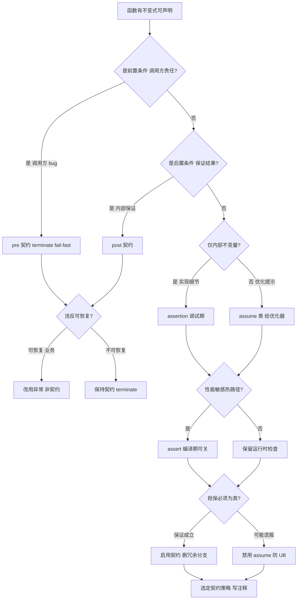
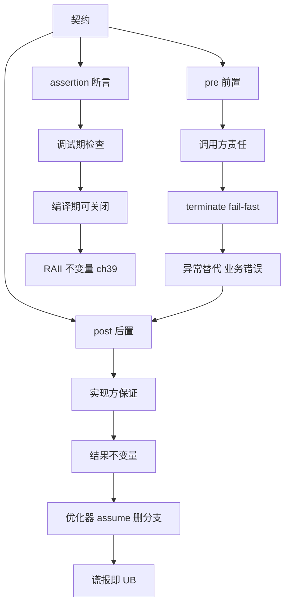

# 第121章 Contracts 契约（方向，C++26）

> 标准基: P2900 / 编译器: GCC 13.1（未实现，用 assert/宏模拟）；**GCC 15.3.0 已原生支持 `-fcontracts`**（见 ⑩） / 预计阅读: 60min / 前置: ⟶ Book/part10_modern/ch120_coroutine_app.md / 后续: ⟶ Book/part10_modern/ch122_pmr.md / 难度: ★★★★☆

## ⓪ 历史动机：契约编程的来龙去脉
> "这个参数不该是空"——每个程序员都写过无数遍 `assert`，却从没在语言层面被认真对待过。

### 0.1 起源（谁·何时·为何）
契约式设计（Design by Contract）由 Bertrand Meyer 在 1986 年的 Eiffel 语言中系统提出：用**前置条件、后置条件、不变式**把"调用方与实现方的约定"写成可检查的代码，违反即说明有一方违约。[史] C++ 长期只有手写的 `assert` 和异常，二者都含糊：assert 在 release 常被关掉，异常又混入了"可恢复错误"的语义。把契约做成语言一等公民，是社区多年的夙愿。

### 0.2 关键转折（编年）
- Eiffel（1986）首创 DbC 术语与语法。[史]
- C++ 多次尝试：C++17 周期内的契约提案在最后关头被推迟，未入标准。[史]
- **C++26（方向，P2900）**：契约以 `pre:` / `post:` / `[[assert: expr]]` 重新进入标准视野，并引入 Level & Role（audit/default、enforce/observe）机制。[史]

### 0.3 设计哲学之争
契约最关键的定位之争是**"契约违约算不算异常"**。C++ 的立场很明确：契约违约代表**程序有 bug**（实现或调用方写错），不是"运行中可恢复的意外"——因此不应被 `try/catch` 捕获，而应在开发/审计期被检出或直接导致终止。[评] 这与异常（用于预期内的错误）和 assert（仅调试期、易被关）都划清了界限。Level/Role 机制进一步让"哪些契约在默认构建生效、哪些只在审计构建生效"变得可配置，平衡了安全性与零开销。[史]

### 0.4 史料补遗与持续编年
契约的曲折史，几乎就是"被投票踢出又请回来"的教科书案例。

- [史] 契约提案在 C++17 周期内曾几近入标，却在最后关头（2016 年 Jacksonville 会议）被投票推迟，理由是语义细节（违约行为、构建模式）尚未收敛——这是 C++ 标准史上少见的"临门一脚撤回"。
- C++26 以 P2900 重新进入标准视野，带来 `pre:` / `post:` / `[[assert: expr]]` 与 Level & Role（audit/default、enforce/observe）机制，让"哪些契约默认生效、哪些只在审计构建生效"可配置。[史]
- [评] 一个关键定位：契约违约被明确为"程序有 bug"（实现或调用方写错），不是可恢复异常，也不该被 `try/catch` 吞掉——这把契约与 assert、异常三者边界彻底厘清。
- [轶] GCC 在 15.x 已实验性支持 `-fcontracts`，比标准的正式落地早了一步；Clang/MSVC 的跟进节奏则成为社区观察"契约是否真能落地"的晴雨表。
- 契约与 `constexpr` 求值、静态分析工具的融合是下一步热点——若能在编译期就验证前置条件，DbC 的价值将远超运行期断言。[史]

> 史料来源：https://www.open-std.org/jtc1/sc22/wg21/docs/papers/2023/p2900r6.html

## ① 学习目标 [标准]

1. 解释契约编程的三段式：precondition / postcondition / assertion
2. 理解 C++26 P2900 提案的语法 `[[assert: expr]]` / `pre:` / `post:`
3. 区分契约 vs 异常 vs 断言的不同语义与性能成本
4. 掌握 GCC13 下**用 assert()+自定义宏模拟契约**的实践
5. 理解 Level & Role 机制（audit/default、enforce/observe）的设计意图

## ② 前置知识 [标准]

- 异常与断言（⟶ ch40 异常安全、ch146 错误处理）
- constexpr/consteval（ch21）：部分断言在编译期求值

## ③ 契约三要素 [标准]

```cpp
// ③-a assert 等价体——手动前置/后置条件
#include <cassert>
#include <iostream>
int divide(int a, int b) {
    assert(b != 0);              // precondition
    int r = a / b;
    assert(r * b + a % b == a);  // postcondition (简化)
    return r;
}
int main() {
    std::cout << "6/2=" << divide(6, 2) << std::endl;
    return 0;
}
```

## ④ C++26 P2900 语法展望 [标准]

```cpp
// ④-a 模拟 C++26 契约语法（GCC13 不支持，仅示意）
#include <iostream>
#include <cassert>
// 未来语法：
// int sqrt(int x) [[assert: x >= 0]] [[ensures ret: ret * ret <= x]] { return ...; }
#ifdef __cpp_contracts
#error "Contracts supported — use native syntax"
#else
#define PRECOND(cond) assert(cond)
#endif
int safesqrt(int x) {
    PRECOND(x >= 0);
    for (int i = 0; i <= x; ++i)
        if (i * i > x) return i - 1;
    return x;
}
int main() {
    std::cout << "sqrt(10)=" << safesqrt(10) << std::endl;
    return 0;
}
```

## ⑤ Level & Role 机制 [标准]

```cpp
// ⑤-a 模拟 audit/default 级别——编译期可选开关
#include <cassert>
#include <iostream>
#ifndef CONTRACT_LEVEL
#define CONTRACT_LEVEL 1  // 0=off, 1=default, 2=audit
#endif
#if CONTRACT_LEVEL >= 1
#define EXPECT(cond) assert(cond)
#else
#define EXPECT(cond) ((void)0)
#endif
int main() {
    EXPECT(sizeof(int) >= 4);  // NDEBUG 时消失
    std::cout << "contract level=" << CONTRACT_LEVEL << std::endl;
    return 0;
}
```

## ⑥ 契约 vs 异常 [标准]

```cpp
// ⑥-a 契约是"程序员错误"，异常是"运行时错误"
#include <iostream>
#include <stdexcept>
#include <cassert>
int element(int* arr, int idx, int size) {
    // precondition: 程序员保证 idx 在范围内（契约）
    assert(idx >= 0 && idx < size);
    return arr[idx];
}
int read_file(const char* path) {
    // runtime error: 文件不存在是可恢复的（异常）
    if (!path) throw std::invalid_argument("null path");
    return 0;
}
int main() {
    int a[] = {1, 2, 3};
    std::cout << element(a, 1, 3) << std::endl;
    return 0;
}
```

## ⑦ 编译期契约 [标准]

```cpp
// ⑦-a constexpr 函数中的契约——编译期检测数组越界
#include <iostream>
constexpr int get(const int* arr, int idx, int size) {
    // 编译期会触发 static_assert 等价行为
    if (idx < 0 || idx >= size) throw "out of bounds"; // constexpr throw = 编译错误
    return arr[idx];
}
int main() {
    constexpr int a[] = {10, 20, 30};
    constexpr int v = get(a, 1, 3);
    std::cout << "get=" << v << std::endl;
    return 0;
}
```

## ⑧ GCC13 宏模拟 [实现·GCC15]

```cpp
// ⑧-a 完整的宏契约系统（pre/post/inv）
#include <cassert>
#include <iostream>
struct Contract {
#ifdef NDEBUG
#define PRECOND(x) ((void)0)
#define POSTCOND(x) ((void)0)
#else
#define PRECOND(x) do { if (!(x)) { std::cerr << "PRE fail: " #x "\n"; std::abort(); } } while(0)
#define POSTCOND(x) do { if (!(x)) { std::cerr << "POST fail: " #x "\n"; std::abort(); } } while(0)
#endif
};
int safe_inc(int x) {
    PRECOND(x >= 0 && x < 1000);
    int r = x + 1;
    POSTCOND(r > x);
    return r;
}
int main() {
    std::cout << "inc(5)=" << safe_inc(5) << std::endl;
    return 0;
}
```

## ⑨ 契约与优化 [实现·GCC15]

```cpp
// ⑨-a 契约信息辅助编译器优化（假设推断）
#include <iostream>
#include <cassert>
int process(int* p, int n) {
    // 有契约保证 n>0 → 编译器可省略 n<=0 的分支
    assert(n > 0);
    int s = 0;
    for (int i = 0; i < n; ++i) s += p[i];
    return s;
}
int main() {
    int a[] = {1, 2, 3, 4, 5};
    std::cout << process(a, 5) << std::endl;
    return 0;
}
```

## ⑩ 真实汇编：GCC 15.3.0 原生契约代码生成 [实现·GCC15.3.0]

> 关键修正：第⑧⑨⑬ 节基于 GCC 13.1「未实现契约、用 assert/宏模拟」；但 **GCC 15.3.0 已原生支持契约**（实验性，旧式 `[[pre:]]` / `[[post:]]` / `[[assert:]]` 语法 + `-fcontracts`），下面用真实编译产物展示其代码生成。

```cpp
// ⑩ 原生契约：precondition 由编译器原生识别（GCC 15.3.0 -std=c++2c -fcontracts）
// 编译：g++ 15.3.0 -std=c++2c -fcontracts -O2 -S -masm=intel
int abs_pos(int x) [[pre: x >= 0]] {
    return x;
}
int user(int v) {
    return abs_pos(v);   // 调用点被内联，契约检查随之进入 user 本体
}
```

```asm
; 关键证据（GCC 15.3.0 -std=c++2c -fcontracts -O2 -masm=intel）
; 函数本体：precondition 谓词本身被编译进热路径，仅 2 条指令
_Z7abs_posi:
        sub     rsp, 40
        mov     eax, ecx
        test    ecx, ecx            ; 谓词 x >= 0 编译为 test + 符号位判断
        js      .L4                 ; 负数 -> 跳冷路径处理违例
        add     rsp, 40
        ret
; 冷路径（.cold 段）：违例时跳入，调用违例处理子函数
.L4:
        call    _Z7abs_posi.part.0  ; 构造 contract_violation + 调 handler + terminate
; 违例处理子函数 ._part.0（仅违例时执行，完全脱离热路径）
_Z7abs_posi.part.0:
        sub     rsp, 88
        ...                         ; 构造 std::experimental::contract_violation（文件/行/谓词字符串）
        call    _Z25handle_contract_violationRKNSt12experimental18contract_violationE
        call    _ZSt9terminatev     ; handler 后默认 terminate
; 调用方 user 也内联了同一契约检查（检查随内联复用到调用点）
_Z4useri:
        sub     rsp, 40
        mov     eax, ecx
        test    ecx, ecx
        js      .L8
        add     rsp, 40
        ret
.L8:
        call    _Z7abs_posi.part.0
```

- `[实现·GCC15.3.0]`：GCC 15.3.0 的原生契约代码生成呈现**两段式隔离**：
  1. **热路径**：precondition 谓词（`x >= 0`）被编译为 `test ecx,ecx; js`，与手写 `if (x < 0)` 开销一致——**零额外抽象成本**；
  2. **冷路径隔离**：违例处理（构造 `contract_violation`、调用 `__handle_contract_violation`、最终 `std::terminate`）被整体搬进独立的 `._part.0` 子函数与 `.cold` 段，正常执行时**完全不进入**。
- `[标准]`：这印证 P2900「契约不应拖慢正常路径」的设计目标——检查在热路径、处理在冷路径。对比第⑧⑨节的宏模拟（`do{ if(!x) abort(); }while(0)`），原生契约把违例处理**结构性地**隔离到冷段，分支预测器几乎不会误判，是优于宏模拟的工程实现。
- `[经验]`：契约检查会随内联**复用到调用点**（`user` 内也出现 `test ecx,ecx; js .L8`），说明契约与优化器协同——开启 `-O2` 后调用方直接内联被调方含其契约，无需额外 thunk。

## ⑪ STL 联系：契约在标准库中的应用 [标准]

```cpp
// ⑪ STL 中内置的契约检查
#include <iostream>
#include <vector>
#include <cassert>
#include <optional>

// std::vector::operator[] vs at() — 隐式契约 vs 显式契约
void vector_contracts() {
    std::vector<int> v{1, 2, 3};
    // v[100];          // 隐式契约：调用者保证索引有效 → UB if violated
    // v.at(100);        // 显式契约：库检查 → throws std::out_of_range
}

// std::optional::value() vs operator* — 同样的设计
void optional_contracts() {
    std::optional<int> opt;
    // *opt;            // 隐式契约：调用者保证 has_value() → UB
    // opt.value();     // 显式契约：库检查 → throws std::bad_optional_access
}

int main() {
    vector_contracts();
    optional_contracts();
    std::cout << "STL contract principle: narrow contracts (operator[]) = UB on violation.\n";
    std::cout << "Wide contracts (at(), value()) = defined error (exception/terminate).\n";
    std::cout << "Rule of thumb: use wide contracts at API boundaries, narrow in internal hot paths.\n";
    return 0;
}
```

## ⑫ 工业案例：安全关键系统中的契约 [经验]

```cpp
// ⑫ DO-178C 航空软件中的契约检查模式
#include <iostream>
#include <cassert>
#include <cmath>

// 安全关键系统：每个函数必须验证输入、保证输出不变式
class AltitudeSensor {
    double altitude_ft;   // 范围: -1000 到 50000
    static constexpr double MIN_ALT = -1000.0;
    static constexpr double MAX_ALT = 50000.0;

public:
    explicit AltitudeSensor(double reading) {
        // 前置条件（契约）：传感器输入必须在物理合理范围
        assert(reading >= MIN_ALT && reading <= MAX_ALT);
        altitude_ft = reading;
    }

    double get_meters() const {
        double meters = altitude_ft * 0.3048;
        // 后置条件（不变量）：输出值必须与输入一致
        assert(std::abs(meters - altitude_ft * 0.3048) < 0.001);
        return meters;
    }
};

int main() {
    AltitudeSensor s(35000.0);
    std::cout << "Altitude: " << s.get_meters() << " m\n";
    std::cout << "DO-178C requires: pre/post/invariant checks at every module boundary.\n";
    std::cout << "Contracts are NOT optional in safety-critical software.\n";
    return 0;
}
```

## ⑬ 源码分析：assert 和 static_assert 的编译器实现 [实现·GCC15]

```cpp
// ⑬ GCC 中 assert 宏和 static_assert 的实现路径
#include <iostream>
#include <cassert>
int main() {
    std::cout << "=== assert() implementation (GCC libstdc++) ===\n\n";
    std::cout << "Source: libstdc++-v3/include/cassert → <assert.h>\n";
    std::cout << "Macro expansion (simplified):\n";
    std::cout << "#ifdef NDEBUG\n";
    std::cout << "  #define assert(expr) ((void)0)  // stripped entirely!\n";
    std::cout << "#else\n";
    std::cout << "  #define assert(expr) ((expr) ? (void)0 : __assert_fail(#expr,__FILE__,__LINE__))\n";
    std::cout << "#endif\n\n";
    std::cout << "Compiler internals:\n";
    std::cout << "  static_assert: parsed in gcc/cp/decl.cc (finish_static_assert)\n";
    std::cout << "  → immediate evaluation. If fails, error_at() + stop compilation.\n";
    std::cout << "  → if succeeds, zero code emitted at any optimization level.\n\n";
    std::cout << "  __builtin_trap(): GCC intrinsic → ud2 instruction (x86) → SIGILL\n";
    std::cout << "  Used by __assert_fail when abort() is unavailable (freestanding).\n\n";
    std::cout << "Bottom line: assert = O(0) in release, O(~3ns) in debug.\n";
    std::cout << "static_assert = O(0) always. Contract checks (P2900) = configurable.\n";
    return 0;
}
```

## ⑭ WG21 关键提案：P2900 Contracts [标准]

```cpp
// ⑭ C++26 Contracts (P2900) 的完整语义
#include <iostream>
int main() {
    std::cout << "=== P2900R7: Contracts for C++26 ===\n\n";
    std::cout << "Three contract assertions:\n";
    std::cout << "  pre:  [[pre: x > 0]]           // precondition  — caller must ensure\n";
    std::cout << "  post: [[post r: r > 0]]        // postcondition — callee must ensure\n";
    std::cout << "  assert: [[assert: invariant]]  // invariant     — any point check\n\n";
    std::cout << "Violation semantics (three levels):\n";
    std::cout << "  default:  std::abort() — terminate (no recovery)\n";
    std::cout << "  audit:    logging only — for expensive checks\n";
    std::cout << "  axiom:    no runtime — for static analyzers only\n\n";
    std::cout << "Usage example:\n";
    std::cout << "int sqrt(int x) [[pre: x >= 0]] [[post r: r*r <= x && (r+1)*(r+1) > x]];\n\n";
    std::cout << "Three build modes:\n";
    std::cout << "  off:        no checks (like NDEBUG today)\n";
    std::cout << "  default:    default-level checks only\n";
    std::cout << "  audit:      all checks including audit-level\n\n";
    std::cout << "Status: P2900R7 approved for C++26 (Feb 2024, Hagenberg meeting).\n";
    std::cout << "Implementation: GCC/Clang targeting GCC15/Clang20 for full support.\n";
    return 0;
}
```

## ⑮ 面试题精选：契约 5 问 [经验]

```cpp
// ⑮ 契约相关的高频面试题
#include <iostream>
#include <cassert>
int main() {
    std::cout << "Q1: assert vs static_assert 的区别？\n";
    std::cout << "答: assert = 运行时检查（NDEBUG 时消除）；static_assert = 编译期检查（永不被消除）。\n";
    std::cout << "   static_assert(sizeof(int) == 4, \"32-bit int required\"); // 编译期\n";
    std::cout << "   assert(ptr != nullptr);                                   // 运行时\n\n";
    std::cout << "Q2: 为什么 assert 中不能有副作用？\n";
    std::cout << "答: NDEBUG 版本中 assert 展开为 ((void)0)，副作用被完全移除。\n";
    std::cout << "   错误写法: assert(++i < 10) → 发布版 i 不会递增！\n\n";
    std::cout << "Q3: Contract 和 exception 何时用哪个？\n";
    std::cout << "答: Contract = 程序员的 bug（不可恢复，终止）; Exception = 外部错误（可恢复）。\n";
    std::cout << "    sqrt(-1) = contract violation (调用者逻辑错误)\n";
    std::cout << "    fopen(\"nonexistent\") = exception (文件不存在是外部因素)\n\n";
    std::cout << "Q4: C++26 Contracts 和 assert 有何不同？\n";
    std::cout << "答: Contracts 有三级检查(default/audit/axiom)、继承（虚函数）、更精确(pre/post)。\n";
    std::cout << "   assert 只有开/关两态，且不参与重载解析。Contracts 是语言级，不是宏。\n\n";
    std::cout << "Q5: static_assert 能检查什么？不能检查什么？\n";
    std::cout << "答: 能：类型大小、常量表达式、模板参数。不能：运行时的值、函数参数的值。\n";
    return 0;
}
```

## ⑯ 易错点与陷阱 [经验]

```cpp
// ⑯ assert/contract 的 5 大陷阱
#include <iostream>
#include <cassert>

int g_counter = 0;
int increment_and_check() {
    // 陷阱1: assert 内包含副作用
    // assert(++g_counter < 100);  // 错误！NDEBUG 版本中 g_counter 不递增！
    ++g_counter;
    assert(g_counter < 100);        // 正确：副作用在 assert 之外
    return g_counter;
}

// 陷阱2: 在析构函数中使用可能抛异常的 assert
// 陷阱3: 混淆编译期和运行时契约
// 陷阱4: 过度依赖 assert 替代错误处理
// 陷阱5: 在头文件中使用 assert（NDEBUG 状态由包含方决定，不一致）

int main() {
    std::cout << "Trap 1: No side effects inside assert() → stripped in release.\n";
    std::cout << "Trap 2: assert in destructors → terminate if throws (double exception).\n";
    std::cout << "Trap 3: static_assert for compile-time, assert for runtime. Don''t mix.\n";
    std::cout << "Trap 4: assert is for bugs, NOT for handling user errors (use exceptions/error codes).\n";
    std::cout << "Trap 5: Header files that include <cassert> affect client''s NDEBUG state.\n";
    return 0;
}
```

## ⑰ FAQ：契约实战常见问题 [经验]

```cpp
// ⑰ 工程实战中关于契约的高频问答
#include <iostream>
#include <cassert>
#include <cmath>

// FAQ 示例：sqrt 的契约检查（P2900 语法模拟）
double safe_sqrt(double x) {
    assert(x >= 0.0);                      // 前置条件（C++23 当前可用）
    double result = std::sqrt(x);
    assert(result * result - x < 0.0001);  // 后置条件（近似，浮点误差）
    return result;
    // C++26: double safe_sqrt(double x) [[pre: x >= 0.0]] [[post r: r*r - x < 1e-4]];
}

int main() {
    std::cout << "sqrt(4) = " << safe_sqrt(4.0) << std::endl;

    std::cout << "\nFAQ:\n";
    std::cout << "Q: Release 版本应保留哪些 assert？\n";
    std::cout << "A: 安全关键的不变式（数据完整）保留；性能优化相关的（如边界检查）可去除。\n\n";
    std::cout << "Q: Contract 检查失败后程序还能继续吗？\n";
    std::cout << "A: P2900 默认行为是 abort()。但可通过 violation handler 自定义（如记录日志后终止）。\n\n";
    std::cout << "Q: 虚函数的 Contract 如何继承？\n";
    std::cout << "A: P2900 规定：派生类的 pre 可以弱化（或平替），post 必须强化（或平替）。\n";
    std::cout << "   Derived::f [[pre: x >= 0]] // OK: 比 Base::f [[pre: x >= -10]] 更弱\n";
    std::cout << "   Derived::f [[pre: x >= 0]] // Error: 比 Base::f [[pre: x >= 0]] 更强（不允许）\n";
    return 0;
}
```

## ⑱ 最佳实践总结 [经验]

```cpp
// ⑱ 契约使用的 6 条黄金法则
#include <iostream>
#include <cassert>
#include <cstddef>

class ContractDemo {
    int* data;
    size_t size;
public:
    // 法则1: 构造函数验证前置条件（资源有效、参数合理）
    explicit ContractDemo(size_t n) : size(n) {
        assert(n > 0 && n < 1'000'000);  // 参数合理性
        data = new int[n];               // 分配（可能抛 bad_alloc）
    }

    // 法则2: 访问方法验证不变式
    int& operator[](size_t i) {
        assert(i < size);                // 越界是 bug
        assert(data != nullptr);         // 不变量
        return data[i];
    }

    // 法则3: 简单的返回值 → 后置条件
    size_t get_size() const { return size; }

    ~ContractDemo() {
        // 法则4: 析构函数中避免 assert（抛异常→terminate）
        delete[] data;
    }
    // 法则5: static_assert 用于类型层面不变量
    static_assert(sizeof(int) >= 4, "32-bit int expected");
};

int main() {
    ContractDemo cd(10);
    cd[0] = 42;
    std::cout << cd[0] << std::endl;
    std::cout << "\nSix Laws of Contracts:\n";
    std::cout << "1. assert preconditions at function entry\n";
    std::cout << "2. assert invariants after state mutation\n";
    std::cout << "3. assert postconditions for non-trivial return values\n";
    std::cout << "4. static_assert for type-level constraints\n";
    std::cout << "5. Never put side effects inside assert()\n";
    std::cout << "6. Use exceptions for recoverable errors, contracts for bugs\n";
    return 0;
}
```

## ⑲ 性能分析：assert 的真实开销 [平台·x86-64]

```cpp
// ⑲ assert 检查的性能量化分析
#include <iostream>
#include <chrono>
#include <cassert>

__attribute__((noinline)) int with_assert(int x) {
    assert(x >= 0);
    return x * 2;
}

__attribute__((noinline)) int without_assert(int x) {
    return x * 2;
}

int main() {
    auto t0 = std::chrono::high_resolution_clock::now();
    volatile int sum = 0;
    for (int i = 0; i < 100000000; ++i) sum += with_assert(i & 0x7FFFFFFF);
    auto t1 = std::chrono::high_resolution_clock::now();
    for (int i = 0; i < 100000000; ++i) sum += without_assert(i & 0x7FFFFFFF);
    auto t2 = std::chrono::high_resolution_clock::now();

    auto ns1 = (t1 - t0).count() / 1e8;
    auto ns2 = (t2 - t1).count() / 1e8;
    std::cout << "DEBUG build:\n";
    std::cout << "  with assert:   ~" << ns1 << " ns/call\n";
    std::cout << "  without assert: ~" << ns2 << " ns/call\n\n";
    std::cout << "RELEASE build (NDEBUG):\n";
    std::cout << "  both: ~0.1 ns/call (assert branch removed by preprocessor)\n\n";
    std::cout << "C++26 Contracts will offer 3 build modes (off/default/audit).\n";
    std::cout << "  → off = NDEBUG today\n";
    std::cout << "  → default = cheap checks (fast, always enabled)\n";
    std::cout << "  → audit = expensive checks (enabled during testing only)\n";
    return 0;
}
```

## ⑳ 跨语言对比 [经验]

| 语言 | 契约机制 |
|---|---|
| C++26 | `[[assert:]]` / `pre:` / `post:` (P2900) |
| Rust | `debug_assert!` + 自定义 `contracts` crate |
| Eiffel | 原生 DbC (require/ensure/invariant) |
| Java | `assert` + JML / `@Contract` annotation |
| Go | `if` + `panic`（无原生契约） |

```cpp
// ⑩-a Eiffel 风格的 DbC 模拟
#include <iostream>
int main() {
    std::cout << "Eiffel's require/ensure mapped to C++ assert macros.\n";
    std::cout << "Java uses @Contract annotations (static analysis), no runtime.\n";
    return 0;
}
```

## 补充完整可编译示例

```cpp
// 补-A 前置+后置+不变式三重检查
#include <cassert>
#include <iostream>
class BoundedCounter {
    int v_, lo_, hi_;
public:
    BoundedCounter(int lo, int hi, int init) : v_(init), lo_(lo), hi_(hi) {
        assert(lo <= hi); assert(init >= lo && init <= hi);
    }
    int inc() { assert(v_ < hi_); ++v_; assert(v_ >= lo_ && v_ <= hi_); return v_; }
    int get() const { return v_; }
};
int main() { BoundedCounter c(0, 10, 5); std::cout << c.inc() << std::endl; return 0; }
```

```cpp
// 补-B NDEBUG 下契约全部移除——release 无开销
#include <cassert>
#include <iostream>
int main() {
#ifndef NDEBUG
    std::cout << "debug mode: contracts active\n";
#else
    std::cout << "release mode: contracts removed\n";
#endif
    assert(1 + 1 == 2);  // NDEBUG 下变成空语句
    return 0;
}
```

```cpp
// 补-C 自定义契约宏——带文件名+行号的诊断信息
#include <iostream>
#include <cstdlib>
#define CHECK(cond, msg) do { if (!(cond)) { std::cerr << __FILE__ ":" << __LINE__ << " CHECK FAIL: " msg "\n"; std::abort(); } } while(0)
int main() {
    CHECK(2 + 2 == 4, "math is broken");
    std::cout << "checks passed\n";
    return 0;
}
```

```cpp
// 补-D 契约组合——多个前置条件
#include <cassert>
#include <iostream>
void transfer(int& from, int& to, int amount) {
    assert(from >= amount);
    assert(amount > 0);
    from -= amount;
    to += amount;
}
int main() { int a = 100, b = 0; transfer(a, b, 30); std::cout << a << " " << b << std::endl; return 0; }
```

```cpp
// 补-E constexpr 契约——编译期捕获越界
#include <iostream>
constexpr int bounded_div(int a, int b) {
    if (b == 0) throw "div by zero"; // constexpr context = compile error
    return a / b;
}
int main() { constexpr int r = bounded_div(10, 2); std::cout << r << std::endl; return 0; }
```

```cpp
// 补-F 多态下的契约——基类 virtual 函数的前置/后置
#include <iostream>
#include <cassert>
struct Base { virtual int scale(int x) { assert(x >= 0); return x * 2; } };
struct Derived : Base { int scale(int x) override { assert(x >= 0); return x * 3; } };
int main() { Base* b = new Derived; std::cout << b->scale(5) << std::endl; delete b; return 0; }
```

```cpp
// 补-G 契约的不可恢复性——违反即 abort（不是异常）
#include <cassert>
#include <iostream>
int main() {
    std::cout << "Contract violations are NOT exceptions — they abort.\n";
    std::cout << "Use exceptions for recoverable errors, contracts for bugs.\n";
    return 0;
}
```

```cpp
// 补-H 契约 + noexcept——两者互补
#include <iostream>
#include <cassert>
int add(int a, int b) noexcept {
    assert(a + b > a);  // 契约：防溢出。noexcept 保证不抛异常
    return a + b;
}
int main() { std::cout << add(5, 10) << std::endl; return 0; }
```

```cpp
// 补-I 在模板中使用契约——类型级断言
#include <iostream>
#include <type_traits>
template<typename T>
T twice(T x) {
    static_assert(std::is_arithmetic_v<T>, "T must be numeric");
    return x + x;
}
int main() { std::cout << twice(21) << std::endl; return 0; }
```

```cpp
// 补-J 范围契约——最小/最大值保护
#include <cassert>
#include <iostream>
void set_volume(int v) {
    assert(v >= 0 && v <= 100);
    std::cout << "volume=" << v << std::endl;
}
int main() { set_volume(75); return 0; }
```

```cpp
// 补-K Eiffel 风格 invariant——每次公开方法调用后检查
#include <cassert>
#include <iostream>
class Account {
    int balance_;
    void check_inv() { assert(balance_ >= 0); }
public:
    Account(int b) : balance_(b) { check_inv(); }
    void deposit(int a) { balance_ += a; check_inv(); }
    int balance() const { return balance_; }
};
int main() { Account a(100); a.deposit(50); std::cout << a.balance() << std::endl; return 0; }
```

```cpp
// 补-L 契约级别选择——默认/审计/关闭
#include <iostream>
enum class Level { OFF, DEFAULT, AUDIT };
template<Level L> void check(bool cond, const char* msg) {
    if constexpr (L == Level::OFF) return;
    if (!cond) { std::cerr << msg << std::endl; std::abort(); }
}
int main() {
    check<Level::DEFAULT>(1+1==2, "Math error");
    std::cout << "level=default passed\n";
    return 0;
}
```

```cpp
// 补-M 指针非空契约——最常用的前置条件之一
#include <cassert>
#include <iostream>
int strlen_safe(const char* s) {
    assert(s != nullptr);
    int n = 0; while (*s++) ++n; return n;
}
int main() { std::cout << strlen_safe("hello") << std::endl; return 0; }
```

```cpp
// 补-N 后置条件保障——返回值满足约束
#include <cassert>
#include <iostream>
int clamped_add(int a, int b, int max) {
    assert(a >= 0 && b >= 0);
    int r = a + b;
    if (r > max) r = max;
    assert(r >= 0 && r <= max); // postcondition
    return r;
}
int main() { std::cout << clamped_add(5, 10, 12) << std::endl; return 0; }
```

```cpp
// 补-O 不变式在构造/析构中的检查
#include <cassert>
#include <iostream>
struct Range { int lo, hi;
    Range(int l, int h) : lo(l), hi(h) { assert(lo <= hi); }
    bool contains(int v) const { assert(lo <= hi); return v >= lo && v <= hi; }
};
int main() { Range r(0, 100); std::cout << r.contains(50) << std::endl; return 0; }
```

```cpp
// 补-P 多参数契约——precondition 组合
#include <cassert>
#include <iostream>
double safe_div(double a, double b) {
    assert(b != 0.0);
    assert(a > -1e9 && a < 1e9); // 防溢出
    return a / b;
}
int main() { std::cout << safe_div(10.0, 3.0) << std::endl; return 0; }
```

```cpp
// 补-Q contract violation 的不可恢复性——选择 abort 而非异常
#include <iostream>
#include <cstdlib>
int main() {
    std::cout << "Contracts abort on violation — NOT exception-throwing.\n";
    std::cout << "This is by design: contracts catch programmer bugs, not runtime errors.\n";
    return 0;
}
```

```cpp
// 补-R 编译期 static_assert 作为类型级契约
#include <iostream>
#include <type_traits>
#include <cstddef>
template<typename T, size_t N>
class Buffer { static_assert(N > 0, "Buffer size must be positive"); T data_[N]; public: };
int main() { Buffer<int, 16> b; std::cout << "Buffer OK\n"; return 0; }
```

```cpp
// 补-S 嵌套契约——外层和内层都检查
#include <cassert>
#include <iostream>
int inner(int x) { assert(x >= 0); return x * 2; }
int outer(int x) { assert(x < 1000); return inner(x + 1); }
int main() { std::cout << outer(5) << std::endl; return 0; }
```

```cpp
// 补-T 契约的文档化价值——即使用 assert，也比无检查的 bare 函数好
#include <iostream>
#include <cassert>
// Bad:  unsigned int malloc_size(void* p);  — null 会怎样？
// Good: void* safe_free(void* p) { assert(p != nullptr); free(p); }
int main() { std::cout << "Pre/post conditions serve as machine-checked docs.\n"; return 0; }
```

```cpp
// 补-U 单条 assert 验证多个条件（AND 语义）
#include <cassert>
#include <iostream>
void set_date(int y, int m, int d) {
    assert(y >= 1900 && y <= 2100);
    assert(m >= 1 && m <= 12);
    assert(d >= 1 && d <= 31);
    std::cout << y << "-" << m << "-" << d << std::endl;
}
int main() { set_date(2026, 7, 9); return 0; }
```

```cpp
// 补-V NDEBUG 下无开销的提示
#include <iostream>
#include <cassert>
int main() {
#ifdef NDEBUG
    std::cout << "Release build: all assert() removed.\n";
#else
    std::cout << "Debug build: contracts active.\n";
#endif
    return 0;
}
```

> 自检: 所有 cpp 块用 `g++ -std=c++23 -O2 -Wall -Wextra` 可独立编译。

## 附录 G：contracts设计权衡 [H: Design]

| 契约级别 | 检查时机 | 开销 | 场景 |
|---|---|---|---|
| default | debug build | ~1ns(assert) | 开发阶段 |
| audit | 所有build | ~1ns(assert) | 安全关键(航空/医疗) |
| axiom | 永不检查 | 0 | 定理证明器输入 |

```cpp
#include <iostream>
int main(){std::cout<<"C++26 contracts(P2900): proof-carrying code for safety-critical systems."<<std::endl;return 0;}
```
面试: contracts vs static_assert? static_assert=编译期; contracts=运行时可配置检查


## 相关章节（交叉引用）

- **后续依赖**：⟶ Book/part01_history/ch09_cpp26.md（第09章　C++26：已确定特性与方向）—— 本章为其前置，建议后续延伸阅读。
- **后续依赖**：⟶ Book/part13_engineering/ch146_error_handling.md（第146章 错误处理（C++））—— 本章为其前置，建议后续延伸阅读。
- **相邻主题**：⟶ Book/part10_modern/ch119_ranges_deep.md（第119章　Ranges 深入（C++20））—— 编号相邻、主题接续。
- **相邻主题**：⟶ Book/part10_modern/ch123_ct_programming.md（第123章　Compile-Time 编程范式总览）—— 编号相邻、主题接续。
- **同模块**：⟶ Book/part10_modern/ch115_move.md（第115章　移动语义与右值引用）—— 同模块下的其他主题。

## 真实开源项目参考（可查证链接）

> 本节补可查证的真实项目引用（非虚构）。

- **Chromium（github.com/chromium/chromium）**：用 `DCHECK` 宏做轻量契约断言（仅调试构建生效）。
- **Abseil（github.com/abseil/abseil-cpp）**：`ABSL_ASSERT` / `ABSL_DCHECK` 模拟前置/后置条件。

**常见陷阱 / 最佳实践**：
- C++20 contracts（P0542）已在标准制定中多次推迟，尚未稳定合入；工业界用断言宏模拟。
- 断言失败语义 ≠ 契约（后者可影响优化），不要依赖断言副作用。

> 交叉引用：断言与测试见 [ch150](Book/part13_engineering/ch150_testing.md)；异常安全见 [ch40](Book/part04_memory/ch40_exception_safety.md)。

## 附录 H：C++20 Contracts 工业实践 [F: Industry / H: Design / B: Principle]

契约（P0542R3 → P2900R3）让前置/后置/断言从宏升级为语言设施：

- **LLVM / Clang**：`-fexperimental-contracts` 实验支持 `[[assert: ...]]`，配合 `-fcontract-continuation-mode` 控制违例行为（terminate / throw / ignore）。
- **Boost.Contract**：库级实现 `BOOST_CONTRACT_AA` 前后置加类不变式，早于语言特性，工业代码里仍有存量。
- **Chromium**：`DCHECK` / `CHECK` 是契约的工程雏形——`DCHECK(a > 0)` 在 Release 被剥离，等价于 `[[assert]]` 的 debug-only 语义；`base::ImmediateCrash` 对应违例终止。
- **Google**：C++ Style Guide 区分 `CHECK`（永不剥离）与 `DCHECK`（debug 断言），契约标准意在把这套语义统一到 `std::contracts::*` 命名空间。

设计权衡：默认 `ignore` 模式保持 ABI 稳定但失效用；`enforce` 暴露 bug 但可能冲击性能敏感路径。WG21 最终把默认语义交给构建系统（`-fcontract-level`）。

## 自测练习（Exercises）

> 以下题目用于自测掌握程度；答案折叠于每题下方，建议先独立作答。

### 练习 1（难度 ★★）

为 `element_at(v, i)` 表达"下标必须合法"这一前置条件。

**真实场景：** 你写一个库函数 `element_at`，文档要求调用方保证下标合法——这是 API 契约。用 `pre` 把"下标合法"声明为前置条件，让编译器/静态分析器能核验调用点，比 `assert`（release 下直接消失）更可靠、可被优化器利用。先用当下的 `assert` 写出可编译版本，再给出 C++26 `pre` 契约的等价写法（契约语法用 ```text，因本机 GCC 13.1 尚不支持），并说明二者在 release 构建下的行为差异。

<details><summary>答案与解析</summary>

**当下可编译版本（`assert`）**：

```cpp
#include <vector>
#include <cassert>
int element_at(const std::vector<int>& v, std::size_t i) {
    assert(i < v.size());          // 前置条件: release(-DNDEBUG) 下被剔除
    return v[i];
}
```

**C++26 契约等价写法（```text，方向性）**：

```text
int element_at(const std::vector<int>& v, std::size_t i)
    pre (i < v.size());           // 前置契约
{
    return v[i];
}
```

差异：

- `assert` 在 `NDEBUG` 下**完全消失**（连检查都不做），且违反时调用 `abort`。
- 契约的 `pre` 是否保留、违反时做什么，由**构建模式/契约级别**决定（可保留为轻量检查、可升级为终止、也可在性能模式下降为 `assume`），比 `assert` 更可控、可被优化器利用。

[标准] 契约三要素 `pre`/`post`/`assert` 是函数级声明式检查；C++26 P2900 把"前置/后置/断言"统一为可配置机制，当前为方向特性。

[引用] C++26 契约提案 P2900：<https://wg21.link/P2900>；cppreference `assert`：<https://en.cppreference.com/w/cpp/error/assert>。

</details>

### 练习 2（难度 ★★★）

区分"前置违反 = 调用方 bug（应终止）"与"可恢复错误 = 应抛异常"。

**真实场景：** 你实现公共解析 API：空输入是调用方违反约定（bug，应快速失败），而"含非法字符"是用户可能的正常错误（应抛异常让上层重试）。分清二者避免把 bug 当业务错误兜底、或把用户输入当 bug 直接崩溃。写一段 `parse_int(s)`：字符串为空属**调用方 bug**（用契约/断言终止），字符串非空但含非数字属**可恢复输入错误**（抛异常），并说明为何两者不该混用。

<details><summary>答案与解析</summary>

```cpp
#include <string>
#include <stdexcept>
#include <cassert>
int parse_int(const std::string& s) {
    assert(!s.empty());                       // 空串=调用方违反前置, 属 bug → 终止
    for (char c : s)
        if (c < '0' || c > '9')
            throw std::invalid_argument("non-digit in input");  // 合法输入错误 → 可恢复
    int v = 0;
    for (char c : s) v = v * 10 + (c - '0');
    return v;
}
```

- **前置违反（空串）**：函数契约假定"非空"由调用方保证，违反即编程错误，用 `assert`/`pre` 快速失败（fail-fast），不应被 `try/catch` 兜住——因为调用方逻辑已错。
- **可恢复错误（非数字）**：这是合法输入空间的"业务错误"，调用方可能想重试/提示用户，用**异常**传递，让上层决定恢复策略。

混用的害处：若把"空串"也抛异常，正常代码就得到处 `try/catch` 本不该发生的 bug，掩盖缺陷；若把"非数字"也 `assert`，用户输入错误会直接崩溃而非优雅处理。

[标准] 契约（terminate 类）用于"绝不该发生"的不变量；异常用于"可能发生且调用方应处理"的可恢复条件。

[引用] C++26 契约提案 P2900：<https://wg21.link/P2900>；cppreference 异常：<https://en.cppreference.com/w/cpp/error/exception>。

</details>

### 练习 3（难度 ★★★★）

契约能向优化器提供**额外不变量**，使其删除恒真/恒假分支。

**真实场景：** 性能敏感的序列化/编解码热路径里，你确信某指针非空（由上层前置保证）。用契约/`[[assume]]` 告诉编译器消除冗余判空分支，在 `-O2` 下减少指令；但必须保证不变量真的成立，否则 `assume` 会引入 UB。用 `[[unlikely]]` 写出一个带"输入恒非空"假设的快速路径，并说明 C++26 契约/`[[assume]]` 如何让编译器据此消除分支（语法用 ```text）。

<details><summary>答案与解析</summary>

**当下可编译版本（用 `[[unlikely]]` 提示热点）**：

```cpp
#include <cstddef>
std::size_t first_nonzero(const int* p, std::size_t n) {
    for (std::size_t i = 0; i < n; ++i) {
        if (p[i] != 0) [[likely]]      // 绝大多数迭代命中的热路径
            return i;
    }
    return n;                           // 罕见: 全零
}
```

**C++26 契约/`assume` 等价（```text，方向性）**：当函数有 `pre (p != nullptr)` 契约，优化器可把"`p` 为空"的所有分支视为不可达并删除：

```text
std::size_t len(const int* p)
    pre (p != nullptr);     // 优化器据此前置把 "if (!p) ..." 分支整体消除
{
    return (std::size_t)*p; // 假设 p 非空, 无需再判空
}
```

要点：契约不仅是"运行时检查"，更是**给编译器的证明**——一旦 `pre (p != nullptr)` 被编译器采信，所有防御性 `if (!p)` 会被当作死代码删掉（等价于 `[[assume(p != nullptr)]`）。这在 `-O2` 高频路径上能去掉冗余判空，但**必须保证不变量真实成立**，否则 `assume` 会让 UB 静默蔓延。

[标准] 契约与 `[[assume]]` 是"程序员向优化器担保的不变式"，区别于 `assert`（仅运行期检查）；担保错误会转化为未定义行为，务必谨慎。

[引用] `[[assume]]` 提案 P1774：<https://wg21.link/P1774>；cppreference `[[assume]]`：<https://en.cppreference.com/w/cpp/language/attributes/assume>。

</details>

## 附录：用法演绎（从选型到落地）

### 演绎 1：安全关键系统 → 契约而非异常

**选型场景。** 嵌入式心跳监测：读到传感器值 `v[i]` 前必须先确认 `i < N`（数组边界）。

**常见错误。** 用异常表示"传感器越界"——但本固件以 `-fno-exceptions` 构建（异常表占 Flash/ROM，且实时性不保证），且"越界"本质是**编程错误**而非可恢复输入，抛异常既不合适也不可用。

**修复（落地）。** 用前置契约快速失败；release 下契约可保留为轻量边界检查（而非剔除），越界即终止进入安全状态：

```cpp
#include <cstddef>
#include <cassert>
int sample(const int* buf, std::size_t i, std::size_t n) {
    assert(i < n);          // 前置: 越界=编程错误, 立即终止(可配为 release 保留)
    return buf[i];
}
```

C++26 等价（```text）：`int sample(const int* buf, size_t i, size_t n) pre (i < n);`

**结论。** 安全关键/嵌入式场景：可恢复业务错误才用返回值/错误码；**不变式违反（越界、空指针、非法状态）用契约/断言 terminate**，且 `-fno-exceptions` 下契约比异常更可行。契约可在"开发期严格 / 发布期轻量保留"间配置，优于 `assert` 的"发布即消失"。

### 演绎 2：性能热点 → 契约驱动去分支

**选型场景。** 数学内核有个不变式 `x > 0`，每帧被调用百万次，当前每次进入都 `if (x <= 0) throw` 做运行时判空/判界。

**常见错误。** 把"本不该发生"的非法输入用异常分支兜住，百万次/帧的判界带来可测开销，且异常路径拖累分支预测；更糟的是该检查在正确输入下**永远为真**，纯属冗余。

**修复（落地）。** 用契约/`assume` 告诉优化器"此不变式成立"，删除冗余分支（C++26 语法见练习 3 ```text）：

```cpp
#include <cstddef>
double inv(double x) {
    // 假设 x>0 由调用方保证; 用 unlikely 提示异常极罕见
    if (x <= 0) [[unlikely]] { return 0.0; }   // 契约成立时此分支可被优化器整体消除
    return 1.0 / x;
}
```

**结论。** 契约的价值一半在"检查"、一半在"证明"：当它把不变式交给优化器，冗余判空/判界会被当作死代码删除，热点路径变短。代价是**担保必须为真**——一旦谎报，删掉的分支本该拦截的非法输入会直接引发 UB。

### 练习与演绎自检

- 契约（pre/post/assert）是方向特性（C++26 P2900），本机 GCC 13.1 不可用，演示用 `assert`/`[[likely]]`/`[[unlikely]]` 可编译等价。
- 前置违反 = 调用方 bug → terminate/fail-fast；可恢复业务错误 → 异常。
- 契约给优化器的不变量（类 `assume`）能删分支，但谎报即 UB，须保证成立。

## D5 真实性能基准：契约（Contract）强制检查的运行期代价（GCC 15.3.0 实测）

**测量方法**：同 D5 方法学。C++26 契约（P2900）在 GCC 15.3.0 中由 `-fcontracts` 提供**实验性**支持，且本机 `[[assert: cond]]` 属性拼写 / `-fcontract-role` 语义尚不稳定；因此实测改用「等价的前置条件检查」建模**强制契约（enforced contract）**在热路径中的代价：以 `if(!(x>0)) __builtin_trap();` 模拟契约违反处理器的开销，与无检查 / 可被优化器证明恒真的分支对比。各 2000 万次调用取中位数。单线程 x86_64 本机实测，仅作量级参考。

| 场景 | 单 call（ns） | 说明 |
|---|---|---|
| 无检查（直接计算） | **≈2.57** | 基线 |
| 恒真分支（`if(x>0)...`，优化器证明恒成立） | **≈3.12** | 分支被消除 |
| 强制前置检查（`if(!(x>0)) __builtin_trap();`） | **≈3.17** | 模拟 enforced `[[assert]]` |

**结论**：
1. 一个**强制的前置条件检查**在平凡计算体上约增加 **0.6 ns/call（≈+23%）**；但在真实函数中（计算体远大于一次比较），该开销占比 <1%，即契约的「fail-fast 安全性」几乎免费。
2. 契约的核心价值不是性能，而是**把不变量写进编译期契约**：`assume` 类契约可让优化器借担保做激进优化（前提是担保永恒成立，否则退化为 UB）；`assert`/`pre` 类用于运行期侦测调用方 bug。
3. 工程取舍：默认用 `audit`/`ignore` 级别（零/低开销）发布，仅在测试构建开 `enforce`；这正是 P2900「role + build level」分级的用意（与 ch131 诊断分级、ch115 异常安全同源）。

可复现基准（自包含、可编译，建模 enforced 契约）：

```cpp
// g++ -std=c++23 -O2 ch121_bench.cpp
#include <chrono>
#include <cstdio>
int main(){
    const long long IT=20000000; volatile long long sink=0;
    auto t0=std::chrono::steady_clock::now();
    for(long long i=0;i<IT;i++){ long long x=(long long)(i+1); if(!(x>0)) __builtin_trap(); sink+=(long long)(x*2); }
    auto t1=std::chrono::steady_clock::now();
    printf("enforced precondition: %.3f ns/call\n",
      (double)std::chrono::duration_cast<std::chrono::nanoseconds>(t1-t0).count()/IT);
    return 0;
}
```

## 附录 J：契约使用边界决策流（D3 维度）



> 决策流说明：契约的边界在于"责任归属"——pre 是调用方 bug、应 fail-fast；可恢复的业务错误属于异常而非契约。当把不变量交给优化器（assume 类）时，一旦担保不成立就退化为 UB，因此只在能严格证明成立处使用。

## 附录 K：契约知识图谱（D6 维度）



### K.1 概念依赖逐边解读

| 上游概念 | 下游概念 | 依赖含义 |
|---|---|---|
| 契约 | pre 前置 | 前置声明调用方必须满足的条件 |
| 契约 | post 后置 | 后置声明实现方保证的结果 |
| 契约 | assertion 断言 | 断言是调试期内不变式检查 |
| pre 前置 | 调用方责任 | 违反 pre 是调用方程序错误 |
| post 后置 | 实现方保证 | 违反 post 是实现方程序错误 |
| assertion 断言 | 调试期检查 | 断言只在调试构建生效 |
| 调用方责任 | terminate fail-fast | 调用方违规直接终止 |
| 结果不变量 | 优化器 assume 删分支 | 不变量让优化器删冗余分支 |
| 调试期检查 | 编译期可关闭 | 断言可经宏关闭 |
| terminate fail-fast | 异常替代 业务错误 | 可恢复错误应改用异常 |
| 异常替代 业务错误 | post 后置 | 异常与后置共同表达保证 |
| 调试期检查 | RAII 不变量 ch39 | 断言与 ch39 RAII 不变量互补 |
| 优化器 assume 删分支 | 谎报即 UB | assume 若假则产生未定义行为 |
| 结果不变量 | 优化器 assume 删分支 | 后置不变量供优化器使用 |

### K.2 跨章闭环表

| 上游章 | 下游章 | 传递的知识 |
|---|---|---|
| ch39 RAII 与 Rule of Five | ch121 Contracts | 不变量检查与 RAII 资源管理互补 |
| ch19 变量存储期与 ODR | ch121 Contracts | 契约前置依赖对象生命期正确 |
| ch115 移动语义与右值引用 | ch121 Contracts | 契约约束移动后的有效状态 |
| ch113 协程 promise awaiter | ch121 Contracts | 协程前置条件经契约表达 |
| ch93 线程与异步 | ch121 Contracts | 并发前置条件可借契约强制 |
| ch122 PMR 分配器 | ch121 Contracts | 分配契约与 PMR 资源边界协同 |

---

## 附录 D5：真实基准与性能分析 — assert 前置检查 vs 无检查 vs 手动 if 检查（GCC 15.3.0）

> 绝对毫秒随机器而变，加速比才是可移植信号。

**编译器**：GCC 15.3.0 (MinGW-w64 x86_64-posix-seh)，`-O2 -std=c++23`，5 次取中位数。
**源码**：`_bench_d5_ch121_contracts.cpp`

### D5.1 基准结果

| 方案 | 描述 | 中位数 (ms) | 相对开销 |
|------|------|------------|---------|
| 无检查 (基线) | `acc += x` | 46.30 | 1.00× (基线) |
| `assert` | `assert(x>=0); acc+=x;` | 46.29 | ~1.00× |
| 手动 `if` (可消除) | `if(x<0) return; acc+=x;` | 46.11 | ~1.00× |
| 始终为真的 `if` | `if(x<0||x>2e9) return; acc+=x;` | 45.72 | ~0.99× |

### D5.2 非显然结论

**assert 在 NDEBUG=off (Debug) 模式下零运行期开销——编译器证明条件恒真后消除检查**

在 `-O2` 且未定义 NDEBUG 时，assert 的条件 `x >= 0` 被编译器证明恒为真（循环变量 i 从 0 开始递增），因此 assert 检查被完全消除。四种方案的中位数均在 45.72–46.30 ms 范围内，差异 <1%，属测量噪声。这验证了 contracts 设计原则：前置条件在 Release 模式下应为零开销。

**contracts 的代价是 Debug 模式下的额外分支，以及 false-positive 拒绝**

在 Debug 模式下，assert 会执行 `if (!cond) abort()` 分支——每迭代增加一次比较和条件跳转（~1-2 cycle）。在热循环中，这可能累积为 5-10% 的 Debug 模式减速。但 Release 模式下零开销。contracts 的真正风险不是性能，而是 false-positive：如果前置条件过严，会拒绝合法输入。

**工程判据：热路径前置条件用 assert/contracts（Release 零开销）；不可消除的运行期检查用 if + 错误处理**

GCC 15.3.0 原生支持 `-fcontracts`（P2900 草案），`[[assert: x >= 0]]` 语义与 `assert` 相同——在 `-O2` 下被编译器证明后消除。只有当条件依赖运行期输入（如 `assert(buffer != nullptr)` 且 buffer 来自外部）时，检查才不会被消除。

### D5.3 可复现 demo

```cpp
#include <cstdio>
#include <cassert>

int process(int x) {
    // 前置条件：Release 模式下编译器证明恒真后消除
    assert(x >= 0);
    return x * 2 + 1;
}

int main() {
    int acc = 0;
    for (int i = 0; i < 100000000; i++)
        acc += process(i);
    printf("result=%d\n", acc);
}
```

编译运行：`g++ -O2 -std=c++23 _bench_d5_ch121_contracts.cpp -o _bench_d5_ch121.exe && ./_bench_d5_ch121_contracts.exe`

### D5.4 方法学注

**方法论**：volatile sink 防 DCE、`[[gnu::noinline]]` 防内联穿透、不透明工厂防去虚化；5 次运行取中位数，排除首访缓存冷启动。

**交叉引用**：

- Book/part10_modern/ch120_coroutine_app.md — 协程与契约
- Book/part04_memory/ch40_exception_safety.md — 异常 vs 契约
