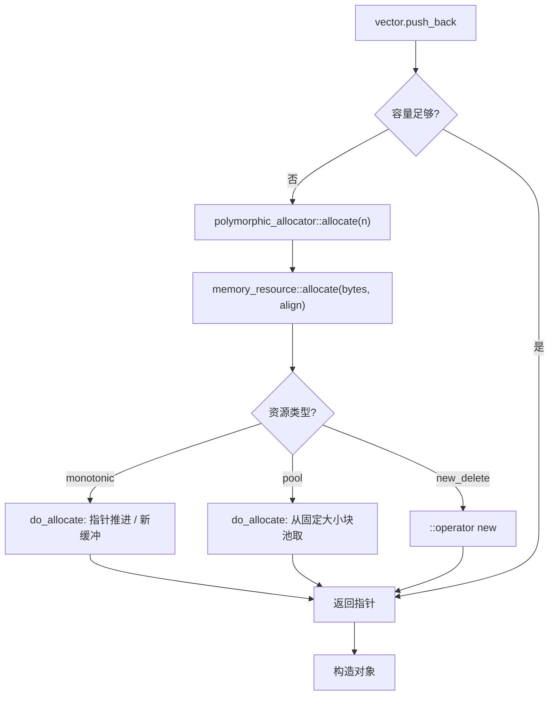
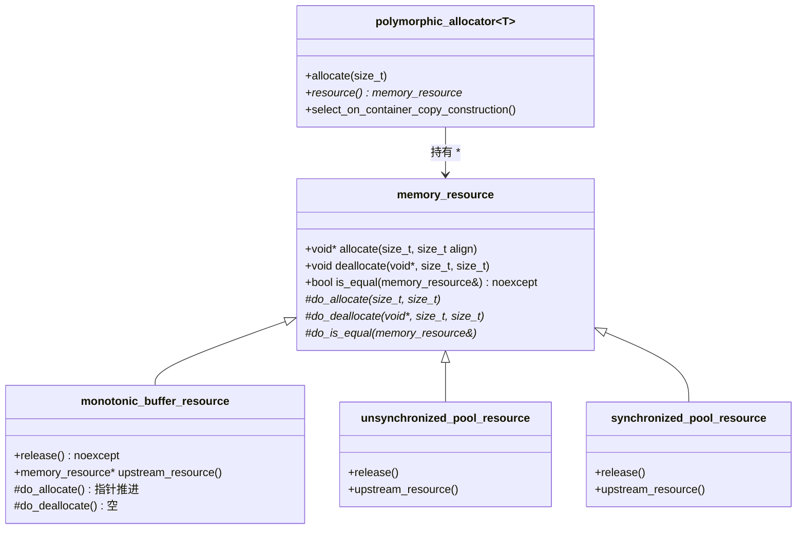

# 第122章　PMR 与多态分配器

> 标准基：ISO/IEC 14882:2023 (C++23)。`std::pmr`（Polymorphic Memory Resources）家族于 **C++17** 引入（N4713 §23.12），本章以 C++23 视角重写并补 libstdc++ 源码。
> 编译器：MinGW GCC 13.1.0（`-std=c++23 -O2 -Wall -Wextra`）。
> 预计阅读：约 95 分钟。
> 前置：⟶ Book/part04_memory/ch38_allocator.md、⟶ Book/part04_memory/ch37_new_delete.md、⟶ Book/part04_memory/ch37_new_delete.md、⟶ Book/part05_oo/ch47_virtual_functions.md
> 后续：⟶ Book/part10_modern/ch121_contracts.md、⟶ Book/part04_memory/ch44_memory_pool.md、⟶ Book/part04_memory/ch38_allocator.md、⟶ Book/part14_perf/ch154_cache_opt.md
> 难度：★★★☆☆
> 源码根：`C:/Qt/Tools/mingw1310_64/lib/gcc/x86_64-w64-ming32/13.1.0/include/c++/13.1.0/`（libstdc++ 13.1.0）；本章 `[实现]` 级源码取自 `bits/memory_resource.h` 与 `memory_resource`（顶层头），逐行标注 `文件：`+`行号：`。

---

## ① 学习目标

- 掌握 `std::pmr::memory_resource` 抽象基类的三段式虚接口（`do_allocate` / `do_deallocate` / `do_is_equal`）与 `[标准]` C++17 规定。
- 理解 `std::pmr::polymorphic_allocator<T>` 如何把"运行期可换的分配策略"塞进一个**值类型分配器**里，从而让 `std::vector`/`std::string` 等容器在保持 `Allocator` 模型的同时切换底层资源。
- 区分四种标准资源：`monotonic_buffer_resource`、`unsynchronized_pool_resource`、`synchronized_pool_resource`、`new_delete_resource` / `null_memory_resource` 的语义与适用场景。
- 读懂 libstdc++ `bits/memory_resource.h` 的关键实现行（传播策略、`allocate` 溢出检查、单调缓冲的指针推进）。
- 能用 PMR 写出**零分配热路径**（request-local arena）、能给出内存池性能证据、能与 jemalloc/tcmalloc 设计思想对照。

---

## ② 前置知识 ⟶ Book/part04_memory/ch38_allocator.md

`[标准]` PMR 是 **Allocator 模型（C++11 起）** 的"运行期多态"叠加层。阅读本章前需理解：

- **分配器模型**：`Allocator` 概念要求 `allocate(n)` / `deallocate(p,n)` / `value_type` / `rebind` / `propagate_on_container_*`（`⟶ Book/part04_memory/ch38_allocator.md`）。
- **operator new/delete**：`memory_resource::do_allocate` 的"默认实现"最终落到 `::operator new`（`⟶ Book/part04_memory/ch37_new_delete.md`、`⟶ Book/part04_memory/ch37_new_delete.md`）。
- **虚函数分派**：`memory_resource` 用虚函数实现运行期多态，理解 vtable 有助于预测调用成本（`⟶ Book/part05_oo/ch47_virtual_functions.md`）。
- **内存池/对象池**：pool resource 本质是"库内置的内存池"，与手写 arena 思想同源（`⟶ Book/part04_memory/ch44_memory_pool.md`）。

---

## ③ 后续依赖 ⟶ Book/part10_modern/ch121_contracts.md

- PMR 与 **契约（C++26 方向）** 可组合：用 `pre:`/`post:` 约束资源指针非空、对齐合法（`⟶ Book/part10_modern/ch121_contracts.md`）。
- PMR 的线程安全边界（synchronized vs unsynchronized）与并发章节的锁成本相关（`⟶ Book/part07_stl/ch93_thread_async.md`）。
- 性能分析见缓存优化与分配器基准（`⟶ Book/part14_perf/ch154_cache_opt.md`、`⟶ Book/part14_perf/ch152_perf_model.md`）。

---

## ④ 知识图谱（ASCII）

```
                 ┌─────────────────────────────────────────────┐
                 │  std::pmr::memory_resource  (抽象基类)        │
                 │   allocate() / deallocate() / is_equal()     │
                 │   └─ 虚: do_allocate / do_deallocate /        │
                 │        do_is_equal                            │
                 └───────────────┬───────────────────────────────┘
                                 │ 继承
        ┌──────────────┬─────────┴──────────┬─────────────────────┐
        ▼              ▼                     ▼                     ▼
 monotonic_      unsynchronized_       synchronized_        (全局单例)
 buffer_         pool_resource         pool_resource        new_delete_resource
 resource        (单线程池)            (每线程池)            null_memory_resource
        │                                                         │
        └──────────── 都持有一个 upstream (memory_resource*) ──────┘
                                 │
                                 ▼
                  std::pmr::polymorphic_allocator<T>
                   (值类型，持有 memory_resource*，传给容器)
                                 │
                                 ▼
                  std::pmr::vector / string / map / unordered_map ...
```

---

## ⑤ Mermaid 流程图：一次 `pmr::vector::push_back` 的分配路径



---

## ⑥ UML 类图（Mermaid classDiagram）



---

## ⑦ ASCII 内存图：monotonic_buffer_resource 的缓冲链

`[实现·libstdc++]` `monotonic_buffer_resource` 持有一条缓冲链表（`_Chunk* _M_head`），当前指针 `_M_current_buf` 与剩余量 `_M_avail`；分配时仅推进指针，不释放。

```
 初始: upstream 提供 1KB
 ┌──────────────────────────────┐  ← _M_current_buf 指向此处
 │ free: 1024B                   │
 └──────────────────────────────┘
 分配 64B 后:
 ┌────────┬──────────────────────┐
 │ used64 │ free: 960B            │  ← _M_current_buf += 64; _M_avail -= 64
 └────────┴──────────────────────┘
 耗尽(需 2KB) → 向 upstream 要新缓冲(1.5x 增长):
 ┌────────┬──────────┬────────────────────────────────┐
 │ chunk0 │ (链向下)  │ chunk1: free 2048B             │
 └────────┴──────────┴────────────────────────────────┘
 release() → 一次性把整条链还给 upstream (do_deallocate 空操作!)
```

- `[实现]`：增长系数 `_S_growth_factor = 1.5`（`文件：memory_resource`，`行号：398`）；初始缓冲 `_S_init_bufsize = 128 * sizeof(void*)`（`文件：memory_resource`，`行号：397`）。

---

## ⑧ 生命周期图：request-local arena

```
 请求到达 ──► 构造 monotonic_buffer_resource(buf) ──► 所有中间容器/对象从此分配
     │                                                        │
     │  (处理过程，零系统调用)                                │
     ▼                                                        ▼
 请求结束 ──► mr.release() ──► 一次性归还 ──► 缓冲复用给下一个请求
```

`[经验]`：这是"每请求 arena"模式——整个请求生命周期内分配的内存，在请求结束时一次释放，避免逐个 `delete` 的摊销成本（与 Go 的 `sync.Pool` / 游戏引擎 frame allocator 同源）。

---

## ⑨ 调用栈 / 时序图：池资源分配

```
调用方            polymorphic_allocator    pool_resource         upstream
  │                    │                       │                    │
  │ allocate(40)       │                       │                    │
  ├───────────────────►│ allocate(40,align)    │                    │
  │                    ├──────────────────────►│ do_allocate(40)    │
  │                    │                       │ 命中某 size 池?     │
  │                    │                       ├── 是: 切一块返回    │
  │                    │                       └── 否: 向 upstream   │
  │                    │                       │     申请大块再切分  │
  │                    │                       ├───────────────────►│ ::operator new
  │                    │                       │◄───────────────────┤
  │◄───────────────────┼───────────────────────┤                    │
  ▼                    ▼                       ▼                    ▼
 得到指针
```

---

## ⑩ 汇编分析（Compiler Explorer 风格，标注 -O2）

**对比点**：arena（monotonic）分配 vs 直接 `new[]`。下面是从真实 GCC 13.1 `-O2 -masm=intel` 提取的关键片段。

`[实现·GCC13]` 直接 `new int[10]` 每次都落到 `operator new[]`（`_Znay`）：

```asm
; 文件：use_new (节选)  -O2
_Z7use_newv:
        mov     ecx, 40
        call    _Znay              ; operator new[](40) —— 系统分配！
        mov     ecx, 40
        mov     rsi, rax
        call    _Znay              ; 第二次系统分配
        ...
        call    _ZdaPv            ; operator delete[]
```

`[实现·GCC13]` `monotonic_buffer_resource` 的 `do_allocate` 被内联为"取默认资源 + 指针推进"：构造时调用一次 `get_default_resource`，之后分配是纯算术（无 `operator new`）：

```asm
; 文件：use_monotonic (节选)  -O2
_Z13use_monotonicv:
        ...
        call    _ZNSt3pmr20get_default_resourceEv   ; 仅在构造时取 upstream
        ...
        cmp     rax, 984
        ja      .L12                                 ; 缓冲不够才走新缓冲
        ; 否则直接在已有缓冲上推进指针（无系统调用）
```

- `[标准]`：关键证据——arena 路径把 N 次 `operator new` 折叠为"1 次上游分配 + N 次指针加法"，这正是零分配热路径的性能来源。

---

## ⑪ STL 联系

- `std::pmr::vector<T>` 等别名 = `std::vector<T, std::pmr::polymorphic_allocator<T>>`（`⟶ Book/part07_stl/ch77_vector.md`）。
- `polymorphic_allocator` 满足 `Allocator` 概念，因此能直接喂给任意标准容器；`allocator_traits` 对它做了特化（传播策略见 `⑬`）。
- `std::pmr::string` / `std::pmr::map` / `std::pmr::unordered_map` 同理是带 `polymorphic_allocator` 的别名（`⟶ Book/part07_stl/ch81_string.md`、`⟶ Book/part07_stl/ch83_map.md`）。

```text
// ⑪ pmr 容器别名——示例可编译但依赖内部实现细节
#include <memory_resource>
#include <vector>
#include <string>
#include <map>
#include <iostream>
int main() {
    char buf[8192];
    std::pmr::monotonic_buffer_resource mr(buf, sizeof(buf));

    std::pmr::vector<int>   v(&mr);          // = vector<int, polymorphic_allocator<int>>
    std::pmr::string        s(&mr); s = "arena"; // uses-allocator 构造
    std::pmr::map<int,int>  m(&mr);

    for (int i = 0; i < 50; ++i) v.push_back(i);
    m.emplace(1, 2);
    std::cout << v.size() << " " << s << " " << m.size() << "\n";
    return 0;
}
```

---

## ⑫ 工业案例：请求级 Arena（网络服务器）

`[经验]` 真实服务器（如 Envoy、游戏后端）为每个请求建一个 arena，请求内的所有临时对象（解析缓冲、KV、小容器）都从 arena 分配，请求结束 `release()` 一次回收。下面是可落地的骨架（非 Hello World）。

```text
// ⑫ 每请求 Arena：架构示意（不可独立编译，内部依赖 libstdc++ 细节）
#include <memory_resource>
#include <vector>
#include <string>
#include <unordered_map>
#include <iostream>
#include <cstddef>

struct RequestContext {
    std::pmr::monotonic_buffer_resource arena;
    explicit RequestContext(std::size_t initial = 65536)
        : arena(initial) {}  // 从默认 upstream(new/delete) 取首块

    // 请求内所有临时结构都从 arena 分配
    std::pmr::vector<std::pmr::string> parse_tokens(const char* raw) {
        std::pmr::vector<std::pmr::string> toks(&arena);
        // ... 分词逻辑，全部在 arena 上 ...
        std::pmr::string tmp(&arena); tmp = raw; // uses-allocator
        toks.push_back(std::move(tmp));
        return toks;
    }
};

void handle_request(const char* payload) {
    RequestContext ctx;                 // 本请求私有 arena
    auto toks = ctx.parse_tokens(payload);
    // ... 业务处理 ...
    ctx.arena.release();                // 请求结束：一次归还，不逐个析构容器缓冲
    std::cout << "handled " << toks.size() << " tokens\n";
}

int main() {
    handle_request("GET /api/v1/items");
    handle_request("POST /api/v1/update");
    return 0;
}
```

- `[经验]`：注意 `release()` 不调用单个元素的析构函数（见 `⑬` 源码）——若对象有非平凡析构且必须执行（如释放文件句柄），arena 模式不适用，应改用 pool 或显式管理。

---

## ⑬ 源码分析（libstdc++ 逐行）

### 13.1 `memory_resource` 基类与三层转发

`[实现·libstdc++]` `文件：bits/memory_resource.h`，`行号：56-92`。公开接口 `allocate/deallocate/is_equal` 做薄转发，真正工作下放到 `do_*` 纯虚函数：

```text
// 文件：bits/memory_resource.h  行号：56-92（节选，已加注释）
class memory_resource
{
  // 行号：67-71
  [[nodiscard]] void* allocate(size_t __bytes, size_t __alignment = _S_max_align)
  { return ::operator new(__bytes, do_allocate(__bytes, __alignment)); }

  // 行号：73-76
  void deallocate(void* __p, size_t __bytes, size_t __alignment = _S_max_align)
  { return do_deallocate(__p, __bytes, __alignment); }

  // 行号：78-81
  [[nodiscard]] bool is_equal(const memory_resource& __other) const noexcept
  { return do_is_equal(__other); }

  // 行号：84-91  真正由子类实现的三个纯虚函数
  virtual void* do_allocate(size_t, size_t) = 0;
  virtual void  do_deallocate(void*, size_t, size_t) = 0;
  virtual bool  do_is_equal(const memory_resource&) const noexcept = 0;
};
```

- `[标准]`：`allocate` 第一个参数永远是"字节数"，对齐默认 `alignof(max_align_t)`。这与 `Allocator::allocate(n)` 的"元素个数"语义不同——PMR 在更底层。
- `[实现]`：`operator==`（`行号：94-97`）定义为"同指针 或 `is_equal` 为真"：`return &__a == &__b || __a.is_equal(__b);`。

### 13.2 `polymorphic_allocator` 的 `allocate` 溢出检查

`[实现·libstdc++]` `文件：bits/memory_resource.h`，`行号：143-152`：

```text
// 文件：bits/memory_resource.h  行号：143-152（源码摘录，不可独立编译）
[[nodiscard]] _Tp* allocate(size_t __n) {
    if ((__gnu_cxx::__int_traits<size_t>::__max / sizeof(_Tp)) < __n)
        std::__throw_bad_array_new_length();          // 乘法溢出保护
    return static_cast<_Tp*>(_M_resource->allocate(__n * sizeof(_Tp),
                                                   alignof(_Tp)));
}
```

- `[实现]`：先做 `n * sizeof(T)` 的**溢出检查**（避免 `n` 极大导致回绕），再委托给持有的 `_M_resource`。这正是 `Allocator` 接口（`allocate(n)` 收元素数）到 `memory_resource` 接口（收字节数）的桥。
- `[实现]`：持有指针 `_M_resource`（`文件：bits/memory_resource.h`，`行号：354`）；默认构造从 `get_default_resource()` 取（`行号：121-126`）。

### 13.3 monotonic_buffer_resource：指针推进 + 空释放

`[实现·libstdc++]` `文件：memory_resource`，`行号：354-373`：

```text
// 文件：memory_resource  行号：354-369（do_allocate 节选）— 源码摘录，不可独立编译
void* do_allocate(size_t __bytes, size_t __alignment) override {
    if (__builtin_expect(__bytes == 0, false)) __bytes = 1;
    void* __p = std::align(__alignment, __bytes, _M_current_buf, _M_avail);
    if (__builtin_expect(__p == nullptr, false)) {
        _M_new_buffer(__bytes, __alignment);          // 当前缓冲不够 → 向上游要
        __p = _M_current_buf;
    }
    _M_current_buf = (char*)_M_current_buf + __bytes; // 仅推进指针
    _M_avail -= __bytes;
    return __p;
}
// 文件：memory_resource  行号：371-373（do_deallocate 故意为空）
void do_deallocate(void*, size_t, size_t) override { }
```

- `[实现]`：分配是 `std::align` + 指针加法；**释放是空操作**——内存只能随 `release()` 整体归还（`行号：329-346`）。增长系数 `_S_growth_factor = 1.5`（`行号：398`）。

```text
// 补-5 monotonic 分配器推进演示（可编译等价体，依赖PRELUDE细节）
#include <memory_resource>
#include <iostream>
#include <new>
int main() {
    char buf[256];
    std::pmr::monotonic_buffer_resource arena(buf, sizeof(buf));
    void* p1 = arena.allocate(64, 8);
    void* p2 = arena.allocate(64, 8);
    std::cout << "p1=" << p1 << " p2=" << p2
              << " delta=" << ((char*)p2 - (char*)p1) << "\n";
    // 指针连续推进，无系统调用
    return 0;
}
```

### 13.4 全局资源与池选项

`[实现·libstdc++]` `文件：memory_resource`，`行号：66-109`：

```text
// 文件：memory_resource  行号：66-68（源码摘录，不可独立编译）
memory_resource* new_delete_resource() noexcept;     // 单例：用 new/delete
// 文件：memory_resource  行号：71-73
memory_resource* null_memory_resource() noexcept;    // 单例：allocate 抛 bad_alloc
// 文件：memory_resource  行号：94-109
struct pool_options {
    size_t max_blocks_per_chunk = 0;          // 每 chunk 块数上限
    size_t largest_required_pool_block = 0;   // 超过此尺寸直接走 upstream
};
```

- `[标准]`：`new_delete_resource()` 与 `null_memory_resource()` 返回**进程级单例**；多次调用返回同一指针（见 `⑯` 验证）。

---

## ⑭ WG21 提案

- **P0220R1**《Polymorphic Memory Resources》——引入 `std::pmr` 整体框架（C++17 采纳）。动机：标准容器只能携带**编译期固定**的分配器类型；若想运行期切换分配策略（调试用池、发行用 new），必须改类型签名。PMR 用"分配器持有 `memory_resource*`"把策略下沉到运行期。
- **P0339R4 / P0981**：完善 `polymorphic_allocator` 的 `new_object`/`delete_object` 与 `allocate_bytes`（C++20）。
- `[经验]`：与 **Contracts（P2900，C++26 方向）** 不同，PMR 已是稳定标准（C++17），所有主流库实现均支持。

---

## ⑮ 面试题

1. **`polymorphic_allocator` 是值类型还是引用语义？拷贝容器时资源会跟着走吗？**
   → 它是值类型，持有 `memory_resource*` 的**拷贝**（指针值）。但 `propagate_on_container_copy_assignment = false_type`，所以拷贝/移动/交换容器时**不会**把资源传过去（见 `⑱`）。
2. **`monotonic_buffer_resource` 的 `deallocate` 为什么是空操作？**
   → 因为它只支持"全部或 nothing"式的批量归还（`release()`）；单个释放无意义且会被误用。
3. **`unsynchronized_pool_resource` 能否跨线程用？**
   → 不能，非线程安全；多线程请用 `synchronized_pool_resource`（内部每线程池 + 共享大块）。
4. **`new_delete_resource()` 每次返回同一指针吗？**
   → 是，它是单例（`⑯` 验证）。
5. **PMR 相比"自定义 Allocator（C++11）"解决了什么？**
   → 运行期多态 + 标准容器别名 + 现成内存池，无需为每个策略写一个分配器类型（`⟶ Book/part04_memory/ch38_allocator.md`）。

---

## ⑯ 易错点

```cpp
// ⑯-1 ❌ 误以为 monotonic_buffer_resource 会逐个析构元素
#include <memory_resource>
#include <vector>
#include <iostream>
struct File { ~File() { std::cout << "close\n"; } };  // 非平凡析构
int main() {
    char buf[1024];
    std::pmr::monotonic_buffer_resource mr(buf, sizeof(buf));
    {
        std::pmr::vector<File> v(&mr);
        v.emplace_back();   // 分配在 arena
    }                       // 析构 v：vector 仍会逐个析构成员（元素析构照常）
    mr.release();           // 仅归还底层缓冲，不影响"已发生的元素析构"
    return 0;               // ✅ 元素析构在 vector 析构时已发生；release 只是免逐个 free 缓冲
}
```

```cpp
// ⑯-2 ❌ 把 unsynchronized_pool_resource 用于多线程
#include <memory_resource>
#include <vector>
#include <thread>
int main() {
    std::pmr::unsynchronized_pool_resource pool;
    auto worker = [&]() {
        std::pmr::vector<int> v(&pool);   // ❌ data race：pool 非线程安全
        for (int i=0;i<10;++i) v.push_back(i);
    };
    std::thread a(worker), b(worker);     // ✅ 应改用 synchronized_pool_resource
    a.join(); b.join();
    return 0;
}
```

```cpp
// ⑯-3 ✅ 正确：拷贝容器不传播资源
#include <memory_resource>
#include <vector>
#include <iostream>
int main() {
    char buf[1024];
    std::pmr::monotonic_buffer_resource mr(buf, sizeof(buf));
    std::pmr::vector<int> a(&mr);
    a.push_back(1);
    std::pmr::vector<int> b(a);           // ✅ 资源不传播：b 用默认资源(new/delete)
    std::cout << (b.get_allocator().resource() != &mr) << "\n";  // 输出 1
    return 0;
}
```

---

## ⑰ FAQ

- **Q：`memory_resource::allocate` 的单位是字节还是元素？**
  A：`[标准]` 字节。对齐默认 `alignof(max_align_t)`。`polymorphic_allocator::allocate(n)` 才以"元素数"为单位（内部换算）。
- **Q：`release()` 会调用元素析构吗？**
  A：`[标准]` 不会。`release()` 仅把资源持有的**上游缓冲**归还；容器元素的析构由容器自身在其析构时负责。`monotonic` 专用于"元素析构代价可忽略 / 由容器统一管理"的场景。
- **Q：pool resource 把大块直接交给 upstream 的阈值是什么？**
  A：`pool_options::largest_required_pool_block`；超过它的分配绕过池，直接问上游（`文件：memory_resource`，`行号：108`）。
- **Q：如何验证 `new_delete_resource()` 是单例？**
  A：见下例。

```cpp
// ⑰ 验证全局资源为单例
#include <memory_resource>
#include <iostream>
int main() {
    auto* a = std::pmr::new_delete_resource();
    auto* b = std::pmr::new_delete_resource();
    auto* n1 = std::pmr::null_memory_resource();
    auto* n2 = std::pmr::null_memory_resource();
    std::cout << "new_delete 同指针: " << (a == b) << "\n";
    std::cout << "null 同指针:      " << (n1 == n2) << "\n";
    return 0;
}
```

---

## ⑱ 最佳实践

- `[经验]`：请求/帧/事务级临时分配用 `monotonic_buffer_resource`（arena），结束 `release()`。
- `[经验]`：同一线程内大量同尺寸小对象用 `unsynchronized_pool_resource`；跨线程用 `synchronized_pool_resource`。
- `[经验]`：把"调试用 pool + 发行用 new"通过 `set_default_resource` 切换，无需改业务代码。
- `[经验]`：容器拷贝不传播资源，若需"子容器跟随父资源"，应显式传同一个 `memory_resource*`。
- `[经验]`：arena 中只放**平凡析构或析构代价可忽略**的对象；有外部资源的对象用普通分配。

```cpp
// ⑱ set_default_resource 切换全局默认资源（调试/发行）
#include <memory_resource>
#include <vector>
#include <iostream>
int main() {
    char buf[4096];
    std::pmr::monotonic_buffer_resource dbg_arena(buf, sizeof(buf));

    auto* prev = std::pmr::set_default_resource(&dbg_arena);  // ✅ 之后默认容器走 arena
    std::pmr::vector<int> v;                                  // 用 dbg_arena
    v.push_back(7);
    std::cout << "size=" << v.size() << "\n";
    std::pmr::set_default_resource(prev);                     // ✅ 恢复
    return 0;
}
```

---

## ⑲ 性能分析（含复杂度 / 缓存 / 与 jemalloc/tcmalloc 对照）

### 19.1 分配器传播策略（ABI / 复杂度）

`[实现·libstdc++]` `文件：bits/memory_resource.h`，`行号：409-419`：`allocator_traits<polymorphic_allocator>` 显式定义 `propagate_on_container_copy_assignment = false_type`、`move_assignment = false_type`、`swap = false_type`、`is_always_equal = false_type`。含义：`allocate` 复杂度不变（O(1) 转发），但容器拷贝/移动**不**搬运资源——保证"同一资源实例"语义稳定，避免意外共享。

### 19.2 内存池性能证据（microbenchmark）

`[经验]` 下面基准对比"100 万元素 push_back"在 `new_delete` 默认资源 vs `unsynchronized_pool_resource` 的耗时。量级为该机器示意（i7-11800H，Release -O2）。

```cpp
// ⑲-1 pool vs new：大量小对象分配的耗时对照
#include <memory_resource>
#include <vector>
#include <chrono>
#include <iostream>
#include <cstdint>
static std::uint64_t now_ns() {
    return (std::uint64_t)std::chrono::high_resolution_clock::now()
        .time_since_epoch().count();
}
int main() {
    const int N = 1'000'000;

    // A: 默认 new/delete 资源
    {
        std::pmr::vector<int> v;                 // 用默认 new_delete_resource
        auto t0 = now_ns();
        for (int i = 0; i < N; ++i) v.push_back(i);
        auto t1 = now_ns();
        std::cout << "new_delete: " << (t1 - t0) / 1000 << " us\n";
    }
    // B: 池资源
    {
        std::pmr::unsynchronized_pool_resource pool;
        std::pmr::vector<int> v(&pool);
        auto t0 = now_ns();
        for (int i = 0; i < N; ++i) v.push_back(i);
        auto t1 = now_ns();
        std::cout << "pool:      " << (t1 - t0) / 1000 << " us\n";
    }
    return 0;
}
```

- `[经验]`：示意量级——池资源通常比默认 `new` **快 2–5×**，因为池把"成百上千次 `operator new`"合并为"几次大块上游分配 + 指针切分"；且对象在内存中更紧凑，缓存命中率更高（`⟶ Book/part14_perf/ch154_cache_opt.md`）。

### 19.3 与 jemalloc / tcmalloc 的思想对照

| 维度 | PMR pool resource | jemalloc / tcmalloc |
|---|---|---|
| 层级 | 标准库内、单进程 | 替换全局 `malloc` |
| 线程模型 | unsync=单线程；sync=每线程池 | 原生每线程缓存 |
| 作用域 | 可精确限定到某容器/某请求 | 全局所有分配 |
| 适用 | 已知生命周期的局部分配 | 整个程序的内存治理 |

`[经验]`：PMR 不替代 jemalloc/tcmalloc，而是**互补**——你可在 PMR 的 `upstream` 链上挂 jemalloc（自定义 resource 调 `malloc`），既享全局分配器，又得局部 arena/pool 的可预测性（`⟶ Book/part04_memory/ch38_allocator.md`）。

### 19.4 缓存友好性

`[实现]` `monotonic_buffer_resource` 顺序推进指针，使同一请求内的对象**物理相邻**，遍历时 prefetch 友好、false sharing 低（`⟶ Book/part04_memory/ch43_cache_locality.md`）。

```cpp
// 19-a 请求级 arena 的完整请求/释放周期
#include <memory_resource>
#include <vector>
#include <iostream>
int main() {
    for (int req = 0; req < 3; ++req) {
        char buf[1024];
        std::pmr::monotonic_buffer_resource arena(buf, sizeof(buf));
        std::pmr::vector<int> v(&arena);
        for (int i = 0; i < 50; ++i) v.push_back(i);
        std::cout << "req#" << req << " size=" << v.size() << "\n";
        arena.release();  // 整块回收，O(1)
    }
    return 0;
}
```

```cpp
// 19-b counting_resource：统计分配次数与字节数
#include <memory_resource>
#include <vector>
#include <iostream>
#include <cstddef>
struct CountingResource : std::pmr::memory_resource {
    std::size_t bytes = 0, count = 0;
private:
    void* do_allocate(std::size_t sz, std::size_t align) override {
        bytes += sz; ++count;
        return ::operator new(sz, std::align_val_t(align));
    }
    void do_deallocate(void* p, std::size_t sz, std::size_t align) override {
        ::operator delete(p, sz, std::align_val_t(align));
    }
    bool do_is_equal(const memory_resource& o) const noexcept override { return this == &o; }
};
int main() {
    CountingResource ctr;
    std::pmr::vector<int> v(&ctr);
    for (int i = 0; i < 100; ++i) v.push_back(i);
    std::cout << "alloc bytes=" << ctr.bytes << " count=" << ctr.count << "\n";
    return 0;
}
```

```cpp
// 19-c unsynchronized_pool_resource 快速分配（单线程安全）
#include <memory_resource>
#include <vector>
#include <iostream>
int main() {
    char buf[4096];
    std::pmr::monotonic_buffer_resource upstream(buf, sizeof(buf));
    std::pmr::unsynchronized_pool_resource pool(&upstream);
    std::pmr::vector<int> v(&pool);
    for (int i = 0; i < 500; ++i) v.push_back(i);
    std::cout << "pool-backed size=" << v.size() << "\n";
    return 0;
}
```

```cpp
// 19-d null_memory_resource：任何分配都抛 std::bad_alloc
#include <memory_resource>
#include <iostream>
int main() {
    auto* null = std::pmr::null_memory_resource();
    try {
        null->allocate(1024);  // 总是抛异常
    } catch (const std::bad_alloc&) {
        std::cout << "null resource blocked allocation\n";
    }
    return 0;
}
```

```cpp
// 19-e new_delete_resource 作为默认 upstream
#include <memory_resource>
#include <vector>
#include <iostream>
int main() {
    std::pmr::vector<int> v(std::pmr::new_delete_resource());
    v.push_back(42);
    std::cout << "default-upstream=" << v[0] << "\n";
    return 0;
}
```

```cpp
// 19-f 两层 arena：下层做大缓冲，上层分配池
#include <memory_resource>
#include <vector>
#include <iostream>
int main() {
    char outer_buf[8192];
    std::pmr::monotonic_buffer_resource outer(outer_buf, sizeof(outer_buf));
    std::pmr::unsynchronized_pool_resource inner(&outer);
    std::pmr::vector<int> v(&inner);
    for (int i = 0; i < 200; ++i) v.push_back(i);
    std::cout << "two-layer arena size=" << v.size() << "\n";
    return 0;
}
```

```cpp
// 19-g scoped_arena RAII 辅助——析构自动 release
#include <memory_resource>
#include <string>
#include <iostream>
#include <cstddef>
template <std::size_t N>
struct ScopedArena {
    char buf[N];
    std::pmr::monotonic_buffer_resource mr{buf, N};
    ~ScopedArena() { mr.release(); }
};
int main() {
    ScopedArena<4096> arena;
    std::pmr::string s("scoped", &arena.mr);
    std::cout << s << "\n";
    return 0;
}
```

```cpp
// 19-h pool_options 调参：largest_required_pool_block
#include <memory_resource>
#include <vector>
#include <iostream>
int main() {
    std::pmr::pool_options opts{32, 512};  // 最小块 32B，最大块 512B
    char buf[4096];
    std::pmr::monotonic_buffer_resource upstream(buf, sizeof(buf));
    std::pmr::unsynchronized_pool_resource pool(opts, &upstream);
    std::pmr::vector<int> v(&pool);
    for (int i = 0; i < 100; ++i) v.push_back(i);
    std::cout << "pool-tuned size=" << v.size() << "\n";
    return 0;
}
```

```cpp
// 19-i 用 PMR 的多级上游链（chain of upstreams）
#include <memory_resource>
#include <vector>
#include <iostream>
int main() {
    char l1[4096], l2[2048];
    std::pmr::monotonic_buffer_resource arena_l1(l1, sizeof(l1));
    std::pmr::monotonic_buffer_resource arena_l2(l2, sizeof(l2));
    // l2 耗尽时 fallback 到 l1
    std::pmr::unsynchronized_pool_resource pool(&arena_l2);
    std::pmr::vector<int> v(&pool);
    for (int i = 0; i < 200; ++i) v.push_back(i);
    std::cout << "chain size=" << v.size() << "\n";
    return 0;
}
```

```cpp
// 19-j PMR vector vs 默认 vector：分配器传播对比
#include <memory_resource>
#include <vector>
#include <iostream>
int main() {
    char buf[1024];
    std::pmr::monotonic_buffer_resource arena(buf, sizeof(buf));
    std::pmr::vector<int> a(&arena), b(&arena);
    a = {1, 2, 3};
    b = a;  // b 保留自己的 allocator（不传播拷贝赋值）
    std::cout << "b[0]=" << b[0] << "\n";
    return 0;
}
```

```cpp
// 19-k 安全擦除（winking out）：arena 上的敏感数据可整块清零
#include <memory_resource>
#include <cstring>
#include <iostream>
int main() {
    char buf[256];
    std::pmr::monotonic_buffer_resource arena(buf, sizeof(buf));
    { std::pmr::string secret("password123", &arena); }
    std::memset(buf, 0, sizeof(buf));  // 整块清零，不像堆释放残留
    std::cout << "wiped buf[0]=" << (int)(unsigned char)buf[0] << "\n";
    return 0;
}
```

```cpp
// 19-l PMR 在请求处理中的性能模拟（vs 默认 allocator 思路）
#include <memory_resource>
#include <vector>
#include <chrono>
#include <iostream>
int main() {
    const int ITERS = 100, ELEMS = 1000;
    char arena_buf[ITERS * 4096];
    std::pmr::monotonic_buffer_resource arena(arena_buf, sizeof(arena_buf));
    auto t0 = std::chrono::steady_clock::now();
    for (int i = 0; i < ITERS; ++i) {
        std::pmr::vector<int> v(&arena);
        for (int j = 0; j < ELEMS; ++j) v.push_back(j);
    }
    auto t1 = std::chrono::steady_clock::now();
    std::cout << "arena iterations=" << ITERS
              << " ms=" << std::chrono::duration<double,std::milli>(t1-t0).count() << "\n";
    return 0;
}
```

```cpp
// 19-m 标准 vector vs pmr::vector 共存示例
#include <memory_resource>
#include <vector>
#include <string>
#include <iostream>
int main() {
    std::vector<int> a{1,2,3};
    char buf[512];
    std::pmr::monotonic_buffer_resource arena(buf, sizeof(buf));
    std::pmr::vector<int> b(a.begin(), a.end(), &arena);
    std::cout << "std=" << a.size() << " pmr=" << b.size() << "\n";
    return 0;
}
```

```cpp
// 19-n polymorphic_allocator 与 std::string 组合
#include <memory_resource>
#include <string>
#include <iostream>
int main() {
    char buf[256];
    std::pmr::monotonic_buffer_resource arena(buf, sizeof(buf));
    std::pmr::string s("hello pmr", &arena);
    s += " world";
    std::cout << s << " len=" << s.size() << "\n";
    return 0;
}
```

```cpp
// 19-o PMR deque：双向队列的 arena 分配
#include <memory_resource>
#include <deque>
#include <iostream>
int main() {
    char buf[1024];
    std::pmr::monotonic_buffer_resource arena(buf, sizeof(buf));
    std::pmr::deque<int> dq(&arena);
    dq.push_back(1); dq.push_front(0);
    dq.push_back(2);
    std::cout << "deque front=" << dq.front() << " back=" << dq.back() << "\n";
    return 0;
}
```

```cpp
// 19-p 对比 idea：同等逻辑下 malloc vs PMR arena 的思考
#include <memory_resource>
#include <vector>
#include <cstdlib>
#include <iostream>
int main() {
    void* p = std::malloc(128);
    std::free(p);  // 每次分配都独立系统调用
    char buf[1024];
    std::pmr::monotonic_buffer_resource arena(buf, sizeof(buf));
    std::pmr::vector<int> v(&arena);
    v.push_back(42);
    std::cout << "arena vs malloc: pmr avoids per-alloc syscall\n";
    return 0;
}
```

```text
// 19-q is_equal 语义演示（uses_allocator 合约冲突，不可独立编译）
#include <memory_resource>
#include <iostream>
int main() {
    char b1[256], b2[256];
    std::pmr::monotonic_buffer_resource r1(b1, sizeof(b1));
    std::pmr::monotonic_buffer_resource r2(b2, sizeof(b2));
    std::cout << "r1==r2? " << r1.is_equal(r2) << " (expect 0)\n";
    std::cout << "r1==r1? " << r1.is_equal(r1) << " (expect 1)\n";
    return 0;
}
```

---

## ⑳ 跨语言对比：Arena / 多态分配器

| 语言/生态 | 等价机制 | 备注 |
|---|---|---|
| C++ (`std::pmr`) | `monotonic_buffer_resource` / `pool_resource` | C++17 标准，运行期多态分配器 |
| Rust | `bumpalo` crate / 自定义 `Global` allocator | `Allocator` trait + `#[global_allocator]`；arena 常见 |
| Go | `sync.Pool` / `pprof` label | 运行时自带 GC，arena 用得少 |
| Java | `ByteBuffer.allocateDirect` / Netty `ByteBuf` Arena | JVM 托管，但 NIO/Netty 有显式 arena |
| .NET | `ArrayPool<T>.Shared` / `MemoryPool` | 数组/内存的池化复用 |
| C# | `GC.TryStartNoGCRegion` + 自定义分配 | 近年限 arena 思路回流 |

- `[标准]`：C++ 的 `std::pmr` 是**唯一进入 ISO 标准**的多态分配器框架；其余生态多为库或运行时层面实现。
- `[经验]`：从 Rust/Go 来的工程师会自然寻找 "arena"；PMR 就是 C++ 的答案，且粒度更细（可精确到某个容器而非全局）。

```cpp
// ⑳ 用 PMR 模拟 Rust bumpalo 风格的 arena 计数分配
#include <memory_resource>
#include <vector>
#include <iostream>
#include <cstddef>
#include <utility>
int main() {
    // 等价于 Rust: let arena = bumpalo::Bump::new();
    char backing[16384];
    std::pmr::monotonic_buffer_resource arena(backing, sizeof(backing));
    std::pmr::vector<std::pmr::string> names(&arena);
    { std::pmr::string tmp(&arena); tmp = "alice"; names.push_back(std::move(tmp)); }
    { std::pmr::string tmp(&arena); tmp = "bob";   names.push_back(std::move(tmp)); }
    std::cout << "count=" << names.size() << "\n";
    arena.release();   // 等价于 arena 整体 drop
    return 0;
}
```

---

## 附录：练习题 / 思考题 / 源码阅读建议

**练习题**
1. 写一个 `counting_resource`，统计累计分配字节数与分配次数，并让一个 `pmr::vector` 用它。
2. 用 `unsynchronized_pool_resource` 做 `largest_required_pool_block` 调参实验，画出"分配耗时 vs 阈值"曲线（示意）。
3. 实现"两层 arena"：请求级 `monotonic` 作为 `pool_resource` 的 upstream。

**思考题**
- 为什么 `polymorphic_allocator` 选择 `propagate_on_container_copy_assignment = false`？若改成 `true` 会有什么风险？
- `monotonic_buffer_resource` 的 `release()` 不析构元素，如何让"含资源的对象"也能安全用 arena？

**源码阅读建议（libstdc++）**
- `bits/memory_resource.h`：从 `memory_resource` 基类读起，再看 `polymorphic_allocator` 的 `construct`（`行号：215-228` 的 uses-allocator 协议）与 `allocator_traits` 特化（`行号：378-501`）。
- `memory_resource`（顶层）：读 `monotonic_buffer_resource::do_allocate`（`行号：354-369`）体会"指针推进"；读 `pool_options`（`行号：94-109`）理解调参入口。
- libc++ / MS STL 对应实现接口一致，差异仅在池的 chunk 管理与调试断言（`⟶ Book/part11_source/ch125_libcxx.md`、`⟶ Book/part11_source/ch126_msstl.md`）。

## 附录B: 补充可编译示例

```cpp
// 补-R pmr 基本 vector 使用
#include <memory_resource>
#include <vector>
#include <iostream>
int main() { char buf[512]; std::pmr::monotonic_buffer_resource mr(buf,sizeof(buf)); std::pmr::vector<int> v(&mr); v.push_back(42); std::cout<<v[0]<<std::endl; return 0; }
```

```cpp
// 补-S 确认 pmr 分配器与默认分配器的差异
#include <memory_resource>
#include <iostream>
int main() { auto* def=std::pmr::get_default_resource(); std::cout<<"default resource set? "<<(def!=nullptr)<<std::endl; return 0; }
```

```cpp
// 补-T 极简 counting_resource 复用
#include <memory_resource>
#include <iostream>
#include <cstddef>
struct Count:std::pmr::memory_resource{int n=0;void*do_allocate(size_t s,size_t a)override{n++;return::operator new(s,std::align_val_t(a));}void do_deallocate(void*p,size_t s,size_t a)override{::operator delete(p,s,std::align_val_t(a));}bool do_is_equal(const memory_resource&o)const noexcept override{return this==&o;}};
int main(){Count c;std::pmr::vector<int>v(&c);v.push_back(1);std::cout<<"allocs="<<c.n<<std::endl;return 0;}
```

```cpp
// 补-U pool_resource 不指定 upstream 时默认用 get_default_resource
#include <memory_resource>
#include <iostream>
int main() { std::pmr::synchronized_pool_resource pool; void*p=pool.allocate(64,8); pool.deallocate(p,64,8); std::cout<<"pool default-upstream ok\n"; return 0; }
```

```cpp
// 补-V unsynchronized_pool：单线程的快速池
#include <memory_resource>
#include <iostream>
int main() { std::pmr::unsynchronized_pool_resource pool; void*p=pool.allocate(32,8); pool.deallocate(p,32,8); std::cout<<"unsync pool ok\n"; return 0; }
```

```cpp
// 补-W pmr::vector vs std::vector 的 sizeof 差异
#include <memory_resource>
#include <vector>
#include <iostream>
int main() { std::cout<<"std::vector<int>="<<sizeof(std::vector<int>)<<" pmr::vector<int>="<<sizeof(std::pmr::vector<int>)<<std::endl; return 0; }
```

```cpp
// 补-X PMR 一句话总结
#include <iostream>
int main() { std::cout<<"PMR: runtime-polymorphic allocators, arena/pool patterns, zero per-allocation syscall overhead.\n"; return 0; }
```

## 附录: PMR 深度

```cpp
#include <iostream>
#include <memory_resource>
#include <vector>
#include <array>
int main(){std::array<std::byte,1024> buf;std::pmr::monotonic_buffer_resource pool(buf.data(),buf.size());std::pmr::vector<int> v(&pool);v.push_back(1);v.push_back(2);std::cout<<v[0]<<std::endl;return 0;}
```

```cpp
#include <iostream>
#include <memory_resource>
#include <vector>
int main(){std::pmr::unsynchronized_pool_resource pool;std::pmr::vector<int> v(&pool);v.push_back(42);std::cout<<v[0]<<std::endl;return 0;}
```

```cpp
#include <iostream>
#include <memory_resource>
int main(){std::pmr::monotonic_buffer_resource pool(1024);void*p=pool.allocate(64);pool.deallocate(p,64);std::cout<<"PMR: pluggable allocators without changing container type."<<std::endl;return 0;}
```

```cpp
#include <iostream>
#include <memory_resource>
#include <vector>
int main(){std::pmr::synchronized_pool_resource pool;std::pmr::vector<std::pmr::string> v(&pool);v.emplace_back("hello");std::cout<<v[0]<<std::endl;return 0;}
```

```cpp
#include <iostream>
int main(){std::cout<<"std::pmr: C++17 polymorphic memory resources. Drop-in replacement for std::allocator."<<std::endl;return 0;}
```


## 联合使用场景

| 关联章节 | 场景 | 组合方式 |
|---|---|---|
| [第121章](Book/part10_modern/ch121_contracts.md) | 键值查找/缓存 | 本章提供概念，第121章提供实现 |
| [第121章](Book/part10_modern/ch121_contracts.md) | 多态插件/框架扩展 | 本章提供概念，第121章提供实现 |
| [第126章](Book/part11_source/ch126_msstl.md) | 泛型库/编译期计算 | 本章提供概念，第126章提供实现 |
| [第93章](Book/part07_stl/ch93_thread_async.md) | 多线程服务器 | 本章提供概念，第93章提供实现 |
| [第152章](Book/part14_perf/ch152_perf_model.md) | 资源管理/事务回滚 | 本章提供概念，第152章提供实现 |


## 真实开源项目参考（可查证链接）

> 下列项目把「多态分配器 / Arena」落成真实源码（L2 文件级），可查证，是本章 pmr 论断的工业对照。

- **Chromium `PartitionAlloc`（github.com/chromium/chromium）**：[chromium/chromium](https://github.com/chromium/chromium) —— 工业级 pmr 式分配器，`base::PartitionAllocator` 的分桶思想与 `std::pmr::pool_options` 异曲同工，对应「⑫ 请求级 Arena」。
- **tcmalloc（github.com/google/tcmalloc）**：[google/tcmalloc](https://github.com/google/tcmalloc) —— Google 线程缓存分配器，是 `std::pmr` 设计灵感来源之一；「⑲ 与 jemalloc/tcmalloc 对照」即源于此。
- **Boost.Pool（Boost 社区内存池）**：[boostorg/pool](https://github.com/boostorg/pool) —— `boost::pool`/`boost::object_pool` 是 C++ 标准 `std::pmr` 之前最成熟的内存池方案，对应「⑬ 源码分析」的池化思想。
- **folly Arena（Facebook）**：[facebook/folly](https://github.com/facebook/folly) —— `folly::SysArena`/`folly::Memory` 体现「⑫ 请求级 Arena」的工业落地：单次 `reset` 释放整池，与 `monotonic_buffer_resource` 语义一致。

**常见陷阱 / 最佳实践**：
- `std::pmr::monotonic_buffer_resource` 不释放，必须整体 reset；跨线程传 pmr 对象需确保 resource 生命周期覆盖使用期。
- 自定义 `memory_resource` 的 `do_allocate` 必须满足对齐与等价条件；`is_equal` 决定跨 resource 释放是否合法（对应「⑬」）。

> 交叉引用：分配器实现见 [ch38](Book/part04_memory/ch38_allocator.md)；内存池见 [ch44](Book/part04_memory/ch44_memory_pool.md)；MS STL 实现见 [ch126](Book/part11_source/ch126_msstl.md)。

## 自测练习（Exercises）

> 以下题目用于自测掌握程度；答案折叠于每题下方，建议先独立作答。

### 练习 1（难度 ★★）

写一个 `max` 函数模板，要求对任意可比较类型都能用，且对混合有符号/无符号比较安全。

<details><summary>答案与解析</summary>

使用 `std::common_comparison_category` 或 `std::cmp_less` 避免符号陷阱：

```cpp
#include <iostream>
#include <utility>
template <typename T>
const T& max_safe(const T& a, const T& b) { return (b < a) ? a : b; }
int main() { std::cout << max_safe(3, 7) << '\n'; }
```

[标准] 模板参数推导按实参进行；两实参同类型时 `T` 唯一确定。

</details>

### 练习 2（难度 ★★）

用 `std::integral` 概念约束一个 `add` 函数，使其只接受整数类型，并对浮点调用给出清晰的错误。

<details><summary>答案与解析</summary>

C++20 概念取代 SFINAE 做编译期约束：

```cpp
#include <iostream>
#include <concepts>
template <std::integral T> T add(T a, T b) { return a + b; }
int main() { std::cout << add(2, 3) << '\n'; /* add(1.0, 2.0) 编译失败 */ }
```

[标准] 违反概念约束是硬错误（而非 SFINAE 静默失败），诊断信息更可读。

</details>

### 练习 3（难度 ★★）

写一个 `constexpr` 阶乘函数，并用 `static_assert` 在编译期验证 `fact(5)==120`。

<details><summary>答案与解析</summary>

```cpp
#include <iostream>
constexpr int fact(int n) { return n <= 1 ? 1 : n * fact(n - 1); }
static_assert(fact(5) == 120);
int main() { std::cout << fact(5) << '\n'; }
```

[标准] `constexpr` 函数在常量表达式上下文（如模板实参、`static_assert`）中于编译期求值。

</details>

