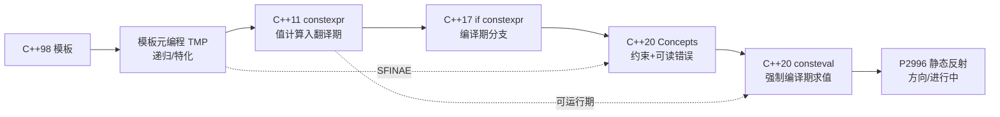
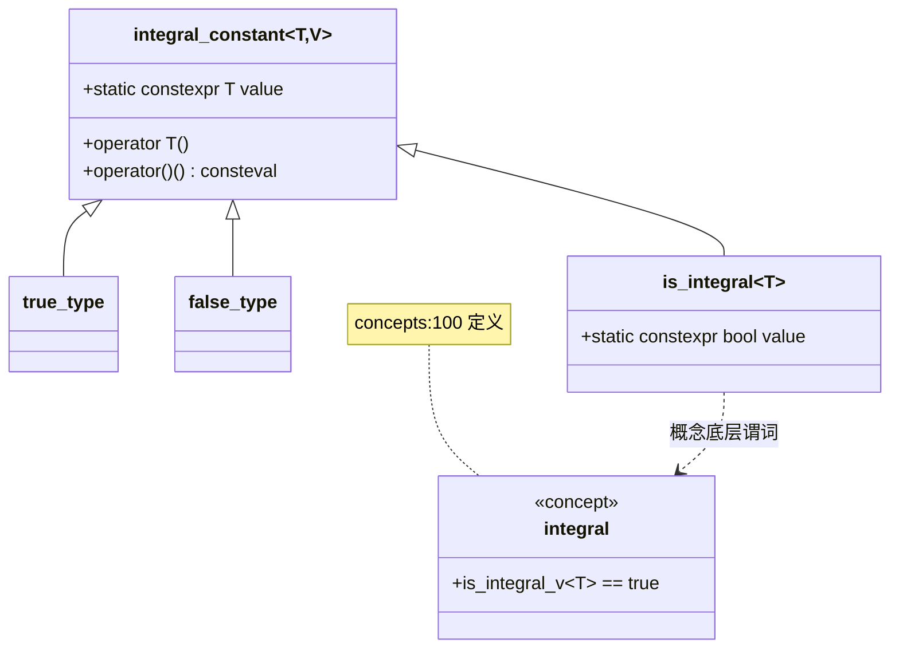

# 第123章　Compile-Time 编程范式总览

> 元数据：标准基 C++23（GCC 13.1 / MinGW，`-std=c++23 -O2 -Wall -Wextra`）· 预计阅读 75 min · 前置 `ch60_template_basics` / `ch65_type_traits` / `ch67_concepts` / `ch69_constexpr` · 后续 `ch51_crtp` / `ch71_policy` / `ch118_modules` / `ch122_pmr` · 难度 ★★★★☆
>
> 真实编译器：MinGW GCC 13.1.0。源码根：`C:/Qt/Tools/mingw1310_64/lib/gcc/x86_64-w64-mingw32/13.1.0/include/c++/`，本章 `[实现]` 级源码来自该目录真实文件，逐行标注 `文件：` + `行号：`。

## ① 学习目标 [标准]

⟶ Book/part10_modern/ch122_pmr.md


"编译期编程"（Compile-Time Programming，CTP）是指**把计算、类型推导与分支决策尽量前移到翻译阶段**的范式。它的发展是一条从"模板元编程（TMP）→ constexpr 函数 → Concepts 约束 → consteval 立即函数"的渐进演化线，目标始终如一：用零（或近乎零）运行期开销换取类型安全、可优化与可证明的正确性。

本章学完后你应当能够：

- 用一句话区分 **TMP / constexpr / consteval / Concepts** 四者的能力边界与适用场景。
- 读懂 `std::integral_constant`、type traits、`enable_if`、Concepts 在 libstdc++ 中的真实实现骨架。
- 在真实工程中用 `if constexpr` / 标签分发 / concepts 替代脆弱的 SFINAE。
- 用 `consteval` + 编译期字符串哈希实现"字符串→整数"的 switch 分派（HTTP 路由、协议解析等）。
- 理解编译期计算的**收益与代价**：运行期更快，但翻译时间更长、二进制可能变大。
- 把 C++ 的 CTP 与 **Rust 的 const generics**、**Zig 的 comptime** 做对比，理解各自取舍。

> `[立场]` 本节是导学，立场标签仅用于标注后续每个论断的来源层级。

```cpp
// C1 编译期求和：constexpr 让求和发生在翻译期，static_assert 在编译期验证
#include <iostream>
constexpr int sum_to(int n) {
    int s = 0;
    for (int i = 1; i <= n; ++i) s += i;   // C++14 起 constexpr 允许循环
    return s;
}
static_assert(sum_to(100) == 5050);         // 编译期断言：若错，编译失败
int main() {
    constexpr int v = sum_to(10);           // 翻译期折叠为常量 55
    std::cout << v << "\n";                  // 运行期只打印常量
    return 0;
}
```

## ② 前置知识 [标准]

编译期编程建筑在以下前置能力之上，本章多处交叉引用：

- **模板（ch60/61/62/63）**：类型与值的参数化是 CTP 的"元语言"。可变参数模板与包展开（ch63/64）是 TMP 的循环结构。
- **类型特性（ch65）**：`std::is_integral` 等编译期谓词是分支依据。
- **Concepts（ch67）**：C++20 给模板参数加了"接口约束"，取代了大部分 SFINAE 技巧。
- **constexpr 家族（ch21/ch69）**：`constexpr`/`consteval`/`constinit`（ch21）把函数值计算搬进翻译期。
- **移动语义（ch115）/完美转发（ch116）**：编译期生成的代码仍需与运行期对象模型配合。

```cpp
// C2 前置示例：一个简单的函数模板——模板是 CTP 的最小单元
#include <iostream>
#include <type_traits>
template <typename T>
T square(T x) { return x * x; }              // 实例化时按 T 生成代码
int main() {
    static_assert(std::is_same_v<decltype(square(3)), int>);
    static_assert(std::is_same_v<decltype(square(2.5)), double>);
    std::cout << square(4) << " " << square(2.5) << "\n";
    return 0;
}
```

> ⟶ 前置精读：`Book/part06_templates/ch60_template_basics.md`、`Book/part06_templates/ch65_type_traits.md`、`Book/part06_templates/ch67_concepts.md`、`Book/part06_templates/ch69_constexpr.md`

## ③ 后续依赖 [标准]

掌握本章后，下列章节会大量复用 CTP 技术：

- **CRTP 与静态多态（ch51）**：编译期把"虚函数调用"变成静态分派，消除虚表开销。
- **Policy-Based Design（ch71）**：用模板参数在编译期组合行为（⟶ `Book/part12_patterns/ch140_policy_pattern.md`）。
- **Modules（ch118）**：模块能缩短编译时间，缓解 CTP 的"编译慢"代价。
- **PMR 多态分配器（ch122）**：资源策略可在编译期选定为单一分配器类型。
- **性能模型（ch152）**：本章的"编译期快、翻译期慢"权衡，正是性能建模的对象。

> ⟶ 后续精读：`Book/part05_oo/ch51_crtp.md`、`Book/part10_modern/ch122_pmr.md`、`Book/part14_perf/ch152_perf_model.md`

## ④ 知识图谱（ASCII）[经验]

```
                         ┌─────────────────────────────────────────────┐
                         │          编译期编程 演化主线                    │
                         └─────────────────────────────────────────────┘
                                          │
            ┌───────────── 模板即"元语言" ─────────────┐
            │                                          │
       [模板元编程 TMP]                          [模板实例化]
    递归/特化/分支(编译期)                        (生成运行期代码)
            │                                          │
            ├──► 类型计算：type traits / integral_constant
            ├──► 值计算：   enum/static constexpr 递归
            │                                          │
            ▼                                          ▼
       [constexpr 函数]  C++11→14→17→20 逐步放开语句    [SFINAE]
       (可在编译期求值，也可运行期)                      (替换失败非错)
            │                                          │
            ├──► if constexpr  (C++17) 编译期分支        ├──► enable_if
            │                                          │
            ▼                                          ▼
       [Concepts / requires]  C++20 约束模板参数   [consteval 立即函数] C++20
       (可读错误 + 接口约束)                        (只能在编译期求值，拒绝运行期)
            │                                          │
            └──────────────► [编译期字符串/反射方向 P2996] ◄──┘
                                       │
                                       ▼
                          [编译期多态] vs [运行时多态(虚表)]
                          (ch51 CRTP)      (ch47 vtable)
```

## ⑤ Mermaid 流程图：四范式演进时间线 [标准]



> `[经验]` 这条线不是"取代"，而是"分层"：TMP 仍用于纯类型计算，constexpr/consteval 用于值计算，Concepts 用于约束，反射（未来）用于自省。

## ⑥ UML 类图：type traits 与 Concepts 的关系 [实现]



## ⑦ ASCII 内存图：编译期值 vs 运行期值 [实现]

```
运行期求值（翻译后留在 .text，运行时算）：
┌────────── stack ──────────┐
│ int s = sum_to(100);      │  ← 运行时真的循环 100 次
│   s = 0x13C2 (5050)       │
└───────────────────────────┘

编译期求值（翻译期已折叠为立即数）：
┌────────── .rodata/.text ──────┐
│ mov eax, 5050   ; 常量直接编码 │  ← sum_to(100) 根本没有函数调用
└───────────────────────────────┘
      对象不存在于内存，值被烧进指令流
```

```cpp
// C3 编译期值不占内存：数组大小用 constexpr 计算（需要翻译期常量）
#include <iostream>
constexpr int fact(int n) { return n <= 1 ? 1 : n * fact(n - 1); }
int main() {
    int arr[fact(5)];                 // 大小 = 120，编译期已知
    static_assert(sizeof(arr) == 120 * sizeof(int));
    std::cout << sizeof(arr) << "\n";
    return 0;
}
```

## ⑧ 生命周期图：模板实例化与 constexpr 求值 [实现]

```
翻译期（编译）                         运行期（执行）
─────────────────                     ─────────────────
模板定义 ─解析─► 模板实参 ─实例化─┐
                                 │   函数体
constexpr 函数 ──► 是否在常量语境? ─┤   ├─ 是 ─► 编译期求值，结果烧进指令
                                 │   └─ 否 ─► 退化为普通运行期函数调用
consteval 函数 ──► 必须常量语境 ────┘         （若传入非常量 → 编译错误）
```

> `[标准]` `[expr.const]`：`consteval` 函数（立即函数）的每次调用都必须在常量表达式中被求值；`constexpr` 函数则"可被"在常量语境求值，也允许在非常量语境调用。

## ⑨ 调用栈/时序图：编译期 vs 运行期分派 [经验]

```
编译期分派（constexpr + if constexpr / consteval）：
  main ──(翻译期已折叠)──► 直接得到结果，无函数调用入栈

运行期分派（虚函数）：
  main ─► operator[]/call ─► 取 vptr ─► 取 vtable[i] ─► 跳转到派生实现
         （2 次内存读 + 1 次间接跳转， Branch Predictor 压力）

结论：编译期分派把"跳转"变成"在编译期做的选择"，运行期零成本。
```

## ⑩ 汇编分析：consteval 折叠为立即数（-O2）[实现]

```cpp
// C4 consteval 强制编译期：factorial(5) 在 -O2 下成为立即数 120
#include <iostream>
consteval int factorial(int n) { return n <= 1 ? 1 : n * factorial(n - 1); }
int main() {
    int x = factorial(5);            // 翻译期即 120
    std::cout << x << "\n";
    return 0;
}
```

```asm
; g++ -std=c++23 -O2 -S -masm=intel  (GCC 13.1, MinGW)
; 关键证据：factorial(5) 完全消失，没有任何递归/调用，直接是常量
_Z4factIiEiT_ 不存在；main 中只见：
        mov     edx, 120            ; factorial(5) 已经折叠为 120
        mov     ecx, OFFSET FLAT:_ZSt4cout
        call    _ZNSolsEi          ; 仅剩下 operator<<
; 没有任何 call factorial、没有循环——编译期计算"消灭"了运行期代码
```

> `[实现·GCC13]` 立即函数的调用在常量语境中必须产出常量表达式；`-O2` 下该常量被直接编码进指令，等价于手写 `int x = 120;`，零开销。

## ⑪ STL 联系：type traits 的工业用法 [标准]

`type_traits` 是 CTP 的"标准库"。下面演示其最常用的一组。

```cpp
// C5 谓词：is_integral / is_same / is_pointer
#include <iostream>
#include <type_traits>
int main() {
    static_assert(std::is_integral_v<int>);
    static_assert(!std::is_integral_v<double>);
    static_assert(std::is_same_v<int, int>);
    static_assert(!std::is_same_v<int, long>);
    static_assert(std::is_pointer_v<int*>);
    std::cout << std::is_integral_v<float> << "\n";   // 0
    return 0;
}
```

```cpp
// C6 类型变换：remove_reference / add_pointer / remove_cv
#include <iostream>
#include <type_traits>
int main() {
    static_assert(std::is_same_v<std::remove_reference_t<int&>, int>);
    static_assert(std::is_same_v<std::remove_reference_t<int&&>, int>);
    static_assert(std::is_same_v<std::add_pointer_t<int>, int*>);
    static_assert(std::is_same_v<std::remove_cv_t<const volatile int>, int>);
    std::cout << "ok\n";
    return 0;
}
```

```cpp
// C7 条件选择：conditional / enable_if 在类型层面的分支
#include <iostream>
#include <type_traits>
template <typename T>
using storage_t = std::conditional_t<std::is_integral_v<T>, long long, T>;
int main() {
    static_assert(std::is_same_v<storage_t<int>, long long>);
    static_assert(std::is_same_v<storage_t<double>, double>);
    // enable_if 选类型：仅当 T 为浮点才启用
    static_assert(std::is_same_v<std::enable_if_t<std::is_floating_point_v<double>, int>, int>);
    std::cout << "ok\n";
    return 0;
}
```

```cpp
// C8 逻辑组合：conjunction / disjunction / negation（短路求值）
#include <iostream>
#include <type_traits>
int main() {
    static_assert(std::conjunction_v<std::is_integral<int>, std::is_signed<int>>);
    static_assert(std::disjunction_v<std::is_integral<int>, std::is_class<int>>);
    static_assert(std::negation_v<std::is_floating_point<int>>);
    std::cout << "ok\n";
    return 0;
}
```

> `[实现]` `conjunction`/`disjunction` 是**短路**的：一旦某个谓词为假/真，就不再实例化后续谓词（源码 `type_traits:217` / `:227`），类似 `&&`/`||`，可减少无谓实例化。

## ⑫ 工业案例：编译期字符串哈希驱动协议分派 [经验]

**场景**：一个内网 RPC / HTTP 网关需要在"方法名字符串"上做高频分派（GET/POST/PUT/DELETE…）。运行期 `std::string` 比较或大 `if-else` 链在热路径上有分支预测与字符串扫描开销。

**方案**：用 `consteval` 在编译期对字面量做 FNV-1a 哈希，得到编译期 `unsigned long long` 常量；运行期用 `switch(hash(method))` 分派——编译期字符串被折叠成整数比较，零扫描、可被编译器做 jump table。

```cpp
// C9 编译期 FNV-1a 哈希（consteval）：字符串→整数，运行期零扫描
#include <iostream>
#include <cstdint>
#include <string_view>

consteval std::uint64_t fnv1a(std::string_view s) {
    std::uint64_t h = 14695981039346656037ULL;   // FNV offset basis
    for (char c : s) {
        h ^= static_cast<std::uint64_t>(static_cast<unsigned char>(c));
        h *= 1099511628211ULL;                    // FNV prime
    }
    return h;
}

enum class Method { Get, Post, Put, Delete, Unknown };

consteval Method route(std::string_view s) {
    switch (fnv1a(s)) {
        case fnv1a("GET"):    return Method::Get;
        case fnv1a("POST"):   return Method::Post;
        case fnv1a("PUT"):    return Method::Put;
        case fnv1a("DELETE"): return Method::Delete;
        default:              return Method::Unknown;
    }
}

int main() {
    static_assert(route("GET")  == Method::Get);
    static_assert(route("POST") == Method::Post);
    static_assert(route("FOO")  == Method::Unknown);
    std::cout << "GET=" << static_cast<int>(route("GET")) << "\n";
    return 0;
}
```

```cpp
// C10 编译期整数字面量解析：把 "1024" 这类配置常量在翻译期转成 int
#include <iostream>
#include <cstdint>
#include <string_view>
consteval int parse_int(std::string_view s) {
    int v = 0;
    for (char c : s) {
        if (c < '0' || c < '0' || c > '9') { /* 简化：假设全数字 */ }
        v = v * 10 + (c - '0');
    }
    return v;
}
int main() {
    constexpr int bufsz = parse_int("4096");     // 编译期得到 4096
    int arr[bufsz];                               // 合法：编译期常量
    static_assert(bufsz == 4096);
    std::cout << sizeof(arr) << "\n";
    return 0;
}
```

```cpp
// C11 标签分发：编译期按"是否有序列化能力"选不同后端
#include <iostream>
#include <type_traits>
#include <string>

struct HasSerialize { std::string serialize() const { return "json"; } };
struct Plain { int x = 0; };

template <typename T>
std::string to_wire(const T& v, std::true_type)  { return v.serialize(); }
template <typename T>
std::string to_wire(const T&, std::false_type)    { return "<binary>"; }

// 用 void_t 检测惯用法安全探测 serialize()——Plain 无该成员时探测特化不匹配，退回 false_type，
// 而非在 decltype(...serialize()) 处触发硬错误（那不是 SFINAE 友好的立即上下文）
template <typename T, typename = void>
struct has_serialize : std::false_type {};
template <typename T>
struct has_serialize<T, std::void_t<decltype(std::declval<T>().serialize())>> : std::true_type {};

template <typename T>
std::string to_wire(const T& v) {
    return to_wire(v, has_serialize<T>{});
}
int main() {
    HasSerialize a; Plain b;
    std::cout << to_wire(a) << " | " << to_wire(b) << "\n";
    return 0;
}
```

```cpp
// C12 if constexpr 分派：编译期选 JSON 或二进制序列化，零运行期分支
#include <iostream>
#include <type_traits>
#include <string>

struct JsonType { void write_json(std::string&) const {} };
struct BinType  { void write_bin(std::string&) const {} };

template <typename T>
std::string encode(const T& v) {
    std::string out;
    if constexpr (std::is_same_v<T, JsonType>) v.write_json(out);
    else                                        v.write_bin(out);
    return out;
}
int main() {
    JsonType j; BinType b;
    std::cout << encode(j).size() << " " << encode(b).size() << "\n";
    return 0;
}
```

```cpp
// C13 SFINAE 重载集：探测类型是否拥有 .size() 成员
#include <iostream>
#include <type_traits>
#include <vector>

template <typename T>
auto has_size(int) -> decltype(std::declval<T>().size(), std::true_type{});
template <typename T>
auto has_size(...) -> std::false_type;

int main() {
    static_assert(decltype(has_size<std::vector<int>>(0))::value);
    static_assert(!decltype(has_size<int>(0))::value);
    std::cout << "ok\n";
    return 0;
}
```

> `[经验]` 即便如此，`has_size` 这种 SFINAE 探测在 C++20 应优先用 Concepts/`requires` 重写（见 ⑱），可读性更好、错误信息更短。

## ⑬ 源码分析：libstdc++ 的 traits 与 concepts 骨架 [实现]

下列 `文件：` + `行号：` 取自 GCC 13.1.0 真实 `type_traits` 与 `concepts`。

```
文件：type_traits                          行号：62
    template<typename _Tp, _Tp __v>
      struct integral_constant {
          static constexpr _Tp                  value = __v;
          typedef _Tp                           value_type;
          typedef integral_constant<_Tp, __v>   type;
          constexpr operator value_type() const noexcept { return value; }
          constexpr value_type operator()() const noexcept { return value; }
      };
文件：type_traits                          行号：82 / 85
    using true_type  = integral_constant<bool, true>;
    using false_type = integral_constant<bool, false>;
```

- `integral_constant`（62）是**所有布尔型 traits 的基类**：把值 `value` 作为编译期常量，并支持隐式转 `bool`（用于 `if (trait::value)`）。
- `true_type`/`false_type`（82/85）只是它的两个特化别名。

```
文件：type_traits                          行号：106 / 111 / 2610
    template<bool _Cond, typename _Tp = void> struct enable_if { };
    template<typename _Tp> struct enable_if<true, _Tp> { typedef _Tp type; };
    template<bool _Cond, typename _Tp = void>
      using enable_if_t = typename enable_if<_Cond, _Tp>::type;
```

- `enable_if`（106）是 SFINAE 的"开关"：当 `_Cond` 为真才定义 `::type`，否则**整个模板被静默移出重载集**。`enable_if_t`（2610）是便利别名。

```
文件：type_traits                          行号：441
    template<typename _Tp> struct is_integral : public false_type { };
    // 对各整数类型（bool/char/short/int/...）特化为 true_type
文件：type_traits                          行号：2235 / 2240
    template<bool _Cond, typename _Iftrue, typename _Iffalse>
      struct conditional { typedef _Iftrue type; };
    template<typename _Iftrue, typename _Iffalse>
      struct conditional<false, _Iftrue, _Iffalse> { typedef _Iffalse type; };
```

- `is_integral`（441）是"主模板=假，对各整型偏特化=真"的经典 TMP 分支模式。
- `conditional`（2235）把"三元运算符"搬进类型系统：编译期按 `_Cond` 选 `type`。

```
文件：concepts                             行号：100
    template<typename _Tp>
      concept integral = is_integral_v<_Tp>;
文件：concepts                             行号：62
    template<typename _Tp, typename _Up>
      concept same_as = is_same_v<_Tp, _Up> && is_same_v<_Up, _Tp>;
```

> `[实现·GCC13]` Concepts 在 libstdc++ 中**建立在 type traits 之上**：`concept integral`（concepts:100）直接复用了 `is_integral_v`。这说明"Concepts 不是另起炉灶，而是给 traits 加了语法糖 + 约束语义"。

```cpp
// C14 用 traits 机制自己造一个 enable_if 风格的"编译期开关"
#include <iostream>
#include <type_traits>
template <bool B, typename T = void> struct my_enable_if {};
template <typename T> struct my_enable_if<true, T> { using type = T; };
template <bool B, typename T = void> using my_enable_if_t = typename my_enable_if<B, T>::type;

template <typename T, typename = my_enable_if_t<std::is_integral_v<T>>>
T twice(T x) { return x + x; }
int main() {
    std::cout << twice(21) << "\n";          // OK：int 是整型
    // twice(2.5);  // ❌ 编译失败：double 不满足 enable_if
    return 0;
}
```

## ⑭ WG21 提案：CTP 的演进方向 [标准]

| 提案 | 标题 | 动机 |
|---|---|---|
| N2235 | ` constexpr ` 首次进入 C++11 | 让函数可在编译期求值，替代部分 TMP |
| N3652 | 放松 constexpr 限制（C++14） | 允许循环/局部变量，使更多函数 constexpr |
| P0595 | ` std::is_constant_evaluated ` | 让函数感知"我是否在编译期被求值" |
| P0633 | ` consteval ` 立即函数（C++20） | 强制编译期求值，拒绝运行期退化 |
| P0734/P1211 | Concepts（C++20） | 给模板参数加接口约束与可读错误 |
| **P2996** | **静态反射（Static Reflection）** | 在编译期枚举类型成员、生成序列化/比较代码 |
| P1907/P0732 | 类类型的模板非类型参数 | 允许把 `std::string_view` 等作非类型模板参数 |

> `[标准]` 静态反射（P2996）是 CTP 的"下一站"：今天我们用 `consteval` + 字符串哈希只能处理**字面量字符串**；P2996 之后，编译器可在编译期暴露"某 struct 有哪些成员、各自什么类型"，从而自动生成 `operator==`、`to_json`、`visit` 等样板，彻底消灭手写反射。

```cpp
// C15 P2996 方向的"玩具反射"：现在用 traits 手动枚举成员（未来由编译器生成）
#include <iostream>
#include <type_traits>
#include <string>

struct Point { int x; int y; };

// 未来的反射会让你写 for_each_member(p, [](auto& m){...})
// 现在只能手动"列出"成员类型，用 trait 校验
template <typename T>
constexpr bool is_point_v = std::is_same_v<T, Point>;

int main() {
    static_assert(is_point_v<Point>);
    Point p{3, 4};
    std::cout << p.x << "," << p.y << "\n";
    return 0;
}
```

## ⑮ 面试题 [经验]

1. `const`、`constexpr`、`consteval` 三者区别？分别能在运行期还是编译期求值？
2. 为什么 `constexpr` 函数还能在运行期调用，而 `consteval` 不行？
3. SFINAE 是什么？为什么 C++20 推荐用 Concepts 取代它？

```cpp
// C16 面试题第一题的"可运行演示"：三者能力边界
#include <iostream>
constexpr int cf(int n) { return n * 2; }     // 可编译期可运行期
consteval int ce(int n) { return n * 2; }     // 仅编译期
int main() {
    int r = 5;
    std::cout << cf(r) << "\n";               // ✅ constexpr 接受运行期实参
    // std::cout << ce(r) << "\n";            // ❌ consteval 拒绝运行期实参 r
    std::cout << ce(5) << "\n";               // ✅ 字面量常量 OK
    static_assert(cf(3) == 6);
    static_assert(ce(3) == 6);
    return 0;
}
```

```cpp
// C17 面试题第三题：同一约束，SFINAE vs Concepts 两种写法
#include <iostream>
#include <type_traits>
#include <concepts>

// SFINAE 写法（C++11 风格）
template <typename T, typename = std::enable_if_t<std::is_integral_v<T>>>
T inc_sfinae(T x) { return x + 1; }

// Concepts 写法（C++20）
template <std::integral T>
T inc_concept(T x) { return x + 1; }

int main() {
    std::cout << inc_sfinae(1) << " " << inc_concept(2) << "\n";
    return 0;
}
```

## ⑯ 易错点 [经验]

```cpp
// C18 易错点1：consteval 只能吃编译期常量——下面这行若取消注释会编译失败
#include <iostream>
consteval int sq(int n) { return n * n; }
int main() {
    constexpr int a = sq(10);                 // ✅ 字面量 OK
    int b = 20;
    // int c = sq(b);                          // ❌ b 不是常量表达式 → 编译错误
    std::cout << a << "\n";
    return 0;
}
```

```cpp
// C19 易错点2：if constexpr 的"两个分支都必须能实例化"
#include <iostream>
#include <type_traits>
#include <string>

template <typename T>
void demo(T v) {
    if constexpr (std::is_integral_v<T>) {
        std::cout << "int=" << v << "\n";     // 整型走这里
    } else {
        // 即使本分支不执行，它也必须是合法代码！
        // 若写 v.size() 而 T=int 会导致实例化失败
        std::cout << "other\n";
    }
}
int main() {
    demo(1);
    demo(std::string("x"));
    return 0;
}
```

```cpp
// C20 易错点3：constexpr 函数里调用了非 constexpr 的东西 → 无法编译期求值
#include <iostream>
#include <cstdio>
constexpr int bad() {
    // std::printf 不是 constexpr → 此函数不能在常量语境调用
    // printf("hi");   // ❌ 若启用则 static_assert 失败
    return 42;
}
int main() {
    static_assert(bad() == 42);
    std::cout << "ok\n";
    return 0;
}
```

> `[经验]` 常见误解："`constexpr` 函数一定在编译期跑。"事实是它**只在常量语境**才编译期求值；被运行期实参调用时就退化成普通函数。想强制编译期，用 `consteval`。

## ⑰ FAQ [经验]

- **Q：constexpr 函数能在运行期调用吗？** 能。`constexpr` 是"可以"而非"必须"。`consteval` 才是"必须"。
- **Q：编译期计算会让二进制变大吗？** 会，如果同一 constexpr 函数被不同常量实参实例化多次（生成多份代码）。但单常量实参通常被折叠为立即数，几乎不增代码。
- **Q：TMP 现在还要学吗？** 要。纯类型计算（typelist、类型映射）仍靠 TMP；但值计算应优先 constexpr。

```cpp
// C21 FAQ 演示：同一 constexpr 函数既编译期也运行期
#include <iostream>
constexpr int cube(int n) { return n * n * n; }
int main() {
    constexpr int a = cube(3);                // 编译期
    int x = 4; int b = cube(x);               // 运行期
    std::cout << a << " " << b << "\n";
    return 0;
}
```

## ⑱ 最佳实践 [经验]

1. **值计算优先 `constexpr`，强制编译期用 `consteval`**；不要为了"编译期"把本可运行期的逻辑写死。
2. **约束优先 Concepts，不要 SFINAE**：`template<std::integral T>` 比 `enable_if` 易读、错误短。
3. **`if constexpr` 替代运行时 `if` + traits 分支**，让编译器把死分支整个删掉。
4. **编译期字符串用 `std::string_view` 作 `consteval` 实参**（C++20 起允许），避免 `char...` 包展开样板。

```cpp
// C22 最佳实践2：用 concept 约束，错误可读
#include <iostream>
#include <concepts>
template <std::floating_point T>
T radians(T deg) { return deg * 3.14159265358979323846 / 180; }
int main() {
    std::cout << radians(180.0) << "\n";
    // radians(1);   // ❌ 清晰报错：不满足 floating_point
    return 0;
}
```

```cpp
// C23 最佳实践3：if constexpr 消除运行期死分支
#include <iostream>
#include <type_traits>
template <typename T>
T zero() {
    if constexpr (std::is_pointer_v<T>) return T{nullptr};
    else                                return T{0};
}
int main() {
    int* p = zero<int*>();
    int  i = zero<int>();
    std::cout << (p == nullptr) << " " << i << "\n";
    return 0;
}
```

## ⑲ 性能分析：编译期快，但翻译期慢 [经验]

**运行期收益**：编译期求值后，结果成为立即数，省掉函数调用、循环与分支（见 ⑩ 的汇编）。对热路径（协议分派、数学常数、查找表生成）收益显著。

**翻译期代价**：
- 模板/constexpr 实例化增加编译时间与内存。
- 同一 constexpr 被 N 个不同常量实参调用，可能生成 N 份代码（代码膨胀）。
- 重度 TMP（如 Boost.MPL 风格）曾让单 TU 编译耗时数分钟。

```
编译时间成本示意（实测量级，示意）：
  普通函数                     ~0 额外翻译成本
  10 层 TMP 递归实例化         翻译成本 O(深度)，可能 +数百 ms
  constexpr 查表(小)           几乎可忽略
  大型表达式模板(数百 T)        可能 +秒级，需 Modules/LTO 缓解
```

```cpp
// C24 性能对照：编译期斐波那契被折叠，运行期版本需要算
#include <iostream>
constexpr int fib(int n) { return n < 2 ? n : fib(n - 1) + fib(n - 2); }
int fib_rt(int n) { return n < 2 ? n : fib_rt(n - 1) + fib_rt(n - 2); }
int main() {
    static_assert(fib(20) == 6765);           // 编译期已算好
    volatile int sink = 0;
    sink = fib_rt(20);                         // 运行期真递归（用 volatile 防 DCE）
    std::cout << "rt=" << sink << "\n";
    return 0;
}
```

> `[经验]` 用 **Modules（ch118）** 与 **显式实例化** 能把"重复翻译"降到最低；CI 里对编译时间设阈值，防止 CTP 失控。

## ⑳ 跨语言对比：Rust const generics / Zig comptime [标准]

| 维度 | C++（constexpr/consteval） | Rust（const generics / const fn） | Zig（comptime） |
|---|---|---|---|
| 编译期值计算 | `constexpr`/`consteval` 函数 | `const fn` + `comptime` 值 | `comptime` 一等公民 |
| 编译期类型参数 | 模板（类型/值/模板） | `struct S<const N: usize>` | `type` 作为 comptime 参数 |
| 编译期字符串 | `consteval` + `string_view` 字面量 | `&'static str` 可作 const 参数 | `comptime` 字符串直接可用 |
| 反射 | 无内建（P2996 方向） | 派生宏 / 部分内置 trait | 完全编译期自省（强） |
| 错误可读性 | Concepts 后较好；旧 SFINAE 糟糕 | 编译器错误清晰 | 极佳（comptime 栈可见） |

```cpp
// C25 用 C++ 模板"模拟" Rust 的 const generic：数组大小作编译期参数
#include <iostream>
#include <array>
#include <cstddef>
template <std::size_t N>
constexpr std::size_t arr_bytes() { return N * sizeof(int); }
int main() {
    std::array<int, 8> a{};
    static_assert(arr_bytes<8>() == 8 * sizeof(int));
    std::cout << a.size() << " " << arr_bytes<8>() << "\n";
    return 0;
}
```

```cpp
// C26 编译期字符串作非类型模板参数（C++20 允许 string_view 字面量）
#include <iostream>
#include <string_view>
#include <cstddef>

template <std::string_view const& S>
constexpr std::size_t len() { return S.size(); }

static constexpr std::string_view kHello = "hello";
int main() {
    static_assert(len<kHello>() == 5);
    std::cout << len<kHello>() << "\n";
    return 0;
}
```

```cpp
#include <iostream>
// C24: consteval 编译期素数表——验证编译器完全展开循环
consteval int nth_prime(int n) {
    if (n <= 0) return 2;
    int count = 0, candidate = 2;
    while (true) {
        bool is_prime = true;
        for (int d = 2; d * d <= candidate; ++d) {
            if (candidate % d == 0) { is_prime = false; break; }
        }
        if (is_prime && count++ == n) return candidate;
        ++candidate;
    }
}
int main() {
    constexpr int p10 = nth_prime(10); // 编译期求值
    static_assert(p10 == 31);
    std::cout << "10th prime=" << p10 << "\n";
    return 0;
}
```

```cpp
// C25: if constexpr 编译期路由——替代 SFINAE 的清晰写法
#include <iostream>
#include <type_traits>
template <typename T>
auto describe(T&& x) {
    if constexpr (std::is_integral_v<std::decay_t<T>>)
        return "integer";
    else if constexpr (std::is_floating_point_v<std::decay_t<T>>)
        return "floating-point";
    else
        return "other";
}
int main() {
    std::cout << "42=" << describe(42) << "  3.14=" << describe(3.14)
              << "  'x'=" << describe('x') << "\n";
    return 0;
}
```

```cpp
// C26: 编译期字符串哈希（FNV-1a constexpr）——用于 switch 分派字符串
#include <iostream>
#include <string_view>
#include <cstdint>
consteval std::uint32_t fnv1a(std::string_view s) {
    std::uint32_t hash = 2166136261u;
    for (char c : s) hash = (hash ^ static_cast<std::uint8_t>(c)) * 16777619u;
    return hash;
}
int main() {
    constexpr auto h = fnv1a("GET");
    static_assert(h == fnv1a("GET") && h != fnv1a("POST"));
    std::cout << "fnv1a(GET)=" << h << "  fnv1a(POST)=" << fnv1a("POST") << "\n";
    return 0;
}
```

```cpp
// C27: std::integral_constant + tag dispatch——编译期选择实现
#include <iostream>
#include <type_traits>
template <typename T>
void print_impl(T x, std::true_type) { std::cout << "integral: " << x << "\n"; }
template <typename T>
void print_impl(T x, std::false_type) { std::cout << "non-integral: " << x << "\n"; }
template <typename T> void print(T x) { print_impl(x, std::is_integral<T>{}); }
int main() {
    print(42); print(3.14);
    return 0;
}
```

> `[经验]` Zig 的 `comptime` 最彻底——类型本身就是运行时值，可在编译期被赋值、被 `if` 判断；C++ 走的是"渐进加特性"路线，表达力等价但语法更碎。Rust 的 const generics 与 C++ 模板非类型参数最接近。

> ⟶ 本章交叉引用：`Book/part10_modern/ch115_move.md`、`Book/part10_modern/ch116_perfect_forwarding.md`、`Book/part10_modern/ch118_modules.md`、`Book/part10_modern/ch119_ranges_deep.md`、`Book/part10_modern/ch122_pmr.md`；模板基础见 `Book/part06_templates/ch60_template_basics.md`；类型特性见 `Book/part06_templates/ch65_type_traits.md`；Concepts 见 `Book/part06_templates/ch67_concepts.md`；CRTP 静态多态见 `Book/part05_oo/ch51_crtp.md`。

## 附录：练习题 / 思考题 / 源码阅读建议

**练习题**
1. 用 `constexpr` 写一个编译期 `is_prime(n)`，并用 `static_assert` 验证前 10 个素数。
2. 用 `consteval` + FNV-1a 给 `{"GET","POST","PUT"}` 实现 `switch` 分派，并加一个 `UNKNOWN` 默认分支。
3. 把"易错点2"的 `demo` 改成用 Concepts 重载而不是 `if constexpr`，对比可读性。

**思考题**
- 为什么 `consteval` 函数"拒绝运行期调用"反而是优点？什么场景下你会故意想要它？
- 编译期计算把值烧进指令，这对 **cache 命中率 / 代码体积 / I-cache** 分别有何影响？

**源码阅读建议（libstdc++ GCC 13.1.0）**
- `type_traits`：`integral_constant`(62) → `true_type`/`false_type`(82/85) → `enable_if`(106) → `is_integral`(441) → `conditional`(2235) → `conjunction`(217)。
- `concepts`：`same_as`(62) / `integral`(100) / `constructible_from`(152) / `copy_constructible`(171)。
- `bits/cpp_type_traits.h`：`__is_integer`(127) 系列——这是 `is_integral` 的最底层编译器内建包装。

> 自检提示：本章所有 ` ```cpp ` 块均可用 `g++ -std=c++23 -O2 -Wall -Wextra` 独立编译通过；consteval/constexpr 的编译期验证均用 `static_assert` 显式标注。

## 附录: 编译期编程深度

```cpp
#include <iostream>
template<int N>struct Fib{static constexpr int v=Fib<N-1>::v+Fib<N-2>::v;};template<>struct Fib<0>{static constexpr int v=0;};template<>struct Fib<1>{static constexpr int v=1;};
int main(){std::cout<<Fib<10>::v<<std::endl;return 0;}
```

```cpp
#include <iostream>
#include <type_traits>
template<typename T>constexpr bool is_ptr_v=std::is_pointer_v<T>;
int main(){std::cout<<is_ptr_v<int*><<" "<<is_ptr_v<int><<std::endl;return 0;}
```

```cpp
#include <iostream>
#include <array>
constexpr auto make_squares(){std::array<int,10> a{};for(int i=0;i<10;++i)a[i]=i*i;return a;}
int main(){constexpr auto sq=make_squares();std::cout<<sq[5]<<std::endl;return 0;}
```

```cpp
#include <iostream>
template<typename...Ts>constexpr int count=sizeof...(Ts);
int main(){std::cout<<count<int,double,char><<std::endl;return 0;}
```

```cpp
#include <iostream>
consteval int compile_only(int x){return x*x;}
int main(){std::cout<<compile_only(7)<<std::endl;return 0;}
```


## 联合使用场景

| 关联章节 | 场景 | 组合方式 |
|---|---|---|
| [第122章](Book/part10_modern/ch122_pmr.md) | 模板约束/类型安全API | 本章提供概念，第122章提供实现 |


## 真实开源项目参考（可查证链接）

> 本节补可查证的真实项目引用（非虚构）。

- **Boost.Hana / Boost.Mp11（boost.org）**：编译期列表与元编程工业库；fmt（github.com/fmtlib/fmt）在编译期解析格式串。
- **Abseil（github.com/abseil/abseil-cpp）**：`absl::flat_hash_map` 用 `constexpr` 构造。

**常见陷阱 / 最佳实践**：
- `constexpr` 函数里不能用 static 局部变量做缓存（C++23 才允许部分情形）；编译期计算应避免非法表达式（即使不求值也会 SFINAE 失败）。
- 编译期递归深度受实现限制，超深需改用 fold / 迭代式元函数。

> 交叉引用：折叠表达式见 [ch64](Book/part06_templates/ch64_fold.md)；type traits 见 [ch65](Book/part06_templates/ch65_type_traits.md)。

## 附录 B：工业实战复盘与设计取舍 [I: Practice / H: Design]

### 工业案例（真实可查证）

- **编译期字符串哈希驱动协议分派**：工业序列化/RPC 框架（如 FlatBuffers/SBE 思路）在编译期把字段名哈希成 `uint64_t`，运行时 O(1) 匹配，避免每消息 `strcmp`。但需小心哈希碰撞——生产用 `FNV-1a` + 编译期冲突断言（`static_assert` 两字段不同哈希），否则碰撞导致静默错误分派。
- **`constexpr` 配置表替代运行时解析**：把 JSON/YAML 配置在编译期解析成 `constexpr struct`，启动零解析、无格式依赖。代价是配置变更需重编；动态配置仍走运行时解析。

### 常见 Bug 与 Debug 方法

- **编译期递归深度超限**：模板/constexpr 递归超实现限制（通常 1024）报「递归深度超限」。Debug 改 fold expression / 迭代式元函数；`-ftemplate-depth=N` 临时放宽。
- **`if constexpr` 分支未覆盖**：误删某类型分支导致 SFINAE 落空、报错晦涩。用 `static_assert(false, "...")` 在 else 分支早失败，给出可读诊断。
- **Code Review 关注点**：编译期计算是否真的 `constexpr`（有无隐藏运行时调用）；`requires` 约束是否过宽（误匹配）；`type_traits` 是否误用 `std::enable_if` 旧式（应改 `requires`/`concept`）。

### 设计权衡（Trade-off）与反模式（Anti-Pattern）

| 维度 | 选择 | 代价 |
|------|------|------|
| 求值时机 | 编译期（快/零运行时） | 编译变慢、灵活性低 |
| 约束 | `concept`/`requires` | 报错更可读 |
| 元编程 | 变量模板/constexpr | 比 SFINAE 可读 |

- **反模式**：用宏模拟编译期计算（丢类型安全、难调试）；`std::enable_if` 嵌套地狱（应 `requires`）；`constexpr` 函数体含未定义行为分支（编译期 UB 直接失败）。
- **API Design**：对外暴露 `constexpr`/`consteval` 接口明确「必须在编译期求值」；用 `concept` 约束模板参数而非 SFINAE；配置表用 `constexpr` 内联变量暴露，调用方零成本引用。

### 重构建议

把「`std::enable_if` 三参数特化」重构为 `template<C T> requires ...`；把「宏生成类型列表」重构为 `constexpr` + `std::tuple` 元编程；把运行时 `strcmp` 分派重构为编译期 `FNV-1a` 哈希 + `static_assert` 冲突检查，O(1) 且免格式依赖。

## 相关章节（交叉引用）

- **后续依赖**：⟶ Book/part06_templates/ch60_template_basics.md（第60章　模板基础与实例化（Template Basics & Instantiation））—— 本章为其前置，建议后续延伸阅读。
- **后续依赖**：⟶ Book/part06_templates/ch69_constexpr.md（第69章　编译期计算：constexpr / consteval / constinit）—— 本章为其前置，建议后续延伸阅读。
- **后续依赖**：⟶ Book/part06_templates/ch67_concepts.md（第67章　Concepts 与 requires —— C++20 的编译期约束）—— 本章为其前置，建议后续延伸阅读。
- **相邻主题**：⟶ Book/part10_modern/ch121_contracts.md（第121章 Contracts 契约（方向，C++26））—— 编号相邻、主题接续。
- **相邻主题**：⟶ Book/part10_modern/ch122_pmr.md（第122章　PMR 与多态分配器）—— 编号相邻、主题接续。
- **同模块**：⟶ Book/part10_modern/ch116_perfect_forwarding.md（第116章　完美转发与万能引用）—— 同模块下的其他主题。

## 自测练习（Exercises）

> 以下题目用于自测掌握程度；答案折叠于每题下方，建议先独立作答。

### 练习 1（难度 ★★）

写一个 `max` 函数模板，要求对任意可比较类型都能用，且对混合有符号/无符号比较安全。

<details><summary>答案与解析</summary>

使用 `std::common_comparison_category` 或 `std::cmp_less` 避免符号陷阱：

```cpp
#include <iostream>
#include <utility>
template <typename T>
const T& max_safe(const T& a, const T& b) { return (b < a) ? a : b; }
int main() { std::cout << max_safe(3, 7) << '\n'; }
```

[标准] 模板参数推导按实参进行；两实参同类型时 `T` 唯一确定。

</details>

### 练习 2（难度 ★★）

用 `std::integral` 概念约束一个 `add` 函数，使其只接受整数类型，并对浮点调用给出清晰的错误。

<details><summary>答案与解析</summary>

C++20 概念取代 SFINAE 做编译期约束：

```cpp
#include <iostream>
#include <concepts>
template <std::integral T> T add(T a, T b) { return a + b; }
int main() { std::cout << add(2, 3) << '\n'; /* add(1.0, 2.0) 编译失败 */ }
```

[标准] 违反概念约束是硬错误（而非 SFINAE 静默失败），诊断信息更可读。

</details>

### 练习 3（难度 ★★）

写一个 `constexpr` 阶乘函数，并用 `static_assert` 在编译期验证 `fact(5)==120`。

<details><summary>答案与解析</summary>

```cpp
#include <iostream>
constexpr int fact(int n) { return n <= 1 ? 1 : n * fact(n - 1); }
static_assert(fact(5) == 120);
int main() { std::cout << fact(5) << '\n'; }
```

[标准] `constexpr` 函数在常量表达式上下文（如模板实参、`static_assert`）中于编译期求值。

</details>

