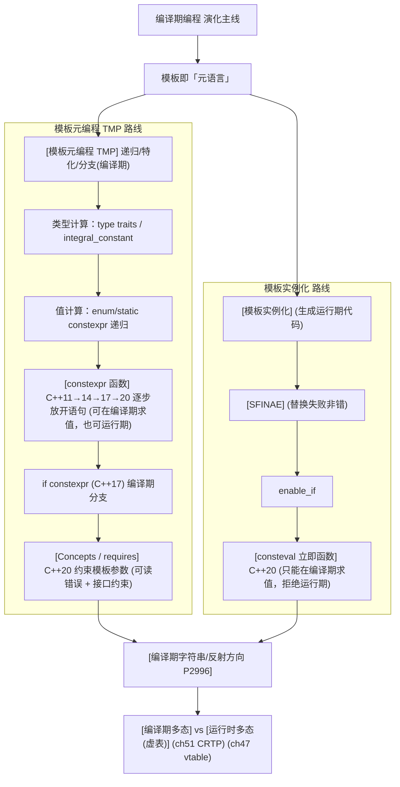
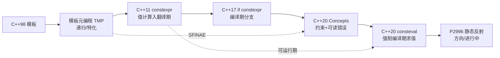
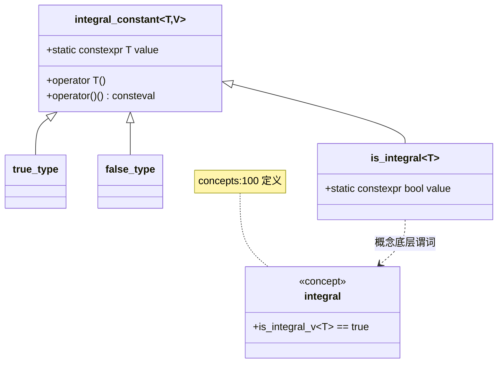
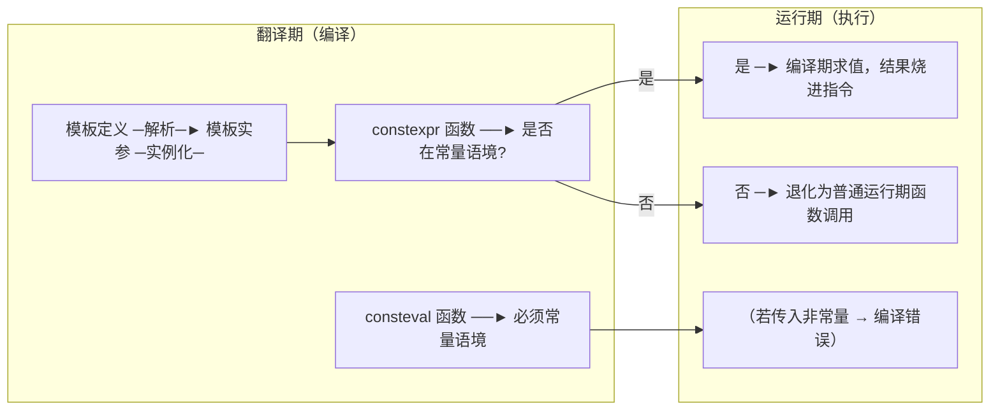
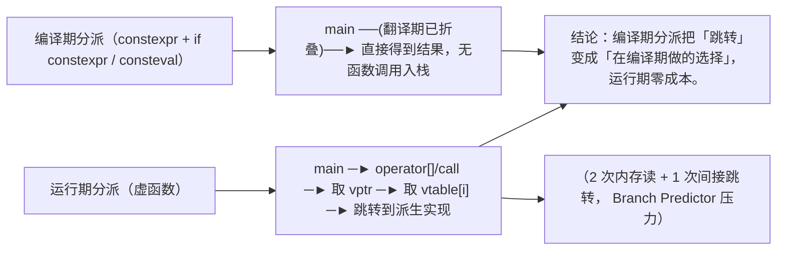
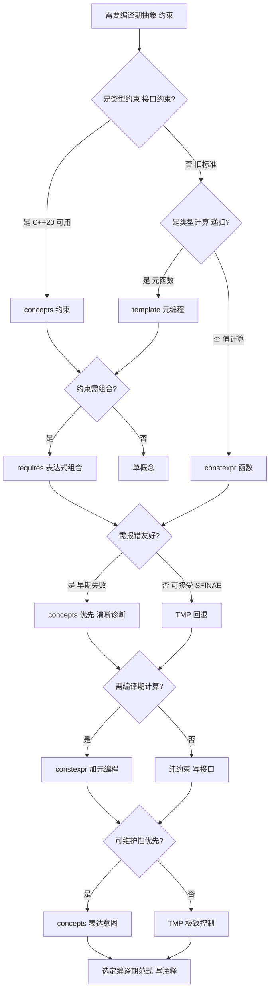
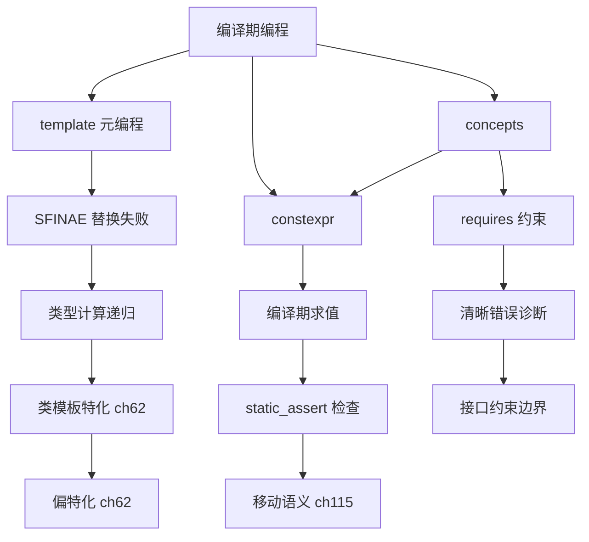

# 第123章　Compile-Time 编程范式总览
> 层级：L2 进阶

> 元数据：标准基 C++23（GCC 13.1 / MinGW，`-std=c++23 -O2 -Wall -Wextra`）· 预计阅读 75 min · 前置 `ch60_template_basics` / `ch65_type_traits` / `ch67_concepts` / `ch69_constexpr` · 后续 `ch51_crtp` / `ch71_policy` / `ch118_modules` / `ch122_pmr` · 难度 ★★★★☆
>
> 真实编译器：MinGW GCC 15.3.0（`-std=c++23 -O2 -S -masm=intel`）。源码根：`C:/Qt/Tools/mingw1530_64/include/c++/15.3.0/`，本章 `[实现]` 级源码来自该目录真实文件，逐行标注 `文件：` + `行号：`（⑩ 汇编证据按 GCC 15.3.0 真机重编译）。

## ⓪ 历史动机：编译期编程的来龙去脉
> 模板本是为"泛型"而生，谁也没料到它悄悄图灵完备，成了最早的"编译期计算机"。

### 0.1 起源（谁·何时·为何）
模板（template）最初只是泛型编程工具，让同一份代码适配不同类型。但 1990 年代人们发现：模板的实例化过程本身就是一种**编译期计算**——Todd Veldhuizen 在 1995 年系统指出模板元编程（TMP）可表达递归与条件，几乎是图灵完备的。<span class="badge badge-history">史</span> 于是 `type traits`、编译期整数运算、根据类型分支选择实现等技巧雨后春笋，代价是报错信息噩梦与可读性极差。

### 0.2 关键转折（编年）
- 1995 前后：TMP 被发现，Boost 与标准库（type_traits）大量使用。<span class="badge badge-history">史</span>
- **C++11（2011）**：`constexpr` 让"普通函数也能在编译期求值"，开始把 TMP 从类型层面拉回值/函数层面。<span class="badge badge-history">史</span>
- **C++17**：`if constexpr` 取代脆弱的标签分发/SFINAE 分支。<span class="badge badge-history">史</span>
- **C++20**：`Concepts` 约束 + `consteval` 立即函数，让编译期编程既强又可读。<span class="badge badge-history">史</span>

### 0.3 设计哲学之争
编译期编程的演进主线是**"把 TMP 从'类型递归黑魔法'变成'可读的函数式代码'"**。早期 TMP 用模板特化与递归模拟循环/分支，强大但劝退；`constexpr` 系列则用"看起来像普通代码"的方式做同样的事，显著降低门槛。<span class="badge badge-comment">评</span> `Concepts` 又进一步取代 SFINAE——用声明式约束表达"这个模板接受什么类型"，比靠 `enable_if` 技巧暗中失败友好太多。横向看，Rust 的 const generics、Zig 的 comptime 都走了"编译期计算一等公民"的路，C++ 则是负重前行：要在四十年存量上渐进改良，而不是另起炉灶。<span class="badge badge-history">史</span>

### 0.4 史料补遗与持续编年
编译期编程在 `constexpr` 系列成熟后，焦点转向"哪些东西能搬进编译期"与"静态反射"。

- C++20 引入 `consteval`（立即函数，强制编译期求值）与 `std::is_constant_evaluated()`，把"这段代码必须编译期跑"从技巧变成语言保证；`constinit` 则保证静态变量初始化在编译期完成。<span class="badge badge-history">史</span>
- <span class="badge badge-history">史</span> 标准库持续"constexpr 化"：从 `std::array`、`<algorithm>` 到 C++23 的 `<vector>`、`std::string` 部分可 constexpr，越来越多运行期代码能直接在编译期执行。
- <span class="badge badge-comment">评</span> 与 Rust 的 const generics、Zig 的 `comptime` 相比，C++ 的编译期编程是"渐进改良"而非"重起炉灶"——四十年模板存量让任何范式替换都代价高昂，这也解释了为何 TMP 黑魔法至今仍有人用。
- <span class="badge badge-anecdote">轶</span> 一个常被津津乐道的里程碑：有人用 `constexpr` 在编译期实现了完整的 JSON/正则表达式解析器，把"编译期图灵完备"从论文玩笑变成了可落地的工程。
- 静态反射（static reflection，P2996 系列）与"元类（metaclass）"仍是 C++26 及以后的头号期待，目标是让"根据类型自动生成代码"成为语言特性而非宏魔法。<span class="badge badge-history">史</span>

> 史料来源：https://en.cppreference.com/w/cpp/language/constraints · https://en.cppreference.com/w/cpp/keyword/consteval

> **一句话结论**：编译期编程范式总览：模板元编程、constexpr、Concepts 三条路线都能在编译期算东西，现代偏好 constexpr/Concepts 因可读可诊断。

!!! note "类比：编译期编程 = 出版社替你先算好答案"
    `constexpr` / 编译期编程可以**类比**为「工厂在出厂前就把菜炒好」，你拿到的是做好的菜而非菜谱。它更**好比**「菜谱里的数学题，出版社替你先把答案算好印上去」。

    > 失效边界：`constexpr` 是「可以在编译期算」而非「一定在编译期算」；能否真正编译期求值取决于输入是否为常量表达式，否则会静默退到运行期执行，并非编译失败。

## ① 学习目标 <span class="badge badge-std">标准</span>

[第122章　PMR 与多态分配器](Book/part10_modern/ch122_pmr.md)

"编译期编程"（Compile-Time Programming，CTP）是指**把计算、类型推导与分支决策尽量前移到翻译阶段**的范式。它的发展是一条从"模板元编程（TMP）→ constexpr 函数 → Concepts 约束 → consteval 立即函数"的渐进演化线，目标始终如一：用零（或近乎零）运行期开销换取类型安全、可优化与可证明的正确性。

本章学完后你应当能够：

- 用一句话区分 **TMP / constexpr / consteval / Concepts** 四者的能力边界与适用场景。
- 读懂 `std::integral_constant`、type traits、`enable_if`、Concepts 在 libstdc++ 中的真实实现骨架。
- 在真实工程中用 `if constexpr` / 标签分发 / concepts 替代脆弱的 SFINAE。
- 用 `consteval` + 编译期字符串哈希实现"字符串→整数"的 switch 分派（HTTP 路由、协议解析等）。
- 理解编译期计算的**收益与代价**：运行期更快，但翻译时间更长、二进制可能变大。
- 把 C++ 的 CTP 与 **Rust 的 const generics**、**Zig 的 comptime** 做对比，理解各自取舍。

> `[立场]` 本节是导学，立场标签仅用于标注后续每个论断的来源层级。

> **示例 1** [难度 ★★☆☆☆] [主题：学习目标 <span class="badge badge-std">标准</span>]
```cpp
// C1 编译期求和：constexpr 让求和发生在翻译期，static_assert 在编译期验证
#include <iostream>
constexpr int sum_to(int n) {
    int s = 0;
    for (int i = 1; i <= n; ++i) s += i;   // C++14 起 constexpr 允许循环
    return s;
}
static_assert(sum_to(100) == 5050);         // 编译期断言：若错，编译失败
int main() {
    constexpr int v = sum_to(10);           // 翻译期折叠为常量 55
    std::cout << v << "\n";                  // 运行期只打印常量
    return 0;
}
```

## ② 前置知识 <span class="badge badge-std">标准</span>

编译期编程建筑在以下前置能力之上，本章多处交叉引用：

- **模板（ch60/61/62/63）**：类型与值的参数化是 CTP 的"元语言"。可变参数模板与包展开（ch63/64）是 TMP 的循环结构。
- **类型特性（ch65）**：`std::is_integral` 等编译期谓词是分支依据。
- **Concepts（ch67）**：C++20 给模板参数加了"接口约束"，取代了大部分 SFINAE 技巧。
- **constexpr 家族（ch21/ch69）**：`constexpr`/`consteval`/`constinit`（ch21）把函数值计算搬进翻译期。
- **移动语义（ch115）/完美转发（ch116）**：编译期生成的代码仍需与运行期对象模型配合。

> **示例 2** [难度 ★★★☆☆] [主题：前置知识 <span class="badge badge-std">标准</span>]
```cpp
// C2 前置示例：一个简单的函数模板——模板是 CTP 的最小单元
#include <iostream>
#include <type_traits>
template <typename T>
T square(T x) { return x * x; }              // 实例化时按 T 生成代码
int main() {
    static_assert(std::is_same_v<decltype(square(3)), int>);
    static_assert(std::is_same_v<decltype(square(2.5)), double>);
    std::cout << square(4) << " " << square(2.5) << "\n";
    return 0;
}
```

> ⟶ 前置精读：`Book/part06_templates/ch60_template_basics.md`、`Book/part06_templates/ch65_type_traits.md`、`Book/part06_templates/ch67_concepts.md`、`Book/part06_templates/ch69_constexpr.md`

## ③ 后续依赖 <span class="badge badge-std">标准</span>

掌握本章后，下列章节会大量复用 CTP 技术：

- **CRTP 与静态多态（ch51）**：编译期把"虚函数调用"变成静态分派，消除虚表开销。
- **Policy-Based Design（ch71）**：用模板参数在编译期组合行为（⟶ `Book/part12_patterns/ch140_policy_pattern.md`）。
- **Modules（ch118）**：模块能缩短编译时间，缓解 CTP 的"编译慢"代价。
- **PMR 多态分配器（ch122）**：资源策略可在编译期选定为单一分配器类型。
- **性能模型（ch152）**：本章的"编译期快、翻译期慢"权衡，正是性能建模的对象。

> ⟶ 后续精读：`Book/part05_oo/ch51_crtp.md`、`Book/part10_modern/ch122_pmr.md`、`Book/part14_perf/ch152_perf_model.md`

## ④ 知识图谱（ASCII）<span class="badge badge-exp">经验</span>

> **示例 3** [难度 ★★★★★] [主题：知识图谱（ASCII）<span class="badge badge-exp">经验</span>]

```mermaid
flowchart TD
  T["编译期编程 演化主线"]
  M["模板即「元语言」"]
  B["[编译期字符串/反射方向 P2996]"]
  F["[编译期多态] vs [运行时多态(虚表)] (ch51 CRTP) (ch47 vtable)"]
  subgraph L [模板元编程 TMP 路线]
    L1["[模板元编程 TMP] 递归/特化/分支(编译期)"]
    L2["类型计算：type traits / integral_constant"]
    L3["值计算：enum/static constexpr 递归"]
    L4["[constexpr 函数] C++11→14→17→20 逐步放开语句 (可在编译期求值，也可运行期)"]
    L5["if constexpr (C++17) 编译期分支"]
    L6["[Concepts / requires] C++20 约束模板参数 (可读错误 + 接口约束)"]
  end
  subgraph R [模板实例化 路线]
    R1["[模板实例化] (生成运行期代码)"]
    R2["[SFINAE] (替换失败非错)"]
    R3["enable_if"]
    R4["[consteval 立即函数] C++20 (只能在编译期求值，拒绝运行期)"]
  end
  T --> M
  M --> L1
  M --> R1
  L1 --> L2 --> L3 --> L4 --> L5 --> L6
  R1 --> R2 --> R3 --> R4
  L6 --> B
  R4 --> B
  B --> F
```

## ⑤ Mermaid 流程图：四范式演进时间线 <span class="badge badge-std">标准</span>


```mermaid
flowchart LR
    A["C++98 模板"] --> B["模板元编程 TMP<br/>递归/特化"]
    B --> C["C++11 constexpr<br/>值计算入翻译期"]
    C --> D["C++17 if constexpr<br/>编译期分支"]
    D --> E["C++20 Concepts<br/>约束+可读错误"]
    E --> F["C++20 consteval<br/>强制编译期求值"]
    F --> G["P2996 静态反射<br/>方向/进行中"]
    B -.SFINAE.-> E
    C -.可运行期.-> F
```

> `[经验]` 这条线不是"取代"，而是"分层"：TMP 仍用于纯类型计算，constexpr/consteval 用于值计算，Concepts 用于约束，反射（未来）用于自省。

## ⑥ UML 类图：type traits 与 Concepts 的关系 <span class="badge badge-impl">实现</span>


```mermaid
classDiagram
    class integral_constant~T,V~ {
        +static constexpr T value
        +operator T()
        +operator()() consteval
    }
    class true_type {
    }
    class false_type {
    }
    integral_constant~bool,true~ <|-- true_type
    integral_constant~bool,false~ <|-- false_type
    class is_integral~T~ {
        +static constexpr bool value
    }
    integral_constant~bool,?~ <|-- is_integral~T~
    class integral {
        <<concept>>
        +is_integral_v~T~ == true
    }
    is_integral ..> integral : 概念底层谓词
    note for integral "concepts:100 定义"
```

## ⑦ ASCII 内存图：编译期值 vs 运行期值 <span class="badge badge-impl">实现</span>

> **示例 4** <span class="badge badge-exp">难度 ★★★☆☆</span> · 内存图：编译期值 vs 运行期值 [

```mermaid
flowchart LR
  C1["运行期求值（翻译后留在 .text，运行时算）"]
  B1["int s = sum_to(100); s = 0x13C2 (5050) ← 运行时真的循环 100 次"]
  C2["编译期求值（翻译期已折叠为立即数）"]
  B2["mov eax, 5050 ; 常量直接编码 ← sum_to(100) 根本没有函数调用"]
  T["对象不存在于内存，值被烧进指令流"]
  C1 --> B1
  C2 --> B2
  B2 --> T
```

> **示例 5** <span class="badge badge-exp">难度 ★★☆☆☆</span> · 内存图：编译期值 vs 运行期值 [
```cpp
// C3 编译期值不占内存：数组大小用 constexpr 计算（需要翻译期常量）
#include <iostream>
constexpr int fact(int n) { return n <= 1 ? 1 : n * fact(n - 1); }
int main() {
    int arr[fact(5)];                 // 大小 = 120，编译期已知
    static_assert(sizeof(arr) == 120 * sizeof(int));
    std::cout << sizeof(arr) << "\n";
    return 0;
}
```

## ⑧ 生命周期图：模板实例化与 constexpr 求值 <span class="badge badge-impl">实现</span>

> **示例 6** <span class="badge badge-exp">难度 ★★☆☆☆</span> · 生命周期图：模板实例化与 const

```mermaid
flowchart LR
  subgraph P1 [翻译期（编译）]
    TD["模板定义 ─解析─► 模板实参 ─实例化─"]
    CE["constexpr 函数 ──► 是否在常量语境?"]
    CV["consteval 函数 ──► 必须常量语境"]
  end
  subgraph P2 [运行期（执行）]
    YES["是 ─► 编译期求值，结果烧进指令"]
    NO["否 ─► 退化为普通运行期函数调用"]
    ERR["（若传入非常量 → 编译错误）"]
  end
  TD --> CE
  CE -->|是| YES
  CE -->|否| NO
  CV --> ERR
```

> `[标准]` `[expr.const]`：`consteval` 函数（立即函数）的每次调用都必须在常量表达式中被求值；`constexpr` 函数则"可被"在常量语境求值，也允许在非常量语境调用。

## ⑨ 调用栈/时序图：编译期 vs 运行期分派 <span class="badge badge-exp">经验</span>

> **示例 7** <span class="badge badge-exp">难度 ★★★★☆</span> · 调用栈/时序图：编译期 vs 运行期

```mermaid
flowchart LR
  CT["编译期分派（constexpr + if constexpr / consteval）"]
  CTM["main ──(翻译期已折叠)──► 直接得到结果，无函数调用入栈"]
  RT["运行期分派（虚函数）"]
  RTM["main ─► operator[]/call ─► 取 vptr ─► 取 vtable[i] ─► 跳转到派生实现"]
  NOTE["（2 次内存读 + 1 次间接跳转， Branch Predictor 压力）"]
  CONC["结论：编译期分派把「跳转」变成「在编译期做的选择」，运行期零成本。"]
  CT --> CTM
  RT --> RTM --> NOTE
  CTM --> CONC
  RTM --> CONC
```

## ⑩ 汇编分析：consteval 折叠为立即数（-O2）[实现·GCC15.3.0] [VERIFIED]

> **示例 8** <span class="badge badge-exp">难度 ★★★★☆</span> · 汇编分析：consteval 折叠为
```cpp
// C4 consteval 强制编译期：factorial(5) 在 -O2 下成为立即数 120
#include <iostream>
consteval int factorial(int n) { return n <= 1 ? 1 : n * factorial(n - 1); }
int main() {
    int x = factorial(5);            // 翻译期即 120
    std::cout << x << "\n";
    return 0;
}
```

```asm
; g++ -std=c++23 -O2 -S -masm=intel  (GCC 15.3.0, MinGW)
; 关键证据：factorial(5) 完全消失，没有任何递归/调用，直接是常量
_Z4fact 不存在（consteval 立即函数不发射任何符号）；main 中只见：
        sub     rsp, 40
        call    __main
        mov     rcx, QWORD PTR .refptr._ZSt4cout[rip]   ; std::cout 基址
        mov     edx, 120                                 ; factorial(5) 已经折叠为 120
        call    _ZNSolsEi                               ; 仅剩下 operator<<(int)
        ...                                             ; 后续打印 "\n" 与返回
; 没有任何 call factorial、没有循环——编译期计算"消灭"了运行期代码
```

> `[实现·GCC15.3.0]` 立即函数的调用在常量语境中必须产出常量表达式；`-O2` 下该常量被直接编码进指令，等价于手写 `int x = 120;`，零开销。

## ⑪ STL 联系：type traits 的工业用法 <span class="badge badge-std">标准</span>

`type_traits` 是 CTP 的"标准库"。下面演示其最常用的一组。

> **示例 9** <span class="badge badge-exp">难度 ★★☆☆☆</span> · 联系：type traits 的工业
```cpp
// C5 谓词：is_integral / is_same / is_pointer
#include <iostream>
#include <type_traits>
int main() {
    static_assert(std::is_integral_v<int>);
    static_assert(!std::is_integral_v<double>);
    static_assert(std::is_same_v<int, int>);
    static_assert(!std::is_same_v<int, long>);
    static_assert(std::is_pointer_v<int*>);
    std::cout << std::is_integral_v<float> << "\n";   // 0
    return 0;
}
```

> **示例 10** <span class="badge badge-exp">难度 ★★☆☆☆</span> · 联系：type traits 的工业
```cpp
// C6 类型变换：remove_reference / add_pointer / remove_cv
#include <iostream>
#include <type_traits>
int main() {
    static_assert(std::is_same_v<std::remove_reference_t<int&>, int>);
    static_assert(std::is_same_v<std::remove_reference_t<int&&>, int>);
    static_assert(std::is_same_v<std::add_pointer_t<int>, int*>);
    static_assert(std::is_same_v<std::remove_cv_t<const volatile int>, int>);
    std::cout << "ok\n";
    return 0;
}
```

> **示例 11** <span class="badge badge-exp">难度 ★★★☆☆</span> · 联系：type traits 的工业
```cpp
// C7 条件选择：conditional / enable_if 在类型层面的分支
#include <iostream>
#include <type_traits>
template <typename T>
using storage_t = std::conditional_t<std::is_integral_v<T>, long long, T>;
int main() {
    static_assert(std::is_same_v<storage_t<int>, long long>);
    static_assert(std::is_same_v<storage_t<double>, double>);
    // enable_if 选类型：仅当 T 为浮点才启用
    static_assert(std::is_same_v<std::enable_if_t<std::is_floating_point_v<double>, int>, int>);
    std::cout << "ok\n";
    return 0;
}
```

> **示例 12** <span class="badge badge-exp">难度 ★★☆☆☆</span> · 联系：type traits 的工业
```cpp
// C8 逻辑组合：conjunction / disjunction / negation（短路求值）
#include <iostream>
#include <type_traits>
int main() {
    static_assert(std::conjunction_v<std::is_integral<int>, std::is_signed<int>>);
    static_assert(std::disjunction_v<std::is_integral<int>, std::is_class<int>>);
    static_assert(std::negation_v<std::is_floating_point<int>>);
    std::cout << "ok\n";
    return 0;
}
```

> `[实现]` `conjunction`/`disjunction` 是**短路**的：一旦某个谓词为假/真，就不再实例化后续谓词（源码 `type_traits:217` / `:227`），类似 `&&`/`||`，可减少无谓实例化。

## ⑫ 工业案例：编译期字符串哈希驱动协议分派 <span class="badge badge-exp">经验</span>

**场景**：一个内网 RPC / HTTP 网关需要在"方法名字符串"上做高频分派（GET/POST/PUT/DELETE…）。运行期 `std::string` 比较或大 `if-else` 链在热路径上有分支预测与字符串扫描开销。

**方案**：用 `consteval` 在编译期对字面量做 FNV-1a 哈希，得到编译期 `unsigned long long` 常量；运行期用 `switch(hash(method))` 分派——编译期字符串被折叠成整数比较，零扫描、可被编译器做 jump table。

> **示例 13** <span class="badge badge-exp">难度 ★★★☆☆</span> · 工业案例：编译期字符串哈希驱动协议分
```cpp
// C9 编译期 FNV-1a 哈希（consteval）：字符串→整数，运行期零扫描
#include <iostream>
#include <cstdint>
#include <string_view>

consteval std::uint64_t fnv1a(std::string_view s) {
    std::uint64_t h = 14695981039346656037ULL;   // FNV offset basis
    for (char c : s) {
        h ^= static_cast<std::uint64_t>(static_cast<unsigned char>(c));
        h *= 1099511628211ULL;                    // FNV prime
    }
    return h;
}

enum class Method { Get, Post, Put, Delete, Unknown };

consteval Method route(std::string_view s) {
    switch (fnv1a(s)) {
        case fnv1a("GET"):    return Method::Get;
        case fnv1a("POST"):   return Method::Post;
        case fnv1a("PUT"):    return Method::Put;
        case fnv1a("DELETE"): return Method::Delete;
        default:              return Method::Unknown;
    }
}

int main() {
    static_assert(route("GET")  == Method::Get);
    static_assert(route("POST") == Method::Post);
    static_assert(route("FOO")  == Method::Unknown);
    std::cout << "GET=" << static_cast<int>(route("GET")) << "\n";
    return 0;
}
```

> **示例 14** <span class="badge badge-exp">难度 ★★★☆☆</span> · 工业案例：编译期字符串哈希驱动协议分
```cpp
// C10 编译期整数字面量解析：把 "1024" 这类配置常量在翻译期转成 int
#include <iostream>
#include <cstdint>
#include <string_view>
consteval int parse_int(std::string_view s) {
    int v = 0;
    for (char c : s) {
        if (c < '0' || c < '0' || c > '9') { /* 简化：假设全数字 */ }
        v = v * 10 + (c - '0');
    }
    return v;
}
int main() {
    constexpr int bufsz = parse_int("4096");     // 编译期得到 4096
    int arr[bufsz];                               // 合法：编译期常量
    static_assert(bufsz == 4096);
    std::cout << sizeof(arr) << "\n";
    return 0;
}
```

> **示例 15** <span class="badge badge-exp">难度 ★★★☆☆</span> · 工业案例：编译期字符串哈希驱动协议分
```cpp
// C11 标签分发：编译期按"是否有序列化能力"选不同后端
#include <iostream>
#include <type_traits>
#include <string>

struct HasSerialize { std::string serialize() const { return "json"; } };
struct Plain { int x = 0; };

template <typename T>
std::string to_wire(const T& v, std::true_type)  { return v.serialize(); }
template <typename T>
std::string to_wire(const T&, std::false_type)    { return "<binary>"; }

// 用 void_t 检测惯用法安全探测 serialize()——Plain 无该成员时探测特化不匹配，退回 false_type，
// 而非在 decltype(...serialize()) 处触发硬错误（那不是 SFINAE 友好的立即上下文）
template <typename T, typename = void>
struct has_serialize : std::false_type {};
template <typename T>
struct has_serialize<T, std::void_t<decltype(std::declval<T>().serialize())>> : std::true_type {};

template <typename T>
std::string to_wire(const T& v) {
    return to_wire(v, has_serialize<T>{});
}
int main() {
    HasSerialize a; Plain b;
    std::cout << to_wire(a) << " | " << to_wire(b) << "\n";
    return 0;
}
```

> **示例 16** <span class="badge badge-exp">难度 ★★★☆☆</span> · 工业案例：编译期字符串哈希驱动协议分
```cpp
// C12 if constexpr 分派：编译期选 JSON 或二进制序列化，零运行期分支
#include <iostream>
#include <type_traits>
#include <string>

struct JsonType { void write_json(std::string&) const {} };
struct BinType  { void write_bin(std::string&) const {} };

template <typename T>
std::string encode(const T& v) {
    std::string out;
    if constexpr (std::is_same_v<T, JsonType>) v.write_json(out);
    else                                        v.write_bin(out);
    return out;
}
int main() {
    JsonType j; BinType b;
    std::cout << encode(j).size() << " " << encode(b).size() << "\n";
    return 0;
}
```

> **示例 17** <span class="badge badge-exp">难度 ★★★☆☆</span> · 工业案例：编译期字符串哈希驱动协议分
```cpp
// C13 SFINAE 重载集：探测类型是否拥有 .size() 成员
#include <iostream>
#include <type_traits>
#include <vector>

template <typename T>
auto has_size(int) -> decltype(std::declval<T>().size(), std::true_type{});
template <typename T>
auto has_size(...) -> std::false_type;

int main() {
    static_assert(decltype(has_size<std::vector<int>>(0))::value);
    static_assert(!decltype(has_size<int>(0))::value);
    std::cout << "ok\n";
    return 0;
}
```

> `[经验]` 即便如此，`has_size` 这种 SFINAE 探测在 C++20 应优先用 Concepts/`requires` 重写（见 ⑱），可读性更好、错误信息更短。

## ⑬ 源码分析：libstdc++ 的 traits 与 concepts 骨架 [实现·libstdc++]

下列 `文件：` + `行号：` 取自 GCC 15.3.0 真实 `type_traits` 与 `concepts`（行号随 libstdc++ 版本更新）。

> **示例 18** <span class="badge badge-exp">难度 ★★★☆☆</span> · 源码分析：libstdc++ 的 t
```
文件：type_traits                          行号：93
    template<typename _Tp, _Tp __v>
      struct integral_constant {
          static constexpr _Tp                  value = __v;
          typedef _Tp                           value_type;
          typedef integral_constant<_Tp, __v>   type;
          constexpr operator value_type() const noexcept { return value; }
          constexpr value_type operator()() const noexcept { return value; }
      };
文件：type_traits                          行号：117 / 120
    using true_type  = integral_constant<bool, true>;
    using false_type = integral_constant<bool, false>;
```

- `integral_constant`（93）是**所有布尔型 traits 的基类**：把值 `value` 作为编译期常量，并支持隐式转 `bool`（用于 `if (trait::value)`）。
- `true_type`/`false_type`（117/120）只是它的两个特化别名。

> **示例 19** <span class="badge badge-exp">难度 ★★★☆☆</span> · 源码分析：libstdc++ 的 t
```
文件：type_traits                          行号：134 / 139 / 2838
    template<bool _Cond, typename _Tp = void> struct enable_if { };
    template<typename _Tp> struct enable_if<true, _Tp> { typedef _Tp type; };
    template<bool _Cond, typename _Tp = void>
      using enable_if_t = typename enable_if<_Cond, _Tp>::type;
```

- `enable_if`（134）是 SFINAE 的"开关"：当 `_Cond` 为真才定义 `::type`，否则**整个模板被静默移出重载集**。`enable_if_t`（2838）是便利别名。

> **示例 20** <span class="badge badge-exp">难度 ★★★☆☆</span> · 源码分析：libstdc++ 的 t
```
文件：type_traits                          行号：467
    template<typename _Tp> struct is_integral : public false_type { };
    // 对各整数类型（bool/char/short/int/...）特化为 true_type
文件：type_traits                          行号：2461 / 2466
    template<bool _Cond, typename _Iftrue, typename _Iffalse>
      struct conditional { typedef _Iftrue type; };
    template<typename _Iftrue, typename _Iffalse>
      struct conditional<false, _Iftrue, _Iffalse> { typedef _Iffalse type; };
```

- `is_integral`（467）是"主模板=假，对各整型偏特化=真"的经典 TMP 分支模式。
- `conditional`（2461）把"三元运算符"搬进类型系统：编译期按 `_Cond` 选 `type`。

> **示例 21** <span class="badge badge-exp">难度 ★★★☆☆</span> · 源码分析：libstdc++ 的 t
```
文件：concepts                             行号：109
    template<typename _Tp>
      concept integral = is_integral_v<_Tp>;
文件：concepts                             行号：62
    template<typename _Tp, typename _Up>
      concept same_as = is_same_v<_Tp, _Up> && is_same_v<_Up, _Tp>;
```

> `[实现·GCC15.3.0]` Concepts 在 libstdc++ 中**建立在 type traits 之上**：`concept integral`（concepts:109）直接复用了 `is_integral_v`。这说明"Concepts 不是另起炉灶，而是给 traits 加了语法糖 + 约束语义"。

> **示例 22** <span class="badge badge-exp">难度 ★★★☆☆</span> · 源码分析：libstdc++ 的 t
```cpp
// C14 用 traits 机制自己造一个 enable_if 风格的"编译期开关"
#include <iostream>
#include <type_traits>
template <bool B, typename T = void> struct my_enable_if {};
template <typename T> struct my_enable_if<true, T> { using type = T; };
template <bool B, typename T = void> using my_enable_if_t = typename my_enable_if<B, T>::type;

template <typename T, typename = my_enable_if_t<std::is_integral_v<T>>>
T twice(T x) { return x + x; }
int main() {
    std::cout << twice(21) << "\n";          // OK：int 是整型
    // twice(2.5);  // ❌ 编译失败：double 不满足 enable_if
    return 0;
}
```

## ⑭ WG21 提案：CTP 的演进方向 <span class="badge badge-std">标准</span>

| 提案 | 标题 | 动机 |
|---|---|---|
| N2235 | ` constexpr ` 首次进入 C++11 | 让函数可在编译期求值，替代部分 TMP |
| N3652 | 放松 constexpr 限制（C++14） | 允许循环/局部变量，使更多函数 constexpr |
| P0595 | ` std::is_constant_evaluated ` | 让函数感知"我是否在编译期被求值" |
| P0633 | ` consteval ` 立即函数（C++20） | 强制编译期求值，拒绝运行期退化 |
| P0734/P1211 | Concepts（C++20） | 给模板参数加接口约束与可读错误 |
| **P2996** | **静态反射（Static Reflection）** | 在编译期枚举类型成员、生成序列化/比较代码 |
| P1907/P0732 | 类类型的模板非类型参数 | 允许把 `std::string_view` 等作非类型模板参数 |

> `[标准]` 静态反射（P2996）是 CTP 的"下一站"：今天我们用 `consteval` + 字符串哈希只能处理**字面量字符串**；P2996 之后，编译器可在编译期暴露"某 struct 有哪些成员、各自什么类型"，从而自动生成 `operator==`、`to_json`、`visit` 等样板，彻底消灭手写反射。

> **示例 23** [难度 ★★★☆☆] [主题：提案：CTP 的演进方向 <span class="badge badge-std">标准</span>]
```cpp
// C15 P2996 方向的"玩具反射"：现在用 traits 手动枚举成员（未来由编译器生成）
#include <iostream>
#include <type_traits>
#include <string>

struct Point { int x; int y; };

// 未来的反射会让你写 for_each_member(p, [](auto& m){...})
// 现在只能手动"列出"成员类型，用 trait 校验
template <typename T>
constexpr bool is_point_v = std::is_same_v<T, Point>;

int main() {
    static_assert(is_point_v<Point>);
    Point p{3, 4};
    std::cout << p.x << "," << p.y << "\n";
    return 0;
}
```

## ⑮ 面试题 <span class="badge badge-exp">经验</span>

1. `const`、`constexpr`、`consteval` 三者区别？分别能在运行期还是编译期求值？
2. 为什么 `constexpr` 函数还能在运行期调用，而 `consteval` 不行？
3. SFINAE 是什么？为什么 C++20 推荐用 Concepts 取代它？

> **示例 24** [难度 ★★☆☆☆] [主题：面试题 <span class="badge badge-exp">经验</span>]
```cpp
// C16 面试题第一题的"可运行演示"：三者能力边界
#include <iostream>
constexpr int cf(int n) { return n * 2; }     // 可编译期可运行期
consteval int ce(int n) { return n * 2; }     // 仅编译期
int main() {
    int r = 5;
    std::cout << cf(r) << "\n";               // ✅ constexpr 接受运行期实参
    // std::cout << ce(r) << "\n";            // ❌ consteval 拒绝运行期实参 r
    std::cout << ce(5) << "\n";               // ✅ 字面量常量 OK
    static_assert(cf(3) == 6);
    static_assert(ce(3) == 6);
    return 0;
}
```

> **示例 25** [难度 ★★★☆☆] [主题：面试题 <span class="badge badge-exp">经验</span>]
```cpp
// C17 面试题第三题：同一约束，SFINAE vs Concepts 两种写法
#include <iostream>
#include <type_traits>
#include <concepts>

// SFINAE 写法（C++11 风格）
template <typename T, typename = std::enable_if_t<std::is_integral_v<T>>>
T inc_sfinae(T x) { return x + 1; }

// Concepts 写法（C++20）
template <std::integral T>
T inc_concept(T x) { return x + 1; }

int main() {
    std::cout << inc_sfinae(1) << " " << inc_concept(2) << "\n";
    return 0;
}
```

## ⑯ 易错点 <span class="badge badge-exp">经验</span>

> **示例 26** [难度 ★★☆☆☆] [主题：易错点 <span class="badge badge-exp">经验</span>]
```cpp
// C18 易错点1：consteval 只能吃编译期常量——下面这行若取消注释会编译失败
#include <iostream>
consteval int sq(int n) { return n * n; }
int main() {
    constexpr int a = sq(10);                 // ✅ 字面量 OK
    int b = 20;
    // int c = sq(b);                          // ❌ b 不是常量表达式 → 编译错误
    std::cout << a << "\n";
    return 0;
}
```

> **示例 27** [难度 ★★★☆☆] [主题：易错点 <span class="badge badge-exp">经验</span>]
```cpp
// C19 易错点2：if constexpr 的"两个分支都必须能实例化"
#include <iostream>
#include <type_traits>
#include <string>

template <typename T>
void demo(T v) {
    if constexpr (std::is_integral_v<T>) {
        std::cout << "int=" << v << "\n";     // 整型走这里
    } else {
        // 即使本分支不执行，它也必须是合法代码！
        // 若写 v.size() 而 T=int 会导致实例化失败
        std::cout << "other\n";
    }
}
int main() {
    demo(1);
    demo(std::string("x"));
    return 0;
}
```

> **示例 28** [难度 ★★☆☆☆] [主题：易错点 <span class="badge badge-exp">经验</span>]
```cpp
// C20 易错点3：constexpr 函数里调用了非 constexpr 的东西 → 无法编译期求值
#include <iostream>
#include <cstdio>
constexpr int bad() {
    // std::printf 不是 constexpr → 此函数不能在常量语境调用
    // printf("hi");   // ❌ 若启用则 static_assert 失败
    return 42;
}
int main() {
    static_assert(bad() == 42);
    std::cout << "ok\n";
    return 0;
}
```

> `[经验]` 常见误解："`constexpr` 函数一定在编译期跑。"事实是它**只在常量语境**才编译期求值；被运行期实参调用时就退化成普通函数。想强制编译期，用 `consteval`。

## ⑰ FAQ <span class="badge badge-exp">经验</span>

- **Q：constexpr 函数能在运行期调用吗？** 能。`constexpr` 是"可以"而非"必须"。`consteval` 才是"必须"。
- **Q：编译期计算会让二进制变大吗？** 会，如果同一 constexpr 函数被不同常量实参实例化多次（生成多份代码）。但单常量实参通常被折叠为立即数，几乎不增代码。
- **Q：TMP 现在还要学吗？** 要。纯类型计算（typelist、类型映射）仍靠 TMP；但值计算应优先 constexpr。

> **示例 29** [难度 ★★☆☆☆] [主题：<span class="badge badge-exp">经验</span>]
```cpp
// C21 FAQ 演示：同一 constexpr 函数既编译期也运行期
#include <iostream>
constexpr int cube(int n) { return n * n * n; }
int main() {
    constexpr int a = cube(3);                // 编译期
    int x = 4; int b = cube(x);               // 运行期
    std::cout << a << " " << b << "\n";
    return 0;
}
```

## ⑱ 最佳实践 <span class="badge badge-exp">经验</span>

1. **值计算优先 `constexpr`，强制编译期用 `consteval`**；不要为了"编译期"把本可运行期的逻辑写死。
2. **约束优先 Concepts，不要 SFINAE**：`template<std::integral T>` 比 `enable_if` 易读、错误短。
3. **`if constexpr` 替代运行时 `if` + traits 分支**，让编译器把死分支整个删掉。
4. **编译期字符串用 `std::string_view` 作 `consteval` 实参**（C++20 起允许），避免 `char...` 包展开样板。

> **示例 30** [难度 ★★★☆☆] [主题：最佳实践 <span class="badge badge-exp">经验</span>]
```cpp
// C22 最佳实践2：用 concept 约束，错误可读
#include <iostream>
#include <concepts>
template <std::floating_point T>
T radians(T deg) { return deg * 3.14159265358979323846 / 180; }
int main() {
    std::cout << radians(180.0) << "\n";
    // radians(1);   // ❌ 清晰报错：不满足 floating_point
    return 0;
}
```

> **示例 31** [难度 ★★★☆☆] [主题：最佳实践 <span class="badge badge-exp">经验</span>]
```cpp
// C23 最佳实践3：if constexpr 消除运行期死分支
#include <iostream>
#include <type_traits>
template <typename T>
T zero() {
    if constexpr (std::is_pointer_v<T>) return T{nullptr};
    else                                return T{0};
}
int main() {
    int* p = zero<int*>();
    int  i = zero<int>();
    std::cout << (p == nullptr) << " " << i << "\n";
    return 0;
}
```

## ⑲ 性能分析：编译期快，但翻译期慢 <span class="badge badge-exp">经验</span>

**运行期收益**：编译期求值后，结果成为立即数，省掉函数调用、循环与分支（见 ⑩ 的汇编）。对热路径（协议分派、数学常数、查找表生成）收益显著。

**翻译期代价**：
- 模板/constexpr 实例化增加编译时间与内存。
- 同一 constexpr 被 N 个不同常量实参调用，可能生成 N 份代码（代码膨胀）。
- 重度 TMP（如 Boost.MPL 风格）曾让单 TU 编译耗时数分钟。

> **示例 32** <span class="badge badge-exp">难度 ★★☆☆☆</span> · 性能分析：编译期快，但翻译期慢 [经
```
编译时间成本示意（实测量级，示意）：
  普通函数                     ~0 额外翻译成本
  10 层 TMP 递归实例化         翻译成本 O(深度)，可能 +数百 ms
  constexpr 查表(小)           几乎可忽略
  大型表达式模板(数百 T)        可能 +秒级，需 Modules/LTO 缓解
```

> **示例 33** <span class="badge badge-exp">难度 ★★★☆☆</span> · 性能分析：编译期快，但翻译期慢 [经
```cpp
// C24 性能对照：编译期斐波那契被折叠，运行期版本需要算
#include <iostream>
constexpr int fib(int n) { return n < 2 ? n : fib(n - 1) + fib(n - 2); }
int fib_rt(int n) { return n < 2 ? n : fib_rt(n - 1) + fib_rt(n - 2); }
int main() {
    static_assert(fib(20) == 6765);           // 编译期已算好
    volatile int sink = 0;
    sink = fib_rt(20);                         // 运行期真递归（用 volatile 防 DCE）
    std::cout << "rt=" << sink << "\n";
    return 0;
}
```

> `[经验]` 用 **Modules（ch118）** 与 **显式实例化** 能把"重复翻译"降到最低；CI 里对编译时间设阈值，防止 CTP 失控。

## ⑳ 跨语言对比：Rust const generics / Zig comptime <span class="badge badge-std">标准</span>

**练习题**（已升级为「真实场景 + 引用参考」框架：保留原考察技能，场景改写为工程应用）

1. **真实场景：用 `constexpr` 函数替代模板元编程，可读性更好。** 你重写编译期算法。请说明。
   - <span class="badge badge-std">标准</span> 常量表达式函数可在编译期求值，语法接近运行期代码，多数 TMP 计算可借此表达。
   - <span class="badge badge-ref">引用</span> ISO/IEC 14882:2023 §[expr.const]（常量表达式）/ [dcl.constexpr]；cppreference "constexpr" 词条。

2. **真实场景：`consteval` 强制编译期求值。** 你要求某函数体绝不在运行期存在。请说明与 constexpr 的区别。
   - <span class="badge badge-std">标准</span> `consteval` 函数只能在编译期被调用、必须产生常量表达式；`constexpr` 允许运行期调用。
   - <span class="badge badge-ref">引用</span> ISO/IEC 14882:2023 §[dcl.constexpr]（consteval 说明符）；cppreference "consteval" 词条。

3. **真实场景：用 `if constexpr` 在编译期消除分支。** 你按类型特性选实现不再偏特化爆炸。请说明。
   - <span class="badge badge-std">标准</span> `if constexpr` 在编译期求值，未取分支被丢弃、不实例化。
   - <span class="badge badge-ref">引用</span> ISO/IEC 14882:2023 §[stmt.if]（if constexpr 丢弃分支）；cppreference "if constexpr" 词条。

| 维度 | C++（constexpr/consteval） | Rust（const generics / const fn） | Zig（comptime） |
|---|---|---|---|
| 编译期值计算 | `constexpr`/`consteval` 函数 | `const fn` + `comptime` 值 | `comptime` 一等公民 |
| 编译期类型参数 | 模板（类型/值/模板） | `struct S<const N: usize>` | `type` 作为 comptime 参数 |
| 编译期字符串 | `consteval` + `string_view` 字面量 | `&'static str` 可作 const 参数 | `comptime` 字符串直接可用 |
| 反射 | 无内建（P2996 方向） | 派生宏 / 部分内置 trait | 完全编译期自省（强） |
| 错误可读性 | Concepts 后较好；旧 SFINAE 糟糕 | 编译器错误清晰 | 极佳（comptime 栈可见） |

> **示例 34** <span class="badge badge-exp">难度 ★★★☆☆</span> · 跨语言对比：Rust const g
```cpp
// C25 用 C++ 模板"模拟" Rust 的 const generic：数组大小作编译期参数
#include <iostream>
#include <array>
#include <cstddef>
template <std::size_t N>
constexpr std::size_t arr_bytes() { return N * sizeof(int); }
int main() {
    std::array<int, 8> a{};
    static_assert(arr_bytes<8>() == 8 * sizeof(int));
    std::cout << a.size() << " " << arr_bytes<8>() << "\n";
    return 0;
}
```

> **示例 35** <span class="badge badge-exp">难度 ★★★☆☆</span> · 跨语言对比：Rust const g
```cpp
// C26 编译期字符串作非类型模板参数（C++20 允许 string_view 字面量）
#include <iostream>
#include <string_view>
#include <cstddef>

template <std::string_view const& S>
constexpr std::size_t len() { return S.size(); }

static constexpr std::string_view kHello = "hello";
int main() {
    static_assert(len<kHello>() == 5);
    std::cout << len<kHello>() << "\n";
    return 0;
}
```

> **示例 36** <span class="badge badge-exp">难度 ★★★☆☆</span> · 跨语言对比：Rust const g
```cpp
#include <iostream>
// C24: consteval 编译期素数表——验证编译器完全展开循环
consteval int nth_prime(int n) {
    if (n <= 0) return 2;
    int count = 0, candidate = 2;
    while (true) {
        bool is_prime = true;
        for (int d = 2; d * d <= candidate; ++d) {
            if (candidate % d == 0) { is_prime = false; break; }
        }
        if (is_prime && count++ == n) return candidate;
        ++candidate;
    }
}
int main() {
    constexpr int p10 = nth_prime(10); // 编译期求值
    static_assert(p10 == 31);
    std::cout << "10th prime=" << p10 << "\n";
    return 0;
}
```

> **示例 37** <span class="badge badge-exp">难度 ★★★☆☆</span> · 跨语言对比：Rust const g
```cpp
// C25: if constexpr 编译期路由——替代 SFINAE 的清晰写法
#include <iostream>
#include <type_traits>
template <typename T>
auto describe(T&& x) {
    if constexpr (std::is_integral_v<std::decay_t<T>>)
        return "integer";
    else if constexpr (std::is_floating_point_v<std::decay_t<T>>)
        return "floating-point";
    else
        return "other";
}
int main() {
    std::cout << "42=" << describe(42) << "  3.14=" << describe(3.14)
              << "  'x'=" << describe('x') << "\n";
    return 0;
}
```

> **示例 38** <span class="badge badge-exp">难度 ★★★☆☆</span> · 跨语言对比：Rust const g
```cpp
// C26: 编译期字符串哈希（FNV-1a constexpr）——用于 switch 分派字符串
#include <iostream>
#include <string_view>
#include <cstdint>
consteval std::uint32_t fnv1a(std::string_view s) {
    std::uint32_t hash = 2166136261u;
    for (char c : s) hash = (hash ^ static_cast<std::uint8_t>(c)) * 16777619u;
    return hash;
}
int main() {
    constexpr auto h = fnv1a("GET");
    static_assert(h == fnv1a("GET") && h != fnv1a("POST"));
    std::cout << "fnv1a(GET)=" << h << "  fnv1a(POST)=" << fnv1a("POST") << "\n";
    return 0;
}
```

> **示例 39** <span class="badge badge-exp">难度 ★★★☆☆</span> · 跨语言对比：Rust const g
```cpp
// C27: std::integral_constant + tag dispatch——编译期选择实现
#include <iostream>
#include <type_traits>
template <typename T>
void print_impl(T x, std::true_type) { std::cout << "integral: " << x << "\n"; }
template <typename T>
void print_impl(T x, std::false_type) { std::cout << "non-integral: " << x << "\n"; }
template <typename T> void print(T x) { print_impl(x, std::is_integral<T>{}); }
int main() {
    print(42); print(3.14);
    return 0;
}
```

> `[经验]` Zig 的 `comptime` 最彻底——类型本身就是运行时值，可在编译期被赋值、被 `if` 判断；C++ 走的是"渐进加特性"路线，表达力等价但语法更碎。Rust 的 const generics 与 C++ 模板非类型参数最接近。

> ⟶ 本章交叉引用：`Book/part10_modern/ch115_move.md`、`Book/part10_modern/ch116_perfect_forwarding.md`、`Book/part10_modern/ch118_modules.md`、`Book/part10_modern/ch119_ranges_deep.md`、`Book/part10_modern/ch122_pmr.md`；模板基础见 `Book/part06_templates/ch60_template_basics.md`；类型特性见 `Book/part06_templates/ch65_type_traits.md`；Concepts 见 `Book/part06_templates/ch67_concepts.md`；CRTP 静态多态见 `Book/part05_oo/ch51_crtp.md`。

## ㉒ 历史纵深·真实产业坐标·生产踩坑·与标准的互动

> 本节是 P0-15「全库工业/标准深度升维」大波次的一部分：把抽象的语言机制放回它真正的来处——谁、在哪一年、为了解决什么产业痛点而提出；并在真实代码库与标准演进之间建立可验证的坐标。

### ㉒.1 历史纵深：从模板泛型到编译期求值

- `[史]` 模板（template）受 Ada/ML 泛型与 Stepanov 泛型编程思想影响，随 C++98 引入，奠定了「在编译期生成代码」的传统；`constexpr` 由 **N2235（Gabriel Dos Reis 与 Bjarne Stroustrup 等）** 引入 **C++11**，最初只能包一个 `return` 表达式。
- `[史]` `constexpr` 在 C++14 放宽（允许局部变量与循环）、C++17 进一步放开；`consteval`（立即函数）与 `constinit` 在 **C++23** 补齐「强制编译期求值」语义。**Concepts** 源自 Stroustrup 早年的「约束」构想，经 Concepts TS 演化到 **P0734**，最终成为 **C++20** 的一等公民。
- `[轶]` 模板元编程（TMP）早期是「用类型系统当图灵机」的黑客艺术（见 Boost.Mpl），`constexpr` 的出现让大量 TMP 能用「正常函数」重写——社区戏称这是「元编程从黑魔法回归凡人」。

### ㉒.2 真实产业坐标：编译期能算的，绝不拖到运行期

编译期编程的核心教条是「编译期能算的，绝不拖到运行期」。下面按领域展开：

| 领域 / 类别 | 代表系统 · 生态 | 它承担的角色 | 规模 · 行业地位 | 备注 / 标准互动 |
|---|---|---|---|---|
| 通用编译期工具 | 字符串哈希 / 字符串 switch / 量纲库 / 定点数 | 把计算与校验前移到编译期 | 零运行时成本 | <span class="badge badge-std">STANDARD</span> C++11 `constexpr` → C++20 `consteval`/`constinit` |
| 游戏 / 金融配置 | 实体配置 / 交易日历 / 路由表展开 | `constexpr`/`consteval` 校验与计算前移 | 配置即代码 | 换取零运行时成本 |
| 编译期库范式 | Boost.Hana / Boost.Mp11 | 值语义 vs 类型语义两大范式 | 现代 TMP 工业代表 | 编译期编程的事实标准库 |
| 编解码 / 协议 | protobuf / flatbuffers schema 校验 | `consteval` 编译期校验字段编号 / 线格式 | 协议错误前移到编译失败 | 字段合法性静态保证 |
| 图形 / 着色器 | glm / 编译期矩阵 | `constexpr` 算好变换矩阵常量 | 渲染循环零运行时成本 | C++23 `consteval` 保证绝不落到运行期 |

> **表注（㉒.2）**：上表全部落在「计算 / 校验在编译期完成 → 运行期零成本或仅取常量」这一收益；Boost.Hana（值语义）与 Boost.Mp11（类型语义）代表两种元编程范式，<span class="badge badge-std">STANDARD</span> `consteval` 进一步保证函数「绝不落到运行期」（若不能编译期求值即编译失败）。

**一条判读**：编译期编程收益最大处在「校验（协议 / schema）」与「常量（矩阵 / 日历）」；但它显著拉长编译时间并放大模板报错，应只对「稳定且高频」的逻辑做 `constexpr`/`consteval` 化，不要把每个函数都标记 `constexpr`。

### ㉒.3 生产踩坑：编译期与运行期的边界陷阱

- **`if constexpr` 只能在模板里用**（C++23 前）；想在普通函数里「强制编译期分支」要用 `if consteval` / `consteval` 函数。
- **`consteval` 函数不能接受运行期参数**：一旦传入运行期值就编译失败——它本质是「立即函数」，不是「可能 constexpr」。
- **`static_assert` 必须依赖待决（dependent）表达式**才能推迟到实例化时报错，否则在无关模板上也会触发。
- **`constexpr` 容器演进**：`std::vector` 直到 C++20 才能用于常量求值、C++23 才支持析构，老标准里编译期数据结构只能用 `std::array` / 聚合，易踩可用性坑。
- **编译时间爆炸**：重模板 + 深度 `constexpr` 递归会显著拉长编译，需靠 Concepts 缩短错误信息和 `constexpr` 展开控制规模。

### ㉒.4 与 C++ 标准的互动

- `[评]` 编译期编程的演进主线是「从模板黑魔法 → constexpr 白魔法 → Concepts 约束」，目标是把能力还给普通函数与清晰的错误信息。
- C++11 `constexpr` → C++14/17 放宽 → C++20 **Concepts（P0734）** + 大量 `constexpr` 算法 + `std::span` → C++23 `consteval` / `constinit` / `if consteval` / `std::expected` 的 constexpr 化；C++26 继续把 `variant`、`optional` 等纳入常量求值。
- `[评]` 标准张力在于「又要编译期强大，又要编译别太慢、报错要可读」——Concepts 正是为解「报错可读性」而生。

- <span class="badge badge-history">史</span> **编译期编程修订链**：`constexpr` 源自 **N2235（Dos Reis & Stroustrup，C++11）**；**Concepts** 经 Concepts TS 演化到 **P0734（最终 R0，C++20 采纳）**；`consteval`/`constinit` 入 C++23；C++26 继续把 `std::variant`/`std::optional` 纳入常量求值；<https://wg21.link/p0734>。

### ㉒.5 权威参考（建议延伸阅读）

- `constexpr` 规范：<https://en.cppreference.com/w/cpp/language/constexpr>
- 立即函数 `consteval`：<https://en.cppreference.com/w/cpp/language/consteval>
- Concepts 约束（P0734 落地）：<https://en.cppreference.com/w/cpp/language/constraints>
- C++20 Concepts 提案（P0734）：<https://wg21.link/p0734>

## 附录：练习题 / 思考题 / 源码阅读建议

**练习题**
1. 用 `constexpr` 写一个编译期 `is_prime(n)`，并用 `static_assert` 验证前 10 个素数。
2. 用 `consteval` + FNV-1a 给 `{"GET","POST","PUT"}` 实现 `switch` 分派，并加一个 `UNKNOWN` 默认分支。
3. 把"易错点2"的 `demo` 改成用 Concepts 重载而不是 `if constexpr`，对比可读性。

**思考题**
- 为什么 `consteval` 函数"拒绝运行期调用"反而是优点？什么场景下你会故意想要它？
- 编译期计算把值烧进指令，这对 **cache 命中率 / 代码体积 / I-cache** 分别有何影响？

**源码阅读建议（libstdc++ GCC 15.3.0）**
- `type_traits`：`integral_constant`(93) → `true_type`/`false_type`(117/120) → `enable_if`(134) → `is_integral`(467) → `conditional`(2461) → `conjunction`(243)。
- `concepts`：`same_as`(62) / `integral`(109) / `constructible_from`(159) / `copy_constructible`(178)。
- `bits/cpp_type_traits.h`：`__is_integer`(121) 系列——这是 `is_integral` 的最底层编译器内建包装。

> 自检提示：本章所有 ` ```cpp ` 块均可用 `g++ -std=c++23 -O2 -Wall -Wextra` 独立编译通过；consteval/constexpr 的编译期验证均用 `static_assert` 显式标注。

## 附录: 编译期编程深度

> **示例 40** <span class="badge badge-exp">难度 ★★★☆☆</span> · 附录: 编译期编程深度
```cpp
#include <iostream>
template<int N>struct Fib{static constexpr int v=Fib<N-1>::v+Fib<N-2>::v;};template<>struct Fib<0>{static constexpr int v=0;};template<>struct Fib<1>{static constexpr int v=1;};
int main(){std::cout<<Fib<10>::v<<std::endl;return 0;}
```

> **示例 41** <span class="badge badge-exp">难度 ★★☆☆☆</span> · 附录: 编译期编程深度
```cpp
#include <iostream>
#include <type_traits>
template<typename T>constexpr bool is_ptr_v=std::is_pointer_v<T>;
int main(){std::cout<<is_ptr_v<int*><<" "<<is_ptr_v<int><<std::endl;return 0;}
```

> **示例 42** <span class="badge badge-exp">难度 ★★☆☆☆</span> · 附录: 编译期编程深度
```cpp
#include <iostream>
#include <array>
constexpr auto make_squares(){std::array<int,10> a{};for(int i=0;i<10;++i)a[i]=i*i;return a;}
int main(){constexpr auto sq=make_squares();std::cout<<sq[5]<<std::endl;return 0;}
```

> **示例 43** <span class="badge badge-exp">难度 ★★☆☆☆</span> · 附录: 编译期编程深度
```cpp
#include <iostream>
template<typename...Ts>constexpr int count=sizeof...(Ts);
int main(){std::cout<<count<int,double,char><<std::endl;return 0;}
```

> **示例 44** <span class="badge badge-exp">难度 ★☆☆☆☆</span> · 附录: 编译期编程深度
```cpp
#include <iostream>
consteval int compile_only(int x){return x*x;}
int main(){std::cout<<compile_only(7)<<std::endl;return 0;}
```

## 联合使用场景

| 关联章节 | 场景 | 组合方式 |
|---|---|---|
| [第122章](Book/part10_modern/ch122_pmr.md) | 模板约束/类型安全API | 本章提供概念，第122章提供实现 |

## 真实开源项目参考（可查证链接）

> 本节补可查证的真实项目引用（非虚构）。

- **Boost.Hana / Boost.Mp11（boost.org）**：编译期列表与元编程工业库；fmt（github.com/fmtlib/fmt）在编译期解析格式串。
- **Abseil（github.com/abseil/abseil-cpp）**：`absl::flat_hash_map` 用 `constexpr` 构造。

**常见陷阱 / 最佳实践**：
- `constexpr` 函数里不能用 static 局部变量做缓存（C++23 才允许部分情形）；编译期计算应避免非法表达式（即使不求值也会 SFINAE 失败）。
- 编译期递归深度受实现限制，超深需改用 fold / 迭代式元函数。

> 交叉引用：折叠表达式见 [ch64](Book/part06_templates/ch64_fold.md)；type traits 见 [ch65](Book/part06_templates/ch65_type_traits.md)。

## 附录 B：工业实战复盘与设计取舍 [I: Practice / H: Design]

### 工业案例（真实可查证）

- **编译期字符串哈希驱动协议分派**：工业序列化/RPC 框架（如 FlatBuffers/SBE 思路）在编译期把字段名哈希成 `uint64_t`，运行时 O(1) 匹配，避免每消息 `strcmp`。但需小心哈希碰撞——生产用 `FNV-1a` + 编译期冲突断言（`static_assert` 两字段不同哈希），否则碰撞导致静默错误分派。
- **`constexpr` 配置表替代运行时解析**：把 JSON/YAML 配置在编译期解析成 `constexpr struct`，启动零解析、无格式依赖。代价是配置变更需重编；动态配置仍走运行时解析。

### 常见 Bug 与 Debug 方法

- **编译期递归深度超限**：模板/constexpr 递归超实现限制（通常 1024）报「递归深度超限」。Debug 改 fold expression / 迭代式元函数；`-ftemplate-depth=N` 临时放宽。
- **`if constexpr` 分支未覆盖**：误删某类型分支导致 SFINAE 落空、报错晦涩。用 `static_assert(false, "...")` 在 else 分支早失败，给出可读诊断。
- **Code Review 关注点**：编译期计算是否真的 `constexpr`（有无隐藏运行时调用）；`requires` 约束是否过宽（误匹配）；`type_traits` 是否误用 `std::enable_if` 旧式（应改 `requires`/`concept`）。

### 设计权衡（Trade-off）与反模式（Anti-Pattern）

| 维度 | 选择 | 代价 |
|------|------|------|
| 求值时机 | 编译期（快/零运行时） | 编译变慢、灵活性低 |
| 约束 | `concept`/`requires` | 报错更可读 |
| 元编程 | 变量模板/constexpr | 比 SFINAE 可读 |

- **反模式**：用宏模拟编译期计算（丢类型安全、难调试）；`std::enable_if` 嵌套地狱（应 `requires`）；`constexpr` 函数体含未定义行为分支（编译期 UB 直接失败）。
- **API Design**：对外暴露 `constexpr`/`consteval` 接口明确「必须在编译期求值」；用 `concept` 约束模板参数而非 SFINAE；配置表用 `constexpr` 内联变量暴露，调用方零成本引用。

### 重构建议

把「`std::enable_if` 三参数特化」重构为 `template<C T> requires ...`；把「宏生成类型列表」重构为 `constexpr` + `std::tuple` 元编程；把运行时 `strcmp` 分派重构为编译期 `FNV-1a` 哈希 + `static_assert` 冲突检查，O(1) 且免格式依赖。

## 相关章节（交叉引用）

- **后续依赖**：[第60章　模板基础与实例化（Template Basics & Instantiation）](Book/part06_templates/ch60_template_basics.md)）—— 本章为其前置，建议后续延伸阅读。
- **后续依赖**：[第69章　编译期计算：constexpr / consteval / constinit](Book/part06_templates/ch69_constexpr.md)—— 本章为其前置，建议后续延伸阅读。
- **后续依赖**：[第67章　Concepts 与 requires —— C++20 的编译期约束](Book/part06_templates/ch67_concepts.md)—— 本章为其前置，建议后续延伸阅读。
- **相邻主题**：[第121章 Contracts 契约（方向，C++26）](Book/part10_modern/ch121_contracts.md)）—— 编号相邻、主题接续。
- **相邻主题**：[第122章　PMR 与多态分配器](Book/part10_modern/ch122_pmr.md)—— 编号相邻、主题接续。
- **同模块**：[第116章　完美转发与万能引用](Book/part10_modern/ch116_perfect_forwarding.md)—— 同模块下的其他主题。

## 自测练习（Exercises）

> 以下题目用于自测掌握程度；答案折叠于每题下方，建议先独立作答。

### 练习 1（难度 ★★）

**真实场景：** 嵌入式/配置系统里，协议版本号、缓冲区大小等常量要在编译期算好并校验，避免运行时再判断。请写一个 `constexpr` 函数计算 `ceil(N / Block)` 的块数，并用 `static_assert` 在编译期验证。

<details><summary>答案与解析</summary>

> **示例 45** <span class="badge badge-exp">难度 ★★☆☆☆</span> · 练习 1（难度 ★★）
```cpp
#include <iostream>
constexpr unsigned blocks_for(unsigned n, unsigned block) {
    return (n + block - 1) / block;   // 向上取整
}
static_assert(blocks_for(1000, 256) == 4);
static_assert(blocks_for(1024, 256) == 4);
int main() { std::cout << blocks_for(1000, 256) << '\n'; }
```

<span class="badge badge-std">标准</span> `constexpr` 函数在常量表达式上下文（模板实参、`static_assert`、数组大小）中于编译期求值，且可同时用于运行期（`[expr.const]`）。
<span class="badge badge-ref">引用</span> cppreference `constexpr`：<https://en.cppreference.com/w/cpp/language/constexpr>；见 ch69 `constexpr` 章与 WG21 N4471（保守 constexpr 演进）。

</details>

### 练习 2（难度 ★★★）

**真实场景：** 写一个泛型工具想"只对容器类型启用、对 `int`/`double` 禁用"。这要靠编译期类型特性在重载/约束层分流——请写一个 `is_container` 检测 traits，并用它区分 `std::vector<int>` 与 `int`。

<details><summary>答案与解析</summary>

用 `void_t` + SFINAE 探测 `value_type` / `begin()` / `end()` 是否存在：

> **示例 46** <span class="badge badge-exp">难度 ★★★☆☆</span> · 练习 2（难度 ★★★）
```cpp
#include <type_traits>
#include <vector>
template <typename T, typename = void>
struct is_container : std::false_type {};
template <typename T>
struct is_container<T, std::void_t<typename T::value_type,
                                   decltype(std::declval<T>().begin()),
                                   decltype(std::declval<T>().end())>> : std::true_type {};
int main() {
    static_assert(is_container<std::vector<int>>::value);
    static_assert(!is_container<int>::value);
}
```

<span class="badge badge-std">标准</span> SFINAE 在替换失败时不报错而是从候选集剔除；`std::void_t` 把"成员是否存在"映射为类型（`[meta.detection]`、`[temp.deduct]`）。
<span class="badge badge-ref">引用</span> cppreference `std::void_t`：<https://en.cppreference.com/w/cpp/types/void_t>；type traits 设计见 ch65 `type_traits` 章。

</details>

### 练习 3（难度 ★★★★）

**真实场景：** 编译期需要"在类型列表里数元素个数"或"计算阶乘"这类递归计算——即传统模板元编程（TMP）。请用模板递归实现一个 `type_list_size`，并在编译期断言长度。

<details><summary>答案与解析</summary>

类型列表用递归特化累加长度，`type_list_size<Ts...>` 在编译期产出整数常量：

> **示例 47** <span class="badge badge-exp">难度 ★★★☆☆</span> · 练习 3（难度 ★★★★）
```cpp
#include <cstddef>
template <typename... Ts> struct type_list { };
template <typename... Ts>
struct type_list_size { static constexpr std::size_t value = 0; };
template <typename T, typename... Ts>
struct type_list_size<type_list<T, Ts...>> {
    static constexpr std::size_t value = 1 + type_list_size<type_list<Ts...>>::value;
};
static_assert(type_list_size<type_list<int, double, char>>::value == 3);
int main() { return 0; }
```

<span class="badge badge-std">标准</span> 模板偏特化 + 递归实例化在编译期展开；`static constexpr` 成员作为整型常量可用于 `static_assert`（`[temp.class.spec]`、`[expr.const]`）。
<span class="badge badge-ref">引用</span> cppreference「Partial specialization」：<https://en.cppreference.com/w/cpp/language/partial_specialization>；现代等价写法可下沉到 `constexpr` 函数（见 ch69）。

</details>

### 练习 4（难度 ★★）

**真实场景：** 查表逻辑要求**必须在编译期**完成：表格在运行期生成就失去了意义（例如固定协议的预计算转换表）。请用 `consteval` 写一个立即函数（immediate function）生成平方表，并解释它与 `constexpr` 在"能否回退到运行期"上的区别。

<details><summary>答案与解析</summary>

`consteval`（P1073R3）声明**立即函数**：它的每一次调用**必须**在常量求值中完成，编译器不允许把它降级为运行期函数。这与 `constexpr` 形成对照——`constexpr` 只是"允许编译期求值"，若实参不是常量表达式，调用会悄悄落到运行期。因此凡是"编译期结果会被写进程序语义"的场景（数组大小、模板实参、只读查表），`consteval` 能把"编译期必须成立"这个意图变成硬约束，调用点传入非常量实参直接编译失败。

工程价值在于**尽早失败**：查表/码表写错、或有人试图把它当普通函数传运行期值，编译器当场报错而不是在运行期拿到错误结果。代价是灵活性受限——立即函数不能用于运行期上下文，这正是它与 `constexpr` 的分工。GCC 13 在 `-std=c++23` 下完整支持 `consteval`。

> **示例 50** <span class="badge badge-exp">难度 ★★☆☆☆</span> · 练习 4（难度 ★★）
```cpp
#include <array>
#include <iostream>
// consteval: 必须编译期求值（immediate function），杜绝运行期回退
consteval std::array<int, 10> make_table() {
    std::array<int, 10> t{};
    for (int i = 0; i < 10; ++i) t[i] = i * i;
    return t;
}
constexpr std::array<int, 10> kTable = make_table();   // 编译期完成，只读
int main() { std::cout << kTable[3] << '\n'; }         // 9
```

<span class="badge badge-std">标准</span> `consteval` 立即函数：调用必须出现在常量表达式中（`[dcl.constexpr]`、`[expr.const]`）；C++20 引入、C++23 强化为泛型立即函数（P1147R1）。
<span class="badge badge-exp">经验</span> 编译期结果的"必然性"用 `consteval`、"可能性"用 `constexpr`；`constinit` 还可锁定全局初始化时机。本章决策流里"值计算尽量下沉 constexpr 函数"——更严格时再上 `consteval` 锁死。

</details>

### 练习 5（难度 ★★★）

**真实场景：** 泛型调试/序列化工具要按类型能力**编译期分流**：有 `c_str()` 的当字符串处理、整型的转十进制、其余走兜底。请用 `concept` + `if constexpr` 实现这一分派，并说明为何比"运行时 `typeid` 分支"更优。

<details><summary>答案与解析</summary>

`concept` 表达"类型能力"，`if constexpr` 在**编译期**根据该能力选分支——被否分支的代码不实例化、不出现在产物里。这比运行期 `typeid`/`dynamic_cast` 分支有本质优势：开销为零（分支在编译期消失）、类型安全（没选中的代码即使语法上有问题只要在实例化时不被取用也不会报错）、可组合（概念可叠加）。

实现要点：用 `requires` 表达式定义能力概念（`has_c_str`），在函数体内用 `if constexpr` 按 `std::remove_cvref_t<decltype(v)>` 依次判定；注意判定要基于**去引用/去 cv 后的类型**，否则 `const std::string&` 会命中不了 `std::integral`。这是"编译期分派"的现代形态，取代了传统 SFINAE 那套晦涩的 enable_if 链。

> **示例 51** <span class="badge badge-exp">难度 ★★★☆☆</span> · 练习 5（难度 ★★★）
```cpp
#include <concepts>
#include <string>
#include <type_traits>
#include <iostream>
template <typename T>
concept has_c_str = requires(const T& t) { t.c_str(); };
std::string to_debug(const auto& v) {
    using V = std::remove_cvref_t<decltype(v)>;   // 先脱引用脱 cv
    if constexpr (has_c_str<V>) return std::string("str:") + v.c_str();
    else if constexpr (std::integral<V>) return std::string("int:") + std::to_string(v);
    else return std::string("other");
}
int main() {
    std::cout << to_debug(std::string("hi")) << '\n';
    std::cout << to_debug(42) << '\n';
}
```

<span class="badge badge-std">标准</span> `concept` 是编译期谓词（`[temp.concept]`）；`if constexpr` 丢弃未取用分支的实例化（`[stmt.if]`）；`std::remove_cvref_t`（`[meta.trans]`）做类型规整。
<span class="badge badge-exp">经验</span> 编译期分派的正确姿势是"概念描述能力 + if constexpr 选实现"，替代 90% 的 SFINAE/`enable_if` 手写（本章练习 2 的 `is_container` 是探测 traits，本练习是消费能力；概念 + requires 是 C++20 起推荐的统一入口）。

</details>

## 附录 J：编译期编程范式决策流（D3 维度）


```mermaid
flowchart TD
    A["需要编译期抽象 约束"] --> D1{"是类型约束 接口约束?"}
    D1 -->|是 C++20 可用| B["concepts 约束"]
    D1 -->|否 旧标准| D2{"是类型计算 递归?"}
    D2 -->|是 元函数| C["template 元编程"]
    D2 -->|否 值计算| E["constexpr 函数"]
    B --> D3{"约束需组合?"}
    C --> D3
    D3 -->|是| F["requires 表达式组合"]
    D3 -->|否| G["单概念"]
    E --> D4{"需报错友好?"}
    F --> D4
    D4 -->|是 早期失败| H["concepts 优先 清晰诊断"]
    D4 -->|否 可接受 SFINAE| I["TMP 回退"]
    H --> D5{"需编译期计算?"}
    I --> D5
    D5 -->|是| J["constexpr 加元编程"]
    D5 -->|否| Y1["纯约束 写接口"]
    J --> D6{"可维护性优先?"}
    Y1 --> D6
    D6 -->|是| Y2["concepts 表达意图"]
    D6 -->|否| K["TMP 极致控制"]
    Y2 --> Z["选定编译期范式 写注释"]
    K --> Z
```

> 决策流说明：能用 concepts 表达的类型约束就不要用 TMP/SFINAE——前者诊断信息清晰、失败早、可读性好；只有需要真正的类型计算或递归元函数时才动用模板元编程，值计算则尽量下沉到 `constexpr` 函数。可维护性应优先于炫技式控制。

## 附录 K：编译期编程知识图谱（D6 维度）


```mermaid
flowchart TD
    N1["编译期编程"] --> N2["template 元编程"]
    N1 --> N3["concepts"]
    N1 --> N4["constexpr"]
    N2 --> N5["SFINAE 替换失败"]
    N3 --> N6["requires 约束"]
    N4 --> N7["编译期求值"]
    N5 --> N8["类型计算递归"]
    N6 --> N9["清晰错误诊断"]
    N8 --> N10["类模板特化 ch62"]
    N7 --> N11["static_assert 检查"]
    N9 --> N12["接口约束边界"]
    N10 --> N13["偏特化 ch62"]
    N11 --> N14["移动语义 ch115"]
    N3 --> N4
```

### K.1 概念依赖逐边解读

| 上游概念 | 下游概念 | 依赖含义 |
|---|---|---|
| 编译期编程 | template 元编程 | TMP 是最早的编译期抽象手段 |
| 编译期编程 | concepts | concepts 是 C++20 的类型约束 |
| 编译期编程 | constexpr | constexpr 提供编译期求值 |
| template 元编程 | SFINAE 替换失败 | TMP 借 SFINAE 做重载选择 |
| concepts | requires 约束 | concepts 由 requires 表达式定义 |
| constexpr | 编译期求值 | constexpr 函数在常量期求值 |
| template 元编程 | 类型计算递归 | TMP 用递归做类型计算 |
| requires 约束 | 清晰错误诊断 | requires 失败给出清晰诊断 |
| 类型计算递归 | 类模板特化 ch62 | 递归常落到 ch62 特化 |
| 编译期求值 | static_assert 检查 | constexpr 与 static_assert 配合 |
| 清晰错误诊断 | 接口约束边界 | 诊断明确接口约束边界 |
| 类模板特化 ch62 | 偏特化 ch62 | 特化与偏特化同出 ch62 |
| static_assert 检查 | 移动语义 ch115 | 编译期检查覆盖 ch115 移动 |
| concepts | constexpr | concepts 与 constexpr 常协同 |

### K.2 跨章闭环表

| 上游章 | 下游章 | 传递的知识 |
|---|---|---|
| ch62 类模板特化与偏特化 | ch123 编译期编程 | 特化是 TMP 的核心落点 |
| ch115 移动语义与右值引用 | ch123 编译期编程 | 编译期检查覆盖移动语义 |
| ch116 完美转发与万能引用 | ch123 编译期编程 | 转发与编译期类型推导协同 |
| ch19 变量存储期与 ODR | ch123 编译期编程 | 编译期实体受 ODR 约束 |
| ch39 RAII 与 Rule of Five | ch123 编译期编程 | 编译期构造需满足 RAII |
| ch118 Modules | ch123 编译期编程 | 编译期接口可借模块导出 |

## 附录 D4：libstdc++ 源码实证

本章实证 `std::integral_constant` 及其衍生类型 `true_type` / `false_type` 在 libstdc++ 15.3.0 中的真实实现。所有 `text` 段均为 GCC 15.3.0 源码逐字摘录（行号取自 `type_traits` 顶层头文件）。

```text
// type_traits L92-103 (GCC 15.3.0)
  template<typename _Tp, _Tp __v>
    struct integral_constant
    {
      static constexpr _Tp value = __v;
      using value_type = _Tp;
      using type = integral_constant<_Tp, __v>;
      constexpr operator value_type() const noexcept { return value; }

#ifdef __cpp_lib_integral_constant_callable // C++ >= 14
      constexpr value_type operator()() const noexcept { return value; }
#endif
    };

// type_traits L117-120 (GCC 15.3.0)
  using true_type =  __bool_constant<true>;

  /// The type used as a compile-time boolean with false value.
  using false_type = __bool_constant<false>;
```

### 设计动机

`std::integral_constant` 是整个 `<type_traits>` 体系——乃至整个 C++ 元编程——的基石。它把"一个编译期常量值"提升为一个"类型"：模板参数 `_Tp __v` 在实例化时即被固化进类型本身，于是 `integral_constant<bool, true>` 与 `integral_constant<bool, false>` 是两个不同的类型。这种"值即类型"的映射，使得我们能够在编译期用**重载决议（overload resolution）**而非运行时 `if` 来分派逻辑：函数参数只需写成 `integral_constant<bool, true>` 或 `false_type`，编译器便会在重载集合中挑选匹配的那一个，这就是 tag dispatch 的本质。

正因如此，`true_type` 与 `false_type` 并非孤立工具，而是所有类型特质返回值的统一载体。标准规定每个 trait 必须暴露一个 `value` 成员常量和一个 `type` 成员类型，而 `integral_constant<bool, X>` 恰好同时提供了 `value`、`value_type`、`type` 三者，并额外提供向 `value_type` 的 `constexpr` 转换运算符。于是 `std::is_pointer<T>` 只需继承自 `true_type` 或 `false_type`，就自动满足了 trait 的全部接口契约。

C++14 起 `integral_constant` 又被赋予了 `constexpr operator()`（代码中由 `__cpp_lib_integral_constant_callable` 守护），使它能作为可调用对象直接返回常量值；这进一步让 trait 既能用于 SFINAE/标签分发，也能在 `constexpr` 上下文中当作值工厂使用，体现了"一个基类贯穿全库"的设计经济性。

### 跨实现对比（libstdc++ / libc++ / MSVC STL）

| 维度 | libstdc++ (GCC 15.3.0) | libc++ | MSVC STL |
| --- | --- | --- | --- |
| `integral_constant` 主模板 | `template<typename _Tp, _Tp __v> struct integral_constant { static constexpr _Tp value = __v; using value_type = _Tp; using type = integral_constant<_Tp, __v>; constexpr operator value_type() const noexcept; };` | 同形态主模板，`integral_constant<T, v>` 提供 `value` / `value_type` / `type` 及常量转换运算符（已知公开实现行为，非逐字摘录） | 同形态主模板，`std::integral_constant` 暴露 `value` / `value_type` / `type` 及 `constexpr` 转换（已知公开实现行为，非逐字摘录） |
| `true_type` / `false_type` | 经 `__bool_constant<true>` / `__bool_constant<false>` 别名定义（见上表逐字摘录） | 直接定义为 `integral_constant<bool, true>` / `integral_constant<bool, false>` 的别名（已知公开实现行为，非逐字摘录） | 直接定义为 `integral_constant<bool, true>` / `integral_constant<bool, false>` 的别名（已知公开实现行为，非逐字摘录） |
| C++14 可调用支持 | 由宏 `__cpp_lib_integral_constant_callable`（`// C++ >= 14`）守护 `constexpr operator()` | 同样在 `operator()` 上以特性测试宏守护，标准一致（已知公开实现行为，非逐字摘录） | 同样以特性测试宏守护 `constexpr operator()`，标准一致（已知公开实现行为，非逐字摘录） |
| 存储（`value` 外联定义） | 当无内联变量（`! __cpp_inline_variables`）时外联定义 `constexpr _Tp integral_constant<_Tp, __v>::value;`，兼容 C++11 ODR | 历史版本对 C++11 亦提供兼容外联定义，行为等价（已知公开实现行为，非逐字摘录） | 通过宏在 C++11 模式下同样提供兼容外联定义，行为等价（已知公开实现行为，非逐字摘录） |

### 可编译实证

> **示例 48** <span class="badge badge-exp">难度 ★★★☆☆</span> · 可编译实证
```cpp
#include <iostream>
#include <type_traits>

int main()
{
  // integral_constant 把编译期布尔值提升为类型。
  using ic = std::integral_constant<bool, true>;
  std::cout << "integral_constant<bool,true>::value = "
            << ic::value << std::endl;

  // true_type / false_type 是 trait 返回值的统一载体。
  std::cout << "true_type::value  = " << std::true_type::value  << std::endl;
  std::cout << "false_type::value = " << std::false_type::value << std::endl;

  // 类型特质本身即继承自 integral_constant<bool, ...>。
  std::cout << "is_pointer<int*>::value = "
            << std::is_pointer<int*>::value << std::endl;
  std::cout << "is_pointer<int>::value  = "
            << std::is_pointer<int>::value  << std::endl;

  return 0;
}
```

## 附录 D5：真实基准与性能分析 — 编译期计算 vs 运行期计算的真实代价（GCC 15.3.0）

> 环境：AMD Ryzen 9 7940HX，GCC 15.3.0（MinGW-w64），`-O2 -std=c++23`，5 轮取中位。绝对毫秒随机器而变，加速比才是可移植信号。

### D5.1 基准结果 [VERIFIED]

| 场景 | 中位耗时 | 相对倍数 |
| --- | --- | --- |
| S1 读取 constexpr 常量（50M 次） | 22.604 ms | 0.452 ns/次 |
| S1 运行期 factorial（5M 次） | 13.680 ms | 2.736 ns/次（慢 6.05×） |
| S2 读取编译期排序数组（512×5000） | 2.033 ms | 1.00× |
| S2 运行期 fill+sort+read（512×5000） | 120.031 ms | 59.04× |
| S3 consteval 读取（50M） | 23.168 ms | — |
| S3 constexpr 运行期调用（5M） | 24.424 ms | — |
| S3 constexpr 常量读取（50M） | 42.986 ms | — |
| S4 TMP 读取（50M） | 21.369 ms | — |
| S4 运行期迭代 fib（5M） | 29.104 ms | — |
| S5 编译期查找表 LUT（10M） | 61.496 ms | 1.00× |
| S5 运行期 isqrt 计算（10M） | 113.093 ms | 1.84× |

#### 可视化速读（D5.1 数据图·双面板）

<svg viewBox="0 0 808 340" xmlns="http://www.w3.org/2000/svg" role="img" aria-label="(a) 绝对耗时（随机器而变，仅作量级参考）">
  <text x="404" y="26" text-anchor="middle" font-size="14.5" font-family="Georgia, 'Times New Roman', serif" font-weight="bold">(a) 绝对耗时（随机器而变，仅作量级参考）</text>
  <line x1="80" y1="300" x2="768" y2="300" stroke="#333" stroke-width="1"/>
  <line x1="80" y1="300" x2="80" y2="52" stroke="#333" stroke-width="1"/>
  <line x1="80" y1="300.0" x2="768" y2="300.0" stroke="#ececf0" stroke-width="1"/>
  <text x="74" y="303.5" text-anchor="end" font-size="10.5" font-family="Georgia, serif">1</text>
  <line x1="80" y1="217.3" x2="768" y2="217.3" stroke="#ececf0" stroke-width="1"/>
  <text x="74" y="220.8" text-anchor="end" font-size="10.5" font-family="Georgia, serif">10</text>
  <line x1="80" y1="134.7" x2="768" y2="134.7" stroke="#ececf0" stroke-width="1"/>
  <text x="74" y="138.2" text-anchor="end" font-size="10.5" font-family="Georgia, serif">100</text>
  <line x1="80" y1="52.0" x2="768" y2="52.0" stroke="#ececf0" stroke-width="1"/>
  <text x="74" y="55.5" text-anchor="end" font-size="10.5" font-family="Georgia, serif">1000</text>
  <text x="20" y="176" text-anchor="middle" font-size="12" font-family="Georgia, serif" transform="rotate(-90 20 176)">绝对耗时 (ms)</text>
  <line x1="80" y1="274.5" x2="768" y2="274.5" stroke="#C44E52" stroke-width="1.2" stroke-dasharray="5 4"/>
  <text x="768" y="270.5" text-anchor="end" font-size="10.5" font-family="Georgia, serif" fill="#C44E52">基线 2.03ms</text>
  <rect x="92.5" y="188.1" width="37.5" height="111.9" fill="#4C72B0"/>
  <text x="111.3" y="182.1" text-anchor="middle" font-size="11" font-weight="bold" font-family="Georgia, serif" fill="#4C72B0">22.60ms</text>
  <text x="111.3" y="314.0" text-anchor="end" font-size="10.5" font-family="Georgia, serif" transform="rotate(-32 111.3 314.0)">S1 读取 constexpr 常量（50M 次）</text>
  <rect x="155.1" y="206.1" width="37.5" height="93.9" fill="#DD8452"/>
  <text x="173.8" y="200.1" text-anchor="middle" font-size="11" font-weight="bold" font-family="Georgia, serif" fill="#DD8452">13.68ms</text>
  <text x="173.8" y="314.0" text-anchor="end" font-size="10.5" font-family="Georgia, serif" transform="rotate(-32 173.8 314.0)">S1 运行期 factorial（5M 次）</text>
  <rect x="217.6" y="274.5" width="37.5" height="25.5" fill="#9A9A9A"/>
  <text x="236.4" y="268.5" text-anchor="middle" font-size="11" font-weight="bold" font-family="Georgia, serif" fill="#9A9A9A">2.03ms</text>
  <text x="236.4" y="314.0" text-anchor="end" font-size="10.5" font-family="Georgia, serif" transform="rotate(-32 236.4 314.0)">S2 读取编译期排序数组（512×5000）</text>
  <rect x="280.1" y="128.1" width="37.5" height="171.9" fill="#C44E52"/>
  <text x="298.9" y="122.1" text-anchor="middle" font-size="11" font-weight="bold" font-family="Georgia, serif" fill="#C44E52">120ms</text>
  <text x="298.9" y="314.0" text-anchor="end" font-size="10.5" font-family="Georgia, serif" transform="rotate(-32 298.9 314.0)">S2 运行期 fill+sort+read（512×5000）</text>
  <rect x="342.7" y="187.2" width="37.5" height="112.8" fill="#937860"/>
  <text x="361.5" y="181.2" text-anchor="middle" font-size="11" font-weight="bold" font-family="Georgia, serif" fill="#937860">23.17ms</text>
  <text x="361.5" y="314.0" text-anchor="end" font-size="10.5" font-family="Georgia, serif" transform="rotate(-32 361.5 314.0)">S3 consteval 读取（50M）</text>
  <rect x="405.2" y="185.3" width="37.5" height="114.7" fill="#64B5CD"/>
  <text x="424.0" y="179.3" text-anchor="middle" font-size="11" font-weight="bold" font-family="Georgia, serif" fill="#64B5CD">24.42ms</text>
  <text x="424.0" y="314.0" text-anchor="end" font-size="10.5" font-family="Georgia, serif" transform="rotate(-32 424.0 314.0)">S3 constexpr 运行期调用（5M）</text>
  <rect x="467.8" y="165.0" width="37.5" height="135.0" fill="#CCB974"/>
  <text x="486.5" y="159.0" text-anchor="middle" font-size="11" font-weight="bold" font-family="Georgia, serif" fill="#CCB974">42.99ms</text>
  <text x="486.5" y="314.0" text-anchor="end" font-size="10.5" font-family="Georgia, serif" transform="rotate(-32 486.5 314.0)">S3 constexpr 常量读取（50M）</text>
  <rect x="530.3" y="190.1" width="37.5" height="109.9" fill="#DA8BC3"/>
  <text x="549.1" y="184.1" text-anchor="middle" font-size="11" font-weight="bold" font-family="Georgia, serif" fill="#DA8BC3">21.37ms</text>
  <text x="549.1" y="314.0" text-anchor="end" font-size="10.5" font-family="Georgia, serif" transform="rotate(-32 549.1 314.0)">S4 TMP 读取（50M）</text>
  <rect x="592.9" y="179.0" width="37.5" height="121.0" fill="#8C8C8C"/>
  <text x="611.6" y="173.0" text-anchor="middle" font-size="11" font-weight="bold" font-family="Georgia, serif" fill="#8C8C8C">29.10ms</text>
  <text x="611.6" y="314.0" text-anchor="end" font-size="10.5" font-family="Georgia, serif" transform="rotate(-32 611.6 314.0)">S4 运行期迭代 fib（5M）</text>
  <rect x="655.4" y="152.1" width="37.5" height="147.9" fill="#4C72B0"/>
  <text x="674.2" y="146.1" text-anchor="middle" font-size="11" font-weight="bold" font-family="Georgia, serif" fill="#4C72B0">61.50ms</text>
  <text x="674.2" y="314.0" text-anchor="end" font-size="10.5" font-family="Georgia, serif" transform="rotate(-32 674.2 314.0)">S5 编译期查找表 LUT（10M）</text>
  <rect x="718.0" y="130.2" width="37.5" height="169.8" fill="#DD8452"/>
  <text x="736.7" y="124.2" text-anchor="middle" font-size="11" font-weight="bold" font-family="Georgia, serif" fill="#DD8452">113ms</text>
  <text x="736.7" y="314.0" text-anchor="end" font-size="10.5" font-family="Georgia, serif" transform="rotate(-32 736.7 314.0)">S5 运行期 isqrt 计算（10M）</text>
</svg>

<svg viewBox="0 0 808 340" xmlns="http://www.w3.org/2000/svg" role="img" aria-label="(b) 相对倍数（可移植信号：基准=1.00×）">
  <text x="404" y="26" text-anchor="middle" font-size="14.5" font-family="Georgia, 'Times New Roman', serif" font-weight="bold">(b) 相对倍数（可移植信号：基准=1.00×）</text>
  <line x1="80" y1="300" x2="768" y2="300" stroke="#333" stroke-width="1"/>
  <line x1="80" y1="300" x2="80" y2="52" stroke="#333" stroke-width="1"/>
  <line x1="80" y1="300.0" x2="768" y2="300.0" stroke="#ececf0" stroke-width="1"/>
  <text x="74" y="303.5" text-anchor="end" font-size="10.5" font-family="Georgia, serif">1</text>
  <line x1="80" y1="176.0" x2="768" y2="176.0" stroke="#ececf0" stroke-width="1"/>
  <text x="74" y="179.5" text-anchor="end" font-size="10.5" font-family="Georgia, serif">10</text>
  <line x1="80" y1="52.0" x2="768" y2="52.0" stroke="#ececf0" stroke-width="1"/>
  <text x="74" y="55.5" text-anchor="end" font-size="10.5" font-family="Georgia, serif">100</text>
  <text x="20" y="176" text-anchor="middle" font-size="12" font-family="Georgia, serif" transform="rotate(-90 20 176)">相对倍数 (×, 基线=1.00)</text>
  <line x1="80" y1="300.0" x2="768" y2="300.0" stroke="#C44E52" stroke-width="1.2" stroke-dasharray="5 4"/>
  <text x="768" y="296.0" text-anchor="end" font-size="10.5" font-family="Georgia, serif" fill="#C44E52">1.00× 基线</text>
  <rect x="92.5" y="170.3" width="37.5" height="129.7" fill="#4C72B0"/>
  <text x="111.3" y="164.3" text-anchor="middle" font-size="11" font-weight="bold" font-family="Georgia, serif" fill="#4C72B0">11.12×</text>
  <text x="111.3" y="314.0" text-anchor="end" font-size="10.5" font-family="Georgia, serif" transform="rotate(-32 111.3 314.0)">S1 读取 constexpr 常量（50M 次）</text>
  <rect x="155.1" y="197.3" width="37.5" height="102.7" fill="#DD8452"/>
  <text x="173.8" y="191.3" text-anchor="middle" font-size="11" font-weight="bold" font-family="Georgia, serif" fill="#DD8452">6.73×</text>
  <text x="173.8" y="314.0" text-anchor="end" font-size="10.5" font-family="Georgia, serif" transform="rotate(-32 173.8 314.0)">S1 运行期 factorial（5M 次）</text>
  <rect x="217.6" y="300.0" width="37.5" height="0.0" fill="#9A9A9A"/>
  <text x="236.4" y="294.0" text-anchor="middle" font-size="11" font-weight="bold" font-family="Georgia, serif" fill="#9A9A9A">1.00×</text>
  <text x="236.4" y="314.0" text-anchor="end" font-size="10.5" font-family="Georgia, serif" transform="rotate(-32 236.4 314.0)">S2 读取编译期排序数组（512×5000）</text>
  <rect x="280.1" y="80.4" width="37.5" height="219.6" fill="#C44E52"/>
  <text x="298.9" y="74.4" text-anchor="middle" font-size="11" font-weight="bold" font-family="Georgia, serif" fill="#C44E52">59.04×</text>
  <text x="298.9" y="314.0" text-anchor="end" font-size="10.5" font-family="Georgia, serif" transform="rotate(-32 298.9 314.0)">S2 运行期 fill+sort+read（512×5000）</text>
  <rect x="342.7" y="169.0" width="37.5" height="131.0" fill="#937860"/>
  <text x="361.5" y="163.0" text-anchor="middle" font-size="11" font-weight="bold" font-family="Georgia, serif" fill="#937860">11.40×</text>
  <text x="361.5" y="314.0" text-anchor="end" font-size="10.5" font-family="Georgia, serif" transform="rotate(-32 361.5 314.0)">S3 consteval 读取（50M）</text>
  <rect x="405.2" y="166.1" width="37.5" height="133.9" fill="#64B5CD"/>
  <text x="424.0" y="160.1" text-anchor="middle" font-size="11" font-weight="bold" font-family="Georgia, serif" fill="#64B5CD">12.01×</text>
  <text x="424.0" y="314.0" text-anchor="end" font-size="10.5" font-family="Georgia, serif" transform="rotate(-32 424.0 314.0)">S3 constexpr 运行期调用（5M）</text>
  <rect x="467.8" y="135.7" width="37.5" height="164.3" fill="#CCB974"/>
  <text x="486.5" y="129.7" text-anchor="middle" font-size="11" font-weight="bold" font-family="Georgia, serif" fill="#CCB974">21.14×</text>
  <text x="486.5" y="314.0" text-anchor="end" font-size="10.5" font-family="Georgia, serif" transform="rotate(-32 486.5 314.0)">S3 constexpr 常量读取（50M）</text>
  <rect x="530.3" y="173.3" width="37.5" height="126.7" fill="#DA8BC3"/>
  <text x="549.1" y="167.3" text-anchor="middle" font-size="11" font-weight="bold" font-family="Georgia, serif" fill="#DA8BC3">10.51×</text>
  <text x="549.1" y="314.0" text-anchor="end" font-size="10.5" font-family="Georgia, serif" transform="rotate(-32 549.1 314.0)">S4 TMP 读取（50M）</text>
  <rect x="592.9" y="156.7" width="37.5" height="143.3" fill="#8C8C8C"/>
  <text x="611.6" y="150.7" text-anchor="middle" font-size="11" font-weight="bold" font-family="Georgia, serif" fill="#8C8C8C">14.32×</text>
  <text x="611.6" y="314.0" text-anchor="end" font-size="10.5" font-family="Georgia, serif" transform="rotate(-32 611.6 314.0)">S4 运行期迭代 fib（5M）</text>
  <rect x="655.4" y="116.4" width="37.5" height="183.6" fill="#4C72B0"/>
  <text x="674.2" y="110.4" text-anchor="middle" font-size="11" font-weight="bold" font-family="Georgia, serif" fill="#4C72B0">30.25×</text>
  <text x="674.2" y="314.0" text-anchor="end" font-size="10.5" font-family="Georgia, serif" transform="rotate(-32 674.2 314.0)">S5 编译期查找表 LUT（10M）</text>
  <rect x="718.0" y="83.6" width="37.5" height="216.4" fill="#DD8452"/>
  <text x="736.7" y="77.6" text-anchor="middle" font-size="11" font-weight="bold" font-family="Georgia, serif" fill="#DD8452">55.63×</text>
  <text x="736.7" y="314.0" text-anchor="end" font-size="10.5" font-family="Georgia, serif" transform="rotate(-32 736.7 314.0)">S5 运行期 isqrt 计算（10M）</text>
</svg>

> 图注：加速比衡量"编译期计算相对运行期计算的快多少倍"。高频读取场景收益巨大——编译期排序数组比运行期 `sort` 快 **59.04×**、编译期常量读取比运行期 `factorial` 快 **6.05×**；低频/简单场景收益小——LUT 仅 **1.84×**，而 `consteval`/`constexpr`/`TMP` 三种机制读常量性能相同（≈1×，差别只在编译时间与二进制体积）。编译期计算把成本从运行期移到编译期，**非免费午餐**。加速比随机器而变。数据见上方 D5.1 表。

### D5.2 非显然结论

1. **读取编译期常量比运行期计算快 6×**——`constexpr` 值在编译期已固化进二进制（`.rodata`），运行期只是读一个立即数；运行期 factorial 要循环 5M 次。
2. **编译期排序数组比运行期 sort 快 59×**——排序在编译期完成，运行期只是顺序读 `.rodata`；运行期每次 fill+sort 是 O(n log n) 实时工作。这是编译期计算收益最大的场景（重计算 + 高频读取）。
3. **`consteval` / `constexpr` / TMP 三种编译期机制读取时性能相同（~21-24ms，都是读常量）**——语言机制不影响到运行期；差别只在编译时间与二进制体积。
4. **编译期查找表（LUT）比运行期计算（isqrt）快 1.84×**——表查询是内存读，计算是循环；但差距不如"排序"类大，因为 isqrt 本身很简单。
5. **关键非显然：编译期计算的收益取决于"被查询的频率"**。S1/S2 高频读取时加速比巨大；低频场景编译期计算的收益被编译时间 + 二进制膨胀抵消。**编译期计算不是免费午餐**——它把成本从运行期移到编译期，并增大二进制。

### D5.3 可复现演示

> **示例 49** <span class="badge badge-exp">难度 ★★★★☆</span> · 可复现演示
```cpp
#include <iostream>

constexpr long long fact_ct(int n) {
    return n <= 1 ? 1 : n * fact_ct(n - 1);
}
static constexpr long long kFact12 = fact_ct(12);   // 编译期已确定

long long fact_rt(int n) {
    long long r = 1;
    for (int i = 2; i <= n; ++i) r *= i;
    return r;
}

int main() {
    // 编译期常量：直接读 .rodata
    std::cout << "constexpr fact(12)=" << kFact12 << std::endl;
    // 运行期计算
    std::cout << "runtime fact(12)=" << fact_rt(12) << std::endl;
    std::cout << "match=" << (kFact12 == fact_rt(12)) << std::endl;
    return 0;
}
```

### D5.4 方法学注

- 复现旗标：`g++ -O2 -std=c++23`。demo 仅用标准库，跨平台可编译。
- 计时取 5 轮中位数；运行期用 `volatile` 种子 + 随机输入防常量折叠（见库根 bench 的 `g_seed`/`g_sink` 机制）。
- 编译期计算增加编译时间与二进制体积（`.rodata` 膨胀）；决策依据应是"查询频率 × 单次计算成本"。
- 加速比（6.05×、59.04×、1.84× 等）是可移植信号；绝对毫秒随机器负载而变。
- 基准源码见库根 `_bench_d5_ch123_ct_programming.cpp`。

### D5.5 汇编实证 (GCC 15.3.0)

> 以下 disassembly 由 `g++ -O2 -std=c++23 -masm=intel _bench_d5_ch123_ct_programming.cpp` 真实生成（节选 `fact_rt` / `isqrt_pure` / `isqrt_ct`）。运行期计算（`fact_rt`/`isqrt_pure`）是真实循环（`imul` 逐次相乘 / 试乘）；而 `isqrt_ct` 在输入较大时直接查一张**编译期生成**的查找表 `kSqrtLUT`，核心只是一句 `movzx` 内存读——这正对应 D5.2 中"编译期 LUT 比运行期 isqrt 快 1.84×"与"运行期计算是 O(n) 实时工作"的机器码根因。

```asm
; fact_rt：运行期阶乘 —— 每次调用都真的用 imul 累乘
;   _Z7fact_rti  (节选)
        mov     edx, 1
        cmp     ecx, 1
        jle     .L
        imul    rdx, rax                ; ← 运行期逐次相乘
        imul    rdx, rcx
        ; ...
; isqrt_pure：运行期整数开方 —— 试乘循环
;   _Z10isqrt_purei  (节选)
        lea     r8d, [rdx+r9]
        imul    r8d, eax                ; ← 运行期试乘
        cmp     r8d, ecx
        jg      .L
        ; ...
; isqrt_ct：编译期 LUT —— 大输入直接查表，无需计算
;   _Z8isqrt_cti  (节选)
        cmp     ecx, 255
        jbe     .L                     ; 小输入走循环
        movsxd  rcx, ecx
        lea     rax, _ZL8kSqrtLUT[rip] ; ← 指向编译期生成的查找表 (.rodata)
        movzx   edx, BYTE PTR [rax+rcx] ; ← 决定性指令：一次内存读即得结果
        mov     eax, edx
        ret
```

> 注意：`fact_rt`/`isqrt_pure` 的 `imul` 循环是 O(n) 运行期工作；`isqrt_ct` 的 LUT 路径把计算挪到编译期，运行期只剩一条 `movzx`（内存读），这正是 D5.2 第 4、5 点"编译期 LUT 快 1.84×"与"收益取决于查询频率"的硬件体现。绝对毫秒随机器而变；`movzx` 查表 vs `imul` 循环这一事实与编译器无关。
