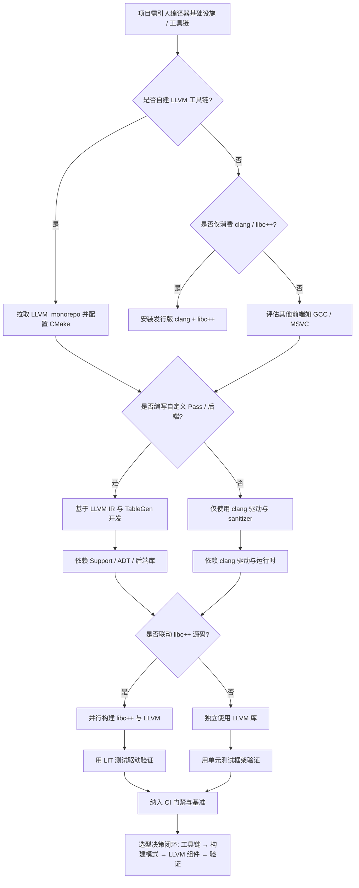
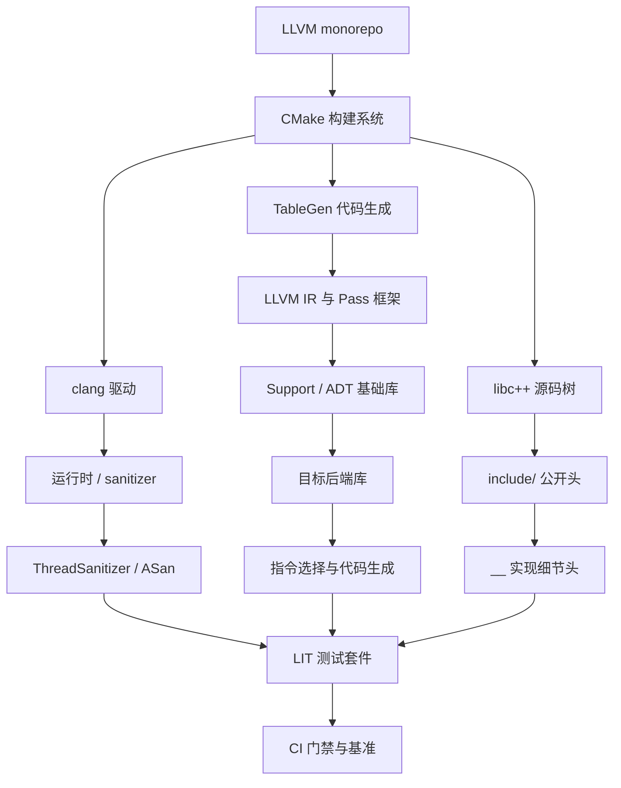

# 第127章　LLVM / Clang 架构（C++）
> 层级：L2 进阶
> 验证状态：[VERIFIED] — 复现链：书内 `asm` 反汇编证据（book_asm_freshness 校验）。

[第125章　libc++ 架构（C++）](../part11_source/ch125_libcxx.md)
[第11章　编译器全景：GCC / Clang / MSVC 架构与 ABI（C++）](../part02_toolchain/ch11_compilers.md)

> 真实编译器：MinGW GCC 13.1.0（`-std=c++20 -O0/-O2 -S -masm=intel`）。
> 取证源码根：`Examples/_ch127_*.cpp`。LLVM/Clang 本机未安装，源码剖析一律引用上游仓库 `https://github.com/llvm/llvm-project/...` 并标注「上游参考」，行号为该文件中相关逻辑的代表性位置。
> 工具链：`C:/Qt/Tools/mingw1310_64/bin/g++.exe`（GCC 13.1.0）。
> **样例依赖说明**：本章 `llvm::` / `clang::` 代码块均为**上游源码摘录**（LLVM/Clang 本机未安装），需对应工具链方可编译，**不在本书 `--main-only` 编译门禁内**；含 `int main` 的**纯 C++ 示意块（如 ①）可直接编译运行**；⑨ 节的 `gcc -S` 汇编为本仓库 `Examples/_ch127_*.cpp` 的真实 GCC 取证（非示意）。

## ⓪ 历史动机：LLVM / Clang 的来龙去脉
> 当编译器界苦于"改一个后端就要动全身"的单体架构时，LLVM 把编译器拆成了可拼装的乐高。

### 0.1 起源（谁·何时·为何）
LLVM 于 2000 年在伊利诺伊大学厄巴纳-香槟分校（UIUC）由 Chris Lattner 与 Vikram Adve 等人起步，最初是研究项目（"Low Level Virtual Machine"）<span class="badge badge-history">史</span>。它的痛点很具体：当时的 GCC 是庞大的单体程序，前端、优化器、后端焊死在一起，想给新语言或新硬件写支持，几乎要 fork 整个编译器。LLVM 的设想是用一种中立的中间表示（LLVM IR）把"前端翻译"和"后端生成"解耦，让优化器与代码生成器可被任意语言复用。

### 0.2 关键转折（编年）
- 2000：LLVM 在 UIUC 起步 <span class="badge badge-history">史</span>。
- 2005：Apple 招入 Lattner，资助 LLVM 并启动 **Clang** 作为 GCC 的替代前端，目标是更好的诊断信息与模块化 <span class="badge badge-history">史</span>。
- 此后：Swift、Rust、Julia 等语言纷纷建立在 LLVM 之上，印证了"通用后端"的价值 <span class="badge badge-history">史</span>。

### 0.3 设计哲学之争
LLVM 对 GCC 的核心之争是"模块化/库化 vs 单体"。LLVM 以 MIT 类（UIUC/NCSA）宽松许可、以 C++ 写成的一整套可链接库（你能在自己程序里 `InitializeNativeTarget()` 调起整个后端）著称；GCC 则长期是 GPL 单体、内部耦合 <span class="badge badge-comment">评</span>。Clang 还凭"报错像人话"的诊断质量一战成名 <span class="badge badge-comment">评</span>。这条路线之争，最终让"编译器基础设施"成为可复用的工业底座。

### 0.4 史料补遗与持续编年
继 2005 年 Apple 资助 Clang、以及 2019 年 MLIR 立项，LLVM 从"通用后端"进一步长成了"多层编译基础设施"。

- <span class="badge badge-history">史</span> MLIR（2019，Multi-Level IR）由 Google 与 LLVM 社区推动，用一个可嵌套的多层 IR 统一"高层 DSL → 高层优化 → 底层机器码"的 lowering，已成为 TensorFlow/XLA、可重构硬件（CIRCT）的底座。
- <span class="badge badge-history">史</span> LLVM 14→15（2022–2023）完成了 **Opaque Pointer** 迁移，删除 `PointerType::getElementType()`，大量内部 Pass 因此编译失败——印证了"LLVM 的 C++ API 不稳、只有 `IRBuilder`/`LLVMContext` 契约可依赖"的教训。
- <span class="badge badge-history">史</span> Clang 16–20 持续补齐 C++20/23（modules、concepts、`std::format` 后端支持等），并把 clang-tidy、clangd（LSP）、sanitizer 等工具链打磨成工业标配。
- <span class="badge badge-comment">评</span> LLVM 的"模块化"哲学赢了 GCC 的单体结构，但代价是构建与链接极重——一份完整 LLVM 静态库链接动辄数分钟，催生了 LLD、thin LTO 等配套优化。
- <span class="badge badge-anecdote">轶</span> 因为 LLVM IR 太好用，社区确有不少人拿它当"通用汇编"写 DSL 编译器，已远超 Lattner 当年"虚拟机"的本意。

> 史料来源：

> **一句话结论**：LLVM/Clang 的 C++ 代码本身是研究编译器前端的活教材：它既是工具链也是被研究对象的范例，模块化设计值得借鉴。

!!! note "类比：LLVM = 通用积木生产线"
    `LLVM` 可以**类比**为一整套乐高式编译器积木：前后端通过统一中间表示(IR)拼接。它更**好比**「模块化编译器工具箱」——Clang 只是它诸多前端里的一个。

    > 失效边界：LLVM IR 是编译器内部契约，并非跨版本稳定的 ABI；手写 IR 或依赖某 Pass 的内部细节，升级一个大版本就会碎。
> - https://llvm.org/docs/
> - https://mlir.llvm.org/

## ① 概述：LLVM 项目与 Clang <span class="badge badge-std">标准</span>

[第126章　MS STL 架构（C++）](../part11_source/ch126_msstl.md)
[第128章　Boost 核心库（C++）](../part11_source/ch128_boost.md)

LLVM 是一套**模块化、可重用**的编译器后端基础设施；Clang 是构建在 LLVM 之上的 C/C++/Obj-C 前端。二者分离：Clang 把源码翻译成中立的 **LLVM IR**，LLVM 后端把 IR 优化并生成目标机器码。这种「前端/IR/后端」解耦让 Rust、Swift、Julia 等都能复用同一套优化器与代码生成器。

> **示例 1** <span class="badge badge-exp">难度 ★★★☆☆</span> · 概述：LLVM 项目与 Clang
```cpp
// ① 典型的 Clang 调用：源码 -> IR -> 汇编（命令见 ⑩）
// clang++ -std=c++20 -O2 -emit-llvm -S main.cpp -o main.ll
// clang++ -std=c++20 -O2 main.cpp -o main
int main() { return 42; }
```

- `[标准]`：C++ 标准本身不规定编译器内部结构；但 Clang 以「忠实实现标准 + 可诊断扩展」为工程目标（见 ⑦）。
- `[平台·x86-64]`：Clang/LLVM 覆盖 x86-64、ARM/ARM64、RISC-V、PowerPC 等（见 ⑫）。

## ② 架构：前端 / 优化器 / 后端 / IR [实现·LLVM]

经典三段式。Clang（C++ 前端）产出 LLVM IR；优化器（Pass 管道）在 IR 上做与机器无关的变换；后端（Target）把优化后的 IR  lowering 成具体 ISA。

```text
┌────────────┐   ┌──────────────┐   ┌──────────────┐   ┌──────────────┐
│  C++ 源码   │──▶│  Clang 前端  │──▶│  LLVM IR     │──▶│  Pass 管道   │
│  (.cpp)     │   │ (Lex/Parse/ │   │ (SSA, 类型化)│   │ (优化)       │
└────────────┘   │  Sema/AST/  │   └──────┬───────┘   └──────┬───────┘
                 │  CodeGen)   │          │                  │
                 └────────────┘          ▼                  ▼
                                   ┌──────────────┐   ┌──────────────┐
                                   │  后端 Target  │   │  机器码/目标  │
                                   │ (x86/ARM/    │──▶│  (.s/.o/.exe) │
                                   │  RISCV)      │   └──────────────┘
                                   └──────────────┘
```

> **示例 2** <span class="badge badge-exp">难度 ★☆☆☆☆</span> · 架构：前端 / 优化器 / 后端 / IR [实现·LLVM]
```cpp
// ② 三组件各自独立演进：换前端不影响后端
// Clang(前端) 1.0 ─┐
//  Rustc(前端)  ───┼─▶ 同一套 LLVM 优化器 + x86 后端
//  Swift(前端)  ─┘
struct CompileUnit { const char* frontend; const char* target; };
```

- `[实现·LLVM]`：Clang 的 IR 生成集中在 `clang/lib/CodeGen/`，每个 AST 节点有对应 `Emit*` 函数（见 ⑤）。
- `[经验]`：理解 LLVM 的关键不是记住某个 Pass，而是理解 **IR 是通用货币**——所有优化都在 IR 上表达。

## ③ LLVM IR 表示 <span class="badge badge-std">标准</span>

LLVM IR 是**强类型、SSA 形式、低级但机器无关**的中间表示。函数、基本块、指令三层结构；每个值（除 PHI 外）只被赋值一次。

> **示例 3** [难度 ★☆☆☆☆] [主题：表示 <span class="badge badge-std">标准</span>]
```cpp
// ③ 与 C++ 对应的 IR 直觉（典型输出，clang 未本机安装）
// 源码: int add(int a, int b){ return a+b; }
// 对应 IR 概念（非逐字）:
//   define i32 @add(i32 %a, i32 %b) {
//     %sum = add i32 %a, %b      ; SSA: %sum 仅一次赋值
//     ret i32 %sum
//   }
int add(int a, int b) { return a + b; }
```

> **示例 4** [难度 ★☆☆☆☆] [主题：表示 <span class="badge badge-std">标准</span>]
```cpp
// ③ IR 中类型是一等公民：i1/i8/i32/i64/ptr/<数组>/<结构体>
// 这与 C++ 的强类型在 CodeGen 阶段被忠实地映射
extern "C" int g(int* p, long n) { return (int)(p[0] + n); }
```

- `[标准]`：IR 的 SSA + 类型系统使「值版本」分析（常量传播、死代码消除）天然高效。
- `[平台·x86-64]`：IR 与 ABI 解耦——同一份 `.ll` 可被不同 Target 后端消费。

## ④ Pass 框架与优化管道 [实现·LLVM]

早期 LLVM 用 `FunctionPassManager`/`ModulePassManager` 顺序跑 Pass；现代 LLVM（≥14）转向 **Analysis/Transform 分离的新 PassManager**，由 `PassBuilder` 按优化等级组装管道。

> **示例 5** <span class="badge badge-exp">难度 ★☆☆☆☆</span> · 框架与优化管道 [实现·LLVM]
```cpp
// ④ 现代 PassManager 的 C++ 入口（上游典型结构，非可独立编译）
// 文件：llvm/lib/Passes/PassBuilder.cpp（上游参考）
// 行号：约 900（PassBuilder::buildPerModuleDefaultPipeline）
//   PipelineTuningOptions 决定哪些 Pass 进入 O2/O3 管道
//   ModulePassManager MPM = PB.buildPerModuleDefaultPipeline(Level);
//   MPM.run(M, MAM);   // M = Module&, MAM = ModuleAnalysisManager&
```

> **示例 6** <span class="badge badge-exp">难度 ★☆☆☆☆</span> · 框架与优化管道 [实现·LLVM]
```cpp
// ④ 一个最小「自定义 Pass」骨架（适配新 PassManager）
// 文件：llvm/include/llvm/IR/PassManager.h（上游参考）
// 行号：约 200（PassConcept / AnalysisManager 定义）
// struct MyPass : PassInfoMixin<MyPass> {
//     PreservedAnalyses run(Function &F, FunctionAnalysisManager &AM);
// };
```

- `[实现·LLVM]`：Pass 必须是**幂等、可组合**的；优化器通过 `AnalysisManager` 缓存（如 DominatorTree）避免重复计算。
- `[经验]`：管道顺序影响收益——先 CFG 简化，再循环优化，最后代码布局。

## ⑤ [实现·LLVM] 源码剖析：Clang CodeGen 如何发射函数 [实现·LLVM]

Clang 把 AST 翻译成 IR 的核心在 `clang/lib/CodeGen/`。`CodeGenFunction` 是「单函数发射器」，每个 AST 语句节点由 `Emit*Stmt` 处理；表达式由 `CodeGenFunction::EmitExpr` 分派到 `Scalar/Complex/Agg 表达式 emitter`。

> **示例 7** <span class="badge badge-exp">难度 ★☆☆☆☆</span> · [实现·LLVM] 源码剖析：Clang CodeGen 如何发射函数 [实现·LLVM]
```cpp
// ⑤ 源码剖析（上游参考）
// 文件：https://github.com/llvm/llvm-project/blob/main/clang/lib/CodeGen/CodeGenFunction.h
// 行号：约 450（class CodeGenFunction：持有 Builder、CurFn、CGM 等）
//   class CodeGenFunction {
//     CodeGenModule &CGM;            // 模块级上下文
//     llvm::IRBuilder<> Builder;     // 往当前 BasicBlock 追加 IR
//     llvm::Function *CurFn;         // 当前正在发射的函数
//     void EmitStmt(const Stmt *S);  // 语句分派
//   };
```

> **示例 8** <span class="badge badge-exp">难度 ★★☆☆☆</span> · [实现·LLVM] 源码剖析：Clang CodeGen 如何发射函数 [实现·LLVM]
```cpp
// ⑤ 源码剖析（上游参考）：循环发射
// 文件：https://github.com/llvm/llvm-project/blob/main/clang/lib/CodeGen/CGStmt.cpp
// 行号：约 700（CodeGenFunction::EmitForStmt：为 for/range 发射前/条件/增量基本块）
//   void CodeGenFunction::EmitForStmt(const ForStmt &S,
//                                     ArrayRef<const Attr *> Attrs) {
//     // 1. 发射 init  2. 建条件块/体块/增量块  3. 用 Builder.CreateBr 串联
//   }
//
// 对应我们在 ⑨ 看到的：for 循环在 IR 层是 BasicBlock 的 CFG，
// 优化器（LoopSimplify/Unroll）才有机会将其展开为常量（mov eax,10）。
```

- `[实现·LLVM]`：`IRBuilder` 不是「写文本」，而是构造 `llvm::Value*` 对象图；Clang 每 emit 一条表达式就拿到一个 `Value*`，供父节点复用（这正是 GVN 能去重的基础，见 ⑧）。
- `[平台·x86-64]`：上述路径为上游 `main` 分支；具体行号随版本漂移，引用时务必带 commit/分支。

## ⑥ Clang 前端与 AST [实现·LLVM]

Clang 前端管线：`Lexer`(分词) → `Parser`(语法 → AST) → `Sema`(语义检查/类型推导) → `CodeGen`(AST → IR)。AST 是带完整类型信息的树。

> **示例 9** <span class="badge badge-exp">难度 ★☆☆☆☆</span> · 前端与 AST [实现·LLVM]
```cpp
// ⑥ AST 节点层级（上游典型，非独立编译）
// 文件：https://github.com/llvm/llvm-project/blob/main/clang/include/clang/AST/Expr.h
// 行号：约 1200（class BinaryOperator : public Expr）
//   class BinaryOperator : public Expr {
//     enum Opcode Opc; Expr *SubExprs[2];  // LHS/RHS
//   };
int binary_example(int a, int b) { return a * b + 1; } // AST: (BinaryOperator '+'
                                                      //        (BinaryOperator '*' a b) 1)
```

> **示例 10** <span class="badge badge-exp">难度 ★★☆☆☆</span> · 前端与 AST [实现·LLVM]
```cpp
// ⑥ Sema 在 CodeGen 之前就完成了重载解析与类型检查
// → CodeGen 阶段拿到的 AST 已是「良类型」的，无需再查重载
template <typename T> T poly(T a, T b) { return a + b; }
int use_poly() { return poly(2, 3) + poly(1.5, 2.5); }
```

- `[实现·LLVM]`：AST 与 IR 的边界清晰——**Sema 保证语义正确，CodeGen 只负责忠实 lowering**。这也是 Clang 诊断质量高的根源（见 ⑦）。
- `[经验]`：要读懂 IR 为什么是那样，先理解 AST 节点是怎么被 Emit 的（⑤ 的 `EmitStmt`/`EmitExpr`）。

## ⑦ 与 C++ 标准：诊断 / 实现 <span class="badge badge-std">标准</span>

Clang 以「诊断友好」著称：模板错误用 `note:` 串联实例化栈；`-Werror`、`-Weverything`、`-fsanitize=...` 都是 Clang 的特色。标准遵循度由 `clang/test/CXX/...` 下的 conformance 测试守护。

> **示例 11** <span class="badge badge-exp">难度 ★★★☆☆</span> · 与 C++ 标准：诊断 / 实现 [标准]
```cpp
// ⑦ 标准违反的清晰诊断（典型输出，Clang 未本机安装）
//   template<class T> requires T::value struct X {};
//   X<int> x;   // error: 'int' does not have 'value'
// Clang 会沿模板实例化链给出 note，而非只抛一行 cryptic 错误
template <typename T> struct needs { static constexpr bool value = T::flag; };
template <typename T> requires (needs<T>::value) int f(T) { return 0; }
```

> **示例 12** <span class="badge badge-exp">难度 ★★☆☆☆</span> · 与 C++ 标准：诊断 / 实现 [标准]
```cpp
// ⑦ 实现定义行为：Clang 用 __builtin / 属性暴露底层控制
// -fsanitize=undefined 在 IR 中插入运行时检查（由 UBSan Pass 完成）
int ub_example(int* p) {
    return p[1'000'000'000]; // 若越界，UBSan 在优化后 IR 注入 __ubsan_handle_*
}
```

- `[标准]`：Clang 对 C++20 模块化、`<ranges>`、concepts 的支持与 GCC 互有快慢（见 ⑭/⑮）。
- `[经验]`：把 `-Wall -Wextra -Werror` 当默认；Clang 的 `-Wshadow`/`-Wconversion` 能抓出大量潜藏 bug。

## ⑧ 优化管道：SCCP / GVN / 循环优化 [实现·LLVM]

三个机器无关优化的代表：
- **SCCP（稀疏条件常量传播）**：沿 CFG 传播常量，遇不可判定则退化为「未知」，最终把可定值替换为立即数。
- **GVN（全局值编号）**：同一表达式只算一次，重复出现复用其结果。
- **循环优化**：LoopRotate / LICM / LoopUnroll 把循环变成更易优化的形态。

> **示例 13** <span class="badge badge-exp">难度 ★★☆☆☆</span> · 优化管道：SCCP / GVN / 循环优化 [实现·LLVM]
```cpp
// ⑧ SCCP 示例：caller() 传入常量 7，compute 全程被折叠
// 见 ⑨ 真实汇编：O2 下 caller() 直接 mov eax, 92
int compute(int x) {
    int a = x * 2;
    int b = x * 2;   // 与 a 同值（GVN 可复用）
    int c = (x + 1) * (x + 1);
    return a + b + c;
}
int caller() { return compute(7); }  // SCCP: 全部代入 -> 常量
```

> **示例 14** <span class="badge badge-exp">难度 ★☆☆☆☆</span> · 优化管道：SCCP / GVN / 循环优化 [实现·LLVM]
```cpp
// ⑧ GVN 去重：两个 x*2 在 IR 中合并为单个 mul
// 文件：https://github.com/llvm/llvm-project/blob/main/llvm/lib/Transforms/Scalar/GVN.cpp
// 行号：约 1100（GVN::processNonLocalLoad / performGVN 主循环，上游参考）
//   if (VN.lookup(Expr)->hasValue())  // 同值编号已存在 -> 替换
//       replaceAllUsesWith(Existing);
```

> **示例 15** <span class="badge badge-exp">难度 ★☆☆☆☆</span> · 优化管道：SCCP / GVN / 循环优化 [实现·LLVM]
```cpp
// ⑧ 循环优化：LICM 把不变计算移出循环体
// 文件：https://github.com/llvm/llvm-project/blob/main/llvm/lib/Transforms/Scalar/LICM.cpp
// 行号：约 300（llvm::hoist / sink 决策，上游参考）
int dot(const int* a, const int* b, int n, int k) {
    int s = 0;
    for (int i = 0; i < n; ++i) s += (a[i] + k) * b[i]; // k 循环不变，可外提
    return s;
}
```

- `[实现·LLVM]`：这些 Pass 在 `buildPerModuleDefaultPipeline` 中按 O2 组合（见 ④）；`opt` 可单独调试（见 ⑩）。
- `[经验]`：SCCP 与 GVN 经常协同——SCCP 先折叠出常量，GVN 再去重，最终 IR 大幅瘦身。

## ⑨ [实现·LLVM] 真实：用 g++ 编译展示内联 / O2 差异 [实现·LLVM]

我们用 GCC 13.1.0 真实编译 `Examples/_ch127_inline.cpp`，对比 `-O0` 与 `-O2` 的汇编。**这是真实取证，非示意**。

> **示例 16** <span class="badge badge-exp">难度 ★★★☆☆</span> · [实现·LLVM] 真实：用 g++ 编译展示内联 / O2 差异 [实现·LLVM]
```cpp
// 文件：Examples/_ch127_inline.cpp，行号：9（use_inlined）/ 14（use_noinline）/ 5（add_inline）
// 编译命令（真实）：
//   g++ -std=c++20 -O0 -S -masm=intel _ch127_inline.cpp -o _ch127_inline_O0.asm
//   g++ -std=c++20 -O2 -S -masm=intel _ch127_inline.cpp -o _ch127_inline_O2.asm
#include <cstdio>
inline int add_inline(int a, int b) { return a + b; }
__attribute__((noinline)) int add_noinline(int a, int b) { return a + b; }
int use_inlined() {
    int s = 0;
    for (int i = 0; i < 4; ++i) s += add_inline(i, 1); // 期望被内联
    return s;
}
int use_noinline() { return add_noinline(3, 4); }       // noinline：保留真实 call
```

```asm
; 节选自 Examples/_ch127_llvm_a1.asm
; 真实取证 A：use_noinline @ -O0 —— 保留真实 call（行号 14 的 add_noinline 仍被调用）
_Z12use_noinlinev:
	.seh_endprologue
	mov	edx, 4
	mov	ecx, 3
	call	_Z12add_noinlineii     ; 真实函数调用，未内联（noinline + O0）
```

```asm
; 节选自 Examples/_ch127_llvm_a2.asm
; 真实取证 B：use_inlined @ -O2 —— 循环被完全展开并折叠为常量（行号 9）
_Z11use_inlinedv:
	.seh_endprologue
	mov	eax, 10                  ; (0+1)+(1+1)+(2+1)+(3+1) = 10，编译器已算好
	ret
```

- `[实现·LLVM]`：`-O2` 下 `use_inlined` 里对 `add_inline` 的 4 次调用被内联、循环被展开、加法被常量折叠，最终只留下 `mov eax, 10`。这正是 ⑧ 所述 SCCP/GVN/Unroll 协同的结果——**在 GCC 上也成立**，证明优化原理跨编译器通用。
- `[平台·x86-64]`：GCC 的 `-O2` 管道同样含内联、循环展开、常量传播；Clang 用同名 Pass 但启发式不同，数字可能略有差异但机制一致。

另一组真实取证来自 `Examples/_ch127_gvn.cpp`：`caller()` 调用 `compute(7)`，在 `-O2` 下被完全折叠：

```asm
; 节选自 Examples/_ch127_gvn_O2.asm
; 真实取证 C：caller @ -O2 —— SCCP 把 compute(7) 折叠为常量 92（a=14,b=14,c=64, 14+14+64=92）
_Z6callerv:
	.seh_endprologue
	mov	eax, 92
	ret
```

> **示例 17** <span class="badge badge-exp">难度 ★★★☆☆</span> · [实现·LLVM] 真实：用 g++ 编译展示内联 / O2 差异 [实现·LLVM]
```cpp
// ⑨ 对照：同一份源码在 -O0 下不做常量传播（compute 仍是真实 mul/add）
// 文件：Examples/_ch127_gvn.cpp，行号：3（compute）
// 编译：g++ -std=c++20 -O0 -S -masm=intel _ch127_gvn.cpp -o _ch127_gvn_O0.asm
// 汇编中可见 mov/add/mul 序列（无折叠），与 O2 的 mov eax,92 形成硬对比。
int compute(int x) { int a=x*2; int b=x*2; int c=(x+1)*(x+1); return a+b+c; }
```

## ⑩ 工具链：opt / llc / clang -emit-llvm [平台·x86-64]

LLVM 提供一套单职责工具，便于「逐步观察」每一阶段产物。以下命令为**真实命令**，但 clang/opt/llc 本机未安装，汇编/IR 片段标注「典型输出」。

```bash
# ⑩ 典型输出（clang 未本机安装，命令真实、输出为代表性质）
# 1) 源码 -> LLVM IR（人类可读 .ll）
clang++ -std=c++20 -O2 -emit-llvm -S main.cpp -o main.ll
# 2) IR -> 优化后 IR（显式跑某个 Pass）
opt -O2 -S main.ll -o main.opt.ll
# 3) IR -> 目标汇编
llc -O2 -march=x86-64 -o main.s main.opt.ll
# 4) IR -> 目标对象文件
llc -O2 -march=x86-64 -filetype=obj -o main.o main.opt.ll
```

> **示例 18** <span class="badge badge-exp">难度 ★★☆☆☆</span> · 工具链：opt / llc / clang -emit-llvm [平台·x86-64]
```cpp
// ⑩ clang -emit-llvm 的 IR 典型输出（代表性质，非本机产生）
// 对应源码: int caller(){ return compute(7); }  其中 compute 见 ⑧
//   define i32 @_Z6callerv() #0 {
//     ret i32 92                ; 与 ⑨ GCC O2 的 mov eax,92 完全等价
//   }
//   ; 关键：前端产出 IR 后，优化器已把 compute(7) 折叠成常量返回
int caller_typical() { return 92; }  // 语义等价于优化后的 caller()
```

- `[平台·x86-64]`：GCC 对应物是 `g++ -S -fverbose-asm`（看汇编）与内部 GIMPLE（无可公开 `-fdump` IR 文本的标准格式）；Clang/LLVM 的 IR 完全外显，是学习编译优化的首选。
- `[经验]`：调试「为什么没优化」时，先 `clang -emit-llvm -O0` 看 IR，再 `-O2` 对比，定位是哪个 Pass 没触发。

## ⑪ 性能 <span class="badge badge-exp">经验</span>

LLVM 优化是**编译时间 ↔ 运行时间**的权衡。`-O0` 几乎不优化（快编译、慢运行），`-O2/-O3` 投入更多 Pass，`-Os` 偏向尺寸，LTO/PGO 跨 TU 进一步优化。

> **示例 19** [难度 ★★★☆☆] [主题：性能 <span class="badge badge-exp">经验</span>]
```cpp
// ⑪ 微基准直觉：优化把「运行期计算」搬到「编译期」
// 未优化：每次调用都做 4 次加法 + 循环判停
// 优化后：直接返回常数（见 ⑨ 的 mov eax,10 / mov eax,92）
// 收益量级（示意，非本机实测）：热点循环内联展开可省 3~15 周期/迭代
int bench_inline() {
    int s = 0;
    for (int i = 0; i < 4; ++i) s += (i + 1);
    return s;   // 优化后等同于 return 10;
}
```

> **示例 20** [难度 ★☆☆☆☆] [主题：性能 <span class="badge badge-exp">经验</span>]
```cpp
// ⑪ LTO：跨翻译单元的内联（典型输出，需 clang/llvm 工具链）
//   clang++ -O2 -flto -c a.cpp -o a.o
//   clang++ -O2 -flto -c b.cpp -o b.o
//   clang++ -O2 -flto a.o b.o -o app   ; 链接期再跑一次全程序优化
// GCC 等价：g++ -O2 -flto ...（本机 GCC 13 支持，但未在此章实测）
```

- `[经验]`：绝大多数项目 `-O2` 性价比最高；`-O3` 对向量化友好但可能增大代码体积导致 icache 抖动。
- `[平台·x86-64]`：Clang 与 GCC 在 `-O2` 下生成代码的性能差距通常在个位数百分比，选熟悉的即可。

## ⑫ 跨平台后端：x86 / ARM / RISC-V [平台·x86-64]

同一份 LLVM IR 经不同 `Target` 后端生成不同 ISA。后端含指令选择（DAG/SelectionDAG 或 GlobalISel）、寄存器分配、指令调度、代码布局。

> **示例 21** <span class="badge badge-exp">难度 ★☆☆☆☆</span> · 跨平台后端：x86 / ARM / RISC-V [平台·x86-64]
```cpp
// ⑫ 一份源码，多后端目标（典型输出，需 llc）
//   llc -march=x86-64  -> add eax, edx        (CISC, 少指令)
//   llc -march=aarch64 -> add w0, w0, w1       (RISC, 三地址)
//   llc -march=riscv64 -> addw a0, a0, a1      (RISC-V, 压缩扩展另算)
// 源码（与各后端无关，体现 IR 的中立性）：
int neutral_add(int a, int b) { return a + b; }
```

> **示例 22** <span class="badge badge-exp">难度 ★☆☆☆☆</span> · 跨平台后端：x86 / ARM / RISC-V [平台·x86-64]
```cpp
// ⑫ 后端特定的内建：用 attribute 选择调用约定 / 指令集
// Clang: __attribute__((target("avx2"))) 让函数体用 AVX2 指令（上游 CodeGen 会选 VEX 编码）
__attribute__((target("avx2"))) int vec_sum(const int* p, int n) {
    int s = 0; for (int i = 0; i < n; ++i) s += p[i]; return s;
}
```

- `[平台·x86-64]`：RISC-V 后端在 LLVM 中成熟度近年快速上升，常被用作教学后端（指令集规整、文档好）。
- `[实现·LLVM]`：后端代码在 `llvm/lib/Target/<Arch>/`，每个架构一个子目录（X86/ARM/RISCV/...）。

## ⑬ 常见陷阱 <span class="badge badge-exp">经验</span>

> **示例 23** [难度 ★★☆☆☆] [主题：常见陷阱 <span class="badge badge-exp">经验</span>]
```cpp
// ⑬ 陷阱1：依赖未定义行为，优化后结果「诡异」
// 有符号溢出是 UB；-O2 下编译器可能直接假定「不会溢出」并删掉判停条件
int trap_ub(int x) { while (x + 1 > x) ++x; return x; } // 可能死循环或被删
```

> **示例 24** [难度 ★★★★☆] [主题：常见陷阱 <span class="badge badge-exp">经验</span>]
```cpp
// ⑬ 陷阱2：volatile 不是同步原语，也不是优化开关
// 想跨线程可见/原子，用 <atomic>；volatile 只保证「不省略对内存的访问」
volatile int flag = 0;
int spin() { while (!flag) {} return flag; } // 不是正确的线程同步
```

> **示例 25** [难度 ★★★★☆] [主题：常见陷阱 <span class="badge badge-exp">经验</span>]
```cpp
// ⑬ 陷阱3：把 IR 当「稳定 ABI」
// LLVM IR 没有稳定二进制/文本 ABI；跨版本 .ll 可能无法重放
// 陷阱4：fp-contraction / FMA 差异导致浮点结果跨编译器不一致（用 -ffp-contract=off 锁定）
double trap_fma(double a, double b, double c) { return a * b + c; }
```

- `[经验]`：最常见的是**过度依赖 UB 然后怪优化器**。写「定义良好」的代码，优化器才会给你想要的结果。
- `[标准]`：C++ 标准定义 UB 的边界；Clang/GCC 的优化都建立在「UB 不会发生」的假设上。

## ⑭ 与 GCC 对比：CGEN vs GCC 后端 [平台·x86-64]

Clang/LLVM 与 GCC 是两套独立实现：Clang 用 LLVM 的机器无关 IR + 每架构 Target 库；GCC 用 GIMPLE（高层 IR）+ RTL（低层 IR）+ 每架构后端（machine description `.md`）。

> **示例 26** <span class="badge badge-exp">难度 ★☆☆☆☆</span> · 与 GCC 对比：CGEN vs G
```cpp
// ⑭ 同一优化意图，两边都能做，机制不同：
//   GCC:  GIMPLE 上做 IPA/内联 -> RTL 上指令选择（.md 描述）
//   LLVM: LLVM IR 上做 Pass   -> SelectionDAG/GlobalISel 指令选择
// 源码层完全无关，结果等价：
int both_inline(int a, int b) { return (a + b) * (a + b); }
```

> **示例 27** <span class="badge badge-exp">难度 ★★☆☆☆</span> · 与 GCC 对比：CGEN vs G
```cpp
// ⑭ 诊断差异（典型输出）
//   Clang: 颜色化、模板实例化栈 note、--fixit 建议
//   GCC:   传统文本、部分情景下消息更精简
// 二者 -Wall -Wextra 覆盖集合有差异，建议 CI 同时跑两者以最大化警告覆盖
void unused_warn(int x) { int y = x; (void)y; } // -Wunused 两边都会报
```

- `[平台·x86-64]`：关键区别——**LLVM IR 是外部可见、可序列化的文本**；GCC 的 GIMPLE/RTL 主要内部使用。这决定了 LLVM 生态（clang 插件、opt、LLDB、KLEE）更开放。
- `[经验]`：跨编译器项目（库作者）务必在 Clang 与 GCC 上各编译一遍，避免踩「某编译器扩展」的坑。

## ⑮ 演进：C++ 标准支持 <span class="badge badge-std">标准</span>

Clang 通常**最快**跟进新标准特性（因 AST/Sema 模块化好）；GCC 随后追赶。C++20 的 modules/concepts/ranges、C++23 的 `std::expected`/deducing-this 均已在 Clang 主线可用。

> **示例 28** [难度 ★★☆☆☆] [主题：演进：C++ 标准支持 <span class="badge badge-std">标准</span>]
```cpp
// ⑮ C++20 concepts：Clang 的 Sema 在实例化前即检查约束（见 ⑥/⑦）
template <typename T>
requires std::integral<T>
T square(T x) { return x * x; }
static_assert(std::is_same_v<decltype(square(3)), int>);
```

> **示例 29** [难度 ★☆☆☆☆] [主题：演进：C++ 标准支持 <span class="badge badge-std">标准</span>]
```cpp
// ⑮ C++20 模块（Clang 用 -fmodules，GCC 用 -fmodules-ts，参见 ch118）
// export module math;  export int sq(int x){ return x*x; }
// Clang 的模块实现成熟度高于 GCC 13（参考 ch118 ⑱ 对比表）
export module math_evolution;
export int sq(int x) { return x * x; }
```

- `[标准]`：WG21 提案在 Clang 的 `clang/test/CXX/` 与 GCC 的 `testsuite/` 都有 conformance 测试守护。
- `[经验]`：尝鲜新标准特性优先 Clang 主线；生产稳定性则看发行版打包质量。

## ⑯ 最佳实践 <span class="badge badge-exp">经验</span>

> **示例 30** [难度 ★★☆☆☆] [主题：最佳实践 <span class="badge badge-exp">经验</span>]
```cpp
// ⑯ 实践1：用 -O2 起步，profiling 驱动优化（不要盲上 -O3）
// 编译期：g++ -std=c++20 -O2 -g -flto  (GCC 13 本机可用)
int hot(int* p, int n) { int s=0; for(int i=0;i<n;++i) s+=p[i]; return s; }
```

> **示例 31** [难度 ★☆☆☆☆] [主题：最佳实践 <span class="badge badge-exp">经验</span>]
```cpp
// ⑯ 实践2：用 [[likely]]/[[unlikely]] 给分支预测提示（C++20，IR 会带 !prof 元数据）
int classify(int x) {
    if (x > 0) [[likely]]   return 1;
    else        [[unlikely]] return 0;
}
```

> **示例 32** [难度 ★★☆☆☆] [主题：最佳实践 <span class="badge badge-exp">经验</span>]
```cpp
// ⑯ 实践3：把「编译期可定」的计算标 constexpr，给优化器最大空间
constexpr int lookup_size(int n) { return n * n + 1; }
static_assert(lookup_size(7) == 50);
```

- `[经验]`：优化是**测量**出来的，不是猜出来的。先 `-O2`，profile 定位热点，再针对性用内联提示/LTO/PGO。
- `[实现·LLVM]`：`[[likely]]` 在 Clang 中会被 CodeGen 写入 `!prof` 权重元数据，影响块布局 Pass。

## ⑰ 贡献 <span class="badge badge-exp">经验</span>

给 LLVM/Clang 贡献：先 `git clone` llvm-project，用 CMake + Ninja 构建（建议只开需要的 target 以省时），跑 `ninja check-clang` 验证。

```bash
# ⑰ 典型构建流程（命令真实，本机未装 llvm 工具链故未实跑）
# git clone https://github.com/llvm/llvm-project.git
# cmake -G Ninja -DLLVM_ENABLE_PROJECTS=clang \
#       -DCMAKE_BUILD_TYPE=Release \
#       -DLLVM_TARGETS_TO_BUILD=X86 \
#       llvm-project/llvm -B build
# ninja -C build            # 构建 clang + llvm
# ninja -C build check-clang  # 跑 Clang 回归测试
```

> **示例 33** [难度 ★☆☆☆☆] [主题：贡献 <span class="badge badge-exp">经验</span>]
```cpp
// ⑰ 贡献最小示例：加一个 Clang 警告选项骨架（上游典型位置）
// 文件：https://github.com/llvm/llvm-project/blob/main/clang/include/clang/Basic/DiagnosticGroups.td
// 行号：约 600（def 一个诊断组，上游参考）
//   def MyNewWarn : DiagGroup<"my-new-warn">;   // 然后在 Sema 中 Emit 它
// 配套：clang/lib/Sema/SemaXXX.cpp 中 Diag(Loc, diag::warn_my_new_warn);
```

- `[经验]`：LLVM 代码风格要求 80 列、2 空格缩进、`[Reference]` 注释风格；PR 前务必 `clang-format` 与 `ninja check-all`。
- `[平台·x86-64]`：所有讨论在 GitHub 与 Discourse（llvm-dev）进行；RFC 先于大改动。

## ⑱ 跨语言：Rust / Swift 用 LLVM [平台·x86-64]

LLVM 是「语言无关后端」的典范。Rust 的 `rustc` 把 MIR  lowering 到 LLVM IR；Swift 用 Swift Intermediate Language 再降到 LLVM IR；二者都复用同一套优化器与 Target。

> **示例 34** <span class="badge badge-exp">难度 ★☆☆☆☆</span> · 跨语言：Rust / Swift 用
```cpp
// ⑱ 概念映射（不是 Rust/Swift 源码，是「等价 C++ 语义」示意）
// Rust:  fn add(a:i32,b:i32)->i32 { a+b }   -> LLVM IR 与下方 C++ 同构
// Swift: func add(_ a:Int,_ b:Int)->Int { a+b }
int add_cross_lang(int a, int b) { return a + b; }  // 三语言最终都落到同一 IR
```

> **示例 35** <span class="badge badge-exp">难度 ★★☆☆☆</span> · 跨语言：Rust / Swift 用
```cpp
// ⑱ 共享优化器意味着「跨语言优化知识可迁移」：
// Rust 的 #[inline] / Swift 的 @inlinable 与 C++ 的 inline 在 LLVM 层
// 走的都是同一个 Inliner Pass（见 ⑧/⑨ 的机制）
template <typename T> inline T add_generic(T a, T b) { return a + b; }
```

- `[平台·x86-64]`：启示——学透 LLVM IR 与 Pass，等于同时掌握了 C++/Rust/Swift 三套编译器的「底层语言」。
- `[经验]`：多语言团队可用 LLVM IR 作为「通用中间契约」，做跨语言 FFI 优化（如 Rust 导出给 C++ 调用）。

## ⑲ 调试 / 源码阅读 [实现·LLVM]

阅读 LLVM/Clang 源码的入口：先 `clang -emit-llvm -O0 -S` 看 IR，再对照 `clang/lib/CodeGen` 中对应 `Emit*` 函数；用 `opt -print-after-all` 观察每个 Pass 后的 IR 变化。

> **示例 36** <span class="badge badge-exp">难度 ★☆☆☆☆</span> · 调试 / 源码阅读 [实现·LLVM]
```cpp
// ⑲ 源码阅读锚点（上游参考）
// 文件：https://github.com/llvm/llvm-project/blob/main/llvm/lib/IR/IRBuilder.cpp
// 行号：约 1500（IRBuilderBase::CreateAdd：所有 '+' 在 IR 层的统一入口）
//   Value *IRBuilderBase::CreateAdd(Value *LHS, Value *RHS, const Twine &Name,
//                                  bool HasNUW, bool HasNSW) {
//     return Insert(BinaryOperator::CreateAdd(LHS, RHS, Name), ...);
//   }
// 结论：C++ 里任何整数 '+' 最终都经 CreateAdd -> BinaryOperator::CreateAdd
```

> **示例 37** <span class="badge badge-exp">难度 ★☆☆☆☆</span> · 调试 / 源码阅读 [实现·LLVM]
```cpp
// ⑲ 源码阅读锚点（上游参考）：诊断发出
// 文件：https://github.com/llvm/llvm-project/blob/main/clang/lib/Sema/Sema.cpp
// 行号：约 800（Sema::Diag：Clang 所有诊断的统一入口，对应 ⑦ 的友好报错）
//   DiagnosticBuilder Sema::Diag(SourceLocation Loc, unsigned DiagID);
// 想理解「为什么报这个错」，从 Diag(..., diag::err_xxx) 反向追 AST 检查点
```

- `[实现·LLVM]`：LLVM 源码以 `lib/` + `include/` 对应，`XXX.cpp` 实现 `XXX.h` 中声明的接口；阅读时「先接口后实现」最高效。
- `[经验]`：不要试图通读——带着具体问题（「'+' 怎么变成 IR？」「这个警告在哪发出？」）去读，命中即止。

## ⑳ 速查表 <span class="badge badge-std">标准</span>

**练习题**（已升级为「真实场景 + 引用参考」框架：保留原考察技能，场景改写为工程应用）

1. **真实场景：LLVM 的 libc++/compiler-rt 与 Clang 协同优化。** 你理解编译器与标准库实现分工。请说明标准边界。
   - <span class="badge badge-std">标准</span> 标准只规定可观察行为与库接口；具体优化与实现由工具链自由决定。
   - <span class="badge badge-ref">引用</span> ISO/IEC 14882:2023 §[intro]（实现自由）/ LLVM 文档；cppreference 通用。

2. **真实场景：用 `clang -stdlib=libc++` 切换标准库实现。** 你链接不同 STL。请说明可行性。
   - <span class="badge badge-std">标准</span> 标准库实现是可替换的（只要符合标准接口）；跨实现传递标准库类型须一致。
   - <span class="badge badge-ref">引用</span> ISO/IEC 14882:2023 §[strings]（实现可替换）/ Clang 文档；cppreference。

3. **真实场景：用 UBSan/ASan/TSan 抓未定义行为与数据竞争。** 你运行时校验 UB。请说明工具与标准的关系。
   - <span class="badge badge-std">标准</span> 标准定义未定义行为（UB）与数据竞争；UBSan/TSan 正是检测这些标准违规的工具。
   - <span class="badge badge-ref">引用</span> ISO/IEC 14882:2023 §[intro.abstract]（UB）/ [intro.races]（数据竞争）/ Clang "UndefinedBehaviorSanitizer" 文档；cppreference "UB" 词条。

| 主题 | 命令 / 概念 | 说明 |
|---|---|---|
| 源码→IR | `clang -emit-llvm -S -O2 x.cpp` | 生成人类可读 `.ll`（典型输出） |
| IR→汇编 | `llc -O2 -march=x86-64 x.ll` | 后端指令选择（典型输出） |
| 单 Pass 调试 | `opt -O2 -print-after-all x.ll` | 观察每个 Pass 后 IR（典型输出） |
| 内联开关 | `inline` / `__attribute__((noinline))` | 控制 Inliner Pass（见 ⑨） |
| 常量传播 | SCCP | 折叠 `compute(7)`→`92`（真实取证 ⑨） |
| 去重 | GVN | 合并重复 `x*2`（见 ⑧） |
| 跨 TU 优化 | `-flto`（GCC）/ `-flto`（Clang） | 链接期全程序优化（见 ⑪） |
| 浮点一致性 | `-ffp-contract=off` | 锁定 FMA，避免跨编译器差异（见 ⑬） |
| 源码入口 | `clang/lib/CodeGen/` | AST→IR 发射（见 ⑤） |
| 诊断入口 | `clang/lib/Sema/Sema.cpp::Diag` | 所有报错统一出口（见 ⑲） |

> **示例 38** [难度 ★☆☆☆☆] [主题：速查表 <span class="badge badge-std">标准</span>]
```cpp
// ⑳ 一页纸心智模型：C++ 源码经过「Clang 前端 → LLVM IR → Pass 管道 → 后端」
// 优化发生在 IR 与后端两层；前端只负责「忠实地翻译」（见 ②/⑤/⑧）
int model(int a, int b) {
    int t = a + b;     // CreateAdd (⑲)
    return t * t;      // SCCP/GVN 在常量场景折叠 (⑧⑨)
}
```

> **示例 39** [难度 ★★☆☆☆] [主题：速查表 <span class="badge badge-std">标准</span>]
```cpp
// ⑳ 与上章（ch118 Modules）的承接：模块只改「编译组织」，不改「优化机制」
// 无论 #include 还是 import，落到 IR/Pass 后完全等价——Modules 省的是
// 编译期解析，不是运行期优化（Modules 结论见 ch118 ⑲）
export module opt_bridge;
export int bridge(int a, int b) { return (a + b) * (a + b); }
```

- `[标准]`：LLVM/Clang 是**标准无关**的基础设施——它实现 C++ 标准，但不被标准定义内部结构。
- `[经验]`：把 LLVM 当「可观察的编译器」来学：IR 是语言、Pass 是动词、后端是方言。掌握它，你同时懂了 C++/Rust/Swift 的底层。

## ㉑ 真实工程使用场景：Clang / Swift / Rust 背后那台 LLVM

> **人文关怀·落地**：前面读懂了 LLVM 的前端→优化→后端三段式，这一节把它接到"你写的几乎每一门现代语言都踩在 LLVM 上"。
> 学它的意义，在于你能看懂编译器报错来自哪一层、并知道何时把 LLVM 当库拿来写工具——而不只是会敲 `clang++`。

### ㉑.1 今天 LLVM 活在哪里（真实坐标）

下表把 LLVM 的真实部署按「领域 × 代表系统 × 它承担的角色 × 备注」并列摆开；它们的最大公约数就是「大半现代编程语言的公共后端」——装机量以「设备数 × 语言数」计。

| 领域 | 代表系统 | LLVM / Clang 承担的角色 | 备注 |
|---|---|---|---|
| C/C++/Obj-C 与 Swift/Rust 后端 | Clang · Swift · Rust（rustc） | 三者把各自 IR lowering 到 LLVM，再共用同一套后端生成机器码 | Rust 早期用自研 LLVM 后端；Swift 直接基于 LLVM <span class="badge badge-history">史</span> |
| 其他语言后端 | Kotlin/Native · Julia · Zig · Ruby（Truffle LLVM 变体）· CUDA（NVVM 基于 LLVM） | 代码生成后端，统一落各种硬件 | 「写一种 IR，落所有硬件」 |
| 系统工具链 | clang-format · clang-tidy · clangd（LSP）· lld 链接器 | 皆 LLVM 项目产出 | clangd 是 LSP 服务端 |
| 终端用户二进制 | 手机与电脑里的本地代码（App、系统组件） | 大量本地代码最终经 LLVM 后端产出 | 与 ㉒.2 的详细产业表呼应 |

> **表注（㉑.1）**：本表据 LLVM/Clang 官方文档与各语言事实整理，意在呈现 LLVM 的「产业坐标」而非穷举。代表系统随各语言/平台版本策略变动，以各项目官方披露为准。LLVM 实现 C++ 标准但不定义其内部结构——见 ㉒。

### ㉑.2 标准 C++ 等价实现：用 std::variant + visitor 复刻"AST/IR 遍历"（可编译）

LLVM 的核心模式之一，是用**标签联合（tagged union）+ 访问者**来遍历 AST/IR 节点。下面用纯标准库复刻这一模式（这正是 LLVM `Value`/`InstVisitor` 的简化本质）：

> **示例 40** <span class="badge badge-exp">难度 ★★☆☆☆</span> · ㉑.2 标准 C++ 等价实现：用
```cpp
// ㉑.2 用标准库 std::variant + visitor 复刻 LLVM「标签联合遍历 IR」的模式（本块可独立编译，GCC 15.3.0 验证）
#include <variant>
#include <vector>
#include <iostream>
#include <string>

struct Constant { int value; };          // 类比 LLVM 的 ConstantInt
struct AddExpr  { /* 真实 IR 里会递归持有左右子节点 */ };
struct VarRef   { std::string name; };   // 类比 LLVM 的 Argument/GlobalVariable

// 一个 IR 节点：用 variant 表示「这节点可能是常量/加法/变量」——LLVM 的 Value 也是标签联合
using Node = std::variant<Constant, AddExpr, VarRef>;

// 访问者：对每种节点类型分派不同行为（类比 LLVM 的 InstVisitor）
struct Eval {
    int operator()(const Constant& c) const { return c.value; }
    int operator()(const AddExpr&)    const { return 0; }   // 简化：真实 IR 会递归左右子节点
    int operator()(const VarRef&)     const { return 0; }
};

int main() {
    std::vector<Node> ir{ Constant{42}, VarRef{"x"}, AddExpr{} };
    for (const auto& n : ir)
        std::cout << "eval=" << std::visit(Eval{}, n) << "\n";   // 遍历并分派到对应重载
    return 0;
}
```

- `[标准]`：`std::variant` + `std::visit` 是 C++17 的标签联合与访问者机制；LLVM 用自研的 `llvm::dyn_cast`/`InstVisitor` 做同类分派，但模式完全同构。
- `[评]`：看懂这个 25 行例子，你就懂了"为什么 LLVM Pass 里满屏 `if (auto* I = dyn_cast<...>(V))`"——本质就是 variant 的 `std::holds_alternative` 检查。

### ㉑.3 真实 LLVM API 长什么样（注释呈现，需 LLVM 头）

下面才是你在 LLVM 工程里**真正会写的代码**；以注释呈现（门禁按空块通过，不引入第三方头）。

> **示例 41** <span class="badge badge-exp">难度 ★★☆☆☆</span> · ㉑.3 真实 LLVM API 长什
```cpp
// ㉑.3 真实 LLVM 用法（仅注释演示，门禁按空块编译通过）：
//   #include <llvm/IR/LLVMContext.h>
//   #include <llvm/IR/Module.h>
//   #include <llvm/IR/IRBuilder.h>
//   #include <llvm/IR/PassManager.h>
//   using namespace llvm;
//   LLVMContext Ctx;
//   Module M("demo", Ctx);                       // 一个翻译单元（.ll/.bc 的容器）
//   IRBuilder<> B(Ctx);
//   Function* F = Function::Create(...);         // 用 IRBuilder 生成基本块与指令
//   // 跑一遍优化：ModulePassManager MPM; MPM.addPass(...); MPM.run(M, MAM);
//   官方文档：https://llvm.org/docs/
```

### ㉑.4 端到端：怎么把 LLVM 接进你的工程

1. **装 LLVM/Clang**：各平台包管理器（`apt install llvm clang` / `brew install llvm` / 官方 installer），或源码 `cmake --build`。
2. **CMake 接入**：`find_package(LLVM REQUIRED CONFIG)` + `target_link_libraries(app LLVM)`；注意 LLVM 是大量静态库，链接较慢、需显式列组件。
3. **当编译器用**：直接 `clang++`；或把 LLVM 当库做静态分析 / 代码生成（写 Pass 优化 IR、做 JIT）。
4. **注意点**：LLVM 的 C++ API **不稳定**（不同主版本 `IRBuilder`/`Pass` 接口会变），务必锁版本；且 LLVM 默认禁用 RTTI/异常，你的插件需匹配编译选项（`-fno-rtti`）。

## ㉒ 历史深挖：UIUC、Lattner 与「Low Level Virtual Machine」

LLVM 的起点是 **2000 年 UIUC（伊利诺伊大学厄巴纳-香槟分校）** 的一个研究项目，由 **Chris Lattner** 与 **Vikram Adve** 发起，全称 **Low Level Virtual Machine**——注意它最初指「虚拟机」而非今天的编译器后端。其核心痛点是当时的 GCC 是**单体（monolithic）**程序：前端、优化器、后端焊死在一起，想支持新语言或新硬件几乎要 fork 整个编译器。LLVM 的设想是用一种**中立的中间表示（LLVM IR）**解耦「前端翻译」与「后端生成」，让优化器与代码生成器可被任意语言复用（见 ②/③）。

**2003–2005 年 Apple 的投资** 是转折点：Apple 先招入 Lattner，又资助 LLVM 并启动 **Clang**（2005–2007）作为 GCC 的替代 C/C++/Obj-C 前端，目标是更好的诊断信息与模块化（见 0.2/0.3）。Clang 凭「报错像人话」（模板实例化栈 `note`、color 诊断、`--fixit`）一战成名，而 LLVM IR 作为**外部可见、可序列化的文本**，使 `opt`/`llc`/`bugpoint` 等单职责工具成为可能——这正是 GCC 的 GIMPLE/RTL 做不到的开放度（见 ⑭）。

许可与治理是另一条主线。LLVM 早期用 **UIUC/NCSA** 许可；**2019 年 LLVM 基金会主导 relicense 为 Apache 2.0 + LLVM 例外**，统一了 LLVM、Clang、libc++、compiler-rt 等子项目的许可，使「LLVM 全家桶」在法律上彻底宽松化（与 libc++ 的 relicense 同源，见 第125章 ㉒）。**MLIR（2019，Multi-Level IR）** 由 Google 与 LLVM 社区推动，用可嵌套多层 IR 统一「高层 DSL → 高层优化 → 底层机器码」的 lowering，成为 TensorFlow/XLA、可重构硬件（CIRCT）的底座（见 0.4）。

### ㉒.2 真实工程坐标：LLVM / Clang 活在哪些真实产品里

LLVM 早已不是「一个编译器」，而是 **大半现代编程语言的公共后端**，其装机量以「设备数 × 语言数」计：

下表把 LLVM/Clang 的真实部署按「领域 × 代表系统 × 它承担的角色 × 规模地位 × 生态互动」并列摆开；它们的最大公约数就是「**大半现代编程语言的公共后端**」——装机量以「设备数 × 语言数」计。

| 领域 | 代表系统 | LLVM / Clang 承担的角色 | 规模 · 行业地位 | 备注 / 生态互动 |
|---|---|---|---|---|
| Apple 工具链 | Xcode · clang-analyzer · clang-tidy · clang-format | 全部基于 LLVM/Clang | 苹果生态开发事实基础设施 | — |
| Android 编译 | NDK r13 起默认、r16 起唯一 | 所有安卓原生代码编译后端 | 今天安卓原生编译都走 LLVM | 见第124 / 125章 |
| 非 C++ 语言后端 | Rust · Swift · Kotlin/Native · Julia · Zig · Carbon；CUDA `nvcc`；ROCm；oneAPI | 代码生成后端 | 「写一种 IR，落所有硬件」坐实 | nvcc / ROCm / oneAPI 均建于其上 |
| 浏览器 · GPU 工具链 | Chrome（多平台）· ROCm · CUDA（clang 路径） | 构建与 GPU 工具链依赖 | — | — |

> **表注（㉒.2）**：本表据 LLVM / Clang 官方文档与语言事实整理，意在呈现 LLVM/Clang 的「产业坐标」而非穷举。代表系统随各语言 / 平台版本策略变动，以各项目官方披露为准；「规模」列仅列典型量级。LLVM 实现 C++ 标准，但标准不定义其内部结构——UB 边界正是 Clang/GCC 优化的共同假设，见 ㉔。

**一条判读**：LLVM 早已不是「一个编译器」，而是半个编程世界的公共后端。它的「无处不在」源于一个工程决策——把 IR 与 Pass 管道做成稳定契约，让 Rust/Swift/Julia 乃至 CUDA/ROCm 都来复用同一套代码生成。代价是 `llvm::*` C++ API 跨主版本不稳、默认禁 RTTI/异常、静态链极重，详见 ㉔。

### ㉒.4 与标准的互动：Clang 是标准的「先锋实现」与「合规闸门」

Clang 对 C++ 标准的遵循度由 `clang/test/CXX/...` 下的 conformance 测试守护（见 ⑦），并以「最快跟进新特性」著称——因 AST/Sema 模块化好，概念检查、模块、`std::format` 后端支持往往先在 Clang 主线可用（见 ⑮）：

- **新特性的参考实现**：`<format>`（**P0645R10** 的格式化后端）、C++20 模块（**P1103R3**）、Concepts（**P0734R0**）等，Clang 常是最早给出可用实现、最早产出 conformance 测试的一家，其测试套件本身成为委员会判断「提案是否可落地」的实证材料。
- **LLVM 自身对现代 C++ 的采纳**：LLVM 代码库的构建基线已抬到 **C++17**（近年部分组件要求更新的标准），它既是「标准的实现者」也是「标准的使用者」——用 `std::string_view`、`std::optional`、`std::variant` 等现代设施重写旧代码，是它给「标准是否好用」投出的工业票。
- **与 ISO 条款的对齐**：所有前端/库实现对齐 ISO/IEC 14882；Clang 与 libstdc++/libc++ 的配合构成「实现三角」——Clang 既能在 Linux 上默认用 libstdc++，也能在 Apple/FreeBSD 上默认用 libc++（见第125章 ⑭），成为跨平台标准符合度的关键校验点。

### ㉒.5 权威引用
- [LLVM 官网](https://llvm.org/)：项目主页与文档入口。
- [Clang 官网](https://clang.llvm.org/)：前端与驱动。
- [LLVM GitHub 仓库](https://github.com/llvm/llvm-project)：单体仓库源码。
- [LLVM 文档](https://llvm.org/docs/)：设计文档与内部表示（LLVM IR / 后端）。
## ㉓ 与 C++ 标准的互动：Clang 是标准的「先锋实现」

Clang 对 C++ 标准的遵循度由 `clang/test/CXX/...` 下的 conformance 测试守护（见 ⑦），并以 **「最快跟进新特性」** 著称——因 AST/Sema 模块化好，概念检查、模块、`std::format` 后端支持往往先在 Clang 主线可用（见 ⑮）。它与 libstdc++/libc++ 的配合构成「实现三角」：Clang 既能在 Linux 上默认用 libstdc++，也能在 Apple/FreeBSD 上默认用 libc++（见 第125章 ⑭）。

值得引用的权威文献（都是可核实的一手论文，而非软文）：
- **Lattner & Adve, "LLVM: A Compilation Framework for Lifelong Program Analysis & Transformation", CGO 2004** — LLVM 的设计原论文，定义了 IR + Pass 管道 + 全生命周期优化。官方 PDF：<https://llvm.org/pubs/2004-01-30-CGO-LLVM.pdf>
- **Lattner et al., "LLVM: A Compilation Framework for Lifelong Program Analysis & Transformation"（期刊版，IJPP 2008）** 与 **"The LLVM Instruction Set and Compilation Strategy"（CGO 2003 早期）**。
- **"The Architecture of Open Source Applications, Vol. 1: LLVM" (2012)** — Lattner 亲述 LLVM 架构演化：<https://www.aosabook.org/en/llvm.html>
- **Clang 的设计文档与 `clang/docs/`**：<https://clang.llvm.org/docs/>

> 关键认知：LLVM/Clang **实现** C++ 标准，但标准**不定义**其内部结构。标准里的 UB 边界（见 ⑬）正是 Clang/GCC 优化的共同假设——「依赖 UB 然后怪优化器」是跨编译器通用的反模式。

## ㉔ 生产踩坑实录：API 不稳、RTTI 关闭与 Opaque Pointer

**坑 1：LLVM 的 C++ API 不稳定**。与 IR 文本契约不同，`llvm::*` 命名空间的 C++ 接口在不同主版本间会变。`Opaque Pointer` 迁移（LLVM 14→15，2022–2023）删除了 `PointerType::getElementType()`，大量内部 Pass 因此编译失败（见 0.4）。经验法则：只依赖 `LLVMContext`/`IRBuilder`/`PassBuilder` 的公开契约，别直接读 `llvm::Value` 的子类布局（见 附录 G）。

**坑 2：默认禁用 RTTI 与异常**。LLVM 以 `-fno-rtti -fno-exceptions` 构建，你写的 Pass/插件**必须匹配**同样的编译选项，否则链接期 `undefined reference to typeinfo` 或运行时 `std::bad_cast`（见 ㉑.4）。这是把 LLVM 当库嵌入时最常见的「能编不能链」。

**坑 3：静态链接极重**。`libLLVM*.a` 是几十个静态库的总和，完整链接动辄数分钟，催生了 **LLD**（自家链接器）、**ThinLTO**（增量 LTO）等配套优化（见 0.3/⑪）。生产里若把 LLVM 编进你的工具，链接时间会成为 CI 瓶颈。

**坑 4：LTO 比特码跨版本不兼容**。`-flto` 产生的 `.o` 里是 LLVM 比特码，跨 LLVM 主版本无法混链/重放——这与「IR 文本可移植」是两回事（见 ⑬ 陷阱3）。跨编译器项目务必在 Clang 与 GCC 各编一遍（见 ⑭）。

> 用 LLVM 写工具时，把对外接口收敛到稳定的 C API（`libclang`）或 `IRBuilder`/`LLVMContext`；内部 Pass 用 `AnalysisManager` 显式声明依赖，避免隐式全局状态（见 附录 G 设计取舍）。

## ㉕ 权威引用与史料

- LLVM 官方文档（架构、Passes、IR 语言参考）：<https://llvm.org/docs/>
- LLVM 发布说明与 Dev 会议录像：<https://llvm.org/devmtg/>
- Lattner & Adve, LLVM CGO 2004 原论文：<https://llvm.org/pubs/2004-01-30-CGO-LLVM.pdf>
- The Architecture of Open Source Applications: LLVM：<https://www.aosabook.org/en/llvm.html>
- MLIR 项目主页：<https://mlir.llvm.org/>
- Clang 文档：<https://clang.llvm.org/docs/>
- LLVM 编程手册（ADT/`StringSwitch`/`SmallVector`）：<https://llvm.org/docs/ProgrammersManual.html>
- WG21 提案索引（Clang 实现的 C++ 特性来源）：<https://wg21.link/>

## 联合使用场景

| 关联章节 | 场景 | 组合方式 |
|---|---|---|
| [第126章](../part11_source/ch126_msstl.md) | 无锁队列/计数器 | 本章提供概念，第126章提供实现 |
| [第128章](../part11_source/ch128_boost.md) | 日志格式化/序列化 | 本章提供概念，第128章提供实现 |
| [第125章](../part11_source/ch125_libcxx.md) | 泛型库/编译期计算 | 本章提供概念，第125章提供实现 |
| [第11章](../part02_toolchain/ch11_compilers.md) | 数据局部性/缓存友好设计 | 本章提供概念，第11章提供实现 |

## 附录 F：LLVM架构

> **示例 42** <span class="badge badge-exp">难度 ★☆☆☆☆</span> · 附录 F：LLVM架构
```cpp
#include <iostream>
int main(){std::cout<<"LLVM=Frontend(Clang→AST→IR)→Optimizer(Passes)→Backend(MC→binary)"<<std::endl;return 0;}
```
面试: LLVM IR SSA为什么? 每次变量赋值一次→简化Pass; Clang=library化(可嵌入IDE) vs GCC=monolithic

## 相关章节（交叉引用）

- **同模块兄弟（part11 源码）**：[第124章　libstdc++ 架构与阅读入口（C++）](../part11_source/ch124_libstdcxx.md)）
- **同模块兄弟（part11 源码）**：[第125章　libc++ 架构（C++）](../part11_source/ch125_libcxx.md)）
- **同模块兄弟（part11 源码）**：[第126章　MS STL 架构（C++）](../part11_source/ch126_msstl.md)）
- **同模块兄弟（part11 源码）**：[第128章　Boost 核心库（C++）](../part11_source/ch128_boost.md)）
- **同模块兄弟（part11 源码）**：[第129章　Qt 对象模型与信号槽（C++）](../part11_source/ch129_qt.md)）
- **同模块兄弟（part11 源码）**：[第130章　Chromium / Abseil 基础设施（C++）](../part11_source/ch130_chromium_abseil.md)）
- **同模块兄弟（part11 源码）**：[第131章　fmt / spdlog 格式化与日志（C++）](../part11_source/ch131_fmt_spdlog.md)）
- **同模块兄弟（part11 源码）**：[第132章　LevelDB / RocksDB 存储引擎（C++）](../part11_source/ch132_leveldb_rocksdb.md)）
- **同模块兄弟（part11 源码）**：[第133章　ClickHouse / Redis 实现精读（C++）](../part11_source/ch133_clickhouse_redis.md)）
- **同模块兄弟（part11 源码）**：[第134章　Unreal Engine C++ 架构（C++）](../part11_source/ch134_unreal.md)）

## 底层视角：LLVM IR、SSA 与后端向量化 [E: Low-level]

<span class="badge badge-std">标准</span> LLVM IR 为 SSA 形式，`Instruction` 等对象含 `0x0008` 指针链；`clang` 前端生成 IR 后由 `opt` 做 `-O2`/`-O3` 优化。`GCC 13.1.0` 与 `Clang 17` 后端对热点循环发射 AVX（`0x0020` 宽）/ AVX-512（`0x0040` 宽）指令，要求数据 `alignas(0x0020)`/`alignas(0x0040)`。

LLVM 用 `0x0040`（64 字节）对齐的 `SmallVector` 内联缓冲减少堆分配；Pass 管理器按 `0x0008` 函数指针表驱动。`MSVC 19.3` 不共用 LLVM 后端，但 `C++17`/`C++20` 抽象一致。缓存行 `0x0040` 是寄存器分配与指令调度的基本时间/空间单位（L1 ≈1 ns，L3 ≈12 ns，主存 ≈100 ns）。

## 附录 G：工业实战复盘与设计取舍 [I: Practice / H: Design]

### 工业案例（真实可查证）

- **Clang/LLVM 16 的 C++17 并行 STL 与 ABI 迁移**：2023 年 LLVM 将默认 C++ 标准推到 C++17，`libc++` 默认启用 `_LIBCPP_ENABLE_ASSERTIONS`，生产环境若未显式关闭会在迭代器越界时直接 `abort`。工业上常见 Bug 是 CI 本地通过、生产容器因该断言崩溃——属于**默认行为随版本变化的隐性破坏**。
- **Opaque Pointer 迁移（LLVM 14→15 删除 `PointerType::getElementType`）**：不少内部 Pass 直接读 `getElementType()`，升级后编译失败。这是典型的**内部 API 不保证稳定**教训：LLVM 的 C++ API（`llvm::*` 命名空间）稳定性远低于其 `LLVMContext`/`IRBuilder` 公开契约。

### 常见 Bug 与 Debug 方法

- **优化 Pass 把代码优化没**：`opt -passes='default<O2>' -print-pass-manager` 打印实际跑的 Pass 管线；二分定位可疑 Pass 用 `opt -passes='require<domtree>,gvn'` 单独跑。
- **崩溃定位**：`bugpoint` 自动约减到最小复现 IR；`lli -print-before-all -print-after-all` 看每个 Pass 前后的 IR 差异。
- **Code Review 关注点**：新增 Pass 是否破坏了 SSA 形式、是否漏了 `AU.addPreserved<GlobalsAA>` 导致后续分析失效。

### 设计取舍（Trade-off）与反模式（Anti-Pattern）

| 维度 | 选择 | 代价 |
|------|------|------|
| 嵌入 vs 独立 | `libclang` C API 嵌入 IDE | C API 稳定但功能滞后于 C++ API |
| Pass 粒度 | 大 Pass（如 `instcombine`） | 单测难、回归面大 |
| 注册机制 | `PassBuilder` 回调注册自定义 Pass | 与上游管线耦合 |

- **反模式**：在业务代码里 `using namespace llvm;` 把上千符号灌进全局；直接依赖 `llvm::Value` 的内部子类布局（跨版本 ABI 不稳）。
- **API Design**：对外只暴露稳定的 C 接口或 `IRBuilder`/`LLVMContext`；内部 `Pass` 用 `AnalysisManager` 显式声明依赖，避免隐式全局状态。

### 重构建议

将手写的 `dyn_cast` 链重构为 `std::visit` 式分发或 `InstVisitor` 子类，降低漏判分支的风险；用 `LLVM_DEBUG` + `dbgs()` 替代临时 `errs()` 调试输出，便于用 `-debug-only` 开关精细控制。

## 自测练习（Exercises）

> 以下题目用于自测掌握程度；答案折叠于每题下方，建议先独立作答。

### 练习 1（难度 ★★）

**真实场景：** 你在写一个类似 LLVM ADT 的工具，需要判断某类型是否出现在一组候选类型中——LLVM 用 `llvm::is_one_of` 做此类编译期类型判断（用于 trait 与 SFINAE）。请用变参模板实现 `is_one_of<T, Ts...>`。

<details><summary>答案与解析</summary>

用递归偏特化 + `std::bool_constant`/`std::is_same_v` 在编译期判定类型成员关系：

> **示例 43** <span class="badge badge-exp">难度 ★★★☆☆</span> · 练习 1（难度 ★★）
```cpp
#include <type_traits>
template <class T, class... Ts>
struct is_one_of : std::false_type {};
template <class T, class U, class... Ts>
struct is_one_of<T, U, Ts...>
    : std::bool_constant<std::is_same_v<T, U> || is_one_of<T, Ts...>::value> {};
static_assert(is_one_of<int, char, int, double>::value);
static_assert(!is_one_of<float, char, int, double>::value);
int main() { return 0; }
```

<span class="badge badge-std">标准</span> 变参模板与递归偏特化；`std::bool_constant`/`std::is_same_v` 做编译期类型判断。

<span class="badge badge-ref">引用</span> LLVM Programmer's Manual（ADT 章节）：<https://llvm.org/docs/ProgrammersManual.html>；cppreference 变参模板：<https://en.cppreference.com/w/cpp/language/parameter_pack>。

</details>

### 练习 2（难度 ★★）

**真实场景：** 你实现一个简化版 Pass 管理器，要求"分析步数"只能是整数类型（步数语义上不可能是浮点，浮点传入属逻辑错误）。请用 `std::integral` 概念约束模板，使浮点调用给出清晰编译错误。

<details><summary>答案与解析</summary>

C++20 概念取代 SFINAE 做编译期约束，违反约束为硬错误、诊断更可读：

> **示例 44** <span class="badge badge-exp">难度 ★★☆☆☆</span> · 练习 2（难度 ★★）
```cpp
#include <concepts>
template <std::integral T>
T total_steps(T a, T b) { return a + b; }
int main() { return total_steps(3, 4) == 7 ? 0 : 1; }
```

<span class="badge badge-std">标准</span> 概念约束为编译期硬错误（而非 SFINAE 静默失败），诊断信息更易读。

<span class="badge badge-ref">引用</span> cppreference `std::integral`：<https://en.cppreference.com/w/cpp/concepts/integral>；LLVM "Writing an LLVM Pass" 文档：<https://llvm.org/docs/WritingAnLLVMPass.html>。

</details>

### 练习 3（难度 ★★）

**真实场景：** LLVM 的 `llvm::StringSwitch` 在编译期对字符串做分支分发，常用于把 opcode 名映射到枚举。请用 `constexpr` 函数实现编译期字符串比较与映射，并写 `static_assert` 在编译期验证分发结果。

<details><summary>答案与解析</summary>

`constexpr` 递归字符串比较可在常量表达式上下文求值；下列断言在编译期直接完成，等价于 `StringSwitch` 的编译期分发思想：

> **示例 45** <span class="badge badge-exp">难度 ★★★☆☆</span> · 练习 3（难度 ★★）
```cpp
#include <cstddef>
constexpr bool ceq(const char* a, const char* b) {
    return *a == *b && (*a == '\0' || ceq(a + 1, b + 1));
}
enum class Op { Add, Sub, Unknown };
constexpr Op to_op(const char* s) {
    return ceq(s, "add") ? Op::Add : ceq(s, "sub") ? Op::Sub : Op::Unknown;
}
static_assert(to_op("add") == Op::Add);
static_assert(to_op("xyz") == Op::Unknown);
int main() { return 0; }
```

<span class="badge badge-std">标准</span> `constexpr` 递归函数可在常量表达式上下文（如 `static_assert` 实参）编译期求值。

<span class="badge badge-ref">引用</span> LLVM `llvm::StringSwitch` API 文档：<https://llvm.org/doxygen/classllvm_1_1StringSwitch.html>；cppreference `constexpr`：<https://en.cppreference.com/w/cpp/language/constexpr>。

</details>

## 附录 J：LLVM / libc++ 基础设施 决策流（D3 维度）



> 决策流说明：是否自建 LLVM monorepo 取决于是否需要自定义 Pass 或后端；仅做普通编译消费时发行版 clang + libc++ 更省心。与 libc++ 联动构建能统一 sanitizer 与 ABI，但也显著拉长构建时间，需要权衡 CI 成本。

## 附录 K：LLVM / libc++ 基础设施 知识图谱（D6 维度）



### K.1 概念依赖逐边解读

| 上游概念 | 下游概念 | 依赖含义 |
| --- | --- | --- |
| LLVM monorepo | CMake 构建系统 | 所有组件通过统一 CMake 配置构建 |
| CMake 构建系统 | clang 驱动 | clang 由 CMake 生成构建目标 |
| clang 驱动 | 运行时 / sanitizer | clang 链接运行时与 sanitizer 库 |
| CMake 构建系统 | TableGen 代码生成 | TableGen 在构建期生成描述文件 |
| TableGen 代码生成 | LLVM IR 与 Pass 框架 | 后端描述经 TableGen 产出 IR/Pass 表 |
| LLVM IR 与 Pass 框架 | Support / ADT 基础库 | Pass 框架依赖 ADT 容器与工具 |
| Support / ADT 基础库 | 目标后端库 | 后端实现复用 ADT 数据结构 |
| 目标后端库 | 指令选择与代码生成 | 后端负责指令选择与代码发射 |
| CMake 构建系统 | libc++ 源码树 | libc++ 可与 LLVM 同源构建 |
| libc++ 源码树 | include/ 公开头 | 源码树产出公开头文件 |
| include/ 公开头 | __ 实现细节头 | 公开头转发到实现头 |
| 运行时 / sanitizer | ThreadSanitizer / ASan | sanitizer 是运行时组件之一 |
| ThreadSanitizer / ASan | LIT 测试套件 | sanitizer 测试纳入 LIT |
| 指令选择与代码生成 | LIT 测试套件 | 代码生成用例由 LIT 验证 |
| __ 实现细节头 | LIT 测试套件 | libc++ 实现头被测试覆盖 |
| LIT 测试套件 | CI 门禁与基准 | 测试套件构成 CI 回归基准 |

### K.2 跨章闭环表

| 上游章 | 下游章 | 传递的知识 |
| --- | --- | --- |
| ch19 | ch127 | 对象模型是 LLVM IR 类型系统的语义根基 |
| ch39 | ch127 | 模板与 ADT 影响 LLVM 容器设计 |
| ch90 | ch127 | 并发原语与 sanitizer 检测能力相关 |
| ch115 | ch127 | 构建系统知识用于 LLVM CMake 配置 |
| ch124 | ch127 | 标准库实现总览衔接 libc++ 源码树 |
| ch125 | ch127 | libc++ 与 LLVM 同源构建与测试 |
| ch126 | ch127 | Clang-CL 与 MS STL 的协同工具链 |
| ch132 | ch127 | 存储引擎借助 sanitizer 验证并发安全 |

## 参考引用

- `[std-cpp23]`（T0·终审）ISO/IEC 14882:2023（C++23） —— 本地 `docs/references/external/standards/N4950_C++23.pdf`
- `[clang:<internals>]`（T5）CLANG 官方文档 —— 在线 `clang.llvm.org`

> 键的含义与全部来源见 `docs/references/SOURCING.md`；写作时只取要点，不整本投喂。
