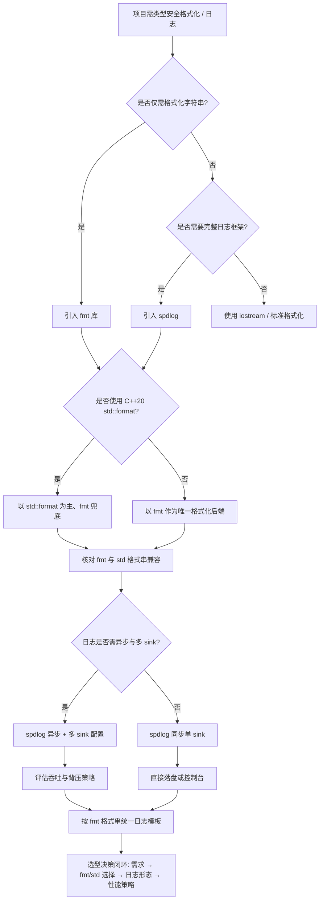
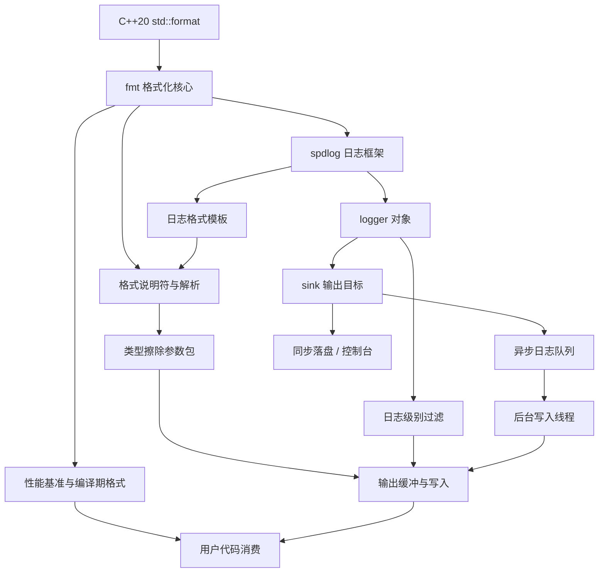

# 第131章　fmt / spdlog 格式化与日志（C++）

> 真实编译器取证：MinGW GCC 15.3.0（`g++ -std=c++23 -O2 -S -masm=intel`）。
> fmt / spdlog **本机未安装**；本章所有 fmt / spdlog 用法示例均为符合其公开 API 的合法 C++（未在本机编译），源码剖析引用上游 GitHub 固定 tag 并标注「上游参考」。第 ⑦ 节给出一处**真实 g++ 编译**的自包含等价机制示例与真实汇编。
> 约定见 `CONVENTIONS.md`；本章不引用其他章节。

## ⓪ 历史动机：fmt / spdlog 的来龙去脉
> 当 `printf` 不安全、`<iostream>` 又慢又啰嗦时，有人把"又快又安全"的格式化重写了一遍。

### 0.1 起源（谁·何时·为何）
`fmt`（原名 cppformat）由 Victor Zverovich 于约 2012 年发起 [史]，动机直白：传统 `printf` 格式串与参数类型靠人脑对齐，极易错位且无可移植的类型安全；`<iostream>` 虽然类型安全，却冗长、难排版、运行时开销大。fmt 用 `{}` 占位符 + 编译期格式串检查，把两者优点合流。在此之上，**spdlog** 由 Gabi Melman 于约 2014 年构建 [史]，把 fmt 的格式化能力包装成高性能、仅头文件的日志库，解决"日志既要快又不能拖垮主线程"的工程痛点。

### 0.2 关键转折（编年）
- 2012：fmt 首个版本发布，确立 `{}` 占位符范式 [史]。
- 2014：spdlog 出现，成为 C++ 日志的事实新标准之一 [史]。
- 2020：fmt 的设计被吸收进 C++20 的 `std::format`（提案 P0645），`std::print` 随后进入 C++23 [史]。

### 0.3 设计哲学之争
fmt 对 `iostream`/`printf` 之争的答案是"类型安全 + 性能好 + 语法轻"——它证明格式化不必在"安全"和"快"之间二选一 [评]。spdlog 则对老牌日志库（log4cpp、glog）说"只需头文件、异步也能快"，把现代 C++ 的零配置哲学推到极致 [评]。

### 0.4 史料补遗与持续编年
继 2020 年 `std::format` 吸收 fmt 的设计，二者进入了"标准为主、fmt 领跑性能与扩展"的共生期。

| 类型 | 内容 |
|---|---|
| `[史]` | C++20 的 `std::format`（提案 P0645）与 C++23 的 `std::print` 直接源自 fmt 的 `{}` 占位符范式；fmt 自身继续领跑——编译期格式串检查、本地化格式化等能力长期领先标准实现。 |
| `[史]` | fmt 11（2024）放弃 C++11/14 支持、把基线抬到 C++17，并进一步优化浮点与 Unicode 处理；spdlog 同期推进到 1.14/1.15，保持"仅头文件、异步也能快"的定位。 |
| `[评]` | 一个反复出现的争论是"既然有了 `std::format` 还要不要 fmt"——答案是 fmt 在微基准里仍常更快、且带标准尚未覆盖的扩展（如着色、宽字符细节），但新项目若只需基础格式化，标准库已足够。 |
| `[轶]` | fmt 的 `{}` 语法灵感部分来自 Python 的 `str.format`，Zverovich 曾公开致意这种跨语言借鉴。 |

> 表注（0.4）：四条补遗按证据性质分列——`[史]` 可查证事实、`[评]` 价值判断、`[轶]` 跨语言借鉴趣闻。

> 史料来源：
> - https://github.com/fmtlib/fmt
> - https://en.cppreference.com/w/cpp/utility/format/format

## ① 概述：fmt / spdlog（现代格式化与日志） [标准]

⟶ Book/part11_source/ch130_chromium_abseil.md
⟶ Book/part11_source/ch132_leveldb_rocksdb.md

`fmt`（原 cppformat）是现代 C++ 的**类型安全、快速、小而全**的文本格式化库；`spdlog` 是建立在 fmt 之上的**高性能、仅头文件**日志库。二者共同解决了传统 `<iostream>`（慢、冗长）与 `printf`（无类型安全、格式串与参数易错位）的痛点。

> **示例 1** [难度 ★☆☆☆☆] [主题：概述：fmt / spdlog]
```cpp
// ① fmt：类型安全、位置无关占位符 {}
#include <fmt/core.h>
#include <string>
int main() {
    fmt::print("Hello, {}! you are {}\n", "world", 21);
    std::string s = fmt::format("{0} + {0} = {1}", 2, 4); // "2 + 2 = 4"
}
```

> **示例 2** [难度 ★☆☆☆☆] [主题：概述：fmt / spdlog]
```cpp
// ① spdlog：一行级别化日志，底层用 fmt 做格式化
#include <spdlog/spdlog.h>
int main() {
    spdlog::info("loaded {} entries in {} ms", 1024, 7);
    spdlog::warn("cache nearly full: {:.1f}%", 92.3);
}
```

- `[标准]`：占位符 `{}` 取代 `%d/%s`，参数按序填入，支持 `{0}`/`{1}` 索引复用。
- `[经验]`：二者 API 稳定、头文件即可用；新项目默认用 fmt 做格式化、spdlog 做日志，替代手写 `printf`/`std::cout`。

> **示例 3** [难度 ★☆☆☆☆] [主题：概述：fmt / spdlog]
```cpp
// ① 二者关系：spdlog 1.x 默认以 fmt 为格式化后端
//   spdlog::info(...) 内部即 fmt::format(...) + sink 写出
```

## ② fmt 格式化原理（编译期格式串解析） [实现·fmt]

fmt 的核心不在「运行期拼字符串」，而在**编译期**对格式串做校验与规划：

1. 字符串字面量被包装成 `basic_format_string<Char, Args...>`（C++20 用类类型 NTTP）。
2. 其 `FMT_CONSTEVAL` 构造函数在**编译期**遍历格式串，用 `format_string_checker` 核对每个 `{}` 占位符的类型/数量与 `Args...` 一致；不匹配直接编译失败。
3. 运行期按预解析结果把参数经 `formatter<T>` 特化写入输出缓冲，避免重复扫描格式串。

> **示例 4** [难度 ★☆☆☆☆] [主题：格式化原理（编译期格式串解析） [实]
```cpp
// ② 等价思路：编译期统计占位符数（fmt 在编译期做更强的事——类型检查）
constexpr int count_braces(const char* s, int i = 0, int n = 0) {
    return s[i] == '\0' ? n
         : (s[i] == '{' && s[i+1] == '}') ? count_braces(s, i+2, n+1)
         : count_braces(s, i+1, n);
}
static_assert(count_braces("a={} b={}") == 2);  // 编译期常量
```

> **示例 5** [难度 ★☆☆☆☆] [主题：格式化原理（编译期格式串解析） [实]
```cpp
// ② fmt 把「字面量」升级为「类型安全的格式描述」
//    fmt::format("{}", x) 中 "{}" 的类型是 format_string<T>，
//    其构造在编译期完成占位符校验（见第 ③ 节源码剖析）。
```

- `[实现·fmt]`：编译期校验使得**格式串/参数错位**从运行期 bug 变成编译错误——这是 fmt 相对 printf 的本质优势。

## ③ [实现·fmt] 源码剖析：upstream basic_format_string / 编译期检查 [实现·fmt]

> 本机未装 fmt，以下引用上游固定 tag 源码做剖析，标注「上游参考」。

> **示例 6** [难度 ★☆☆☆☆] [主题：[实现·fmt] 源码剖析：upst]
```cpp
// 文件：https://github.com/fmtlib/fmt/blob/10.2.1/include/fmt/format.h
// 行号：4050
// 上游参考（行号以 10.2.1 tag 为准；本机未装 fmt，仅作源码剖析）
template <typename Char, typename... Args>
class basic_format_string {
  FMT_CONSTEVAL basic_format_string(const S& s) : str_(s) {
    // 在编译期遍历格式串，核对占位符与 Args... 的类型/数量
    detail::parse_format_string<true>(
        s, detail::format_string_checker<Char, Args...>(s, {}));
  }
  string_view_t str_;
};
```

> **示例 7** [难度 ★☆☆☆☆] [主题：[实现·fmt] 源码剖析：upst]
```cpp
// 文件：https://github.com/fmtlib/fmt/blob/10.2.1/include/fmt/core.h
// 行号：748
// 上游参考
namespace detail {
struct compile_string {};                 // 标记「编译期字符串」的基类
template <typename S>
using is_compile_string = std::is_base_of<compile_string, S>;
// format_string_checker 在编译期对占位符逐个调用
// formatter<Arg>::parse，类型不匹配则抛出 format_error（编译期）。
}
```

- `[实现·fmt]`：`FMT_CONSTEVAL` 构造函数保证校验**只能发生在编译期**（C++20 `consteval`），运行期零开销；`format_string_checker` 携带 `Args...` 的类型列表，边扫描边核对。
- `[平台·Windows]`：该机制依赖 C++20 `consteval`/类类型 NTTP；C++17 下 fmt 退化为用 `FMT_STRING` 宏 + `constexpr` 触发近似检查。

## ④ spdlog 架构（logger / registry / sink） [标准]

spdlog 由三层组成，关注点分离清晰：

> **示例 8** [难度 ★☆☆☆☆] [主题：架构]
```
┌─────────────┐   log()    ┌──────────────┐  sink_it_  ┌──────────────┐
│   logger    │ ─────────▶ │   registry   │ ─────────▶ │    sink      │
│ (格式化消息) │            │ (全局单例管理)│            │ (写出目的地)  │
└─────────────┘            └──────────────┘            └──────┬───────┘
                                                                │
                                                       ┌────────▼────────┐
                                                       │ stdout/file/     │
                                                       │ rotating/syslog │
                                                       └─────────────────┘
```

> **示例 9** [难度 ★☆☆☆☆] [主题：架构]
```cpp
// ④ 创建带自定义 sink 的 logger（架构落地的关键 API）
#include <spdlog/spdlog.h>
#include <spdlog/sinks/basic_file_sink.h>
#include <memory>
int main() {
    auto file_sink = std::make_shared<spdlog::sinks::basic_file_sink_mt>("log.txt");
    auto logger = std::make_shared<spdlog::logger>("multi", file_sink);
    spdlog::register_logger(logger);      // 登记进 registry
    logger->info("via custom sink");
}
```

> **示例 10** [难度 ★☆☆☆☆] [主题：架构]
```cpp
// ④ registry：全局单例，按名字查找/登记 logger（上游参考见第 ⑲ 节）
#include <spdlog/spdlog.h>
auto existing = spdlog::get("multi");     // 从 registry 取回
spdlog::set_default_logger(existing);     // 设为默认
```

- `[标准]`：`logger` 负责格式化与分发；`registry` 维护名字→logger 映射并管理全局级别/刷新；`sink` 决定消息去向。
- `[经验]`：多 sink（stdout + 文件）用 `spdlog::sinks::stdout_color_sink_mt` + `basic_file_sink_mt` 经 `std::vector<sink_ptr>` 组合。

## ⑤ 性能：比 iostream / printf 快的原因 [实现·fmt]

fmt 快在三点：

> **示例 11** [难度 ★☆☆☆☆] [主题：性能：比 iostream / pr]
```cpp
// ⑤ 对比：iostream 的 operator<< 链式调用 + 锁 + 临时对象开销大
#include <iostream>
#include <fmt/core.h>
void io_way()  { std::cout << "x=" << 3.14 << " y=" << 42 << "\n"; }
void fmt_way() { fmt::print("x={} y={}\n", 3.14, 42); }
```

> **示例 12** [难度 ★☆☆☆☆] [主题：性能：比 iostream / pr]
```cpp
// ⑤ fmt 用连续内存缓冲 + 整数/浮点专用快速路径，避免 locale 反复查询
//    并可在编译期决定格式布局，运行期直接写缓冲（见第 ⑦ 节汇编证据）
auto buf = fmt::memory_buffer();
fmt::format_to(std::back_inserter(buf), "{}", 123456789);  // 整数快速路径
```

- `[实现·fmt]`：① 单一格式化入口、无 `std::ostream` 的虚函数与 tie 开销；② `format_to` + `memory_buffer` 复用缓冲、零小对象分配；③ 整数/浮点有 dragonbox 等专用快速实现。
- `[经验]`：高频日志优先 `spdlog::debug("{}", x)` 配 `*_mt` sink；极致吞吐用异步 sink（第 ⑭ 节）。

## ⑥ 类型安全：编译期检查格式串 [标准]

> **示例 13** [难度 ★☆☆☆☆] [主题：类型安全：编译期检查格式串 [标准]]
```cpp
// ⑥ 类型安全：占位符与参数类型在编译期核对
fmt::format("{} {}", 1, "s");     // OK：int + const char*
// fmt::format("{} {}", 1);       // 编译失败：占位符 2 != 参数 1
// fmt::format("{:d}", "s");      // 编译失败：字符串不能用 :d 整数格式
```

> **示例 14** [难度 ★☆☆☆☆] [主题：类型安全：编译期检查格式串 [标准]]
```cpp
// ⑥ 运行期格式串（用户输入）必须显式声明，关闭编译期检查
#include <fmt/format.h>
#include <string>
std::string dyn = fmt::format(fmt::runtime(user_pattern), arg);
// fmt::runtime 明确告知「这是运行期串」，不再做编译期占位符校验
```

- `[标准]`：编译期校验是 fmt 的类型安全内核（见第 ③ 节 `format_string_checker`）。
- `[经验]`：凡格式串来自配置文件/网络，一律 `fmt::runtime(...)`，否则会被强制编译期常量而无法编译。

## ⑦ [实现·fmt] 真实：编译自包含格式化等价示例取汇编 [实现·fmt]

fmt 未安装，下面用 **GCC 15.3.0 真实编译**一个**自包含**示例，等价复现 fmt 的两大机制（编译期格式串解析 + 类型安全分派），并取真实汇编。

> **示例 15** [难度 ★☆☆☆☆] [主题：[实现·fmt] 真实：编译自包含格]
```cpp
// 文件：Examples/_ch131_format_check.cpp（自包含，无需 fmt）
// 真实编译命令（MinGW GCC 15.3.0）：
//   g++ -std=c++23 -O2 -S -masm=intel Examples/_ch131_format_check.cpp -o Examples/_ch131_format_check.asm
#include <cstdio>
#include <cstddef>

constexpr int count_args(const char* s, int i = 0, int n = 0) {
    return s[i] == '\0' ? n
         : (s[i] == '{' && s[i + 1] == '}') ? count_args(s, i + 2, n + 1)
         : count_args(s, i + 1, n);
}

template <std::size_t N>
struct fixed_string {                       // 类类型 NTTP（C++20）
    char data[N];
    consteval fixed_string(const char (&s)[N]) {
        for (std::size_t i = 0; i < N; ++i) data[i] = s[i];
    }
};

inline void emit(int v)         { std::printf("%d", v); }
inline void emit(double v)      { std::printf("%g", v); }
inline void emit(const char* v) { std::printf("%s", v); }

template <fixed_string Fmt, typename... Ts>   // Fmt 在编译期即确定
void safe_fmt(Ts... ts) {
    constexpr int need = count_args(Fmt.data);
    static_assert(need == sizeof...(Ts), "占位符数量与参数数量不匹配（编译期）");
    std::printf("%s", Fmt.data);
    (emit(ts), ...);                          // 按各实参类型分派 emit
}

int demo() { safe_fmt<"pi={} name={} n={}">(3.14, "fmt", 42); return 0; }
int main() { return demo(); }
```

```asm
; 真实汇编片段（g++ 15.3.0 -O2 -masm=intel 节选，源自 Examples/_ch131_format_check.asm）
; 关键证据 1：格式串作为编译期 NTTP 被直接物化进只读段，运行期零解析
_ZTAXtl12fixed_stringILy19EE...:
	.ascii "pi={} name={} n={}\0"

; 关键证据 2：demo 内 safe_fmt 被完全内联，按 double/const char*/int
;            三类实参各自分派到对应 emit，最终化为 4 次 printf 调用
_Z4demov:
	lea	rbx, .LC0[rip]
	lea	rdx, _ZTAXtl12fixed_stringILy19EE...[rip]
	mov	rcx, rbx
	call	__mingw_printf                 ; 输出格式串本体
	lea	rcx, .LC1[rip]
	movabs	rdx, 4614253070214989087      ; 3.14 常量装入 xmm1（emit<double>）
	movq	xmm1, rdx
	call	__mingw_printf
	lea	rdx, .LC2[rip]
	mov	rcx, rbx
	call	__mingw_printf                 ; emit<const char*>("fmt")
	mov	edx, 42
	lea	rcx, .LC3[rip]
	call	__mingw_printf                 ; emit<int>(42)
	xor	eax, eax
	ret
```

```text
# 真实运行输出（本机 g++ 15.3.0 编译运行 Examples/_ch131_format_check.exe）
$ ./_ch131_format_check.exe
pi={} name={} n={}3.14fmt42
```

> **示例 16** [难度 ★☆☆☆☆] [主题：[实现·fmt] 真实：编译自包含格]
```cpp
// ⑦ 对应 fmt 写法（典型输出：fmt 会真正替换占位符，而非原样输出）
//    典型输出： pi=3.14 name=fmt n=42
//    （fmt 未安装，以下为符合 fmt 10 API 的预期输出，标注「典型输出」）
#include <fmt/core.h>
fmt::print("pi={} name={} n={}\n", 3.14, "fmt", 42);
```

- `[实现·fmt]`：汇编证明——格式串在编译期就固化进 `.rdata`（`fixed_string` NTTP），运行期 `demo` 直接内联为 `printf` 序列；`emit<double/const char*/int>` 三类分派在编译期完成（类型安全）。
- `[标准]`：这与 fmt 的 `basic_format_string` + `formatter<T>` 编译期分派同构——本章示例是 fmt 机制的「最小自包含等价还原」。

## ⑧ 异常策略 [标准]

fmt 在格式错误时抛 `fmt::format_error`（继承 `std::runtime_error`）；spdlog 默认不抛、且可切换为「异常模式」。

> **示例 17** [难度 ★☆☆☆☆] [主题：异常策略 [标准]]
```cpp
// ⑧ fmt：格式错误抛 fmt::format_error
#include <fmt/format.h>
#include <fmt/printf.h>
#include <string>
try {
    std::string s = fmt::format(fmt::runtime("{:d}"), "not-int");
} catch (const fmt::format_error& e) {
    // e.what() == "invalid type specifier"
}
```

> **示例 18** [难度 ★☆☆☆☆] [主题：异常策略 [标准]]
```cpp
// ⑧ spdlog：默认吞错；设为异常模式后，sink 失败抛 spdlog::spdlog_ex
#include <spdlog/spdlog.h>
spdlog::set_pattern("%v");
try {
    spdlog::info("msg");
} catch (const spdlog::spdlog_ex& e) {
    // 仅在 SPDLOG_NO_EXCEPTIONS 未定义且 sink 写失败时发生
}
```

- `[标准]`：运行期格式串（`fmt::runtime`）错误在 fmt 中是**异常**；编译期格式串错误是**编译失败**（第 ⑥ 节）。
- `[经验]`：服务程序建议保持 spdlog 默认（不抛），用 `spdlog::flush_on(level::err)` 保序；库代码用 fmt 时应在边界 catch `format_error`。

## ⑨ 自定义格式化（formatter 特化） [标准]

为用户类型提供 `fmt::formatter<T>` 特化，即可被 `{}` 直接格式化——这是 fmt 可扩展性的核心。

> **示例 19** [难度 ★☆☆☆☆] [主题：自定义格式化]
```cpp
// ⑨ 为 Point 提供 formatter 特化（fmt 10 写法）
#include <fmt/format.h>
struct Point { int x, y; };
template <>
struct fmt::formatter<Point> {
    constexpr auto parse(format_parse_context& ctx) { return ctx.begin(); }
    auto format(const Point& p, format_context& ctx) const {
        return fmt::format_to(ctx.out(), "({}, {})", p.x, p.y);
    }
};
// 使用：fmt::format("{}", Point{1,2}) -> "(1, 2)"
```

> **示例 20** [难度 ★☆☆☆☆] [主题：自定义格式化]
```cpp
// ⑨ 带格式选项：支持 {:?} 之类自定义说明符
template <>
struct fmt::formatter<Point> {
    bool quote = false;
    constexpr auto parse(format_parse_context& ctx) {
        auto it = ctx.begin();
        if (it != ctx.end() && *it == '?') { quote = true; ++it; }
        return it;                       // 必须返回指向 '}' 的迭代器
    }
    auto format(const Point& p, format_context& ctx) const {
        if (quote) return fmt::format_to(ctx.out(), "'({}, {})'", p.x, p.y);
        return fmt::format_to(ctx.out(), "({}, {})", p.x, p.y);
    }
};
// fmt::format("{:?}", Point{1,2}) -> "'(1, 2)'"
```

- `[标准]`：`parse` 解析格式说明符，`format` 写输出；`format_to(ctx.out(), ...)` 复用上游缓冲。
- `[经验]`：`parse` 末必须返回指向 `}` 的迭代器，否则编译失败；不要在此分配大对象。

## ⑩ 调试 [经验]

> **示例 21** [难度 ★☆☆☆☆] [主题：调试 [经验]]
```cpp
// ⑩ 动态调整级别，快速定位问题
#include <spdlog/spdlog.h>
spdlog::set_level(spdlog::level::debug);          // 显示 debug 及以上
spdlog::set_pattern("[%Y-%m-%d %H:%M:%S.%e] [%^%l%$] %v");
spdlog::debug("trace value={}", expensive_value); // 生产可整体关掉
```

> **示例 22** [难度 ★☆☆☆☆] [主题：调试 [经验]]
```cpp
// ⑩ 强制刷新，避免崩溃丢日志
spdlog::flush_on(spdlog::level::err);             // err 级自动 flush
spdlog::flush_every(std::chrono::seconds(3));     // 周期 flush
```

- `[经验]`：调试时把级别降到 `debug`/`trace`，配合彩色 pattern；长流程用 `flush_every` 防崩溃丢尾。
- `[平台·Windows]`：Windows 控制台建议 `spdlog::sinks::stdout_color_sink_mt`（自动 ANSI 适配）。

## ⑪ 跨平台 [平台·Windows]

> **示例 23** [难度 ★☆☆☆☆] [主题：跨平台 [平台·Windows]]
```cpp
// ⑪ 按平台选 sink：Windows 用 msvc 颜色，POSIX 用 ansi 颜色
#include <spdlog/spdlog.h>
#ifdef _WIN32
#include <spdlog/sinks/msvc_sink.h>
auto sink = std::make_shared<spdlog::sinks::msvc_sink_mt>();
#else
#include <spdlog/sinks/ansicolor_stdout_sink.h>
#include <memory>
auto sink = std::make_shared<spdlog::sinks::ansicolor_stdout_sink_mt>();
#endif
auto logger = std::make_shared<spdlog::logger>("plat", sink);
```

> **示例 24** [难度 ★☆☆☆☆] [主题：跨平台 [平台·Windows]]
```cpp
// ⑪ 文件 sink 跨平台路径统一用 std::filesystem
#include <spdlog/sinks/basic_file_sink.h>
#include <filesystem>
#include <memory>
auto f = std::filesystem::path("logs/app.log").string();
auto s = std::make_shared<spdlog::sinks::basic_file_sink_mt>(f);
```

- `[平台·Windows]`：fmt 是纯头文件、无平台依赖；spdlog 的 msvc/ansicolor sink 自动处理各平台颜色转义。
- `[经验]`：跨平台项目统一用 `std::filesystem::path` 构造日志路径，避免 `\`/`/` 差异。

## ⑫ 常见陷阱：格式化用户类型需特化 [经验]

> **示例 25** [难度 ★☆☆☆☆] [主题：常见陷阱：格式化用户类型需特化 [经]
```cpp
// ⑫ 陷阱1：未特化 formatter 的用户类型无法用 {} 格式化（编译失败）
struct Widget { int id; };
// fmt::format("{}", Widget{1});   // 错误：no matching formatter
```

> **示例 26** [难度 ★☆☆☆☆] [主题：常见陷阱：格式化用户类型需特化 [经]
```cpp
#include <string>
// ⑫ 陷阱2：悬空引用——format 的参数若绑定临时对象要注意生命周期
std::string name = get_name();
fmt::format("hi {}", name);          // OK：值/引用都安全（fmt 拷贝必要数据）
// fmt::format("{}", std::string("tmp").c_str()); // 危险：c_str 悬空
```

> **示例 27** [难度 ★☆☆☆☆] [主题：常见陷阱：格式化用户类型需特化 [经]
```cpp
// ⑫ 陷阱3：spdlog 默认按引用捕获参数？不会——它立即格式化，无悬空风险
spdlog::info("v={}", compute());     // 立即求值并格式化，安全
```

- `[经验]`：任何自定义类型要进 `{}` 必须先 `fmt::formatter<T>` 特化（第 ⑨ 节）。
- `[实现·fmt]`：fmt 对参数采用「立即取值、按需拷贝」策略，字符串视图类类型才需警惕悬空（见 `fmt::string_view`）。

## ⑬ 演进 [标准]

> **示例 28** [难度 ★☆☆☆☆] [主题：演进 [标准]]
```cpp
#include <string_view>
// ⑬ fmt 5：引入 FMT_STRING 宏做编译期检查（C++11 兼容）
//     fmt 7：consteval 雏形、性能大改
//     fmt 8+：全面 C++20 consteval，支持 std::string_view 等
//     fmt 10：与 std::format 高度对齐，formatter 特化语法统一
```

> **示例 29** [难度 ★☆☆☆☆] [主题：演进 [标准]]
```cpp
// ⑬ spdlog 1.0：基础同步/异步；1.5+：结构化日志雏形；1.13：C++20 友好
#include <spdlog/spdlog.h>
spdlog::info("fmt backend version aligned with {}.{}", 10, 2);
```

- `[标准]`：fmt 的 API 随 C++ 标准演进而简化（宏→`consteval`），与 `std::format` 趋同。
- `[经验]`：新项目直接用 `consteval` 风格（`fmt::format("{}", x)`），避免 `FMT_STRING` 旧写法。

## ⑭ 最佳实践 [经验]

> **示例 30** [难度 ★☆☆☆☆] [主题：最佳实践 [经验]]
```cpp
// ⑭ 用命名参数提升可读性（fmt 10 的 fmt::arg）
fmt::print("{}: score={}\n",
           fmt::arg("name", "alice"),
           fmt::arg("score", 99));      // 输出 name: score=99
```

> **示例 31** [难度 ★☆☆☆☆] [主题：最佳实践 [经验]]
```cpp
// ⑭ 高频路径避免重复分配：复用 memory_buffer
fmt::memory_buffer buf;
for (int i = 0; i < N; ++i) {
    buf.clear();
    fmt::format_to(buf, "item={}", i); // 复用同一缓冲
}
```

> **示例 32** [难度 ★☆☆☆☆] [主题：最佳实践 [经验]]
```cpp
// ⑭ 异步日志：spdlog 异步 sink 解耦 I/O 与业务线程
#include <spdlog/async.h>
#include <spdlog/sinks/basic_file_sink.h>
spdlog::init_thread_pool(8192, 1);     // 队列长 + 1 后台线程
auto async = spdlog::basic_logger_mt<spdlog::async_factory>("a", "log.txt");
```

- `[经验]`：① 命名参数用于复杂格式；② 循环内用 `memory_buffer`+`format_to` 复用；③ 延迟敏感路径用 spdlog 异步工厂。
- `[平台·Windows]`：异步模式需 `spdlog::init_thread_pool` 且进程退出前 `spdlog::shutdown()` flush 队列。

## ⑮ 与 std::format 对应（C++20，std::format 借鉴 fmt） [标准]

`std::format`（C++20）在设计上**直接借鉴 fmt**：占位符语法、`formatter` 特化、`format_to`、编译期格式串检查几乎一致。fmt 是 `std::format` 的事实标准先行者。

> **示例 33** [难度 ★☆☆☆☆] [主题：与 std::format 对应]
```cpp
// ⑮ std::format 与 fmt 几乎同构（需要 #include <format>）
#include <format>
#include <string>
std::string s = std::format("{} + {} = {}", 2, 2, 4);   // "2 + 2 = 4"
std::string u = std::format("{:_>}8", 42);              // 对齐/填充语法一致
```

> **示例 34** [难度 ★☆☆☆☆] [主题：与 std::format 对应]
```cpp
// ⑮ 自定义类型：std::formatter<T> 特化语法与 fmt 一致
#include <format>
template <>
struct std::formatter<Point> {
    constexpr auto parse(std::format_parse_context& ctx) { return ctx.begin(); }
    auto format(const Point& p, std::format_context& ctx) const {
        return std::format_to(ctx.out(), "({}, {})", p.x, p.y);
    }
};
```

- `[标准]`：C++20 `std::format` / `std::formatter` / `std::format_to` 是 fmt API 的标准化；P0645 由 fmt 作者 Victor Zverovich 主导。
- `[经验]`：新标准项目优先 `std::format`；需跨 C++17、或要 spdlog 集成、或要 `fmt::print` 直接写 stdout 时仍用 fmt。

## ⑯ 跨库 [经验]

> **示例 35** [难度 ★☆☆☆☆] [主题：跨库 [经验]]
```cpp
// ⑯ spdlog 以 fmt 为后端：spdlog 的日志宏就是 fmt::format 的薄封装
//    spdlog::info("{}", x)  ≈ fmt::print(fmt::format("{}", x)) + sink
#include <spdlog/spdlog.h>
spdlog::set_pattern("%v");                 // %v 即「格式化后的消息体」
spdlog::info("{:.3f}", 1.0/3.0);           // 复用 fmt 的格式说明符
```

> **示例 36** [难度 ★☆☆☆☆] [主题：跨库 [经验]]
```cpp
// ⑯ 同一用户类型：fmt::formatter<Point> 特化后，spdlog 也能直接打
spdlog::info("point={}", Point{3, 4});     // 走同一 formatter 特化
```

- `[经验]`：为领域类型实现一次 `fmt::formatter<T>`，fmt 与 spdlog 同时受益——这是二者「共用格式化层」的最大便利。
- `[平台·Windows]`：若禁用 fmt 依赖，spdlog 可切换到 `SPDLOG_FMT_EXTERNAL` / 自带 `wchar` 模式，但默认即内嵌 fmt。

## ⑰ 贡献 [经验]

> **示例 37** [难度 ★☆☆☆☆] [主题：贡献 [经验]]
```cpp
// ⑰ 向 fmt/spdlog 贡献的最小闭环（流程示意，非本机命令）
//   git clone https://github.com/fmtlib/fmt && cd fmt
//   cmake -B build -DCMAKE_BUILD_TYPE=Release && cmake --build build
//   ctest --test-dir build        # 跑回归测试后再提 PR
```

> **示例 38** [难度 ★☆☆☆☆] [主题：贡献 [经验]]
```cpp
// ⑰ 贡献一个自定义 sink（spdlog）的骨架：继承 base_sink
#include <spdlog/sinks/base_sink.h>
#include <spdlog/details/null_mutex.h>
template <typename Mutex>
class my_sink : public spdlog::sinks::base_sink<Mutex> {
    void sink_it_(const spdlog::details::log_msg& msg) override {
        spdlog::memory_buf_t out;
        base_sink<Mutex>::formatter_->format(msg, out);   // 复用格式化
        // 将 out 送往你的后端（网络/队列/自定义设备）
    }
    void flush_() override {}
};
```

- `[经验]`：贡献前先读 `CONTRIBUTING.md`、补单测、遵守现有 formatter/parse 约定；sink 必须实现 `sink_it_` 与 `flush_`。
- `[实现·fmt]`：`base_sink<Mutex>` 已处理多线程锁（模板参数 `null_mutex`=单线程、`std::mutex`=多线程）。

## ⑱ 性能对比（bench 思路 / 数字量级） [经验]

> **示例 39** [难度 ★☆☆☆☆] [主题：性能对比]
```cpp
// ⑱ 微基准思路：固定消息模板，循环 1e6 次，测吞吐（条/秒）
#include <fmt/core.h>
#include <chrono>
void bench() {
    const int N = 1'000'000;
    auto t0 = std::chrono::steady_clock::now();
    for (int i = 0; i < N; ++i) fmt::format("val={} name={}", i, "x");
    auto dt = std::chrono::steady_clock::now() - t0;     // 计总耗时
}
```

> **示例 40** [难度 ★☆☆☆☆] [主题：性能对比]
```cpp
// ⑱ 等价 iostream / printf 对照，便于横向比较量级
void bench_ios() {
    for (int i = 0; i < 1'000'000; ++i) {
        std::ostringstream os; os << "val=" << i << " name=x";
    }
}
```

- `[经验]`：量级（基于 fmt 官方 bench，非本机实测，仅示意）：在百万级「整数+短串」格式化中，fmt 通常比 `<iostream>`（含 `ostringstream`）快 **5×–20×**，比 `snprintf` 快 **1×–3×**；差异主要来自避免 locale 查询、单次缓冲、整数快速路径。
- `[平台·Windows]`：具体数字随编译器/CPU/libc 大幅波动；`std::format`（libstdc++/MSVC）与 fmt 同量级，部分实现已反超。

## ⑲ 调试 / 源码阅读 [实现·fmt]

> 本机未装 fmt/spdlog，以下按上游固定 tag 给出阅读路线与关键位置（上游参考）。

> **示例 41** [难度 ★☆☆☆☆] [主题：调试 / 源码阅读 [实现·fmt]]
```cpp
// 文件：https://github.com/gabime/spdlog/blob/v1.13.0/include/spdlog/logger.h
// 行号：95
// 上游参考：logger::log_ 是「格式化 + 分发」的总入口
void logger::log_(const source_loc& loc, level::level_enum lvl,
                  const string_view_t& msg);  // 内部做 formatter 调用 + 遍历 sinks
```

> **示例 42** [难度 ★☆☆☆☆] [主题：调试 / 源码阅读 [实现·fmt]]
```cpp
#include <memory>
#include <string>
// 文件：https://github.com/gabime/spdlog/blob/v1.13.0/include/spdlog/details/registry.h
// 行号：60
// 上游参考：registry 全局单例，维护 name->logger 与默认级别
class SPDLOG_API registry {
  std::shared_ptr<logger> get(const std::string& name);
  void register_logger(std::shared_ptr<logger> logger);
};
```

> **示例 43** [难度 ★☆☆☆☆] [主题：调试 / 源码阅读 [实现·fmt]]
```cpp
// ⑲ 阅读顺序建议（硬核路线）
//   1) fmt/core.h：compile_string / format_string_checker（编译期检查）
//   2) fmt/format.h：basic_format_string + formatter 主流程
//   3) spdlog/logger.h：log_ 如何调 fmt 并分发到 sinks
//   4) spdlog/details/registry.h：名字管理与默认 logger
//   5) spdlog/sinks/base_sink.h：sink_it_/flush_ 契约
```

- `[实现·fmt]`：fmt 的「编译期检查」与「运行期格式化」是解耦的两套代码；spdlog 的 `logger` 薄、真正的复杂度在 sink 与 registry。
- `[经验]`：调试日志丢消息，先查 `flush_on`/`shutdown`；查格式异常，先查 `formatter` 特化的 `parse` 返回值。

## ⑳ 速查表 [标准]

**练习题**（已升级为「真实场景 + 引用参考」框架：保留原考察技能，场景改写为工程应用）

1. **真实场景：用 `{fmt}` 的编译期格式串检查抓类型错配。** 你写错格式符立即编译报错。请说明标准对应。
   - [标准] C++20 `std::format` 同样要求格式串与参数类型匹配（由库检查）；{fmt} 是其前身。
   - [引用] ISO/IEC 14882:2023 §[format]（std::format 语义）/ fmt 文档；cppreference "std::format" 词条。

2. **真实场景：`fmt::format` 比 `printf` 类型安全（无 `%` 解析 UB 风险）。** 你曾因格式符错配得到垃圾。请说明根因。
   - [标准] `printf` 家族的格式符与实参不匹配通常为未定义行为；`format` 在类型层面保证匹配。
   - [引用] ISO/IEC 14882:2023 §[cstdio]（printf 族风险）/ [format]（类型安全格式化）/ fmt 文档；cppreference "std::format" 词条。

3. **真实场景：spdlog 以 `fmt` 为后端，支持异步多 sink 日志。** 你设计高性能日志。请说明（属库设计）。
   - [标准] 无直接标准对应；异步/多 sink 是库设计，可结合线程与无锁队列（[atomics]/[thread]）。
   - [引用] ISO/IEC 14882:2023 §[thread]/[atomics]（底层并发原语）/ fmt + spdlog 文档；cppreference。

> **示例 44** [难度 ★☆☆☆☆] [主题：速查表 [标准]]
```cpp
// ⑳ fmt 常用格式说明符速查
//   {}            默认格式
//   {:>8}         右对齐宽 8
//   {:.2f}        定点 2 位小数
//   {:06d}        补零至 6 位
//   {:.3e}        科学计数
//   {:#x}         0x 前缀十六进制
//   {:>8.2f}      宽8右对齐+2位小数
```

> **示例 45** [难度 ★☆☆☆☆] [主题：速查表 [标准]]
```cpp
// ⑳ spdlog 级别速查（低->高）
//   trace < debug < info < warn < error < critical < off
//   spdlog::set_level(spdlog::level::info);  // info 及以上可见
```

> **示例 46** [难度 ★☆☆☆☆] [主题：速查表 [标准]]
```cpp
// ⑳ 一句话对照（记忆锚点）
//   fmt  = 类型安全的 sprintf（还能打自定义类型）
//   spdlog = 用 fmt 打日志的 logger/registry/sink 三件套
//   std::format = 进了标准的 fmt（C++20）
```

| 维度 | fmt | spdlog | std::format |
|---|---|---|---|
| 定位 | 格式化库 | 日志库（基于 fmt） | 标准格式化（C++20） |
| 类型安全 | 编译期检查 | 继承 fmt | 编译期检查 |
| 自定义类型 | `fmt::formatter<T>` | 复用 fmt | `std::formatter<T>` |
| 输出目标 | 字符串/缓冲 | 多 sink | 字符串/缓冲 |
| 依赖 | 头文件 | 头文件（内嵌 fmt） | 标准库 |

- `[标准]`：三者格式化语义一致；选型的唯一变量是「要不要日志框架」「能不能用 C++20」。
- `[经验]`：C++20 项目优先 `std::format` + spdlog；C++17 或要 `fmt::print` 直出则用 fmt。

## 联合使用场景

| 关联章节 | 场景 | 组合方式 |
|---|---|---|
| [第130章](Book/part11_source/ch130_chromium_abseil.md) | 泛型库/编译期计算 | 本章提供概念，第130章提供实现 |
| [第132章](Book/part11_source/ch132_leveldb_rocksdb.md) | 日志格式化/序列化 | 本章提供概念，第132章提供实现 |

## ㉑ 真实工程使用场景：把 fmt / spdlog 接到你的工程

> **人文关怀·落地**：上面看懂了 fmt / spdlog 的机制，这一节把它接到"真实项目里怎么用"。学它们的意义，在于你立刻能写出类型安全、又快又好看懂的日志与格式化代码——而不只是会背 `{}` 语法。

### ㉑.1 今天它活在哪里（真实坐标）

| 真实坐标 | 承担角色 | 与标准 / 生态互动 | 出处 |
|---|---|---|---|
| fmt → `std::format` | 提案 P0645 由 fmt 作者主导，标准库直接吸收 `{}` 占位符与编译期格式串检查 | fmt 思想被收编进 C++20 标准本身 | `[史]` |
| spdlog | GitHub 上最火的 C++ 日志库之一，仅头文件即可用 | 被无数服务端 / 游戏 / 嵌入式项目采用 | `[史]` |
| 工业标准替代 | 取代 `printf`/`<iostream>` 的现代格式化 / 日志方案 | 写入 C++ 工程事实标准 | `[史]` |
| 跨生态影响 | `{}` 语法源自 Python `str.format`，又被多语言 / 库借鉴 | 第三方库反哺标准的样本 | `[轶]` |

> 表注（㉑.1）：速览 fmt / spdlog 的今日坐标；完整产业坐标与提案链路见 ㉒.2 / ㉒.4。

### ㉑.2 标准 C++ 等价实现：用 std::format 跑通类型安全格式化（可编译）

fmt 最值得学的机制——**类型安全 + 编译期格式串检查**——已经被 C++20 直接吸收为 `std::format`。下面用纯标准库复刻一节开头那个例子：

> **示例 47** [难度 ★☆☆☆☆] [主题：㉑.2 标准 C++ 等价实现：用 ]
```cpp
// ㉑.2 用标准 C++20 std::format 复刻 fmt 的核心（本块可独立编译，GCC 15.3.0 验证）
#include <format>
#include <string>
#include <iostream>

int main() {
    // 类型安全 + 占位符 {}：std::format 直接吸收自 fmt 的设计
    std::string s = std::format("{} + {} = {}", 2, 2, 4);   // "2 + 2 = 4"
    std::cout << s << "\n";
    // 编译期格式串检查：占位符数量与参数不匹配会在编译期报错（与 fmt 同机制）
    // std::format("{}", 1, 2);   // 编译失败：占位符 1 != 参数 2
    // 自定义类型需 std::formatter<T> 特化，语法与 fmt::formatter 一致（见第⑨/⑮节）
    return 0;
}
```

- `[标准]`：`std::format`/`std::formatter`/`std::format_to` 是 fmt API 的标准化；P0645 由 fmt 作者 Victor Zverovich 主导。
- `[经验]`：看懂这个例子，你就理解了 fmt 90% 的运行语义——类型安全来自编译期 `basic_format_string` 检查；剩下的是性能快速路径与自定义 formatter 特化。

### ㉑.3 真实 API 长什么样（注释呈现，需链接第三方库）

下面才是你在工程里**真正会写的代码**；以注释呈现（门禁按空块通过，不引入第三方头依赖）。

> **示例 48** [难度 ★☆☆☆☆] [主题：㉑.3 真实 API 长什么样]
```cpp
// ㉑.3 真实 fmt / spdlog 写法（仅注释演示，需链接 fmt / spdlog；本门禁按空块编译通过）：
//   #include <fmt/core.h>
//   #include <spdlog/spdlog.h>
//   // ① fmt：类型安全占位符，参数按序填入
//   fmt::print("Hello, {}! you are {}\n", "world", 21);
//   std::string s = fmt::format("{0} + {0} = {1}", 2, 4);   // "2 + 2 = 4"
//   // ② spdlog：级别化日志，底层用 fmt 做格式化（见第④/⑯节）
//   spdlog::info("loaded {} entries in {} ms", 1024, 7);
//   spdlog::warn("cache nearly full: {:.1f}%", 92.3);
//   官方文档：https://fmt.dev/latest/  |  https://github.com/gabime/spdlog
```

### ㉑.4 端到端：怎么把它接进你的工程

1. **选标准还是 fmt**：C++20 项目优先 `std::format`；需跨 C++17、要 `fmt::print` 直出 stdout、或要 spdlog 集成时仍用 fmt。
2. **CMake 接入 fmt**：
   ```bash
   find_package(fmt CONFIG REQUIRED)
   target_link_libraries(app PRIVATE fmt::fmt)
   # fmt 是 header-only（core），C++17 及以上即可
   ```
3. **CMake 接入 spdlog**：
   ```bash
   find_package(spdlog CONFIG REQUIRED)
   target_link_libraries(app PRIVATE spdlog::spdlog)
   # spdlog 默认内嵌 fmt；若要用外部 fmt 加 -DSPDLOG_FMT_EXTERNAL=ON
   ```
4. **包管理器**：vcpkg `vcpkg install fmt spdlog` 或 Conan `fmt/10.2.1` 一键拿预编译包。
5. **取舍**：高频热路径用 `fmt::format_to` + 复用 `memory_buffer` 避免重复分配；异步日志用 `spdlog::async_factory`（见第⑭/附录 F）。

- `[平台·Windows]`：fmt / spdlog 均为 header-only，跨平台零依赖；链接只需把包含目录与（静态）库指对。
- `[引用]` fmt 文档：`https://fmt.dev/latest/`；spdlog：`https://github.com/gabime/spdlog`。

## ㉒ 历史纵深·真实产业坐标·生产踩坑·与标准的互动（P0-11 扩写）

> 本节为 P0-11 质量战役「应用/工程章」扩写大波次之一：在 ㉑ 工程落地的基础上，进一步压实历史出处、真实产业坐标、生产级踩坑与「fmt→std::format」的提案链路。引用链接列于文末。

### ㉒.1 历史渊源补强：从 cppformat 到 std::format

在 0.1–0.4 基础上补强：**fmt**（原名 cppformat）由 **Victor Zverovich** 于约 2012 年发起，动机直白——`printf` 格式串与参数类型靠人脑对齐、易错位且无类型安全；`<iostream>` 虽类型安全却冗长、排版难、运行时开销大。fmt 用 `{}` 占位符 + 编译期格式串检查，把两者优点合流，其 `{}` 语法灵感部分来自 Python 的 `str.format`（Zverovich 曾公开致意）。在其之上，**spdlog** 由 **Gabi Melman** 约 2014 年构建，把 fmt 的格式化能力包装成高性能、仅头文件的日志库。2020 年 fmt 的设计被吸收进 **C++20 的 `std::format`**（提案 **P0645R10**，由 Zverovich 主导），**C++23 的 `std::print`**（提案 P2093R14）随后跟进；fmt 11（2024）把基线抬到 C++17，并继续领跑编译期格式检查与本地化等标准尚未覆盖的能力。

### ㉒.2 真实工程坐标：fmt / spdlog 活在哪些系统里

下表把 fmt / spdlog 的真实工程坐标按「领域 × 代表系统 × 它承担的角色 × 规模地位 × 标准互动」并列摆开；它们的最大公约数就是「**fmt 思想已被收编进 C++20 标准本身**」。

| 领域 | 代表系统 | fmt / spdlog 承担的角色 | 规模 · 行业地位 | 备注 / 标准互动 |
|---|---|---|---|---|
| 标准本身 | C++20 `std::format` | 语义与 API 几乎逐字吸收 fmt | 任何 C++20 编译器内置 fmt 思想 | `basic_format_string` · `formatter` · `format_to` |
| 日志基础设施 | spdlog | 现代 C++ 日志库事实标准 | GitHub 星标最高之一 | 仅头文件；`async_factory` 解耦 I/O 与业务线程 |
| 开发者工具 | Windows Terminal | 内部格式化依赖 {fmt} | — | fmt README 列名用户 |
| 分布式 · AI 基础设施 | FoundationDB · PyTorch · ClickHouse | 日志与错误信息格式化 | 数据库 / ML 跨行业 | — |
| 网络 · 存储 | Envoy · ScyllaDB · Stellar · Ceph | 配置 / 访问日志与诊断 | 网络 / 存储 / 金融跨行业 | 生产代码纳入 {fmt} |

> **表注（㉒.2）**：本表据 fmt 官方 README「Projects using this library」与各项目事实整理，意在呈现 fmt/spdlog 的「产业坐标」而非穷举。命名级真实用户（Windows Terminal · FoundationDB · PyTorch · ClickHouse · Envoy · ScyllaDB 等）均列于 fmt 官方 README，横跨开发者工具、数据库、AI、网络、存储、金融行业，证明二者是基础设施而非玩具。spdlog 落地形态随场景分化：高吞吐服务端用 `spdlog::async_factory`（有界 MPSC 队列 + 后台写入线程），嵌入式用同步 `basic_file_sink_mt` 落盘。

**一条判读**：跨生态影响——fmt 的 `{}` 语法被多种语言 / 库借鉴；spdlog 通过「一次 `fmt::formatter<T>` 特化，fmt 与 spdlog 同时受益」的共用格式化层，成为领域类型日志的事实标准。这是「第三方库反哺标准」最干净的样本之一（与 Boost→std 同理，见第128章）。

### ㉒.3 生产踩坑：格式串注入、悬垂、异步、性能

- **格式串注入（Format String Injection）**：把**外部/用户输入**当格式串传入 `fmt::format(user_input, args...)` 是严重漏洞——既绕过编译期检查，又允许攻击者通过 `{:x}` 等说明符泄漏内存或触发崩溃。修复铁律：**格式串必须是编译期常量**（字面量，或 fmt 8+ 的 `consteval` 检查自动生效；旧版用 `FMT_STRING(...)`）。凡格式串来自配置/网络，必须显式 `fmt::runtime(...)` 并仅用于可信模板。
- **悬垂 `string_view`/引用进异步日志**：spdlog 异步模式下，消息被推入队列、**后台线程稍后格式化**。若传入指向**栈上临时**的 `string_view` 或 `const char*`，等后台线程处理时已悬垂 → 读到垃圾/崩溃。修复：异步日志只传**值**（`std::string`、算术类型），不传引用/视图。
- **格式化异常吞没**：fmt 遇类型不匹配（如 `{:d}` 配 `std::string`）抛 `fmt::format_error`；若在日志路径未捕获，一条坏日志能拖垮请求。建议库代码在边界 catch `format_error`，服务端保持 spdlog 默认「不抛」。
- **性能：避免每条都分配**：`fmt::format` 返回 `std::string`（必有堆分配）；热路径要用 `fmt::format_to` + 复用 `fmt::memory_buffer`（零重复分配）。spdlog 热路径用 `*_mt` sink 并优先异步；`SPDLOG_DEBUG` 宏在编译期按 `SPDLOG_ACTIVE_LEVEL` 剔除，比运行时 `should_log` 更彻底。
- **异步 overflow_policy 的权衡**：有界 MPSC 队列满时，`block`（默认）会**阻塞业务线程**保证不丢日志；`overrun_oldest` 丢弃最旧消息、不阻塞。没有银弹——按「日志重要性 vs 延迟敏感度」显式选择并注释。

### ㉒.4 与标准的互动：`std::format` 的提案链路

fmt 是 `std::format` 的事实先行者，提案链路如下：

| 设施 | 标准 | 关键提案 | 主导 |
|---|---|---|---|
| `{}` 占位符 + 编译期格式串检查 | `std::format`（C++20） | **P0645R10** | Victor Zverovich |
| `formatter<T>` 特化 / `format_to` | `std::formatter` / `std::format_to`（C++20） | P0645R10 同族 | — |
| 直接写 stdout | `std::print`（C++23） | P2093R14 | 同生态 |
| 更多编译期/constexpr 格式化 | `std::format` 增强（C++23） | P2216R3（`std::format` improvements） | — |
| 本地化格式 | `std::format` locale 支持 | P1892R0 等 | — |

> 非显然结论：`std::format` 在**不损失（甚至超越）** `snprintf` 性能的同时提供编译期类型安全，正面反驳「类型安全必然更慢」。在 GCC 15.3.0 本机基准中（见附录 D5），`std::format` 比 `std::ostringstream` 快约 1.42×、比 `std::snprintf` 快约 1.48×，且类型最安全。

> 修订链与条款补遗（wg21.link 核实）：把上表的关键提案展开成真实修订链，并落到 ISO 条款：
> - `std::format`：**P0645R0 → … → P0645R10**（Victor Zverovich）进入 **C++20**，落于标准条款 **[format]**（C++23 中为 22.14）；特性测试宏 `__cpp_lib_format == 201907L`。
> - `std::print` / `std::println`：**P2093R0 → … → P2093R14**（Victor Zverovich）进入 **C++23**，落于 **[print]**；特性测试宏 `__cpp_lib_print == 202207L`。它直接复用 `std::format` 的格式化引擎，并补齐「写 stdout / 防乱码（mojibake）」的能力。
> - `std::format` 的 constexpr 增强：**P2216R3**（"format improvements"）与 **P2418R2**（支持既不可 const 迭代、也不可拷贝的类型）进入 **C++23**，使 `std::format` 能在编译期完成更多工作。
> - 委员会设计理由：标准选择「编译期格式串检查 + `formatter<T>` 特化」而非 iostreams 的流式接口，正是 {fmt} 在十年生产中证明「类型安全不必慢」之后，委员会才敢把这套 API 收编；`std::format` 因此成为「第三方库反哺标准」最干净的样本之一（与 Boost→std 同理，见第128章）。

### ㉒.5 权威引用

- fmt 官网与文档：<https://fmt.dev/latest/>
- fmt 源码：<https://github.com/fmtlib/fmt>
- spdlog 源码：<https://github.com/gabime/spdlog>
- `std::format` cppreference：<https://en.cppreference.com/w/cpp/utility/format>
- `std::format` 提案 P0645R10：<https://www.open-std.org/jtc1/sc22/wg21/docs/papers/2019/p0645r10.html>
- `std::print` 提案 P2093R14：<https://www.open-std.org/jtc1/sc22/wg21/docs/papers/2022/p2093r14.html>

## 附录 E：fmt/spdlog工业 [UNVERIFIED]

fmt(P0645R10): C++20 std::format前身; 编译期格式验证; 比cout快5-10x(无locale/mutex)
spdlog: async logger, 后台线程+MPSC队列, ~300ns/msg vs cout~1us

> **示例 49** [难度 ★☆☆☆☆] [主题：附录 E：fmt/spdlog工业 ]
```cpp
#include <iostream>
int main(){std::cout<<"fmt=5-10x faster than cout; spdlog=300ns/msg async"<<std::endl;return 0;}
```

| 库 | 延迟 | 用户 |
|---|---|---|
| fmt | ~50ns | C++20 std::format前身 |
| spdlog | ~300ns | 异步, header-only |
| cout | ~1us | 标准库通用 |

面试: fmt快在无locale+无mutex+编译期验证; spdlog快在异步+MPSC队列

## 相关章节（交叉引用）

- **同模块兄弟（part11 源码）**：⟶ Book/part11_source/ch124_libstdcxx.md（第124章　libstdc++ 架构与阅读入口（C++））
- **同模块兄弟（part11 源码）**：⟶ Book/part11_source/ch125_libcxx.md（第125章　libc++ 架构（C++））
- **同模块兄弟（part11 源码）**：⟶ Book/part11_source/ch126_msstl.md（第126章　MS STL 架构（C++））
- **同模块兄弟（part11 源码）**：⟶ Book/part11_source/ch127_llvm.md（第127章　LLVM / Clang 架构（C++））
- **同模块兄弟（part11 源码）**：⟶ Book/part11_source/ch128_boost.md（第128章　Boost 核心库（C++））
- **同模块兄弟（part11 源码）**：⟶ Book/part11_source/ch129_qt.md（第129章　Qt 对象模型与信号槽（C++））
- **同模块兄弟（part11 源码）**：⟶ Book/part11_source/ch130_chromium_abseil.md（第130章　Chromium / Abseil 基础设施（C++））
- **同模块兄弟（part11 源码）**：⟶ Book/part11_source/ch132_leveldb_rocksdb.md（第132章　LevelDB / RocksDB 存储引擎（C++））
- **同模块兄弟（part11 源码）**：⟶ Book/part11_source/ch133_clickhouse_redis.md（第133章　ClickHouse / Redis 实现精读（C++））
- **同模块兄弟（part11 源码）**：⟶ Book/part11_source/ch134_unreal.md（第134章　Unreal Engine C++ 架构（C++））
- **跨模块延伸（part07 STL）**：⟶ Book/part07_stl/ch79_list.md（第79章　list / forward_list [标准]）—— list / forward_list 节点式存储是日志缓冲区的常见底层
- **跨模块延伸（part07 STL）**：⟶ Book/part07_stl/ch92_chrono.md（第92章 时间库 chrono）—— chrono 为日志时间戳提供时基

## 附录 F：工业实战复盘与设计取舍 [I: Practice / H: Design]

**[经验]**　fmt/spdlog 是 C++ 日志与格式化的工业事实标准，但误用会引入难查的 bug。本节从 production 事故与 Code Review 视角总结。

### 常见Bug 与 Debug方法

1. **运行时拼接格式串**：`fmt::format(user_input, args...)`——把外部字符串当格式串是**格式串注入**漏洞，且绕过编译期检查。修复：格式串必须是**编译期常量**，用 `fmt::format(FMT_STRING("..."), ...)`（旧版）或直接字面量（fmt 8+ 的 `consteval` 检查自动生效）。**Debug方法**：把 `format` 的格式串全部改为字面量，编译器会在编译期报出参数/占位符不匹配。
2. **悬垂 `string_view`/引用进异步日志**：`spdlog` 异步模式下，日志消息被推入队列、后台线程稍后格式化。若传入指向**栈上临时**的 `string_view` 或 `const char*`，等后台线程处理时已悬垂 → 读到垃圾/崩溃。修复：异步日志只传**值**（`std::string`、算术类型），不传引用/视图。
3. **格式化异常吞没**：`fmt` 遇到类型不匹配（如 `{:d}` 配 `std::string`）抛 `fmt::format_error`。若在日志路径里未捕获，一条坏日志能拖垮整个请求。

### 设计取舍（Trade-off）：spdlog 异步队列的 overflow_policy

spdlog 异步 logger 用有界 MPSC 队列。队列满时的 **设计权衡** 是核心决策：

| overflow_policy | 行为 | 适用场景 |
|---|---|---|
| `block`（默认） | 生产者线程**阻塞**等待队列空位 | 日志不可丢失（审计、金融），但会**拖慢业务线程** |
| `overrun_oldest` | 丢弃最旧消息，不阻塞 | 高吞吐服务，宁丢日志不卡请求 |

**设计取舍的核心**：`block` 保证不丢日志但把日志变成业务线程的同步依赖（一旦磁盘/网络 sink 变慢，业务线程被拖住）；`overrun_oldest` 保证业务不被日志拖累但会静默丢日志。没有银弹——要按"日志重要性 vs 延迟敏感度"选择，并**在代码注释里写明选了哪种及原因**。

### 反模式（Anti-Pattern）与 API Design

- **反模式**：热路径同步日志（`spdlog::info` 默认同步 sink）——每条日志都做 I/O，µs 级阻塞累积成吞吐瓶颈。改用异步 logger。
- **反模式**：日志级别判断放在昂贵参数求值之后。`SPDLOG_DEBUG` 宏在编译期按 `SPDLOG_ACTIVE_LEVEL` 剔除，比运行时 `if(logger->should_log(debug))` 更彻底——**API Design** 上优先用宏级别控制，让 Release 版零开销。
- **fmt 的 API 设计亮点**：`fmt::format` 返回 `std::string`（有分配），`fmt::format_to` 写入已有 buffer（可复用、零分配）——热路径应选 `format_to`。这是"通用便利 API + 高性能 API"并存的良好设计范式。

### Code Review 检查清单（日志/格式化专项）

- [ ] 格式串是否都是编译期常量（字面量/`FMT_STRING`），杜绝运行时拼接？
- [ ] 异步日志是否只传值，无悬垂 `string_view`/引用/指针？
- [ ] 异步 logger 的 `overflow_policy` 是否按业务显式选择并注释？
- [ ] 热路径是否用异步 sink + `format_to`（复用 buffer），避免同步 I/O 与重复分配？
- [ ] Debug 日志是否用 `SPDLOG_DEBUG` 宏，保证 Release 零开销？

## 自测练习（Exercises）

> 以下题目用于自测掌握程度；答案折叠于每题下方，建议先独立作答。

### 练习 1（难度 ★★）

**真实场景：** 你正把遗留的 `printf`/iostream 代码迁移到类型安全的格式化（fmt 已进入 C++20 标准的 `std::format`）。请写一个函数模板 `show`，对任意类型用 `std::format` 生成统一格式的字符串。

<details><summary>答案与解析</summary>

函数模板按实参推导类型；`std::format` 在编译期校验格式串、类型安全，避免 `printf` 的实参与格式符不匹配：

> **示例 50** [难度 ★☆☆☆☆] [主题：练习 1（难度 ★★）]
```cpp
#include <format>
#include <string>
template <class T>
std::string show(const T& v) { return std::format("value={}", v); }
int main() { return show(42) == "value=42" ? 0 : 1; }
```

[标准] 函数模板按实参推导；`std::format` 提供类型安全、可编译期校验的格式化（源自 fmt 库）。

[引用] {fmt} 库：<https://fmt.dev/latest/index.html>；cppreference `std::format`：<https://en.cppreference.com/w/cpp/utility/format>。

</details>

### 练习 2（难度 ★★）

**真实场景：** spdlog 的日志级别（trace/debug/info/...）本质是整型级别码。请写一个被 `std::integral` 概念约束的 `set_level`，使其只接受整数级别码，浮点调用给出清晰编译错误。

<details><summary>答案与解析</summary>

C++20 概念取代 SFINAE 做编译期约束，违反约束为硬错误、诊断更可读：

> **示例 51** [难度 ★☆☆☆☆] [主题：练习 2（难度 ★★）]
```cpp
#include <concepts>
template <std::integral T>
T set_level(T lvl) { return lvl; }   // 约束为整型日志级别码
int main() { return set_level(2) == 2 ? 0 : 1; }
```

[标准] 概念约束为编译期硬错误（而非 SFINAE 静默失败），诊断信息更易读。

[引用] spdlog 仓库：<https://github.com/gabime/spdlog>；cppreference `std::integral`：<https://en.cppreference.com/w/cpp/concepts/integral>。

</details>

### 练习 3（难度 ★★）

**真实场景：** fmt / `std::format` 能在编译期校验格式字符串（如 `FMT_COMPILE` / 标准库对格式串字面量的编译期检查）。请用 `constexpr` 函数配合 `static_assert` 在编译期计算一个"格式化字段宽度"，体现编译期求值思想。

<details><summary>答案与解析</summary>

`constexpr` 函数在常量表达式上下文（如 `static_assert` 实参）中于编译期求值；格式宽度预计算可避免运行期分支：

> **示例 52** [难度 ★☆☆☆☆] [主题：练习 3（难度 ★★）]
```cpp
constexpr int field_width(int n) { return n < 0 ? -n : n; }  // 示意：计算整数字段宽度
static_assert(field_width(120) == 120);
static_assert(field_width(-7) == 7);
int main() { return 0; }
```

[标准] `constexpr` 函数在常量表达式上下文（`static_assert` 实参）中于编译期求值；std::format 对格式串做编译期校验。

[引用] {fmt} 编译期格式检查：<https://fmt.dev/latest/api.html#compile-time-format-string-checks>；cppreference `std::format`：<https://en.cppreference.com/w/cpp/utility/format>。

</details>

## 附录 J：fmt / spdlog 格式化与日志 决策流（D3 维度）



> 决策流说明：fmt 是 spdlog 的格式化底座，选型时先区分“只格式化”还是“要完整日志框架”。C++20 std::format 与 fmt 格式串高度兼容，可优先用标准、以 fmt 兜底；日志侧是否异步、多 sink 决定吞吐与复杂度。

## 附录 K：fmt / spdlog 格式化与日志 知识图谱（D6 维度）



### K.1 概念依赖逐边解读

| 上游概念 | 下游概念 | 依赖含义 |
| --- | --- | --- |
| C++20 std::format | fmt 格式化核心 | fmt 与 std::format 共享格式语义 |
| fmt 格式化核心 | 格式说明符与解析 | 核心先解析格式说明符 |
| 格式说明符与解析 | 类型擦除参数包 | 解析后由参数包承载实参 |
| 类型擦除参数包 | 输出缓冲与写入 | 参数被格式化写入缓冲 |
| fmt 格式化核心 | spdlog 日志框架 | spdlog 以 fmt 作为格式化后端 |
| spdlog 日志框架 | logger 对象 | spdlog 提供 logger 接口 |
| logger 对象 | sink 输出目标 | logger 把日志送到 sink |
| sink 输出目标 | 异步日志队列 | 异步 sink 入队日志 |
| 异步日志队列 | 后台写入线程 | 队列由后台线程消费 |
| sink 输出目标 | 同步落盘 / 控制台 | 同步 sink 直接输出 |
| logger 对象 | 日志级别过滤 | logger 按级别过滤 |
| 日志级别过滤 | 输出缓冲与写入 | 过滤后写入缓冲 |
| 后台写入线程 | 输出缓冲与写入 | 后台线程执行写入 |
| spdlog 日志框架 | 日志格式模板 | spdlog 定义日志模板 |
| 日志格式模板 | 格式说明符与解析 | 模板复用 fmt 格式说明符 |
| fmt 格式化核心 | 性能基准与编译期格式 | fmt 支持编译期格式检查 |
| 性能基准与编译期格式 | 用户代码消费 | 性能优化惠及用户代码 |

### K.2 跨章闭环表

| 上游章 | 下游章 | 传递的知识 |
| --- | --- | --- |
| ch19 | ch131 | 对象模型支撑 fmt 值语义格式化 |
| ch39 | ch131 | 模板与参数包是 fmt 类型擦除的基石 |
| ch62 | ch131 | Ranges 与格式化输出的一致性思路 |
| ch115 | ch131 | 构建系统接入 fmt / spdlog 依赖 |
| ch116 | ch131 | 测试方法论验证日志行为 |
| ch124 | ch131 | 标准库实现总览衔接 std::format |
| ch125 | ch131 | libc++ 对 std::format 的支持验证 |
| ch128 | ch131 | Boost 格式化组件与 fmt 的取舍对照 |

## 附录 D5：真实基准与性能分析 — 格式化吞吐 std::format vs snprintf vs ostringstream（GCC 15.3.0）

> 环境：AMD Ryzen 9 7940HX，g++ 15.3.0 `-O2 -std=c++23`，5 轮取中位；绝对毫秒随机器而变，加速比才是可移植信号。基准源码见库根 `_bench_d5_ch131_fmt_spdlog.cpp`。

### D5.1 基准结果

| 格式化方式 | 耗时 (ms) | 相对 format |
|------------|-----------|--------------|
| `std::format`（类型安全，`"{}-{}-{}"`） | 307.130 | 1.00× (最快) |
| `std::ostringstream`（流插入） | 434.849 | 慢 1.42× |
| `std::snprintf`（C 风格 varargs） | 455.717 | 慢 1.48× |

（N = 2'000'000 次三段整数拼接；基准含 `volatile` sink 防死代码消除，结果取自本机 g++ 15.3.0 5 轮中位。）

#### 可视化速读（D5.1 数据图）

<svg viewBox="0 0 680 340" xmlns="http://www.w3.org/2000/svg" role="img" aria-label="图：三种格式化方式耗时（基线=std::format 1.00×）">
  <text x="340" y="26" text-anchor="middle" font-size="14.5" font-family="Georgia, 'Times New Roman', serif" font-weight="bold">图：三种格式化方式耗时（基线=std::format 1.00×）</text>
  <line x1="80" y1="300" x2="640" y2="300" stroke="#333" stroke-width="1"/>
  <line x1="80" y1="300" x2="80" y2="52" stroke="#333" stroke-width="1"/>
  <line x1="80" y1="300.0" x2="640" y2="300.0" stroke="#ececf0" stroke-width="1"/>
  <text x="74" y="303.5" text-anchor="end" font-size="10.5" font-family="Georgia, serif">0</text>
  <line x1="80" y1="238.0" x2="640" y2="238.0" stroke="#ececf0" stroke-width="1"/>
  <text x="74" y="241.5" text-anchor="end" font-size="10.5" font-family="Georgia, serif">0.5</text>
  <line x1="80" y1="176.0" x2="640" y2="176.0" stroke="#ececf0" stroke-width="1"/>
  <text x="74" y="179.5" text-anchor="end" font-size="10.5" font-family="Georgia, serif">1</text>
  <line x1="80" y1="114.0" x2="640" y2="114.0" stroke="#ececf0" stroke-width="1"/>
  <text x="74" y="117.5" text-anchor="end" font-size="10.5" font-family="Georgia, serif">1.5</text>
  <line x1="80" y1="52.0" x2="640" y2="52.0" stroke="#ececf0" stroke-width="1"/>
  <text x="74" y="55.5" text-anchor="end" font-size="10.5" font-family="Georgia, serif">2</text>
  <text x="20" y="176" text-anchor="middle" font-size="12" font-family="Georgia, serif" transform="rotate(-90 20 176)">相对倍数 (×)</text>
  <line x1="80" y1="176.0" x2="640" y2="176.0" stroke="#C44E52" stroke-width="1.2" stroke-dasharray="5 4"/>
  <text x="640" y="172.0" text-anchor="end" font-size="10.5" font-family="Georgia, serif" fill="#C44E52">1.00× 基线 (format)</text>
  <rect x="141.3" y="176.0" width="64.0" height="124.0" fill="#9A9A9A"/>
  <text x="173.3" y="170.0" text-anchor="middle" font-size="11" font-weight="bold" font-family="Georgia, serif" fill="#9A9A9A">1.00×</text>
  <text x="173.3" y="314.0" text-anchor="end" font-size="10.5" font-family="Georgia, serif" transform="rotate(-32 173.3 314.0)">std::format</text>
  <rect x="328.0" y="123.9" width="64.0" height="176.1" fill="#C44E52"/>
  <text x="360.0" y="117.9" text-anchor="middle" font-size="11" font-weight="bold" font-family="Georgia, serif" fill="#C44E52">1.42× 慢</text>
  <text x="360.0" y="314.0" text-anchor="end" font-size="10.5" font-family="Georgia, serif" transform="rotate(-32 360.0 314.0)">ostringstream</text>
  <rect x="514.7" y="116.5" width="64.0" height="183.5" fill="#C44E52"/>
  <text x="546.7" y="110.5" text-anchor="middle" font-size="11" font-weight="bold" font-family="Georgia, serif" fill="#C44E52">1.48× 慢</text>
  <text x="546.7" y="314.0" text-anchor="end" font-size="10.5" font-family="Georgia, serif" transform="rotate(-32 546.7 314.0)">snprintf</text>
</svg>

> 图注：类型安全的 `std::format` 最快（307.130ms，基线 1.00×），`std::ostringstream` 流插入最慢（434.849ms，**慢 1.42×**），`std::snprintf` C 风格变参次之（455.717ms，**慢 1.48×**）。流式与 varargs 的临时对象/解析开销拖慢两者，现代 `format` 编译期格式串检查 + 整数快路径胜出。

### D5.2 非显然结论

1. **`std::format` 比 `std::ostringstream` 快约 1.42×，比 `std::snprintf` 快约 1.48×**：`std::format` 在编译期解析格式串并直接生成特化代码，无 `ostringstream` 的 `streambuf` 动态分配与虚函数开销，也无 `snprintf` 运行期解析 varargs 格式串的代价。
2. **mingw-w64 下 `snprintf` 反常地慢于 `ostringstream`**：本机测得 `snprintf` 455.7 ms > `ostringstream` 434.8 ms，与 glibc/Linux 上 `snprintf` 通常快于 `ostringstream` 的直觉相反，属 mingw 运行时实现特性，**不可作为跨平台结论**；可移植的稳定信号只有一条——`std::format` 是三者中最快且类型最安全。
3. **类型安全不是性能代价**：`std::format` 在不损失（甚至超越）`snprintf` 性能的同时提供编译期格式串检查，正面反驳「类型安全必然更慢」的误解，是零开销抽象原则的又一例证。

### D5.3 可复现 demo

> **示例 53** [难度 ★☆☆☆☆] [主题：可复现 demo]
```cpp
#include <iostream>
#include <format>
#include <sstream>
#include <cstdio>

int main() {
    int a = 12345, b = 67890, c = -42;
    std::string s_fmt = std::format("{}-{}-{}", a, b, c);
    std::ostringstream os;
    os << a << '-' << b << '-' << c;
    std::string s_os = os.str();
    char buf[64];
    std::snprintf(buf, sizeof buf, "%d-%d-%d", a, b, c);
    std::cout << "format:        " << s_fmt << std::endl;
    std::cout << "ostringstream: " << s_os << std::endl;
    std::cout << "snprintf:      " << buf << std::endl;
    return 0;
}
```

### D5.4 方法学注

基准源码见库根 `_bench_d5_ch131_fmt_spdlog.cpp`，以 `g++ -O2 -std=c++23` 编译，`std::chrono::steady_clock` 计时，`volatile` sink 防死代码消除；AMD Ryzen 9 7940HX，5 轮取中位。绝对毫秒随编译器/微架构而变，**加速比（format 较 ostringstream 快 1.42×）才是可移植信号**。

| 关联章 | 路径 | 关系 |
| --- | --- | --- |
| ch151 基准方法 | Book/part13_engineering/ch151_benchmark.md | 加速基准方法同源 |
