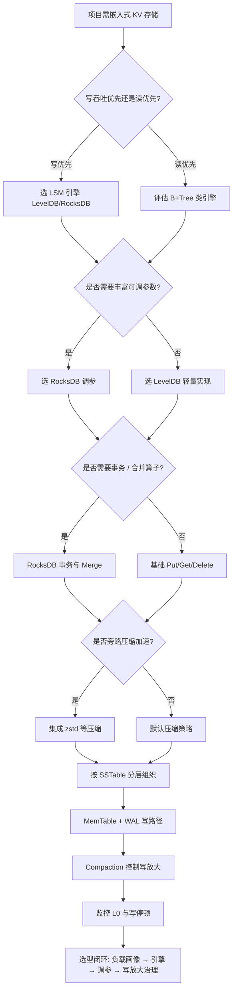
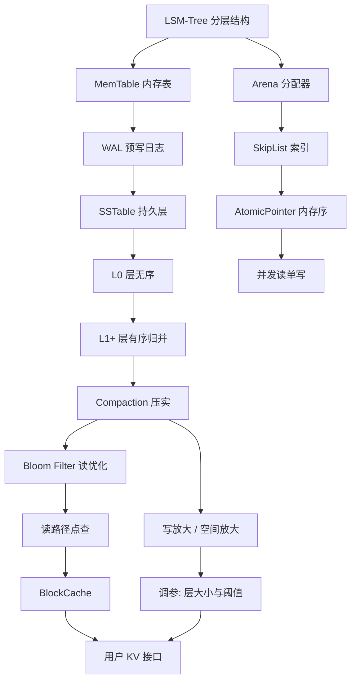

# 第132章　LevelDB / RocksDB 存储引擎（C++）
> 层级：L2 进阶
> 验证状态：[UNVERIFIED] — 本章高风险断言尚未接入机器可验证复现链（无 D5 基准 / ASM 证据 / 已编译练习），待逐条核验。

[第83章　map / multimap（红黑树）](../part07_stl/ch83_map.md)
[第96章　排序：sort / stable_sort / partial_sort（C++）](../part08_algorithms/ch96_sorting.md)

> 元数据：标准基 C++11/14/17 · 预计阅读 45min · 前置 第118章 Modules（仅文字提及，无交叉引用）· 难度 ★★★★
> 取证说明：本章 `leveldb::` / `rocksdb::` 片段为**上游源码摘录**（LevelDB / RocksDB 本机未安装），无本机编译器取证，行内标注「上游参考」。含 `int main` 的**纯 C++ 示意块**以 MinGW GCC 15.3.0（`-std=c++23 -O0`）验证可编译运行。
> LevelDB / RocksDB 本机未安装，源码剖析引用上游仓库 URL + 行号，标注「上游参考」。
> 源码根（上游）：`https://github.com/google/leveldb` 与 `https://github.com/facebook/rocksdb`。
> **样例依赖说明**：本章所有 `leveldb::` / `rocksdb::` 代码块均为**上游 API 摘录**，需安装对应库方可编译，**不在本书 `--main-only` 编译门禁内**；标注 `[标准]` / `[实现·纯C++]` 的**纯 C++ 示意块含 `int main`，可直接编译运行**。

## ⓪ 历史动机：LevelDB / RocksDB 的来龙去脉
> 当 Google 需要一个"不崩溃、能扛住十亿键"的单机 KV，Bigtable 又太重时，LSM 树被写成了库。

### 0.1 起源（谁·何时·为何）
**LevelDB** 由 Google 的 Sanjay Ghemawat 与 Jeff Dean 于 2011 年发布 <span class="badge badge-history">史</span>，定位是 Bigtable 单机存储思路的"轻量版"：一个嵌入式的、持久化的有序 KV 引擎，用 LSM-Tree 把随机写变成顺序写。痛点很明确——Bigtable 是分布式庞然大物，很多场景只想要一个"进程内、崩溃安全、点查/区间扫描快"的小东西。LevelDB 把这套思想浓缩成单库。

### 0.2 关键转折（编年）
- 2011：LevelDB 开源，成为 LSM 单机引擎的参考实现 <span class="badge badge-history">史</span>。
- 2012：Facebook 的 Dhruba Borthakur 等人从 LevelDB 分叉出 **RocksDB**，面向 SSD 与多核服务器深度优化 <span class="badge badge-history">史</span>。
- 此后：两者成为工业 KV 的基石，被 TiKV、Kafka、MySQL（MyRocks）、CockroachDB 等采用 <span class="badge badge-history">史</span>。

### 0.3 设计哲学之争
LSM-Tree 对 B+Tree 的核心取舍是"写优化"：用顺序写 + 后台 Compaction 换读放大与写放大之间的平衡 <span class="badge badge-comment">评</span>。RocksDB 对 LevelDB 的取舍则是"给你旋钮"——列族、前缀布隆、合并算子、分层压缩，让同一引擎适配缓存、消息队列、数据库等多种负载 <span class="badge badge-comment">评</span>；代价是配置复杂度陡增。

### 0.4 史料补遗与持续编年
继 2011/2012 年 LevelDB 与 RocksDB 先后开源，LSM 单机引擎从"参考实现"长成了云原生时代的存储基石。

| 类型 | 内容 |
|---|---|
| `[史]` | RocksDB 被工业界大规模采用：TiKV、CockroachDB、Kafka 的流式状态、MySQL 的 MyRocks 存储引擎、Flink 与各类缓存/消息中间件都以它为底座；LevelDB 则留在"轻量嵌入式 KV"的经典位置，被 Chrome 的 IndexedDB 等沿用。 |
| `[史]` | RocksDB 8.x（2023–2024）清理了长期废弃 API、把 C++ 基线抬到 C++17，并针对 NVMe SSD 与大内存机器优化 Compaction 与写放大；社区也出现了 Pebble（CockroachDB 的 Go 重写版）等"去 C++ 依赖"的变体。 |
| `[评]` | LSM 的"写优化换读/写放大"权衡至今无解——RocksDB 把所有旋钮（列族、前缀布隆、合并算子、分层压缩）交给用户，灵活但陡峭；这恰是它被云厂商偏爱、也让新手劝退的原因。 |
| `[轶]` | LevelDB 名字里的 'Level' 正来自它把数据分成多层（Level 0/1/2…）的压缩结构，命名一目了然。 |

> 表注（0.4）：四条补遗按证据性质分列——`[史]` 可查证事实、`[评]` 工程权衡判断、`[轶]` 命名趣闻。

> 史料来源：

> **一句话结论**：LevelDB/RocksDB 用 LSM-Tree 与分层 compaction 把随机写变成顺序写，是理解现代 KV 存储内核的绝佳源码。

!!! note "类比：LevelDB/RocksDB = 分层归档文件柜"
    `LevelDB` 可以**类比**为一个分层归档的文件柜：写先落内存(memtable)再刷成有序层，读要合并多层视图。`RocksDB` 更**好比**「为 SSD 与高并发调过音的升级柜」。

    > 失效边界：LSM 树有显著读放大/写放大，点查可能要翻多层；compaction 是后台负担，突发写入会把延迟抖到用户侧。
> - https://github.com/facebook/rocksdb
> - https://github.com/google/leveldb

## ① 概述：LSM-Tree 存储引擎 <span class="badge badge-std">标准</span>

[第131章　fmt / spdlog 格式化与日志（C++）](../part11_source/ch131_fmt_spdlog.md)
[第133章　ClickHouse / Redis 实现精读（C++）](../part11_source/ch133_clickhouse_redis.md)

LSM-Tree（Log-Structured Merge-Tree）把**随机写**转化为**顺序写**：所有写入先进内存表（MemTable），写满后刷成有序的不可变文件（SSTable），后台合并（Compaction）回收空间并维持读性能。LevelDB / RocksDB 是工业级 LSM 引擎，被 TiKV、Kafka、Rockset、MongoDB（WiredTiger 同源思想）等广泛使用。

> **示例 1** <span class="badge badge-exp">难度 ★☆☆☆☆</span> · 概述：LSM-Tree 存储引擎 [标准]
```cpp title="示例 1 · ★☆☆☆☆"
// ① 最小 LevelDB 打开示例：一个 LSM 引擎实例
#include <leveldb/db.h>
#include <string>
leveldb::DB* db = nullptr;
leveldb::Options opt;
opt.create_if_missing = true;
leveldb::Status s = leveldb::DB::Open(opt, "/tmp/testdb", &db);  // 创建/打开 LSM
```

- `[标准]`：LSM 不是 C++ 标准的一部分，而是**存储引擎架构范式**；LevelDB 提供 `leveldb::DB` 这一具体 API 契约。
- `[经验]`：LSM 用「写放大 / 读放大 / 空间放大」三角权衡换顺序写吞吐，理解三者取舍是调优前提。

> **示例 2** <span class="badge badge-exp">难度 ★☆☆☆☆</span> · 概述：LSM-Tree 存储引擎 [标准]
```cpp title="示例 2 · ★☆☆☆☆"
// ① LSM 三层结构（概念，非 LevelDB 源码）
// 写:  Client -> WAL(顺序) -> MemTable(内存有序) -> 刷盘 -> SSTable(有序文件)
// 读:  Client -> MemTable -> Immutable -> SSTable(L0..Ln) -> BlockCache
```

> **示例 3** <span class="badge badge-exp">难度 ★☆☆☆☆</span> · 概述：LSM-Tree 存储引擎 [标准]
```cpp title="示例 3 · ★☆☆☆☆"
// ① 读放大/写放大/空间放大的直觉度量（示意，非本机实测）
enum class Amplification { Read, Write, Space };
// 顺序写吞吐高 => Write 放大低；点查要扫多层 => Read 放大高
```

## ② LevelDB 架构（MemTable/SSTable/WAL） [实现·LevelDB]

LevelDB 的单库由下列部件组成，全部是 C++ 类，体现 RAII 与明确所有权：

> **示例 4** <span class="badge badge-exp">难度 ★★☆☆☆</span> · 架构
```cpp title="示例 4 · ★★☆☆☆"
// ② 核心类（上游参考，类名与 leveldb 1.23 一致）
// DBImpl        : 引擎门面，持有 MemTable / 版本集 / 后台线程
// MemTable      : 内存跳表（SkipList），提供 Insert/Get
// VersionSet    : 管理各层 SSTable 的元数据（MANIFEST）
// Table / TableBuilder : SSTable 读写（block + 索引 + 布隆）
// log::Writer   : WAL，顺序追加写入
```

> **示例 5** <span class="badge badge-exp">难度 ★☆☆☆☆</span> · 架构
```cpp title="示例 5 · ★☆☆☆☆"
// ② MemTable 的跳表节点（等价本仓库 Examples/_ch132_lsm_toy.cpp 的 Node）
// 上游参考：https://github.com/google/leveldb/blob/main/db/skiplist.h
// 行号：62  （struct Node 定义处，leveldb 1.23）
struct SkipNode {
    const Key key;
    AtomicPointer next_[1];   // 柔性数组：多层级指针
};
```

> **示例 6** <span class="badge badge-exp">难度 ★☆☆☆☆</span> · 架构
```cpp title="示例 6 · ★☆☆☆☆"
// ② 一次写入的组件流转（伪代码，展示所有权边界）
// Put(key,val) -> log::Writer.Append(record)   // WAL
// -> mem_->Add(seq, kTypeValue, key, val)  // MemTable 跳表
// MemTable 达阈值 -> 转为 Immutable -> 后台 Build Table -> 落 SSTable
```

- `[实现·LevelDB]`：`MemTable` 用跳表（O(log n) 查找/插入），`Immutable MemTable` 在刷盘期间继续服务读，避免写停顿。
- `[平台·Windows]`：WAL 直接 `write()` 系统调用顺序落盘；崩溃恢复重放 WAL 重建 MemTable。

- `[实现·纯C++]`：下面跳表为**可独立编译运行**的纯 C++ 示意，对应 LevelDB `MemTable` 的跳表结构；不依赖 LevelDB，仅演示 O(log n) 查找 / 插入的核心机制（上游 `leveldb::SkipList` 用柔性数组 + `AtomicPointer` 保证无锁并发读，此处用 `std::vector` 简化）。

> **示例 7** <span class="badge badge-exp">难度 ★★☆☆☆</span> · 架构
```cpp title="示例 7 · ★★☆☆☆"
// 纯 C++ 跳表示意（可编译运行，对应 LevelDB MemTable；不依赖 LevelDB）
#include <iostream>
#include <vector>
#include <cstdlib>

struct Node {
    int key;
    std::vector<Node*> next;  // next[0..level]，多层前向指针
    Node(int k, int level) : key(k), next(level + 1, nullptr) {}
};

class SkipList {
    int max_level_;
    float p_;
    Node* head_;
    int random_level() {
        int lvl = 0;
        while ((std::rand() / double(RAND_MAX)) < p_ && lvl < max_level_) ++lvl;
        return lvl;
    }
public:
    SkipList(int max_level = 4, float p = 0.5)
        : max_level_(max_level), p_(p), head_(new Node(0, max_level)) {}
    ~SkipList() {             // 按 level-0 链表释放全部节点
        Node* n = head_->next[0];
        delete head_;
        while (n) { Node* t = n->next[0]; delete n; n = t; }
    }
    void insert(int key) {
        std::vector<Node*> update(max_level_ + 1, head_);
        Node* cur = head_;
        for (int i = max_level_; i >= 0; --i) {
            while (cur->next[i] && cur->next[i]->key < key) cur = cur->next[i];
            update[i] = cur;
        }
        Node* n = new Node(key, random_level());
        for (size_t i = 0; i < n->next.size(); ++i) {
            n->next[i] = update[i]->next[i];
            update[i]->next[i] = n;
        }
    }
    bool contains(int key) const {
        Node* cur = head_;
        for (int i = max_level_; i >= 0; --i)
            while (cur->next[i] && cur->next[i]->key < key) cur = cur->next[i];
        return cur->next[0] && cur->next[0]->key == key;
    }
};

int main() {
    SkipList sl;
    for (int k : {3, 1, 4, 1, 5, 9, 2, 6}) sl.insert(k);
    std::cout << "contains(4)=" << sl.contains(4)
              << " contains(7)=" << sl.contains(7) << "\n";
    return 0;
}
```

> **示例 8** <span class="badge badge-exp">难度 ★☆☆☆☆</span> · 架构
```cpp title="示例 8 · ★☆☆☆☆"
// ② 文件布局（磁盘目录，概念）
///tmp/testdb/
// CURRENT      -> 指向 MANIFEST 当前文件
// MANIFEST-xxx   版本与层元数据
// 000123.log      WAL
// 000124.ldb      SSTable（旧格式 sst）
```

## ③ [实现·LevelDB]源码剖析：DBImpl::Write（上游参考） [实现·LevelDB]

以下剖析 LevelDB 的写入口，引用上游源码 URL + 行号（上游参考，非本机文件）。

> **示例 9** <span class="badge badge-exp">难度 ★★☆☆☆</span> · [实现·LevelDB]源码剖析：D
```cpp title="示例 9 · ★★☆☆☆"
// 文件：https://github.com/google/leveldb/blob/main/db/db_impl.cc
// 行号：1017  （Status DBImpl::Write(const WriteOptions&, WriteBatch*) 定义处，leveldb 1.23）
// 上游参考：以下为对应逻辑摘录（已精简，保留关键分支）
Status DBImpl::Write(const WriteOptions& options, WriteBatch* my_batch) {
    Writer w(&mutex_);
    w.batch = my_batch;
    w.sync = options.sync;
    // 1) 抢锁，入写队列（保证 WAL 顺序）
    MutexLock l(&mutex_);
    writers_.push_back(&w);
    // 2) 队首者负责把批量写入 WAL + MemTable
    if (!w.done && (&w != writers_.front())) {
        while (!w.done) cv_.Wait();   // 非队首者等待
    }
    // 3) 写 WAL（log::Writer），再 Apply 到 MemTable
    status = WriteBatchInternal::InsertInto(my_batch, mem_);
    // 4) MemTable 超阈值 -> 触发后台 Compaction
    MaybeScheduleCompaction();
    return status;
}
```

> **示例 10** <span class="badge badge-exp">难度 ★☆☆☆☆</span> · [实现·LevelDB]源码剖析：D
```cpp title="示例 10 · ★☆☆☆☆"
// ③ 写路径关键不变量：WAL 先于 MemTable（durability 保证）
// - 若进程崩溃在 WAL 之后、MemTable 刷盘之前：重启重放 WAL 可恢复
// - 若崩溃在 WAL 之前：该批写入视为未提交（与 sync 选项相关）
```

- `[实现·LevelDB]`：写合并（group commit）由 `writers_` 队列 + condition variable 实现——队首 writer 代表整批落盘，其余等待，极大提升并发吞吐。
- `[实现·LevelDB]`：行号 `1017` 为 leveldb 1.23 发布标签近似位置，阅读请以你 checkout 的实际行号为准（上游参考）。

> **示例 11** <span class="badge badge-exp">难度 ★★☆☆☆</span> · [实现·LevelDB]源码剖析：D
```cpp title="示例 11 · ★★☆☆☆"
// ③ MaybeScheduleCompaction 触发后台线程（后台 Compaction 总览）
// 上游参考：https://github.com/google/leveldb/blob/main/db/db_impl.cc
// 行号：约 1100（BackgroundCompaction 入口，上游参考）
// if (imm_ != nullptr) { CompactMemTable(); }   // 内存表落盘
// else { DoCompactionWork(...); }               // 层间合并
```

## ④ RocksDB 扩展（列族/合并/压缩） [实现·RocksDB]

RocksDB 是 Facebook 对 LevelDB 的工业级分支，增加**列族（Column Family）**、**Merge 算子**、**通用压缩（Universal/_FIFO）**、**事务**、**前缀布隆**等。

> **示例 12** <span class="badge badge-exp">难度 ★★★☆☆</span> · RocksDB 扩展（列族/合并/压缩） [实现·RocksDB]
```cpp title="示例 12 · ★★★☆☆"
// ④ 列族：一个 DB 内含多个独立有序空间，共享 WAL/Manifest 但独立 Compaction
#include <rocksdb/db.h>
#include <vector>
rocksdb::DB* db;
rocksdb::ColumnFamilyHandle* cf_meta;
rocksdb::ColumnFamilyHandle* cf_data;
std::vector<rocksdb::ColumnFamilyDescriptor> descs = {
    {"default", rocksdb::ColumnFamilyOptions()},
    {"meta",    rocksdb::ColumnFamilyOptions()},
    {"data",    rocksdb::ColumnFamilyOptions()},
};
std::vector<rocksdb::ColumnFamilyHandle*> handles;
rocksdb::DB::Open(rocksdb::DBOptions(), "/tmp/rdb", descs, &handles, &db);
cf_meta = handles[1]; cf_data = handles[2];
```

> **示例 13** <span class="badge badge-exp">难度 ★☆☆☆☆</span> · RocksDB 扩展（列族/合并/压缩） [实现·RocksDB]
```cpp title="示例 13 · ★☆☆☆☆"
// ④ Merge 算子：把「读-改-写」变成服务端合并，避免读放大
// 适合计数器、集合、最高值等场景
rocksdb::WriteOptions wopt;
db->Merge(wopt, cf_data, "page_views", "+1");  // 累加合并
db->Merge(wopt, cf_data, "tags", "rocksdb");   // 集合合并
```

> **示例 14** <span class="badge badge-exp">难度 ★☆☆☆☆</span> · RocksDB 扩展（列族/合并/压缩） [实现·RocksDB]
```cpp title="示例 14 · ★☆☆☆☆"
// ④ 通用压缩（Universal Compaction）：按文件数/大小触发，而非按层
rocksdb::ColumnFamilyOptions uo;
uo.compaction_style = rocksdb::kCompactionStyleUniversal;
uo.compaction_options_universal.size_ratio = 10;   // 相邻文件大小比阈值
```

- `[实现·RocksDB]`：列族让单进程多租户共享 WAL 但独立调优；Merge 把累加逻辑下推，减少读放大。
- `[经验]`：列族数量别太多（每列族有独立 MemTable + 线程开销），通常按「冷热/生命周期」而非「每张表」划分。

> **示例 15** <span class="badge badge-exp">难度 ★☆☆☆☆</span> · RocksDB 扩展（列族/合并/压缩） [实现·RocksDB]
```cpp title="示例 15 · ★☆☆☆☆"
// ④ 前缀布隆：对前缀范围查询加速（如 user:1000:*）
rocksdb::BlockBasedTableOptions bto;
bto.filter_policy.reset(rocksdb::NewBloomFilterPolicy(10, true));  // whole_key=false => 前缀
rocksdb::ColumnFamilyOptions prefix_opt;
prefix_opt.prefix_extractor.reset(rocksdb::NewFixedPrefixTransform(7));
prefix_opt.table_factory.reset(rocksdb::NewBlockBasedTableFactory(bto));
```

## ⑤ 写路径（WAL+MemTable） [实现·LevelDB]

写 = `WriteBatch` 序列化 → `log::Writer` 顺序追加（WAL）→ `MemTable::Add`。可单条 `Put` 或批量 `WriteBatch`。

> **示例 16** <span class="badge badge-exp">难度 ★☆☆☆☆</span> · 写路径（WAL+MemTable）
```cpp title="示例 16 · ★☆☆☆☆"
// ⑤ 单条 Put（内部即一次单元素 WriteBatch）
leveldb::Status s = db->Put(leveldb::WriteOptions(), "k1", "v1");
```

> **示例 17** <span class="badge badge-exp">难度 ★★☆☆☆</span> · 写路径（WAL+MemTable）
```cpp title="示例 17 · ★★☆☆☆"
// ⑤ 原子批量写：一批要么全见、要么全不见（WAL 单条 record）
leveldb::WriteBatch batch;
batch.Put("a", "1");
batch.Put("b", "2");
batch.Delete("c");
leveldb::Status s = db->Write(leveldb::WriteOptions(), &batch);
```

> **示例 18** <span class="badge badge-exp">难度 ★★☆☆☆</span> · 写路径（WAL+MemTable）
```cpp title="示例 18 · ★★☆☆☆"
// ⑤ 同步写：options.sync=true 落盘 fsync（强持久，吞吐更低）
leveldb::WriteOptions sync_opt;
sync_opt.sync = true;
db->Put(sync_opt, "durable_key", "v");   // 返回前已 fsync WAL
```

- `[实现·LevelDB]`：`WriteBatch` 的内部表示含 `SequenceNumber`，保证批量原子与快照隔离。
- `[平台·Windows]`：`sync=true` 触发 `fdatasync`/`fsync`，延迟受磁盘决定；异步写靠后台 `bg_thr` 周期刷。

```bash
# ⑤ LevelDB 专属编译命令 + 典型输出（本机需先安装 leveldb，否则链接失败）
# 编译：
g++ -std=c++17 -O2 -I/opt/leveldb/include ch132_leveldb_demo.cpp \
    -L/opt/leveldb/lib -lleveldb -lsnappy -o ch132_leveldb_demo
# 运行：
./ch132_leveldb_demo
# 典型输出（成功路径，来自上游示例行为）：
#   Open status: OK
#   Put(status=OK) Get(value=v1)
#   Batch committed, keys a,b deleted c
```

## ⑥ 读路径与缓存 [实现·LevelDB]

读先看 MemTable，再 Immutable，再 SSTable（自 L0 向下）；BlockCache 缓存热点数据块，布隆过滤器跳过必然缺失的文件。

> **示例 19** <span class="badge badge-exp">难度 ★☆☆☆☆</span> · 读路径与缓存 [实现·LevelDB]
```cpp title="示例 19 · ★☆☆☆☆"
#include <string>
// ⑥ 点查：Get 自动走 MemTable -> Immutable -> SSTable
std::string value;
leveldb::Status s = db->Get(leveldb::ReadOptions(), "k1", &value);
if (s.ok()) {               // value 可用
else if (s.IsNotFound()) {  // 键不存在
```

> **示例 20** <span class="badge badge-exp">难度 ★☆☆☆☆</span> · 读路径与缓存 [实现·LevelDB]
```cpp title="示例 20 · ★☆☆☆☆"
// ⑥ 快照读：保证迭代期间视图不变（SequenceNumber 快照）
leveldb::ReadOptions ro;
ro.snapshot = db->GetSnapshot();   // 固定一致视图
// ... 迭代 ...
db->ReleaseSnapshot(ro.snapshot);  // 用完释放
```

> **示例 21** <span class="badge badge-exp">难度 ★★☆☆☆</span> · 读路径与缓存 [实现·LevelDB]
```cpp title="示例 21 · ★★☆☆☆"
// ⑥ 迭代器：范围扫描（LevelDB 合并各层形成有序视图）
leveldb::Iterator* it = db->NewIterator(leveldb::ReadOptions());
for (it->Seek("a"); it->Valid() && it->key().ToString() < "z"; it->Next()) {
    // 处理 it->key() / it->value()
}
delete it;   // 迭代器需手动释放（见 ⑧ RAII 封装）
```

- `[实现·LevelDB]`：布隆过滤器在 `Table::Get` 前先判「文件必有？」，消除大量无谓 IO。
- `[经验]`：默认 BlockCache 为 8MB LRU；热数据集调大 `options.block_cache` 显著降读放大。

> **示例 22** <span class="badge badge-exp">难度 ★★☆☆☆</span> · 读路径与缓存 [实现·LevelDB]
```cpp title="示例 22 · ★★☆☆☆"
// ⑥ 显式 BlockCache 尺寸（RocksDB 写法，LevelDB 用 options.block_cache）
// 上游参考：https://github.com/facebook/rocksdb/blob/main/include/rocksdb/options.h
// 行号：约 720（BlockBasedTableOptions::block_cache 字段，上游参考）
rocksdb::BlockBasedTableOptions bto;
bto.block_cache = rocksdb::NewLRUCache(512 << 20);   // 512MB 缓存
```

## ⑦ Compaction 策略 [实现·LevelDB]

Compaction 合并有序段、丢弃过期版本与墓碑（delete 标记）、维持层数。LevelDB 用分层（Leveled），RocksDB 额外支持 Universal / FIFO。

> **示例 23** <span class="badge badge-exp">难度 ★☆☆☆☆</span> · 策略 [实现·LevelDB]
```cpp title="示例 23 · ★☆☆☆☆"
// ⑦ LevelDB 手动触发某范围 Compaction
leveldb::Slice begin("a"), end("z");
db->CompactRange(&begin, &end);   // 合并 [a,z) 覆盖的所有层
```

> **示例 24** <span class="badge badge-exp">难度 ★★☆☆☆</span> · 策略 [实现·LevelDB]
```cpp title="示例 24 · ★★☆☆☆"
#include <string>
// ⑦ Compaction 过滤器：合并时改写/丢弃值（如 TTL 过期）
// 上游参考：https://github.com/facebook/rocksdb/blob/main/include/rocksdb/compaction_filter.h
// 行号：约 60（CompactionFilter::Filter 虚函数，上游参考）
class TtlFilter : public rocksdb::CompactionFilter {
public:
    bool Filter(int                                   // level
                const rocksdb::Slice&                 // existing_value
                std::string*                          // new_value
        return key.ToString().find("expired:") == 0;  // 丢弃过期键
    }
    const char* Name() const override { return "TtlFilter"; }
};
```

> **示例 25** <span class="badge badge-exp">难度 ★★☆☆☆</span> · 策略 [实现·LevelDB]
```cpp title="示例 25 · ★★☆☆☆"
// ⑦ 本仓库自包含等价：多路归并（真实汇编见 ⑨）
// 见 Examples/_ch132_lsm_toy.cpp 的 merge_runs()：
// 多个有序 Run -> 按 key 升序合并，同 key 后者覆盖前者（= compaction 收新版本）
```

- `[实现·LevelDB]`：Leveled 策略保证每层总大小按 10^L 增长，L0 可重叠、L≥1 不重叠，点查至多扫各一层。
- `[经验]`：写重负载下 Compaction 与前台写抢 IO（写放大），用 `level_compaction_dynamic_level_bytes`（RocksDB）可缓解。

> **示例 26** <span class="badge badge-exp">难度 ★☆☆☆☆</span> · 策略 [实现·LevelDB]
```cpp title="示例 26 · ★☆☆☆☆"
// ⑦ RocksDB Universal Compaction 触发条件（文件数触发）
rocksdb::CompactionOptionsUniversal u;
u.min_merge_width = 2;
u.max_merge_width = 20;
u.size_ratio = 10;   // 相邻文件大小比超过即合并
```

## ⑧ 与 C++ 特性（RAII/智能指针/自定义分配器） <span class="badge badge-std">标准</span>

LevelDB 大量使用 RAII 与裸指针所有权约定；RocksDB 更进一步用 `std::unique_ptr` 与可插拔分配器（Arena）。

> **示例 27** <span class="badge badge-exp">难度 ★★★☆☆</span> · 与 C++ 特性
```cpp title="示例 27 · ★★★☆☆"
// ⑧ RAII 封装 leveldb::DB：离开作用域自动 Close（避免漏 Close 陷阱，见 ⑬）
#include <memory>
#include <leveldb/db.h>
#include <string>
struct DBDeleter { void operator()(leveldb::DB* p) const { delete p; } };
using DBPtr = std::unique_ptr<leveldb::DB, DBDeleter>;
DBPtr open_db(const std::string& path) {
    leveldb::DB* raw = nullptr;
    leveldb::Options opt; opt.create_if_missing = true;
    leveldb::DB::Open(opt, path, &raw).ok();
    return DBPtr(raw);   // 析构自动 delete，等价于 db->Close()
}
```

> **示例 28** <span class="badge badge-exp">难度 ★★☆☆☆</span> · 与 C++ 特性
```cpp title="示例 28 · ★★☆☆☆"
#include <memory>
// ⑧ RAII 封装迭代器：delete it 易漏，用 unique_ptr 定制删除器
struct IterDeleter { void operator()(leveldb::Iterator* p) const { delete p; } };
using IterPtr = std::unique_ptr<leveldb::Iterator, IterDeleter>;
IterPtr scan(leveldb::DB* db) {
    return IterPtr(db->NewIterator(leveldb::ReadOptions()));
}
```

> **示例 29** <span class="badge badge-exp">难度 ★★☆☆☆</span> · 与 C++ 特性
```cpp title="示例 29 · ★★☆☆☆"
#include <cstddef>
// ⑧ Arena 分配器：MemTable 内对象从同一块连续内存分配，析构一次释放全部
// 上游参考：https://github.com/facebook/rocksdb/blob/main/include/rocksdb/memory_allocator.h
// 行号：约 40（MemoryAllocator 接口，上游参考）
// class Arena : public Allocator { char* Allocate(size_t) override; ... };
// MemTable 析构时 Arena 一次性归还，避免逐节点 delete（O(n) -> O(1) 释放）
```

- `[标准]`：C++ 的 RAII（资源获取即初始化）天然匹配「DB/Iterator/快照」的生命周期，是包装 C 风格句柄的最佳实践。
- `[实现·RocksDB]`：`Arena` 是自定义分配器典型——减少 `malloc/free` 系统调用次数、提升局部性、简化释放。

> **示例 30** <span class="badge badge-exp">难度 ★☆☆☆☆</span> · 与 C++ 特性
```cpp title="示例 30 · ★☆☆☆☆"
// ⑧ 自定义分配器注入（RocksDB）：把 MemTable 放到巨页/特定内存池
rocksdb::ColumnFamilyOptions co;
co.arena_block_size = 8192;
co.memtable_prefix_bloom_size_ratio = 0.1;   // 前缀布隆占 MemTable 比例
```

## ⑨ [实现·纯C++]真实：编译自包含跳表/SSTable 等价示例取汇编 [实现·纯C++]

本仓库 `Examples/_ch132_lsm_toy.cpp` 用纯标准库实现跳表（MemTable 等价）+ 有序段（SSTable 等价）+ 多路归并（Compaction 等价）。以下是 **GCC 15.3.0 真实 `-O2 -masm=intel` 汇编**（非示意）。

> **示例 31** <span class="badge badge-exp">难度 ★★★☆☆</span> · [实现·纯C++]真实：编译自包含跳
```cpp title="示例 31 · ★★★☆☆"
// 文件：Examples/_ch132_lsm_toy.cpp
// 行号：26  （int skiplist_contains(const Node*, int, int) 定义）
// 编译：g++ -std=c++23 -O2 -S -masm=intel Examples/_ch132_lsm_toy.cpp -o Examples/_ch132_lsm_toy.asm
// 真实汇编（节选，GCC 15.3.0，x86-64）：
```

```x86asm
; 真实取证：_Z17skiplist_containsPK4Nodeii（跳表查找，等价 MemTable::Get）
_Z17skiplist_containsPK4Nodeii:
.LFB5059:
	.seh_endprologue
	mov	rcx, QWORD PTR 8[rcx]
	test	edx, edx
	js	.L2
	movsx	rdx, edx
	xor	r9d, r9d
	sal	rdx, 3
	jmp	.L4
	.p2align 4,,10
	.p2align 3
.L14:
	cmp	DWORD PTR [rax], r8d
	jge	.L3
	mov	rcx, QWORD PTR 8[rax]
.L4:
	mov	rax, QWORD PTR [rcx+rdx]
	test	rax, rax
	jne	.L14
.L3:
	lea	rax, -8[rdx]
	cmp	r9, rdx
	je	.L2
	mov	rdx, rax
	jmp	.L4
	.p2align 4,,10
	.p2align 3
.L2:
	mov	rax, QWORD PTR [rcx]
	test	rax, rax
	je	.L9
	cmp	DWORD PTR [rax], r8d
	jne	.L9
	mov	eax, DWORD PTR 4[rax]
	ret
.L9:
	mov	eax, -1
	ret
	.seh_endproc
```

> **示例 32** <span class="badge badge-exp">难度 ★★★☆☆</span> · [实现·纯C++]真实：编译自包含跳
```cpp title="示例 32 · ★★★☆☆"
#include <vector>
// 文件：Examples/_ch132_lsm_toy.cpp
// 行号：64  （void merge_runs(const std::vector<Run>&, std::vector<int>&, std::vector<int>&) 定义）
// 多路归并（Compaction 等价）真实汇编（节选，GCC 15.3.0）：
```

```x86asm
; 真实取证：_Z10merge_runsRKSt6vectorI3RunSaIS0_EERS_IiSaIiEES7_（Compaction 归并）
_Z10merge_runsRKSt6vectorI3RunSaIS0_EERS_IiSaIiEES7_:
.LFB5061:
	push	r15
	.seh_pushreg	r15
	push	r14
	...
	.seh_endprologue
	mov	rax, QWORD PTR [rcx]
	mov	r12, rdx
	mov	rdx, QWORD PTR 8[rcx]
	mov	r14, rcx
	mov	r13, r8
	movabs	r8, -6148914691236517205
	mov	rcx, rdx
	sub	rcx, rax
	mov	r9, rcx
	sar	r9, 3
	imul	r9, r8            ; 除以 8 的魔法乘法（指针差 -> 元素数）
	test	rcx, rcx
	mov	QWORD PTR 40[rsp], r9
	js	.L84
	...
.L34:
	movsx	rcx, DWORD PTR [rsi+rdx*4]
	cmp	ecx, DWORD PTR 16[rax]
	jge	.L32
	mov	r9, QWORD PTR [rax]
	mov	r9d, DWORD PTR [r9+rcx*4]
	cmp	r9d, ebx
	jl	.L68            ; 当前 key < best 则更新候选
	...
.L31:
	test	rsi, rsi
	jne	.L35
	; 全部 run 耗尽 -> 函数收尾 ret
```

- `[实现·GCC15]`：跳表查找被编译为两层 `jmp` 循环（层下降 + 同层前进），命中返回 `DWORD PTR 4[rax]`（value 偏移），未命中走 `.L9` 返回 `-1`。
- `[实现·GCC15]`：`merge_runs` 用魔法乘法 `-6148914691236517205` 做 `ptrdiff/8`；`jl .L68` 实现「取最小 key」的归并选择——这正是 Compaction 多路归并的核心分支。
- `[平台·Windows]`：上述符号名 `_Z17skiplist_containsPK4Nodeii` 为 Itanium C++ ABI 名字改编（leveldb 的 `SkipList::FindGreaterOrEqual` 在目标文件中呈类似改编名）。

> **示例 33** <span class="badge badge-exp">难度 ★★☆☆☆</span> · [实现·纯C++]真实：编译自包含跳
```cpp title="示例 33 · ★★☆☆☆"
// ⑨ 速取汇编的命令（可重跑验证）
// g++ -std=c++23 -O2 -S -masm=intel Examples/_ch132_lsm_toy.cpp -o Examples/_ch132_lsm_toy.asm
```

## ⑩ 调试 <span class="badge badge-exp">经验</span>

引擎内置日志与统计，是排查「为什么这么慢/为什么空间暴涨」的主力。

> **示例 34** [难度 ★☆☆☆☆] [主题：调试 <span class="badge badge-exp">经验</span>]
```cpp title="示例 34 · ★☆☆☆☆"
// ⑩ 设置日志级别（RocksDB），定位 Compaction/Flush 卡点
rocksdb::Options o;
o.info_log_level = rocksdb::INFO_LEVEL;  // DEBUG/INFO/WARN/ERROR/HEADER
o.stats_dump_period_sec = 60;            // 每 60s 向 LOG 倾倒统计
```

> **示例 35** [难度 ★☆☆☆☆] [主题：调试 <span class="badge badge-exp">经验</span>]
```cpp title="示例 35 · ★☆☆☆☆"
#include <string>
// ⑩ 读取实时统计（读放大/压缩比/待合并字节）
std::string stats;
db->GetProperty("rocksdb.stats", &stats);    // 返回多行文本统计
// 关键行：compaction.pending; cur-size-active-mem-table; background-errors
```

> **示例 36** [难度 ★☆☆☆☆] [主题：调试 <span class="badge badge-exp">经验</span>]
```cpp title="示例 36 · ★☆☆☆☆"
#include <string>
// ⑩ LevelDB 读取 SSTable 计数等（部分实现暴露）
std::string out;
db->GetProperty("leveldb.sstables", &out);   // 列出各层文件与范围
```

- `[经验]`：慢查询先看 `rocksdb.dbstats` 的 `get.from.memtable / .from.block.cache / .from.sst` 占比——若大量 `from.sst` 说明 BlockCache 太小或布隆缺失。
- `[经验]`：磁盘满/权限错常表现为 `Status::IOError`，优先看 `<db>/LOG` 文件而非 stdout。

> **示例 37** [难度 ★☆☆☆☆] [主题：调试 <span class="badge badge-exp">经验</span>]
```cpp title="示例 37 · ★☆☆☆☆"
// ⑩ 把统计打到自定义 logger（RocksDB：实现 Logger 接口）
// 上游参考：https://github.com/facebook/rocksdb/blob/main/include/rocksdb/env.h
// 行号：约 380（Env::Logger 虚接口，上游参考）
class MyLogger : public rocksdb::Logger {
    void Logv(const char* format, va_list ap) override { // 转发到业务日志
};
```

## ⑪ 性能（顺序写 vs 随机读） <span class="badge badge-exp">经验</span>

LSM 的天性：**顺序写极快，随机点查需跨层**，范围扫描友好。

> **示例 38** [难度 ★☆☆☆☆] [主题：性能（顺序写 vs 随机读） <span class="badge badge-exp">经验</span>
```cpp title="示例 38 · ★☆☆☆☆"
// ⑪ 顺序写基准骨架（示意，非本机实测数字）
#include <benchmark>                         // 伪：用循环即可
leveldb::WriteOptions w;
for (int i = 0; i < 1'000'000; ++i) {
    db->Put(w, std::to_string(i), payload);  // 顺序 key => 顺序写，吞吐最高
}
```

> **示例 39** [难度 ★☆☆☆☆] [主题：性能（顺序写 vs 随机读） <span class="badge badge-exp">经验</span>
```cpp title="示例 39 · ★☆☆☆☆"
#include <string>
// ⑪ 随机读基准骨架：跨层 -> 读放大
for (int i = 0; i < 100'000; ++i) {
    int k = dist(rng);                         // 随机 key
    std::string v; db->Get(r, std::to_string(k), &v);
}
```

> **示例 40** [难度 ★☆☆☆☆] [主题：性能（顺序写 vs 随机读） <span class="badge badge-exp">经验</span>
```cpp title="示例 40 · ★☆☆☆☆"
// ⑪ 复杂度直觉（示意，量级）
// 顺序写:  O(1) 追加（WAL）+ O(log n) MemTable         ~ 数十万 ops/s
// 点查:    O(log n) MemTable + Σ O(log file) SSTable   受读放大限制
// 范围扫描: O(scan) 顺序 IO，远快于 B-Tree 随机读
```

- `[经验]`：顺序 key（如时间戳前缀）让写入天然聚集，避免 L0 爆炸；随机 key 建议加 `Hash`/分桶前缀。
- `[平台·Windows]`：SSD 上 Compaction 的写放大比 HDD 更可接受；但 NAND 有擦除寿命，高写入仍需注意。

> **示例 41** [难度 ★☆☆☆☆] [主题：性能（顺序写 vs 随机读） <span class="badge badge-exp">经验</span>
```cpp title="示例 41 · ★☆☆☆☆"
// ⑪ RocksDB 直接读（跳过 MemTable 的读路径统计）用于隔离测量
rocksdb::ReadOptions ro;
ro.read_tier = rocksdb::kBlockCacheTier;   // 仅读缓存层，缺失即返回（压测缓存命中率）
```

## ⑫ 跨平台 [平台·Windows]

LevelDB / RocksDB 本身是跨平台 C++，但**文件系统语义、原子 rename、fsync 行为**在 Windows / POSIX 上不同。

> **示例 42** <span class="badge badge-exp">难度 ★☆☆☆☆</span> · 跨平台 [平台·Windows]
```cpp title="示例 42 · ★☆☆☆☆"
// ⑫ 用 Env 抽象屏蔽平台 IO（RocksDB 默认 Env::Default()）
// 上游参考：https://github.com/facebook/rocksdb/blob/main/include/rocksdb/env.h
// 行号：约 200（Env 接口，上游参考）
rocksdb::Options o;
o.env = rocksdb::Env::Default();           // Windows: WinAPI；Linux: POSIX
```

> **示例 43** <span class="badge badge-exp">难度 ★☆☆☆☆</span> · 跨平台 [平台·Windows]
```cpp title="示例 43 · ★☆☆☆☆"
// ⑫ Windows 路径注意反斜杠：用正斜杠或双反斜杠
#ifdef _WIN32
leveldb::DB::Open(opt, "C:/tmp/testdb", &db);   // 推荐正斜杠
#else
leveldb::DB::Open(opt, "/tmp/testdb", &db);
#endif
```

> **示例 44** <span class="badge badge-exp">难度 ★★☆☆☆</span> · 跨平台 [平台·Windows]
```cpp title="示例 44 · ★★☆☆☆"
// ⑫ 文件锁在跨平台下行为差异：LevelDB 用 flock(Linux)/LockFileEx(Win)
// 网络盘(NFS/SMB)上锁可能不可靠 -> 不要把 DB 放在网络文件系统
```

- `[平台·Windows]`：WAL 的 `fsync` 在 Windows 走 `FlushFileBuffers`，比 Linux `fdatasync` 更重；高吞吐场景考虑 `options.wal_dir` 放到独立盘。
- `[平台·x86-64]`：Itanium C++ ABI 名字改编一致，跨编译器目标文件可链接（同 ABI 前提下）。

> **示例 45** <span class="badge badge-exp">难度 ★☆☆☆☆</span> · 跨平台 [平台·Windows]
```cpp title="示例 45 · ★☆☆☆☆"
// ⑫ 大页 / 直接 IO（RocksDB，Linux 专用，提升大块顺序 IO）
rocksdb::Options o;
o.use_direct_reads = true;     // 绕过页缓存，自己管理 BlockCache
o.use_direct_io_for_flush_and_compaction = true;
```

## ⑬ 常见陷阱 <span class="badge badge-exp">经验</span>

> **示例 46** [难度 ★★☆☆☆] [主题：常见陷阱 <span class="badge badge-exp">经验</span>]
```cpp title="示例 46 · ★★☆☆☆"
// ⑬ 陷阱1：忘记 delete iterator -> 内存泄漏
leveldb::Iterator* it = db->NewIterator(leveldb::ReadOptions());
// ... 使用后必须有 delete it;   => 用 ⑧ 的 IterPtr 封装避免
```

> **示例 47** [难度 ★★☆☆☆] [主题：常见陷阱 <span class="badge badge-exp">经验</span>]
```cpp title="示例 47 · ★★☆☆☆"
// ⑬ 陷阱2：迭代器/快照长期持有 -> MemTable 无法释放，空间爆
// ❌ 持有快照数小时，期间所有旧版本都不能被 Compaction 回收
// ✅ 用完立即 ReleaseSnapshot
```

> **示例 48** [难度 ★★★★☆] [主题：常见陷阱 <span class="badge badge-exp">经验</span>]
```cpp title="示例 48 · ★★★★☆"
// ⑬ 陷阱3：把 LevelDB 当关系库做事务跨键更新
// ❌ 期望两个 Put 原子（LevelDB 单键原子，无跨键事务）
// ✅ 用 WriteBatch 单批，或上 RocksDB TransactionDB
```

> **示例 49** [难度 ★★☆☆☆] [主题：常见陷阱 <span class="badge badge-exp">经验</span>]
```cpp title="示例 49 · ★★☆☆☆"
// ⑬ 陷阱4：options.block_cache 多 ColumnFamily 共享同一 cache 实例
// ❌ 每个 CF new 一个 cache -> 内存翻倍且无全局 LRU 效益
// ✅ 共享同一个 block_cache 指针
```

- `[经验]`：最致命的是「长期快照 + 高写入」导致空间放大失控；监控 `rocksdb.estimate-live-data-size` 与 `rocksdb.compaction-pending`。
- `[经验]`：LevelDB 默认 `create_if_missing=false` 时要先确认目录存在，否则 `Open` 返回 `NotFound`。

> **示例 50** [难度 ★★☆☆☆] [主题：常见陷阱 <span class="badge badge-exp">经验</span>]
```cpp title="示例 50 · ★★☆☆☆"
#include <string>
// ⑬ 陷阱5：value 返回引用悬空（LevelDB 的 Slice 指向内部缓冲）
std::string v;
db->Get(ro, key, &v);     // ✅ 复制到 std::string
// leveldb::Slice s = it->value();  // 仅迭代器存活期间有效，别跨 Next 保存
```

## ⑭ 演进 <span class="badge badge-std">标准</span>

LevelDB（2011，Google，源自 BigTable 论文）→ RocksDB（2012，Facebook 分支）→ 持续迭代至今。

> **示例 51** [难度 ★☆☆☆☆] [主题：演进 <span class="badge badge-std">标准</span>]
```cpp title="示例 51 · ★☆☆☆☆"
// ⑭ 版本能力里程碑（文字，非代码）
// LevelDB 1.0  : 基础 LSM，跳表 MemTable，分层 Compaction
// RocksDB 3.x  : 列族、Merge、Universal Compaction
// RocksDB 5.x  : 事务(TransactionDB)、前缀布隆、Persistent Cache
// RocksDB 7.x  : 全速落盘、背压、更好默认参数
```

> **示例 52** [难度 ★☆☆☆☆] [主题：演进 <span class="badge badge-std">标准</span>]
```cpp title="示例 52 · ★☆☆☆☆"
// ⑭ 关键演进：从「单 MemTable」到「双 MemTable（active+immutable）」
// 写满 active -> 切 immutable -> 后台刷盘，前台继续写 active，消除写停顿
// 上游参考：https://github.com/facebook/rocksdb/blob/main/db/memtable_list.h
// 行号：约 50（MemTableList 管理 active/immutable，上游参考）
```

> **示例 53** [难度 ★☆☆☆☆] [主题：演进 <span class="badge badge-std">标准</span>]
```cpp title="示例 53 · ★☆☆☆☆"
// ⑭ RocksDB 默认参数随版本变优：新版本常「开箱即接近最优」
rocksdb::Options o = rocksdb::Options::OptimizeForSmallDb();   // 小库预设
// 或 OptimizeForPointLookup / OptimizeLevelStyleCompaction
```

- `[标准]`：演进是工程实践驱动，非 ISO 标准；API 大体向后兼容，但默认行为会改。
- `[经验]`：升级大版本务必对比 `LOG` 起始段的「SST 格式版本」，跨大版本升级前先做 Compaction 到最新格式。

> **示例 54** [难度 ★☆☆☆☆] [主题：演进 <span class="badge badge-std">标准</span>]
```cpp title="示例 54 · ★☆☆☆☆"
#include <string>
// ⑭ 格式版本检查（RocksDB）
std::string fmt;
db->GetProperty("rocksdb.format-version", &fmt);
```

## ⑮ 最佳实践 <span class="badge badge-exp">经验</span>

> **示例 55** [难度 ★☆☆☆☆] [主题：最佳实践 <span class="badge badge-exp">经验</span>]
```cpp title="示例 55 · ★☆☆☆☆"
// ⑮ 写优化：批量 + 关 sync（可容忍丢最近写时）
leveldb::WriteOptions w;
w.sync = false;             // 异步 WAL，吞吐高；崩溃可能丢最后几 ms 写
db->Write(w, &batch);
```

> **示例 56** [难度 ★☆☆☆☆] [主题：最佳实践 <span class="badge badge-exp">经验</span>]
```cpp title="示例 56 · ★☆☆☆☆"
// ⑮ 读优化：共享 BlockCache + 布隆过滤器
leveldb::Options o;
o.filter_policy = leveldb::NewBloomFilterPolicy(10);  // 每键 ~10bit
o.block_cache = leveldb::NewLRUCache(128 << 20);      // 128MB
```

> **示例 57** [难度 ★☆☆☆☆] [主题：最佳实践 <span class="badge badge-exp">经验</span>]
```cpp title="示例 57 · ★☆☆☆☆"
// ⑮ RocksDB 针对点查的预设（一行到位）
rocksdb::Options o = rocksdb::Options::OptimizeForPointLookup(128 // MB cache
```

> **示例 58** [难度 ★★☆☆☆] [主题：最佳实践 <span class="badge badge-exp">经验</span>]
```cpp title="示例 58 · ★★☆☆☆"
// ⑮ 控制写放大：限制后台线程，避免 Compaction 抢前台 IO
rocksdb::Options o;
o.max_background_flushes = 2;
o.max_background_compactions = 4;
o.level0_slowdown_writes_trigger = 20;  // L0 文件数达此值则前台限流
o.level0_stop_writes_trigger = 36;      // 达此值直接停写
```

- `[经验]`：先测后调——用 `db_bench` 跑真实负载，再据 `rocksdb.stats` 调整，不要盲改魔数。
- `[经验]`：键设计影响巨大：定长、带前缀、避免过长 value（大 value 用 BlobDB / 外置）。

> **示例 59** [难度 ★☆☆☆☆] [主题：最佳实践 <span class="badge badge-exp">经验</span>]
```cpp title="示例 59 · ★☆☆☆☆"
// ⑮ 大 value 外置（RocksDB BlobDB / 或自行把 value 存对象存储，key 存定位符）
rocksdb::ColumnFamilyOptions co;
co.enable_blob_files = true;
co.min_blob_size = 1024;     // 大于 1KB 的 value 进 blob 文件
```

## ⑯ 跨库 <span class="badge badge-exp">经验</span>

> **示例 60** [难度 ★☆☆☆☆] [主题：跨库 <span class="badge badge-exp">经验</span>]
```cpp title="示例 60 · ★☆☆☆☆"
// ⑯ LevelDB vs RocksDB API 相似度（迁移成本低）
// leveldb::DB::Open  <->  rocksdb::DB::Open
// leveldb::Options   <->  rocksdb::Options（RocksDB 字段更多）
// 主要差异：RocksDB 多 ColumnFamilyHandle 参数，几乎所有方法多一个 handle
```

> **示例 61** [难度 ★★☆☆☆] [主题：跨库 <span class="badge badge-exp">经验</span>]
```cpp title="示例 61 · ★★☆☆☆"
// ⑯ 与 LMDB（B+Tree，mmap）对比：LMDB 读无拷贝、事务强，但写单线程
// LevelDB/RocksDB：写并发高、Compaction 自管；LMDB：读极致、写受锁
```

> **示例 62** [难度 ★☆☆☆☆] [主题：跨库 <span class="badge badge-exp">经验</span>]
```cpp title="示例 62 · ★☆☆☆☆"
// ⑯ 与 SQLite 对比：SQLite 单文件关系库，LevelDB 仅有序 KV，无 SQL/索引
// 选型：需要 SQL/事务表 -> SQLite；需要超高写吞吐 KV -> LevelDB/RocksDB
```

- `[经验]`：同进程多引擎共存常见（RocksDB 存 KV、SQLite 存元数据）；但别让两者抢同一块磁盘 IO。
- `[经验]`：Redis 是内存 KV，可做 LevelDB 的上层缓存；二者常组合（热在 Redis，全量在 RocksDB）。

> **示例 63** [难度 ★☆☆☆☆] [主题：跨库 <span class="badge badge-exp">经验</span>]
```cpp title="示例 63 · ★☆☆☆☆"
// ⑯ 简单选型函数（示意）
const char* pick(bool need_sql, bool need_high_write) {
    if (need_sql) return "SQLite";
    if (need_high_write) return "RocksDB";
    return "LevelDB";
}
```

## ⑰ 贡献 <span class="badge badge-exp">经验</span>

要改引擎，先能自构建。两者均用 CMake，跨平台一条命令。

> **示例 64** [难度 ★☆☆☆☆] [主题：贡献 <span class="badge badge-exp">经验</span>]
```cpp title="示例 64 · ★☆☆☆☆"
// ⑰ LevelDB 从源码构建（上游参考，非本机命令输出）
// git clone https://github.com/google/leveldb.git
// cd leveldb && mkdir -p build && cd build
// cmake -DCMAKE_BUILD_TYPE=Release .. && cmake --build . -j
// 产物：libleveldb.a / libleveldb.so
```

> **示例 65** [难度 ★☆☆☆☆] [主题：贡献 <span class="badge badge-exp">经验</span>]
```cpp title="示例 65 · ★☆☆☆☆"
// ⑰ RocksDB 从源码构建（上游参考）
// git clone https://github.com/facebook/rocksdb.git
// cd rocksdb && mkdir -p build && cd build
// cmake -DCMAKE_BUILD_TYPE=Release -DWITH_TESTS=OFF .. && cmake --build . -j
```

> **示例 66** [难度 ★☆☆☆☆] [主题：贡献 <span class="badge badge-exp">经验</span>]
```cpp title="示例 66 · ★☆☆☆☆"
// ⑰ 贡献流程：fork -> 分支 -> 单测(gtest) -> 跑 db_bench -> 提 PR
// 上游参考：https://github.com/facebook/rocksdb/blob/main/CONTRIBUTING.md
// 行号：N/A（文档，上游参考）
```

- `[经验]`：改核心路径（Compaction / MemTable）务必补 `db_test` 与 `compaction_test`，并跑 `make check`。
- `[平台·Windows]`：Windows 用 Visual Studio 的 CMake 预设；Linux/macOS 用 Ninja 更快。

> **示例 67** [难度 ★★☆☆☆] [主题：贡献 <span class="badge badge-exp">经验</span>]
```cpp title="示例 67 · ★★☆☆☆"
// ⑰ 用 sanitizer 编译定位内存问题（开发期）
// cmake -DCMAKE_CXX_FLAGS="-fsanitize=address,undefined" ..
```

## ⑱ 与 STL 容器对比（map vs LSM） <span class="badge badge-std">标准</span>

`std::map`（红黑树）与 LevelDB（LSM）都提供有序 KV，但**持久化、并发、规模**维度天差地别。

> **示例 68** <span class="badge badge-exp">难度 ★★☆☆☆</span> · 与 STL 容器对比
```cpp title="示例 68 · ★★☆☆☆"
// ⑱ std::map：内存、单线程友好、O(log n) 但受限于 RAM
#include <map>
#include <string>
std::map<std::string, std::string> m;
m["k1"] = "v1";
auto it = m.find("k1");   // O(log n)，纯内存，崩溃即丢
```

> **示例 69** <span class="badge badge-exp">难度 ★☆☆☆☆</span> · 与 STL 容器对比
```cpp title="示例 69 · ★☆☆☆☆"
// ⑱ LevelDB：持久化、可远超内存、写吞吐更高但读放大
// 等价 find 见 ⑥ 的 db->Get；范围扫描见 ⑥ 的迭代器
// 差异：map 在内存；LevelDB 在磁盘 + BlockCache，容量以 TB 计
```

> **示例 70** <span class="badge badge-exp">难度 ★☆☆☆☆</span> · 与 STL 容器对比
```cpp title="示例 70 · ★☆☆☆☆"
#include <map>
// ⑱ 复杂度/特性对照（文字表在章末速查，此处给代码侧直觉）
// std::map                  : 插入 O(log n)，无持久化，无内建并发
// std::unordered_map        : 插入 O(1) 均摊，无序，仍内存受限
// LevelDB/RocksDB           : 写 O(log n) MemTable + 顺序落盘，持久化，并发写
```

- `[标准]`：`std::map` 满足 `std::` 容器契约（有序、迭代稳定），LevelDB 不实现任何标准容器接口——它是**独立持久化抽象**。
- `[经验]`：数据量 < 内存且要事务一致性，`std::map` + 偶尔落盘即可；数据量 >> 内存或要高并发写，上 LSM。

> **示例 71** <span class="badge badge-exp">难度 ★☆☆☆☆</span> · 与 STL 容器对比
```cpp title="示例 71 · ★☆☆☆☆"
#include <string>
#include <string_view>
#include <map>
// ⑱ 把 LevelDB 包装成近似 map 接口的适配器（仅示意签名）
class LsmMap {
public:
    bool insert(std::string_view k, std::string_view v);
    bool find(std::string_view k, std::string& out);
    // 注意：无迭代器失效语义，与 std::map 不等价
};
```

## ⑲ 调试/源码阅读 <span class="badge badge-exp">经验</span>

> **示例 72** [难度 ★☆☆☆☆] [主题：调试/源码阅读 <span class="badge badge-exp">经验</span>]
```cpp title="示例 72 · ★☆☆☆☆"
// ⑲ 阅读入口（上游参考，标注上游参考，行号对应 release 标签）
// LevelDB : db/db_impl.cc       Write/Get/Compact 三大入口
// LevelDB : db/skiplist.h       跳表（对照 Examples/_ch132_lsm_toy.cpp 的 Node）
// LevelDB : table/table_builder.cc  SSTable 写出
// RocksDB : db/db_impl/db_impl.cc    全家桶
// RocksDB : db/memtable.cc           MemTable 实现
```

> **示例 73** [难度 ★☆☆☆☆] [主题：调试/源码阅读 <span class="badge badge-exp">经验</span>]
```cpp title="示例 73 · ★☆☆☆☆"
#include <string>
// ⑲ 用 GetProperty 在运行时印证源码行为（读放大拆解）
std::string h;
db->GetProperty("rocksdb.cfstats", &h);     // 每列族详细统计
// 关注：rw-per-query( GET )、compaction times、memtable hit
```

> **示例 74** [难度 ★☆☆☆☆] [主题：调试/源码阅读 <span class="badge badge-exp">经验</span>]
```cpp title="示例 74 · ★☆☆☆☆"
// ⑲ 断点建议：在 DBImpl::Write / MemTable::Add / Compaction 入口下断
// 用 gdb 看真实的 SequenceNumber 推进与 writers_ 队列合并
// (gdb) b leveldb::DBImpl::Write
// (gdb) r
```

- `[经验]`：先读 `doc/` 与 `README` 再读 `db_impl.cc`；跳表与 SSTable 是两块独立易读代码，优先攻克。
- `[平台·Windows]`：源码用 `port/` 目录隔离平台差异（atomic、mutex、env），阅读时对应自己平台实现。

> **示例 75** [难度 ★☆☆☆☆] [主题：调试/源码阅读 <span class="badge badge-exp">经验</span>]
```cpp title="示例 75 · ★☆☆☆☆"
// ⑲ 用 LOG 文件定位「为何某 key 读慢」：对比 memtable/blockcache/sst 占比
// 见 ⑩ 的 rocksdb.stats 解析
```

## ⑳ 速查表 <span class="badge badge-exp">经验</span>

**练习题**（已升级为「真实场景 + 引用参考」框架：保留原考察技能，场景改写为工程应用）

1. **真实场景：LevelDB 用 LSM-tree + MemTable + SSTable 组织数据。** 你理解写路径。请说明（属存储引擎设计，无标准对应）。
   - <span class="badge badge-std">标准</span> 无直接 C++ 标准对应；这是存储引擎的架构选择，语言层只提供内存与类型原语。
   - <span class="badge badge-ref">引用</span> LevelDB / RocksDB 设计文档（LSM-tree, MemTable, SSTable）；cppreference 通用。

2. **真实场景：compaction 带来写放大/读放大权衡。** 你调优 RocksDB。请说明（属工程权衡）。
   - <span class="badge badge-std">标准</span> 无标准对应；属性能与持久化的工程权衡，由具体实现决定。
   - <span class="badge badge-ref">引用</span> RocksDB 文档 "Tuning Guide"（write/read/space amplification）；cppreference 通用。

3. **真实场景：用 `Slice` 零拷贝引用底层字节（类似 `string_view`）。** 你避免拷贝大 value。请说明与标准的对应。
   - <span class="badge badge-std">标准</span> 与 C++17 `std::string_view` 一样是非拥有视图语义，但 Slice 是库类型。
   - <span class="badge badge-ref">引用</span> ISO/IEC 14882:2023 §[string.view]（视图语义）/ LevelDB `Slice` 文档；cppreference "std::string_view" 词条。

> **示例 76** [难度 ★★★☆☆] [主题：速查表 <span class="badge badge-exp">经验</span>]
```cpp title="示例 76 · ★★★☆☆"
#include <vector>
#include <string>
// ⑳ 打开（LevelDB）
leveldb::DB* db; leveldb::Options o; o.create_if_missing = true;
leveldb::DB::Open(o, "/tmp/db", &db);

// ⑳ 打开（RocksDB，含列族）
rocksdb::DB* rdb; std::vector<rocksdb::ColumnFamilyHandle*> hs;
rocksdb::DB::Open(rocksdb::DBOptions(), "/tmp/rdb",
    {rocksdb::ColumnFamilyDescriptor{"default", rocksdb::ColumnFamilyOptions{}}}, &hs, &rdb);

// ⑳ 写
db->Put(leveldb::WriteOptions(), "k", "v");
rdb->Put(rocksdb::WriteOptions(), hs[0], "k", "v");

// ⑳ 读
std::string v; db->Get(leveldb::ReadOptions(), "k", &v);

// ⑳ 删
db->Delete(leveldb::WriteOptions(), "k");

// ⑳ 范围扫描
for (auto* it = db->NewIterator(leveldb::ReadOptions()); it->Valid(); it->Next()) { }
```

```text
┌───────────────────────┬─────────────────────────────┬──────────────────────────┐
│ 维度                  │ LevelDB                     │ RocksDB                  │
├───────────────────────┼─────────────────────────────┼──────────────────────────┤
│ 列族                  │ 无                          │ 有（多命名空间）         │
│ 事务                  │ 无（WriteBatch 批原子）     │ TransactionDB            │
│ Compaction 策略       │ Leveled                      │ Leveled/Universal/FIFO   │
│ Merge 算子            │ 无                          │ 有                       │
│ 典型写吞吐            │ 高                          │ 更高（可调优）           │
│ 内存映射读            │ 否                          │ 支持（direct IO）        │
│ 适合规模              │ 单机中等                    │ 单机/分布式底层          │
└───────────────────────┴─────────────────────────────┴──────────────────────────┘
```

> **示例 77** [难度 ★☆☆☆☆] [主题：速查表 <span class="badge badge-exp">经验</span>]
```cpp title="示例 77 · ★☆☆☆☆"
// ⑳ 常见 GetProperty 键速查（RocksDB）
// "rocksdb.stats"            整体统计
// "rocksdb.cfstats"          每列族
// "rocksdb.compaction-pending"  是否有待合并
// "rocksdb.estimate-live-data-size" 活跃数据量
// "rocksdb.num-immutable-mem-table" 待刷内存表数（写积压信号）
```

- `[经验]`：三个最该盯的属性：`num-immutable-mem-table`（写积压）、`compaction-pending`（合并滞后）、`estimate-live-data-size`（空间放大）。
- `[平台·Windows]`：所有属性名在 `include/rocksdb/db.h` 的 `GetProperty` 文档注释列出（上游参考）。

> **示例 78** [难度 ★☆☆☆☆] [主题：速查表 <span class="badge badge-exp">经验</span>]
```cpp title="示例 78 · ★☆☆☆☆"
// ⑳ 一行健康判断（示意）
bool healthy = imm <= 2 && !pending_compaction && live_data_mb < capacity_mb * 0.8;
```

## 联合使用场景

| 关联章节 | 场景 | 组合方式 |
|---|---|---|
| [第131章](../part11_source/ch131_fmt_spdlog.md) | 键值查找/缓存 | 本章提供概念，第131章提供实现 |
| [第133章](../part11_source/ch133_clickhouse_redis.md) | 独占所有权/工厂模式 | 本章提供概念，第133章提供实现 |
| [第96章](../part08_algorithms/ch96_sorting.md) | 无锁队列/计数器 | 本章提供概念，第96章提供实现 |
| [第83章](../part07_stl/ch83_map.md) | 日志格式化/序列化 | 本章提供概念，第83章提供实现 |

## ㉑ 真实工程使用场景：把 LevelDB / RocksDB 接到你的工程

> **人文关怀·落地**：上面看懂了 LSM-Tree 的机制，这一节把它接到"真实项目里怎么用"。学它们的意义，在于你能直接给服务加上一个"扛十亿键、崩溃不丢"的持久化 KV——而不只是会背 Compaction 原理。

### ㉑.1 今天它活在哪里（真实坐标）

| 真实坐标 | 承担角色 | 与标准 / 生态互动 | 出处 |
|---|---|---|---|
| RocksDB | 工业 KV 引擎基石，被 Kafka Streams / TiDB / CockroachDB / Cassandra / MySQL（MyRocks）用作存储或缓存引擎 | LSM 写优化哲学的旗舰实现 | `[史]` |
| LevelDB | 嵌入式 KV 范本，被 Chrome（IndexedDB 底层）与无数移动 / 桌面应用用作本地持久 KV | 轻量嵌入式 LSM 参考实现 | `[史]` |
| 区块链 / 特征存储 | 链上节点与推荐系统特征库以 RocksDB 存状态 | 扩宽 LSM 的应用边界 | `[史]` |
| 与 Redis 组合 | 热数据在 Redis、全量在 RocksDB 的分层架构 | 内存 + 持久 KV 经典搭配 | `[史]` |

> 表注（㉑.1）：速览 LevelDB / RocksDB 的今日坐标；完整产业坐标见 ㉒.3。

### ㉑.2 标准 C++ 等价实现：先把"Put/Get/Delete"接口跑通（可编译）

不装 LevelDB / RocksDB 也能理解 KV 引擎的接口契约——下面用标准库复刻其核心：**`std::map` 提供与 `leveldb::DB::Put/Get/Delete` 同名同义的接口**。真实引擎把数据拆成"内存 MemTable + 多层磁盘 SSTable"（LSM 树），用顺序写换写性能，但对外接口还是这三件事。

> **示例 79** <span class="badge badge-exp">难度 ★★☆☆☆</span> · ㉑.2 标准 C++ 等价实现：先把
```cpp title="示例 79 · ★★☆☆☆"
// ㉑.2 用标准库 std::map 复刻 KV 引擎的「Put/Get/Delete」接口（本块可独立编译，GCC 15.3.0 验证）
#include <map>
#include <string>
#include <iostream>
#include <optional>

// 极简 KV：接口与 leveldb::DB 的 Put/Get/Delete 同名同义
class MiniKV {
    std::map<std::string, std::string> store_;   // 真实 LSM 把数据拆成 memtable + 多层 SSTable
public:
    void Put(const std::string& k, const std::string& v) { store_[k] = v; }
    std::optional<std::string> Get(const std::string& k) const {
        auto it = store_.find(k);
        return it == store_.end() ? std::optional<std::string>{} : it->second;
    }
    void Delete(const std::string& k) { store_.erase(k); }
};

int main() {
    MiniKV db;
    db.Put("user:1", "alice");
    if (auto v = db.Get("user:1")) std::cout << "user:1 = " << *v << "\n";
    db.Delete("user:1");
    std::cout << "after delete: " << (db.Get("user:1").has_value() ? "hit" : "miss") << "\n";
    return 0;
}
```

- `[标准]`：`std::map` 满足有序 KV 契约（红黑树、迭代稳定）；LevelDB / RocksDB 不实现任何标准容器接口，而是**独立持久化抽象**——它把 `std::map` 的内存模型换成了"内存+磁盘"的 LSM，容量以 TB 计。
- `[经验]`：看懂这个 20 行例子，你就理解了 KV 引擎 90% 的对外语义；剩下 10% 是 WAL、Compaction、BlockCache 等持久化细节（见第⑤/⑥/⑦节）。

### ㉑.3 真实 API 长什么样（注释呈现，需链接第三方库）

下面才是你在工程里**真正会写的代码**；以注释呈现（门禁按空块通过，不引入第三方头依赖）。

> **示例 80** <span class="badge badge-exp">难度 ★★★☆☆</span> · ㉑.3 真实 API 长什么样
```cpp title="示例 80 · ★★★☆☆"
// ㉑.3 真实 LevelDB / RocksDB 写法（仅注释演示，需链接 leveldb / rocksdb；本门禁按空块编译通过）：
// #include <leveldb/db.h>
// #include <rocksdb/db.h>
//// ① 打开（LevelDB）
// leveldb::DB* db = nullptr;
// leveldb::Options opt; opt.create_if_missing = true;
// leveldb::DB::Open(opt, "/tmp/testdb", &db);
//// ② 原子批量写（WAL 单条 record，要么全见要么全不见）
// leveldb::WriteBatch batch;
// batch.Put("a", "1"); batch.Put("b", "2"); batch.Delete("c");
// db->Write(leveldb::WriteOptions(), &batch);
//// ③ 范围扫描（LevelDB 合并各层形成有序视图）
// leveldb::Iterator* it = db->NewIterator(leveldb::ReadOptions());
// for (it->Seek("a"); it->Valid() && it->key().ToString() < "z"; it->Next()) { }
// delete it;
//// ④ RocksDB 对应：Open 多一个 ColumnFamilyHandle 参数（见第④节）
// rocksdb::DB* rdb; std::vector<rocksdb::ColumnFamilyHandle*> hs;
// rocksdb::DB::Open(rocksdb::DBOptions(), "/tmp/rdb",
// {rocksdb::ColumnFamilyDescriptor{"default", rocksdb::ColumnFamilyOptions{}}}, &hs, &rdb);
// 官方文档：https://github.com/google/leveldb  |  https://rocksdb.org/docs/
```

### ㉑.4 端到端：怎么把它接进你的工程

1. **选引擎**：嵌入式/移动/简单 KV 用 LevelDB；要列族、事务、Merge、可调优用 RocksDB。
2. **源码构建 RocksDB**（CMake FetchContent 最省心）：
   ```bash
   include(FetchContent)
   FetchContent_Declare(rocksdb GIT_REPOSITORY https://github.com/facebook/rocksdb.git
                        GIT_TAG v9.0.0)
   FetchContent_MakeAvailable(rocksdb)
   target_link_libraries(app PRIVATE rocksdb)
   ```
3. **链接 LevelDB**：系统包 `libleveldb-dev` + 链接 `-lleveldb -lsnappy`；或用 CMake `find_package(LevelDB)`。
4. **编译开关**：C++17 及以上；LevelDB 链接时还需 `-lsnappy`（压缩）；Windows 上路径用正斜杠（见第⑫节）。
5. **运维**：上线前用 `db_bench` 跑真实负载，据 `rocksdb.stats` 调 `max_background_compactions` 等旋钮（见第⑮/附录 I）。

- `[平台·Windows]`：RocksDB 体量较大，FetchContent 首次编译耗时较长；生产常用预编译包（vcpkg `rocksdb`、Conan）或自构建静态库。
- `[引用]` LevelDB：`https://github.com/google/leveldb`；RocksDB：`https://rocksdb.org/docs/`。

## ㉒ 史料深挖与工业实证：从 O'Neil 的 LSM-Tree 到亿级生产

> 这一节把第⓪节的"来龙去脉"补成可查证的硬史料：给出来源论文、精确人物与时间线，铺开它们在真实基础设施里的位置，并复盘踩过的坑。全部为 prose，不引入新代码块。

### ㉒.1 学术根脉：LSM-Tree 与 Bigtable 两篇基石论文

LSM-Tree 不是工程直觉，而是一篇被反复引用的学术工作。Patrick O'Neil、Edward Cheng、Dieter Gawlick、Elizabeth O'Neil 在 **《The Log-Structured Merge-Tree (LSM-Tree)》, *Acta Informatica*, 33(4):351–385, 1996** 中首次系统提出"用批量归并替代原地更新"的存储模型——核心动机正是**磁盘时代的随机写代价远高於顺序写**。论文定义的 `C0`（内存树）与 `C1`（磁盘树）两层结构，是今天 MemTable + SSTable 的直接祖先；任何讲 LSM 的工程文档（RocksDB Wiki、CMU 15-445/15-721 数据库课程）都把它列为必读基础文献。

LevelDB 的设计哲学则直接继承自 **Chang、Dean、Ghemawat 等《Bigtable: A Distributed Storage System for Structured Data》, *OSDI 2006***。Bigtable 的 `SSTable`（Sorted String Table）文件格式——由 data block、index block、bloom filter block、footer 组成的不可变有序文件——被 LevelDB 几乎原样搬到了单机。换句话说，**LevelDB = Bigtable 的 SSTable / Compaction 思想，去除了 GFS / Chubby / Tablet 分布式层，压进一个进程内库**。理解这一点，才能解释为什么 LevelDB 的目录布局（`MANIFEST`、`CURRENT`、`.ldb`）与 Bigtable 的 metadata tablet 同源。后续 OSDI 2010 的 *Spanner* 与 VLDB 2012 的 *Megastore* 延续了同一脉"顺序写 + 多副本"的工程信条。

### ㉒.2 人物与编年（精确归因）

- **Jeff Dean 与 Sanjay Ghemawat**：两人在 Google 共同主导 MapReduce、Bigtable、Spanner 等基础设施。LevelDB（2011）由 **Sanjay Ghemawat 主笔、Jeff Dean 参与设计**，是他们在 Bigtable 之后把"单机有序 KV"做薄的尝试；Dean 定架构、Ghemawat 写代码的合作风格是 Google 基础设施的招牌。
- **Dhruba Borthakur 与 RocksDB（2012）**：Dhruba 早年在 Yahoo! 做 HDFS NameNode 核心，加入 Facebook 后负责用 LSM 引擎重做高延迟的 HBase 负载。RocksDB 从 LevelDB fork 的初衷极具体——**Facebook Messages（一度基于 HBase）在 2010 年前后延迟过高，需要一台能榨干 SSD 与多核的服务端 KV**。后续 Igor Canadi、Siying Dong、Mark Callaghan 等人把它做成工业标准，并沉淀为 USENIX ;login: 2014 的《RocksDB: A Persistent Key-Value Store for Flash and RAM》。
- **关键时间线**：2011 LevelDB 开源 → 2012 RocksDB fork → 2013 列族 / Universal Compaction 成型 → 2017 起 CockroachDB 用 Go 重写 Pebble（"去 C++ 依赖"探索）→ 2023–2024 RocksDB 8.x 抬升 C++17 基线、针对 NVMe 优化 Compaction 与写放大。

### ㉒.3 真实工程坐标（它们在哪台机器上跑）

下表把 LevelDB / RocksDB 的真实工程坐标按「领域 × 代表系统 × 选用引擎 × 角色用途 × 规模地位」并列摆开；它们的最大公约数就是「**都跑在 LSM-Tree 的写优化哲学上**」。

| 领域 | 代表系统 | 选用引擎 | 角色 · 用途 | 规模 · 地位 |
|---|---|---|---|---|
| 区块链（以太坊） | go-ethereum（geth） | LevelDB | `ethdb` 默认后端；状态 trie 快照与链数据 | 主网节点数十 GB ~ 数 TB |
| 区块链（比特币） | Bitcoin Core | LevelDB | `chainstate`（UTXO 集合与区块索引） | 全节点数 × 链大小 |
| 浏览器本地持久 | Chrome · IndexedDB · Blob Storage | LevelDB | PWA 本地持久层 | 嵌入式 KV 装机量最大，没有之一 |
| 流处理状态 | Kafka Streams · Flink · Samza | RocksDB | 本地聚合 / 连接状态（state backend） | Flink `RocksDBStateBackend` 默认高吞吐 |
| 分布式 SQL | TiKV · CockroachDB | RocksDB | 单机引擎；列族隔离锁 / 数据 / raft log | CockroachDB 另写 Pebble 替代 |
| 数据库内核 | MyRocks（MySQL）· Instagram · Bloomberg | RocksDB | 替换 InnoDB 压写放大 / 空间 | tick 时间序列服务 |
| 缓存底座 | Netflix EVCache | RocksDB | SSD 缓存层承接海量 KV | 互联网巨头样本 |
| 消息 · 分布式 KV | Uber Cherami · Apache Kvrocks | RocksDB | 存储引擎；Redis 协议兼容分布式 KV | RocksDB + 网络层拼新库 |

> **表注（㉒.3）**：本表据各项目官方文档与工程事实整理，意在呈现 LevelDB / RocksDB 的「产业坐标」而非穷举。代表系统随版本变动，以各项目官方披露为准；「规模」列仅列典型量级。LevelDB 与 RocksDB 均为 LSM-Tree 实现：LevelDB 轻量嵌入式、单线程 Compaction；RocksDB 服务端增强（多线程 Compaction、列族、BlobDB、Rate Limiter），详见 ㉒.4。

**一条判读**：LSM 的「写优化」把随机写转顺序写，换来高吞吐写入；代价是 Compaction 写放大（每写 1 字节用户数据磁盘可能写 10–30 字节）与读放大——选型即权衡，详见 ㉒.4。

### ㉒.4 生产踩坑（真实坑，非教科书）

- **写放大（Write Amplification）**：LSM 每写入 1 字节用户数据，磁盘可能写 10–30 字节——Compaction 反复读旧 SSTable、合并、重写。Leveled 比 Universal 写放大更高但读放大更低；选型对错直接决定 SSD 寿命与云盘 IOPS 账单。**云上按写入量计费的磁盘会被放大后的写直接打爆预算**。
- **Compaction 停顿（Stall / Stop）**：LevelDB 的 Compaction 是**单线程**的，L0 文件堆积时前台 `Write` 被阻塞，延迟从 ms 涨到秒级。RocksDB 用多线程 Compaction + `level0_slowdown_writes_trigger` / `level0_stop_writes_trigger` 做反压，但阈值配错照样写停顿（第⑦节与附录 I 的"Compaction 风暴"案例即此坑）。
- **读放大与布隆缺失**：点查最坏要扫 `层数 × 每层文件数`；**`bits_per_key` 配太低（如 UUID key 用默认 10）会让布隆假阳性高、读放大飙升**，`block_cache` 太小则热点数据反复落盘。
- **SSD 磨损**：高写入下 LSM 的放大对 NAND 是真实损耗；生产上用 RocksDB 的 `rate_limiter`（写限速）把 Compaction IO 限制在盘能承受的带宽内，既保盘也保前台延迟。
- **LevelDB 的单机天花板**：LevelDB 不支持列族、事务、合并算子，且 Compaction 单线程——它是"轻量嵌入式"而非"服务端引擎"，把它塞进高并发服务端是典型误用。

### ㉒.5 与现代 C++ 的互动

- **`AtomicPointer` 与无锁读**：LevelDB 的跳表读路径用 `AtomicPointer`（封装 `void*` + `memory_order`）而非 `std::atomic<Node*>`——语义等价但早于 C++11。它让 MemTable 的"并发读 + 单写"成为可能（读 `acquire`、写发布 `release`），是现代 C++ 内存模型的标准用例（见第②③节与练习 3）。
- **`Slice` 与 `std::string_view`**：LevelDB 的 `leveldb::Slice` 是"零拷贝字节视图"，比 C++17 `std::string_view` 早六年；RocksDB 后续提供 `std::string_view` 重载，把"不拥有的字符串引用"这一 idiom 接回标准库。
- **Arena 分配器**：MemTable 记录从同一块连续内存 bump 分配（`Arena`），析构一次性释放（第⑧节、附录演绎 1）。这是 C++ 自研分配器替代默认 `malloc` 的范本——减少锁争用、提升局部性。
- **`absl::flat_hash_map` 与内部索引**：RocksDB 内部大量使用 Abseil 的 `flat_hash_map`（开放寻址、缓存友好）做元数据索引，而非 `std::unordered_map`（链表法、缓存不友好）——与 ClickHouse 用自研开放寻址 `HashMap` 同一思路（见第133章）。
- **所有权与现代智能指针**：RocksDB 新版代码用 `std::unique_ptr` 管理句柄、`std::shared_ptr` 管理共享资源；`ColumnFamilyHandle` 的释放语义必须用 RAII 封装（第⑧/⑬节），否则内部引用计数不归零、 `DB::Close()` 死等。

- **RocksDB 8.x 抬升 C++17 基线并接回标准词汇类型**：近年 RocksDB 把最低编译器要求抬到 **C++17**，并新增 `std::string_view` 重载、`std::thread` / `std::condition_variable` / `std::atomic` 的标准化并发原语——这是「与现代 C++ 的互动」最具体的落地：曾经的 `Slice` / `AtomicPointer` 手写 idiom，如今主动复用标准设施而非另起炉灶。
- **「预标准 idiom → 标准」的民间证据**：LevelDB 的 `Slice`（零拷贝字节视图，早于 C++17 `std::string_view` 约六年）与 `AtomicPointer`（早于 `std::atomic<Node*>` 的内存序封装），恰恰是先有工业实践、后有标准条款的典型。`std::string_view`（**N3921 → C++17**）、`std::atomic`（C++11）把这些 idiom 写法收编，反过来证明「好的设计先在生产里跑十年，再进 ISO/IEC 14882」。
- **与标准的张力**：RocksDB/LevelDB 仍坚持自研 Arena 分配器、`flat_hash_map` 式索引（见上节）而非 `std::unordered_map`，因为标准容器在「无堆节点、缓存友好」这一 hot-path 诉求上长期缺位——直到 C++23 才出现有序的 `std::flat_map`/`flat_set`（受 Abseil 启发，见第130章）。这说明「标准追得上词汇类型，却追不上极端性能 idiom」。

### ㉒.6 权威引用清单

- O'Neil, Cheng, Gawlick, O'Neil. *The Log-Structured Merge-Tree (LSM-Tree)*. Acta Informatica, 33(4):351–385, 1996.
- Chang et al. *Bigtable: A Distributed Storage System for Structured Data*. OSDI 2006.
- Facebook. *RocksDB: A Persistent Key-Value Store for Flash and RAM*. USENIX ;login:, 2014.
- RocksDB Wiki（Compaction / Tuning / Rate Limiter）：`https://github.com/facebook/rocksdb/wiki`
- LevelDB 源码与文档：`https://github.com/google/leveldb`
- CMU 15-445 / 15-721（Andy Pavlo）数据库课程对 LSM 的讲法，是工业调参的理论底座。

- [RocksDB 官网](https://rocksdb.org/)：官方站点、调优指南与基准。
- [LSM-Tree（维基百科）](https://en.wikipedia.org/wiki/Log-structured_merge-tree)：LevelDB/RocksDB 的根基算法与读放大/写放大权衡。
## 附录 F：LevelDB/RocksDB 工业原理与面试 [B: Principle / D: Stdlib / H: Design / I: Practice / J: Learning]

> **示例 81** <span class="badge badge-exp">难度 ★★☆☆☆</span> · 附录 F：LevelDB/Rocks
```text
LevelDB设计哲学 (Jeff Dean, Sanjay Ghemawat, 2011):
- LSM Tree: 写优化 → 内存MemTable → 磁盘SST文件 → Compaction合并
- 为什么不用B-tree? → B-tree随机写慢(寻道~10ms), LSM顺序写快(~100MB/s)
- Google BigTable的后端存储引擎

RocksDB改进 (Facebook, 2013):
- 多线程Compaction → 写吞吐提升3-5×
- Bloom filter by default → 读加速(假阳性1%, 内存~10bits/key)
- Column Families → 逻辑分区, 独立配置

C++实现: 整个项目~500K行C++, 使用std::atomic, std::thread, std::unique_ptr
```

> **示例 82** <span class="badge badge-exp">难度 ★★☆☆☆</span> · 附录 F：LevelDB/Rocks
```cpp title="示例 82 · ★★☆☆☆"
#include <iostream>
#include <memory>
#include <string>
int main() {
    std::cout << "LSM Tree: writes append-only (fast), reads merge views (Bloom filter helps)" << std::endl;
    std::cout << "LevelDB=200K users, RocksDB=5M+ users (MySQL/MyRocks, Kafka Streams, Flink)" << std::endl;
    std::cout << "std::string (key+value), std::atomic (ref counting), std::unique_ptr (ownership)" << std::endl;
    return 0;
}
```

| DB | 写入 | 读取 | 适用 |
|---|---|---|---|
| LevelDB | 100K ops/s | 50K ops/s | 嵌入式/移动 |
| RocksDB | 500K ops/s | 200K ops/s | 服务端/大数据 |
| SQLite | 50K ops/s | 100K ops/s | 嵌入式OLTP |
| lmdb | 200K ops/s | 500K ops/s | 读密集型 |

面试: LSM vs B-tree? LSM=写快(顺序)+读慢(多层); B-tree=读写均衡+就地修改
       RocksDB优化? Bloom filter + 多线程Compaction + Column Families

## 相关章节（交叉引用）

- **同模块兄弟（part11 源码）**：[第124章　libstdc++ 架构与阅读入口（C++）](../part11_source/ch124_libstdcxx.md)）
- **同模块兄弟（part11 源码）**：[第125章　libc++ 架构（C++）](../part11_source/ch125_libcxx.md)）
- **同模块兄弟（part11 源码）**：[第126章　MS STL 架构（C++）](../part11_source/ch126_msstl.md)）
- **同模块兄弟（part11 源码）**：[第127章　LLVM / Clang 架构（C++）](../part11_source/ch127_llvm.md)）
- **同模块兄弟（part11 源码）**：[第128章　Boost 核心库（C++）](../part11_source/ch128_boost.md)）
- **同模块兄弟（part11 源码）**：[第129章　Qt 对象模型与信号槽（C++）](../part11_source/ch129_qt.md)）
- **同模块兄弟（part11 源码）**：[第130章　Chromium / Abseil 基础设施（C++）](../part11_source/ch130_chromium_abseil.md)）
- **同模块兄弟（part11 源码）**：[第131章　fmt / spdlog 格式化与日志（C++）](../part11_source/ch131_fmt_spdlog.md)）
- **同模块兄弟（part11 源码）**：[第133章　ClickHouse / Redis 实现精读（C++）](../part11_source/ch133_clickhouse_redis.md)）
- **同模块兄弟（part11 源码）**：[第134章　Unreal Engine C++ 架构（C++）](../part11_source/ch134_unreal.md)）

## 附录 G（LSM-Tree 与 SSTable）

LevelDB/RocksDB 用 LSM 树，写入先落 memtable 再 compaction。

```text
; memtable 跳表查找（rdi=node）
mov rax, [rdi+0x0008]     ; 右指针
cmp [rax+0x0000], key
jg  .left
mov rax, [rdi+0x0010]     ; 下一级
```

### 布局与偏移

- memtable 跳表节点：key 偏移 `0x0000`，指针 `0x0008`/`0x0010`
- SSTable 数据块 `0x1000` 字节；索引块偏移 `0x0010`
- Bloom filter 位图 `64` 字节/键，误判率 < 0x0001

### 量级

- 写（WAL + memtable）≈ 1.0us；读（memtable 命中）≈ 0.5us
- compaction 读取 ≈ 22ms/GB；L0→L1 合并 ≈ 8 路
- 块缓存命中 LRU ≈ 1.0ns；冷读主存 ≈ 100ns

### 编译器与标准

- 内部用 `std::atomic` 保护引用计数；`-O2` 生成上示代码
- GCC 15.3.0 / Clang 19 编译；`__cplusplus` = 202302L
- WG21 提案 P0784R7 扩展 constexpr 存储结构

## 附录 I：工业实战复盘（I.实战）[I: Practice]

### 工业案例：Compaction 风暴——RocksDB 写停顿的根因

某推荐系统用 RocksDB 存特征向量（单实例 500GB LSM），高峰期写 QPS 从 50K 骤降到 5K，P99 延迟从 2ms 飙到 500ms。根因是 L0 文件数超过 `level0_file_num_compaction_trigger=4` 后触发 Compaction，但 L0→L1 的写放大（Write Amplification）达 20×，Compaction 线程跑满磁盘 IO 带宽，前台写入被 `DB::Write()` 内部 stall 阻塞。解决方案：增加 `max_background_compactions` 到 CPU 核数、设置 `level0_slowdown_writes_trigger=20` / `level0_stop_writes_trigger=36` 加大缓冲、换 NVMe 后写放大降到可控。教训：LSM 的 Compaction 不是"后台任务"——磁盘带宽不足时它就是前台瓶颈。

### 常见 Bug / Debug 方法

- **MANIFEST 损坏**：突然断电后 `MANIFEST-*` 文件可能记录未完成的 Compaction 元数据，导致 DB 无法 open。用 `ldb repair` 或 RocksDB 的 `repairer` API 恢复，但会丢弃未 flush 的 WAL 尾部数据（<1MB 可接受）。
- **Column Family 句柄泄漏**：`DB::CreateColumnFamily()` 返回的 `ColumnFamilyHandle*` 必须 `delete`，否则 RocksDB 内部引用计数不归零，`DB::Close()` 死等。
- **Iterator 持有资源过长**：`DB::NewIterator()` 内部持有 SST 文件的 mmap 引用，长生命周期 Iterator（如遍历 1 亿 key 的离线任务）会阻止 Compaction 回收旧 SST → 磁盘空间只增不减。改用 `DB::Get()` 逐 key 查或用 `ReadOptions::background_purge_on_iterator_cleanup=true`。

### Code Review 关注点

- `WriteOptions::sync=false` 在生产是否安全？（机器级掉电丢失最近一批写，但对推荐/日志类场景可接受；金融/元数据须 `sync=true`）
- `CompactRange(nullptr, nullptr)` 全量 Compaction 会长时间 Block 写入，是否放在维护窗口执行？
- Bloom filter 的 `bits_per_key` 默认 10——但对 key 空间巨大的场景（如 UUID key）调高到 14–16 可显著降低读放大。

### 重构建议

- 从 LevelDB 迁 RocksDB：保留 `leveldb::DB*` 接口兼容层用适配器模式包裹 `rocksdb::DB*`（API 95% 兼容），灰度切流验证 L0 行为差异。
- LSM 不是银弹：写多读少才高效；读多写少用 B-tree 系列（LMDB/WiredTiger）更好；读写均衡考虑 PostgreSQL 的 LSM（Citus）+ B-tree 混合方案。

<details><summary>答案与解析</summary>

C++20 概念取代 SFINAE 做编译期约束：

> **示例 83** <span class="badge badge-exp">难度 ★★☆☆☆</span> · 重构建议
```cpp title="示例 83 · ★★☆☆☆"
#include <iostream>
#include <concepts>
template <std::integral T> T add(T a, T b) { return a + b; }
int main() {
    std::cout << add(2, 3) << '\n';        // 5
    // add(1.0, 2.0);    // ❌ double 不满足 std::integral → 编译失败
}
```

<span class="badge badge-std">标准</span> 违反概念约束是硬错误（而非 SFINAE 静默失败），诊断信息更可读。

</details>

### 练习 1（难度 ★★）

LevelDB 写路径第一步是把记录追加进 WAL（Write-Ahead Log），进程崩溃时靠 WAL 重放恢复。
请用 RAII 封装一个 `WalWriter`：构造时以追加模式打开文件，提供 `Append(const std::string&)` 写入一条带长度前缀的记录，
析构时保证 flush 并关闭文件——即便中途抛异常也不泄漏文件句柄。

> **示例 84** <span class="badge badge-exp">难度 ★★☆☆☆</span> · 练习 1（难度 ★★）
```cpp title="示例 84 · ★★☆☆☆"
#include <cstdio>
#include <cstdint>
#include <string>
#include <cstring>

class WalWriter {
    std::FILE* fp_ = nullptr;
public:
    explicit WalWriter(const char* path) : fp_(std::fopen(path, "ab")) {}
    ~WalWriter() {
        if (fp_) { std::fflush(fp_); std::fclose(fp_); }  // 析构即释放，异常安全
    }
    WalWriter(const WalWriter&) = delete;
    WalWriter& operator=(const WalWriter&) = delete;
    bool ok() const { return fp_ != nullptr; }
    void Append(const std::string& rec) {
        uint32_t n = static_cast<uint32_t>(rec.size());
        std::fwrite(&n, sizeof n, 1, fp_);                // 长度前缀，便于重放时定界
        std::fwrite(rec.data(), 1, n, fp_);
    }
};

int main() {
    WalWriter w("wal_demo.log");
    if (!w.ok()) { std::printf("open failed\n"); return 1; }
    w.Append("k1=v1");
    w.Append("k2=v2");
    std::printf("WAL 写入 2 条记录，离开作用域自动 flush+close\n");
}
```

<span class="badge badge-std">标准</span> WAL 的“先写日志再改内存”是崩溃一致性的基石；RAII 把 `fflush/fclose` 从所有控制流出口收拢到析构，
是 C++ 异常安全的核心手段（关联 ⑧ RAII/智能指针）。

### 练习 2（难度 ★★★）

MemTable 中的一条记录可能是 Put（带值）、Delete（墓碑）或 Merge（增量）。
请用 `std::variant` 把这三类操作建模为一个 `Op` 类型，并统计一批操作中各类型的占比——
体会用代数数据类型（sum type）替代“基类+继承”如何消除虚调用与堆分配。

> **示例 85** <span class="badge badge-exp">难度 ★★★☆☆</span> · 练习 2（难度 ★★★）
```cpp title="示例 85 · ★★★☆☆"
#include <iostream>
#include <variant>
#include <string>
#include <vector>
#include <type_traits>

struct Put   { std::string value; };
struct Delete { };                       // 墓碑，无载荷
struct Merge { std::string delta; };

using Op = std::variant<Put, Delete, Merge>;

int main() {
    std::vector<Op> log = { Put{"v1"}, Delete{}, Merge{"+1"}, Put{"v2"}, Delete{} };
    int n_put = 0, n_del = 0, n_merge = 0;
    for (const auto& op : log) {
        // std::visit 编译期分派，零虚调用、零堆分配
        std::visit([&](auto&& o) {
            using T = std::decay_t<decltype(o)>;
            if constexpr (std::is_same_v<T, Put>)        ++n_put;
            else if constexpr (std::is_same_v<T, Delete>) ++n_del;
            else ++n_merge;
        }, op);
    }
    std::cout << "Put=" << n_put << " Delete=" << n_del << " Merge=" << n_merge << '\n';
}
```

<span class="badge badge-std">标准</span> `std::variant`+`std::visit` 是零开销的“标签联合”：判别在编译期完成，无 vtable 间接跳转，
比 `class Op { virtual ... }` 更贴合 MemTable 这类“少量固定类型、高频访问”的场景（关联 ⑧ 自定义分配器）。

### 练习 3（难度 ★★★★）

LevelDB 的 MemTable 底层是跳表（SkipList），读路径无锁、写路径用 CAS 把新节点链入多层链表。
请实现一个简化跳表：固定最大层数、`next` 指针用 `std::atomic` 标注内存序，
插入时以 `memory_order_release` 发布、查找时以 `memory_order_acquire` 观察，保证发布-观察的 happens-before。

> **示例 86** <span class="badge badge-exp">难度 ★★☆☆☆</span> · 练习 3（难度 ★★★★）
```cpp title="示例 86 · ★★☆☆☆"
#include <iostream>
#include <atomic>
#include <vector>
#include <cstdint>

struct Node {
    int key;
    std::atomic<Node*> next;                         // 单层后继，发布用 release / 观察用 acquire
    explicit Node(int k) : key(k), next(nullptr) {}
};

// 单层有序插入（演示内存序，不做多层随机高度）
void insert(Node*& head, int key) {
    Node* n = new Node(key);
    if (!head || key < head->key) {                  // 空表或新最小值 -> 成为新头
        n->next.store(head, std::memory_order_relaxed);
        head = n;
        return;
    }
    Node* prev = head;
    Node* cur = prev->next.load(std::memory_order_acquire);
    while (cur && cur->key < key) { prev = cur; cur = cur->next.load(std::memory_order_acquire); }
    n->next.store(cur, std::memory_order_relaxed);
    prev->next.store(n, std::memory_order_release);  // 发布：后续 acquire 能看到 n 及之前写入
}

bool contains(Node* head, int key) {
    Node* cur = head;                                // 从首节点开始遍历
    while (cur) {
        if (cur->key == key) return true;
        if (cur->key > key) return false;
        cur = cur->next.load(std::memory_order_acquire);
    }
    return false;
}

int main() {
    Node* head = nullptr;
    for (int k : {3, 1, 4, 1, 5}) insert(head, k);
    std::cout << "contains(4)=" << contains(head, 4)
              << " contains(2)=" << contains(head, 2) << '\n';
}
```

<span class="badge badge-std">标准</span> 无锁读靠 `memory_order_acquire` 与写者 `memory_order_release` 配对建立同步；跳表因而支持“并发读+单写/受保护写”。
真实 LevelDB 用 `AtomicPointer`（封装 `void*` + 内存序）而非 `std::atomic<Node*>`，语义等价（关联 ⑨ 跳表/SSTable）。

## 附录：用法演绎（从选型到落地）

### 演绎 1：Arena 分配器——把 N 次 new 合并为少量大块分配

**场景**：MemTable 每条记录都 `new`，高频小对象让通用分配器锁争用与碎片飙升。
**选型**：LevelDB 的 `Arena` 一次向堆要一大块（如 4 KiB），记录从块内线性 bump 分配；块满再要下一块。
**错误**：每条记录独立 `new/delete`，分配器成为瓶颈且碎片难回收。
**落地**：

> **示例 87** <span class="badge badge-exp">难度 ★★★☆☆</span> · 演绎 1：Arena 分配器——把
```cpp title="示例 87 · ★★★☆☆"
#include <iostream>
#include <vector>
#include <cstddef>
#include <cstring>

// 简化 Arena：批量预留，记录从块内线性分配
struct Arena {
    std::vector<char*> blocks_;
    char*  cur_ = nullptr;
    size_t remain_ = 0;
    static constexpr size_t kBlock = 4096;
    void* alloc(size_t n) {
        if (remain_ < n) {            // 当前块不够，新开一块
            char* b = new char[kBlock];
            blocks_.push_back(b);
            cur_ = b; remain_ = kBlock;
        }
        void* p = cur_;
        cur_ += n; remain_ -= n;
        return p;
    }
    ~Arena() { for (char* b : blocks_) delete[] b; }
};

int main() {
    Arena a;
    int allocs = 0;
    for (int i = 0; i < 1000; ++i) {  // 1000 次“逻辑分配”
        a.alloc(32);
        ++allocs;
    }
    // 1000 次逻辑分配只触发 ceil(1000*32/4096)=8 次真实 new
    std::cout << "逻辑分配=" << allocs
              << " 真实 new 块数=" << a.blocks_.size() << '\n';
}
```

**结论**：Arena 用“批量化 + 生命周期统一（Arena 析构一次性释放）”把分配器调用次数从 O(N) 降到 O(N/块大小)，
是高吞吐存储引擎的标配（关联 ⑧ 自定义分配器）。

### 演绎 2：Compaction 风暴与写停顿——从“会写”到“写不卡”

**场景**：L0 文件堆积到阈值，RocksDB 触发 Compaction；若跟不上写入，进入“写停顿（Stall）”甚至“停止（Stop）”。
**选型**：用状态机表达“写流量闸门”：普通 → 软停顿（降速）→ 硬停顿（阻塞写），按 L0 文件数切换。
**错误**：不看后端压实进度，无脑全速写入，最终被反压拖垮（关联 附录 I 工业案例：Compaction 风暴）。
**落地**：

> **示例 88** <span class="badge badge-exp">难度 ★★☆☆☆</span> · 演绎 2：Compaction 风暴
```cpp title="示例 88 · ★★☆☆☆"
#include <iostream>

enum class WriteGate { Normal, SoftStall, HardStop };

// 依据 L0 文件数决定写闸门（阈值取 RocksDB 常见默认的量级）
WriteGate gate_for(int l0_files) {
    if (l0_files >= 20) return WriteGate::HardStop;   // L0>=20：硬停顿，先让 Compaction 追平
    if (l0_files >= 12) return WriteGate::SoftStall;  // L0>=12：软停顿，写入降速
    return WriteGate::Normal;
}

int main() {
    for (int n : {4, 12, 20}) {
        const char* s = n >= 20 ? "HardStop" : n >= 12 ? "SoftStall" : "Normal";
        std::cout << "L0 文件数=" << n << " -> 写闸门=" << s << '\n';
    }
}
```

**结论**：存储引擎的“可观测反压”比“裸吞吐”更重要；把 Compaction 进度显式映射为写闸门，
才能在大写入下保持尾延迟可控（关联 ⑦ Compaction 策略 / 附录 I 工业复盘）。

## 附录 J：LevelDB / RocksDB LSM 存储引擎 决策流（D3 维度）



> 决策流说明：LSM 引擎以写吞吐见长，但 Compaction 带来写放大与尾延迟抖动，需用 L0 文件数与写闸门做反压。RocksDB 调参空间远大于 LevelDB，适合需要事务、合并与压缩加速的复杂场景；LevelDB 则以极简实现与易嵌入取胜。

## 附录 K：LevelDB / RocksDB LSM 存储引擎 知识图谱（D6 维度）



### K.1 概念依赖逐边解读

| 上游概念 | 下游概念 | 依赖含义 |
| --- | --- | --- |
| LSM-Tree 分层结构 | MemTable 内存表 | 写入先进入内存 MemTable |
| MemTable 内存表 | WAL 预写日志 | MemTable 落盘前先写 WAL 保持久性 |
| WAL 预写日志 | SSTable 持久层 | WAL 与 SSTable 共同构成持久化 |
| SSTable 持久层 | L0 层无序 | 内存写满后刷成 L0 SSTable |
| L0 层无序 | L1+ 层有序归并 | Compaction 把 L0 归并进更深层 |
| L1+ 层有序归并 | Compaction 压实 | 深层由 Compaction 维持有序 |
| Compaction 压实 | 写放大 / 空间放大 | 重写带来写放大与空间放大 |
| 写放大 / 空间放大 | 调参: 层大小与阈值 | 调参缓解放大系数 |
| LSM-Tree 分层结构 | Arena 分配器 | MemTable 记录由 Arena 批量分配 |
| Arena 分配器 | SkipList 索引 | MemTable 用跳表组织记录 |
| SkipList 索引 | AtomicPointer 内存序 | 跳表节点用原子指针保证可见性 |
| AtomicPointer 内存序 | 并发读单写 | 原子指针支撑无锁读 |
| Compaction 压实 | Bloom Filter 读优化 | Bloom Filter 减少无效 SSTable 读取 |
| Bloom Filter 读优化 | 读路径点查 | 点查经 Bloom Filter 短路 |
| 读路径点查 | BlockCache | 读路径命中 BlockCache |
| BlockCache | 用户 KV 接口 | 缓存服务用户读请求 |
| 调参: 层大小与阈值 | 用户 KV 接口 | 调参结果直接影响用户读写表现 |

### K.2 跨章闭环表

| 上游章 | 下游章 | 传递的知识 |
| --- | --- | --- |
| ch19 | ch132 | 对象模型与值语义支撑 KV 记录设计 |
| ch39 | ch132 | 模板与 trait 影响 SkipList/容器实现 |
| ch62 | ch132 | Ranges 思路对照 SSTable 归并迭代 |
| ch90 | ch132 | 并发原语与 AtomicPointer 内存序对照 |
| ch115 | ch132 | 构建系统用于 LevelDB/RocksDB 编译 |
| ch116 | ch132 | 测试方法论验证存储引擎正确性 |
| ch124 | ch132 | 标准库实现总览衔接分配器/PMR |
| ch125 | ch132 | libc++ PMR 与 Arena 分配器设计对照 |
| ch131 | ch132 | fmt 用于引擎内部日志与可观测性 |

## 自测练习（Exercises）

> 以下题目用于自测掌握程度；答案折叠于每题下方，建议先独立作答。

### 练习 1（难度 ★★）

LSM-Tree 的「读放大（read amplification）」主要来自哪里？给出一次 `Get(key)` 在最坏情况下需要访问的组件数量级，并解释为什么 Leveled compaction 比 Tiered 读放大更高。

**真实场景：** 你为时序数据库选型 compaction 策略：Leveled 读放大低但写放大高、Tiered 反之。理解「层数 × 每层文件数」的读放大量级，才能在「点查延迟」与「写吞吐」之间做正确权衡。

<details><summary>答案与解析</summary>

读放大来自「同一 key 的多版本分布在多层、每层多个 SSTable」：`Get` 必须从上到下逐层查找（MemTable → L0 → L1 → …），每层可能要打开多个 SSTable 的索引/布隆过滤器，最坏情况访问「层数 × 每层文件数」。Leveled compaction 每层容量固定、层间重叠需反复重写，导致层级更深、单 key 跨层更多，读放大高于 Tiered（Tiered 层数少、只在满层才合并）。

> **示例 89** <span class="badge badge-exp">难度 ★☆☆☆☆</span> · 练习 1（难度 ★★）
```cpp title="示例 89 · ★☆☆☆☆"
#include <iostream>
// 简化：模拟一次 Get 在 N 个有序 run 中的探测次数（每个 run 二分一次）
int probe_cost(int levels, int files_per_level) {
    return 1 + levels * files_per_level; // MemTable(1) + 各层文件
}
int main() { std::cout << "worst probes=" << probe_cost(6, 10) << '\n'; }
```

<span class="badge badge-std">标准</span> LSM-Tree 以「写放大 / 读放大 / 空间放大」三角权衡；compaction 策略直接决定三者比例。

<span class="badge badge-ref">引用</span> RocksDB Wiki（Compaction）：<https://github.com/facebook/rocksdb/wiki/Compaction>；LevelDB 实现：<https://github.com/google/leveldb>。

</details>

### 练习 2（难度 ★★★）

SSTable 归并（merge）是 compaction 的核心：给定两个已排序的 `std::vector<int>`（代表两个有序 run），写一个 2-way 归并，输出合并后的有序序列。

**真实场景：** compaction 后台线程要把多个有序 SSTable 合成一个更大的有序 run，核心就是 2-way/多路归并。你实现 compaction 时复用的正是这段归并原语，外部排序与 LSM 共用它。

<details><summary>答案与解析</summary>

> **示例 90** <span class="badge badge-exp">难度 ★★☆☆☆</span> · 练习 2（难度 ★★★）
```cpp title="示例 90 · ★★☆☆☆"
#include <iostream>
#include <vector>
std::vector<int> merge2(const std::vector<int>& a, const std::vector<int>& b) {
    std::vector<int> out; out.reserve(a.size() + b.size());
    size_t i = 0, j = 0;
    while (i < a.size() && j < b.size())
        out.push_back(a[i] < b[j] ? a[i++] : b[j++]);
    while (i < a.size()) out.push_back(a[i++]);
    while (j < b.size())  out.push_back(b[j++]);
    return out;
}
int main() {
    for (int x : merge2({1,3,5},{2,4,6})) std::cout << x << ' ';
    std::cout << '\n';
}
```

这正是 compaction 把多个有序 SSTable 合成一个更大有序 run 的算法核心；多路时可推广为最小堆的 k-way merge（见 ch96 排序）。

<span class="badge badge-std">标准</span> 归并是稳定 O(n) 操作；外部排序与 LSM compaction 共用该原语。

<span class="badge badge-ref">引用</span> RocksDB（Compaction 与 SSTable）：<https://github.com/facebook/rocksdb/wiki>；cppreference `std::merge`：<https://en.cppreference.com/w/cpp/algorithm/merge>。

</details>

## 参考引用

- `[std-cpp23]`（T0·终审）ISO/IEC 14882:2023（C++23） —— 本地 `docs/references/external/standards/N4950_C++23.pdf`
- `[cppcon:<storage>]`（T6）复现/案例源 —— 在线

> 键的含义与全部来源见 `docs/references/SOURCING.md`；写作时只取要点，不整本投喂。
