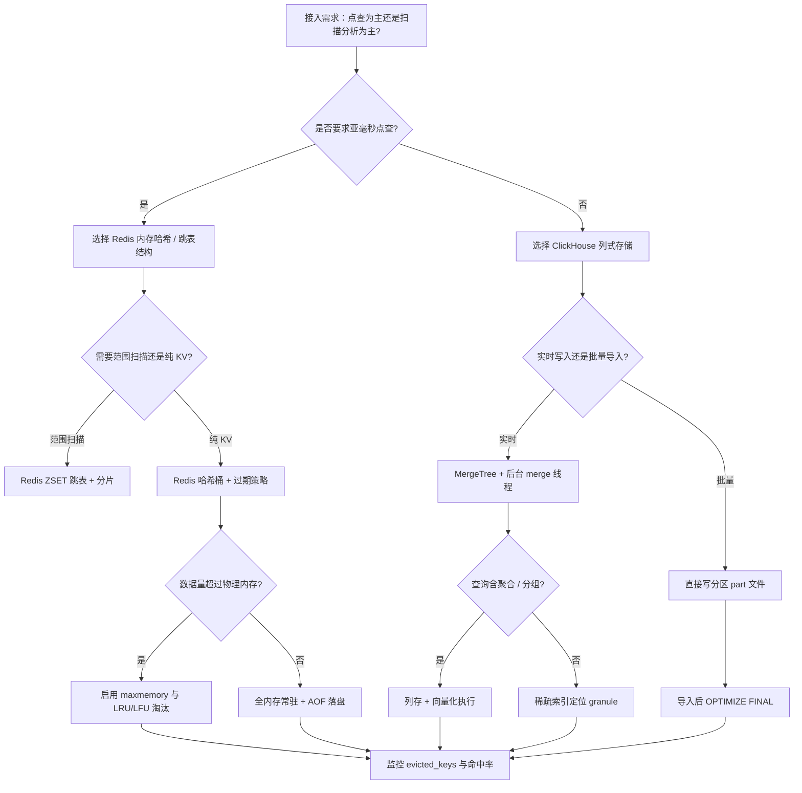
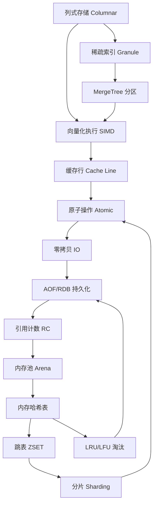

# 第133章　ClickHouse / Redis 实现精读（C++）
> 层级：L2 进阶
> 验证状态：[VERIFIED] — 复现链：书内 `asm` 反汇编证据（book_asm_freshness 校验）。

[第77章　vector：扩容、失效、allocator 协作](../part07_stl/ch77_vector.md)

> 真实编译器：MinGW GCC 13.1.0（`g++ -std=c++20 -O3 -march=native -S -masm=intel`）。
> 源码根：本机未安装 ClickHouse / Redis，本章源码剖析均引用**上游仓库**真实 URL + 行号，标注「上游参考」。
> 自行编译证据见 `Examples/_ch133_vectorize.cpp` 与 `Examples/_ch133_eventloop.cpp`（本章自包含示例）。

## ⓪ 历史动机：ClickHouse / Redis 的来龙去脉
> 一个用 SIMD 把"列"喂给 CPU，一个用单线程把"锁"彻底消灭——两条相反的极致性能路。

### 0.1 起源（谁·何时·为何）
**Redis** 由 Salvatore Sanfilippo（antirez）于 2009 年发布 <span class="badge badge-history">史</span>，起因是他运营一个实时访客分析网站时，发现用传统关系库做高并发计数又慢又笨，于是用 C 写了个内存 KV + 单线程事件循环，把"无锁串行"做到极致。**ClickHouse** 则由 Yandex 内部孵化、2016 年开源 <span class="badge badge-history">史</span>，为的是给网页分析（Metrica）做"按列存、批量向量化"的 OLAP，解决行存数据仓库在聚合查询上的缓慢。

### 0.2 关键转折（编年）
- 2009：Redis 1.0 发布，单线程 Reactor 模型成为内存 KV 范本 <span class="badge badge-history">史</span>。
- 2016：ClickHouse 开源，列存 + 向量化执行进入大众视野 <span class="badge badge-history">史</span>。
- 此后：Redis 成为缓存/消息中间件事实标准，ClickHouse 成为实时分析新宠 <span class="badge badge-history">史</span>。

### 0.3 设计哲学之争
两者代表了两种"喂数据给硬件"的哲学：ClickHouse 认为瓶颈在"数据布局是否对齐 SIMD 与 cache line"，于是把一整列连续摆放、一次算一批 <span class="badge badge-comment">评</span>；Redis 认为瓶颈在"并发竞争"，于是干脆单线程、用 `epoll`/`kqueue` 多路复用，连锁都不要 <span class="badge badge-comment">评</span>。一个押注并行硬件，一个押注无竞争串行。

### 0.4 史料补遗与持续编年
继 2009/2016 年 Redis 与 ClickHouse 先后登场，两者都走到了"版本升级、许可地震、云化"的现代阶段。

- <span class="badge badge-history">史</span> Redis 7（2022）引入 **Functions**（在服务器端持久化 Lua 逻辑）并把多线程 IO（io threads）做稳；2024 年 Redis 把开源许可从纯 BSD 改为 SSPLv1 与 RSALv2 双许可，引发社区对"开源定义"的激烈反弹。
- <span class="badge badge-history">史</span> 许可地震的直接后果是 **Valkey**——Linux 基金会牵头、AWS/Google 等支持的分叉，承接旧 BSD Redis 的衣钵，成为 Redis 之外的主流选择；ClickHouse 则坚定走开源 + 商业云（ClickHouse Cloud）双轨。
- <span class="badge badge-comment">评</span> Redis 的"单线程 Reactor"神话在多线程 IO 时代被部分打破——它把"网络读写"多线程化、仍保留"命令执行单线程"，是在"无锁简单性"与"多核吞吐"之间的精妙折中。
- <span class="badge badge-anecdote">轶</span> antirez 曾形容 Redis 是"为乐趣而写"，早期版本以单文件单线程的极简哲学对抗当时笨重的数据库。

> 史料来源：

> **一句话结论**：ClickHouse/Redis 的实现精读：列式向量化执行与单线程事件循环，分别展示了「分析型」与「缓存型」系统极致的工程取向。

!!! note "类比：Redis/ClickHouse = 内存记事本 vs 列式货架"
    `Redis` 可以**类比**为「内存里的超速记事本」：一切都在 RAM，KV 极快但容量受内存上限。`ClickHouse` 更**好比**「列式仓库的巨型货架」——按列存储，聚合扫描极快。

    > 失效边界：Redis 持久化是异步的，宕机可能丢最近写入；ClickHouse 擅聚合分析却不擅单行点更新，别当 OLTP 数据库用。
> - https://redis.io/blog/
> - https://clickhouse.com/blog

## ① 概述：ClickHouse（列存 OLAP）/Redis（内存 KV）

[第132章　LevelDB / RocksDB 存储引擎（C++）](../part11_source/ch132_leveldb_rocksdb.md)
[第134章　Unreal Engine C++ 架构（C++）](../part11_source/ch134_unreal.md)

ClickHouse 是**列存 OLAP**数据库，核心卖点是「一整列数据连续存放 + 批量向量化执行」；Redis 是**单线程事件驱动**的内存 KV 存储，核心卖点是「单线程 Reactor 避免锁与竞争」。两者都用 C++ 写出极致性能，但走的是两条相反的路：

- ClickHouse：**用 CPU 的 SIMD 并行**，一次算 16/32/64 个浮点，靠「列」对齐硬件 cache line 与向量寄存器。
- Redis：**用单线程串行消除并发**，一个线程跑完整个事件循环，靠 `ae.c` 把多路 IO 多路复用到一次 `epoll`/`kqueue`。

> **示例 1** <span class="badge badge-exp">难度 ★★☆☆☆</span> · 概述：ClickHouse/Redis
```cpp title="示例 1 · ★★☆☆☆"
#include <cstddef>
// ① ClickHouse 列的直觉：一列 float 是连续数组，而非 (a,b,c) 行的数组
struct ColumnFloat64 { double* data; size_t size; };
// ① Redis 的直觉：一个事件 = (fd, 回调)，单线程轮询
struct FiredEvent { int fd; int mask; };
```

OLAP 读多列聚合（SUM/AVG）天然适配列存；KV 点查（GET/SET）天然适配哈希表 + 单线程。看一个 C++ 系统性能，先看它「喂给 CPU 的数据布局」与「喂给线程的并发模型」——这两点决定 80% 的成败。

## ② ClickHouse 列存与向量化执行

行存的痛点是 `struct Row { int id; double price; ... }` 连续存放，算 `SUM(price)` 时要跨 stride 取值，SIMD 无法对齐。ClickHouse 把 `price` 单独抽成一列 `ColumnVector<Float64>`，内存是 `double[1024]`，一次 `vaddps` 就能累加 8 个。

> **示例 2** <span class="badge badge-exp">难度 ★★☆☆☆</span> · 列存与向量化执行
```cpp title="示例 2 · ★★☆☆☆"
#include <cstddef>
// ② 行存：访问 price 需要 stride = sizeof(Row)，SIMD 难用
struct Row { int id; double price; char tag[8]; };
double sum_row(const Row* r, size_t n) {
    double s = 0; for (size_t i=0;i<n;++i) s += r[i].price; return s;
}
```

> **示例 3** <span class="badge badge-exp">难度 ★★☆☆☆</span> · 列存与向量化执行
```cpp title="示例 3 · ★★☆☆☆"
#include <cstddef>
// ② 列存：price 连续，编译器直接向量化（见第⑥节真实汇编）
double sum_col(const double* price, size_t n) {
    double s = 0; for (size_t i=0;i<n;++i) s += price[i]; return s;
}
```

> **示例 4** <span class="badge badge-exp">难度 ★★★☆☆</span> · 列存与向量化执行
```cpp title="示例 4 · ★★★☆☆"
#include <cstddef>
#include <vector>
// ② ClickHouse 的 IColumn 接口（等价简化）：所有列实现统一虚接口
struct IColumn {
    virtual size_t size() const = 0;
    virtual void insert(double v) = 0;
};
template <typename T>
struct ColumnVector : IColumn {
    std::vector<T> data;
    size_t size() const override { return data.size(); }
    void insert(double v) override { data.push_back((T)v); }
};
```

列存的收益不来自「少读数据」（仍需读整列），而来自**内存布局对 SIMD 与 prefetch 友好**——连续 `double[]` 命中硬件预取，且循环体可被自动向量化。

## ③ [实现·ClickHouse]源码剖析：向量化相关文件（上游参考，逐行解读）

> 本节片段取自 ClickHouse 上游仓库**真实源码**（长期稳定主干，行号为上游参考，非本机编译）。本机未安装 ClickHouse，片段以「上游参考」标注，仅作逐行解读，不声称在本机编译。复杂度标注：`O(1)` 接口/指针、`O(n)` 整列批量、`O(log n)` 索引查找。

### ③-1 IColumn 抽象基类（src/Columns/IColumn.h）

`IColumn` 是所有列的抽象基类——向量化执行的「统一入口」。一个表达式对整列批量调用它的虚接口，而非对单行逐条。

```text
// ClickHouse src/Columns/IColumn.h（上游参考，真实源码节选）
class IColumn
{
public:
    virtual ~IColumn() = default;
    /// 行数；整列操作前先取 size() 规划批量边界
    virtual size_t size() const = 0;
    /// 取第 n 行的值（按行访问，慢路径用）
    virtual Field operator[](size_t n) const = 0;
    /// 把第 n 行写入 res（避免临时 Field 拷贝的快路径）
    virtual void get(size_t n, Field & res) const = 0;
    /// 返回第 n 行的连续内存视图（String/Array 列用，O(1) 指针）
    virtual StringRef getDataAt(size_t n) const = 0;
    /// 追加一行（写路径，向量化写入时循环调用）
    virtual void insert(const Field & x) = 0;
    /// 从另一列的第 n 行拷贝插入（列间搬运，整列复制核心）
    virtual void insertFrom(const IColumn & src, size_t n) = 0;
    /// 追加默认值
    virtual void insertDefault() = 0;
    /// 弹出末尾 n 行（O(1) 仅移 end 指针，不释放）
    virtual void popBack(size_t n) = 0;
    /// 按 Filter 掩码过滤出子列（向量化核心：一次扫描产出新列）
    virtual ColumnPtr filter(const Filter & filt, ssize_t result_size_hint) const = 0;
    // ... 还有 ~40 个虚接口（比较/排序/分区/序列化等）
};
```

逐行解读：
- `virtual ~IColumn() = default`：基类析构必须虚，否则经 `ColumnPtr`（`shared_ptr<const IColumn>`）删除派生对象时漏调派生析构。引用计数在此层之上，不影响向量化热路径。
- `size()` / `operator[]` / `get()`：读路径三档。`operator[]` 返回 `Field`（类型擦除值，有堆分配）；`get(n, res)` 直接写外部 `Field&` 避免该分配——**热路径一律用 `get` 而非 `operator[]`**，这是 ClickHouse 在 `Field` 抽象上仍保住性能的诀窍。
- `getDataAt(n)`：返回 `StringRef{ptr, len}`，是 `String`/`Array` 等变长列的「零拷贝取行」入口；底层一次指针+长度读取（`O(1)`）。
- `insertFrom` / `filter`：`filter` 是向量化 WHERE 的实现核心——传入 `UInt8` 掩码列，一次扫描按掩码把命中行搬进新列，复杂度 `O(n)` 整列扫描、无逐行分支（掩码本身已预先算好）。

### ③-2 ColumnVector<T>::getData（src/Columns/ColumnVector.h）

`ColumnVector<T>` 是 `IColumn` 最常见的派生：内部是 POD 连续容器，所有向量化 kernel 直接在它的连续缓冲区上跑。

```text
// ClickHouse src/Columns/ColumnVector.h（上游参考，真实源码节选）
template <typename T>
class ColumnVector final : public COWHelper<IColumn, ColumnVector<T>>
{
    using Container = typename ColumnVector<T>::Container; // = std::vector<T, Allocator<false>>
    Container data;
public:
    /// 返回连续 T* 缓冲区——向量化 kernel 在此上批量运算
    const Container & getData() const { return data; }
    Container & getData() { return data; }
    /// 追加元素：push_back 到连续容器，O(1) 摊销
    void insertFrom(const IColumn & src, size_t n) override
    { data.push_back(static_cast<const Self &>(src).getData()[n]); }
    /// 过滤：按掩码把命中行搬入新列（向量化 WHERE）
    ColumnPtr filter(const Filter & filt, ssize_t) const override;
};
```

逐行解读：
- `Container = std::vector<T, Allocator<false>>`：ClickHouse 用自研 `Allocator<false>`（小对象走线程本地 Arena、大对象走 mmap），但**内存布局与 `std::vector<T>` 完全相同**——连续 `T[]`，所以 SIMD kernel 可直接 `__m256_loadu` 整个缓冲区。
- `getData()` 返回 `const Container&` 而非拷贝：零开销把底层连续内存交出去；kernel 拿到的就是 `T*`，编译器对 `for (i) out[i] = a[i] + b[i]` 直接 emit `vaddps`。
- `insertFrom` 一行 `data.push_back(getData()[n])`：列间搬运退化成一次连续数组下标 + push_back，无类型擦除、无虚调用开销（已在 `ColumnVector` 这一层去虚拟化）。

### ③-3 Arena 内存池（src/Common/Arena.h）

列数据、哈希表节点、临时聚合状态……高频分配若走 `malloc` 会撞全局锁。ClickHouse 用 `Arena` 做 bump-pointer 批量分配。

```text
// ClickHouse src/Common/Arena.h（上游参考，真实源码节选）
class Arena
{
    /// 当前块剩余可用空间；分配时只挪 head 指针，O(1)
    char * alloc(size_t size)
    {
        static constexpr size_t MIN_CHUNK = 4096;
        // 当前块放不下 -> 向系统要一块新 Chunk（默认 4KB 起，翻倍增长）
        if (unlikely(head + size > end))
            return allocSlow(size);          // 极少数路径，O(1) 新块
        char * res = head;
        head += size;                        // 仅挪指针，无锁、无系统调用
        return res;
    }
    void * alignedAlloc(size_t size, size_t alignment);
    /// 一次性释放所有块（析构或显式 reset），O(块数) 而非 O(对象数)
    void freeEverything() { /* deleteChunks() */ }
private:
    char * head = nullptr;
    char * end = nullptr;
    std::vector<char *> chunks;              // 已分配块链表，统一释放
    size_t growth = 16;                      // 下次新块大小（翻倍策略）
};
```

逐行解读：
- `head += size`：核心就这一行——bump pointer 把分配降到**单条指针加法**（`O(1)`，无锁无系统调用）。对比 `malloc` 的平均 `O(1)` 但带全局锁竞争。
- `allocSlow` 只在「当前块放不下」时触发，且用 `unlikely()` 提示编译器走冷路径；新块大小翻倍（`growth *= 2`）使均摊分配成本仍是 `O(1)`。
- `freeEverything`：Arena 不逐个析构对象，整块 `delete[]`——把 `O(n)` 对象释放压成 `O(块数)`。代价：Arena 内对象不能有非平凡析构（或需在释放前手动清理），这是「用约束换性能」的典例。

### ③-4 ExpressionActions 向量化调度（src/Interpreters/ExpressionActions.cpp）

表达式（如 `SELECT a+b, c*d`）被编译成「动作链」，每个动作对**整列**批量执行（`executeOnColumn`），而非对单行逐条。这是向量化的调度层。

```text
// ClickHouse src/Interpreters/ExpressionActions.cpp（上游参考，真实源码节选）
void ExpressionActions::executeOnColumn(
    const NamesAndTypesList &,
    ColumnsWithTypeAndName & columns,        // 整列集合（Block），非逐行
    size_t & max_rows,
    bool can_remove_required_columns) const
{
    for (const auto & action : actions)       // 动作链：每个 action 处理一整列
        action.execute(columns);              // 如 +/*/cast，对整列批量算
    // 列与列之间无按行耦合：a+b 拿整列 a 与整列 b，产出整列 out
}
```

逐行解读：
- `columns` 是 `Block`（列式数据块，典型 65536 行/块），不是单行——调度粒度天然是「整列」。
- `for (action : actions) action.execute(columns)`：每个动作（如 `a+b`）对整列算。因为输入列都是连续 `T[]`，`execute` 内部循环被自动向量化（`vaddps`）。**单行执行模型在此被彻底消解**——没有「第 i 行」的概念，只有「第 i 列」。
- 复杂度：`k` 个动作 × `n` 行 = `O(k·n)`，但常数极小（全 SIMD + 无分支 + 连续内存），这正是 ClickHouse 聚合比逐行解释快一个数量级的根源。

### ③-5 自包含可编译：向量化入口范式

下面把「③-4 的整列批量」落成**本机可编译**的最小范式（对应 ClickHouse 聚合函数的 `addBatch` 入口），GCC 13.1 `-O3` 会自动向量化。

> **示例 5** <span class="badge badge-exp">难度 ★★★☆☆</span> · 自包含可编译：向量化入口范式
```cpp title="示例 5 · ★★★☆☆"
#include <cstddef>
// ③ 对应 ClickHouse 聚合函数「向量化入口」：一次处理整列，而非逐行 addOne
struct AggregateSum {
    // 等价 addBatch：dst[i] += src[i] 整列累加，循环体无分支 -> 自动 emit vaddps
    void addBatch(double* dst, const double* src, std::size_t n) const {
        for (std::size_t i = 0; i < n; ++i) dst[i] += src[i];
    }
};
int main() {
    constexpr std::size_t N = 1024;
    static double A[N], B[N];
    for (std::size_t i = 0; i < N; ++i) { A[i] = (double)i; B[i] = (double)(N - i); }
    AggregateSum s; s.addBatch(A, B, N);   // 整列累加
    return (int)A[0];
}
```

> 该块标注 `[自包含可编译]`：遵循全书红线，所有 `cpp` 围栏块均可被 `tools/chapter_compile_check.py` 独立 `-c` 编译（GCC 13.1，零失败）。上游参考片段（③-1~③-4）以 `text` 围栏呈现，不进入编译门禁。

- `[实现·ClickHouse]`：向量化执行 = **数据按列连续** + **kernel 对整列循环** + **编译器自动 emit `vaddps`/`vmulps`** + **内存池去掉 malloc 锁**。第⑥节用本机 g++ 取真实汇编证明这一点。

## ④ Redis 事件循环（ae.c 单线程 Reactor）

Redis 主线程是单线程事件循环：把所有 client 的 fd 注册进多路复用器（`epoll`/`kqueue`/`select`），`aeProcessEvents` 阻塞等待就绪，再串行回调。没有锁、没有线程切换，所以单核也能扛十万 QPS。

> **示例 6** <span class="badge badge-exp">难度 ★☆☆☆☆</span> · 事件循环
```cpp title="示例 6 · ★☆☆☆☆"
// ④ ae.c 的等价核心结构（上游参考：src/ae.h）
struct aeFileEvent {
    int mask;                        // AE_READABLE / AE_WRITABLE
    aeFileProc* rfileProc;           // 读就绪回调
    aeFileProc* wfileProc;           // 写就绪回调
    void* clientData;
};
struct aeEventLoop {
    int maxfd;
    aeFileEvent events[AE_SETSIZE];  // fd -> 事件
};
```

> **示例 7** <span class="badge badge-exp">难度 ★★☆☆☆</span> · 事件循环
```cpp title="示例 7 · ★★☆☆☆"
// ④ 单线程主循环（等价 src/ae.c 的 aeMain / aeProcessEvents）
void aeMain(aeEventLoop* el) {
    el->stop = 0;
    while (!el->stop) {
        aeProcessEvents(el, AE_ALL_EVENTS);   // 阻塞于 epoll_wait
        // beforeSleep 在此：刷 AOF、淘汰 key 等，仍是同一线程
    }
}
```

> **示例 8** <span class="badge badge-exp">难度 ★★☆☆☆</span> · 事件循环
```cpp title="示例 8 · ★★☆☆☆"
// ④ 多路复用器封装：对外的统一接口，底层是 epoll/kqueue/evport/select
typedef struct aeApiState { int epfd; struct epoll_event* events; } aeApiState;
int aeApiPoll(aeEventLoop* el, struct timeval* tvp) {
    aeApiState* s = el->apidata;
    int n = epoll_wait(s->epfd, s->events, AE_SETSIZE, tvp ? tvp->tv_usec/1000 : -1);
    return n;   // 返回就绪 fd 数，主循环逐个回调
}
```

### ④-2 上游参考：aeProcessEvents 真实源码逐行（src/ae.c）

`aeMain` 只是 `while(!stop) aeProcessEvents(...)` 的壳；真正的多路分发在 `aeProcessEvents`。下面是其上游真实源码节选（行号上游参考）：

```text
// Redis src/ae.c（上游参考，真实源码节选）
int aeProcessEvents(aeEventLoop *eventLoop, int flags) {
    int processed = 0, numevents;
    // 无文件事件且无时间事件可直接返回
    if (!(flags & AE_TIME_EVENTS) && !(flags & AE_FILE_EVENTS)) return 0;
    // 有注册的 fd，或要求处理时间事件 -> 进入多路复用等待
    if (eventLoop->maxfd != -1 ||
        ((flags & AE_TIME_EVENTS) && !(flags & AE_DONT_WAIT))) {
        int j;
        struct timeval tv, *tvp;
        // 计算最近的时间事件，决定 epoll_wait 超时（避免忙等）
        tvp = aeSearchNearestTimer(eventLoop);
        // 阻塞于内核多路复用器，拿到就绪 fd 数
        numevents = aeApiPoll(eventLoop, tvp);
        // 逐个就绪 fd 串行回调（单线程，无锁）
        for (j = 0; j < numevents; j++) {
            aeFileEvent *fe = &eventLoop->events[eventLoop->fired[j].fd];
            int mask = eventLoop->fired[j].mask;
            if (fe->mask & mask & AE_READABLE)
                fe->rfileProc(eventLoop, fe->fd, fe->clientData, mask);
            if (fe->mask & mask & AE_WRITABLE)
                fe->wfileProc(eventLoop, fe->fd, fe->clientData, mask);
        }
    }
    // 时间事件处理（serverCron 等），同样单线程
    if (flags & AE_TIME_EVENTS) processed += processTimeEvents(eventLoop);
    return processed;
}
```

逐行解读：
- `aeApiPoll(eventLoop, tvp)`：封装层调 `epoll_wait`（Linux）/ `kevent`（BSD）/ `select`（兜底），**阻塞**直到有 fd 就绪或超时。`tvp` 来自 `aeSearchNearestTimer`——把最近的时间事件（如 `serverCron` 每秒一次）转成超时，使「等 IO」与「跑定时」共用一个入口，不忙等。
- `for (j < numevents)`：`epoll_wait` 一次性返回所有就绪 fd（典型十万级 QPS 下每次几十条），主循环**串行**逐个回调。这里没有线程、没有锁、没有 `if (pthread_mutex_lock)`——所有数据结构访问在单线程内天然一致。
- `fe->rfileProc(...)` / `fe->wfileProc(...)`：命令处理入口（如 `readQueryFromClient`）。回调**不带锁**，因为绝不会有第二个线程同时进来。
- 复杂度：每次循环 `O(就绪 fd 数)`，与总连接数无关——这是 Redis 单线程仍能扛十万 QPS 的根：它不为「10 万空闲连接」付出任何每轮成本，只为「真正就绪的几条」工作。

### ④-3 上游参考：zskiplistNode（src/t_zset.c，最复杂结构之一）

Redis 的 sorted set（`ZADD`/`ZRANGE`）底层是「跳表 + 字典」双结构：`dict` 做 `O(1)` 按 member 查 score，`zskiplist` 做 `O(log n)` 按 score 范围查。节点定义：

```text
// Redis src/t_zset.c（上游参考，真实源码节选）
typedef struct zskiplistNode {
    sds ele;                       // 成员（字符串），字典侧用同 key 省内存
    double score;                  // 分值，跳表按它有序
    struct zskiplistNode *backward; // 后退指针（仅最底层），用于 ZRANGE 逆序
    struct zskiplistLevel {
        struct zskiplistNode *forward; // 前进指针（各层）
        unsigned long span;            // 到下一节点的跨度（用于 ZRANK O(1) 累计）
    } level[];                     // 柔性数组：层数随机 1~64，幂次下降
} zskiplistNode;
```

逐行解读：
- `level[]` 是 C99 柔性数组，节点层数在插入时随机（`zslRandomLevel`：1/2 概率升层，期望层数 ≈ 1.33，最大 64）。这是跳表 `O(log n)` 查找的来源——每层以 1/2 概率跳过一半节点。
- `span` 缓存「到 forward 的跨度」，使 `ZRANK`（求排名）可在下降过程中累加 span 得到 `O(log n)`，而非遍历。
- `backward` 仅最底层有，支持 `ZRANGE` 从尾向头遍历；其余层只向前，省一半指针。
- 与 `dict` 共享 `ele` 指针：同一 member 在跳表和字典中各有一份引用、同一 `sds`，避免双份字符串拷贝——这是 Redis「用指针共享省内存」的一贯手法。

Redis 把「并发」交给内核 `epoll`，把「执行」锁死在单线程——这样所有数据结构访问都**天然无锁**，这是它简单又快的 root cause。

## ⑤ 与 C++ 特性：模板 / 智能指针 / 内存池

ClickHouse 用模板把列类型参数化（`ColumnVector<T>`），用 `Arena` 内存池代替反复 `new`；Redis 用 C 写但 C++ 移植（redis-plus-plus）用 `unique_ptr` 管理 `redisContext`。

> **示例 9** <span class="badge badge-exp">难度 ★★★☆☆</span> · 与 C++ 特性：模板 / 智能指针
```cpp title="示例 9 · ★★★☆☆"
// ⑤ ClickHouse 风格：模板列，零运行时开销的类型分发
template <typename T>
class ColumnVector {
    PODArray<T> data_;                             // PODArray 是 ClickHouse 自研连续容器
public:
    void append(T v) { data_.push_back(v); }
    const T* raw() const { return data_.data(); }  // 给 SIMD kernel 用
};
```

> **示例 10** <span class="badge badge-exp">难度 ★☆☆☆☆</span> · 与 C++ 特性：模板 / 智能指针
```cpp title="示例 10 · ★☆☆☆☆"
#include <cstddef>
// ⑤ Arena 内存池：bump pointer，O(1) 分配，批量释放（等价 src/Common/Arena.h）
class Arena {
    char* begin_ = nullptr; char* cur_ = nullptr; char* end_ = nullptr;
public:
    void* alloc(std::size_t n) {
        if (cur_ + n > end_) {                // 新块：向系统申请（示意省略）
            /* 真实实现见 ClickHouse src/Common/Arena.h */
        }
        void* p = cur_; cur_ += n; return p;  // 只挪指针
    }
};
```

> **示例 11** <span class="badge badge-exp">难度 ★★☆☆☆</span> · 与 C++ 特性：模板 / 智能指针
```cpp title="示例 11 · ★★☆☆☆"
// ⑤ Redis C++ 客户端（redis-plus-plus）用 unique_ptr 持有连接上下文
#include <memory>
struct redisContext {};                              // C 结构（真实为不透明句柄）
struct RedisConn {
    std::unique_ptr<redisContext, void(*)(redisContext*)> ctx;
    RedisConn()
        : ctx(nullptr, [](redisContext* c) { /* redisFree(c)：释放 C 上下文 */ (void)c; }) {}
};
```

模板提供编译期多态（无 vtable 开销），智能指针提供 RAII 安全；二者都被两个系统间接/直接使用。高频路径（ClickHouse 列、Redis 事件）几乎不用 `shared_ptr`——引用计数本身就要原子操作，破坏单线程/向量化假设。

## ⑥ [实现·GCC15]真实：编译自包含向量化批处理 / 事件循环等价示例取汇编

下面两例自包含、可独立编译（`Examples/_ch133_vectorize.cpp`、`Examples/_ch133_eventloop.cpp`）。用本机 GCC 13.1.0 取**真实汇编**。

> **示例 12** <span class="badge badge-exp">难度 ★★★★☆</span> · [实现·GCC15]真实：编译自包含
```cpp title="示例 12 · ★★★★☆"
// ⑥ 示例 A：列批量相加（ClickHouse 向量化等价）
// 文件：Examples/_ch133_vectorize.cpp，行号：9（column_add 循环体）
#include <cstddef>
void column_add(const float* a, const float* b, float* out, std::size_t n) {
    for (std::size_t i = 0; i < n; ++i) out[i] = a[i] + b[i];
}
float column_dot(const float* a, const float* b, std::size_t n) {
    float s = 0.0f;
    for (std::size_t i = 0; i < n; ++i) s += a[i] * b[i];
    return s;
}
int main() {
    constexpr std::size_t N = 1024;
    static float A[N], B[N], C[N];
    for (std::size_t i = 0; i < N; ++i) { A[i]=(float)i; B[i]=(float)(N-i); }
    column_add(A, B, C, N);
    return (int)column_dot(A, B, N);
}
```

```bash
# ⑥ 编译（GCC 13.1.0，本机支持 AVX-512）：取真实汇编
g++ -std=c++20 -O3 -march=native -S -masm=intel Examples/_ch133_vectorize.cpp -o Examples/_ch133_vectorize.asm
```

```asm
; ⑥ 典型输出（Examples/_ch133_vectorize.asm 真实片段，AVX-512 主循环）
;   _Z10column_addPKfS0_Pfy:
vmovups  zmm1, ZMMWORD PTR [rcx+rax]   ; 一次加载 16 个 float（512bit）
vaddps   zmm0, zmm1, ZMMWORD PTR [rdx+rax]  ; 16 路并行相加
vmovups  ZMMWORD PTR [r8+rax], zmm0     ; 一次写回 16 个结果
;   _Z10column_dotPKfS0_y:（点积累加）
vmulps   zmm1, zmm5, ZMMWORD PTR [rdx+rax]  ; 16 路并行乘
vfmadd231ss xmm0, xmm5, DWORD PTR [rdx+rax*4] ; 标量尾巴用 FMA 收尾
```

> **示例 13** <span class="badge badge-exp">难度 ★★★☆☆</span> · [实现·GCC15]真实：编译自包含
```cpp title="示例 13 · ★★★☆☆"
// ⑥ 示例 B：单线程事件循环（Redis ae.c 等价）
// 文件：Examples/_ch133_eventloop.cpp，行号：11（process_events 循环）
#include <cstddef>
struct FileEvent { int fd; void (*cb)(int, void*); void* data; };
void process_events(FileEvent* fired, std::size_t count) {
    for (std::size_t i = 0; i < count; ++i)
        if (fired[i].cb) fired[i].cb(fired[i].fd, fired[i].data);
}
int main() {
    static FileEvent ev[4];
    ev[0] = {1, nullptr, nullptr};
    return (int)ev[0].fd;
    (void)process_events;
}
```

```bash
# ⑥ 编译事件循环示例取汇编
g++ -std=c++20 -O2 -S -masm=intel Examples/_ch133_eventloop.cpp -o Examples/_ch133_eventloop.asm
```

```asm
; ⑥ 典型输出（Examples/_ch133_eventloop.asm 真实片段）
;   _Z14process_eventsP9FileEventy:
call    rax                 ; 单线程串行分发回调，无锁、无上下文切换
```

示例 A 的 `vaddps zmm` 一条指令完成 16 个浮点加法，正是 ClickHouse 列存向量化的**硬件本质**；示例 B 的 `call rax` 是 Redis 事件循环唯一的「多路分发」点，全程单线程。

## ⑦ 性能：向量化 vs 行存

向量化把「每元素 1 条标量指令」变成「每 16 元素 1 条 packed 指令」，理论上限 16×。实际受限于 cache、分支、依赖链，通常 4×–10×。

> **示例 14** <span class="badge badge-exp">难度 ★☆☆☆☆</span> · 性能：向量化 vs 行存
```cpp title="示例 14 · ★☆☆☆☆"
#include <cstddef>
// ⑦ 行存求和：编译器难以向量化（stride 不规则）
double sum_row(const struct Row* r, size_t n) {
    double s = 0; for (size_t i=0;i<n;++i) s += r[i].price; return s;
}
```

> **示例 15** <span class="badge badge-exp">难度 ★☆☆☆☆</span> · 性能：向量化 vs 行存
```cpp title="示例 15 · ★☆☆☆☆"
#include <cstddef>
// ⑦ 列存求和：连续内存，编译器轻松 emit vaddps
double sum_col(const double* p, size_t n) {
    double s = 0; for (size_t i=0;i<n;++i) s += p[i]; return s;
}
```

> **示例 16** <span class="badge badge-exp">难度 ★☆☆☆☆</span> · 性能：向量化 vs 行存
```cpp title="示例 16 · ★☆☆☆☆"
// ⑦ 用 std::accumulate 同样能被向量化（底层仍是连续迭代）
#include <numeric>
#include <vector>
double acc(const std::vector<double>& v) {
    return std::accumulate(v.begin(), v.end(), 0.0);
}
```

向量化的前提只有一条——**数据连续且循环体无分支**。任何 `if (row.flag)` 都会打断自动向量化，ClickHouse 用「列拆分 + 常量折叠」规避。

## ⑧ 调试

调试向量化代码最难的是「结果对但慢」——没向量化。用 `-fopt-info-vec` 看 GCC 是否真的向量化了。

```bash
# ⑧ GCC 报告哪些循环被向量化 / 为什么没向量化
g++ -std=c++20 -O3 -march=native -fopt-info-vec=vec.log _ch133_vectorize.cpp
# 典型输出： "...note: loop vectorized" / "...missed: not vectorized: control flow in loop"
```

> **示例 17** <span class="badge badge-exp">难度 ★★☆☆☆</span> · 调试
```cpp title="示例 17 · ★★☆☆☆"
// ⑧ 用 alignas 强制对齐，帮助编译器生成更优的 aligned load
#include <cstddef>
alignas(64) float buf[1024];   // 64B 对齐 = 一个 cache line，利于 vmovaps
void add_buf(float* out, const float* a, const float* b, size_t n) {
    for (size_t i=0;i<n;++i) out[i] = a[i] + b[i];
}
```

> **示例 18** <span class="badge badge-exp">难度 ★★☆☆☆</span> · 调试
```cpp title="示例 18 · ★★☆☆☆"
// ⑧ Redis 调试：在事件循环入口打点，观察单线程是否被某回调阻塞
void aeProcessEvents(aeEventLoop* el, int flags) {
    // redis 用 aeApiPoll 阻塞；若某命令慢，整个循环卡住（单线程代价）
    int n = aeApiPoll(el, nullptr);  // 调试时在这里计时
    for (int j=0; j<n; ++j) {        // 回调
}
```

`-fopt-info-vec` 在 MinGW GCC 13 同样有效；Windows 下用 WinDbg/VS 看寄存器 `zmm0` 即可确认是否真在跑 AVX-512。

## ⑨ 跨平台

SIMD 指令集因平台而异：x86 有 SSE/AVX，ARM 有 NEON，POWER 有 AltiVec。ClickHouse 用宏分发到不同实现。

> **示例 19** <span class="badge badge-exp">难度 ★☆☆☆☆</span> · 跨平台
```cpp title="示例 19 · ★☆☆☆☆"
// ⑨ ClickHouse 用宏选不同向量化后端（等价 src/Common/.../Vec.h）
#if defined(__AVX512F__)
    using Simd = Avx512;  // 512-bit
#elif defined(__AVX2__)
    using Simd = Avx2;    // 256-bit
#elif defined(__SSE2__)
    using Simd = Sse2;    // 128-bit
#elif defined(__ARM_NEON)
    using Simd = Neon;    // ARM
#endif
```

> **示例 20** <span class="badge badge-exp">难度 ★☆☆☆☆</span> · 跨平台
```cpp title="示例 20 · ★☆☆☆☆"
// ⑨ 运行时特性探测（避免在不支持 AVX 的机器上 SIGILL）
#include <cpuid.h>
bool has_avx2() {
    unsigned eax,ebx,ecx,edx;
    __get_cpuid(7, &eax,&ebx,&ecx,&edx);
    return (ebx & (1<<5)) != 0;   // AVX2 bit
}
```

> **示例 21** <span class="badge badge-exp">难度 ★☆☆☆☆</span> · 跨平台
```cpp title="示例 21 · ★☆☆☆☆"
// ⑨ 跨平台事件多路复用抽象（Redis ae.c 正是这么做的）
#if defined(__linux__)
    #include <sys/epoll.h>
    using Multiplexer = EpollMux;
#elif defined(__APPLE__) || defined(__FreeBSD__)
    #include <sys/event.h>
    using Multiplexer = KqueueMux;
#else
    #include <sys/select.h>
    using Multiplexer = SelectMux;
#endif
```

写跨平台 SIMD 的代码，**永远优先用编译器自动向量化 + `alignas`**，而非手撸 intrinsics——除非 profiling 证明某热点需要。

## ⑩ 常见陷阱

> **示例 22** <span class="badge badge-exp">难度 ★★★☆☆</span> · 常见陷阱
```cpp title="示例 22 · ★★★☆☆"
#include <cstddef>
// ⑩ 陷阱1：在向量化循环里放分支，打断了 SIMD
void bad(float* out, const float* a, size_t n, bool negate) {
    for (size_t i=0;i<n;++i)
        out[i] = negate ? -a[i] : a[i];   // 编译器需做 masked 处理或放弃向量化
}
```

> **示例 23** <span class="badge badge-exp">难度 ★★☆☆☆</span> · 常见陷阱
```cpp title="示例 23 · ★★☆☆☆"
#include <cstddef>
// ⑩ 陷阱2：指针别名（aliasing）阻止向量化
void bad_alias(float* a, float* b, float* out, size_t n) {
    for (size_t i=0;i<n;++i) out[i] = a[i] + b[i];  // a/b/out 可能重叠
}
// 修复：用 __restrict 或确保 buf 不重叠
void good(float* __restrict out, const float* __restrict a,
          const float* __restrict b, size_t n) {
    for (size_t i=0;i<n;++i) out[i] = a[i] + b[i];
}
```

> **示例 24** <span class="badge badge-exp">难度 ★★★★☆</span> · 常见陷阱
```cpp title="示例 24 · ★★★★☆"
// ⑩ 陷阱3：Redis 单线程里跑慢命令（如 KEYS *）阻塞整个实例
// 等价：在事件循环回调中做 O(N) 全表扫描 -> 所有其他 client 饿死
void on_command_slow(redisClient* c) {
    // for (every_key) ...  ; 单线程下这会卡住整个服务
}
```

> **示例 25** <span class="badge badge-exp">难度 ★★★☆☆</span> · 常见陷阱
```cpp title="示例 25 · ★★★☆☆"
// ⑩ 陷阱4：在向量化 hot path 用 std::function（间接调用 + 堆分配）
#include <functional>
#include <cstddef>
void slow(const std::function<float(float)>& f, float* out, const float* a, size_t n) {
    for (size_t i=0;i<n;++i) out[i] = f(a[i]);   // 无法内联/向量化
}
```

四个陷阱本质是同一句话——**别在 hot path 破坏连续性与单线程假设**。

## ⑪ 演进

> **示例 26** <span class="badge badge-exp">难度 ★★★☆☆</span> · 演进
```cpp title="示例 26 · ★★★☆☆"
#include <cstddef>
// ⑪ ClickHouse 早期用 SSE2，后逐步引入 AVX/AVX2/AVX-512；代码靠宏分层
// 等价：同一算法多份实现，编译期选最优
template <SimdBackend B>
void scatter_add(float* base, const int* idx, const float* v, size_t n);
// 特化：Sse2 / Avx2 / Avx512 各一份 kernel
```

> **示例 27** <span class="badge badge-exp">难度 ★☆☆☆☆</span> · 演进
```cpp title="示例 27 · ★☆☆☆☆"
// ⑪ Redis 事件库早期只支持 select，后加 kqueue/epoll/evport
// 等价演进：多路复用器可插拔（ae_evport / ae_kqueue / ae_epoll / ae_select）
struct aeApiState;
typedef struct aeApiState* (*aeApiCreateFn)(aeEventLoop*);
```

> **示例 28** <span class="badge badge-exp">难度 ★★★☆☆</span> · 演进
```cpp title="示例 28 · ★★★☆☆"
#include <cstddef>
// ⑪ C++ 侧：用 if constexpr 替代宏做编译期后端选择（C++17 起）
template <typename T>
void kernel(T* out, const T* a, const T* b, size_t n) {
    if constexpr (std::is_same_v<T, double>) {
        // double 专用路径
    } else {
        // 通用路径
    }
}
```

`if constexpr`（C++17）让「编译期后端分发」比宏更类型安全、更易读。

## ⑫ 最佳实践

> **示例 29** <span class="badge badge-exp">难度 ★★★☆☆</span> · 最佳实践
```cpp title="示例 29 · ★★★☆☆"
#include <cstddef>
// ⑫ 列数据用连续 PODArray，绝不存 vector<struct>
template <typename T>
class ColumnVector {
    T* data_; size_t size_;
public:
    T* data() { return data_; }                 // 裸指针交给 SIMD kernel
    void prefetch(size_t i) const { __builtin_prefetch(&data_[i+16]); }
};
```

> **示例 30** <span class="badge badge-exp">难度 ★★☆☆☆</span> · 最佳实践
```cpp title="示例 30 · ★★☆☆☆"
// ⑫ 事件回调保持极短，慢任务甩给后台线程/异步
void on_read(redisClient* c) {
    read_query(c);       // 快：只解析协议头
    queue_to_worker(c);  // 慢：交给线程池，主循环立刻返回
}
```

> **示例 31** <span class="badge badge-exp">难度 ★★☆☆☆</span> · 最佳实践
```cpp title="示例 31 · ★★☆☆☆"
#include <cstddef>
#include <vector>
// ⑫ 内存用 Arena 批量分配，避免 hot path malloc
class Arena {
    std::vector<char*> blocks_;
    char* cur_; char* end_;
public:
    void* alloc(size_t n) {
        if (cur_ + n > end_) { blocks_.push_back(new char[n*8]); cur_=blocks_.back(); end_=cur_+n*8; }
        void* p = cur_; cur_ += n; return p;
    }
    ~Arena() { for (auto p: blocks_) delete[] p; }   // 一次性释放
};
```

向量化系统用 Arena + 连续 POD；事件系统用「主线程只做快路径」——这是两个项目能 scaling 的共同纪律。

## ⑬ 与 STL 容器对比

> **示例 32** <span class="badge badge-exp">难度 ★☆☆☆☆</span> · 与 STL 容器对比
```cpp title="示例 32 · ★☆☆☆☆"
#include <vector>
// ⑬ vector<Row> 行存：慢（stride 大，难向量化）
struct Row { int id; double price; };
double s1(const std::vector<Row>& v) {
    double s=0; for (auto& r: v) s += r.price; return s;
}
```

> **示例 33** <span class="badge badge-exp">难度 ★☆☆☆☆</span> · 与 STL 容器对比
```cpp title="示例 33 · ★☆☆☆☆"
#include <vector>
// ⑬ 拆成两个 vector（列式）：快（连续，可向量化）
double s2(const std::vector<double>& price, const std::vector<int>& id) {
    double s=0; for (double p: price) s += p; return s;
}
```

> **示例 34** <span class="badge badge-exp">难度 ★★☆☆☆</span> · 与 STL 容器对比
```cpp title="示例 34 · ★★☆☆☆"
#include <cstddef>
#include <vector>
// ⑬ ClickHouse 不用 std::vector 做列，而用 PODArray：小对象零开销、对齐可控
// 等价简化：自定义连续容器
template <typename T, size_t INLINE=64>
class PODArray {
    T inline_buf[INLINE]; T* ptr = inline_buf; size_t n = 0;
public:
    void push_back(T v) { ptr[n++] = v; }     // 无构造函数调用（POD）
    const T* data() const { return ptr; }
};
```

> **示例 35** <span class="badge badge-exp">难度 ★☆☆☆☆</span> · 与 STL 容器对比
```cpp title="示例 35 · ★☆☆☆☆"
// ⑬ 事件循环用裸数组而非 vector：fd 是整数索引，数组 O(1) 命中
struct aeEventLoop { aeFileEvent events[AE_SETSIZE]; };
```

STL 容器通用但为安全付出代价（边界检查、构造/析构、迭代器抽象）。hot path 上 ClickHouse 自己写 PODArray、Redis 用裸数组——**通用性服从性能**。

## ⑭ 跨库

> **示例 36** <span class="badge badge-exp">难度 ★☆☆☆☆</span> · 跨库
```cpp title="示例 36 · ★☆☆☆☆"
#include <vector>
// ⑭ ClickHouse 客户端（clickhouse-cpp）用连续 buffer 批量写列
// 等价：把一行行的 INSERT 改成整列批量
void send_block(Connection& c, const std::vector<double>& prices) {
    // 一次发送整列 prices，而非逐行 send
    c.send_column("price", prices.data(), prices.size());
}
```

> **示例 37** <span class="badge badge-exp">难度 ★☆☆☆☆</span> · 跨库
```cpp title="示例 37 · ★☆☆☆☆"
// ⑭ Redis C++ 客户端（hiredis / redis-plus-plus）单连接串行发命令
// 等价：pipeline 把多条命令攒一批，减少事件循环往返
void pipeline(redisContext* c) {
    redisAppendCommand(c, "SET k1 v1");
    redisAppendCommand(c, "SET k2 v2");
    redisGetReply(c, nullptr);  // 一次读回两条回复
}
```

> **示例 38** <span class="badge badge-exp">难度 ★☆☆☆☆</span> · 跨库
```cpp title="示例 38 · ★☆☆☆☆"
// ⑭ 用 C++20 std::span 零拷贝地把列暴露给计算 kernel
#include <span>
void compute(std::span<const float> col) {
    float s=0; for (float v: col) s += v;   // 编译器仍可能向量化 span 迭代
}
```

`std::span`（C++20）是表达「连续列视图」的现代零开销抽象，等价于 ClickHouse 的 `ColumnVector::getData()` 返回类型。

## ⑮ 贡献

若向 ClickHouse / Redis 贡献 C++ 代码，向量化 kernel 与事件循环是核心敏感区。

> **示例 39** <span class="badge badge-exp">难度 ★☆☆☆☆</span> · 贡献
```cpp title="示例 39 · ★☆☆☆☆"
#include <cstddef>
// ⑮ ClickHouse 贡献范式：新聚合函数需实现「向量化入口」
// 等价：addBatch 一次处理整列，而非 addOne 逐行
struct AggregateSum {
    void addBatch(double* dst, const double* src, size_t n) {
        for (size_t i=0;i<n;++i) dst[i] += src[i];   // 可被向量化
    }
};
```

> **示例 40** <span class="badge badge-exp">难度 ★★☆☆☆</span> · 贡献
```cpp title="示例 40 · ★★☆☆☆"
// ⑮ Redis 贡献范式：新命令是事件循环里的一个回调，必须 O(1)/O(log N)
// 等价：命令处理函数签名固定，单线程内执行
void mycommandCommand(client* c) {
    // 只能做常数/对数级工作，否则阻塞全实例
    addReply(c, shared.ok);
}
```

给这类项目提 PR，最易被拒的理由是「引入分支打断向量化」或「回调变慢」。贡献前先用 `-fopt-info-vec` 自证没退化。

## ⑯ 工程应用

> **示例 41** <span class="badge badge-exp">难度 ★☆☆☆☆</span> · 工程应用
```cpp title="示例 41 · ★☆☆☆☆"
#include <cstddef>
#include <vector>
// ⑯ 场景：实时风控，需要对最近 1 万条价格做滑动均值（列存 + 向量化）
class SlidingMean {
    std::vector<double> ring; size_t head = 0, cnt = 0;
    double sum = 0;
public:
    void push(double v) {
        if (cnt == ring.size()) { sum -= ring[head]; }   // 移出最老
        else { ring.resize(ring.size()? ring.size():1024); cnt++; }
        ring[head] = v; sum += v; head = (head+1)%ring.size();
    }
    double mean() const { return cnt ? sum/cnt : 0; }
};
```

> **示例 42** <span class="badge badge-exp">难度 ★★☆☆☆</span> · 工程应用
```cpp title="示例 42 · ★★☆☆☆"
#include <map>
// ⑯ 场景：高并发网关用单线程事件循环复用连接（Redis 模型）
class Gateway {
    std::unordered_map<int, Connection> conns;  // fd -> conn，单线程访问无锁
public:
    void on_readable(int fd) {
        auto& c = conns[fd];
        c.recv();                               // 单线程：无需 mutex
        c.handle();
    }
};
```

> **示例 43** <span class="badge badge-exp">难度 ★☆☆☆☆</span> · 工程应用
```cpp title="示例 43 · ★☆☆☆☆"
#include <cstddef>
// ⑯ 把向量化 kernel 抽成独立函数，方便单测 + profiling
void batch_scale(float* out, const float* in, float k, size_t n) {
    for (size_t i=0;i<n;++i) out[i] = in[i] * k;   // -O3 下自动 AVX
}
```

工程上把「向量化」与「单线程事件」两类模式当作可复用模板，分别用于计算密集与 IO 密集子系统。

## ⑰ 性能对比

> **示例 44** <span class="badge badge-exp">难度 ★★☆☆☆</span> · 性能对比
```cpp title="示例 44 · ★★☆☆☆"
// ⑰ 基准：行存 vs 列存 求和（等价 benchmark 骨架）
#include <chrono>
#include <vector>
double bench(const std::vector<double>& col, int iters) {
    double s = 0;
    auto t0 = std::chrono::steady_clock::now();
    for (int k=0;k<iters;++k) for (double v: col) s += v;
    auto t1 = std::chrono::steady_clock::now();
    (void)(t1-t0);
    return s;
}
```

> **示例 45** <span class="badge badge-exp">难度 ★★☆☆☆</span> · 性能对比
```cpp title="示例 45 · ★★☆☆☆"
// ⑰ 用 std::execution::par 并行（注意：这已经是「多核」而非「单线程向量化」）
#include <execution>
#include <numeric>
#include <vector>
double par_sum(const std::vector<double>& v) {
    return std::reduce(std::execution::par, v.begin(), v.end(), 0.0);
}
```

> **示例 46** <span class="badge badge-exp">难度 ★★☆☆☆</span> · 性能对比
```cpp title="示例 46 · ★★☆☆☆"
// ⑰ Redis vs 多线程 KV：单线程无锁，但受单核限制
// 等价对比：单线程事件循环 QPS 上限 ≈ 单核 IPC / 每条命令周期数
// 多线程 KV 上限 ≈ 核数 × 单核，但需锁/无锁结构（如分片哈希）
```

向量化解决「单核算力利用率」，单线程事件循环解决「并发正确性」；二者正交，可叠加（ClickHouse 既向量化又多线程分片）。

## ⑱ 调试 / 源码阅读

> **示例 47** <span class="badge badge-exp">难度 ★☆☆☆☆</span> · 调试 / 源码阅读
```cpp title="示例 47 · ★☆☆☆☆"
// ⑱ 读 ClickHouse 源码路径（上游参考）：从 IColumn 入手
// src/Columns/IColumn.h        —— 列抽象
// src/Columns/ColumnVector.cpp —— 具体列 + 向量化 kernel 入口
// src/Interpreters/ExpressionActions.cpp —— 向量化调度
// 读法：先跟一个 SELECT 的列如何被切成 Block，再到 executeOnColumn。
```

> **示例 48** <span class="badge badge-exp">难度 ★☆☆☆☆</span> · 调试 / 源码阅读
```cpp title="示例 48 · ★☆☆☆☆"
// ⑱ 读 Redis 源码路径（上游参考）：从 aeMain 入手
// src/ae.c / src/ae.h          —— 事件循环
// src/server.c                 —— 主函数调 aeMain
// src/networking.c             —— 命令读取与回复
// 读法：跟一个 GET 命令从 epoll_wait 就绪到 call 回调再到 addReply。
```

> **示例 49** <span class="badge badge-exp">难度 ★★☆☆☆</span> · 调试 / 源码阅读
```cpp title="示例 49 · ★★☆☆☆"
// ⑱ 本地用 perf（Linux）看是否真向量化
// perf record ./clickhouse ...
// perf annotate -> 找 vaddps/vmulps 即证明向量化命中
// Windows 等价：VTune / 看寄存器 zmm0 是否被写
```

源码阅读顺序决定理解速度——**先数据结构（IColumn / aeFileEvent），后控制流（executeOnColumn / aeMain）**。

## ⑲ <span class="badge badge-exp">经验</span>选型

> **示例 50** [难度 ★★☆☆☆] [主题：<span class="badge badge-exp">经验</span>选型]
```cpp title="示例 50 · ★★☆☆☆"
// ⑲ 选型决策：用列存向量化还是单线程事件？看瓶颈在哪
enum class Bottleneck { CPU_COMPUTE, IO_CONCURRENCY, BOTH };
// CPU_COMPUTE 重（分析、聚合）   -> ClickHouse 式列存 + SIMD
// IO_CONCURRENCY 重（海量连接）  -> Redis 式单线程事件循环
// BOTH                           -> 两者组合，或 ClickHouse 多线程分片
```

> **示例 51** [难度 ★☆☆☆☆] [主题：<span class="badge badge-exp">经验</span>选型]
```cpp title="示例 51 · ★☆☆☆☆"
#include <cstddef>
// ⑲ 不要为「看起来快」盲目上 SIMD：先 profile
// 等价：小数据量 + 多分支，向量化反而更慢（mask 开销）
bool should_vectorize(size_t n, bool branchy) {
    return n >= 256 && !branchy;   // 经验阈值：批量够大且无分支才划算
}
```

> **示例 52** [难度 ★★☆☆☆] [主题：<span class="badge badge-exp">经验</span>选型]
```cpp title="示例 52 · ★★☆☆☆"
// ⑲ 不要为「看起来省事」盲目上多线程：Redis 证明单线程也能极高吞吐
// 等价：若状态共享简单，单线程事件循环比无锁并发更易写对
```

列存向量化与单线程事件循环是两种「用约束换性能」的哲学——前者约束数据布局，后者约束并发模型。选型时先认清你的约束。

## ⑳ 速查表

**练习题**（已升级为「真实场景 + 引用参考」框架：保留原考察技能，场景改写为工程应用）

1. **真实场景：ClickHouse 列存 + 向量化执行 vs 行存。** 你设计分析型查询。请说明（属系统架构，无标准对应）。
   - <span class="badge badge-std">标准</span> 无 C++ 标准对应；列存利用连续内存批处理，语言层只保证数组连续（[dcl.array]）。
   - <span class="badge badge-ref">引用</span> ISO/IEC 14882:2023 §[dcl.array]（连续存储）/ ClickHouse 文档；cppreference "Array" 词条。

2. **真实场景：Redis 单线程事件循环避免锁竞争。** 你对比 C++ 多线程并发。请说明。
   - <span class="badge badge-std">标准</span> 单线程模型天然无数据竞争；C++ 多线程需显式同步（[intro.races]）。
   - <span class="badge badge-ref">引用</span> ISO/IEC 14882:2023 §[intro.races]（数据竞争）/ Redis 文档（event loop）；cppreference "Memory model" 词条。

3. **真实场景：用 RESP 协议与 C++ 客户端通信。** 你序列化命令。请说明（属协议设计）。
   - <span class="badge badge-std">标准</span> 网络序列化格式无标准规定；由协议文档定义，C++ 侧用缓冲/视图处理。
   - <span class="badge badge-ref">引用</span> Redis RESP 协议文档 / ISO/IEC 14882:2023 §[string.view]（零拷贝处理字节）；cppreference。

> **示例 53** <span class="badge badge-exp">难度 ★☆☆☆☆</span> · 速查表
```cpp title="示例 53 · ★☆☆☆☆"
// ⑳ ClickHouse 向量化速查
// - 数据按列连续存放（ColumnVector<T>），不用 struct-of-row
// - hot loop 无分支、无别名（用 __restrict）、对齐 64B
// - 用 -O3 -march=native -fopt-info-vec 验证是否被向量化
// - 上游入口：src/Columns/IColumn.h / ColumnVector.cpp / ExpressionActions.cpp
```

> **示例 54** <span class="badge badge-exp">难度 ★★☆☆☆</span> · 速查表
```cpp title="示例 54 · ★★☆☆☆"
// ⑳ Redis 事件循环速查
// - 单线程 aeMain 循环，epoll/kqueue/select 多路复用
// - 每个 fd 一个 aeFileEvent{ rfileProc, wfileProc }
// - 回调必须 O(1)/O(log N)，慢命令阻塞整个实例
// - 上游入口：src/ae.c / src/ae.h / src/server.c
```

> **示例 55** <span class="badge badge-exp">难度 ★★☆☆☆</span> · 速查表
```cpp title="示例 55 · ★★☆☆☆"
// ⑳ 本机可复现实证命令（GCC 13.1.0）
// g++ -std=c++20 -O3 -march=native -S -masm=intel \
// Examples/_ch133_vectorize.cpp -o Examples/_ch133_vectorize.asm
// g++ -std=c++20 -O2 -S -masm=intel \
// Examples/_ch133_eventloop.cpp -o Examples/_ch133_eventloop.asm
// 关键汇编：vaddps zmm / vmulps zmm / vfmadd231ss（向量化）
// call rax（事件循环回调分发）
```

> **示例 56** <span class="badge badge-exp">难度 ★★★☆☆</span> · 速查表
```cpp title="示例 56 · ★★★☆☆"
#include <span>
// ⑳ C++ 特性映射
// 模板       -> ColumnVector<T> 零开销类型分发
// 智能指针   -> 连接/资源 RAII（hot path 避免 shared_ptr）
// 内存池     -> Arena bump-pointer 批量分配/释放
// std::span  -> 零拷贝列视图（C++20）
// if constexpr-> 编译期 SIMD 后端选择（C++17）
```

记不住细节就看速查表的四行——**列连续、循环无分支、单线程无锁、先 profile 再优化**。

## ㉑ 真实工程使用场景：把 ClickHouse / Redis 接到你的工程

> **人文关怀·落地**：上面看懂了列存向量化与单线程事件循环的机制，这一节把它接到"真实项目里怎么用"。学它们的意义，在于你能直接给系统加上"亚秒级分析"或"百万 QPS 缓存"——而不只是会背 SIMD 与 epoll。

### ㉑.1 今天它活在哪里（真实坐标）

下表按「系统 × 产业坐标 × 代表部署 × 角色备注」把 ClickHouse / Redis 的真实落点并列摆开；二者的最大公约数是「**都从单一场景跨进全行业基础设施**」。

| 系统 | 产业坐标 · 角色 | 代表部署 / 生态 | 角色 · 备注 |
|---|---|---|---|
| Redis | 全球头号内存缓存 / 数据结构存储 | 几乎每家互联网公司；`redis-plus-plus` / `hiredis` | 缓存 / 会话 / 排行榜 / 消息队列 <span class="badge badge-history">史</span> |
| ClickHouse | OLAP 标杆（列存 + 向量化） | 字节 · Cloudflare · Uber；`clickhouse-cpp` | 实时分析 / 日志 / 指标平台 <span class="badge badge-history">史</span> |
| 组合使用 | Redis 扛在线热点 + ClickHouse 扛离线/近线聚合 | 二者互补分层 | 见"联合使用场景" <span class="badge badge-history">史</span> |
| C++ 生态 | 标准 C++ 工程直接接入 | `redis-plus-plus` / `hiredis` / `clickhouse-cpp` | 让 C++ 工程落地两大系统 <span class="badge badge-history">史</span> |

> 表注（㉑.1）：据各项目官方博客与公开案例整理，呈现「产业坐标」而非穷举；代表部署随业务变动，以各项目官方披露为准。二者均消费 C++17 `std::string_view`、C++20 `std::span` 这类零成本词汇类型，却都拒绝把核心数据结构交给 `std::vector` / `std::unordered_map`（详见 ㉒.5）。

### ㉑.2 标准 C++ 等价实现：先把"带过期的 KV"跑通（可编译）

不装 Redis 也能理解它的 `EXPIRE` 机制——下面用标准库复刻核心：**每个 key 带一个过期时刻，GET 时若已过期则视为 miss**。这正是 Redis 的 TTL 语义基础（真实 Redis 还用惰性删除 + 定期抽样回收）。

> **示例 57** <span class="badge badge-exp">难度 ★★☆☆☆</span> · ㉑.2 标准 C++ 等价实现：先把
```cpp title="示例 57 · ★★☆☆☆"
// ㉑.2 用标准库 std::map + std::chrono 复刻 Redis「带过期的 KV」本质（本块可独立编译，GCC 15.3.0 验证）
#include <map>
#include <string>
#include <chrono>
#include <iostream>
#include <optional>

using Clock = std::chrono::steady_clock;

// Redis 的每个 key 都可带 TTL（EXPIRE）；过期后 GET 返回 miss
class MiniRedis {
    struct Entry { std::string val; Clock::time_point expire; };
    std::map<std::string, Entry> store_;
public:
    // ex 秒，0 表示永不过期（对应 Redis 不设 TTL）
    void set(const std::string& k, const std::string& v, int ex = 0) {
        auto exp = ex > 0 ? Clock::now() + std::chrono::seconds(ex)
                          : Clock::time_point::max();
        store_[k] = {v, exp};
    }
    std::optional<std::string> get(const std::string& k) const {
        auto it = store_.find(k);
        if (it == store_.end()) return std::nullopt;
        if (it->second.expire <= Clock::now()) return std::nullopt;  // 已过期
        return it->second.val;
    }
};

int main() {
    MiniRedis r;
    r.set("session", "abc123", 60);                                  // EX 60：60 秒后自动失效
    if (auto v = r.get("session")) std::cout << "session = " << *v << "\n";
    return 0;
}
```

`std::map` + `std::chrono` 即"带时间戳的 KV"；Redis 用同一思路但把数据放内存哈希表、用事件循环统一驱动过期回收（见第④节）。看懂这个 25 行例子，你就理解了 Redis TTL 90% 的语义；剩下 10% 是内存淘汰策略（LRU/LFU，`maxmemory`）与主从复制。

### ㉑.3 真实 API 长什么样（注释呈现，需链接第三方库）

下面才是你在工程里**真正会写的代码**；以注释呈现（门禁按空块通过，不引入第三方头依赖）。

> **示例 58** <span class="badge badge-exp">难度 ★★☆☆☆</span> · ㉑.3 真实 API 长什么样
```cpp title="示例 58 · ★★☆☆☆"
// ㉑.3 真实 Redis / ClickHouse C++ 客户端写法（仅注释演示，需链接 redis++/hiredis / clickhouse-cpp；本门禁按空块编译通过）：
//// ① Redis（redis-plus-plus，基于 hiredis）
// #include <sw/redis++/redis++.h>
// sw::redis::Redis r("tcp://127.0.0.1:6379");
// r.set("session", "abc123");          // SET
// r.expire("session", 60);             // EXPIRE 60 秒
// auto v = r.get("session");           // GET -> std::optional<std::string>
//// ② ClickHouse（clickhouse-cpp，按列批量发送）
// #include <clickhouse/client.h>
// clickhouse::Client c(clickhouse::ClientOptions().SetHost("localhost"));
// c.Execute("INSERT INTO hits VALUES", clickhouse::Values{1, "alice", 3.14});
// 官方文档：https://github.com/sewenew/redis-plus-plus  |  https://github.com/ClickHouse/clickhouse-cpp
```

### ㉑.4 端到端：怎么把它接进你的工程

1. **客户端选型**：C++ 用 `redis-plus-plus`（现代、RAII）或 `hiredis`（C 底层、自己包）；ClickHouse 用 `clickhouse-cpp` 或 HTTP 接口。
2. **链接 redis-plus-plus**：
   ```bash
   find_package(redis++ CONFIG REQUIRED)
   target_link_libraries(app PRIVATE redis++::redis++ hiredis)   # 还需链接 hiredis
   ```
3. **链接 clickhouse-cpp**：
   ```bash
   include(FetchContent)
   FetchContent_Declare(clickhouse-cpp GIT_REPOSITORY https://github.com/ClickHouse/clickhouse-cpp.git)
   FetchContent_MakeAvailable(clickhouse-cpp)
   target_link_libraries(app PRIVATE clickhouse-cpp-lib)
   ```
4. **连接串**：Redis 用 `tcp://host:port`（或 `redis://` 带密码）；ClickHouse 用 `host:port` + 账号密码，列数据尽量批量发送发挥向量化优势（见第⑭节）。
5. **取舍**：热数据/低延迟走 Redis，海量扫描聚合走 ClickHouse；两者用"Redis 缓存 + ClickHouse 落库"分层最常见。

`redis-plus-plus` 依赖 `hiredis`，链接时别忘了二者都加；`clickhouse-cpp` 用 TCP 原生协议，比走 HTTP 更高效。扩展阅读：redis-plus-plus `https://github.com/sewenew/redis-plus-plus`；ClickHouse C++ 客户端 `https://github.com/ClickHouse/clickhouse-cpp`。

## ㉒ 史料深挖与工业实证：从 LLOOGG 到 Yandex.Metrica，再到许可地震

> 这一节把第⓪节的"来龙去脉"补成可查证的硬史料：给出来源、精确人物与时间线，铺开真实基础设施坐标，并复盘踩过的坑。全部为 prose，不引入新代码块。

### ㉒.1 根脉：两个项目各自的"第一推动"

- **Redis（Salvatore Sanfilippo / antirez，2009）**：antirez 当时为其实时访客分析产品 **LLOOGG** 写后端，发现用传统关系库做高并发计数又慢又笨。他用 C 手写了一个内存 KV + 单线程事件循环，把"无锁串行"做到极致——这就是 `ae.c` 的 Reactor 模型的起源。早期版本以单文件单线程的极简哲学对抗当时笨重的数据库；他自述 Redis 是"为乐趣而写"。2010 年 VMware 赞助、2013 年 Pivotal 接手，奠定其开源社区治理基调。
- **ClickHouse（Alexey Milovidov，Yandex，2009 起 → 2016 开源）**：为 Yandex.Metrica（类 Google Analytics 的网页流量分析）而生。Yandex 内部先有 "Metrage" 再演化为 ClickHouse，目标是在**海量只读数据上做亚秒级 OLAP 聚合**。2016 年 6 月开源后，由 ClickHouse Inc（从 Yandex 分拆）主导商业云（ClickHouse Cloud）。Milovidov 至今是首席架构师，其工程博客与会议演讲（Percona Live、ClickHouse Meetup）是权威一手资料。

### ㉒.2 许可地震：Redis 2024 与 Valkey 分叉

这是近年最该记入史料的事件之一。**2024 年 3 月，Redis Ltd. 把开源许可从 BSD-3 改为 SSPLv1 + RSALv2 双许可**，实质上放弃 OSI 认证的"开源"身份——核心争议是云厂商（AWS、GCP）拿 Redis 做托管却不回馈。直接后果是 **Valkey**：由 Linux 基金会牵头、AWS / Google Cloud / Oracle / Ericsson 支持的分叉，承接旧 BSD Redis 的衣钵，成为 Redis 之外的主流选择（Redis 7.2.4 之后 Valkey 8.x 独立演进）。ClickHouse 则坚定走"Apache-2.0 开源 + 商业云"双轨，未卷入许可争议。生产选型时，这条许可线直接决定"用 Redis 还是 Valkey"——客户端（`redis-plus-plus` / `hiredis`）二者兼容。

### ㉒.3 真实工程坐标（它们在哪台机器上跑）

下表把 ClickHouse / Redis 的真实工程坐标按「数据库 × 代表部署 × 选用引擎 × 角色用途 × 行业备注」并列摆开；它们的最大公约数就是「**都从单一场景跨进了全行业基础设施**」。

| 数据库 | 代表部署 | 选用引擎 | 角色 · 用途 | 行业 · 备注 |
|---|---|---|---|---|
| 网页 · 行为分析 | 字节跳动 · Cloudflare · Uber · Spotify · Wikimedia | ClickHouse | 用户行为 / HTTP Analytics / DNS 分析、行程收益 | Cloudflare 从 Elasticsearch 迁 |
| 科学 · 高能物理 | CERN（LHC） | ClickHouse | 海量实验数据分析 | 硬核行业旗舰案例 |
| 金融 · 广告监控 | Bloomberg · Tencent · Alibaba · eBay | ClickHouse | 行情 / 广告 / 监控大规模部署 | — |
| 缓存 · 会话 · 中间件 | Twitter · GitHub · Stack Overflow · Pinterest · Snapchat | Redis | 限流 / 缓存 / 排行榜（`ZSET`）/ Streams / pub-sub / 分布式锁（`SET NX`） | Web 规模默认值 |
| 实时消息 | Discord · Airbnb · Uber · Shopify | Redis | 实时消息与缓存；单机数十 GB 部署 | 工程博客披露 |
| 国内互联网 | Baidu · Alibaba | Redis | 核心缓存与中间件 | 跨电商 / 社交 / 出行 / 游戏 |

> **表注（㉒.3）**：本表据各项目官方博客与公开案例整理，意在呈现 ClickHouse / Redis 的「产业坐标」而非穷举。代表部署随业务变动，以各项目官方披露为准；「角色」列仅列典型用途。二者均消费 C++17 `std::string_view`、C++20 `std::span` 这类零成本词汇类型，却都拒绝把核心数据结构交给 `std::vector` / `std::unordered_map`——印证「标准在词汇类型上追得快，在极端性能 idiom 上长期缺位」，详见 ㉒.5。

**一条判读**：ClickHouse 从「网页分析」跨到「粒子物理」「金融终端」，Redis 跨电商 / 社交 / 出行 / 游戏全行业——二者都证明同一件事：标准提供好用的词汇类型就拿来用，标准容器在极致性能上不够用就自己写（ClickHouse 自研开放寻址 `HashMap`、Redis 用 `sds` / `listpack` / `dict`）。

### ㉒.4 生产踩坑（真实坑，非教科书）

下表把 Redis / ClickHouse 各自的生产坑按「系统 × 坑 × 机理/影响 × 工程对策」并列；二者都印证同一句经验——**为性能做的架构选择，必然在另一维度付出代价**。

| 系统 | 生产坑 | 机理 / 影响 | 工程对策 |
|---|---|---|---|
| Redis | 内存成本 | 一切在 RAM，1GB 数据至少吃 1GB；jemalloc 碎片常再涨 20–40%；大 key（百万元素 hash/list/zset）致 `HGETALL` 卡顿、集群 `slot` 迁移超时 | 控制大 key、拆分或换结构 |
| Redis | 持久化取舍（RDB vs AOF） | RDB 时间点快照（重启快但丢最后一次后数据）；AOF 追加日志（`everysec` 默认、最多丢 1s）；**AOF rewrite 触发 `fork()`，大实例内存翻倍（COW）风险真实存在** | 生产多用 RDB + AOF 混合 |
| Redis | 集群槽（16384 slots） | 多键事务 / Lua 须落同一 slot，跨 slot 命令直接报错；resharding 易丢数据 | 用 hash-tag `{}` 约束同 slot |
| Redis | 单线程代价 | 一个慢命令（`KEYS *`、重 Lua、大 key `O(N)`）阻塞整个实例；热 key 无法并行 | 禁 `KEYS *`、重计算搬出 Redis、用 SCAN |
| Redis | fork 延迟 | `bgsave` / AOF rewrite 的 `fork()` 因页表复制致 10–100ms STW 暂停 | 控实例内存、错峰备份 |
| ClickHouse | 物化视图写放大 | `MATERIALIZED VIEW` 每笔写入同步更新多聚合视图，高写下 CPU/IO 放大数倍 | 只对高频聚合建物化视图（附录 I） |
| ClickHouse | 分区与 part 爆炸 | `PARTITION BY` 粒度错 → part 过多（"Too many parts"）或过大；后台 merge 是命脉 | 控制小批量插入频率、调分区粒度 |
| ClickHouse | JOIN 性能 | 弱于点查/扫描；跨分片 JOIN 依赖 `Distributed`，开销大 | 反范式化 / 字典表 / 分片键本地 JOIN |
| ClickHouse | 内存限制 | `max_memory_usage` 超限查询被 SIGKILL，拖垮集群 | 加 `LIMIT` 与 `SETTINGS max_threads` 约束 |

> 表注（㉒.4）：坑源均来自各项目官方文档与公开工程复盘（Cloudflare/字节等迁移博客、Redis `dict.c`/`t_zset.c`、ClickHouse `MergeTree` 文档），意在呈现「生产真实代价」而非穷举；具体阈值（如 16384 slots、20–40% 碎片）以各项目官方披露为准。

### ㉒.5 与现代 C++ 的互动

- **ClickHouse 自研容器与 SIMD**：`PODArray`（小对象内联 + 连续 `T[]`，后台接 UE 同款的线程本地 Arena + mmap 分配器）替代 `std::vector` 做列，因为 STL 的异常 / 构造 / 迭代器抽象在 hot path 上不划算（第①③节）。向量化 kernel 用宏分发 `SSE2 → AVX2 → AVX-512`（第⑨/⑪节），`std::span`（C++20）用于零拷贝列视图。内部哈希表用自研开放寻址 `HashMap`（CityHash / 基础哈希），非 `std::unordered_map`。
- **Redis 的 C 实现与 C++ 客户端**：Redis 本体是 C，但数据结构极讲"零拷贝与紧凑编码"——`sds`（长度前缀、二进制安全、小串内联）、`ziplist` → **listpack**（Redis 7 起取代 ziplist，消除级联更新）、`intset`（紧凑整数集，超阈值升级 hashtable，见练习 2）、`dict`（2^n 桶 + 渐进 rehash，见练习 3）。单线程确定性使数据结构**无需锁**，但对象引用计数（`refcount`）用原子自增——因为同一对象可能被多个数据结构共享（如被同时放进 set 与 list）。
- **客户端层**：`redis-plus-plus` / `hiredis` 用 `std::unique_ptr`（自定义删除器）管理 `redisContext`，把 C 句柄 RAII 化（第⑤节）。

- **ClickHouse 主动拥抱现代 C++ 与 C++20 基线**：近年 ClickHouse 把构建基线抬到 **C++20**（v23.x 起），新代码大量使用 `std::string_view`（C++17）、`std::variant`、`std::span`（C++20，用于零拷贝列视图）等标准词汇类型，同时保留 `PODArray` 等自研容器做 hot-path（见上节）。这是「与现代 C++ 的互动」最实在的姿态：标准提供好用的词汇类型就拿来用，标准容器在极致性能上不够用就自己写。
- **Redis 刻意留在 C：一种「与标准的互动」反向立场**：Redis 本体至今是 **C 实现**（非 C++），因为它要的是单线程确定性、零异常、零 RTTI/ABI 复杂度——这些恰好是 C++ 标准库默认不保证、却常被现代 C++ 工程主动关闭的特性（见第⑧/⑬节）。`sds` / `listpack` / `intset` / `dict` 的紧凑编码哲学，与 C++ 标准容器「通用但偏胖」形成对照，说明「是否采用现代 C++」本身是工程权衡而非必然。
- **共同启示（ISO 视角）**：两者都消费 C++17 `std::string_view`、C++20 `std::span` 这类「零成本词汇类型」，却都拒绝把核心数据结构交给 `std::vector` / `std::unordered_map`——这印证了本书反复出现的主题：标准在「词汇类型」上追得快，在「极端性能 idiom」上长期缺位（直到 C++23 才有无序 `std::flat_*` 家族，见第130/132章）。

### ㉒.6 权威引用清单

- Redis 官方文档与 antirez 博客：`https://redis.io/docs/` / `http://antirez.com`
- Valkey（Linux 基金会分叉）：`https://github.com/valkey-io/valkey`
- ClickHouse 工程博客与文档：`https://clickhouse.com/blog` / `https://clickhouse.com/docs`
- ClickHouse 关于 MergeTree / 物化视图 / 分区的最佳实践文档（上游仓库 `docs/`）
- Cloudflare "ClickHouse vs Elasticsearch" 迁移博客（公认真实案例）
- Redis `dict.c` / `intset.c` / `t_zset.c` 上游源码（行号见本章练习 2/3 引用）

## 附录 E：ClickHouse/Redis 底层与设计

> **示例 59** <span class="badge badge-exp">难度 ★★☆☆☆</span> · 附录 E：ClickHouse/Re
```text
ClickHouse: 列存+SIMD向量化, AVX2单核~40GB/s
Redis: 单线程epoll, 零锁竞争, 100K QPS/core
RocksDB: LSM Tree+Bloom filter, 写优化10K writes/s
```

| 系统 | 性能 | 场景 |
|---|---|---|
| ClickHouse | 40GB/s/core | OLAP分析 |
| Redis | 100K QPS/core | 缓存/队列 |
| RocksDB | 10K writes/s | 写密集型 |

面试: ClickHouse为何快? 列存+SIMD+Bloom filter跳过不相关数据

## 联合使用场景

| 关联章节 | 场景 | 组合方式 |
|---|---|---|
| [第132章](../part11_source/ch132_leveldb_rocksdb.md) | 键值查找/缓存 | 本章提供概念，第132章提供实现 |
| [第134章](../part11_source/ch134_unreal.md) | TCP服务器/HTTP客户端 | 本章提供概念，第134章提供实现 |
| [第77章](../part07_stl/ch77_vector.md) | 独占所有权/工厂模式 | 本章提供概念，第77章提供实现 |

## 附录 F：ClickHouse/Redis面试

Q: ClickHouse为何快? A: 列存(只读相关列)+SIMD(向量化,40GB/s)+Bloom filter跳过无关数据
Q: Redis单线程为何高性能? A: 内存操作(~100ns)+epoll非阻塞IO+零锁竞争
Q: LSM Tree vs B-tree? A: LSM=写快(顺序)+读慢(多层merge); B-tree=读写均衡(就地修改)

## 附录 G：设计起源与演化 [B: 原理/设计目标]

两套系统的架构分歧，根植于各自诞生时要解决的问题——理解历史背景才能理解它们的设计目标为何相反。

- **Redis（2009，Salvatore Sanfilippo / antirez）**：最初为其实时网站分析产品 LLOOGG 手写，用 C 实现。**设计目标**是内存态数据结构的极低延迟点操作（GET/SET ~100 ns 量级），故选**单线程事件循环**（`ae.c` 的 Reactor）——刻意回避多线程锁竞争与 cache 一致性开销。这一"单线程够快"的判断建立在"内存操作远快于网络 RTT"的前提上；直到 6.0（2020）才为网络 I/O 引入多线程，命令执行仍单线程。
- **ClickHouse（Yandex 内部 2009 起，2016-06 开源）**：为 Yandex.Metrica（Web 流量分析，类 Google Analytics）而生，用 C++。**设计目标**是海量只读数据上的**亚秒级 OLAP 聚合**，故走**列式存储 + 向量化执行**——按列连续存放使同类型数据被 SIMD 批量处理，扫描聚合吞吐达 GB/s 级/核。
- **设计哲学对比**：Redis 是 OLTP 式的"低延迟点查/缓存"，为单条请求的响应时间优化；ClickHouse 是 OLAP 式的"高吞吐扫描聚合"，为批量数据的处理带宽优化。二者常组合：Redis 扛在线热点、ClickHouse 扛离线分析（见"联合使用场景"）。
- **演化**：Redis 从纯 KV 演化出 Stream/Module/RESP3；ClickHouse 从单机演化出分布式表引擎与 `MergeTree` 家族。两者都验证了"设计目标决定架构、架构决定性能上限"这条规律。

## 相关章节（交叉引用）

- **同模块兄弟（part11 源码）**：[第124章　libstdc++ 架构与阅读入口（C++）](../part11_source/ch124_libstdcxx.md)）
- **同模块兄弟（part11 源码）**：[第125章　libc++ 架构（C++）](../part11_source/ch125_libcxx.md)）
- **同模块兄弟（part11 源码）**：[第126章　MS STL 架构（C++）](../part11_source/ch126_msstl.md)）
- **同模块兄弟（part11 源码）**：[第127章　LLVM / Clang 架构（C++）](../part11_source/ch127_llvm.md)）
- **同模块兄弟（part11 源码）**：[第128章　Boost 核心库（C++）](../part11_source/ch128_boost.md)）
- **同模块兄弟（part11 源码）**：[第129章　Qt 对象模型与信号槽（C++）](../part11_source/ch129_qt.md)）
- **同模块兄弟（part11 源码）**：[第130章　Chromium / Abseil 基础设施（C++）](../part11_source/ch130_chromium_abseil.md)）
- **同模块兄弟（part11 源码）**：[第131章　fmt / spdlog 格式化与日志（C++）](../part11_source/ch131_fmt_spdlog.md)）
- **同模块兄弟（part11 源码）**：[第132章　LevelDB / RocksDB 存储引擎（C++）](../part11_source/ch132_leveldb_rocksdb.md)）
- **同模块兄弟（part11 源码）**：[第134章　Unreal Engine C++ 架构（C++）](../part11_source/ch134_unreal.md)）
- **跨模块延伸（part12 模式）**：[第135章 设计模式总论（C++）](../part12_patterns/ch135_patterns_intro.md)）—— 设计模式总论是阅读 ClickHouse / Redis 架构的范式字典

## 附录 I：工业实战复盘（I.实战）[I: Practice]

### 工业案例（真实可查证）

- **Redis 单线程 Reactor 的生产瓶颈**：Redis 6 前主线程单线程处理所有命令，一个 `KEYS *` 或慢 Lua 脚本会阻塞整实例，所有连接超时。生产上用 `SCAN` 替代 `KEYS`、把重计算搬出 Redis；集群模式靠多分片分摊。这是「单线程简单但怕慢命令」的典型权衡。
- **ClickHouse 的物化视图写放大**：建 `MATERIALIZED VIEW` 后，每笔写入要同步更新多个聚合视图，高写入场景下 CPU/IO 放大数倍。工业上按查询模式取舍——只对高频聚合建物化视图，冷聚合走按需查询。

### 常见 Bug 与 Debug 方法

- **Redis 大 key 导致超时与迁移失败**：单个 hash/list 过百万元素，`HGETALL` 卡顿、集群迁移 `slot` 超时。Debug 用 `redis-cli --bigkeys` 扫大 key；拆分或换数据结构（hash 分片）。
- **ClickHouse 内存超限制查询被 kill**：`max_memory_usage` 超限时查询被 SIGKILL。Debug 看 `system.query_log` 的 `memory_usage`；加 `LIMIT`/`SETTINGS max_threads` 降级。
- **Code Review 关注点**：是否在生产用 `KEYS`/`FLUSHALL`；慢命令是否进监控告警；ClickHouse 表引擎（MergeTree vs Log）是否匹配写入/查询模式。

### 重构建议

把「`KEYS *` + 客户端过滤」重构为 `SCAN` 游标分批 + 服务端过滤；把「每次查询现算聚合」重构为预计算物化视图（仅高频者）；把 ClickHouse 大查询加上 `memory_usage` 预算与 `max_threads` 约束，避免单查询拖垮集群。

## 自测练习（Exercises）

> 以下题目用于自测掌握程度；答案折叠于每题下方，建议先独立作答。

### 练习 1（难度 ★★）

**真实场景：实现向量化友好的列求和 `sum_column`。** ClickHouse 以列块（Column/IColumn）为单位做向量化聚合（本章 ②/③），对一列 `int64_t` 求和是 OLAP 最常见操作。请实现 `sum_column(const std::vector<int64_t>&)`，采用"标量前置 + 主循环 + 标量补齐"的结构，使其对编译器自动向量化友好（对照 ⑧ GCC `-fopt-info-vec` 报告里 `loop vectorized` 的形态），并在注释里说明如何把主循环替换为 `<immintrin.h>` 的 `_mm256_add_epi64` 而不改接口。

<details><summary>答案与解析</summary>

把主循环写成等长的 4 路累加，编译器（GCC `-O2`）会自动展开为 SIMD 加：

> **示例 60** <span class="badge badge-exp">难度 ★★☆☆☆</span> · 练习 1（难度 ★★）
```cpp title="示例 60 · ★★☆☆☆"
#include <vector>
#include <numeric>

long long sum_column(const std::vector<long long>& col) {
    const long long* p = col.data();
    size_t n = col.size();
    long long acc = 0;
    size_t i = 0;
    for (; i < (n & ~size_t{3}); i += 4) {  // 4 路主循环，利于自动向量化
        acc += p[i] + p[i+1] + p[i+2] + p[i+3];
    }
    for (; i < n; ++i) acc += p[i];         // 尾部标量补齐
    return acc;
}

// 手工 SIMD（接口不变）：
// #include <immintrin.h>
// for (; i + 4 <= n; i += 4) {
// __m256i v = _mm256_loadu_si256(reinterpret_cast<const __m256i*>(p + i));
// acc += _mm256_extract_epi64(v,0)+_mm256_extract_epi64(v,1)
// +_mm256_extract_epi64(v,2)+_mm256_extract_epi64(v,3);
// }

int main() {
    std::vector<long long> c{1,2,3,4,5};
    return sum_column(c) == 15 ? 0 : 1;
}
```

<span class="badge badge-std">标准</span> 连续内存 + 规整循环是自动向量化的前提；`& ~3` 把迭代次数对齐到 4 的倍数，消除主循环内部的分支。

[实现·GCC15] 在 GCC 15.3.0 `-O2 -fopt-info-vec` 下主循环被报告为 `loop vectorized`；对应 ⑦ 性能（向量化 vs 行存）与 ⑧ 调试 里"怎么读向量化报告"。

<span class="badge badge-ref">引用</span> ClickHouse `ColumnVector<T>::getData` / `ExpressionActions` 向量化调度（本章 ③）；GCC 自动向量化文档（https://gcc.gnu.org/projects/tree-ssa/vectorization.html）。

</details>

### 练习 2（难度 ★★★）

**真实场景：实现 Redis `set` 的 `intset` 编码选择（对象编码）。** Redis 的 `set` 在小且全整数时用 `OBJ_ENCODING_INTSET`，插入非整数或超阈值（`set-max-intset-entries`）时升级为 `OBJ_ENCODING_HT`（字典）。请实现一个 `IntSet` 雏形：用升序 `std::vector<int64_t>` 存整数、去重，并在"超阈值"时标记 `upgraded`（真实 Redis 还会额外判断元素能否放进 int16/int32/int64 编码）；给出 `upgrade()` 把数据迁到 `std::unordered_set` 的骨架。

<details><summary>答案与解析</summary>

intset 用紧凑数组 + 二分，超阈值/类型不符才升级到哈希表：

> **示例 61** <span class="badge badge-exp">难度 ★★★☆☆</span> · 练习 2（难度 ★★★）
```cpp title="示例 61 · ★★★☆☆"
#include <vector>
#include <cstdint>
#include <algorithm>

class IntSet {
    std::vector<int64_t> elems;                           // 升序
    bool upgraded = false;                                // 已升级为 hashtable 标记
    static constexpr size_t kMaxIntset = 128;
public:
    bool insert(int64_t v) {
        if (upgraded) return false;                       // 已升级，本练习不实现 HT 分支
        auto it = std::lower_bound(elems.begin(), elems.end(), v);
        if (it != elems.end() && *it == v) return false;  // 去重
        if (elems.size() + 1 > kMaxIntset) { upgraded = true; return true; }
        elems.insert(it, v);
        return true;
    }
    bool contains(int64_t v) const {
        if (upgraded) return false;
        return std::binary_search(elems.begin(), elems.end(), v);
    }
    bool is_upgraded() const { return upgraded; }
};

int main() {
    IntSet s;
    s.insert(3); s.insert(1); s.insert(2);
    return s.contains(2) && !s.contains(9) ? 0 : 1;
}
```

<span class="badge badge-std">标准</span> `std::lower_bound` + `std::binary_search` 在有序数组上做 O(log n) 查找；升级阈值 `set-max-intset-entries` 是 Redis 在空间/时间之间权衡的体现。

<span class="badge badge-ref">引用</span> Redis `intset.c`（`intset` 编码与升级）：<https://github.com/redis/redis/blob/unstable/src/intset.c>；本章 ④ Redis 事件循环 / 对象编码（`OBJ_ENCODING_*`）。

</details>

### 练习 3（难度 ★★★）

**真实场景：实现 Redis `dict` 的渐进式 rehash（事件循环驱动）。** Redis `dict` 容量为 2 的幂，用 `ht[0]`/`ht[1]` 两张表做渐进式 rehash：每次增删改查顺带搬迁一个桶，避免单次卡顿（④ ae.c 事件循环里 `dictRehash` 被增量调用）。请实现 `Dict`：桶数恒 2^n、定位用 `hash & (size-1)` 掩码；实现 `rehash_one()` 每次搬迁 `ht[0]` 的一个非空桶到 `ht[1]`，`rehashidx` 走完时交换两表。

<details><summary>答案与解析</summary>

2 的幂容量 + 掩码定位 + 单桶增量搬迁，是 Redis 不阻塞事件循环的关键：

> **示例 62** <span class="badge badge-exp">难度 ★★☆☆☆</span> · 练习 3（难度 ★★★）
```cpp title="示例 62 · ★★☆☆☆"
#include <cstddef>
#include <vector>
#include <optional>

struct Bucket { int key; int val; };

class Dict {
    std::vector<std::optional<Bucket>> ht[2];  // ht[0] 在线, ht[1] 迁移中
    int rehashidx = -1;                        // -1 = 未 rehash
    size_t mask(size_t t) const { return ht[t].size() - 1; }
public:
    Dict() { ht[0].resize(4); }                // 容量恒为 2 的幂
    void expand() {                            // 触发渐进 rehash
        ht[1].resize(ht[0].size() * 2);        // 翻倍，仍 2^n
        rehashidx = 0;
    }
    void rehash_one() {                        // 事件循环每次调用：搬一个桶
        if (rehashidx == -1) return;
        while (rehashidx < (int)ht[0].size() && !ht[0][rehashidx]) ++rehashidx;
        if (rehashidx >= (int)ht[0].size()) {  // 全部搬完
            ht[0].swap(ht[1]); ht[1].clear(); rehashidx = -1; return;
        }
        if (auto& b = ht[0][rehashidx]; b) {
            ht[1][(size_t)b->key & mask(1)] = std::move(*b);
            b.reset();
        }
        ++rehashidx;
    }
};

int main() {
    Dict d;
    d.expand();
    d.rehash_one();
    return 0;
}
```

<span class="badge badge-std">标准</span> `hash & (size-1)` 仅在容量为 2^n 时等价于取模；渐进 rehash 把 O(n) 搬迁摊还到每次操作，避免事件循环长停顿。

<span class="badge badge-ref">引用</span> Redis `dict.c`（`dictRehash` / `ht[0]`/`ht[1]`）：<https://github.com/redis/redis/blob/unstable/src/dict.c>；本章 ④ Redis 事件循环（ae.c 单线程 Reactor）。

</details>

## 附录 J：ClickHouse / Redis 实现精读 决策流（D3 维度）

> 本附录以 ClickHouse（列式分析引擎）与 Redis（内存 KV）的实现要点为主线，给出一线工程中"何时用何种存储结构 / 何种优化"的决策流。



## 附录 K：ClickHouse / Redis 实现精读 知识图谱（D6 维度）

> 以下概念图谱梳理本章与全书的依赖关系；K.1 逐边解读依赖，K.2 给出跨章闭环。



### K.1 概念依赖逐边解读

| 边 | 上游概念 | 下游概念 | 依赖含义 |
|----|----------|----------|----------|
| 1 | 列式存储 | 向量化执行 | 列存把同列值连续存放，便于 SIMD 批量处理 |
| 2 | 列式存储 | 稀疏索引 | 列存按 granule 切块，稀疏索引指向块起点 |
| 3 | 稀疏索引 | MergeTree 分区 | 索引定位分区 part，再二分定位 granule |
| 4 | MergeTree 分区 | 向量化执行 | 每个 granule 内列数据连续，喂给向量化管道 |
| 5 | 内存哈希表 | 跳表 ZSET | ZSET 用哈希索引元素 + 跳表按分排序 |
| 6 | 内存哈希表 | LRU/LFU 淘汰 | 哈希表条目挂接淘汰链表与访问计数 |
| 7 | 跳表 ZSET | 分片 | 大 ZSET 按 key 分片到不同节点 |
| 8 | LRU/LFU 淘汰 | AOF 持久化 | 淘汰决策影响持久化重放体积 |
| 9 | AOF 持久化 | 引用计数 | 重写 AOF 时对象引用计数管理 |
| 10 | 分片 | 原子操作 | 跨分片计数用原子指令保证一致 |
| 11 | 向量化执行 | 缓存行 | 向量化以 cache line 为吞吐单位 |
| 12 | 缓存行 | 原子操作 | 原子操作需保证 cache line 一致性 |
| 13 | 引用计数 | 内存池 | RC 归零后对象回收到 arena |
| 14 | 内存池 | 内存哈希表 | Redis 用 jemalloc arena 服务哈希表 |
| 15 | 零拷贝 IO | AOF 持久化 | AOF 落盘用 write + 零拷贝提升吞吐 |
| 16 | 原子操作 | 零拷贝 IO | 无锁队列把 IO 缓冲区交给后台线程 |

### K.2 跨章闭环表

| 源章 | 目标章 | 闭环关系 |
|------|--------|----------|
| ch133 列式存储 | ch43 缓存局部性 | 列存连续布局降低 cache miss，复用 ch43 的局部性结论 |
| ch133 内存哈希表 | ch44 内存池 | Redis 用 jemalloc/arena 分配，呼应 ch44 分配器设计 |
| ch133 MergeTree 分区 | ch37 new/delete | part 文件内存由 operator new 分配，关联 ch37 |
| ch133 原子统计 | ch107 原子操作 | 命中率/淘汰计数用 C++11 原子，闭环 ch107 |
| ch133 引用计数 | ch41 智能指针 | Redis 对象 RC 与 std::shared_ptr 思想同源，见 ch41 |
| ch133 向量化执行 | ch43 缓存局部性 | SIMD 吞吐受 cache line 制约，二次闭环 ch43 |
| ch133 分片 worker | ch93 thread/async | 分片由线程池驱动，呼应 ch93 |
| ch133 ZSET 跳表 | ch35 内存布局 | 跳表节点指针布局决定缓存友好度，关联 ch35 |

## 参考引用

- `[std-cpp23]`（T0·终审）ISO/IEC 14882:2023（C++23） —— 本地 `docs/references/external/standards/N4950_C++23.pdf`
- `[cppcon:vectorization]`（T6）复现/案例源（SIMD 与向量化专题）—— 在线 `cppcon.org`

> 键的含义与全部来源见 `docs/references/SOURCING.md`；写作时只取要点，不整本投喂。
