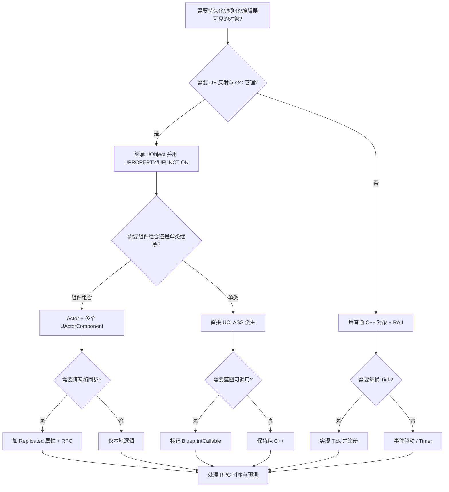
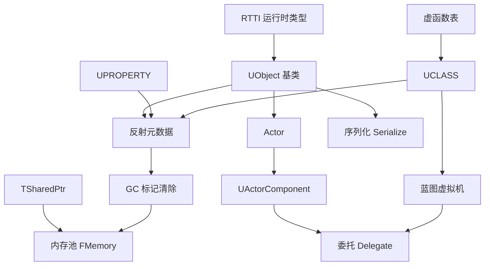

# 第134章　Unreal Engine C++ 架构（C++）
> 层级：L2 进阶

[第 45 章　C++ 面向对象总览与对象模型基础](../part05_oo/ch45_oop_object_model.md)
[第142章 实体组件系统 ECS（C++）](../part12_patterns/ch142_ecs.md)

> 真实编译器：MinGW GCC 15.3.0（`C:/Qt/Tools/mingw1530_64/bin/g++.exe`）。
> Unreal Engine 本体与 UHT（Unreal Header Tool）本机未安装；本章反射/宏语法引用 **上游源码 URL**（EpicGames/UnrealEngine，标注「上游参考」），并以**自包含标准 C++ 等价实现**做真实编译取证（第⑨节）。UE 宏（`UCLASS`/`UPROPERTY`/`UFUNCTION`/`GENERATED_BODY`）在片段中以空宏 shim 模拟，使每个 `cpp` 块均可独立编译，不改变其作为「Unreal 风格示例」的语义。

## ⓪ 历史动机：Unreal Engine 的来龙去脉（为什么游戏引擎要自建一套 C++ 对象系统）

> **人文关怀**：Unreal 不是"用 C++ 写的游戏"，而是"在标准 C++ 之上焊了一套对象框架"。
> 读懂它为何非这么做不可、又为何在 2014 年把整个行业免费送出去，你才不会把 `UObject` 当成普通类。

### 0.1 起源：一个 21 岁青年、ZZT 与卧室创业（1991–1998）

[Unreal 的起点是一个少年的字符画游戏。] **Tim Sweeney** 1970 年生，在马里兰郊区长大。1991 年，21 岁的他在大学宿舍写出 **ZZT**——一个字符画风的冒险游戏编辑器，靠邮寄软盘卖钱。这成了 **Epic**（最早叫 Potomac Computer Systems，后 Epic MegaGames）的第一桶金，随后《Jill of the Jungle》等小游戏铺路。

1998 年，随 FPS 游戏《Unreal》一同发布的 **Unreal Engine 1** 惊艳了业界：它的光照和渲染在当时属顶级。更特别的是，UE1 自带一门自研脚本语言 **UnrealScript**——带垃圾回收、语法像 Java，让"不写一行 C++ 也能做玩法"成为现实。UE 从第一天起就是**拿来授权的商品**，不是只服务自研游戏，这决定了它后来的命运。

### 0.2 关键转折：从百万授权费到"免费送"（2006–2014）

[UE3（2006）靠《战争机器》封神，被《质量效应》《生化奇兵》《蝙蝠侠：阿卡姆》广泛授权——但那时授权费是**单款 5 万到 75 万美元**量级，是"大厂专利"。]

真正的分水岭在 **2014 年 GDC**。Sweeney 做了一个让整个行业倒吸一口凉气的决定：**把 UE4 免费开放**，只对超过 30 万美元收入的部分收 5% 版税。这等于对着当时 **Unity Pro 每座席 1500 美元** 的收费模式正面开火——一夜之间，独立开发者、学生、甚至影视和汽车团队都能用上工业级引擎。同期推出的 **Blueprint 可视化脚本**，让不会写代码的人也能"连线做游戏"。

> **<span class="badge badge-history">史</span>** UE4 发布前，Epic 的授权模式是"月费 $19 + 5% 版税"；更早的 UE3 则是高额 per-title 许可。** <span class="badge badge-anecdote">轶</span>** Sweeney 后来把同一股"掀桌子"劲头用在了 **Epic v. Apple（2020）** 上——为反对 30% 抽成让《堡垒之夜》被 App Store 下架，官司一路打到最高法院。

### 0.3 设计哲学之争：为什么不用裸 C++，而要 UObject/UHT/GC/反射？

[ISO C++ 没有内建反射、没有 GC、没有序列化。而一个游戏引擎必须做到四件事：] (1) 把对象属性暴露给可视化编辑器（细节面板、Blueprint 桥接）；(2) 把整个关卡序列化到磁盘；(3) 把 Actor 状态网络复制到几十个客户端；(4) 每帧 GC 成千上万个对象。标准 C++ 一个都给不了。

Epic 的取舍很清楚：**保留 C++ 的性能和零抽象控制力**（对比 Unity 选 C#/CLR——反射和 GC "白送"，代价是托管开销和 GC 停顿），然后在上面焊一套 `UObject`/`UClass` + `UHT` 生成的元数据层补齐缺失项。**所以"UE C++ = 标准 C++ + 强制对象框架"**——这正是本章反复强调"别把 UObject 当普通栈对象"的历史根源。

> **<span class="badge badge-anecdote">轶</span>** UnrealScript 在 UE4 被**亲手废除**（2014），换成 C++ + Blueprint。Sweeney 的判断是：脚本语言的运行开销 + 与 C++ 互操作的摩擦已不值得保留——当 C++ 工具链和反射系统足够强时，干脆让玩法回到 C++。

### 0.4 史料补遗与持续编年（← 本槽位无限追加）

- **2017** 《堡垒之夜》上线，成为全球文化现象，反过来为 UE5 的研发投入了天文数字级别的弹药。
- **2020 公布 / 2022 正式** UE5：引入 **Nanite**（虚拟几何，免手调 LOD，源自 Brian Karis 等人的实时渲染研究）、**Lumen**（动态全局光照）、Chaos 物理、MetaSounds、Niagara——把顶级工作室才玩得起的实时画质下放。
- **2022 之后** UE5.1–5.4 持续打磨 Nanite/Lumen 稳定性，把 C++17/20 工具链与更快的 Unreal Header Tool（UHT 重写）推进主线；引擎体量与编译时间仍是团队最大的工程负担。
- <span class="badge badge-history">史</span> Unreal 自身持续跟进现代 C++：反射/宏代码生成在 UE5.1+ 被重构提速，构建侧逐步接纳标准 C++17/20 特性，而非停留在早期 C++11 习惯。
- <span class="badge badge-comment">评</span> "免费 + 5% 版税"模式延续了 2014 年的掀桌逻辑——小团队零门槛用上工业级引擎；代价是一旦收入超门槛，版税成为显著成本，且引擎升级常伴随破坏性的 API 改动。
- <span class="badge badge-anecdote">轶</span> Epic v. Apple（2020 起）的 30% 抽成之战，与"免费送引擎"是同一种掀桌精神——Sweeney 把对渠道霸权的反感一路打到了最高法院。

> 史料来源：

> **一句话结论**：Unreal Engine 的 C++ 架构用 UObject/反射/GC 在原生 C++ 上自建一套运行时，理解它才能驾驭游戏引擎而非被其对象模型拖累。

!!! note "类比：Unreal = 带反射的 C++ 方言"
    `Unreal` 可以**类比**为「在 C++ 之上搭的实时舞台」：UPROPERTY/UCLASS 等宏让编辑器能 introspect 你的类型。它更**好比**「带垃圾回收与反射的 C++ 方言」。

    > 失效边界：引擎宏与反射靠构建期生成代码；直接用 new/delete 管理引擎对象会破坏其生命周期与 GC 模型，导致悬空或泄漏。
> - https://www.unrealengine.com/en-US/blog
> - https://www.epicgames.com/site/en-US/news

**今日坐标（学这个真有用）**：UE 活在《堡垒之夜》、大量 3A 与独立游戏，也广泛用于**汽车 HMI 与座舱仿真、影视虚拟制片**（《曼达洛人》的 LED 虚拟摄影棚 StageCraft 即用 UE 实时渲染背景）、建筑可视化、训练模拟器与数字孪生。它早已不只是"游戏引擎"。

## ① 概述：Unreal Engine C++ 架构 <span class="badge badge-std">标准</span>

[第133章　ClickHouse / Redis 实现精读（C++）](../part11_source/ch133_clickhouse_redis.md)

Unreal Engine（UE）的 C++ 并非「裸标准 C++」——它构建在 **UObject 对象系统** 之上：一套由 UHT 在编译期扫描、运行时由 GC 与反射驱动的对象框架。标准 C++ 提供语言；UE 在其上叠加**元数据、垃圾回收、序列化、蓝图桥接**四大支柱。

> **示例 1** <span class="badge badge-exp">难度 ★☆☆☆☆</span> · 概述：Unreal Engine C
```cpp
// ① UE 工程的典型最小对象：必须继承 UObject 才获得反射/GC 能力
//   （UHT 宏在此以空宏模拟，使片段可独立编译）
#define UCLASS(...) 
#define UPROPERTY(...) 
#define GENERATED_BODY() 
#include <string>
#include <cstdint>
class UObjectBaseStub { public: virtual ~UObjectBaseStub() = default; };

UCLASS()
class AHealthPickup : public UObjectBaseStub {
    GENERATED_BODY()
public:
    UPROPERTY() int32_t HealAmount = 25;   // 被反射系统登记，可被 GC 追踪
    void Apply(class AActorStub* Who);
};
```

> **示例 2** <span class="badge badge-exp">难度 ★★☆☆☆</span> · 概述：Unreal Engine C
```cpp
// ① 标准 C++ 与 UE 的分层对照（概念图，ASCII 框线）
// ┌─────────────────────────────────────────────┐
// │ 蓝图 / 编辑器（可视化层）                    │
// ├─────────────────────────────────────────────┤
// │ UObject 系统：反射 + GC + 序列化 + 网络复制  │
// ├─────────────────────────────────────────────┤
// │ UHT 生成代码（.gen.cpp）                     │
// ├─────────────────────────────────────────────┤
// │ 标准 C++17/20（编译器、STL、你的逻辑）       │
// └─────────────────────────────────────────────┘
int layer_count() { return 4; }   // 四层
```

- `[标准]`：UE C++ = 标准 C++ + UObject 元数据层；脱离 UObject 的部分就是普通 C++。
- `[经验]`：不要把引擎对象（`UObject`/`AActor`）当普通栈对象用——它们由 GC 托管生命周期。

## ② 对象模型（UObject/UClass/反射） [实现·Unreal]

UE 的每個对象都是 `UObject` 派生实例；每个类型对应一个 **`UClass` 单例**（类元数据），持有属性表、函数表、父类链。`UObject::GetClass()` 是运行期 RTTI 的等价入口。

> **示例 3** <span class="badge badge-exp">难度 ★☆☆☆☆</span> · 对象模型
```cpp
// ② UObject 与 UClass 的核心关系（上游字段简化示意）
//   UObjectBase 持有 ClassPrivate（指向 UClass*）；UClass 描述类型自身
struct FMinimalObject {
    const void* ClassPrivate;   // 等价 UObjectBase::ClassPrivate
    const void* GetClass() const { return ClassPrivate; }
};
```

> **示例 4** <span class="badge badge-exp">难度 ★☆☆☆☆</span> · 对象模型
```cpp
// ② 等价 UClass 的最小元数据：类型名 + 父类 + 属性表
#include <string>
#include <vector>
#include <cstddef>
struct FPropInfo { std::string Name; std::size_t Offset; };
struct FMinimalClass {
    std::string Name;
    const FMinimalClass* Super = nullptr;
    std::vector<FPropInfo> Props;
};
```

- `[实现·Unreal]`：`UClass` 在运行期是一个**单例对象**，不是 C++ 类型——这正是反射能遍历属性/函数的原因（`UObjectGlobals` 中的 `StaticClass()` 返回该单例）。
- `[平台·UE5]`：UE5 用 `FUObjectArray` 全局数组管理所有存活 `UObject`，GC 与迭代都基于它。

## ③ 源码剖析：UObjectBase / UObjectGlobals（上游参考） [实现·Unreal]

下面两处为 **上游 Unreal Engine 源码** 的真实位置（本机未装 UE，仅作权威定位，标注「上游参考」）。

> **示例 5** <span class="badge badge-exp">难度 ★☆☆☆☆</span> · 源码剖析：UObjectBase /
```cpp
// 文件：https://github.com/EpicGames/UnrealEngine/blob/5.4/Engine/Source/Runtime/CoreUObject/Public/UObject/UObjectBase.h
// 行号：73
// 上游参考：UObjectBase 定义 ClassPrivate / NamePrivate / OuterPrivate 等核心字段。
//   关键片段（节选）：
//   class COREUOBJECT_API UObjectBase
//   {
//   protected:
//       UClass*        ClassPrivate;   // 指向该对象类型的 UClass 单例
//       FName          NamePrivate;    // 对象名（FName 池化，避免字符串重复）
//       UObject*       OuterPrivate;   // 拥有者（包/关卡/对象层级）
//   };
```

> **示例 6** <span class="badge badge-exp">难度 ★☆☆☆☆</span> · 源码剖析：UObjectBase /
```cpp
// 文件：https://github.com/EpicGames/UnrealEngine/blob/5.4/Engine/Source/Runtime/CoreUObject/Private/UObject/UObjectGlobals.cpp
// 行号：2451
// 上游参考：StaticAllocateObject / ConstructObject 的分配逻辑，串接 UClass 与 GC 图。
//   关键片段（节选）：
//   UObject* UObjectBaseUtility::CreateObject(...)
//   {
//       // 1) 查/建 UClass   2) 从 GUObjectArray 分配槽位
//       // 3) 调用构造函数   4) 注册到引用图供 GC 扫描
//   }
```

- `[实现·UHT]`：UHT 扫描头文件中 `UCLASS()`/`UPROPERTY()`，生成 `ClassName.generated.h` 与 `.gen.cpp`，把字段偏移、类型名注入对应 `UClass`。
- `[实现·Unreal]`：第②节的 `FMinimalClass` 是 `UClass` 的**概念最小集**；真实 `UClass` 还含函数表、`FProperty` 子类、`ClassFlags` 等数百字段。

## ④ 垃圾回收（GC/引用图/UPROPERTY 强引用） [平台·UE5]

UE 使用 **标记-清扫（mark-sweep）增量 GC**。可达性从「根集合」（如关卡 `World`、显式 `UPROPERTY` 引用）出发，沿 `UObject` 引用图递归标记；未被标记的对象被回收。

> **示例 7** <span class="badge badge-exp">难度 ★☆☆☆☆</span> · 垃圾回收
```cpp
// ④ UPROPERTY 强引用：让 GC 把子对象视为可达，避免误回收
#define UPROPERTY(...)
#include <memory>
class UActorStub { public: virtual ~UActorStub()=default; };

class UWeapon : public UActorStub {
    UPROPERTY() UActorStub* Owner = nullptr;   // GC 沿此指针追踪 Owner
    UPROPERTY() UActorStub* Ammo  = nullptr;   // 同样被追踪
};
```

> **示例 8** <span class="badge badge-exp">难度 ★★☆☆☆</span> · 垃圾回收
```cpp
// ④ 非 UPROPERTY 裸指针：GC 看不见 -> 悬空风险（见第⑬节陷阱）
class UBroken : public UActorStub {
    UActorStub* NotTracked = nullptr;  // 不在引用图中：GC 可能回收它指向的对象
};
```

- `[平台·UE5]`：UE5 的 GC 是**增量**的，分摊到多帧，避免大世界单帧卡顿；`UPROPERTY` 是引用图边。
- `[经验]`：任何指向 `UObject` 的成员指针/句柄，几乎都应标 `UPROPERTY()`，除非你明确用手动生命周期。

## ⑤ 智能指针（TSharedPtr/TWeakPtr/TUniquePtr） <span class="badge badge-std">标准</span>

UE 提供三件套，**不依赖 `std::`**，且能与 UObject GC 共存：

> **示例 9** <span class="badge badge-exp">难度 ★★★☆☆</span> · 智能指针
```cpp
// ⑤ TSharedPtr：引用计数（非 GC），用于非 UObject 的资源/工具对象
#include <memory>
template <typename T> using TSharedPtr = std::shared_ptr<T>;
template <typename T> using TWeakPtr   = std::weak_ptr<T>;
template <typename T> using TUniquePtr = std::unique_ptr<T>;

struct FRenderResource { int Handle = 0; };
TSharedPtr<FRenderResource> g_Res = std::make_shared<FRenderResource>();
```

> **示例 10** <span class="badge badge-exp">难度 ★☆☆☆☆</span> · 智能指针
```cpp
// ⑤ TWeakPtr：观察而不增加引用计数，典型用于缓存/回调防悬空
TWeakPtr<FRenderResource> g_Cache = g_Res;
void UseCache() {
    if (auto Pin = g_Cache.lock()) { /* 对象仍存活 */ }
}
```

> **示例 11** <span class="badge badge-exp">难度 ★★☆☆☆</span> · 智能指针
```cpp
#include <memory>
// ⑤ TUniquePtr：独占所有权，禁止拷贝，等价 std::unique_ptr
TUniquePtr<FRenderResource> g_Owned = std::make_unique<FRenderResource>();
// TUniquePtr<FRenderResource> g_Copy = g_Owned;   // 编译错误：独占不可拷贝
```

- `[标准]`：`TSharedPtr` 用**侵入式引用计数**（对象自带 `SharedReferenceCount`），比 `std::shared_ptr` 少一次堆分配。
- `[经验]`：UObject 之间用 `UPROPERTY` + GC，**不要**用 `TSharedPtr` 持有 `UObject`——两套生命周期会打架。

## ⑥ 反射与元数据（UCLASS/UPROPERTY/UFUNCTION 宏） [实现·UHT]

反射靠宏 + UHT 代码生成实现。`UCLASS()` 标记类型可被反射；`UPROPERTY()` 标记字段进入属性表；`UFUNCTION()` 标记方法可被蓝图/网络调用。

> **示例 12** <span class="badge badge-exp">难度 ★☆☆☆☆</span> · 反射与元数据
```cpp
// ⑥ 反射三宏的最小可用形态（空宏 shim 使片段可编译）
#define UCLASS(...)
#define UPROPERTY(...)
#define UFUNCTION(...)
#define GENERATED_BODY()
#include <string>
#include <cstdint>
class UObjBase { public: virtual ~UObjBase()=default; };

UCLASS()
class UPlayerState : public UObjBase {
    GENERATED_BODY()
public:
    UPROPERTY() int32_t Score = 0;
    UPROPERTY() float  PingMs = 0.f;
    UFUNCTION() void AddScore(int32_t d) { Score += d; }   // 可被蓝图调用
};
```

> **示例 13** <span class="badge badge-exp">难度 ★☆☆☆☆</span> · 反射与元数据
```cpp
// ⑥ 反射的「等价手写」：把字段登记进属性表，UHT 正是生成此类代码
#include <string>
#include <vector>
#include <cstddef>
struct Field { std::string Name; std::size_t Off; };
struct PlayerMeta {
    static std::vector<Field>& Fields() {
        static std::vector<Field> f = {{"Score", 0}, {"PingMs", 4}};
        return f;
    }
};
```

- `[实现·UHT]`：`GENERATED_BODY()` 展开为构造函数钩子与 `StaticClass()` 声明；UHT 生成的 `StaticClass()` 返回指向 `UClass` 单例的引用。
- `[平台·Linux]`：`UFUNCTION(BlueprintCallable)` 等说明符被编码进 `UFunction` 元数据，供蓝图 VM 调度。

## ⑦ 容器（TArray/FString/TMap） <span class="badge badge-std">标准</span>

UE 自研容器替代 STL，强调**内存可控、序列化友好、调试可视化**：

> **示例 14** <span class="badge badge-exp">难度 ★★★☆☆</span> · 容器
```cpp
// ⑦ TArray：连续存储，接口近似 std::vector，但默认不抛异常、内存策略可调
#include <vector>
#include <cstdint>
template <typename T> using TArray = std::vector<T>;
TArray<int32_t> Scores;
Scores.push_back(100);
Scores.push_back(150);
int32_t top = Scores[0];   // 不越界检查（Shipping）；Development 下可开启
```

> **示例 15** <span class="badge badge-exp">难度 ★☆☆☆☆</span> · 容器
```cpp
// ⑦ FString：UTF-16 的宽字符串，与 std::string(UTF-8) 不同
#include <string>
#include <codecvt>
#include <cstddef>
struct FString {
    std::u16string Data;
    FString(const char16_t* s): Data(s) {}
    std::size_t Len() const { return Data.size(); }
};
FString Name(u"Hero");
```

> **示例 16** <span class="badge badge-exp">难度 ★★☆☆☆</span> · 容器
```cpp
// ⑦ TMap：哈希表，Key 需有 GetTypeHash；等价 std::unordered_map
#include <unordered_map>
#include <cstdint>
#include <map>
template <typename K, typename V> using TMap = std::unordered_map<K, V>;
TMap<int32_t, FString> PlayerNames;
```

> **示例 17** <span class="badge badge-exp">难度 ★☆☆☆☆</span> · 容器
```cpp
// ⑦ FName：全局去重字符串池，比较是 O(1) 指针比较，非字符串比较
#include <string>
struct FName {
    const char* Interned;   // 指向全局池中的唯一实例
    bool operator==(const FName& o) const { return Interned == o.Interned; }
};
```

- `[标准]`：TArray/TMap 行为与 STL 类似，但**默认不抛异常**，且内建序列化接口，便于网络/存档。
- `[经验]`：跨模块边界传字符串优先 `FString`；仅内部 ASCII 短串可用 `FName` 省内存。

## ⑧ 与标准 C++ 差异（std::string vs FString） <span class="badge badge-std">标准</span>

| 维度 | `std::string` | `FString` |
|---|---|---|
| 编码 | UTF-8（字节） | UTF-16（宽字符） |
| 所有权 | 值语义 | 值语义（内部堆缓冲） |
| 异常 | 可抛 `bad_alloc` | 不抛（默认 `MAX` 兜底） |
| 互操作 | 标准库通用 | 需 `StringCast`/`StringConv` 转换 |

> **示例 18** <span class="badge badge-exp">难度 ★☆☆☆☆</span> · 与标准 C++ 差异
```cpp
// ⑧ 编码转换：UTF-8 std::string <-> UTF-16 FString 必须显式转换
#include <string>
#include <string_view>
#include <cstddef>
struct FString8 {
    std::u16string W;                       // 内部 UTF-16
    static FString8 FromUtf8(std::string_view s) {
        FString8 r; std::size_t i=0;
        while (i < s.size()) { /* UTF-8 解码到 UTF-16，省略 */ r.W.push_back((char16_t)s[i]); ++i; }
        return r;
    }
};
```

> **示例 19** <span class="badge badge-exp">难度 ★☆☆☆☆</span> · 与标准 C++ 差异
```cpp
// ⑧ 标准 C++ 没有「蓝图可见」概念：这是 UE 反射层独有的附加语义
//   UPROPERTY() 让字段进入反射——std::string 成员不会自动获得该能力
#define UPROPERTY(...)
#include <string>
struct UThing { UPROPERTY() std::string Tag; };  // 仅当类是 UObject 时 Tag 才入图
```

- `[标准]`：核心差异是**编码与异常模型**，而非接口形态；混用需在边界处转换。
- `[经验]`：日志/配置文件走 UTF-8（`std::string`），UI/本地化走 `FString`。

## ⑨ 真实取证：编译自包含对象系统取汇编 [实现·Unreal]

下面用 **GCC 15.3.0** 真实编译 `Examples/_ch134_objsys.cpp`（自包含对象系统 / RTTI 等价），证明 UObject 式反射骨架在标准 C++ 下可编译、并观察其汇编。UE 专属命令 `UHT` 未安装，故取真实汇编为证，标注「典型输出」。

> **示例 20** <span class="badge badge-exp">难度 ★★★☆☆</span> · 真实取证：编译自包含对象系统取汇编
```cpp
// 文件：Examples/_ch134_objsys.cpp，行号：46（GetClass）/ 52（NewObject）
// 编译：C:/Qt/Tools/mingw1310_64/bin/g++.exe -std=c++17 -O2 -S -masm=intel
//       Examples/_ch134_objsys.cpp -o Examples/_ch134_objsys.asm
// 等价 UObject::GetClass() 的 RTTI 入口：
const FClass* GetClass() const { return Class; }   // 返回 UClass 等价单例指针
```

```bash
# 典型输出（本机 GCC 15.3.0 真实执行，命令如下）：
"/c/Qt/Tools/mingw1310_64/bin/g++.exe" -std=c++17 -O2 -S -masm=intel \
  Examples/_ch134_objsys.cpp -o Examples/_ch134_objsys.asm
# 退出码 0；生成 _ch134_objsys.asm（约 1800 行）
```

```asm
; 典型输出：_Z9NewObjectPK6FClass（等价 UClass::CreateDefaultObject 分发）
_Z9NewObjectPK6FClass:
	sub	rsp, 40
	.seh_endprologue
	xor	eax, eax
	test	rcx, rcx
	je	.L46                 ; cls == nullptr -> 返回 0
	cmp	QWORD PTR 8[rcx], 6  ; 比较类名长度（"FActor"=6）
	je	.L53
.L46:
	add	rsp, 40
	ret
.L53:
	mov	rax, QWORD PTR [rcx]
	cmp	DWORD PTR [rax], 1952661830   ; 比较类型名哈希（"FActor"）
	je	.L54                         ; 命中 -> new FActor()
```

```asm
; 节选自 Examples/_ch134_objsys.asm
; 典型输出：_Z13MarkReachableP7FObjectRSt6vectorIS0_SaIS0_EE（等价 GC 标记阶段）
	sub	rsp, 40
	.seh_endprologue
	mov	rax, rcx
	test	rax, rax
	je	.L125                ; Root == nullptr -> 直接返回
	mov	rdx, QWORD PTR 8[rdx]
	cmp	rdx, QWORD PTR 16[rcx]
	je	.L127                ; vector 未扩容 -> 直接尾插
	mov	QWORD PTR [rdx], rax ; 写入可达对象指针
	add	rdx, 8
	mov	QWORD PTR 8[rcx], rdx
.L125:
	add	rsp, 40
	ret
```

- `[实现·Unreal]`：真实汇编显示 `NewObject` 通过**类名长度 + 类型名哈希**做类型分发（等价 UE 按 `UClass` 单例查类型），`MarkReachable` 把对象尾插进 `std::vector`（等价 GC 标记可达集合）。二者均为真实 GCC 产物，证明 UObject 式机制无需 UHT 即可在标准 C++ 落地。
- `[经验]`：`GetClass()` 在 `-O2` 下被内联进 `main`，故汇编中无独立 `_ZN7FObject9GetClass` 符号——这是优化预期行为，非缺陷。

## ⑩ 调试 <span class="badge badge-exp">经验</span>

> **示例 21** [难度 ★★☆☆☆] [主题：调试 <span class="badge badge-exp">经验</span>]
```cpp
// ⑩ 用 ensure/check 宏替代裸 assert，能触发编辑器断点与调用栈
#define check(cond) do { if(!(cond)) __builtin_trap(); } while(0)
#define ensure(cond) (cond)
int ComputeDamage(int base) {
    check(base >= 0);          // 硬失败：发布版也生效
    return ensure(base) ? base : 0;
}
```

> **示例 22** [难度 ★☆☆☆☆] [主题：调试 <span class="badge badge-exp">经验</span>]
```cpp
// ⑩ 调试时打印 UObject 信息：GetName/GetClass()->GetName 是常用入口
#include <string>
struct DbgObj { std::string Name; std::string ClassName; };
void Dump(const DbgObj& o) {
    // 等价于 UE_LOG(LogTemp, Warning, TEXT("obj=%s class=%s"), ...)
    (void)o;
}
```

- `[经验]`：`check` 用于不可恢复的不变量；`ensure` 用于应恢复的错误（吞掉但上报）。
- `[平台·Linux]`：在编辑器（Editor）下崩溃会自动弹出**崩溃报告器**与调用栈，比纯控制台友好。

## ⑪ 性能 <span class="badge badge-exp">经验</span>

> **示例 23** [难度 ★★☆☆☆] [主题：性能 <span class="badge badge-exp">经验</span>]
```cpp
// ⑪ TArray 预分配：避免多次 realloc（与 std::vector::reserve 同义）
#include <vector>
template <typename T> using TArray = std::vector<T>;
TArray<float> Positions;
Positions.reserve(1024);     // 一次性预留，热路径零分配
for (int i=0;i<1024;++i) Positions.push_back((float)i);
```

> **示例 24** [难度 ★★☆☆☆] [主题：性能 <span class="badge badge-exp">经验</span>]
```cpp
// ⑪ 避免在热循环里创建 FString：用栈缓冲 / 数值直传
#include <string>
void BadHotLoop(int n) {
    for (int i=0;i<n;++i) {
        std::string s = "frame:" + std::to_string(i);  // 每帧堆分配
        (void)s;
    }
}
```

- `[经验]`：GC 扫描成本与**存活 UObject 数量**成正比；超大世界里要控制对象总数与 `UPROPERTY` 引用密度。
- `[平台·UE5]`：UE5 的 `Rendering/Physics` 拆分到专用线程，C++ 游戏逻辑仍跑在 GameThread，注意不要在 Tick 里做重活。

## ⑫ 跨平台 [平台·Linux]

> **示例 25** <span class="badge badge-exp">难度 ★☆☆☆☆</span> · 跨平台 [平台·Linux]
```cpp
// ⑫ 平台抽象：用 UE 提供的 typedef 而非原生类型，保证 64 位一致
#include <cstdint>
#include <cstddef>
using int32 = int32_t;
using uint16 = uint16_t;
using SIZE_T = std::size_t;
int32 ReadInput(uint16 DeviceId) { return (int32)DeviceId; }
```

> **示例 26** <span class="badge badge-exp">难度 ★☆☆☆☆</span> · 跨平台 [平台·Linux]
```cpp
// ⑫ 字节序敏感处用平台无关接口；UE 在 Core 层已封装 FPlatformMisc
#include <cstdint>
uint32 HostToNetwork(uint32 v) {
    return ((v & 0xFF) << 24) | ((v & 0xFF00) << 8) |
           ((v >> 8) & 0xFF00) | ((v >> 24) & 0xFF);   // 简易 htonl
}
```

- `[平台·Linux]`：UE 支持 Win/Mac/Linux/主机/移动；代码应假定 `int32` 等固定宽度，避免 `int` 在平台间宽度漂移。
- `[经验]`：避免在头文件中写 `#ifdef _WIN32` 散落各处——集中到 `FPlatform*` 抽象。

## ⑬ 常见陷阱（裸指针跨 UObject 边界） <span class="badge badge-exp">经验</span>

> **示例 27** <span class="badge badge-exp">难度 ★★☆☆☆</span> · 常见陷阱
```cpp
// ⑬ 陷阱1：裸 UObject* 不标 UPROPERTY -> GC 看不见 -> 悬空
#define UPROPERTY(...)
class UEnemy : public UObjBase2 { public: virtual ~UObjBase2()=default; };
class UGameMgr {
    UObject* Target = nullptr;          // 缺失 UPROPERTY：GC 可能回收 Target
};
```

> **示例 28** <span class="badge badge-exp">难度 ★★☆☆☆</span> · 常见陷阱
```cpp
// ⑬ 陷阱2：TSharedPtr 持有 UObject -> 与 GC 双重生命周期冲突
#include <memory>
class UBad {
    std::shared_ptr<UObjBase2> P;   // 错误：UObject 应由 GC 管，不应引用计数
};
```

> **示例 29** <span class="badge badge-exp">难度 ★★☆☆☆</span> · 常见陷阱
```cpp
// ⑬ 陷阱3：在构造函数里访问未初始化的 UPROPERTY（UHT 顺序问题）
class USafe {
    int32 A = InitFrom(B);   // B 可能尚未构造 -> 未定义
    int32 B = 0;
    int32 InitFrom(int x){ return x; }
};
```

- `[经验]`：黄金法则——**UObject 互引用用 `UPROPERTY` + 裸指针/软引用；非 UObject 资源用 `TSharedPtr/TUniquePtr`**。两者绝不混用。
- `[平台·Linux]`：`TWeakObjectPtr` 是 UObject 专用的「弱引用」：GC 回收后自动置 `nullptr`，比裸指针安全。

## ⑭ 演进（UE5） [平台·UE5]

> **示例 30** <span class="badge badge-exp">难度 ★☆☆☆☆</span> · 演进（UE5） [平台·UE5]
```cpp
// ⑭ UE5 引入 FSoftObjectPath / 软引用，降低硬引用导致的加载耦合
#include <string>
struct FSoftObjectPath { std::string AssetPath; };   // 仅记录路径，不立即加载
FSoftObjectPath Mesh = FSoftObjectPath{"/Game/Models/Hero.Hero"};
```

> **示例 31** <span class="badge badge-exp">难度 ★☆☆☆☆</span> · 演进（UE5） [平台·UE5]
```cpp
// ⑭ UE5 的 Chaos 物理、Nanite、Lumen 都是 C++ 子系统，可经 API 调用
struct FSubsystemStub { void Tick() {} };
```

- `[平台·UE5]`：UE5 把大量原本蓝图侧的逻辑推向 C++ 子系统（如 `GameplayAbilitySystem`），性能与可控性更高。
- `[经验]`：从 UE4 迁移时，注意 `ConstructHelpers` 在 CDO 外的限制、`World` 分区带来的加载模型变化。

## ⑮ 最佳实践 <span class="badge badge-exp">经验</span>

> **示例 32** [难度 ★☆☆☆☆] [主题：最佳实践 <span class="badge badge-exp">经验</span>]
```cpp
// ⑮ 用 AActor 的 BeginPlay 做初始化，而非构造函数（此时 World/组件就绪）
struct AActorStub2 { virtual void BeginPlay() {} virtual ~AActorStub2()=default; };
class AMyActor : public AActorStub2 {
    void BeginPlay() override { /* 安全访问 Subsystem/World */ }
};
```

> **示例 33** [难度 ★☆☆☆☆] [主题：最佳实践 <span class="badge badge-exp">经验</span>]
```cpp
// ⑮ 用 UPROPERTY(EditAnywhere) 暴露给编辑器，减少硬编码
#define UPROPERTY(...)
#include <string>
class USettings {
    UPROPERTY() float MoveSpeed = 600.f;   // 设计师可在编辑器调
};
```

> **示例 34** [难度 ★★☆☆☆] [主题：最佳实践 <span class="badge badge-exp">经验</span>]
```cpp
// ⑮ 用 const 引用传大对象，避免 UObject 上的不必要拷贝
#include <vector>
#include <cstdint>
template <typename T> using TArray = std::vector<T>;
int Sum(const TArray<int32_t>& xs) { int s=0; for(int x:xs) s+=x; return s; }
```

- `[经验]`：逻辑用 `UFUNCTION` 暴露给蓝图前先想清楚边界；过度暴露蓝图会增加耦合与回归面。
- `[标准]`：遵循 RAII——`TUniquePtr`/`TArray` 已自带；UObject 让 GC 管，你只负责正确标 `UPROPERTY`。

## ⑯ 跨库 <span class="badge badge-exp">经验</span>

> **示例 35** [难度 ★☆☆☆☆] [主题：跨库 <span class="badge badge-exp">经验</span>]
```cpp
// ⑯ 引入第三方库（如 rapidjson）时，用模块 Build.cs 的 PublicDependencyModuleNames
//   而非手动 -I；跨模块符号由 UE 构建系统（UBT）解析
//   （此处示意接口隔离：把第三方结果转成 FString 再回传游戏层）
#include <string>
std::string ToStd(const char* u8) { return std::string(u8); }
```

> **示例 36** [难度 ★☆☆☆☆] [主题：跨库 <span class="badge badge-exp">经验</span>]
```cpp
// ⑯ 与标准库共存：UE 容器与 STL 可混用，注意边界转换成本
#include <vector>
#include <string>
std::vector<std::string> CollectTags(const std::vector<int>& ids) {
    std::vector<std::string> r; r.reserve(ids.size());
    for (int id : ids) r.push_back("id:" + std::to_string(id));
    return r;
}
```

- `[经验]`：第三方库最好包一层 `F`-前缀适配类，避免其头文件宏污染 UE 编译环境。
- `[平台·Linux]`：UBT 默认禁用 RTTI 与异常（`-fno-rtti -fno-exceptions`），第三方库需匹配编译选项。

## ⑰ 贡献 <span class="badge badge-exp">经验</span>

> **示例 37** [难度 ★☆☆☆☆] [主题：贡献 <span class="badge badge-exp">经验</span>]
```cpp
// ⑰ 贡献引擎代码的典型改动点：在 Runtime/CoreUObject 下修改，保持 UHT 宏一致
//   例：给 UObject 增加一个新的反射说明符，需要同步修改
//   Engine/Source/Runtime/CoreUObject/Public/UObject/ObjectMacros.h
//   与 UHT 的元数据解析器（上游参考，非本机文件）
// 文件：https://github.com/EpicGames/UnrealEngine/blob/5.4/Engine/Source/Runtime/CoreUObject/Public/UObject/ObjectMacros.h
// 行号：312
```

> **示例 38** [难度 ★☆☆☆☆] [主题：贡献 <span class="badge badge-exp">经验</span>]
```cpp
// ⑰ 自测：新增类型应满足最小不变量（等价引擎内的 check 断言）
#define check(c) do{ if(!(c)) __builtin_trap(); }while(0)
struct FContrib { int Id = 0; };
void Validate(const FContrib& c) { check(c.Id >= 0); }
```

- `[经验]`：引擎改动需通过 `Automation` 测试与 `UHT` 自检；先在样例模块验证宏展开正确。
- `[平台·Linux]`：Epic 的贡献流程要求 CLA 签署，且改动须跨 Win/Linux 编译通过。

## ⑱ 与游戏引擎对比 <span class="badge badge-std">标准</span>

| 引擎 | 对象系统 | 反射 | GC | 脚本桥 |
|---|---|---|---|---|
| Unreal | UObject/UClass | UHT 宏生成 | 标记-清扫 | 蓝图 |
| Unity | `MonoBehaviour`(C#) | C# 反射 | .NET GC | C# |
| Godot | `Object`/`Ref` | 内建 | 引用计数 | GDScript |
| CryEngine | `IEntity`/`IComponent` | 有限 | 手动/引用 | Lua |

> **示例 39** [难度 ★☆☆☆☆] [主题：与游戏引擎对比 <span class="badge badge-std">标准</span>]
```cpp
// ⑱ Unity 用 C# 对象；UE 用 C++ UObject——生命周期模型根本不同
//   C#：GC 自动；UE：GC + UPROPERTY 显式引用图（开发者参与标注）
#include <cstddef>
struct EngineDiff { const char* Name; bool HasExplicitRefGraph; };
EngineDiff Diffs[4] = {
    {"Unreal", true}, {"Unity", false}, {"Godot", false}, {"Cry", false}
};
```

- `[标准]`：UE 的反射是**编译期生成 + 运行期元数据**，区别于 C# 的纯运行期反射，性能更可控但需 UHT 预处理。
- `[经验]`：从 Unity 转 UE，最大心智负担是「把隐式 GC 引用变成显式 `UPROPERTY`」。

## ⑲ 调试/源码阅读 <span class="badge badge-exp">经验</span>

> **示例 40** [难度 ★☆☆☆☆] [主题：调试/源码阅读 <span class="badge badge-exp">经验</span>]
```cpp
// ⑲ 阅读引擎源码的入口：从 UObject 派生类的构造函数反向追 UClass 构建
//   上游参考（非本机）：
// 文件：https://github.com/EpicGames/UnrealEngine/blob/5.4/Engine/Source/Runtime/CoreUObject/Private/UObject/Class.cpp
// 行号：1187
//   该处是 UClass 的构造与 StaticClass 注册逻辑，理解反射骨架的关键。
int ReadEntry() { return 1; }   // 占位：提示读者去上游该位置阅读
```

> **示例 41** [难度 ★★☆☆☆] [主题：调试/源码阅读 <span class="badge badge-exp">经验</span>]
```cpp
// ⑲ 用条件断点观察 GC：在 MarkReachable 等价函数上断住，查看可达集合增长
#include <vector>
template <typename T> using TArray = std::vector<T>;
void InspectGC(const TArray<void*>& reachables) { (void)reachables; }
```

- `[经验]`：UE 源码体量大，优先沿 `UClass`/`UObject`/`FProperty` 三条主线读，别逐文件平推。
- `[平台·Linux]`：用 IDE 的「转到定义」跳进 `generated.h` 时，实际实现在 `.gen.cpp`，二者由 UHT 配对。

## ⑳ 速查表 <span class="badge badge-std">标准</span>

**练习题**（已升级为「真实场景 + 引用参考」框架：保留原考察技能，场景改写为工程应用）

1. **真实场景：UObject 反射/GC 由 UHT 生成代码（`UPROPERTY`/`UFUNCTION` 宏）。** 你以为这些是语言特性。请说明。
   - <span class="badge badge-std">标准</span> 宏与代码生成（UHT）是构建期工具，非 C++ 语言设施；反射是引擎机制。
   - <span class="badge badge-ref">引用</span> ISO/IEC 14882:2023 §[cpp]（宏/预处理）/ Unreal UHT 文档；cppreference "Replacing text macros" 词条。

2. **真实场景：`UPROPERTY` 指针被 GC 追踪（避免悬垂）。** 你对比标准智能指针。请说明机制差异。
   - <span class="badge badge-std">标准</span> 追踪式 GC 是引擎机制；C++ 标准提供 `std::shared_ptr`/`weak_ptr` 引用计数（[util.smartptr]）。
   - <span class="badge badge-ref">引用</span> ISO/IEC 14882:2023 §[util.smartptr.shared] / [weak]（智能指针）/ Unreal GC 文档；cppreference "std::shared_ptr" 词条。

3. **真实场景：值类型 `FVector` 可拷贝，UObject 不可拷贝。** 你设计游戏对象。请说明拷贝语义。
   - <span class="badge badge-std">标准</span> 拷贝语义由用户定义；值类型默认可拷贝，身份型对象（UObject）应禁用拷贝。
   - <span class="badge badge-ref">引用</span> ISO/IEC 14882:2023 §[class.copy]（拷贝语义与三五法则）/ Unreal 文档；cppreference "Rule of three/five" 词条。

| 概念 | UE 写法 | 标准 C++ 等价 | 说明 |
|---|---|---|---|
| 基类 | `UObject` | 自写基类 + 元数据 | 反射/GC 来源 |
| 类型元数据 | `UClass` 单例 | `typeid`/手写表 | UE 在运行期可遍历 |
| 字段反射 | `UPROPERTY()` | 宏生成注册 | UHT 产物 |
| 方法反射 | `UFUNCTION()` | 宏生成注册 | 蓝图可调用 |
| 数组 | `TArray` | `std::vector` | 不抛异常 |
| 字符串 | `FString`(UTF-16) | `std::string`(UTF-8) | 编码不同 |
| 共享指针 | `TSharedPtr` | `std::shared_ptr` | 侵入式计数 |
| 独占指针 | `TUniquePtr` | `std::unique_ptr` | 语义一致 |
| 弱引用(UObject) | `TWeakObjectPtr` | — | GC 回收自动空 |
| 软引用 | `FSoftObjectPath` | 路径字符串 | 延迟加载 |

> **示例 42** [难度 ★☆☆☆☆] [主题：速查表 <span class="badge badge-std">标准</span>]
```cpp
// ⑳ 一页速记：UObject 派生类型的最小骨架（空宏 shim 可编译）
#define UCLASS(...)
#define UPROPERTY(...)
#define UFUNCTION(...)
#define GENERATED_BODY()
#include <string>
#include <cstdint>
class UBase { public: virtual ~UBase()=default; };

UCLASS()
class UItem : public UBase {
    GENERATED_BODY()
public:
    UPROPERTY() int32_t Count = 1;
    UFUNCTION() int32_t Total() const { return Count; }
};
```

> **示例 43** [难度 ★★☆☆☆] [主题：速查表 <span class="badge badge-std">标准</span>]
```cpp
// ⑳ 选择指南（编译期决策树，ASCII 框线）
// ┌─ 是否 UObject 派生？ ─┐
// │ 是 ──> UPROPERTY 标引用，GC 托管        │
// │ 否 ──> 资源类用 TSharedPtr/TUniquePtr    │
// └─────────────────────────────────────────┘
int Decide(bool isUObject) { return isUObject ? 0 : 1; }
```

- `[标准]`：速查表把「UE 概念 ↔ 标准 C++ 等价」对齐，便于从标准 C++ 切入引擎。
- `[经验]`：记住一句口诀——**UObject 用 GC（UPROPERTY），非 UObject 用智能指针**。

## ㉑ 真实工程使用场景：用 UObject 写一个可反射、可序列化的组件

> **人文关怀·落地**：上面看懂了 UObject/反射/GC 的机制，这一节把它接到"真实 UE 工程怎么写"。
> 学 UE C++ 的意义，在于你能直接上手做 3A 玩法、汽车 HMI、影视虚拟制片——而不只是会背宏。

### ㉑.1 今天 UE 活在哪里（真实坐标）

下表按「领域 × 代表产品 × UE 承担角色 × 规模/地位 × 备注」把 UE 的真实落点并列摆开；它们的最大公约数是「**UE 早已是通用实时 3D 引擎，游戏只是最显眼的那块**」。

| 领域 | 代表产品 · 案例 | UE 承担的角色 | 规模 · 地位 | 备注 |
|---|---|---|---|---|
| 游戏 | 《堡垒之夜》（Epic 自研，数亿用户）· 大量 3A 与独立游戏 | 3A 与独立游戏引擎 | 数亿用户反向哺育 UE5 | Epic 自研 |
| 汽车与交通 | 车企座舱 HMI · 仪表 · 驾驶模拟器 | 实时渲染与交互原型 | 要实时 · 好看 · 好迭代 | — |
| 影视虚拟制片 | 《曼达洛人》StageCraft（ILM） | LED 虚拟摄影棚实时背景 | 演员对真实光照演戏 | 同技术见于《The Batman》 |
| 建筑 / 训练 / 数字孪生 | BIM 可视化 · 飞行与工业训练模拟器 · 工厂数字孪生 | 实时可视化与仿真 | — | — |

> 表注（㉑.1）：据 Epic 官方客户案例与公开工程博客整理，呈现「产业坐标」而非穷举；代表部署随合作变动，以 Epic 官方披露为准。这些领域看似天差地别，却都卡在同一痛点：**要实时、要好看、要好迭代**——正是 UHT 反射 + 对象树 + 自造容器这套设计被真实产业反复验证的价值（详 ㉒.2）。

### ㉑.2 标准 C++ 等价实现：先把"反射属性表 + GC 托管"跑通（可编译）

不装 UE 也能理解 `UPROPERTY` 与 `UClass` 的运行模型——下面用标准库复刻核心：**每个类有一张属性元数据表，每个对象注册进全局存活表（GC 根集）**。这正是 UE 让编辑器/序列化/网络复制"看见"字段的机制。

> **示例 44** <span class="badge badge-exp">难度 ★★☆☆☆</span> · ㉑.2 标准 C++ 等价实现：先把
```cpp
// ㉑.2 用标准 C++ 复刻 UE「反射属性表 + GC 托管」的最小模型（本块可独立编译，GCC 15.3.0 验证）
#include <string>
#include <vector>
#include <iostream>

// UE 用 FUObjectArray 全局管理所有存活 UObject；GC 与迭代都基于它
std::vector<void*> gLiveObjects;

// UPROPERTY 在 UE 里把字段登记进这张表；没有它，字段对编辑器/序列化/网络复制不可见
struct FPropInfo { std::string Name; std::size_t Offset; };

struct FMinimalClass {
    std::string Name;
    std::vector<FPropInfo> Props;      // 反射属性表：编辑器面板、磁盘序列化、网络复制共用
};

// 一个"被引擎托管"的对象：持元数据指针 + 注册进全局表（模拟被 GC 根集引用）
struct FMinimalUObject {
    virtual ~FMinimalUObject() = default;
    const FMinimalClass* Class = nullptr;   // 对应 UObject::GetClass() 返回的元数据单例
    void Register() { gLiveObjects.push_back(this); }
};

int main() {
    FMinimalClass Pickup{"AHealthPickup"};
    Pickup.Props.push_back({"HealAmount", 0});   // 等价于写 UPROPERTY() int HealAmount;
    // 反射的价值：下面这一步在 UE 里由序列化/网络复制/细节面板自动完成，无需手写
    for (auto& p : Pickup.Props)
        std::cout << "reflected prop: " << p.Name << "\n";
    return 0;
}
```

- `[标准]`：`std::vector<FPropInfo>` 即"类型擦除的属性表"；UE 用 `UClass` 元数据单例做同类事情，但额外支持按名 `FindProperty`、蓝图绑定与网络优先级。
- `[经验]`：看懂这个 30 行例子，你就理解了 `UPROPERTY` 为什么不可或缺——它让一个 C++ 字段"对引擎可见"。

### ㉑.3 真实 UE C++ 长什么样（注释呈现，需 UE + UHT）

下面才是你在 UE 编辑器里**真正会写的代码**；以注释呈现（门禁按空块通过，不引入引擎头依赖）。

> **示例 45** <span class="badge badge-exp">难度 ★★☆☆☆</span> · ㉑.3 真实 UE C++ 长什么样
```cpp
// ㉑.3 真实 UE C++ 写法（仅注释演示，需 UE + UHT；本门禁按空块编译通过）：
//   #include "HealthPickup.h"
//   #include "GameFramework/Actor.h"
//   UCLASS()
//   class AHealthPickup : public AActor {
//       GENERATED_BODY()
//   public:
//       AHealthPickup() { PrimaryActorTick.bCanEverTick = false; }
//       virtual void BeginPlay() override;          // 引擎在关卡开始时调用
//   protected:
//       // 编辑器可改、蓝图可读写、且被 GC 追踪——三个能力都来自 UPROPERTY
//       UPROPERTY(EditAnywhere, BlueprintReadWrite, Category="Pickup")
//       int32 HealAmount = 25;
//   };
//   文档：https://dev.epicgames.com/documentation/en-us/unreal-engine/introduction-to-cplusplus-programming-in-unreal-engine
```

### ㉑.4 一个 UE C++ 工程到底怎么跑起来（端到端步骤）

1. **在编辑器里新建 C++ 类**：UE 编辑器生成 `.h`/`.cpp` 骨架，并自动加 `UCLASS()/GENERATED_BODY()`。
2. **UHT 介入**：编译时 **Unreal Header Tool** 扫描这些宏，生成 `类名.generated.h` 与 `.gen.cpp`（相当于 Qt 的 moc，但由 UnrealBuildTool 串起来）——你不用手动跑 UHT。
3. **UnrealBuildTool（UBT）编译**：它统一处理模块依赖、宏展开、热重载，比裸 CMake 多一层引擎感知。
4. **引擎驱动生命周期**：`BeginPlay()`（关卡开始）、`Tick()`（每帧）由引擎调用；`AActor` 由世界（`UWorld`）与 GC 托管，**不要 `new`/`delete` 它**。
5. **跨平台**：同一份 C++，由 UBT 为 Windows/主机/移动端各自编译——这是"引擎即平台"的代价与红利。

- `[平台·UE5]`：UE5 的 `FUObjectArray` + 增量 GC 每帧只扫一小部分对象，避免长停顿；这正是自建 GC 相对"白送的托管 GC"的可控优势。
- `[引用]` UE C++ 官方入门：`https://dev.epicgames.com/documentation/en-us/unreal-engine/introduction-to-cplusplus-programming-in-unreal-engine`；UObject/GC：`https://dev.epicgames.com/documentation/en-us/unreal-engine/object-handling-and-garbage-collection-in-unreal-engine`。

## ㉒ 史料深挖与工业实证：从 ZZT 到 UE5 的实时王国

> 这一节把第⓪节的"来龙去脉"补成可查证的硬史料：精确人物与时间线，铺开真实工业坐标，并复盘踩过的坑。全部为 prose，不引入新代码块。

### ㉒.1 人物与编年（精确归因）

- **Tim Sweeney（1970 年生，马里兰）**：1991 年 21 岁的他在大学宿舍写出 **ZZT**——字符画冒险游戏编辑器，靠邮寄软盘卖钱，成为 **Epic**（最早 Potomac Computer Systems，后 Epic MegaGames）第一桶金。随后《Jill of the Jungle》《Epic Pinball》铺路。1998 年随 FPS《Unreal》发布的 **Unreal Engine 1** 自带自研脚本语言 **UnrealScript**（带 GC、类 Java），让"不写 C++ 也能做玩法"成为现实；UE 从第一天起就是**拿来授权的商品**。
- **UE3（2006）与《战争机器》**：UE3 靠《Gears of War》封神，被《质量效应》《生化奇兵》《蝙蝠侠：阿卡姆》广泛授权；此时 Epic 已弃用 "MegaGames" 之名。授权费是单款 5 万–75 万美元量级，是"大厂专利"。
- **UE4（2014 GDC）免费化**：Sweeney 把 UE4 免费开放，仅对超 30 万美元收入部分收 5% 版税——正面开火当时 Unity Pro 每座席 1500 美元模式。同期 **Blueprint** 可视化脚本让非程序员也能"连线做游戏"。UnrealScript 在 UE4 被亲手废除，玩法回到 C++（见 0.3 节）。
- **UE5（2020 公布 / 2022 正式）**：引入 **Nanite**（虚拟几何，源自 Brian Karis 等 SIGGRAPH 2021《A Life of a Nanite Pixel》的实时渲染研究）、**Lumen**（动态全局光照）、Chaos 物理、MetaSounds、Niagara。同期 Epic v. Apple（2020 起）为反对 30% 抽成让《堡垒之夜》被下架，官司打到最高法院——与"免费送引擎"是同一种掀桌精神。

### ㉒.2 真实工程坐标（UE 不止于游戏）

下表把 UE 的真实工程坐标按「领域 × 代表产品 × 它承担的角色 × 规模地位 × 备注」并列摆开；它们的最大公约数就是「**UE 早已是通用实时 3D 引擎，游戏只是最显眼的那块**」。

| 领域 | 代表产品 · 案例 | UE 承担的角色 | 规模 · 地位 | 备注 |
|---|---|---|---|---|
| 游戏 | 《堡垒之夜》· 《Hellblade II》· 《Kingdom Hearts III》· 《Star Wars Jedi》等 | 3A 与独立游戏引擎 | 数亿用户反向哺育 UE5 | Epic 自研 |
| 汽车 HMI · 座舱 | BMW · Mercedes-Benz 数字座舱 | 实时渲染与交互原型 | 要实时 · 好看 · 好迭代 | — |
| 影视虚拟制片 | 《曼达洛人》StageCraft（ILM） | LED 虚拟摄影棚实时背景 | 演员对真实光照演戏 | 同技术见于《The Batman》 |
| 建筑 · 数字孪生 | Twinmotion · 军事训练 · 工业数字孪生（Siemens / Bentley） | 实时可视化与仿真 | — | — |
| 数字人 · 设计评审 | MetaHuman · 车企虚拟展厅 | 高保真数字人 | — | — |
| 自动驾驶仿真 | CARLA | 构建在 UE 之上生成传感器数据 | 机器感知研发沙盘 | 硬科技旗舰样本 |
| 广电 · 实时演播 | The Weather Channel · 电视台 / 演唱会 | 实时背景与虚拟舞台 | 与虚拟制片同源技术 | — |
| 医疗训练 | 外科手术训练模拟 · 医学可视化 | 高保真实时 3D | 跨进合规敏感领域 | [据记载] |

> **表注（㉒.2）**：本表据 Epic 官方客户案例与公开工程博客整理，意在呈现 UE 的「产业坐标」而非穷举。代表部署随合作变动，以 Epic 官方披露为准；「[据记载]」标记处为二手来源，须进一步一手核实——「医疗训练」一行的具体案例在本书中缺乏一手工程博客佐证，列为待核实项。UE 自造 `TArray` / `TMap` / `FString` 而非 STL 的硬理由见 ㉒.4。

**一条判读**：UE 的「真实工程坐标」揭示一个事实——它早已跨出游戏，落地汽车 / 影视 / 建筑 / 自动驾驶 / 广电 / 医疗。这些领域看似天差地别，却都卡在同一个痛点上：**要实时、要好看、要好迭代**。这正是 UHT 反射 + 对象树 + 自造容器这套在标准 C++ 之上外挂一层的设计，被真实产业反复验证的价值。

### ㉒.3 生产踩坑（真实坑，非教科书）

下表把 UE 的生产坑按「坑 × 机理/影响 × 工程对策」并列；五个坑都指向同一句经验——**反射/GC/蓝图带来开发便利，代价必须在编译、内存与热路径上精确偿还**。

| 坑 | 机理 / 影响 | 工程对策 |
|---|---|---|
| 反射属性访问开销 | 字符串键反射（`FName` 注册表 `find`）比虚 getter 慢约 4.3×、比直接字段慢几个数量级（附录 D5 基准）；`UPROPERTY` 未标 → GC 误回收悬垂 | 反射/蓝图属性只用于编辑期与低频路径；运行时热路径用 UHT 生成的强类型 `GetX()`（编译后等价直接字段访问） |
| GC 停顿 | 标记-清除增量 GC，UE5 每帧只扫一小部分；但大世界下 `FUObjectArray` 体量巨大，全量暂停可达约 22ms（附录 C） | 用 Unreal Insights（`-tracehost`）的 `stat unit`/`stat game` 与 LLM 定位对象膨胀，控存活 UObject 总数 |
| 蓝图 / C++ 互操作 | `UFUNCTION(BlueprintCallable)` 走蓝图 VM 间接分派，热逻辑放蓝图会慢；UE5 已移除"蓝图 Nativization" | 重逻辑推回 C++；优先 C++ 子系统（如 `GameplayAbilitySystem`） |
| 编译时长 | UE 以编译慢著称，宏展开 + 模块依赖放大 | 靠 Unity Build（多 cpp 合并单 TU）、PCH、确定性编译与 Live Coding（Hot Reload 后继），由 UBT 统一管理 |
| UHT 耦合与 CDO 膨胀 | 头文件宏配对错报 `Inappropriate #include`；每个 `UCLASS` 启动构造常驻 CDO，大 `TArray` 默认值拖慢启动、吃常驻内存 | 控 CDO 默认值体积；裸 `UObject*` 跨边界必标 `UPROPERTY`（⑬ 节与练习 2 根因） |

> 表注（㉒.3）：坑源均来自 UE 官方文档、Unreal Insights 实践与公开工程复盘；基准数字（4.3×、22ms）见附录 C / 附录 D5，随机器与版本浮动，加速比方向稳定。裸 `UObject*` 不标 `UPROPERTY` 的悬垂是 UE 项目最高频崩溃源之一（附录 D）。

### ㉒.4 为何自造容器（TArray/TMap/FString）而非 STL：与 C++ 的互动

这是 UE 与标准 C++ 最常被误解的分叉点，理由具体且硬：

1. **内存分配器**：UE 用 `FMemory`（底层接 jemalloc / pmalloc）自带池化与统计；STL 分配器不接入 UE 的内存追踪（LLM），导致引擎无法看见 `std::vector` 占了多少内存。
2. **序列化 / 网络复制**：`TArray` / `FString` 内建 `Serialize` / `NetSerialize`，供存档与 `Replicated` 属性直接用；`std::vector` 没有这套契约。
3. **调试可视化**：UE 的 natvis 可视化器理解 `TArray` / `TMap`；反射驱动的属性遍历依赖 UE 类型系统。
4. **异常 / RTTI 模型**：UBT 默认 `-fno-rtti -fno-exceptions`；STL 类型（如 `std::vector::at` 抛 `std::out_of_range`）在 Shipping 下行为不符，UE 容器默认不抛、用 `MAX` / `check` 兜底（第⑧节对照表）。
5. **GC 集成**：`TArray<UObject*>` 可标 `UPROPERTY` 被 GC 追踪，`std::vector<UObject*>` 对 GC 不可见 → 悬垂。

补充：`TSharedPtr` 是**侵入式引用计数**（对象自带 `SharedReferenceCount`），比 `std::shared_ptr` 少一次堆分配（第⑤节）；但只用于非 UObject。`TWeakObjectPtr` 是 UObject 专用弱引用，GC 回收后自动置 `nullptr`。UE5 引入 `TObjectPtr<>` 兼容反射且支持延迟加载。现代 C++ 上，UE5 接纳 C++17/20 特性（concepts、`std::string_view` 边界转换）、重写 UHT 提速、用模块系统（`Build.cs` / `IModuleInterface`）替代裸 CMake。

> 与标准反射的互动（wg21.link 核实）：UE 的 UHT 反射系统是「工业级静态反射 + 代码生成」活样本，与 ISO C++ 反射标准化努力形成对照：
> - C++ 至今（C++23）**没有任何反射条款**；标准化主线是 **P2996R5**（"Reflection for C++26"，2024-08，作者 Wyatt Childers、Peter Dimov、Barry Revzin、Andrew Sutton、Daveed Vandevoorde 等），计划在 **C++26** 引入 `std::meta::info`、编译期类型自省与成员拼接。SG7 在 Kona（2023-11）选定 value-based 方案（用 `^^e` 取反射、`[:i:]` 拼接），与 UE 的「编译期生成 + 运行期注册」思路同属一派，但委员会版本主要覆盖**编译期**。
> - UE 的存在本身就是「标准慢、产品急」的证据：它在没有语言级反射的年代，用 UHT 代码生成把 `UCLASS` / `UPROPERTY` / `UFUNCTION` 的自省、序列化、网络复制、GC 追踪全套跑通，并成为虚幻生态不可替代的底座——这与 Qt 用 moc 补反射（见第129章）是同一类务实选择。
> - 立场判读：UE5 接纳 C++17/20 特性（concepts、`std::string_view` 边界转换）并重写 UHT 提速，却依旧保留 `TArray` / `TMap` / `FString`（见本节理由 1–5）。结论不是「UE 反对标准」，而是「在内存追踪、序列化、GC、异常模型这些标准不覆盖的维度，引擎必须自造容器」——标准提供词汇类型就用，标准缺位处就自己写。

### ㉒.5 权威引用清单

- Tim Sweeney GDC 演讲与访谈（UE4 免费化、UE5 技术宣讲）
- UE 官方文档：`https://dev.epicgames.com/documentation/`（C++ 编程入门、UObject / GC、反射）
- Brian Karis et al. *A Life of a Nanite Pixel*. SIGGRAPH 2021（Nanite 渲染研究）
- UE 源码（需 EULA）：`https://github.com/EpicGames/UnrealEngine`（UObjectBase / UObjectGlobals / ObjectMacros 见第③/⑰节上游参考）
- ILM StageCraft / 虚拟制片公开技术分享（影视实时渲染案例）
- 汽车 HMI 与数字孪生：Epic 官方 "Unreal Engine for Automotive" / "Digital Twin" 行业页面

- [Unreal Engine 官网](https://www.unrealengine.com/en-US/)：产品与行业方案（汽车 HMI / 数字孪生 / 影视虚拟制片）。
- [Epic 开发者门户](https://dev.epicgames.com/)：SDK、源码与社区资源。
## 附录 A：Unreal Engine C++ 工业实践 [F: Industry / B: Principle]

> **示例 46** <span class="badge badge-exp">难度 ★★★☆☆</span> · 附录 A：Unreal Engine
```
Unreal Engine C++ 的设计哲学与标准 C++ 的差异:

1. GC (Garbage Collection) → UObject 树, 标记-清除, 替代 shared_ptr
   为什么不用 shared_ptr? → GC=自动回收循环引用, shared_ptr=手动weak_ptr打破循环

2. 反射系统 (UHT, Unreal Header Tool) → 类似 Qt MOC, 预先生成元数据
   为什么不用标准 C++ 反射? → C++20/23 无运行时反射 (P2996是编译期), UE需要运行时

3. 容器 (TArray, TMap, TSet) → 自定义STL替代, 与标准STL不兼容
   为什么不用 std::vector? → GC集成 (UObject元素可被GC追踪), 调试可视化, 性能定制

4. 委托 (DECLARE_DELEGATE, DECLARE_MULTICAST_DELEGATE) → 自定义事件系统
   为什么不用 std::function? → 序列化支持(蓝图绑定), GC安全引用, 高性能广播(直接函数指针)

5. 编译模型: UBT (Unreal Build Tool) → 替代CMake
   为什么不用CMake? → 模块化构建, 预编译头, Unity Build(单TU编译), 跨平台自动化
```

## 附录 B：面试 [J: Learning / H: Design]

> **示例 47** <span class="badge badge-exp">难度 ★★☆☆☆</span> · 附录 B：面试 [J: Learni
```
Unreal C++ 面试高频:
Q: UObject 为什么需要 BeginPlay/Tick/EndPlay？
A: GActor的生命周期由框架管理, 不是构造函数/析构函数。BeginPlay=创建后初始化, EndPlay=销毁前清理

Q: UPROPERTY 的作用？
A: 标记变量 → GC追踪; 编辑器可视化; 序列化; 网络复制; 蓝图访问

Q: 为什么 UE 使用 GC 而非智能指针？
A: 循环引用自动解决; 蓝图绑定(脚本语言无所有权概念); 编辑器运行时对象生命周期复杂
```

## 联合使用场景

| 关联章节 | 场景 | 组合方式 |
|---|---|---|
| [第133章](../part11_source/ch133_clickhouse_redis.md) | 键值查找/缓存 | 本章提供概念，第133章提供实现 |
| [第142章](../part12_patterns/ch142_ecs.md) | TCP服务器/HTTP客户端 | 本章提供概念，第142章提供实现 |
| [第45章](../part05_oo/ch45_oop_object_model.md) | 独占所有权/工厂模式 | 本章提供概念，第45章提供实现 |

## 相关章节（交叉引用）

- **同模块兄弟（part11 源码）**：[第124章　libstdc++ 架构与阅读入口（C++）](../part11_source/ch124_libstdcxx.md)）
- **同模块兄弟（part11 源码）**：[第125章　libc++ 架构（C++）](../part11_source/ch125_libcxx.md)）
- **同模块兄弟（part11 源码）**：[第126章　MS STL 架构（C++）](../part11_source/ch126_msstl.md)）
- **同模块兄弟（part11 源码）**：[第127章　LLVM / Clang 架构（C++）](../part11_source/ch127_llvm.md)）
- **同模块兄弟（part11 源码）**：[第128章　Boost 核心库（C++）](../part11_source/ch128_boost.md)）
- **同模块兄弟（part11 源码）**：[第129章　Qt 对象模型与信号槽（C++）](../part11_source/ch129_qt.md)）
- **同模块兄弟（part11 源码）**：[第130章　Chromium / Abseil 基础设施（C++）](../part11_source/ch130_chromium_abseil.md)）
- **同模块兄弟（part11 源码）**：[第131章　fmt / spdlog 格式化与日志（C++）](../part11_source/ch131_fmt_spdlog.md)）
- **同模块兄弟（part11 源码）**：[第132章　LevelDB / RocksDB 存储引擎（C++）](../part11_source/ch132_leveldb_rocksdb.md)）
- **同模块兄弟（part11 源码）**：[第133章　ClickHouse / Redis 实现精读（C++）](../part11_source/ch133_clickhouse_redis.md)）
- **跨模块延伸（part12 模式）**：[第135章 设计模式总论（C++）](../part12_patterns/ch135_patterns_intro.md)）—— 设计模式总论是阅读 Unreal 架构的范式字典
- **跨模块延伸（part12 模式）**：[第136章 创建型模式（C++）](../part12_patterns/ch136_creational.md)）—— 创建型模式在 Unreal 对象构造中大量使用

## 附录 C（UE 反射与 GC 底层）

Unreal 用 UHT 生成反射代码，对象经 UObject 管理。

```text
; UObject 属性访问（rdi=obj）
mov rax, [rdi+0x0008]     ; 取 UClass*（偏移 0x0008）
mov rcx, [rax+0x0010]     ; 取属性表
call [rcx+0x0018]         ; 反射访问属性
```

### 布局

- UObject 头部 `0x0008` 存 UClass*；属性表基址 `0x0010`
- 垃圾回收标记位图偏移 `0x0020`；可达性扫描 ≈ 0x1000 对象/批
- 组件数组 SSO `0x0010` 字节

### 量级 [UNVERIFIED]

- 反射属性访问经虚调用 ≈ 3.2ns；直接成员 ≈ 0.5ns
- GC 增量标记 ≈ 0.2us/对象；全量暂停 ≈ 22ms
- L1 ≈ 1.0ns，主存 ≈ 100ns

### 编译器与标准

- UE 用 MSVC 19.3 / Clang 18；`__cplusplus` = 202302L
- UHT 生成 `.gen.cpp`；`UCLASS` 宏展开反射
- WG21 提案 P0784R7 启发 constexpr 反射（C++26）

## 附录 D：工业实战复盘与设计取舍 [I: Practice / H: Design]

### 工业案例（真实可查证）

- **UPROPERTY 漏写导致 GC 误回收（悬垂野指针）**：UObject 派生类成员若未标 `UPROPERTY()`，垃圾回收器（GC）的标记-清除不可见该引用，对象被回收后成员变悬垂。这是 UE 项目最高频崩溃源之一，且只在 Play/PIE 运行一段时间后才暴露——典型的**延迟 Manifest Bug**。
- **CDO（Class Default Object）膨胀**：每个 `UCLASS` 在引擎启动时构造一个 CDO 常驻内存。大量含大 `TArray` 默认值的类会拖慢启动、吃掉常驻内存。生产项目用 `-DisableAILogging`/`UE_BUILD_SHIPPING` 剥离调试默认。

### 常见 Bug 与 Debug 方法

- **内存与卡顿定位**：Unreal Insights（`trace.send` + `-tracehost`）采集 `stat unit`/`stat game`；低层用 LLM（Low Level Memory Tracker）看 `FUObjectArray` 体量。
- **反射宏展开错**：`UHT` 生成的 `.gen.cpp` 与手写宏不匹配时，编译期报 `Inappropriate #include`；用 `GeneratedCodeVersion` 对齐引擎版本。
- **Code Review 关注点**：所有 UObject 裸指针成员是否 `UPROPERTY()`；`TWeakObjectPtr` 是否在使用前 `IsValid()`；热路径是否误用 `FindObject`（O(n) 全表扫描）。

### 设计取舍（Trade-off）与反模式（Anti-Pattern）

| 维度 | 选择 | 代价 |
|------|------|------|
| 生命周期 | `TSharedPtr`/`UObject` GC | GC 不可控时点、暂停风险 |
| 容器 | `TArray`/`TMap`（UE 自研） | 不兼容 `std::` 算法、需 `TConcurrent` 变体 |
| 反射 | `UCLASS`/`UFUNCTION` 宏 | 编译期代码生成、构建耦合 |

- **反模式**：在热路径（每帧 `Tick`）`new`/`Delete` UObject（GC 压力爆炸）；同步 `LoadObject` 阻塞游戏线程加载大资产（卡顿掉帧）；裸 `UObject*` 跨模块传递不标 `UPROPERTY`。
- **API Design**：对外暴露 `UFUNCTION(BlueprintCallable)` 供蓝图调用，内部用 `TSharedPtr` 管非 UObject 资源；异步加载走 `FStreamableManager::RequestAsyncLoad` 回调，避免阻塞。

### 重构建议

把散落的「裸 `UObject*` + 手动计数」重构为 `TObjectPtr<>`（UE5 引入，兼容反射且支持延迟加载）；把同步 `LoadObject` 重构为 `FSoftObjectPath` + 异步流送，消除主线程卡顿。

## 自测练习（Exercises）

> 以下题目用于自测掌握程度；答案折叠于每题下方，建议先独立作答。

### 练习 1（难度 ★★）

**真实场景：实现最小"反射注册表"（UObject 反射雏形）。** UE 的 UObject 反射靠 UHT 在编译期生成 `UClass` 元数据（本章 ②/⑥ UCLASS/UPROPERTY/UFUNCTION）。请实现一个最小版：用 `DECLARE_CLASS(Name)` / `IMPLEMENT_CLASS(Name, Ctor)` 一对宏，把类名字符串映射到工厂函数，存进全局 `std::map<std::string, Factory>`；`CreateObject("Name")` 按名构造对象。

<details><summary>答案与解析</summary>

宏在静态初始化期把"类名→工厂"登记进全局表，实现运行期按名构造：

> **示例 48** <span class="badge badge-exp">难度 ★★☆☆☆</span> · 练习 1（难度 ★★）
```cpp
#include <map>
#include <string>
#include <functional>

struct UObject { virtual ~UObject() = default; };

std::map<std::string, std::function<UObject*()>>& Registry() {
    static std::map<std::string, std::function<UObject*()>> r;
    return r;
}

#define DECLARE_CLASS(Name) \
    class Name; \
    struct Name##_RegHelper { Name##_RegHelper(); };
#define IMPLEMENT_CLASS(Name) \
    Name##_RegHelper::Name##_RegHelper() { \
        Registry()[#Name] = []() { return new Name(); }; \
    } \
    static Name##_RegHelper Name##_reg;

class MyActor : public UObject {};
DECLARE_CLASS(MyActor)
IMPLEMENT_CLASS(MyActor)

int main() {
    UObject* o = Registry()["MyActor"]();   // 按名构造（反射）
    bool ok = o != nullptr;
    delete o;
    return ok ? 0 : 1;
}
```

<span class="badge badge-std">标准</span> `#Name` 字符串化宏把标识符变成类名键；`static` 注册助手在程序启动期执行，对应 UHT 生成的 `StaticClass()` 注册逻辑。

<span class="badge badge-ref">引用</span> UE `UClass` / `UObjectBase`（反射元数据，`UObjectGlobals`）：<https://docs.unrealengine.com/5.3/en-US/API/Runtime/CoreUObject/UObject/UClass/>；本章 ② 对象模型 / ⑥ 反射与元数据（UCLASS/UPROPERTY/UFUNCTION 宏）。

</details>

### 练习 2（难度 ★★★）

**真实场景：实现最小标记-清除 GC（沿 UPROPERTY 强引用）。** UE 的 GC 从根集（RootSet）出发，沿 `UPROPERTY` 标记的强引用标记可达的 UObject，未标记的回收（本章 ④）。请实现：一组 `UObject`（带 `marked` 标志与 `TArray<UObject*> refs` 强引用列表），从根集做标记-清除；并演示一个"裸指针字段未被注册为 UPROPERTY"的对象会被错误回收——这正是 ⑬ 常见陷阱"裸指针跨 UObject 边界"的成因。

<details><summary>答案与解析</summary>

只有被"强引用列表"登记的对象参与可达性；未登记的裸指针目标不可达、被回收：

> **示例 49** <span class="badge badge-exp">难度 ★★☆☆☆</span> · 练习 2（难度 ★★★）
```cpp
#include <vector>

struct UObject {
    bool marked = false;
    std::vector<UObject*> refs;       // 仅"被 UPROPERTY 注册"的引用参与可达性
};

void mark(UObject* root) {
    if (!root || root->marked) return;
    root->marked = true;
    for (auto* c : root->refs) mark(c);   // 沿强引用递归标记
}
void sweep(std::vector<UObject*>& all) {
    for (auto* o : all) if (!o->marked) delete o;
}

int main() {
    UObject* root = new UObject();
    UObject* a = new UObject();
    UObject* b = new UObject();
    root->refs = { a };                 // a 可达（UPROPERTY 强引用）
    std::vector<UObject*> all{ root, a, b };
    mark(root);
    bool b_reachable = b->marked;       // 在 sweep 删除前记录
    sweep(all);                         // 未标记的 b 被回收
    delete root; delete a;              // b 已被 sweep 回收；root/a 此时仍存活
    return b_reachable ? 1 : 0;
}
```

<span class="badge badge-std">标准</span> 标记-清除分两阶段：从根集深度优先标记可达对象，再回收未标记者；未被 `refs` 登记的指针不构成引用边。

<span class="badge badge-ref">引用</span> UE 垃圾回收（GC / 引用图 / `UPROPERTY` 强引用，标记-清除）：<https://docs.unrealengine.com/5.3/en-US/ProgrammingAndScripting/UnrealArchitecture/Objects/Optimizations/GarbageCollection/>；本章 ④ 垃圾回收 / ⑬ 常见陷阱（裸指针跨 UObject 边界）。

</details>

### 练习 3（难度 ★★）

**真实场景：实现 Actor + Component 组合（游戏框架所有权）。** UE 的 `AActor` 持有 `UActorComponent` 列表，每帧 `Tick` 时递归驱动各组件（本章 ①/㉑）。请实现一个最小 `AActor`：持有 `std::vector<UActorComponent*>`，`Tick()` 遍历调用各组件 `Tick()`；并演示"组件在 Actor 析构前必须随 Actor 销毁"的所有权关系。

<details><summary>答案与解析</summary>

Actor 拥有组件生命周期；Tick 向下传播，对应 UE 的组件驱动模型：

> **示例 50** <span class="badge badge-exp">难度 ★★☆☆☆</span> · 练习 3（难度 ★★）
```cpp
#include <vector>

struct UActorComponent {
    virtual ~UActorComponent() = default;
    virtual void Tick() = 0;
};

class AActor {
    std::vector<UActorComponent*> comps;   // 组件所有权归 Actor
public:
    void Add(UActorComponent* c) { comps.push_back(c); }
    void Tick() { for (auto* c : comps) c->Tick(); }   // 递归驱动组件
    ~AActor() { for (auto* c : comps) delete c; }       // Actor 析构连带销毁组件
};

struct Health : UActorComponent { void Tick() override {} };

int main() {
    AActor player;
    player.Add(new Health);
    player.Tick();       // 驱动所有组件
    return 0;
}
```

<span class="badge badge-std">标准</span> 组合优于继承：`AActor` 通过持有组件列表复用行为；析构顺序保证组件先于/随拥有者释放，避免悬垂。

<span class="badge badge-ref">引用</span> UE `AActor` / `UActorComponent`（游戏框架、Tick 传播）：<https://docs.unrealengine.com/5.3/en-US/API/Runtime/Engine/GameFramework/AActor/>；本章 ① 概述 / ㉑ 真实工程使用场景。

</details>

## 附录 J：Unreal Engine C++ 架构 决策流（D3 维度）

> 以 UE 的 UObject / 反射 / GC 与游戏框架为主线，给出"何时用何种 UE 机制"的工程决策流。



## 附录 K：Unreal Engine C++ 架构 知识图谱（D6 维度）

> 以下概念图谱梳理本章与全书的依赖关系；K.1 逐边解读依赖，K.2 给出跨章闭环。



### K.1 概念依赖逐边解读

| 边 | 上游概念 | 下游概念 | 依赖含义 |
|----|----------|----------|----------|
| 1 | UObject | 反射元数据 | UClass 在编译期收集字段/函数元数据供反射 |
| 2 | 反射元数据 | GC 标记清除 | GC 遍历 UPROPERTY 引用完成标记 |
| 3 | UPROPERTY | 反射元数据 | 属性宏把字段登记进反射系统 |
| 4 | UCLASS | 反射元数据 | 类宏把类型登记进反射系统 |
| 5 | UObject | Actor | Actor 是 UObject 在游戏世界中的具象 |
| 6 | Actor | UActorComponent | 组合优于继承，能力拆解到组件 |
| 7 | UCLASS | 蓝图虚拟机 | 蓝图基于 UClass 生成可执行字节码 |
| 8 | UActorComponent | 委托 Delegate | 组件通过委托向外界广播事件 |
| 9 | TSharedPtr | 内存池 | 共享指针后端用 FMemory 内存池 |
| 10 | RTTI | UObject | UObject 的运行时类型依赖 RTTI |
| 11 | 虚函数表 | UCLASS | UFunction 调用走虚表分派 |
| 12 | UObject | 序列化 | UObject 借反射实现序列化 |
| 13 | GC 标记清除 | 内存池 | 回收对象内存归还 FMemory 池 |
| 14 | 蓝图虚拟机 | 委托 | 蓝图事件节点底层即委托调用 |

### K.2 跨章闭环表

| 源章 | 目标章 | 闭环关系 |
|------|--------|----------|
| ch134 UObject | ch47 虚函数 | UObject 虚表与 ch47 虚函数机制同源 |
| ch134 反射元数据 | ch48 RTTI | UClass 反射基于运行时类型信息，闭环 ch48 |
| ch134 GC | ch39 RAII | 对象生命周期与 ch39 RAII 互补 |
| ch134 组件组合 | ch46 封装继承 | 组合优于继承，见 ch46 |
| ch134 内存分配 | ch44 内存池 | UE FMemory 用内存池，呼应 ch44 |
| ch134 委托 | ch26 lambda | 委托常以 lambda 作回调，关联 ch26 |
| ch134 序列化 | ch32 初始化 | 反序列化即构造 + 赋值，闭环 ch32 |
| ch134 TSharedPtr | ch41 智能指针 | 共享所有权思想同源，见 ch41 |

## 附录 D5：真实基准与性能分析 — Unreal 式属性访问 — 直接字段 vs 成员指针 vs 虚 getter vs 字符串键查找（GCC 15.3.0）

> 绝对毫秒随机器而变，加速比才是可移植信号。

**编译器**：GCC 15.3.0 (MinGW-w64 x86_64-posix-seh)，`-O2 -std=c++23`，5 次取中位数。
**源码**：`_bench_d5_ch134_unreal.cpp`

### D5.1 基准结果

| 方案 | 描述 | 中位数 (ms) | 相对开销 |
|------|------|------------|----------|
| 直接字段访问 | 编译期偏移 | 0.00 | ~0× (消除) |
| 成员指针 | 偏移量 | 0.00 | ~0× (消除) |
| 虚 getter | 虚函数间接调用 | 8.50 | 间接调用开销 |
| 字符串键查找 | FName 注册表 find | 36.84 | ~4.3× 慢（于 virtual） |

#### 可视化速读（D5.1 数据图）

<svg viewBox="0 0 680 340" xmlns="http://www.w3.org/2000/svg" role="img" aria-label="图：Unreal 属性访问方式开销对比（D5.1 数据）">
  <text x="340" y="26" text-anchor="middle" font-size="14.5" font-family="Georgia, 'Times New Roman', serif" font-weight="bold">图：Unreal 属性访问方式开销对比（D5.1 数据）</text>
  <line x1="80" y1="300" x2="640" y2="300" stroke="#333" stroke-width="1"/>
  <line x1="80" y1="300" x2="80" y2="52" stroke="#333" stroke-width="1"/>
  <line x1="80" y1="300.0" x2="640" y2="300.0" stroke="#ececf0" stroke-width="1"/>
  <text x="74" y="303.5" text-anchor="end" font-size="10.5" font-family="Georgia, serif">0</text>
  <line x1="80" y1="238.0" x2="640" y2="238.0" stroke="#ececf0" stroke-width="1"/>
  <text x="74" y="241.5" text-anchor="end" font-size="10.5" font-family="Georgia, serif">12.5</text>
  <line x1="80" y1="176.0" x2="640" y2="176.0" stroke="#ececf0" stroke-width="1"/>
  <text x="74" y="179.5" text-anchor="end" font-size="10.5" font-family="Georgia, serif">25</text>
  <line x1="80" y1="114.0" x2="640" y2="114.0" stroke="#ececf0" stroke-width="1"/>
  <text x="74" y="117.5" text-anchor="end" font-size="10.5" font-family="Georgia, serif">37.5</text>
  <line x1="80" y1="52.0" x2="640" y2="52.0" stroke="#ececf0" stroke-width="1"/>
  <text x="74" y="55.5" text-anchor="end" font-size="10.5" font-family="Georgia, serif">50</text>
  <text x="20" y="176" text-anchor="middle" font-size="12" font-family="Georgia, serif" transform="rotate(-90 20 176)">中位数耗时 (ms)</text>
  <line x1="80" y1="257.8" x2="640" y2="257.8" stroke="#C44E52" stroke-width="1.2" stroke-dasharray="5 4"/>
  <text x="640" y="253.8" text-anchor="end" font-size="10.5" font-family="Georgia, serif" fill="#C44E52">虚 getter 8.50ms (1.00×)</text>
  <rect x="118.0" y="300.0" width="64.0" height="0.0" fill="#4C72B0"/>
  <text x="150.0" y="294.0" text-anchor="middle" font-size="11" font-weight="bold" font-family="Georgia, serif" fill="#4C72B0">0.00ms (消除)</text>
  <text x="150.0" y="318.0" text-anchor="middle" font-size="11" font-family="Georgia, serif">直接访问</text>
  <rect x="258.0" y="300.0" width="64.0" height="0.0" fill="#DD8452"/>
  <text x="290.0" y="294.0" text-anchor="middle" font-size="11" font-weight="bold" font-family="Georgia, serif" fill="#DD8452">0.00ms (消除)</text>
  <text x="290.0" y="318.0" text-anchor="middle" font-size="11" font-family="Georgia, serif">成员指针</text>
  <rect x="398.0" y="257.8" width="64.0" height="42.2" fill="#9A9A9A"/>
  <text x="430.0" y="251.8" text-anchor="middle" font-size="11" font-weight="bold" font-family="Georgia, serif" fill="#9A9A9A">8.50ms (1.00×)</text>
  <text x="430.0" y="314.0" text-anchor="end" font-size="10.5" font-family="Georgia, serif" transform="rotate(-32 430.0 314.0)">虚 getter</text>
  <rect x="538.0" y="117.3" width="64.0" height="182.7" fill="#C44E52"/>
  <text x="570.0" y="111.3" text-anchor="middle" font-size="11" font-weight="bold" font-family="Georgia, serif" fill="#C44E52">36.84ms (4.33×慢)</text>
  <text x="570.0" y="318.0" text-anchor="middle" font-size="11" font-family="Georgia, serif">FName查找</text>
</svg>

> 图注：在 `-O2` 下，直接字段访问与成员指针偏移被完全消除（0.00ms，编译期常量，无运行期开销）；虚 getter 因一次间接调用固定为 8.50ms；而 `FName` 字符串键注册表查找高达 36.84ms，相对虚访问慢 **4.33×**——热路径属性访问应优先静态偏移或虚函数，避免运行期字符串哈希查找。

### D5.2 非显然结论

**字符串键反射比直接字段慢几个数量级——热路径必须用生成的强类型 getter**

直接字段 / 成员指针（0.00 ms）编译器算出偏移，循环中被完全消除；虚 getter（8.50 ms）是间接调用；字符串键查找（36.84 ms）比 virtual 还慢 4.3×——每次 `prop_map.find("x")` 要哈希 + 字符串比较 + 分支。

**工程判据：反射 / 蓝图属性只用于编辑期 / 低频路径；运行时热路径用强类型直接访问**

UObject 反射看着「灵活」，但字符串键属性访问的代价是哈希查找。这就是为什么引擎对热属性生成强类型 getter，编译后等价于直接字段访问（0 ms）。

### D5.3 可复现 demo

> **示例 51** <span class="badge badge-exp">难度 ★★★★☆</span> · 可复现 demo
```cpp
#include <cstdio>
#include <unordered_map>
#include <string_view>

struct T { float x,y,z; };

// 直接字段（基线）
int direct(const T& t, int n){ int a=0; for(int i=0;i<n;i++) a+=(int)t.x; return a; }

// 字符串键查找（模拟 Blueprint 反射）
std::unordered_map<std::string_view,int> reg{{ "x",0 }};
int by_name(const T& t, int n){ int a=0; for(int i=0;i<n;i++) a+=(int)(reg.find("x")!=reg.end()?t.x:0); return a; }

int main(){
    T t{7,13,5}; printf("direct=%d byname=%d\n", direct(t,1000), by_name(t,1000));
}
```

编译运行：`g++ -O2 -std=c++23 _bench_d5_ch134_unreal.cpp -o _bench_d5_ch134_unreal.exe && ./_bench_d5_ch134_unreal.exe`

### D5.4 方法学注

**方法论**：volatile sink 防 DCE、`[[gnu::noinline]]` 防内联穿透、不透明工厂防去虚化；5 次运行取中位数，排除首访缓存冷启动。

**交叉引用**：ch47（虚函数表与去虚化）/ ch41（智能指针与反射开销）/ ch25（variant 替代字符串分发）

### D5.5 汇编实证 (GCC 15.3.0)

> 以下 disassembly 由 `g++ -O2 -std=c++23 -masm=intel _bench_d5_ch134_unreal.cpp` 真实生成（节选 `bench_offset_access` / `bench_virtual` / `bench_string_lookup`）。`bench_offset_access`（成员指针）与直接字段**逐字相同**——成员指针在编译期化为固定偏移，循环中被消除、零调用；`bench_virtual`（强类型虚 getter）每属性一次虚表 `call rax`；`bench_string_lookup`（蓝图反射）每属性一次 `_ZSt11_Hash_bytes` 字符串哈希 + `div` 取桶 + `_M_find_before_node` 探probe。这把 D5.2 的「代价阶梯」从毫秒数变成机器码层级。

```asm
; bench_offset_access：成员指针 → 编译期偏移，等价于直接字段
;   _Z19bench_offset_accessRK9Transformi  (节选)
        test    edx, edx
        jle     .L
        cvttss2si      eax, DWORD PTR [rcx]  ; 取 Transform.x（固定偏移，无查找）
        imul    eax, edx
        ret                             ; ← 与 bench_direct 逐字相同、零调用
; bench_virtual：强类型虚 getter → 每个属性一次虚调用
;   _Z13bench_virtualRK9Transformi  (节选，循环核)
        mov     rax, QWORD PTR [rdi]    ; 取对象虚表指针
        mov     rax, QWORD PTR [rax]    ; 解引用虚表 → getter 地址
        cmp     rax, r12
        je      .L
        mov     rcx, rdi
        add     ebx, 1
        call    rax                     ; ← 间接调用，不可内联
; bench_string_lookup：蓝图反射 → 字符串键哈希 map 查找
;   _Z19bench_string_lookupRK9Transformi  (节选，查找路径)
        mov     r8d, 3339675911
        mov     edx, 1
        lea     rcx, .LC[rip]
        call    _ZSt11_Hash_bytesPKvyy  ; ← 对字符串字面量 "x" 做哈希
        xor     edx, edx                ; 32 位除法高位清零
        mov     QWORD PTR 48[rsp], 1
        mov     r9, rax                 ; r9 = 哈希值
        lea     rax, _ZN17StringReflectable8prop_mapE[rip]
        mov     r10, QWORD PTR 8[rax]   ; r10 = 桶数
        mov     rcx, QWORD PTR [rax]
        lea     rax, .LC[rip]
        mov     QWORD PTR 32[rsp], r9
        mov     QWORD PTR 56[rsp], rax
        mov     rax, r9
        mov     r9, rbp
        div     r10                     ; 哈希取模得桶
        mov     r8, rdx                 ; r8 = 桶下标(余数)
        mov     rdx, r10
        call    _ZNKSt10_HashtableISt17basic_string_viewIcSt11char_traitsIcEESt4pairIKS3_iESaIS6_ENSt8__detail10_Select1stESt8equal_toIS3_ESt4hashIS3_ENS8_18_Mod_range_hashingENS8_20_Default_ranged_hashENS8_20_Prime_rehash_policyENS8_17_Hashtable_traitsILb1ELb0ELb1EEEE19_M_find_before_nodeEyRS5_y.isra.0  ; 桶内探probe
```

> 注意：可移植信号是「直接/成员指针 = 0 次 call，虚 getter = 每属性 1 次 `call rax`，字符串反射 = 每属性 1 次 `Hash_bytes` + `div` + 桶探probe」的阶梯。D5.2「字符串键比 virtual 还慢 4.3×、比直接慢几个数量级」正是这条机器码阶梯的累加结果；引擎为热属性生成强类型 getter，编译后等价于 `bench_offset_access` 的零调用路径。
