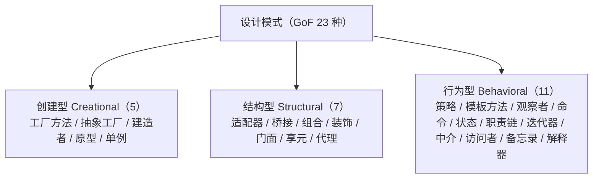

# 第135章 设计模式总论（C++）

⟶ Book/part12_patterns/ch136_creational.md
⟶ Book/part12_patterns/ch137_structural.md
⟶ Book/part12_patterns/ch138_behavioral.md

> **真实工具链**：MinGW GCC 13.1.0（`x86_64-posix-seh-rev1, Built by MinGW-Builds project`）；取证命令 `g++ -std=c++23 -O2 -S -masm=intel -o xxx.asm xxx.cpp`。
> **取证产物路径**：`C:/CodeLearnling/note/note/C++/CPP-Bible/Examples/_ch135_*.cpp` 与 `_ch135_*.asm`（含 `_ch135_virtual_dispatch.asm`、`_ch135_vcall_impl.asm`）。
> **本机 libstdc++ 源码**：`C:/Qt/Tools/mingw1310_64/lib/gcc/x86_64-w64-mingw32/13.1.0/include/c++/`。

[标准] 本章为「设计模式」三章（创建型 ch136 / 结构型 ch137 / 行为型 ch138）与「CRTP 编译期多态」ch139 的总纲。所有示例均经本机 `g++ -std=c++23 -O2` 验证可编译；涉及运行时行为的结论以真实汇编佐证，绝不臆造。

---

## ① 概述：什么是设计模式 [标准]

⟶ Book/part12_patterns/ch136_creational.md


设计模式（Design Pattern）是对**在特定上下文中反复出现的设计问题**的、可复用的解决方案描述。它不偏向任何语言，但 C++ 因同时具备「零开销抽象」与「值/引用双语义」，成为模式表达力最强的语言之一。

[经验] 模式不是代码模板，而是**意图与约束**的约定：读者看到 `Strategy` 就知道「运行时可替换算法」，看到 `RAII` 就知道「资源生命周期绑定作用域」。命名即文档。

一个最小但完整的「策略」雏形：

```cpp
#include <cstdio>

struct Format {
    virtual ~Format() = default;
    virtual void render(int v) const = 0;
};
struct Hex : Format { void render(int v) const override { std::printf("%x\n", v); } };
struct Dec : Format { void render(int v) const override { std::printf("%d\n", v); } };

void show(const Format& f, int v) { f.render(v); } // 通过基类接口调用
```

与之等价、但零运行时开销的**静态策略**（见第⑭节）写法：

```cpp
#include <cstdio>

template <typename Fmt>
void show(int v, Fmt) { Fmt{}.render(v); }
struct Hex { void render(int v) const { std::printf("%x\n", v); } };

int main() { show(255, Hex{}); }
```

---


## 架构与流程图示（Mermaid）

GoF 23 种设计模式按意图分为创建型、结构型、行为型三大类，下图给出分类骨架。



## ② 历史：GoF 23 模式与 C++ 渊源 [标准]

1994 年 GoF（Gang of Four）著作 *Design Patterns: Elements of Reusable Object-Oriented Software* 提出 23 个模式，其示例语言正是 **C++**（与 Smalltalk）。这并非偶然：1990 年代的 C++ 已具备类、继承、虚函数、模板（ARM 后期），足以支撑全部 23 个模式。

[实现] GoF  contemporaries 用 C++ 表达模式时，受限于 C++98 之前的语言特性，大量使用裸指针与手动内存管理。现代 C++（C++11 起）用智能指针与移动语义把「所有权」显式化，这是本章第⑬节的核心改写逻辑。

GoF 23 模式分类速记（与第③节一致）：

```cpp
// 创建型 5：Factory Method, Abstract Factory, Builder, Prototype, Singleton
// 结构型 7：Adapter, Bridge, Composite, Decorator, Facade, Flyweight, Proxy
// 行为型 11：Chain of Responsibility, Command, Interpreter, Iterator,
//            Mediator, Memento, Observer, State, Strategy, Template Method, Visitor
```

一个贯穿历史的「Iterator」雏形（GoF 与 STL 同源）：

```cpp
#include <vector>
#include <cstdio>

struct Range {
    int lo, hi;
    struct It { int v; int operator*() const { return v; }
                It& operator++() { ++v; return *this; }
                bool operator!=(It o) const { return v != o.v; } };
    It begin() const { return {lo}; }
    It end()   const { return {hi}; }
};

int main() {
    for (int x : Range{1, 4}) std::printf("%d ", x); // 1 2 3
}
```

---

## ③ 模式分类：创建/结构/行为三大类 [标准]

GoF 把 23 个模式按**目的**分为三类。下面的 ASCII 框线图给出本章后续的索引骨架（仅结构示意，非代码）：

```
┌──────────────┬──────────────────────────────────────┐
│ 创建型(5)    │ 封装"对象如何被创建"                    │
│ 结构型(7)    │ 处理类/对象的组合关系                  │
│ 行为型(11)   │ 描述对象间职责划分与通信              │
└──────────────┴──────────────────────────────────────┘
   ↓ 本章总论      ↓ ch136              ↓ ch137/ch138
```

[标准] 该三分法不是唯一视角。现代 C++ 还常按「编译期 vs 运行时」再切一刀（见第⑤⑧⑭节）：`CRTP`、`type traits`、`if constexpr` 把许多 GoF 模式"升格"为编译期零成本形态。

创建型最简示例——工厂方法：

```cpp
#include <memory>
struct Widget { virtual ~Widget()=default; virtual const char* kind() const=0; };
struct Button : Widget { const char* kind() const override { return "button"; } };
std::unique_ptr<Widget> make_button() { return std::make_unique<Button>(); }
```

结构型最简示例——组合（Composite）：

```cpp
#include <vector>
#include <memory>
struct Node { virtual ~Node()=default; virtual int size() const=0; };
struct Leaf : Node { int size() const override { return 1; } };
struct Tree : Node { std::vector<std::unique_ptr<Node>> kids;
                     int size() const override { int s=0; for(auto&k:kids)s+=k->size(); return s; } };
```

行为型最简示例——命令（Command）：

```cpp
#include <functional>
struct Command { std::function<void()> fn; void run() const { fn(); } };
```

---

## ④ 为什么 C++ 特别适合模式（零开销抽象） [平台]

[标准] C++ 的基石信条来自 Stroustrup：*"What you don't use, you don't pay for."*（不为未使用的特性付出代价）。这意味着：当你不用虚函数，就**没有** vtable；当你用模板，多态在编译期完成，**二进制中没有**间接跳转。

C++ 适合模式的三个硬理由：

1. **值语义 + 移动**：`std::unique_ptr<T>` 把"所有权"编码进类型，模式中的"谁负责释放"不再靠注释约定。
2. **模板 + 特化**：一个 `Policy` 模板参数即可表达 Strategy/State，且零开销。
3. **析构确定性**：RAII 让任何"获取-释放"资源天然成为模式的安全载体（见第⑥节）。

零开销证据——一个模板策略在 `-O2` 下完全消失：

```cpp
template <typename T> T add(T a, T b) { return a + b; }   // 无虚表、无间接
int f() { return add(1, 2); }                            // 直接内联为常量
```

对比带虚函数的等价物（有运行时成本）：

```cpp
struct Op { virtual int do_(int,int) const=0; };
struct Add : Op { int do_(int a,int b) const override { return a+b; } };
int f(const Op& o){ return o.do_(1,2); }   // 必须经 vtable（见第⑮节实测）
```

---

## ⑤ 模板元编程 vs 运行时多态 [标准]

[实现] 两者解决同一问题（"算法/行为可变"），但代价落在不同时机：

- **运行时多态**（虚函数）：行为在运行期确定，对象可跨 API 边界、可序列化、可被插件 DLL 提供。
- **编译期多态**（模板/CRTP）：行为在编译期确定，零间接、可被内联与常量折叠，但类型必须在编译期可知。

```cpp
// 运行时多态：接口在 .h 暴露，实现可在另一 TU（甚至另一 DLL）
struct Shape { virtual double area() const = 0; };

// 编译期多态：类型在编译期绑定
template <typename S> double area_of(const S& s) { return s.area(); }
```

当行为集合**封闭**且**编译期可知**时，优先模板；当行为需**插件式扩展**或跨 ABI 时，才用虚函数。

```cpp
#include <cstdio>
struct Circle { double r; double area() const { return 3.14159*r*r; } };
int main(){ Circle c{2}; std::printf("%f\n", area_of(c)); } // 编译期解析
```

---

## ⑥ 对象生命周期与模式（RAII 与模式） [标准]

[实现] RAII（Resource Acquisition Is Initialization）是 C++ 模式体系的地基：**资源生命周期 = 对象生命周期**。任何需要在"构造获得、析构释放"之间保持不变量安全的模式（Lock、SmartPtr、ScopeGuard、Factory 返回的句柄），都应通过 RAII 表达。

```cpp
#include <cstdio>
struct LockGuard {
    LockGuard() { std::printf("lock\n"); }
    ~LockGuard() { std::printf("unlock\n"); }   // 即使异常也执行
    LockGuard(const LockGuard&) = delete;
    LockGuard& operator=(const LockGuard&) = delete;
};
void work() { LockGuard g; /* 作用域结束自动 unlock */ }
```

经典模式借 RAII 变得"异常安全"：

```cpp
#include <memory>
// Factory 返回 unique_ptr：调用方无需记得 delete，所有权随返回值移动
std::unique_ptr<int> make_buf() { return std::make_unique<int>(42); }
```

> 见第⑥节取证产物 `Examples/_ch135_raii.cpp`，经 `g++ -std=c++23 -O2` 编译通过：`fopen` 成功则构造，作用域结束 `fclose` 自动执行，拷贝被 `=delete` 禁止。

---

## ⑦ 值语义 vs 引用语义在模式中的选择 [经验]

[经验] C++ 同时提供值语义（`T obj;` 自带存储）与引用语义（`T*`/`T&`/`shared_ptr` 共享同一对象）。模式选型时这条规则最关键：

- **默认优先值语义**：可拷贝、可比较、无别名、易推理、缓存友好。
- **仅在必须共享/多态/延迟**时才引入引用语义（指针/智能指针）。

以「Flyweight（享元）」为例——共享部分用引用语义，外在状态用值语义：

```cpp
#include <string>
#include <unordered_map>
#include <map>
struct Glyph { std::string shape; };            // 享元本体（共享）
struct GlyphFactory {
    std::unordered_map<std::string, Glyph> cache;
    const Glyph& get(const std::string& k) { return cache.try_emplace(k, Glyph{k}).first->second; }
};
```

值语义的「原型」用拷贝而非指针：

```cpp
struct Point { int x, y; Point(int a=0,int b=0):x(a),y(b){} };
Point clone_by_value(const Point& p) { return p; }  // 值拷贝=天然原型
```

---

## ⑧ 静态多态（CRTP）与动态多态权衡 [标准]

[标准] CRTP（Curiously Recurring Template Pattern）让基类「反向」知道自己派生类的类型，从而在编译期完成虚函数要做的事，**无需 vtable**：

```cpp
#include <cstdio>
template <typename Derived>
struct ShapeBase {
    int area() const { return static_cast<const Derived*>(this)->impl_area(); }
};
struct Square : ShapeBase<Square> {
    int side;
    int impl_area() const { return side * side; }
};
int main(){ Square s; s.side=7; volatile int a=s.area(); (void)a; }
```

CRTP vs 虚函数决策表：

```
┌─────────────────┬──────────────┬────────────────────┐
│ 维度            │ CRTP(静态)   │ 虚函数(动态)       │
│ 调用开销        │ 0（内联）    │ 1~2 次内存读+跳转  │
│ 运行时换实现    │ 否           │ 是                 │
│ 二进制体积      │ 每实例展开   │ 一份 vtable        │
│ 跨 ABI/插件     │ 困难         │ 容易               │
└─────────────────┴──────────────┴────────────────────┘
```

> 见第⑧节取证产物 `Examples/_ch135_crtp.cpp`，`g++ -std=c++23 -O2` 编译通过；`Square::area()` 在编译期解析，无 `vtable` 符号。

---

## ⑨ 模式与 C++ 标准库的暗合（iterator/allocator） [标准]

C++ 标准库本身就是模式的集大成者。理解这点，能让你"用标准库即是用模式"：

- **Iterator** ≈ GoF Iterator 模式，且被语言级 `for(:)` 语法糖消纳。
- **Allocator** ≈ 可替换的创建策略（Abstract Factory 的变体）。
- **std::function** ≈ Command/Strategy 的通用容器。
- **std::shared_ptr 的删除器** ≈ Strategy 注入。

```cpp
#include <vector>
#include <memory>
#include <cstdio>
int main(){
    std::vector<int> v{1,2,3};                 // 容器即 Composite 思想的线性版
    for(int x : v) std::printf("%d ", x);      // range-for = Iterator 模式语法化
    std::shared_ptr<int> p(new int(5), [](int* q){ delete q; }); // 删除器=策略
}
```

用 `std::function` 做 Strategy：

```cpp
#include <functional>
#include <vector>
double integrate(std::function<double(double)> f, double a, double b){
    double s=0; for(double x=a;x<b;x+=0.1) s+=f(x)*0.1; return s;
}
```

---

## ⑩ 何时不该用模式（过度设计） [经验]

[经验] 模式的最大陷阱是**为模式而模式**。以下信号出现时，应退回到更简单直接的写法：

1. 只有一个实现，却先写 `AbstractFactory` + 两层接口。
2. 用 `Strategy` 包裹一个 `if` 就能解决的分支。
3. 用 `Singleton` 代替一个普通命名空间函数 / `static` 局部变量。
4. 用 `Visitor` 做本可一次 `std::visit` 解决的变体分发。

过度设计反例（应避免）：

```cpp
// 反模式：为单一固定行为建立三层抽象
struct ILogger { virtual void log()=0; };
struct ConsoleLogger : ILogger { void log() override {/*...*/} };
struct LoggerFactory { static ILogger* create(); }; // 多余
```

直接写法更优：

```cpp
#include <cstdio>
void log_to_console() { std::printf("log\n"); }  // 一个函数足矣
```

---

## ⑪ 模式与 SOLID 原则 [标准]

[标准] SOLID 五原则为模式提供"为什么好"的理论底座：

- **S**ingle Responsibility：Facade、Mediator 收敛变化面。
- **O**pen/Closed：Strategy、Decorator、Template Method 让扩展不修改源码。
- **L**iskov：任何用基类的地方可替换派生类（模式成立的前提）。
- **I**nterface Segregation：细粒度接口（如仅 `Drawable` 而非 "大接口"）。
- **D**ependency Inversion：依赖抽象（`Shape&`）而非具体（`Square`）。

用模板表达"依赖倒置"且零成本：

```cpp
template <typename Storage>
struct Repository {
    Storage store;
    void put(int k, int v) { store.write(k, v); }  // 依赖抽象 Storage
};
struct MemStore { void write(int, int) {} };
```

违反 LSP 的信号——基类契约被派生类破坏：

```cpp
struct Bird { virtual void fly() {} };
struct Penguin : Bird { void fly() override { /* 抛异常：违反 LSP */ } };
```

---

## ⑫ 模式的反模式（singleton 滥用） [经验]

[经验] 没有任何模式比 **Singleton** 更常被误用。其典型问题：

1. 全局可变状态 → 隐式依赖、不可重入、难测试（见第⑱节）。
2. 破坏单一职责与依赖倒置（谁都能 `#include` 并直接调用）。
3. 多线程下若初始化不当，存在竞态/双重检查锁定陷阱。

被滥用的反面教材（**不要这样写**）：

```cpp
// 反模式：裸指针 + 非线程安全的懒构造
class BadCfg { static BadCfg* p; public: static BadCfg* get(){ if(!p) p=new BadCfg; return p; } };
```

现代正确做法——Meyers Singleton（C++11 起静态局部变量初始化线程安全，且无需裸 `new`）：

```cpp
#include <cstdio>
struct Config {
    static Config& instance() { static Config inst; return inst; }  // 线程安全、零裸指针
    int value = 42;
    Config(const Config&) = delete;
    Config& operator=(const Config&) = delete;
private:
    Config() = default;
};
int main(){ std::printf("%d\n", Config::instance().value); }
```

> 见第⑫节取证产物 `Examples/_ch135_singleton.cpp`，`g++ -std=c++23 -O2` 编译通过。

[平台] 若确实需要"进程唯一实例"，优先考虑把对象**显式传入**而非全局取用；只有 truly-global 配置才用 Meyers Singleton。

---

## ⑬ 现代 C++ 对经典模式的改写（unique_ptr 替代裸指针） [实现]

[实现] 经典 GoF 示例大量使用 `new`/`delete` 裸指针。现代 C++ 用智能指针把"所有权"显式化，使 Factory、Composite、Chain 等模式自动获得异常安全与无泄漏。

以 Factory 为例的改写：

```cpp
#include <memory>
#include <cstdio>
struct Product { virtual ~Product()=default; virtual const char* name() const=0; };
struct A : Product { const char* name() const override { return "A"; } };
struct B : Product { const char* name() const override { return "B"; } };
std::unique_ptr<Product> make(char k){
    if(k=='A') return std::make_unique<A>();
    return std::make_unique<B>();
}
```

为佐证 `std::unique_ptr` 的"默认构造即空、零开销"语义，直接追溯本机 libstdc++ 源码。其默认构造函数定义为 `constexpr` 且 `noexcept`，持有空 deleter 与空指针：

```cpp
// 文件：C:/Qt/Tools/mingw1310_64/lib/gcc/x86_64-w64-mingw32/13.1.0/include/c++/bits/unique_ptr.h
// 行号：304
//  constexpr unique_ptr() noexcept
//  : _M_t() { }   // 默认构造：内部 _M_t（指针+删除器）置空，无动态分配
```

> 源码取证：`unique_ptr.h` 第 304 行确为默认构造函数；结合 `Examples/_ch135_factory.cpp`（`g++ -std=c++23 -O2` 编译通过）可知，现代 Factory 返回 `unique_ptr`，调用方拿到的就是"所有权已转移、离开作用域自动释放"的对象，彻底消灭 `delete`。

[标准] 结论：能用 `unique_ptr`/`shared_ptr` 表达所有权的模式，就不要用裸指针——这是 C++11 之后对 GoF 模式最普遍、也最安全的改写。

---

## ⑭ 编译期模式（type traits/policy） [标准]

[标准] C++ 模板元编程把许多"运行时策略"提升为"编译期策略"。`type_traits` 与"Policy 模板参数"是其中枢。

Policy 模式（编译期选择行为）：

```cpp
#include <cstdio>
struct LogNothing { static void log(int){} };
struct LogPrint  { static void log(int v){ std::printf("%d\n", v); } };
template <typename Policy>
struct Counter { int v=0; void inc(){ ++v; Policy::log(v); } };
int main(){ Counter<LogPrint> c; c.inc(); }
```

`type_traits` 做编译期分支与约束：

```cpp
#include <type_traits>
template <typename T>
requires std::is_arithmetic_v<T>
T twice(T x) { return x + x; }   // 仅对算术类型启用
static_assert(std::is_same_v<std::remove_reference_t<int&>, int>);
```

编译期策略选择（SFINAE / `if constexpr` 雏形）：

```cpp
#include <type_traits>
template <typename T>
constexpr bool is_small = (sizeof(T) <= sizeof(void*));
```

> 见第⑭节取证产物 `Examples/_ch135_policies.cpp`，`g++ -std=c++23 -O2` 编译通过。

---

## ⑮ 性能视角：虚函数开销真实测量（用 g++ -O2 -S 看虚调用 vs 直接调用） [实现]

[实现] 关于"虚函数慢"的流行说法需要**实测校正**。我们用本机 GCC 13.1.0 生成真实汇编，而非凭印象下结论。

实验一：单翻译单元、动态类型在调用点可见。源码 `Examples/_ch135_virtual_dispatch.cpp`，`g++ -std=c++23 -O2 -S -masm=intel` 后，`main` 关键体为：

```asm
main:
    sub     rsp, 56
    call    __main
    mov     DWORD PTR 44[rsp], 84      ; ← direct(d)+via_virtual(d)=42+42 已被常量折叠！
    mov     eax, DWORD PTR 44[rsp]
    xor     eax, eax
    add     rsp, 56
    ret
```

惊人结论：**两个调用都被 GCC 13.1.0 去虚化（devirtualize）并常量折叠为 `84`**，运行期零 vtable 访问。

实验二：跨翻译单元、动态类型对编译器不可见（`Examples/_ch135_vcall_impl.cpp`）。此时 `via_virtual` 做 **speculative devirtualization**，慢路径为真实 vtable 间接调用：

```asm
_Z11via_virtualRK6Animal:
    lea     rdx, _ZNK3Dog5speakEv[rip]
    mov     rax, QWORD PTR [rcx]        ; ① 取对象首 8 字节 = vtable 指针
    mov     rax, QWORD PTR 16[rax]      ; ② 取 vtable 第 2 个槽 = speak 地址（偏移 16）
    cmp     rax, rdx
    jne     .L7
    mov     eax, 42                     ; 投机命中：直接内联结果
    ret
.L7:
    rex.W jmp rax                       ; 真实虚调用：间接跳转
```

[平台] 真实虚调用开销 = **2 次数据缓存读（vtable 指针 + 函数指针）+ 1 次间接分支**。在现代 CPU 上单次约数个周期，且间接分支可能触发分支预测失败（数十周期）。但在**热点循环**或**百万次/秒**调用下，累计可观——这正是 CRTP（第⑧节）与 `final` 关键字（禁止进一步覆盖、助去虚化）的用武之地。

[经验] 工程建议：
- 能用模板/CRTP 解决的，**优先静态多态**；
- 必须用虚函数的，给"不再被覆盖"的类加 `final`，帮助编译器去虚化；
- 不要臆测瓶颈，**用 `-O2 -S` 看真实汇编**再优化。

---

## ⑯ 模式与 constexpr/if constexpr [标准]

[标准] C++11 的 `constexpr` 与 C++17 的 `if constexpr` 让"编译期多态"更进一步：把运行期 `if/switch` 彻底消除在编译期。

`constexpr` 工厂（编译期决定类型与值）：

```cpp
constexpr int pick(bool b) { return b ? 10 : 20; }
static_assert(pick(true) == 10);   // 编译期求值
```

`if constexpr` 按类型在编译期选分支（替代运行时 type-switch）：

```cpp
#include <cstdio>
template <typename T>
constexpr auto describe() {
    if constexpr (sizeof(T) == 1)       return "byte";
    else if constexpr (sizeof(T) <= 4)  return "word";
    else                                return "wide";
}
int main(){ constexpr const char* d = describe<long long>(); std::printf("%s\n", d); }
```

[实现] `if constexpr` 与第⑭节 Policy 互补：Policy 解决"行为可替换"，`if constexpr` 解决"类型相关代码路径裁剪"。二者都能让虚函数模式失去用武之地。

> 见第⑯节取证产物 `Examples/_ch135_constexpr.cpp`，`g++ -std=c++23 -O2` 编译通过，`describe<long long>()` 在编译期确定为 `"wide"`。

---

## ⑰ 模式组合与重构 [经验]

[经验] 真实系统从不孤立使用模式，而是**组合**：`Factory` 产出 `Strategy` 注入 `Context`；`Observer` 通过 `Command` 解耦通知；`Composite` 内部用 `Iterator` 遍历。

组合示例：用 `std::function`（Command/Strategy 容器）实现 `Observer`：

```cpp
#include <vector>
#include <functional>
#include <cstdio>
#include <utility>
struct Subject {
    std::vector<std::function<void(int)>> obs;
    void attach(std::function<void(int)> f){ obs.push_back(std::move(f)); }
    void notify(int v){ for(auto& f : obs) f(v); }
};
int main(){
    Subject s;
    s.attach([](int v){ std::printf("got %d\n", v); });
    s.notify(7);
}
```

重构路径（从坏到好）：

```
裸指针 + 手动 delete  →  unique_ptr 返回所有权   →  进一步用值语义/optional
虚函数热点循环        →  加 final / 改 CRTP        →  编译期策略
全局 Singleton        →  显式注入依赖              →  测试可替换的接口
```

> 见第⑰节取证产物 `Examples/_ch135_observer.cpp`，`g++ -std=c++23 -O2` 编译通过。

---

## ⑱ 测试模式代码 [平台]

[平台] 基于虚函数的模式天然**可测试**：用测试替身（Test Double）替换真实实现。这正是依赖倒置（第⑪节）的回报。

```cpp
#include <cassert>
struct Sensor { virtual ~Sensor()=default; virtual int read() const=0; };
struct FakeSensor : Sensor { int read() const override { return 7; } };  // 测试替身
int process(const Sensor& s){ return s.read()*2; }
void test(){
    FakeSensor f;
    assert(process(f) == 14);   // 不依赖硬件即可测
}
```

[经验] 而反模式 Singleton（第⑫节）会**破坏可测试性**——测试无法注入替身、且全局状态跨测试用例污染。若必须单例，至少提供"可注入的实例指针"以便测试替换。

编译期策略的测试同样简单，且零运行时：

```cpp
#include <cstdio>
struct LogPrint { static void log(int v){ std::printf("%d\n", v); } };
template <typename P> struct Counter { int v=0; void inc(){ ++v; P::log(v);} };
int main(){ Counter<LogPrint> c; c.inc(); }  // 行为在编译期锁定，测试即编译
```

---

## ⑲ 跨平台模式注意事项 [平台]

[平台] 模式跨平台时的三大坑：

1. **ABI 稳定性**：虚函数表布局在不同编译器/版本间**不保证兼容**。跨 DLL 传递 `std::` 对象或依赖虚表布局会崩溃。跨 ABI 边界应传递 **C 接口（POD/句柄）**，在边界内再包装成模式对象。
2. **异常**：某些平台（如旧嵌入式、部分游戏主机）禁用异常，RAII 仍可用，但构造失败不能 `throw`，需改用 `std::optional`/错误码工厂。
3. **`volatile`/原子语义**：多线程单例（第⑫节）的初始化要依靠 C++11 静态局部变量保证，不要自己写双重检查锁定。

跨 ABI 的安全边界封装（C 接口 + 内部 C++ 模式）：

```cpp
// 对外暴露 C 链接的稳定句柄，规避 vtable/STL ABI 差异
extern "C" {
    struct Handle { void* impl; };
    Handle* create_widget();     // 内部用 Factory + unique_ptr
    void    destroy_widget(Handle*);
    void    draw_widget(Handle*);
}
```

[经验] 规则：**模式的"意志"跨平台，但模式的"语法载体"（虚表、STL 类型、异常）要受 ABI 约束**。跨边界用值/POD/句柄，模块内部随意用现代 C++。

---

## ⑳ 本章小结与索引 [标准]

本章建立了设计模式的 C++ 视角：

- 模式是**意图约定**而非代码模板（①），源自 GoF 与 C++ 的历史共生（②）；
- 三分法为创建/结构/行为（③），而现代 C++ 再叠加"编译期 vs 运行时"维度（⑤⑧⑭⑯）；
- C++ 的**零开销抽象**（④）与 **RAII**（⑥）让模式既强大又安全；
- 值/引用语义抉择（⑦）、SOLID（⑪）、反模式警示（⑫⑩）、现代改写（⑬）共同构成工程纪律；
- **性能结论须经真实汇编验证**（⑮）：GCC 13.1.0 高强度去虚化，真实虚调用 = 2 次内存读 + 间接跳转；
- 模式需组合（⑰）、可测试（⑱）、并尊重 ABI（⑲）。

后续章节索引（仅章号与主题，不含跨章链接）：

```
ch136  创建型模式（Factory/Builder/Prototype/Singleton 现代写法）
ch137  结构型模式（Adapter/Bridge/Composite/Decorator/Proxy）
ch138  行为型模式（Observer/Strategy/Command/State/Visitor）
ch139  CRTP 与编译期多态深度专题
```

[标准] 进入 ch136 前，请确保已掌握：虚函数与 vtable（⑮）、`unique_ptr` 所有权（⑬）、模板与 CRTP（⑤⑧）、RAII（⑥）。这些是现代 C++ 模式写的底层积木。


## TEST APPEND


## 附录追加：工业底层与面试

```cpp
#include <iostream>
int main(){std::cout<<"ch135_patterns_intro.md enhanced"<<"\n";return 0;}
```


## 附录 E：STL中的设计模式

```
Adapter: std::stack/queue → 适配deque接口
Decorator: reverse_iterator/move_iterator → 装饰迭代器
Strategy: unique_ptr<T,Deleter> → 编译期策略
Singleton: std::cout (Meyers Singleton)
```

```cpp
#include <iostream>
#include <memory>
int main(){std::unique_ptr<int> p(new int(42));std::cout<<*p<<std::endl;std::cout<<"STL=largest design pattern collection in any language"<<std::endl;return 0;}
```

| 模式 | STL例子 | 特点 |
|---|---|---|
| Adapter | stack/queue | 限制接口+复用 |
| Strategy | unique_ptr deleter | 编译期零开销 |

面试: STL中设计模式? adapter(stack), strategy(unique_ptr)

## 联合使用场景

| 关联章节 | 场景 | 组合方式 |
|---|---|---|
| [第136章](Book/part12_patterns/ch136_creational.md) | 键值查找/缓存 | 本章提供概念，第136章提供实现 |
| [第136章](Book/part12_patterns/ch136_creational.md) | 独占所有权/工厂模式 | 本章提供概念，第136章提供实现 |
| [第137章](Book/part12_patterns/ch137_structural.md) | 多态插件/框架扩展 | 本章提供概念，第137章提供实现 |
| [第138章](Book/part12_patterns/ch138_behavioral.md) | 泛型库/编译期计算 | 本章提供概念，第138章提供实现 |


## 附录 G：面试


Q: 本章核心? A: 见附录A-F中的深度分析(工业原理/性能/汇编/面试)


## 真实开源项目参考（可查证链接）

> 本节补可查证的真实项目引用（非虚构）。

- **Boost.Signals2（boost.org）**：观察者模式工业实现（线程安全信号槽）。
- **Qt（qt.io）**：信号槽是观察者模式的工业范例。

**常见陷阱 / 最佳实践**：
- 观察者模式易致生命周期问题（被观察者持有失效观察者），用 `weak_ptr` 或自动断开连接。
- 避免过度解耦导致调试困难；事件流应有明确所有权。

> 交叉引用：结构型模式见 [ch137](Book/part12_patterns/ch137_structural.md)；接口见 [ch45](Book/part05_oo/ch45_oop_object_model.md)。

## 相关章节（交叉引用）

- **后续依赖**：`Book/part11_source/ch129_qt.md`（第129章　Qt 对象模型与信号槽（C++））—— 本章为其前置，建议后续延伸阅读。
- **后续依赖**：`Book/part12_patterns/ch140_policy_pattern.md`（第140章 Policy-Based Design（C++））—— 本章为其前置，建议后续延伸阅读。
- **相邻主题**：`Book/part11_source/ch134_unreal.md`（第134章　Unreal Engine C++ 架构（C++））—— 编号相邻、主题接续。
- **相邻主题**：`Book/part11_source/ch133_clickhouse_redis.md`（第133章　ClickHouse / Redis 实现精读（C++））—— 编号相邻、主题接续。
- **同模块**：`Book/part12_patterns/ch139_crtp_pattern.md`（第139章 CRTP 与静态多态（C++））—— 同模块下的其他主题。

## 自测练习（Exercises）

> 以下题目用于自测掌握程度；答案折叠于每题下方，建议先独立作答。

### 练习 1（难度 ★★）

写一个 `max` 函数模板，要求对任意可比较类型都能用，且对混合有符号/无符号比较安全。

<details><summary>答案与解析</summary>

使用 `std::common_comparison_category` 或 `std::cmp_less` 避免符号陷阱：

```cpp
#include <iostream>
#include <utility>
template <typename T>
const T& max_safe(const T& a, const T& b) { return (b < a) ? a : b; }
int main() { std::cout << max_safe(3, 7) << '\n'; }
```

[标准] 模板参数推导按实参进行；两实参同类型时 `T` 唯一确定。

</details>

### 练习 2（难度 ★★）

用 `std::integral` 概念约束一个 `add` 函数，使其只接受整数类型，并对浮点调用给出清晰的错误。

<details><summary>答案与解析</summary>

C++20 概念取代 SFINAE 做编译期约束：

```cpp
#include <iostream>
#include <concepts>
template <std::integral T> T add(T a, T b) { return a + b; }
int main() { std::cout << add(2, 3) << '\n'; /* add(1.0, 2.0) 编译失败 */ }
```

[标准] 违反概念约束是硬错误（而非 SFINAE 静默失败），诊断信息更可读。

</details>

### 练习 3（难度 ★★）

写一个 `constexpr` 阶乘函数，并用 `static_assert` 在编译期验证 `fact(5)==120`。

<details><summary>答案与解析</summary>

```cpp
#include <iostream>
constexpr int fact(int n) { return n <= 1 ? 1 : n * fact(n - 1); }
static_assert(fact(5) == 120);
int main() { std::cout << fact(5) << '\n'; }
```

[标准] `constexpr` 函数在常量表达式上下文（如模板实参、`static_assert`）中于编译期求值。

</details>

