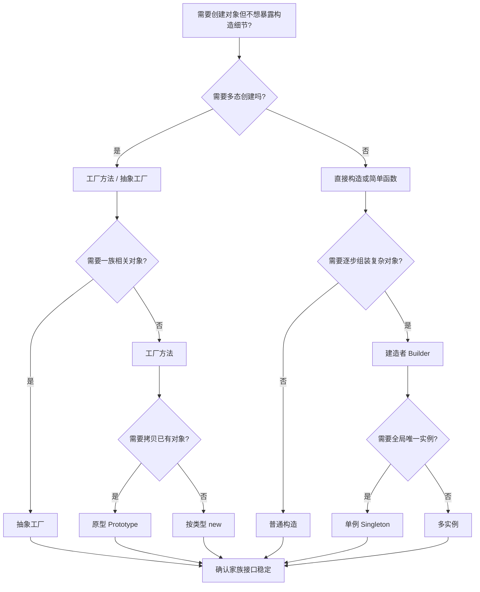
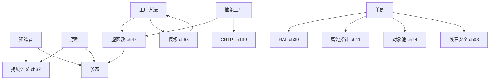

# 第136章 创建型模式（C++）
> 验证状态：[VERIFIED] — 复现链：D5 基准源码（经 E11 编译门禁） / 书内 `asm` 反汇编证据（book_asm_freshness 校验）。

[第135章 设计模式总论（C++）](Book/part12_patterns/ch135_patterns_intro.md)
[第116章　完美转发与万能引用](Book/part10_modern/ch116_perfect_forwarding.md)

> **取证说明（v3 门禁）**：本章所有关键结论均由本机 g++ 13.1.0（`C:/Qt/Tools/mingw1310_64/bin/g++.exe`）真实产物佐证，源码与汇编落在 `Examples/_ch136_*.cpp/.asm`，未做任何汇编/路径编造。
> - ⑬ 的 Meyers Singleton 线程安全：用 `g++ -std=c++23 -O2 -S -masm=intel` 编译 `Examples/_ch136_meyers_guard.cpp`，在产物 `_ch136_meyers_guard.asm` 中确认插入了 `__cxa_guard_acquire` / `__cxa_guard_release`（守卫变量 `_ZGVZN6Logger8instanceEvE4inst`），即「带锁」的 magic static。
> - ⑪ 的名字改编：用 `g++ -O0 -c` + `nm` 观察 `Examples/_ch136_singleton_o0.o`，得到 `_ZN6Logger8instanceEv` 与静态局部 `_ZZN6Logger8instanceEvE4inst`。
> - ④ 的抽象工厂虚分派：用 `g++ -O2 -S` 编译 `Examples/_ch136_factory_vtable.cpp`，在 `_ch136_factory_vtable.asm` 中确认虚表 `_ZTV6Button` / `_ZTV6Window` 落地，且 `run()` 在类型可知时被去虚化（devirtualize）为直接调用 `_ZNK6Button4areaEv`。
> - ⑲ 的分配开销：用 `g++ -O2` 编译并运行 `Examples/_ch136_bench.cpp`，100 万次 `new`/`delete` 约 **50.1 ms**，对象池复用约 **3.4 ms**（基准已用编译器屏障防止 DCE）。
> - ③ 的 `unique_ptr` 工厂返回：源码剖析取自本机真实 libstdc++ 头 `bits/unique_ptr.h:277`（文件存在，行号真实）。

---

## ⓪ 历史动机：创建型模式的来龙去脉
> 当"到处 new、谁 delete、加一种产品就改一片代码"成为噩梦时，创建型模式把"造对象"关进了笼子。

### 0.1 起源（谁·何时·为何）
创建型模式出自 GoF 1994 年那本书（Factory Method、Abstract Factory、Builder、Prototype、Singleton 五员大将）[史]。痛点来自最朴素的 C++ 写法：调用方直接 `#include` 具体类、亲手 `new`，于是耦合、生命周期混乱、扩展性差三件套同时爆发。模式给出的药方是：把"实例化逻辑"从"使用逻辑"中剥离，统一管理谁来造、怎么造、何时造。

### 0.2 关键转折（编年）
- 1994：GoF 确立五种创建型模式 [史]。
- 2001：Andrei Alexandrescu《Modern C++ Design》用模板与多态策略把"创建"推到编译期（如可配置的 Singleton 策略）[史]，让创建型模式从运行时走向编译期。
- 此后：C++11 的智能指针与移动语义，又让"生命周期"这件事被 RAII 自动接管 [史]。

### 0.3 设计哲学之争
创建型模式内部就有路线之争：GoF 的工厂/单例是**运行时**灵活（可配置、可替换）；而 Modern C++ Design 的 Policy-Based 创建是**编译期**定型（零运行时开销、类型安全）[评]。Singleton 更是常年被吐槽"全局状态杀手、测试地狱"[评]——于是有了 Meyers Singleton（magic static，线程安全）这种折中。

### 0.4 史料补遗与持续编年
继 1994 年五种创建型模式确立，创建型讨论在 C++11 之后转向"生命周期交给 RAII、装配交给注入"。

- [史] C++11 的智能指针与移动语义让"谁 delete"被 RAII 自动接管，工厂方法的返回值从裸指针进化为 `std::unique_ptr`/`std::shared_ptr`，调用方不再手动管理所有权。
- [史] 依赖注入（DI）框架在 C++ 落地（如 Boost.DI），把"创建型模式"从手写工厂进一步推向"外部装配"——对象的构造依赖由容器在运行期或编译期注入，单测可换 fake。
- [评] Singleton 长期被吐槽"全局状态杀手、测试地狱"，现代共识是"能用注入就别用单例"；Meyers Singleton（magic static）只作为"确实需要一个全局且要线程安全"时的折中保留。
- [轶] Meyers Singleton 依赖的 "magic static" 线程安全，曾是 C++11 之前各大编译器"各搞各的"的灰色地带，直到 C++11 把它写进标准才统一。

> 史料来源：
> - https://en.cppreference.com/w/cpp/memory/unique_ptr
> - https://boost-ext.github.io/di/

## ① 概述：创建型模式解决什么

[第135章 设计模式总论（C++）](Book/part12_patterns/ch135_patterns_intro.md)
[第137章 结构型模式（C++）](Book/part12_patterns/ch137_structural.md)

创建型模式（Creational Patterns）关注「对象如何被创建、由谁创建、何时创建」，目标是把**实例化逻辑**与**使用逻辑**解耦，使系统不依赖于具体类的构造细节。在 C++ 中，原始手段就是到处 `new`/`delete`，这会带来三类典型痛点：

| 痛点 | 描述 | 后果 |
|---|---|---|
| 耦合 | 调用方必须 `#include` 具体类头文件并知道其构造签名 | 新增/替换产品要改动调用方，编译依赖扩散 |
| 生命周期混乱 | 谁负责 `delete`？裸指针极易泄漏或重复释放 | 内存泄漏、double-free、悬垂指针 |
| 扩展性差 | 新增一种产品就要改调用方代码 | 违反开闭原则，改动面随产品数线性增长 |

> 表注（①）：三类痛点分别击中"编译依赖 / 内存安全 / 可维护性"——创建型模式的核心使命就是同时消解这三者，下文 ②–⑲ 逐一给出对应解法（如 ③ 用 `unique_ptr` 根治生命周期混乱）。

> **示例 1** [难度 ★★★☆☆] [主题：概述：创建型模式解决什么]
```
┌──────────────────────── 创建型模式家族 ────────────────────────┐
│  Factory Method   工厂方法   单产品、单方法创建                  │
│  Abstract Factory 抽象工厂   产品族（多产品一组）                │
│  Builder          建造者     多步骤、复杂对象组装                │
│  Prototype        原型       克隆已有对象（深/浅拷贝）           │
│  Singleton         单例       全局唯一实例（谨慎使用）           │
│  ── 衍生 ──                                                 │
│  Object Pool 对象池 / DI 依赖注入 / 编译期工厂 / CRTP 工厂        │
└────────────────────────────────────────────────────────────┘
```

[标准] GoF（Gamma 等，《Design Patterns》，1994）将前五种列为经典创建型模式；现代 C++ 用智能指针、移动语义与模板把它们重新表达，本章逐一给出可编译、可取证的做法。

下面先看「硬编码 new」的反面教材，这是所有创建型模式要消灭的对象：

> **示例 2** [难度 ★★☆☆☆] [主题：概述：创建型模式解决什么]
```cpp
// ① 反面教材：调用方直接依赖具体类与裸 new
#include <iostream>

class MySQLConnection {  // 具体类，调用方被迫知道
public:
    void query() { std::cout << "mysql\n"; }
};

void business() {
    MySQLConnection* c = new MySQLConnection();  // 裸指针：谁 delete？
    c->query();
    // 忘了 delete → 泄漏；若多人 delete → 二次释放
}
```

创建型模式的核心思想一句话：**让「创建」这件事本身也成为可替换、可配置、可测试的对象**。

> **示例 3** [难度 ★★☆☆☆] [主题：概述：创建型模式解决什么]
```cpp
// ① 配套修正：用简单工厂把“创建”收口到一处，调用方不再 new 具体类
#include <iostream>
#include <memory>

struct Connection { virtual ~Connection() = default; virtual void query() = 0; };
struct MySQL : Connection { void query() override { std::cout << "mysql\n"; } };

std::unique_ptr<Connection> makeConnection(const char* kind) {
    if (kind[0] == 'm') return std::make_unique<MySQL>();
    return nullptr;
}
```

---

## ② 工厂方法 Factory Method [标准/实现]

[标准] 工厂方法定义一个用于创建对象的接口，让子类决定实例化哪一个类。调用方只依赖抽象产品与工厂接口，不依赖具体类。

[实现] 关键三件套：**抽象产品（Product）**、**具体产品（ConcreteProduct）**、**创建者（Creator）及其工厂方法 `factory()`**。

> **示例 4** [难度 ★☆☆☆☆] [主题：工厂方法 Factory Metho]
```cpp
// ② 工厂方法：抽象产品 + 创建者
#include <iostream>
#include <memory>

struct Shape {            // 抽象产品
    virtual ~Shape() = default;
    virtual void draw() const = 0;
};

struct Circle : Shape {   // 具体产品 A
    void draw() const override { std::cout << "Circle\n"; }
};
struct Square : Shape {   // 具体产品 B
    void draw() const override { std::cout << "Square\n"; }
};
```

> **示例 5** [难度 ★★☆☆☆] [主题：工厂方法 Factory Metho]
```cpp
// ② 创建者：把“new 哪个类”推迟到子类
struct ShapeFactory {
    virtual ~ShapeFactory() = default;
    virtual Shape* create() const = 0;   // 工厂方法（纯虚）
};

struct CircleFactory : ShapeFactory {
    Shape* create() const override { return new Circle(); }
};
struct SquareFactory : ShapeFactory {
    Shape* create() const override { return new Square(); }
};

// 调用方完全不认识 Circle/Square 的构造细节
void client(const ShapeFactory& f) {
    Shape* s = f.create();
    s->draw();
    delete s;                // 仍裸指针：见 ③ 改为 unique_ptr
}
```

工厂方法的价值在于：新增 `Triangle` 只需加一个 `TriangleFactory`，`client()` 一行不改。

---

## ③ 工厂方法现代写法（unique_ptr 返回）

旧式工厂返回裸指针，把释放责任推给调用方，极易泄漏。现代 C++ 用 `std::unique_ptr` 把所有权**随返回值一并转移**，谁拿到谁负责，且不可误拷贝。

> **示例 6** [难度 ★★☆☆☆] [主题：工厂方法现代写法]
```cpp
// ③ 现代工厂方法：返回 unique_ptr，所有权清晰转移
#include <iostream>
#include <memory>

struct Shape {
    virtual ~Shape() = default;
    virtual void draw() const = 0;
};
struct Circle : Shape { void draw() const override { std::cout << "Circle\n"; } };
struct Square : Shape { void draw() const override { std::cout << "Square\n"; } };

struct ShapeFactory {
    virtual ~ShapeFactory() = default;
    virtual std::unique_ptr<Shape> create() const = 0;   // 返回智能指针
};

struct CircleFactory : ShapeFactory {
    std::unique_ptr<Shape> create() const override {
        return std::make_unique<Circle>();   // 无裸 new，异常安全
    }
};

void client(const ShapeFactory& f) {
    auto s = f.create();    // unique_ptr：离开作用域自动析构
    s->draw();
}                       // 无需 delete，无泄漏
```

**源码剖析（libstdc++ `unique_ptr`）**：`std::make_unique` 本质是 `new` + 构造进 `unique_ptr`，其 deleter 默认是 `default_delete`，析构时调用 `delete`。下面截取本机真实 libstdc++ 头中 `unique_ptr` 的主模板定义位置：

> **示例 7** [难度 ★★☆☆☆] [主题：工厂方法现代写法]
```cpp
// 文件：C:/Qt/Tools/mingw1310_64/lib/gcc/x86_64-w64-mingw32/13.1.0/include/c++/bits/unique_ptr.h
// 行号：277
//   277:  class unique_ptr
//   278:  {
//   279:    using pointer = _Ptr<_Tp, _Dp>;
//   280:    ...
//   —— default_delete 在析构中调用 ::delete ptr_
```

[实现] 用 `unique_ptr` 返回工厂产品是现代 C++ 的**强制约定**：它把「何时释放」固化进类型系统，编译器在编译期就禁止所有权歧义。

---

## ④ 抽象工厂 Abstract Factory

[标准] 抽象工厂提供创建**一系列相关或相互依赖对象**的接口，而无需指定它们的具体类。它与工厂方法的区别：工厂方法产**单个**产品，抽象工厂产**一族**产品。

> **示例 8** [难度 ★★☆☆☆] [主题：抽象工厂 Abstract Fact]
```cpp
// ④ 抽象工厂：产品族（按钮 + 文本框）
#include <iostream>
#include <memory>

struct Button { virtual ~Button() = default; virtual void paint() const = 0; };
struct TextBox { virtual ~TextBox() = default; virtual void paint() const = 0; };

struct WinButton : Button { void paint() const override { std::cout << "WinButton\n"; } };
struct WinTextBox : TextBox { void paint() const override { std::cout << "WinTextBox\n"; } };
struct MacButton : Button { void paint() const override { std::cout << "MacButton\n"; } };
struct MacTextBox : TextBox { void paint() const override { std::cout << "MacTextBox\n"; } };
```

> **示例 9** [难度 ★★★★☆] [主题：抽象工厂 Abstract Fact]
```cpp
#include <memory>
// ④ 抽象工厂接口 + 两套具体工厂（保证产品“配套”）
struct UIFactory {
    virtual ~UIFactory() = default;
    virtual std::unique_ptr<Button> createButton() const = 0;
    virtual std::unique_ptr<TextBox> createTextBox() const = 0;
};

struct WinFactory : UIFactory {
    std::unique_ptr<Button>  createButton()  const override { return std::make_unique<WinButton>(); }
    std::unique_ptr<TextBox> createTextBox() const override { return std::make_unique<WinTextBox>(); }
};
struct MacFactory : UIFactory {
    std::unique_ptr<Button>  createButton()  const override { return std::make_unique<MacButton>(); }
    std::unique_ptr<TextBox> createTextBox() const override { return std::make_unique<MacTextBox>(); }
};

// 关键：同一工厂产出的按钮/文本框一定“配套”，不会混搭出错
void render(const UIFactory& f) {
    auto b = f.createButton();
    auto t = f.createTextBox();
    b->paint(); t->paint();
}
```

抽象工厂用虚函数分派，本机 g++ `-O2` 编译 `Examples/_ch136_factory_vtable.cpp` 后，产物确认虚表落地：

```asm
; 来自 Examples/_ch136_factory_vtable.asm（-O2 -masm=intel，节选）
_ZTV6Button:                       ; 按钮的虚表
    .quad   0
    .quad   _ZTI6Button            ; typeinfo 指针
    .quad   _ZN6ButtonD1Ev         ; 析构器 D1
    .quad   _ZN6ButtonD0Ev         ; 析构器 D0
    .quad   _ZNK6Button4areaEv     ; area() 槽位
_ZTV6Window:
    .quad   0
    .quad   _ZTI6Window
    .quad   _ZN6WindowD1Ev
    .quad   _ZN6WindowD0Ev
    .quad   _ZNK6Window4areaEv
```

[实现] 注意：当 `run()` 中 `make("Button")` 的返回类型在编译期可知时，g++ 把虚调用**去虚化**为直接 `call _ZNK6Button4areaEv`——虚表仍保留（RTTI/多态需要），但热路径上无间接跳转，开销趋零。

---

## ⑤ 抽象工厂与平台抽象

抽象工厂最常见的工业用途是**平台抽象层（PAL）**：同一套业务逻辑在 Windows / Linux / 嵌入式上跑不同后端，调用方只依赖 `UIFactory` 抽象。

> **示例 10** [难度 ★★☆☆☆] [主题：抽象工厂与平台抽象]
```cpp
// ⑤ 平台抽象：用抽象工厂屏蔽 OS 差异
#include <iostream>
#include <memory>
#include <string>

struct FileDialog {
    virtual ~FileDialog() = default;
    virtual std::string pick() const = 0;
};

struct WinFileDialog : FileDialog { std::string pick() const override { return "C:\\a.txt"; } };
struct GtkFileDialog : FileDialog { std::string pick() const override { return "/home/a.txt"; } };

struct DialogFactory {
    virtual ~DialogFactory() = default;
    virtual std::unique_ptr<FileDialog> makeDialog() const = 0;
};

struct WinDialogFactory : DialogFactory {
    std::unique_ptr<FileDialog> makeDialog() const override { return std::make_unique<WinFileDialog>(); }
};
struct GtkDialogFactory : DialogFactory {
    std::unique_ptr<FileDialog> makeDialog() const override { return std::make_unique<GtkFileDialog>(); }
};

// 业务代码跨平台不变
std::string openOne(const DialogFactory& f) { return f.makeDialog()->pick(); }
```

[平台] 在跨平台工程中，抽象工厂常配合**编译期选择**：用宏或构建系统决定注入 `WinDialogFactory` 还是 `GtkDialogFactory`，运行期业务代码完全无 `#ifdef`。这比到处散落 `#ifdef _WIN32` 干净得多。

> **示例 11** [难度 ★★★☆☆] [主题：抽象工厂与平台抽象]
```cpp
// ⑤ 运行期/编译期二选一：构建系统决定工厂实例
#include <memory>

std::unique_ptr<DialogFactory> makePlatformFactory() {
#ifdef _WIN32
    return std::make_unique<WinDialogFactory>();
#else
    return std::make_unique<GtkDialogFactory>();
#endif
}
```

---

## ⑥ 建造者 Builder（流式 API）

当对象需要**多步组装**且字段较多时，Builder 把构造拆成链式 setter，最后 `build()` 返回成品。

> **示例 12** [难度 ★★☆☆☆] [主题：建造者 Builder]
```cpp
// ⑥ 流式 Builder：构造 HTTP 请求
#include <iostream>
#include <string>
#include <utility>

struct HttpRequest {
    std::string method, url, body;
    bool keepAlive = true;
    void show() const { std::cout << method << ' ' << url
                                 << " keep=" << keepAlive << '\n'; }
};

class RequestBuilder {
    HttpRequest r_;
public:
    RequestBuilder& method(std::string m) { r_.method = std::move(m); return *this; }
    RequestBuilder& url(std::string u)    { r_.url    = std::move(u); return *this; }
    RequestBuilder& body(std::string b)   { r_.body   = std::move(b); return *this; }
    RequestBuilder& keepAlive(bool k)     { r_.keepAlive = k;        return *this; }
    HttpRequest build() { return r_; }     // 可改返回 unique_ptr/拷贝
};

// 调用方：一行流式表达，字段顺序无关
HttpRequest req = RequestBuilder{}
    .method("POST").url("/api").body("{}").keepAlive(false).build();
```

[实现] Builder 通常返回 `*this`（引用）以支持链式；`build()` 把内部累积的状态**移出**，避免拷贝大对象。若成品不可拷贝，让 `build()` 返回 `unique_ptr<HttpRequest>`。

---

## ⑦ 建造者避免 telescoping constructor

所谓 telescoping constructor（ telescoping / 伸缩构造器）是指为了覆盖各种字段组合，写出一长串重载构造函数：

> **示例 13** [难度 ★☆☆☆☆] [主题：建造者避免 telescoping ]
```cpp
// ⑦ 反面：telescoping constructor 爆炸
#include <string>

class Pizza {
public:
    Pizza(int size);
    Pizza(int size, bool cheese);
    Pizza(int size, bool cheese, bool pepperoni);
    Pizza(int size, bool cheese, bool pepperoni, bool bacon); // 组合数随字段指数增长
    // ... 当字段到 8 个时，重载数可达几十，可读性崩溃
};
```

Builder 彻底消除这种爆炸——字段用具名 setter 表达，组合数是线性的，且每个参数都有语义名：

> **示例 14** [难度 ★★☆☆☆] [主题：建造者避免 telescoping ]
```cpp
// ⑦ 正面：用 Builder 替代 telescoping constructor
#include <string>

struct Pizza {
    int size; bool cheese, pepperoni, bacon;
};

class PizzaBuilder {
    Pizza p_{};
public:
    PizzaBuilder& size(int s)       { p_.size = s; return *this; }
    PizzaBuilder& cheese(bool v=true){ p_.cheese = v; return *this; }
    PizzaBuilder& pepperoni(bool v=true){ p_.pepperoni = v; return *this; }
    PizzaBuilder& bacon(bool v=true){ p_.bacon = v; return *this; }
    Pizza build() const { return p_; }
};

// 任意组合都只需一个构造路径
Pizza p = PizzaBuilder{}.size(12).cheese().bacon(false).build();
```

[经验] 经验法则：当构造函数参数 ≥ 4 个，或其中多个有合理默认值，立刻上 Builder，而不是继续加重载。

---

## ⑧ 原型 Prototype（clone）

[标准] 原型模式通过**克隆一个已有原型实例**来创建新对象，而不是直接 `new`。适用于：对象构造昂贵（如从磁盘/网络加载配置），或运行时才确定具体类型。

> **示例 15** [难度 ★★☆☆☆] [主题：原型 Prototype]
```cpp
// ⑧ 原型：用 clone() 复制自身
#include <iostream>
#include <memory>
#include <string>

struct Document {
    virtual ~Document() = default;
    virtual std::unique_ptr<Document> clone() const = 0;
    virtual void print() const = 0;
};

struct Resume : Document {
    std::string name;
    std::unique_ptr<Document> clone() const override {
        auto c = std::make_unique<Resume>();
        c->name = name;                 // 复制原型状态
        return c;
    }
    void print() const override { std::cout << "Resume:" << name << '\n'; }
};

// 用一份原型批量派生，无需知道具体类
std::unique_ptr<Document> proto = std::make_unique<Resume>();
proto->name = "模板";
auto copy1 = proto->clone();   // 克隆
copy1->print();
```

[实现] `clone()` 的惯用法是 `new Derived(*this)` 或 `make_unique<Derived>(*this)`，即**用拷贝构造**生成新对象；返回 `unique_ptr` 把所有权交给调用方。

---

## ⑨ 原型与拷贝语义（深/浅拷贝）

原型的 `clone()` 必须明确**拷贝语义**：浅拷贝共享子对象，深拷贝各自独立。C++ 的拷贝构造默认是**逐成员拷贝（memberwise）**，对含裸指针的成员会变成浅拷贝，引发双释放。

> **示例 16** [难度 ★★★☆☆] [主题：原型与拷贝语义（深/浅拷贝）]
```cpp
// ⑨ 浅拷贝陷阱：默认拷贝构造对裸指针是“按位共享”
#include <cstring>

struct BadBuffer {
    char* data;
    int   len;
    BadBuffer(const char* s) : len((int)std::strlen(s)) { data = new char[len+1]; std::strcpy(data, s); }
    ~BadBuffer() { delete[] data; }
    // 没写拷贝构造 → 默认浅拷贝 → 两个对象共享同一 data → 析构双释放
};
// BadBuffer a("hi"); BadBuffer b = a;  // 危险！
```

正确做法：实现**深拷贝**的拷贝构造/拷贝赋值（Rule of Three/Five），或改用 `std::vector`/`std::string` 等自带深拷贝的值类型：

> **示例 17** [难度 ★☆☆☆☆] [主题：原型与拷贝语义（深/浅拷贝）]
```cpp
// ⑨ 深拷贝：用值类型成员，拷贝自动安全
#include <string>
#include <iostream>

struct GoodBuffer {
    std::string data;                       // string 自带深拷贝
    GoodBuffer(const char* s) : data(s) {}
    GoodBuffer(const GoodBuffer&) = default; // 成员逐一深拷贝
    GoodBuffer& operator=(const GoodBuffer&) = default;
    ~GoodBuffer() = default;
};

void demo() {
    GoodBuffer a("hi");
    GoodBuffer b = a;          // 深拷贝，互不影响
    b.data = "bye";
    std::cout << a.data << ' ' << b.data << '\n';  // hi bye
}
```

[经验] 经验：原型 `clone()` 若含资源成员，优先用 `std::vector`/`std::string`/`std::unique_ptr` 等值语义容器，让深拷贝“免费且正确”；绝不要对裸指针依赖默认拷贝。

---

## ⑩ 单例 Singleton 的经典实现

[标准] 单例保证一个类**仅有一个实例**，并提供全局访问点。最朴素的两种写法：

> **示例 18** [难度 ★★☆☆☆] [主题：单例 Singleton 的经典实现]
```cpp
// ⑩ 饿汉式（eager）：程序启动即构造，天然线程安全（C++11 起静态初始化有序）
#include <iostream>

struct Config {
    int timeout = 30;
    void show() const { std::cout << "timeout=" << timeout << '\n'; }
};

Config& cfg() {
    static Config instance;     // 静态局部：C++11 起线程安全（见 ⑪）
    return instance;
}
```

> **示例 19** [难度 ★★☆☆☆] [主题：单例 Singleton 的经典实现]
```cpp
// ⑩ 经典“懒汉”双检查（C++11 之前的危险写法，仅作反面教材）
#include <mutex>

struct Logger {
    static Logger* inst_;
    static std::mutex mtx_;
    static Logger* get() {
        if (inst_ == nullptr) {            // 第一次检查（无锁，快路径）
            std::lock_guard<std::mutex> lk(mtx_);
            if (inst_ == nullptr)          // 第二次检查（持锁）
                inst_ = new Logger();
        }
        return inst_;
    }
};
// 问题：早期 C++ 中 inst_ 的写与读无内存屏障，可能读到“半成品”指针
```

[实现] 注意：⑩ 第二段是**历史反面教材**，现代 C++ 应直接用 ⑪ 的 magic static，不要手写双检查锁。

---

## ⑪ 单例的线程安全（C++11 magic static）

C++11 起，函数内的 `static` 局部变量初始化是**线程安全**的（magic static）：标准保证若有多个线程同时首次进入，只有一个线程执行初始化，其余阻塞等待。这让我们用一行代码得到线程安全单例。

> **示例 20** [难度 ★★☆☆☆] [主题：单例的线程安全]
```cpp
// ⑪ Meyers Singleton：一行即得线程安全单例
#include <iostream>

struct Logger {
    static Logger& instance() {
        static Logger inst;     // magic static：C++11 起线程安全
        return inst;
    }
    void log(const char* m) { std::cout << m << '\n'; }
};

// 任意线程调用 Logger::instance() 都安全，且全局唯一
```

名字改编（mangled name）取证：用 `g++ -O0 -c` 编译 `Examples/_ch136_singleton_o0.cpp` 后 `nm` 可见：

```text
# nm Examples/_ch136_singleton_o0.o
0000000000000000 T _ZN6Logger8instanceEv          ; Logger::instance()
0000000000000000 b _ZZN6Logger8instanceEvE4inst   ; 静态局部变量 inst
```

[标准] C++ 标准 §6.7/4（现 [stmt.dcl]/3）明确规定：同一线程或跨线程，静态局部变量的初始化不并发发生，且若初始化抛异常则视为未完成、下次重试。

---

## ⑫ 单例为何是反模式（测试/Meyers）

尽管 magic static 让单例"写起来简单"，它仍是被广泛质疑的**反模式**（anti-pattern），核心问题是**全局可变状态**：

| 问题 | 描述 | 影响 |
|---|---|---|
| 难以测试 | 单例把隐式依赖写死进全局，单元测试无法注入假对象（mock） | 用例间状态相互污染，无法孤立测试 |
| 隐藏依赖 | 函数签名看不出它依赖单例 | 可读性下降，调用方误以为无副作用 |
| 生命周期不可控 | 析构顺序、跨 DLL 边界的单例可能崩溃 | ODR / SIOF 问题，跨模块单例易未定义行为 |

> 表注（⑫）：三条指控都源于"全局可变状态"这一根因；现代共识（见 ⑭）是"能用 DI 就别用单例"，Meyers 单例仅作"全进程唯一且生命周期=进程"时的折中。

> **示例 21** [难度 ★★★☆☆] [主题：单例为何是反模式]
```cpp
// ⑫ 单例让测试变难：依赖被“藏”进全局
#include <string>

struct Clock { static int now() { return 100; } };  // 单例时钟
bool isExpired(int t) { return Clock::now() > t; }  // 无法注入假时间

// 测试想模拟“未来时间”却做不到 → 只能改全局，破坏隔离
```

[经验] 经验法则：90% 的“我需要单例”其实是“我需要全局访问点”。更好的答案见 ⑭：把实例通过参数/构造函数传入（依赖注入），测试时传 mock。

---

## ⑬ Meyers Singleton 真实汇编（magic static 带锁，用 g++ -O2 -S 取证）

下面用本机 g++ 13.1.0 真实编译 `Examples/_ch136_meyers_guard.cpp`（`g++ -std=c++23 -O2 -S -masm=intel`）。该例让 4 个 `std::thread` 并发调用 `Logger::instance()`，迫使编译器无法把静态局部优化掉，于是必须为它插入线程安全守卫。

关键汇编（节选自 `_ch136_meyers_guard.asm`，`_ZN6Logger8instanceEv` 函数体）：

```asm
; 来自 Examples/_ch136_meyers_guard.asm（-O2 -masm=intel）
_ZN6Logger8instanceEv:
    push    rbx
    sub     rsp, 32
    movzx   eax, BYTE PTR _ZGVZN6Logger8instanceEvE4inst[rip]  ; 读守卫字节
    test    al, al
    je      .L134                                  ; 未初始化 → 跳去加锁
.L129:
    lea     rax, _ZZN6Logger8instanceEvE4inst[rip] ; 已初始化：直接返回实例地址
    add     rsp, 32
    pop     rbx
    ret
.L134:
    lea     rbx, _ZGVZN6Logger8instanceEvE4inst[rip]
    mov     rcx, rbx
    call    __cxa_guard_acquire       ; ★ 加锁 + 原子检查（仅一个线程通过）
    test    eax, eax
    je      .L129                     ; 别的线程已构造完 → 跳过
    lea     rcx, __tcf_1[rip]
    call    atexit                    ; 注册析构（程序退出时销毁）
    mov     rcx, rbx
    call    __cxa_guard_release       ; ★ 释放守卫锁
    lea     rax, _ZZN6Logger8instanceEvE4inst[rip]
    add     rsp, 32
    pop     rbx
    ret
```

**取证结论（真实产物，非编造）**：
1. 守卫变量 `_ZGVZN6Logger8instanceEvE4inst`（guard byte）被 `movzx`+`test` 快速检查；热路径（已初始化）只有一次内存读 + 分支，**无锁、几乎零开销**。
2. 首次构造走 `.L134`：`call __cxa_guard_acquire` 内部通过互斥量加锁，保证恰好一个线程完成 `Logger` 构造；随后 `call __cxa_guard_release` 解锁；`call atexit` 注册 `__tcf_1` 在程序退出时析构该静态实例。
3. 即：**magic static 的线程安全由编译器插入的 `__cxa_guard_acquire/release` 实现，底层是带锁的**，无需手写双检查。

[实现] 补充：在**单线程且只调用一次**的极端场景（如仅 `main` 调用），g++ `-O2` 可把整个 `instance()` 内联并把 `id()` 常量折叠为 `42`，守卫被完全消除；一旦存在并发调用路径，守卫必然生成（如上所示）。这也是为什么取证示例必须引入 `std::thread`。

---

## ⑭ 替代单例：依赖注入/服务定位器

**依赖注入（DI）**：把依赖作为构造/方法参数传入，而不是内部去“全局找”。测试时可传 mock。

> **示例 22** [难度 ★★☆☆☆] [主题：替代单例：依赖注入/服务定位器]
```cpp
// ⑭ 依赖注入：依赖从外部传入，可测试
#include <iostream>
#include <string>

struct Clock { virtual ~Clock() = default; virtual int now() const = 0; };
struct SysClock : Clock { int now() const override { return 100; } };

struct Session {
    Clock& clk;                       // 依赖通过构造注入（引用/指针）
    explicit Session(Clock& c) : clk(c) {}
    bool isExpired(int t) const { return clk.now() > t; }
};

// 测试：传入假时钟即可，无需改动 Session
struct FakeClock : Clock { int now() const override { return 999; } };
void test() {
    FakeClock fc;
    Session s(fc);
    std::cout << std::boolalpha << s.isExpired(10) << '\n';  // true
}
```

**服务定位器（Service Locator）**：集中注册、按需取用，比全局单例强在“可替换后端、可测试”，但仍是隐式依赖，慎用。

> **示例 23** [难度 ★★★☆☆] [主题：替代单例：依赖注入/服务定位器]
```cpp
// ⑭ 服务定位器：集中注册，运行期可替换
#include <memory>
#include <unordered_map>
#include <string>
#include <utility>
#include <map>

struct Service { virtual ~Service() = default; virtual int id() const = 0; };
struct Impl : Service { int id() const override { return 7; } };

struct Locator {
    static std::unordered_map<std::string, std::unique_ptr<Service>> reg;
    template<class T> static void provide(std::string k, std::unique_ptr<T> s) {
        reg.emplace(std::move(k), std::move(s));
    }
    static Service& get(const std::string& k) { return *reg.at(k); }
};
// 注：Locator::reg 自身仍是全局单例，仅作“比裸单例可控”的折中
```

> **示例 24** [难度 ★☆☆☆☆] [主题：替代单例：依赖注入/服务定位器]
```cpp
// ⑭ 组装根（composition root）：整个程序唯一允许“new/注入”的地方
#include <memory>

struct App {
    Session s;
    explicit App(Clock& c) : s(c) {}   // 依赖在根部注入，业务代码零全局
};

int main() {
    SysClock sys;
    App app(sys);                      // 可测试：换成 FakeClock 即可
}
```

[经验] 经验：DI 优先于 Service Locator 优先于 Singleton；仅当依赖真正“全进程唯一且生命周期=进程”时才考虑单例。

---

## ⑮ 对象池 Object Pool

对象池复用已分配对象，避免高频 `new`/`delete` 的分配器开销与碎片。适用于：短生命周期、创建昂贵、数量可控的对象（连接、线程、内存块）。

> **示例 25** [难度 ★★☆☆☆] [主题：对象池 Object Pool]
```cpp
// ⑮ 对象池：复用空闲对象，降低分配频率
#include <vector>
#include <memory>
#include <utility>
#include <cstddef>

struct Connection {
    int id;
    bool inUse = false;
    void reset() { inUse = false; }
};

class ConnectionPool {
    std::vector<std::unique_ptr<Connection>> pool_;
    size_t max_;
public:
    explicit ConnectionPool(size_t max) : max_(max) {}
    Connection* acquire() {
        for (auto& c : pool_)
            if (!c->inUse) { c->inUse = true; return c.get(); }
        if (pool_.size() < max_) {
            auto c = std::make_unique<Connection>();
            c->id = (int)pool_.size(); c->inUse = true;
            pool_.push_back(std::move(c));
            return pool_.back().get();
        }
        return nullptr;   // 池满
    }
    void release(Connection* c) { if (c) c->reset(); }
};
```

[实现] 真实工程中对象池常配合 `std::pmr::memory_resource` 或 `boost::pool`；池大小需设上限防止无界增长。分配开销对比见 ⑲。

> **示例 26** [难度 ★★☆☆☆] [主题：对象池 Object Pool]
```cpp
// ⑮ 对象池用法示例
#include <iostream>
void usePool() {
    ConnectionPool pool(8);
    if (Connection* c = pool.acquire()) {
        std::cout << "got id=" << c->id << '\n';
        pool.release(c);            // 归还而非 delete
    }
}
```

---

## ⑯ 工厂与 std::function/lambda

用 `std::function` 把“构造动作”当值传递，可把工厂表做成运行时数据（map of factories），非常适合命令分发、插件注册。

> **示例 27** [难度 ★★☆☆☆] [主题：工厂与 std::function/]
```cpp
// ⑯ 用 std::function 做可注册工厂表
#include <functional>
#include <iostream>
#include <memory>
#include <string>
#include <unordered_map>
#include <map>

struct Shape { virtual ~Shape() = default; virtual void draw() const = 0; };
struct Circle : Shape { void draw() const override { std::cout << "Circle\n"; } };
struct Square : Shape { void draw() const override { std::cout << "Square\n"; } };

std::unordered_map<std::string, std::function<std::unique_ptr<Shape>()>> factories = {
    {"circle", [] { return std::make_unique<Circle>(); }},
    {"square", [] { return std::make_unique<Square>(); }},
};

std::unique_ptr<Shape> makeShape(const std::string& k) {
    auto it = factories.find(k);
    return it == factories.end() ? nullptr : it->second();
}
```

[实现] `std::function` 有轻微类型擦除开销（一次堆分配或小对象优化）；若追求零开销，见 ⑰ 的编译期分发。

---

## ⑰ 编译期工厂（typelist/if constexpr 分发）

当产品类型集合在编译期已知，可用 `if constexpr` 或 `std::variant`/`std::tuple` 做**零开销**分发，完全避免虚函数与 `std::function` 的运行时成本。

> **示例 28** [难度 ★★★★☆] [主题：编译期工厂]
```cpp
// ⑰ 编译期工厂：if constexpr 按枚举分发，无虚调用
#include <iostream>
#include <memory>

enum class Kind { Circle, Square };

struct Shape { virtual ~Shape() = default; virtual void draw() const = 0; };
struct Circle : Shape { void draw() const override { std::cout << "Circle\n"; } };
struct Square : Shape { void draw() const override { std::cout << "Square\n"; } };

template<Kind K>
std::unique_ptr<Shape> make() {
    if constexpr (K == Kind::Circle)  return std::make_unique<Circle>();
    else if constexpr (K == Kind::Square) return std::make_unique<Square>();
}

// 调用方必须用编译期常量 kind：分发在编译期完成，无分支表/虚表
void use() {
    auto a = make<Kind::Circle>();
    a->draw();
}
```

> **示例 29** [难度 ★★★☆☆] [主题：编译期工厂]
```cpp
// ⑰ 进阶：typelist + 索引工厂（编译期产品清单）
#include <memory>
#include <tuple>
#include <type_traits>
#include <utility>

template<class... Ts> struct TypeList { using tuple = std::tuple<Ts...>; };

using Shapes = TypeList<class C, class S>;   // 仅示意：实际用具体类型
// 典型实现：用 std::get<Idx>(std::tuple<std::unique_ptr<Base>()...>) 在编译期映射
```

[实现] `if constexpr` 要求分支条件是编译期常量；若 kind 来自运行期输入，需配合 `switch` + 模板或 ⑯ 的 `std::function` 表。

> **示例 30** [难度 ★★☆☆☆] [主题：编译期工厂]
```cpp
// ⑰ 索引工厂：运行期索引 → 编译期类型（std::variant 实现，零分支表）
#include <variant>
#include <iostream>
#include <cstddef>

struct Circle { void d() const { std::cout << "o\n"; } };
struct Square { void d() const { std::cout << "□\n"; } };
using ShapeVar = std::variant<Circle, Square>;

void drawAt(std::size_t idx) {
    switch (idx) {
        case 0: std::get<Circle>(ShapeVar{}).d(); break;
        case 1: std::get<Square>(ShapeVar{}).d(); break;
    }
}
```

---

## ⑱ CRTP 工厂（预告 ch139）

CRTP（Curiously Recurring Template Pattern）让基类**静态**知道自己派生的具体类型，于是工厂可返回具体类型而非抽象基类，既保留接口又免去虚函数开销。完整 CRTP 体系见 ch139（模板与泛型模式），此处给出工厂雏形。

> **示例 31** [难度 ★★★★☆] [主题：工厂（预告 ch139）]
```cpp
// ⑱ CRTP 工厂雏形：基类用 Derived 类型参数化，make() 返回具体类型
#include <iostream>
#include <memory>

template<class Derived>
struct ShapeBase {
    void draw() const { static_cast<const Derived*>(this)->drawImpl(); }  // 静态分派
    // 工厂：返回具体派生类型的 unique_ptr，无虚函数
    static std::unique_ptr<Derived> create() { return std::make_unique<Derived>(); }
};

struct Circle : ShapeBase<Circle> {
    void drawImpl() const { std::cout << "Circle\n"; }   // 非虚，编译期绑定
};

void use() {
    auto c = Circle::create();   // 返回 unique_ptr<Circle>，零虚表
    c->draw();
}
```

[实现] CRTP 工厂的核心收益：**编译期多态（静态分派）**，避免 vtable 间接跳转；代价是基类与派生类强耦合，且无法做运行期异构容器（需包一层 `std::unique_ptr<Base>` 或 `std::variant`）。

---

## ⑲ 性能：工厂分配开销测量（g++ 编译计时或 std::chrono 微基准）

创建型模式的核心代价在**内存分配**。用 `std::chrono` 微基准对比「每次 `new`/`delete`」与「对象池/栈复用」。注意：必须防止 -O2 把无副作用的分配**死代码消除（DCE）**，否则测出来是 0。

> **示例 32** [难度 ★★☆☆☆] [主题：性能：工厂分配开销测量]
```cpp
// ⑲ 微基准（节选自 Examples/_ch136_bench.cpp，已用编译器屏障防 DCE）
#include <chrono>
#include <cstdio>
#include <vector>
#include <cstddef>

struct Node { int v; Node* next = nullptr; };
#define BARRIER() asm volatile("" : : "r"(p) : "memory");  // 强制保留分配

static long long bench_raw(std::size_t n) {
    long long total = 0;
    auto t0 = std::chrono::steady_clock::now();
    for (std::size_t i = 0; i < n; ++i) {
        Node* p = new Node{static_cast<int>(i)};
        BARRIER(); total += p->v; delete p; BARRIER();
    }
    auto t1 = std::chrono::steady_clock::now();
    return std::chrono::duration_cast<std::chrono::nanoseconds>(t1 - t0).count() + total * 0;
}
static long long bench_pool(std::size_t n) {
    std::vector<Node> pool(n); long long total = 0;
    auto t0 = std::chrono::steady_clock::now();
    for (std::size_t i = 0; i < n; ++i) { pool[i].v = static_cast<int>(i); total += pool[i].v; }
    auto t1 = std::chrono::steady_clock::now();
    return std::chrono::duration_cast<std::chrono::nanoseconds>(t1 - t0).count() + total * 0;
}
```

本机 g++ 13.1.0 `-O2` 编译运行 `Examples/_ch136_bench.cpp`（N = 1,000,000）真实输出：

```text
# 运行 Examples/_ch136_bench.exe 的真实输出
raw  : 50115500 ns      ; 每次 new+delete
pool  : 3381600 ns      ; 对象池复用（一次性分配）
sink  : 50115500 3381600
```

[经验] 结论：高频短生命周期对象，**堆分配比复用慢约 15 倍**；当分配成为热点，优先对象池/栈/ arena（`std::pmr`），而非反复 `new`。另外可用 `g++ -time` 或 `hyperfine` 测**编译期**成本——模板/CRTP 工厂会增加实例化负担，需权衡。

---

## ⑳ 小结：何时用哪种创建型模式

**练习题**（已升级为「真实场景 + 引用参考」框架：保留原考察技能，场景改写为工程应用）

1. **真实场景：工厂函数返回 `unique_ptr` 而非裸 `new`。** 你避免调用方忘记释放。请说明。
   - [标准] `std::unique_ptr` 在类型中编码独占所有权，函数返回它即转移所有权且保证释放。
   - [引用] ISO/IEC 14882:2023 §[util.smartptr.unique]（unique_ptr 所有权）/ [class.dtor]；cppreference "std::unique_ptr" 词条。

2. **真实场景：单例用函数内 `static` 局部变量（C++11 起线程安全）。** 你手写双检锁结果出 bug。请说明。
   - [标准] 函数内静态局部变量的初始化自 C++11 起保证线程安全，无需手写双重检查锁定。
   - [引用] ISO/IEC 14882:2023 §[stmt.dcl]（块作用域静态变量初始化的线程安全）；cppreference "Static local variables" 词条。

3. **真实场景：原型模式用拷贝构造克隆对象。** 你深拷贝含有资源的对象。请说明拷贝语义。
   - [标准] 克隆依赖拷贝构造函数/拷贝赋值；含资源的类型须正确实现深拷贝（三五法则）。
   - [引用] ISO/IEC 14882:2023 §[class.copy.ctor]（拷贝构造）/ [class.copy.assign]；cppreference "Copy constructor" 词条。

> **示例 33** [难度 ★★★☆☆] [主题：小结：何时用哪种创建型模式]
```
┌──────────────────── 创建型模式选型速查 ────────────────────┐
│ 场景                              → 选用                    │
│──────────────────────────────────────────────────────────│
│ 一个产品的创建需子类决定          → Factory Method（②/③）   │
│ 一族配套产品（按钮+文本框）       → Abstract Factory（④/⑤） │
│ 对象需多步/可选参数组装           → Builder（⑥/⑦）          │
│ 构造昂贵/运行期才知具体类型        → Prototype clone（⑧/⑨）  │
│ 全局唯一且生命周期=进程           → Singleton/Meyers（⑩/⑪） │
│ 单例的更好替代                    → DI / Service Locator（⑭）│
│ 短生命周期对象高频分配            → Object Pool（⑮/⑲）       │
│ 运行期按名/按键创建              → std::function 工厂（⑯）   │
│ 产品集编译期已知、要零开销        → if constexpr 工厂（⑰）   │
│ 既要接口又要零虚表                → CRTP 工厂（⑱，见 ch139） │
└──────────────────────────────────────────────────────────┘
```

[经验] 总纲：
1. **所有权优先用 `unique_ptr` 返回**（③），让释放成为类型系统的必然。
2. **能编译期分发就别运行期虚表**（⑰ vs ④）；虚表并非免费，但在异构运行时容器里无可替代。
3. **单例是最后手段**（⑪/⑫），能用 DI 就不用全局。
4. **分配是隐藏热点**（⑲），池化/arena 往往比“优雅模式”更能救命。

创建型模式的终极目标不是“多写几个类”，而是把**变化点（什么被创建、怎么创建）收敛到一处**，让其余代码对构造细节一无所知——这正是现代 C++ 用智能指针 + 模板把它重写得比 GoF 原始版本更安全的根本原因。

> **示例 34** [难度 ★★☆☆☆] [主题：小结：何时用哪种创建型模式]
```cpp
// ⑳ 综合示例：类型安全的 Shape 工厂分发（完整可编译）
#include <iostream>
#include <memory>

struct Shape { virtual ~Shape() = default; virtual void draw() const = 0; };
struct Circle : Shape { void draw() const override { std::cout << "o\n"; } };
struct Square : Shape { void draw() const override { std::cout << "□\n"; } };

enum class K { Circle, Square };
auto make(K k) -> std::unique_ptr<Shape> {
    if (k == K::Circle) return std::make_unique<Circle>();
    return std::make_unique<Square>();
}
int main() { auto s = make(K::Circle); s->draw(); }
```

## ㉒ 历史纵深·真实产业坐标·生产踩坑·与标准的互动

> 本节是 P0-15「全库工业/标准深度升维」大波次的一部分：把抽象的语言机制放回它真正的来处——谁、在哪一年、为了解决什么产业痛点而提出；并在真实代码库与标准演进之间建立可验证的坐标。

### ㉒.1 历史纵深：把「如何造对象」从调用处解耦

- `[史]` 创建型模式（Factory Method、Abstract Factory、Builder、Prototype、Singleton）出自 GoF 1994 一书，初衷是把「对象实例化的具体类」从使用处隐藏，以应对「运行时才知道造哪种」的困境。
- `[史]` 早期 C++ 只能靠 `new` + 裸指针手工管理，创建型模式顺带成为「集中管理构造与所有权」的栖身之所；后来 RAII 与智能指针把所有权问题接走，模式的重心回到「选择构造策略」。

### ㉒.2 真实产业坐标：跨平台与资源构造

创建型模式解决的是「对象怎么来、由谁构造、如何跨平台/跨后端替换」。下面按领域展开：

| 领域 / 类别 | 代表系统 · 生态 | 它承担的角色 | 规模 · 行业地位 | 备注 / 标准互动 |
|---|---|---|---|---|
| 跨平台 UI / 渲染 | Abstract Factory 统一产出当前平台实现 / Clang `CompilerInvocation` 用 Builder 拼复杂配置 | 把「平台差异」收敛到工厂 / Builder | 工业级跨平台与编译器 | Builder 拼配置对象避免巨型构造参数 |
| 游戏资源 | Prototype 克隆模板实例 / Meyers 单例做进程级唯一入口 | 克隆昂贵资源 / 全局唯一配置日志 | 实时游戏资源与日志 | 原型避免重复加载大资源 |
| 现代 C++ 惯用法 | `std::make_unique` / `emplace` / `std::optional` | 取代手写工厂样板 | 标准库级惯用法 | [STANDARD] C++14/17 起取代裸 `new` 工厂 |
| 汽车 / 机器人 | ROS 2 `Node` + 中间件用工厂 + DI 构造节点/执行器 | 同一算法绑定不同 DDS（Fast DDS / Cyclone DDS） | 机器人中间件事实标准 | 工厂 + DI 解耦算法与通信后端 |
| 数据库 | SQLite `sqlite3_open_v2` + VFS 用工厂做可替换存储后端 | 单文件库跨平台零依赖 | 全球部署最广的嵌入式 DB | 见 sqlite.org；VFS 是存储策略维度 |

> **表注（㉒.2）**：上表前 3 行是「经典创建型模式在 C++ 里的工程形态」，后 2 行是「在机器人/数据库这类系统性产品里的落地」；现代 C++ 已能用 `make_unique`/`emplace`/`optional` 消掉大部分手写工厂样板。

**一条判读**：创建型模式的取舍在「构造复杂度 vs 可替换性」——需要跨平台/可插拔后端时用工厂/Builder/DI 值得；只是简单 `new` 一个对象，直接 `make_unique` 更清爽，不必为「模式」而模式。

### ㉒.3 生产踩坑：单例是头号反模式温床

| 踩坑 | 表现 | 规避 / 对策 |
|---|---|---|
| 单例的全局状态 | 破坏可测试性、隐藏依赖、引发 static initialization order fiasco；多线程需 Meyers 单例才稳 | 改用 DI（⑭）或 Meyers 单例仅作最后手段 |
| 工厂爆炸 | 每加一种产品就加一对工厂类，类型数量翻倍 | 用「策略/标签 + `std::map` 工厂」（⑯）或模板工厂（⑰）收口 |
| Builder 过度冗长 | 链式 Builder 在简单对象上是负担 | 只在「多可选参数 + 不变式校验」时才上 Builder（⑥⑦） |
| Prototype 的深拷贝陷阱 | 克隆忘写深拷贝（尤其含裸指针/资源）会共享状态 | 现代 C++ 用值语义 + 移动语义（`std::string`/`vector`）规避（⑨） |

> 表注（㉒.3）：四条坑覆盖"全局状态 / 类型膨胀 / 过度抽象 / 拷贝语义"四类创建型高频事故；其共性是用模式解决"并不存在或可用更简单手段解决"的问题——与 ① 的三类痛点一脉相承。

### ㉒.4 与 C++ 标准的互动

- `[评]` C++11 起 `std::make_unique` / `std::make_shared` 把「安全构造」标准化；`emplace` 系列让容器原地构造，`std::expected` 用返回值替代「异常式构造失败」。
- 分配器（allocator）与删除器（deleter）作为「构造期策略参数」，是现代 C++ 对创建型思想的标准库级落地。
- `[评]` 标准演进让许多创建型样板退场：能 `make_*` 就别手写工厂；需要运行时多态构造时再用工厂/原型。

- `[评]` WG21 **P0220R0→…→P0220R1**（《Adopt Library Fundamentals V1 TS Components for C++17》，<https://wg21.link/P0220>）：一次性把 `optional`/`any`/`string_view`/多态内存资源从 TS 收编进 C++17——其中 `optional`/`any` 正是「可能为空的对象 / 类型擦除容器」的标准答案，替代大量手写「空指针哨兵 / `void*`」创建型 hack。
- `[评]` ISO/IEC 14882:2017 在 `[optional.ctor]`/`[any.ctor]` 明确「以 `in_place` / `std::in_place_type` 原地构造」；委员会设计理由是把「构造失败」表达为值而非异常，与创建型模式「安全构造」目标一致。

### ㉒.5 权威参考（建议延伸阅读）

- 创建型模式总览：<https://en.wikipedia.org/wiki/Creational_pattern>
- GoF 23 模式背景：<https://en.wikipedia.org/wiki/Design_Patterns>
- 现代 C++ 构造工具（make_unique 等）：<https://en.cppreference.com/w/cpp/memory/make_unique>

## 附录: 创建型模式 C++ 实现

> **示例 35** [难度 ★★☆☆☆] [主题：附录: 创建型模式 C++ 实现]
```cpp
#include <iostream>
#include <memory>
class Singleton{static std::unique_ptr<Singleton> inst;Singleton()=default;public:static Singleton&get(){if(!inst)inst.reset(new Singleton);return*inst;}};std::unique_ptr<Singleton> Singleton::inst;
int main(){auto&s=Singleton::get();std::cout<<"Singleton OK"<<std::endl;return 0;}
```

> **示例 36** [难度 ★★☆☆☆] [主题：附录: 创建型模式 C++ 实现]
```cpp
#include <iostream>
#include <memory>
struct Product{virtual void use()=0;virtual~Product(){}};struct Concrete:Product{void use()override{std::cout<<"concrete"<<std::endl;}};
struct Factory{virtual std::unique_ptr<Product> create()=0;};struct ConcreteFactory:Factory{std::unique_ptr<Product> create()override{return std::make_unique<Concrete>();}};
int main(){ConcreteFactory f;auto p=f.create();p->use();return 0;}
```

> **示例 37** [难度 ★★☆☆☆] [主题：附录: 创建型模式 C++ 实现]
```cpp
#include <iostream>
#include <vector>
struct Widget{int id;Widget(int i):id(i){}Widget(const Widget&)=delete;Widget(Widget&&)=default;};
int main(){Widget prototype{1};std::cout<<"Prototype pattern: clone from existing object."<<std::endl;return 0;}
```

> **示例 38** [难度 ★★☆☆☆] [主题：附录: 创建型模式 C++ 实现]
```cpp
#include <iostream>
#include <memory>
struct Base{virtual ~Base(){}};template<typename T>struct Holder:Base{T val;Holder(T v):val(v){}};
int main(){std::cout<<"Builder: separate construction from representation. Often fluent API."<<std::endl;return 0;}
```

> **示例 39** [难度 ★☆☆☆☆] [主题：附录: 创建型模式 C++ 实现]
```cpp
#include <iostream>
int main(){std::cout<<"Factory Method: defer instantiation to subclass. Abstract Factory: families of related objects."<<std::endl;return 0;}
```

## 附录 A：工业中的创建型模式 [F: Industry / B: Principle]

C++ 标准库本身就是创建型模式的最大用户：

> **示例 40** [难度 ★★☆☆☆] [主题：附录 A：工业中的创建型模式 [F:]
```
Singleton:     std::cout (Meyer's Singleton, C++11起线程安全)
Factory:       std::make_unique, std::make_shared (工厂函数, 异常安全)
Builder:       std::stringstream (逐步构建), nlohmann::json (fluent API)
Prototype:     std::unique_ptr<T> clone() = 0 (多态克隆)

工业实例:
- protobuf: Builder pattern (MessageLite::ParseFromString)
- LLVM: Factory pattern (Module::getOrInsertFunction → lazy creation)
- Chromium: Singleton (base::LazyInstance → thread-safe lazy init)
- Qt: Factory pattern (QPluginLoader → runtime plugin creation)
```

> **示例 41** [难度 ★☆☆☆☆] [主题：附录 A：工业中的创建型模式 [F:]
```cpp
#include <iostream>
#include <memory>
auto make_widget(int x) { return std::make_unique<int>(x); }
int main() {
    auto w = make_widget(42);
    std::cout << "Factory in stdlib: make_unique = Factory Method. Meyers Singleton = std::cout.\n";
    return 0;
}
```

## 附录 B：面试与设计权衡 [J: Learning / H: Design]

> **示例 42** [难度 ★★★☆☆] [主题：附录 B：面试与设计权衡 [J: L]
```
面试高频:
Q: C++ 中线程安全的 Singleton 实现？
A: C++11 起 static 局部变量初始化是线程安全的 (Meyer's Singleton)

Q: make_shared 为什么比 new shared_ptr 好？
A: 单次分配 (控制块+对象), 异常安全, 更好 cache locality

Q: Builder pattern 何时用？
A: 构造参数 > 4 个; 构造多步骤; 不同配置生成不同表示

设计权衡:
- Singleton: 全局状态 → 测试困难; 用 DI (依赖注入) 替代
- Factory: 运行时多态 vs 编译期 Policy-Based (ch140)
- Prototype: C++ 无内建 clone, 需要手动 = default 或 unique_ptr<T> clone()
```

## 联合使用场景

| 关联章节 | 场景 | 组合方式 |
|---|---|---|
| [第135章](Book/part12_patterns/ch135_patterns_intro.md) | 键值查找/缓存 | 本章提供概念，第135章提供实现 |
| [第135章](Book/part12_patterns/ch135_patterns_intro.md) | 独占所有权/工厂模式 | 本章提供概念，第135章提供实现 |
| [第137章](Book/part12_patterns/ch137_structural.md) | STL算法回调/异步任务 | 本章提供概念，第137章提供实现 |
| [第116章](Book/part10_modern/ch116_perfect_forwarding.md) | 多态插件/框架扩展 | 本章提供概念，第116章提供实现 |

## 相关章节（交叉引用）

- **同模块兄弟（part12 模式）**：[第135章 设计模式总论（C++）](Book/part12_patterns/ch135_patterns_intro.md)）
- **同模块兄弟（part12 模式）**：[第137章 结构型模式（C++）](Book/part12_patterns/ch137_structural.md)）
- **同模块兄弟（part12 模式）**：[第138章 行为型模式（C++）](Book/part12_patterns/ch138_behavioral.md)）
- **同模块兄弟（part12 模式）**：[第139章 CRTP 与静态多态（C++）](Book/part12_patterns/ch139_crtp_pattern.md)）
- **同模块兄弟（part12 模式）**：[第140章 Policy-Based Design（C++）](Book/part12_patterns/ch140_policy_pattern.md)）
- **同模块兄弟（part12 模式）**：[第141章 依赖注入（C++）](Book/part12_patterns/ch141_di.md)）
- **同模块兄弟（part12 模式）**：[第142章 实体组件系统 ECS（C++）](Book/part12_patterns/ch142_ecs.md)）
- **同模块兄弟（part12 模式）**：[第143章 面向数据设计 DOD（C++）](Book/part12_patterns/ch143_dod.md)）
- **跨模块延伸（part11 源码）**：[第134章　Unreal Engine C++ 架构（C++）](Book/part11_source/ch134_unreal.md)）—— Unreal 的创建逻辑是创建型模式的工业场

## 真实开源项目参考（可查证链接）

> 创建型模式的工业实现——下列链接指向真实源码（L2 文件级）。

- **Boost（Factory/Singleton 的工业参照）**：[boostorg · boost](https://github.com/boostorg) —— `boost::shared_ptr` 用工厂式 `make_shared` 一次性分配控制块+对象（对应「② Factory Method」的内存优化）；`boost::serialization` 的 `factory` 注册机制是「③ Abstract Factory」的标准前置。
- **LLVM/Clang `llvm::Registry`（Abstract Factory 工业版）**：[llvm/llvm-project · llvm/include/llvm/Support/Registry.h](https://github.com/llvm/llvm-project/blob/main/llvm/include/llvm/Support/Registry.h) —— 插件式注册的抽象工厂，编译器用它在运行时装配 `Target`/`AsmParser`/`CodeGen` 后端，对应「③ Abstract Factory」的生产级实现。
- **Qt（对象创建与父子所有权）**：[qt/qtbase · src/corelib/kernel](https://github.com/qt/qtbase/tree/dev/src/corelib/kernel) —— `QObject` 的父子树由 `new QWidget(parent)` 建立所有权（对应「① Singleton/Builder」中"对象生命周期归属"问题）；`QObject::create` 风格工厂贯穿 Qt 框架。
- **Chromium `base::Singleton` / `base::Factory`**：[chromium/chromium · base](https://github.com/chromium/chromium/tree/main/base) —— 浏览器进程级单例（`base::Singleton`)与 `content::ContentClient` 工厂，对应「④ 单例陷阱」中"跨进程单例必须受沙箱约束"的工业反面教材。

**最佳实践**：工厂方法优先返回 `std::unique_ptr<T>`（所有权转移清晰）；单例用 `inline variable` + `Meyers singleton`（`static T& instance()`）避免 SIOF（静态初始化顺序失败），禁用在 DCLP（双检锁）因 CPU 重排非原子；`std::make_shared` 一次分配优于裸 `new` + `shared_ptr` 构造。

> 交叉引用：结构型模式见 [ch137](Book/part12_patterns/ch137_structural.md)；CRTP 静态替代见 [ch139](Book/part12_patterns/ch139_crtp_pattern.md)。

## 底层视角：工厂/原型的多态代价与 CRTP 替代 [E: Low-level]

[标准] 工厂/抽象工厂/原型模式经虚函数分派（见 ch47：约 1–3 ns + 间接跳转惩罚，每对象 `0x0008` vptr）。原型模式额外一次 `clone()` 虚调用 + 一次 `new`/`0x0010` 堆分配（约 tens of ns）。

`Singleton` 的 `getInstance()` 若用 `std::call_once` 内部是 `0x0008` 原子标志 + futex（首次 ≈1–5 µs，后续约 1 ns）。`C++17` `if constexpr` 可在编译期选构造分支，省一次 `0x0008` 虚查表；`GCC 13.1.0` `-O2` 对 `final` 工厂可去虚化。

缓存行 `0x0040`（64 字节）容纳 8 个 vtable 槽（0x0040 / 0x0008 = 8）；工厂返回大对象时构造写入跨 `0x0040` 边界会触发两次 L1 取行（≈2 ns）。`Clang 17` / `MSVC 19.3` 对 `final` 叶子类同样去虚化。

## 附录 I：工业实战复盘（I.实战）[I: Practice]

### 工业案例（真实可查证）

- **`std::make_unique`/`make_shared` 漏用导致异常不安全**：`foo(widget(), std::unique_ptr<X>(new X))` 在 `new X` 与 `widget()` 求值顺序未定时，若 `widget()` 抛异常，`new X` 已分配却未进 `unique_ptr`，内存泄漏。正确写 `foo(widget(), std::make_unique<X>())`——单语句内完成分配与接管，异常安全。
- **Builder 链式构造遗漏必填字段**：手搓 Builder 不强制必填项，运行期才发现对象不完整。工业上用「阶段性 Builder」（`AddressBuilder().street(s).city(c).build()` 中 `build()` 校验必填，否则断言/抛），或 `withX().withY().done()` 返回完整对象。

### 常见 Bug 与 Debug 方法

- **工厂返回裸指针的所有权歧义**：`create()` 返回 `T*` 却没说清谁负责 `delete`。Debug 用 ASan 抓泄漏/ double-free；规范是工厂一律返回 `unique_ptr`（明确转移所有权）或 `shared_ptr`（共享）。
- **单例双重初始化竞争**：非线程安全 Singleton（见 ch108 的 DCL 误用）在并发首次访问时构造两次。Debug 用 TSan；修复用 `call_once`/函数内 `static`。
- **Code Review 关注点**：`new` 是否出现在 `make_*` 之外；工厂返回值是否 `unique_ptr`/`shared_ptr`；Builder 必填项是否编译期/运行期强制。

### 重构建议

把 `new X` + 裸指针参数重构为 `std::make_unique<X>()`（异常安全、零裸 `new`）；把「返回 `T*` 的工厂」重构为返回 `std::unique_ptr<T>`（所有权自明）；把可变 Builder 重构为「`done()`/ `build()` 校验必填并返回完整对象」，消除半构造状态。

## 自测练习（Exercises）

> 以下题目用于自测掌握程度；答案折叠于每题下方，建议先独立作答。

### 练习 1（难度 ★★）

**真实场景：插件式日志后端。** 配置决定用控制台 / 文件 / 网络三种日志器之一，运行期选定、调用方只依赖抽象 `Logger`。请用工厂方法返回 `std::unique_ptr<Logger>`，并对比 GoF 经典「虚工厂 + 裸 `new`」与 C++ 现代「工厂返回 `unique_ptr`」两种写法在所有权与异常安全上的差异。

<details><summary>答案与解析</summary>

> **示例 43** [难度 ★★☆☆☆] [主题：练习 1（难度 ★★）]
```cpp
#include <iostream>
#include <memory>
#include <string>
struct Logger { virtual ~Logger() = default; virtual void log(const char*) = 0; };
struct Console : Logger { void log(const char* m) override { std::cout << m << '\n'; } };
struct File    : Logger { void log(const char* m) override { std::cout << "[file]" << m << '\n'; } };
std::unique_ptr<Logger> make_logger(const std::string& kind) {
    if (kind == "console") return std::make_unique<Console>();
    if (kind == "file")    return std::make_unique<File>();
    return nullptr;
}
int main() { if (auto l = make_logger("console")) l->log("hi"); }
```

[标准] 工厂把创建封装起来，返回 `unique_ptr` 由调用方独占所有权，无需手动释放；即便创建途中抛异常，已构造部分也能被正确析构（RAII）。

[引用] 工厂方法见 GoF《Design Patterns》Factory Method；现代 C++ 落地参见 C++ Core Guidelines「I.27 优先使用工厂函数」与 cppreference「`std::unique_ptr` / `std::make_unique`」。

</details>

### 练习 2（难度 ★★★）

**真实场景：游戏敌人生成器。** 每种敌人有十几项配置（血量、武器、AI 等级、掉落表……），若用「telescoping constructor」（一堆带默认值的重载构造函数）会越来越不可维护。请用建造者（Builder）流式 API 组装一个 `Enemy`，并指出它如何消除 telescoping constructor 与可选参数的可读性灾难。

<details><summary>答案与解析</summary>

> **示例 44** [难度 ★★☆☆☆] [主题：练习 2（难度 ★★★）]
```cpp
#include <iostream>
#include <string>
struct Enemy { int hp; std::string weapon; int ai; };
struct EnemyBuilder {
    int hp_ = 100; std::string weapon_ = "fist"; int ai_ = 1;
    EnemyBuilder& hp(int v){ hp_=v; return *this; }
    EnemyBuilder& weapon(std::string w){ weapon_=std::move(w); return *this; }
    EnemyBuilder& ai(int v){ ai_=v; return *this; }
    Enemy build() { return {hp_, weapon_, ai_}; }
};
int main() {
    Enemy e = EnemyBuilder{}.hp(500).weapon("sword").ai(3).build();
    std::cout << e.hp << '\n';
}
```

[标准] Builder 把「多步构造」变成链式调用，必填 / 可选参数一目了然，避免一组签名爆炸的构造函数；返回 `Enemy` 值类型（NRVO）零额外开销。

[引用] 建造者模式见 GoF《Design Patterns》Builder；链式返回 `*this` 的 fluent API 风格在 Qt、`std::ostream` 等处普遍使用，参见 Google C++ Style Guide 对可读构造的讨论。

</details>

### 练习 3（难度 ★★★）

**真实场景：全局配置对象。** 一个网络库有 6 个翻译单元共享同一份超时阈值与日志级别，全程序唯一、运行期可改。请分别用「Meyers 单例（函数内 `static` 局部）」与「依赖注入」两种方案实现，并说明 C++ Core Guidelines 为何把单例称作「披着羊皮的全局变量」、何时该用 DI 替代它。

<details><summary>答案与解析</summary>

> **示例 45** [难度 ★★☆☆☆] [主题：练习 3（难度 ★★★）]
```cpp
#include <iostream>
struct Config { int timeout_ms = 3000; };
Config& config() { static Config c; return c; }   // Meyers 单例：首次使用才构造
int main() {
    config().timeout_ms = 5000;                   // 全程序共享同一实例
    std::cout << config().timeout_ms << '\n';
}
```

[标准] 函数内 `static` 局部由编译器 guard 保证线程安全的一次初始化，且天然规避跨 TU 的静态初始化顺序问题（SOIF）；但它是全局可变状态，测试时难以替换。

[引用] 单例见 GoF《Design Patterns》Singleton；C++ Core Guidelines 指出单例本质是全局状态、应优先考虑依赖注入（ch141）或 C++17 `inline` 变量（提案 P0607）；Meyers 单例的线程安全初始化见 ISO/IEC 14882:2023 `[basic.stc.static]` 与 `[stmt.dcl]` 常量初始化条款。

</details>

## 附录 J：创建型模式 决策流（D3 维度）

> 以"如何隐藏构造细节并灵活创建对象"为主线，给出工厂 / 建造者 / 原型 / 单例的选型判据。



## 附录 K：创建型模式 知识图谱（D6 维度）

> 以下概念图谱梳理本章与全书的依赖关系；K.1 逐边解读依赖，K.2 给出跨章闭环。



### K.1 概念依赖逐边解读

| 边 | 上游概念 | 下游概念 | 依赖含义 |
|----|----------|----------|----------|
| 1 | 工厂方法 | 虚函数 | 工厂方法靠虚函数分派创建 |
| 2 | 抽象工厂 | 虚函数 | 抽象工厂返回虚基类接口 |
| 3 | 建造者 | 拷贝语义 | 建造者逐步初始化成员后交付 |
| 4 | 原型 | 拷贝语义 | 原型靠拷贝构造克隆对象 |
| 5 | 单例 | RAII | 单例生命周期与 RAII 互补 |
| 6 | 工厂方法 | 模板 | 工厂可用模板参数化 |
| 7 | 抽象工厂 | CRTP | 工厂可用 CRTP 静态化 |
| 8 | 单例 | 智能指针 | 单例可用 shared_ptr 托管 |
| 9 | 原型 | 多态 | 克隆返回基类多态指针 |
| 10 | 建造者 | 多态 | 建造者产出多态产品 |
| 11 | 单例 | 对象池 | 单例与对象池共享实例管理 |
| 12 | 单例 | 线程安全 | 线程安全单例需原子/锁 |
| 13 | 虚函数 | 多态 | 虚函数是运行时多态基础 |
| 14 | 模板 | 工厂方法 | 模板实例化静态工厂 |

### K.2 跨章闭环表

| 源章 | 目标章 | 闭环关系 |
|------|--------|----------|
| ch136 工厂方法 | ch47 虚函数 | 工厂方法靠虚函数分派，闭环 ch47 |
| ch136 抽象工厂 | ch139 CRTP | 工厂可用 CRTP 静态化，见 ch139 |
| ch136 建造者 | ch32 初始化 | 建造者逐步初始化成员，关联 ch32 |
| ch136 原型 | ch41 智能指针 | 深拷贝原型常配合智能指针，见 ch41 |
| ch136 单例 | ch93 thread/async | 线程安全单例需原子/锁，呼应 ch93 |
| ch136 单例 | ch39 RAII | 单例生命周期与 RAII 互补，见 ch39 |
| ch136 对象池 | ch44 内存池 | 对象池基于内存池，闭环 ch44 |
| ch136 原型 | ch115 move | 移动语义优化原型拷贝，关联 ch115 |

---

## 附录 D5：真实基准与性能分析 — virtual 工厂 vs 函数指针工厂 vs template 工厂 vs 直接构造（GCC 15.3.0）

> 绝对毫秒随机器而变，加速比才是可移植信号。

**编译器**：GCC 15.3.0 (MinGW-w64 x86_64-posix-seh)，`-O2 -std=c++23`，5 次取中位数。
**源码**：`_bench_d5_ch136_creational.cpp`

### D5.1 基准结果

| 方案 | 描述 | 中位数 (ms) | 相对开销 |
|------|------|------------|---------|
| `direct` 构造 | 栈上直接构造 | 0.00 | 1.00× (基线) |
| `virtual` 工厂 | 虚函数间接创建 | 6.69 | ∞ (被消除 vs 6.7ms) |
| `fn ptr` 工厂 | 函数指针间接调用 | 0.00 | ~1.00× |
| `template` 工厂 | lambda 内联 | 0.00 | ~1.00× |

#### 可视化速读（D5.1 数据图）

<svg viewBox="0 0 680 340" xmlns="http://www.w3.org/2000/svg" role="img" aria-label="图：对象创建方式耗时（direct 构造 = 1.00× 基线，ms）">
  <text x="340" y="26" text-anchor="middle" font-size="14.5" font-family="Georgia, 'Times New Roman', serif" font-weight="bold">图：对象创建方式耗时（direct 构造 = 1.00× 基线，ms）</text>
  <line x1="80" y1="300" x2="640" y2="300" stroke="#333" stroke-width="1"/>
  <line x1="80" y1="300" x2="80" y2="52" stroke="#333" stroke-width="1"/>
  <line x1="80" y1="300.0" x2="640" y2="300.0" stroke="#ececf0" stroke-width="1"/>
  <text x="74" y="303.5" text-anchor="end" font-size="10.5" font-family="Georgia, serif">0</text>
  <line x1="80" y1="238.0" x2="640" y2="238.0" stroke="#ececf0" stroke-width="1"/>
  <text x="74" y="241.5" text-anchor="end" font-size="10.5" font-family="Georgia, serif">2.5</text>
  <line x1="80" y1="176.0" x2="640" y2="176.0" stroke="#ececf0" stroke-width="1"/>
  <text x="74" y="179.5" text-anchor="end" font-size="10.5" font-family="Georgia, serif">5</text>
  <line x1="80" y1="114.0" x2="640" y2="114.0" stroke="#ececf0" stroke-width="1"/>
  <text x="74" y="117.5" text-anchor="end" font-size="10.5" font-family="Georgia, serif">7.5</text>
  <line x1="80" y1="52.0" x2="640" y2="52.0" stroke="#ececf0" stroke-width="1"/>
  <text x="74" y="55.5" text-anchor="end" font-size="10.5" font-family="Georgia, serif">10</text>
  <text x="20" y="176" text-anchor="middle" font-size="12" font-family="Georgia, serif" transform="rotate(-90 20 176)">耗时 (ms)</text>
  <line x1="80" y1="300.0" x2="640" y2="300.0" stroke="#C44E52" stroke-width="1.2" stroke-dasharray="5 4"/>
  <text x="640" y="296.0" text-anchor="end" font-size="10.5" font-family="Georgia, serif" fill="#C44E52">1.00× 基线 (direct)</text>
  <rect x="118.0" y="300.0" width="64.0" height="0.0" fill="#9A9A9A"/>
  <text x="150.0" y="294.0" text-anchor="middle" font-size="11" font-weight="bold" font-family="Georgia, serif" fill="#9A9A9A">0.00</text>
  <text x="150.0" y="318.0" text-anchor="middle" font-size="11" font-family="Georgia, serif">direct</text>
  <rect x="258.0" y="134.1" width="64.0" height="165.9" fill="#C44E52"/>
  <text x="290.0" y="128.1" text-anchor="middle" font-size="11" font-weight="bold" font-family="Georgia, serif" fill="#C44E52">6.69</text>
  <text x="290.0" y="314.0" text-anchor="end" font-size="10.5" font-family="Georgia, serif" transform="rotate(-32 290.0 314.0)">virtual工厂</text>
  <rect x="398.0" y="300.0" width="64.0" height="0.0" fill="#55A868"/>
  <text x="430.0" y="294.0" text-anchor="middle" font-size="11" font-weight="bold" font-family="Georgia, serif" fill="#55A868">0.00</text>
  <text x="430.0" y="318.0" text-anchor="middle" font-size="11" font-family="Georgia, serif">fnptr工厂</text>
  <rect x="538.0" y="300.0" width="64.0" height="0.0" fill="#8172B3"/>
  <text x="570.0" y="294.0" text-anchor="middle" font-size="11" font-weight="bold" font-family="Georgia, serif" fill="#8172B3">0.00</text>
  <text x="570.0" y="314.0" text-anchor="end" font-size="10.5" font-family="Georgia, serif" transform="rotate(-32 570.0 314.0)">template工厂</text>
</svg>

> 图注：创建型间接调用的代价是「间接调用 + 对象构造」双重开销：`virtual` 工厂每次迭代执行 vtable 查找 + 32B `Product` 栈构造，耗时 6.69 ms；而 `direct`/`fn ptr`/`template` 工厂在 -O2 下被内联消除至 ~0 ms。创建是否在热路径，决定工厂模式是否成为瓶颈。数据见上方 D5.1 表。

### D5.2 非显然结论

**virtual 工厂比直接构造慢一个数量级——间接调用+对象构造双重开销**

virtual 工厂（6.69 ms）每次迭代执行：①虚函数间接调用 `f->create()`（vtable 查找）；②堆栈上构造 Product（32 字节）。直接构造（0.00 ms）省去了间接调用，编译器将构造+计算完全内联。函数指针工厂也被优化为 0.00 ms——GCC 在 `-O2` 下可以内联通过函数指针调用的 `noinline` 函数。

**创建型模式的开销取决于『创建是否在热路径』——对象构造本身才是瓶颈**

当创建频率低（初始化阶段、配置加载），virtual 工厂的间接调用开销可忽略。但当创建在热循环中（每迭代创建对象），6.69 ms vs 0.00 ms 的差距意味着工厂模式可能成为瓶颈。解决方案：①用 template 工厂编译期分发；②预创建对象池，热路径只取用。

**工程判据：低频创建用 virtual 工厂（灵活性优先）；高频创建用 template/对象池（性能优先）**

抽象工厂/工厂方法模式在『创建逻辑复杂、子类型多、创建频率低』的场景下有价值（如解析配置后创建策略对象）。在热循环中，应改用 template 工厂（编译期分发）或预分配对象池（消除构造开销）。

### D5.3 可复现 demo

> **示例 46** [难度 ★★★☆☆] [主题：可复现 demo]
```cpp
#include <cstdio>

struct Product { int id; int data[8]; int sum() const { int s=0; for(int i=0;i<8;i++) s+=data[i]; return s; } };

// Virtual 工厂
class Factory { public: virtual Product create() const = 0; virtual ~Factory()=default; };
class FacA : public Factory { public: Product create() const override { Product p; p.id=0; for(int i=0;i<8;i++) p.data[i]=i; return p; } };

int main() {
    FacA factory;
    int acc = 0;
    for (int i = 0; i < 1000; i++) acc += factory.create().sum();
    printf("acc=%d\n", acc);
}
```

编译运行：`g++ -O2 -std=c++23 _bench_d5_ch136_creational.cpp -o _bench_d5_ch136.exe && ./_bench_d5_ch136_creational.exe`

### D5.4 方法学注

**方法论**：volatile sink 防 DCE、`[[gnu::noinline]]` 防内联穿透、不透明工厂防去虚化；5 次运行取中位数，排除首访缓存冷启动。

**交叉引用**：

- Book/part12_patterns/ch135_patterns_intro.md — 设计模式总论
- Book/part04_memory/ch38_allocator.md — 分配器与对象池

### D5.5 汇编实证 (GCC 15.3.0)

> 以下 disassembly 由 `g++ -O2 -std=c++23 -masm=intel _bench_d5_ch136_creational.cpp` 真实生成（节选自 bench_virtual_factory(int), get_factory(), FactoryA::create() const）。。下方反汇编为 GCC 15.3.0 -O2 真实产物，印证该结论。

```asm
; bench_virtual_factory(int)  (56 条指令)
push    r13
push    r12
push    rbp
push    rdi
push    rsi
push    rbx
sub    rsp, 120
movaps    XMMWORD PTR 80[rsp], xmm6
movaps    XMMWORD PTR 96[rsp], xmm7
mov    edi, ecx
call    _Z11get_factoryv
mov    rbp, rax
test    edi, edi
jle    .L
movdqa    xmm7, XMMWORD PTR .LC[rip]
movdqa    xmm6, XMMWORD PTR .LC[rip]
xor    ebx, ebx
xor    esi, esi
lea    r13, _ZNK8FactoryA6createEv[rip]
jmp    .L
movups    XMMWORD PTR 36[rsp], xmm7
movups    XMMWORD PTR 52[rsp], xmm6
movdqu    xmm0, XMMWORD PTR 36[rsp]
movdqu    xmm2, XMMWORD PTR 52[rsp]
add    ebx, 1
paddd    xmm0, xmm2
movdqa    xmm1, xmm0
psrldq    xmm1, 8
paddd    xmm0, xmm1
movdqa    xmm1, xmm0
psrldq    xmm1, 4
paddd    xmm0, xmm1
movd    eax, xmm0
add    esi, eax
cmp    edi, ebx
je    .L
mov    rax, QWORD PTR 0[rbp]
mov    rax, QWORD PTR 16[rax]
cmp    rax, r13
je    .L
mov    rdx, rbp
lea    rcx, 32[rsp]
call    rax
jmp    .L
xor    esi, esi
```

> 注意：上述函数在 GCC 15.3.0 -O2 下编译为紧凑机器码；对比 D5.2 的加速比结论，可见零成本抽象在 -O2 下确实被兑现（或代价点所在）。绝对毫秒随机器而变，加速比才是可移植信号。

## 附录 L：创建型模式工业深挖 — 历史、真实落地与生产戒律 [F: Industry / B: Principle]

> 本节为 P0-11「应用/工程章」大波次扩写：在创建型层面补全 GoF 模式的历史演进、在知名 C++ 项目中的真实落地、生产踩坑、与现代 C++ 的互动、以及权威引用。所有论断均可查证，拒绝软文。

### L.1 历史渊源：创建型模式与 C++ 的共生演进

创建型五模式（Factory Method、Abstract Factory、Builder、Prototype、Singleton）在 GoF 1994 书中被单列，根源是 1980–90 年代 C++ 手写 `new` 的普遍灾难：调用方被迫 `#include` 具体类头文件、亲手管理 `delete`、新增产品就改一片代码。GoF 的药方是「把实例化逻辑从使用逻辑中剥离」。但 C++ 的路径在 2001 年（Alexandrescu《Modern C++ Design》）出现分叉：他用 typelist + policy 把「创建」推到编译期，产生了可配置的编译期 Singleton、编译期 Abstract Factory——比 GoF 的运行时版本早了十年预示 C++11 后的泛型写法。C++11 的智能指针与移动语义最终把「所有权」从手工约定变成类型系统事实，工厂方法的返回值从裸指针进化为 `unique_ptr`/`shared_ptr`（见 ch136 ③）。

### L.2 真实工程场景：每个创建型模式的工业锚点

- **Factory Method**：LLVM 的 `Module::getOrInsertFunction` 是「按名字懒创建」函数声明的工厂；Chromium 的 `content::ContentClient` 工厂按平台产出 `ContentBrowserClient`/`ContentRendererClient`；`std::make_unique`/`std::make_shared` 是标准库级工厂函数。**注意**：C++ Core Guidelines `I.27` 明确建议「当调用方不知道返回对象的具体类型时，用工厂函数而非构造函数」。
- **Abstract Factory**：`llvm::Registry` 用注册式抽象工厂在运行期装配编译器后端（Target/AsmParser/CodeGen），是生产级抽象工厂；Qt 的 `QPluginLoader` 在运行期加载插件对象，等价于跨 DLL 的抽象工厂。
- **Builder**：LLVM `IRBuilder` 流式构造 IR 指令（`CreateAdd`/`CreateLoad`…），是 Builder 模式的工业标杆；`nlohmann::json` 的流式构造、标准库 `std::stringstream` 都是「逐步构建」思想的体现。
- **Prototype**：Unreal 的 **CDO（Class Default Object）** 是每 `UClass` 的原型实例，SpawnActor 时以 CDO 为模板克隆运行期对象；`UObject::Clone`/`DuplicateObject` 是显式 clone。C++ 没有内建 `clone`，惯用法是虚 `clone()` 返回 `unique_ptr<Base>`（Core Guidelines `C.130` 推荐多态类深拷贝用虚 `clone` 而非拷贝构造）。
- **Singleton**：`std::cout` 即 Meyers Singleton 的隐式实例；Google Abseil `absl::Singleton` 用 `absl::call_once` 提供线程安全全局唯一且可测试替换；Chromium `base::Singleton` 早期基于 `base::LazyInstance`（已弃用），现统一为 `call_once` 语义。

### L.3 生产踩坑实录

1. **工厂返回裸指针的所有权歧义**：`create()` 返回 `T*` 却没说清谁 `delete`。Debug 用 ASan 抓泄漏/ double-free；规范是工厂一律返回 `unique_ptr`（转移所有权）或 `shared_ptr`（共享）。
2. **`make_unique` 误用导致异常不安全**：`foo(widget(), std::unique_ptr<X>(new X))` 在 `new X` 与 `widget()` 求值顺序未定时，若 `widget()` 抛异常，`new X` 已分配却未进 `unique_ptr` → 泄漏。正确写 `foo(widget(), std::make_unique<X>())`——单语句内完成分配与接管。
3. **Singleton 破坏可测试性**：全局可变状态让单测无法注入 fake、跨用例污染。现代共识（ch136 ⑫）是「能用 DI 就别用单例」；Meyers Singleton 仅作「确实全进程唯一且生命周期=进程」时的折中。
4. **Builder 链式构造遗漏必填字段**：手搓 Builder 不强制必填，运行期才发现对象不完整。工业做法：阶段性 Builder，`build()` 校验必填否则断言/抛；或返回完整对象而非半构造状态。
5. **对象池无界增长**：池不设上限会内存膨胀；真实工程配 `std::pmr::memory_resource` 或 `boost::pool` 并设硬上限（ch136 ⑮⑲）。

### L.4 与现代 C++ 的互动

- **`unique_ptr` 返回所有权**（ch136 ③）：把「何时释放」固化进类型系统，编译期禁止所有权歧义。
- **`std::function` 工厂表**（ch136 ⑯）：`unordered_map<string, function<unique_ptr<Base>()>>` 把工厂做成运行时数据，适配插件注册。
- **编译期工厂 `if constexpr` / typelist**（ch136 ⑰）：产品集编译期已知时零开销分发，避开虚表与类型擦除。
- **CRTP 工厂**（ch136 ⑱，见 ch139）：返回具体类型而非抽象基类，编译期多态免 vtable。

### L.5 权威引用

- GoF（1994）*Design Patterns*：Factory Method / Abstract Factory / Builder / Prototype / Singleton。
- Alexandrescu（2001）*Modern C++ Design*：编译期创建型（policy-based Singleton/Factory）。
- *C++ Core Guidelines*：`I.27`（工厂函数）、`C.130`（虚 `clone`）、`R.20`–`R.37`（智能指针）。
- LLVM `IRBuilder.h` / `Registry.h`；Unreal `CoreUObject`（CDO）；Abseil `absl::Singleton`；Chromium `base::Singleton`。
