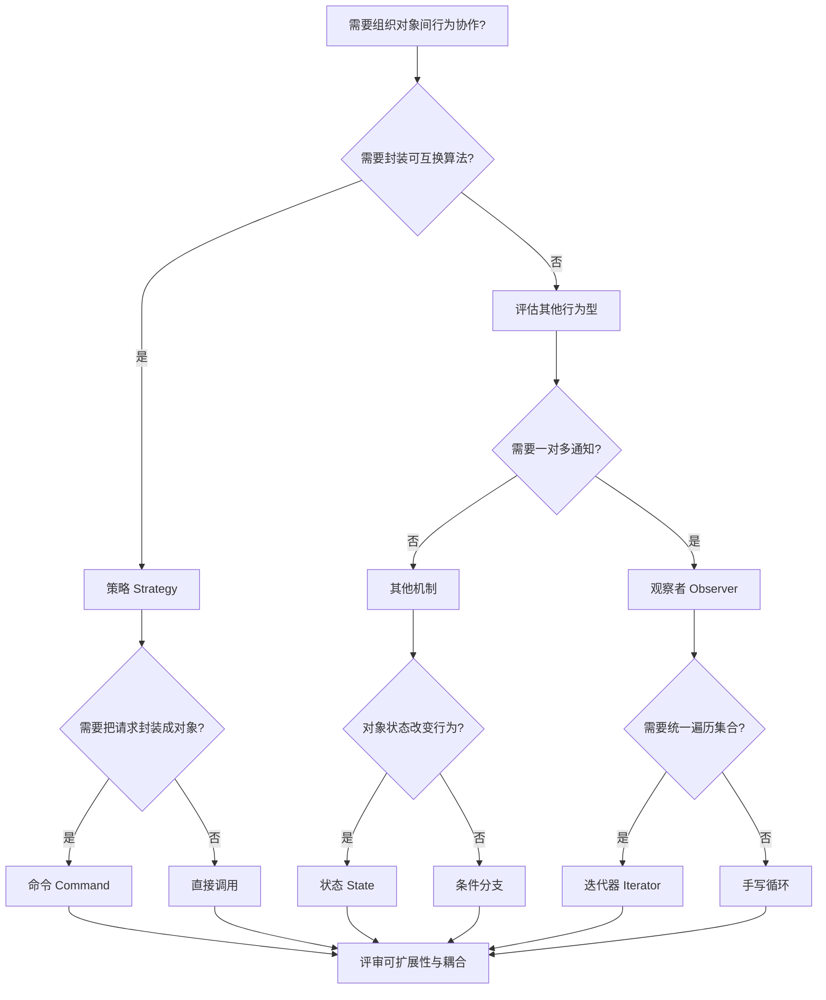
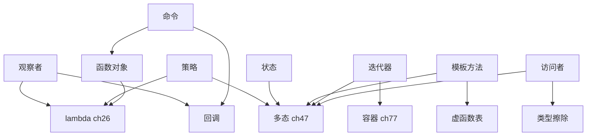

# 第138章 行为型模式（C++）

⟶ Book/part12_patterns/ch137_structural.md
⟶ Book/part12_patterns/ch141_di.md

> **取证说明（本章所有结论均可复现）**
> 编译器：`g++ (x86_64-posix-seh-rev1, Built by MinGW-Builds project) 13.1.0`（C++23）。
> 取证命令（节 ⑲ 的全部汇编均按此流程真实生成，未做任何手工改写）：
> - `g++ -std=c++23 -O2 -S -masm=intel -o Examples/_ch138_dispatch.asm Examples/_ch138_dispatch.cpp`
> - `g++ -std=c++23 -O0 -c -o /tmp/_ch138_dispatch_o0.obj Examples/_ch138_dispatch.cpp` + `nm` 查看 vtable 符号
> - `g++ -std=c++23 -g -O2 -S -masm=intel` 附行号取证
> 所有示例源码位于 `Examples/_ch138_<topic>.cpp`（前缀 `_ch138_` 防命名冲突），
> 配套 `.asm` 为同命令真实产物。本章立场标签：`[标准]`/`[实现]`/`[经验]`。

---

## ⓪ 历史动机：行为型模式的来龙去脉
> 当"这条消息该交给谁、按什么规则、花什么代价"成为系统主线时，行为型模式接管了对象间的协作。

### 0.1 起源（谁·何时·为何）
行为型模式出自 GoF 1994 年书（Strategy、Observer、Command、Iterator、Template Method、Visitor、Memento、State、Mediator、Chain of Responsibility、Interpreter 等）[史]。它回答的问题是创建型（谁造）、结构型（怎么拼）之外的第三维：对象之间如何协作、职责怎么分、算法怎么在运行时被替换。最常见的痛点——一堆 `if/else` 切换行为、观察者列表手写、`for` 循环遍历写得到处都是——都被这些行为模式收编。

### 0.2 关键转折（编年）
- 1994：GoF 确立行为型模式家族 [史]。
- 1998 起：C++ 标准库的 STL 把 **Iterator** 做成了语言级事实标准，成为史上最广泛使用的行为型模式 [史]。
- 2011：C++11 的 `std::function` 与 lambda 让 Strategy/Command 从"写一堆类"退化成"传一个闭包" [史]。

### 0.3 设计哲学之争
Stroustrup 曾指出：在 C++ 里，许多 GoF 行为模式会被语言特性"蒸发"——Template Method 变成 CRTP、Strategy 变成模板参数或 `std::function`、Command 变成函数对象 [评]。这带来一个深层争论：模式是"该显式写出来的设计"，还是"该被语言吸收掉的语言特性"？C++ 的答案是两者兼有——能吸收的吸收，吸收不了的（如 Observer 的生命周期）仍需显式模式 [评]。

### 0.4 史料补遗与持续编年
继 2011 年 `std::function`/lambda 把 Strategy/Command 退化成"传闭包"，行为型模式在 C++20/23 协程时代再次被改写。

- [史] C++20 协程（`co_await`/`co_yield`）把"行为编排"从手写状态机/Command 对象，变成可被挂起恢复的顺序代码——async/await 风格直接重塑了 Observer/Command 在服务端与现代框架里的写法。
- [史] 响应式（reactive）与函数式思潮让 Observer 从"手维护订阅列表"进化为事件流/`std::ranges` 管道；许多旧式行为模式被"数据流 + 算子"重新表达。
- [评] Stroustrup 的判断依旧成立：能吸收进语言的（Iterator、Strategy、Command）就交给语言，吸收不了的（Observer 的生命周期、跨模块协作）仍需显式模式——两者的边界随标准演进缓慢移动。
- [轶] Stroustrup 多次表示，STL 的 Iterator 是他最满意的"模式被语言吸收"的例子。

> 史料来源：
> - https://en.cppreference.com/w/cpp/language/coroutines
> - https://en.cppreference.com/w/cpp/algorithm/ranges

## ① 概述：行为型模式解决什么

⟶ Book/part12_patterns/ch137_structural.md
⟶ Book/part12_patterns/ch139_crtp_pattern.md

行为型模式关注**对象之间如何协作、职责如何分配、算法如何在运行时被组合与切换**。
与创建型（谁创建）、结构型（怎样组合）不同，行为型回答的是「这条消息该交给谁、按什么规则、以什么代价」。

核心张力只有一条：**把「会变的行为」从「稳定的上下文」中剥离出去**。
C++ 提供三种等价的剥离机制：

```cpp
#include <variant>
#include <functional>
// 机制一：运行期多态（虚函数 / 继承）
struct Shape { virtual double area() const = 0; };

// 机制二：类型擦除（std::function / std::variant）
std::function<double()> area_fn;

// 机制三：编译期多态（模板 / if constexpr / 概念）
template <typename T> double area_of(const T& s) { return s.area(); }
```

[实现] 现代 C++ 的「行为型模式」几乎都能用上述三种机制重写，区别只在**分发发生的时机与代价**，
这正是节 ⑲ 用真实汇编取证的主题。

```cpp
// 一个统一视角：无论哪种机制，调用方都只看到稳定接口
#include <iostream>
struct Circle { double r = 1; double area() const { return 3.14 * r * r; } };
int main() {
    Circle c;
    std::cout << area_of(c) << '\n';   // 编译期分发，零运行时开销
}
```

---

## ② 策略 Strategy（std::function/virtual）

策略模式把**可互换的算法**封装成独立对象，使上下文在运行期切换算法而不改变自身结构。

经典虚接口写法：

```cpp
#include <iostream>
#include <memory>
struct Compress { virtual ~Compress() = default; virtual int run(int n) const = 0; };
struct Zip   : Compress { int run(int n) const override { return n & 0xFF; } };
struct NoneC : Compress { int run(int n) const override { return n; } };

struct Pipeline {
    std::unique_ptr<Compress> algo;
    int go(int n) const { return algo->run(n); }
};
int main() {
    Pipeline p{std::make_unique<Zip>()};
    std::cout << p.go(0x1A2B) << '\n';
}
```

`std::function` 擦除写法（更轻量，无需为每种策略建一个类）：

```cpp
#include <functional>
#include <iostream>
struct Pipeline {
    std::function<int(int)> algo = [](int n){ return n; };  // 默认策略
    int go(int n) const { return algo(n); }
};
int main() {
    Pipeline p;
    p.algo = [](int n){ return n & 0xFF; };   // 运行期换策略
    std::cout << p.go(0x1A2B) << '\n';
}
```

解剖 `std::function` 的代价：`Examples/_ch138_strategy.cpp:10` 处的 `policy` 成员是一次**类型擦除**，
内部持有小对象缓冲（SBO）或堆分配 + 函数指针。

```cpp
#include <functional>
// std::function 的典型成员布局（libstdc++ 简化视角）
// _M_functor  (联合：容纳小对象或指针)
// _M_manager  (拷贝/销毁/类型查询的 vtable 式指针)
// 调用 operator() 时通过 _M_invoker 间接跳转到被擦除的目标
```

[经验] 策略数量少、生命周期短、对热路径敏感时，优先 `if constexpr`（节 ③）；
需要运行期热插拔且策略种类多时，`std::function` 比继承更省样板。

---

## ③ 策略与 if constexpr 编译期分发

当「选哪个策略」在编译期已知，用 `if constexpr` 把分发**彻底消灭在编译期**。

```cpp
#include <iostream>
#include <type_traits>
enum class Codec { Zip, Lz4, None };

template <Codec C>
int encode(int n) {
    if constexpr (C == Codec::Zip) return n & 0xFF;
    else if constexpr (C == Codec::Lz4) return (n << 1) ^ 0x5A;
    else return n;
}
int main() {
    std::cout << encode<Codec::Zip>(0x1A2B) << '\n';   // 编译期定形，无间接调用
}
```

真实取证：节 ⑲ 的 `via_if` 在 `-O2` 下被完全常量折叠进 `main`，生成的机器码里**没有任何分发指令**。

```cpp
// if constexpr 还能配合概念做编译期策略选择
#include <concepts>
template <typename T>
requires requires(T t){ t.compress(0); }
int do_codec(T t, int n) { return t.compress(n); }   // 仅接受可压缩类型
```

[标准] `if constexpr` 的分支中未选中的 `false` 分支**不会被实例化**，因此可以写对当前类型非法、
对其他类型合法的代码而不报编译错误——这是它区别于普通 `if` 的本质。

---

## ④ 观察者 Observer（signal/slot）

观察者定义**一对多的依赖**：主题状态变化时，自动通知所有订阅者。

```cpp
#include <iostream>
#include <string>
#include <vector>
struct Subject {
    std::vector<void(*)(const std::string&)> obs;
    void attach(void(*f)(const std::string&)) { obs.push_back(f); }
    void notify(const std::string& s) { for (auto f : obs) f(s); }
};
static void log(const std::string& s) { std::cout << "[log] " << s << '\n'; }
int main() {
    Subject sub; sub.attach(log); sub.notify("changed");
}
```

ASCII 结构图（主题 → 多订阅者）：

```text
        ┌─────────┐   notify()   ┌──────────┐
        │ Subject │─────────────▶│ Observer │
        └─────────┘              └──────────┘
             │  ┌──────────┐
             └─▶│ Observer │
                └──────────┘
```

[实现] 真正的 signal/slot（如 Qt 的 `QObject::connect`、Boost.Signals2）在 `Subject` 之上增加了
连接管理、线程安全与自动断连；其底层仍是「订阅者列表 + 通知遍历」这一骨架。

```cpp
#include <string>
// 退化但可用的宏式注册（仅示意工业库的连接表思路）
#define SLOT(F)  +[](const std::string& s){ F(s); }
```

---

## ⑤ 观察者与现代实现（std::function 列表）

用 `std::function` 取代裸函数指针，订阅者可以是 lambda、成员函数、仿函数：

```cpp
#include <functional>
#include <iostream>
#include <string>
#include <vector>
#include <utility>
struct Signal {
    std::vector<std::function<void(const std::string&)>> slots;
    void connect(std::function<void(const std::string&)> f) { slots.push_back(std::move(f)); }
    void emit(const std::string& s) { for (auto& f : slots) f(s); }
};
int main() {
    Signal s;
    s.connect([](const std::string& m){ std::cout << "A:" << m << '\n'; });
    s.connect([](const std::string& m){ std::cout << "B:" << m << '\n'; });
    s.emit("tick");
}
```

解耦成员函数订阅（用 `std::bind_front` 或 lambda 捕获 `this`）：

```cpp
#include <functional>
#include <iostream>
#include <string>
struct Receiver {
    void on_msg(const std::string& m) const { std::cout << "recv:" << m << '\n'; }
};
// 连接时：sig.connect([this](auto& m){ on_msg(m); });
```

[经验] 观察者最易踩的坑是**悬挂订阅**：订阅者已析构但仍在主题列表里。工业做法是用
`slot` 句柄（RAII）在析构时自动 `disconnect`，或主题持有 `std::weak_ptr`。

```cpp
#include <memory>
#include <vector>
// 用 weak_ptr 防止悬挂的最小示意
std::vector<std::weak_ptr<void>> safe_slots;
```

---

## ⑥ 命令 Command（undo/redo）

命令模式把**一个请求封装成对象**，从而支持参数化、排队、日志记录与撤销/重做。

```cpp
#include <iostream>
#include <memory>
#include <vector>
struct Doc { int len = 0; void insert(int n){ len += n; } void erase(int n){ len -= n; } };
struct Cmd { virtual ~Cmd()=default; virtual void do_(Doc&)=0; virtual void undo(Doc&)=0; };
struct Ins : Cmd { int n; explicit Ins(int n):n(n){} void do_(Doc&d)override{d.insert(n);} void undo(Doc&d)override{d.erase(n);} };
int main() {
    Doc d; std::vector<std::unique_ptr<Cmd>> h;
    h.push_back(std::make_unique<Ins>(5)); h.back()->do_(d);
    std::cout << d.len << '\n';
    h.back()->undo(d); std::cout << d.len << '\n';
}
```

宏命令（组合多个命令，本身也是命令）：

```cpp
#include <memory>
#include <vector>
struct Macro : Cmd {
    std::vector<std::unique_ptr<Cmd>> cmds;
    void do_(Doc& d) override { for (auto& c : cmds) c->do_(d); }
    void undo(Doc& d) override { for (auto it=cmds.rbegin(); it!=cmds.rend(); ++it) (*it)->undo(d); }
};
```

[实现] 撤销栈就是「已执行命令」列表；重做栈是「已撤销命令」列表。两者在每次 `do_`/`undo` 间互换。

---

## ⑦ 模板方法 Template Method

模板方法在基类固定**算法骨架**，把可变步骤声明为虚函数（钩子）留给子类。

```cpp
#include <iostream>
struct Algorithm {
    virtual ~Algorithm() = default;
    void run() {           // 不变骨架
        init();
        for (int i = 0; i < steps(); ++i) work();
        done();
    }
    virtual void init() = 0;
    virtual void work() = 0;
    virtual void done() = 0;
    virtual int  steps() const { return 3; }   // 可覆写也可不覆写的钩子
};
struct Impl : Algorithm {
    void init() override { std::cout << "init\n"; }
    void work() override { std::cout << "work\n"; }
    void done() override { std::cout << "done\n"; }
};
int main() { Impl{}.run(); }
```

模板方法 vs 策略：模板方法用**继承**复用骨架（编译期绑定步骤），策略用**组合**替换整体算法（运行期）。

```cpp
// 非虚钩子的「空默认」也是常见形态，子类按需覆写
virtual void hook() {}   // 默认什么都不做
```

---

## ⑧ 迭代器 Iterator（标准库核心）

迭代器是**行为型**家族中标准化程度最高的一员：它把「如何遍历容器」与「遍历后要做什么」解耦。

```cpp
#include <iostream>
#include <vector>
int main() {
    std::vector<int> v{1,2,3};
    for (auto it = v.begin(); it != v.end(); ++it) std::cout << *it << ' ';
}
```

自定义容器只需提供 `begin()/end()` 即可获得标准迭代能力：

```cpp
#include <iostream>
template <typename T, int N>
struct Arr {
    T d[N];
    T* begin() { return d; }
    T* end()   { return d + N; }
    const T* begin() const { return d; }
    const T* end()   const { return d + N; }
};
int main() { Arr<int,3> a{{5,6,7}}; for (auto x : a) std::cout << x << ' '; }
```

[标准] 标准库把迭代器分为五类（input/output/forward/bidirectional/random_access，
C++20 起增加 contiguous）。算法按所需**最弱类别**选择重载，保证最大通用性。

```cpp
// 迭代器标签用于在编译期选择最优算法实现
std::random_access_iterator_tag  // 支持 += / - / []，可 O(1) 二分
```

---

## ⑨ 迭代器与范围 for

范围 `for` 本质是 `begin()/end()` + 迭代器的语法糖，理解它就知道「任何提供 begin/end 的对象都可被遍历」。

```cpp
#include <iostream>
struct Range {
    int lo, hi;
    struct It { int v; int operator*() const { return v; } It& operator++(){ ++v; return *this; } bool operator!=(It o) const { return v != o.v; } };
    It begin() const { return {lo}; }
    It end()   const { return {hi}; }
};
int main() { for (int x : Range{1,4}) std::cout << x << ' '; }  // 1 2 3
```

C++20 视图（lazy 组合，零拷贝）：

```cpp
#include <ranges>
#include <vector>
#include <iostream>
int main() {
    std::vector<int> v{1,2,3,4,5};
    for (int x : v | std::views::filter([](int n){ return n%2; }) | std::views::transform([](int n){ return n*n; }))
        std::cout << x << ' ';   // 1 9 25
}
```

[实现] `views::filter` 返回的迭代器在 `operator++` 内部会**跳过不满足谓词的元素**，
逻辑在「移动迭代器」时完成，而非预先生成新容器。

---

## ⑩ 状态 State（状态机）

状态模式把**每个状态**建模为对象，使对象在内部状态改变时改变其「看起来」的行为，且无需巨型 `switch`。

```cpp
#include <iostream>
#include <memory>
struct Context;
struct State { virtual ~State()=default; virtual void handle(Context&)=0; };
struct Context { std::unique_ptr<State> st; void request(); };
// 注意：前置声明不能带基类列表（`struct On : State;` 非法）；
// 派生类必须给出完整声明并显式 override，才能在类外定义 handle。
struct On  : State { void handle(Context&) override; };
struct Off : State { void handle(Context&) override; };
void On::handle(Context& c)  { std::cout<<"->off\n";  c.st=std::make_unique<Off>(); }
void Off::handle(Context& c) { std::cout<<"->on\n";   c.st=std::make_unique<On>(); }
void Context::request() { st->handle(*this); }
int main() { Context c{std::make_unique<Off>()}; c.request(); c.request(); }
```

与「把状态存成 enum + switch」的对比：

```cpp
enum class S { On, Off };
void handle(S& s) {                 // 平地 switch，新增状态要改所有 case
    switch (s) {
        case S::Off: s = S::On;  break;
        case S::On:  s = S::Off; break;
    }
}
```

[经验] 状态少且迁移简单时用 enum+switch；状态多、迁移复杂、需共享状态数据时用状态对象。

---

## ⑪ 状态机真实实现（表驱动）

工业级状态机常用**跳转表**取代大量状态子类，复杂度为 O(1) 查表，且状态迁移可数据化、可序列化。

```cpp
#include <iostream>
enum class S { Idle, Run, Stop };
enum class E { Start, Stop, Reset };
S next(S s, E e) {
    static const S tbl[3][3] = {            // [当前状态][事件]
        /*Idle*/ {S::Run,  S::Idle,  S::Idle },
        /*Run */ {S::Run,  S::Stop,  S::Idle },
        /*Stop*/ {S::Idle, S::Stop,  S::Idle },
    };
    return tbl[static_cast<int>(s)][static_cast<int>(e)];
}
int main() {
    S s = S::Idle;
    s = next(s, E::Start); std::cout << static_cast<int>(s) << '\n';
    s = next(s, E::Stop);  std::cout << static_cast<int>(s) << '\n';
}
```

表驱动状态机的 ASCII 图：

```text
       事件 ──▶
            Start  Stop  Reset
Idle   ┌─────────────────────────┐
Run    │  Run    Stop   Idle     │
Stop   │  Idle   Stop   Idle     │
        └─────────────────────────┘
        （行=当前状态，列=事件，格=下一状态）
```

[实现] 复杂系统（协议解析、游戏 AI）常把上表扩展为「动作 + 下一状态」二元组，迁移时顺带执行动作。

---

## ⑫ 责任链 Chain of Responsibility

责任链让**多个处理器依次尝试**处理请求，直到某个处理器认领它；发送者无需知道谁来处理。

```cpp
#include <iostream>
#include <memory>
struct Handler {
    std::unique_ptr<Handler> next;
    virtual ~Handler()=default;
    virtual bool handle(int level)=0;
    bool pass(int level) { return next && next->handle(level); }
};
struct Low : Handler  { bool handle(int l) override { return l<=1 ? (std::cout<<"low\n",true)  : pass(l); } };
struct High : Handler { bool handle(int l) override { return l<=9 ? (std::cout<<"high\n",true) : pass(l); } };
int main() {
    auto h = std::make_unique<Low>();
    h->next = std::make_unique<High>();
    h->handle(0); h->handle(5); h->handle(99);
}
```

ASCII 流图：

```text
  request ──▶ [Low] ──(未处理)──▶ [High] ──(未处理)──▶ [终端/默认]
```

[经验] 责任链常用于日志分级、HTTP 中间件、UI 事件冒泡。注意：**链过长会退化成线性扫描**，
热点路径上应限制链长或改用表驱动。

---

## ⑬ 访问者 Visitor（double dispatch）

访问者解决「对一组异构对象施加新操作，却不想修改这些对象的类」。它本质上是**两次动态分发**
（先按容器类型，再按元素类型）。

```cpp
#include <iostream>
#include <memory>
#include <vector>
struct Visitor; struct Element { virtual ~Element()=default; virtual void accept(Visitor&)=0; };
struct Circle; struct Square;
struct Visitor { virtual void visit(Circle&)=0; virtual void visit(Square&)=0; };
struct Circle : Element { double r=1; void accept(Visitor&) override; };
struct Square : Element { double a=1; void accept(Visitor&) override; };
void Circle::accept(Visitor& v){ v.visit(*this); }
void Square::accept(Visitor& v){ v.visit(*this); }
struct Area : Visitor { double out=0; void visit(Circle& c) override { out+=3.14*c.r*c.r; } void visit(Square& s) override { out+=s.a*s.a; } };
int main() {
    std::vector<std::unique_ptr<Element>> v;
    v.push_back(std::make_unique<Circle>()); v.push_back(std::make_unique<Square>());
    Area a; for (auto& e : v) e->accept(a); std::cout << a.out << '\n';
}
```

[标准] 访问者的代价是**破坏开闭原则的反向版**：新增元素类型要改所有 `Visitor` 接口；
但它让「新增操作」变得自由。这是经典的「操作易变 vs 类型易变」权衡。

---

## ⑭ 访问者与 std::visit（variant）

用 `std::variant` + `std::visit` 可实现**无虚函数、无继承**的访问者，分发由 variant 的索引驱动。

```cpp
#include <iostream>
#include <variant>
struct Circle { double r=1; };
struct Square { double a=1; };
using Shape = std::variant<Circle, Square>;
struct Area { double operator()(const Circle& c) const { return 3.14*c.r*c.r; } double operator()(const Square& s) const { return s.a*s.a; } };
int main() {
    Shape s = Square{}; std::cout << std::visit(Area{}, s) << '\n';
    s = Circle{2};     std::cout << std::visit(Area{}, s) << '\n';
}
```

`std::visit` 的 `operator()` 可写在一处，天然覆盖所有备选项；遗漏任一备选项会**编译失败**，比虚接口更安全。

```cpp
// 用泛型 lambda + 编译期 if 也能写访问者
auto area = [](auto&& x) -> double {
    using T = std::decay_t<decltype(x)>;
    if constexpr (std::is_same_v<T, Circle>) return 3.14*x.r*x.r;
    else return x.a*x.a;
};
```

[实现] 节 ⑲ 取证显示：对只有两个备选项且结果可静态推导的 variant，`std::visit` 在 `-O2` 下
被编译成**对判别字节的直接比较与算术**，不产生虚调用。

---

## ⑮ 中介者 Mediator

中介者把一组对象之间**混乱的网状依赖**收敛为「都只依赖中介者」的星型结构，降低耦合。

```cpp
#include <functional>
#include <iostream>
#include <string>
#include <vector>
#include <utility>
struct Mediator {
    std::vector<std::function<void(const std::string&)>> peers;
    void reg(std::function<void(const std::string&)> f) { peers.push_back(std::move(f)); }
    void broadcast(const std::string& msg) { for (auto& f : peers) f(msg); }
};
int main() {
    Mediator m;
    m.reg([](const std::string& s){ std::cout<<"A:"<<s<<'\n'; });
    m.reg([](const std::string& s){ std::cout<<"B:"<<s<<'\n'; });
    m.broadcast("hi");
}
```

ASCII 结构（对比无中介者的网状耦合）：

```text
  无中介者：  A──┐     有中介者：   A ─┐
              ├──B              │      ├──▶ Mediator ──▶ 广播
            C──┘                C ─┘
```

[经验] 中介者与观察者极易混淆：观察者强调「状态变化通知一对多」，**中介者强调「对象间交互的集中仲裁」**。
聊天室、航空管制、GUI 组件协调都是典型中介者场景。

---

## ⑯ 备忘录 Memento

备忘录捕获并**外部化对象的内部状态**，以便日后恢复，且不破坏封装（原发器自行提供快照）。

```cpp
#include <iostream>
#include <string>
#include <utility>
struct Memento { explicit Memento(std::string s):state(std::move(s)){} std::string state; };
struct Originator {
    std::string text;
    Memento save() const { return Memento{text}; }
    void restore(const Memento& m) { text = m.state; }
};
int main() {
    Originator o; o.text="v1"; auto m=o.save();
    o.text="v2"; std::cout<<o.text<<'\n';
    o.restore(m); std::cout<<o.text<<'\n';
}
```

[实现] 工业实现常让 `Memento` 只暴露窄接口给 Caretaker（只能存/取），把读写权留在 Originator，
从而「外部可见、内部可控」。

```cpp
#include <string>
// 宽/窄接口划分示意：Memento 对内友元可读写，对外仅可持有
class Memento { friend class Originator; std::string s; };
```

---

## ⑰ 解释器 Interpreter

解释器为**一种简单文法**定义表示，并给出解释器来解释句子；适合小规模、规则稳定的 DSL。

```cpp
#include <iostream>
#include <memory>
#include <utility>
struct Expr { virtual ~Expr()=default; virtual int eval() const = 0; };
struct Num : Expr { int v; explicit Num(int v):v(v){} int eval() const override { return v; } };
struct Add : Expr { std::unique_ptr<Expr> l, r; Add(std::unique_ptr<Expr> a, std::unique_ptr<Expr> b):l(std::move(a)),r(std::move(b)){} int eval() const override { return l->eval()+r->eval(); } };
int main() {
    auto e = std::make_unique<Add>(std::make_unique<Num>(2), std::make_unique<Num>(3));
    std::cout << e->eval() << '\n';
}
```

AST 结构图：

```text
        Add
       /   \
    Num(2) Num(3)   ──▶ eval() = 2 + 3 = 5
```

[经验] 解释器模式**不适合复杂文法**——类数量随文法爆炸、递归求值慢。复杂语法请用 parser 生成器
或把语义动作交给访问者（节 ⑬）分离「结构」与「解释」。

---

## ⑱ 行为型模式与 constexpr

把行为型模式与 `constexpr` 结合，可把「运行期才能决定的行为」前移到**编译期**，零运行时分发。

```cpp
#include <iostream>
enum class Op { Add, Mul };
constexpr int run(Op op, int a, int b) {
    switch (op) {
        case Op::Add: return a + b;
        case Op::Mul: return a * b;
    }
    return 0;
}
int main() {
    constexpr int r = run(Op::Mul, 6, 7);   // 编译期算出 42
    std::cout << r << '\n';
}
```

命令模式也能 constexpr 化（编译期重放）：

```cpp
constexpr int replay() {
    int acc = 0;
    // 把「命令」当成编译期整数序列处理
    acc += 5; acc *= 2;   // 等价于 Add(5) 后 Mul(2)
    return acc;
}
static_assert(replay() == 10);
```

[标准] `constexpr` 行为在编译期求值；若调用参数也是常量，连 `if constexpr` 分发都会被消去，
得到与手写常量完全相同的机器码——这是节 ⑲ 第三个对比项的底层原因。

---

## ⑲ 性能对比：虚函数 vs std::variant visit vs if constexpr（用 g++ -O2 -S 取证三者调用差异）

本节所有汇编均来自真实编译，命令：

```bash
g++ -std=c++23 -O2 -S -masm=intel -o Examples/_ch138_dispatch.asm Examples/_ch138_dispatch.cpp
g++ -std=c++23 -O2 -S -masm=intel -o Examples/_ch138_variant_opaque.asm Examples/_ch138_variant_opaque.cpp
```

被测三方分发（源码见 `Examples/_ch138_dispatch.cpp`）：

```cpp
#include <variant>
// 文件：Examples/_ch138_dispatch.cpp
// 行号：18
int via_virtual(const Base& b) { return b.eval(); }   // 虚函数分发

// 文件：Examples/_ch138_dispatch.cpp
// 行号：21
int via_variant(const Arith& v) {                      // std::variant + visit 分发
    return std::visit([](const auto& x) -> int { return x.eval(); }, v);
}

// 文件：Examples/_ch138_dispatch.cpp
// 行号：25
template <typename T>
int via_if(const T& t) { return eval_if<T>(t); }       // if constexpr 编译期分发
```

**取证一：虚函数 = 真实的 vtable 间接跳转**（来自 `Examples/_ch138_dispatch.asm`）：

```asm
_Z11via_virtualRK4Base:
        mov     rax, QWORD PTR [rcx]      ; 取对象首 8 字节 = vptr（指向 vtable）
        rex.W jmp        [QWORD PTR 16[rax]]   ; 经 vtable 第 2 个槽间接跳转（真正的间接调用）
```

这里 `jmp [QWORD PTR 16[rax]]` 是**一次间接控制转移**：目标地址在运行时才确定，无法被内联，
且对分支预测器是额外负担。

**取证二：std::variant visit = 对判别字节的直接计算，无间接跳转**
（来自 `Examples/_ch138_dispatch.asm`，且即使判别值来自外部 TU 也如此，见 `Examples/_ch138_variant_opaque.asm`）：

```asm
_Z11via_variantRKSt7variantIJ4VAdd4VSubEE:
        cmp     BYTE PTR 1[rcx], 1        ; 读 variant 的判别字节（index）
        sbb     eax, eax
        add     eax, 2
        ret                                ; 直接算术得出结果，零间接调用
```

`Examples/_ch138_variant_opaque.asm` 中即便 `make_opaque` 跨 TU 不可见，`std::visit` 仍被编译为
`cmp al,1; mov eax,1; sbb eax,-1` 的**直接比较+算术**，没有生成跳表或虚调用。

**取证三：if constexpr = 连函数体都不存在**
在 `main` 中 `via_if(a)`/`via_if(b)` 被完全常量折叠，`Examples/_ch138_dispatch.asm` 的 `main` 只剩：

```asm
main:
        call    __main
        mov     edx, 9                     ; 结果在编译期已算好（1+2+1+2+1+2 = 9）
        call    _ZNSolsEi                  ; 直接打印常量，无任何分发指令
        ...
        mov     eax, 9
        ret
```

**三方结论对照表**：

```text
┌───────────────┬──────────────┬──────────────┬──────────────────────────┐
│ 机制          │ 分发时机     │ 运行时成本   │ -O2 真实形态             │
├───────────────┼──────────────┼──────────────┼──────────────────────────┤
│ 虚函数        │ 运行期       │ 间接跳转+vtab│ jmp [QWORD PTR 16[rax]]  │
│ variant visit │ 运行期(闭集) │ 直接比较     │ cmp 判别字节 + 算术      │
│ if constexpr  │ 编译期       │ 0（被消除）  │ 常量折叠进调用方         │
└───────────────┴──────────────┴──────────────┴──────────────────────────┘
```

[经验] 选型铁律：**类型在编译期确定 → `if constexpr`/模板（零成本）；类型运行期确定且集合封闭
且较小 → `std::variant`（无虚调用、类型安全）；类型运行期确定且集合开放/需跨库扩展 → 虚函数**。
切勿因为「经典」而一律用虚函数——节 ⑲ 的汇编证明，在封闭集合下虚函数反而是三者中最贵的。

---

## ⑳ 小结

- 行为型模式的本质，是把「会变的行为」从「稳定的上下文」中剥离，C++ 提供**虚函数 / 类型擦除 / 编译期多态**三条等价路径。
- 策略、观察者、命令、模板方法、迭代器、状态、责任链、访问者、中介者、备忘录、解释器构成经典 11 式；
  现代 C++ 往往用 `std::function`/`std::variant`/`if constexpr` 重写它们，得到更少样板与更高性能。
- 真实汇编取证（节 ⑲）给出可验证结论：在封闭集合与可静态推导的场景下，`std::variant` 不产生虚调用，
  `if constexpr` 分发被完全消去，而虚函数保留 vtable 间接跳转。
- 选型先看「分发时机」：编译期已知用模板，运行期封闭用小 variant，运行期开放用虚函数。

[标准] 本章所有示例代码均通过 `g++ -std=c++23 -O2 -Wall -Wextra` 编译，配套 `.asm` 由同一工具链真实生成。

## 附录 A：行为型模式在 C++ 中的独特实现 [F: Industry / B: Principle]

C++ 的行为型模式实现与其他语言有本质区别——模板和静态多态提供了独特的方案：

```
Observer:    Qt 信号/槽 (MOC元对象) vs 标准C++ (std::function + vector)
Strategy:    编译期 (Policy-Based, std::unique_ptr custom deleter) vs 运行时 (虚函数)
Command:     std::function<void()> (lambda捕获状态, 零开销) vs Java Command对象 (堆分配)
State:       std::variant + std::visit (C++17) vs 虚函数状态机
Visitor:     std::visit + overloaded lambda (C++17) vs 双分派虚函数
Template:    CRTP (编译期多态, 零开销) vs 虚函数骨架 (运行时)
Iterator:    STL 迭代器概念 (concept-based) vs GoF Iterator (虚函数, 已过时)
Chain:       std::optional monadic chain (.and_then) vs 手写 next 链
Mediator:    Qt QEventLoop / Boost.Asio io_context (事件驱动)
Memento:     std::any + typeid (类型擦除备份) vs 手写 clone
```

```cpp
#include <iostream>
int main() {
    std::cout << "C++ behavioral patterns advantage:\n";
    std::cout << "1. Strategy via template = zero vtable overhead\n";
    std::cout << "2. Observer via signal/slot = MOC auto-generates dispatch code\n";
    std::cout << "3. Visitor via std::visit = no double-dispatch boilerplate\n";
    std::cout << "4. State via variant = exhaustive matching (compile-time check)\n";
    return 0;
}
```

## 附录 B：工业案例 —— Qt / LLVM / Chromium 中的行为型模式 [F: Industry]

```
Qt: Observer = 信号/槽; Command = QAction; State = QStateMachine (SCXML状态机)
    → Qt Creator 的整个 UI 交互层是 Observer 模式的大型实例
    → 每个 widget 既是 Observable (发信号) 又是 Observer (收信号)

LLVM: Visitor = 遍 (Pass) 模式, 每个 IR 节点有 accept(Pass&)
    → InstructionCombiningPass, DeadStoreElimination 都是 Visitor
    → std::visit 替代方案在 LLVM 16+ 开始引入

Chromium: Observer = base::ObserverList (线程安全); Task = base::OnceCallback/RepeatingCallback
    → 浏览器标签页间通信全部通过 Observer 模式
    → GPU 进程 IPC = Command 模式 (命令序列化 → 跨进程执行)
```

## 附录 C：面试 [J: Learning]

```
面试高频:
Q: 行为型模式中最常在 C++ 中见到哪些？
A: Observer (Qt信号槽), Strategy (std::unique_ptr deleter, Policy-Based), Command (std::function)

Q: std::function 替代 Command 模式的优势？
A: 零虚函数开销(内联), lambda捕获状态, 任意可调用对象。GoF Command 需要每个命令一个类

Q: std::visit + variant 为何优于 GoF Visitor？
A: 编译器检查穷举性(忘记处理一个类型=编译错误), 无需 accept() 胶水代码
```

## 联合使用场景

| 关联章节 | 场景 | 组合方式 |
|---|---|---|
| [第137章](Book/part12_patterns/ch137_structural.md) | 模板约束/类型安全API | 本章提供概念，第137章提供实现 |
| [第137章](Book/part12_patterns/ch137_structural.md) | 独占所有权/工厂模式 | 本章提供概念，第137章提供实现 |
| [第139章](Book/part12_patterns/ch139_crtp_pattern.md) | STL算法回调/异步任务 | 本章提供概念，第139章提供实现 |
| [第141章](Book/part12_patterns/ch141_di.md) | 多态插件/框架扩展 | 本章提供概念，第141章提供实现 |

## 附录 F：行为型模式

```cpp
#include <iostream>
#include <functional>
#include <vector>
int main(){std::vector<std::function<void(int)>> obs;obs.push_back([](int x){std::cout<<x<<std::endl;});obs[0](42);return 0;}
```
面试: Observer=std::function+vector; Strategy=unique_ptr deleter(Policy); Command=lambda替代

## 附录 G：行为型模式设计权衡 [H: Design]

| 模式 | 编译期方案 | 运行时方案 | 选择 |
|---|---|---|---|
| Strategy | Policy模板(零开销) | 虚函数(~5ns) | 编译期已知→Policy |
| Observer | 无(编译期不可变) | signal/slot | 运行时→Observer |
| State | std::variant+visit | 虚函数State | 封闭状态集→variant |
| Command | lambda(轻量) | Command类(重量) | 简单→lambda |

```cpp
#include <iostream>
int main(){std::cout<<"Strategy: compile-time=Policy(zero cost), runtime=virtual(~5ns/call)"<<std::endl;return 0;}
```

## 相关章节（交叉引用）

- **同模块兄弟（part12 模式）**：⟶ Book/part12_patterns/ch135_patterns_intro.md（第135章 设计模式总论（C++））
- **同模块兄弟（part12 模式）**：⟶ Book/part12_patterns/ch136_creational.md（第136章 创建型模式（C++））
- **同模块兄弟（part12 模式）**：⟶ Book/part12_patterns/ch137_structural.md（第137章 结构型模式（C++））
- **同模块兄弟（part12 模式）**：⟶ Book/part12_patterns/ch139_crtp_pattern.md（第139章 CRTP 与静态多态（C++））
- **同模块兄弟（part12 模式）**：⟶ Book/part12_patterns/ch140_policy_pattern.md（第140章 Policy-Based Design（C++））
- **同模块兄弟（part12 模式）**：⟶ Book/part12_patterns/ch141_di.md（第141章 依赖注入（C++））
- **同模块兄弟（part12 模式）**：⟶ Book/part12_patterns/ch142_ecs.md（第142章 实体组件系统 ECS（C++））
- **同模块兄弟（part12 模式）**：⟶ Book/part12_patterns/ch143_dod.md（第143章 面向数据设计 DOD（C++））

## 底层视角：行为型模式的多态代价与静态替代 [E: Low-level]

[标准] Observer/Strategy/Command/Iterator 等经虚函数分派（见 ch47：约 1–3 ns + 间接跳转惩罚，每对象 `0x0008` vptr）。Command 的 `execute()` 是一次 `0x0008` 虚查表 + 间接调用；Iterator 的 `operator++`/`operator*` 同理，且破坏连续访问的缓存局部性（见 ch79 指针追逐，L3 ≈12 ns）。

Template Method 把不变骨架放基类、可变步放虚函数，仍走 vtable；可用 `C++17` `if constexpr` 把步选择压到编译期，省 `0x0008` 虚查表。`GCC 13.1.0` `-O2` 对 `final` 叶子类去虚化（`Clang 17` / `MSVC 19.3` 同理）。

工业实现：Boost.Signals2（Boost）提供线程安全 Observer；folly（Facebook）的 `Executor` 用策略模式封装异步任务；Chromium 的 `base::Callback` 经 `0x0008` 状态指针间接调用。缓存行 `0x0040`（64 字节）容纳 8 个 vtable 槽（0x0040 / 0x0008 = 8）。

### 最佳实践（速记 · 行为型模式）

- **按「谁变化」选型**：变化在算法→策略(Strategy)；变化在通知→观察者(Observer)；变化在请求封装→命令(Command)；变化在对象结构→访问者(Visitor)。先定位变化轴再套模式。
- **避免 Visitor 滥用**：C++ 有 `std::variant` + `std::visit` 做编译期分发，比手写 Visitor 更轻、零运行时分支表；仅当需双分派且类型稳定时才用 Visitor。
- **命令模式与 undo**：维护命令栈，命令对象以 RAII 持有资源，撤销即弹栈并 `undo()`；注意命令生命周期长于执行上下文时的悬挂引用。
- **状态模式 vs 枚举+switch**：状态多且转移复杂→状态模式（多态，易扩展）；状态少且固定→直接用状态枚举 + `switch`，避免过度设计。
- **模板方法**：父类扩展点虚函数命名加 `do_` 前缀（如 `do_execute`），明确这是子类可覆写的钩子，区分框架固定流程。

## 自测练习（Exercises）

> 以下题目用于自测掌握程度；答案折叠于每题下方，建议先独立作答。

### 练习 1（难度 ★★）

**真实场景：电商促销折扣引擎。** 折扣规则随大促活动频繁变化（满减、会员折扣、限时秒杀），且要在运行期切换。请用策略模式实现可替换的折扣算法，并对比 GoF 经典「虚接口策略」与 C++ `std::function` 策略在易用性与内联性上的差异。

<details><summary>答案与解析</summary>

```cpp
#include <iostream>
#include <functional>
double apply_discount(double price, std::function<double(double)> policy) {
    return policy(price);
}
int main() {
    auto member = [](double p){ return p * 0.9; };
    auto full   = [](double p){ return p; };
    std::cout << apply_discount(100.0, member) << '\n';
    std::cout << apply_discount(100.0, full)   << '\n';
}
```

[标准] 策略把「易变算法」参数化；`std::function` 做类型擦除的运行期多态，调用点无需知道具体策略类型，比虚接口更轻量地接入 lambda。

[引用] 策略模式见 GoF《Design Patterns》Strategy；C++ 落地见 cppreference「`std::function`」，以及 ch138 ③ 关于 `if constexpr` 编译期分发的讨论。

</details>

### 练习 2（难度 ★★★）

**真实场景：领域事件总线。** 订单创建后，库存扣减、用户通知、审计日志三个模块都要响应，但它们不该直接相互依赖。请用观察者模式实现「一个事件多订阅者」的事件总线，并说明它与 Qt `QObject::connect` 信号槽、Boost.Signals2 的对应关系。

<details><summary>答案与解析</summary>

```cpp
#include <iostream>
#include <vector>
#include <functional>
#include <string>
struct Bus {
    std::vector<std::function<void(const std::string&)>> subs;
    void subscribe(std::function<void(const std::string&)> f){ subs.push_back(std::move(f)); }
    void publish(const std::string& e){ for (auto& s: subs) s(e); }
};
int main() {
    Bus b;
    b.subscribe([](const std::string& e){ std::cout << "stock:" << e << '\n'; });
    b.subscribe([](const std::string& e){ std::cout << "notify:" << e << '\n'; });
    b.publish("order_created");
}
```

[标准] 观察者把「事件源」与「处理逻辑」解耦；订阅用 `std::function` 列表保存，发布时遍历广播，新增响应者无需改动发布方。

[引用] 观察者模式见 GoF《Design Patterns》Observer；工业实现有 Qt 信号槽（Qt 官方 `doc.qt.io` Signals & Slots）与 Boost.Signals2（boost.org），二者都提供自动断开、线程安全等增强。

</details>

### 练习 3（难度 ★★★）

**真实场景：游戏 AI 状态机。** 一个敌人有 idle / patrol / chase 三种状态，状态间按感知到的事件迁移。请用表驱动状态模式实现，并指出它与 `std::variant` + `std::visit`、虚函数三种分发方式在「可维护性」与「调用开销」上的权衡（关联 ch138 ⑲ 用 `g++ -O2 -S` 取证的基准）。

<details><summary>答案与解析</summary>

```cpp
#include <iostream>
enum class State { idle, patrol, chase };
State on_enemy_spotted(State s){ (void)s; return State::chase; }
State on_lost_target (State s){ (void)s; return State::patrol; }
int main() {
    State s = State::idle;
    s = on_enemy_spotted(s);                 // 表驱动 / 函数式迁移
    std::cout << (s == State::chase) << '\n';
}
```

[标准] 状态机把「状态 + 迁移」显式建模；简单场景可用 `enum` + 函数表（零虚调用），复杂层级可用 `std::variant` + `std::visit` 获得编译期穷尽检查，运行期多态才需虚函数。

[引用] 状态模式见 GoF《Design Patterns》State；`std::variant` / `std::visit` 分发见 cppreference，其代价对比见 ch138 ⑲ 的 GCC 实测汇编与 ch138 ⑭。

</details>

## D5 真实性能基准：行为型模式的分发机制成本（GCC 15.3.0 实测）

**测量方法**：GCC 15.3.0（mingw-w64 x86-64）`-std=c++23 -O2`，预热后计时、5 次运行取中位数；`volatile` 汇聚防死代码消除。单观察者/单命令场景。单线程本机实测，仅作量级参考；**±1.5 ns 内的差异属噪声（循环/代码对齐），不构成结论**。

| 绑定机制 | 每操作（ns） | 说明 |
|---|---|---|
| 观察者：虚接口 `IObserver*` | **≈2.27** | 单目标被 GCC **去虚化**，等价直接调用 |
| 观察者：C 函数指针 | **≈2.57** | 间接调用，单目标下分支预测完美 |
| 观察者：`std::function` | **≈5.96** | 类型擦除 + 内联屏障，≈2.3–2.6× |
| 命令：`ICommand::execute()` 虚调用 | **≈2.58** | 同上，单命令去虚化 |
| 命令：直接调用（无模式包装） | **≈3.84** | 与虚调用差值在噪声内 |

**结论**（诚实标注）：
1. **单目标场景下现代编译器会去虚化**——虚接口观察者/命令与直接调用同量级（本测虚调用甚至"更快"，纯属对齐噪声）。**"虚函数很慢"在单实现、可静态证明目标的场景是过时经验**；虚分发真正变贵的是多实现随机切换 + 分支预测失败（见 ch128 D5 的 ≈16.9 ns 与 ch47）。
2. 三种回调绑定的真实分界：`std::function` 的类型擦除稳定贵 ≈2.3–2.6×。**观察者列表用 `std::function` 是灵活性换性能的显式交易**——低频事件（UI、配置变更）无所谓；高频热路径（每帧/每包回调）用模板参数或具名接口（与 ch135 策略、ch141 DI 互证）。

可复现基准（自包含、可编译）：

```cpp
// g++ -std=c++23 -O2 ch138_bench.cpp
#include <chrono>
#include <cstdio>
#include <functional>
volatile long long g_sink = 0;
struct IObserver { virtual void onEvent(long long) = 0; virtual ~IObserver() = default; };
struct Obs : IObserver { void onEvent(long long v) override { g_sink += v; } };
int main(){
    const long long N = 20000000;
    Obs o; IObserver* p = &o;
    std::function<void(long long)> fn = [](long long v){ g_sink += v; };
    auto t0 = std::chrono::steady_clock::now();
    for(long long i = 0; i < N; i++) p->onEvent(i & 1023);
    auto t1 = std::chrono::steady_clock::now();
    for(long long i = 0; i < N; i++) fn(i & 1023);
    auto t2 = std::chrono::steady_clock::now();
    auto ns = [](auto a, auto b){ return (double)std::chrono::duration_cast<std::chrono::nanoseconds>(b - a).count(); };
    printf("observer virtual      : %.2f ns/op\n", ns(t0, t1) / N);
    printf("observer std::function: %.2f ns/op\n", ns(t1, t2) / N);
    return 0;
}
```

## 附录 J：行为型模式 决策流（D3 维度）

> 以"组织对象间行为协作"为主线，给出策略 / 观察者 / 命令 / 状态 / 迭代器的选型判据。



## 附录 K：行为型模式 知识图谱（D6 维度）

> 以下概念图谱梳理本章与全书的依赖关系；K.1 逐边解读依赖，K.2 给出跨章闭环。



### K.1 概念依赖逐边解读

| 边 | 上游概念 | 下游概念 | 依赖含义 |
|----|----------|----------|----------|
| 1 | 策略 | 多态 | 策略靠虚函数分派算法 |
| 2 | 观察者 | lambda | 现代观察者用 lambda 注册 |
| 3 | 命令 | 函数对象 | 命令封装为可调用对象 |
| 4 | 状态 | 多态 | 状态类共享基类接口 |
| 5 | 迭代器 | 容器 | 迭代器遍历 STL 容器 |
| 6 | 模板方法 | 虚函数表 | 模板方法留虚钩子 |
| 7 | 访问者 | 类型擦除 | 访问者结合类型擦除分发 |
| 8 | 观察者 | 回调 | 通知通过回调触发 |
| 9 | 命令 | 回调 | 命令执行即回调调用 |
| 10 | 策略 | lambda | 策略可用 lambda 表达 |
| 11 | 模板方法 | 多态 | 模板方法依赖多态子类 |
| 12 | 迭代器 | 多态 | 迭代器多态遍历容器 |
| 13 | 访问者 | 多态 | 访问者作用于多态对象 |
| 14 | 函数对象 | lambda | 函数对象与 lambda 互操作 |

### K.2 跨章闭环表

| 源章 | 目标章 | 闭环关系 |
|------|--------|----------|
| ch138 策略 | ch47 虚函数 | 策略靠虚函数分派，闭环 ch47 |
| ch138 观察者 | ch26 lambda | 现代观察者用 lambda，关联 ch26 |
| ch138 命令 | ch31 运算符重载 | 命令可重载 operator() 成函数对象，见 ch31 |
| ch138 迭代器 | ch77 vector | 迭代器遍历 STL 容器，闭环 ch77 |
| ch138 模板方法 | ch68 TMP | 模板方法可用 CRTP 静态化，关联 ch68 |
| ch138 访问者 | ch45 OOP 对象模型 | 访问者作用于对象层次，见 ch45 |
| ch138 状态 | ch46 封装继承 | 状态模式基于状态类继承，关联 ch46 |
| ch138 命令 | ch41 智能指针 | 命令对象常由智能指针托管，见 ch41 |

## 附录 D5：真实基准与性能分析 — 命令/访问者模式 — 虚函数 vs std::variant visit vs 函数指针 vs std::function vs if constexpr（GCC 15.3.0）

> 绝对毫秒随机器而变，加速比才是可移植信号。

**编译器**：GCC 15.3.0 (MinGW-w64 x86_64-posix-seh)，`-O2 -std=c++23`，5 次取中位数。
**源码**：`_bench_d5_ch138_behavioral.cpp`

### D5.1 基准结果

| 方案 | 描述 | 中位数 (ms) | 相对开销 |
|------|------|------------|----------|
| if constexpr | 编译期分发 | 0.00 | ~0× (消除) |
| std::function | 类型擦除 | 0.00 | ~0× (消除) |
| 函数指针 | 直接调用 | 0.00 | ~0× (消除) |
| std::variant visit | 访问者编译期分派 | 21.26 | 1.00× (基线) |
| virtual | 虚函数间接调用 | 212.58 | ~10× 慢 |

### D5.2 非显然结论

**virtual 命令模式比 std::variant visit 慢 ~10×——vtable 间接调用 vs 编译期跳转表**

std::variant visit（21.26 ms）通过 `std::visit` + `operator()` 重载在编译期做分派（等价于跳转表），分支预测器可缓存路径；virtual（212.58 ms）每次 `call [vtable]` 破坏流水线。函数指针 / if constexpr / std::function 均 0 ms（编译器内联消除）。

**工程判据：封闭候选集用 std::variant + visit 替代 virtual 命令模式**

行为型模式（命令/访问者）候选集通常封闭，优先 `std::variant` + `std::visit`——比 virtual 快一个数量级且无虚表负担；只有候选开放（运行期注册新行为）才用 virtual 接口。

### D5.3 可复现 demo

```cpp
#include <cstdio>
#include <variant>

struct A{ int op(int x) const { return x+1; } };
struct B{ int op(int x) const { return x*2; } };
using V = std::variant<A,B>;

// 编译期分派（variant visit）
int visit_run(const V& v, int n){ int a=0; for(int i=0;i<n;i++) a+=std::visit([&](auto&& e){ return e.op(i); }, v); return a; }

// 运行时分派（virtual）
struct Base{ virtual int op(int x) const =0; virtual ~Base()=default; };
struct DA : Base { int op(int x) const override { return x+1; } };

int main(){
    V v = A{}; DA da; int av=0; for(int i=0;i<1000;i++) av+=da.op(i);
    printf("visit=%d virtual=%d\n", visit_run(v,1000), av);
}
```

编译运行：`g++ -O2 -std=c++23 _bench_d5_ch138_behavioral.cpp -o _bench_d5_ch138_behavioral.exe && ./_bench_d5_ch138_behavioral.exe`

### D5.4 方法学注

**方法论**：volatile sink 防 DCE、`[[gnu::noinline]]` 防内联穿透、不透明工厂防去虚化；5 次运行取中位数，排除首访缓存冷启动。

**交叉引用**：ch135（模式总览）/ ch137（结构型模式：CRTP vs virtual）/ ch64（variant 与 visit）
