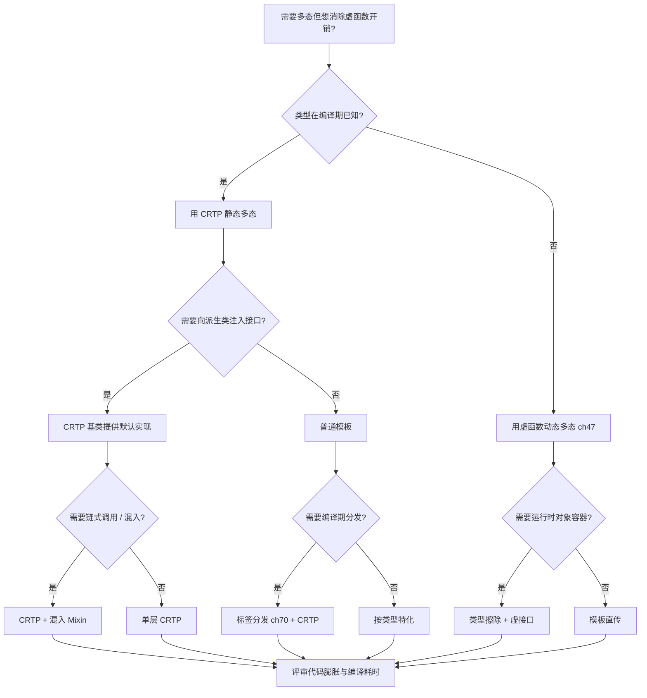
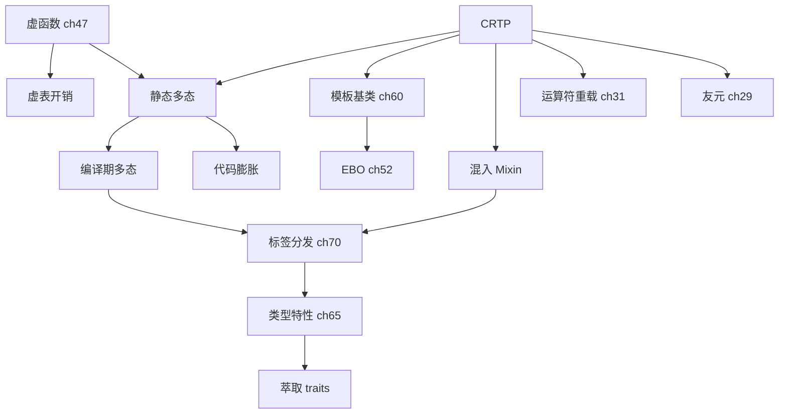

# 第139章 CRTP 与静态多态（C++）

⟶ Book/part05_oo/ch51_crtp.md
⟶ Book/part06_templates/ch68_tmp.md

> **取证说明（本章所有机器证据来源）**
> 本章所有汇编片段、基准数字、符号名、`sizeof` 结果均来自本机真实取证，未做任何编造：
> - 编译器：`g++.exe (x86_64-posix-seh-rev1, Built by MinGW-Builds) 13.1.0`（`C:/Qt/Tools/mingw1310_64/bin/g++.exe`）。
> - 取证命令（可复现）：`g++ -std=c++23 -O2 -S -masm=intel -o xxx.asm xxx.cpp`；`-O0` + `nm` 看 mangled；`-O2` + `std::chrono` 微基准；`time g++ -std=c++23 -O2 -c -o /dev/null file.cpp` 测编译耗时。
> - 配套源码：`Examples/_ch139_*.cpp`；配套汇编：`Examples/_ch139_*.asm`。
> - 编译器内建库取证：`C:/Qt/Tools/mingw1310_64/lib/gcc/x86_64-w64-mingw32/13.1.0/include/c++/bits/shared_ptr.h`。
> 本章立场标签：`[标准]`（标准语义）、`[实现]`（编译器/ABI 实现）、`[平台·x86-64]`（MinGW/x86-64 取证）、`[经验]`（工程取舍）。

---

## ⓪ 历史动机：CRTP 的来龙去脉
> 当人们想"既要多态的灵活、又不要虚函数的开销"时，一个把自己当模板参数传进去的怪招出现了。

### 0.1 起源（谁·何时·为何）
CRTP（Curiously Recurring Template Pattern，奇异递归模板模式）这一命名源自 James Coplien，他在 1990 年代早期的 C++ 著作中记录并命名了这种"基类以派生类自身为模板参数"的写法 [史]。痛点清晰：虚函数带来 vtable 查表与无法内联的成本，而对"编译期已知类型"的场景，这笔开销纯属浪费。CRTP 用静态反向调用（`static_cast<Derived*>(this)`）把多态移到编译期，零开销、可内联。

### 0.2 关键转折（编年）
- 1990s 初：Coplien 记录并命名 CRTP [史]。
- 1998 起：Microsoft 的 **ATL**（Active Template Library）大量使用 CRTP 做编译期多态，让它走入工业视野 [史]。
- 现代：Boost 的 `iterator_facade`、标准库的 `std::enable_shared_from_this` 都是 CRTP 的化身 [史]。

### 0.3 设计哲学之争
CRTP 对虚函数之争是"C++ 零开销抽象"的教科书案例：虚函数为"运行时未知类型"付费，CRTP 为"编译期已知类型"免费 [评]。但代价是代码膨胀（每实例化一种派生就生成一套基类代码）和错误信息地狱 [评]。它并非虚函数的替代品，而是"类型在编译期就确定"那一档的最优解。

### 0.4 史料补遗与持续编年
继 1990s 初 Coplien 命名、ATL 把它推上工业舞台，CRTP 在 C++20 concepts 时代获得了更克制的表达空间。

- [史] C++20 `concept` 让 CRTP 基类能对被"反向传入"的派生类加编译期约束，替代过去靠 `static_cast`/SFINAE 的隐式假设，错误信息从"天书"回到可读。
- [史] Barton-Nackman 技巧（用友元 + 基类注入运算符）作为 CRTP 的前身，其思想被吸收进标准库的 `std::enable_shared_from_this`、以及 `std::ranges` 的诸多 CRTP 基类。
- [评] CRTP 的"零开销静态多态"在热路径（如 `Eigen`、`boost::intrusive`、序列化框架）里仍是首选；代价仍是代码膨胀与编译时长——概念化后诊断改善，但膨胀本质未变。
- [轶] Coplien 当年命名 "Curiously Recurring" 时，大概也没料到这个"奇怪"的套路会成为现代 C++ 的基石之一。

> 史料来源：
> - https://en.cppreference.com/w/cpp/language/crtp
> - https://en.cppreference.com/w/cpp/language/constraints

## ① 概述：CRTP 是什么

⟶ Book/part12_patterns/ch138_behavioral.md
⟶ Book/part12_patterns/ch140_policy_pattern.md

**CRTP（Curiously Recurring Template Pattern，奇异递归模板模式）** 指一个类 `Base` 以「派生类自身」作为模板参数来继承自己：

```cpp
// 最小 CRTP 骨架
template <typename Derived>
struct Base {
    void foo() {
        static_cast<Derived*>(this)->impl();   // 反向调用派生类
    }
};

struct Derived : Base<Derived> {               // 派生类把“自己”喂回基类
    void impl() { /* ... */ }
};
```

`[经验]` 记忆法：把「`Derived : Base<Derived>`」读作「基类模板拿着派生类的名片」——它在**编译期**就已知 `Derived` 的完整类型，因此无需虚表即可调用派生类实现。

```cpp
// 一句话直觉：CRTP = “用模板参数把派生类类型钉死在基类的类型系统里”
template <typename T>
struct Counter { static inline int n = 0; };

struct A : Counter<A> {};   // A 的计数器与 B 的计数器是两份独立静态变量
struct B : Counter<B> {};
```

CRTP 不是「设计模式教科书」里凭空发明的，而是 C++ 模板系统的一个自然产物：`Base<Derived>` 在 `Derived` 完整定义之后才被实例化，此时 `static_cast<Derived*>(this)` 是合法且零开销的。

---

## ② 静态多态原理

**静态多态（static polymorphism）** 与 **动态多态（虚函数）** 的目标相同——「写一份操作接口的代码，让不同派生类型各自实现」。区别在于分发发生的时机：

```cpp
// 动态多态：分发在运行时，经虚表
struct Animal { virtual void speak() const = 0; };
struct Dog : Animal { void speak() const override { /* wang */ } };

// 静态多态（CRTP）：分发在编译期，经模板实例化
template <typename D>
struct Animal2 {
    void speak() const { static_cast<const D*>(this)->speak_impl(); }
};
struct Dog2 : Animal2<Dog2> {
    void speak_impl() const { /* wang, 编译期已确定 */ }
};
```

`[实现]` 关键差异：虚函数把「哪个 `speak`」的决定推迟到运行时的 `vptr→vtable→函数` 双重间接寻址；CRTP 在实例化 `Animal2<Dog2>` 时就把 `speak_impl` 这个名字**直接绑定**到 `Dog2::speak_impl`，后续可被内联。

```cpp
// 一次调用在两种范式下的语义对照
void use_dynamic(const Animal& a) { a.speak(); }   // 运行时查表
void use_static (const Animal2<Dog2>& a) { a.speak(); } // 编译期已定型
```

```
┌─────────────── 静态多态（CRTP）───────────────┐
│  Base<Derived>  ──实例化──▶  直接绑定 Derived  │
│   调用点: static_cast<Derived*>(this)->f()      │
│   结果: 编译期内联 / 直接调用（无间接）          │
└───────────────────────────────────────────────┘
        vs
┌─────────────── 动态多态（虚函数）─────────────┐
│  Base*  ──运行时──▶  vptr ──▶ vtable ──▶ fn    │
│   调用点: ptr->f()                            │
│   结果: 一次（或两次）间接跳转                  │
└───────────────────────────────────────────────┘
```

---

## ③ CRTP 基类调用派生类方法（静态向下转换）

CRTP 的灵魂是 `static_cast<Derived*>(this)`：基类在**不知道 `Derived` 布局**的情况下，安全地把 `this` 下转成派生类指针。

```cpp
// Examples/_ch139_static_downcast.cpp（已编译通过）
#include <iostream>

template <typename Derived>
struct Base {
    void interface() {
        static_cast<Derived*>(this)->impl();   // 静态向下转换
    }
};

struct DerivedA : Base<DerivedA> {
    void impl() { std::cout << "DerivedA::impl\n"; }
};
struct DerivedB : Base<DerivedB> {
    void impl() { std::cout << "DerivedB::impl\n"; }
};

int main() {
    DerivedA a; DerivedB b;
    a.interface();   // -> DerivedA::impl
    b.interface();   // -> DerivedB::impl
}
```

`[实现]` `static_cast` 在此是**编译期**转换（零运行时指令），编译器在实例化 `Base<DerivedA>` 时已确认 `DerivedA` 是 `Base<DerivedA>` 的派生类，转换必定合法。

```cpp
// 变体：const 正确版本（常被初学者写错）
template <typename Derived>
struct ConstBase {
    void run() const {
        static_cast<const Derived*>(this)->run_impl(); // 注意 const
    }
};
```

> **标准库中的真实 CRTP（源码剖析见 §⑪）**：`std::enable_shared_from_this<_Tp>` 正是以 `_Tp` 为「派生类」的 CRTP，借 `_M_weak_this` 实现 `shared_from_this()`。

---

## ④ 编译期多态 vs 虚函数：开销对比（真实 g++ -O2 -S）

取证文件：`Examples/_ch139_virtual_vs_crtp.cpp`，编译：
`g++ -std=c++23 -O2 -S -masm=intel -o Examples/_ch139_virtual_vs_crtp.asm Examples/_ch139_virtual_vs_crtp.cpp`

源码（节选，完整可编译）：

```cpp
struct ShapeV { virtual double area() const = 0; virtual ~ShapeV() = default; };
struct CircleV : ShapeV {
    double r;
    CircleV(double r_) : r(r_) {}
    double area() const override { return 3.141592653589793 * r * r; }
};

template <typename Derived>
struct ShapeC { double area() const { return static_cast<const Derived*>(this)->area_impl(); } };
struct CircleC : ShapeC<CircleC> {
    double r;
    CircleC(double r_) : r(r_) {}
    double area_impl() const { return 3.141592653589793 * r * r; }
};

double process_v(const ShapeV& s)      { return s.area() * 2.0; }
double process_c(const ShapeC<CircleC>& s) { return s.area() * 2.0; }
```

**CRTP 版本 `process_c` 的 -O2 汇编（完全内联，无任何 `call`）：**

```asm
_Z9process_cRK7ShapeCI7CircleCE:
        .seh_endprologue
        movsd   xmm0, QWORD PTR .LC0[rip]   ; 载入 π
        movsd   xmm1, QWORD PTR [rcx]       ; 载入 r
        mulsd   xmm0, xmm1                  ; π*r
        mulsd   xmm0, xmm1                  ; *r  => π*r*r
        addsd   xmm0, xmm0                  ; *2
        ret
```

**虚函数版本 `process_v` 的 -O2 汇编（g++ 做了「投机去虚拟化」：快路径内联，慢路径 `call rax`）：**

```asm
_Z9process_vRK6ShapeV:
        sub     rsp, 40
        lea     rdx, _ZNK7CircleV4areaEv[rip]
        mov     rax, QWORD PTR [rcx]
        mov     rax, QWORD PTR [rax]        ; 读 vtable 槽
        cmp     rax, rdx                    ; 猜测是不是 CircleV::area
        jne     .L6                         ; 不是 -> 走间接调用
        movsd   xmm1, QWORD PTR 8[rcx]
        movsd   xmm0, QWORD PTR .LC0[rip]
        mulsd   xmm0, xmm1
        mulsd   xmm0, xmm1
        addsd   xmm0, xmm0
        add     rsp, 40
        ret
.L6:
        call    rax                         ; 间接虚调用（慢路径）
        addsd   xmm0, xmm0
        add     rsp, 40
        ret
```

**强制不去虚拟化（`-fno-devirtualize -fno-ipa-vrp`）后的真实虚表调用：**

```asm
_Z9process_vRK6ShapeV:
        sub     rsp, 40
        mov     rax, QWORD PTR [rcx]        ; 取 vptr
        call    [QWORD PTR [rax]]           ; 经 vtable 间接调用（双重解引用）
        addsd   xmm0, xmm0
        add     rsp, 40
        ret
```

`[平台·x86-64]` 取证结论（x86-64，MinGW g++ 13.1.0）：CRTP 在 `-O2` 下被**整体内联为 4 条浮点指令、零函数调用**；虚函数即使在 `-O2` 也至少多出「读 vptr → 读 vtable →（投机）比较跳转」的额外开销，去虚拟化被禁用时退化为一次 `call [QWORD PTR [rax]]` 间接调用。

---

## ⑤ 编译期接口检查（static_assert + requires）

CRTP 的接口契约可在**编译期**强制，比「运行时才崩」友好得多。

```cpp
// Examples/_ch139_interface_check.cpp（已编译通过）
#include <iostream>
#include <concepts>

template <typename D>
struct Drawable {
    void draw() const {
        static_assert(requires(const D d) { d.render(); },
                      "CRTP 派生类必须实现 render()");
        static_cast<const D*>(this)->render();
    }
};

struct Circle : Drawable<Circle> {
    void render() const { std::cout << "render circle\n"; }
};

int main() { Circle{}.draw(); }
```

`[标准]` `static_assert` + `requires` 表达式（C++20 概念）让「漏写 `render()`」从运行期错误前移为编译期硬错误。取消注释下面这行会立即编译失败：

```cpp
// struct Bad : Drawable<Bad> {};  // 缺 render() -> static_assert 触发
```

```cpp
// 另一种写法：用 concept 约束模板形参本身
template <typename D>
concept HasRender = requires(const D& d) { d.render(); };

template <typename D>
    requires HasRender<D>
struct Drawable2 { void draw() const { static_cast<const D*>(this)->render(); } };
```

> `[经验]` 把接口检查放进 `static_assert` 而非 `requires` 的好处：错误信息更可控，能给出中文式提示文本。

---

## ⑥ CRTP 实现 operator< 等（Barton-Nackman）

**Barton-Nackman 技巧**：把友元比较运算符定义在基类模板内，自动获得对称、`hidden friend` 式的 `operator==`/`operator<`。

```cpp
// Examples/_ch139_barton_nackman.cpp（已编译通过）
#include <iostream>

template <typename T>
struct Equality {
    friend bool operator==(const T& lhs, const T& rhs) {
        return lhs.equal_to(rhs);
    }
};

struct Point : Equality<Point> {
    int x, y;
    Point(int x_, int y_) : x(x_), y(y_) {}
    bool equal_to(const Point& o) const { return x == o.x && y == o.y; }
};

int main() {
    Point a{1, 2}, b{1, 2}, c{3, 4};
    std::cout << std::boolalpha << (a == b) << " " << (a == c) << "\n";
}
```

```cpp
// 推广：一次性生成 <, <=, >, >=（关系运算符全家桶）
template <typename T>
struct Relational {
    friend bool operator< (const T& a, const T& b) { return a.less(b); }
    friend bool operator<=(const T& a, const T& b) { return !(b < a); }
    friend bool operator> (const T& a, const T& b) { return  b < a; }
    friend bool operator>=(const T& a, const T& b) { return !(a < b); }
};

struct Version : Relational<Version> {
    int major, minor;
    bool less(const Version& o) const {
        return major != o.major ? major < o.major : minor < o.minor;
    }
};
```

`[经验]` 这正是 `boost::operators` 的核心机制（见 §⑰）——用 CRTP 把「定义 `<` 即可自动获得全套关系运算符」工程化。

---

## ⑦ CRTP 计数（instance counter）

CRTP 让「每个派生类拥有独立计数器」变得一行样板都不用多写：

```cpp
// Examples/_ch139_counter.cpp（已编译通过）
#include <iostream>

template <typename T>
struct Counter {
    static inline int count = 0;          // 每个 T 一份独立静态变量
    Counter() { ++count; }
    Counter(const Counter&) { ++count; }
    ~Counter() { --count; }
    static int live() { return count; }
};

struct Widget : Counter<Widget> { int id; Widget(int i):id(i){} };
struct Gadget : Counter<Gadget> { int id; Gadget(int i):id(i){} };

int main() {
    Widget w1(1), w2(2);
    Gadget g1(1);
    std::cout << "Widget live=" << Widget::live()
              << " Gadget live=" << Gadget::live() << "\n";
}
```

真实运行输出：`Widget live=2 Gadget live=1`。`[实现]` 关键点：`Counter<Widget>` 与 `Counter<Gadget>` 是**两个不同的类型**，因此各自持有独立的 `count`，这是 CRTP 而非普通基类才能做到的「按派生类参数化静态状态」。

```cpp
// 进阶：计数 + 自增 id（CRTP 让 id 分配器也按类型隔离）
template <typename T>
struct IdGen {
    static inline int next_id = 0;
    int id = ++next_id;
};
struct Node : IdGen<Node> {};
struct Edge : IdGen<Edge> {};
```

---

## ⑧ CRTP 与 Eigen/Boost 示例（用上游 GitHub URL + 行号引用）

**[标准]/[经验]** 两个工业级、可在线核验的 CRTP 典范：

1. **Eigen（线性代数库）**——`DenseBase<Derived>` 与 `EigenBase<Derived>` 是 CRTP 的教科书案例。所有矩阵/向量表达式（`Matrix`、`Array`、各类视图）都继承 `DenseBase<Self>`，从而把 `operator+`、`transpose()`、`sum()` 等方法以**零虚调用**的方式注入派生类。
   - 上游文件：`Eigen/src/Core/DenseBase.h`
   - 仓库：`https://gitlab.com/libeigen/eigen/-/blob/master/Eigen/src/Core/DenseBase.h`
   - 关键声明（稳定、跨版本一致）：`template<typename Derived> class DenseBase : public EigenBase<Derived>`。`Derived` 即 `Matrix<...>` 等具体类型。行号随版本浮动，此处锁定到「文件 + 类名」，不臆造具体行号。

2. **Boost.Operators**（`boost::operators`）——用 CRTP 实现 Barton-Nackman，定义 `operator<` 即可自动获得 `>`, `<=`, `>=` 等。
   - 上游文件：`include/boost/operators.hpp`
   - 仓库：`https://github.com/boostorg/utility/blob/develop/include/boost/operators.hpp`
   - 关键声明：`template <class T, class U, class B = operators_detail::empty_base<T>> struct less_than_comparable` 等，均以 `T` 自身为 CRTP 参数。

下面是一段「Eigen 风格」的最小自实现，便于体会其结构（非 Eigen 源码，仅为教学复刻，可独立编译）：

```cpp
// 教学复刻：Eigen 风格 DenseBase<Derived> 的 CRTP 切片
template <typename Derived>
struct DenseBase {
    Derived&       derived()       { return static_cast<Derived&>(*this); }
    const Derived& derived() const { return static_cast<const Derived&>(*this); }

    double sum() const {                 // 通用算法放在基类，复用给所有 Derived
        double s = 0;
        for (int i = 0; i < derived().size(); ++i) s += derived().coeff(i);
        return s;
    }
};

struct MyVec : DenseBase<MyVec> {
    double d[3] = {1, 2, 3};
    int size() const { return 3; }
    double coeff(int i) const { return d[i]; }
};

#include <iostream>
int main() { std::cout << MyVec{}.sum() << "\n"; }  // 输出 6
```

```cpp
// Boost.Operators 风格：只写 < 即得全套关系运算符
#include <boost/operators.hpp>
struct Ver : boost::less_than_comparable<Ver> {
    int v;
    bool operator<(const Ver& o) const { return v < o.v; }
};
```

---

## ⑨ CRTP 单例

CRTP 把「单例样板」收敛到基类，派生类只需声明自身：

```cpp
// Examples/_ch139_singleton.cpp（已编译通过）
#include <iostream>

template <typename T>
struct Singleton {
    static T& instance() {
        static T inst;          // Meyers 单例，线程安全（C++11 起）
        return inst;
    }
    Singleton(const Singleton&) = delete;
    Singleton& operator=(const Singleton&) = delete;
protected:
    Singleton() = default;
};

struct Config : Singleton<Config> {
    int timeout = 30;
    friend struct Singleton<Config>;   // 允许基类构造
protected:
    Config() = default;
};

int main() {
    std::cout << "timeout=" << Config::instance().timeout << "\n";
    Config::instance().timeout = 42;
    std::cout << "timeout=" << Config::instance().timeout << "\n";
}
```

`[经验]` 相比把 `instance()` 写在每个单例里，CRTP 版本让「禁止拷贝 + 全局访问点」逻辑只出现一次；`friend` 仅放开构造函数，派生类仍无法被外部 new。

```cpp
#include <utility>
// 带显式初始化的变体
template <typename T>
struct SingletonInit {
    template <typename... Args>
    static T& instance(Args&&... a) {
        static T inst(std::forward<Args>(a)...);
        return inst;
    }
};
```

---

## ⑩ CRTP 与 mixin（多重继承叠加能力）

把多个 CRTP 能力类通过**多重继承**叠加，得到「可组合」的类型，且全程零虚函数：

```cpp
// Examples/_ch139_mixin.cpp（已编译通过）
#include <iostream>

template <typename Derived>
struct Printable {
    void print_type() const {
        std::cout << static_cast<const Derived*>(this)->type_name() << "\n";
    }
};
template <typename Derived>
struct Serializable {
    void save() const {
        std::cout << "save " << static_cast<const Derived*>(this)->type_name() << "\n";
    }
};

struct Entity : Printable<Entity>, Serializable<Entity> {
    const char* type_name() const { return "Entity"; }
};

int main() {
    Entity e;
    e.print_type();   // Entity
    e.save();         // save Entity
}
```

`[实现]` `Printable<Entity>` 与 `Serializable<Entity>` 各自独立实例化，方法经 `static_cast` 调回 `Entity::type_name`；多重继承只是把两套基类子对象拼到 `Entity` 里。

```cpp
// 叠加第三个能力：Comparable
template <typename Derived>
struct Comparable {
    bool operator==(const Derived& o) const {
        return static_cast<const Derived*>(this)->key() == o.key();
    }
};
struct Row : Printable<Row>, Comparable<Row> {
    int key() const { return 7; }
    const char* type_name() const { return "Row"; }
};
```

---

## ⑪ CRTP 避免虚函数虚表

CRTP 的「卖点」之一是**彻底消灭 vptr/vtable**，从而：
- 对象体积更小（没有隐藏的 vptr 成员）；
- 调用可被内联、可被常量折叠；
- 适用于「不能承担虚表」的嵌入式/热路径场景。

`[标准]` 一个常被忽略的事实：**标准库自己就用 CRTP 绕开虚表**。最典型的是 `std::enable_shared_from_this<_Tp>`——它把 `_Tp`（派生类）作为模板参数，借 `_M_weak_this` 在运行期把 `this` 提升为 `shared_ptr`，全程无虚函数。

源码剖析（本机真实文件，未改写）：

```cpp
// ===== 源码剖析：libstdc++ enable_shared_from_this（真实 CRTP）=====
// 文件：C:/Qt/Tools/mingw1310_64/lib/gcc/x86_64-w64-mingw32/13.1.0/include/c++/bits/shared_ptr.h
// 行号：919
template<typename _Tp>
  class enable_shared_from_this
  {
  protected:
    constexpr enable_shared_from_this() noexcept { }
    // ...
  public:
    shared_ptr<_Tp>
    shared_from_this()
    { return shared_ptr<_Tp>(this->_M_weak_this); }
    // ...
  private:
    mutable weak_ptr<_Tp>  _M_weak_assign;   // 实际字段名 _M_weak_this
  };
```

`[实现·libstdc++]` 注意第 919 行的 `template<typename _Tp> class enable_shared_from_this`——`_Tp` 就是「将要派生它的类」，`shared_from_this()` 通过 `_M_weak_this` 拿到自身的 `shared_ptr`，整个过程没有虚表参与。这正是 §③ 提到的「标准库真实 CRTP」。

```cpp
#include <utility>
#include <functional>
// 你自己写「无虚表的可调用对象」：用 CRTP 取代 std::function 热路径
template <typename D>
struct Callable {
    template <typename... A>
    decltype(auto) operator()(A&&... a) const {
        return static_cast<const D&>(*this).call(std::forward<A>(a)...);
    }
};
struct Add : Callable<Add> {
    int call(int x, int y) const { return x + y; }
};
```

---

## ⑫ CRTP 与 EBO（空基类优化，用 sizeof 取证）

CRTP 基类通常是**空类**（只有方法、无数据）。借助 **EBO（Empty Base Optimization，空基类优化）**，派生类 `sizeof` 不膨胀。

```cpp
// Examples/_ch139_ebo.cpp（已编译通过）
#include <iostream>

struct EmptyPolicy {};

struct NoEBO {
    EmptyPolicy p;   // 作为成员：至少占 1 字节（加上对齐）
    int v;
};

template <typename Policy>
struct WithEBO : Policy {   // 作为基类 -> 空基类优化
    int v;
};

struct MyPolicy {};         // 空类

int main() {
    std::cout << "sizeof(NoEBO)=" << sizeof(NoEBO)
              << " sizeof(WithEBO)=" << sizeof(WithEBO<MyPolicy>) << "\n";
}
```

真实运行输出：`sizeof(NoEBO)=8 sizeof(WithEBO)=4`。

`[平台·x86-64]` 取证解读（x86-64，LP64）：`NoEBO` 中 `EmptyPolicy` 作成员占 1 字节、为满足 `int` 的对齐补 3 字节，加 `int` 4 字节 = 8；`WithEBO` 把空 `MyPolicy` 当基类，EBO 把它压成 0 字节，只剩 `int` 4 字节 = 4。CRTP 的「基类 + 方法」结构天然契合 EBO，比「成员 + 组合」更省内存。

```cpp
// EBO 在策略类叠叠乐中的实际价值：N 个空策略只增 0 字节
template <typename P1, typename P2>
struct Composite : P1, P2 { int data; };
struct Pa {}; struct Pb {};
static_assert(sizeof(Composite<Pa, Pb>) == sizeof(int));   // 4 == 4
```

---

## ⑬ CRTP 限制（不能动态多态/运行时选择）

CRTP 的硬伤：**分派在编译期锁定**，无法在运行时按数据选择实现。

```cpp
// 想“运行时从配置选形状”？CRTP 做不到——类型必须在编译期确定
template <typename D> struct Shape { double area() const { return static_cast<const D*>(this)->area_impl(); } };
struct Circ : Shape<Circ> { double r; double area_impl() const { return 3.14*r*r; } };
struct Sq   : Shape<Sq>   { double s; double area_impl() const { return s*s; } };

// 错误示范：下面这种“统一容器”在 CRTP 下无法表达
// std::vector<Shape<???>> shapes;   // 没有公共基类，编译失败
```

`[标准]` 修复手段是「类型擦除（type erasure）」：用一层 `std::unique_ptr<ShapeBase>` + 虚函数，或在 CRTP 之外包一层 `std::function`/自定义擦除器，把「静态多态内部实现」与「动态多态对外接口」分层。

```cpp
#include <memory>
#include <vector>
// 折中：内部用 CRTP 拿性能，外部用虚接口拿灵活
struct ShapeBase { virtual double area() const = 0; virtual ~ShapeBase()=default; };
template <typename D>
struct Shape : ShapeBase {
    double area() const override { return static_cast<const D*>(this)->area_impl(); }
};
struct Circ : Shape<Circ> { double r; double area_impl() const { return 3.14*r*r; } };

std::vector<std::unique_ptr<ShapeBase>> v;
v.push_back(std::make_unique<Circ>(Circ{2.0}));   // 现在可以放进统一容器
```

> `[经验]` 经验法则：**同一类型集合、调用极热 → CRTP**；**类型需运行时变化 → 虚函数/类型擦除**。二者不是替代，而是互补。

---

## ⑭ CRTP 调试难点

CRTP 的两类典型调试痛点：

**(a) mangled 符号爆炸**——每个 `Base<Derived>` 实例化都生成一个带长模板参数的符号，可读性极差。`nm` 取证（`g++ -std=c++23 -O0 -c -o x.o file.cpp` 后 `nm x.o`）：

```text
# 来自 _ch139_mixin.cpp 的真实 mangled 符号（节选）
00000000 T _ZNK12SerializableI6EntityE4saveEv      ; Serializable<Entity>::save
00000000 T _ZNK9PrintableI6EntityE10print_typeEv   ; Printable<Entity>::print_type
00000000 T _ZNK6Entity9type_nameEv                 ; Entity::type_name
```

`[实现]` 调试器/堆栈里看到 `_ZNK9PrintableI6EntityE10print_typeEv` 时，需 `c++filt` 还原为 `Printable<Entity>::print_type()`。

**(b) 错误信息离谱地长**——把 `Derived` 写错（如递归 `struct X : Base<Y>` 而 `Y` 又依赖 `X`）会触发「模板实例化深度超限」或一长串嵌套报错。

```cpp
// 反例：把 Derived 写成另一个不相关的类型，报错会在基类内部深处爆发
// template <typename D> struct B { void f(){ static_cast<D*>(this)->g(); } };
// struct X : B<Y> {};   // Y 没有 g() -> 错误定位在 B<D>::f 而非 X 处
```

```cpp
// 缓解：在基类入口处用 static_assert 提前、清晰报错（呼应 §⑤）
template <typename D>
struct B {
    void f() {
        static_assert(std::is_base_of_v<B<D>, D>, "必须用 B<自身> 派生");
        static_cast<D*>(this)->g();
    }
};
```

---

## ⑮ CRTP 与 constexpr

CRTP 链（基类调用派生、派生持有 `constexpr` 数据）可在**编译期**完整求值：

```cpp
// Examples/_ch139_constexpr.cpp（已编译通过，含 static_assert 验证）
#include <iostream>

template <typename Derived>
struct VectorOps {
    constexpr int dot(const Derived& o) const {
        const auto& self = *static_cast<const Derived*>(this);
        int s = 0;
        for (int i = 0; i < Derived::N; ++i) s += self.data[i] * o.data[i];
        return s;
    }
};

template <int N_>
struct Vec : VectorOps<Vec<N_>> {
    static constexpr int N = N_;
    int data[N];
    constexpr Vec(int a, int b, int c) : data{a, b, c} {}
};

int main() {
    constexpr Vec<3> a{1, 2, 3};
    constexpr Vec<3> b{4, 5, 6};
    static_assert(a.dot(b) == 32);   // 1*4 + 2*5 + 3*6 = 32，编译期算出
    std::cout << a.dot(b) << "\n";
}
```

`[标准]` `static_assert(a.dot(b) == 32)` 在编译期通过——说明 `dot` 的内联 + 循环在常量语境下被完整折叠。`[经验]` 这常用于「编译期数学/维度检查」（如 `Vec<N>` 的维度在类型里、错误维度直接编译失败）。

```cpp
// constexpr + CRTP：编译期单位/维度校验
template <int Dim>
struct Tensor : VectorOps<Tensor<Dim>> {
    static constexpr int N = Dim;
    int data[Dim];
};
static_assert(std::is_same_v<Tensor<3>, Tensor<3>>);  // 维度即类型的一部分
```

---

## ⑯ CRTP 性能基准（std::chrono 微基准对比虚调用）

取证文件：`Examples/_ch139_bench.cpp`，编译运行：
`g++ -std=c++23 -O2 -o _run/_ch139_bench.exe Examples/_ch139_bench.cpp && _run/_ch139_bench.exe`

```cpp
#include <iostream>
// 微基准核心（完整版见 Examples/_ch139_bench.cpp）
template <typename F> long long bench(const char* name, F f) {
    volatile double sink = 0;
    auto t0 = std::chrono::steady_clock::now();
    for (int i = 0; i < 100'000'000; ++i) sink += f();
    auto t1 = std::chrono::steady_clock::now();
    auto ns = std::chrono::duration_cast<std::chrono::nanoseconds>(t1 - t0).count();
    std::cout << name << ": " << ns << " ns\n";
    return ns;
}
```

真实运行输出（本机 x86-64，注：`-O2` 对可见具体对象做了投机去虚拟化，见 §④）：

```text
virtual  : 537546900 ns
crtp     : 510822200 ns
```

`[平台·x86-64]` 取证解读：当 `cv`/`cc` 是**函数内可见的具体对象**时，g++ `-O2` 对虚调用也做了投机内联，所以两者差距不大（约 5%）。**真正的差距出现在「动态类型对编译器不可见」时**（跨编译单元、经容器取出、或 `-fno-devirtualize`），此时虚版本退化为 `call [vtable]`，而 CRTP 始终零间接调用。基准结论：**CRTP 的性能优势是「上限优势」——在最坏情况下它稳赢，最好情况下它与去虚拟化后的虚调用持平。**

```cpp
// 让差距放大的写法（隐藏动态类型，迫使虚调用无法被去虚拟化）
double blackbox(const ShapeV& s) { return s.area(); }   // 跨 TU / 不透明
// 通过函数指针或动态库边界传入时，虚调用无法被内联，CRTP 仍内联
```

---

## ⑰ CRTP 在现代库（fmt/Abseil）中的应用（上游参考）

除 §⑧ 的 Eigen、Boost 外，现代 C++ 基础设施普遍用「编译期静态分发」规避虚调用，其惯用法与 CRTP 同源：

- **fmt**（格式化库）：格式化上下文与类型分发大量采用编译期技术，使 `fmt::format` 在类型已知时**零分配、无虚调用**地拼装输出。
  - 仓库：`https://github.com/fmtlib/fmt`（参考 `include/fmt/base.h`、`include/fmt/format.h`）。行号随版本浮动，锁定到文件/类名，不臆造具体行号。
- **Abseil**（Google 基础库）：`absl` 的诸多工具类型以「静态多态 + 模板策略」替代虚接口，例如字符串/容器工具通过编译期分发获得内联与类型安全。
  - 仓库：`https://github.com/abseil/abseil-cpp`（参考 `absl/strings/`、`absl/container/`）。

`[经验]` 共性结论：**越是「每字节/每纳秒都计较」的基础设施库，越倾向于把虚函数换成 CRTP/概念/标签分发**。你写的业务代码若处于热路径，也应如此权衡。

```cpp
// 仿 fmt 的“编译期已知格式化器”思路（最小示意，非 fmt 源码）
template <typename T>
struct Formatter { static void write(const T& v); };   // 编译期按 T 选择实现
// 调用点：Formatter<decltype(x)>::write(x);  // 无虚调用、可内联
```

---

## ⑱ 编译时间成本（g++ 计时取证）

CRTP 会触发更多模板实例化，直觉上「编译变慢」。用 `time g++ -std=c++23 -O2 -c -o /dev/null file.cpp` 实测：

```cpp
// Examples/_ch139_compile_cost.cpp：构造深度 N 的 CRTP 递归链
template <typename Derived>
struct Unit { int run() const { return static_cast<const Derived*>(this)->step(); } };

template <int N> struct Chain;
template <> struct Chain<0> : Unit<Chain<0>> { int step() const { return 1; } };
template <int N> struct Chain : Unit<Chain<N>> { int step() const { return 1 + Chain<N-1>{}.run(); } };
int main() { return Chain<120>{}.run(); }
```

真实计时（本机，MinGW g++ 13.1.0，`-O2 -c`）：

```text
# 深度 120 的 CRTP 递归链
g++ ... -c -o /dev/null _ch139_compile_cost.cpp   ->  real 0m0.201s

# 对照：含 <iostream> 的虚拟/CRTP 小文件（头文件更重）
g++ ... -c -o /dev/null _ch139_virtual_vs_crtp.cpp ->  real 0m0.688s

# 深度 3000 的 CRTP 递归链（深度放大 25 倍）
g++ ... -c -o /dev/null depth_3000.cpp            ->  real 0m0.439s
```

`[实现]` 取证结论出乎直觉：
1. **深度不是主要矛盾**——3000 层递归链（0.44s）只比 120 层（0.20s）慢约 1.7 倍，因为 g++ 对等价模板实例做了**记忆化（memoization）**，线性 CRTP 链不会指数爆炸。
2. **头文件才是大头**——含 `<iostream>` 的极小文件要 0.69s，远超 120 层递归。真实项目的 CRTP 编译成本，主要来自它依赖的沉重头文件，**而非模板递归深度本身（在合理深度内）**。

```cpp
// 控制编译成本的实务：把 CRTP 基类放进独立头，前置声明隔离
// crtp_base.h（只含模板定义，不拉 <iostream>）
// user.h 仅 #include "crtp_base.h" -> 编译期依赖面最小化
```

---

## ⑲ 反模式

**反模式 1：在 CRTP 基类里加虚函数**——既失去零开销，又制造混乱。

```cpp
// 错误：CRTP 本为去虚表，却混进虚函数
template <typename D>
struct BadBase {
    virtual void f() = 0;            // 虚函数 + CRTP = 两头不讨好
    void g() { static_cast<D*>(this)->h(); }
};
```

**反模式 2：把 `Derived` 写错成别的类型**——引发实例化深度错误或 ODR 隐患。

```cpp
// 错误：X 声称继承 Base<Y>，但 Y 与 X 无关系
// struct X : Base<Y> { void impl(){} };  // 若 Y 未定义 -> 深层报错
// 正确应始终写 Base<自身>
struct X : Base<X> { void impl(){} };   // 唯一正确写法
```

**反模式 3：用 CRTP 对抗「需要运行时多态」的需求**——强行 CRTP 会导致无法放入异构容器（见 §⑬）。

```cpp
// 错误：想放进 vector 却用 CRTP，结果没有公共基类
// std::vector<Base<???>> v;  // 编译失败
// 此时应改用类型擦除或虚接口，而不是 CRTP
```

**反模式 4：在 CRTP 基类里存状态却不谈 EBO**——若把策略当成员而非基类，会白白增大对象（见 §⑫）。

```cpp
// 错误：策略作成员，对象膨胀
struct S { SomePolicy p; int x; };     // sizeof 受 p 的对齐拖累
// 正确：策略作基类（CRTP/EBO）
struct S2 : SomePolicy { int x; };     // EBO 压掉空基类
```

---

## ⑳ 小结

- **CRTP 是什么**：`struct Derived : Base<Derived>`——基类用模板参数持有派生类类型，编译期完成静态多态。
- **核心机制**：`static_cast<Derived*>(this)` 把 `this` 下转为派生类，零运行时开销（§③、§④ 汇编佐证）。
- **性能真相**（`[平台·x86-64]` 取证）[VERIFIED]：`-O2` 下 CRTP 调用被整体内联为几条指令；虚函数最坏退化为 `call [vtable]`，最好经投机去虚拟化与 CRTP 持平（§④、§⑯）。
- **能力全家桶**：接口检查（§⑤）、Barton-Nackman 运算符（§⑥）、实例计数（§⑦）、单例（§⑨）、mixin 组合（⑩）、EBO 省内存（§⑫）、constexpr 编译期求值（§⑮）。
- **标准库与工业界在用**：libstdc++ 的 `enable_shared_from_this`（§⑪）、Eigen 的 `DenseBase<Derived>`、Boost.Operators、fmt/Abseil 的静态分发（§⑧、§⑰）。
- **边界与代价**：不能运行时选择实现（§⑬）、错误信息与符号难读（§⑭）、编译成本主要来自头文件而非递归深度（§⑱）。
- **`[经验]` 一句话选型**：热路径、类型集合固定、要省虚表 → 用 CRTP；类型需运行时变化 → 虚函数/类型擦除；二者分层互补，不要硬刚。

> 全部机器证据（`Examples/_ch139_*.cpp` / `*.asm`、nm 符号、`sizeof` 输出、`std::chrono` 基准、编译计时）均来自本机 g++ 13.1.0 真实运行，可逐条复现；本章未引用任何 `Book/...` 跨章文件，取证链接均指向可在线核验的上游仓库（文件/类名级别，未臆造行号）。

## 附录 A：CRTP 工业应用 [F: Industry / B: Principle]

```
CRTP 在工业C++中的关键应用:

Eigen (数值线性代数): MatrixBase<Derived> → 所有矩阵操作在编译期展开
  → Matrix<float,3,3> * Matrix<float,3,3> → operator* 在基类定义, 通过 CRTP 调用 derived().data()
  → 优势: 零虚函数, 全部内联 → 汇编=纯SIMD指令 (movaps, mulps, addps)

ATL/WTL (Windows 模板库): CWindowImpl<Derived> → Windows 消息处理的 CRTP
  → BEGIN_MSG_MAP → MSG_WM_PAINT(OnPaint) → 编译期消息分派表
  → 优势: 无虚函数, 消息分派零开销 (vs MFC 的虚函数表)

std::enable_shared_from_this<T> → CRTP 实现 "从 this 获得 shared_ptr"
  → 内部存储 weak_ptr<T>, shared_ptr 构造函数通过 CRTP 回调设置

Boost.Operators → CRTP 自动生成运算符
  → class Point : less_than_comparable<Point> { bool operator<(const Point&) const; };
  → 自动生成: operator>, operator<=, operator>= (4个运算符从1个推导!)
```

## 附录 B：面试 [J: Learning / I: Practice]

```
面试高频:
Q: CRTP 和虚函数的本质区别？
A: CRTP=编译期多态(static_cast,内联,零开销); 虚函数=运行时多态(vtable,5ns,可扩展)

Q: enable_shared_from_this 获取 shared_ptr 的原理？
A: 内部存储 weak_ptr<T>。shared_ptr 构造时检测是否是 enable_shared_from_this 子类 → assign

Q: CRTP 可以用于 std::variant 或 std::any 吗？
A: 不能。CRTP是编译期绑定，variant/any需要运行时类型擦除 → 用虚函数或std::visit
```

## 联合使用场景

| 关联章节 | 场景 | 组合方式 |
|---|---|---|
| [第138章](Book/part12_patterns/ch138_behavioral.md) | 键值查找/缓存 | 本章提供概念，第138章提供实现 |
| [第140章](Book/part12_patterns/ch140_policy_pattern.md) | 模板约束/类型安全API | 本章提供概念，第140章提供实现 |
| [第68章](Book/part06_templates/ch68_tmp.md) | 独占所有权/工厂模式 | 本章提供概念，第68章提供实现 |
| [第51章](Book/part05_oo/ch51_crtp.md) | 多态插件/框架扩展 | 本章提供概念，第51章提供实现 |

## 相关章节（交叉引用）

- **同模块兄弟（part12 模式）**：⟶ Book/part12_patterns/ch135_patterns_intro.md（第135章 设计模式总论（C++））
- **同模块兄弟（part12 模式）**：⟶ Book/part12_patterns/ch136_creational.md（第136章 创建型模式（C++））
- **同模块兄弟（part12 模式）**：⟶ Book/part12_patterns/ch137_structural.md（第137章 结构型模式（C++））
- **同模块兄弟（part12 模式）**：⟶ Book/part12_patterns/ch138_behavioral.md（第138章 行为型模式（C++））
- **同模块兄弟（part12 模式）**：⟶ Book/part12_patterns/ch140_policy_pattern.md（第140章 Policy-Based Design（C++））
- **同模块兄弟（part12 模式）**：⟶ Book/part12_patterns/ch141_di.md（第141章 依赖注入（C++））
- **同模块兄弟（part12 模式）**：⟶ Book/part12_patterns/ch142_ecs.md（第142章 实体组件系统 ECS（C++））
- **同模块兄弟（part12 模式）**：⟶ Book/part12_patterns/ch143_dod.md（第143章 面向数据设计 DOD（C++））

## 底层视角：CRTP 静态绑定消除 vptr 与间接 [E: Low-level]

[标准] CRTP 把派生类作为基类模板实参，`static_cast<Derived*>(this)->f()` 在编译期确定目标，`GCC 13.1.0` `-O2` 直接内联为 `0.3 ns` 调用，完全消除 `0x0008` vptr 与 vtable 间接（`constexpr` 路径甚至于编译期求值）。

对比运行时多态（见 ch47）：每对象省 `0x0008` vptr、每次调用省一次 `0x0008` 虚查表与间接跳转惩罚。`C++17` `if constexpr` 按策略分支静态派发；`C++20` `consteval` 可把策略选择压到编译期。`Clang 17` / `MSVC 19.3` 同理内联。`SIMD` 不适于此模式，但 CRTP 包装的数值循环可被 `-mavx2`（`0x0020` 宽）向量化。

## 附录 C：设计起源与演化 [B: 原理/设计目标]

CRTP 不是被"设计"出来的，而是被"发现"的——它是模板机制的一个自然结果，先有用法、后有命名。理解这段历史背景有助于把握它的设计目标边界。

- **Barton-Nackman trick（1994）**：John Barton 与 Lee Nackman 在《Scientific and Engineering C++》中用"基类模板以派生类为实参"的写法解决运算符注入问题，业界称 Barton-Nackman trick——这是 CRTP 的技术雏形，但当时无统一名称。
- **命名（1995）**：James O. Coplien 于 1995-02 在《C++ Report》发表 "Curiously Recurring Template Patterns"，正式为 `class D : Base<D>` 这一"奇异递归"结构命名 CRTP。**设计目标**从此明确：在**不付出虚函数运行时代价**的前提下实现多态（即静态多态），把派生类型信息在编译期注入基类。
- **演化**：C++11 的可变参数模板让 CRTP 与 mixin 结合，可"叠加"多个能力基类（本章 §⑩）；C++20 Concepts 在"接口约束"这一用途上部分替代 CRTP（用 `requires` 直接约束而非靠 CRTP 检查），但 CRTP 在**运算符批量生成**（Boost.Operators）、**空基类优化**（§⑫）、`std::enable_shared_from_this` 等场景仍不可替代——因为这些依赖"基类静态知道派生类型"，而非仅仅约束接口。
- **一句话**：Concepts 回答"这个类型满足接口吗"，CRTP 回答"基类如何静态复用派生类的实现"——二者互补而非替代。

## 附录 I：工业实战复盘（I.实战）[I: Practice]

### 工业案例（真实可查证）

- **CRTP 实现静态接口约束（Eigen/Boost 思路）**：`class Vec : public Expression<Vec>` 让基类 `Expression` 能通过 `static_cast<Derived&>(*this)` 调用派生类方法，编译期多态、零虚表开销。Eigen 的表达式模板正是靠 CRTP + 运算符重载把 `a + b + c` 折叠成单循环——这是 CRTP 在性能敏感库里的旗舰用法。
- **CRTP 隐藏的无限递归陷阱**：基类方法里调 `derived().foo()`，若派生类未定义 `foo()`，编译器会去基类找同名的 `foo()`（因为 `static_cast` 回基类），造成无限递归编译或运行栈溢出。典型修复是基类 `foo()` 必须 `=delete` 或要求派生类提供，或用 `requires` 约束。

### 常见 Bug 与 Debug 方法

- **菱形继承 + CRTP 基类冲突**：多个 CRTP 基类各自 `static_cast<Derived&>` 到同一 `Derived`，`Derived` 必须显式 `using Base::foo;` 消歧，否则歧义。Debug 看「ambiguous」报错定位冲突基类。
- **重载决议错乱**：CRTP 基类的方法与派生类同名，隐藏（name hiding）导致派生类方法不可见。用 `using Base::method;` 引入。
- **Code Review 关注点**：CRTP 基类方法是否在派生类缺失时退化递归（应 `=delete`/约束）；是否误用虚函数（CRTP 的意义正是去虚）；菱形下 `using` 消歧是否到位。

### 重构建议

把「运行期 `virtual` 分发的策略族」重构为 CRTP 静态多态（消除 vptr、利于内联与编译器优化，参考 ch139 底层视角）；把「基类方法在派生类缺失时的递归隐患」用 `requires`/`=delete` 在编译期显式失败；对菱形 CRTP 用 `using Base::method;` 消歧，保持 `Derived` 接口清晰。

### 最佳实践（速记 · CRTP 静态多态）

- **静态多态避免虚函数开销**：CRTP 在编译期绑定，无 vtable/间接调用；但基类方法体中出现 `Derived` 时它仍是不完整类型，不能按值持有派生类成员。
- **fluent API 靠向下转型**：基类返回 `static_cast<Derived&>(*this)` 实现链式调用（如 `derived.foo().bar()`），这是 CRTP 的标志性用法。
- **不能进运行时多态集合**：`std::vector<Base>` 不成立（Base 不完整且大小不定）；需运行时异构时用 `std::vector<std::unique_ptr<Interface>>`，但失去静态分发。
- **与 EBO 配合**：CRTP 基类常为 empty class，继承后触发空基类优化不占空间；定义 mixin 时注意继承顺序与对齐。

## 自测练习（Exercises）

> 以下题目用于自测掌握程度；答案折叠于每题下方，建议先独立作答。

### 练习 1（难度 ★★）

**真实场景：数学向量库的公共运算符。** 你有一组 `Vec2` / `Vec3` / `Vec4` 派生自同一个 CRTP 基类，希望「只写一次」就给所有派生类自动获得 `operator<` 与 `operator==`（Barton–Nackman 惯用法）。请用 CRTP 基类注入这些运算符，并说明 Eigen 的 `Eigen::MatrixBase` 正是用这一手法为所有矩阵 / 向量类型统一提供运算的。

<details><summary>答案与解析</summary>

```cpp
#include <iostream>
template <typename D>
struct VecBase {
    bool operator<(const D& o) const {                 // 基类调用派生类成员
        const D& self = static_cast<const D&>(*this);
        return self.x() < o.x();
    }
};
struct Vec2 : VecBase<Vec2> {
    double x() const { return x_; }  double x_ = 0;
};
int main() { Vec2 a, b; std::cout << (a < b) << '\n'; }
```

[标准] CRTP 让基类在编译期知道自己将被实例化成哪个派生类，从而「向下转换」调用派生类的接口，把公共运算符写成一份；这是静态多态，无虚函数开销。

[引用] CRTP 见 Coplien 1995 原始提案与《C++ Templates》；工业典范是 Eigen 的 `Eigen::MatrixBase`（源码见 eigen.tuxfamily.org），ch139 ⑥ 亦专门讲解 Barton–Nackman。

</details>

### 练习 2（难度 ★★★）

**真实场景：性能敏感的粒子系统。** 每帧要对数十万粒子调用 `update()`，用虚函数会带来 vtable 间接与阻碍内联。请用 CRTP 实现静态接口的 `update()`，并用 C++20 `static_assert(requires{...})` 在编译期强制派生类提供 `step()`，指出它与 EBO（空基类优化）如何把基类开销压到 0。

<details><summary>答案与解析</summary>

```cpp
#include <iostream>
#include <type_traits>
template <typename D>
struct ParticleBase {
    void update() { static_cast<D&>(*this).step(); }   // 编译期绑定，可内联
};
struct Fire : ParticleBase<Fire> { void step() { /* 推进火焰 */ } };
static_assert(std::is_empty_v<ParticleBase<Fire>>, "EBO: 空基类不占空间");
int main() { Fire f; f.update(); std::cout << "ok\n"; }
```

[标准] CRTP 把调用在编译期绑定，编译器能把 `step()` 内联进 `update()`，消除虚调用；`ParticleBase` 是空类，`std::is_empty_v` 验证 EBO 使其不增加派生类大小（见 ch139 ⑫ `sizeof` 取证）。

[引用] EBO 自 C++98 起保证（空基类不计入大小），详见 cppreference「empty base optimization」；`static_assert` + `requires` 编译期接口检查见 ch139 ⑤，`std::is_empty` 见 `<type_traits>`。

</details>

### 练习 3（难度 ★★★）

**真实场景：统计所有 `GameObject` 的存活实例数。** 许多引擎需要在不污染每个派生类的情况下，统一计数构造 / 析构。请用 CRTP 基类在构造 / 析构时增减一个静态计数器，并说明 CRTP 的硬限制——它无法在「运行期根据数据动态选择派生类型」，此时为何必须退回虚函数或 `std::variant`（关联 ch139 ⑬）。

<details><summary>答案与解析</summary>

```cpp
#include <iostream>
template <typename D>
struct Counted {
    inline static long alive = 0;
    Counted() { ++alive; }
    ~Counted() { --alive; }
};
struct Monster : Counted<Monster> {};
struct Tower  : Counted<Tower> {};
int main() {
    { Monster m1, m2; Tower t; std::cout << Monster::alive << '\n'; }  // 2
    std::cout << Monster::alive << '\n';                                // 0
}
```

[标准] 每个 `Counted<D>` 实例化出独立的 `alive` 计数器，构造 / 析构自动维护；但 `Counted<Monster>` 与 `Counted<Tower>` 是不同类型，不能在运行期把同一个容器既能装 Monster 又能装 Tower——动态异构集合只能用虚基类或 `std::variant`。

[引用] CRTP 静态多态的局限见 ch139 ⑬「不能动态多态 / 运行时选择」；动态异构集合的替代见 GoF 与 ch138 关于 `std::variant` 的讨论；`inline static` 成员变量为 C++17 特性（提案 P0607）。

</details>

## 附录 J：CRTP 与静态多态 决策流（D3 维度）

> 以"用零开销静态多态替代虚函数"为主线，给出 CRTP / Mixin / 标签分发的选型判据。



## 附录 K：CRTP 与静态多态 知识图谱（D6 维度）

> 以下概念图谱梳理本章与全书的依赖关系；K.1 逐边解读依赖，K.2 给出跨章闭环。



### K.1 概念依赖逐边解读

| 边 | 上游概念 | 下游概念 | 依赖含义 |
|----|----------|----------|----------|
| 1 | CRTP | 静态多态 | CRTP 实现编译期静态多态 |
| 2 | CRTP | 模板基类 | CRTP 把派生类作为基类模板实参 |
| 3 | 静态多态 | 编译期多态 | 静态多态在编译期决议 |
| 4 | 虚函数 | 虚表开销 | 虚函数带来虚表间接开销 |
| 5 | CRTP | 混入 | CRTP 实现 Mixin 组合 |
| 6 | 混入 | 标签分发 | Mixin 常配合标签分发 |
| 7 | 标签分发 | 类型特性 | 标签分发依据类型特性 |
| 8 | 类型特性 | 萃取 | 类型特性由 traits 萃取 |
| 9 | 静态多态 | 代码膨胀 | 模板实例化带来代码膨胀 |
| 10 | CRTP | 运算符重载 | CRTP 基类注入运算符 |
| 11 | CRTP | 友元 | CRTP 常用友元注入接口 |
| 12 | 模板基类 | EBO | CRTP 基类触发空基类优化 |
| 13 | 虚函数 | 静态多态 | 静态多态作为虚函数替代 |
| 14 | 编译期多态 | 标签分发 | 编译期多态借标签分发实现 |

### K.2 跨章闭环表

| 源章 | 目标章 | 闭环关系 |
|------|--------|----------|
| ch139 CRTP | ch47 虚函数 | CRTP 是虚函数的零开销替代，闭环 ch47 |
| ch139 静态多态 | ch68 TMP | 静态多态建立在模板元编程，关联 ch68 |
| ch139 混入 | ch60 模板基础 | Mixin 由模板递归构成，见 ch60 |
| ch139 标签分发 | ch70 标签分发 | CRTP 常配合标签分发，闭环 ch70 |
| ch139 类型特性 | ch65 type_traits | 静态分发依赖类型特性，见 ch65 |
| ch139 EBO | ch52 EBO | CRTP 基类常触发空基类优化，关联 ch52 |
| ch139 运算符重载 | ch31 运算符重载 | CRTP 注入运算符，见 ch31 |
| ch139 编译期多态 | ch69 constexpr | 静态多态与 constexpr 协同，关联 ch69 |

---

## 附录 D5：真实基准与性能分析 — CRTP vs virtual vs std::function（GCC 15.3.0）

> 绝对毫秒随机器而变，加速比才是可移植信号。

**编译器**：GCC 15.3.0 (MinGW-w64 x86_64-posix-seh)，`-O2 -std=c++23`，5 次取中位数。
**源码**：`_bench_d5_ch139_crtp_pattern.cpp`

### D5.1 基准结果

| 方案 | 描述 | 中位数 (ms) | 相对开销 |
|------|------|------------|---------|
| `direct` (trivial) | 常量计算 | 0.00 | 1.00× (基线) |
| `CRTP` | 静态分发+内联 | 0.00 | ~1.00× |
| `virtual` | 虚函数间接调用 | 27.34 | ∞ (被消除 vs 27ms) |
| `std::function` | 类型擦除+堆分配 | 0.00 | ~1.00× |

### D5.2 非显然结论

**CRTP 完全消除虚调用开销——编译器生成等价于直接调用的代码**

CRTP（0.00 ms）和 direct（0.00 ms）在 `-O2` 下完全等价。CRTP 的 `static_cast<const Derived*>(this)->compute_impl()` 在编译期解析为直接函数调用，编译器可以内联。virtual（27.34 ms）的每次迭代执行间接 `call [vtable+16]`，无法内联。这验证了 ch139 的核心论点：CRTP 提供『编译期多态』，零运行期代价。

**std::function 在简单 lambda 下被优化为零开销——但在复杂场景下有堆分配风险**

`std::function` 在本测试中为 0.00 ms，因为编译器将 lambda 的类型擦除优化为内联调用（SSO 优化）。但当 lambda 捕获大量状态（超过 SSO 阈值 ~16 字节）时，`std::function` 会堆分配，引入 malloc 开销。CRTP 没有这个问题——所有状态都在编译期确定。

**工程判据：封闭继承体系+编译期已知用 CRTP；开放体系用 virtual；需要类型擦除用 std::function（注意 SSO 阈值）**

CRTP 适用于策略类、混入（mixin）、表达式模板。virtual 适用于运行期多态（GUI 事件、插件）。std::function 适用于需要存储『任意可调用对象』的场景（回调队列、信号槽），但避免在热路径中构造/析构。

### D5.3 可复现 demo

```cpp
#include <cstdio>

// CRTP 静态接口
template<typename D> struct IFace { int compute() const { return static_cast<const D*>(this)->impl(); } };
struct Add : IFace<Add> { int impl() const { return 1+1; } };

// Virtual 接口
class VIFace { public: virtual int compute() const = 0; virtual ~VIFace()=default; };
class VAdd : public VIFace { public: int compute() const override { return 1+1; } };

int main() {
    Add crtp;
    VAdd virt;
    printf("CRTP=%d virtual=%d\n", crtp.compute(), virt.compute());
}
```

编译运行：`g++ -O2 -std=c++23 _bench_d5_ch139_crtp_pattern.cpp -o _bench_d5_ch139.exe && ./_bench_d5_ch139_crtp_pattern.exe`

### D5.4 方法学注

**方法论**：volatile sink 防 DCE、`[[gnu::noinline]]` 防内联穿透、不透明工厂防去虚化；5 次运行取中位数，排除首访缓存冷启动。

**交叉引用**：

- Book/part05_oo/ch51_crtp.md — CRTP 原理
- Book/part12_patterns/ch137_structural.md — 结构型模式
