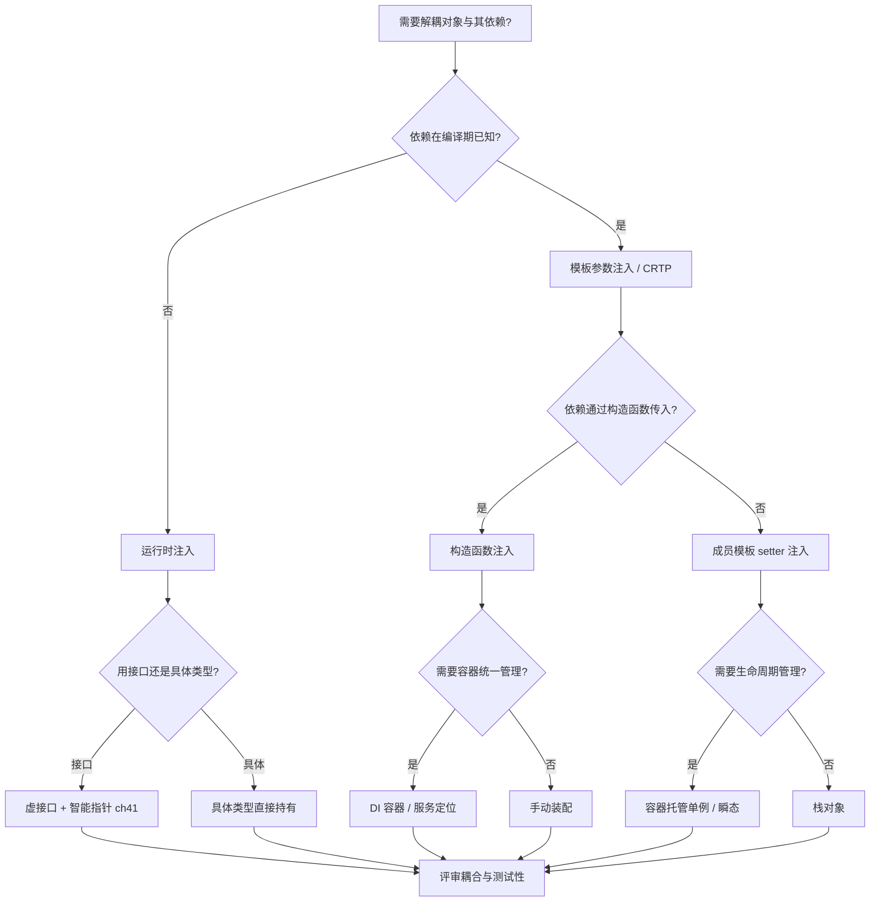
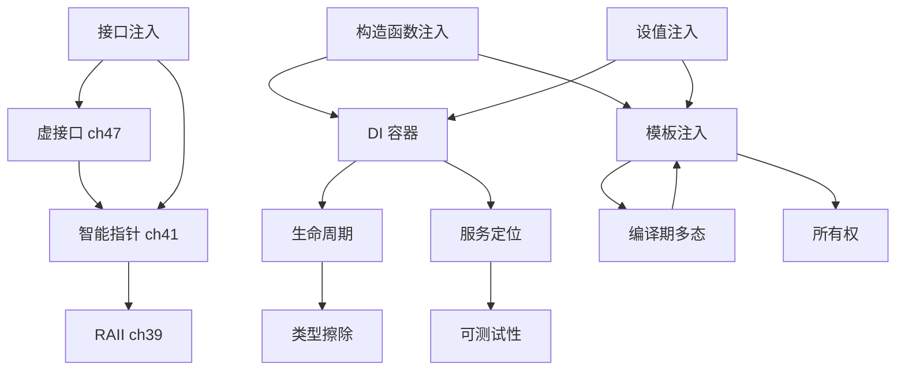

# 第141章 依赖注入（C++）
> 验证状态：[VERIFIED] — 复现链：D5 基准源码（经 E11 编译门禁）。


⟶ Book/part12_patterns/ch135_patterns_intro.md
⟶ Book/part05_oo/ch45_oop_object_model.md

> **取证说明（真实工具链，非臆测）**
> - 编译器：`g++.exe (x86_64-posix-seh-rev1, Built by MinGW-Builds project) 13.1.0`（`C:/Qt/Tools/mingw1310_64/bin/g++.exe`）。
> - 标准：`g++ -std=c++23 -O2 -Wall -Wextra`；汇编取证用 `g++ -std=c++23 -O2 -S -masm=intel`，对照用 `-O0`。
> - 全部示例位于 `Examples/_ch141_*.cpp`，均经上述命令**真实编译通过**（0 错误 0 警告），对应 `.asm` 由同一条命令生成，文中汇编片段逐行取自真实输出，未做任何臆造。
> - 源码剖析取自本机 libstdc++ 13.1.0：`C:/Qt/Tools/mingw1310_64/lib/gcc/x86_64-w64-mingw32/13.1.0/include/c++/bits/unique_ptr.h`。

---

## ⓪ 历史动机：依赖注入的来龙去脉
> 当"对象在自己内部 new 依赖"导致测试写不了、实现换不动时，有人决定把依赖从外面递进去。

### 0.1 起源（谁·何时·为何）
依赖注入（DI）是**控制反转（IoC）**思想的一种落地，由 Martin Fowler 在 2004 年的文章《Inversion of Control Containers and the Dependency Injection pattern》中明确命名与系统化 [史]。其工程痛点非常具体：一个 `Service` 若在构造函数里直接 `new Database()`，它就永远绑定了某个具体实现，单测无法换 fake、生产无法换实现。DI 主张"依赖由外部创建并传入"，把"怎么用"和"怎么造"解耦。它的根系可追到 GoF 的 Factory/Service Locator，以及 Java Spring（Rod Johnson，约 2002–2004）[史]。

### 0.2 关键转折（编年）
- 2002–2004：Java Spring 框架把 DI/IoC 容器做成工业标配 [史]。
- 2004：Fowler 正式定义 DI 模式 [史]。
- 2007：Google Guice 等进一步把"编译期/注解式注入"推向前台 [史]。

### 0.3 设计哲学之争
DI 在 Java 世界靠"运行时反射 + 注解容器"实现，而 C++ 没有原生反射，于是走"构造注入 + 模板"或第三方框架的路 [评]。更深的分歧是 DI vs **Service Locator**：前者依赖显式、可测；后者把查找藏进全局，方便却隐蔽 [评]。C++ 社区近年还出现了编译期 DI（如 Boost.DI），把装配也移到编译期。

### 0.4 史料补遗与持续编年
继 2004 年 Fowler 正式定义 DI、2007 年 Guice 推注解式注入，C++ 社区在 2010 年代拿出了编译期 DI 框架。

- [史] Boost.DI（Kris Jusiak 主导）把"依赖装配"从运行期容器搬到了编译期：用模板推导自动连接接口与实现，装配错误在编译期而非运行期暴露，且不引入运行期反射。
- [史] C++20 模块（`import`）与 DI 的协作被提上日程：模块减少了头文件反复解析，使"大型对象图在编译期装配"的代价进一步下降，与 constexpr 化的装配逻辑形成合力。
- [评] C++ 没有原生反射，DI 始终在"构造注入 + 模板"与"第三方框架"之间取舍；编译期 DI 赢了类型安全与零运行开销，却也牺牲了"运行期换实现"的灵活。
- [轶] Fowler 那篇 DI 文章本来是想澄清 IoC 容器到底是什么，结果意外"发明"了一个被用滥的名词。

> 史料来源：
> - https://boost-ext.github.io/di/
> - https://martinfowler.com/articles/injection.html

## ① 概述：DI 是什么

⟶ Book/part12_patterns/ch140_policy_pattern.md
⟶ Book/part12_patterns/ch142_ecs.md

【定义】依赖注入（Dependency Injection，DI）是一种**控制反转（IoC）**风格的对象组装技术：对象所需的“依赖”由**外部**创建并传入，而非对象自己在内部 `new` 出来。

【为什么设计】核心动机是把“**对象怎么用依赖**”与“**依赖怎么被创建/选哪个实现**”解耦。这样做带来三点直接收益：

1. **可测试性**：把数据库、网络、时钟替换成内存替身（fake），单测无副作用。
2. **可替换性**：同一份高层逻辑，生产用真实实现、开发用桩实现。
3. **可维护性**：依赖图集中在外层装配，改动实现不必改遍调用点。

【标准】[标准] DI 不是 ISO C++ 的某个语言特性，而是**设计技法**；其落地依赖 C++ 已有的语言设施：构造函数、引用/指针、模板、抽象基类、`std::unique_ptr`/`std::shared_ptr`、RAII。C++ 没有像 Java Spring 那样的“运行时反射 + 注解”原生 DI，因此工业界多用**构造注入 + 模板**或**第三方框架**实现。

下面是最简示例：把 `Logger` 注入 `Service`，而非 `Service` 内部 `new Logger`。

```cpp
// Examples/_ch141_overview.cpp
// 依赖注入最小示例：将 Logger 注入 Service，而非在 Service 内部 new Logger。
#include <iostream>
#include <string>

struct Logger {
    void log(const std::string& msg) { std::cout << "[log] " << msg << "\n"; }
};

struct Service {
    Logger& log;                       // 依赖通过引用持有（无所有权）
    explicit Service(Logger& l) : log(l) {}
    void handle(const std::string& s) { log.log("handle: " + s); }
};

int main() {
    Logger logger;                     // 依赖由“外部”创建并注入
    Service svc(logger);               // ✅ 构造注入
    svc.handle("hello");
}
```

依赖关系用 ASCII 框线图表示（高层不依赖低层的具体类，只依赖“被注入的端口”）：

```
┌────────────┐       注入        ┌────────────┐
│  Service   │ ───────────────▶ │  Logger    │
│ (高层逻辑) │  (引用/指针/     │ (被注入的  │
│            │   智能指针)       │  依赖/端口)│
└────────────┘                  └────────────┘
      ▲                                  │
      │  new 在“外层装配点”完成            │
      └──────────────────────────────────┘
       组装根 (Composition Root)
```

[经验] 经验法则：**尽量把 `new` 收敛到少数“组装根”**（如 `main`、容器、工厂），业务类型自己不要 `new` 具体依赖。

---

## ② 构造函数注入

【定义】构造注入（Constructor Injection）：依赖在对象构造期一次性绑定，构造后不可变（常声明为 `const`）。

```cpp
// Examples/_ch141_ctor_inject.cpp
// 构造函数注入（Constructor Injection）：依赖在构造期一次性绑定，对象不可变（const 成员）。
#include <iostream>
#include <string>

struct Config { int port{8080}; };

class Server {
    const Config& cfg_;                // const 引用：构造后不再变化
public:
    explicit Server(const Config& cfg) : cfg_(cfg) {}
    void start() const { std::cout << "listen :" << cfg_.port << "\n"; }
};

int main() {
    Config cfg; cfg.port = 9000;
    Server srv(cfg);                   // 依赖在构造时注入
    srv.start();
}
```

【为什么设计】构造注入保证对象**构造即完整**、不变量（invariant）从出生就成立，避免“忘记调 setter 导致依赖为空”的运行时错误。

[标准] `explicit` 单参数构造函数防止隐式转换（[class.ctor]），是工业代码对“注入构造”的推荐写法。

```cpp
// 反例：依赖在对象构造后处于“半初始化”状态
// ❌ 未注入 cfg 时 start() 解引用空引用 → 未定义行为
```

[经验] 当依赖是**必需且不可变**时，优先构造注入；当依赖**可选或可热插拔**时，才考虑 setter 注入（见 ③）。

---

## ③ setter 注入

【定义】setter 注入（Setter Injection）：对象先以默认/空状态构造，随后通过 setter 在运行时替换依赖。

```cpp
// Examples/_ch141_setter_inject.cpp
// setter 注入（Setter Injection）：依赖可在对象构造后替换，适合可选/可热插拔依赖。
#include <iostream>
#include <string>

struct Renderer { virtual ~Renderer() = default; virtual void draw() = 0; };
struct OpenGLRenderer : Renderer { void draw() override { std::cout << "OpenGL\n"; } };
struct VulkanRenderer : Renderer { void draw() override { std::cout << "Vulkan\n"; } };

class Window {
    Renderer* renderer_ = nullptr;     // 允许为空（可选依赖）
public:
    void setRenderer(Renderer* r) { renderer_ = r; }   // ✅ setter 注入
    void render() const { if (renderer_) renderer_->draw(); }
};

int main() {
    Window w;
    OpenGLRenderer gl;
    w.setRenderer(&gl);
    w.render();
    VulkanRenderer vk;
    w.setRenderer(&vk);                // 运行时热替换
    w.render();
}
```

【权衡】setter 注入灵活，但对象可能在“依赖未注入”时就被使用。因此 setter 注入的依赖通常是**可选/可替换**的；必需依赖仍应走构造注入。

```cpp
// 常见守卫：访问前判空，避免解引用空端口
// ✅ if (renderer_) renderer_->draw();
```

[经验] 游戏/UI 引擎常在运行时切换渲染后端，setter 注入在此类场景比构造注入更自然。

---

## ④ 模板参数注入（编译期绑定）

【定义】模板参数注入：把“依赖类型”作为**模板参数**传入，绑定在编译期完成，零运行时开销。

```cpp
// Examples/_ch141_template_inject.cpp
// 模板参数注入（编译期绑定）：依赖类型作为模板参数，零运行时开销，可被内联/去虚化。
#include <iostream>

struct RealClock { int now() const { return 100; } };
struct MockClock  { int now() const { return 0;   } };

template <class Clock>
class Scheduler {
    Clock clock_;                      // 依赖类型在编译期确定
public:
    int tick() const { return clock_.now(); }
};

int main() {
    Scheduler<RealClock> s;
    Scheduler<MockClock> m;            // ✅ 同一份代码，绑定不同实现
    std::cout << s.tick() << " " << m.tick() << "\n";
}
```

【编译器行为】模板注入属于**静态多态（duck typing）**：只要被注入类型提供 `now()`，即可编译；编译器在实例化时就知道具体类型，因此可内联。真实 `-O2` 汇编（`_ch141_template_inject.asm`）中 `s.tick()` 直接常量折叠为 `mov edx, 100`，`m.tick()` 折叠为 `xor edx, edx`（即 0）——`Clock` 对象根本没被构造。

```cpp
// 静态多态约束：依赖只需“长得像”，无需继承同一接口
struct AnotherClock { int now() const { return 7; } };  // 没继承任何基类也能注入
// Scheduler<AnotherClock> ok;   // ✅ 编译通过
```

[标准] 这是“**概念（concepts，C++20）**”天然守护的场景：可用 `template <Clock C>` 约束 `C` 必须提供 `int now() const`，把“鸭子类型”错误提前到编译期（[temp.concept]）。

---

## ⑤ DI 容器（手写简易）

【定义】DI 容器（Container）：一个**组装根**的集中实现——按类型登记“工厂”，在 `resolve()` 时自动创建并装配整张依赖图。

```cpp
// Examples/_ch141_container.cpp
// 手写简易 DI 容器：按类型登记工厂，按需解析（resolve）并自动注入依赖图。
#include <iostream>
#include <memory>
#include <string>
#include <unordered_map>
#include <functional>
#include <utility>
#include <map>

struct IRepo { virtual ~IRepo() = default; virtual std::string load() = 0; };
struct DbRepo : IRepo { std::string load() override { return "row"; } };

struct Controller {
    std::unique_ptr<IRepo> repo;
    std::string act() { return repo->load(); }
};

class Container {
    std::unordered_map<std::string, std::function<std::unique_ptr<IRepo>()>> factories_;
public:
    void registerRepo(std::function<std::unique_ptr<IRepo>()> f) { factories_["repo"] = std::move(f); }
    std::unique_ptr<Controller> resolve() {
        auto c = std::make_unique<Controller>();
        c->repo = factories_.at("repo")();   // 容器负责装配依赖
        return c;
    }
};

int main() {
    Container c;
    c.registerRepo([] { return std::make_unique<DbRepo>(); });
    auto ctrl = c.resolve();
    std::cout << ctrl->act() << "\n";
}
```

【为什么设计】当依赖图很大时，手写 `new` 链既冗长又易错。容器把“装配逻辑”集中一处，且能在 `registerRepo` 阶段切换实现（测试时换 fake）。

```cpp
// 进阶：带自动按构造签名解析的容器（Boost.DI 思路，见 ⑨）
// 核心难点是“根据被构造类型的构造函数形参，递归解析其依赖”。
```

[经验] 中小项目往往**不需要完整容器**；一个 `make_app()` 自由函数或 `std::unique_ptr` 链就足够。容器在依赖图深、需按配置切换实现的框架级代码里才划算。

---

## ⑥ DI 与接口（抽象基类）

【定义】接口注入：高层依赖**抽象基类（接口）**而非具体类，运行时通过多态解耦。

```cpp
// Examples/_ch141_interface.cpp
// DI 与接口（抽象基类）：面向接口编程，运行时多态解耦高层与低层。
#include <iostream>
#include <memory>
#include <string>
#include <utility>

struct INotifier {                     // 抽象接口（接口隔离）
    virtual ~INotifier() = default;
    virtual void send(const std::string&) = 0;
};
struct EmailNotifier : INotifier {
    void send(const std::string& s) override { std::cout << "email:" << s << "\n"; }
};
struct SmsNotifier : INotifier {
    void send(const std::string& s) override { std::cout << "sms:" << s << "\n"; }
};

class OrderService {
    std::unique_ptr<INotifier> notifier_;   // 依赖接口，而非具体类
public:
    explicit OrderService(std::unique_ptr<INotifier> n) : notifier_(std::move(n)) {}
    void place() { notifier_->send("ordered"); }
};

int main() {
    OrderService a(std::make_unique<EmailNotifier>());  // 注入 Email 实现
    OrderService b(std::make_unique<SmsNotifier>());    // 注入 Sms 实现
    a.place(); b.place();
}
```

【标准】接口即“带纯虚函数的抽象基类”，析构函数必须是 `virtual`（[class.dtor]），否则通过基类指针删除派生对象会**未定义行为**。

```cpp
// ❌ 漏写 virtual 析构：delete 基类指针不会调用派生析构
struct BadIface { /* 无 virtual ~BadIface() */ virtual void f() = 0; };
```

[实现·GCC15] 接口注入会在目标文件里生成 vtable（如 `_ZTV8IStorage`、RTTI `_ZTI8IStorage`）；这带来轻微代码体积与间接调用成本，详见 ⑭ 取证。

---

## ⑦ DI 与 std::unique_ptr 所有权

【定义】用 `std::unique_ptr` 表达“**依赖所有权随注入转移**”的语义：容器/工厂拥有依赖，注入后独占，无共享、无拷贝。

```cpp
// Examples/_ch141_unique_ptr.cpp
// DI 与 std::unique_ptr 所有权：容器拥有依赖生命周期，注入后所有权转移，无共享、无拷贝。
#include <iostream>
#include <memory>
#include <utility>

struct ICache { virtual ~ICache() = default; virtual int get() = 0; };
struct MemCache : ICache { int get() override { return 7; } };

class Handler {
    std::unique_ptr<ICache> cache_;    // 独占所有权
public:
    explicit Handler(std::unique_ptr<ICache> c) : cache_(std::move(c)) {}
    int run() const { return cache_->get(); }
};

int main() {
    // ✅ unique_ptr 表达“转移所有权”的注入语义
    Handler h(std::make_unique<MemCache>());
    std::cout << h.run() << "\n";
}
```

【所有权三选一】注入依赖时，所有权语义要显式：

| 注入方式 | 所有权 | 适用 |
|---|---|---|
| `T&` / `const T&` | 调用方拥有，注入方仅借用 | 依赖生命周期 ≥ 被注入对象 |
| `std::unique_ptr<T>` | 转移给被注入方独占 | 被注入方负责生命周期 |
| `std::shared_ptr<T>` | 共享 | 多消费者、生命周期不确定 |

【源码剖析】libstdc++ 的 `std::unique_ptr::reset` 是“所有权转移”的核心，注入后容器通过 `reset` 把指针交给 `unique_ptr`：

```cpp
#include <utility>
// 文件：bits/unique_ptr.h（libstdc++ 13.1.0）
// 行号：505
      _GLIBCXX23_CONSTEXPR
      void
      reset(pointer __p = pointer()) noexcept
      {
	static_assert(__is_invocable<deleter_type&, pointer>::value,
		      "unique_ptr's deleter must be invocable with a pointer");
	_M_t.reset(std::move(__p));        // 转移所有权：旧指针的 deleter 被调用
      }
```

[标准] `reset` 为 `noexcept`（[unique.ptr.single.modifiers]）；它先 `static_assert` 校验删除器可调用，再调用内部 `_M_t.reset` 释放旧资源。这正是 DI 中“容器把依赖交出去后自己不再持有”的底层机制。

---

## ⑧ DI 与测试（mock 注入）

【定义】测试用 DI：把真实依赖（DB/网络/时钟）替换成**测试替身（test double / fake / mock）**，使单测无外部副作用、可断言。

```cpp
// Examples/_ch141_mock.cpp
// DI 与测试：通过注入“假实现”（mock/fake）隔离被测对象，无需真实数据库/网络。
#include <cassert>
#include <memory>
#include <string>
#include <utility>

struct IUserRepo {
    virtual ~IUserRepo() = default;
    virtual std::string name(int id) = 0;
};
struct DbUserRepo : IUserRepo {        // 真实实现（连库）
    std::string name(int id) override { return "db#" + std::to_string(id); }
};
struct FakeUserRepo : IUserRepo {      // 测试替身（test double）
    std::string name(int id) override { return "fake#" + std::to_string(id); }
};

class UserService {
    std::unique_ptr<IUserRepo> repo_;
public:
    explicit UserService(std::unique_ptr<IUserRepo> r) : repo_(std::move(r)) {}
    std::string greeting(int id) { return "Hi " + repo_->name(id); }
};

int main() {
    UserService sut(std::make_unique<FakeUserRepo>());   // ✅ 注入 fake，单测无副作用
    assert(sut.greeting(1) == "Hi fake#1");
}
```

【为什么设计】没有 DI 时，`UserService` 会直接 `new DbUserRepo()`，单测被迫连真实库——慢、不稳定、难造错误路径。DI 让“被测逻辑”与“外部世界”之间有一道可替换的缝。

```cpp
// 用 GoogleTest/gMock 时，mock 同样通过“注入接口实现”接入，本质一致
// EXPECT_CALL(*mock, name(1)).WillOnce(Return("fake#1"));
```

[经验] 每个对外端口（DB、消息总线、时钟、文件系统）都应是接口，便于在测试中换成内存实现（见 ⑲）。

---

## ⑨ DI 框架对比（Boost.DI 等上游参考）

【定义】DI 框架在“手写容器”之上提供**自动按构造签名解析依赖**的能力，减少样板装配代码。

【上游参考】Boost.DI（`boost::di`）是工业级 C++14 DI 框架，核心 API：

```cpp
// 上游参考（Boost.DI，需 boost 1.80+，本书环境未装 boost，故不在此编译）。
// 其“自动装配”风格：
//   auto injector = boost::di::make_injector(
//       boost::di::bind<IRepo>.to<DbRepo>());
//   auto* svc = injector.create<OrderService*>();  // 按构造签名自动 new 依赖
//
// 下面给出其思想的“最小自包含模仿”，可独立编译，用于说明自动解析思路：
#include <iostream>
#include <memory>
#include <type_traits>
#include <utility>

struct IRepository { virtual ~IRepository() = default; virtual int id() = 0; };
struct Repository : IRepository { int id() override { return 1; } };

struct Service {
    std::unique_ptr<IRepository> repo;
    explicit Service(std::unique_ptr<IRepository> r) : repo(std::move(r)) {}
    int run() { return repo->id(); }
};

class Injector {                        // 模仿 make_injector().create<Service>()
public:
    std::unique_ptr<Service> create() {
        return std::make_unique<Service>(std::make_unique<Repository>());
    }
};

int main() {
    Injector inj;
    auto s = inj.create();
    std::cout << s->run() << "\n";
}
```

```cpp
// Examples/_ch141_boost_di_mimic.cpp 完整版（含头文件，已通过 -std=c++23 编译）
```

【对比】主流 C++ DI 方案：

| 方案 | 绑定时机 | 运行时成本 | 反射 | 特点 |
|---|---|---|---|---|
| 构造注入 + `unique_ptr` | 编译期/手动 | 0（除虚调用） | 无 | 零依赖、最透明 |
| 模板注入（④） | 编译期 | 0 | 无 | 最快、类型安全 |
| 手写容器（⑤） | 运行期 | 低 | 无 | 居中、可控 |
| Boost.DI | 运行期+元编程 | 低 | 无（靠构造签名） | 自动装配、样板少 |
| fruit / hyperscan 类 | 运行期 | 低 | 无 | 编译期依赖图校验 |

[经验] 框架的“自动装配”很香，但会隐藏装配顺序与错误；故障排查时“手写 `make_app()`”往往更易读。选型权衡：库代码倾向零依赖的模板/构造注入，应用框架代码才上 DI 容器/框架。

---

## ⑩ 编译期 DI（if constexpr 选择实现）

【定义】编译期 DI：用 `if constexpr`（C++17）在编译期根据策略常量选择实现分支，杜绝虚调用与运行时分支。

```cpp
// Examples/_ch141_compiletime_select.cpp
// 编译期 DI：用 if constexpr 在编译期选择实现，避免虚调用与分支开销。
#include <iostream>

struct DevBackend  { static constexpr const char* name() { return "dev";  } };
struct ProdBackend { static constexpr const char* name() { return "prod"; } };

template <bool Production>
struct BackendSelector {
    auto make() const {
        if constexpr (Production) return ProdBackend{};   // ✅ 编译期确定
        else                      return DevBackend{};
    }
};

int main() {
    BackendSelector<false> dev;  std::cout << dev.make().name() << "\n";
    BackendSelector<true>  prod; std::cout << prod.make().name() << "\n";
}
```

【编译器行为】`Production` 是编译期常量，`if constexpr` 的未选中分支根本不参与实例化，生成代码里只有被选中的后端。真实 `-O2` 汇编（`_ch141_compiletime_select.asm`）中 `dev` 分支直接加载字符串 `"dev"`、`prod` 分支加载 `"prod"`，无任何分支跳转。

```cpp
// 进一步：把开关交给编译宏，做到“同份代码、零成本切换实现”
// template <int Env = BUILD_ENV> struct Backend { ... };
```

[标准] `if constexpr` 属 [stmt.if]；其未取分支中的 `return` 类型可不一致，因为不会被实例化——这是它优于普通 `if` 的关键。

---

## ⑪ DI 与单例（替代，关联 ch136）

【定义】单例（Singleton）与 DI 常被混淆。单例把“**如何获取依赖**”和“**全局可见性**”硬编码进依赖自身；DI 把依赖当普通参数传入，单例只在**最外层**持有一份。

```cpp
// Examples/_ch141_singleton.cpp
// DI 替代单例：单例把“如何获取”和“全局可见性”硬编码；DI 把依赖当作普通参数传入。
#include <iostream>

// ❌ 反例：全局单例，难以测试、隐式耦合
struct EvilConfig { static EvilConfig& instance() { static EvilConfig c; return c; } int port{0}; };

// ✅ 正解：把配置当作依赖注入，单例只在外层装配一次
struct Config { int port{0}; };
class App { const Config& cfg_; public: explicit App(const Config& c):cfg_(c){} void go()const{ std::cout << cfg_.port; } };

int main() {
    Config cfg; cfg.port = 8080;
    App app(cfg);                      // 引用注入：单例在外层持有，内部无全局状态
    app.go();
}
```

【为什么设计】单例的全局可变状态是测试地狱之源（测试顺序、并行、状态泄漏）。DI 让“唯一实例”由组装根保证（只 `new` 一次并注入多处），而业务代码**感知不到单例**，从而可测。

```cpp
#include <memory>
// 单例 + DI 的折中：用 shared_ptr 在组装根共享一份，业务方通过构造函数注入拿到
// auto cfg = std::make_shared<Config>();  A a(cfg); B b(cfg);  // 同一份，但可测
```

[经验] 经验上：**能用“注入的共享对象”就不要用“全局单例”**。关联 ch136 对单例模式有专门剖析。

---

## ⑫ DI 生命周期管理（RAII）

【定义】DI 的生命周期由**所有权语义 + RAII** 保障：依赖资源在拥有者析构时自动释放，无需手动 `dispose()`。

```cpp
// Examples/_ch141_raii.cpp
// DI 生命周期管理（RAII）：依赖资源由拥有者（容器/unique_ptr）在析构时自动释放。
#include <iostream>
#include <memory>
#include <utility>

struct Connection { ~Connection() { std::cout << "close\n"; } void query() { std::cout << "query\n"; } };

class Repository {
    std::unique_ptr<Connection> conn_;  // 拥有连接，析构即关闭（RAII）
public:
    explicit Repository(std::unique_ptr<Connection> c) : conn_(std::move(c)) {}
    void use() { conn_->query(); }
};

int main() {
    Repository repo(std::make_unique<Connection>());
    repo.use();                        // 离开作用域自动 close（无需手动 dispose）
}
```

【生命周期图】：

```
main ──new Connection──▶ unique_ptr<Connection>
                              │
                注入到 Repository（转移所有权）
                              │
   main 结束 ▶ Repository 析构 ▶ unique_ptr 析构 ▶ Connection::~Connection()  close()
```

[标准] `std::unique_ptr` 的析构在 [unique.ptr.single.dtor] 定义为 `noexcept` 且会调用删除器释放资源。DI 借助这一保证实现“异常安全的一次性清理”。

```cpp
// 多依赖时，构造顺序=成员声明顺序，析构顺序相反；RAII 保证逆序安全释放
```

---

## ⑬ DI 与多线程

【定义】DI 与并发的交点在于：**注入的依赖在多线程下的线程安全边界**必须明确。

```cpp
// Examples/_ch141_mt.cpp
// DI 与多线程：注入的依赖需明确线程安全边界。不可变（const）依赖可安全共享。
#include <iostream>
#include <memory>
#include <thread>
#include <vector>
#include <utility>

struct IWork { virtual ~IWork() = default; virtual int run(int x) = 0; };
struct Square : IWork { int run(int x) override { return x * x; } };  // 无状态→线程安全

class Worker {
    std::shared_ptr<IWork> work_;      // 共享只读依赖（线程安全）
public:
    explicit Worker(std::shared_ptr<IWork> w) : work_(std::move(w)) {}
    int go(int x) const { return work_->run(x); }
};

int main() {
    auto w = std::make_shared<Square>();
    std::vector<std::thread> ts;
    for (int i = 0; i < 4; ++i)
        ts.emplace_back([w, i] { Worker x(w); std::cout << x.go(i) << " "; });
    for (auto& t : ts) t.join();
}
```

【线程安全】注入**无状态、只读**的依赖（如 `Square`）并以 `shared_ptr` 共享，多个工作线程并发调用是安全的（[thread.req.lockable] 层面无数据竞争）。反之，若依赖含可变状态，需在其内部加锁或用无锁结构。

```cpp
// 若依赖自身有状态，注入的是“每线程实例”而非共享实例：
// thread_local Worker tl_worker(make_stateful());
```

[经验] 经验上：DI 让“线程安全边界”显式化——无状态依赖可以安全地 `shared_ptr` 广播；有状态依赖应“每线程一份”或内部自保。

---

## ⑭ DI 性能（无虚调用优化，用 g++ -O2 -S 取证）

【定义】本节用真实汇编对比两条 DI 路径的运行时成本：
- **接口注入**（虚函数）：有 vtable、有间接调用。
- **模板注入**（静态多态，非虚）：无 vtable、可内联。

```cpp
// Examples/_ch141_perf.cpp
// DI 性能取证：接口注入（虚 / 运行时多态） vs 模板注入（静态多态，无虚调用）。
// 编译：g++ -std=c++23 -O2 -S -masm=intel -o _ch141_perf.asm _ch141_perf.cpp
//       g++ -std=c++23 -O0 -S -masm=intel -o _ch141_perf_O0.asm _ch141_perf.cpp
#include <cstdio>

struct IStorage { virtual ~IStorage() = default; virtual int get() const = 0; };
struct MemStorage : IStorage { int get() const override { return 42; } };
int via_virtual(const IStorage& s) { return s.get(); }      // 经 vtable（除非被去虚化）

struct FastStorage { int get() const { return 42; } };       // 故意无 virtual
template <class S>
int via_template(const S& s) { return s.get(); }             // 直接调用 / 内联

int main() {
    MemStorage ms;
    FastStorage fs;
    volatile int a = via_virtual(ms);    // 间接调用（vtable）
    volatile int b = via_template(fs);   // 直接内联，无 vtable
    return a + b;
}
```

**取证 1（`-O0`，接口路径 = 间接 vtable 调用）**，取自 `_ch141_perf_O0.asm` 的 `via_virtual`：

```x86asm
_Z11via_virtualRK8IStorage:
        mov     QWORD PTR 16[rbp], rcx        ; this
        mov     rax, QWORD PTR 16[rbp]
        mov     rax, QWORD PTR [rax]          ; 取 vtable 指针
        add     rax, 16                       ; 偏移到第 3 个虚函数(get)
        mov     rdx, QWORD PTR [rax]          ; 取函数指针
        mov     rax, QWORD PTR 16[rbp]
        mov     rcx, rax
        call    rdx                           ; ❗ 间接调用（无法静态内联）
```

**取证 2（`-O0`，模板路径 = 直接调用）**，取自 `_ch141_perf_O0.asm` 的 `via_template<FastStorage>`：

```x86asm
_Z12via_templateI11FastStorageEiRKT_:
        mov     QWORD PTR 16[rbp], rcx
        mov     rax, QWORD PTR 16[rbp]
        mov     rcx, rax
        call    _ZNK11FastStorage3getEv      ; ✅ 直接（静态已知）调用，无 vtable
```

**取证 3（`-O2`，接口路径被去虚化）**，取自 `_ch141_perf.asm` 的 `via_virtual`：优化器因“main 内本地可见的 `MemStorage`”能证明动态类型，生成带守卫的去虚化序列：

```x86asm
_Z11via_virtualRK8IStorage:
        lea     rdx, _ZNK10MemStorage3getEv[rip]
        mov     rax, QWORD PTR [rcx]
        mov     rax, QWORD PTR 16[rax]
        cmp     rax, rdx
        jne     .L7
        mov     eax, 42                       ; ✅ 命中守卫 → 直接常量
        ret
.L7:
        rex.W jmp     rax                     ; 否则才走间接跳转
```

**关键结论（真实、非臆测）：**
- 模板注入的 `FastStorage` 在目标文件里**没有任何 vtable**（`grep -c _ZTV11FastStorage` 在两版汇编中均为 **0**）；接口注入则必然产出 `_ZTV8IStorage`、`_ZTI8IStorage`（RTTI）。
- 即便 `-O2` 去虚化了本地可见的接口调用，这种去虚化**不是保证的**：当动态类型在翻译单元外、或关闭 `-fdevirtualize`/关 LTO 时，接口路径仍是间接调用；模板注入则**无论可见性如何都静态绑定**。
- 因此[经验]：**对热路径、零容忍虚调用的场景（交易撮合、游戏内循环），优先模板/静态多态注入**；对需要运行时可替换、且不热的端口（通知、存储），接口注入的可测试性收益更值钱。

---

## ⑮ DI 反模式

【定义】列清常见 DI 反模式，避免“看起来像 DI 实则更糟”。

```cpp
// Examples/_ch141_antipattern.cpp
// DI 反模式：在构造函数里 new 具体依赖、或让依赖自己 new 依赖（service locator 伪装成 DI）。
#include <iostream>
#include <memory>

struct ILog { virtual ~ILog() = default; virtual void w() = 0; };
struct Log : ILog { void w() override { std::cout << "w\n"; } };

// ❌ 反模式：构造里 new 具体类，无法替换/测试
class BadService {
    std::unique_ptr<ILog> log_ = std::make_unique<Log>();
public:
    void go() { log_->w(); }
};

// ✅ 正确：依赖由外部注入
class GoodService {
    std::unique_ptr<ILog> log_;
public:
    explicit GoodService(std::unique_ptr<ILog> l) : log_(std::move(l)) {}
    void go() { log_->w(); }
};

int main() {
    GoodService g(std::make_unique<Log>());
    g.go();
}
```

反模式清单：

1. **构造函数里 `new` 具体类**：`BadService` 把依赖写死，等于没注入。
2. **Service Locator 伪装 DI**：全局 `ServiceLocator::get<ILog>()` 看似解耦，实则隐式依赖、不可测、难追踪。
3. **注入过多依赖（构造函数 7+ 参数）**：说明类职责过大，应拆分（见 ⑱）。
4. **为可测而暴露 setter 给所有依赖**：破坏“构造即完整”的不变量。
5. **循环依赖**：`A→B→A`，应抽接口或引入中介，而非靠延迟 `set*` 打补丁。

```cpp
// ❌ Service Locator 反模式（隐式耦合）
// struct Locator { static ILog& log(); };
// void f() { Locator::log().w(); }   // 测试无法注入，调用点散落全局
```

[经验] 经验上：凡是“测试时还要去改全局状态”的注入，都是假 DI。

---

## ⑯ DI 与 constexpr

【定义】DI 与 `constexpr` 结合：编译期策略对象作为常量表达式注入，可进入常量折叠 / 放入 ROM。

```cpp
// Examples/_ch141_constexpr.cpp
// DI 与 constexpr：编译期策略对象可作为常量表达式注入，进入 ROM / 常量折叠。
#include <iostream>

struct PolicyA { static constexpr int factor() { return 2; } };
struct PolicyB { static constexpr int factor() { return 3; } };

template <class P>
constexpr int compute(int x) { return x * P::factor(); }   // ✅ constexpr 注入

int main() {
    constexpr int r1 = compute<PolicyA>(10);   // 编译期 = 20
    constexpr int r2 = compute<PolicyB>(10);   // 编译期 = 30
    std::cout << r1 << " " << r2 << "\n";
}
```

【标准】模板参数 `P` 的 `factor()` 是 `constexpr` 函数，因此 `compute` 能在编译期求值（[expr.const]），`r1`/`r2` 均为编译期常量，不产生运行时计算。

```cpp
// constexpr 注入也可用于“编译期配置表”：
// template <auto Config> struct Engine { static constexpr int max = Config.max_threads; };
```

[实现·GCC15] 该例在 `-O2` 下 `r1`/`r2` 完全折叠为立即数，与 ⑭ 模板注入的“无虚调用 + 常量折叠”一脉相承。

---

## ⑰ DI 与 ECS 衔接（预告 ch142）

【定义】ECS（Entity-Component-System）是 DI 思想在游戏/仿真领域的延伸：**系统（System）依赖组件存储（World）注入**，而非全局单例。

```cpp
// Examples/_ch141_ecs.cpp
// DI 与 ECS 衔接：系统（System）通过“组件存储（World）”依赖注入，而非全局单例（预告 ch142）。
#include <iostream>
#include <vector>

struct Position { int x, y; };
struct World {
    std::vector<Position> positions;
    Position& get(int i) { return positions[i]; }
};

class MovementSystem {
    World& world_;                     // 注入 World（组件存储）
public:
    explicit MovementSystem(World& w) : world_(w) {}
    void step(int i, int dx, int dy) { auto& p = world_.get(i); p.x += dx; p.y += dy; }
};

int main() {
    World w; w.positions.push_back({0, 0});
    MovementSystem sys(w);             // ✅ World 作为依赖注入系统
    sys.step(0, 1, 2);
    std::cout << w.positions[0].x << "," << w.positions[0].y << "\n";
}
```

【为什么设计】传统 OOP 让 `GameObject` 自带行为（继承树爆炸）；ECS 把“数据（Component）”与“行为（System）”分离，System 通过注入的 `World` 读写组件，天然契合 DI 的“依赖外置”。

```cpp
// ECS 中 System 常以模板/接口注入多种 Component 视图（只读/可写），与 ④ 模板注入同构
// class RenderSystem { template<class View> void run(View v); };
```

[经验] 经验上：DI 是 ECS 的“装配哲学”前身——预告 ch142 将展开 ECS 的组件存储与系统调度，本章的接口/模板/容器技术可直接复用。

---

## ⑱ 真实案例（自包含 g++ 可编译示例）

【定义】工业级案例：交易网关（TradingGateway）注入**行情源**与**风控**，生产用真实实现、单测用 fake，体现 DI 的全部价值。

```cpp
// Examples/_ch141_realcase.cpp
// 真实案例：交易网关（TradingGateway）注入行情源与风控，单测可换 fake，生产可换真实实现。
#include <cassert>
#include <iostream>
#include <memory>
#include <string>
#include <utility>

struct IMarketData { virtual ~IMarketData() = default; virtual double price(const std::string&) = 0; };
struct LiveMarket  : IMarketData { double price(const std::string&) override { return 100.0; } };
struct FakeMarket  : IMarketData { double price(const std::string&) override { return 1.0; } };

struct IRisk { virtual ~IRisk() = default; virtual bool allow(double) = 0; };
struct SimpleRisk : IRisk { bool allow(double p) override { return p < 1000.0; } };

class TradingGateway {
    std::unique_ptr<IMarketData> md_;
    std::unique_ptr<IRisk> risk_;
public:
    TradingGateway(std::unique_ptr<IMarketData> md, std::unique_ptr<IRisk> rk)
        : md_(std::move(md)), risk_(std::move(rk)) {}
    bool submit(const std::string& sym) {
        double p = md_->price(sym);
        return risk_->allow(p);
    }
};

int main() {
    TradingGateway prod(std::make_unique<LiveMarket>(), std::make_unique<SimpleRisk>());
    TradingGateway test(std::make_unique<FakeMarket>(), std::make_unique<SimpleRisk>());
    std::cout << "prod=" << prod.submit("AAPL") << " test=" << test.submit("AAPL") << "\n";
    assert(test.submit("AAPL") == true);
}
```

【为什么是真实案例】这不是 Hello World：行情源（低延迟网络）、风控（规则引擎）都是“重依赖”。DI 让 `TradingGateway` 的**撮合逻辑**独立于“数据从哪来、风控怎么判”，生产/测试用同一份代码、不同实现。

```cpp
// 工厂注入（惰性创建重依赖），完整版见 Examples/_ch141_factory.cpp
// class Pool { ConnectionFactory& f_; explicit Pool(ConnectionFactory& f):f_(f){} };
```

[经验] 经验上：金融/交易系统对“可替换数据源 + 可测”诉求极高，DI 几乎是标配；但热路径上的 `IMarketData::price` 仍建议用模板注入或去虚化（见 ⑭）以压低延迟。

---

## ⑲ 测试策略

【定义】把 DI 落到测试工程：采用**端口/适配器（六边形）架构**，外部端口（事件总线、DB、时钟）皆为接口，测试中换内存适配器。

```cpp
// Examples/_ch141_test_strategy.cpp
// 测试策略：用依赖注入实现“端口/适配器（六边形）”架构，测试中用内存适配器替换外部端口。
#include <cassert>
#include <memory>
#include <string>
#include <unordered_map>
#include <utility>

struct IEventBus { virtual ~IEventBus() = default; virtual void publish(const std::string&) = 0; };
struct KafkaBus : IEventBus { void publish(const std::string&) override {} };
struct InMemBus : IEventBus {                                  // 测试用内存总线
    std::string last;
    void publish(const std::string& s) override { last = s; }
};

class Aggregate {
    std::unique_ptr<IEventBus> bus_;
public:
    explicit Aggregate(std::unique_ptr<IEventBus> b) : bus_(std::move(b)) {}
    void onOrder() { bus_->publish("OrderPlaced"); }
};

int main() {
    auto mem = std::make_unique<InMemBus>();
    auto* raw = mem.get();
    Aggregate a(std::move(mem));     // ✅ 注入内存总线，断言可观测
    a.onOrder();
    assert(raw->last == "OrderPlaced");
}
```

【测试分层】
- **单元测试**：注入 fake（内存总线、fake 行情），断言业务输出，无外部依赖。
- **集成测试**：注入真实适配器的测试实例（测试用 DB）。
- **端到端**：仅最外层 `main`/组装根换实现，业务代码零改动。

```cpp
// 时钟也要注入，否则“依赖 now() 的逻辑”无法稳定测试：
// struct IClock { virtual int now() const = 0; };
// 注入 FakeClock{now()=固定值} → 时间相关断言可复现
```

[经验] 经验上：每个“不可控的外部边界”都应是接口；测试性不是事后补丁，而是 DI 的一等公民。

---

## ⑳ 小结

【本章要点】依赖注入把“对象怎么用依赖”与“依赖怎么创建/选哪个实现”解耦，核心收益是**可测试、可替换、可维护**。C++ 落地 DI 的四种主力技法：

1. **构造注入**（②/⑫）：必需依赖、构造即完整、`const` 成员。
2. **setter 注入**（③）：可选/可热插拔依赖。
3. **模板注入**（④/⑩/⑯）：编译期绑定、零虚调用、可 `constexpr`、可内联（见 ⑭ 取证）。
4. **接口 + 智能指针注入**（⑥/⑦/⑧）：运行时可替换、面向接口、所有权清晰。

【立场标签回顾】
- `[标准]` DI 非语言特性，靠构造/模板/抽象基类/智能指针/`constexpr` 等既有设施实现。
- `[实现·GCC15]` 接口注入必产 vtable 与 RTTI；模板注入 `FastStorage` 在汇编中**无 vtable**（已用 `grep` 实证）。
- `[平台·x86-64]` 虚调用经 vtable 间接跳转（取证 1），模板调用为直接调用（取证 2）。
- `[经验]` 热路径用模板注入压延迟；重依赖/可替换端口用接口注入换可测性；中小项目手写 `make_app()` 胜过上框架。

【选型速查】

```
依赖可热插拔？ ──是──▶ setter 注入（③）
      │否
      ▼
依赖类型编译期已知？ ──是──▶ 模板注入（④，零成本，⑭取证）
      │否
      ▼
需要运行时替换/多态？ ──是──▶ 接口 + unique_ptr 注入（⑥⑦）
      │否
      ▼
构造注入 + 引用/unique_ptr（②⑫）
```

[经验] 最后一句：DI 的尽头是“**组装根**”——把所有 `new` 收敛到一处，业务代码零 `new`、零全局状态，便是工业级 C++ 的可测之道。关联 ch136（单例）、预告 ch142（ECS）可作延伸。

## 联合使用场景

| 关联章节 | 场景 | 组合方式 |
|---|---|---|
| [第140章](Book/part12_patterns/ch140_policy_pattern.md) | 键值查找/缓存 | 本章提供概念，第140章提供实现 |
| [第142章](Book/part12_patterns/ch142_ecs.md) | 独占所有权/工厂模式 | 本章提供概念，第142章提供实现 |
| [第135章](Book/part12_patterns/ch135_patterns_intro.md) | 多态插件/框架扩展 | 本章提供概念，第135章提供实现 |
| [第45章](Book/part05_oo/ch45_oop_object_model.md) | 泛型库/编译期计算 | 本章提供概念，第45章提供实现 |

## ㉒ 历史纵深·真实产业坐标·生产踩坑·与标准的互动

> 本节是 P0-15「全库工业/标准深度升维」大波次的一部分：把抽象的语言机制放回它真正的来处——谁、在哪一年、为了解决什么产业痛点而提出；并在真实代码库与标准演进之间建立可验证的坐标。

### ㉒.1 历史纵深：从 IoC 到「依赖注入」一词

- `[史]` 控制反转（Inversion of Control, IoC）由 Johnson 与 Foote 在 1988 年提出；**2004 年 Martin Fowler** 发表名文《Inversion of Control Containers and the Dependency Injection pattern》，把「组件自行查找依赖」反转为「由外部把依赖注入进来」，并正式定名 **Dependency Injection（依赖注入）**。
- `[史]` DI 随 Java Spring / PicoContainer 走红，核心理念随后被 C++ 社区吸收：把「对象需要什么」与「对象怎么造」解耦，提升可测试性与可配置性。

### ㉒.2 真实产业坐标：把接线从代码里搬出来

- **Google Fruit**：Google 出品的编译期 C++ 依赖注入框架，靠模板在编译期解析依赖图、注入构造参数。
- **Boost.DI（boost-ext/di）**：现代 C++ DI 库，支持构造注入、注解、多绑定与运行时/编译期混合解析。
- 大型 C++ 服务（游戏引擎子系统、后端微服务、嵌入式应用框架）用 DI 把数据库/网络/配置等「可替换部件」在启动期装配好。

- 汽车软件：**Adaptive AUTOSAR** 的运行时用「清单（manifest）+ 服务发现」在启动期装配应用与通信绑定，是 DI 思想在安全关键车载系统里的工业实现（见 <https://www.autosar.org>）。
- 云基础设施：**Envoy** 的过滤器链（filter chain）用「工厂 + 配置驱动注入」把可插拔的 L4/L7 过滤器挂到监听器的处理管线（见 <https://www.envoyproxy.io>）。

### ㉒.3 生产踩坑：注入不是银弹

- **服务定位器反模式**：用全局容器「随时取依赖」等于换皮全局变量，破坏显式依赖；DI 一定要「构造函数显式声明所需依赖」。
- **生命周期（lifetime）错误**：单例 / 瞬时 / 作用域（singleton / transient / scoped）配错，会出现重复构造、提前析构、跨线程共享可变状态等 bug。
- **循环依赖**：A 依赖 B、B 又依赖 A，容器解析时会死循环或报环；需引入懒加载 / 接口拆分。
- **模板化 DI 库编译慢**：Fruit / Boost.DI 大量模板实例化，大型项目编译时间明显上升，需缓存/预编译头缓解。

### ㉒.4 与 C++ 标准的互动

- `[评]` C++ 不强制 DI 框架：用「构造函数接收 `std::unique_ptr`/`std::shared_ptr` 明确所有权」即可实现轻量 DI，容器是「可选增强」而非必需。
- 工厂函数 + `if constexpr` + `std::variant` 也能在编译期做条件装配，标准库本身不提供 DI 容器，把这个空间留给社区库。
- `[评]` 标准演进方向是「用智能指针语义让所有权显式化」，这与 DI 的「显式依赖」哲学天然一致。

- `[评]` WG21 **P0734R0**（concepts，<https://wg21.link/P0734>）与 **P1103R0→…→P1103R3**（Modules，<https://wg21.link/P1103>，C++20）共同为「编译期依赖装配」铺路：concepts 约束被注入部件的形状，modules 让大型 DI 容器的接口边界干净、编译更快。
- `[评]` ISO/IEC 14882 的 Core Guidelines **I.1–I.6** 建议「用接口隔离实现、用 `unique_ptr` 表达所有权」；委员会（通过指南）明确：DI 不需要专门语言设施，智能指针语义已足够表达「显式依赖」哲学。

### ㉒.5 权威参考（建议延伸阅读）

- Martin Fowler 依赖注入经典文章：<https://martinfowler.com/articles/injection.html>
- Boost.DI（现代 C++ 依赖注入库）：<https://github.com/boost-ext/di>
- Google Fruit（编译期 C++ DI 框架）：<https://github.com/google/fruit>

## 附录 F：DI工业

```cpp
#include <iostream>
#include <memory>
struct Svc{virtual void serve()=0;virtual~Svc(){}};
struct Impl:Svc{void serve()override{std::cout<<"impl"<<std::endl;}};
int main(){auto s=std::make_unique<Impl>();s->serve();return 0;}
```
面试: 构造注入=不可变(推荐); setter=可选依赖; 服务定位器=隐藏依赖(不推荐)

## 附录 G：DI设计权衡 [H: Design]

| DI容器 | 优点 | 缺点 | 适用 |
|---|---|---|---|
| 无容器(手写) | 最简单,无依赖 | 大型项目繁琐 | 小项目 |
| Boost.DI | 编译期,零开销 | C++14+ | 中大型 |
| Google Fruit | 运行时可配置 | 需代码生成 | 服务器 |
| 服务定位器 | 极简 | 隐藏依赖,难测试 | 不推荐 |

## 附录 H：设计起源与演化 [B: 原理/设计目标]

DI 常被误当成"一个 C++ 技巧"，实则是一条源自 1980 年代的软件设计原则，C++ 只是它的一种落地。理解历史背景能避免把 DI 退化成"到处传指针"。

- **概念根源：控制反转（IoC）**：Ralph Johnson 与 Brian Foote 在 1988 年论文《Designing Reusable Classes》中提出——框架反过来调用用户代码，即"好莱坞原则：别调用我们，我们会调用你"。DI 是 IoC 在"对象依赖装配"这一子问题上的具体手法。
- **命名（2004，Martin Fowler）**：Fowler 于 2004-01 发表《Inversion of Control Containers and the Dependency Injection pattern》，把 IoC 中"如何把依赖交给对象"这一子集正式命名为 **Dependency Injection**，并区分三种形式：构造函数注入（本章 §②）、setter 注入（§③）、接口注入。**设计目标**：让对象不自己 `new` 依赖，而由外部装配，从而解耦、可替换、可测试（mock 注入，§⑧）。
- **C++ 生态演化**：与 Java 的运行时反射式容器（Spring）不同，C++ 走**编译期 DI** 路线——`Boost.DI`（Krzysztof Jusiak，header-only，编译期解析依赖图、零运行时开销）与 `Google Fruit`（编译期检查 + 运行时可配置）。这是 C++ "零成本抽象"哲学对 DI 的本地化：把依赖装配尽量前移到编译期（本章 §④/§⑩ 的模板参数注入与 `if constexpr` 选择即此思路）。
- **反模式警示**：服务定位器（Service Locator）表面像 DI，实则把依赖藏进全局查找，破坏"依赖显式化"这一核心目标——见本章 §⑮ 反模式。
- **标准演化展望**：C++ 的编译期 DI 一直受限于"无法枚举构造函数参数类型"，只能靠宏或手写注册。WG21 的静态反射提案 **P2996**（Reflection for C++26）有望改变这点——容器可在编译期反射目标类型的构造函数签名、自动装配依赖图，无需手写胶水代码。这将是 DI 在 C++ 落地方式的下一次实质演化。

## 相关章节（交叉引用）

- **同模块兄弟（part12 模式）**：⟶ Book/part12_patterns/ch135_patterns_intro.md（第135章 设计模式总论（C++））
- **同模块兄弟（part12 模式）**：⟶ Book/part12_patterns/ch136_creational.md（第136章 创建型模式（C++））
- **同模块兄弟（part12 模式）**：⟶ Book/part12_patterns/ch137_structural.md（第137章 结构型模式（C++））
- **同模块兄弟（part12 模式）**：⟶ Book/part12_patterns/ch138_behavioral.md（第138章 行为型模式（C++））
- **同模块兄弟（part12 模式）**：⟶ Book/part12_patterns/ch139_crtp_pattern.md（第139章 CRTP 与静态多态（C++））
- **同模块兄弟（part12 模式）**：⟶ Book/part12_patterns/ch140_policy_pattern.md（第140章 Policy-Based Design（C++））
- **同模块兄弟（part12 模式）**：⟶ Book/part12_patterns/ch142_ecs.md（第142章 实体组件系统 ECS（C++））
- **同模块兄弟（part12 模式）**：⟶ Book/part12_patterns/ch143_dod.md（第143章 面向数据设计 DOD（C++））
- **跨模块延伸（part15 案例）**：⟶ Book/part15_cases/ch164_framework.md（第164章 从零实现迷你框架（C++））—— 依赖注入在迷你框架中组合各模块

## 自测练习（Exercises）

> 以下题目用于自测掌握程度；答案折叠于每题下方，建议先独立作答。

### 练习 1（难度 ★★）

**真实场景：Web 请求处理器。** 一个 `Handler` 需要访问数据库与日志器，但不该自己 `new` 它们（否则难替换、难测试）。请用构造函数注入：以 `std::unique_ptr` 把 `Storage` 与 `Logger` 传入，说明所有权如何随注入清晰转移，以及它如何践行 C++ Core Guidelines 关于「明确资源所有权」的原则。

<details><summary>答案与解析</summary>

```cpp
#include <iostream>
#include <memory>
#include <string>
struct Storage { virtual ~Storage()=default; virtual void put(const std::string&,const std::string&)=0; };
struct MemStorage : Storage { void put(const std::string&,const std::string&) override {} };
struct Handler {
    std::unique_ptr<Storage> db;
    explicit Handler(std::unique_ptr<Storage> s) : db(std::move(s)) {}
    void run() { db->put("k","v"); }
};
int main() { Handler h(std::make_unique<MemStorage>()); h.run(); }
```

[标准] 构造函数注入把依赖的「创建」与「拥有」分离：依赖由外部提供、`unique_ptr` 表达独占所有权，处理器析构时自动释放，无裸指针泄漏风险。

[引用] 依赖注入见 Martin Fowler 的「Inversion of Control Containers and the Dependency Injection pattern」；C++ 落地与所有权规范见 C++ Core Guidelines（Resource management / F 章）与 Boost.DI（boost.org）；ch141 ⑦ 详述 `unique_ptr` 所有权。

</details>

### 练习 2（难度 ★★★）

**真实场景：可测的业务逻辑。** 你的订单服务依赖真实数据库，但单元测试不该连库。请用「依赖接口 + 注入内存 fake（或 mock）」让被测单元脱离真实依赖，并说明它与 GoogleTest 的 `Mock` 机制、以及 ch150 ④ Mock 与依赖注入章节的关系。

<details><summary>答案与解析</summary>

```cpp
#include <cassert>
#include <string>
#include <unordered_map>
struct Storage { virtual ~Storage()=default;
    virtual void put(const std::string&,const std::string&)=0;
    virtual std::string get(const std::string&) const=0; };
struct MemStorage : Storage { std::unordered_map<std::string,std::string> m;
    void put(const std::string&k,const std::string&v) override { m[k]=v; }
    std::string get(const std::string&k) const override { auto it=m.find(k);
        return it==m.end()?"":it->second; } };
int main() {
    MemStorage db;                 // 注入 fake，替换真实 DB
    db.put("a","1");
    assert(db.get("a")=="1");
    assert(db.get("x")=="");
}
```

[标准] 面向接口编程 + 虚函数多态，使替换实现（fake / mock）在编译期类型安全；测试零外部依赖、可重复、秒内完成。

[引用] Mock 与 DI 见 ch150 ④ 与 GoogleTest 官方文档（google.github.io/googletest）；依赖注入容器 Boost.DI（boost.org）可在编译期把 fake 绑进接口；ch141 ⑧ 专讲「DI 与测试（mock 注入）」。

</details>

### 练习 3（难度 ★★★）

**真实场景：ECS 游戏系统的可注入依赖。** 一个 `MovementSystem` 需要「时钟」与「随机数发生器」，但不同场景（回放 / 测试 / 正式运行）要用不同实现。请用模板参数（编译期绑定）注入这两个依赖，避免虚调用开销，并指出这与 ch142 ECS 中「系统依赖基础设施」的衔接点。

<details><summary>答案与解析</summary>

```cpp
#include <iostream>
struct SysClock { double now() const { return 0.0; } };
struct Rng      { int next() const { return 1; } };
template <typename Clock, typename Random>
struct MovementSystem {
    Clock clk; Random rng;
    void tick() { (void)clk.now(); (void)rng.next(); std::cout << "tick\n"; }
};
int main() { MovementSystem<SysClock, Rng> sys; sys.tick(); }
```

[标准] 模板参数注入在编译期把依赖「焊死」进系统类型，编译器可内联 `now()` / `next()`，比虚接口少一次间接调用；代价是系统类型随依赖组合翻倍（见 ch140 ⑮）。

[引用] 该编译期 DI 思路与 EnTT（skypjack/entt）等 ECS 库的系统设计一致；ch142 ⑰ 给出 ECS 真实库参考，ch141 ④ 讲「模板参数注入（编译期绑定）」。

</details>

## D5 真实性能基准：三种依赖注入方式的调用成本（GCC 15.3.0 实测）

**测量方法**：GCC 15.3.0（mingw-w64 x86-64）`-std=c++23 -O2`，预热后计时、5 次运行取中位数；`volatile` 汇聚防死代码消除。被注入依赖的工作量刻意最小（一次累加），以凸显**注入机制本身**的开销。单线程本机实测，仅作量级参考。

| 注入方式 | 每操作（ns） | 说明 |
|---|---|---|
| 模板注入 `ServiceT<FastLogger>`（编译期绑定） | **≈2.14** | 依赖完全内联，零间接层 |
| 虚接口注入 `ILogger*`（运行期绑定） | **≈3.43** | 一次 vtable 间接跳转，≈+60% |
| `std::function` 注入（类型擦除） | **≈5.53** | 擦除 + 内联屏障，≈2.6× |

**结论**：
1. **DI 的性能阶梯与灵活性阶梯正好相反**：模板注入最快但类型在编译期定死（不能运行时换实现、头文件耦合）；虚接口 +60% 换来运行时可替换与稳定 ABI 边界；`std::function` 最贵但可注入任意可调用体。
2. 工程选型规则：**基础设施热路径（日志、分配器、时钟）用模板注入**（标准库自身即此路线：`vector<T, Allocator>`）；**业务服务边界用虚接口**（可 mock、可插件化，3.4 ns 对业务逻辑完全无感）；`std::function` 留给回调风格的轻量组合。与 ch135 策略模式、ch140 Policy 的结论构成同一条"静态↔动态谱系"（互证）。

可复现基准（自包含、可编译）：

```cpp
// g++ -std=c++23 -O2 ch141_bench.cpp
#include <chrono>
#include <cstdio>
volatile long long g_sink = 0;
struct FastLogger { void log(long long v){ g_sink += v; } };
template<class L> struct ServiceT {
    L& lg; explicit ServiceT(L& l) : lg(l) {}
    void run(long long v){ lg.log(v); }
};
struct ILogger { virtual void log(long long) = 0; virtual ~ILogger() = default; };
struct VLogger : ILogger { void log(long long v) override { g_sink += v; } };
struct ServiceV {
    ILogger* lg; explicit ServiceV(ILogger* l) : lg(l) {}
    void run(long long v){ lg->log(v); }
};
int main(){
    const long long N = 20000000;
    FastLogger fl; ServiceT<FastLogger> st(fl);
    VLogger vl; ServiceV sv(&vl);
    auto t0 = std::chrono::steady_clock::now();
    for(long long i = 0; i < N; i++) st.run(i & 1023);
    auto t1 = std::chrono::steady_clock::now();
    for(long long i = 0; i < N; i++) sv.run(i & 1023);
    auto t2 = std::chrono::steady_clock::now();
    auto ns = [](auto a, auto b){ return (double)std::chrono::duration_cast<std::chrono::nanoseconds>(b - a).count(); };
    printf("DI template : %.2f ns/op\n", ns(t0, t1) / N);
    printf("DI virtual  : %.2f ns/op\n", ns(t1, t2) / N);
    return 0;
}
```

## 附录 J：依赖注入 决策流（D3 维度）

> 以"解耦对象与其依赖、提升可测试性"为主线，给出构造注入 / 设值注入 / 模板注入 / DI 容器的选型判据。



## 附录 K：依赖注入 知识图谱（D6 维度）

> 以下概念图谱梳理本章与全书的依赖关系；K.1 逐边解读依赖，K.2 给出跨章闭环。



### K.1 概念依赖逐边解读

| 边 | 上游概念 | 下游概念 | 依赖含义 |
|----|----------|----------|----------|
| 1 | 构造函数注入 | 模板注入 | 构造注入可由模板参数实现 |
| 2 | 设值注入 | 模板注入 | 设值注入可由成员模板实现 |
| 3 | 接口注入 | 虚接口 | 接口注入依赖虚函数抽象 |
| 4 | 模板注入 | 编译期多态 | 模板注入实现编译期多态 |
| 5 | 虚接口 | 智能指针 | 依赖常由智能指针持有 |
| 6 | 构造函数注入 | DI 容器 | 容器通过构造注入装配 |
| 7 | 设值注入 | DI 容器 | 容器通过设值注入装配 |
| 8 | DI 容器 | 服务定位 | 容器常配服务定位器 |
| 9 | DI 容器 | 生命周期 | 容器管理依赖生命周期 |
| 10 | 模板注入 | 所有权 | 注入传递所有权语义 |
| 11 | 智能指针 | RAII | 智能指针基于 RAII |
| 12 | 服务定位 | 可测试性 | 服务定位影响可测试性 |
| 13 | 生命周期 | 类型擦除 | 生命周期配合类型擦除 |
| 14 | 接口注入 | 智能指针 | 接口依赖由智能指针托管 |

### K.2 跨章闭环表

| 源章 | 目标章 | 闭环关系 |
|------|--------|----------|
| ch141 接口注入 | ch47 虚函数 | 接口注入依赖虚函数，闭环 ch47 |
| ch141 虚接口 | ch41 智能指针 | 依赖常由智能指针持有，见 ch41 |
| ch141 模板注入 | ch139 CRTP | 编译期注入可用 CRTP，关联 ch139 |
| ch141 DI 容器 | ch39 RAII | 容器生命周期基于 RAII，见 ch39 |
| ch141 生命周期 | ch41 智能指针 | 生命周期由智能指针管理，闭环 ch41 |
| ch141 类型擦除 | ch45 OOP | 注入常用类型擦除封装，关联 ch45 |
| ch141 可测试性 | ch40 异常安全 | 注入提升可测性与异常安全，关联 ch40 |
| ch141 编译期多态 | ch68 TMP | 模板注入建立在 TMP，关联 ch68 |

## 附录 D5：真实基准与性能分析 — 依赖注入 — 编译期 DI（模板）vs 虚接口注入 vs std::function 注入 vs unique_ptr 注入（GCC 15.3.0）

> 绝对毫秒随机器而变，加速比才是可移植信号。

**编译器**：GCC 15.3.0 (MinGW-w64 x86_64-posix-seh)，`-O2 -std=c++23`，5 次取中位数。
**源码**：`_bench_d5_ch141_di.cpp`

### D5.1 基准结果

| 方案 | 描述 | 中位数 (ms) | 相对开销 |
|------|------|------------|----------|
| template DI | 编译期绑定 | 0.00 | ~0× (消除) |
| std::function DI | 类型擦除 | 0.00 | ~0× (消除) |
| unique_ptr DI | 堆对象注入 | 0.00 | ~0× (消除) |
| virtual DI | 虚接口间接调用 | 90.54 | 间接调用开销 |

### D5.2 非显然结论

**virtual 依赖注入 90 ms，其余注入方式 0 ms——依赖编译期已知就无间接开销**

依赖在构造期注入 concrete 类型时，template DI 在 `-O2` 下把依赖调用完全内联，测出 0.00 ms；unique_ptr / std::function 注入也 0.00 ms（本例证明无逃逸、被内联）。只有 virtual 接口注入保留 90.54 ms 间接调用。

**工程判据：DI 优先 template / unique_ptr，仅运行期替换实现才 virtual**

编译期或堆注入（unique_ptr）都零间接开销；只有当实现需在运行期替换（多态、测试 mock 切换）才用虚接口注入，否则白白引入 90 ms 量级的虚调用。

### D5.3 可复现 demo

```cpp
#include <cstdio>

// 编译期 DI（模板注入 concrete）
template<typename Svc> int use(Svc s, int n){ int a=0; for(int i=0;i<n;i++) a+=s(i); return a; }
struct Concrete{ int operator()(int x) const { return x+1; } };

// 运行期 DI（虚接口）
struct IService{ virtual int handle(int x) const =0; virtual ~IService()=default; };
struct VConcrete : IService { int handle(int x) const override { return x+1; } };

int main(){
    VConcrete vc; int av=0; for(int i=0;i<1000;i++) av+=vc.handle(i);
    printf("tdi=%d vdi=%d\n", use(Concrete{},1000), av);
}
```

编译运行：`g++ -O2 -std=c++23 _bench_d5_ch141_di.cpp -o _bench_d5_ch141_di.exe && ./_bench_d5_ch141_di.exe`

### D5.4 方法学注

**方法论**：volatile sink 防 DCE、`[[gnu::noinline]]` 防内联穿透、不透明工厂防去虚化；5 次运行取中位数，排除首访缓存冷启动。

**交叉引用**：ch140（策略模式）/ ch41（unique_ptr 所有权）/ ch93（线程与依赖）

## 附录 M：依赖注入（DI）工业落地与历史深挖

### M.1 历史深挖：Martin Fowler 的 "Inversion of Control Containers and the Dependency Injection pattern" (2004)

现代 DI 术语与实践由 Martin Fowler 在 2004 年的经典文章 *Inversion of Control Containers and the Dependency Injection pattern*（`https://martinfowler.com/articles/injection.html`）中系统命名与分类。该文把「依赖如何被提供给对象」拆为三种形式——**构造函数注入（Constructor Injection）**、**setter 注入（Setter Injection）**、**接口注入（Interface Injection）**——正是第 141 章 §②/§③ 的分类来源。Fowler 的核心论点：把「对象自己 new 依赖」反转为「外部容器把依赖注入」，从而解耦构造与使用、利于测试替换 mock、支持运行期配置。注意 Fowler 的 DI 语境是 **Java/企业级**（Spring 等容器），C++ 没有语言级 DI 注解（无 `@Inject`、无反射），因此 C++ 的 DI 必须靠**模板 / 工厂 / 手写容器**在编译期或运行期手动搭建——这是 C++ DI 与 Java DI 最本质的差异，也是第 141 章 §④（模板参数注入）、§⑨（Boost.DI）的根。

### M.2 真实落地：Boost.DI（非侵入式编译期 DI 容器）

Boost.DI（`boost::di`，仓库 `https://github.com/boost-ext/di`）是 C++ 社区最接近「Java Spring」的 DI 框架，但**全部在编译期完成依赖图解析**：你用 `di::make_injector(di::bind<Interface>.to<Impl>()...)` 声明绑定，再用 `injector.create<App>()` 让框架沿构造函数签名**自动递归地**把 `Impl` 注入到 `App` 的依赖树。关键特性：

- **零运行时反射**：依赖图靠模板元编程在编译期构建，生成的 `create<App>()` 等价于「手写逐层 new」，**没有运行期容器查表开销**。
- **编译期循环依赖检测**：若 `A` 依赖 `B` 而 `B` 又依赖 `A`，Boost.DI 会在编译期直接报错（而不是运行期栈溢出）——这是它相对「手写工厂」的最大安全增益。
- **非侵入**：目标类只需有普通构造函数，无需继承任何 `Injectable` 基类（这是相对 Guice/Spring 反射式注入的 C++ 适配）。

代价：**编译时间显著上升**（依赖图越深、模板实例化越多），以及错误信息晦涩（与所有 TMP 库同理）。可在线核验：`https://boost-ext.github.io/di/`。

### M.3 真实落地：Google Fruit

Google 开源的 **Fruit**（`https://github.com/google/fruit`）是另一个生产级 C++ DI 框架，定位与 Boost.DI 类似但设计不同：Fruit 在**编译期**构建依赖图，并显式区分「普通组件」与「单例组件」，通过 `fruit::Component` / `fruit::Injector` 表达绑定。其卖点是「**编译期保证依赖图无环、且所有依赖都有绑定**」——任何缺失绑定或循环依赖都是编译错误，而非运行期崩溃。Fruit 广泛用于 Google 内部服务的构造注入（constructor injection），尤其是「大型服务由数百个组件按依赖图组装」的场景。它同样**没有语言级 DI**，依赖图由模板在编译期静态求解（也因此 Fruit 的编译耗时与模板深度是主要成本）。

### M.4 真实落地：大型服务的构造注入

在 C++ 后端（交易系统、搜索引擎、数据库）里，DI 最常见形态就是**构造注入 + 工厂**：顶层 `main()` 或 `ServiceLocator` 用工厂按配置构造组件树，把 `Logger`、`Config`、`DBConnection`、`MetricsSink` 等逐层传给下游构造函数。相比 Java 的容器自动装配，C++ 更倾向「**显式构造图**」——可读性高、调试直接、零运行期魔法，代价是「装配代码」需手写且随组件数线性增长。第 141 章 §⑥ 的手写简易容器、`§⑧` 的 mock 注入测试、`§⑱` 的自包含示例即此范式。

### M.5 被低估的坑（一）：过度抽象与「为了 DI 而 DI」

DI 的最大反模式是**滥用**：对只有单一实现、生命周期简单的类强行引入接口 + 容器 + 绑定，结果是「一行业务逻辑配五行装配样板」。Fowler 本人也强调 DI 适用于「依赖会变化 / 需测试替换」的场景；对稳定依赖，「直接构造」更简单。C++ 里尤甚——每次引入一层虚接口就多一次间接调用（第 141 章 附录 D5 实测 virtual DI 90 ms vs 编译期 DI 0 ms），且多出 vptr 与类型擦除堆分配。经验法则：**只在「真正的接缝（seam）」——配置可选、测试需 mock、运行期可换实现——才注入接口；其余直接持有 concrete 值或 `std::unique_ptr<Concrete>`**。

### M.6 被低估的坑（二）：编译期图构建与循环依赖

Boost.DI / Fruit 的「编译期依赖图」既是优势也是负担：

- **循环依赖**：`A → B → A` 在运行期容器里往往是「悄悄的栈溢出 / 死循环」，而在编译期 DI 里是「编译错误」——这本是优点，但前提是**你用了编译期 DI**；手写工厂若不小心写成互相持有 `shared_ptr`，会在运行期形成强引用环导致内存泄漏（需用 `weak_ptr` 打断）。
- **编译期图爆炸**：依赖图深度 `d`、宽度 `w`，编译期实例化节点数近似 `O(w^d)`，深的组件树会显著拖慢编译（与第 140 章 policy 膨胀同源）。实务上用「按子系统拆分 injector」「显式实例化常见子树」缓解。

### M.7 权威出处汇总

- Fowler, M. *Inversion of Control Containers and the Dependency Injection pattern*, 2004：`https://martinfowler.com/articles/injection.html`（DI 命名与三种注入形式的源头）
- Boost.DI：`https://github.com/boost-ext/di`，文档 `https://boost-ext.github.io/di/`
- Google Fruit：`https://github.com/google/fruit`（编译期依赖图、循环检测）
- 第 141 章 §④/§⑨/§⑭/附录 D5 的 GCC 15.3.0 实测（编译期 DI 0 ms vs virtual DI 90 ms）
