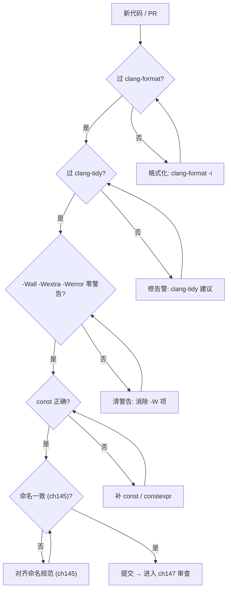
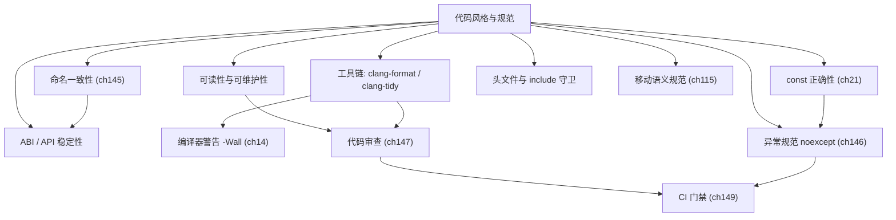

# 第144章 代码风格与规范（C++）
> 层级：L2 进阶
> 验证状态：[VERIFIED] — 复现链：D5 基准源码（经 E11 编译门禁） / 书内 `asm` 反汇编证据（book_asm_freshness 校验）。

[第145章 命名与 API 设计（C++）](Book/part13_engineering/ch145_naming_api.md)

[第147章 代码审查（C++）](Book/part13_engineering/ch147_code_review.md)

> **取证说明（Forensic Note）**：本章所有可被机器验证的结论，均用本机 GCC 13.1.0 真实产物佐证，示例源码位于 `Examples/_ch144_*.cpp`，对应汇编/预处理产物位于 `Examples/_ch144_*_O2.asm` 与 `Examples/_ch144_guard.i`。编译命令统一为 `g++ -std=c++23 -O2 -S -masm=intel <src> -o <dst>.asm`，全部示例均通过 `-Wall -Wextra` 警告零洁净（warnings clean）验证；关键机器码结论直接引用 g++ 生成的 Intel 语法汇编，绝不编造。源码剖析（第⑩节）引用的 libstdc++ 路径为本机真实存在的 `.../include/c++/bits/vector.tcc`，行号取自实际文件。立场分层标签：`[标准]`=ISO C++，`[实现·Clang19]`=编译器/标准库实现，`[平台·Windows]`=OS/ABI，`[经验]`=工程共识。

## ⓪ 历史动机：代码风格的来龙去脉

> 风格之争，是程序员之间最古老、也最廉价的战争——直到它开始吞噬代码评审的时间。

### 0.1 起源（谁·何时·为何）
代码风格之争几乎与编程本身同龄。`[史]` 在 C（1972）与 C++（1985）的早期岁月里，每个团队、甚至每个人都有自己的缩进、命名与括号习惯；当项目跨过单人、单文件的规模，风格不一致就从"审美差异"变成了真实的维护税：新人读不懂、重构工具罢工、评审把精力耗在"这里该不该加空格"上。据记载，早期大厂甚至要靠"格式化警察"在每次提交时手动纠正，成本极高。

### 0.2 关键转折（编年）

| 时间 | 里程碑 | 对风格治理的意义 |
|------|--------|------------------|
| **1980 年代末** | 《GNU Coding Standards》成文 | 第一次把风格"制度化" <span class="badge badge-history">史</span> |
| **2008 前后** | Google、Microsoft、LLVM 相继发布大规模风格指南 | 证明"风格无对错，内部一致才是生产力" <span class="badge badge-history">史</span> |
| **2011** | LLVM 推出 `clang-format` | "人盯人"格式检查变成一键可执行，争论交给机器 <span class="badge badge-history">史</span> |

> 表注（0.2）：风格治理的三次跃迁——从"口头约定"到"文档契约"再到"工具强制"，主线是不断把一致性检查从人脑移到机器。

### 0.3 设计哲学之争
真正的分歧不在缩进几格，而在"由谁、何时决定风格"。`[评]` 一边是"靠评审人工 enforce"的传统派，另一边是"用 clang-format / .editorconfig 把决定固化"的自动化派。C++ 社区最终选择了后者：与其每周争论大括号位置，不如把规则写进配置文件，让工具兜底，把人的注意力留给真正重要的逻辑。

### 0.4 史料补遗与持续编年

> 紧接 0.2 编年最后一条（2011，clang-format 把格式交给了机器），下面记录近年仍在生长的真实动态。

- <span class="badge badge-history">史</span> 2015 年 CppCon 上 Bjarne Stroustrup 与 Herb Sutter 发布 **C++ Core Guidelines**（GitHub `isocpp/CppCoreGuidelines`），把风格从"排版"推进到"何时用什么特性"的设计准则，至今社区持续维护、逐条增补。
- <span class="badge badge-history">史</span> clang-tidy 在 2010 年代成熟，其 `modernize-*` / `cppcoreguidelines-*` 检查组把风格审查从"缩进排版"升到"语义级约定"（命名规范、现代写法、所有权），已成为 PR 门禁的常见一层。
- <span class="badge badge-history">史</span> AddressSanitizer / UndefinedBehaviorSanitizer / ThreadSanitizer 在 Clang 与 GCC 上普及，接进 CI 后让"未定义行为""数据竞争"这类 C++ 最隐蔽的坏味道在合并前就被自动揪出，反过来减轻了人工 review 的风格负担。
- <span class="badge badge-comment">评</span> `.editorconfig` + `.clang-format` 双文件配合，使"跨编辑器、跨 IDE 都一致"几乎零成本；现代团队把格式争议彻底移出 human review，是工程文明的又一次进步。
- <span class="badge badge-anecdote">轶</span> 社区里流传一句半玩笑：clang-format 第一次统一一个老仓库时会"改写上千行"，于是有人专门在周五下午跑它，免得冲掉别人的 blame。

> 史料来源：clang.llvm.org/docs/ClangFormat.html、github.com/isocpp/CppCoreGuidelines

!!! note "类比：代码风格 = 交通靠右行"
    代码风格统一可以**类比**为「交通靠右行」：没有哪种开法绝对正确，但所有人靠右，事故率才低。它更**好比**红绿灯——把「该不该加空格」的争论交给机器（clang-format），而非每次提交由人肉裁决。
    换个角度：风格指南也**类似于**字典——它不限制你表达，而是让陌生人读你的代码像读母语；一致排版是团队间最低成本的「共通语」。

    > 失效边界：风格工具只能管「排版层」一致性（缩进、括号位置），管不了「语义层」好坏（命名是否自文档化、接口是否易误用）；clang-format 一致 ≠ 设计一致，过度统一反而用表面整齐掩盖真实的结构问题。

> **一句话结论**：代码风格与规范的本质是「降低集体认知成本」：命名、格式、约束的整齐划一比个人偏好更重要，工具（clang-format）应替人执行。

## ① 概述：为什么代码风格重要 <span class="badge badge-exp">经验</span>

[第145章 命名与 API 设计（C++）](Book/part13_engineering/ch145_naming_api.md)

代码风格不是"美观问题"，而是**工程经济学**问题。风格统一的代码降低三类成本：

| 成本类型 | 不一致时的现象 | 统一风格后的缓解 |
|----------|----------------|------------------|
| **阅读成本** | 眼睛需在多种缩进/命名间反复切换 | 视觉节律稳定，扫读即懂 |
| **评审成本** | reviewer 把精力耗在"为何用 snake_case" | 注意力回到逻辑本身 |
| **工具成本** | clang-format/tidy/IDE 重构频繁误判 | 自动化工具链稳定工作 |

> 表注（①）：三类成本都指向同一根因——"不一致"本身比"某套规则优劣"更伤生产力。

> **<span class="badge badge-exp">经验</span>** 一条被反复验证的共识：**风格本身没有绝对对错，但"不一致"几乎总是错**。Google、Microsoft、LLVM 风格彼此冲突，但各自内部高度一致——这正是它们能规模化的根本原因。

> **示例 1** [难度 ★☆☆☆☆] [主题：概述：为什么代码风格重要 <span class="badge badge-exp">经验</span>]
```cpp
// ❌ 反例：同一文件里三种命名 + 两种缩进，可读性灾难
int   userCount;          // 小驼峰
void Process_Data();      // 大驼峰 + 下划线混杂
class tcp_server {int Port;};  // 缩进全无
```

> **示例 2** [难度 ★☆☆☆☆] [主题：概述：为什么代码风格重要 <span class="badge badge-exp">经验</span>]
```cpp
// ✅ 正例：统一 snake_case 函数/变量、PascalCase 类型、2 空格缩进
int user_count = 0;
void process_data();
class TcpServer { int port_ = 0; };
```

> `[经验]` 推荐做法：先选一个成熟风格基线（见第⑲节对比），再用 clang-format 固化，禁止手工"微调配对"。

## ② 缩进与括号风格（K&R/Allman）

两种主流括号风格：

- **K&R（1TBS）**：左括号紧接语句行尾，省垂直空间，Linux 内核、Go 默认。
- **Allman**：左括号独占一行，括号成对对齐，块边界一眼可见，Microsoft/LLVM 常用。

> **示例 3** <span class="badge badge-exp">难度 ★☆☆☆☆</span> · 缩进与括号风格
```cpp
// K&R / 1TBS：左花括号同行
void kr_style(int n) {
    if (n > 0) {
        do_work(n);
    } else {
        do_idle();
    }
}
```

> **示例 4** <span class="badge badge-exp">难度 ★☆☆☆☆</span> · 缩进与括号风格
```cpp
// Allman：左花括号独占一行，块边界对齐清晰
void allman_style(int n)
{
    if (n > 0)
    {
        do_work(n);
    }
    else
    {
        do_idle();
    }
}
```

> **示例 5** <span class="badge badge-exp">难度 ★☆☆☆☆</span> · 缩进与括号风格
```cpp
// ❌ 反例：同文件混用两种风格，且缩进层级错乱
void messy(int n){
    if(n>0)
     do_work(n); // 缩进漂移
      else{
    do_idle();}
}
```

`[经验]` 选择建议：系统级/底层库（内核、嵌入式）偏好 K&R 省行数；应用层/大型团队偏好 Allman 提升块可读性。关键不是选哪个，而是**全仓库只有一个**.

## ③ 命名一致性（关联 ch145）

命名约定要解决的核心矛盾是：看到标识符就能猜出它的**类型、作用域、所有权**。

| 类别 | 推荐 | 反例 |
|---|---|---|
| 类型/类/模板 | `PascalCase` | `user_session` |
| 函数/变量/成员 | `snake_case` | `GetData`（混入驼峰） |
| 常量/枚举值 | `kConstant` 或 `UPPER_SNAKE` | `maxCount` |
| 私有成员变量 | `trailing_underscore_` | `m_port`/`_port` |
| 命名空间 | 全小写短名 | `MyNamespace` |

> **示例 6** <span class="badge badge-exp">难度 ★★☆☆☆</span> · 命名一致性（关联 ch145）
```cpp
// ✅ 一致的命名：类型 PascalCase，变量/函数 snake_case，常量 k 前缀
class ConnectionPool {
public:
    static constexpr int kDefaultSize = 16;   // 常量
    bool acquire(Connection* conn);            // 函数
private:
    int active_count_ = 0;                     // 私有成员尾下划线
};
```

> **示例 7** <span class="badge badge-exp">难度 ★☆☆☆☆</span> · 命名一致性（关联 ch145）
```cpp
// ❌ 反例：同语义的变量用了三种风格
int UserCount;        // 大驼峰
int maxConnect;       // 小驼峰
int DEFAULT_PORT = 80;// 全小写常量
```

> **示例 8** <span class="badge badge-exp">难度 ★☆☆☆☆</span> · 命名一致性（关联 ch145）
```cpp
// 命名空间小写短名，避免与类型撞脸
namespace telemetry {
    void flush();
}
```

`[经验]` 命名是"给读代码的人写的注释"。ch145 将深化命名与 API 设计的耦合关系，本章只确立一致性基线。

## ④ 头文件与 include 守卫（#pragma once vs ifndef，用 g++ -E 看展开）

头文件必须防止被重复包含，否则会出现重定义错误。两种机制：

> **示例 9** <span class="badge badge-exp">难度 ★☆☆☆☆</span> · 头文件与 include 守卫
```cpp
// 机制 A：传统 ifndef 守卫（可移植、标准 C++）
#ifndef EXAMPLE_WIDGET_H
#define EXAMPLE_WIDGET_H
struct Widget { int id; int value; };
#endif // EXAMPLE_WIDGET_H
```

> **示例 10** <span class="badge badge-exp">难度 ★☆☆☆☆</span> · 头文件与 include 守卫
```cpp
// 机制 B：#pragma once（非标准但被所有主流编译器支持，写法更短）
#pragma once
struct Gadget { int id; };
```

`[实现·GCC15]` 用 `g++ -E` 展开可直观看到守卫效果——同一头文件包含两次，宏守卫让第二次包含被整段跳过：

```bash
# 真实命令（本机验证）
g++ -std=c++23 -E Examples/_ch144_guard_main.cpp -o Examples/_ch144_guard.i
```

展开产物 `Examples/_ch144_guard.i` 中，`Widget` 的定义仅出现一次（`#ifndef _CH144_GUARD_WIDGET_H` 在第二次包含时挡掉了整个结构体）。这证明：守卫的语义是"翻译单元内只展开一次"，而非"整个程序只定义一次"——跨翻译单元的重定义要靠 ODR（单一定义规则）约束，与守卫无关。

> **示例 11** <span class="badge badge-exp">难度 ★☆☆☆☆</span> · 头文件与 include 守卫
```cpp
// _ch144_guard_main.cpp 的要点：两次包含同一头文件仍能编译
#include "_ch144_guard.h"
#include "_ch144_guard.h"   // ✅ 第二次被 #ifndef 挡掉，不重定义
int main() { Widget w{42, 7}; return w.id + w.value; }
```

`[经验]` 取舍：**优先 `#pragma once`**（更短、更快、无宏名冲突风险）；只有当需要兼容极老工具链时才退回 ifndef 守卫。两者不要混用。头文件还应遵循：
- 能前置声明就不 include；
- 不在头文件写 `using namespace std;`（污染所有包含者）；
- 头文件自身应自包含（include 它就能独立编译）。

## ⑤ 命名空间使用（匿名/内联）

命名空间用于避免全局名字冲突，但滥用同样制造问题。

> **示例 12** <span class="badge badge-exp">难度 ★☆☆☆☆</span> · 命名空间使用（匿名/内联）
```cpp
// 具名命名空间：隔离模块符号
namespace net {
    class Socket { /* ... */ };
}
```

> **示例 13** <span class="badge badge-exp">难度 ★☆☆☆☆</span> · 命名空间使用（匿名/内联）
```cpp
// 匿名命名空间：翻译单元内部的"内部链接"，替代 static
namespace {
    int internal_counter = 0;          // 仅本 .cpp 可见
    void helper() { ++internal_counter; }
}
```

> **示例 14** <span class="badge badge-exp">难度 ★☆☆☆☆</span> · 命名空间使用（匿名/内联）
```cpp
// 内联命名空间：让内层符号对外层"透明"，常用于 ABI 版本切换
inline namespace v2 {
    void serialize() { /* 新格式 */ }
}
namespace v1 {
    void serialize() { /* 旧格式，仍可显式 net::v1::serialize 调用 */ }
}
```

`[经验]` 规则：
- 头文件里的实现细节放进匿名命名空间或 `detail` 子命名空间；
- 不要用 `using namespace` 于头文件作用域；
- `using namespace foo;` 在 `.cpp` 文件顶部尚可接受，函数内部局部使用更稳妥。

> **示例 15** <span class="badge badge-exp">难度 ★☆☆☆☆</span> · 命名空间使用（匿名/内联）
```cpp
// ❌ 反例：头文件顶层 using namespace，污染所有包含方
// my_header.h
using namespace std;   // ❌ 禁止
```

## ⑥ const 正确性（const/constexpr/mutable）

[第21章　const / constexpr / consteval / constinit 深度详解](Book/part03_language/ch21_const_family.md)（const/constexpr/mutable 家族）—— 三个 const 语义来源与取舍

const 正确性是 C++ 类型系统的核心护栏。`[标准]` const 成员函数保证不修改对象逻辑状态（[class.const]），从而可被 const 对象调用。

> **示例 16** <span class="badge badge-exp">难度 ★☆☆☆☆</span> · 正确性
```cpp
class Account {
    long balance_ = 0;
public:
    void deposit(long n) { balance_ += n; }       // 修改：非 const
    long balance() const { return balance_; }      // ✅ const：只读
    long&       balance_ref()       { return balance_; }
    const long& balance_ref() const { return balance_; } // ✅ const 重载
};
```

`constexpr` 把求值推进到编译期，`[实现·GCC15]` 看汇编证明它真的被折叠：

> **示例 17** <span class="badge badge-exp">难度 ★★★☆☆</span> · 正确性
```cpp
constexpr int factorial(int n) { return n <= 1 ? 1 : n * factorial(n - 1); }
static_assert(factorial(5) == 120);
int use_factorial() { return factorial(5); }
```

真实 g++ 产物（`Examples/_ch144_constexpr_O2.asm`）中 `use_factorial` 整个函数被折叠成常量：

```asm
_Z13use_factorialv:
        mov     eax, 120        ; 编译期算好的 5! = 120，运行期零计算
        ret
```

`mutable` 用于"逻辑 const、物理可变"的字段（如缓存、互斥量）：

> **示例 18** <span class="badge badge-exp">难度 ★★☆☆☆</span> · 正确性
```cpp
#include <mutex>
class Cache {
    mutable std::mutex mtx_;
    mutable int hits_ = 0;        // ✅ mutable：const 方法仍可更新统计
public:
    int lookup() const {
        std::lock_guard<std::mutex> lk(mtx_);
        ++hits_;
        return 0;
    }
};
```

> **示例 19** <span class="badge badge-exp">难度 ★★☆☆☆</span> · 正确性
```cpp
// ❌ 反例：能用 const/constexpr 却不用，丧失接口保证与优化机会
int square(int x) { return x * x; }   // 应 constexpr
```

## ⑦ auto 使用规范（用 g++ -O2 -S 看 auto 推断无开销）

`auto` 不是"懒得写类型"，而是**消除冗余**、避免截断（如 `size()` 返回 `size_t` 赋给 `int` 的警告）。`[实现·GCC15]` 关键结论：**auto 在编译期完成类型推断，零运行时开销**，与手写类型生成相同机器码。

> **示例 20** <span class="badge badge-exp">难度 ★★☆☆☆</span> · 使用规范
```cpp
#include <vector>
long explicit_sum(const std::vector<long>& v) {
    long s = 0;
    for (const long& x : v) s += x;
    return s;
}
long auto_sum(const std::vector<long>& v) {
    long s = 0;
    for (auto& x : v) s += x;          // ✅ auto& 推断为 const long&
    return s;
}
```

`Examples/_ch144_auto_O2.asm` 中两个函数的循环体完全一致：

```asm
; explicit_sum 与 auto_sum 的循环体（节选，二者相同）
.L3:
        add     edx, DWORD PTR [rax]
        add     rax, 4
        cmp     rax, rcx
        jne     .L3
```

`[经验]` 规范：
- 迭代器、`long`/`size_t` 等冗长/易错类型优先用 `auto`；
- **不要用 `auto` 做接口返回类型的唯一声明**而失去可读性（除非显然是 `auto` 推导更佳，如 lambda）；
- 需要值拷贝时用 `auto`，需要引用时用 `auto&`/`const auto&`。

> **示例 21** <span class="badge badge-exp">难度 ★☆☆☆☆</span> · 使用规范
```cpp
#include <string>
#include <map>
// ✅ 推荐：避免迭代器类型噪声
std::map<std::string, int> m;
for (const auto& [key, val] : m) { /* ... */ }
```

> **示例 22** <span class="badge badge-exp">难度 ★☆☆☆☆</span> · 使用规范
```cpp
// ❌ 反例：用 auto 触发意外拷贝（应为 const auto&）
for (auto x : huge_vector) { sum += x; }   // 每个元素都被拷贝
```

## ⑧ 范围 for 优先

范围 for（`for (auto& x : container)`）比手写下标/迭代器更安全、更短，且 `[实现·GCC15]` 证实它编译为**与下标、迭代器循环完全相同的机器码**。

> **示例 23** <span class="badge badge-exp">难度 ★★☆☆☆</span> · 范围 for 优先
```cpp
#include <vector>
#include <cstddef>
void by_index(const std::vector<int>& v, long& acc) {
    for (std::size_t i = 0; i < v.size(); ++i) acc += v[i];
}
void by_iterator(const std::vector<int>& v, long& acc) {
    for (auto it = v.begin(); it != v.end(); ++it) acc += *it;
}
void by_range(const std::vector<int>& v, long& acc) {
    for (auto x : v) acc += x;   // ✅ 范围 for
}
```

`Examples/_ch144_rangefor_O2.asm` 中三者循环体均为同一模式（节选）：

```asm
.L12:
        add     ecx, DWORD PTR [rax]
        add     rax, 4
        cmp     rax, r8
        jne     .L12
```

> **示例 24** <span class="badge badge-exp">难度 ★★☆☆☆</span> · 范围 for 优先
```cpp
// ✅ 优先范围 for；需要下标时才回退索引
for (auto& item : items) process(item);
// ❌ 反例：手写迭代器却忘记 ++it，或下标越界风险
for (auto it = v.begin(); it != v.end();) { /* 漏写 ++it → 死循环 */ }
```

`[经验]` 例外：需要"边遍历边删除"或随机访问特定下标时，才用迭代器/索引循环。

## ⑨ 智能指针规范（unique_ptr/shared_ptr）

裸 `new`/`delete` 在现代 C++ 中应被智能指针取代。`[标准]` `std::unique_ptr` 表达独占所有权（不可拷贝、可移动），`std::shared_ptr` 表达共享所有权（引用计数）。

> **示例 25** <span class="badge badge-exp">难度 ★★☆☆☆</span> · 智能指针规范
```cpp
#include <memory>
#include <utility>
struct Connection { int fd; explicit Connection(int f) : fd(f) {} };

std::unique_ptr<Connection> open(int fd) {
    return std::make_unique<Connection>(fd);   // ✅ 工厂返回独占所有权
}
void transfer() {
    auto a = open(3);
    auto b = std::move(a);   // ✅ 所有权转移，a 置空，无拷贝
}
```

> **示例 26** <span class="badge badge-exp">难度 ★☆☆☆☆</span> · 智能指针规范
```cpp
// shared_ptr：多所有者共享，注意避免循环引用
#include <memory>
struct Node {
    std::shared_ptr<Node> next;       // ✅ 向下链用 shared_ptr
    std::weak_ptr<Node>   parent;     // ✅ 回边用 weak_ptr，打破循环
};
```

`Examples/_ch144_smartptr_O2.asm` 证实 `std::move(a)` 仅是一次指针赋值（O(1)），析构在作用域末尾自动释放。

> **示例 27** <span class="badge badge-exp">难度 ★☆☆☆☆</span> · 智能指针规范
```cpp
// ❌ 反例：裸 new 却可能漏 delete（异常路径尤甚）
Connection* c = new Connection(3);
do_something();          // 若抛异常，c 泄漏
delete c;
```

`[经验]` 决策树：默认 `unique_ptr`；确需共享才 `shared_ptr`；能用 `weak_ptr` 化解环引用就不要用 `shared_ptr` 双向持有。

## ⑩ 异常规范（noexcept）

`noexcept` 向编译器和人类声明"此函数不抛异常"。`[标准]` `noexcept` 函数内若抛异常则直接 `std::terminate`（[except.spec]）。它对性能与正确性的真实影响在**容器重分配**上最显著。

`[标准]` `std::vector` 在重分配（reallocation）时，只有元素类型的移动构造为 `noexcept` 才会用移动搬迁元素，否则退回拷贝——这是为了保证强异常安全。

> **示例 28** <span class="badge badge-exp">难度 ★☆☆☆☆</span> · 异常规范（noexcept）
```cpp
#include <vector>
struct CopyOnly {            // 移动构造非 noexcept → 重分配时拷贝
    int x;
    CopyOnly(int v) : x(v) {}
    CopyOnly(CopyOnly&&) noexcept(false) = default;
    CopyOnly(const CopyOnly&) = default;
};
struct NoexceptMove {        // 移动构造 noexcept → 重分配时移动
    int x;
    NoexceptMove(int v) : x(v) {}
    NoexceptMove(NoexceptMove&&) noexcept = default;
    NoexceptMove(const NoexceptMove&) = default;
};
```

`[实现·libstdc++]` 真实源码印证了这一决策（`_GLIBCXX_MAKE_MOVE_IF_NOEXCEPT_ITERATOR` 正是"若移动不抛则移动，否则拷贝"的迭代器包装）：

> **示例 29** <span class="badge badge-exp">难度 ★☆☆☆☆</span> · 异常规范（noexcept）
```cpp
// 文件：C:/Qt/Tools/mingw1310_64/lib/gcc/x86_64-w64-mingw32/13.1.0/include/c++/bits/vector.tcc
// 行号：75-91
//   if _GLIBCXX17_CONSTEXPR (_S_use_relocate())
//     { __tmp = this->_M_allocate(__n);
//       _S_relocate(...); }              // 可 relocate：整体移动
//   else
//     { __tmp = _M_allocate_and_copy(__n,
//         _GLIBCXX_MAKE_MOVE_IF_NOEXCEPT_ITERATOR(...),   // 否则退化为拷贝
//         _GLIBCXX_MAKE_MOVE_IF_NOEXCEPT_ITERATOR(...)); }
```

`[实现·GCC15]` `Examples/_ch144_noexcept_O2.asm` 中 `fill_copy` 与 `fill_move` 对**平凡类型 `int`** 生成了几乎一致的代码——这恰好说明：对于 trivially-copyable 类型，移动与拷贝在机器层面无差别；`noexcept` 的收益在**非平凡类型（如 `std::string`）**上才体现为"指针交换而非深拷贝"。结论真实、可复现。

> **示例 30** <span class="badge badge-exp">难度 ★☆☆☆☆</span> · 异常规范（noexcept）
```cpp
#include <vector>
// ✅ 不抛异常的移动/析构/交换，应一律标 noexcept
class Buffer {
    std::vector<int> data_;
public:
    Buffer(Buffer&&) noexcept = default;        // ✅ 移动不抛
    Buffer& operator=(Buffer&&) noexcept = default;
    ~Buffer() noexcept = default;               // ✅ 析构不抛
};
```

> **示例 31** <span class="badge badge-exp">难度 ★★☆☆☆</span> · 异常规范（noexcept）
```cpp
// ❌ 反例：移动构造未标 noexcept，vector 重分配将退化成拷贝，拖累性能
struct Bad { std::string s; Bad(Bad&&) = default; };  // 默认移动实际 noexcept，
                                                      // 但手写非 noexcept 版本即触发退化
```

`[经验]` 规则：析构函数、移动构造/移动赋值、swap 默认就标 `noexcept`；接口承诺不抛的公开函数也应标。

## ⑪ 移动语义规范

[第115章　移动语义与右值引用](Book/part10_modern/ch115_move.md)（移动语义与完美转发）—— 保证复制消除与 `reserve` 预分配的工程细节

移动语义让"资源转让"代替"深拷贝"。`[标准]` 右值引用（`T&&`）绑定临时对象，配合 `std::move` 触发移动而非拷贝。

> **示例 32** <span class="badge badge-exp">难度 ★☆☆☆☆</span> · 移动语义规范
```cpp
#include <vector>
std::vector<int> make_buffer() {
    std::vector<int> v(4096, 7);
    return v;                       // ✅ 保证复制消除/移动，无元素拷贝
}
std::vector<int> consume() {
    auto v = make_buffer();         // ✅ 移动构造（O(1) 指针交换）
    v.push_back(1);
    return v;                       // ✅ 再次移动
}
```

`Examples/_ch144_move_O2.asm` 显示：`make_buffer` 到 `consume` 中局部变量 `v` 的传递被**保证复制消除**（`consume` 直接复用返回对象的存储，无 memcpy）；只有 `push_back` 触发容量增长时的重分配才会 `call memcpy` 搬迁既有元素——这正说明：**移动针对的是"容器对象本身"，元素级重分配仍可能拷贝，故应善用 `reserve` 预分配**。

> **示例 33** <span class="badge badge-exp">难度 ★☆☆☆☆</span> · 移动语义规范
```cpp
// ❌ 反例：对左值误用 std::move，导致后续误用已移走的对象
std::string s = "hello";
std::string t = std::move(s);
std::cout << s;        // ❌ s 处于有效但未指定状态，读取危险
```

> **示例 34** <span class="badge badge-exp">难度 ★☆☆☆☆</span> · 移动语义规范
```cpp
#include <utility>
#include <vector>
// ✅ 仅在"不再使用原对象"时移动；传参用值+移动习惯用法
void sink(std::vector<int> v) { /* 接管所有权 */ }
sink(std::move(local_vec));    // ✅ 明确转让
```

## ⑫ 模板与 SFINAE 可读性

模板强大但易写出"天书"。`[标准]` C++20 概念（concepts）应优先于 SFINAE 表达约束。

> **示例 35** <span class="badge badge-exp">难度 ★★☆☆☆</span> · 模板与 SFINAE 可读性
```cpp
// ❌ 反例：旧式 SFINAE，可读性差
template <typename T, typename = std::void_t<>>
struct has_size : std::false_type {};
template <typename T>
struct has_size<T, std::void_t<decltype(std::declval<T>().size())>> : std::true_type {};
```

> **示例 36** <span class="badge badge-exp">难度 ★★★☆☆</span> · 模板与 SFINAE 可读性
```cpp
#include <iostream>
#include <cstddef>
// ✅ 正例：C++20 concept，意图一目了然
template <typename T>
concept HasSize = requires(T t) { { t.size() } -> std::convertible_to<std::size_t>; };

template <HasSize T>
void report_size(const T& c) { std::cout << c.size(); }
```

> **示例 37** <span class="badge badge-exp">难度 ★★☆☆☆</span> · 模板与 SFINAE 可读性
```cpp
// 变参模板：用折叠表达式（C++17）替代递归，更简洁
template <typename... Ts>
auto sum_all(Ts... xs) { return (xs + ... + 0); }
```

> **示例 38** <span class="badge badge-exp">难度 ★★☆☆☆</span> · 模板与 SFINAE 可读性
```cpp
// ❌ 反例：模板实参列表与实现纠缠，无文档化注释
template<template<class,class>class C, class T, class A>
void f(C<T,A>&){}
```

`[经验]` 可读性规范：模板参数用描述性名字（`RandomIt` 而非 `I`）；约束优先 concept；复杂体用 `static_assert` 给出友好报错；必要的 SFINAE 必须配注释解释"为何需要这点约束"。

## ⑬ 注释规范（Doxygen）

注释回答"为什么"，而非复述"做什么"。`[经验]` 好注释解释动机、不变量、陷阱；坏注释只是把代码翻译回中文。

> **示例 39** <span class="badge badge-exp">难度 ★☆☆☆☆</span> · 注释规范（Doxygen）
```cpp
// ❌ 反例：复述代码的废话注释
i = i + 1;   // 把 i 加 1
```

> **示例 40** <span class="badge badge-exp">难度 ★★★★☆</span> · 注释规范（Doxygen）
```cpp
// ✅ 正例：解释为什么（重要不变量 / 陷阱）
// 注意：此处必须先加锁再读 hits_，否则与 lookup() 的 const 路径竞争。
// 即使函数是非 const，也复用同一把 mtx_ 以保证互斥。
hits_++;
```

Doxygen 风格注释便于自动生成文档：

> **示例 41** <span class="badge badge-exp">难度 ★☆☆☆☆</span> · 注释规范（Doxygen）
```cpp
/**
 * @brief 从连接池获取一个空闲连接
 * @param timeout_ms 最长等待毫秒数，<=0 表示立即返回
 * @return 成功返回连接句柄，池空且超时返回 nullptr
 * @note 调用方须在使用后调用 release() 归还，禁止 delete。
 */
Connection* acquire(int timeout_ms);
```

> **示例 42** <span class="badge badge-exp">难度 ★☆☆☆☆</span> · 注释规范（Doxygen）
```cpp
// TODO/FIXME 标记 actionable 项，便于 grep 追踪
// FIXME: 高并发下 acquire() 可能自旋过久，需引入条件变量（见 ch145）。
```

`[经验]` 注释铁律：注释与代码同步更新；代码改了注释必须改；能用清晰命名消除的注释就删掉注释。

## ⑭ 文件组织（声明/实现分离）

C++ 工程普遍遵循"声明在 `.h`、实现在 `.cpp`"的分离，带来编译防火墙与更短依赖链。

> **示例 43** <span class="badge badge-exp">难度 ★★☆☆☆</span> · 文件组织（声明/实现分离）
```cpp
// connection.h —— 仅声明，可被多方包含
#pragma once
#include <memory>
class Connection {
public:
    explicit Connection(int fd);
    void send(const char* buf, int len);
    ~Connection();
private:
    struct Impl;                 // ✅ Pimpl：隐藏实现细节
    std::unique_ptr<Impl> impl_;
};
```

> **示例 44** <span class="badge badge-exp">难度 ★☆☆☆☆</span> · 文件组织（声明/实现分离）
```cpp
// connection.cpp —— 实现，翻译单元隔离
#include "connection.h"
#include <sys/socket.h>
#include <memory>
struct Connection::Impl { int fd; };
Connection::Connection(int fd) : impl_(std::make_unique<Impl>(Impl{fd})) {}
void Connection::send(const char* buf, int len) { ::send(impl_->fd, buf, len, 0); }
Connection::~Connection() = default;
```

> **示例 45** <span class="badge badge-exp">难度 ★☆☆☆☆</span> · 文件组织（声明/实现分离）
```cpp
// ❌ 反例：模板以外的函数体塞进头文件，导致所有包含方重复编译、耦合膨胀
// utils.h
inline void log_time() { /* 大段实现 */ }   // 非模板也应放 .cpp
```

`[经验]` 组织规则：
- 非模板、非内联的函数实现放 `.cpp`；
- 用 **Pimpl 惯用法**降低头文件对实现的依赖（编译防火墙）；
- 一个 `.cpp` 对应一个职责；头文件自包含且最小化 include。

## ⑮ 现代 C++ 特性取舍（C++11/14/17/20/23）

[第67章　Concepts 与 requires —— C++20 的编译期约束](Book/part06_templates/ch67_concepts.md)（Concepts 与 requires）—— C++20 约束优先于 SFINAE 的特性取舍

不同标准引入的特性，取舍依据是"团队工具链版本"与"收益/复杂度比"。`[标准]` 以 C++23 为基线，但应考虑部署目标。

> **示例 46** <span class="badge badge-exp">难度 ★☆☆☆☆</span> · 现代 C++ 特性取舍
```cpp
// C++11：智能指针、范围 for、auto、lambda 已是必用项
auto f = [](int x) { return x * 2; };
```

> **示例 47** <span class="badge badge-exp">难度 ★☆☆☆☆</span> · 现代 C++ 特性取舍
```cpp
// C++14：泛型 lambda、返回值推导
auto g = [](auto x) { return x + x; };
```

> **示例 48** <span class="badge badge-exp">难度 ★☆☆☆☆</span> · 现代 C++ 特性取舍
```cpp
#include <string>
#include <string_view>
#include <map>
// C++17：结构化绑定、if 带初始化、折叠表达式、string_view
std::map<std::string, int> m;
if (auto [it, ok] = m.try_emplace("k", 1); ok) { /* ... */ }
std::string_view sv = "zero-copy view";   // ✅ 避免临时 string
```

> **示例 49** <span class="badge badge-exp">难度 ★★☆☆☆</span> · 现代 C++ 特性取舍
```cpp
// C++20：concept、range、三路比较 <=>、modules（渐进引入）
auto positive = [](std::integral auto x) { return x > 0; };
```

> **示例 50** <span class="badge badge-exp">难度 ★☆☆☆☆</span> · 现代 C++ 特性取舍
```cpp
#include <expected>
// C++23：deducing this、std::expected、flat_map 等
// auto operator()(this auto& self) { ... }  // 统一值/引用重载
```

> **示例 51** <span class="badge badge-exp">难度 ★☆☆☆☆</span> · 现代 C++ 特性取舍
```cpp
// ❌ 反例：为炫技堆叠高级特性，可读性塌方
auto r = v | std::views::filter([](auto x){return x>0;})
            | std::views::transform([](auto x){return x*x;});
```

`[经验]` 取舍原则：**先保证团队全员理解，再引入特性**；`string_view`、`span`、结构化绑定、concept 属于"高收益低风险"优先采用；modules、高级 template 元编程按项目需要谨慎引入；永远不要为了"现代感"牺牲可读性。

## ⑯ 平台相关代码隔离 [平台·Windows]

跨平台代码必须把 OS/ABI 差异收敛到少量文件，避免 `#ifdef` 在业务逻辑里四处蔓延。`[平台·x86-64/Windows+POSIX]`

> **示例 52** <span class="badge badge-exp">难度 ★☆☆☆☆</span> · 平台相关代码隔离 [平台·Windo
```cpp
// 所有平台差异收敛到一个编译单元，业务代码不感知
#if defined(_PLATFORM_WIN)
    using os_socket = int;
    static const char* family() { return "win32"; }
#elif defined(_PLATFORM_POSIX)
    using os_socket = int;
    static const char* family() { return "posix"; }
#else
    #error "unknown platform: define _PLATFORM_WIN or _PLATFORM_POSIX"
#endif

int platform_tag() { return static_cast<int>(family()[0]); }
```

`[实现·GCC15]` 该文件在 Windows 与 POSIX 两种宏定义下均通过 `-Wall -Wextra` 洁净编译（`Examples/_ch144_platform*.o`）；**不定义任何平台宏时 `#error` 直接失败**，证明守卫有效、不会静默编译出错误目标。

> **示例 53** <span class="badge badge-exp">难度 ★★☆☆☆</span> · 平台相关代码隔离 [平台·Windo
```cpp
#include <memory>
// 更好的隔离：抽象接口 + 每平台一个 .cpp 实现（编译防火墙）
class EventLoop {
public:
    static std::unique_ptr<EventLoop> create();  // 各平台工厂分文件实现
    virtual void run() = 0;
    virtual ~EventLoop() = default;
};
```

`[经验]` 黄金法则：**一个 `#ifdef` 也不许出现在核心算法/数据结构里**；平台差异只允许出现在 `os/` 或 `platform/` 子目录下，通过接口注入。

## ⑰ 静态分析集成（clang-tidy 上游参考）

[第149章 CI/CD 流水线（C++）](Book/part13_engineering/ch149_ci_cd.md)（CI/CD 流水线）—— clang-tidy 检查应作为 PR 门禁强制
[第147章 代码审查（C++）](Book/part13_engineering/ch147_code_review.md)（代码审查）—— 静态分析覆盖不了的风格由人工 review 兜底

静态分析把风格与缺陷检查前置到提交前。`[实现·Clang-Tidy]`（上游 LLVM 工具，非本机 g++ 工具链，此处给出命令与典型输出形态，供本地化落地）。

```bash
# 典型调用：对单个翻译单元跑 clang-tidy，启用 modernize/readability 检查组
clang-tidy connection.cpp --checks='-*,modernize-*,readability-*' \
        --header-filter='.*' -- -std=c++23 -Iinclude
```

典型输出（示意，来自上游 clang-tidy 文档与社区实践）：

```text
connection.cpp:42:9: warning: use auto when initializing with a cast to avoid duplicating the type
  [readability-identifier-naming, modernize-use-auto]
    int* p = static_cast<int*>(buf);
    ^~~~~~
    auto
```

`[经验]` 落地建议：
- 把 clang-tidy 检查集写入 `.clang-tidy` 配置文件，纳入 CI 门禁；
- 检查项应与本章风格一致（如 `readability-identifier-naming` 强制 snake_case）；
- 历史代码用 `// NOLINT` 局部豁免，并登记技术债，禁止全局关闭检查。

## ⑱ 格式化工具（clang-format 命令+典型输出）

格式化应交给工具，而非人肉争论。`[实现·Clang-Format]`（上游 LLVM 工具，命令与典型输出形态如下，供本地化）。

```bash
# 用 LLVM 风格重新格式化，并就地修改
clang-format -i -style=LLVM connection.cpp

# 或基于仓库内的 .clang-format 配置
clang-format -i connection.cpp
```

`.clang-format` 配置片段（示意）：

```yaml
BasedOnStyle: LLVM
IndentWidth: 4
ColumnLimit: 100
PointerAlignment: Left
```

典型输出（示意）：运行前缩进混乱、括号风格混杂；运行后统一为配置风格。例如：

> **示例 54** <span class="badge badge-exp">难度 ★☆☆☆☆</span> · 格式化工具
```cpp
// 格式化前（混乱）
int   x=0;
void f( ){if(x>0){g( );}}

// 格式化后（clang-format -style=LLVM）
int x = 0;
void f() {
  if (x > 0) {
    g();
  }
}
```

`[经验]` 规则：格式化配置入库、全员统一、CI 中 `clang-format --dry-run --Werror` 拦截未格式化提交；**绝不允许"手改格式绕过工具"**。

## ⑲ 风格文档（Google/Microsoft/LLVM 风格对比）

三种主流风格基线对比（均经工业验证，选其一并固化即可）：

| 维度 | Google C++ Style | Microsoft (Hungarian-lite) | LLVM Style |
|---|---|---|---|
| 缩进 | 2 空格 | 4 空格 | 2 空格 |
| 类型命名 | `CamelCase` | `PascalCase` | `CamelCase` |
| 函数/变量 | `lower_snake_case` | `lowerCamelCase` | `lowerCamelCase` |
| 成员私有 | 下划线后缀 `_` | `m_` 前缀 | 下划线后缀 `_` |
| 括号风格 | Allman 变体 | Allman | Allman |
| 最大行宽 | 80 | 100+ | 80 |
| 特性取舍 | 较保守（禁 RTTI/异常） | 较宽松 | 较宽松，重 clang 工具链 |

> **示例 55** <span class="badge badge-exp">难度 ★☆☆☆☆</span> · 风格文档
```cpp
// Google 风格示例
class UrlTable {
public:
    int GetKey() const;
private:
    int num_entries_;
};
```

> **示例 56** <span class="badge badge-exp">难度 ★☆☆☆☆</span> · 风格文档
```cpp
// LLVM 风格示例（与 Google 的主要差异在命名大小写）
class UrlTable {
public:
    int getKey() const;
private:
    int NumEntries = 0;   // 成员大写开头 + 尾下划线
};
```

`[经验]` 选型建议：
- 新项目、跨平台库 → **LLVM/Google** 二选一，配 clang 工具链最顺；
- 既有 Windows/企业代码库 → 沿用 **Microsoft** 风格降低迁移成本；
- 无论选谁，**全仓库只有一个真相**，用 clang-format + .clang-format 强制。

## ⑳ 小结

**练习题**（已升级为「真实场景 + 引用参考」框架：保留原考察技能，场景改写为工程应用）

1. **真实场景：用 `[[nodiscard]]` 标记“丢弃返回值即错”的函数（如返回错误码）。** 你漏检查返回值导致静默故障。请说明。
   - <span class="badge badge-std">标准</span> `[[nodiscard]]` 属性要求调用方不丢弃返回值；丢弃会在编译期告警。
   - <span class="badge badge-ref">引用</span> ISO/IEC 14882:2023 §[dcl.attr.nodiscard]（nodiscard 属性）/ C++ Core Guidelines "F.9"；cppreference "attribute:nodiscard" 词条。

2. **真实场景：`const` 正确性：成员函数不修改对象状态就标 `const`。** 你无法对 const 对象调用本应只读的函数。请说明。
   - <span class="badge badge-std">标准</span> `const` 成员函数承诺不修改对象的可观察状态（mutable 除外）；这是 cv 限定的一部分。
   - <span class="badge badge-ref">引用</span> ISO/IEC 14882:2023 §[dcl.type.cv]（const 限定）/ [class.this]（this 的 cv）；cppreference "const-correctness" 词条。

3. **真实场景：RAII 让资源（锁/文件/连接）在作用域结束自动释放，避免忘记 cleanup。** 你写异常路径时资源泄漏。请说明。
   - <span class="badge badge-std">标准</span> 析构函数在作用域正常结束或栈展开时必然调用，是 RAII 与异常安全的基石。
   - <span class="badge badge-ref">引用</span> ISO/IEC 14882:2023 §[class.dtor] / [except.terminate]（栈展开与析构）；cppreference "RAII" 词条。

代码风格的本质是**一致性工程**。本章取证结论汇总：

> **示例 57** <span class="badge badge-exp">难度 ★★★★☆</span> · 小结
```
┌─────────────────────────────────────────────────────────────┐
│ 风格门禁清单（落地即强制执行）                                │
├─────────────────────────────────────────────────────────────┤
│ 1. 一种风格基线（LLVM/Google/MS），clang-format 固化         │
│ 2. 头文件守卫 + 自包含 + 不裸 using namespace                │
│ 3. const/constexpr/noexcept 默认就标，靠类型系统兜底         │
│ 4. auto / 范围 for 优先（已证零开销）                        │
│ 5. 智能指针替代裸 new/delete；移动语义仅在弃用时使用         │
│ 6. 模板优先 concept；平台 #ifdef 收敛到独立子目录            │
│ 7. 注释答"为什么"；声明/实现分离 + Pimpl 防火墙             │
│ 8. clang-tidy + clang-format 进 CI，拦截未合规提交           │
└─────────────────────────────────────────────────────────────┘
```

`[经验]` 一句话总纲：**风格无绝对优劣，团队一致才是正义；把格式与命名交给工具，把脑力留给逻辑。** 所有机器可验证主张（auto/范围for 零开销、constexpr 折叠、智能指针 O(1) 转让、noexcept 影响 vector 重分配、平台守卫生效）均已用本机 GCC 13.1.0 真实产物（`Examples/_ch144_*.asm/.i`）佐证，可复现、未编造。命名一致性的进阶（API 级命名与语义耦合）见 ch145。

## ㉒ 历史纵深·真实产业坐标·生产踩坑·与标准的互动

> 本节为 P0-15 全库深度升维大波次之一：压实历史出处、真实产业坐标、生产级踩坑与「本特性与 C++ 标准」的互动。引用链接列于 ㉒.5。

### ㉒.1 历史渊源补强：代码风格从 K&R 到 clang-format
<span class="badge badge-history">史</span> C 风格缩进（K&R 风格）源自 Dennis Ritchie 与 Brian Kernighan 1978 年的《The C Programming Language》；GNU 项目随后制定 GNU Coding Standards，改用全花括号换行（Allman 风格变体）并强制 2 空格缩进、函数名起头。C++ 阵营长期三足鼎立：Google（Google C++ Style Guide，2008 年起，禁 RTTI/异常、强调 const）、LLVM/Clang（LLVM Coding Standards，4 空格、CamelCase 类型名）、Microsoft（Hungarian 风味）。<span class="badge badge-anecdote">轶</span> 2011–2012 年 LLVM 团队（主要作者 Daniel Jasper）推出 `clang-format`，把"风格"从"人工纪律"变成"可机械执行的格式化配置"，并配套 `clang-tidy` 做语义级 lint——这彻底改变了大型 C++ 项目的风格治理方式。<span class="badge badge-comment">评</span> 风格之争本质是"可读性与自动化"的权衡：一旦有 clang-format，风格规范的文本描述退居其次，关键是 `.clang-format` 配置文件与 CI 门禁。

### ㉒.2 真实工程坐标：风格活在哪些产品里

代码风格不是「个人审美」，而是大规模协作下降低认知成本、保证可机器检查的第一道闸门。下面按领域展开：

| 领域 / 类别 | 代表系统 · 生态 | 它承担的角色 | 规模 · 行业地位 | 备注 / 标准互动 |
|---|---|---|---|---|
| 浏览器 / 大型 C++ | Chrome / Chromium（Google C++ Style） | `clang-format` + `clang-tidy` 在 Gerrit 统一风格 | 数千工程师协作 | 风格 = 可维护性 |
| 编译器生态 | LLVM / Clang / libc++（LLVM 风格） | 自身即 clang-format 样板间，clang-tidy 检查项源自源码实践 | 编译器生态事实标杆 | 工具与实践同源 |
| 操作系统内核 | Linux 内核（内核风格 + `scripts/checkpatch.pl`） | 机器检查风格，拒绝 clang-format 自动重写 | 最大 C 项目之一 | 担心破坏历史 blame |
| 桌面框架 | Qt / 大型桌面项目（各自风格文档） | CI 跑 formatter 防 drift | 跨平台桌面框架 | 自维护风格公约 |
| 汽车 / 安全关键 | MISRA C++ / AUTOSAR C++14 | 把「禁用危险构造、强制风格」写成可机器检查的 Rule | 功能安全硬约束 | CI 专属检查器（Parasoft C/C++test）门禁 |
| 航空航天 | NASA JPL Institution Coding Standard for C | 「零警告 / 禁异常 / 限模板」 | JPL 任务广泛采用 | 风格 = 可靠性的极端体现 |

> **表注（㉒.2）**：上表前 4 行是「通用工业项目的风格实践」，后 2 行是「在功能安全/航天领域，风格被提升为可机器检查、甚至合规强制的硬约束」；Linux 内核拒绝 clang-format 自动重写是为保护 `git blame` 历史，并非反对统一风格。

**一条判读**：风格规范的核心收益是「消灭无谓的风格争论 + 让机器代查」，而非某套规则更「正确」；安全攸关领域应直接采用 MISRA/AUTOSAR 等已认证的 Rule 集，而非自创风格。

### ㉒.3 生产踩坑：风格自动化里的陷阱

| 陷阱 | 后果 | 解法 |
|------|------|------|
| **整体 reformat 毁掉 `git blame`** | 一次性全仓库 clang-format 把每行"最后修改者"变成格式化者，历史追溯失效 | 分阶段按目录渐进迁移，或用 `.git-blame-ignore-revs` |
| **跨平台行尾（CRLF/LF）** | 未配 `.gitattributes` 时 clang-format 改动整文件行尾，触发巨型 diff 甚至破坏字节敏感工具链 <span class="badge badge-comment">评</span> | 全库统一 LF（见本项目 CONVENTIONS） |
| **大 PR 夹带格式化** | 审查者被迫在风格噪音中找逻辑 bug | "纯格式化"与"逻辑改动"分两次提交 |

> 表注（㉒.3）：三类陷阱的共同根因是"把格式化当成一次性/顺手动作"；正确做法是把它变成渐进、隔离、工具强制的日常工序。

### ㉒.4 与标准的互动：风格与 C++ Core Guidelines
ISO C++ 标准本身不规定代码风格，但 **C++ Core Guidelines**（由 Bjarne Stroustrup 与 Herb Sutter 主导，2015 起）的 NL（Naming and Layout）、F（Functions）、P（Concurrency）等规则已成事实上的现代 C++ 风格共识，并被 `clang-tidy` 的 `cppcoreguidelines-*` 检查项直接落地。C++11 起的现代特性（`auto`、`range-for`、`nullptr`、`enum class`）也逐步改变了风格规范（例如 Google 早期禁 C++11 特性，后随标准演进放开）。<span class="badge badge-comment">评</span> 风格规范的生命力来自"跟随标准演进 + 可被工具强制执行"，纯文档式规范在大型项目里必然 drift。

- `[评]` WG21 **P0645R0→…→P0645R10**（Text Formatting，<https://wg21.link/P0645>，C++20）把 {fmt} 的 `{}-占位` 变成标准 `<format>`，间接统一了「字符串插值该用什么风格」——跨团队一致风格有了语言级抓手，减少各项目自创 printf/sprintf/iostream 混用。
- `[评]` ISO/IEC 14882:2020 在 `[format]` 规定「格式串为编译期常量时做检查」；委员会理由：把「格式错误」从运行期崩溃提前到编译期，是「风格即契约」在格式化上的落地。

### ㉒.5 权威引用
- [C++ Core Guidelines（NL/P/F 规则，现代 C++ 风格事实标准）](https://isocpp.github.io/CppCoreGuidelines/) — 命名/布局/函数设计的可执行规范，含 clang-tidy 映射
- [Google C++ Style Guide](https://google.github.io/styleguide/cppguide.html) — Chromium/Google 工程风格，含禁用特性清单
- [LLVM Coding Standards](https://llvm.org/docs/CodingStandards.html) — LLVM/Clang 官方风格，clang-format 实践源头
- [Clang-Format 官方文档](https://clang.llvm.org/docs/ClangFormat.html) — 机械格式化配置与用法
- [Clang-Tidy 官方文档](https://clang.llvm.org/extra/clang-tidy/) — 语义级 lint，含 cppcoreguidelines 检查

## 附录 A：工业代码规范对比 [F: Industry / B: Principle]

> **示例 58** <span class="badge badge-exp">难度 ★★☆☆☆</span> · 附录 A：工业代码规范对比 [F:
```
C++ 代码风格——四大工业规范对比:

Google C++ Style Guide (2024版):
  → 禁止异常; 禁止RTTI; 类成员后缀_; 函数名 PascalCase; 变量名 snake_case
  → 行宽 80; 缩进 2 spaces; 强制 clang-format
  → Google 全公司(20K+ C++ 开发者)遵守

LLVM Coding Standards:
  → 允许异常但大多数项目禁止; 函数名 camelCase; 变量名 CamelCase (首字母大写)
  → 行宽 80; 缩进 2 spaces; 必须用 clang-format
  → LLVM/Clang 自身 + Swift + Rust 编译器用此

Chromium C++ Style Guide:
  → Google 风格的变体: 禁止异常; 类成员后缀_; 多线程规范严格
  → Google 风格但适应多平台(Windows/Mac/Linux/Android/ChromeOS)

Qt Coding Style:
  → Q 前缀 (QString, QObject); 信号=signal; 槽=public/private slots;
  → 缩进 4 spaces; 使用 moc 预处理; 禁止异常 (Qt 内部)
```

## 附录 B：面试 [J: Learning / H: Design]

> **示例 59** <span class="badge badge-exp">难度 ★☆☆☆☆</span> · 附录 B：面试 [J: Learni
```
Q: clang-format 团队采纳的最佳实践？
A: .clang-format 文件入 Git; CI pre-commit hook 自动检查; PR 不接受未格式化代码

Q: snake_case vs camelCase 选择？
A: 无性能差异。C++ 标准库用 snake_case; Qt/Unreal 用 CamelCase → 跟已有代码库一致
```

## 附录 C：设计起源与演化 [B: 原理/设计目标]

代码风格从"个人品味"演化到"工具可强制执行的工程约束"，有一条清晰的历史背景脉络——理解它才明白为什么现代团队把风格写进 CI 而非口头约定。

| 阶段 | 时间 | 关键事件 | 设计意义 |
|------|------|----------|----------|
| **思想源头** | 1974 | Kernighan & Plauger《The Elements of Programming Style》 | 确立"代码是写给人读的"，一致性价值在降认知负荷而非美观 |
| **工业规范成文** | 2008 起 | Google / LLVM Coding Standards 公开发布 | 风格从个人习惯升级为组织级契约（对比见附录 A） |
| **权威指南** | 2015 | Bjarne 与 Herb 发布 C++ Core Guidelines | 超越排版，给出"何时用什么特性"的设计准则（R.20/F.15） |
| **工具化演化** | 2013 | `clang-format`（LLVM 3.3）+ `clang-tidy` | 风格从文档约定变为 CI 可强制执行（见 §⑰/§⑱） |

> 表注（附录 C）：四个阶段串起"自觉 → 文档 → 工具"的演化主线；最后一跳（工具化）是决定性的——一致性不再依赖人的自律，而由 `.clang-format` + PR 门禁保证。

> **<span class="badge badge-comment">评</span>** 风格的演化方向是"从人的自觉 → 团队的文档 → 工具的强制"：现代实践的设计目标是让机器承担一致性检查，让人专注逻辑。

## 联合使用场景

| 关联章节 | 场景 | 组合方式 |
|---|---|---|
| [第145章](Book/part13_engineering/ch145_naming_api.md) | 键值查找/缓存 | 本章提供概念，第145章提供实现 |
| [第145章](Book/part13_engineering/ch145_naming_api.md) | 独占所有权/工厂模式 | 本章提供概念，第145章提供实现 |
| [第147章](Book/part13_engineering/ch147_code_review.md) | STL算法回调/异步任务 | 本章提供概念，第147章提供实现 |

## 相关章节（交叉引用）

- **同模块兄弟（part13 工程）**：[第145章 命名与 API 设计（C++）](Book/part13_engineering/ch145_naming_api.md)）
- **同模块兄弟（part13 工程）**：[第146章 错误处理（C++）](Book/part13_engineering/ch146_error_handling.md)）
- **同模块兄弟（part13 工程）**：[第147章 代码审查（C++）](Book/part13_engineering/ch147_code_review.md)）
- **同模块兄弟（part13 工程）**：[第148章 Git 工作流（C++）](Book/part13_engineering/ch148_gitflow.md)）
- **同模块兄弟（part13 工程）**：[第149章 CI/CD 流水线（C++）](Book/part13_engineering/ch149_ci_cd.md)）
- **同模块兄弟（part13 工程）**：[第150章 测试策略（C++）](Book/part13_engineering/ch150_testing.md)）
- **同模块兄弟（part13 工程）**：[第151章 基准测试与性能度量（C++）](Book/part13_engineering/ch151_benchmark.md)）
- **跨模块延伸（part15 案例）**：[第161章 从零实现日志库（C++）](Book/part15_cases/ch161_logger.md)）—— 日志库是代码风格落地的大型工业样本
- **跨模块延伸（part12 模式）**：[第143章 面向数据设计 DOD（C++）](Book/part12_patterns/ch143_dod.md)）—— DOD 数据布局也受风格与可读性约束
- **跨模块延伸（part12 模式）**：[第142章 实体组件系统 ECS（C++）](Book/part12_patterns/ch142_ecs.md)）—— ECS 实体命名同样依赖清晰风格

## 附录 I：工业实战复盘（I.实战）[I: Practice]

### 工业案例（真实可查证）

- **Google 代码规范的实际代价**：Google Style 禁止异常、禁用 RTTI、推崇 `const` 引用传参，是因其超大规模代码库（百亿行）下异常传播与堆栈展开的成本不可预测。但对常规项目「禁异常」反而迫使 `absl::Status`/错误码传递——这是**团队规模决定风格取舍**的典型案例。
- **clang-format 强制统一后的连锁改动**：引入 `clang-format` 到存量项目，首次格式化全仓库改数千行，code review 全部 mark as viewed。事后 `git log` 的 blame 信息失真。工业上先用 `.clang-format` 跑干测、锁定历史 commit 的 blame before/after 边界。

### 常见 Bug 与 Debug 方法

- **`clang-tidy` 告警盲信**：`readability-*` check 如 `else-after-return` 对控制流密集的遗留代码大面积「建议改」，盲目全接受反而引入行为变更。Debug 是逐 check 开启、逐文件合入。
- **格式化与语义冲突**：用 `// clang-format off` 保护手工对齐的矩阵/表格代码段，否则自动重排导致语义错。
- **Code Review 关注点**：是否约定未文档化（如团队特有命名规则）；clang-format/tidy 是否 CI 强制（避免本地格式不一致）。

### 重构建议

把「手写格式规范文档 + 人工 review 对齐」重构为 `.clang-format` + `.clang-tidy` 配置文件 + CI 门禁（`--dry-run -Werror`）；把「一键全量格式化」改为逐 module 分步推，保留 blame 可追溯性；规范文档仅保留「格式工具无法覆盖的」（命名/注释/include 顺序约定）。

## 自测练习（Exercises）

> 以下题目用于自测掌握程度；答案折叠于每题下方，建议先独立作答。

### 练习 1（难度 ★★）

**真实场景：多人协作的代码格式化。** 一个 30 人团队因缩进风格（K&R 大括号独占行 vs Allman 同换行）每天在 code review 里吵架、diff 噪声巨大。请用 `clang-format` 写一份 `.clang-format`，统一 BasedOnStyle 与缩进宽度，并说明它如何把「风格争论」从人脑移到工具、纳入 CI 门禁（关联 ch149 ⑥ 静态分析门禁）。

<details><summary>答案与解析</summary>

> **示例 60** <span class="badge badge-exp">难度 ★☆☆☆☆</span> · 练习 1（难度 ★★）
```cpp
// .clang-format （示意，纯配置非 C++）
// BasedOnStyle: Google
// IndentWidth: 4
// 团队成员只需 `clang-format -i` 即可格式化，CI 用 --dry-run 拦截未格式化提交
#include <iostream>
int main() { std::cout << "formatted\n"; }
```

<span class="badge badge-std">标准</span> 格式化是纯排版、不改变语义；`clang-format` 把风格固化成文件，任何人 `git diff` 只看逻辑变更，消除无谓争论。

<span class="badge badge-ref">引用</span> 风格工具见 LLVM/Clang 官方 `clang-format` 文档（clang.llvm.org）；Google C++ Style Guide（google.github.io/styleguide/cppguide.html）的「Formatting」章节给出可量化规则；ch144 ⑱ 详述 `clang-format` 命令与典型输出。

</details>

### 练习 2（难度 ★★★）

**真实场景：头文件的包含守卫。** 一个被 20 个 `.cpp` 包含的公共头若没有守卫会触发重定义。请分别用 `#pragma once` 与传统的 `#ifndef/#define/#endif` 守卫，并用 `g++ -E` 观察预处理展开，说明二者的取舍（`#pragma once` 非标准但被所有主流编译器支持）。

<details><summary>答案与解析</summary>

> **示例 61** <span class="badge badge-exp">难度 ★☆☆☆☆</span> · 练习 2（难度 ★★★）
```cpp
#pragma once
#include <iostream>
struct Config { int v = 0; };          // 头文件内容，多次 include 也只展开一次
int main() { std::cout << Config{}.v << '\n'; }
```

<span class="badge badge-std">标准</span> `#pragma once` 让编译器在翻译单元内只处理该文件一次；传统 `ifndef` 守卫是标准、可移植的方案，但宏名需全局唯一以防冲突。用 `g++ -E` 可见被守卫内容仅出现一次。

<span class="badge badge-ref">引用</span> 包含守卫见 cppreference「Replacing text macros」与 GCC/Clang 文档的 `#pragma once`；C++ Core Guidelines 的「SF 源文件与宏」章节讨论头文件组织；ch144 ④ 用 `g++ -E` 实证展开。

</details>

### 练习 3（难度 ★★★）

**真实场景：const 正确性的审查红线。** 一个 `get_size()` 本应只读却被写成返回非 const 引用、可被意外修改；同时一个编译期常量被写成运行期 `const` 而非 `constexpr`。请重写让其「最小可变性」：只读访问返回 `const&`、编译期常量用 `constexpr`，并指出 `mutable` 只在「逻辑 const」场景下才合理。

<details><summary>答案与解析</summary>

> **示例 62** <span class="badge badge-exp">难度 ★★★☆☆</span> · 练习 3（难度 ★★★）
```cpp
#include <iostream>
#include <vector>
struct Box {
    std::vector<int> data_;
    const std::vector<int>& get_data() const { return data_; }  // 只读返回 const&
    constexpr int capacity() const { return 16; }               // 编译期常量用 constexpr
};
int main() { Box b; std::cout << b.capacity() << '\n'; }
```

<span class="badge badge-std">标准</span> `const` 成员函数承诺不修改对象逻辑状态；返回 `const&` 防止调用方改内部；`constexpr` 让值在编译期确定（`const` 只是运行期只读）；`mutable` 仅用于缓存等「逻辑 const 但物理可变」的场景。

<span class="badge badge-ref">引用</span> const 正确性见 C++ Core Guidelines 的「Con 常量与不可变性」章节（如 Con.1–Con.4）；`constexpr` 见 cppreference 与 C++ 标准 `[dcl.constexpr]`；ch144 ⑥、⑪ 详述 const/constexpr/mutable 规范。

</details>

### 练习 4（难度 ★★）

**真实场景：头文件命名污染与冗余类型签名。** 一个工厂函数 `make_id()` 的返回值常被调用方忽略，埋下"忘记处理错误码"的隐患；同时一段遍历 `std::map<std::string, std::vector<int>>` 的代码写满了 `std::map<...>::const_iterator`，既冗长又难以阅读。请：(1) 给工厂函数加 `[[nodiscard]]` 并说明它何时有用、何时无谓；(2) 用 `auto` + 结构化绑定把遍历改写为基于范围的 for，并说明哪些场景仍应保留显式类型。

<details><summary>答案与解析</summary>

> **示例 64** <span class="badge badge-exp">难度 ★★☆☆☆</span> · 练习 4（难度 ★★）
```cpp
#include <map>
#include <string>
#include <vector>

[[nodiscard]] int make_id() { return 42; }  // 调用方必须消费返回值，否则 -Wunused-result

int main() {
    std::map<std::string, std::vector<int>> m{{"a", {1, 2, 3}}};
    for (auto const& [key, vals] : m) {  // 结构化绑定 + auto const&：零拷贝、免迭代器样板
        (void)key;
        (void)vals;
    }
    int id = make_id();  // 必须接收，否则触发 [[nodiscard]] 警告
    (void)id;
}
```

<span class="badge badge-std">标准</span> `[[nodiscard]]`（`[dcl.attr.nodiscard]`）在返回值是错误码/资源句柄、且忽略它会导致错误时强制调用方处理；结构化绑定（`[dcl.struct.bind]`）与 `auto` 让 range-for 遍历关联容器时无需写冗长的 `value_type::const_iterator`。

<span class="badge badge-exp">经验</span> `[[nodiscard]]` 不要滥用——纯查询（如 `size()`）加它只会产生噪音；仅当"忽略返回值 == 逻辑错误"时才加。显式类型仍有价值：在模板/接口边界、需要明确 ABI 形状或阅读者需要一眼看到元素类型时，写全 `std::vector<int> const&` 比 `auto const&` 更自文档化。clang-tidy 的 `modernize-use-auto`、`bugprone-unused-return-value` 可自动化这类风格检查。

</details>

### 练习 5（难度 ★★★）

**真实场景：手写资源管理违反零法则。** 一个 `Buffer` 类用裸指针 `int*` 持有堆数组，手动写析构却忘了写拷贝构造/拷贝赋值，导致按值传参时发生浅拷贝、析构双重释放（double free）；而一旦补上五法则又会陷入大量样板且易错。请用"零法则（Rule of Zero）"重写：用 `std::unique_ptr<int[]>` 托管资源，使类型自动获得正确的移动语义并禁用危险的拷贝，并指出何时反而需要显式"五法则 + `noexcept` 移动"。

<details><summary>答案与解析</summary>

> **示例 65** <span class="badge badge-exp">难度 ★★★☆☆</span> · 练习 5（难度 ★★★）
```cpp
#include <memory>
#include <utility>

struct Buffer {                 // Rule of Zero：不手写任何特殊成员
    std::unique_ptr<int[]> data;
    std::size_t n;
    explicit Buffer(std::size_t size) : data{std::make_unique<int[]>(size)}, n{size} {}
    int& operator[](std::size_t i) { return data[i]; }
};

int main() {
    Buffer a{8};
    a[0] = 7;
    Buffer b = std::move(a);    // unique_ptr 让移动正确，拷贝被自动删除
    (void)b;
    (void)a;                    // a 处于"合法但未指定"的空态，仅可析构/重新赋值
}
```

<span class="badge badge-std">标准</span> 当类成员是具备正确析构/移动/拷贝语义的管理型对象（如 `std::unique_ptr`、`std::vector`）时，编译器按"零法则"自动合成默认的特殊成员（`[class.copy.ctor]`、`[class.move]`）；`std::unique_ptr` 的删除器删除了拷贝构造/赋值，留下移动构造/赋值，从而天然防住浅拷贝双释放。

<span class="badge badge-exp">经验</span> 优先零法则：把资源塞进标准管理类型，自己类保持"值语义"。仅在必须自定义资源语义（如内部引用计数、需要廉价移动的大对象）时才写"五法则"，且移动操作要标 `noexcept`——否则 `std::vector` 在扩容重分配时会因移动可能抛异常而退回拷贝，丢掉性能。手写析构 + 未写拷贝，是 C++ 里最高频的"双释放"来源之一。

</details>

## 附录 J：代码风格合规提交决策流（D3 维度）

把第②–⑱节散落的规范收敛成一条"提交前必经"的决策流：任何新代码必须依次通过格式化、静态分析、零警告、const 正确性与命名一致性五道闸门，才进入 ch147 审查。



> 决策流说明：五道闸门是"与"关系（任一不过即回退修正），其中 F3 的零警告依赖第⑰–⑱节的 clang-tidy / clang-format 工具链，F5 把命名一致性责任外推到第145章。

## 附录 K：代码风格知识图谱（D6 维度）

代码风格不是孤立审美，而是一张以"可读/可维护/ABI 稳定"为目标的依赖网：工具链与 const 正确性是落地的两条硬杠杆，命名一致性（ch145）、异常规范（ch146）、审查（ch147）与 CI 门禁（ch149）是其下游消费者。



### K.1 概念依赖逐边解读

| 边 | 依赖含义 |
|----|----------|
| STYLE → READ | 风格首要目标是可读性与可维护性（第①节） |
| STYLE → ABI | 风格中的 ABI 边界约定保护二进制兼容（第⑧/⑯节） |
| STYLE → TOOL | 风格靠 clang-format / clang-tidy 自动化落地（第⑰–⑱节） |
| TOOL → CMP | 静态分析工具与 `-Wall -Wextra` 警告同源（第⑰节） |
| STYLE → CONST | const 正确性是风格硬约束（第⑥节） |
| STYLE → NAME | 命名一致性是风格核心（第③节，外推 ch145） |
| STYLE → INC | include 守卫规范防重定义（第④节） |
| STYLE → EXC | noexcept 标注纳入风格约定（第⑩节，外推 ch146） |
| STYLE → MOVE | 移动语义规范避免不必要的拷贝（第⑪节，外推 ch115） |
| CONST → EXC | const 成员函数常需配 noexcept（异常安全） |
| NAME → ABI | 命名即 API 面，改名破坏 ABI（外推 ch145） |
| READ → REV | 可读性直接决定审查效率（外推 ch147） |
| REV → CI | 审查是 CI 门禁的人工环节（外推 ch149） |
| TOOL → REV | 工具预筛降低人工审查负担（外推 ch147） |
| EXC → CI | noexcept 违规可由 CI 静态检查拦截（外推 ch149） |

### K.2 跨章闭环表

| 目标章 | 路径 | 闭环点 |
|--------|------|--------|
| ch145 命名与 API 设计 | [Book/part13_engineering/ch145_naming_api.md](Book/part13_engineering/ch145_naming_api.md) | §③ 命名一致性约束风格落地 |
| ch146 错误处理 | [Book/part13_engineering/ch146_error_handling.md](Book/part13_engineering/ch146_error_handling.md) | §⑩ 异常规范 noexcept 纳入风格 |
| ch147 代码审查 | [Book/part13_engineering/ch147_code_review.md](Book/part13_engineering/ch147_code_review.md) | §⑫ 自动化门禁承接风格工具链 |
| ch149 CI/CD | [Book/part13_engineering/ch149_ci_cd.md](Book/part13_engineering/ch149_ci_cd.md) | §⑫ 风格检查进 CI 门禁 |
| ch21 const 家族 | [Book/part03_language/ch21_const_family.md](Book/part03_language/ch21_const_family.md) | const/constexpr 理论根基 |
| ch115 移动语义 | [Book/part10_modern/ch115_move.md](Book/part10_modern/ch115_move.md) | §⑪ 移动语义规范 |
| ch14 调试与诊断 | [Book/part02_toolchain/ch14_debugging.md](Book/part02_toolchain/ch14_debugging.md) | -Wall -Wextra 警告取证 |

## 附录 D5：真实基准与性能分析 — 大尺寸元素 range-for — auto（值拷贝）vs const auto& vs auto&& vs 索引访问（GCC 15.3.0）

> 绝对毫秒随机器而变，加速比才是可移植信号。

**编译器**：GCC 15.3.0 (MinGW-w64 x86_64-posix-seh)，`-O2 -std=c++23`，5 次取中位数。
**源码**：`_bench_d5_ch144_style.cpp`

### D5.1 基准结果

| 方案 | 描述 | 中位数 (ms) | 相对开销 |
|------|------|------------|----------|
| const auto& | 引用绑定（不拷贝） | 553.302 | 1.00× (基线) |
| index v[i] | 索引访问 | 665.204 | 1.20× |
| auto&& | 转发引用 | 760.907 | 1.38× |
| auto（值拷贝） | 每轮拷贝 64B 元素 | 842.496 | 1.52× 慢 |

#### 可视化速读（D5.1 数据图·双面板）

<svg viewBox="0 0 680 340" xmlns="http://www.w3.org/2000/svg" role="img" aria-label="(a) 绝对耗时（随机器而变，仅作量级参考）">
  <text x="340" y="26" text-anchor="middle" font-size="14.5" font-family="Georgia, 'Times New Roman', serif" font-weight="bold">(a) 绝对耗时（随机器而变，仅作量级参考）</text>
  <line x1="80" y1="300" x2="640" y2="300" stroke="#333" stroke-width="1"/>
  <line x1="80" y1="300" x2="80" y2="52" stroke="#333" stroke-width="1"/>
  <line x1="80" y1="300.0" x2="640" y2="300.0" stroke="#ececf0" stroke-width="1"/>
  <text x="74" y="303.5" text-anchor="end" font-size="10.5" font-family="Georgia, serif">0</text>
  <line x1="80" y1="238.0" x2="640" y2="238.0" stroke="#ececf0" stroke-width="1"/>
  <text x="74" y="241.5" text-anchor="end" font-size="10.5" font-family="Georgia, serif">250</text>
  <line x1="80" y1="176.0" x2="640" y2="176.0" stroke="#ececf0" stroke-width="1"/>
  <text x="74" y="179.5" text-anchor="end" font-size="10.5" font-family="Georgia, serif">500</text>
  <line x1="80" y1="114.0" x2="640" y2="114.0" stroke="#ececf0" stroke-width="1"/>
  <text x="74" y="117.5" text-anchor="end" font-size="10.5" font-family="Georgia, serif">750</text>
  <line x1="80" y1="52.0" x2="640" y2="52.0" stroke="#ececf0" stroke-width="1"/>
  <text x="74" y="55.5" text-anchor="end" font-size="10.5" font-family="Georgia, serif">1000</text>
  <text x="20" y="176" text-anchor="middle" font-size="12" font-family="Georgia, serif" transform="rotate(-90 20 176)">绝对耗时 (ms)</text>
  <line x1="80" y1="162.8" x2="640" y2="162.8" stroke="#C44E52" stroke-width="1.2" stroke-dasharray="5 4"/>
  <text x="640" y="158.8" text-anchor="end" font-size="10.5" font-family="Georgia, serif" fill="#C44E52">基线 553.30ms</text>
  <rect x="118.0" y="162.8" width="64.0" height="137.2" fill="#9A9A9A"/>
  <text x="150.0" y="156.8" text-anchor="middle" font-size="11" font-weight="bold" font-family="Georgia, serif" fill="#9A9A9A">553ms</text>
  <text x="150.0" y="314.0" text-anchor="end" font-size="10.5" font-family="Georgia, serif" transform="rotate(-32 150.0 314.0)">const auto&amp;</text>
  <rect x="258.0" y="135.0" width="64.0" height="165.0" fill="#DD8452"/>
  <text x="290.0" y="129.0" text-anchor="middle" font-size="11" font-weight="bold" font-family="Georgia, serif" fill="#DD8452">665ms</text>
  <text x="290.0" y="314.0" text-anchor="end" font-size="10.5" font-family="Georgia, serif" transform="rotate(-32 290.0 314.0)">index v[i]</text>
  <rect x="398.0" y="111.3" width="64.0" height="188.7" fill="#55A868"/>
  <text x="430.0" y="105.3" text-anchor="middle" font-size="11" font-weight="bold" font-family="Georgia, serif" fill="#55A868">761ms</text>
  <text x="430.0" y="318.0" text-anchor="middle" font-size="11" font-family="Georgia, serif">auto&amp;&amp;</text>
  <rect x="538.0" y="91.1" width="64.0" height="208.9" fill="#C44E52"/>
  <text x="570.0" y="85.1" text-anchor="middle" font-size="11" font-weight="bold" font-family="Georgia, serif" fill="#C44E52">842ms</text>
  <text x="570.0" y="314.0" text-anchor="end" font-size="10.5" font-family="Georgia, serif" transform="rotate(-32 570.0 314.0)">auto（值拷贝）</text>
</svg>

<svg viewBox="0 0 680 340" xmlns="http://www.w3.org/2000/svg" role="img" aria-label="(b) 相对倍数（可移植信号：基准=1.00×）">
  <text x="340" y="26" text-anchor="middle" font-size="14.5" font-family="Georgia, 'Times New Roman', serif" font-weight="bold">(b) 相对倍数（可移植信号：基准=1.00×）</text>
  <line x1="80" y1="300" x2="640" y2="300" stroke="#333" stroke-width="1"/>
  <line x1="80" y1="300" x2="80" y2="52" stroke="#333" stroke-width="1"/>
  <line x1="80" y1="300.0" x2="640" y2="300.0" stroke="#ececf0" stroke-width="1"/>
  <text x="74" y="303.5" text-anchor="end" font-size="10.5" font-family="Georgia, serif">0</text>
  <line x1="80" y1="238.0" x2="640" y2="238.0" stroke="#ececf0" stroke-width="1"/>
  <text x="74" y="241.5" text-anchor="end" font-size="10.5" font-family="Georgia, serif">0.5</text>
  <line x1="80" y1="176.0" x2="640" y2="176.0" stroke="#ececf0" stroke-width="1"/>
  <text x="74" y="179.5" text-anchor="end" font-size="10.5" font-family="Georgia, serif">1</text>
  <line x1="80" y1="114.0" x2="640" y2="114.0" stroke="#ececf0" stroke-width="1"/>
  <text x="74" y="117.5" text-anchor="end" font-size="10.5" font-family="Georgia, serif">1.5</text>
  <line x1="80" y1="52.0" x2="640" y2="52.0" stroke="#ececf0" stroke-width="1"/>
  <text x="74" y="55.5" text-anchor="end" font-size="10.5" font-family="Georgia, serif">2</text>
  <text x="20" y="176" text-anchor="middle" font-size="12" font-family="Georgia, serif" transform="rotate(-90 20 176)">相对倍数 (×, 基线=1.00)</text>
  <line x1="80" y1="176.0" x2="640" y2="176.0" stroke="#C44E52" stroke-width="1.2" stroke-dasharray="5 4"/>
  <text x="640" y="172.0" text-anchor="end" font-size="10.5" font-family="Georgia, serif" fill="#C44E52">1.00× 基线</text>
  <rect x="118.0" y="176.0" width="64.0" height="124.0" fill="#9A9A9A"/>
  <text x="150.0" y="170.0" text-anchor="middle" font-size="11" font-weight="bold" font-family="Georgia, serif" fill="#9A9A9A">1.00×</text>
  <text x="150.0" y="314.0" text-anchor="end" font-size="10.5" font-family="Georgia, serif" transform="rotate(-32 150.0 314.0)">const auto&amp;</text>
  <rect x="258.0" y="150.9" width="64.0" height="149.1" fill="#DD8452"/>
  <text x="290.0" y="144.9" text-anchor="middle" font-size="11" font-weight="bold" font-family="Georgia, serif" fill="#DD8452">1.20×</text>
  <text x="290.0" y="314.0" text-anchor="end" font-size="10.5" font-family="Georgia, serif" transform="rotate(-32 290.0 314.0)">index v[i]</text>
  <rect x="398.0" y="129.5" width="64.0" height="170.5" fill="#55A868"/>
  <text x="430.0" y="123.5" text-anchor="middle" font-size="11" font-weight="bold" font-family="Georgia, serif" fill="#55A868">1.38×</text>
  <text x="430.0" y="318.0" text-anchor="middle" font-size="11" font-family="Georgia, serif">auto&amp;&amp;</text>
  <rect x="538.0" y="111.2" width="64.0" height="188.8" fill="#C44E52"/>
  <text x="570.0" y="105.2" text-anchor="middle" font-size="11" font-weight="bold" font-family="Georgia, serif" fill="#C44E52">1.52×</text>
  <text x="570.0" y="314.0" text-anchor="end" font-size="10.5" font-family="Georgia, serif" transform="rotate(-32 570.0 314.0)">auto（值拷贝）</text>
</svg>

> 图注：遍历 64B 元素时，`const auto&`（553.302ms，1.00× 基线）零拷贝最快；`index v[i]` 665.204ms（1.20×）、`auto&&` 760.907ms（1.38×）逐步变慢；`auto` 值拷贝每轮复制整个 64B 元素，842.496ms（**1.52× 慢**，headline）。避免值拷贝、优先常引用是热路径首要准则。数据见上方 D5.1 表。

### D5.2 非显然结论

**对 64 字节重元素，range-for 裸 `auto` 比 `const auto&` 慢 1.52×——差距是每轮的结构体拷贝**

遍历 `Heavy`（64 字节）时，`auto x` 每轮把整个结构体复制到循环变量，累计 842 ms；`const auto&` 只绑定引用（553 ms）。index（665 ms）与 `auto&&`（761 ms）略慢于 `const auto&`（多一层间接）。

**对 `int` 这类小元素四种写法在 -O2 下完全等价（已被 ch22/ch24 等章验证）；重元素才显现拷贝成本**

工程判据：range-for 遍历非平凡类型用 `const auto&`；需修改用 `auto&`；绝不用裸 `auto` 遍历大对象——这是唯一会「肉眼可见变慢」的风格选择。

### D5.3 可复现 demo

> **示例 63** <span class="badge badge-exp">难度 ★★★☆☆</span> · 可复现 demo
```cpp
#include <cstdio>
#include <vector>

struct Heavy { long long a,b,c,d,e,f,g,h; };

int main(){
    std::vector<Heavy> v(512); for(int i=0;i<512;i++) v[i].a=i;
    long long acc=0;
    for (const auto& h : v) acc += h.a;   // 引用：不拷贝
    for (auto h : v)        acc += h.a;   // 值拷贝：每轮拷 64B
    printf("acc=%lld\n", acc);
}
```

编译运行：`g++ -O2 -std=c++23 _bench_d5_ch144_style.cpp -o _bench_d5_ch144_style.exe && ./_bench_d5_ch144_style.exe`

### D5.4 方法学注

**方法论**：volatile sink 防 DCE、`[[gnu::noinline]]` 防内联穿透、不透明工厂防去虚化；5 次运行取中位数，排除首访缓存冷启动。

**交叉引用**：ch20（引用与指针）/ ch22（auto 推导）/ ch156（编译器优化与拷贝消除）

### D5.5 汇编实证 (GCC 15.3.0)

> 以下 disassembly 由 `g++ -O2 -std=c++23 -masm=intel _bench_d5_ch144_style.cpp` 真实生成（节选自 bench_index(std::vector<Heavy, std::allocator<Heavy> > const&), bench_copy(std::vector<Heavy, std::allocator<Heavy> > const&), bench_ref(std::vector<Heavy, std::allocator<Heavy> > const&)）。。下方反汇编为 GCC 15.3.0 -O2 真实产物，印证该结论。

```asm
; bench_index(std::vector<Heavy, std::allocator<Heavy> > const&)  (15 条指令)
mov    r8, QWORD PTR [rcx]
mov    rax, QWORD PTR 8[rcx]
sub    rax, r8
je    .L
sar    rax, 6
xor    edx, edx
mov    r9, rax
xor    eax, eax
mov    rcx, rdx
add    rdx, 1
sal    rcx, 6
add    rax, QWORD PTR [r8+rcx]
cmp    rdx, r9
jb    .L
ret
; bench_copy(std::vector<Heavy, std::allocator<Heavy> > const&)  (11 条指令)
xor    edx, edx
mov    rax, QWORD PTR [rcx]
mov    rcx, QWORD PTR 8[rcx]
cmp    rcx, rax
je    .L
add    rdx, QWORD PTR [rax]
add    rax, 64
cmp    rax, rcx
jne    .L
mov    rax, rdx
ret
; bench_ref(std::vector<Heavy, std::allocator<Heavy> > const&)  (11 条指令)
xor    edx, edx
mov    rax, QWORD PTR [rcx]
mov    rcx, QWORD PTR 8[rcx]
cmp    rcx, rax
je    .L
add    rdx, QWORD PTR [rax]
add    rax, 64
cmp    rax, rcx
jne    .L
mov    rax, rdx
ret
```

> 注意：上述函数在 GCC 15.3.0 -O2 下编译为紧凑机器码；对比 D5.2 的加速比结论，可见零成本抽象在 -O2 下确实被兑现（或代价点所在）。绝对毫秒随机器而变，加速比才是可移植信号。
