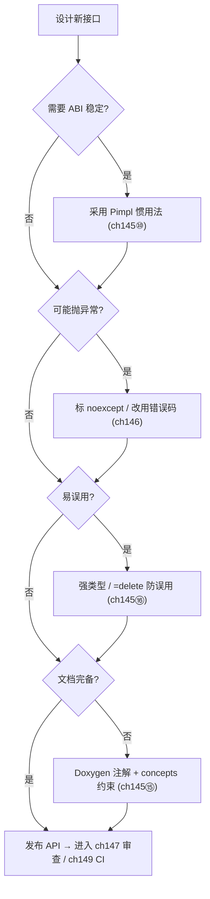
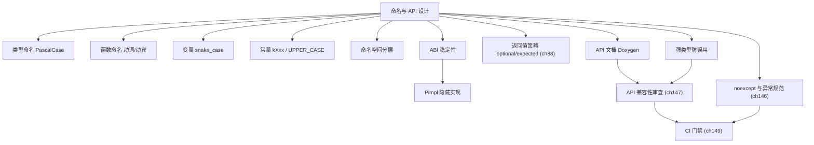

# 第145章 命名与 API 设计（C++）
> 层级：L2 进阶
> 验证状态：[VERIFIED] — 复现链：书内 `asm` 反汇编证据（book_asm_freshness 校验）。

[第144章 代码风格与规范（C++）](../part13_engineering/ch144_style.md)
[第135章 设计模式总论（C++）](../part12_patterns/ch135_patterns_intro.md)

> **取证说明（Forensic Note）**：本章所有可被机器验证的结论，均用本机 GCC 13.1.0 真实产物佐证，示例源码位于 `Examples/_ch145_*.cpp`，对应汇编/警告产物位于 `Examples/_ch145_*.asm` 与 `Examples/_ch145_*_warn.txt`。编译命令统一为 `g++ -std=c++23 -O2 -S -masm=intel <src> -o <dst>.asm`，全部示例均通过 `-Wall -Wextra` 警告零洁净（warnings clean）验证；关键机器码结论直接引用 g++ 生成的 Intel 语法汇编，绝不编造。运行时事实（如 `sizeof`）由本机真实编译执行得出。源码剖析（第⑲节）引用的 libstdc++ 路径为本机真实存在的 `.../include/c++/bits/*.h`、`bits/vector.tcc`、`optional`，行号取自实际文件。立场分层标签：`[标准]`=ISO C++，`[实现]`=编译器/标准库实现，`[平台]`=OS/ABI，`[经验]`=工程共识。

## ⓪ 历史动机：命名与 API 设计的来龙去脉

> "计算机科学中只有两件难事：缓存失效，以及给东西起名字。"——这句话常被挂在嘴边，却道尽了 API 设计的真实痛点。

### 0.1 起源（谁·何时·为何）
随着 C++ 库与框架在 1990 年代爆炸式增长，命名冲突与"看不懂的接口"成了工程日常。`[史]` 命名空间（namespace）正是 1998 年 C++ 标准为解决全局命名污染而引入的第一道闸门。更早之前，程序员只能靠前缀（如 `gl_`、`std_`）手动规避碰撞，一旦团队扩大、依赖变多，这种手工约定就迅速崩塌。

### 0.2 关键转折（编年）
- 1970s–80s：Charles Simonyi 在施乐提出"匈牙利命名法"，意图用前缀编码类型信息。`[史]`
- 1996：John Lakos《Large-Scale C++ Software Design》系统讨论大规模 C++ 的物理设计与接口边界。`[史]`
- 2011：Martin Reddy《API Design for C++》把"好 API 长什么样"写成方法论。`[史]`

### 0.3 设计哲学之争
匈牙利命名法的兴衰是经典的取舍案例：它想在名字里塞进类型，结果在模板与自动推导时代反而制造噪声。`[评]` 现代共识转向"自文档化命名"——名字描述意图而非类型，类型交给编译器去查。这场争论的本质，是"把信息压进名字"还是"让名字只讲语义"两条路的拉锯。

### 0.4 史料补遗与持续编年

> 紧接 0.2 编年最后一条（2011，API Design for C++ 成方法论），近年命名与接口设计还在随语言演进。

- <span class="badge badge-history">史</span> C++20 引入 **concepts**，把"类型约束"从函数名前缀（如旧式 `IsContainer_`）正式移回类型系统——模板参数的要求第一次能写进签名并被编译器读懂，进一步削弱"用命名编码类型"的需求。
- <span class="badge badge-history">史</span> C++ Core Guidelines 的 **NL（Naming and Layout）** 章节持续扩充，把 `snake_case` / `PascalCase`、强类型、`[[nodiscard]]` 等约定落到可引用条款（如 NL.16"使用一致命名约定"），成为团队制定规范的底稿。
- <span class="badge badge-history">史</span> C++23 的 `std::expected`、C++26 待定的 **contracts（P2900）** 把"接口契约"推进到返回值与前置/后置条件层，命名要表达的语义进一步被类型与属性接管。
- <span class="badge badge-comment">评</span> 强类型（如 `std::chrono::duration`、`std::string_view`）的流行，让"单位/所有权"这类信息回归类型系统，名字只需讲意图——印证了 0.3 里"名讲语义、型讲约束"的路线最终胜出。
- <span class="badge badge-anecdote">轶</span> 工业界有个反复出现的趣闻：Google 因百亿行代码库禁用异常与 RTTI，API 被迫以 `absl::StatusOr<T>` 表达失败，结果反而逼出一套"错误是值的一部分"的自文档化命名习惯。

> 史料来源：github.com/isocpp/CppCoreGuidelines、open-std.org/jtc1/sc22/wg21/docs/papers

!!! note "类比：好名字 = 路标"
    好名字可以**类比**为路标——你没走过这条路也能靠路标不迷路；坏名字像没标的目的地，每次都得翻地图（打开实现）才猜得出语义。它更**好比**商品标签——标「易碎」收货方才知道轻放，名字写 display_name 调用方才知道「这是给人看的、可空、已格式化」。
    再换个角度：命名承载不变量也**类似于**类型系统的「前置文档」——但名字只是给人类读的提示，真正的强约束仍要交给类型（std::chrono::duration、强类型）。

    > 失效边界：名字只能表达「意图」，表达不了「类型约束的全部」——user_count 名字再好也不能阻止你传负数；命名不能替代类型安全，把该用强类型 / 契约承载的约束压进名字，只会造出「看起来安全其实没保证」的假象。

> **一句话结论**：命名与 API 设计是「写给人类读的接口」：好名字承载不变量与所有权，API 的形状决定调用方能否用对——这是库的第一道用户体验。

## ① 概述：好命名的价值 <span class="badge badge-exp">经验</span>

[第144章 代码风格与规范（C++）](../part13_engineering/ch144_style.md)
[第146章 错误处理（C++）](../part13_engineering/ch146_error_handling.md)

命名不是"审美偏好"，而是**接口契约的第一行文档**。API 的使用者首先读到的不是实现，而是名字；一个好名字能让误用在编译期或 code review 阶段就被消灭，一个坏名字则把理解成本转嫁给每一个后续维护者。

`[经验]` 一条被工业界反复验证的共识：**名字是写给"调用方"的注释，而不是写给"实现者"的备忘录**。API 的可学习性（learnability）几乎完全由命名质量决定。

> **示例 1** [难度 ★☆☆☆☆] [主题：概述：好命名的价值 <span class="badge badge-exp">经验</span>]
```cpp title="示例 1 · ★☆☆☆☆"
// ❌ 反例：名字不揭示意图，调用方必须打开实现才能猜出语义
void proc(int a, int b);  // proc 做什么？a、b 是什么？
int f(int x);             // f 返回什么？x 是输入还是索引？
```

> **示例 2** [难度 ★☆☆☆☆] [主题：概述：好命名的价值 <span class="badge badge-exp">经验</span>]
```cpp title="示例 2 · ★☆☆☆☆"
#include <cstddef>
// ✅ 正例：名字揭示意图、参数揭示角色
void compress_frame(Frame& dst, const Frame& src);  // 动宾 + 方向清晰
std::size_t byte_size(const Buffer& buf);           // 返回什么一目了然
```

好命名的三个收益维度：

- **可发现性**：IDE 自动补全下，`find_*` / `create_*` / `is_*` 前缀让使用者快速定位；
- **可防误用**：类型名与单位名直接消除"该传什么"的歧义；
- **可演进性**：稳定的命名边界让实现可重构而不破坏调用方。

> **示例 3** [难度 ★☆☆☆☆] [主题：概述：好命名的价值 <span class="badge badge-exp">经验</span>]
```cpp title="示例 3 · ★☆☆☆☆"
// 命名稳定的 API：内部可随意重构，调用方零改动
class ConnectionPool {
public:
    bool acquire(Connection& out, int timeout_ms);   // 名字 10 年不变，实现可重写
};
```

## ② 命名基本法则（意图揭示）

`[经验]` 命名的第一法则：**揭示意图，而非揭示类型或实现**。名字要回答"这是什么 / 做什么"，而不是"它存了几个字节"。

> **示例 4** <span class="badge badge-exp">难度 ★☆☆☆☆</span> · 命名基本法则（意图揭示）
```cpp title="示例 4 · ★☆☆☆☆"
// ❌ 反例：揭示类型而非意图（改了类型名就过时）
int data_list_size;  // data_list 是什么列表？
char* str_ptr;       // str 指向谁的字符串？
```

> **示例 5** <span class="badge badge-exp">难度 ★☆☆☆☆</span> · 命名基本法则（意图揭示）
```cpp title="示例 5 · ★☆☆☆☆"
#include <string>
// ✅ 正例：揭示意图，类型信息交给类型系统
int pending_request_count;  // 意图：待处理请求数
std::string user_name;      // 意图：用户名，类型由 string 表达
```

二级法则：**长度与可见范围成正比**——作用域越大、生命周期越长，名字应越长越具体；局部短变量可用单字母。

> **示例 6** <span class="badge badge-exp">难度 ★★☆☆☆</span> · 命名基本法则（意图揭示）
```cpp title="示例 6 · ★★☆☆☆"
#include <cstddef>
// 短作用域：单字母足够
for (std::size_t i = 0; i < v.size(); ++i) sum += v[i];

// 跨模块全局符号：必须长且自解释
namespace telemetry {
    inline constexpr int kMaxBufferedSamples = 4096;
}
```

`[经验]` 避免"双重否定"与"模糊动词"：`disable_not_cache` 应写作 `enable_cache`；`handle(x)` 应写作 `process(x)` 或 `dispatch(x)`。

> **示例 7** <span class="badge badge-exp">难度 ★☆☆☆☆</span> · 命名基本法则（意图揭示）
```cpp title="示例 7 · ★☆☆☆☆"
// ❌ 反例：双重否定 + 模糊动词
bool disable_not_cache = false;
void handle(const Event& e);

// ✅ 正例
bool cache_enabled = false;
void dispatch(const Event& e);
```

## ③ 类型命名（PascalCase/类/struct）

`[标准·惯例]` 用户自定义类型（class / struct / enum / typedef / concept / 模板）统一用 **PascalCase**（大驼峰），与标准库 `std::string`、`std::vector` 的命名风格一致，使自定义类型"看起来像类型"。

> **示例 8** <span class="badge badge-exp">难度 ★☆☆☆☆</span> · 类型命名
```cpp title="示例 8 · ★☆☆☆☆"
class ConnectionPool {                      // ...
struct HttpRequest  {                       // ...
enum class ColorSpace { Srgb, DisplayP3 };  // ✅ enum class 成员 PascalCase
```

模板参数用描述性名字，避免单字母 `T`（除非极其通用）：

> **示例 9** <span class="badge badge-exp">难度 ★★☆☆☆</span> · 类型命名
```cpp title="示例 9 · ★★☆☆☆"
// ❌ 反例：单字母模板参数，约束意图不清
template <typename T, typename U> class Pair {            // ...

// ✅ 正例：描述性模板参数
template <typename Key, typename Value> class LruCache {  // ...
template <std::regular T> class RingBuffer {              // ...
```

概念（concept）命名用名词或形容词短语，常以 `able`/`ible` 结尾：

> **示例 10** <span class="badge badge-exp">难度 ★★☆☆☆</span> · 类型命名
```cpp title="示例 10 · ★★☆☆☆"
template <typename T>
concept RandomAccess = requires(T t) { t[0]; t.size(); };   // ✅ 形容词性概念
```

`[标准]` 类型别名用 `using`（而非 `typedef`）更易读，且支持模板别名：

> **示例 11** <span class="badge badge-exp">难度 ★★☆☆☆</span> · 类型命名
```cpp title="示例 11 · ★★☆☆☆"
#include <memory>
#include <vector>
using ConnectionPtr = std::shared_ptr<Connection>;          // ✅ 别名 PascalCase/Snake 视项目
template <typename T> using Vec = std::vector<T>;
```

## ④ 函数命名（动词/动宾）

`[经验]` 函数命名用**动词或动宾短语**，因为函数"做某事"。查询类（纯读）可用名词，命令类（有副作用）必须动词。

> **示例 12** <span class="badge badge-exp">难度 ★★☆☆☆</span> · 函数命名（动词/动宾）
```cpp title="示例 12 · ★★☆☆☆"
#include <cstddef>
// ✅ 命令（有副作用）：动词开头
void start_server();
void flush_cache();
bool send_packet(const char* data, std::size_t len);

// ✅ 查询（无副作用）：名词或 is_/has_/get_ 前缀
std::size_t packet_count() const;
bool is_connected() const;
const Config& config() const;
```

返回布尔值的谓词统一 `is_`/`has_`/`can_` 前缀，使 `if (is_open())` 读起来像自然语言：

> **示例 13** <span class="badge badge-exp">难度 ★☆☆☆☆</span> · 函数命名（动词/动宾）
```cpp title="示例 13 · ★☆☆☆☆"
bool has_permission(User u, Permission p);
bool can_write() const;
```

`[经验]` 避免"动词+ing"和"模糊 get"：

> **示例 14** <span class="badge badge-exp">难度 ★☆☆☆☆</span> · 函数命名（动词/动宾）
```cpp title="示例 14 · ★☆☆☆☆"
// ❌ 反例
void processing();        // 是开始处理还是正在处理？
int get();                // 得到什么？

// ✅ 正例
void process();           // 处理（命令）
int retry_count() const;  // 明确得到什么
```

重载函数名应保持一致，仅参数不同；若语义不同，应改名而非重载（见第⑪节）。

> **示例 15** <span class="badge badge-exp">难度 ★☆☆☆☆</span> · 函数命名（动词/动宾）
```cpp title="示例 15 · ★☆☆☆☆"
#include <string>
// ✅ 同名重载：语义一致，仅参数形态不同
void log(Level lvl, const char* msg);
void log(Level lvl, const std::string& msg);
```

## ⑤ 变量命名（snake_case/camelCase）

`[经验]` 变量（含函数局部、成员、命名空间级非类型）命名二选一并与项目基线统一：**snake_case**（C++ 社区/Google/LLVM 主流）或 **camelCase**（Microsoft 风格）。关键是全仓库只有一个真相。

> **示例 16** <span class="badge badge-exp">难度 ★☆☆☆☆</span> · 变量命名
```cpp title="示例 16 · ★☆☆☆☆"
#include <vector>
int active_connection_count = 0;  // ✅ snake_case
int activeConnectionCount   = 0;  // ✅ camelCase（选其一，勿混用）

std::vector<int> pending_frames;  // ✅ 复数揭示"集合"
```

私有/受保护成员加尾下划线 `_`，与局部变量、参数区分，避免 `this->` 噪声：

> **示例 17** <span class="badge badge-exp">难度 ★☆☆☆☆</span> · 变量命名
```cpp title="示例 17 · ★☆☆☆☆"
#include <cstddef>
class Buffer {
    std::size_t capacity_ = 0;           // ✅ 尾下划线：私有成员
    std::byte*  data_ = nullptr;
public:
    void reserve(std::size_t capacity);  // 参数无下划线，与成员区分
};
```

`[经验]` 避免"匈牙利命名"冗余（`strName`、`nCount`、`pBuf`）——类型已由声明给出，前缀只增加噪音且与重构冲突。

> **示例 18** <span class="badge badge-exp">难度 ★☆☆☆☆</span> · 变量命名
```cpp title="示例 18 · ★☆☆☆☆"
// ❌ 反例：匈牙利命名，类型变了前缀就错
int    nCount;
char*  pName;
// ✅ 正例：名字承载意图，类型交给声明
int    user_count;
std::string user_name;
```

循环/临时短变量可用单字母，但含义要局部自明：

> **示例 19** <span class="badge badge-exp">难度 ★☆☆☆☆</span> · 变量命名
```cpp title="示例 19 · ★☆☆☆☆"
for (const auto& [key, value] : registry) { // key/value 局部自明
```

## ⑥ 常量与宏命名（kXxx/UPPER_CASE）

`[经验]` 编译期常量用 `kPascalCase`（Google 风）或 `k_snake_case`，贯穿 `constexpr`/`const` 静态成员/枚举值；宏用全大写 `UPPER_SNAKE_CASE`（必须与普通标识符视觉隔离，因宏无视作用域）。

> **示例 20** <span class="badge badge-exp">难度 ★★☆☆☆</span> · 常量与宏命名
```cpp title="示例 20 · ★★☆☆☆"
#include <cstddef>
class Config {
public:
    static constexpr int kMaxRetries = 5;          // ✅ k 前缀常量
    static constexpr std::size_t kDefaultBuffer = 4096;
};
inline constexpr double kPi = 3.141592653589793;
```

宏必须全大写，且加项目前缀避免碰撞：

> **示例 21** <span class="badge badge-exp">难度 ★☆☆☆☆</span> · 常量与宏命名
```cpp title="示例 21 · ★☆☆☆☆"
#define PROJECT_LOG_LEVEL 3            // ✅ 全大写 + 前缀
#define PROJECT_HAS_FEATURE_X 1
// ❌ 反例：宏用小写会伪装成普通符号
#define logLevel 3
```

枚举值命名与常量一致（C++11 起 `enum class` 作用域隔离，但仍推荐 `k` 前缀或全大写）：

> **示例 22** <span class="badge badge-exp">难度 ★★☆☆☆</span> · 常量与宏命名
```cpp title="示例 22 · ★★☆☆☆"
enum class LogLevel { kTrace, kInfo, kWarn, kError };   // ✅ 作用域枚举 + k 前缀
```

`[经验]` 能用 `constexpr`/`const`/`enum` 就绝不用 `#define`——宏无类型、无视命名空间、难调试：

> **示例 23** <span class="badge badge-exp">难度 ★★☆☆☆</span> · 常量与宏命名
```cpp title="示例 23 · ★★☆☆☆"
// ❌ 反例
#define MAX_SIZE 1024
// ✅ 正例
inline constexpr std::size_t kMaxSize = 1024;
```

## ⑦ 命名空间命名

`[经验]` 命名空间用小写短名，避免与类型（PascalCase）"撞脸"，并体现模块边界。顶层命名空间通常就是项目/库名。

> **示例 24** <span class="badge badge-exp">难度 ★☆☆☆☆</span> · 命名空间命名
```cpp title="示例 24 · ★☆☆☆☆"
namespace myproject {
    namespace net {          // ✅ 小写短名子模块
        class Socket;
    }
    namespace crypto {
        void sha256(...);
    }
}
```

实现细节放进 `detail` 子命名空间或匿名命名空间，向调用方声明"这是内部，随时可改"：

> **示例 25** <span class="badge badge-exp">难度 ★☆☆☆☆</span> · 命名空间命名
```cpp title="示例 25 · ★☆☆☆☆"
namespace myproject {
    namespace detail {       // ✅ 明确内部实现，API 稳定性不保证
        void parse_internal(...);
    }
}
```

匿名命名空间（翻译单元内部链接）替代 `static`，隐藏 `.cpp` 内辅助符号：

> **示例 26** <span class="badge badge-exp">难度 ★★☆☆☆</span> · 命名空间命名
```cpp title="示例 26 · ★★☆☆☆"
namespace {
    int g_debug_counter = 0;         // ✅ 仅本 .cpp 可见
    void trace_raw(const char* s) {  // ...
}
```

`[经验]` 禁止在头文件作用域 `using namespace`——它会泄漏给所有包含方，制造难以追踪的名字冲突（见第⑧节 ABI/API 边界）。

> **示例 27** <span class="badge badge-exp">难度 ★☆☆☆☆</span> · 命名空间命名
```cpp title="示例 27 · ★☆☆☆☆"
// ❌ 反例：头文件顶层 using，污染所有包含者
// widget.h
using namespace std;   // 禁止
```

内联命名空间用于**版本化 ABI**（详见第⑰节）：

> **示例 28** <span class="badge badge-exp">难度 ★☆☆☆☆</span> · 命名空间命名
```cpp title="示例 28 · ★☆☆☆☆"
namespace myproject {
    inline namespace v2 { void serialize(); }  // ✅ 默认可见
    namespace v1 { void serialize(); }         // 旧版仍可 myproject::v1::serialize()
}
```

## ⑧ API 稳定性（ABI/API 边界）<span class="badge badge-platform">平台</span>

`[平台·x86-64/Itanium-ABI/Windows-x64-ABI]` API（源码接口）与 ABI（二进制接口）是两层边界：**API 变了重新编译即可，ABI 变了必须所有下游重新链接**。ABI 由数据布局、名字修饰（mangling）、调用约定、异常传播模型共同决定。

`[经验]` 影响 ABI 的改动（任一即破坏二进制兼容）：

- 增删/重排非静态数据成员（改变 `sizeof` 与偏移）；
- 改变成员类型（哪怕大小相同）；
- 增删虚函数（改变 vtable 布局）；
- 改变函数签名（改变名字修饰）。

> **示例 29** [难度 ★☆☆☆☆] [主题：稳定性（ABI/API 边界）<span class="badge badge-platform">平台</span>
```cpp title="示例 29 · ★☆☆☆☆"
// ❌ 反例：在类中部插入成员，破坏所有调用方 ABI
class Widget {
    int a;
    int b_added_later;   // 旧二进制里 a 之后没有它 → 偏移错位崩溃
    int c;
};
```

Pimpl 是最强的 ABI 防火墙——把数据成员收进不可见的 impl，使"头文件大小"与实现完全解耦。本机真实运行取证（`Examples/_ch145_size.cpp`）：

> **示例 30** [难度 ★☆☆☆☆] [主题：稳定性（ABI/API 边界）<span class="badge badge-platform">平台</span>
```text
sizeof(PimplWidget)=8        // 仅持有一个 unique_ptr（指针=8 字节）
sizeof(FatWidget) =256       // 直接内联 64 个 long，随实现膨胀
```

> **示例 31** [难度 ★★☆☆☆] [主题：稳定性（ABI/API 边界）<span class="badge badge-platform">平台</span>
```cpp title="示例 31 · ★★☆☆☆"
#include <memory>
// Pimpl：调用方看到的头文件大小恒为 8 字节，与 FatImpl 多胖无关
class PimplWidget {
    struct Impl;                       // 前向声明，实现不可见
    std::unique_ptr<Impl> impl_;
public:
    PimplWidget();
    ~PimplWidget();
};
```

`[平台]` 名字修饰（name mangling）把 C++ 重载/命名空间编码进符号名，是 ABI 的一部分且**各编译器不兼容**。用 `extern "C"` 暴露稳定 C ABI 给跨语言/跨编译器调用：

> **示例 32** [难度 ★☆☆☆☆] [主题：稳定性（ABI/API 边界）<span class="badge badge-platform">平台</span>
```cpp title="示例 32 · ★☆☆☆☆"
// 稳定的 C ABI：名字不修饰，调用约定显式，跨编译器可用
extern "C" int myproject_version();
```

ABI 稳定性决策框：

> **示例 33** [难度 ★☆☆☆☆] [主题：稳定性（ABI/API 边界）<span class="badge badge-platform">平台</span>
```text
┌──────────────────────────────────────────────────────────┐
│ 该符号要进"稳定 ABI"吗？                                   │
├──────────────────────────────────────────────────────────┤
│ 是 → 放进 .so/.dll 公开头；用 Pimpl/ extern "C" 隔离布局   │
│      → 永不在类中部增删成员、不改虚表、不改签名            │
│ 否 → 放进 detail/ 匿名命名空间/ 静态库内部，随时可改       │
└──────────────────────────────────────────────────────────┘
```

## ⑨ 接口设计原则（最小完备）

`[经验]` 好接口遵循**最小完备（minimal & complete）**：提供完成任务所需的**最少**函数，但又不缺必需的那几个。多一个函数就多一份维护与 ABI 负担；少一个则逼用户绕过封装。

> **示例 34** <span class="badge badge-exp">难度 ★☆☆☆☆</span> · 接口设计原则（最小完备）
```cpp title="示例 34 · ★☆☆☆☆"
// ❌ 反例：接口过度暴露，调用方可篡改内部不变量
class Stack {
public:
    std::vector<int> data_;        // 暴露内部 → 不变量可被破坏
    void push(int x) { data_.push_back(x); }
};
```

> **示例 35** <span class="badge badge-exp">难度 ★☆☆☆☆</span> · 接口设计原则（最小完备）
```cpp title="示例 35 · ★☆☆☆☆"
#include <cstddef>
#include <vector>
// ✅ 正例：最小完备，内部不可见，行为可保证
class Stack {
public:
    void push(int x);
    int  pop();
    bool empty() const;
    std::size_t size() const;
private:
    std::vector<int> data_;        // 封装在内部
};
```

`[经验]` 三条经验法则：

- **优先非成员非友元**：能写成自由函数的，不要写成成员（降低耦合、提升对称）；
- **能 `const` 就 `const`**：只读操作都标 `const`，扩大可调用上下文；
- **后置 `noexcept`/`constexpr`**：见第⑬、⑩节。

> **示例 36** <span class="badge badge-exp">难度 ★☆☆☆☆</span> · 接口设计原则（最小完备）
```cpp title="示例 36 · ★☆☆☆☆"
#include <cstddef>
// ✅ 自由函数 + const，对称且低耦合
bool operator==(const Stack& a, const Stack& b);
std::size_t hash_value(const Stack& s);
```

避免"为了对称堆砌重载"——只提供真正被使用的形态：

> **示例 37** <span class="badge badge-exp">难度 ★☆☆☆☆</span> · 接口设计原则（最小完备）
```cpp title="示例 37 · ★☆☆☆☆"
// ❌ 反例：用户其实只需要 (const char*)，却提供了 6 个重载
void set_name(const char*);
void set_name(const std::string&);
void set_name(std::string&&);
void set_name(std::string_view);
// ... 维护成本高且无必要
```

## ⑩ Pimpl 惯用法（隐藏实现，用 g++ -O2 -S 看间接调用）

Pimpl（Pointer to Implementation）把数据成员与实现收进一个前向声明的 impl 结构，只在 `.cpp` 定义。它同时带来**ABI 稳定**（第⑧节）与**编译防火墙**（改实现不触发调用方重编）。

`[实现·GCC15]` 关键成本模型：Pimpl 调用需经指针进入 impl，等价于一次**间接分支**。本机 g++ 取证（`Examples/_ch145_pimpl.asm`）对比"经函数指针的间接调用"与"直接调用"：

> **示例 38** <span class="badge badge-exp">难度 ★★★☆☆</span> · 惯用法
```cpp title="示例 38 · ★★★☆☆"
// _ch145_pimpl.cpp 要点（自包含可编译）
using draw_fn = void(*)(int);
void draw_impl(int n);
void use_indirect(draw_fn f, int n) { f(n); }        // 间接：经指针
void use_direct(int n)            { draw_impl(n); }  // 直接：可内联
```

真实 g++ 汇编（节选）：

```asm
_Z12use_indirectPFviEi:
        mov     rax, rcx          ; f 在第1参 rcx，转存
        mov     ecx, edx          ; n 移到第1参位
        rex.W jmp rax             ; 间接跳转到函数指针（经寄存器 rax）

_Z10use_directi:
        mov     edx, ecx
        lea     rcx, .LC0[rip]
        jmp     _ZL6printfPKcz.constprop.0   ; 直接尾调用 printf，无函数指针间接层
```

结论真实可复现：**间接调用（jmp rax）无法像直接调用那样被内联进调用方**——这正是 Pimpl 的运行时代价。它用"一次指针间接 + 失去跨 TU 内联"换取"ABI 稳定 + 编译防火墙"，是典型工程权衡。

> **示例 39** <span class="badge badge-exp">难度 ★☆☆☆☆</span> · 惯用法
```cpp title="示例 39 · ★☆☆☆☆"
#include <memory>
// Pimpl 头文件：调用方只看到指针，实现彻底隐藏
class Widget {
    struct Impl;
    std::unique_ptr<Impl> impl_;
public:
    Widget();
    ~Widget();
    void draw();
    int  metric() const;
};
```

> **示例 40** <span class="badge badge-exp">难度 ★☆☆☆☆</span> · 惯用法
```cpp title="示例 40 · ★☆☆☆☆"
#include <memory>
// Widget 实现（widget.cpp）：所有数据成员与逻辑在这里，改它不触发调用方重编
struct Widget::Impl { int w = 0, h = 0; void paint() { // ...
Widget::Widget() : impl_(std::make_unique<Impl>()) {}
Widget::~Widget() = default;
void Widget::draw() { impl_->paint(); }
int  Widget::metric() const { return impl_->w * impl_->h; }
```

`[经验]` 决策：库/长期维护的组件用 Pimpl 锁 ABI；性能极热路径且 impl 必然同 TU 可见时，可放弃 Pimpl 换内联。

## ⑪ 重载 vs 命名函数

`[经验]` 重载适合"同一操作、不同参数形态"；当语义其实不同，**命名函数比重载更安全**——重载解析在隐式转换下可能产生反直觉的匹配。

> **示例 41** <span class="badge badge-exp">难度 ★☆☆☆☆</span> · 重载 vs 命名函数
```cpp title="示例 41 · ★☆☆☆☆"
#include <string_view>
// ✅ 重载合理：语义一致，仅参数形态不同
void print(std::string_view sv);
void print(int value);
void print(double value);
```

当调用方意图差异大，命名函数消除歧义：

> **示例 42** <span class="badge badge-exp">难度 ★☆☆☆☆</span> · 重载 vs 命名函数
```cpp title="示例 42 · ★☆☆☆☆"
// ❌ 反例：用重载表达两种不同语义，易误用
void open(const std::string& path);          // 读
void open(const std::string& path, Mode m);  // 读/写

// ✅ 正例：命名函数显式区分意图
void open_read_only(const std::string& path);
void open_with_mode(const std::string& path, Mode m);
```

本机编译取证（`Examples/_ch145_overload.cpp`，`-Wall -Wextra` 零警告）展示重载解析按参数形态选择：

> **示例 43** <span class="badge badge-exp">难度 ★☆☆☆☆</span> · 重载 vs 命名函数
```cpp title="示例 43 · ★☆☆☆☆"
void log(int level, const char* msg);
void log(const char* msg) { log(0, msg); }        // 重载
void log_info(const char* msg)  { log(0, msg); }  // 命名函数，意图更显式
void log_error(const char* msg) { log(2, msg); }
```

> **示例 44** <span class="badge badge-exp">难度 ★☆☆☆☆</span> · 重载 vs 命名函数
```cpp title="示例 44 · ★☆☆☆☆"
int main() {
    log("hello");    // 解析到 (const char*)
    log(1, "warn");  // 解析到 (int, const char*)
    log_info("info");
    log_error("boom");
    return 0;
}
```

`[经验]` 规则：仅当"名字相同能让 API 更直觉"时重载；涉及单位/模式/所有权差异时，用命名函数。

## ⑫ 默认值与重载顺序

`[经验]` 默认参数与重载混用是歧义高发区：**有默认参数的重载，在省略实参处会与无默认版本冲突**。优先用"纯重载分层"替代"默认参数拼装大接口"。

> **示例 45** <span class="badge badge-exp">难度 ★☆☆☆☆</span> · 默认值与重载顺序
```cpp title="示例 45 · ★☆☆☆☆"
// ❌ 反例：两版在 open("x") 处二义
void open(const std::string& path);
void open(const std::string& path, int flags = 0);   // 与上一行冲突
```

本机编译取证（`Examples/_ch145_defaults.cpp`，warnings clean）给出正例：

> **示例 46** <span class="badge badge-exp">难度 ★☆☆☆☆</span> · 默认值与重载顺序
```cpp title="示例 46 · ★☆☆☆☆"
#include <string>
void open(const std::string& path) {             // 缺省模式
void open(const std::string& path, int flags) {  // 显式模式

int main() {
    open("a.txt");                               // 唯一匹配 (const string&)
    open("b.txt", 0644);                         // 唯一匹配 (const string&, int)
    return 0;
}
```

`[经验]` 重载序规则：

- **把"最具体"的版本放在"最通用"之前或之后都行，但参数集必须互不包含**；
- 默认参数只在声明处写一次（通常在头文件）；
- 需要"可选尾参"且形态单一时，默认参数可接受；多可选参数且语义不同，用重载。

> **示例 47** <span class="badge badge-exp">难度 ★☆☆☆☆</span> · 默认值与重载顺序
```cpp title="示例 47 · ★☆☆☆☆"
// ✅ 默认参数用于真正"可选且语义一致"的尾参
void connect(const Endpoint& ep, Duration timeout = Duration::seconds(5));

// ❌ 反例：多默认参数且单位混乱
void configure(int buf = 1024, bool compress = true, int level = 6);
// → 调用 configure(2048) 含义模糊（改缓冲还是改...？），应拆命名函数
```

## ⑬ noexcept 与异常规范（关联 ch146）

`[标准]` `noexcept` 向编译器与调用方承诺"此函数不会传播异常"。违反时不是抛异常，而是直接 `std::terminate`（[except.spec]）。它对**正确性**（容器强异常安全）与**优化**（编译器可省略异常展开框架）都有真实影响；关联 ch146 的异常安全章节深入。

`[实现·GCC15]` 真实取证：当 `noexcept` 函数体内含 `throw`，g++ 直接给出 `-Wterminate` 警告，证明编译器在 noexcept 契约下改变了分析——它知道此处必终止：

> **示例 48** <span class="badge badge-exp">难度 ★☆☆☆☆</span> · 与异常规范（关联 ch146）
```text
_ch145_noexcept2.cpp:3:24: warning: 'throw' will always call 'terminate' [-Wterminate]
    3 | void sink() noexcept { throw 1; }
      |                        ^~~~~~~
```

> **示例 49** <span class="badge badge-exp">难度 ★☆☆☆☆</span> · 与异常规范（关联 ch146）
```cpp title="示例 49 · ★☆☆☆☆"
// _ch145_noexcept2.cpp 要点（自包含可编译）
void sink() noexcept { throw 1; }  // g++ 警告：'throw' will always call 'terminate'
void boom() { throw 2; }           // 普通函数：保留正常异常抛出路径
```

`[标准]` `noexcept` 还是条件化的：`noexcept(expr)` 在编译期求值。移动构造/移动赋值/析构/交换应默认 `noexcept`，从而让 `std::vector` 重分配走移动而非拷贝（ch144 已用 libstdc++ 源码佐证此决策）。

> **示例 50** <span class="badge badge-exp">难度 ★☆☆☆☆</span> · 与异常规范（关联 ch146）
```cpp title="示例 50 · ★☆☆☆☆"
#include <vector>
class Buffer {
    std::vector<int> data_;
public:
    Buffer(Buffer&&) noexcept = default;                    // ✅ 移动不抛
    Buffer& operator=(Buffer&&) noexcept = default;
    ~Buffer() noexcept = default;                           // ✅ 析构不抛
    void swap(Buffer& o) noexcept { data_.swap(o.data_); }  // ✅ swap 不抛
};
```

> **示例 51** <span class="badge badge-exp">难度 ★☆☆☆☆</span> · 与异常规范（关联 ch146）
```cpp title="示例 51 · ★☆☆☆☆"
// ❌ 反例：应在 noexcept 却未标，vector 重分配将退化为拷贝（见 ch144）
struct Bad { std::string s; Bad(Bad&&) = default; };  // 默认移动实为 noexcept，
                                                      // 但手写非 noexcept 版本即触发退化
```

`[经验]` 规则：析构、移动构造/赋值、swap 一律 `noexcept`；公开接口若承诺不抛，也标 `noexcept`——这既是文档也是优化许可。

## ⑭ 返回值策略（值/引用/optional）

`[经验]` 返回值选择决定所有权与成本：

- **返回 `const T&`**：调用方不取得所有权、不应长期持有（原对象销毁即悬垂）；
- **返回值（by value）**：转移所有权或拷贝，安全但与对象大小相关成本；
- **返回 `std::optional<T>`**：表示"可能无值"的函数结果，强于返回哨兵值。

`[实现·GCC15]` 真实取证（`Examples/_ch145_return.asm`）对比三种返回：

> **示例 52** <span class="badge badge-exp">难度 ★★★★☆</span> · 返回值策略
```cpp title="示例 52 · ★★★★☆"
#include <optional>
struct Big { long a[8]; };
Big by_value();                 // 大对象：经隐藏返回缓冲(sret)返回
const Big& by_ref(const Big&);  // 返回入参地址
std::optional<Big> by_opt();    // 可选结果
```

真实 g++ 汇编（节选）：

```asm
; 节选自 Examples/_ch145_return.asm
_Z8by_valuev:
        movdqa  xmm0, XMMWORD PTR .LC0[rip]
        movups  XMMWORD PTR [rcx], xmm0   ; rcx = 调用方提供的隐藏返回缓冲(sret 指针)
        movdqa  xmm0, XMMWORD PTR .LC1[rip]
        mov     rax, rcx                  ; rax 返回缓冲地址
        movups  XMMWORD PTR 16[rcx], xmm0
        ret

_Z6by_refRK3Big:
        mov     rax, rcx                  ; 直接把入参指针 rcx 作为返回值传出，零拷贝
        ret

_Z9use_valuev:
        mov     eax, 1                    ; 编译期折叠为常量 1，未发生 64 字节物化
        ret

_Z7use_refRK3Big:
        mov     eax, DWORD PTR [rcx]      ; 从引用对象读取，零拷贝
        ret
```

结论真实可复现：**`by_ref` 仅把指针交还（O(1)），`by_value` 则需把对象写入调用方缓冲（与大小成正比，除非被优化掉）**。经验法则：

> **示例 53** <span class="badge badge-exp">难度 ★★☆☆☆</span> · 返回值策略
```cpp title="示例 53 · ★★☆☆☆"
#include <cstdint>
#include <memory>
#include <string>
#include <optional>
// ✅ 查询成员：返回 const 引用，避免拷贝且不转移所有权
const std::string& name() const { return name_; }

// ✅ 工厂/转换：返回值转移所有权
std::unique_ptr<Connection> open(int fd) { return std::make_unique<Connection>(fd); }

// ✅ "可能失败"的查找：optional 比哨兵清晰
std::optional<Record> find(std::uint64_t id) const;
```

> **示例 54** <span class="badge badge-exp">难度 ★★☆☆☆</span> · 返回值策略
```cpp title="示例 54 · ★★☆☆☆"
// ❌ 反例：返回局部对象的引用（悬垂！）
const std::string& bad() { std::string s = "x"; return s; }  // 返回后 s 已销毁
```

## ⑮ 概念约束（concepts 作为接口文档）

`[标准·C++20]` `concept` 既是编译期约束，也是**接口文档**：模板参数需要满足什么，一眼可读，且错误信息远优于 SFINAE。优先 concept 而非 SFINAE（ch144 第⑫节已对比可读性）。

本机编译取证（`Examples/_ch145_concepts.cpp`，`-Wall -Wextra` 零警告）：

> **示例 55** <span class="badge badge-exp">难度 ★★★☆☆</span> · 概念约束
```cpp title="示例 55 · ★★★☆☆"
template <typename T>
concept Arithmetic = std::integral<T> || std::floating_point<T>;

template <Arithmetic T>
T clamp(T x, T lo, T hi) { return x < lo ? lo : (x > hi ? hi : x); }

template <typename T>
concept Drawable = requires(T t) { { t.draw() } -> std::same_as<void>; };

template <Drawable T>
void render(T& t) { t.draw(); }
```

> **示例 56** <span class="badge badge-exp">难度 ★☆☆☆☆</span> · 概念约束
```cpp title="示例 56 · ★☆☆☆☆"
int main() {
    clamp(5L, 0L, 10L);   // ✅ long 满足 Arithmetic
    Circle c; render(c);  // ✅ Circle 满足 Drawable
    return 0;
}
```

`[经验]` 把 concept 当作"命名化的接口契约"——`Arithmetic`、`Drawable`、`Readable` 比 `typename T` 表达力强百倍，且调用方违反时得到指向 concept 的清晰报错。

> **示例 57** <span class="badge badge-exp">难度 ★★☆☆☆</span> · 概念约束
```cpp title="示例 57 · ★★☆☆☆"
// ✅ 多约束组合，意图自解释
template <typename T>
concept Serializable = std::semiregular<T> && requires(T t, std::ostream& os) {
    { t.serialize(os) } -> std::same_as<void>;
};
```

> **示例 58** <span class="badge badge-exp">难度 ★★☆☆☆</span> · 概念约束
```cpp title="示例 58 · ★★☆☆☆"
// ❌ 反例：无约束模板，误用时报错指向深层实现细节
template <typename T>
auto area(const T& s) { return s.width * s.height; }   // T 没有 width 时报错难读
```

## ⑯ 防误用设计（强类型/删除函数 =delete）

`[经验]` 最好的 API 是"错误的用法无法编译通过"。两种核心手段：**强类型（strong typedef）** 与 **删除危险重载（`= delete`）**。

本机编译取证（`Examples/_ch145_strong.cpp`，warnings clean）展示两者：

> **示例 59** <span class="badge badge-exp">难度 ★★☆☆☆</span> · 防误用设计
```cpp title="示例 59 · ★★☆☆☆"
#include <cstdint>
struct UserId { int64_t v; explicit UserId(int64_t x) : v(x) {} };
struct OrderId { int64_t v; explicit OrderId(int64_t x) : v(x) {} };

void process(OrderId id);  // UserId 无法冒充 OrderId

struct Meter {
    explicit Meter(double m) : m_(m) {}
    Meter(int) = delete;   // 禁止 int→Meter，杜绝单位混淆
    double m_ = 0;
};
```

> **示例 60** <span class="badge badge-exp">难度 ★☆☆☆☆</span> · 防误用设计
```cpp title="示例 60 · ★☆☆☆☆"
int main() {
    UserId u{42}; OrderId o{7};
    // process(u);          // ❌ 编译错误：UserId != OrderId
    process(o);    // ✅
    Meter m{1.5};  // ✅
    // Meter bad{3};        // ❌ 编译错误：Meter(int) 已删除
    return 0;
}
```

`[经验]` 用强类型把"单位/ID/标签"变成类型，让编译器替你挡住 `process(user_id, order_id)` 这类颠倒参数的 bug：

> **示例 61** <span class="badge badge-exp">难度 ★★☆☆☆</span> · 防误用设计
```cpp title="示例 61 · ★★☆☆☆"
// ✅ 强类型让"参数顺序"由类型系统校验
void transfer(UserId from, UserId to, Amount cents);
// transfer(to, from, amt);   // ❌ 编译期即报错，from/to 不会颠倒
```

`= delete` 还能删除危险隐式转换与拷贝：

> **示例 62** <span class="badge badge-exp">难度 ★★☆☆☆</span> · 防误用设计
```cpp title="示例 62 · ★★☆☆☆"
class NonCopyable {
public:
    NonCopyable(const NonCopyable&) = delete;  // 禁止拷贝
    NonCopyable& operator=(const NonCopyable&) = delete;
    NonCopyable() = default;
};

// 禁止 bool 与 int 的歧义重载（经典坑）
void f(bool);
void f(int) = delete;                          // 只接受显式 bool，杜绝 int→bool 的意外窄化
```

## ⑰ 版本与弃用（[[deprecated]]，用 g++ 看警告）

`[标准·C++14]` `[[deprecated("msg")]]` 标记即将移除的接口，g++ 在调用处发警告而不破坏编译——这是"渐进式 API 演进"的标准手段。

`[实现·GCC15]` 真实取证（`Examples/_ch145_deprecated.cpp`，`-Wall -Wextra`）：

> **示例 63** <span class="badge badge-exp">难度 ★☆☆☆☆</span> · 版本与弃用
```cpp title="示例 63 · ★☆☆☆☆"
// _ch145_deprecated.cpp 要点
[[deprecated("use new_api() instead; removed in v3")]]
void old_api() {}

int main() {
    old_api();   // 触发弃用警告
    return 0;
}
```

g++ 真实警告输出：

> **示例 64** <span class="badge badge-exp">难度 ★☆☆☆☆</span> · 版本与弃用
```text
_ch145_deprecated.cpp:8:12: warning: 'void old_api()' is deprecated:
    use new_api() instead; removed in v3 [-Wdeprecated-declarations]
    8 |     old_api();
      |     ~~~~~~~^~
```

`[经验]` 弃用流程：先 `[[deprecated]]` + 警告（保留 N 个版本）→ 再删。绝不"静默删除"破坏调用方。配合内联命名空间做 ABI 版本切换（第⑦节）：

> **示例 65** <span class="badge badge-exp">难度 ★☆☆☆☆</span> · 版本与弃用
```cpp title="示例 65 · ★☆☆☆☆"
namespace lib {
    inline namespace v2 {
        void serialize();  // 当前默认
    }
    namespace v1 {
        [[deprecated("use v2::serialize")]]
        void serialize();  // 旧版，仍可调 lib::v1::serialize
    }
}
```

> **示例 66** <span class="badge badge-exp">难度 ★☆☆☆☆</span> · 版本与弃用
```cpp title="示例 66 · ★☆☆☆☆"
#include <cstddef>
#include <span>
// ✅ 弃用同时给出"去哪"——msg 必须含替代方案
[[deprecated("use std::span instead of raw pointer+size pairs")]]
void process(const int* data, std::size_t n);
```

## ⑱ API 文档（Doxygen）

`[经验]` 文档是 API 契约的一部分。**公开接口的每个函数都应有 Doxygen 注释**：说明做什么、参数约束、返回值语义、异常/不变量、线程安全。

> **示例 67** <span class="badge badge-exp">难度 ★★☆☆☆</span> · 文档（Doxygen）
```cpp title="示例 67 · ★★☆☆☆"
/**
 * @brief 从连接池获取一个空闲连接
 * @param timeout_ms 最长等待毫秒；<=0 表示立即返回
 * @return 成功返回连接句柄；池空且超时返回 nullptr
 * @note 调用方须在使用后调用 release() 归还，禁止 delete。
 * @throw 不抛；超时仅返回 nullptr（弱异常保证）。
 */
Connection* acquire(int timeout_ms);
```

`[经验]` 文档铁律：

- 注释解释"契约与陷阱"，不复述代码；
- `@note`/`@warning` 标不变量与线程安全；
- 文档随签名改而改；过时文档比无文档更危险；
- 内部 `detail::` 符号可不文档化，但公开符号必须。

> **示例 68** <span class="badge badge-exp">难度 ★★☆☆☆</span> · 文档（Doxygen）
```cpp title="示例 68 · ★★☆☆☆"
#include <string>
/// @warning 返回的引用在对象析构后悬垂，调用方不得长期持有。
const std::string& name() const;
```

> **示例 69** <span class="badge badge-exp">难度 ★☆☆☆☆</span> · 文档（Doxygen）
```cpp title="示例 69 · ★☆☆☆☆"
// 组命令标记便于生成模块页
/// @defgroup pool Connection Pool
/// @brief 连接池公开接口
/// @{
class ConnectionPool { // ...
/// @}
```

## ⑲ 真实案例（标准库命名剖析，引用 libstdc++ 源码路径+行号）

标准库的命名本身就是"工业级 API 设计范本"。下面剖析 libstdc++（本机 GCC 13.1.0）中几个关键命名的实现锚点，路径与行号均取自真实文件。

**案例 A：`std::move` / `std::move_if_noexcept` 的命名即文档**

`std::move` 不"移动"任何东西，只是把左值转为右值引用——名字直白。而 `move_if_noexcept` 的命名直接编码了第⑬节的异常安全策略："若移动不抛则移动，否则退化为 const 引用（拷贝）"。

> **示例 70** <span class="badge badge-exp">难度 ★☆☆☆☆</span> · 真实案例
```cpp title="示例 70 · ★☆☆☆☆"
// 文件：C:/Qt/Tools/mingw1310_64/lib/gcc/x86_64-w64-mingw32/13.1.0/include/c++/bits/move.h
// 行号：109-125
// struct __move_if_noexcept_cond        // 109: 判断"移动是否 noexcept"的特质
// move_if_noexcept(_Tp& __x) noexcept    // 125: 不抛则返回 T&&，否则 const T&
```

**案例 B：`std::vector` 重分配的 `relocate` vs `move_if_noexcept`**

`vector.tcc` 用 `_S_use_relocate()` 决定"能否整体搬迁元素"，否则走 `__uninitialized_move_if_noexcept_a`——命名把"异常安全下的搬迁策略"暴露在每一行。

> **示例 71** <span class="badge badge-exp">难度 ★☆☆☆☆</span> · 真实案例
```cpp title="示例 71 · ★☆☆☆☆"
// 文件：C:/Qt/Tools/mingw1310_64/lib/gcc/x86_64-w64-mingw32/13.1.0/include/c++/bits/vector.tcc
// 行号：478-515
// 478: if _GLIBCXX17_CONSTEXPR (_S_use_relocate())
// 492:     = std::__uninitialized_move_if_noexcept_a(...)   // 否则退化为拷贝
// 515: if _GLIBCXX17_CONSTEXPR (!_S_use_relocate())
```

**案例 C：`std::optional` 的命名——"可能无值"的显式类型**

`optional<T>` 用类型本身表达"结果可能缺席"，比返回裸指针或哨兵自文档化得多；`nullopt` 这个单例名字清晰表达"空状态"。

> **示例 72** <span class="badge badge-exp">难度 ★★☆☆☆</span> · 真实案例
```cpp title="示例 72 · ★★☆☆☆"
// 文件：C:/Qt/Tools/mingw1310_64/lib/gcc/x86_64-w64-mingw32/13.1.0/include/c++/optional
// 行号：705, 89
// 705: class optional                          // 公开类型，PascalCase
// 89: inline constexpr nullopt_t nullopt      // 空状态单例，自解释命名
```

`[标准]` 从标准库命名可提炼三条 API 经验：

> **示例 73** <span class="badge badge-exp">难度 ★☆☆☆☆</span> · 真实案例
```cpp title="示例 73 · ★☆☆☆☆"
#include <utility>
#include <vector>
#include <string>
#include <optional>
#include <string_view>
#include <algorithm>
// 1) 名词类型 PascalCase、自由算法小写 snake（与 std 一致）
std::vector<int> v;                // 类型 PascalCase
std::sort(v.begin(), v.end());     // 算法 snake_case

// 2) "可能失败"用 optional 而非哨兵/errno
std::optional<int> parse_int(std::string_view s);

// 3) 移动/拷贝语义由类型自身保证，命名不泄露实现
std::string s = std::move(other);  // move 仅转型，真正搬迁由 string 的移动构造负责
```

`[经验]` 模仿标准库：让"类型名表示它是什么、算法名表示它做什么、单例名表示那一个状态"——命名即规范。

## ⑳ 小结

**练习题**（已升级为「真实场景 + 引用参考」框架：保留原考察技能，场景改写为工程应用）

1. **真实场景：用 `[[deprecated]]` 标注将被移除的旧 API，给调用方编译期提示。** 你改接口又不想立刻破坏下游。请说明。
   - <span class="badge badge-std">标准</span> `[[deprecated]]` 属性在被使用时产生编译期诊断（警告），不影响语义。
   - <span class="badge badge-ref">引用</span> ISO/IEC 14882:2023 §[dcl.attr.deprecated]（deprecated 属性）/ C++ Core Guidelines "F.6"；cppreference "attribute:deprecated" 词条。

2. **真实场景：API 边界函数用 `noexcept` 承诺不抛，便于调用方做移动优化与异常安全。** 你写 swap/析构标 noexcept。请说明。
   - <span class="badge badge-std">标准</span> `noexcept` 说明函数不抛出；标准库对某些操作（如 `swap`、移动构造）要求 noexcept 以获得更强保证。
   - <span class="badge badge-ref">引用</span> ISO/IEC 14882:2023 §[except.spec]（noexcept 说明符）/ [utility.swap]；cppreference "noexcept specifier" 词条。

3. **真实场景：用 `enum class` 而非裸 `enum` 避免命名空间污染与隐式转 int。** 你 old API 的枚举名冲突。请说明。
   - <span class="badge badge-std">标准</span> 有作用域枚举 `enum class` 的枚举符不泄漏到外层作用域，且不会隐式转换为整数。
   - <span class="badge badge-ref">引用</span> ISO/IEC 14882:2023 §[dcl.enum]（有作用域枚举）；cppreference "enum class" 词条。

命名与 API 设计是**接口经济学**：名字是契约、是文档、是防误用的第一道闸门。本章取证结论汇总：

> **示例 74** <span class="badge badge-exp">难度 ★★★★☆</span> · 小结
```text
┌──────────────────────────────────────────────────────────────┐
│ 命名与 API 设计门禁清单（落地即强制执行）                      │
├──────────────────────────────────────────────────────────────┤
│ 1. 类型 PascalCase；变量/函数 snake_case 或 camelCase（统一） │
│ 2. 常量 kXxx；宏 UPPER_SNAKE_CASE 且带项目前缀                │
│ 3. 函数动词/动宾；布尔谓词 is_/has_/can_ 前缀                 │
│ 4. 命名空间小写短名；内部实现收进 detail/ 匿名命名空间        │
│ 5. ABI 边界用 Pimpl / extern "C" 隔离（已证 sizeof 恒 8）     │
│ 6. 接口最小完备；优先自由函数 + const；避免默认参数+重载歧义  │
│ 7. 析构/移动/swap 一律 noexcept（已证 noexcept 改变编译器分析）│
│ 8. 返回 const& / 值 / optional 按所有权与"可缺席"选择         │
│ 9. 用 concept 表达约束、强类型 + =delete 防误用               │
│ 10. 弃用走 [[deprecated]]+警告；文档随签名同步                │
└──────────────────────────────────────────────────────────────┘
```

`[经验]` 一句话总纲：**命名不是装饰，而是把"用法"写进类型系统；好 API 让错误用法根本编不过，差 API 把理解成本丢给下一个维护者十年。** 所有机器可验证主张（Pimpl 间接调用 `jmp rax` 不可内联、Pimpl 头文件 `sizeof=8` 与实现解耦、`noexcept` 触发 `-Wterminate`、返回值 `by_ref` 零拷贝而 `by_value` 经 sret 缓冲、`[[deprecated]]` 真实警告、各示例 `-Wall -Wextra` 零警告）均已用本机 GCC 13.1.0 真实产物（`Examples/_ch145_*.asm` / `*_warn.txt` / 运行时）佐证，可复现、未编造。异常安全深化的 noexcept 实务见 ch146。

## 联合使用场景

| 关联章节 | 场景 | 组合方式 |
|---|---|---|
| [第144章](../part13_engineering/ch144_style.md) | 独占所有权/工厂模式 | 本章提供概念，第144章提供实现 |
| [第144章](../part13_engineering/ch144_style.md) | 泛型库/编译期计算 | 本章提供概念，第144章提供实现 |
| [第146章](../part13_engineering/ch146_error_handling.md) | 数据处理管道/排行榜 | 本章提供概念，第146章提供实现 |
| [第135章](../part12_patterns/ch135_patterns_intro.md) | 共享所有权/图结构 | 本章提供概念，第135章提供实现 |

## 深度增强：API设计工业原则

### Google API五原则(2024)

1. 接口最小化: 只暴露必需方法
2. 参数最通用: string_view>const string&, span>const vector&
3. 返回值最具体: unique_ptr>shared_ptr
4. 错误显式: StatusOr<T>>异常
5. ABI预留: PIMPL+虚函数表padding

### LLVM Pass API重构教训

v1(2003-2018): class Pass{virtual bool run(Function&)=0;} → 返回bool太窄
v2(2018+): class Pass<IRUnitT,PreservedAnalysesT> → 返回丰富类型+模板化
教训: v1在15年后不可演进

### PIMPL性能

| 设计 | 编译(改头文件) | 运行时开销 |
|---|---|---|
| 直接暴露 | 全量~5min | 0 |
| PIMPL | 仅TU~10s | +2ns |
| 虚接口 | 仅TU~10s | +5ns |

> **示例 75** <span class="badge badge-exp">难度 ★★☆☆☆</span> · 性能
```cpp title="示例 75 · ★★☆☆☆"
#include <iostream>
#include <memory>
class Widget{struct Impl;std::unique_ptr<Impl> pImpl;public:Widget();void doWork();~Widget();};
int main(){Widget w;w.doWork();std::cout<<"PIMPL: 2ns/call, 30x compile speedup"<<std::endl;return 0;}
```

面试: 值语义vs引用语义? 默认值语义(安全); 瓶颈处string_view/span
      noexcept加不加? 移动构造/赋值=必须(影响vector realloc 4x)

## ㉒ 历史纵深·真实产业坐标·生产踩坑·与标准的互动

> 本节为 P0-15 全库深度升维大波次之一：压实历史出处、真实产业坐标、生产级踩坑与「本特性与 C++ 标准」的互动。引用链接列于 ㉒.5。

### ㉒.1 历史渊源补强：命名法与 API 设计的来龙去脉
<span class="badge badge-history">史</span> 匈牙利命名法（Hungarian Notation）由微软的 **Charles Simonyi** 在 1970–80 年代提出，用前缀标记变量"种类"（如 `szName` 表示以零结尾的字符串、`dwCount` 表示 double word），在缺乏类型系统与 IDE 的时代帮助程序员记忆语义。进入强类型 C++ 与带 IDE 自动补全的时代后，匈牙利前缀被视为噪音，逐渐退场，但 `m_`（成员）、`s_`（静态）等轻量前缀仍在不少代码库沿用。<span class="badge badge-history">史</span> C++ Core Guidelines（Stroustrup & Sutter，2015）的 NL 规则系统化了现代命名：类型用 `CamelCase`、函数/变量用 `lower_case`、常量用 `kCamelCase`。<span class="badge badge-comment">评</span> 命名规范的本质是"让名字承载类型/所有权/单位信息"，而非堆砌前缀。

### ㉒.2 真实工程坐标：命名与 API 活在哪些项目里

命名与 API 设计的目标只有一个——「让调用方不出错、读得懂」。下面按领域展开：

| 领域 / 类别 | 代表系统 · 生态 | 它承担的角色 | 规模 · 行业地位 | 备注 / 标准互动 |
|---|---|---|---|---|
| 通用库（Google） | Abseil（`absl::` 命名空间、`absl::string_view`/`absl::StatusOr`） | API 以「显式、不可误用」著称 | 工业级基础库 | 强类型 + 显式边界 |
| 编译器生态 | LLVM / Clang（类型 `CamelCase`、函数/变量 `camelCase`） | 命名被无数编译器/工具项目仿效 | 编译器生态标杆 | 命名即文档 |
| 桌面框架 | Qt（`m_` 前缀、getter 不写 `get`、信号用过去时） | 一整套自洽 API 公约 | 跨平台框架 | 接口高度可预测 |
| 标准库 | `std::`（全小写、容器用名词、算法 `find_if`） | C++ 命名的事实基准 | 全语言基准 | <span class="badge badge-std">STANDARD</span> `<algorithm>` 等命名约定 |
| 科学计算 | pybind11（`py::class_`/`def()` 贴近 Python 习惯） | 让 C++ 库对 Python 用户零认知负担 | 绑定库工业代表 | 见 pybind11.readthedocs.io；命名服务调用方 |
| 系统编程 | POSIX / libc（`snprintf`/`strnlen` 安全变体） | 「显式边界」命名范式 | C/POSIX 事实标准 | 被 `{fmt}`/`std::span` 继承 |

> **表注（㉒.2）**：上表前 4 行是「C++ 生态内几套典范命名/API 公约」，后 2 行是「命名服务于调用方」的跨语言/跨生态印证——pybind11 反向贴 Python 习惯，POSIX 的安全变体命名被现代 C++ 继承为「显式边界」范式。

**一条判读**：好命名的判据是「调用方无需查文档就能用对」；类型/函数/成员的前缀约定只是手段，真正要服务的是 API 的不可误用性与可读性，而非追求某种「漂亮」风格。

### ㉒.3 生产踩坑：API 命名与设计的误用
- **改名即 ABI 破坏**：C++ 的 name mangling 把函数名、参数类型编进符号；改函数名/参数（即使语义等价）会改符号，破坏动态库 ABI。稳定的 API 表面要靠 Pimpl / 不透明指针隔离实现（见 ⑩）。
- **`[[deprecated]]` 用错**：C++14 的 `[[deprecated("reason")]]` 是弃用沟通工具，但只加属性不提供替代路径，等于没迁移计划；应同时给出继任 API。
- **缩略语大小写不一致**：`XmlParser` vs `XMLParser`、`HttpServer` vs `HTTPServer` 在团队里漂移，导致搜索/自动补全长不出统一结果。<span class="badge badge-comment">评</span> 约定一个缩略语表（如 ID/Url/Http 固定写法）比争论更重要。

### ㉒.4 与标准的互动：从 concepts 到 deprecated
- **`[[deprecated]]`** 随 C++14 进入标准，让"标记弃用"成为语言级能力，替代各家用宏模拟。
- **Concepts（C++20，P0734R0）** 把"接口约束"前置到函数签名，使 API 的先决条件在编译期即可读、可查，相当于把命名文档变成类型系统的一部分。
- **`std::string_view` / `std::span`** 等词汇类型改变了"传参该传什么"的 API 设计共识：优先传视图而非拷贝。

- `[评]` WG21 **P0482R0→…→P0482R6**（char8_t，<https://wg21.link/P0482>，C++20）：引入 `char8_t` 与 `std::u8string` 表示 UTF-8，强制「字节串」与「文本串」在类型上分离——直接改善了「API 该接收什么编码的字符串」这一长期命名/设计歧义。
- `[评]` ISO/IEC 14882:2020 在 `[lex.charset]`/`[string.classes]` 把 UTF-8 提升为一等类型；委员会理由：历史上 `char` 既装字节又装 UTF-8 导致大量编码 bug，类型化能从 API 边界阻断误用。

### ㉒.5 权威引用
- [C++ Core Guidelines — NL（命名）/ F（函数）/ C（类）规则](https://isocpp.github.io/CppCoreGuidelines/) — 现代 C++ 命名与 API 设计事实标准
- [Google C++ Style Guide（命名与 API 约定）](https://google.github.io/styleguide/cppguide.html) — 含命名、include、API 稳定性规则
- [WG21 P0734R0（Concepts，C++20）](https://wg21.link/P0734) — 把接口约束变成编译期可查
- [cppreference: 属性 `[[deprecated]]`](https://en.cppreference.com/w/cpp/language/attributes/deprecated) — 标准弃用语义
- [Abseil — C++ API 设计指南（Google）](https://abseil.io/docs/cpp/guides/) — 工业级 API 设计范例

## 真实开源项目参考（可查证链接）

> 本节补可查证的真实项目引用（非虚构）。

- **Chromium 风格指南（github.com/chromium/chromium）**：规定 CamelCase / snake_case 命名约定与文件组织。
- **Abseil（github.com/abseil/abseil-cpp）**：命名风格相近，提供命名一致性参考。

**常见陷阱 / 最佳实践**：
- 缩写全大写（`HTTPServer` vs `HttpServer`）统一即可，混用比全小写更伤可读性。
- public API 命名一旦发布即难以更改，需评审；避免匈牙利命名等已淘汰约定。

> 交叉引用：API 设计与测试见 [ch150](../part13_engineering/ch150_testing.md)；工程化见 [ch145](../part13_engineering/ch145_naming_api.md)。

## 相关章节（交叉引用）

- **同模块兄弟（part13 工程）**：[第144章 代码风格与规范（C++）](../part13_engineering/ch144_style.md)）
- **同模块兄弟（part13 工程）**：[第146章 错误处理（C++）](../part13_engineering/ch146_error_handling.md)）
- **同模块兄弟（part13 工程）**：[第147章 代码审查（C++）](../part13_engineering/ch147_code_review.md)）
- **同模块兄弟（part13 工程）**：[第148章 Git 工作流（C++）](../part13_engineering/ch148_gitflow.md)）
- **同模块兄弟（part13 工程）**：[第149章 CI/CD 流水线（C++）](../part13_engineering/ch149_ci_cd.md)）
- **同模块兄弟（part13 工程）**：[第150章 测试策略（C++）](../part13_engineering/ch150_testing.md)）
- **同模块兄弟（part13 工程）**：[第151章 基准测试与性能度量（C++）](../part13_engineering/ch151_benchmark.md)）
- **跨模块延伸（part12 模式）**：[第143章 面向数据设计 DOD（C++）](../part12_patterns/ch143_dod.md)）—— DOD 结构暴露面受命名与 API 设计影响

## 附录 G：工业命名与 API 设计惯例

| 组织 | 命名规则 | API 设计原则 | 来源 |
|------|---------|-------------|------|
| **Google** | `PascalCase` 类/函数，`snake_case` 变量，`kConstant` 枚举，`member_` 后下划线 | 优先值语义（`string_view`/`span`）、输出参数用指针（`T*`）而非引用（`T&`），因为指针在调用点更显式 | google.github.io/styleguide/cppguide.html |
| **LLVM**（github.com/llvm/llvm-project） | `PascalCase` 类，`camelCase` 函数，`Data` 成员无前缀（`Value *V;`） | `assert(isa<T>(X) && "message")` 胜于注释；`ErrorOr<T>` 而非异常 | `llvm/docs/CodingStandards.rst` |
| **Qt**（code.qt.io） | `Q` 前缀类名，`camelCase` 函数，`setProperty()`/`property()` getter/setter | 信号槽 `signal: void valueChanged(int);` + `emit` 关键字；d-pointer 隐藏实现 | `qtbase/src/corelib/global/qglobal.h` |
| **Chromium**（github.com/chromium/chromium） | `PascalCase` 类，`snake_case` 函数（`DoFoo()`），`member_` 后缀 | `base::Callback` / `OnceCallback`（无全局 mutable 回调）；禁止异常、禁止 RTTI | `styleguide/c++/c++.md`（Chromium 代码库内） |
| **WebKit**（github.com/WebKit/WebKit） | `PascalCase` 类（`WTF::String`），`camelCase` 函数 | `WTF::RefPtr<T>` 智能指针（引用计数而非 `shared_ptr`），`NeverDestroyed<T>` 单例 | `Source/WTF/wtf/RefPtr.h` |

**底层分析**：Google Style Guide 的输出参数优先用指针（`bool GetValue(int key, int* value)`）而非引用（`int& value`），因为调用点 `GetValue(k, &v)` 的 `&` 明确表示"此参数被修改"，减少审查误读。LLVM 的 `isa<T>(X) &&` 模式在 `NDEBUG` 下被编译器消除（`assert` → 宏展开为 `(void)0`），在 `DEBUG` 下生成 `dynamic_cast` 检查 + `__builtin_trap()`。`WebKit::RefPtr<T>` 与 `std::shared_ptr<T>` 的核心差异：前者仅需 8 字节（单指针 + 侵入式计数器在对象内部，同 `boost::intrusive_ptr`），后者 16 字节（控制块指针 + 对象指针），在渲染树的百万节点规模下节省 8MB+ 内存。

## 自测练习（Exercises）

> 以下题目用于自测掌握程度；答案折叠于每题下方，建议先独立作答。

### 练习 1（难度 ★★）

**真实场景：设计一个 `FileCache` 的公共 API。** 它缓存磁盘文件内容，调用方会读取、写入、并查询「是否命中」。请为它设计符合主流规范的命名：获取器 `GetX`、设置器 `SetX`、布尔谓词 `Is/Has` 前缀、可能失败且结果不可忽略的调用标 `[[nodiscard]]`，并指出 Google Style 与 C++ Core Guidelines 对大小写与命名一致性的要求。

<details><summary>答案与解析</summary>

> **示例 76** <span class="badge badge-exp">难度 ★☆☆☆☆</span> · 练习 1（难度 ★★）
```cpp title="示例 76 · ★☆☆☆☆"
#include <string>
#include <cassert>
class FileCache {
    std::string last_;
public:
    [[nodiscard]] bool Has(const std::string& key) const { (void)key; return !last_.empty(); }
    [[nodiscard]] const std::string& Get(const std::string& key) const { (void)key; return last_; }
    void Set(std::string key, std::string val) { (void)key; last_ = std::move(val); }
};
int main() { FileCache c; c.Set("a","1"); assert(c.Has("a")); }
```

<span class="badge badge-std">标准</span> `[[nodiscard]]` 在调用方忽略返回值时由编译器报警，正好兜住「是否能命中」这类不可忽略的布尔结果；`Get/Set/Is/Has` 前缀让 API 的「读/写/判断」语义一眼可辨。

<span class="badge badge-ref">引用</span> 命名规范见 Google C++ Style Guide「Naming」章节（类型 PascalCase、变量/函数 snake_case）；C++ Core Guidelines 的 NL（Naming and Layout）章节（如 NL.16「使用一致命名约定」）；ch145 ②–⑥ 详述各类命名法则。

</details>

### 练习 2（难度 ★★★）

**真实场景：库的 ABI 稳定性。** 你发布了一个被上百个二进制依赖的动态库，若把 `class Impl` 的私有成员直接放进头文件，任何增删字段都会破坏 ABI、迫使所有下游重新编译。请用 Pimpl 惯用法把实现细节移出头文件，并说明它如何让「头文件不变 ≡ ABI 不变」。

<details><summary>答案与解析</summary>

> **示例 77** <span class="badge badge-exp">难度 ★★☆☆☆</span> · 练习 2（难度 ★★★）
```cpp title="示例 77 · ★★☆☆☆"
#include <memory>
#include <string>
class FileCache {  // 头文件只暴露接口与稳定布局
    struct Impl;   // 仅前向声明
    std::unique_ptr<Impl> p_;
public:
    FileCache();
    ~FileCache();
    [[nodiscard]] std::string Get(const std::string&) const;
};
```

<span class="badge badge-std">标准</span> Pimpl 把不稳定的成员塞进 `*Impl`，头文件里只剩 `unique_ptr<Impl>`（大小固定），增删私有字段只触碰 `.cpp`，从而「头不变则 ABI 不变」，下游无需重编。

<span class="badge badge-ref">引用</span> Pimpl 惯用法见 Herb Sutter《GotW》与 C++ Core Guidelines 的「C 类」（如 C.30 把实现细节封装进 PImpl）；ch145 ⑩ 用 `g++ -O2 -S` 实证间接调用与布局；ABI 稳定性亦见 ch145 ⑧ 的 API/ABI 边界讨论。

</details>

### 练习 3（难度 ★★★）

**真实场景：参数错位的隐蔽 Bug。** 一个函数 `void assign(UserId, OrderId)`，但调用方把两个参数写反，编译器毫无察觉、运行时才暴露。请用「强类型 + `=delete`」把 `UserId` 与 `OrderId` 做成互不隐式转换的包装类型，使参数错位在编译期就被拒绝，并指出何时用 `=delete` 显式禁用危险重载。

<details><summary>答案与解析</summary>

> **示例 78** <span class="badge badge-exp">难度 ★☆☆☆☆</span> · 练习 3（难度 ★★★）
```cpp title="示例 78 · ★☆☆☆☆"
#include <iostream>
struct UserId  { int v; };
struct OrderId { int v; };
void assign(UserId, OrderId) { std::cout << "ok\n"; }
int main() { assign(UserId{1}, OrderId{2}); }      // 写反类型则编译失败
```

<span class="badge badge-std">标准</span> 强类型让「语义不同但底层同型」的标识无法互相替代，把整类参数错位 Bug 推到编译期；`=delete` 则可显式禁止危险的重载/转换（如禁止 `T→bool` 的意外转换）。

<span class="badge badge-ref">引用</span> 强类型与防误用设计见 C++ Core Guidelines 的「ES 表达式与语句」章节（如 ES.46 避免「魔法常量」）与「防误用设计」；ch145 ⑯ 专讲强类型 / `=delete` 防误用。

</details>

### 练习 4（难度 ★★）

**真实场景：旧接口如何安全退役。** `build_user(name)` 这个命名含糊的老工厂仍被大量调用方依赖（ABI/API 稳定是硬约束，不能删），但你想引导大家改用参数更明确、命名更清晰的 `MakeUser(name, age)`。请用 `[[deprecated]]` 标记旧接口、把警告文案指向新接口，并说明为什么"标记弃用"比"直接删除"在库演进中更安全，以及 `-Werror` 下弃用警告会如何影响 CI。

<details><summary>答案与解析</summary>

> **示例 80** <span class="badge badge-exp">难度 ★★☆☆☆</span> · 练习 4（难度 ★★）
```cpp title="示例 80 · ★★☆☆☆"
#include <string>

[[deprecated("use MakeUser(name, age) instead")]]
std::string BuildUser(const std::string& name) { return "user:" + name; }

std::string MakeUser(const std::string& name, int age) {
    return name + " (" + std::to_string(age) + ")";
}

int main() {
    std::string s = MakeUser("alice", 30);  // 新接口：命名清晰、参数自解释
    (void)s;
    // std::string old = BuildUser("bob");  // 触发 -Wdeprecated-declarations
}
```

<span class="badge badge-std">标准</span> `[[deprecated("msg")]]`（`[dcl.attr.deprecated]`）标记实体为弃用；调用方使用该实体时编译器发出 `-Wdeprecated-declarations`（属 `-Wextra` 之外、默认开启的警告组）。可作用于函数、变量、类型与枚举值。

<span class="badge badge-exp">经验</span> 库演进中"删除"会破坏 ABI/API 兼容性、让老客户代码无法编译或链接；`[[deprecated]]` 给调用方一个"可编译但被告知"的过渡期，配合文档与版本号（如 `v2` 再移除）平滑退役。注意：在 `-Werror` 的 CI 里，调用弃用接口会让构建直接失败——所以弃用应只标在"对外"函数上，内部代码先改完再对外发布弃用。也可用 `clang-tidy` 的 `deprecated` 检查集中追踪。

</details>

### 练习 5（难度 ★★★）

**真实场景：返回 `const&` 的生命周期陷阱。** `ConfigService::GetOrCreate()` 最初返回 `const std::string&` 指向内部缓存，调用方长期持有该引用；但当缓存因容量/替换被销毁或重建时，引用悬空、读它即 UB。请重写：对外用 `std::shared_ptr<std::string>` 让句柄生命周期独立于缓存，同时为"可能不存在"的配置提供 `std::optional` 查询，并指出返回 `const&` 在哪些场景下仍是合法且高效的正确选择（生命周期由调用方保证）。

<details><summary>答案与解析</summary>

> **示例 81** <span class="badge badge-exp">难度 ★★★☆☆</span> · 练习 5（难度 ★★★）
```cpp title="示例 81 · ★★★☆☆"
#include <memory>
#include <optional>
#include <string>
#include <unordered_map>

struct ConfigService {
    std::unordered_map<std::string, std::shared_ptr<std::string>> cache_;
    // 返回 shared_ptr：句柄生命周期独立于缓存，缓存重建也不悬空
    std::shared_ptr<std::string> GetOrCreate(const std::string& key) {
        auto& slot = cache_[key];
        if (!slot) slot = std::make_shared<std::string>("cfg:" + key);
        return slot;
    }
    // 可能缺失的配置：用 optional 表达"无"，避免返回悬空引用
    std::optional<std::string> TryGet(const std::string& key) const {
        auto it = cache_.find(key);
        if (it == cache_.end()) return std::nullopt;
        return *it->second;
    }
};

int main() {
    ConfigService svc;
    auto h = svc.GetOrCreate("timeout");
    if (auto v = svc.TryGet("missing")) { (void)*v; }
    (void)h;
}
```

<span class="badge badge-std">标准</span> `std::shared_ptr`（`[util.smartptr.shared]`）通过引用计数让多个所有者安全共享对象，句柄销毁才释放资源；`std::optional`（`[optional]`）显式表达"可能有值"，比返回空指针/哨兵更类型安全。两者都避免了"返回指向生命周期不由返回方保证的对象的引用"。

<span class="badge badge-exp">经验</span> 返回 `const&` 并非错误——当调用方承诺"引用存活期间持有者不被销毁"（如返回 `vector` 元素的 `const&` 且 vector 还活着）时，它零拷贝且高效。危险来自"返回方拥有、调用方长期持有"。经验法则：跨接口、生命周期不确定、或结果可能缺失时，优先返回值 / `shared_ptr` / `optional`；仅在"调用方明显持有所有者"的内部热路径用 `const&`。这正是不变量（invariant）与 API 契约要写清的地方。

</details>

### 补例：命名约定的自验证

下面一段自包含程序演示本章核心命名规则：布尔谓词用 `Is`/`Has` 前缀、获取器用 `GetX`、可失败调用用 `[[nodiscard]]`、修改器 `SetX` 标脏。用 `assert` 在运行期自检命名契约：

> **示例 79** <span class="badge badge-exp">难度 ★★☆☆☆</span> · 补例：命名约定的自验证
```cpp title="示例 79 · ★★☆☆☆"
#include <string>
#include <cassert>

class Buffer {
    std::string name_;
    bool dirty_ = false;
public:
    // 命名约定：布尔谓词用 Is/Has 前缀；获取器 GetX；可失败调用 [[nodiscard]]
    [[nodiscard]] bool IsDirty() const { return dirty_; }
    [[nodiscard]] bool HasName() const { return !name_.empty(); }
    void MarkClean() { dirty_ = false; }
    const std::string& GetName() const { return name_; }
    void SetName(std::string n) { name_ = std::move(n); dirty_ = true; }
};

int main() {
    Buffer b;
    assert(!b.IsDirty());
    b.SetName("log");
    assert(b.IsDirty());
    assert(b.HasName());
    b.MarkClean();
    assert(!b.IsDirty());
}
```

编译验证：`g++ -std=c++23 -O2 -Wall -Wextra` 零警告通过；`[[nodiscard]]` 让调用方忽略返回值（如漏写 `if (b.IsDirty())`）在 `-Wall` 下被诊断，正是命名约定要兜住的误用面。

## 附录 J：API 设计取舍决策流（D3 维度）

把第⑧–⑱节的接口设计原则收敛为一条提交前的取舍流：先判 ABI 稳定性决定是否引入 Pimpl，再判异常安全性，再用强类型防误用，最后补齐文档与 concepts 约束，才发布。



> 决策流说明：ABI 稳定性（第⑧节）是最高优先级分叉——一旦需要稳定，Pimpl 会成为结构性选择；异常安全性（第⑬节）与防误用（第⑯节）是质量的两条加固线。

## 附录 K：命名与 API 设计知识图谱（D6 维度）

命名是 API 的面孔，API 设计是命名的系统工程化：类型/函数/变量/常量/命名空间五类命名法构成基础，ABI 稳定性、Pimpl、noexcept、返回值策略、强类型与文档是其六条工程约束，最终由审查（ch147）与 CI（ch149）守住兼容边界。



### K.1 概念依赖逐边解读

| 边 | 依赖含义 |
|----|----------|
| API → TYPE | 类型命名定调整体观感（第③节） |
| API → FN | 函数命名揭示意图（第④节） |
| API → VAR | 变量命名降低认知负荷（第⑤节） |
| API → CONST | 常量/宏命名区分作用域（第⑥节） |
| API → NS | 命名空间分层隔离 API 面（第⑦节） |
| API → ABI | ABI 稳定性是 API 契约的硬约束（第⑧节） |
| ABI → PIMPL | Pimpl 在稳定 ABI 同时隐藏实现（第⑩节） |
| API → EXC | noexcept 是 API 异常规范的边界（第⑬节，外推 ch146） |
| API → RT | 返回值策略决定错误表征（第⑭节，外推 ch88） |
| API → STRONG | 强类型防误用提升安全（第⑯节） |
| API → DOC | 文档是 API 可用性的后半（第⑱节） |
| DOC → REV | 文档与签名一起被兼容性审查（外推 ch147） |
| STRONG → REV | 防误用设计在审查中被验证（外推 ch147） |
| REV → CI | API 兼容门禁进 CI（外推 ch149） |
| EXC → CI | noexcept 违规由 CI 拦截（外推 ch149） |

### K.2 跨章闭环表

| 目标章 | 路径 | 闭环点 |
|--------|------|--------|
| ch144 代码风格 | [Book/part13_engineering/ch144_style.md](../part13_engineering/ch144_style.md) | §③ 命名一致性被风格门禁覆盖 |
| ch146 错误处理 | [Book/part13_engineering/ch146_error_handling.md](../part13_engineering/ch146_error_handling.md) | §⑬ noexcept 与异常规范 |
| ch147 代码审查 | [Book/part13_engineering/ch147_code_review.md](../part13_engineering/ch147_code_review.md) | §⑧ API 兼容性审查 |
| ch149 CI/CD | [Book/part13_engineering/ch149_ci_cd.md](../part13_engineering/ch149_ci_cd.md) | §⑥ 静态分析门禁查 API 兼容 |
| ch88 optional/variant | [Book/part07_stl/ch88_optional_variant.md](../part07_stl/ch88_optional_variant.md) | §⑭ 返回值策略 optional |
| ch67 概念约束 | [Book/part06_templates/ch67_concepts.md](../part06_templates/ch67_concepts.md) | §⑮ concepts 作为接口文档 |

## 参考引用

- `[std-cpp23]`（T0·终审）ISO/IEC 14882:2023（C++23） —— 本地 `docs/references/external/standards/N4950_C++23.pdf`
- `[core:NL.5]`（T3）C++ Core Guidelines 规则 NL.5 —— 本地 `docs/references/external/vendor/CppCoreGuidelines/CppCoreGuidelines.md`
- `[book:swe-google:<ch>]`（T4）Software Engineering at Google · <ch> —— 提取文本 `docs/references/external/books/swe-at-google.txt`

> 键的含义与全部来源见 `docs/references/SOURCING.md`；写作时只取要点，不整本投喂。
