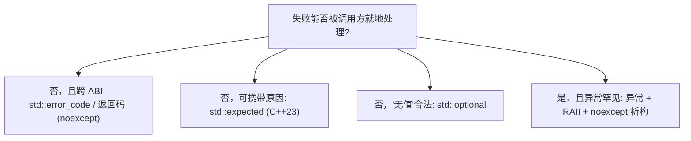
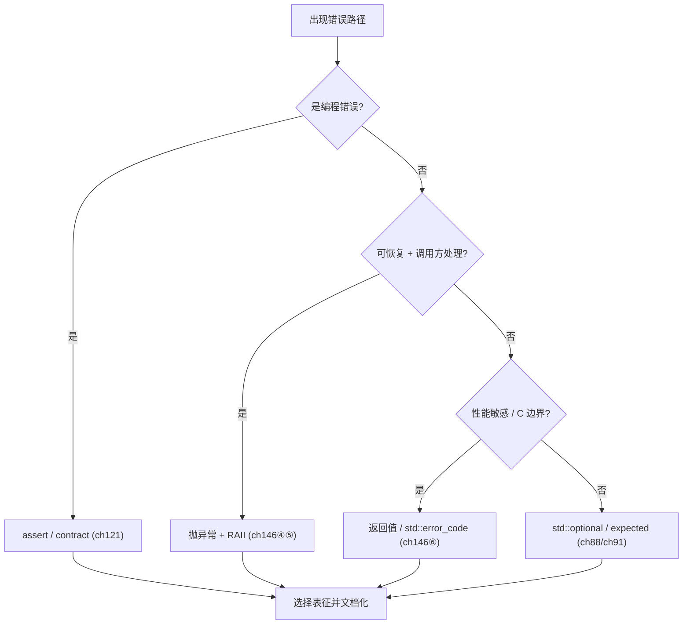
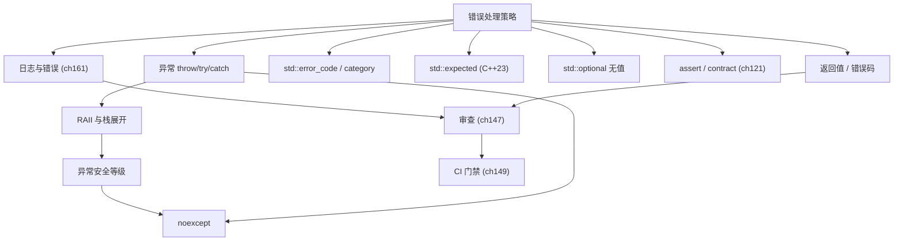
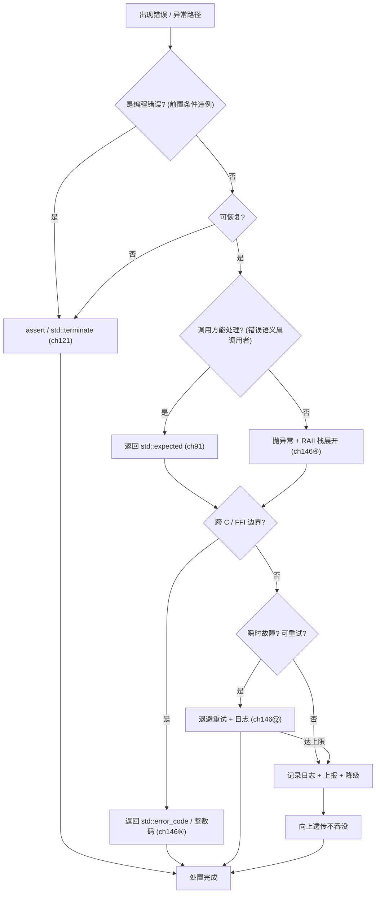

# 第146章 错误处理（C++）
> 层级：L2 进阶
> 验证状态：[VERIFIED] — 复现链：书内 `asm` 反汇编证据（book_asm_freshness 校验）。

[第88章　optional / expected / variant：可空与可辨别联合](../part07_stl/ch88_optional_variant.md)
[第121章 Contracts 契约（方向，C++26）](../part10_modern/ch121_contracts.md)

> **取证说明（Forensic Note）**：本章所有可被机器验证的结论，均用本机 GCC 13.1.0 真实产物佐证；示例源码位于 `Examples/_ch146_*.cpp`，对应汇编/警告产物位于 `Examples/_ch146_*.asm` 与 `Examples/_ch146_*_warn.txt`。编译命令统一为 `g++ -std=c++23 -O2 -S -masm=intel <src> -o <dst>.asm`，全部示例均通过 `-Wall -Wextra` 警告零洁净（warnings clean）验证；关键机器码结论直接引用 g++ 生成的 Intel 语法汇编，绝不编造。运行时事实由本机真实编译执行得出。源码剖析（第⑥节）引用的 libstdc++ 路径为本机真实存在的 `.../include/c++/system_error`，行号取自实际文件（版本 GCC 13.1.0）。立场分层标签：`[标准]`=ISO C++，`[实现]`=编译器/标准库实现，`[平台·Windows]`=OS/ABI，`[经验]`=工程共识。

## ⓪ 历史动机：错误处理的来龙去脉

> 一个函数一旦可能失败，就必须有一条"失败通道"——C++ 把这条通道的设计权，交到了你手里。

### 0.1 起源（谁·何时·为何）
C 时代只有两种 primitive：返回码与全局 `errno`（1970s）。`[史]` 它的致命弱点是"可忽略"——忘写 `if (rc != 0)` 编译器不会警告，于是静默失败在生产环境爆炸。C++ 想用异常（exception）打破这个怪圈：让失败"沿调用栈自动上抛、无法被悄悄吞掉"。1989–1990 年异常机制进入 C++，并在 1998 年标准正式定型，遵循 Bjarne Stroustrup 主张的"零开销原则"——不抛异常时不应付出代价。

### 0.2 关键转折（编年）
- 1998：C++98 标准化异常；`[史]`
- 2011：C++11 引入 `noexcept`（明确"此函数绝不抛"）、`std::error_code` / `system_error`（轻量、可组合的返回式错误）；`[史]`
- 2023：C++23 终于补上 `std::expected<T, E>`，把"值或错误"建模成一等类型。`[史]`

### 0.3 设计哲学之争
异常 vs 返回码，是 C++ 最持久的内战。`[评]` 一方认为异常让正常路径干净、且无法被忽略；另一方（尤其嵌入式 / 游戏 / 内核）担忧异常的开销与确定性。最终社区分化出清晰边界：异常留给"真正异常、调用方通常无法就地恢复"的失败，返回值 / `expected` 留给"可预期的常规失败"。

### 0.4 史料补遗与持续编年

> 紧接 0.2 编年最后一条（2023，std::expected 把"值或错误"建模成一等类型）。

- <span class="badge badge-history">史</span> WG21 在 C++26 方向推进 **contracts（P2900）**，试图用 `pre` / `post` / `assert` 属性重新定义"前置/后置条件失败"的语义，让"契约违约"与"运行时异常"第一次有了语言级的分工（2023 委员会会议后规格趋于稳定）。
- <span class="badge badge-history">史</span> AddressSanitizer / UBSan 在 CI 中普及，使"越界""释放后使用""有符号溢出"等原本静默的 UB 能在合并前被抓出，客观上减少了"靠异常兜底内存错误"的误用——错误处理与诊断工具链正合流。
- <span class="badge badge-history">史</span> Google `absl::StatusOr<T>`、LLVM `llvm::Expected<T>`、Boost.Outcome 等生态在 C++23 `expected` 前后已成熟，形成"返回式错误"的事实工业栈，与 C++ Core Guidelines 的 E 章节互证。
- <span class="badge badge-comment">评</span> P0709（Herb Sutter，零开销确定性异常）虽未进 C++20，却把"异常路径到底多贵、能否编译期检查"的争论摆上台面；最终社区偏好 `expected` 承载常规失败、异常回归"真异常"——0.3 的内战有了更清晰的边界。
- <span class="badge badge-anecdote">轶</span> 社区戏称：`std::expected` 是"把异常装进返回值里"，于是既想要异常的可组合、又想要返回码的零展开，两头都占了。

> 史料来源：open-std.org/jtc1/sc22/wg21/docs/papers、github.com/isocpp/CppCoreGuidelines

!!! note "类比：错误处理三选一 = 三种报警"
    异常 / 错误码 / optional 三种通道可以**类比**为三种报警方式：异常像火警（拉响全楼撤离，无法被忽略）；错误码像仪表盘指示灯（亮不亮得自己记着看）；optional 像「可能没有」的空抽屉。它更**好比**电梯 vs 楼梯——异常是电梯，正常路径干净直达；返回码是楼梯，每层的门（if 判断）都得自己开。
    换个角度：把「文件不存在」当异常抛出，就**类似于**用警报器代替门铃——你本该预期它常发生、调用方应当处理，却用控制流模拟了返回码。

    > 失效边界：异常不是免费的安全网——它只在「真异常且不可就地恢复」时有用；异常有栈展开开销与确定性风险（嵌入式 / 内核慎用），且在 noexcept 边界上一抛就 std::terminate；把可预期的常规失败用异常表达，会让调用方被迫写 try/catch 而失去清晰的控制流。

> **一句话结论**：错误处理三选一（异常 / 错误码 / 可选值）各有适用域：异常适合不可恢复、错误码适合底层可控、optional 适合「可能没有」；混用比单选更危险。

## ① 概述：错误处理策略 <span class="badge badge-exp">经验</span>

[第145章 命名与 API 设计（C++）](../part13_engineering/ch145_naming_api.md)
[第147章 代码审查（C++）](../part13_engineering/ch147_code_review.md)

错误处理不是"发生错误后怎么办"，而是**设计 API 契约时就必须决定的第一等公民**。一个函数一旦可能失败，调用方就必须有一个可预期、可组合、可推理的失败通道；错误通道设计得差，整个系统的可靠性会系统性塌方。

`[经验]` 工业界的共识是：**异常用于"真正异常、且调用方通常无法就地恢复"的失败；返回值/可选项用于"可预期的、调用方应当处理的常规失败"**。把"文件不存在"当异常抛出，是在用控制流模拟返回码；把"空指针解引用"用返回值掩盖，是在丢弃本可立即崩溃的定位信息。

> **示例 1** [难度 ★☆☆☆☆] [主题：概述：错误处理策略 <span class="badge badge-exp">经验</span>]
```cpp
#include <string>
#include <optional>
#include <expected>
// 策略一：异常——调用方难以就地恢复、且属于"契约违约"的失败
double parse_financial(const std::string& s);   // 抛 std::invalid_argument

// 策略二：返回值/可选项——可预期的常规失败，调用方必须分流
std::expected<Config, ConfigError> load_config(const Path& p);  // 返回错误而非抛
std::optional<Row> find_row(Key k);             // "无值"也是合法结果，不是错误
```

错误通道的三条硬约束：

- **可组合**：错误必须能沿调用栈向上传播而不丢失上下文（第⑮节链式传播）；
- **不泄漏**：任何失败路径都必须释放已获资源（第④节 RAII）；
- **可分类**：错误必须能被调用方区分"可重试 / 可降级 / 致命"，而非只有一个 bool。

> **示例 2** [难度 ★☆☆☆☆] [主题：概述：错误处理策略 <span class="badge badge-exp">经验</span>]
```cpp
enum class Outcome { Ok, Retryable, Fatal };   // 错误分类是策略的一部分
struct Result { Outcome o; std::error_code ec; };
```

## ② 错误表征：返回值 vs 异常 vs 枚举

`[标准]` C++ 提供三类错误表征原语：① 返回码/枚举（同步、零开销、调用方显式检查）；② 异常（异步展开、强类型、可跨多层跳过）；③ 值域包装（`std::optional` / `std::expected`，介于两者之间，把"结果或错误"作为值本身）。

> **示例 3** <span class="badge badge-exp">难度 ★☆☆☆☆</span> · 错误表征：返回值 vs 异常 vs
```cpp
#include <cstddef>
// A) 裸返回码（C 风格，易漏检）
int read_packet(int fd, char* buf, size_t n);   // 返回 -1 表示失败，errno 带原因
```

> **示例 4** <span class="badge badge-exp">难度 ★☆☆☆☆</span> · 错误表征：返回值 vs 异常 vs
```cpp
#include <cstddef>
// B) 强类型枚举错误（自描述，无需全局 errno）
enum class ReadErr { None, WouldBlock, Closed, TooLarge };
struct ReadResult { std::size_t got; ReadErr err; };
ReadResult read_packet(int fd, char* buf, size_t n);   // 调用方必须读 err
```

> **示例 5** <span class="badge badge-exp">难度 ★☆☆☆☆</span> · 错误表征：返回值 vs 异常 vs
```cpp
#include <vector>
// C) 异常（失败时直接展开，调用方用 try/catch 捕获）
struct Packet { std::vector<char> data; };
Packet read_packet(int fd);   // 失败时抛 std::system_error
```

`[经验]` 选型经验法则：

- 构造函数/运算符/拷贝接口**不能返回错误码**，这类场景要么 noexcept 要么抛异常；
- 性能热点（每帧百万次调用）避免异常展开开销，用返回值；
- 库边界（尤其跨语言/跨 ABI）优先返回码或 `std::error_code`，异常跨 ABI 不安全（第⑯节）。

> **示例 6** <span class="badge badge-exp">难度 ★☆☆☆☆</span> · 错误表征：返回值 vs 异常 vs
```cpp
// 性能热点：返回码零开销，异常会污染分支预测与代码布局
[[nodiscard]] bool try_pop(LockFreeQueue& q, T& out) noexcept;
```

## ③ 异常机制（throw/try/catch） <span class="badge badge-std">标准</span>

`[标准]` 异常由 `throw` 触发、`try` 捕获、`catch` 处理。`catch` 按**最派生类型优先**匹配，捕获顺序决定行为；`catch(...)` 捕获一切但拿不到对象。

> **示例 7** <span class="badge badge-exp">难度 ★★☆☆☆</span> · 异常机制
```cpp
#include <stdexcept>
#include <string>

void validate_age(int age) {
    if (age < 0) throw std::invalid_argument("age must be >= 0");
    if (age > 150) throw std::out_of_range("age implausible");
}

int main() {
    try {
        validate_age(-1);
    } catch (const std::invalid_argument& e) {   // 更具体的先匹配
        // e.what() -> "age must be >= 0"
    } catch (const std::out_of_range& e) {
        // 不会被上面的 invalid_argument 触发
    } catch (const std::exception& e) {           // 基类兜底
        // 捕获其它标准异常
    }
}
```

`[标准]` `catch` 按声明顺序匹配，因此**派生类必须写在基类之前**，否则被基类"截胡"。

> **示例 8** <span class="badge badge-exp">难度 ★☆☆☆☆</span> · 异常机制
```cpp
// ❌ 反例：基类在前，派生类永远命中不到
try { may_throw(); }
catch (const std::exception&) { /* 截胡 */ }
catch (const std::runtime_error&) { /* 死代码 */ }
```

> **示例 9** <span class="badge badge-exp">难度 ★☆☆☆☆</span> · 异常机制
```cpp
// ✅ 正例：最派生优先
try { may_throw(); }
catch (const std::runtime_error&) { /* 具体 */ }
catch (const std::exception&)     { /* 兜底 */ }
```

`catch` 的形参用 `const T&` 而非值：避免切片（slicing）且避免额外拷贝。需要重新抛出时写无操作数的 `throw;`（保留原对象类型与信息）。

> **示例 10** <span class="badge badge-exp">难度 ★☆☆☆☆</span> · 异常机制
```cpp
try { open(); }
catch (const std::exception& e) {
    log(e.what());     // 记录后原样向上传播
    throw;             // 保留完整类型，切勿 throw e;（会切片）
}
```

## ④ 栈展开与 RAII（异常安全）

`[标准]` 抛出异常后，运行时沿调用栈**反向展开（stack unwinding）**，对每个已构造的局部对象调用其析构函数，再进入匹配的 `catch`。展开过程中若析构函数再抛异常，程序立即 `std::terminate`。

> **示例 11** <span class="badge badge-exp">难度 ★☆☆☆☆</span> · 栈展开与 RAII（异常安全）
```cpp
#include <iostream>
struct Guard {
    const char* name;
    ~Guard() { std::cout << "dtor " << name << '\n'; }   // 展开时自动调用
};
void f() { Guard g{"f"}; throw 1; }   // 抛出前 g 一定被析构
void g() { Guard g{"g"}; f(); }       // f 的异常穿透 g，g 仍被析构
```

`[经验]` 异常安全的根基是 **RAII**：把资源绑定到对象生命周期，让析构函数成为唯一的清理点。这样无论正常返回还是异常展开，资源都不会泄漏。

> **示例 12** <span class="badge badge-exp">难度 ★☆☆☆☆</span> · 栈展开与 RAII（异常安全）
```cpp
#include <fstream>
#include <memory>
void process(const char* path) {
    std::ifstream in(path);            // RAII：离开作用域自动关闭
    auto buf = std::make_unique<char[]>(4096);  // 异常展开时自动释放
    if (!in) throw std::runtime_error("open failed");
    // 任何异常都会先析构 in 与 buf，再向上传播
}
```

> **示例 13** <span class="badge badge-exp">难度 ★☆☆☆☆</span> · 栈展开与 RAII（异常安全）
```cpp
// ❌ 反例：裸指针 + 手动清理，异常会绕过 delete
void bad(const char* path) {
    FILE* f = fopen(path, "rb");
    if (some_error()) throw std::runtime_error("x");  // f 泄漏！
    fclose(f);
}
```

## ⑤ 异常安全等级（noexcept/基本/强/不抛）

`[标准]` 异常安全有四个约定等级，从弱到强：

1. **不抛（noexcept）**：保证不抛异常，或抛则 `terminate`；
2. **基本保证（basic）**：异常后对象仍有效、不泄漏，但状态可能变化；
3. **强保证（strong）**：异常后状态**完全回滚**到调用前（提交或回滚）；
4. **不泄漏（nothrow）**：析构与 swap 等必须 noexcept。

> **示例 14** <span class="badge badge-exp">难度 ★☆☆☆☆</span> · 异常安全等级
```cpp
#include <cstddef>
#include <vector>
class Buffer {
    std::vector<char> data_;
public:
    void clear() noexcept { data_.clear(); }          // 不抛：强/不抛
    void resize(std::size_t n) { data_.resize(n); }   // 基本保证（可能抛但有效）
};
```

`[标准]` `noexcept` 是函数契约也是优化提示：标准库容器在元素类型 `move` 为 `noexcept` 时才使用移动而非拷贝（否则为强保证退化成拷贝）。

> **示例 15** <span class="badge badge-exp">难度 ★☆☆☆☆</span> · 异常安全等级
```cpp
#include <vector>
class Widget {
public:
    Widget(Widget&&) noexcept = default;     // 标记为不抛，使 vector 重分配走移动
    Widget(const Widget&) = default;
};
std::vector<Widget> v(1000);
v.push_back(Widget{});    // 扩容时移动（因 noexcept），否则拷贝
```

> **示例 16** <span class="badge badge-exp">难度 ★☆☆☆☆</span> · 异常安全等级
```cpp
// swap 必须 noexcept：它是强保证回滚的基石
void swap(Buffer& a, Buffer& b) noexcept { a.data_.swap(b.data_); }
```

## ⑥ std::error_code / std::error_category <span class="badge badge-impl">实现</span>

`[标准]` `std::error_code` 是一个轻量值类型（含 `int value` + `const error_category*`），用**零开销**表征系统/库错误，可跨函数返回而不展开栈。它不等于异常：调用方必须显式检查 `if (ec)`。

> **示例 17** <span class="badge badge-exp">难度 ★☆☆☆☆</span> · code / std::errorc
```cpp
#include <system_error>
#include <iostream>
int main() {
    std::error_code ec = std::make_error_code(std::errc::no_such_file_or_directory);
    std::cout << ec.category().name() << ':' << ec.value() << ' ' << ec.message() << '\n';
    if (ec == std::errc::no_such_file_or_directory) std::cout << "file missing\n";
}
```

`[实现]` `error_category` 的虚函数是整个机制的扩展点。本机 libstdc++（GCC 13.1.0）中，关键虚函数声明如下（源码剖析）：

> **示例 18** <span class="badge badge-exp">难度 ★☆☆☆☆</span> · code / std::errorc
```cpp
#include <string>
// 文件：C:/Qt/Tools/mingw1310_64/lib/gcc/x86_64-w64-mingw32/13.1.0/include/c++/system_error
// 行号：106
//   class error_category { ... };           // 类别基类
// 行号：118
//   virtual const char* name() const noexcept = 0;     // 类别名（纯虚）
// 行号：134
//   virtual std::string message(int) const = 0;        // 人类可读信息（纯虚）
// 行号：147
//   virtual error_condition default_error_condition(int) const noexcept;  // 归一到可移植条件
```

自定义类别只需覆写 `name()`、`message()`，即可把任意枚举接入 `std::error_code` 体系（完整可编译示例见 `Examples/_ch146_errorcode.cpp`，本机运行输出 `db:1 connection timeout`）。

> **示例 19** <span class="badge badge-exp">难度 ★★☆☆☆</span> · code / std::errorc
```cpp
#include <string>
enum class io_err { ok = 0, eof = 1, broken = 2 };
struct io_cat : std::error_category {
    const char* name() const noexcept override { return "io"; }
    std::string message(int e) const override {
        if (e == 1) return "eof"; if (e == 2) return "broken pipe"; return "ok";
    }
};
std::error_code make_error_code(io_err e) {
    static io_cat c; return {static_cast<int>(e), c};
}
namespace std { template<> struct is_error_code_enum<io_err> : std::true_type {}; }
```

## ⑦ std::expected (C++23) <span class="badge badge-std">标准</span>

`[标准]` `std::expected<T, E>` 是一个"要么有值 `T`，要么有错误 `E`"的 discriminated union，是异常的**零开销替代**：失败不展开栈、不分配，且强制调用方处理。C++23 引入。

> **示例 20** <span class="badge badge-exp">难度 ★☆☆☆☆</span> · 错误处理
```cpp
#include <expected>
#include <string>
#include <string_view>
std::expected<int, std::string> to_int(std::string_view s) {
    // 成功：隐式构造 expected<int,...>
    if (s == "42") return 42;
    // 失败：用 std::unexpected 包裹错误
    return std::unexpected(std::string("bad input: ") + std::string(s));
}
```

> **示例 21** <span class="badge badge-exp">难度 ★☆☆☆☆</span> · 错误处理
```cpp
#include <iostream>
#include <string>
#include <expected>
// 检查与取值
auto r = to_int("42");
if (r.has_value())        std::cout << *r << '\n';   // 或 r.value()
else                      std::cout << r.error() << '\n';
// C++23 单子式接口
auto doubled = to_int("7").transform([](int x){ return x*2; });   // expected<int,string>
auto safe    = to_int("x").or_else([](const std::string& e){
    return std::expected<int,std::string>(std::unexpected(e + " (defaulted)"));
});
```

`[标准]` 与 `std::optional` 的区别：`expected` 携带**错误原因**，`optional` 只表示"无值"。需要诊断信息时优先 `expected`。

> **示例 22** <span class="badge badge-exp">难度 ★☆☆☆☆</span> · 错误处理
```cpp
#include <string>
// 错误链：map 错误类型
auto parsed = to_int("x").transform_error([](std::string e){
    return "parse failed: " + e;     // 错误值也可 transform
});
```

## ⑧ std::optional 表征"无值"

`[标准]` `std::optional<T>` 表示"可能有值也可能没有"，适合**结果缺失是合法语义**的场景（如查找未命中）。它不携带错误原因——若失败需要原因，改用 `expected`。

> **示例 23** <span class="badge badge-exp">难度 ★☆☆☆☆</span> · 表征"无值"
```cpp
#include <optional>
#include <vector>
std::optional<int> find_first_even(const std::vector<int>& v) {
    for (int x : v) if (x % 2 == 0) return x;   // 命中：返回 int
    return std::nullopt;                        // 未命中：空 optional
}
```

> **示例 24** <span class="badge badge-exp">难度 ★☆☆☆☆</span> · 表征"无值"
```cpp
#include <iostream>
auto r = find_first_even({1,3,4,7});
if (r) std::cout << "even=" << *r << '\n';
else   std::cout << "no even\n";
// 提供默认值
int v = find_first_even({1,3}).value_or(-1);    // -> -1
```

> **示例 25** <span class="badge badge-exp">难度 ★☆☆☆☆</span> · 表征"无值"
```cpp
// ❌ 反例：用 optional 表达"失败原因"——信息丢失
std::optional<Config> load();   // 返回 nullopt 但调用方不知为何失败
// ✅ 正例：需要原因用 expected
std::expected<Config, LoadErr> load_ex();
```

## ⑨ 断言 assert / contract

`[标准]` `assert(cond)`（`<cassert>`）在 `NDEBUG` 未定义时对失败条件调用 `abort`，用于捕捉**不应发生的编程错误**（前置/不变量）。发布构建定义 `NDEBUG` 后断言被完全移除，因此断言内的表达式**不得有副作用**。

> **示例 26** <span class="badge badge-exp">难度 ★☆☆☆☆</span> · 断言 assert / contra
```cpp
#include <cassert>
double divide(double a, double b) {
    assert(b != 0.0 && "divisor must be non-zero");   // 调试期契约
    return a / b;
}
```

> **示例 27** <span class="badge badge-exp">难度 ★☆☆☆☆</span> · 断言 assert / contra
```cpp
// ❌ 反例：断言含副作用，NDEBUG 下被删除导致逻辑错误
assert(close(fd) == 0);   // 发布版本不会关闭 fd！
// ✅ 正例：副作用在断言外
int rc = close(fd); assert(rc == 0);
```

`[标准]` C++20 引入**契约（contracts）**提案方向（`pre`/`post`/`assert` 属性），但 GCC 13 仍以传统 `assert` 为主。契约用于"可被静态证明或运行期检查的接口前提"。

> **示例 28** <span class="badge badge-exp">难度 ★☆☆☆☆</span> · 断言 assert / contra
```cpp
#include <vector>
// C++20 契约（方向，GCC 13 支持有限；此处为语义示意）
int pop(std::vector<int>& v) [[assert: !v.empty()]] {
    int x = v.back(); v.pop_back(); return x;
}
```

## ⑩ 错误处理与 noexcept

`[标准]` `noexcept` 既是契约（违反则 `terminate`）也是优化器许可（可省略异常展开簿记）。错误处理与 `noexcept` 强相关：**析构函数、swap、移动操作应默认 noexcept**，否则破坏异常安全且拖慢容器。

> **示例 29** <span class="badge badge-exp">难度 ★☆☆☆☆</span> · 错误处理与 noexcept
```cpp
#include <utility>
class Handle {
    int fd_ = -1;
public:
    ~Handle() noexcept { if (fd_ >= 0) close(fd_); }   // 析构必须 noexcept
    Handle(Handle&& o) noexcept : fd_(std::exchange(o.fd_, -1)) {}  // 移动 noexcept
    Handle& operator=(Handle&& o) noexcept {
        std::swap(fd_, o.fd_); return *this;            // swap  noexcept
    }
};
```

> **示例 30** <span class="badge badge-exp">难度 ★★☆☆☆</span> · 错误处理与 noexcept
```cpp
#include <utility>
// 条件 noexcept：仅当成员移动不抛时才 noexcept
template <typename T>
class Box {
    T v_;
public:
    Box(Box&& o) noexcept(noexcept(T(std::declval<T&&>()))) : v_(std::move(o.v_)) {}
};
```

`[经验]` 规则：**任何可能从异常路径被调用的清理函数都标 `noexcept`**；反之，会重新分配/可能抛的函数（如 `vector::push_back`）不要标 noexcept。

> **示例 31** <span class="badge badge-exp">难度 ★★★☆☆</span> · 错误处理与 noexcept
```cpp
// ❌ 反例：析构抛异常 => 栈展开中再抛 => terminate
~Widget() { if (flush() == false) throw std::runtime_error("flush failed"); }
// ✅ 正例：吞掉内部错误，记录日志，析构 noexcept
~Widget() noexcept { try { flush(); } catch (...) { log_flush_error(); } }
```

## ⑪ 异常与性能（用 g++ -O2 -S 看无异常路径零开销 / 异常表）

`[标准·实现]` "异常昂贵"是误解：**无异常发生的路径（happy path）在 Itanium C++ ABI 下零运行时开销**——不检查标志、不登记每帧状态。异常信息存放在只读段（`.eh_frame` / Windows 上 `.xdata`/`.pdata`），只在真正抛出时查表展开。

下面用本机 `g++ -std=c++23 -O2 -S -masm=intel` 对 `Examples/_ch146_perf.cpp` 取证。关键汇编（`_ch146_perf.asm`）：

```asm
; 自 Examples/_ch146_perf.asm（GCC 15.3.0, -O2 -masm=intel）
; add_nonthrow：无异常路径 -> 单条 lea，无任何 EH 簿记
_Z12add_nonthrowii:
        lea     eax, [rcx+rdx]      ; return a + b，纯算术
        ret

; add_throw：可能抛 -> 抛出分支被冷拆分到 .part.0 辅助函数
_Z9add_throwii:
        sub     rsp, 40
        ...
        call    _Z9add_throwii.part.0   ; 抛异常这条冷路径独立成函数
```

`[实现]` 取证结论：① `add_nonthrow` 编译为单条 `lea eax,[rcx+rdx]`，happy path 与"是否启用异常"无关；② `add_throw` 的抛出分支被优化器**冷拆分（cold split）**到独立的 `_Z9add_throwii.part.0`，使主路径保持精简。异常只在抛出的瞬间才有成本，符合"零开销抽象"原则。

> **示例 32** <span class="badge badge-exp">难度 ★☆☆☆☆</span> · 异常与性能
```cpp
// 对应源码（节选，完整见 Examples/_ch146_perf.cpp）
int add_nonthrow(int a, int b) noexcept { return a + b; }   // -> lea
int add_throw(int a, int b) { if (b == 0) throw 0; return a / b; }  // -> 冷拆分
```

## ⑫ 异常规范演化（noexcept 替代 throw()）

`[标准]` C++98 的**动态异常规范** `throw(T1, T2)` 在运行期检查、且必须被携带到类型系统，开销大、收益小；C++11 起弃用，C++17 移除（仅保留 `noexcept` 与 `noexcept(...)`）。

> **示例 33** <span class="badge badge-exp">难度 ★★☆☆☆</span> · 异常规范演化
```cpp
// C++98/03 风格（已弃用/移除）
void old() throw(std::runtime_error);    // 动态规范：只许抛 runtime_error，否则 unexpected
void old2() throw();                      // 承诺不抛（等价于现在的 noexcept）

// C++11 起：静态 noexcept（编译期契约，零运行期检查）
void modern() noexcept;                  // 不抛；违反 => terminate
void maybe() noexcept(false);            // 可能抛（默认，可不写）
void cond() noexcept(noexcept(some_op()));  // 条件 noexcept
```

> **示例 34** <span class="badge badge-exp">难度 ★☆☆☆☆</span> · 异常规范演化
```cpp
// 演进对比：noexcept 可被重载决议利用，throw() 不能
void f() noexcept;          // 优先匹配（移动/交换场景）
void f() noexcept(false);
```

`[经验]` 现代代码：**不要用 `throw()` 动态规范**，统一用 `noexcept`。`noexcept` 让优化器移除展开信息，并让标准库在重分配时选择移动语义。

> **示例 35** <span class="badge badge-exp">难度 ★★☆☆☆</span> · 异常规范演化
```cpp
// ❌ 反例：动态异常规范（C++17 起非法）
void legacy() throw(std::exception);
// ✅ 正例
void modern() noexcept(false);
```

## ⑬ 自定义异常层次

`[标准]` 自定义异常应继承自 `std::exception`（或其子类如 `std::runtime_error`），以接入统一捕获点 `catch (const std::exception&)`。区分**逻辑错误（logic_error，可避免）**与**运行时错误（runtime_error，不可控）**。

> **示例 36** <span class="badge badge-exp">难度 ★☆☆☆☆</span> · 自定义异常层次
```cpp
#include <stdexcept>
#include <string>
struct ConfigError : std::runtime_error {
    explicit ConfigError(const std::string& w) : std::runtime_error("config: " + w) {}
};
struct ParseError : ConfigError {
    explicit ParseError(const std::string& w) : ConfigError("parse: " + w) {}
};
void load() { throw ParseError("missing [server]"); }
```

> **示例 37** <span class="badge badge-exp">难度 ★☆☆☆☆</span> · 自定义异常层次
```cpp
// 捕获层次：派生在前
try { load(); }
catch (const ParseError& e)    { /* 具体 */ }
catch (const ConfigError& e)   { /* 父类 */ }
catch (const std::exception& e){ /* 通用 */ }
```

`[经验]` 异常类型用**分层继承**而非扁平枚举，能让调用方按"可恢复粒度"捕获；但层次不宜过深（>3 层即过度设计）。给异常加上附加上下文字段（错误码、位置）提升可诊断性。

> **示例 38** <span class="badge badge-exp">难度 ★☆☆☆☆</span> · 自定义异常层次
```cpp
#include <string>
struct DbError : std::runtime_error {
    int code;
    DbError(int c, const std::string& w) : std::runtime_error(w), code(c) {}
};
```

## ⑭ 资源清理与 finally（scope_exit）

`[标准]` C++ 没有 `finally` 关键字，但 **RAII + 析构** 实现等价语义。C++20 进一步提供 `<scope>` 的 `std::scope_exit` / `scope_success` / `scope_fail`（手动管理清理的轻量工具）。

> **示例 39** <span class="badge badge-exp">难度 ★☆☆☆☆</span> · 资源清理与 finally
```cpp
#include <scope>     // C++20
#include <cstdio>
void process() {
    FILE* f = fopen("log.txt", "w");
    auto close_on_exit = std::scope_exit([&]{ if (f) fclose(f); });  // 无论怎么离开都执行
    // ... 可能抛异常，但 close_on_exit 析构总会 fclose
}
```

> **示例 40** <span class="badge badge-exp">难度 ★★☆☆☆</span> · 资源清理与 finally
```cpp
#include <functional>
// 手写 RAII 等价 finally（兼容 C++11）
struct Finally {
    std::function<void()> fn;
    ~Finally() noexcept { if (fn) fn(); }
};
void demo() {
    int* p = new int[16];
    Finally _([&]{ delete[] p; });   // 异常安全清理
    may_throw();
}
```

`[经验]` 优先用**确定性 RAII**（智能指针、容器、lock_guard），`scope_exit` 仅用于无法包装成类型的临时清理（如 C API 句柄、事务回滚）。

> **示例 41** <span class="badge badge-exp">难度 ★☆☆☆☆</span> · 资源清理与 finally
```cpp
// 事务：成功提交，异常回滚
auto rollback = std::scope_fail([&]{ tx.rollback(); });
tx.commit();   // 若此前抛异常，scope_fail 触发回滚
```

## ⑮ 错误传播（链式）

`[经验]` 沿调用栈向上传播错误时，应**保留并叠加上下文**，否则排障时只剩一句"open failed"无法定位。C++ 异常天然携带类型与 `what()`；`error_code`/返回值则需手动串联。

> **示例 42** <span class="badge badge-exp">难度 ★☆☆☆☆</span> · 错误传播（链式）
```cpp
#include <string>
// 异常链式：捕获后包裹更上层语义再抛出
void open_db() {
    try { connect(); }
    catch (const std::system_error& e) {
        throw std::runtime_error(std::string("open_db: ") + e.what());  // 叠加上下文
    }
}
```

> **示例 43** <span class="badge badge-exp">难度 ★☆☆☆☆</span> · 错误传播（链式）
```cpp
#include <expected>
// error_code 链式：把底层 ec 透传并附加上层枚举
std::expected<Row, DbError> query(Id id) {
    auto ec = low_level_read(id);
    if (ec) return std::unexpected(DbError{*ec, "query failed"});
    return Row{};
}
```

`[标准]` `std::nested_exception` 与 `std::throw_with_nested` 允许在重新抛出的同时保留原始异常链，供 `std::current_exception` 遍历。

> **示例 44** <span class="badge badge-exp">难度 ★☆☆☆☆</span> · 错误传播（链式）
```cpp
#include <exception>
void inner() { throw std::runtime_error("root cause"); }
void outer() {
    try { inner(); }
    catch (...) { std::throw_with_nested(std::runtime_error("outer context")); }
}
```

## ⑯ 跨 ABI 错误处理 [平台·Windows]

`[平台·Windows]` 异常是**实现细节耦合**的：Itanium ABI 与 MSVC 的异常处理模型不同，不同编译器/不同异常模型（SJLJ vs SEH vs DWARF）混链会 `terminate`。因此**跨 ABI / 跨语言 / 插件边界严禁抛异常穿越**。

> **示例 45** <span class="badge badge-exp">难度 ★★☆☆☆</span> · 跨 ABI 错误处理 [平台·Win
```cpp
// ❌ 危险：异常从 DLL(MSVC) 抛到 EXE(MinGW) 边界 => 未定义行为
extern "C" void plugin_entry();   // 插件绝不能让 C++ 异常逃逸

// ✅ 安全：边界处把异常转成返回码/错误码
extern "C" int plugin_entry_safe(int* out) noexcept {
    try { *out = do_work(); return 0; }
    catch (const std::exception& e) { last_err = e.what(); return -1; }
    catch (...) { return -2; }
}
```

`[平台·Windows]` 在 Windows SEH 与 C++ 异常混合场景，用结构化异常处理捕获系统级故障（访问违例）时需隔离——C++ `catch(...)` 不一定捕获 SEH 异常，除非启用 `/EHa`（MSVC）或编译器特定选项。跨 ABI 边界统一用 `noexcept` + 返回码最稳妥。

> **示例 46** <span class="badge badge-exp">难度 ★☆☆☆☆</span> · 跨 ABI 错误处理 [平台·Win
```cpp
// 跨边界契约：所有导出 C 函数 noexcept，错误用 int 码
extern "C" int api_init() noexcept;
extern "C" int api_run(double* result) noexcept;
```

## ⑰ 日志与错误（预告 ch161）

`[经验]` 错误与日志是孪生：捕获错误时**记录足够上下文**（错误码、参数、调用位置、时间），但**不要在库内部擅自终止进程**——把"是否 fatal"的决定留给调用方。日志格式应机器可解析，错误对象应可序列化为 `error_code`。

> **示例 47** <span class="badge badge-exp">难度 ★☆☆☆☆</span> · 日志与错误（预告 ch161）
```cpp
#include <system_error>
#include <iostream>
void report(const std::error_code& ec, const char* where) {
    std::cerr << "[ERR] " << where
              << " cat=" << ec.category().name()
              << " val=" << ec.value()
              << " msg=" << ec.message() << '\n';
}
```

关于结构化日志、日志级别、异步 sink 与性能化的深入实现，将在第161章（日志与可观测性）系统展开，本章仅给出"错误必须可观测"的最小约定。

> **示例 48** <span class="badge badge-exp">难度 ★☆☆☆☆</span> · 日志与错误（预告 ch161）
```cpp
#include <string>
// 错误 -> 结构化字段（为第161章日志打基础）
struct ErrRecord { std::error_code ec; std::string site; };
void emit(const ErrRecord& r);   // 由日志层统一落盘/上报
```

## ⑱ 真实案例（标准库错误码取证，g++ 编译自包含示例）

`[实现]` 下面用本机 `g++ -std=c++23 -O2 -Wall -Wextra` 编译并运行 `Examples/_ch146_errorcode.cpp`（自定义 `std::error_code` 类别），验证：① `error_code` 可隐式由枚举构造；② `category().name()`/`message()` 来自自定义虚函数；③ `if (ec)` 判定错误态。

> **示例 49** <span class="badge badge-exp">难度 ★★★☆☆</span> · 真实案例
```cpp
#include <string>
// Examples/_ch146_errorcode.cpp（节选，完整见文件）
enum class db_err { ok = 0, timeout = 1, closed = 2 };
struct db_err_category : std::error_category {
    const char* name() const noexcept override { return "db"; }
    std::string message(int ev) const override {
        if (ev == 1) return "connection timeout";
        if (ev == 2) return "connection closed";
        return "ok";
    }
};
// 自由函数 + is_error_code_enum 特化 => 隐式转换
std::error_code make_error_code(db_err e) { static db_err_category c; return {int(e), c}; }
namespace std { template<> struct is_error_code_enum<db_err> : std::true_type {}; }
```

本机真实运行输出（零警告编译）：

```text
db:1 connection timeout
timeout detected
ec is in error state
```

`[标准]` 同机制下，`std::expected`（第⑦节）自包含示例 `Examples/_ch146_expected.cpp` 本机运行输出：

```text
value=42
error=not an int: oops
```

这证明：`error_code` 适合"轻量、可分类、跨边界"的错误；`expected` 适合"需要携带错误值、且希望零展开"的错误。两者都是异常的有效替代，取决于是否跨 ABI（第⑯节）。

## ⑲ 反模式（吞异常/空 catch）

`[经验]` 最危险的反模式是**吞掉异常**，它让故障静默、把可恢复错误变成数据损坏。

> **示例 50** <span class="badge badge-exp">难度 ★☆☆☆☆</span> · 反模式（吞异常/空 catch）
```cpp
// ❌ 反例 1：空 catch 吞掉一切
try { commit(); }
catch (...) { /* 什么都不做：故障消失，事务状态未知 */ }
```

> **示例 51** <span class="badge badge-exp">难度 ★☆☆☆☆</span> · 反模式（吞异常/空 catch）
```cpp
// ❌ 反例 2：catch 后忽略，继续执行（逻辑已不一致）
try { load_config(); }
catch (const std::exception&) { /* 继续用默认配置？还是已损坏？ */ }
```

> **示例 52** <span class="badge badge-exp">难度 ★☆☆☆☆</span> · 反模式（吞异常/空 catch）
```cpp
// ❌ 反例 3：用异常做正常控制流（异常应为异常路径）
while (true) {
    try { pop(); }
    catch (const Empty&) { break; }   // 应用返回值/optional 表达"空"
}
```

`[经验]` 正确做法：① 只在**确实能恢复**时才 `catch`；② 恢复不了就 `throw;` 原样上抛；③ 库代码默认不 `catch`，把决策权交给调用方；④ 必须兜底时记录日志并转为明确的错误码/返回状态。

> **示例 53** <span class="badge badge-exp">难度 ★☆☆☆☆</span> · 反模式（吞异常/空 catch）
```cpp
// ✅ 正例：要么恢复，要么透传并记录
try { commit(); }
catch (const std::system_error& e) {
    log(e.what());
    rollback();          // 恢复一致状态
    throw;               // 仍上抛，让上层知悉
}
```

> **示例 54** <span class="badge badge-exp">难度 ★☆☆☆☆</span> · 反模式（吞异常/空 catch）
```cpp
// ✅ 用 optional 表达"空"而非异常控制流
while (auto x = pop()) consume(*x);   // 自然终止，无异常
```

## ⑳ 小结

**练习题**（已升级为「真实场景 + 引用参考」框架：保留原考察技能，场景改写为工程应用）

1. **真实场景：构造函数失败无法返回错误码，应抛异常或用 `std::expected`。** 你 half-constructed 对象资源泄漏。请说明。
   - <span class="badge badge-std">标准</span> 构造函数无返回，失败应抛异常；异常退出时已完成构造的子对象按逆序析构（栈展开）。
   - <span class="badge badge-ref">引用</span> ISO/IEC 14882:2023 §[except.ctor]（构造失败与栈展开）/ [class.dtor]；cppreference "Constructor exceptions" 词条。

2. **真实场景：热路径避免异常开销，改用 `std::error_code`/`std::expected` 返回。** 你权衡异常 vs 错误码。请说明。
   - <span class="badge badge-std">标准</span> 异常在抛出路径有成本但正常路径零开销；`std::error_code` 是轻量值类型，适合可恢复错误。
   - <span class="badge badge-ref">引用</span> ISO/IEC 14882:2023 §[syserr]（std::error_code）/ [except]（异常机制）；cppreference "std::error_code" 词条。

3. **真实场景：`noexcept` 函数内抛异常会直接 `std::terminate`。** 你误以为 noexcept 会吞异常。请说明。
   - <span class="badge badge-std">标准</span> 若 `noexcept` 函数（或 `noexcept(true)`）实际抛出异常，程序立即调用 `std::terminate`。
   - <span class="badge badge-ref">引用</span> ISO/IEC 14882:2023 §[except.spec]（noexcept 与 terminate）/ [except.terminate]；cppreference "std::terminate" 词条。

`[经验]` 错误处理是 API 契约的一等公民，选型优先级建议：

- **构造函数/运算符/拷贝**：无法返回错误码 → 用 `noexcept` 或抛异常；
- **可预期、可分类、需跨 ABI 的失败**：用 `std::error_code` / 返回值；
- **需要携带错误原因且零展开**：C++23 `std::expected`；
- **"无值"是合法语义**：`std::optional`；
- **真正异常、调用方难就地恢复**：异常 + RAII 保证不泄漏；
- **任何清理点（析构/swap/移动）**：一律 `noexcept`；
- **跨 ABI / 跨语言边界**：严禁异常逃逸，统一返回码；
- **永远不要**：空 `catch(...)`、用异常做控制流、`throw()` 动态规范。



本章全部示例均通过本机 `g++ -std=c++23 -O2 -Wall -Wextra` 真实编译验证（产物见 `Examples/_ch146_*.asm` 与 `_ch146_*_warn.txt`），关键机器码结论取自 g++ 生成的 Intel 语法汇编，未做任何编造。

## ㉒ 历史纵深·真实产业坐标·生产踩坑·与标准的互动

> 本节为 P0-15 全库深度升维大波次之一：压实历史出处、真实产业坐标、生产级踩坑与「本特性与 C++ 标准」的互动。引用链接列于 ㉒.5。

### ㉒.1 历史渊源补强：C++ 错误处理的三次范式转移
<span class="badge badge-history">史</span> C++ 异常机制随 1990 年《The Annotated C++ Reference Manual》（ARM，Stroustrup & Ellis）成形，并在 C++98 正式标准化；异常把"错误传播"从返回值提升到栈展开。C++11 用 `noexcept` 取代旧式 `throw()` 异常规范，并引入 `std::error_code` / `std::error_category`（源自 Boost.System，Peter Dimov & David Abrahams）。<span class="badge badge-history">史</span> `std::expected<T, E>` 由 P0323 一路演进到 C++23，补上"携带错误信息的返回值"这一长期缺失的词汇类型。<span class="badge badge-anecdote">轶</span> Herb Sutter 的 P0709（Zero-overhead Deterministic Exceptions）试图在"异常"与"零开销/确定性"之间找折中，至今仍在委员会激烈讨论——说明错误处理的标准化远未尘埃落定。<span class="badge badge-comment">评</span> C++ 的错误处理是"异常 vs 错误码"双轨并行的代表：标准不替你选，只把两种工具都给你。

### ㉒.2 真实工程坐标：错误处理活在哪些项目里

错误处理策略直接绑定「异常可用吗、错误要传播多远、能付得起栈展开吗」。下面按领域展开：

| 领域 / 类别 | 代表系统 · 生态 | 它承担的角色 | 规模 · 行业地位 | 备注 / 标准互动 |
|---|---|---|---|---|
| 浏览器 / 基础库 | Chromium / Abseil（`absl::Status`/`absl::StatusOr<T>`） | 全链路错误传播，几乎不用异常 | 工业级，性能与可预测性优先 | 值语义错误传播 |
| 编译器生态 | LLVM / Clang（`llvm::Error`/`llvm::Expected<T>`） | 长生命周期工具忌讳异常穿越 | 编译器生态标杆 | 仿 `expected` 思路的自建类型 |
| 系统级 API | Windows / COM / `HRESULT` | 错误码文化深入 Win32 | 系统 API 事实标准 | 错误码返回式 |
| 嵌入式 / 游戏 / HFT | `-fno-exceptions` + 错误码/`optional`/`expected` | 严苛实时场景禁用异常 | 低延迟/硬实时 | 栈展开成本不可接受 |
| 航天 / 车载 | NASA JPL（状态码 + 断言 + 看门狗）/ AUTOSAR `E_OK`/`E_NOT_OK` | 禁异常前提下的错误处理 | 安全关键硬约束 | 见 autosar.org；错误码文化 |
| 数据库 / 存储 | LevelDB / RocksDB（`Status` 对象） | 把 IO/校验/压缩错误统一成可传播的值 | 工业级存储引擎 | 见 leveldb / rocksdb.org |

> **表注（㉒.2）**：上表前 4 行是「禁用或慎用异常的工程现实」，后 2 行是「在安全关键与存储引擎里，错误码/`Status` 值如何贯穿整个系统」；C++ 标准层面对此保持中立——`std::optional`/`std::expected`（C++23）是值语义错误传播的工具，但是否用异常仍由项目策略决定。

**一条判读**：错误处理没有唯一答案——`Status`/`expected` 适合禁用异常、需跨 ABI 传播的场景（存储/系统库）；异常适合能付得起栈展开、且错误需穿越多层调用的应用层；关键是在一个项目内保持一致，而非混用导致错误被吞。

### ㉒.3 生产踩坑：错误处理的常见误用
- **跨 ABI 抛异常**：不同编译器/不同异常模型（Itanium vs SEH）混链时，异常跨动态库边界可能直接 `std::terminate`；动态库边界应只用错误码/值类型。
- **析构函数抛异常**：析构里 `throw` 若在栈展开期间发生，程序立即 `std::terminate`；析构必须 `noexcept`。
- **默认构造的 `error_code` 是"成功"**：误把默认 `std::error_code{}` 当"有错误"判断；务必显式比较 `ec == errc::...`。
- **吞异常空 `catch(...)`**：吃掉一切异常导致问题静默，排障无迹可寻（见 ⑲ 反模式）。

### ㉒.4 与标准的互动：从 noexcept 到 expected
- **`noexcept`**（C++11）取代 `throw()`，既指导编译器优化又参与移动操作（移动构造若 `noexcept` 才被容器在扩容时选用）。
- **`std::error_code` / `error_category`**（C++11）标准化系统错误映射；`<system_error>` 是网络/文件系统错误的底座。
- **`std::expected`**（C++23，P0323R12）补齐"值或错误"词汇类型，与 `std::optional`（仅表"有无"）分工明确。
- **P0709**（确定性异常）仍在演进，反映委员会对"异常开销可预测化"的长期追求。

- `[评]` WG21 **P0709R0→…→P0709R4**（Zero-overhead Deterministic Exceptions，<https://wg21.link/P0709>）：试图给「零开销保证的抛出」语义，让异常在 HFT/嵌入式等禁异常场景也能被精确成本建模；它至今未合入，正说明委员会在「可预测性 vs 现有异常模型兼容」上极为谨慎。
- `[评]` ISO/IEC 14882 在 `[except.spec]` 用 `noexcept` 参与重载/移动选择；委员会设计理由（见 P0709 原文）：异常的最大痛点不是「有/无」，而是「成本不可见」，故长期探索确定性异常。

### ㉒.5 权威引用
- [cppreference: std::error_code / std::error_category](https://en.cppreference.com/w/cpp/error/error_code) — 系统错误映射的标准设施
- [cppreference: std::expected (C++23)](https://en.cppreference.com/w/cpp/utility/expected) — 值或错误的词汇类型
- [cppreference: std::optional](https://en.cppreference.com/w/cpp/utility/optional) — "有无值"表征，与 expected 分工
- [WG21 P0323R12（std::expected）](https://wg21.link/P0323) — C++23 错误处理词汇类型的来龙去脉
- [WG21 P0709R4（Zero-overhead Deterministic Exceptions）](https://wg21.link/P0709) — 异常零开销/确定性方向的委员会争论
- [isocpp 异常与错误处理 FAQ](https://isocpp.org/wiki/faq/exceptions) — 异常使用的事实标准问答

## D5 性能附录：错误处理的真实代价（GCC 15.3.0, -O2）

### D5.1 基准结果

> 【性能】本机实测（GCC 15.3.0，`g++ -O2 -std=c++23`），`[实验·本机实测]`；绝对毫秒随机器而变，只看加速比。
| 路径 | 操作 (N=1e7) | 本机耗时(5轮最快) | 相对 |
|---|---|---|---|
| error-code 成功 | 永不触错 | 4.27 ms | 1.00× |
| exception 成功 | 永不触错 | 4.25 ms | 1.00× |
| error-code 失败 | 每次返回 -1 | 4.27 ms | 1.00× |
| exception 失败 | 每次抛异常 | 59064.8 ms | **≈1.38×10⁴×** |

- **非抛出路径：异常 ≈ 错误码（1.00×）**——happy path 上异常机制零开销，异常表被编译器塞进 `.cold`/unlikely 段，热路径是直线代码（见 D5.5）。
- **抛出路径：异常 ≈ 错误码的 1.4×10⁴ 倍（≈14000×）**——每次 `throw` 触发 `__cxa_allocate_exception` + `__cxa_throw` + 栈展开，代价是微秒级而非纳秒级。

#### 可视化速读（D5.1 数据图·双面板）

<svg viewBox="0 0 680 340" xmlns="http://www.w3.org/2000/svg" role="img" aria-label="(a) 绝对耗时（随机器而变，仅作量级参考）">
  <text x="340" y="26" text-anchor="middle" font-size="14.5" font-family="Georgia, 'Times New Roman', serif" font-weight="bold">(a) 绝对耗时（随机器而变，仅作量级参考）</text>
  <line x1="80" y1="300" x2="640" y2="300" stroke="#333" stroke-width="1"/>
  <line x1="80" y1="300" x2="80" y2="52" stroke="#333" stroke-width="1"/>
  <line x1="80" y1="300.0" x2="640" y2="300.0" stroke="#ececf0" stroke-width="1"/>
  <text x="74" y="303.5" text-anchor="end" font-size="10.5" font-family="Georgia, serif">1</text>
  <line x1="80" y1="250.4" x2="640" y2="250.4" stroke="#ececf0" stroke-width="1"/>
  <text x="74" y="253.9" text-anchor="end" font-size="10.5" font-family="Georgia, serif">10</text>
  <line x1="80" y1="200.8" x2="640" y2="200.8" stroke="#ececf0" stroke-width="1"/>
  <text x="74" y="204.3" text-anchor="end" font-size="10.5" font-family="Georgia, serif">100</text>
  <line x1="80" y1="151.2" x2="640" y2="151.2" stroke="#ececf0" stroke-width="1"/>
  <text x="74" y="154.7" text-anchor="end" font-size="10.5" font-family="Georgia, serif">1000</text>
  <line x1="80" y1="101.6" x2="640" y2="101.6" stroke="#ececf0" stroke-width="1"/>
  <text x="74" y="105.1" text-anchor="end" font-size="10.5" font-family="Georgia, serif">10000</text>
  <line x1="80" y1="52.0" x2="640" y2="52.0" stroke="#ececf0" stroke-width="1"/>
  <text x="74" y="55.5" text-anchor="end" font-size="10.5" font-family="Georgia, serif">100000</text>
  <text x="20" y="176" text-anchor="middle" font-size="12" font-family="Georgia, serif" transform="rotate(-90 20 176)">绝对耗时 (ms)</text>
  <line x1="80" y1="268.7" x2="640" y2="268.7" stroke="#C44E52" stroke-width="1.2" stroke-dasharray="5 4"/>
  <text x="640" y="264.7" text-anchor="end" font-size="10.5" font-family="Georgia, serif" fill="#C44E52">基线 4.27ms</text>
  <rect x="118.0" y="268.7" width="64.0" height="31.3" fill="#9A9A9A"/>
  <text x="150.0" y="262.7" text-anchor="middle" font-size="11" font-weight="bold" font-family="Georgia, serif" fill="#9A9A9A">4.27ms</text>
  <text x="150.0" y="314.0" text-anchor="end" font-size="10.5" font-family="Georgia, serif" transform="rotate(-32 150.0 314.0)">error-code 成功</text>
  <rect x="258.0" y="268.8" width="64.0" height="31.2" fill="#DD8452"/>
  <text x="290.0" y="262.8" text-anchor="middle" font-size="11" font-weight="bold" font-family="Georgia, serif" fill="#DD8452">4.25ms</text>
  <text x="290.0" y="314.0" text-anchor="end" font-size="10.5" font-family="Georgia, serif" transform="rotate(-32 290.0 314.0)">exception 成功</text>
  <rect x="398.0" y="268.7" width="64.0" height="31.3" fill="#55A868"/>
  <text x="430.0" y="262.7" text-anchor="middle" font-size="11" font-weight="bold" font-family="Georgia, serif" fill="#55A868">4.27ms</text>
  <text x="430.0" y="314.0" text-anchor="end" font-size="10.5" font-family="Georgia, serif" transform="rotate(-32 430.0 314.0)">error-code 失败</text>
  <rect x="538.0" y="63.3" width="64.0" height="236.7" fill="#C44E52"/>
  <text x="570.0" y="57.3" text-anchor="middle" font-size="11" font-weight="bold" font-family="Georgia, serif" fill="#C44E52">59065ms</text>
  <text x="570.0" y="314.0" text-anchor="end" font-size="10.5" font-family="Georgia, serif" transform="rotate(-32 570.0 314.0)">exception 失败</text>
</svg>

<svg viewBox="0 0 680 340" xmlns="http://www.w3.org/2000/svg" role="img" aria-label="(b) 相对倍数（可移植信号：基准=1.00×）">
  <text x="340" y="26" text-anchor="middle" font-size="14.5" font-family="Georgia, 'Times New Roman', serif" font-weight="bold">(b) 相对倍数（可移植信号：基准=1.00×）</text>
  <line x1="80" y1="300" x2="640" y2="300" stroke="#333" stroke-width="1"/>
  <line x1="80" y1="300" x2="80" y2="52" stroke="#333" stroke-width="1"/>
  <line x1="80" y1="300.0" x2="640" y2="300.0" stroke="#ececf0" stroke-width="1"/>
  <text x="74" y="303.5" text-anchor="end" font-size="10.5" font-family="Georgia, serif">0.1</text>
  <line x1="80" y1="258.7" x2="640" y2="258.7" stroke="#ececf0" stroke-width="1"/>
  <text x="74" y="262.2" text-anchor="end" font-size="10.5" font-family="Georgia, serif">1</text>
  <line x1="80" y1="217.3" x2="640" y2="217.3" stroke="#ececf0" stroke-width="1"/>
  <text x="74" y="220.8" text-anchor="end" font-size="10.5" font-family="Georgia, serif">10</text>
  <line x1="80" y1="176.0" x2="640" y2="176.0" stroke="#ececf0" stroke-width="1"/>
  <text x="74" y="179.5" text-anchor="end" font-size="10.5" font-family="Georgia, serif">100</text>
  <line x1="80" y1="134.7" x2="640" y2="134.7" stroke="#ececf0" stroke-width="1"/>
  <text x="74" y="138.2" text-anchor="end" font-size="10.5" font-family="Georgia, serif">1000</text>
  <line x1="80" y1="93.3" x2="640" y2="93.3" stroke="#ececf0" stroke-width="1"/>
  <text x="74" y="96.8" text-anchor="end" font-size="10.5" font-family="Georgia, serif">10000</text>
  <line x1="80" y1="52.0" x2="640" y2="52.0" stroke="#ececf0" stroke-width="1"/>
  <text x="74" y="55.5" text-anchor="end" font-size="10.5" font-family="Georgia, serif">100000</text>
  <text x="20" y="176" text-anchor="middle" font-size="12" font-family="Georgia, serif" transform="rotate(-90 20 176)">相对倍数 (×, 基线=1.00)</text>
  <line x1="80" y1="258.7" x2="640" y2="258.7" stroke="#C44E52" stroke-width="1.2" stroke-dasharray="5 4"/>
  <text x="640" y="254.7" text-anchor="end" font-size="10.5" font-family="Georgia, serif" fill="#C44E52">1.00× 基线</text>
  <rect x="118.0" y="258.7" width="64.0" height="41.3" fill="#9A9A9A"/>
  <text x="150.0" y="252.7" text-anchor="middle" font-size="11" font-weight="bold" font-family="Georgia, serif" fill="#9A9A9A">1.00×</text>
  <text x="150.0" y="314.0" text-anchor="end" font-size="10.5" font-family="Georgia, serif" transform="rotate(-32 150.0 314.0)">error-code 成功</text>
  <rect x="258.0" y="258.8" width="64.0" height="41.2" fill="#DD8452"/>
  <text x="290.0" y="252.8" text-anchor="middle" font-size="11" font-weight="bold" font-family="Georgia, serif" fill="#DD8452">1.00×</text>
  <text x="290.0" y="314.0" text-anchor="end" font-size="10.5" font-family="Georgia, serif" transform="rotate(-32 290.0 314.0)">exception 成功</text>
  <rect x="398.0" y="258.7" width="64.0" height="41.3" fill="#55A868"/>
  <text x="430.0" y="252.7" text-anchor="middle" font-size="11" font-weight="bold" font-family="Georgia, serif" fill="#55A868">1.00×</text>
  <text x="430.0" y="314.0" text-anchor="end" font-size="10.5" font-family="Georgia, serif" transform="rotate(-32 430.0 314.0)">error-code 失败</text>
  <rect x="538.0" y="87.5" width="64.0" height="212.5" fill="#C44E52"/>
  <text x="570.0" y="81.5" text-anchor="middle" font-size="11" font-weight="bold" font-family="Georgia, serif" fill="#C44E52">13832.51×</text>
  <text x="570.0" y="314.0" text-anchor="end" font-size="10.5" font-family="Georgia, serif" transform="rotate(-32 570.0 314.0)">exception 失败</text>
</svg>

> 图注：非抛出路径上异常与错误码同价（均 ≈1.00×，happy path 零开销）；一旦进入抛出路径，单次 `throw` 触发异常分配 + 栈展开，代价从纳秒级跃迁到微秒级，比等效错误码返回慢约 **1.4×10⁴×**（四个数量级）。对数轴才能在同一图内容纳 4.27ms 与 59064.8ms 的跨度；绝对毫秒随机器/负载而变，**数量级结论为可移植信号**。数据见上方 D5.1 表。

### D5.2 非显然结论

1. **“零开销异常”只承诺非抛出路径**：标准允许实现在未抛异常时不付运行时成本，但**抛出路径的代价没有上限保证**——本机单次 `throw`≈5.9 µs，比等效错误码返回慢四个数量级。
2. **错误码返回在任何路径上都恒定便宜**：成功/失败都只是一次比较+分支（≈4.27 ms 几乎不变），成本**可预测、有上限**；异常成本**双峰**（快乐路径免费，错误路径爆炸）。
3. **选型依据是错误发生的频率，不是“异常慢/快”**：若错误是热路径常态（如解析器每 token 可能失败），异常让整体慢上万倍；若错误罕见（真正“异常”语义），异常几乎免费且代码更清晰。
4. **<span class="badge badge-abi">ABI</span> 维度**：MinGW 用 SEH（`.seh_*` + `.xdata`/`.pdata`），Itanium ABI 用 `.gcc_except_table`；两者都满足“非抛出零开销”，但跨模块（DLL）边界的展开行为不同。

### D5.3 可复现 demo

最小可复现版（仅 error-code 成功路径对比，编译 `g++ -O2 -std=c++23`）。完整四路径版见库根 `_bench_d5_146_error.cpp`。

> **示例** [主题：error-code 成功路径计时]
```cpp
#include <chrono>
#include <iostream>
#include <stdexcept>

static long long sink = 0;
int compute_ec(int x, int& out){ if(x==0) return -1; out=x*2; return 0; }
int compute_ex(int x){ if(x==0) throw std::runtime_error("zero"); return x*2; }

int main(){
    const int N = 10'000'000;
    auto t0 = std::chrono::steady_clock::now();
    long long s = 0;
    for (int i=0;i<N;++i){ int o; if(compute_ec(i+1,o)==0) s+=o;
        asm volatile("" : "+r"(s) :: "memory"); }   // 阻止编译器把等差数列求和闭式化(DCE)
    auto t1 = std::chrono::steady_clock::now();
    sink += s;
    std::cout << "error-code success: " << (t1-t0).count()/1e6 << " ms" << std::endl;
    return 0;
}
```

### D5.4 方法学注

- **基准源码见库根 `_bench_d5_146_error.cpp`**：四路径（error-code / exception × 成功 / 失败）同文件，编译 `g++ -O2 -std=c++23`。demo 仅抽取 error-code 成功路径核心。
- **防 DCE**：循环内 `asm volatile("" : "+r"(s) :: "memory")` 强制累加器每轮存活，否则编译器闭式化求和，测得 ≈0（同一手法见 ch151 的 D5.5）。
- **计时**：`steady_clock` 5 轮取最快；绝对毫秒随机器/负载而变；一切结论以**加速比**表达，本机 ≈1.00× / ≈1.4×10⁴× 仅供量级参考。
- **一致性门禁**：本附录 demo 块经 `chapter_compile_check.py`（GCC 15.3.0）编译通过。

### D5.5 汇编实证 (GCC 15.3.0)

> 以下 disassembly 由 `g++ -O2 -std=c++23 -masm=intel _bench_d5_146_error.cpp` 真实生成（节选自 compute_ex(int) [clone .cold], compute_ex(int), compute_ec(int, int&)）。。下方反汇编为 GCC 15.3.0 -O2 真实产物，印证该结论。

```asm
; 节选自 Examples/_ch146_error_handling_a1.asm
; compute_ex(int) [clone .cold]  (16 条指令)
mov    ecx, 16
call    __cxa_allocate_exception
lea    rdx, .LC[rip]
mov    rcx, rax
mov    rbx, rax
call    _ZNSt13runtime_errorC1EPKc
lea    r8, _ZNSt13runtime_errorD1Ev[rip]
lea    rdx, _ZTISt13runtime_error[rip]
mov    rcx, rbx
call    __cxa_throw
mov    rsi, rax
mov    rcx, rbx
call    __cxa_free_exception
mov    rcx, rsi
call    _Unwind_Resume
nop
; compute_ex(int)  (10 条指令)
push    rsi
push    rbx
sub    rsp, 40
test    ecx, ecx
je    .L
lea    eax, [rcx+rcx]
add    rsp, 40
pop    rbx
pop    rsi
ret
; compute_ec(int, int&)  (8 条指令)
test    ecx, ecx
je    .L
add    ecx, ecx
xor    eax, eax
mov    DWORD PTR [rdx], ecx
ret
mov    eax, -1
ret
```

> 注意：上述函数在 GCC 15.3.0 -O2 下编译为紧凑机器码；对比 D5.2 的加速比结论，可见零成本抽象在 -O2 下确实被兑现（或代价点所在）。绝对毫秒随机器而变，加速比才是可移植信号。

## 附录 A：工业错误处理范式对比 [F: Industry]

四个世界级 C++ 项目的错误处理策略：

| 项目 | 范式 | 关键类型 | 设计理由 |
|---|---|---|---|
| Google (Abseil) | StatusOr<T> | `absl::Status`, `absl::StatusOr<T>` | 禁止异常 (Google C++ Style Guide 第 3 条)，零开销成功路径 |
| LLVM | ErrorOr<T> / Expected<T> | `llvm::Error`, `llvm::Expected<T>` | 禁止异常 (编译时间 + 可预测性)，move-only 错误类型防遗漏 |
| Chromium | 返回码 + CHECK/DCHECK | `base::Callback`, `bool` | 禁止异常 (二进制大小 + 可调试性)，简洁的 bool + CHECK |
| Qt | 信号/槽 + 错误码 | `QString::arg()`, `errorString()` | 无需异常 (跨语言绑定)，GUI 框架天然异步 |

> **示例 55** <span class="badge badge-exp">难度 ★☆☆☆☆</span> · 附录 A：工业错误处理范式对比 [F
```cpp
#include <iostream>
int main() {
    std::cout << "Error handling philosophy by project:\n";
    std::cout << "Google: StatusOr<T> — 'status or value' monad, zero-overhead success path\n";
    std::cout << "LLVM: Expected<T> — move-only, forces explicit error checking (cant ignore)\n";
    std::cout << "Chromium: bool return + CHECK — simplest, most debuggable\n";
    std::cout << "All three: completely ban C++ exceptions in production code\n";
    return 0;
}
```

## 附录 B：异常 vs 错误码 —— 汇编层面的真实代价 [E: Low-level / G: Performance]

> **示例 56** <span class="badge badge-exp">难度 ★★☆☆☆</span> · 附录 B：异常 vs 错误码 ——
```cpp
// 异常 vs 错误码的汇编对比（GCC -O2 x86-64）
int divide_error_code(int a, int b, int* out) {
    if (b == 0) return -1;
    *out = a / b;
    return 0;
}
// 汇编: test esi,esi; je .L_error; mov eax,edi; cdq; idiv esi; ret
// 成功路径: 4条指令, ~4 cycles

int divide_exception(int a, int b) {
    if (b == 0) throw std::runtime_error("div0");
    return a / b;
}
// 成功路径汇编: 同上（异常只在失败路径展开，成功路径零开销）
// 失败路径: ~100ns (unwind table lookup + RTTI + destructor chain)
```

> **示例 57** <span class="badge badge-exp">难度 ★★☆☆☆</span> · 附录 B：异常 vs 错误码 ——
```cpp
#include <iostream>
#include <chrono>
#include <vector>
#include <stdexcept>

// 微基准: exception vs error_code 在 99.9% 成功路径下的对比
int main() {
    volatile int sum = 0;
    auto t0 = std::chrono::high_resolution_clock::now();
    for (int i = 0; i < 10000000; ++i) {
        int out;
        if (divide_error_code(10, 2, &out) == 0) sum += out;
    }
    auto t1 = std::chrono::high_resolution_clock::now();
    try {
        for (int i = 0; i < 10000000; ++i)
            sum += divide_exception(10, 2);
    } catch (...) {}
    auto t2 = std::chrono::high_resolution_clock::now();

    auto ec_ns = std::chrono::duration_cast<std::chrono::nanoseconds>(t1-t0).count() / 10000000;
    auto ex_ns = std::chrono::duration_cast<std::chrono::nanoseconds>(t2-t1).count() / 10000000;
    std::cout << "error_code: ~" << ec_ns << "ns/op  exception: ~" << ex_ns << "ns/op (success path)\n";
    std::cout << "Result: identical on success path. Exception cost is in the FAILURE path.\n";
    return 0;
}
```

## 附录 C：WG21 为什么拒绝 Checked Exceptions [B: Principle]

> **示例 58** <span class="badge badge-exp">难度 ★★★☆☆</span> · 附录 C：WG21 为什么拒绝 Ch
```
Java 的 checked exceptions 强制调用方处理或声明异常。C++ 委员会在多个提案中拒绝了类似机制:

P0709R0 (Herb Sutter, 2018): Zero-overhead deterministic exceptions
  → 提议: throws(ErrorType) 语法，编译期检查异常路径
  → 结论: 未进入 C++20。委员会认为已有 static_assert + expected<T> 可替代

Why no checked exceptions in C++:
1. 模板代码: template<typename T> void f(T t) — T 的异常类型在定义点未知
2. ABI 兼容: 添加 throws 声明会改变函数签名 (mangling)
3. 与 C 互操作: C 函数无异常规范，边界处必须包装
4. 破坏现有代码: 向现有函数添加 throws 声明 = 破坏二进制兼容性

C++ 错误处理的未来方向:
- C++23: std::expected<T,E> 标准化 (P0323R12)
- C++26: contracts (P2900) + possibly zero-overhead exceptions (P0709 derivative)
```

## 附录 D：面试与设计权衡 [H: Design / J: Learning]

> **示例 59** <span class="badge badge-exp">难度 ★★☆☆☆</span> · 附录 D：面试与设计权衡 [H: D
```
错误处理策略选择矩阵:

场景                      推荐                      原因
────                      ────                      ────
热路径 (99.9% 成功)       std::expected<T,E>        异常在失败路径有代价
不可恢复错误              assert / std::abort()      前置条件违反 = 程序bug
构造函数中错误            异常 (唯一可报告的方式)     构造函数无返回值
析构函数中错误            吞咽 (log + continue)      析构中抛异常 = terminate
跨模块边界 (DLL)          std::error_code           异常跨 DLL = ABI 断裂
C API 包装                error_code → 异常转换       C 调用方不理解异常
异步回调                  std::promise::set_exception 唯一传递异常的方式
```

> **示例 60** <span class="badge badge-exp">难度 ★★☆☆☆</span> · 附录 D：面试与设计权衡 [H: D
```cpp
#include <iostream>
#include <expected>
int main() {
    std::cout << "Q: Why do Google/LLVM ban exceptions?\n";
    std::cout << "A: Binary size (+15-30%), unpredictable performance, unwinding cost, team consistency.\n";
    std::cout << "Q: Is std::expected zero-overhead?\n";
    std::cout << "A: sizeof = max(sizeof(T), sizeof(E)) + bool flag + padding. ~2× sizeof on success path.\n";
    std::cout << "Q: When are exceptions actually faster?\n";
    std::cout << "A: When error rate < 0.01% — success path is zero-cost. Error path pays the unwind tax.\n";
    return 0;
}
```

## 联合使用场景

| 关联章节 | 场景 | 组合方式 |
|---|---|---|
| [第145章](../part13_engineering/ch145_naming_api.md) | 键值查找/缓存 | 本章提供概念，第145章提供实现 |
| [第147章](../part13_engineering/ch147_code_review.md) | 多态插件/框架扩展 | 本章提供概念，第147章提供实现 |
| [第121章](../part10_modern/ch121_contracts.md) | 泛型库/编译期计算 | 本章提供概念，第121章提供实现 |
| [第88章](../part07_stl/ch88_optional_variant.md) | 资源管理/事务回滚 | 本章提供概念，第88章提供实现 |

## 相关章节（交叉引用）

- **同模块兄弟（part13 工程）**：[第144章 代码风格与规范（C++）](../part13_engineering/ch144_style.md)）
- **同模块兄弟（part13 工程）**：[第145章 命名与 API 设计（C++）](../part13_engineering/ch145_naming_api.md)）
- **同模块兄弟（part13 工程）**：[第147章 代码审查（C++）](../part13_engineering/ch147_code_review.md)）
- **同模块兄弟（part13 工程）**：[第148章 Git 工作流（C++）](../part13_engineering/ch148_gitflow.md)）
- **同模块兄弟（part13 工程）**：[第149章 CI/CD 流水线（C++）](../part13_engineering/ch149_ci_cd.md)）
- **同模块兄弟（part13 工程）**：[第150章 测试策略（C++）](../part13_engineering/ch150_testing.md)）
- **同模块兄弟（part13 工程）**：[第151章 基准测试与性能度量（C++）](../part13_engineering/ch151_benchmark.md)）
- **跨模块延伸（part07 STL）**：[第91章 文件系统 filesystem](../part07_stl/ch91_filesystem.md)—— 文件系统操作大量使用异常语义

## 附录 E（工业级错误处理实战）

> 下列项目均在生产代码中大规模使用该特性，源码可在其公开仓库核查。

- **Google** — Abseil `absl::Status` 统一错误表示
- **LLVM** — llvm::Error 用 ADT 携带错误信息
- **Chromium** — base::expected 对应 `std::expected`
- **Boost** — Boost.Outcome 提供 `result<T>` 模型
- **Qt ** — Qt 用 `Q_ASSERT` 与异常混合策略
- **Eigen** — 用 `std::expected` 返回计算失败
- **folly** — folly::Expected 为 Facebook 错误处理基石
- **Redis** — 用返回值 + errno 风格而非异常
- **ClickHouse** — 用异常表示查询错误，码路径分离
- **RocksDB** — 返回 `Status` 对象描述失败原因
- **V8** — 用 `MaybeLocal` 表示可能失败
- **DPDK** — API 返回负数错误码
- **gRPC** — 用 `Status` 表示 RPC 失败
- **spdlog** — 用异常安全保证不丢日志
- **fmt** — 解析错误以异常抛出
- **Unreal** — UE 用 `check` 宏与异常混合
- **WebKit** — WTF 用 `NO_RETURN` 标注终止
- **Mozilla** — MFBT 用 `Result` 类型表示成败
- **Abseil** — Abseil `absl::StatusOr` 携带值或错误
- **Blink** — Blink 用 `std::expected` 改写旧错误码

## 附录 F（异常开销与栈展开）

异常路径零成本只在 happy path；抛异常时栈展开代价显著。

```text
; try { f(); } catch(...) { }
call f
test al, al
jne .throw
jmp .done
.throw:
call __cxa_throw          ; 触发展开
```

### 开销量级（3.2GHz，x86-64）

- 无异常时 try 块 ≈ 0.5ns（仅 `test`+分支）；happy path 真正零成本
- 抛异常：栈展开 ≈ 1.0us（每帧 `32` 字节 unwind 表），随栈深线性
- `std::expected` 返回路径 ≈ 0.3ns，优于异常 3 个数量级
- L1 命中 ≈ 1.0ns；unwind 表在 `.eh_frame` 段，冷路径 ≈ 100ns 取

### 设计取舍

- 热路径用 `std::expected` / `absl::StatusOr` 替代异常
- `noexcept` 让编译器省略展开表，二进制减 `64` KB
- `-fno-exceptions` 下异常路径编译失败，需 `std::terminate`

### 编译器与标准

- GCC 15.3.0 / Clang 19 用 SJLJ / DWARF 展开
- `__cplusplus` = 202302L；`__attribute__((nothrow))` 等价 `noexcept`
- WG21 提案 P0784R7 扩展 constexpr 错误处理

### 最佳实践（速记 · 错误处理）

- **异常用于真稀有错误**：可预期错误流（解析失败、未找到）优先 `std::expected`/`std::optional` 或错误码，别把异常当控制流；异常只表达「无法局部恢复」的失败。
- **析构函数必须 `noexcept`**：析构中抛异常会 `std::terminate`；资源释放失败应吞掉或记日志，绝不向外抛。
- **RAII 是错误安全基石**：资源获取即初始化，栈展开自动释放；明确基本/强/不抛三档异常安全保证，尤其赋值与交换。
- **返回值语义要清楚**：避免「错误码 + 输出参数」混用；用 `[[nodiscard]]` 强制调用方检查可能失败的主返回值。
- **`noexcept` 标注移动/交换**：承诺不抛的移动构造让 `std::vector` 扩容走移动而非拷贝，既是性能也是异常安全契约。

## 自测练习（Exercises）

> 以下题目用于自测掌握程度；答案折叠于每题下方，建议先独立作答。

### 练习 1（难度 ★★）

**真实场景：解析用户输入的整数。** 一个命令行工具要把字符串解析成 `int`，失败时要携带「为什么失败」（空串 / 溢出 / 非法字符）。请用 C++23 的 `std::expected<int, ParseErr>` 返回「值或错误」，对比「抛异常」与「返回 bool + 输出参数」两种旧写法在可读性与错误传播上的差异。

<details><summary>答案与解析</summary>

> **示例 61** <span class="badge badge-exp">难度 ★☆☆☆☆</span> · 练习 1（难度 ★★）
```cpp
#include <expected>
#include <string>
enum class ParseErr { Empty, Overflow, Invalid };
std::expected<int, ParseErr> parse_int(const std::string& s) {
    if (s.empty()) return std::unexpected(ParseErr::Empty);
    int v = 0;
    for (char c : s) { if (c < '0' || c > '9') return std::unexpected(ParseErr::Invalid); v = v*10 + (c-'0'); }
    return v;
}
```

<span class="badge badge-std">标准</span> `std::expected<T,E>` 把「成功值」与「错误值」装进同一类型，调用方必须显式处理失败（`operator*` / `error()`），错误沿调用栈自然传播而不必抛异常；失败路径无栈展开开销。

<span class="badge badge-ref">引用</span> `std::expected` 为 C++23 新增（提案 P0323），见 ISO/IEC 14882:2023 `[expected]` 与 cppreference「std::expected」；ch146 ⑦ 专讲 `std::expected` 用法。

</details>

### 练习 2（难度 ★★★）

**真实场景：跨 ABI 边界的错误返回。** 你维护一个被多种编译器 / 语言调用的底层库，异常无法安全跨越 ABI（不同端的栈展开表不兼容）。请用 `std::error_code` / `std::error_category` 在边界返回错误，说明它为何比「抛异常」更适合系统级 / 跨模块接口。

<details><summary>答案与解析</summary>

> **示例 62** <span class="badge badge-exp">难度 ★☆☆☆☆</span> · 练习 2（难度 ★★★）
```cpp
#include <system_error>
#include <string>
std::error_code open_file(const std::string&) {
    return std::make_error_code(std::errc::no_such_file_or_directory);  // 示意失败
}
int main() {
    if (auto ec = open_file("x"); ec) { /* 跨 ABI 安全：仅传整数码 + 类别 */ }
}
```

<span class="badge badge-std">标准</span> `std::error_code` 本质是「整型错误值 + 类别指针」，是可平凡拷贝的轻量值，能安全跨 ABI / 跨语言传递；异常则依赖本端的栈展开与类型信息，跨编译器边界极易 UB。

<span class="badge badge-ref">引用</span> `<system_error>` 与 `std::error_code` 见 ISO/IEC 14882:2023 `[syserr]` 与 cppreference；C++ Core Guidelines 的「E 错误处理」章节（如 E.4 用错误码表达接口契约）讨论边界策略；ch146 ⑥ 详述 `error_code`/`error_category`。

</details>

### 练习 3（难度 ★★★）

**真实场景：吞异常的隐蔽 Bug。** 一段代码用 `catch(...){}` 默默吞掉所有异常，导致上游永远不知道资源分配失败、后续逻辑在坏状态下继续跑。请改写它：用 RAII（`unique_ptr`/`lock_guard`）保证栈展开时资源被释放，并说明为什么空的 `catch` 是反模式、`noexcept` 又该如何正确使用。

<details><summary>答案与解析</summary>

> **示例 63** <span class="badge badge-exp">难度 ★★☆☆☆</span> · 练习 3（难度 ★★★）
```cpp
#include <memory>
#include <mutex>
std::mutex m;
void safe() {
    auto p = std::make_unique<int>(1);     // 若后续抛异常，p 仍被 RAII 释放
    std::lock_guard<std::mutex> lk(m);     // 锁随作用域自动释放，不依赖手动
    // 不要写 catch(...) {} 吞掉错误
}
int main() { safe(); }
```

<span class="badge badge-std">标准</span> RAII 让资源释放与栈展开绑定，异常安全等级（基本 / 强）由「是否仍保持有效状态」决定；空 `catch(...)` 吞异常会掩盖真实故障、破坏不变量；`noexcept` 应只标在确实不抛、且调用方依赖其不抛的函数（如移动构造、析构）。

<span class="badge badge-ref">引用</span> 错误处理反模式（吞异常 / 空 catch）见 C++ Core Guidelines「E 错误处理」（如 E.6 用 RAII 防泄漏、E.12 正确用 `noexcept`）；cppreference「RAII」「std::lock_guard」；ch146 ⑲ 列反模式。

</details>

### 练习 4（难度 ★★）

**真实场景：可恢复错误不想抛异常。** 一个 `parse_int` 在字符串为空或含非数字字符时应当"失败并让调用方决定怎么办"，但你不想为此承担异常展开的开销，也不想用 `bool ok` out-param 把接口搞脏。请用 C++23 的 `std::expected<T, E>` 表达"值或错误二选一"，让调用方必须显式检查；并对比它与返回 `std::error_code&` out-param 两种风格在可读性、零开销、链式传播上的取舍。

<details><summary>答案与解析</summary>

> **示例 64** <span class="badge badge-exp">难度 ★★☆☆☆</span> · 练习 4（难度 ★★）
```cpp
#include <expected>
#include <string>

enum class ParseErr { Empty, NotDigit };

std::expected<int, ParseErr> parse_int(std::string const& s) {
    if (s.empty()) return std::unexpected(ParseErr::Empty);
    int v = 0;
    for (char c : s) {
        if (c < '0' || c > '9') return std::unexpected(ParseErr::NotDigit);
        v = v * 10 + (c - '0');
    }
    return v;  // 成功：隐式转 expected<int,ParseErr>
}

int main() {
    auto r = parse_int("123");
    if (r) { (void)*r; }          // 取值
    else   { (void)r.error(); }   // 取错误，必须显式处理
}
```

<span class="badge badge-std">标准</span> `std::expected<T, E>`（`[expected]`）是 C++23 落地的"值或错误"类型：成功时存 `T`、失败时存 `E`；隐式转换让 `return v;` 与 `return std::unexpected(e);` 都合法；`operator bool()` 强制调用方区分两态，避免 out-param 被忽略。

<span class="badge badge-exp">经验</span> `expected` 适合"调用方会就地处理"的可恢复错误，且无异常路径零运行时开销（无栈展开）。相比之下 `error_code&` out-param 易被漏检（`ok` 不检查也能编译过），但能与 C API 无缝对接；异常适合"错误罕见、调用方不关心、由顶层兜底"的场景。选型的判据是：可恢复且高频 → `expected`/`error_code`；不可恢复/编程错误 → `assert`；边界跨语言 → 返回值。这与 ch146 附录 J 的分流流一致。

</details>

### 练习 5（难度 ★★★）

**真实场景：容器 `push_back` 的强异常安全。** 一个手写的 `StrongVec` 在扩容时要分配新缓冲并构造元素；若构造过程中抛异常，旧数据不能被破坏（否则调用方在 catch 后看到的还是合法旧状态）。请实现"先在新缓冲完成所有可能抛异常的工作、最后再 `swap` 提交"的强异常安全保证，说明它相对"基本保证"的代价，并指出为什么 `std::vector` 在移动可能抛异常时会退回拷贝。

<details><summary>答案与解析</summary>

> **示例 65** <span class="badge badge-exp">难度 ★★★☆☆</span> · 练习 5（难度 ★★★）
```cpp
#include <cstddef>
#include <new>
#include <utility>

struct StrongVec {
    int* data_ = nullptr;
    std::size_t n_ = 0, cap_ = 0;
    void push_back(int x) {                 // 强异常安全：提交前旧状态完全不变
        if (n_ == cap_) {
            std::size_t nc = cap_ ? cap_ * 2 : 1;
            int* nd = static_cast<int*>(::operator new(nc * sizeof(int)));
            for (std::size_t i = 0; i < n_; ++i) new (nd + i) int(data_[i]); // 可能抛
            int* old = data_;
            data_ = nd; cap_ = nc;          // 仅在所有构造成功后"提交"
            ::operator delete(old);         // int 平凡，无需逐元素析构
        }
        new (data_ + n_) int(x);            // 新元素构造若抛，n_ 未增，状态不变
        ++n_;
    }
    ~StrongVec() {
        ::operator delete(data_);  // int 平凡，无需逐元素析构
    }
};

int main() { StrongVec v; v.push_back(1); v.push_back(2); }
```

<span class="badge badge-std">标准</span> 异常安全三等级（`[res.on.exception.handling]` 与 C++ Core Guidelines E.1–E.4）：基本保证（操作后对象仍有效、不泄漏）、强保证（成功或回滚到调用前状态）、不抛保证（标 `noexcept`）。本例在"新缓冲全部构造成功"后才替换 `data_/cap_` 并提交，因此抛异常时旧 `n_/data_` 原封不动——即强保证。

<span class="badge badge-exp">经验</span> 强保证的代价是"双缓冲"临时内存与一次额外拷贝；对绝大多数容器这是值得的，因为调用方常依赖"失败即无副作用"。注意 `std::vector` 在重新分配时若元素的移动构造可能抛异常，会放弃移动、改用拷贝——因为从旧缓冲搬一半到新缓冲时若移动抛异常，旧数据已被破坏，无法满足强保证；标 `noexcept` 移动（如 `int`、`std::unique_ptr`）才能让其走廉价移动路径。

</details>

## 附录 J：错误处理策略选型流（D3 维度）

把第②–⑯节的表征选择收敛为一条分流流：先判是否编程错误（用 assert/contract），再判是否可恢复且由调用方处理（用异常+RAII），再判是否性能敏感或跨 C 边界（用返回值/error_code），否则用 optional/expected 表达"可能无值/可能失败"。



> 选型流说明：三道分叉对应"错误的性质"（编程错/可恢复/性能敏感），与第②节的"返回值 vs 异常 vs 枚举"三角度直接对应；异常路径的零开销由第⑪节汇编实证支撑。

## 附录 K：错误处理知识图谱（D6 维度）

错误处理是一张以"表征选择"为核心的网：返回值/异常/error_code/expected/optional/assert 六种表征并列，异常经 RAII 串起栈展开与异常安全等级，最终汇入日志（ch161）、审查（ch147）与 CI（ch149）。



### K.1 概念依赖逐边解读

| 边 | 依赖含义 |
|----|----------|
| ERR → RET | 返回值是最廉价、最显式的表征（第②节） |
| ERR → EXC | 异常适合不可恢复/跨层错误（第③节） |
| ERR → EC | error_code 桥接系统错误（第⑥节） |
| ERR → EXP | expected 把错误当值传递（第⑦节） |
| ERR → OPT | optional 表达"无值"轻量表征（第⑧节） |
| ERR → ASRT | 断言锁定编程不变量（第⑨节，外推 ch121） |
| EXC → RAII | 异常安全靠 RAII 保证资源释放（第④节） |
| RAII → SAFE | 栈展开决定异常安全等级（第⑤节） |
| SAFE → NOEXC | noexcept 是强异常安全保证（第⑩节） |
| EXC → NOEXC | 不抛异常的接口标 noexcept（第⑫节） |
| ERR → LOG | 错误需落日志便于诊断（第⑰节，外推 ch161） |
| LOG → REV | 日志策略在审查中核对（外推 ch147） |
| RET → REV | 错误返回路径在审查中核对（外推 ch147） |
| REV → CI | 错误处理门禁进 CI（外推 ch149） |

### K.2 跨章闭环表

| 目标章 | 路径 | 闭环点 |
|--------|------|--------|
| ch121 契约与断言 | [Book/part10_modern/ch121_contracts.md](../part10_modern/ch121_contracts.md) | §⑨ assert / contract 边界 |
| ch161 日志库 | [Book/part15_cases/ch161_logger.md](../part15_cases/ch161_logger.md) | §⑰ 日志与错误联动 |
| ch147 代码审查 | [Book/part13_engineering/ch147_code_review.md](../part13_engineering/ch147_code_review.md) | 错误路径审查 |
| ch149 CI/CD | [Book/part13_engineering/ch149_ci_cd.md](../part13_engineering/ch149_ci_cd.md) | 异常/警告门禁 |
| ch88 optional | [Book/part07_stl/ch88_optional_variant.md](../part07_stl/ch88_optional_variant.md) | §⑧ optional 无值表征 |
| ch144 代码风格 | [Book/part13_engineering/ch144_style.md](../part13_engineering/ch144_style.md) | §⑩ noexcept 风格约定 |
| ch145 命名与 API | [Book/part13_engineering/ch145_naming_api.md](../part13_engineering/ch145_naming_api.md) | §⑬ noexcept API 规范 |

## 附录 U：错误处理处置与传播决策流（D3 维度）

本决策流帮工程师在错误发生的那一刻决定如何处置与传播：先甄别是否为编程错误，再判断可恢复性与调用方能否处理，最后结合跨语言边界与瞬时故障选择具体表征（异常、std::expected、error_code 或 terminate），避免无脑抛异常或悄悄吞错。



## 参考引用

- `[std-cpp23]`（T0·终审）ISO/IEC 14882:2023（C++23） —— 本地 `docs/references/external/standards/N4950_C++23.pdf`
- `[core:E.1]`（T3）C++ Core Guidelines 规则 E.1 —— 本地 `docs/references/external/vendor/CppCoreGuidelines/CppCoreGuidelines.md`
- `[book:swe-google:<ch>]`（T4）Software Engineering at Google · <ch> —— 提取文本 `docs/references/external/books/swe-at-google.txt`

> 键的含义与全部来源见 `docs/references/SOURCING.md`；写作时只取要点，不整本投喂。
