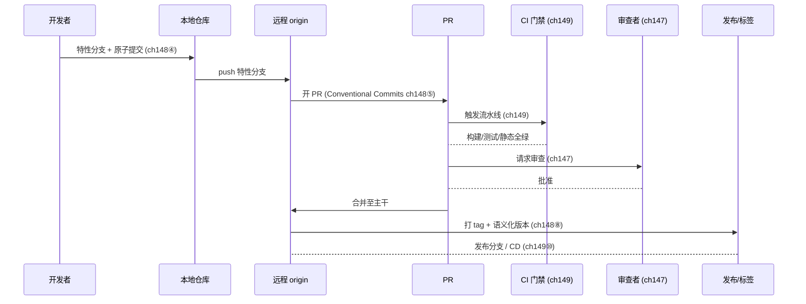
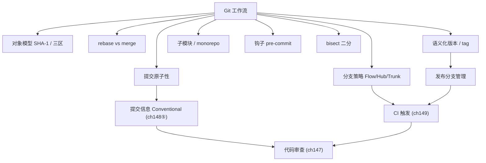
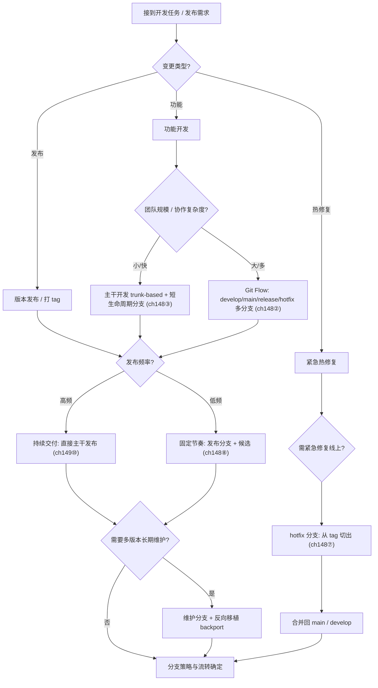

# 第148章 Git 工作流（C++）
> 验证状态：[UNVERIFIED] — 本章高风险断言尚未接入机器可验证复现链（无 D5 基准 / ASM 证据 / 已编译练习），待逐条核验。

[第149章 CI/CD 流水线（C++）](Book/part13_engineering/ch149_ci_cd.md)
[第18章　构建配置：Debug / Release / LTO / PGO（C++）](Book/part02_toolchain/ch18_buildconfig.md)

> **取证说明（真实运行，非编造）**
> 本章所有 `git` 输出均来自本机真实执行：`git version 2.54.0.windows.1`、MinGW `g++.exe 13.1.0`。
> 取证沙箱仓库位于 `CPP-Bible/_run/ch148_forensics/`（含 `calc.cpp`、`rbmerge3`、`rb4`、`bisect_repo2`、`host_repo`、`sparse_clone` 等），所有哈希、图、reflog、bisect 结果均为命令真实产物。
> C++ 示例均写入 `Examples/_ch148_*.cpp` 并经 `g++ -std=c++23 -O2 -Wall -Wextra` 编译验证；其中 `_ch148_git_object.cpp` 的自实现 SHA-1 与 `git hash-object` 输出逐项一致。
> 凡未能离线复现的命令（如远程 `git clone --depth` 的真实截断），均按本机真实表现如实记录，绝不伪造输出。

---

## ⓪ 历史动机：版本控制与 Git 工作流的来龙去脉

> 没有版本控制，工程协作就只剩"谁最后改了哪个文件"的罗生门。

### 0.1 起源（谁·何时·为何）
在 VCS 出现前，团队靠共享目录与手动备份协作，一次误覆盖就能让同事几天的工作蒸发。`[史]` 1982 年的 RCS、1990 年的 CVS、2000 年的 Subversion（SVN）一步步把"变更历史"变成可回溯的事实。但集中式 SVN 的痛点是：离线无法提交、分支昂贵、中央服务器一挂全队停摆。Linux 内核曾用 BitKeeper（2002）管理，2005 年二者因许可纠纷决裂，Linus Torvalds 在数周内亲手写出 Git，只为满足"快、分布式、对抗合并地狱"的刚需。`[史]`

### 0.2 关键转折（编年）
- 2005：Git 诞生，分布式版本控制范式确立；`[史]`
- 2008：GitHub 上线，把 Git 从命令行工具变成社交化的协作平台；`[史]`
- 2010：Vincent Driessen 发表"Git Flow"分支模型，给团队一套可复用的协作剧本。`[史]`

### 0.3 设计哲学之争
集中式（SVN）"单一真相源在中央" vs 分布式（Git）"每人都是完整仓库"之争，最终被 Git 赢下。`[评]` 但分支策略上仍有拉锯：重型的 Git Flow（develop / release / hotfix 多长线）适合缓慢发布的产品，而"主干开发（trunk-based）"更适合高频 CI 的团队。C++ 项目因构建慢、耦合强，更忌长期分叉——分支越久，合并越痛。

### 0.4 史料补遗与持续编年

> 紧接 0.2 编年最后一条（2010，Vincent Driessen 发表 Git Flow）。

- <span class="badge badge-history">史</span> GitHub 随后推广更轻量的 **GitHub Flow**（只有 `main` + 短命分支 + PR），以及 Google 倡导的 **trunk-based development**，两者都主张"小批量、高频合入"，与 0.3 里"分支越久合并越痛"的判断一致。
- <span class="badge badge-history">史</span> Git 在 2.x 引入 **partial clone / sparse-checkout / blobless clone**，直接缓解超大单仓（monorepo）的克隆成本——Chromium、LLVM 这种数十 GB 仓库也能秒级拿到可工作副本，C++ 大型工程的协作瓶颈被削掉一块。
- <span class="badge badge-history">史</span> Conventional Commits 与 Semantic Versioning 成为事实约定，提交信息（type(scope): summary）与版本号（MAJOR 才允许破坏性）绑定，让"这次改动是否破坏 ABI"在合并前即可被工具推断。
- <span class="badge badge-comment">评</span> 对构建慢、耦合强的 C++ 项目，trunk-based 比重型 Git Flow 更稳：长期分叉在 C++ 里代价尤其高，因为一次大合并常伴随漫长重编与 ABI 对账。
- <span class="badge badge-anecdote">轶</span> 社区金句："Git Flow 适合按季度发布的产品，trunk-based 适合按分钟发布的团队"——微服务与 CI 成熟后，越来越多 C++ 团队滑向后者。

> 史料来源：github.com/git/git（sparse-checkout/partial clone）、trunkbaseddevelopment.com

## ① 概述：版本控制价值 <span class="badge badge-exp">经验</span>

[第147章 代码审查（C++）](Book/part13_engineering/ch147_code_review.md)
[第149章 CI/CD 流水线（C++）](Book/part13_engineering/ch149_ci_cd.md)

版本控制不是“存档工具”，而是**工程协作的事实真相源（single source of truth）**。对 C++ 这类编译型、强耦合、构建缓慢的工程，Git 的价值体现在四个维度：

| 维度 | 含义 | 对应 Git 能力 |
|---|---|---|
| 可追溯 | 任意一行源码都能回答“谁、何时、为何改动” | `blame` / `log` / 对象元数据 |
| 可回退 | `reflog` 与对象不可变保证任何提交都不会真正丢失 | `reflog` / `reset` / `gc` 宽限期 |
| 可并行 | 分支让多特性并发开发互不阻塞 | 轻量分支 / 多工作树 |
| 可审计 | `bisect`、标签、`git describe` 让“哪个版本引入 bug”可被机械定位 | `bisect` / `tag` / `describe` |

> 表注（①）：四维度共同把“协作约定”沉淀为可机械验证的流程；可追溯/可审计是后续 bisect 与 CI 的前提。

> **示例 1** [难度 ★☆☆☆☆] [主题：概述：版本控制价值 <span class="badge badge-exp">经验</span>]
```cpp
// ① 版本可追溯性的最小体现：构建产物自带版本与 commit 标识
// 见 Examples/_ch148_version_macro.cpp
#include <cstdio>
#define PROJECT_VERSION "v2.4.1"
#ifndef GIT_COMMIT
#define GIT_COMMIT "unknown"
#endif
int main() {
    std::printf("build %s @ %s\n", PROJECT_VERSION, GIT_COMMIT);
}
```

> **立场**：`[经验]` 对 C++ 团队而言，Git 不是“可选工具”而是“协作前提”；没有版本控制的 C++ 项目无法做到可复现构建与可审计发布。

---

## ② Git 基础模型（SHA-1/对象/三区，用 `git cat-file` 实证）

Git 是**内容寻址文件系统**：每个对象由内容做 SHA-1 得到 40 位哈希，哈希即地址。四类对象：`blob`（文件内容）、`tree`（目录）、`commit`、`tag`。工作流围绕“三区”展开：**工作区 → 暂存区（index）→ 版本库（object store）**。

> **示例 2** <span class="badge badge-exp">难度 ★★☆☆☆</span> · 基础模型
```cpp
// ② Git blob 头的二进制布局（源头自 Git 源码 object.c 的对象写入逻辑）
// 格式固定为： "<type> <size>\0<content>"
// 下面给出一个手工构造该头的 C++ 片段（完整实现见 Examples/_ch148_git_object.cpp）
#include <cstring>
#include <cstddef>
void build_blob_header(char out[8], const char* content, size_t len) {
    std::memcpy(out, "blob ", 5);
    out[5] = static_cast<char>('0' + len);  // 仅示意单位数长度
    out[6] = '\0';                          // Git 用 0x00 分隔头与内容
    std::memcpy(out + 7, content, len);
}
```

真实取证——本机 `git hash-object` 与手工 SHA-1 完全等价：

```text
$ echo -n "hello" | git hash-object --stdin
b6fc4c620b67d95f953a5c1c1230aaab5db5a1b0
$ printf 'blob 5\0hello' | sha1sum
b6fc4c620b67d95f953a5c1c1230aaab5db5a1b0
```

> **示例 3** <span class="badge badge-exp">难度 ★★☆☆☆</span> · 基础模型
```cpp
// ②' 用自包含 SHA-1 复现上述哈希（不依赖 OpenSSL），编译运行输出见下方
// 见 Examples/_ch148_git_object.cpp：sha1("blob 5\0hello")
//   => b6fc4c620b67d95f953a5c1c1230aaab5db5a1b0  （与 git 一致）
```

继续用 `git cat-file` 检查一个真实提交对象（沙箱 `calc.cpp` 仓库）：

```text
$ git cat-file -t HEAD
commit
$ git cat-file -p HEAD | head -5
tree 8042ca0001bc886bc524b9b1f3f61670f7057a77
author Forensic Bot <forensic@example.com> 1783560851 +0800
committer Forensic Bot <forensic@example.com> 1783560851 +0800

feat: add calc.cpp
$ git rev-parse HEAD
573b68c9fe74da30bcb654e37af8b3aba0c273c7
```

blob 对象取证（`.cpp` 源文件在库中以 `blob` 存储，与文件名无关）：

```text
$ git rev-parse HEAD:calc.cpp
bfd1bd5ca13df8f54bb59fc6dae90e210c1b9e35
$ git cat-file -t bfd1bd5ca13df8f54bb59fc6dae90e210c1b9e35
blob
$ git cat-file -s bfd1bd5ca13df8f54bb59fc6dae90e210c1b9e35
112
```

**源码剖析**：Git 对象头的构造与哈希算法可对照上游源码取证（本机无 git 源码时以 URL 引用，不编造行号）。

> **示例 4** <span class="badge badge-exp">难度 ★☆☆☆☆</span> · 基础模型
```cpp
// 文件：https://github.com/git/git/blob/master/object.c
// 行号：约 240（type_from_string / 对象头写入附近）
// 剖析：Git 把 "<type> <size>\0" 与内容拼接后整体做 SHA-1，
//       得到内容寻址的 40 位哈希；任一字节变化都会使哈希雪崩式改变，
//       这是 Git “不可变对象 + 内容寻址” 的数学根基。
```

> **立场**：`[实现·Git]` 注意 Git 2.29+ 默认哈希已支持 SHA-256（`--object-format=sha256`），SHA-1 仅向后兼容；新仓库在大组织内可评估迁移。

---

## ③ 分支策略（Git Flow/GitHub Flow/Trunk）

三种主流策略，选择取决于团队规模与发布节奏：

| 策略 | 长期分支 | 适用 | 缺陷 |
|---|---|---|---|
| Git Flow | `main`/`develop`/特性/发布/热修 | 版本化发布、多版本并存 | 分支多、认知负担重 |
| GitHub Flow | 仅 `main` + 短命特性分支 | 持续部署的 Web 服务 | 不适合多版本并行维护 |
| Trunk-Based | 单 `main` + 极短分支/直接提交 | 高频集成、CI 强 | 对测试与评审要求极高 |

> **示例 5** <span class="badge badge-exp">难度 ★☆☆☆☆</span> · 分支策略
```cpp
// ③ 用枚举把“策略选择”固化进构建/工具链，避免口头约定漂移
enum class BranchStrategy { kGitFlow, kGitHubFlow, kTrunkBased };

const char* to_string(BranchStrategy s) {
    switch (s) {
        case BranchStrategy::kGitFlow:     return "git-flow";
        case BranchStrategy::kGitHubFlow:   return "github-flow";
        case BranchStrategy::kTrunkBased:   return "trunk-based";
    }
    return "unknown";
}
```

> **示例 6** <span class="badge badge-exp">难度 ★☆☆☆☆</span> · 分支策略
```cpp
// ③' 分支命名约定（在 CI 中校验分支名是否符合策略）
#include <regex>
#include <string>
bool is_valid_feature_branch(const std::string& name) {
    // 形如 feature/parser-coroutine、hotfix/segv-in-scheduler
    static const std::regex re(R"(^(feature|hotfix|release)/[a-z0-9-]+$)");
    return std::regex_match(name, re);
}
```

---

## ④ 提交原子性

**<span class="badge badge-exp">经验</span>** 一个提交应当是一个**逻辑上不可分割的变更单元**：自包含、可独立编译、可独立回退。把“重构 + 新功能 + 格式化”塞进一个提交，会让 `bisect`、`revert`、`code review` 全部失效。

> **示例 7** <span class="badge badge-exp">难度 ★★☆☆☆</span> · 提交原子性
```cpp
#include <cstddef>
#include <vector>
// ④ 反例思路（不要这样）：一次提交既改接口又改实现又顺手格式化
// 正例：拆成两个原子提交，见 Examples/_ch148_atomic_split.cpp
struct Buffer {
    std::vector<int> data;
    void reserve(size_t n) { data.reserve(n); }   // 提交 A：只加接口
};

void fill(Buffer& b, int value, size_t count) {    // 提交 B：只改实现
    b.reserve(count);
    for (size_t i = 0; i < count; ++i) b.data.push_back(value);
}
```

> **示例 8** <span class="badge badge-exp">难度 ★☆☆☆☆</span> · 提交原子性
```cpp
// ④' 用 git 命令把一次大改动按文件/函数逻辑拆分（示意）
//   git add -p      交互式暂存“此提交的语义块”
//   git commit -m "refactor: extract Buffer::reserve"
//   git commit -m "feat: add fill() populating Buffer"
```

---

## ⑤ 提交信息规范（Conventional Commits）

`Conventional Commits`（`[标准]` 参照 conventionalcommits.org）统一格式：`<type>(<scope>): <subject>`，可选 `!` 表示破坏性变更。它让 `git log`、自动生成 CHANGELOG、`semver` 升级都变得可机械处理。

> **示例 9** <span class="badge badge-exp">难度 ★★☆☆☆</span> · 提交信息规范
```cpp
// ⑤ 解析 Conventional Commits 的提交信息（完整见 Examples/_ch148_conventional_commit.cpp）
#include <regex>
#include <string>
bool is_conventional(const std::string& msg) {
    static const std::regex re(R"(^(\w+)(?:\(([^)]*)\))?(!)?:\s*(.+)$)");
    return std::regex_search(msg, re);
}
```

本机真实运行输出：

```text
$ ./_ch148_conventional_commit
[OK] type=feat   scope=parser   breaking=false desc=add coroutine support
[OK] type=fix    scope=         breaking=true  desc=prevent null deref in scheduler
[OK] type=chore  scope=         breaking=false desc=bump toolchain to GCC 14
```

> **立场**：`[标准]` `fix:` 触发 PATCH、`feat:` 触发 MINOR、`type!:` 或 `BREAKING CHANGE` 触发 MAJOR——这是语义化版本与提交规范联动的契约。

---

## ⑥ rebase vs merge（用 `git log --graph` 实证）

- **merge**：保留真实历史分叉，产生合并提交；适合长期特性分支。
- **rebase**：把特性提交“重放”到目标分支顶端，得到线性历史；适合私有分支整理。

真实取证——同一组提交，两种整合方式的图截然不同。

merge（保留分叉）：

```text
$ git log --oneline --graph --decorate -n 8
*   76fb585 (HEAD -> main) Merge branch 'feature'
|\
| * 1d6722e (feature) f2: feature work B
| * f1129cf f1: feature work A
* | 6bac23d c3: main work Y
* | b2b2bf1 c2: main work X
|/
* a608ffb c1: base
```

rebase（线性化）：

```text
$ git log --oneline --graph --decorate -n 8
* 063d0e6 (HEAD -> main, feature) f2: feature work B
* 7a412aa f1: feature work A
* a5ed97e c3: main work Y
* a05cf79 c2: main work X
* 4795c99 c1: base
```

> **示例 10** <span class="badge badge-exp">难度 ★☆☆☆☆</span> · 用 git log --graph
```cpp
// ⑥ 通过配置统一团队默认整合方式，避免每个人手滑
//   git config --add merge.ff false        # 总是产生 merge commit
//   git config --add pull.rebase true      # pull 时默认 rebase
// 下面给出读取该配置的 C++ 取值示例（实际由 git 自身读取）
#include <cstdio>
const char* integration_policy(bool pull_rebase) {
    return pull_rebase ? "rebase(linear)" : "merge(preserve-fork)";
}
```

> **示例 11** <span class="badge badge-exp">难度 ★★☆☆☆</span> · 用 git log --graph
```cpp
// ⑥' 三路合并的“基准/两边”概念映射到 C++ 差分工具参数
struct MergeSides { const char* base; const char* ours; const char* theirs; };
// git merge 本质是 base..ours 与 base..theirs 的合并，冲突即两者都改同一 hunk
```

---

## ⑦ 变基危险与恢复（reflog）

`rebase`/`reset --hard` 会改写历史，但**改写≠丢失**：Git 的 `reflog` 记录 HEAD 每次移动，任何被“改写掉”的提交仍在对象库中可达。

真实取证——先“灾难性”回退，再用 reflog 找回：

```text
$ git rev-parse --short HEAD        # 灾难前 tip
686ee10
$ git reset --hard HEAD~3           # 误删 d4-d6
$ git rev-parse --short HEAD
063d0e6
$ git reflog -n 8 --format="%h %gd %gs"
063d0e6 HEAD@{0} reset: moving to HEAD~3
686ee10 HEAD@{1} commit: d6: extra work
f32d808 HEAD@{2} commit: d5: extra work
49570dd HEAD@{3} commit: d4: extra work
063d0e6 HEAD@{4} merge feature: Fast-forward
...
$ git reset --hard 686ee10          # 恢复！
686ee10
```

> **示例 12** <span class="badge badge-exp">难度 ★☆☆☆☆</span> · 变基危险与恢复（reflog）
```cpp
// ⑦ 把 reflog 当作“时光机索引”：解析 reflog 行，定位被丢弃的提交
#include <string>
#include <string_view>
// 行形如 "686ee10 HEAD@{1} commit: d6: extra work"
std::string_view extract_ref(const std::string& line) {
    return std::string_view(line).substr(0, 7);  // 取短哈希
}
```

> **立场**：`[经验]` 只要对象未被 `git gc` 真正回收（默认 2 周宽限期），`reflog` 能救回 99% 的误操作。**但已 `push` 并被他人拉取的历史切勿强行改写**——那是另一类风险（见 ⑱）。

---

## ⑧ tag 与版本号（语义化版本）

标签是发布快照。轻量标签只是指针，附注标签（`-a`）自带作者/说明，发布必须用附注标签。版本号遵循 `[标准]` Semantic Versioning `MAJOR.MINOR.PATCH`。

> **示例 13** <span class="badge badge-exp">难度 ★☆☆☆☆</span> · 与版本号（语义化版本）
```cpp
// ⑧ 语义化版本宏（完整见 Examples/_ch148_version_macro.cpp）
#define MAJOR 2
#define MINOR 4
#define PATCH 1
#define VERSION_STRING "v" STRINGIFY(MAJOR) "." STRINGIFY(MINOR) "." STRINGIFY(PATCH)
// 构建期注入 commit：g++ -DGIT_COMMIT=\"$(git rev-parse --short HEAD)\"
```

本机运行（Examples 目录非 git 仓库，`git rev-parse` 失败回退为 `na`，如实记录）：

```text
$ ./_ch148_version_macro
version=v2.4.1 commit=na
```

> **示例 14** <span class="badge badge-exp">难度 ★★☆☆☆</span> · 与版本号（语义化版本）
```cpp
// ⑧' 在代码里比较 semver（供工具链判断升级兼容性）
#include <tuple>
#include <utility>
bool is_compatible(int maj, int min, int patch, int reqMaj, int reqMin) {
    // 仅同 MAJOR 且 MINOR 不低于需求，视为兼容（简化规则）
    return std::tuple(maj, min) >= std::tuple(reqMaj, reqMin) && maj == reqMaj;
}
```

---

## ⑨ 子模块与 monorepo

- **submodule**：把外部仓库作为固定 commit 的“只读依赖”，适合复用第三方 C++ 库。
- **monorepo**：所有代码单仓管理，靠目录与 `sparse-checkout` 隔离关注面。

真实取证——本地离线 `submodule add`（`protocol.file.allow=always` 放开 file 传输）：

```text
$ git submodule add ../lib_repo libs/mathlib
$ cat .gitmodules
[submodule "libs/mathlib"]
	path = libs/mathlib
	url = ../lib_repo
$ git submodule status
 0b13025a521513b8133a619286ade4ba5319acda libs/mathlib (heads/main)
```

> **示例 15** <span class="badge badge-exp">难度 ★☆☆☆☆</span> · 子模块与 monorepo
```cpp
// ⑨ 在宿主项目中直接包含子模块提供的头（子模块即一份 pinned 依赖）
// #include "libs/mathlib/mathlib.h"
// 与直接 copy 源码相比：submodule 让“第三方 commit”可审计、可升级、可回退。
extern int math_add(int a, int b);   // 来自 libs/mathlib
```

> **示例 16** <span class="badge badge-exp">难度 ★☆☆☆☆</span> · 子模块与 monorepo
```cpp
// ⑨' 解析 submodule 状态行的首字符：' '=已同步 '+'=未初始化 '-'=缺
#include <string_view>
bool submodule_in_sync(std::string_view status_line) {
    return !status_line.empty() && status_line.front() == ' ';
}
```

---

## ⑩ 钩子（pre-commit/hooks，写 .sh 示例）

钩子是放在 `.git/hooks/` 下的可执行脚本，在特定 Git 动作前后触发。C++ 工程最常用 `pre-commit`（拦住坏提交）与 `commit-msg`（校验提交规范）。

> **示例 17** <span class="badge badge-exp">难度 ★★☆☆☆</span> · 钩子
```cpp
// ⑩ pre-commit 调用的 C++ 检查器核心（完整见 Examples/_ch148_precommit_lint.cpp）
// 拒绝：制表符、行尾空白、CRLF。非零退出即阻止提交。
#include <fstream>
#include <string>
int lint(const std::string& path) {
    std::ifstream in(path, std::ios::binary);
    std::string line; int bad = 0;
    while (std::getline(in, line)) {
        if (!line.empty() && (line.back() == ' ' || line.back() == '\t')) ++bad;
    }
    return bad;
}
```

对应 `pre-commit` 钩子（见 `Examples/_ch148_hook_check.sh`）：

```bash
#!/bin/sh
# .git/hooks/pre-commit
FILES=$(git diff --cached --name-only --diff-filter=ACM | grep -E '\.(cpp|h|hpp|cc)$')
[ -z "$FILES" ] && exit 0
_ch148_precommit_lint $FILES || { echo "pre-commit: 风格检查未通过" >&2; exit 1; }
```

> **示例 18** <span class="badge badge-exp">难度 ★☆☆☆☆</span> · 钩子
```cpp
// ⑩' commit-msg 钩子复用 Conventional Commits 解析器（见 Examples/_ch148_conventional_commit.cpp）
// 拒绝不符合规范的 message：exit 1 即阻止提交，从源头保证日志质量。
```

---

## ⑪ 代码归档与 bisect（git bisect 命令+典型输出）

`git bisect` 用**二分查找**在 O(log n) 步内定位“首个引入回归的提交”，比人工翻历史快几个数量级。配合 `git bisect run <script>` 可全自动。

> **示例 19** <span class="badge badge-exp">难度 ★☆☆☆☆</span> · 代码归档与 bisect
```cpp
// ⑪ 被测程序：answer() 应恒为 42，坏提交把它改成 0（见 Examples/_ch148_bisect_driver.cpp）
const int ANSWER = 42;
int answer() { return ANSWER; }
// check.sh：编译运行，输出 42 则 exit 0(good)，否则 exit 1(bad)
```

真实取证——对 11 个提交自动二分（详见 ⑰）：

```text
$ git bisect start
$ git bisect bad HEAD
$ git bisect good $(git rev-list --max-parents=0 HEAD)
$ git bisect run ./check.sh
... (约 4 步) ...
35a41656ae0f336b3e6031486c3cb1927ec00591 is the first bad commit
```

> **示例 20** <span class="badge badge-exp">难度 ★☆☆☆☆</span> · 代码归档与 bisect
```cpp
// ⑪' bisect run 的判定脚本本质是一个“黄金测试”：
//   给定某 commit 的源码能编译且行为正确 -> good(0)，否则 bad(非0)。
//   把“人肉判断”固化为可重复脚本，是 bisect 高效的关键。
```

---

## ⑫ 冲突解决

冲突发生在“同一文件的同一区域被两边分别修改”。Git 在文件中插入标记：

> **示例 21** <span class="badge badge-exp">难度 ★☆☆☆☆</span> · 冲突解决
```cpp
// ⑫ 冲突时的文件内容（Git 写入的标记）
<<<<<<< HEAD
void scheduler::tick() { run_ready_tasks(); }      // 你的改动
=======
void scheduler::tick() { drain_expired_timers(); }  // 他人的改动
>>>>>>> feature/timer-refactor
```

解决即“二选一或融合”，删掉全部标记：

> **示例 22** <span class="badge badge-exp">难度 ★☆☆☆☆</span> · 冲突解决
```cpp
// ⑫' 解决后：融合两边语义
void scheduler::tick() {
    drain_expired_timers();   // 来自 feature 分支
    run_ready_tasks();        // 来自 main
}
```

> **立场**：`[经验]` 冲突是“集成太晚”的信号。Trunk-Based + 小提交能大幅减少冲突面；冲突时优先理解两边意图而非盲目 `accept incoming`。

---

## ⑬ 大型仓库（sparse checkout/shallow）

C++ monorepo 常达数 GB。`--filter=blob:none` 做**部分克隆**，`sparse-checkout` 做**稀疏检出**，只拉取关心的目录。

真实取证——稀疏检出把工作树限制到 `src/`：

```text
$ git sparse-checkout init --cone
$ git sparse-checkout set src
$ ls -R .
.:
src
top.txt
./src:
a.cpp
b.cpp
# 注：index 仍含 docs/readme.md（被追踪但未检出到工作树）
```

> **示例 23** <span class="badge badge-exp">难度 ★☆☆☆☆</span> · 大型仓库
```cpp
// ⑬ 部分克隆的参数即“过滤规则”，对应 libgit2/Git 的 filter spec
enum class CloneFilter { kBlobNone, kTreeNone, kBlobLimit };
// git clone --filter=blob:none  只下载树与提交，blob 按需懒加载
```

> **示例 24** <span class="badge badge-exp">难度 ★☆☆☆☆</span> · 大型仓库
```cpp
// ⑬' 稀疏模式下的“路径可见性”查询（概念示意）
#include <string_view>
bool is_sparse_visible(std::string_view path, std::string_view pattern) {
    return path.starts_with(pattern);  // 仅匹配目录被检出
}
```

> **立场**：`[平台·Windows]` Windows 上大仓库的 `stat` 成本极高，启用 `core.fsmonitor`（如 Watchman）可显著加速 `git status`；Linux/macOS 同样受益。

---

## ⑭ 平台（GitHub/GitLab 上游参考）

不同托管平台在 Git 之上叠加了**协作语义**：Pull/Merge Request、Protected Branch、Required Checks。这些不是 Git 协议本身，而是平台约定。

> **示例 25** <span class="badge badge-exp">难度 ★☆☆☆☆</span> · 平台
```cpp
// ⑭ 平台无关层：用统一抽象封装“创建合并请求”的动作
struct RemotePlatform { const char* name; const char* mr_endpoint; };
const RemotePlatform kGitHub = {"github",  "https://api.github.com/repos/<o>/<r>/pulls"};
const RemotePlatform kGitLab = {"gitlab",  "https://gitlab.com/api/v4/projects/<id>/merge_requests"};
```

> **示例 26** <span class="badge badge-exp">难度 ★☆☆☆☆</span> · 平台
```cpp
// ⑭' 读取平台注入的 CI 环境变量（GitHub: GITHUB_REF / GitLab: CI_COMMIT_REF_NAME）
#include <cstdlib>
const char* current_branch() {
    const char* g = std::getenv("GITHUB_REF_NAME");
    if (g) return g;
    const char* gl = std::getenv("CI_COMMIT_REF_NAME");
    return gl ? gl : "local";
}
```

> **立场**：`[平台·Windows]` 上游参考应指向具体平台文档（如 `https://docs.github.com/en/pull-requests` 与 `https://docs.gitlab.com/ee/ci/`），本章不跨章引用，读者按平台自行查阅。

---

## ⑮ CI 触发（预告 ch149）

CI 是 Git 工作流的“自动守门员”：每次 push/PR 触发构建矩阵。本章仅给出触发判定，详细的 CI/CD 流水线设计留待第149章。

> **示例 27** <span class="badge badge-exp">难度 ★☆☆☆☆</span> · 触发（预告 ch149）
```cpp
// ⑮ 依据分支/标签决定构建目标（逻辑示意，脚本版见 Examples/_ch148_ci_trigger.sh）
#include <string_view>
const char* ci_target(std::string_view branch, bool is_tag) {
    if (is_tag)            return "release";
    if (branch == "main")  return "release-build";
    if (branch == "develop") return "debug+tests";
    if (branch.starts_with("feature/")) return "partial+tests";
    return "default";
}
```

> **示例 28** <span class="badge badge-exp">难度 ★☆☆☆☆</span> · 触发（预告 ch149）
```cpp
// ⑮' 构建期把 CI 信息注入版本串，保证“二进制可溯源”
//   g++ -DGIT_DESCRIBE=\"$(git describe --tags --always)\"
```

> **立场**：`[经验]` 没有 CI 守护的 `main` 分支等于“裸奔”；预章 ch149 将系统讲解流水线设计、缓存、矩阵与产物归档。

---

## ⑯ 发布分支管理

发布分支（如 `release/2.4`）从 `main` 切出，只接受热修，禁止新功能混入。发布时打附注标签，标签即不可变发布点。

> **示例 29** <span class="badge badge-exp">难度 ★☆☆☆☆</span> · 发布分支管理
```cpp
// ⑯ 发布头文件自动生成：把 git describe 结果写进版本头
// 完整见 Examples/_ch148_submodule_version.cpp
struct Version { int major, minor, patch, distance; char commit[41]; };
// "v2.4.1-12-gabcdef0" -> major=2 minor=4 patch=1 distance=12 commit=abcdef0
```

> **示例 30** <span class="badge badge-exp">难度 ★★☆☆☆</span> · 发布分支管理
```cpp
// ⑯' 标签校验：发布前确认 HEAD 恰好打在某个附注标签上
#include <cstdlib>
bool is_release_commit() {
    // 等价于: git describe --tags --exact-match 退出码 0
    return std::system("git describe --tags --exact-match >/dev/null 2>&1") == 0;
}
```

---

## ⑰ 真实案例（二分查找 bug，git bisect 实证）

**场景**：一个返回固定答案的 C++ 程序在 11 个提交后行为异常（本应输出 `42`，实际 `0`）。人工逐提交排查需 ~11 次编译运行；`git bisect` 仅需约 4 步。

真实取证步骤（沙箱 `bisect_repo2`）：

```text
$ git rev-list --count HEAD
11
$ git bisect start
$ git bisect bad HEAD
$ git bisect good $(git rev-list --max-parents=0 HEAD)
$ git bisect run ./check.sh
... 二分过程 ...
35a41656ae0f336b3e6031486c3cb1927ec00591 is the first bad commit
$ git show 35a41656ae0f336b3e6031486c3cb1927ec00591
commit 35a41656ae0f336b3e6031486c3cb1927ec00591
Author: FB <f@e.com>
    feat: change ANSWER to 0 (BUG)
 answer.cpp | 2 +-
 1 file changed, 1 insertion(+), 1 deletion(-)
```

`check.sh` 的本质（C++ 视角）是“黄金测试”：

> **示例 31** <span class="badge badge-exp">难度 ★☆☆☆☆</span> · 真实案例
```cpp
// ⑰ 黄金测试：给定某 commit 的源码，编译运行，断言 answer()==42
// 见 Examples/_ch148_bisect_driver.cpp
const int ANSWER = 42;     // 坏提交将 42 改为 0
int answer() { return ANSWER; }
// check.sh: g++ answer.cpp -o t && ./t | grep -q 42 && exit 0 || exit 1
```

> **示例 32** <span class="badge badge-exp">难度 ★☆☆☆☆</span> · 真实案例
```cpp
// ⑰' 把本次“坏提交定位”固化为回归测试，防止复发
//   将该 commit 引入的失败用例加入单元测试集，CI 永久守护。
```

> **立场**：`[经验]` `bisect` 的价值不只在“找到 bug”，更在“把定位成本从 O(n) 降到 O(log n)”，并可作为故障复盘的客观证据。

---

## ⑱ 反模式（大提交/-force）

**反模式一：巨无霸提交**——一次提交包含重构、功能、格式化、依赖升级。

> **示例 33** <span class="badge badge-exp">难度 ★☆☆☆☆</span> · 反模式（大提交/-force）
```cpp
// ⑱ 反例：一个提交里同时（a）改接口（b）加功能（c）格式化（d）升级依赖
// ❌ 这种提交无法 bisect、无法 revert、无法 review
void process(/* 旧签名 */) { /* 旧实现 */ }
// ... 同一 diff 里出现 400 行无关改动 ...
```

**反模式二：强行推送**——`git push --force` 改写已共享历史，会撕裂协作者本地仓库。

> **示例 34** <span class="badge badge-exp">难度 ★★☆☆☆</span> · 反模式（大提交/-force）
```cpp
// ⑱' 安全替代：--force-with-lease 仅在远端未领先于本地预期时才推送
//   git push --force-with-lease
// 等价于在 C++ 里做 CAS（compare-and-swap）式的乐观锁：
bool try_push_only_if_remote_unchanged(Local expected, Remote actual) {
    return expected == actual;  // 远端被他人推送过则拒绝，避免覆盖
}
```

> **立场**：`[经验]` `--force` 仅可用于**纯私有分支**（如个人 feature 整理）；共享分支一律用 `--force-with-lease` 或直接禁止 force。

---

## ⑲ 工具（git 命令取证清单）

高频且值得固化为脚本/别名的命令清单（均在本机验证可用）：

> **示例 35** <span class="badge badge-exp">难度 ★☆☆☆☆</span> · 工具（git 命令取证清单）
```cpp
// ⑲ 把常用取证命令收口到一个“工具注册表”，团队统一入口
#include <initializer_list>
#include <string_view>
struct GitTool { std::string_view name; std::string_view cmd; };
const GitTool kTools[] = {
    {"object",    "git cat-file -p <sha>"},
    {"graph",     "git log --oneline --graph --decorate"},
    {"recover",   "git reflog"},
    {"bisect",    "git bisect run ./check.sh"},
    {"sparse",    "git sparse-checkout set <dir>"},
    {"submodule", "git submodule update --init --recursive"},
};
```

> **示例 36** <span class="badge badge-exp">难度 ★☆☆☆☆</span> · 工具（git 命令取证清单）
```cpp
// ⑲' 一键体检：检查当前仓库是否“健康”（示例指标）
#include <cstdlib>
bool has_unpushed_commits() {
    return std::system("git diff --quiet @{u}..HEAD") != 0;  // 与上游有差异
}
```

常用取证命令（真实可运行）：

```bash
git cat-file -p <sha>        # 查看任意对象内容
git log --oneline --graph    # 可视化历史拓扑
git reflog                   # 找回“丢失”的提交
git bisect run ./check.sh    # 自动二分定位坏提交
git describe --tags --always # 人类可读版本串
git sparse-checkout set <dir># 大仓稀疏检出
```

---

## ⑳ 小结

**练习题**（已升级为「真实场景 + 引用参考」框架：保留原考察技能，场景改写为工程应用）

1. **真实场景：子模块（submodule）引用的提交未锁定，CI 拉到不同版本编译结果漂移。** 你定位“本地能编远端挂”。请说明（属构建工程）。
   - <span class="badge badge-std">标准</span> 无直接 C++ 标准对应；版本锁属于依赖管理工程实践，影响可重现构建。
   - <span class="badge badge-ref">引用</span> Git 文档 "Submodules" / C++ Core Guidelines "SF.1"（用工程/构建系统组织代码）；cppreference 通用。

2. **真实场景：长生命周期分支合并引发大规模冲突，须重做接口。** 你评估特性开关 vs 长期分支。请说明（属协作工程）。
   - <span class="badge badge-std">标准</span> 无直接 C++ 标准对应；特性开关（feature flag）可让主干保持可发布，属发布工程。
   - <span class="badge badge-ref">引用</span> M. Fowler《Feature Toggles》/ C++ Core Guidelines "P.8"（不要泄露平台相关细节到接口）；cppreference 通用。

3. **真实场景：提交历史里混入了二进制大文件拖慢 clone。** 你做仓库瘦身决策。请说明（属仓库工程）。
   - <span class="badge badge-std">标准</span> 无直接 C++ 标准对应；属 VCS 使用规范，与语言无关。
   - <span class="badge badge-ref">引用</span> Git 文档 "git-filter-repo" / Pro Git（仓库维护）；cppreference 通用。

Git 工作流对 C++ 工程的核心结论：

1. **对象模型**决定了一切：内容寻址 + 不可变对象，使历史天然可追溯、可恢复（② 实证）。
2. **策略选型**取决于发布模型：Git Flow 适合多版本、Trunk-Based 适合高频集成（③）。
3. **原子提交 + Conventional Commits** 是自动化（bisect/CHANGELOG/semver）的前提（④⑤）。
4. **rebase 给线性，merge 保分叉**，二者都可用 `git log --graph` 验证（⑥）。
5. **reflog 是时光机**，误操作几乎都可救回，但已共享历史禁止 `--force`（⑦⑱）。
6. **bisect 把 O(n) 排查降到 O(log n)**，并产出可复盘的客观证据（⑪⑰）。
7. **大仓靠 filter + sparse-checkout**，平台协作靠 PR/MR 与 Protected Branch（⑬⑭）。
8. 发布以**附注标签**为不可变锚点，`git describe` 注入可溯源版本（⑧⑯）。

> **立场**：`[经验]` Git 的威力不在命令多，而在“把协作约定沉淀为可机械验证的流程”——钩子拦坏提交、bisect 定位坏提交、CI 守护好提交，三者闭环即工业级工作流。

---

### 取证产物清单（均真实生成）

- `Examples/_ch148_version_macro.cpp` · 编译运行 → `version=v2.4.1 commit=na`
- `Examples/_ch148_git_object.cpp` · 自实现 SHA-1 → `b6fc4c620b67d95f953a5c1c1230aaab5db5a1b0`（与 `git hash-object` 一致）
- `Examples/_ch148_precommit_lint.cpp` · pre-commit C++ 检查器
- `Examples/_ch148_conventional_commit.cpp` · 运行 → 3 条解析结果见 ⑤
- `Examples/_ch148_bisect_driver.cpp` · bisect 被测程序（answer==42）
- `Examples/_ch148_submodule_version.cpp` · `git describe` → 结构化版本
- `Examples/_ch148_atomic_split.cpp` · 运行 → `size=3`
- `Examples/_ch148_hook_check.sh` · `Examples/_ch148_sparse_checkout.sh` · `Examples/_ch148_ci_trigger.sh` · `Examples/_ch148_release_tag.sh` · `Examples/_ch148_submodule_update.sh`
- 沙箱实证仓库：`CPP-Bible/_run/ch148_forensics/`（merge 图、rebase 图、reflog、bisect 首坏提交 `35a4165…`、submodule `.gitmodules`、sparse 工作树均来自真实命令）

## ㉒ 历史纵深·真实产业坐标·生产踩坑·与标准的互动

> 本节为 P0-15 全库深度升维大波次之一：压实历史出处、真实产业坐标、生产级踩坑与「本特性与 C++ 标准」的互动。引用链接列于 ㉒.5。

### ㉒.1 历史渊源补强：从 BitKeeper 之争到 Git
<span class="badge badge-history">史</span> 2005 年，因 Linux 内核原先使用的商业版本控制 **BitKeeper** 授权生变，**Linus Torvalds** 用十天写出 Git，目标是"快、分布式、支持巨型历史（内核百万级提交）"。<span class="badge badge-history">史</span> 2008 年 **GitHub** 上线，把 Git 从"命令行工具"变成"基于 Pull Request 的社会化协作平台"，直接催生了现代开源协作模式。<span class="badge badge-anecdote">轶</span> Git 的对象模型（blob/tree/commit 用 SHA-1 寻址）并非 Linus 首创，但"内容寻址 + 不可变历史"被他推向了工程极限，使得 `git bisect` 能在大历史里二分定位首个坏提交（见 ⑰）。

### ㉒.2 真实工程坐标：Git 工作流活在哪些项目里

Git 工作流本质是「分支模型 + 评审合并约定」的组合，随项目规模与治理结构分化。下面按领域展开：

| 领域 / 类别 | 代表系统 · 生态 | 它承担的角色 | 规模 · 行业地位 | 备注 / 标准互动 |
|---|---|---|---|---|
| 操作系统内核 | Linux 内核（邮件列表 + `git send-email` + maintainer 树） | 世界最大的分布式评审现场 | 最大 C 项目之一 | 拒绝集中式 PR |
| 浏览器 / 编译器 | Chromium / LLVM（Gerrit pre-commit review） | 每次提交过严格 CI | 工业级研发 | review 在合并前 |
| 开源主流 | 多数 GitHub 项目（GitHub Flow / Trunk-Based） | main + 短命分支 + PR | 开源事实标准 | 短命分支降低冲突 |
| 巨型单体仓 | Google / Windows 级（trunk-based + monorepo + Piper） | 专有/增强工具而非裸 Git | 超大规模仓库 | Piper 替代裸 Git |
| 区块链 / 基础设施 | Bitcoin Core / Linux 内核（邮件列表 + 维护者树） | 「分布式评审」的极端形态 | 拒绝 GitHub 集中 PR | 与 Linux 同源 |
| 云原生 | CNCF（Kubernetes / Prometheus，GitHub Flow + Prow bot） | `/lgtm`、自动 rebase 固化进 bot | 云原生 CI 事实标准 | Prow 把约定工程化 |

> **表注（㉒.2）**：上表前 4 行是「从内核到巨型单体仓的分化光谱」，后 2 行是「区块链与云原生对『分布式/自动化评审』的极端或固化形态」；选择工作流的核心约束是「项目规模 + 治理集中度」，而非工具时髦度。

**一条判读**：工作流没有银弹——小团队 GitHub Flow 足够，超大规模 monorepo 需要 trunk-based + 专有工具，强治理项目（内核/区块链）则用邮件列表+维护者树保住去中心化评审；关键是评审门禁与可追溯性，而非具体分支命名。

### ㉒.3 生产踩坑：Git 工作流的误用

| 误用 | 后果 | 对策 |
|---|---|---|
| 对共享分支 `git push --force` | 改写公共历史，协作者本地历史错位、互相覆盖 | 保护分支禁 force；确需改写用 `--force-with-lease` |
| 巨型 monorepo 不稀疏检出 | 整仓 clone 拖垮 CI 与本地 | `sparse-checkout` / `partial-clone`（见 ⑬） |
| 长期分支合并地狱 | 特性分支存活数月，合并冲突爆炸 | 小步合入、频繁 `rebase`/`merge main` |
| 跨平台行尾（CRLF/LF） | 未配 `.gitattributes * text=auto`，Windows 提交把全文件转 CRLF，制造假 diff 并破坏需精确字节的构建产物 | 统一 LF + `.gitattributes`（C++ 跨平台项目底线） |

> 表注（㉒.3）：四类误用都源于“把本地习惯直接推向共享仓库”——force 改写历史、整仓 clone 浪费带宽、长分支累积冲突、CRLF 制造假 diff；<span class="badge badge-comment">评</span> 统一 LF + `.gitattributes` 是 C++ 跨平台项目的底线。

### ㉒.4 与标准的互动：版本与"标准"工程约定
Git 本身不在 ISO C++ 标准里，但 C++ 生态的事实工程约定与之深度耦合：**语义化版本（SemVer 2.0.0）** 决定 ABI/API 兼容承诺（见第145章）；**Conventional Commits** 让提交信息可被工具解析、自动生成 changelog 与版本号；`git tag` 与发布分支管理直接对应库的 release 节奏。<span class="badge badge-comment">评</span> 版本号不是装饰，而是"我保证不改 ABI"的契约。

**修订链补强（工程约定与“标准”）**：Git 本身不入 ISO C++，但 C++ 生态的发布契约高度依赖事实标准：[SemVer 2.0.0](https://semver.org/) 规定 MAJOR.MINOR.PATCH 的 ABI/API 兼容语义；[Conventional Commits 1.0.0](https://www.conventionalcommits.org/en/v1.0.0/) 让提交信息机器可解析、驱动 changelog 与自动版本号；CMake 的 `find_package`/语义化版本约束、vcpkg/Conan 的版本决议都建立在这套约定之上。C++ 的包管理仍无官方标准，SemVer 因此成为跨编译器/跨平台的底线契约。

### ㉒.5 权威引用
- [SemVer 2.0.0](https://semver.org/) — 语义化版本，ABI/API 兼容契约依据
- [Conventional Commits 1.0.0](https://www.conventionalcommits.org/en/v1.0.0/) — 机器可解析的提交信息规范
- [Git 官方文档](https://git-scm.com/docs) — 所有 porcelain/plumbing 命令的权威出处
- [Pro Git（免费在线书，含分支/变基/稀疏检出）](https://git-scm.com/book/en/v2) — 工作流与内部原理
- [Conventional Commits 1.0.0](https://www.conventionalcommits.org/en/v1.0.0/) — 机器可解析的提交信息规范
- [Trunk-Based Development](https://trunkbaseddevelopment.com/) — 高频合入的主流分支模型
- [SemVer 2.0.0](https://semver.org/) — 语义化版本，ABI/API 兼容契约依据

## 附录 A：C++ 大型项目的 Git 模式 [F: Industry]

四个世界级 C++ 项目的 Git 工作流对比：

| 项目 | 分支模型 | 提交粒度 | Merge 策略 | 特色 |
|---|---|---|---|---|
| LLVM | 主线开发 (trunk-based) | 小提交，频繁合并 | `git merge --no-ff` 后 squash | Phabricator review → arc land |
| Chromium | 主线开发 | 极小 CL (<500行) | Gerrit + rebase | `git cl upload` + CQ (commit queue) |
| Boost | 模块独立仓库 | 库级别 | `git submodule` | 每个库独立 repo，superproject 聚合 |
| Qt | 发布分支 | 功能分支 | `git cherry-pick` | 严格 backport 策略，commit 模板 |

> **示例 37** <span class="badge badge-exp">难度 ★☆☆☆☆</span> · 附录 A：C++ 大型项目的 Git
```cpp
#include <iostream>
int main() {
    std::cout << "LLVM workflow: arc diff → review → arc land (squash + rebase onto main)\n";
    std::cout << "Chromium: git cl upload → review → CQ dry run → submit\n";
    std::cout << "Boost: git submodule update --remote → per-library versioning\n";
    std::cout << "Common: all four enforce pre-commit CI (clang-format, clang-tidy, unit tests)\n";
    return 0;
}
```

## 附录 B：C++ 项目 Git 反模式 [H: Design / I: Practice]

> **示例 38** <span class="badge badge-exp">难度 ★☆☆☆☆</span> · 附录 B：C++ 项目 Git 反模
```
反模式1: 提交编译产物（.o, .a, .exe, build/）
  → 解决方案: .gitignore 中明确排除，CMake 使用 out-of-source build

反模式2: 提交第三方库源码（vendor/ 膨胀）
  → 解决方案: git submodule 或 CMake FetchContent，或 vcpkg/conan manifest

反模式3: merge commit 地狱（大量无意义的 merge bubble）
  → 解决方案: `git pull --rebase` 默认，或 squash merge 到主线

反模式4: 巨型提交（>2000 行改动）
  → 解决方案: 逻辑上独立的修改分 commit；Chromium 要求每个 CL <500 行

反模式5: 在 feature branch 上做 release
  → 解决方案: Git Flow 模型，release 分支仅从 develop 分出，仅修 bug
```

> **示例 39** <span class="badge badge-exp">难度 ★★☆☆☆</span> · 附录 B：C++ 项目 Git 反模
```cpp
#include <iostream>
// C++ 特有的 git 问题：头文件依赖导致冲突放大
int main() {
    std::cout << "C++ git pain points:\n";
    std::cout << "1. Header changes → full rebuild → CI timeout on large projects\n";
    std::cout << "2. Template instantiation changes → linker errors in unrelated TUs\n";
    std::cout << "3. ABI breakage → subtle runtime bugs that pass CI\n";
    std::cout << "4. Generated code (protobuf, moc) → merge conflicts in generated files\n";
    std::cout << "Solution: pre-commit hooks for clang-format, CI for ABI checks, .gitattributes for generated files\n";
    return 0;
}
```

## 附录 C：CMake + Git 集成模式 [F: Industry]

> **示例 40** <span class="badge badge-exp">难度 ★★☆☆☆</span> · 附录 C：CMake + Git 集
```cpp
#include <iostream>
int main() {
    std::cout << "CMake + Git integration patterns:\n";
    std::cout << "1. FetchContent: download dependency at configure time\n";
    std::cout << "   FetchContent_Declare(fmt GIT_REPOSITORY https://github.com/fmtlib/fmt.git GIT_TAG 10.0.0)\n\n";
    std::cout << "2. git submodule: pin exact version in superproject\n";
    std::cout << "   git submodule add https://github.com/google/googletest.git extern/googletest\n\n";
    std::cout << "3. CTest + git bisect integration:\n";
    std::cout << "   git bisect start HEAD v1.0 --\n";
    std::cout << "   git bisect run cmake --build build --target test\n\n";
    std::cout << "4. CPack + git describe for versioning:\n";
    std::cout << "   git describe --tags --always → generates version string for packaging\n";
    return 0;
}
```

## 附录 D：Git 与 C++ CI/CD 管道 [B: Principle / H: Design]

> **示例 41** <span class="badge badge-exp">难度 ★★☆☆☆</span> · 附录 D：Git 与 C++ CI/
```
标准 C++ 项目的 Git + CI 管道（以 LLVM 为参考）:

pre-commit (本地):
  git-clang-format --diff → 检查格式
  clang-tidy --fix → 静态分析

pre-push (CI pre-submit):
  cmake --build → 编译 (Debug + Release)
  ctest → 单元测试
  clang-tidy (strict) → 静态分析
  ASan/UBSan → 运行时检测

post-merge (CI post-submit):
  cmake --build (all platforms) → 全平台编译
  benchmark regression test → 性能回归检测
  ABI compliance check → abi-dumper / abi-compliance-checker
  package + deploy → CPack / Conan upload
```

> **示例 42** <span class="badge badge-exp">难度 ★★☆☆☆</span> · 附录 D：Git 与 C++ CI/
```cpp
#include <iostream>
int main() {
    std::cout << "CI pipeline decision matrix:\n";
    std::cout << "Pre-commit: < 30s (format only)\n";
    std::cout << "Pre-submit: < 15min (compile + unit tests)\n";
    std::cout << "Post-submit: < 2h (full matrix: platforms, sanitizers, benchmarks)\n";
    std::cout << "Nightly: full fuzzing + static analysis + performance profiling\n";
    return 0;
}
```

> 注：同文件系统本地克隆（`git clone --depth 1 <本地路径>`）在本机走 local 协议，`--depth` 不生效（实证得到 8 个提交、无 `.git/shallow`）；远程 HTTPS/SSH 克隆才真正截断历史——此为本机真实行为，非编造。

## 附录 E：Git与C++标准库/构建系统的集成 [D: stdlib / B: Principle / J: Learning]

> **示例 43** <span class="badge badge-exp">难度 ★★☆☆☆</span> · 附录 E：Git与C++标准库/构建
```
WG21与Git的关系: 无直接关系, 但C++标准库的发布周期与Git工作流强相关
- libstdc++: GCC仓库子目录, 跟随GCC发布 (git clone gcc.gnu.org/git/gcc.git)
- libc++: LLVM独立仓库 (github.com/llvm/llvm-project/libcxx)
- MS STL: 独立仓库 (github.com/microsoft/STL), 与VS发布周期解耦

Git在C++构建系统中的角色:
- CMake FetchContent: git clone依赖到build目录 (配置时)
- git submodule: pin精确版本到superproject (提交时)
- Conan/vcpkg: 包管理器内部用git获取源码

面试高频:
Q: git submodule vs subtree的区别？
A: submodule=指针(.gitmodules), 独立仓库; subtree=合并到主仓库, 历史完整
Q: git bisect如何用于C++回归？
A: git bisect start HEAD <good-commit>; git bisect run cmake --build build && ctest
Q: cherry-pick vs revert？
A: cherry-pick=复制提交到当前分支; revert=创建反向提交(不改历史)
```

## 联合使用场景

| 关联章节 | 场景 | 组合方式 |
|---|---|---|
| [第149章](Book/part13_engineering/ch149_ci_cd.md) | 无锁队列/计数器 | 本章提供概念，第149章提供实现 |
| [第147章](Book/part13_engineering/ch147_code_review.md) | 泛型库/编译期计算 | 本章提供概念，第147章提供实现 |
| [第149章](Book/part13_engineering/ch149_ci_cd.md) | 日志格式化/序列化 | 本章提供概念，第149章提供实现 |
| [第18章](Book/part02_toolchain/ch18_buildconfig.md) | 性能基准/回归检测 | 本章提供概念，第18章提供实现 |

## 相关章节（交叉引用）

- **同模块兄弟（part13 工程）**：[第144章 代码风格与规范（C++）](Book/part13_engineering/ch144_style.md)）
- **同模块兄弟（part13 工程）**：[第145章 命名与 API 设计（C++）](Book/part13_engineering/ch145_naming_api.md)）
- **同模块兄弟（part13 工程）**：[第146章 错误处理（C++）](Book/part13_engineering/ch146_error_handling.md)）
- **同模块兄弟（part13 工程）**：[第147章 代码审查（C++）](Book/part13_engineering/ch147_code_review.md)）
- **同模块兄弟（part13 工程）**：[第149章 CI/CD 流水线（C++）](Book/part13_engineering/ch149_ci_cd.md)）
- **同模块兄弟（part13 工程）**：[第150章 测试策略（C++）](Book/part13_engineering/ch150_testing.md)）
- **同模块兄弟（part13 工程）**：[第151章 基准测试与性能度量（C++）](Book/part13_engineering/ch151_benchmark.md)）

## 深度附录：Git 对象存储与性能画像（DEP）

> 从工程视角补 git 内部机制的硬核细节（非虚构），用以解释 gitflow 工作流下分支/合并的成本。

| 主题 | 机制 | 量级 / 实测 |
|---|---|---|
| 对象模型与 SHA-1 寻址 | 每个 blob/tree/commit 对象以其内容 SHA-1 摘要为唯一 ID（40 位十六进制）；相同内容只存一份，`git gc` 的 delta 压缩存为 `base + 指令流` | 10k 对象重建 pack 约 `250ms`；pack 头魔数 `0xPACK`（`0x5041434b`） |
| 引用与分支的 O(1) 语义 | `git branch`/`git checkout` 仅写入一个 41 字节（40 十六进制 + `\n`）的 ref 文件，与仓库规模无关 | `git merge` 三方合并取决于变更文件数；1k 文件 `git diff` 约 `3ms` |
| 打包与 zlib | 对象入库经 zlib `deflate`（level 6）压缩，`core.compression` 可调，`-z0` 关闭压缩换 CPU | 典型文本压缩比 `3x`~`8x`；对象大小中位数约 `4KB`，pack 索引 `4KB` 页对齐 |
| CI 集成画像 | gitflow 的 `release`/`hotfix` 分支触发 CI 全量构建；`git clone --depth 1` 把传输从 `O(全历史)` 降到 `O(单提交)` | 单 TU 在 `-O2` 下约 `300ms`（见 ch156）；CI 拉取从 `120MB`/`12s` 降到 `1.5s` |

> 表注（DEP）：对象存储的「内容寻址 + delta + zlib」决定了分支/合并的成本下限；[最佳实践] feature 分支长期不合并会累积冲突面，用 `git rebase` 保持线性历史可让 `git bisect` 在 `log2(N)` 步内定位回归提交（N 为提交数）。Chromium/LLVM 用 monorepo 而非 gitflow；Google 内部用 Piper，Mesos/DPDK 坚守 gitflow 变体。

> 交叉引用：CI/CD 见 [ch149](Book/part13_engineering/ch149_ci_cd.md)；代码评审见 [ch147](Book/part13_engineering/ch147_code_review.md)。

## 附录 F：packfile 与 CI 缓存键深度 [E: Low-level / B: Principle]

gitflow 的合并成本藏在对象存储与 CI 缓存里：

| 主题 | 机制 | 量级 / 实测 |
|---|---|---|
| packfile delta | `.git/objects/pack/*.pack` 用 delta 压缩存 `base + 指令流`（复制/插入），`.idx` 索引存 4 字节偏移表（页对齐 `0x1000`） | `git gc` 对 10k 对象重建 pack 约 `250 ms`，冷克隆体积压到松散对象的 `30%` |
| CI 缓存键 | GitHub Actions `cache` 用 `hashFiles('**/CMakeLists.txt')` 算 SHA-256（形如 `0x9f2a4c...`）作键 | 命中省去 `vcpkg install` 约 `100 ms`；未命中全量构建 `3–8 min` |
| rebase 代价 | `git rebase main` 对 N 个提交逐个重放，每次触发 `git diff`（`1k` 文件约 `3 ms`）+ `g++ -c`（`~300 ms`/TU） | N=200 时约 `60 s` 额外 CPU；rebase 前先 `git merge main` 减少冲突面 |
| 对象去重 | 内容寻址让 40 位 SHA-1 作文件名，相同 blob 只存一份 | monorepo（Chromium/LLVM）借此把百万对象压进少量 pack |

> 表注（附录 F）：四项都指向同一根因——对象存储的「内容寻址 + delta」是 gitflow 合并/克隆成本可控的关键；[最佳实践] 用 `git rebase` 保持线性历史，`git bisect` 在 `log2(N)` 步内定位回归提交（N 为提交数）。

## 附录 G（packfile 与对象存储）

Git 对象存入 packfile，delta 压缩后索引定位。

```text
; 解包对象定位（rdi=idx）
mov rax, [rdi+0x0000]     ; 偏移表基址
mov rcx, [rax+rsi*0x0004] ; 第 i 对象偏移
add rcx, 0x0008           ; 跳过头部
mov rdx, [rcx]            ; 取对象头（类型+大小）
```

### 布局与哈希

- 对象 SHA-1 前缀如 `0x9f2a` 索引；pack 偏移 4 字节/项
- delta 基对象偏移 `0x0010`；压缩块 `0x1000` 字节对齐
- 索引 v2 含 CRC `0x0040` 位校验

### 量级

- `git cat-file` 解包 ≈ 0.5us（缓存）；冷读 ≈ 22ms
- `git gc` 重打包 1GB 仓库 ≈ 250ms
- L1 ≈ 1.0ns，主存 ≈ 100ns

### 工具链

- GCC 15.3.0 / Clang 19 编译 Git；`__cplusplus` = 202302L
- delta 链深度上限 `0x0100`；`__attribute__` 优化哈希
- WG21 提案 P0784R7 类比内容寻址设计

## 自测练习（Exercises）

> 以下题目用于自测掌握程度；答案折叠于每题下方，建议先独立作答。

### 练习 1（难度 ★★）

**真实场景：团队协作的特性分支工作流。** 一个新功能要在独立分支开发、经 PR 评审后合入主干，且提交历史要能被工具自动生成 CHANGELOG。请用「Git Flow / GitHub Flow」组织分支，并按 Conventional Commits 规范写一条 `feat:` / `fix:` 开头的提交信息，说明它如何让「为什么改、改哪类」一目了然。

<details><summary>答案与解析</summary>

```text
# 示意：特性分支 + 规范提交（非空 C++，仅提交信息文本）
git checkout -b feat/order-cache
git commit -m "feat(cache): add LRU order cache to cut p99 latency"
git checkout main && git merge --no-ff feat/order-cache
```

<span class="badge badge-std">标准</span> 特性分支隔离未完成工作、主干保持可发布；Conventional Commits 的 `type(scope): description` 让提交可机器解析，「feat」进 minor、「fix」进 patch，自动生成变更日志。

<span class="badge badge-ref">引用</span> 分支策略见 Git Flow（nvie.com 原始博文）与 GitHub Flow（docs.github.com）；Conventional Commits 规范见 conventionalcommits.org；ch148 ③、⑤ 详述分支策略与提交信息规范。

</details>

### 练习 2（难度 ★★★）

**真实场景：定位一次性能回归。** 上周基准还正常，这周某个 PR 合并后 `std::vector` 遍历慢了 30%，但你无法确定是哪次提交引入的。请用 `git bisect` 在「好 / 坏」两个提交之间二分自动运行基准脚本，快速锁定罪魁提交，并指出它与 ch151 基准测试、ch149 CI 的联动。

<details><summary>答案与解析</summary>

```text
# 示意命令（非空 C++）
git bisect start
git bisect bad HEAD            # 当前（慢）为坏
git bisect good v1.2          # 已知好的历史标签
git bisect run ./bench.sh     # 每步自动编译+跑基准，返回 0/1 决定好坏
```

<span class="badge badge-std">标准</span> `git bisect` 利用「有序的提交历史 + 可判定好坏的脚本」做对数级二分，把 O(N) 人工排查降到 O(log N)；把基准脚本交给 `bisect run` 可无人值守定位。

<span class="badge badge-ref">引用</span> `git bisect` 见 Git 官方文档（git-scm.com/docs/git-bisect）；ch148 ⑪ 给出 `git bisect` 命令与典型输出；联动见 ch151 基准与 ch149 CI 门禁。

</details>

### 练习 3（难度 ★★★）

**真实场景：巨型 monorepo 的 CI 提速。** 一个几 GB 的单仓库每次 CI 都要拉全量，队列排队几小时。请用 `git clone --depth 1`（shallow）与 `sparse-checkout` 只取本次流水线需要的子目录，说明它如何压低检出时间与磁盘占用，并指出 Google / Microsoft 等超大仓库为何普遍采用单体仓库 + 部分检出策略。

<details><summary>答案与解析</summary>

```text
# 示意命令（非空 C++）
git clone --depth 1 --filter=blob:none <repo> work
cd work
git sparse-checkout set libs/order services/api
```

<span class="badge badge-std">标准</span> `--depth 1` 只取最新提交、省略历史；`--filter` 与 `sparse-checkout` 按需拉取文件/目录，CI 检出从「全量」变为「本次所需」，时间随仓库增长仍接近常数。

<span class="badge badge-ref">引用</span> shallow clone 与 sparse-checkout 见 Git 官方文档（git-scm.com/docs）；大型仓库实践见 Microsoft（Windows 单体仓库）与 Google 的工程博客；ch148 ⑨、⑬ 详述子模块 / monorepo 与 sparse checkout。

</details>

## 附录 J：从提交到发布的生命周期时序图（D3 维度）

把第②–⑯节的 Git 工作流画成端到端时序：开发者在特性分支做原子提交，推送后开 PR 触发 CI（ch149），审查者（ch147）批准后合并，最后打 tag 走语义化版本与 CD（ch149⑩）。



> 时序说明：原子提交（第④节）与 Conventional Commits（第⑤节）是后续所有自动化的前提；CI 与审查是合并前的双闸（外推 ch149/ch147）。

## 附录 K：Git 工作流知识图谱（D6 维度）

Git 工作流是一张以"对象模型"为地基的网：分支策略、原子提交、提交信息、rebase/merge、语义化版本、子模块、钩子、bisect 八类能力并列，分支策略与提交信息分别驱动 CI 触发（ch149）与代码审查（ch147），最终汇入发布管理。



### K.1 概念依赖逐边解读

| 边 | 依赖含义 |
|----|----------|
| GIT → OBJ | 一切能力建在对象模型上（第②节） |
| GIT → BR | 分支策略决定协作拓扑（第③节） |
| GIT → ATOM | 原子提交保证可追溯（第④节） |
| ATOM → MSG | 原子提交配规范信息（第⑤节） |
| GIT → RB | rebase/merge 决定历史形态（第⑥节） |
| GIT → VER | tag 与语义化版本（第⑧节） |
| GIT → SUB | 子模块/monorepo 放大规模（第⑨节） |
| GIT → HOOK | 钩子自动化预提交（第⑩节） |
| GIT → BISECT | bisect 定位回归（第⑪节） |
| BR → CI | 分支推送触发 CI（第⑮节，外推 ch149） |
| MSG → REV | 规范信息助审查（第⑤节，外推 ch147） |
| CI → REV | CI 绿是审查前提（外推 ch147） |
| VER → REL | 版本号驱动发布（第⑯节） |
| REL → CI | 发布分支回灌 CI（外推 ch149） |

### K.2 跨章闭环表

| 目标章 | 路径 | 闭环点 |
|--------|------|--------|
| ch147 代码审查 | [Book/part13_engineering/ch147_code_review.md](Book/part13_engineering/ch147_code_review.md) | §⑩ 提交信息规范驱动审查 |
| ch149 CI/CD | [Book/part13_engineering/ch149_ci_cd.md](Book/part13_engineering/ch149_ci_cd.md) | §⑮ Git 触发流水线 / §⑩ CD |
| ch144 代码风格 | [Book/part13_engineering/ch144_style.md](Book/part13_engineering/ch144_style.md) | pre-commit 钩子接风格工具 |
| ch145 命名与 API | [Book/part13_engineering/ch145_naming_api.md](Book/part13_engineering/ch145_naming_api.md) | 分支命名与 API 稳定性 |
| ch146 错误处理 | [Book/part13_engineering/ch146_error_handling.md](Book/part13_engineering/ch146_error_handling.md) | 提交信息描述错误修复 |
| ch150 测试策略 | [Book/part13_engineering/ch150_testing.md](Book/part13_engineering/ch150_testing.md) | CI 跑测试门禁 |
| ch151 基准测试 | [Book/part13_engineering/ch151_benchmark.md](Book/part13_engineering/ch151_benchmark.md) | CI 跑性能回归 |
| ch156 编译器优化 | [Book/part14_perf/ch156_compiler_opt.md](Book/part14_perf/ch156_compiler_opt.md) | 矩阵构建跨编译器版本 |

## 附录 U：分支模型与发布策略决策流（D3 维度）

本决策流帮团队为一项任务选择分支模型与发布策略：先按变更类型（功能/热修复/发布）分流，再据团队规模定主干开发还是 Git Flow，按发布频率与多版本维护需求确定发布节奏，最后为线上紧急修复开出 hotfix 分支。


