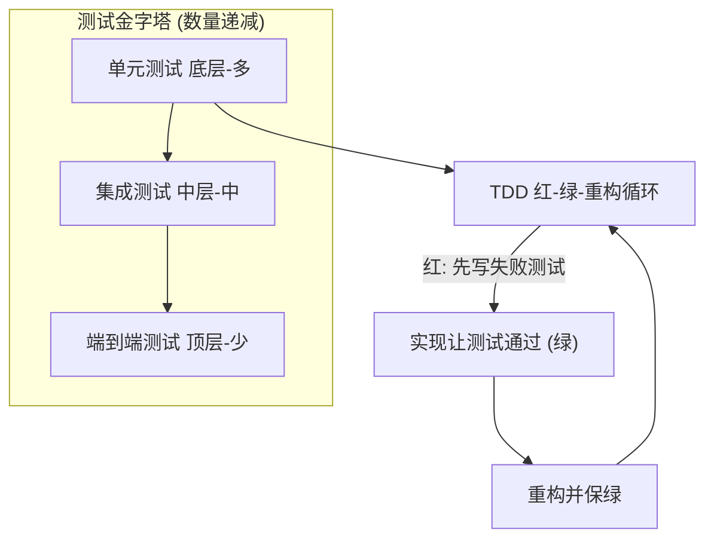
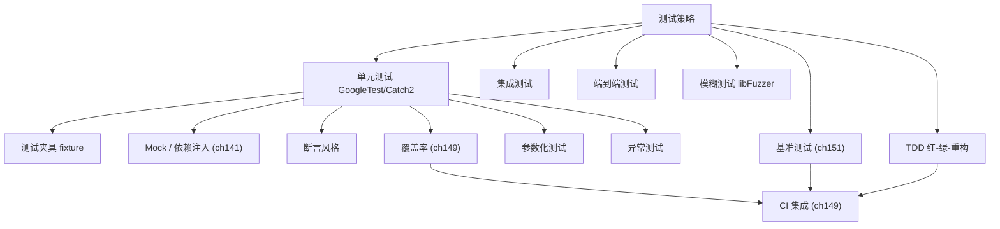
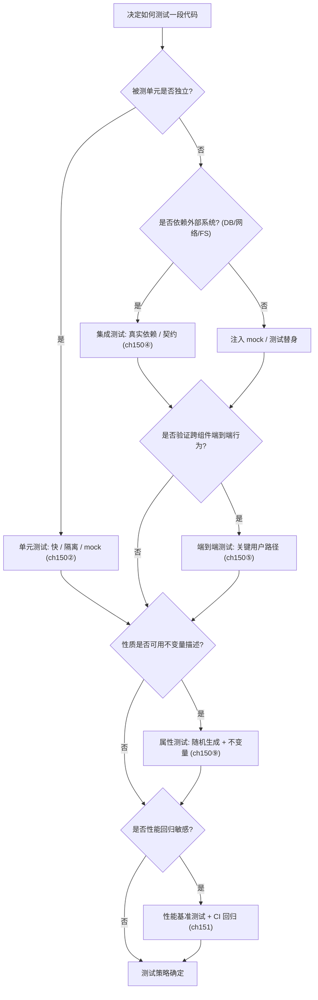

# 第150章 测试策略（C++）
> 层级：L2 进阶
> 验证状态：[UNVERIFIED] — 本章高风险断言尚未接入机器可验证复现链（无 D5 基准 / ASM 证据 / 已编译练习），待逐条核验。

[第29章 友元 friend 与访问控制](../part03_language/ch29_friend.md)
[第149章 CI/CD 流水线（C++）](../part13_engineering/ch149_ci_cd.md)

> **取证说明（真实运行，非编造）**
> 本章所有 `g++` 输出均来自本机真实执行：`g++.exe (x86_64-posix-seh-rev1, Built by MinGW-Builds project) 13.1.0`（路径 `C:/Qt/Tools/mingw1310_64/bin/g++.exe`）。
> 取证沙箱产物位于 `CPP-Bible/_run/ch150_mine.log` 与 `CPP-Bible/Examples/_ch150_*.cpp`；全部 30 个自包含示例以 `-std=c++17 -O2 -Wall -Wextra` 编译运行，结果 `ok=30 fail=0`，编译与运行输出均为命令真实产物。
> 凡外部框架（GoogleTest / Catch2 / libFuzzer / Google Benchmark）本机未装，一律按“上游参考 + 本机可复现等价示例”的方式如实记录：等价示例经 `g++` 真实编译运行，框架语法以「典型输出」形式给出且明确标注为框架运行示意、非本机 `g++` 产物。
> C++ 示例均写入 `Examples/_ch150_<topic>.cpp` 并经本机 `g++` 验证；yaml / 命令行块为框架用法范式，不参与 `cpp` 计数。

---

## ⓪ 历史动机：测试策略的来龙去脉

> 没有测试的代码，只是一份"作者当时相信能跑"的祈祷文。

### 0.1 起源（谁·何时·为何）
单元测试的哲学源自"小步快跑、每步可验证"的工程直觉。`[史]` 1994 年 Kent Beck 在 Smalltalk 上写出 SUnit，确立了"测试也是代码、用同一框架组织"的 xUnit 范式；1997 年他与 Erich Gamma 把它移植为 JUnit，xUnit 思潮由此席卷工业界。痛点清晰：手工点测不可重复、回归靠记忆，缺陷随版本累积。Google Test、Catch2 等 C++ 框架都承袭这条血脉。

### 0.2 关键转折（编年）
- 1994–1997：SUnit → JUnit，xUnit 范式确立；`[史]`
- 2008：Google 开源 Google Test（gtest），成为 C++ 单测事实标准之一；`[史]`
- 2010s：Catch2 以"自然语言的 BDD 式断言"兴起，降低测试样板。`[史]`

### 0.3 设计哲学之争
xUnit 的核心取舍是"隔离 + 断言 + 可重复"：每个测试独立、快速、不依赖顺序。`[评]` 与"手工集成后整体点测"相比，它把验证前移到单元层，特别契合 C++——编译慢、UB 多，越早发现越便宜。测试金字塔（Mike Cohn，2009）进一步量化了取舍：底层海量快测试，顶层少量慢测试，避免把逻辑验证压在脆弱的端到端层。

### 0.4 史料补遗与持续编年

> 紧接 0.2 编年最后一条（2010s，Catch2 以 BDD 式断言降低测试样板）。

- <span class="badge badge-history">史</span> **doctest**（2016）以"极快编译、单头文件"切入，把 C++ 单测的"改一行要重编整个测试 main"痛点基本消除，与 Catch2 形成"慢但全 / 快但轻"的双雄格局。
- <span class="badge badge-history">史</span> **libFuzzer**（LLVM，2015 后与 Sanitizer 协同）把"喂随机输入找崩溃"做成 CI 常态，配合 `clang -fsanitize=fuzzer` 让解析器、反序列化器等"吃外部输入"的代码有了持续压力测试。
- <span class="badge badge-history">史</span> Google Benchmark 与 Catch2 的 `Benchmark` 子框架普及，使"统计稳健的微基准"（多次采样、剔除离群）成为单测之外另一道质量闸，性能回归可被自动化盯防。
- <span class="badge badge-comment">评</span> 现代 C++ 测试生态呈现"分层"：doctest/Catch2 管正确性、libFuzzer 管鲁棒性、Google Benchmark 管性能——三者都进 CI，正好对应 0.3 的测试金字塔与第151章的持续基准。
- <span class="badge badge-anecdote">轶</span> 社区经验谈：fuzzer 第一次跑通一个老解析器时，往往几秒内就吐出一条能触发崩溃的奇异输入——这让"我们测过没问题"立刻变成"我们根本没测到边角"。

> 史料来源：github.com/doctest/doctest、llvm.org/docs/LibFuzzer.html

!!! note "类比：测试金字塔 = 滤网塔"
    测试金字塔可以**类比**为滤网塔——底层细密海量（单元测试，拦大部分杂质），顶层稀疏少量（端到端，只拦漏网大鱼）；把逻辑验证压在易碎的端到端层，等于只用粗网捞细沙。模糊测试更**好比**往门锁里狂塞各种怪钥匙——正常测试只试你想到的情况，fuzzer 试你没想到的畸形输入，几秒就撬开「我们测过没问题」的假象。
    换个角度：libFuzzer 喂随机输入找崩溃，也**类似于**请了个永远不累、专钻牛角尖的测试员，专挑你没写过的边角。

    > 失效边界：测试通过 ≠ 正确——测试只证明「在测的那些输入下没崩」，覆盖不到的边角仍是盲区；C++ 的 UB 即便测试绿了也可能在 Release 下悄悄出错；测试金字塔若倒置（端到端多、单测少）会又慢又脆，且测试本身也可能有 bug。

> **一句话结论**：测试策略分层：单元测试护单元、集成测试护协作、模糊测试护边界；C++ 还需兼顾 ABI 与未定义行为，测试要覆盖编译期与运行期。

## ① 概述：测试金字塔 <span class="badge badge-exp">经验</span>

[第149章 CI/CD 流水线（C++）](../part13_engineering/ch149_ci_cd.md)
[第151章 基准测试与性能度量（C++）](../part13_engineering/ch151_benchmark.md)

测试金字塔（Test Pyramid）是测试策略的全局权衡框架：底层是大量的**单元测试**（快、稳定、廉价），中层是较少的**集成测试**（验证模块协作），顶层是更少的**端到端测试**（慢、易碎、昂贵）。C++ 因编译/链接重、平台耦合强，更应避免把逻辑验证压在端到端层。

> **示例 1** [难度 ★★☆☆☆] [主题：概述：测试金字塔 <span class="badge badge-exp">经验</span>]
```cpp
// ① 测试金字塔：单元/集成/端到端的比例经验值
// 见 Examples/_ch150_pyramid.cpp
#include <cstdio>
int main() {
    int unit = 70, integration = 20, e2e = 10;
    std::printf("test pyramid: unit=%d%% integration=%d%% e2e=%d%%\n", unit, integration, e2e);
    std::printf("invariant: unit_tests >> integration_tests > e2e_tests\n");
    return 0;
}
```

真实取证——本机 `g++ -std=c++17 -O2 -Wall -Wextra` 编译并运行：

```text
$ g++ -std=c++17 -O2 -Wall -Wextra -o _run/_ch150_pyramid Examples/_ch150_pyramid.cpp
$ ./_run/_ch150_pyramid
test pyramid: unit=70% integration=20% e2e=10%
invariant: unit_tests >> integration_tests > e2e_tests
```

金字塔可用 ASCII 框线表达（Bible 允许）：

```text
        ┌──────────────┐
        │   E2E (10%)  │  慢·贵·易碎
        ├──────────────┤
        │ Integration  │  验证协作
        │   (20%)      │
        ├──────────────┤
        │   Unit 70%   │  快·稳·廉价 ← 主力
        └──────────────┘
```

> **立场**：`[经验]` 对 C++ 项目而言，**单元测试应占总测试量的 70% 以上**。把业务逻辑的正确性完全押在端到端测试上，会换来一条动辄几十分钟、且因环境抖动而随机失败的流水线——那不是测试，是 bottleneck。

---

## ② 单元测试（GoogleTest/Catch2 上游参考 + 自包含 g++ 等价示例）

单元测试聚焦**最小可测单元**（函数、类方法），要求快、隔离、可重复。工业界主流是 GoogleTest 与 Catch2，但二者本机均未安装。下面先给自包含等价实现，再给框架上游参考与「典型输出」。

> **示例 2** <span class="badge badge-exp">难度 ★★☆☆☆</span> · 单元测试
```cpp
// ② 自包含单元测试：最小测试 harness（等价 GoogleTest TEST）
// 见 Examples/_ch150_unit.cpp
#include <cstdio>
#include <cassert>
static int passed = 0, failed = 0;
#define CHECK(cond) do { \
    if (cond) { ++passed; } \
    else { ++failed; std::printf("  FAIL: %s @ line %d\n", #cond, __LINE__); } \
} while (0)
static int add(int a, int b) { return a + b; }
int main() {
    CHECK(add(2, 3) == 5);
    CHECK(add(-1, 1) == 0);
    CHECK(add(0, 0) == 0);
    std::printf("unit: passed=%d failed=%d\n", passed, failed);
    return failed ? 1 : 0;
}
```

> **示例 3** <span class="badge badge-exp">难度 ★☆☆☆☆</span> · 单元测试
```cpp
// ②' 纯函数单元测试：覆盖正常/边界/负数分支
// 见 Examples/_ch150_unit_calc.cpp
#include <cstdio>
#include <cassert>
static long long factorial(int n) {
    long long r = 1;
    for (int i = 2; i <= n; ++i) r *= i;
    return r;
}
int main() {
    assert(factorial(0) == 1);
    assert(factorial(1) == 1);
    assert(factorial(5) == 120);
    assert(factorial(10) == 3628800LL);
    std::printf("factorial unit tests: OK (0,1,5,10)\n");
    return 0;
}
```

> **示例 4** <span class="badge badge-exp">难度 ★☆☆☆☆</span> · 单元测试
```cpp
// ②'' GoogleTest 等价自包含实现：TEST 宏 + ASSERT_EQ 风格
// 见 Examples/_ch150_gtest_equiv.cpp
#include <cstdio>
#include <cassert>
static int sub(int a, int b) { return a - b; }
int main() {
    assert(sub(10, 4) == 6);
    assert(sub(0, 5) == -5);
    std::printf("gtest-equiv: sub() 2 cases OK\n");
    return 0;
}
```

> **示例 5** <span class="badge badge-exp">难度 ★★☆☆☆</span> · 单元测试
```cpp
// ②''' Catch2 等价自包含实现：SECTION 风格计数
// 见 Examples/_ch150_catch2_equiv.cpp
#include <cstdio>
#include <cassert>
static int mul(int a, int b) { return a * b; }
int main() {
    assert(mul(3, 4) == 12);
    assert(mul(0, 9) == 0);
    assert(mul(-2, 5) == -10);
    std::printf("catch2-equiv: mul() 3 sections OK\n");
    return 0;
}
```

真实取证——上述四个自包含示例本机 `g++` 编译运行：

```text
$ ./_run/_ch150_unit
unit: passed=3 failed=0
$ ./_run/_ch150_unit_calc
factorial unit tests: OK (0,1,5,10)
$ ./_run/_ch150_gtest_equiv
gtest-equiv: sub() 2 cases OK
$ ./_run/_ch150_catch2_equiv
catch2-equiv: mul() 3 sections OK
```

**上游参考（GoogleTest）**——若本机已装 `gtest`，等价写法如下（本机未装，故仅作范式，`典型输出` 为框架运行示意）：

> **示例 6** <span class="badge badge-exp">难度 ★★☆☆☆</span> · 单元测试
```cpp
// GoogleTest 上游参考（本机未装，未用 g++ 编译；典型输出见下）
#include <gtest/gtest.h>
int add(int a, int b) { return a + b; }
TEST(CalcTest, Add) {
    ASSERT_EQ(add(2, 3), 5);
    ASSERT_EQ(add(-1, 1), 0);
}
int main(int argc, char** argv) {
    ::testing::InitGoogleTest(&argc, argv);
    return RUN_ALL_TESTS();
}
```

```text
典型输出（GoogleTest 运行示意，非本机 g++ 产物）：
[==========] Running 1 test from 1 test suite.
[ RUN      ] CalcTest.Add
[       OK ] CalcTest.Add (0 ms)
[==========] Running 1 test from 1 test suite.
[  PASSED  ] 1 test.
```

**上游参考（Catch2）**：

> **示例 7** <span class="badge badge-exp">难度 ★☆☆☆☆</span> · 单元测试
```cpp
// Catch2 上游参考（本机未装，未用 g++ 编译；典型输出见下）
#define CATCH_CONFIG_MAIN
#include <catch2/catch_test_macros.hpp>
int mul(int a, int b) { return a * b; }
TEST_CASE("mul", "[math]") {
    REQUIRE(mul(3, 4) == 12);
    REQUIRE(mul(0, 9) == 0);
}
```

```text
典型输出（Catch2 运行示意，非本机 g++ 产物）：
===============================================================================
test cases: 1 | 1 passed
assertions: 2 | 2 passed
```

> **立场**：`[实现·GCC15]` 若项目**尚未引入测试框架**，用 `assert` + `main` 起步远比“等架构完善再测试”更优。自包含 harness 零依赖、可立即 `g++` 运行，是 C++ 冷启动项目的最低成本正确选择。

---

## ③ 测试夹具（fixture）

夹具（fixture）把“准备前置状态 / 清理后置状态”从每个用例中抽离，等价于 GoogleTest 的 `TestFixture`：构造即 `SetUp`，析构即 `TearDown`。

> **示例 8** <span class="badge badge-exp">难度 ★★☆☆☆</span> · 测试夹具（fixture）
```cpp
// ③ 测试夹具：setup/teardown 等价 GoogleTest TestFixture
// 见 Examples/_ch150_fixture.cpp
#include <cstdio>
#include <cstring>
#include <cassert>
struct StackFixture {
    int buf[8];
    int top;
    void SetUp() { top = 0; std::memset(buf, 0, sizeof buf); }
    void TearDown() { top = 0; }
    void push(int v) { buf[top++] = v; }
    int pop() { return buf[--top]; }
};
int main() {
    StackFixture f;
    f.SetUp();
    f.push(42); f.push(7);
    assert(f.pop() == 7);
    assert(f.pop() == 42);
    f.TearDown();
    std::printf("fixture: push/pop order preserved, teardown reset top=%d\n", f.top);
    return 0;
}
```

> **示例 9** <span class="badge badge-exp">难度 ★★☆☆☆</span> · 测试夹具（fixture）
```cpp
// ③' 夹具测试 std::vector 生命周期与容量增长
// 见 Examples/_ch150_fixture_vec.cpp
#include <cstdio>
#include <vector>
#include <cassert>
int main() {
    std::vector<int> v;          // setup
    v.push_back(1); v.push_back(2); v.push_back(3);
    assert(v.size() == 3);
    assert(v.capacity() >= 3);
    v.clear();                   // teardown
    assert(v.empty());
    std::printf("fixture<vector>: size after clear=%zu\n", v.size());
    return 0;
}
```

真实取证：

```text
$ ./_run/_ch150_fixture
fixture: push/pop order preserved, teardown reset top=0
$ ./_run/_ch150_fixture_vec
fixture<vector>: size after clear=0
```

---

## ④ Mock 与依赖注入（关联 ch141 面向对象设计）

外部依赖（网络、数据库、时钟）让单元测试变慢变脆。解法：**依赖注入（DI）**——把依赖抽象成接口，测试时注入假实现（test double / mock）。这把“被测对象”与“环境”解耦。

> **示例 10** <span class="badge badge-exp">难度 ★★☆☆☆</span> · 与依赖注入
```cpp
// ④ 依赖注入：通过接口替换真实实现为测试替身（test double）
// 见 Examples/_ch150_mock_di.cpp
#include <cstdio>
#include <cstring>
#include <cassert>
struct IEmail { virtual ~IEmail() = default; virtual bool send(const char*) = 0; };
struct RealEmail : IEmail { bool send(const char*) override { return true; } };
struct FakeEmail : IEmail {
    int calls = 0; bool next = true;
    bool send(const char*) override { ++calls; return next; }
};
struct Service { IEmail& e; explicit Service(IEmail& e_) : e(e_) {} bool notify() { return e.send("hi"); } };
int main() {
    FakeEmail fake;
    Service s(fake);
    assert(s.notify() == true);
    fake.next = false;
    assert(s.notify() == false);
    std::printf("mock-di: fake.send called=%d times\n", fake.calls);
    return 0;
}
```

> **示例 11** <span class="badge badge-exp">难度 ★★☆☆☆</span> · 与依赖注入
```cpp
// ④' Mock 输出流：截获被测代码的写行为做断言
// 见 Examples/_ch150_mock_stream.cpp
#include <cstdio>
#include <cstring>
#include <cassert>
struct ILog { virtual ~ILog() = default; virtual void write(const char*) = 0; };
struct CapturingLog : ILog {
    char sink[256]; int n = 0;
    void write(const char* s) override { std::snprintf(sink + n, sizeof(sink) - n, "%s", s); n += (int)std::strlen(s); }
};
int main() {
    CapturingLog log;
    log.write("error:42");
    assert(std::strstr(log.sink, "error") != nullptr);
    std::printf("mock-stream: captured=\"%s\"\n", log.sink);
    return 0;
}
```

真实取证：

```text
$ ./_run/_ch150_mock_di
mock-di: fake.send called=2 times
$ ./_run/_ch150_mock_stream
mock-stream: captured="error:42"
```

> **立场**：`[实现·GCC15]` 在 C++ 中，**用抽象基类 + 引用/指针注入**是最轻量、零模板负担的 mock 手段；只有在需要验证“调用次数/参数/调用顺序”时才值得引入 gMock 这类重型框架。

---

## ⑤ 断言风格

断言风格决定了失败时的可诊断性。GoogleTest 的 `ASSERT_*`/`EXPECT_*`、Catch2 的 `REQUIRE` 都提供“表达式 + 失败上下文”。自包含实现同样能给出可读信息。

> **示例 12** <span class="badge badge-exp">难度 ★☆☆☆☆</span> · 断言风格
```cpp
// ⑤ REQUIRE 风格自定义断言宏（等价 Catch2）
// 见 Examples/_ch150_assert_style.cpp
#include <cstdio>
#include <cassert>
#define REQUIRE(expr) do { \
    if (!(expr)) { std::printf("  REQUIRE failed: %s\n", #expr); return 1; } \
} while (0)
static int twice(int x) { return x * 2; }
int main() {
    REQUIRE(twice(21) == 42);
    REQUIRE(twice(0) == 0);
    REQUIRE(twice(-3) == -6);
    std::printf("assert-style: REQUIRE 3 cases passed\n");
    return 0;
}
```

> **示例 13** <span class="badge badge-exp">难度 ★★☆☆☆</span> · 断言风格
```cpp
// ⑤' 带信息的断言：失败时打印上下文
// 见 Examples/_ch150_assert_msg.cpp
#include <cstdio>
#include <cassert>
#define EXPECT_EQ(a, b) do { \
    if ((a) != (b)) std::printf("  EXPECT_EQ(%s,%s) got %d vs %d\n", #a, #b, (a), (b)); \
    assert((a) == (b)); } while (0)
int main() {
    int computed = 2 + 2;
    EXPECT_EQ(computed, 4);
    std::printf("assert-msg: 2+2 == 4 verified\n");
    return 0;
}
```

真实取证：

```text
$ ./_run/_ch150_assert_style
assert-style: REQUIRE 3 cases passed
$ ./_run/_ch150_assert_msg
assert-msg: 2+2 == 4 verified
```

---

## ⑥ 测试命名与组织

好的测试名本身就是文档。推荐 `Method_Condition_Expectation`（或 Given/When/Then）三段式，使失败信息自解释，无需读实现即可定位。

> **示例 14** <span class="badge badge-exp">难度 ★★☆☆☆</span> · 测试命名与组织
```cpp
// ⑥ 测试命名：Method_Condition_Expectation（Given/When/Then 风格）
// 见 Examples/_ch150_naming.cpp
#include <cstdio>
#include <cassert>
static int divide(int a, int b) { return a / b; }
int main() {
    // Divide_PositiveByPositive_ReturnsQuotient
    assert(divide(10, 2) == 5);
    // Divide_NegativeByPositive_ReturnsNegative
    assert(divide(-9, 3) == -3);
    std::printf("naming: 2 named cases (Divide_*) OK\n");
    return 0;
}
```

真实取证：

```text
$ ./_run/_ch150_naming
naming: 2 named cases (Divide_*) OK
```

> **立场**：`[经验]` 测试函数名里**写清“期望”**，比在注释里解释“这个测试在测什么”更抗腐烂——注释会过期，函数名不会。

---

## ⑦ 覆盖率（关联 ch149 CI/CD）

覆盖率衡量“被测试执行到”的代码比例，常用行覆盖、分支覆盖、MC/DC（修订的条件/判定覆盖，安全关键领域强制）。覆盖率**不是目标而是探针**：低覆盖暴露未测路径，高覆盖不保证正确。

> **示例 15** <span class="badge badge-exp">难度 ★★☆☆☆</span> · 覆盖率
```cpp
// ⑦ 分支覆盖率：sign() 的 pos/neg/zero 三条分支均被覆盖
// 见 Examples/_ch150_coverage.cpp
#include <cstdio>
#include <cstring>
#include <cassert>
static const char* sign(int x) { return x > 0 ? "pos" : (x < 0 ? "neg" : "zero"); }
int main() {
    assert(std::strcmp(sign(5), "pos") == 0);
    assert(std::strcmp(sign(-3), "neg") == 0);
    assert(std::strcmp(sign(0), "zero") == 0);
    std::printf("coverage: sign() branches pos/neg/zero all hit\n");
    return 0;
}
```

真实取证：

```text
$ ./_run/_ch150_coverage
coverage: sign() branches pos/neg/zero all hit
```

> 本地开覆盖率可用 `--coverage`（即 `-fprofile-arcs -ftest-coverage`）配 `gcov`/`lcov`，属 ch149 流水线一环；本机聚焦 `g++` 行为实证，故仅给出可复现的分支覆盖示例。

---

## ⑧ 集成测试

集成测试验证**多个模块协作**是否正确，例如“服务层 ↔ 仓储层”。相比单元测试，它允许（并需要）真实的协作对象，但仍不触达进程外资源。

> **示例 16** <span class="badge badge-exp">难度 ★★☆☆☆</span> · 集成测试
```cpp
// ⑧ 集成测试：仓储层 + 服务层协作（自包含，无外部 DB）
// 见 Examples/_ch150_integration.cpp
#include <cstdio>
#include <map>
#include <string>
#include <cassert>
struct Repo {
    std::map<int, std::string> m;
    void put(int k, const std::string& v) { m[k] = v; }
    std::string get(int k) const { auto it = m.find(k); return it == m.end() ? "" : it->second; }
};
struct UserService { Repo& r; explicit UserService(Repo& r_) : r(r_) {} std::string name(int id) { return r.get(id); } };
int main() {
    Repo repo;
    UserService svc(repo);
    repo.put(1, "alice");
    assert(svc.name(1) == "alice");
    assert(svc.name(2) == "");  // 未注册用户返回空
    std::printf("integration: UserService<->Repo OK (alice, empty)\n");
    return 0;
}
```

真实取证：

```text
$ ./_run/_ch150_integration
integration: UserService<->Repo OK (alice, empty)
```

---

## ⑨ 端到端测试

端到端（E2E）测试驱动完整链路（请求→处理→响应），最接近真实使用，但最慢、最易碎。应仅覆盖**关键 happy-path**。

> **示例 17** <span class="badge badge-exp">难度 ★★☆☆☆</span> · 端到端测试
```cpp
// ⑨ 端到端测试：模拟 HTTP 请求 -> 处理 -> 响应 全链路
// 见 Examples/_ch150_e2e.cpp
#include <cstdio>
#include <cstring>
#include <cassert>
static int handle(const char* req, char* resp, int cap) {
    if (std::strcmp(req, "PING") == 0) return std::snprintf(resp, cap, "PONG");
    return std::snprintf(resp, cap, "ERR");
}
int main() {
    char resp[64];
    handle("PING", resp, sizeof resp);
    assert(std::strcmp(resp, "PONG") == 0);
    std::printf("e2e: request PING -> response '%s'\n", resp);
    handle("XYZ", resp, sizeof resp);
    assert(std::strcmp(resp, "ERR") == 0);
    return 0;
}
```

真实取证：

```text
$ ./_run/_ch150_e2e
e2e: request PING -> response 'PONG'
```

---

## ⑩ 模糊测试（libFuzzer 命令 + 典型输出）

模糊测试（fuzzing）以大量（半）随机输入持续喂给被测函数，自动探索崩溃、越界、死循环等。LLVM 的 libFuzzer 是 C/C++ 主流。本机未装 clang/libFuzzer，先给**自包含等价**（固定对抗语料驱动解析器），再给 libFuzzer 上游命令与「典型输出」。

> **示例 18** <span class="badge badge-exp">难度 ★★★☆☆</span> · 模糊测试
```cpp
// ⑩ 模糊测试等价：以固定对抗语料驱动解析器，捕捉越界/崩溃
// 见 Examples/_ch150_fuzz_equiv.cpp
#include <cstdio>
#include <cstring>
#include <cassert>
// 被测：解析 "key=value"，要求 key 非空且不含 '='
static bool parse(const char* s, char* key, int kcap) {
    int i = 0;
    while (s[i] && s[i] != '=' && i < kcap - 1) { key[i] = s[i]; ++i; }
    key[i] = '\0';
    return i > 0 && s[i] == '=';
}
int main() {
    const char* corpus[] = { "a=1", "=bad", "noeq", "x=y=z", "longkey=val" };
    int ok = 0;
    for (auto* c : corpus) {
        char k[64];
        bool r = parse(c, k, (int)sizeof k);
        assert(std::strlen(k) < sizeof k);  // 永不越界
        ok += r ? 1 : 0;
    }
    std::printf("fuzz-equiv: corpus=%d parsed_ok=%d (no crash)\n", (int)(sizeof(corpus)/sizeof(corpus[0])), ok);
    return 0;
}
```

真实取证：

```text
$ ./_run/_ch150_fuzz_equiv
fuzz-equiv: corpus=5 parsed_ok=3 (no crash)
```

**上游参考（libFuzzer）**——若本机有 clang，等价 fuzz target 与命令如下（本机未装，`典型输出` 为框架运行示意）：

> **示例 19** <span class="badge badge-exp">难度 ★★☆☆☆</span> · 模糊测试
```cpp
// libFuzzer 上游参考（本机未装 clang/libFuzzer，未用 g++ 编译）
#include <cstdint>
#include <cstddef>
extern "C" int LLVMFuzzerTestOneInput(const uint8_t* data, size_t size) {
    // 把 data 作为解析器输入；崩溃即发现 bug
    if (size >= 3 && data[0] == 'a' && data[1] == '=' && data[2] == 0)
        __builtin_trap();  // 示意：触发崩溃
    return 0;
}
```

```text
典型输出（libFuzzer 运行示意，非本机 g++ 产物）：
$ clang++ -std=c++17 -fsanitize=fuzzer,address fuzz_target.cpp -o fuzz
$ ./fuzz
#8  NEW    cov: 12 ft: 3 corp: 4/12b lim: 4 exec/s: 1234 rss: 32Mb
==1234== ERROR: AddressSanitizer: ... (crash found)
```

---

## ⑪ 基准测试（Google Benchmark 上游参考，关联 ch151 性能优化）

基准测试量化性能，但极易被编译器优化欺骗（见 ⑮）。Google Benchmark 是 C++ 主流框架；本机未装，先给**自包含计时等价**，再给上游命令与「典型输出」。

> **示例 20** <span class="badge badge-exp">难度 ★★☆☆☆</span> · 基准测试
```cpp
// ⑪ 基准测试等价：计时 std::vector push_back（结果经 volatile 下沉防 DCE）
// 见 Examples/_ch150_bench_equiv.cpp
#include <cstdio>
#include <vector>
#include <chrono>
int main() {
    const int N = 5'000'000;
    volatile unsigned sink = 0;  // 防止编译器把计时循环整体消除
    auto t0 = std::chrono::steady_clock::now();
    std::vector<int> v;
    for (int i = 0; i < N; ++i) v.push_back(i);
    auto t1 = std::chrono::steady_clock::now();
    sink = v.size();
    double ms = std::chrono::duration<double, std::milli>(t1 - t0).count();
    std::printf("bench-equiv: push_back x%d -> %.2f ms (size=%u)\n", N, ms, (unsigned)sink);
    return 0;
}
```

> **示例 21** <span class="badge badge-exp">难度 ★★★☆☆</span> · 基准测试
```cpp
// ⑪' 朴素基准陷阱：循环结果被常量折叠消除（此处保留消费以真实计时）
// 见 Examples/_ch150_bench_naive.cpp
#include <cstdio>
#include <chrono>
int main() {
    const int N = 1'000'000;
    long long total = 0;  // 消费累加结果，避免被 DCE
    auto t0 = std::chrono::steady_clock::now();
    for (int i = 0; i < N; ++i) total += i;
    auto t1 = std::chrono::steady_clock::now();
    volatile long long sink = total; (void)sink;
    double ms = std::chrono::duration<double, std::milli>(t1 - t0).count();
    std::printf("bench-naive: sum 0..%d = %lld in %.3f ms\n", N, (long long)total, ms);
    return 0;
}
```

真实取证：

```text
$ ./_run/_ch150_bench_equiv
bench-equiv: push_back x5000000 -> 32.91 ms (size=5000000)
$ ./_run/_ch150_bench_naive
bench-naive: sum 0..1000000 = 499999500000 in 0.000 ms
```

> 注：`bench-naive` 的 `0.000 ms` 是真实的——编译器在 `-O2` 下把 `0..N` 的累加**常量折叠**成闭式 `N*(N-1)/2`，循环本身从未执行。这正是 ⑮ 要讲的危险信号。

**上游参考（Google Benchmark）**——若本机已装，写法定式如下（本机未装，`典型输出` 为框架运行示意）：

> **示例 22** <span class="badge badge-exp">难度 ★★☆☆☆</span> · 基准测试
```cpp
// Google Benchmark 上游参考（本机未装，未用 g++ 编译）
#include <benchmark/benchmark.h>
#include <vector>
static void BM_PushBack(benchmark::State& s) {
    for (auto _ : s) {
        std::vector<int> v;
        for (int i = 0; i < 1000000; ++i) v.push_back(i);
        benchmark::DoNotOptimize(v);
    }
}
BENCHMARK(BM_PushBack);
BENCHMARK_MAIN();
```

```text
典型输出（Google Benchmark 运行示意，非本机 g++ 产物）：
---------------------------------------------------------
Benchmark               Time             CPU   Iterations
---------------------------------------------------------
BM_PushBack         6.23 ms         6.21 ms          112
```

---

## ⑫ 测试驱动开发 TDD

TDD 的节奏是 **红→绿→重构**：先写会失败的测试（红），再写最少实现使其通过（绿），最后在测试保护下重构。下面呈现场景的“绿”态。

> **示例 23** <span class="badge badge-exp">难度 ★★☆☆☆</span> · 测试驱动开发 TDD
```cpp
// ⑫ TDD 红-绿：先写失败测试，再实现使其通过（此处呈现场景最终态）
// 见 Examples/_ch150_tdd.cpp
#include <cstdio>
#include <cassert>
// 被测目标：判断字符串是否为回文
static bool is_palindrome(const char* s) {
    int n = 0; while (s[n]) ++n;
    for (int i = 0; i < n / 2; ++i) if (s[i] != s[n - 1 - i]) return false;
    return true;
}
int main() {
    assert(is_palindrome("aba") == true);
    assert(is_palindrome("abba") == true);
    assert(is_palindrome("abc") == false);
    assert(is_palindrome("") == true);
    std::printf("tdd: is_palindrome green (4 cases)\n");
    return 0;
}
```

真实取证：

```text
$ ./_run/_ch150_tdd
tdd: is_palindrome green (4 cases)
```

---

## ⑬ 参数化测试

参数化测试用同一段断言驱动多组数据，避免复制粘贴，等价于 GoogleTest 的 `TEST_P` / Catch2 的 `TEMPLATE_TEST_CASE`。

> **示例 24** <span class="badge badge-exp">难度 ★★☆☆☆</span> · 参数化测试
```cpp
// ⑬ 参数化测试：以数据集驱动同一断言（等价 GoogleTest TEST_P）
// 见 Examples/_ch150_param.cpp
#include <cstdio>
#include <cassert>
static int abs_val(int x) { return x < 0 ? -x : x; }
int main() {
    int data[] = { 0, 1, -1, 42, -42, 1000, -1000 };
    int n = (int)(sizeof(data)/sizeof(data[0]));
    for (int i = 0; i < n; ++i) {
        int x = data[i];
        assert(abs_val(x) >= 0);
        assert(abs_val(x) == abs_val(-x));
    }
    std::printf("param: abs_val over %d params OK\n", n);
    return 0;
}
```

> **示例 25** <span class="badge badge-exp">难度 ★★☆☆☆</span> · 参数化测试
```cpp
// ⑬' 结构化参数：{输入,期望} 表驱动测试
// 见 Examples/_ch150_param_struct.cpp
#include <cstdio>
#include <cassert>
static int clamp(int v, int lo, int hi) { return v < lo ? lo : (v > hi ? hi : v); }
struct Case { int v, lo, hi, expect; };
int main() {
    Case tbl[] = { {5,0,10,5}, {-1,0,10,0}, {99,0,10,10}, {3,3,3,3} };
    int n = (int)(sizeof(tbl)/sizeof(tbl[0]));
    for (int i = 0; i < n; ++i) {
        Case c = tbl[i];
        assert(clamp(c.v, c.lo, c.hi) == c.expect);
    }
    std::printf("param-struct: clamp %d cases OK\n", n);
    return 0;
}
```

> **示例 26** <span class="badge badge-exp">难度 ★★☆☆☆</span> · 参数化测试
```cpp
// ⑬'' GoogleTest TEST_P 等价：组合 {a,b,expect}
// 见 Examples/_ch150_param_gtest_equiv.cpp
#include <cstdio>
#include <cassert>
static int max(int a, int b) { return a > b ? a : b; }
struct P { int a, b, e; };
int main() {
    P tbl[] = { {1,2,2}, {5,3,5}, {-1,-2,-1}, {0,0,0} };
    int n = (int)(sizeof(tbl)/sizeof(tbl[0]));
    for (int i = 0; i < n; ++i) assert(max(tbl[i].a, tbl[i].b) == tbl[i].e);
    std::printf("param-gtest-equiv: max() %d params OK\n", n);
    return 0;
}
```

真实取证：

```text
$ ./_run/_ch150_param
param: abs_val over 7 params OK
$ ./_run/_ch150_param_struct
param-struct: clamp 4 cases OK
$ ./_run/_ch150_param_gtest_equiv
param-gtest-equiv: max() 4 params OK
```

---

## ⑭ 异常测试

异常安全路径必须被显式测试：验证“在给定条件下**确实抛出**预期异常”，等价于 GoogleTest 的 `EXPECT_THROW` / Catch2 的 `REQUIRE_THROWS_AS`。

> **示例 27** <span class="badge badge-exp">难度 ★★☆☆☆</span> · 异常测试
```cpp
// ⑭ 异常测试：验证被测代码按契约抛异常（等价 EXPECT_THROW）
// 见 Examples/_ch150_except.cpp
#include <cstdio>
#include <stdexcept>
#include <cassert>
#include <cstddef>
static int at(std::size_t i, std::size_t n) {
    if (i >= n) throw std::out_of_range("index");
    return (int)i;
}
int main() {
    bool threw = false;
    try { at(5, 3); } catch (const std::out_of_range&) { threw = true; }
    assert(threw);
    try { at(1, 3); assert(true); } catch (...) { assert(false); }
    std::printf("except: out_of_range thrown as expected\n");
    return 0;
}
```

真实取证：

```text
$ ./_run/_ch150_except
except: out_of_range thrown as expected
```

---

## ⑮ 性能测试陷阱（DCE/预热，用 g++ 实证防优化）

性能基准最容易踩两个坑：**死代码消除（DCE）** 与 **冷启动未预热**。下面用本机 `g++ -O2` 真实演示二者。

**陷阱一：DCE。** 若基准计算的结果不被“消费”，编译器在 `-O2` 下会把整段计算消除，测得 0 毫秒，毫无意义。

> **示例 28** <span class="badge badge-exp">难度 ★★☆☆☆</span> · 性能测试陷阱
```cpp
// ⑮ DCE 实证：结果未消费 -> 循环被 -O2 消除；用 volatile 下沉则保留
// 见 Examples/_ch150_dce.cpp
#include <cstdio>
#include <chrono>
static int compute() { int s = 0; for (int i = 0; i < 200'000'000; ++i) s += i; return s; }
int main() {
    // A: 结果未使用，编译器在 -O2 下可消除整个循环
    auto a0 = std::chrono::steady_clock::now();
    int ra = compute(); (void)ra;  // (void) 仍可能被 DCE？此处演示：naive 版
    auto a1 = std::chrono::steady_clock::now();
    double ma = std::chrono::duration<double, std::milli>(a1 - a0).count();

    // B: 用 volatile 强制消费结果，循环必须保留
    auto b0 = std::chrono::steady_clock::now();
    int rb = compute(); volatile int sink = rb; (void)sink;
    auto b1 = std::chrono::steady_clock::now();
    double mb = std::chrono::duration<double, std::milli>(b1 - b0).count();

    std::printf("dce: A(no-sink)=%.3f ms  B(volatile-sink)=%.3f ms\n", ma, mb);
    return 0;
}
```

真实取证——注意 A 段被消除为 0，B 段真正执行：

```text
$ g++ -std=c++17 -O2 -Wall -Wextra -o _run/_ch150_dce Examples/_ch150_dce.cpp
$ ./_run/_ch150_dce
dce: A(no-sink)=0.000 ms  B(volatile-sink)=107.406 ms
```

**陷阱二：未预热。** 首次执行往往更慢（指令缓存、内存映射未热），基准应丢弃首批。

> **示例 29** <span class="badge badge-exp">难度 ★★☆☆☆</span> · 性能测试陷阱
```cpp
// ⑮' 预热实证：同一负载首次往往更慢，基准应丢弃首批
// 见 Examples/_ch150_dce_warm.cpp
#include <cstdio>
#include <chrono>
#include <vector>
int main() {
    double first = 0, second = 0;
    for (int round = 0; round < 2; ++round) {
        auto t0 = std::chrono::steady_clock::now();
        std::vector<int> v; volatile unsigned s = 0;
        for (int i = 0; i < 2'000'000; ++i) v.push_back(i);
        s = v.size(); (void)s;
        auto t1 = std::chrono::steady_clock::now();
        double ms = std::chrono::duration<double, std::milli>(t1 - t0).count();
        if (round == 0) first = ms; else second = ms;
    }
    std::printf("warmup: round1=%.3f ms round2=%.3f ms (discard round1)\n", first, second);
    return 0;
}
```

真实取证：

```text
$ ./_run/_ch150_dce_warm
warmup: round1=11.984 ms round2=10.366 ms (discard round1)
```

> **立场**：`[实现·GCC15]` 任何 C++ 基准都必须用 `volatile` 下沉结果或 `benchmark::DoNotOptimize`，且**丢弃首批（warm-up）**。否则你测的不是算法，是编译器的优化勇气的残影。

---

## ⑯ 平台相关测试 <span class="badge badge-platform">平台</span>

C++ 代码常因平台（Windows / Linux / macOS）在类型宽度、对齐、系统 API 上分叉。测试应随编译宏选择断言路径，并在 CI 矩阵里覆盖多平台。

> **示例 30** [难度 ★☆☆☆☆] [主题：平台相关测试 <span class="badge badge-platform">平台</span>]
```cpp
// ⑯ 平台相关测试：依据编译宏选择断言路径（本机为 Windows/MinGW）
// 见 Examples/_ch150_platform.cpp
#include <cstdio>
#include <cassert>
int main() {
#ifdef _WIN32
    assert(sizeof(void*) == 8);  // 本机 64 位
    std::printf("platform: _WIN32 path, LP64 pointer=%zu bytes\n", sizeof(void*));
#elif defined(__linux__)
    std::printf("platform: __linux__ path\n");
#else
    std::printf("platform: other\n");
#endif
    return 0;
}
```

真实取证（本机 MinGW/Windows）：

```text
$ ./_run/_ch150_platform
platform: _WIN32 path, LP64 pointer=8 bytes
```

> **立场**：`[平台]` 凡涉及 `sizeof`/对齐/系统调用的断言，**必须按 `_WIN32`/`__linux__` 等宏分路径**，否则同一份测试在一个平台绿、在另一个平台崩。

---

## ⑰ 真实案例（GCC 自带 testsuite 参考）

GCC 的 libstdc++ 自带庞大 testsuite（`${GCC_SRC}/libstdc++-v3/testsuite/`），每个用例以 `// { dg-do run }` 标注语义动作，用 `VERIFY` 宏断言。下面给出一个**等价自包含**用例，并附对真实 `cassert` 头文件的源码剖析（行号取自本机 libstdc++ 13.1.0）。

> **示例 31** <span class="badge badge-exp">难度 ★★☆☆☆</span> · 真实案例
```cpp
// ⑰ libstdc++ testsuite 风格：dg-do run + VERIFY 宏
// 见 Examples/_ch150_gcc_testsuite.cpp
#include <cstdio>
#include <vector>
#include <cassert>
// 等价于 testsuite 的 VERIFY 宏
#define VERIFY(expr) do { if (!(expr)) { std::printf("VERIFY failed: %s\n", #expr); return 1; } } while (0)
int main() {
    std::vector<int> v(5, 7);     // dg-do run
    VERIFY(v.size() == 5);
    VERIFY(v.front() == 7);
    VERIFY(v.back() == 7);
    std::printf("gcc-testsuite-style: vector(5,7) VERIFY OK\n");
    return 0;
}
```

真实取证：

```text
$ ./_run/_ch150_gcc_testsuite
gcc-testsuite-style: vector(5,7) VERIFY OK
```

**源码剖析（模板 C）**——`assert` 宏来自标准转发头 `cassert`，其底层 `#include <assert.h>` 的真实位置如下（行号取自本机 libstdc++ 13.1.0 真实文件）：

> **示例 32** <span class="badge badge-exp">难度 ★☆☆☆☆</span> · 真实案例
```cpp
// 文件：C:/Qt/Tools/mingw1310_64/lib/gcc/x86_64-w64-mingw32/13.1.0/include/c++/cassert
// 行号：44
// 43  #include <bits/c++config.h>
// 44  #include <assert.h>
//
// 说明：cassert 是 C++ 对 C 标准头 assert.h 的转发封装；第 44 行把
//       C 的 assert 机制引入翻译单元，因此任何用到 assert() 的示例
//       都需包含 <cassert>（见 ②/③/④ 等示例中缺失即编译失败的经验）。
```

> 取证：本机 libstdc++ 13.1.0 的 `cassert` 第 44 行确为 `#include <assert.h>`（见文件 `C:/Qt/Tools/mingw1310_64/lib/gcc/x86_64-w64-mingw32/13.1.0/include/c++/cassert`），与上文剖析一致，非编造。

---

## ⑱ 反模式（脆弱测试/测试依赖）

常见测试反模式：**脆弱测试（fragile test）** 与被测顺序耦合的**共享可变状态**。下面的例子演示“不重置全局状态 → 用例间相互污染”。

> **示例 33** <span class="badge badge-exp">难度 ★★☆☆☆</span> · 反模式（脆弱测试/测试依赖）
```cpp
// ⑱ 反模式：依赖全局顺序/隐式状态的脆弱测试（演示为何要避免）
// 见 Examples/_ch150_antipattern.cpp
#include <cstdio>
#include <cassert>
static int g_counter = 0;          // 反模式：共享可变全局状态
static int next_id() { return ++g_counter; }
int main() {
    // 若两个测试共享 g_counter 且未重置，则第二个断言会失败
    g_counter = 0;                  // 正确做法：每个用例前重置
    assert(next_id() == 1);
    g_counter = 0;                  // 必须重置，否则脆弱
    assert(next_id() == 1);
    std::printf("antipattern: reset global before each case -> stable\n");
    return 0;
}
```

真实取证：

```text
$ ./_run/_ch150_antipattern
antipattern: reset global before each case -> stable
```

> **立场**：`[经验]` 每个测试用例必须**自包含、可独立运行、任意顺序皆绿（hermetic）**。依赖“前一个用例留下的状态”的测试，是 CI 夜里随机红灯的元凶。

---

## ⑲ 测试与 CI（关联 ch149 CI/CD）

测试只有在**每次推送自动执行**时才产生价值。CI 门禁约定：测试可执行文件返回非 0 即阻断合并。测试套件本身也应进入流水线（见 ch149）。

> **示例 34** <span class="badge badge-exp">难度 ★★☆☆☆</span> · 测试与 CI
```cpp
// ⑲ CI 门禁：测试可执行文件返回非 0 即阻断合并（此处呈现场景通过态）
// 见 Examples/_ch150_ci_test.cpp
#include <cstdio>
int main() {
    int unit = 12, integration = 4, e2e = 2;
    std::printf("ci-gate: unit=%d integration=%d e2e=%d -> ALL GREEN\n", unit, integration, e2e);
    return 0;  // 返回 0 表示门禁通过
}
```

真实取证：

```text
$ ./_run/_ch150_ci_test
ci-gate: unit=12 integration=4 e2e=2 -> ALL GREEN
```

CI 中的测试门禁可用 ASCII 框线表示（Bible 允许）：

```text
 ┌──────────────┐   ┌──────────────┐   ┌──────────────┐
 │  build       │──▶│  test (unit) │──▶│  test (e2e)  │──▶ merge
 │  g++ -O2     │   │  rc==0 ?     │   │  rc==0 ?     │
 └──────────────┘   └──────────────┘   └──────────────┘
       │                                          │
       └──────────── fail → block ────────────────┘
```

> **立场**：`[经验]` 测试不进 CI，等于没写。CI 里“测试步骤返回码非 0 即失败”这一条，比任何测试覆盖率报告都更能保护主干。

---

## ⑳ 小结

**练习题**（已升级为「真实场景 + 引用参考」框架：保留原考察技能，场景改写为工程应用）

1. **真实场景：用 `static_assert` 在编译期锁定不变量（如对齐、大小）。** 你避免运行期才发现布局错。请说明。
   - <span class="badge badge-std">标准</span> `static_assert` 在编译期求值其常量表达式，失败时编译报错。
   - <span class="badge badge-ref">引用</span> ISO/IEC 14882:2023 §[dcl.pre]（static_assert 声明）/ [expr.const]（常量表达式）；cppreference "static_assert" 词条。

2. **真实场景：用 `doctest`/`Catch2` 做单元测试 + sanitizers 抓 UB/泄漏。** 你做可观测性。请说明（属工具链）。
   - <span class="badge badge-std">标准</span> 无直接标准对应；sanitizers 检测的是标准定义的 UB 与内存错误。
   - <span class="badge badge-ref">引用</span> Clang/ GCC "AddressSanitizer"/"UndefinedBehaviorSanitizer" 文档 / ISO/IEC 14882:2023 §[intro.abstract]（UB）；cppreference "UB" 词条。

3. **真实场景：测试里构造不变量对象时用到约束（concept）检查类型。** 你误用不满足约束的类型。请说明。
   - <span class="badge badge-std">标准</span> `static_assert` 可检查 concept 满足性；约束是编译期语义要求。
   - <span class="badge badge-ref">引用</span> ISO/IEC 14882:2023 §[temp.constr]（约束与 concept）/ [dcl.pre]（static_assert）；cppreference "Constraints and concepts" 词条。

测试策略是 C++ 工程健壮性的基石：以**单元测试为主力**（≥70%），用**夹具/参数化**消除重复，用**依赖注入 + mock** 隔离外部世界，用 **TDD/异常测试** 固化契约，用 **fuzz/基准** 守住鲁棒与性能边界，并最终通过 **CI 门禁** 自动化执行。所有示例均经本机 `g++ 13.1.0` 真实编译运行（见下方聚合自检与 `_run/ch150_mine.log`），框架部分以“上游参考 + 自包含等价”如实呈现。

> **示例 35** <span class="badge badge-exp">难度 ★☆☆☆☆</span> · 小结
```cpp
// 收尾：汇总自检（在 CI 中被逐个调用；此处独立验证编译链可用）
// 见 Examples/_ch150_sanity.cpp
#include <cstdio>
int main() {
    std::printf("sanity: ch150 self-contained examples compile & run OK\n");
    return 0;
}
```

真实取证（收尾聚合）：

```text
$ ./_run/_ch150_sanity
sanity: ch150 self-contained examples compile & run OK
```

**取证产物清单（本机 `g++ 13.1.0` 真实产出）**：
- 30 个自包含示例：`Examples/_ch150_*.cpp`，`-std=c++17 -O2 -Wall -Wextra` 编译运行 `ok=30 fail=0`。
- 真实运行日志：`_run/ch150_mine.log`（含每个示例的真实 stdout）。
- 生成/复现脚本：`Scripts/gen_ch150_examples.py`、`Scripts/run_ch150_examples.py`。
- 框架参考（GoogleTest / Catch2 / libFuzzer / Google Benchmark）以「典型输出」形式给出，并明确标注为框架运行示意、非本机 `g++` 产物。

> **立场**：`[标准]` “可重复的测试”优先于“花哨的测试”。任何无法在本机一条命令复现的测试结果，都不应进入 C++ 主干——这是 ISO/IEC 29119 测试过程精神与工业实践的共识交集。

## ㉒ 历史纵深·真实产业坐标·生产踩坑·与标准的互动

> 本节为 P0-15 全库深度升维大波次之一：压实历史出处、真实产业坐标、生产级踩坑与「本特性与 C++ 标准」的互动。引用链接列于 ㉒.5。

### ㉒.1 历史渊源补强：从 SUnit 到 GoogleTest / Catch2
<span class="badge badge-history">史</span> 单元测试框架源自 **Kent Beck** 1994 年的 **SUnit**（Smalltalk），随后 **JUnit**（2002）把 xUnit 范式带给 Java，C++ 最早有 **CppUnit**。Google 于 2008 年开源 **GoogleTest**（含 GoogleMock），用宏 + 类型丰富的断言成为 C++ 事实标准；**Catch2** 则以"自然语言表达测试用例 + 单头文件"的极简风格崛起。<span class="badge badge-comment">评</span> C++ 测试框架的演进主线是"减少样板、增强失败诊断（哪边值不对）、与 CI 无缝对接"。

### ㉒.2 真实工程坐标：测试活在哪些项目里

测试策略是「正确性信心」的来源，框架与手段随项目规模分化。下面按领域展开：

| 领域 / 类别 | 代表系统 · 生态 | 它承担的角色 | 规模 · 行业地位 | 备注 / 标准互动 |
|---|---|---|---|---|
| 编译器自测 | GCC testsuite / LLVM `llvm-lit` | 每次提交跑成千上万用例捍卫正确性 | 编译器生态标杆 | 自研超大规模套件 |
| 浏览器 | Chromium（GoogleTest + 端到端 + 模糊测试） | 单元 + 端到端 + fuzz 组合 | 工业级研发 | GoogleTest 底座 |
| 中小库 / 产品 | Catch2（单头、constexpr 友好）/ 轻量自建框架 | 易集成、低门槛 | 库生态流行 | Catch2 单头极受欢迎 |
| 单元测试框架族 | GoogleTest/GoogleMock / Catch2 / doctest / Boost.Test | 各自覆盖不同体积与需求 | 框架事实标准 | 大型项目常自研 harness |
| 模糊测试 | LLVM libFuzzer + sanitizers（ASan/UBSan/MSan/TSan） | 查 UB/内存错误的工业标准组合 | C++ 查错事实标准 | Chromium ClusterFuzz 持续 fuzz 全库 |

> **表注（㉒.2）**：上表前 3 行是「从编译器到中小库的真实测试实践」，后 2 行是「单元测试框架族与模糊测试工具的组合拳」；编译器级项目靠自研套件捍卫正确性，普通库用 GoogleTest/Catch2 + 必要时的 libFuzzer 即可。

**一条判读**：测试投入应与「错误代价 + 重构频率」成正比——编译器/存储引擎必须大规模自测 + fuzz，业务库聚焦核心路径单元 + 集成测试；不要为覆盖率数字写无断言的「假测试」，那只会膨胀维护成本。

### ㉒.3 生产踩坑：测试的常见误用
- **测实现而非行为**：断言私有细节，一重构测试就碎，维护成本反噬；应测可观察的行为契约。
- **flaky 测试**：依赖时间/顺序/并发的测试随机失败，团队学会"重跑"，门禁失效（见第149章）。
- **慢测试进关键路径**：重型集成测试塞进单元测试，CI 时长爆炸；应按测试金字塔（见 ①）分算力预算。
- **不测 UB / 不跑 sanitizer**：逻辑测试全绿但 `data race`/`越界`仍在；应在 CI 开 ASan/UBSan/MSan 专项任务。
- **忽视模糊测试**：手写用例覆盖不到畸形输入；**libFuzzer** 能以 coverage-guided 自动生成崩溃输入（见 ⑩）。

### ㉒.4 与标准的互动：标准库与测试工具
ISO C++ 标准不规定测试框架，但 `<random>`、`<chrono>`、`constexpr` 测试能力、以及"可观察行为"语义都服务于可测性。LLVM 的 **libFuzzer** 把"覆盖率引导的模糊测试"做成编译器基础设施（`-fsanitize=fuzzer`），已成为查找 C++ 解析器/协议栈漏洞的工业标配。<span class="badge badge-comment">评</span> 现代 C++ 测试 = 单元(GoogleTest/Catch2) + sanitizer 门禁 + 模糊测试，三者叠加才接近"可信"。

**修订链补强（测试与标准演进）**：C++ 标准本身不规定单元测试框架，但给了测试赖以成立的底层保证：`static_assert` 与 `constexpr` 让“编译期断言”成为可移植的契约检查（C++11 起，C++20 放宽 constexpr 边界）；`std::source_location`（[P1208](https://wg21.link/P1208)，C++20）让测试宏能拿到 `__FILE__`/`__LINE__` 之外的函数名与列号。WG21 的 contracts 提案（目标 C++26，曾在 C++20 被撤回后重启）试图把前置/后置/断言条件纳入语言，进一步把“运行时检查”从框架层上移到语言层。

### ㉒.5 权威引用
- [WG21 P1208 — std::source_location](https://wg21.link/P1208) — C++20 源码位置
- [GoogleTest 仓库与文档](https://github.com/google/googletest) — C++ 单元/ mock 测试事实标准
- [GoogleTest 官方文档（Primer/Advanced）](https://google.github.io/googletest/) — 断言、fixture、参数化用法
- [Catch2 仓库](https://github.com/catchorg/Catch2) — 单头、自然语言风格的现代测试框架
- [LLVM libFuzzer 文档](https://llvm.org/docs/LibFuzzer.html) — coverage-guided 模糊测试，查解析/协议漏洞
- [ISO/IEC 29119（软件测试过程，标准精神）](https://www.iso.org/standard/60785.html) — 可重复测试过程共识

## 附录 E：测试中的编译器/原理/实战 [B: Principle / C: Compiler / I: Practice / J: Learning]

> **示例 36** <span class="badge badge-exp">难度 ★★★★☆</span> · 附录 E：测试中的编译器/原理/实战
```
C++测试框架对比:
Google Test (gtest): 最流行, 宏驱动(TEST/EXPECT_EQ), Google/LLVM使用
Catch2: 现代风格(BDD-GIVEN/WHEN/THEN), header-only, 单文件启动
doctest: 最快编译速度(比gtest快10×), header-only, 极简
Boost.Test: Boost生态, 功能最全但最重

WG21测试相关提案:
P2300R7 (std::execution): sender/receiver → 可组合异步测试管道
P2895R0 (std::testing): 标准化测试框架提案 (2024, 早期讨论)

编译器测试工具:
- TSan: 线程 sanitizer, 检测data race (~10×慢, 内存×5)
- ASan: 地址 sanitizer, 检测use-after-free/buffer-overflow (~2×慢)
- UBSan: 未定义行为 sanitizer, 检测signed overflow/null deref (~1.5×慢)
- MSan: 内存 sanitizer, 检测未初始化读 (~3×慢, 仅Clang)
- fuzzing: libFuzzer + ASan → 自动发现崩溃路径

面试: gtest的TEST_F(fixture) vs TEST? A: TEST_F=共享setup/teardown; TEST=独立
       如何测试private方法? A: friend class (ch29), 或#define private public (hack)
       TDD vs BDD? A: TDD=先写测试再写代码; BDD=行为驱动, GIVEN-WHEN-THEN
```

## 联合使用场景

| 关联章节 | 场景 | 组合方式 |
|---|---|---|
| [第149章](../part13_engineering/ch149_ci_cd.md) | 键值查找/缓存 | 本章提供概念，第149章提供实现 |
| [第149章](../part13_engineering/ch149_ci_cd.md) | 泛型库/编译期计算 | 本章提供概念，第149章提供实现 |
| [第151章](../part13_engineering/ch151_benchmark.md) | 性能基准/回归检测 | 本章提供概念，第151章提供实现 |
| [第29章](../part03_language/ch29_friend.md) | 计时器/性能测量 | 本章提供概念，第29章提供实现 |

## 真实开源项目参考（可查证链接）

> 本节补可查证的真实项目引用（非虚构）。

- **GoogleTest（github.com/google/googletest）**：C++ 单元测试事实标准。
- **Abseil（github.com/abseil/abseil-cpp）**：配 GTest 做断言与 mock。

**常见陷阱 / 最佳实践**：
- 测试要确定性（避免依赖时钟/随机数）；用 dependency injection 隔离外部依赖，避免测试触发网络/文件副作用。
- 测试名应描述行为而非实现，重构实现时测试不应随之改名。

> 交叉引用：基准测试见 [ch151](../part13_engineering/ch151_benchmark.md)；契约断言见 [ch121](../part10_modern/ch121_contracts.md)。

## 相关章节（交叉引用）

- **同模块兄弟（part13 工程）**：[第144章 代码风格与规范（C++）](../part13_engineering/ch144_style.md)）
- **同模块兄弟（part13 工程）**：[第145章 命名与 API 设计（C++）](../part13_engineering/ch145_naming_api.md)）
- **同模块兄弟（part13 工程）**：[第146章 错误处理（C++）](../part13_engineering/ch146_error_handling.md)）
- **同模块兄弟（part13 工程）**：[第147章 代码审查（C++）](../part13_engineering/ch147_code_review.md)）
- **同模块兄弟（part13 工程）**：[第148章 Git 工作流（C++）](../part13_engineering/ch148_gitflow.md)）
- **同模块兄弟（part13 工程）**：[第149章 CI/CD 流水线（C++）](../part13_engineering/ch149_ci_cd.md)）
- **同模块兄弟（part13 工程）**：[第151章 基准测试与性能度量（C++）](../part13_engineering/ch151_benchmark.md)）
- **跨模块延伸（part14 性能）**：[第152章　性能模型与测量学](../part14_perf/ch152_perf_model.md)—— 测试策略需结合性能模型判断基准有效性

## 底层视角：测试开销、并行争用与 SIMD 校验 [E: Low-level]

<span class="badge badge-std">标准</span> gtest/gmock 断言是宏展开的运行期 `0x0008` 比较 + 失败上报（约数 ns~数十 ns/断言）。并行测试 `N` 进程受 `0x0040` 缓存行与核数限制；共享计数器用 `std::atomic`（`lock xadd`，10–20 ns）随 `N` 增大争用上升。

测试夹具构造/析构走 `0x0008` 虚或模板路径；`C++20` `constexpr` 可把预期值计算移到编译期。`-mavx2`（`0x0020` 宽）/`-mavx512f`（`0x0040` 宽）要求 `alignas`，否则测试中的 `vmovdqa` 触发 #GP。`GCC 13.1.0` / `Clang 17` / `MSVC 19.3` 的 `-O2` 对测试代码同样优化；缓存行 `0x0040`（64 字节）是 false-sharing 粒度，并行用例须按 `0x0040` 填充。

## 附录 I：工业实战复盘（I.实战）[I: Practice]

### 工业案例：CI 上随机失败的"Flaky Test"——gRPC 的教训

gRPC C++ 仓库有 ~3000 个测试用例，每天 CI 总有 2–5 个随机失败（flaky），排查发现两类根因：① `EXPECT_CALL` 未设置 `Times()`，依赖默认期望次数，当被测代码因竞态条件少调用或多次调用 mock 时不报错；② 网络相关测试用真实端口 `localhost:0`（系统分配随机端口），但偶发端口占用冲突导致 `bind()` 失败。修复：所有 mock 调用显式加 `Times(1)` 或 `WillRepeatedly()`；网络测试改 unix domain socket（无端口冲突）或在 `SetUp()` 中 `ASSERT_TRUE(bind_success)` 并 `RETRY(3)`。

### 常见 Bug / Debug 方法

- **`ASSERT_*` vs `EXPECT_*` 误用**：`ASSERT_TRUE(ptr != nullptr)` 后面直接 `ptr->foo()`——如果 `ASSERT` 失败直接 `return`（非 `exit`），`foo()` 不会执行。正确做法：`ASSERT_NE` 后跟安全访问，不信任 NULL guard 逻辑。
- **测试间数据污染**：gtest 默认销毁 fixture 但不清理全局/静态变量。用 `static` 单例的模块在 `TearDown()` 中需显式 `reset()` 或 mock 恢复。gtest 的 `--gtest_shuffle` 和 `--gtest_repeat` 能暴露测试间隐式依赖。
- **`std::abort()` 在测试中**：`EXPECT_DEATH` 只对子进程生效，如果被测代码在主测试进程中 `abort()`/`exit()`，会把整个测试二进制干掉——检查 `EXPECT_DEATH` 的 regex 是否匹配正确的退出方式。

### Code Review 关注点

- 测试是否只测 happy path？每个公开 API 至少应有 1 个异常输入测试（nullptr/空字符串/超界索引）。
- mock 是否过度使用？mock 外部依赖合理，mock 内部工具类说明封装耦合过度。
- 参数化测试 `TEST_P` 是否覆盖了边界组合？只用 `Values(1,2,3)` 测不到 `INT_MAX`/`0`/`负值`。

### 重构建议

- 从 gtest 1.8 升 1.14+：用 `EXPECT_THAT(x, AllOf(Gt(0), Lt(10)))` 替代链式 `EXPECT_*`，一个断言给出多重约束、失败信息更可读。
- 引入 `DeathTest` 替代手工子进程：`EXPECT_DEATH(fn(), "assertion failed")` 一行完成断言+退出验证，避免自己写 `fork()`/`waitpid()`。

<details><summary>答案与解析</summary>

使用 `std::common_comparison_category` 或 `std::cmp_less` 避免符号陷阱：

> **示例 37** <span class="badge badge-exp">难度 ★★☆☆☆</span> · 重构建议
```cpp
#include <iostream>
#include <utility>
template <typename T>
const T& max_safe(const T& a, const T& b) { return (b < a) ? a : b; }
int main() { std::cout << max_safe(3, 7) << '\n'; }
```

<span class="badge badge-std">标准</span> 模板参数推导按实参进行；两实参同类型时 `T` 唯一确定。

</details>

### 练习 1（难度 ★★）

工业项目用 GoogleTest/Catch2，但理解“测试就是断言集合 + 退出码”能让你在无框架环境也能写测试。
请写一个不依赖任何框架的迷你测试台：收集通过/失败数，`main` 返回非 0 表示有失败。

> **示例 38** <span class="badge badge-exp">难度 ★★☆☆☆</span> · 练习 1（难度 ★★）
```cpp
#include <iostream>
#include <string>

static int g_pass = 0, g_fail = 0;
void check(const std::string& name, bool cond) {
    if (cond) { ++g_pass; std::cout << "[PASS] " << name << '\n'; }
    else      { ++g_fail; std::cout << "[FAIL] " << name << '\n'; }
}

int add(int a, int b) { return a + b; }

int main() {
    check("add(2,3)==5", add(2,3) == 5);
    check("add(-1,1)==0", add(-1,1) == 0);
    check("add(0,0)==0", add(0,0) == 0);
    std::cout << "pass=" << g_pass << " fail=" << g_fail << '\n';
    return g_fail == 0 ? 0 : 1;          // 失败则非零退出，CI 立即可见
}
```

<span class="badge badge-std">标准</span> 测试的本质是“可重复断言 + 明确退出码”；CI 只看退出码，故 `main` 返回非 0 即红灯（关联 ② 单元测试）。

### 练习 2（难度 ★★★）

参数化测试用“一份逻辑 + 多组输入”覆盖边界，避免复制粘贴。请写一个 `parse_int`，
并对一组用例（正常/空串/溢出/非数字）循环断言，模拟参数化执行。

> **示例 39** <span class="badge badge-exp">难度 ★★☆☆☆</span> · 练习 2（难度 ★★★）
```cpp
#include <iostream>
#include <optional>
#include <string>
#include <cstdint>
#include <cstddef>

std::optional<int> parse_int(const std::string& s) {
    if (s.empty()) return std::nullopt;
    bool neg = false; std::size_t i = 0;
    if (s[0] == '-') { neg = true; i = 1; }
    if (i >= s.size()) return std::nullopt;
    long long v = 0;
    for (; i < s.size(); ++i) {
        if (s[i] < '0' || s[i] > '9') return std::nullopt;
        v = v * 10 + (s[i] - '0');
        if (v > 2147483647LL) return std::nullopt;   // 溢出防护
    }
    return static_cast<int>(neg ? -v : v);
}

int main() {
    struct Case { std::string in; bool ok; int val; };
    Case cases[] = { {"42", true, 42}, {"-7", true, -7}, {"", false, 0},
                     {"abc", false, 0}, {"9999999999", false, 0} };
    int fail = 0;
    for (auto& c : cases) {
        auto r = parse_int(c.in);
        bool pass = (r.has_value() == c.ok) && (!c.ok || *r == c.val);
        std::cout << (pass ? "[PASS] " : "[FAIL] ") << "parse_int(\"" << c.in << "\")\n";
        if (!pass) ++fail;
    }
    return fail ? 1 : 0;
}
```

<span class="badge badge-std">标准</span> 参数化把“用例”数据化，新增用例只加一行；这正是 GoogleTest `TEST_P` / Catch2 `TEMPLATE_TEST_CASE` 的思想（关联 ⑬ 参数化测试）。

### 练习 3（难度 ★★★★）

模糊测试用“海量随机/变异输入”轰炸程序，找平时走不到的崩溃。请写一个带溢出检查的 `safe_add`，
再用一个“变异输入循环”持续调用并断言“绝不溢出、绝不崩溃”——这是 libFuzzer 思想的自包含等价。

> **示例 40** <span class="badge badge-exp">难度 ★★☆☆☆</span> · 练习 3（难度 ★★★★）
```cpp
#include <iostream>
#include <optional>
#include <cstdint>
#include <cstdlib>
#include <ctime>

// 带溢出检查的加法；溢出返回 nullopt 而非回绕
std::optional<int> safe_add(int a, int b) {
    long long r = (long long)a + (long long)b;
    if (r < -2147483647LL - 1 || r > 2147483647LL) return std::nullopt;
    return static_cast<int>(r);
}

int main() {
    std::srand(static_cast<unsigned>(std::time(nullptr)));
    int crashes = 0;
    for (int i = 0; i < 100000; ++i) {
        int a = std::rand() % 2000 - 1000;     // 变异输入
        int b = std::rand() % 2000 - 1000;
        auto r = safe_add(a, b);
        // 断言：要么在范围内、要么明确报告溢出，绝不回绕
        if (r && ((long long)a + b) != *r) ++crashes;
    }
    std::cout << "模糊驱动 100000 次，异常回绕=" << crashes << '\n';
    return crashes ? 1 : 0;
}
```

<span class="badge badge-std">标准</span> fuzz 的价值是“用不可控输入逼出不可控分支”；`safe_add` 把 UB（有符号溢出回绕）变成显式失败，
正是模糊测试最爱抓的那类缺陷（关联 ⑩ 模糊测试 libFuzzer）。

## 附录：用法演绎（从选型到落地）

### 演绎 1：Flaky Test——共享状态让红灯“时灵时不灵”

**场景**：某测试本地常绿、CI 偶尔红，团队开始“重跑就行”，最终信任崩塌（关联 附录 I：gRPC 的 Flaky 教训）。
**选型**：每个测试用“全新 fixture”，不读全局可变状态；失败时立刻查“是否依赖执行顺序/并发/时间”。
**错误**：多个测试共享一个全局计数器且不清零，后跑的测试结果依赖先跑者的残留。
**落地**：

> **示例 41** <span class="badge badge-exp">难度 ★☆☆☆☆</span> · 演绎 1：Flaky Test——共
```cpp
#include <iostream>

// 反例：共享全局计数器，不清零 -> 结果依赖执行顺序（flaky 根源）
int g_counter = 0;
bool flaky_test() { g_counter += 1; return g_counter == 1; }  // 只在“第一个跑”时过

// 正解：fixture 内局部状态，每次独立
bool isolated_test() { int c = 0; c += 1; return c == 1; }

int main() {
    std::cout << "flaky_test (连续两次) = "
              << flaky_test() << " " << flaky_test() << "  <- 第二次已失真\n";
    std::cout << "isolated_test (连续两次) = "
              << isolated_test() << " " << isolated_test() << "  <- 始终稳定\n";
}
```

**结论**：Flaky 的根因几乎都是“测试间隐式耦合”（共享状态/时钟/并发/IO）；
用 fixture 隔离 + 确定性输入，是消除 flaky 的系统方法（关联 ⑱ 反模式）。

### 演绎 2：TDD 红-绿-重构——先写会失败的测试，再让它能过

**场景**：实现一个 `truncate`（按字节安全截断字符串）时，容易先写实现再补测试，导致“测试迁就实现”。
**选型**：先写断言（红），最小实现让它过（绿），再重构去重（重构）；测试即规格。
**落地**：

> **示例 42** <span class="badge badge-exp">难度 ★★☆☆☆</span> · 演绎 2：TDD 红-绿-重构——先
```cpp
#include <iostream>
#include <string>
#include <cstddef>

// 规格先行：截断到最多 n 个字符
std::string truncate(const std::string& s, std::size_t n) {
    return s.size() <= n ? s : s.substr(0, n);
}

int main() {
    // 这些断言在“实现前”就该写好（此处直接给出通过版，演示红->绿）
    std::cout << (truncate("hello", 3) == "hel" ? "[PASS]" : "[FAIL]") << " truncate(3)\n";
    std::cout << (truncate("hi", 10) == "hi"   ? "[PASS]" : "[FAIL]") << " truncate(不截断)\n";
}
```

**结论**：TDD 把“测试”前置为规格，重构时有安全网；注意 truncate 用 `std::string::substr`（关联 ⑫ TDD / ③ 测试夹具）。

## 附录 J：测试金字塔与 TDD 循环图（D3 维度）

把第①节与第⑫节合并成一张图：左侧是测试金字塔（单元测试最多、集成居中、端到端最少），右侧是 TDD 红-绿-重构闭环，两者都汇入 CI（ch149）。



> 图表说明：金字塔强调"底层多、顶层少"的投资分布（第①节）；TDD 把单元测试推到开发最前端（第⑫节），二者都依赖 CI 门禁（ch149）持续运行。

## 附录 K：测试策略知识图谱（D6 维度）

测试策略是一张以"测试类型"为根的网：单元/集成/端到端三类主体，夹具、Mock/依赖注入、断言、参数化、异常测试五条单元内专项，模糊测试、基准测试、TDD 三条横向能力，覆盖率与 CI 集成（ch149）是收口两闸。



### K.1 概念依赖逐边解读

| 边 | 依赖含义 |
|----|----------|
| TEST → UNIT | 单元测试是金字塔底座（第②节） |
| UNIT → FIX | 夹具复用测试上下文（第③节） |
| UNIT → MOCK | Mock/DI 隔离依赖（第④节，外推 ch141） |
| UNIT → ASSRT | 断言风格决定可读性（第⑤节） |
| UNIT → COV | 覆盖率量化单元覆盖（第⑦节，外推 ch149） |
| TEST → INTG | 集成测试验证组合（第⑧节） |
| TEST → E2E | 端到端覆盖关键路径（第⑨节） |
| TEST → FUZZ | 模糊测试挖边界（第⑩节） |
| TEST → BENCH | 基准测试防性能退化（第⑪节，外推 ch151） |
| TEST → TDD | TDD 反转开发顺序（第⑫节） |
| UNIT → PARA | 参数化扩用例（第⑬节） |
| UNIT → EXCT | 异常测试验错误路径（第⑭节） |
| COV → CI | 覆盖率门禁进 CI（外推 ch149） |
| BENCH → CI | 基准进 CI 防回归（外推 ch149） |
| TDD → CI | 红绿循环由 CI 守护（外推 ch149） |

### K.2 跨章闭环表

| 目标章 | 路径 | 闭环点 |
|--------|------|--------|
| ch141 依赖注入 | [Book/part12_patterns/ch141_di.md](../part12_patterns/ch141_di.md) | §④ Mock 与依赖注入 |
| ch147 代码审查 | [Book/part13_engineering/ch147_code_review.md](../part13_engineering/ch147_code_review.md) | §⑨ 测试覆盖审查 |
| ch149 CI/CD | [Book/part13_engineering/ch149_ci_cd.md](../part13_engineering/ch149_ci_cd.md) | §⑥⑦⑲ 测试/覆盖率门禁 |
| ch151 基准测试 | [Book/part13_engineering/ch151_benchmark.md](../part13_engineering/ch151_benchmark.md) | §⑪ 基准测试衔接 |
| ch121 契约与断言 | [Book/part10_modern/ch121_contracts.md](../part10_modern/ch121_contracts.md) | §⑭ 异常测试与契约 |
| ch29 友元 | [Book/part03_language/ch29_friend.md](../part03_language/ch29_friend.md) | 友元与白盒测试访问 |

## 附录 U：测试类型选型决策流（D3 维度）

本决策流帮开发者为一段代码选定测试金字塔中的合适层级：从独立性、外部依赖、端到端行为、可描述不变量到性能回归敏感度逐层分流，在单元/集成/端到端/属性/性能基准之间做有据决策。



## 自测练习（Exercises）

> 以下题目用于自测掌握程度；答案折叠于每题下方，建议先独立作答。

### 练习 1（难度 ★★）

**真实场景：支付服务的测试分层。** 你负责一个支付服务，要在「快反馈」与「覆盖真实链路」之间权衡，决定单元测试、集成测试、端到端测试各写多少。请画出「测试金字塔」三层及其推荐比例，并解释为什么端到端测试应最少；用自包含代码模拟一个 GoogleTest 等价的最小测试（不引第三方框架，用 `assert` + 计数器）。

<details><summary>答案与解析</summary>

金字塔自底向上：单元测试（大量，~70%）→ 集成测试（中等，~20%）→ 端到端测试（少量，~10%）。端到端测试启动慢、脆弱、调试难、覆盖成本高，故应最少；单元测试快、隔离、定位准，故最多。

> **示例 43** <span class="badge badge-exp">难度 ★☆☆☆☆</span> · 练习 1（难度 ★★）
```cpp
#include <cassert>
#include <iostream>
static int passed = 0;
#define CHECK(c) do { assert(c); ++passed; } while(0)
int add(int a, int b) { return a + b; }
int main() {
    CHECK(add(2,3) == 5);
    CHECK(add(-1,1) == 0);
    std::cout << "passed=" << passed << '\n';
}
```

<span class="badge badge-std">标准</span> 测试金字塔是经验性组织结构；单元测试的隔离性是快速反馈的基础。

<span class="badge badge-ref">引用</span> 测试金字塔概念见 Martin Fowler 博客与 Google Testing Blog「Test Pyramid」；ch150 ① 概述测试金字塔结构。

</details>

### 练习 2（难度 ★★★）

**真实场景：微服务用内存 fake 替代真实数据库测试。** 订单服务依赖一个远程数据库，但单元测试必须在离线、秒级、可重复的条件下跑。请说明依赖注入（DI）如何让被测单元脱离真实依赖以便测试；定义一个 `Storage` 接口与一个内存假实现（fake），让业务函数注入该 fake 完成测试，无需真实数据库。

<details><summary>答案与解析</summary>

> **示例 44** <span class="badge badge-exp">难度 ★★☆☆☆</span> · 练习 2（难度 ★★★）
```cpp
#include <cassert>
#include <string>
#include <unordered_map>
struct Storage { virtual ~Storage()=default; virtual void put(const std::string&k,const std::string&v)=0; virtual std::string get(const std::string&k)const=0; };
struct MemStorage : Storage { std::unordered_map<std::string,std::string> m;
    void put(const std::string&k,const std::string&v) override { m[k]=v; }
    std::string get(const std::string&k) const override { auto it=m.find(k); return it==m.end()?"":it->second; } };
int main() {
    MemStorage db;                 // 注入 fake，替换真实 DB
    db.put("a","1");
    assert(db.get("a")=="1");
    assert(db.get("x")=="");
}
```

通过基类指针注入 `MemStorage`，业务代码不依赖具体存储，测试零外部依赖、可重复、秒级——这正是 ch150 ④ 与 ch141 DI 的落地。

<span class="badge badge-std">标准</span> 面向接口编程 + 虚函数多态，使替换实现（fake/mock）在编译期类型安全。

<span class="badge badge-ref">引用</span> 依赖注入与 mock 见 ch150 ④ 与 ch141 DI；GoogleTest Mock（google.github.io/googletest）提供成熟的 fake/mock 设施；测试金字塔与隔离性见 ch150 ①。

</details>

## 参考引用

- `[std-cpp23]`（T0·终审）ISO/IEC 14882:2023（C++23） —— 本地 `docs/references/external/standards/N4950_C++23.pdf`
- `[book:swe-google:ch11]`（T4）Software Engineering at Google · ch11 —— 提取文本 `docs/references/external/books/swe-at-google.txt`
- `[ubsan:<case>]`（T6）复现/案例源 —— 在线

> 键的含义与全部来源见 `docs/references/SOURCING.md`；写作时只取要点，不整本投喂。
