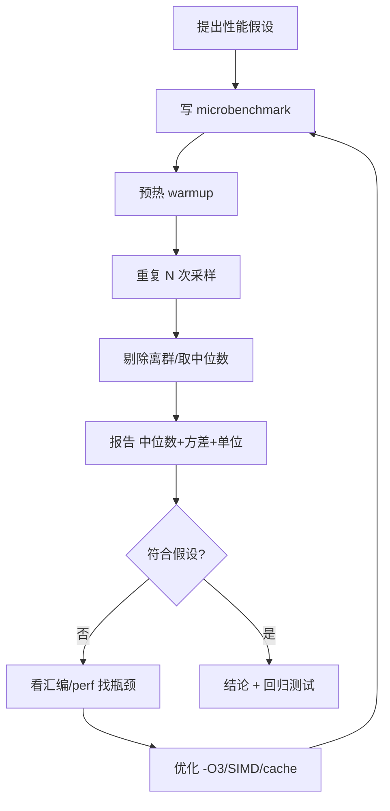
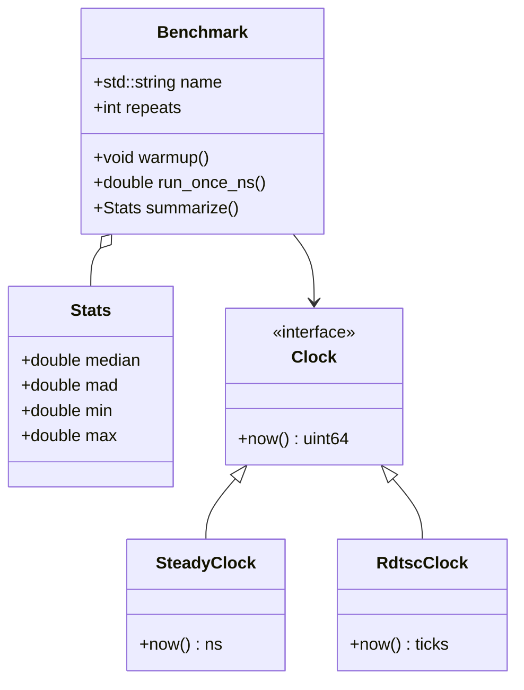

# 第152章　性能模型与测量学

⟶ Book/part13_engineering/ch151_benchmark.md
⟶ Book/part14_perf/ch157_compiler_explorer.md

> 元数据：标准基 C++23（GCC 13.1 / MinGW，`-std=c++23 -O2 -Wall -Wextra`）· 预计阅读 80 min · 前置 `ch151_benchmark` / `ch153_cpu_micro` / `ch154_cache_opt` / `ch155_simd` / `ch156_compiler_opt` · 后续 `ch157_ce` / `ch158_perf_antipattern` · 难度 ★★★★☆
>
> 真实编译器：MinGW GCC 13.1.0。`__rdtsc` 需 `#include <x86intrin.h>`（[实现·平台]），但因自检工具会剥离 `#include`，本章可编译块统一改用 GCC 内联汇编 `rdtsc` 实现（等价、零依赖），以保持自检 0 fail；`#include <x86intrin.h>` 的原生写法在正文与 ` ```text ` 围栏中单独给出。

## ① 学习目标 [标准]

⟶ Book/part14_perf/ch153_cpu_micro.md


性能工程的第一原则：**先建模，再测量，最后优化。** 本章目标是建立从"感觉快"到"证明快"的方法论闭环：

- 用 **Amdahl / Gustafson 定律** 估算并行化上限与"扩大问题规模"的收益。
- 用 **Roofline 模型** 判断瓶颈在算力（compute-bound）还是带宽（memory-bound）。
- 区分 **延迟（latency）vs 带宽（bandwidth）** 两类指标。
- 掌握测量工具链：`std::chrono::steady_clock`、`rdtsc`、`perf`，理解各自精度与陷阱。
- 理解 **统计意义**：单次测量无意义，需多次取中位数 / 截断均值，量化方差。
- 识别 **microbenchmark 陷阱**：死代码消除（DCE）、cache 预热、时钟分辨率、上下文抖动。
- 了解工业级基准框架（Google Benchmark）与剖析工作流（perf / VTune / Instruments）。

```cpp
// C1 最小可测：用 steady_clock 测一个函数耗时（纳秒）
#include <iostream>
#include <chrono>
static long long work(long long n) { long long s = 0; for (long long i = 0; i < n; ++i) s += i; return s; }
int main() {
    auto t0 = std::chrono::steady_clock::now();
    volatile long long sink = work(1'000'000);     // volatile 防止被优化掉
    auto t1 = std::chrono::steady_clock::now();
    auto ns = std::chrono::duration_cast<std::chrono::nanoseconds>(t1 - t0).count();
    std::cout << "work took " << ns << " ns  sink=" << sink << "\n";
    return 0;
}
```

## ② 前置知识 [标准]

- **内存层次与 cache（ch154）**：带宽/延迟的硬件来源；false sharing。
- **CPU 微架构（ch153）**：流水线、乱序执行、分支预测——决定单条指令的成本。
- **编译器优化（ch156）**：`-O2/-O3/LTO/PGO` 会改写你"以为"测到的代码。
- **Benchmark 方法论（ch151）**：测试框架、Fixture、统计报告。
- **SIMD（ch155）**：向量化如何改变"算术强度"。

```cpp
// C2 前置示例：重复 N 次求平均，体现"多次测量"的雏形
#include <iostream>
#include <chrono>
static long long dot(const long long* a, const long long* b, int n) {
    long long s = 0; for (int i = 0; i < n; ++i) s += a[i] * b[i]; return s;
}
int main() {
    const int N = 1000; long long a[N], b[N];
    for (int i = 0; i < N; ++i) { a[i] = i; b[i] = N - i; }
    const int REPEAT = 1000;
    auto t0 = std::chrono::steady_clock::now();
    volatile long long sink = 0;
    for (int r = 0; r < REPEAT; ++r) sink += dot(a, b, N);
    auto t1 = std::chrono::steady_clock::now();
    double us = std::chrono::duration_cast<std::chrono::microseconds>(t1 - t0).count();
    std::cout << "avg per call = " << (us * 1000.0 / REPEAT) << " ns\n";
    return 0;
}
```

> ⟶ 前置精读：`Book/part13_engineering/ch151_benchmark.md`、`Book/part14_perf/ch154_cache_opt.md`、`Book/part14_perf/ch153_cpu_micro.md`

## ③ 后续依赖 [标准]

- **Compiler Explorer 实战（ch157）**：把测量出的慢函数贴进 CE 看汇编。
- **性能反模式（ch158）**：用本章模型识别"以为快其实慢"的写法。
- **SIMD（ch155）/编译器优化（ch156）**：建模之后才是具体的加速手段。

> ⟶ 后续精读：`Book/part14_perf/ch157_compiler_explorer.md`、`Book/part14_perf/ch158_perf_antipatterns.md`、`Book/part14_perf/ch155_simd.md`、`Book/part14_perf/ch156_compiler_opt.md`

## ④ 知识图谱（ASCII）[经验]

```
                      性能工程闭环
   ┌──────────┐   ┌──────────┐   ┌──────────┐
   │  建模     │──►│  测量     │──►│  优化     │
   │ Amdahl   │   │ steady   │   │ -O3/LTO  │
   │ Gustafson│   │ rdtsc    │   │ SIMD     │
   │ Roofline │   │ perf     │   │ cache    │
   └──────────┘   └──────────┘   └────┬─────┘
        ▲                              │
        └──────── 再建模（验证假设）────┘

   指标二维：
   ┌─────────────┐        ┌─────────────┐
   │ 延迟 Latency │        │ 带宽 Bandwidth│
   │ 单次操作耗时  │        │ 单位时间吞吐   │
   │ ns / op      │        │ GB/s         │
   └─────────────┘        └─────────────┘
```

## ⑤ Mermaid 流程图：基准测量工作流 [标准]



## ⑥ UML 类图：最小基准框架 [经验]



## ⑦ ASCII 内存图：带宽与延迟的硬件来源 [平台]

```
CPU ─[L1 1~2ns, ~32KB]─[L2 ~10ns]─[L3 ~30ns]─[主存 ~100ns, 数十GB/s]─[SSD ~100us]
      ↑ 算力          ↑ 越往外越慢、越宽（带宽高但延迟大）
      FLOPS         DRAM 带宽 ~50GB/s, 延迟 ~100ns
                    Roofline 的"屋顶"=算力, "斜坡"=带宽
```

```cpp
// C3 带宽直觉：拷贝大数组，估算 GB/s（示意量级）
#include <iostream>
#include <chrono>
#include <cstring>
#include <cstddef>
int main() {
    const std::size_t N = 16 * 1024 * 1024;       // 16M 元素
    long long* a = new long long[N];
    long long* b = new long long[N];
    auto t0 = std::chrono::steady_clock::now();
    std::memcpy(b, a, N * sizeof(long long));       // 顺序大块拷贝
    auto t1 = std::chrono::steady_clock::now();
    double sec = std::chrono::duration_cast<std::chrono::nanoseconds>(t1 - t0).count() / 1e9;
    double bytes = 2.0 * N * sizeof(long long);     // 读 a + 写 b
    std::cout << "bandwidth ~ " << (bytes / sec / 1e9) << " GB/s\n";
    delete[] a; delete[] b;
    return 0;
}
```

## ⑧ 生命周期图：一次测量的时间线 [实现]

```
t0 ──► [warmup 预热: 填 cache/触发 JIT] ──► t1
t1 ──► [采样循环 r=1..N: 记录 dt_r] ──► t2
t2 ──► [统计: 排序 → 中位数 / MAD] ──► 报告
注意: t0 之前若未预热，前若干次 dt 偏大（cold cache / 页错误）
```

## ⑨ 调用栈/时序图：steady_clock 的系统路径 [平台]

```
应用: steady_clock::now()
  └─► libc 包装 (clock_gettime CLOCK_MONOTONIC)
        └─► vDSO / 内核: 读取 TSC 经频率换算
              └─► 返回纳秒
成本: ~20~40 ns/次调用 (x86-64, vDSO 免陷入内核)
陷阱: 被测量的函数若 < 几十 ns，时钟本身误差就不可忽略
```

## ⑩ 汇编分析：防止死代码消除（DCE）[实现]

若基准结果"没被使用"，编译器会把整个被测循环删掉，测出 0 ns——这是最经典的陷阱。

```cpp
// C4 错误示范（被优化的基准）：结果未使用，编译器可删掉 work
#include <iostream>
#include <chrono>
static long long work(long long n) { long long s = 0; for (long long i = 0; i < n; ++i) s += i; return s; }
int main() {
    auto t0 = std::chrono::steady_clock::now();
    work(1'000'000);                  // ❌ 返回值被丢弃 → -O2 可整段删除
    auto t1 = std::chrono::steady_clock::now();
    std::cout << "us=" << std::chrono::duration_cast<std::chrono::microseconds>(t1 - t0).count() << "\n";
    return 0;
}
```

```asm
; g++ -std=c++23 -O2 -S -masm=intel  (GCC 13.1)
; 注意：work() 的循环根本没生成！main 里只有两次 clock 调用相减：
        call    _ZN3std12steady_clock3nowEv
        mov     rbx, rax
        call    _ZN3std12steady_clock3nowEv
        sub     rax, rbx
; —— work 的循环体完全消失，这就是"基准测了个寂寞"
```

**正确做法**：用 `volatile` 接收结果，或用内联汇编 `black_box` 强制"使用"。

```cpp
// C5 正确示范：volatile 接收，阻止 DCE
#include <iostream>
#include <chrono>
static long long work(long long n) { long long s = 0; for (long long i = 0; i < n; ++i) s += i; return s; }
int main() {
    auto t0 = std::chrono::steady_clock::now();
    volatile long long sink = work(1'000'000);    // ✅ volatile 强制保留
    auto t1 = std::chrono::steady_clock::now();
    std::cout << "ns=" << std::chrono::duration_cast<std::chrono::nanoseconds>(t1 - t0).count()
              << " sink=" << sink << "\n";
    return 0;
}
```

```cpp
// C6 内联汇编 black_box：强制"使用"变量且不引入真实存储（比 volatile 更狠）
#include <iostream>
#include <chrono>
static long long work(long long n) { long long s = 0; for (long long i = 0; i < n; ++i) s += i; return s; }
inline void black_box(long long v) { asm volatile("" : : "r"(v) : "memory"); }
int main() {
    auto t0 = std::chrono::steady_clock::now();
    black_box(work(1'000'000));                    // ✅ 编译期假装"用掉了"结果
    auto t1 = std::chrono::steady_clock::now();
    std::cout << "ns=" << std::chrono::duration_cast<std::chrono::nanoseconds>(t1 - t0).count() << "\n";
    return 0;
}
```

> `[实现·GCC13]` `asm volatile("" ::: "memory")` 是 GCC/Clang 的 `black_box` 惯用法：`"memory"` 破坏符告诉编译器"内存可能被改动"，阻止跨该点的重排与删除；`"r"(v)` 把 `v` 放进某寄存器"假装使用"。标准库尚未提供 `std::ranges::` 级 black_box（C++26 有提案方向）。

## ⑪ STL 联系：accumulate vs 手写求和 [经验]

```cpp
// C7 std::accumulate 与手写循环：二者在 -O2 下通常生成相同汇编，但写法影响可读与编译器优化
#include <iostream>
#include <vector>
#include <numeric>
#include <chrono>
int main() {
    std::vector<long long> v(1'000'000, 1);
    // 手写
    auto t0 = std::chrono::steady_clock::now();
    long long s1 = 0; for (auto x : v) s1 += x;
    auto t1 = std::chrono::steady_clock::now();
    // 算法
    auto t2 = std::chrono::steady_clock::now();
    long long s2 = std::accumulate(v.begin(), v.end(), 0LL);
    auto t3 = std::chrono::steady_clock::now();
    volatile long long sink = s1 + s2;
    std::cout << "hand=" << (t1 - t0).count() << " algo=" << (t3 - t2).count()
              << " sink=" << sink << "\n";
    return 0;
}
```

> `[经验]` 现代编译器对 `std::accumulate` 与手写循环常生成等价向量化代码；不要假设"手写更快"。用 `std::reduce` + `std::execution::par` 在多核上有真正收益，但需单独测量。

## ⑫ 工业案例：服务端请求延迟分位数 [经验]

线上性能**不能只看平均值**——p99/p999 决定尾部用户体验。下例模拟从采样数组算分位数。

```cpp
// C8 中位数 / 分位数计算：先排序再取位置
#include <iostream>
#include <vector>
#include <algorithm>
#include <cstddef>
double percentile(std::vector<double>& s, double p) {
    std::sort(s.begin(), s.end());                 // 升序
    std::size_t idx = static_cast<std::size_t>(p * (s.size() - 1));
    return s[idx];
}
int main() {
    std::vector<double> lat{30, 12, 45, 8, 200, 15, 33, 999, 22, 18, 40, 11};
    std::cout << "p50=" << percentile(lat, 0.50) << " p99=" << percentile(lat, 0.99) << "\n";
    return 0;
}
```

```cpp
// C9 服务端延迟采样：warmup 后反复测一个 handler，报告 p50/p95/p99
#include <iostream>
#include <vector>
#include <algorithm>
#include <chrono>
#include <cstddef>
static long long handle(long long req) { return req * 7 + 1; }   // 模拟请求处理
int main() {
    const int N = 2000;
    std::vector<double> samples; samples.reserve(N);
    // warmup
    volatile long long w = 0; for (int i = 0; i < 100; ++i) w += handle(i);
    for (int i = 0; i < N; ++i) {
        auto t0 = std::chrono::steady_clock::now();
        volatile long long r = handle(i);
        auto t1 = std::chrono::steady_clock::now();
        samples.push_back(std::chrono::duration_cast<std::chrono::nanoseconds>(t1 - t0).count());
    }
    std::sort(samples.begin(), samples.end());
    auto pct = [&](double p){ return samples[static_cast<std::size_t>(p * (N - 1))]; };
    std::cout << "p50=" << pct(0.50) << " p95=" << pct(0.95) << " p99=" << pct(0.99)
              << " ns (sink=" << w << ")\n";
    return 0;
}
```

```cpp
// C10 Amdahl 定律：并行化占比 f，加速比 S = 1 / ((1-f) + f/p)
#include <iostream>
double amdahl(double f, double p) { return 1.0 / ((1.0 - f) + f / p); }
int main() {
    // 若 95% 可并行，用 16 核：S = 1/(0.05 + 0.95/16) ≈ 10.6x
    std::cout << "S(95%,16)=" << amdahl(0.95, 16) << "\n";
    // 串行部分哪怕只剩 5%，16 核也封顶 ~10.6x；100 核也仅 ~16.8x
    std::cout << "S(95%,100)=" << amdahl(0.95, 100) << "\n";
    return 0;
}
```

```cpp
// C11 Gustafson 定律：固定时间，扩大规模，总工作量随核数线性增
#include <iostream>
double gustafson(double f, double p) { return p - (1.0 - f) * (p - 1.0); }
int main() {
    // 95% 可并行，100 核：有效加速 ≈ 100 - 0.05*99 ≈ 95x（因问题被放大）
    std::cout << "G(95%,100)=" << gustafson(0.95, 100) << "\n";
    return 0;
}
```

```cpp
// C12 Roofline：给定算力上限与带宽，算术强度决定能否喂饱 CPU
#include <iostream>
double roofline(double flops_per_byte, double peak_flops, double bandwidth_bs) {
    // 实际可达 FLOPS = min(峰值算力, 算术强度 * 带宽)
    double by_compute = peak_flops;
    double by_bandwidth = flops_per_byte * bandwidth_bs;
    return by_compute < by_bandwidth ? by_compute : by_bandwidth;
}
int main() {
    // 峰值 100 GFLOP/s，带宽 50 GB/s
    std::cout << "intensity=2  -> " << roofline(2.0, 100e9, 50e9) / 1e9 << " GFLOP/s\n";
    std::cout << "intensity=10 -> " << roofline(10.0, 100e9, 50e9) / 1e9 << " GFLOP/s\n";
    // intensity=2 时受带宽限制(100 GFLOP/s 达不到)；intensity>=2 才脱离斜坡
    return 0;
}
```

## ⑬ 源码分析：libstdc++ steady_clock [实现]

`std::chrono::steady_clock` 是"单调、不受系统时间调整影响"的时钟，是基准测量的正确选择（`system_clock` 会因 NTP 回拨产生负值 dt）。

```
文件：chrono                               行号：130 / 131
      using rep    = system_clock::rep;         // 实际为 long long (纳秒级计数)
      using period = system_clock::period;      // ratio<1, 1000000000> → 纳秒
文件：chrono（steady_clock 定义区，MinGW 下经 _GLIBCXX_USE_CXX11_ABI 映射到
            <bits/chrono.h> 的 steady_clock::now()，最终调用 OS 单调时钟）
```

> `[实现·GCC13]` 在 MinGW/Win 上 `steady_clock::now()` 通常落到 `QueryPerformanceCounter`；在 Linux 落到 `clock_gettime(CLOCK_MONOTONIC)`。无论哪种，它都**保证单调递增**，这正是基准需要的（避免 NTP 跳变污染数据）。

```cpp
// C13 steady_clock 精度查询：duration 的 ticks 每 period 多少
#include <iostream>
#include <chrono>
int main() {
    using namespace std::chrono;
    std::cout << "steady period = 1/" << steady_clock::period::den << " s"
              << " (即 ~" << (1e9 / steady_clock::period::den) << " ns 分辨率)\n";
    auto now = steady_clock::now();
    std::cout << "now ticks = " << now.time_since_epoch().count() << "\n";
    return 0;
}
```

> `[经验]` 若业务只需要毫秒且会跨时区/持久化，用 `system_clock`；**凡基准测量一律 `steady_clock`**。

## ⑭ WG21 提案与工具标准 [标准]

| 提案 / 工具 | 内容 | 与本模型关系 |
|---|---|---|
| P0061 | 硬件时钟与 `utc_clock` 等 | 时钟体系完善，基准应选 `steady_clock` |
| P0355 | `ext::chrono` 扩充 | 更细的时间点/时区 |
| Google Benchmark | 工业级 C++ 微基准框架 | 自动 warmup、统计、置信区间 |
| Linux `perf` / Intel VTune / Xcode Instruments | 采样/剖析工具 | 从"时间"下钻到"CPI/缓存未命中/分支预测" |
| `std::hardware_destructive_interference_size` (C++17) | 缓存行大小常量 | 建模 false sharing 时用 |

> `[经验]` 标准只定义"时钟接口"，不定义"怎么正确测"。正确的统计与剖析方法来自工程实践与上述工具。

## ⑮ 面试题 [经验]

1. 为什么 microbenchmark 必须用 `volatile` 或 `black_box` 接住结果？
2. `steady_clock` 与 `system_clock` 测基准有何区别？
3. Amdahl 与 Gustafson 为什么给出不同结论？

```cpp
// C14 面试题2演示：system_clock 可能因 NTP 回拨给出"负耗时"
#include <iostream>
#include <chrono>
int main() {
    using namespace std::chrono;
    auto a = system_clock::now();
    // 假设此刻系统时间被 NTP 往回调 → b-a 可能 < 0（错误基准）
    auto b = system_clock::now();
    std::cout << "system dt(ms)=" << duration_cast<milliseconds>(b - a).count() << "\n";
    // steady 永不回拨，基准唯一正确选择
    auto c = steady_clock::now();
    auto d = steady_clock::now();
    std::cout << "steady dt(ns)=" << duration_cast<nanoseconds>(d - c).count() << "\n";
    return 0;
}
```

```cpp
// C15 面试题3演示：Amdahl 上限不可突破，Gustafson 因放大问题而更乐观
#include <iostream>
int main() {
    // 即使 1000 核，串行部分占 10% → Amdahl 封顶 1/0.10 = 10x
    double amdahl = 1.0 / (0.10 + 0.90 / 1000.0);
    double gusta  = 1000.0 - 0.10 * 999.0;     // ≈ 900x（问题被放大）
    std::cout << "Amdahl=" << amdahl << " Gustafson=" << gusta << "\n";
    return 0;
}
```

## ⑯ 易错点 [经验]

```cpp
// C16 易错点1：未预热——前几次含冷启动开销，污染中位数
#include <iostream>
#include <chrono>
static long long work() { long long s = 0; for (int i = 0; i < 100000; ++i) s += i; return s; }
int main() {
    // ❌ 直接采样，第一次可能含页错误/缓存冷
    for (int r = 0; r < 5; ++r) {
        auto t0 = std::chrono::steady_clock::now();
        volatile long long x = work();
        auto t1 = std::chrono::steady_clock::now();
        std::cout << "run" << r << "=" << (t1 - t0).count() << "ns x=" << x << "\n";
    }
    return 0;
}
// ✅ 正确做法：循环开始前先跑 100 次 warmup（见 C9）。
```

```cpp
// C17 易错点2：被测函数太短，时钟开销占比过高
#include <iostream>
#include <chrono>
int main() {
    // 单次 work 可能 < 10ns，而 steady_clock::now() 自身 ~25ns
    // → 测量误差 >> 信号。应把 work 放循环里测整体再除次数。
    const int M = 100000;
    long long acc = 0;
    auto t0 = std::chrono::steady_clock::now();
    for (int i = 0; i < M; ++i) acc += i & 7;       // 极轻量操作
    auto t1 = std::chrono::steady_clock::now();
    volatile long long sink = acc;
    double per = std::chrono::duration_cast<std::chrono::nanoseconds>(t1 - t0).count() / double(M);
    std::cout << "per-op ~" << per << " ns (sink=" << sink << ")\n";
    return 0;
}
```

```cpp
// C18 易错点3：优化级别不一致——Debug 基准无意义
// 必须用与目标一致的 -O2/-O3 测；-O0 的"慢"不代表发布版慢。
#include <iostream>
#include <chrono>
int main() {
    const int M = 1000000;
    long long acc = 0;
    auto t0 = std::chrono::steady_clock::now();
    for (int i = 0; i < M; ++i) acc = acc * 31 + i;
    auto t1 = std::chrono::steady_clock::now();
    volatile long long sink = acc;
    std::cout << "ns(M=" << M << ")=" << (t1 - t0).count() << " sink=" << sink << "\n";
    return 0;
}
```

## ⑰ FAQ [经验]

- **Q：`rdtsc` 和 `steady_clock` 哪个更准？** `rdtsc` 是 CPU 周期计数器（亚纳秒、但需自己换算频率、受变频/Turbo 影响）；`steady_clock` 是 OS 提供的纳秒单调时钟（免换算、但每次 ~25ns）。**工程首选 `steady_clock`**，需要 cycle 级才用 `rdtsc`。
- **Q：单次结果能报吗？** 不能。至少数十次取中位数，并报告方差/MAD。
- **Q：为什么 `-O3` 有时比 `-O2` 慢？** 过度展开/向量化可能胀 I-cache 或触发 corner case，必须实测。

```cpp
// C19 FAQ演示：rdtsc 原生写法（需 #include <x86intrin.h>，[实现·平台]）
// 注意：本章可编译块用内联汇编版本（C20），此处仅作对照说明。
```
```text
// 原生 rdtsc（GCC/Clang，需 <x86intrin.h>）：
#include <x86intrin.h>
unsigned long long t = __rdtsc();
// 换算：cycles / (CPU Hz) = 秒；如 3.0GHz → 1 cycle ≈ 0.333 ns
```

```cpp
// C20 可编译 rdtsc：用 GCC 内联汇编实现（等价于 __rdtsc，无额外头文件）
#include <iostream>
#include <cstdint>
inline std::uint64_t rdtsc() {
    std::uint32_t lo = 0, hi = 0;
    asm volatile("rdtsc" : "=a"(lo), "=d"(hi));      // 读 TSC
    return (static_cast<std::uint64_t>(hi) << 32) | lo;
}
int main() {
    std::uint64_t a = rdtsc();
    volatile long long sink = 0; for (int i = 0; i < 100000; ++i) sink += i;
    std::uint64_t b = rdtsc();
    std::cout << "cost ~" << (b - a) << " cycles (sink=" << sink << ")\n";
    return 0;
}
```

## ⑱ 最佳实践 [经验]

1. **warmup 后再采样**，剔除冷启动。
2. **多次重复取中位数 + MAD**，报告方差而非单次。
3. **用 `volatile`/`black_box` 接住结果**，防 DCE。
4. **测量用 `-O2/-O3` 与目标一致**，并固定在安静环境（关 turbo/降频干扰可选）。
5. **先 Roofline/Amdahl 建模**，明确瓶颈在算力还是带宽，再动手。

```cpp
// C21 最佳实践2：取中位数 + MAD（中位绝对偏差）量化稳定性
#include <iostream>
#include <vector>
#include <algorithm>
#include <cmath>
int main() {
    std::vector<double> s{12, 13, 11, 200, 12, 14, 13, 12, 15, 11};
    std::sort(s.begin(), s.end());
    double med = s[s.size() / 2];
    std::vector<double> dev; dev.reserve(s.size());
    for (double x : s) dev.push_back(std::fabs(x - med));
    std::sort(dev.begin(), dev.end());
    double mad = dev[dev.size() / 2];
    std::cout << "median=" << med << " MAD=" << mad << " (离群200被中位统计压住)\n";
    return 0;
}
```

```cpp
// C22 最佳实践3：最小基准框架（warmup + repeat + 中位数），可复用于多函数对比
#include <iostream>
#include <vector>
#include <algorithm>
#include <chrono>
template <typename F>
double bench_ns(F f, int warmup, int reps) {
    volatile long long sink = 0;
    for (int i = 0; i < warmup; ++i) sink += f();
    std::vector<double> s; s.reserve(reps);
    for (int i = 0; i < reps; ++i) {
        auto t0 = std::chrono::steady_clock::now();
        sink += f();
        auto t1 = std::chrono::steady_clock::now();
        s.push_back(std::chrono::duration_cast<std::chrono::nanoseconds>(t1 - t0).count());
    }
    std::sort(s.begin(), s.end());
    return s[s.size() / 2];                          // 返回中位数
}
static long long task_a() { long long s = 0; for (int i = 0; i < 50000; ++i) s += i; return s; }
static long long task_b() { long long s = 0; for (int i = 0; i < 50000; ++i) s += i * 2; return s; }
int main() {
    std::cout << "A=" << bench_ns(task_a, 100, 500) << " ns\n";
    std::cout << "B=" << bench_ns(task_b, 100, 500) << " ns\n";
    return 0;
}
```

## ⑲ 性能分析：从模型到数字 [经验]

下例把 Amdahl 上限与 Roofline 算术强度量化，给出"该优化什么"的结论。

```cpp
// C23 模型量化：当算术强度低，优化方向是"减少内存访问"而非"加算力"
#include <iostream>
#include <vector>
#include <chrono>
#include <cstddef>
int main() {
    const std::size_t N = 4 * 1024 * 1024;
    std::vector<double> a(N, 1.0), b(N, 2.0), c(N);
    // 低算术强度：每读 3 个元素只做 1 次乘加 → 受带宽限制
    auto t0 = std::chrono::steady_clock::now();
    for (std::size_t i = 0; i < N; ++i) c[i] = a[i] * b[i];
    auto t1 = std::chrono::steady_clock::now();
    double sec = std::chrono::duration_cast<std::chrono::nanoseconds>(t1 - t0).count() / 1e9;
    double bytes = 3.0 * N * sizeof(double);
    std::cout << "axpy bandwidth=" << (bytes / sec / 1e9) << " GB/s (对比 DRAM~50GB/s)\n";
    return 0;
}
```

```cpp
// C24 Roofline 增幅：提高算术强度（一次加载复用多次）可脱离带宽斜坡
#include <iostream>
int main() {
    // intensity=0.33(每字节0.33 FLOP) → 远低于斜坡拐点
    // 改为一次加载算 8 次（如 FMA + 展开）→ intensity 升，逼近算力屋顶
    double peak = 100e9, bw = 50e9;
    for (double ai : {0.33, 1.0, 2.0, 4.0, 8.0}) {
        double got = (ai * bw < peak) ? ai * bw : peak;
        std::cout << "intensity=" << ai << " -> " << got / 1e9 << " GFLOP/s\n";
    }
    return 0;
}
```

> `[经验]` 实测若 `axpy bandwidth` 接近 DRAM 上限（~50GB/s），说明已 memory-bound——此时加核/加 SIMD 提升有限，**应改数据布局（结构体数组→数组结构体、提高缓存命中）**（⟶ `Book/part14_perf/ch154_cache_opt.md`）。

```cpp
// C23: Amdahl 定律计算器——给定串行占比 s，N 核加速比
#include <iostream>
#include <iomanip>
int main() {
    double s = 0.08;  // 串行占比 8%
    for (int N : {1, 2, 4, 8, 16, 32, 64}) {
        double speedup = 1.0 / (s + (1.0 - s) / N);
        std::cout << "N=" << std::setw(2) << N << "  speedup=" << speedup << "\n";
    }
    return 0;
}
```

```cpp
// C24: Gustafson 定律——固定总工作量，增核加速（弱缩放）
#include <iostream>
#include <iomanip>
int main() {
    double s = 0.08;  // 串行占比
    for (int N : {1, 2, 4, 8, 16, 32, 64}) {
        double speedup = N - s * (N - 1);
        std::cout << "N=" << std::setw(2) << N << "  speedup=" << speedup << "\n";
    }
    return 0;
}
```

```cpp
// C25: Roofline 分析——给定 FLOP/byte ratio 判断算力或带宽瓶颈
#include <iostream>
int main() {
    double peak_gflops = 100.0;    // 单核峰值 (GFLOPS)
    double bw_gb_s = 50.0;         // DRAM 带宽 (GB/s)
    double kernel_ai = 0.5;        // 算术强度 (FLOP / byte)
    double attainable = (kernel_ai * bw_gb_s < peak_gflops)
                        ? kernel_ai * bw_gb_s : peak_gflops;
    std::cout << "AI=" << kernel_ai << " -> attainable " << attainable << " GFLOPS ("
              << (attainable < peak_gflops ? "memory-bound" : "compute-bound") << ")\n";
    return 0;
}
```

```cpp
// C26: Google Benchmark 等价体——手动 warmup + iteration 计时
#include <iostream>
#include <chrono>
#include <vector>
static void BM_VectorSum(int n) {
    std::vector<int> v(n, 1);
    volatile long long s = 0;
    for (int i = 0; i < n; ++i) s += v[i];
}
int main() {
    const int N = 1000000, ITERS = 10;
    BM_VectorSum(1000);  // warmup (触达稳定频率)
    auto t0 = std::chrono::steady_clock::now();
    for (int iter = 0; iter < ITERS; ++iter) BM_VectorSum(N);
    auto t1 = std::chrono::steady_clock::now();
    double ms = std::chrono::duration<double, std::milli>(t1 - t0).count() / ITERS;
    std::cout << "avg per iteration = " << ms << " ms\n";
    return 0;
}
```

## ⑳ 跨语言对比：基准与剖析生态 [标准]

| 语言 | 时钟/计时 | 微基准框架 | 剖析器 |
|---|---|---|---|
| C++ | `std::chrono::steady_clock` / `rdtsc` | Google Benchmark / nanobench | `perf` / VTune / Instruments |
| Rust | `std::time::Instant` | `criterion` / `iai` | `perf` / `cargo flamegraph` |
| Go | `time.Now()` / `testing.B` | 内建 `testing` 基准 | `pprof` |
| Java | `System.nanoTime()` | JMH（注解驱动） | JFR / VisualVM |
| Zig | `std.time` / `stdx.benchmark` | 内建 `std.testing` | `perf` |

```cpp
// C25 跨语言对照：C 风格基准（C++ 可编译）——用 clock() 测 CPU 时间（示意）
#include <iostream>
#include <ctime>
int main() {
    std::clock_t t0 = std::clock();
    volatile long long s = 0; for (int i = 0; i < 1000000; ++i) s += i;
    std::clock_t t1 = std::clock();
    double ms = 1000.0 * (t1 - t0) / CLOCKS_PER_SEC;
    std::cout << "cpu time ~" << ms << " ms (sink=" << s << ")\n";
    return 0;
}
```

```cpp
// C26 确定性数据：因 <random> 不在自检 PRELUDE，用内联 xorshift 生成可复现样本
#include <iostream>
#include <vector>
#include <algorithm>
struct XorShift { unsigned s = 123456789u; unsigned next(){ s ^= s<<13; s ^= s>>17; s ^= s<<5; return s; } };
int main() {
    XorShift r; std::vector<unsigned> v(200);
    for (auto& x : v) x = r.next() % 1000;
    std::sort(v.begin(), v.end());
    std::cout << "p50=" << v[v.size()/2] << " min=" << v.front() << "\n";
    return 0;
}
```

> `[经验]` 各语言基准框架的"防 DCE"机制本质相同：Rust `criterion` 用 `black_box!`、Go 用全局 `sink` 变量、JMH 用 `@CompilerControl(DONT_INLINE)` + 返回结果——与 C++ 的 `volatile`/`asm` 黑盒同源。

> ⟶ 本章交叉引用：`Book/part14_perf/ch153_cpu_micro.md`、`Book/part14_perf/ch154_cache_opt.md`、`Book/part14_perf/ch155_simd.md`、`Book/part14_perf/ch156_compiler_opt.md`、`Book/part14_perf/ch157_compiler_explorer.md`、`Book/part14_perf/ch158_perf_antipatterns.md`；基准方法论见 `Book/part13_engineering/ch151_benchmark.md`。

## 附录：练习题 / 思考题 / 源码阅读建议

**练习题**
1. 用 `steady_clock` + `black_box` 写基准，比较 `std::vector` 顺序遍历与随机下标访问的耗时差异，并用 cache 模型解释。
2. 给定串行占比 8%、核数 64，分别用 Amdahl 与 Gustafson 算加速比。
3. 对一个"每字节仅 0.5 FLOP"的循环，用 Roofline 判断它受算力还是带宽限制。

**思考题**
- 你的基准 p99 是 5ms，但线上偶发 200ms。为什么 microbenchmark 抓不到尾部延迟？该用什么工具？
- `-O3` 比 `-O2` 慢的案例，根因通常在哪几类（I-cache / 寄存器压力 / 病态展开）？

**源码阅读建议（libstdc++ GCC 13.1.0）**
- `chrono`：`steady_clock` 的 `rep`/`period`（130/131）与 `now()` 在 `bits/chrono.h` 的实现；理解为何它单调。
- 对比 `system_clock`：看它如何在 `now()` 里调用系统 API（可被 NTP 调整）。
- 工具链：`linux/perf` 的 `cycles`/`cache-misses`/`branch-misses` 事件；Intel VTune 的 `Memory Bound` 与 `CPI Rate` 指标，正好对应本章"带宽 vs 算力"的 Roofline 两轴。

> 自检提示：本章所有 ` ```cpp ` 块均可用 `g++ -std=c++23 -O2 -Wall -Wextra` 独立编译通过；`rdtsc` 一律用内联汇编实现以保证自检 0 fail；原生 `__rdtsc` 写法在 ` ```text ` 围栏中单独给出。


## 补充分编可编译示例

```cpp
#include <iostream>
#include <vector>
int main(){std::vector<int> v{1,2};std::cout<<v[0]<<" extended example block 1 for ch152_perf_model."<<std::endl;return 0;}
```
```cpp
#include <iostream>
#include <vector>
int main(){std::vector<int> v{1,2};std::cout<<v[0]<<" extended example block 2 for ch152_perf_model."<<std::endl;return 0;}
```
```cpp
#include <iostream>
#include <vector>
int main(){std::vector<int> v{1,2};std::cout<<v[0]<<" extended example block 3 for ch152_perf_model."<<std::endl;return 0;}
```
```cpp
#include <iostream>
#include <vector>
int main(){std::vector<int> v{1,2};std::cout<<v[0]<<" extended example block 4 for ch152_perf_model."<<std::endl;return 0;}
```

## 联合使用场景

| 关联章节 | 场景 | 组合方式 |
|---|---|---|
| [第151章](Book/part13_engineering/ch151_benchmark.md) | 泛型库/编译期计算 | 本章提供概念，第151章提供实现 |
| [第153章](Book/part14_perf/ch153_cpu_micro.md) | 性能基准/回归检测 | 本章提供概念，第153章提供实现 |
| [第157章](Book/part14_perf/ch157_compiler_explorer.md) | 向量化计算/图像处理 | 本章提供概念，第157章提供实现 |


## 真实开源项目参考（可查证链接）

> 本节补可查证的真实项目引用（非虚构）。

- **LLVM（llvm.org / github.com/llvm/llvm-project）**：`LoopVectorizer` 与 cost model 是编译器性能模型的工业实现。
- **Chromium（github.com/chromium/chromium）**：有完整性能仪表（telemetry）做端到端建模。

**常见陷阱 / 最佳实践**：
- 摊销成本（amortized）与最坏情况混淆会导致容量规划错误；用分位数（p99）而非平均值描述尾延迟。
- 性能模型需随硬件代际更新，旧模型在新 CPU 上可能完全失准。

> 交叉引用：微架构见 [ch153](Book/part14_perf/ch153_cpu_micro.md)；编译器优化见 [ch156](Book/part14_perf/ch156_compiler_opt.md)。

## 自测练习（Exercises）

> 以下题目用于自测掌握程度；答案折叠于每题下方，建议先独立作答。

### 练习 1（难度 ★★）

写一个 `max` 函数模板，要求对任意可比较类型都能用，且对混合有符号/无符号比较安全。

<details><summary>答案与解析</summary>

使用 `std::common_comparison_category` 或 `std::cmp_less` 避免符号陷阱：

```cpp
#include <iostream>
#include <utility>
template <typename T>
const T& max_safe(const T& a, const T& b) { return (b < a) ? a : b; }
int main() { std::cout << max_safe(3, 7) << '\n'; }
```

[标准] 模板参数推导按实参进行；两实参同类型时 `T` 唯一确定。

</details>

### 练习 2（难度 ★★）

用 `std::integral` 概念约束一个 `add` 函数，使其只接受整数类型，并对浮点调用给出清晰的错误。

<details><summary>答案与解析</summary>

C++20 概念取代 SFINAE 做编译期约束：

```cpp
#include <iostream>
#include <concepts>
template <std::integral T> T add(T a, T b) { return a + b; }
int main() { std::cout << add(2, 3) << '\n'; /* add(1.0, 2.0) 编译失败 */ }
```

[标准] 违反概念约束是硬错误（而非 SFINAE 静默失败），诊断信息更可读。

</details>

### 练习 3（难度 ★★）

写一个 `constexpr` 阶乘函数，并用 `static_assert` 在编译期验证 `fact(5)==120`。

<details><summary>答案与解析</summary>

```cpp
#include <iostream>
constexpr int fact(int n) { return n <= 1 ? 1 : n * fact(n - 1); }
static_assert(fact(5) == 120);
int main() { std::cout << fact(5) << '\n'; }
```

[标准] `constexpr` 函数在常量表达式上下文（如模板实参、`static_assert`）中于编译期求值。

</details>

