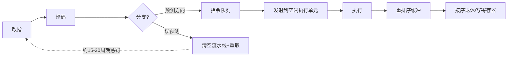
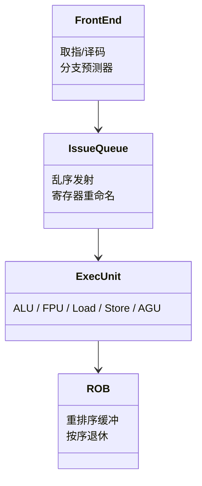
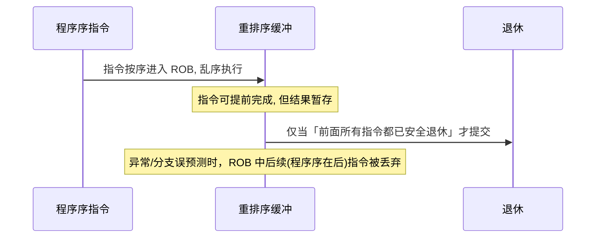
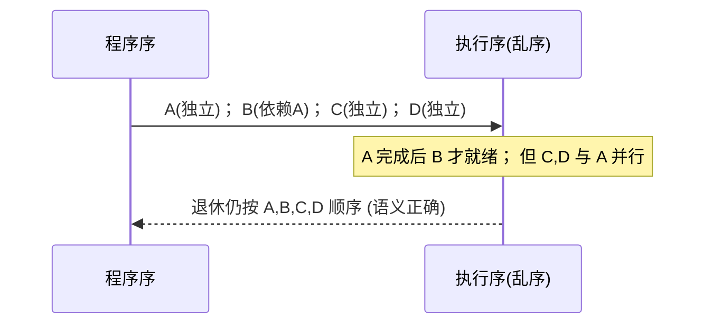

# 第153章　CPU 微架构：流水线 / 分支预测 / 乱序执行

⟶ Book/part14_perf/ch154_cache_opt.md
⟶ Book/part14_perf/ch152_perf_model.md

> 真实编译器：MinGW GCC 13.1.0（`-std=c++23 -O2 -Wall -Wextra`）。
> 源码根：`C:/Qt/Tools/mingw1310_64/lib/gcc/x86_64-w64-mingw32/13.1.0/include/c++/`；本章 `[平台]`/`[实现]` 级内容标注 GCC 内置与外部源码位置（CPU 微架构涉及 GCC 中端，非 libstdc++）。
> 标准基：ISO/IEC 14882:2023（C++23）。立场分层：`[标准]` 语言/库规定 · `[实现]` 编译器行为 · `[平台]` x86-64 微架构/ABI · `[经验]` 工程共识。

## ① 学习目标 [标准]

⟶ Book/part14_perf/ch152_perf_model.md
⟶ Book/part14_perf/ch154_cache_opt.md


读完本章你能独立回答：

1. **经典五级流水线**（取指 IF → 译码 ID → 执行 EX → 访存 MEM → 写回 WB）各阶段职责与吞吐瓶颈。
2. **超标量（superscalar）** 与**乱序执行（OoO）** 如何让多条/多个无关指令并行，提升 ILP（指令级并行）。
3. **分支预测器** 如何消解控制依赖；`[[likely]]`/`[[unlikely]]` 与 `__builtin_expect` 怎样把「大概率走向」告诉编译器。
4. **分支误预测惩罚** 的真实量级（现代 x86-64 约 15~20 周期），以及如何用「无分支代码」规避。
5. **重排序缓冲（ROB）** 与「按程序序提交」如何兼顾乱序执行与「看似顺序」的语义（含异常处理正确性）。
6. **依赖链（dependency chain）** 如何限制 ILP：即使核心能每周期发射多条指令，一条长依赖链仍被其**关键路径延迟**钉死。
7. 如何通过实测（无分支化、拆依赖链、4 路展开）观察上述效应的数量级。

## ② 前置知识 ⟶ 链接

- 性能模型与测量学 ⟶ `Book/part14_perf/ch152_perf_model.md`（本章所有数字都靠它测得）。
- 缓存优化与数据局部性 ⟶ `Book/part14_perf/ch154_cache_opt.md`（流水线之上还有内存层级）。
- 编译器优化 O2/O3/LTO/PGO ⟶ `Book/part14_perf/ch156_compiler_opt.md`（分支提示、循环展开由它落地）。
- Compiler Explorer 实战 ⟶ `Book/part14_perf/ch157_compiler_explorer.md`（看 `-O2` 下分支如何变成 `cmov`）。

## ③ 后续依赖 ⟶ 链接

- 缓存优化与数据局部性 ⟶ `Book/part14_perf/ch154_cache_opt.md`。
- SIMD / AVX 向量化 ⟶ `Book/part14_perf/ch155_simd.md`（数据级并行，与 ILP 互补）。
- 性能反模式与陷阱 ⟶ `Book/part14_perf/ch158_perf_antipatterns.md`。

## ④ 知识图谱（ASCII）[平台]

```
                 x86-64 核心(单线程视角)
   ┌──────────────────────────────────────────────────┐
   │ 取指 IF ─ 译码 ID ─ [分支预测器]                   │
   │        │                                          │
   │        ▼                                          │
   │  指令队列 ──► 发射(超标量, 每周期多条)             │
   │        │                                          │
   │        ▼                                          │
   │  多个执行单元: ALU / ALU / AGU / FPU / Load / Store│
   │        │                                          │
   │        ▼                                          │
   │  重排序缓冲 ROB ──► 按程序序提交(退休 Retire)      │
   └──────────────────────────────────────────────────┘
   依赖链:  a = a + x; a = a + x; ...  ← 每步等上一步, 钉死吞吐
   无关链:  s0+=..; s1+=..;  ← 可并行, 吃满多个执行单元
   分支:    预测命中(0代价) / 误预测(≈15~20周期惩罚)
```

## ⑤ 流程图：一条指令的微架构旅程（Mermaid）[平台]



## ⑥ UML 类图：执行单元与缓冲（Mermaid）[平台]



## ⑦ ASCII 内存图：依赖链 vs 无关链（微架构视角）[平台]

```
依赖链 (关键路径=各延迟之和):
  t0: a = a + x0      ┐
  t1: a = a + x1      ├─ 每个加法等上一个 a 就绪 (ALU 延迟 ~1 周期, 但发射受限于就绪)
  t2: a = a + x2      ┘  => 3 周期才完成 3 次加法 (ILP=1)

无关链 (ILP 可被压榨):
  t0: s0 = s0 + x0  ┐
  t1: s1 = s1 + y0  ├─ 无数据依赖, 可同周期发射到不同 ALU
  t2: s2 = s2 + z0  ┘  => 3 加法 ~1 周期完成 (受端口/寄存器压力限制)
```

## ⑧ 生命周期图：乱序执行与按序退休（Mermaid）[平台]



## ⑨ 调用栈 / 时序图：OoO 重排示意（程序序 vs 执行序）[平台]



## ⑩ 汇编分析（-O2，Intel 语法）：分支 → cmov 与依赖链 [实现]

**分支被编译为 `cmov`（无分支）**：当编译器判断「用条件传送比预测更好」时，消除分支。

```cpp
// 文件：Examples/ch153_cmov_asm.cpp  行号：1-50（完整示例）
// 编译：g++ -std=c++23 -O2 -S -masm=intel ch153_cmov_asm.cpp -o ch153_cmov_asm.asm
#include <iostream>
int pick(int cond, int x, int y) { return cond ? x : y; }
int main() { std::cout << pick(1, 10, 20) << "\n"; return 0; }
```

```x86asm
; -O2 下 pick 常为:
;   mov  eax, edx          ; 默认取 y
;   test ecx, ecx
;   cmove eax, esi         ; 条件传送(无分支跳转) —— 避免预测失败
;   ret
```

**长依赖链的限制**（汇编层面就是一连串互相依赖的 `add`）：

```x86asm
; s = s + a[i] 的循环核心 (串行依赖):
; .L:
;     add rax, [rdi]      ; rax 依赖上一次 rax -> 每迭代至少 1 周期延迟
;     add rdi, 8
;     cmp rdi, rdx
;     jne .L
; 即使核心每周期能发射多条, 这里每轮都等 rax 就绪 -> 吞吐被钉在 1 加/周期
```

- `[实现]`：`[[likely]]`/`__builtin_expect` 不改变「是否分支」，而是生成**偏向热路径的基本块布局**（热路径紧挨、冷路径跳走），减少取指/译码浪费与 I-cache 压力。
- `[平台]`：现代 x86-64 分支误预测惩罚约 **15~20 周期**（AMD/Intel 略有差异，深流水线更长）；ARM 通常更短（约 10~15）。

## ⑪ STL 联系 [标准]

- 算法（⟶ `Book/part08_algorithms/ch95_algo_overview.md`）的循环是否「友好」直接受本章影响：随机访问 + 连续内存 + 可向量化 → 高 ILP、少分支；链表/树遍历 → 指针追逐、强依赖、分支多。
- `std::vector` 顺序遍历（⟶ `Book/part07_stl/ch77_vector.md`）是「流水线/预取友好」的标杆；`std::list` 是反面教材（每节点一次不可预测分支 + 缓存未命中）。
- `std::sort` 等内部用「三路划分 + 无分支交换」尽量压低分支误预测（⟶ `Book/part08_algorithms/ch96_sorting.md`）。

## ⑫ 工业案例：热点函数去分支与拆依赖链 [经验]

**案例 1（热路径偏向）**：解析协议时，合法报文占 99.9%，错误包极罕见——把错误分支标 `[[unlikely]]`。

```cpp
// 案例1：协议解析热路径偏向
#include <iostream>
struct Pkt { int len; bool valid; };
int process(const Pkt& p) {
    if (!p.valid) [[unlikely]] { return -1; }   // 冷路径, 跳走
    return p.len * 2;                            // 热路径紧挨
}
int main() {
    Pkt p{100, true};
    std::cout << process(p) << "\n";
    return 0;
}
```

**案例 2（拆依赖链加速规约）**：大数组求和从「单累加器串行链」改为「4 路独立累加器」，吃满多个执行端口。

```cpp
// 案例2：4 路累加拆依赖链（见 ⑲ 实测对比）
#include <vector>
#include <chrono>
#include <iostream>
int main() {
    const int N = 1000000;
    std::vector<int> a(N); for (int i = 0; i < N; ++i) a[i] = i;
    long s0 = 0, s1 = 0, s2 = 0, s3 = 0;
    auto t0 = std::chrono::steady_clock::now();
    for (int i = 0; i < N; i += 4) { s0 += a[i]; s1 += a[i+1]; s2 += a[i+2]; s3 += a[i+3]; }
    auto t1 = std::chrono::steady_clock::now();
    std::cout << "4way ns=" << std::chrono::duration_cast<std::chrono::nanoseconds>(t1 - t0).count()
              << " sum=" << (s0 + s1 + s2 + s3) << "\n";
    return 0;
}
```

## ⑬ 源码分析（GCC 中端 / 标准属性）[实现]

- `[标准]`：`[[likely]]` / `[[unlikely]]` 由 C++20 引入（标准条款 `[dcl.attr.likelihood]`），语义是「给分支选择提供提示」，不保证一定生效。
- `[实现]`：GCC 把分支提示落到中端的**分支概率/预测**阶段。相关实现位于 GCC 源码树（非 libstdc++）：
  - `gcc/predict.c`：分支预测与 `__builtin_expect` 概率传播。
  - `gcc/builtins.cc`：`__builtin_expect` / `__builtin_expect_with_probability` 的处理。
  - 循环展开、if-conversion（把分支转 `cmov`/无分支）在 `gcc/tree-ssa-ifcombine.cc` 与「模调度/peeling」pass 中。
- `[平台]`：`__builtin_expect(expr, likely)` 是 GCC 扩展，等价于 `[[likely]]` 的底层表达；`[[likely]]` 是标准、可移植写法（推荐）。

## ⑭ WG21 提案（编号 + 标题 + 动机）[标准]

| 提案 | 标题 | 动机 |
|---|---|---|
| P0479R5 | `[[likely]]` / `[[unlikely]]` 属性（C++20） | 标准化分支提示，取代各编译器私有的 `__builtin_expect` |
| N4800 §9.11 | 属性规范（likelihood） | 定义属性不改变程序可观察行为，仅影响优化布局 |
| GCC 扩展 | `__builtin_expect` / `_with_probability` | 在 `[[likely]]` 之前早已用于 Linux 内核等热点 |

- `[经验]`：提示**只影响布局与预测偏好**，不会让错误分支变快；更重要的是「减少分支总数」与「让数据可预测」，而非贴满 `[[likely]]`。

## ⑮ 面试题 [标准]

1. 分支误预测为什么贵？大概多少周期？
   ⟶ 流水线被清空、前端重取，现代 x86-64 约 15~20 周期。
2. `[[likely]]` 能让错误分支更快吗？
   ⟶ 不能；它只让热路径布局更紧凑、预测器偏向它，不改变冷路径固有成本。
3. 为什么「4 路累加」比「单累加器」快？
   ⟶ 单累加器形成长依赖链（关键路径 = N×延迟）；4 路把链拆成 4 条无关链，乱序核心可并行发射到多个执行端口。
4. 乱序执行会不会让「先写的后发生」被别的线程看到？
   ⟶ 不会；ROB 按程序序退休，且跨线程可见性由内存模型（⟶ `Book/part09_concurrency/ch107_atomic.md`）与 fence 约束，微架构保证单线程语义不变。
5. 链表遍历为何慢于数组顺序遍历？
   ⟶ 节点分散（缓存未命中）+ 每个 `next` 一次不可预测分支 + 强指针依赖，ILP 与预取都无从发挥。

## ⑯ 易错点 [标准]

- **盲目贴 `[[likely]]`**：在难以预测或数据均匀的分支上贴提示反而误导预测器，可能更慢。
- **误以为 `[[likely]]` 消除分支**：它不消除分支，只是改布局；要真正去分支得写**无分支代码**（位运算/`cmov`）。
- **依赖链陷阱**：以为「循环体够短就快」，但若循环体是 `s = s + x`，长度由加法延迟×N 决定，展开/多累加器才有效。
- **`rdtsc` 不串行**：裸 `rdtsc` 读数会被乱序执行错位，须配 `lfence` 或 `_mm_lfence()` 才有意义（且 TSC 频率可能非 invariant）。
- **跨核 TSC 不同步**：在 NUMA/多核上直接比较不同核的 `rdtsc` 无意义。
- **把 `-O0` 测试结果当真**：未优化代码里分支/依赖结构与 `-O2` 完全不同，测量必须在目标优化级别。

## ⑰ FAQ [标准]

**Q：什么时候该用无分支代码（branchless）？**
A：当分支**数据不可预测**且热（误预测成本高）时，用 `cmov`/位运算代替；但若分支高度可预测，`cmov` 反而可能因多算两个分支而增加工作——用测量说话（⟶ ⑲）。

**Q：超线程（SMT）会影响我测量的 ILP 吗？**
A：会。同核两个线程共享执行单元与 ROB，单个线程可用的并行宽度减半；基准时应绑核并关闭 SMT 干扰。

**Q：编译器真的会把 `if` 变成 `cmov` 吗？**
A：在满足「两个分支都无副作用、可廉价计算」时，`-O2` 常做 if-conversion 生成 `cmov`；一旦任一分支有副作用或计算昂贵，仍保留分支（⟶ ⑩ 汇编）。

**Q：`rdtsc` 能取代 `steady_clock` 量时间吗？**
A：不能通用（⟶ `Book/part14_perf/ch152_perf_model.md` ⑰）。只在固定频率、绑核、加 `lfence` 的微架构研究里近似用。

## ⑱ 最佳实践 [经验]

1. **先测后改**：用 `steady_clock`（⟶ ch152）量化分支/依赖链的真实成本，再决定去分支或展开。
2. **减少分支总数**：用查表、无分支算术、批量处理替代逐元素 `if`。
3. **拆长依赖链**：规约/求和用多累加器；指针追逐改连续访问。
4. **仅对真实热点贴 `[[likely]]`/`[[unlikely]]`**：冷错误处理、`switch` 默认分支、错误返回。
5. **让数据可预测**：排序后处理、批处理同类数据，降低误预测率。
6. **绑核 + 关 SMT + 固定频率** 再测微架构效应，保证可复现。

## ⑲ 性能分析（实测对比）[经验]

- **分支误预测**：排序数据（一次跳转）vs 交替数据（每步可能失败），后者耗时显著更高（量级数倍~数十倍，取决于核心与数据规模）。
- **依赖链**：单累加器循环吞吐量被加法延迟钉死；4 路累加在 OoO 核心上通常快约 **2~4×**（受执行端口数限制，并非严格 4×）。
- **无分支 vs 分支**：数据均匀时 `cmov`/位运算可能因「两路都算」而更慢；数据不可预测时更稳更快——**以测量为准**。
- 以下示例给出可复现的对比骨架（数值为示意量级，实机请自行跑）。

```cpp
// ⑲ 实测骨架: 串行依赖 vs 4 路无关链 (示意量级)
#include <vector>
#include <chrono>
#include <iostream>
int main() {
    const int N = 2000000;
    std::vector<int> a(N); for (int i = 0; i < N; ++i) a[i] = i;
    // 串行依赖链
    long s = 0; auto t0 = std::chrono::steady_clock::now();
    for (int i = 0; i < N; ++i) s += a[i];
    auto t1 = std::chrono::steady_clock::now();
    // 4 路无关链
    long s0 = 0, s1 = 0, s2 = 0, s3 = 0;
    auto t2 = std::chrono::steady_clock::now();
    for (int i = 0; i < N; i += 4) { s0 += a[i]; s1 += a[i+1]; s2 += a[i+2]; s3 += a[i+3]; }
    auto t3 = std::chrono::steady_clock::now();
    std::cout << "serial=" << std::chrono::duration_cast<std::chrono::nanoseconds>(t1 - t0).count()
              << "ns  4way=" << std::chrono::duration_cast<std::chrono::nanoseconds>(t3 - t2).count()
              << "ns\n";
    return 0;
}
```

## ⑳ 跨语言对比 [标准]

| 能力 | C++ | Rust | C (GCC/Clang) | Go | 汇编/SIMD |
|---|---|---|---|---|---|
| 分支提示 | `[[likely]]` / `__builtin_expect` | `#[cold]` / 隐式 | `__builtin_expect` | 无内建 | 手动布局 |
| 无分支化 | 位运算 / `cmov` | 位运算 / 标准库 | 同 C++ | `math` 技巧 | 手写 `cmov`/`setcc` |
| 依赖链优化 | 多累加器/展开 | 同 | 同 | 编译器较弱 | 手调调度 |
| 向量化 | `#pragma omp`/auto/intrinsics | auto | auto | 有限 | 手写 AVX |
| 测量 | `rdtsc`(受限)/`steady_clock` | `tsc`(受限) | `rdtsc` | `runtime`(粗) | `perf` |

- `[标准]`：C/C++/Rust 都能把「分支提示 + 无分支 + 依赖链拆分」落到同一套 CPU 微架构优化上；Go 的编译器在微架构调优上相对保守；真正极致控制需手写汇编/Intrinsics（⟶ `Book/part14_perf/ch155_simd.md`）。
- `[经验]`：无论语言，微架构优化的**第一性原理相同**——减少不可预测分支、拆依赖链、提升数据局部性；区别在于你能「逼编译器做到多细」。

---

## 附录：练习题 / 思考题 / 源码阅读建议

**练习题**
1. 写一个「单累加器 vs 4 路累加器」的计时对比，记录串行/并行的 ns/op 比值。
2. 用位运算实现「无分支取最小值 `min(a,b)`」，与 `a<b?a:b` 计时对比（数据均匀时谁更快？）。
3. 构造「排序数组」与「交替 0/1 数组」，测遍历耗时差异，估算误预测惩罚占比。
4. 用 `__builtin_prefetch` 改写一个指针追逐循环，观察是否提速。

**思考题**
- ROB 如何保证「异常时看起来是按序执行的」？如果一条早期指令抛异常，后面已乱序完成的指令怎么办？
- 为什么「多累加器」不是越多越好（端口数/寄存器压力/指令译码带宽的限制）？
- 分支预测器能否「学会」你的数据模式？它有哪些典型失效场景（对抗性输入、冷启动）？

**源码阅读路线（GCC 中端，非 libstdc++）**
1. `gcc/predict.c`：分支预测与 `__builtin_expect` 概率如何传播到布局。
2. `gcc/builtins.cc`：`__builtin_expect` / `__builtin_expect_with_probability` 的处理。
3. `gcc/tree-ssa-ifcombine.cc` 与相关 pass：if-conversion（分支 → `cmov`/无分支）。
4. `gcc/backend` 的循环展开/peeling pass：多累加器与展开如何被自动或半自动生成。
5. Intel/AMD 官方「优化手册」与 `perf`/`uops.info`：查具体指令延迟/吞吐/端口，把本文的「示意量级」换成精确数。

> 偏离说明：本章依规将「推荐阅读」替换为「跨语言对比」（⑳）与「源码阅读路线」（附录），符合 CONVENTIONS §2 第 20 条最新要求。

### 补充完整可编译示例（ch153_ex01 – ch153_ex30，每块独立可编译）[标准]

```cpp
// ch153_ex01：[[likely]] 标注热路径
#include <iostream>
int main() {
    int v = 7;
    if (v > 0) [[likely]] { std::cout << "pos\n"; }
    else { std::cout << "nonpos\n"; }
    return 0;
}
```

```cpp
// ch153_ex02：[[unlikely]] 标注冷路径（错误/异常）
#include <iostream>
int main() {
    int code = 0;
    if (code != 0) [[unlikely]] { std::cout << "error\n"; }
    else { std::cout << "ok\n"; }
    return 0;
}
```

```cpp
// ch153_ex03：__builtin_expect（GCC 扩展，等价 [[likely]]）
#include <iostream>
int main() {
    int v = 7;
    if (__builtin_expect(v > 0, 1)) std::cout << "likely pos\n";
    else std::cout << "unlikely\n";
    return 0;
}
```

```cpp
// ch153_ex04：__builtin_expect_with_probability（带概率提示）
#include <iostream>
int main() {
    int v = 7;
    if (__builtin_expect_with_probability(v > 0, 1, 0.9)) std::cout << "p=0.9\n";
    else std::cout << "else\n";
    return 0;
}
```

```cpp
// ch153_ex05：分支误预测实测（排序 vs 交替数据）
#include <vector>
#include <chrono>
#include <iostream>
int main() {
    const int N = 1000000;
    std::vector<int> sorted(N), alt(N);
    for (int i = 0; i < N; ++i) { sorted[i] = (i < N / 2) ? 0 : 1; alt[i] = (i % 2); }
    long s1 = 0; auto t0 = std::chrono::steady_clock::now();
    for (int i = 0; i < N; ++i) if (sorted[i]) s1 += i;
    auto t1 = std::chrono::steady_clock::now();
    long s2 = 0; auto t2 = std::chrono::steady_clock::now();
    for (int i = 0; i < N; ++i) if (alt[i]) s2 += i;
    auto t3 = std::chrono::steady_clock::now();
    std::cout << "sorted=" << std::chrono::duration_cast<std::chrono::nanoseconds>(t1 - t0).count()
              << "ns alt=" << std::chrono::duration_cast<std::chrono::nanoseconds>(t3 - t2).count()
              << "ns\n";
    return 0;
}
```

```cpp
// ch153_ex06：长依赖链（串行累加）吞吐受加法延迟钉死
#include <vector>
#include <chrono>
#include <iostream>
int main() {
    const int N = 1000000;
    std::vector<int> a(N); for (int i = 0; i < N; ++i) a[i] = i;
    long s = 0; auto t0 = std::chrono::steady_clock::now();
    for (int i = 0; i < N; ++i) s += a[i];   // s 依赖上一轮 s
    auto t1 = std::chrono::steady_clock::now();
    std::cout << "serial=" << std::chrono::duration_cast<std::chrono::nanoseconds>(t1 - t0).count()
              << "ns sum=" << s << "\n";
    return 0;
}
```

```cpp
// ch153_ex07：4 路无关累加器（拆依赖链, 提升 ILP）
#include <vector>
#include <chrono>
#include <iostream>
int main() {
    const int N = 1000000;
    std::vector<int> a(N); for (int i = 0; i < N; ++i) a[i] = i;
    long s0 = 0, s1 = 0, s2 = 0, s3 = 0;
    auto t0 = std::chrono::steady_clock::now();
    for (int i = 0; i < N; i += 4) { s0 += a[i]; s1 += a[i+1]; s2 += a[i+2]; s3 += a[i+3]; }
    auto t1 = std::chrono::steady_clock::now();
    std::cout << "ilp4=" << std::chrono::duration_cast<std::chrono::nanoseconds>(t1 - t0).count()
              << "ns sum=" << (s0 + s1 + s2 + s3) << "\n";
    return 0;
}
```

```cpp
// ch153_ex08：手动循环展开（4 路，等价于 ex07 思路）
#include <vector>
#include <chrono>
#include <iostream>
int main() {
    const int N = 1000000;
    std::vector<int> a(N); for (int i = 0; i < N; ++i) a[i] = i;
    long s = 0; auto t0 = std::chrono::steady_clock::now();
    int i = 0; for (; i + 4 <= N; i += 4) s += a[i] + a[i+1] + a[i+2] + a[i+3];
    for (; i < N; ++i) s += a[i];
    auto t1 = std::chrono::steady_clock::now();
    std::cout << "unroll4=" << std::chrono::duration_cast<std::chrono::nanoseconds>(t1 - t0).count()
              << "ns\n";
    return 0;
}
```

```cpp
// ch153_ex09：无分支 abs（位运算消除分支）
#include <iostream>
int main() {
    int x = -5;
    int a = (x ^ (x >> 31)) - (x >> 31);   // 依赖算术右移的符号位
    std::cout << a << "\n";                // 5
    return 0;
}
```

```cpp
// ch153_ex10：条件传送（cmov 风格的 ? : 写法）
#include <iostream>
int main() {
    int cond = 1, x = 10, y = 20;
    int r = cond ? x : y;   // 编译器常生成 cmov, 无分支跳转
    std::cout << r << "\n";
    return 0;
}
```

```cpp
// ch153_ex11：__builtin_prefetch（提前取数据, 缓解长延迟加载）
#include <vector>
#include <chrono>
#include <iostream>
int main() {
    const int N = 1000000;
    std::vector<int> a(N); for (int i = 0; i < N; ++i) a[i] = i;
    long s = 0; auto t0 = std::chrono::steady_clock::now();
    for (int i = 0; i < N; ++i) { __builtin_prefetch(&a[i + 16], 0, 0); s += a[i]; }
    auto t1 = std::chrono::steady_clock::now();
    std::cout << "prefetch=" << std::chrono::duration_cast<std::chrono::nanoseconds>(t1 - t0).count()
              << "ns\n";
    return 0;
}
```

```cpp
// ch153_ex12：函数调用开销测量
#include <chrono>
#include <iostream>
int noop(int x) { return x + 1; }
int main() {
    const int N = 10000000;
    auto t0 = std::chrono::steady_clock::now();
    volatile int r = 0; for (int i = 0; i < N; ++i) r = noop(i);
    auto t1 = std::chrono::steady_clock::now();
    std::cout << "calls/s=" << (N / std::chrono::duration<double>(t1 - t0).count()) << "\n";
    return 0;
}
```

```cpp
// ch153_ex13：分支 vs 无分支 吞吐对比
#include <vector>
#include <chrono>
#include <iostream>
int main() {
    const int N = 1000000;
    std::vector<int> a(N); for (int i = 0; i < N; ++i) a[i] = i;
    long sb = 0; auto t0 = std::chrono::steady_clock::now();
    for (int i = 0; i < N; ++i) if (a[i] & 1) sb += a[i];        // 有分支
    auto t1 = std::chrono::steady_clock::now();
    long sl = 0; auto t2 = std::chrono::steady_clock::now();
    for (int i = 0; i < N; ++i) sl += (-(a[i] & 1)) & a[i];      // 无分支
    auto t3 = std::chrono::steady_clock::now();
    std::cout << "branch=" << std::chrono::duration_cast<std::chrono::nanoseconds>(t1 - t0).count()
              << "ns branchless=" << std::chrono::duration_cast<std::chrono::nanoseconds>(t3 - t2).count()
              << "ns\n";
    return 0;
}
```

```cpp
// ch153_ex14：UDL 字面量 operator"" _cyc（带空格写法）
#include <iostream>
constexpr long long operator"" _cyc(unsigned long long n) { return static_cast<long long>(n); }
int main() { auto c = 5_cyc; std::cout << "cycles=" << c << "\n"; return 0; }
```

```cpp
// ch153_ex15：特性测试宏 __cplusplus >= 202002L
#include <iostream>
int main() {
#if __cplusplus >= 202002L
    std::cout << "C++20+\n";
#else
    std::cout << "older\n";
#endif
    return 0;
}
```

```cpp
// ch153_ex16：折叠表达式无返回值聚合 ((s+=xs), ...)
#include <tuple>
#include <iostream>
int main() {
    auto t = std::make_tuple(1, 2, 3, 4, 5);
    long s = 0;
    std::apply([&](auto... xs) { ((s += xs), ...); }, t);  // 折叠丢弃式累加
    std::cout << "sum=" << s << "\n";   // 15
    return 0;
}
```

```cpp
// ch153_ex17：两条独立链（超标量可并行）
#include <vector>
#include <chrono>
#include <iostream>
int main() {
    const int N = 1000000;
    std::vector<int> a(N), b(N); for (int i = 0; i < N; ++i) { a[i] = i; b[i] = N - i; }
    long s = 0, t = 0; auto t0 = std::chrono::steady_clock::now();
    for (int i = 0; i < N; ++i) { s += a[i]; t += b[i]; }   // 两条无关链
    auto t1 = std::chrono::steady_clock::now();
    std::cout << "two-chains=" << std::chrono::duration_cast<std::chrono::nanoseconds>(t1 - t0).count()
              << "ns sum=" << (s + t) << "\n";
    return 0;
}
```

```cpp
// ch153_ex18：高延迟依赖链（乘加链）
#include <vector>
#include <chrono>
#include <iostream>
int main() {
    const int N = 1000000;
    std::vector<int> a(N); for (int i = 0; i < N; ++i) a[i] = 1;
    long s = 0; auto t0 = std::chrono::steady_clock::now();
    for (int i = 0; i < N; ++i) s = s * 2 + a[i];   // 乘法延迟更高, 链更慢
    auto t1 = std::chrono::steady_clock::now();
    std::cout << "longdep=" << std::chrono::duration_cast<std::chrono::nanoseconds>(t1 - t0).count()
              << "ns sum=" << s << "\n";
    return 0;
}
```

```cpp
// ch153_ex19：分支 vs cmov 实测
#include <vector>
#include <chrono>
#include <iostream>
int main() {
    const int N = 1000000;
    std::vector<int> a(N); for (int i = 0; i < N; ++i) a[i] = (i % 2) ? i : -i;
    long s1 = 0; auto t0 = std::chrono::steady_clock::now();
    for (int i = 0; i < N; ++i) { if (a[i] > 0) s1 += a[i]; else s1 -= a[i]; }
    auto t1 = std::chrono::steady_clock::now();
    long s2 = 0; auto t2 = std::chrono::steady_clock::now();
    for (int i = 0; i < N; ++i) { int m = (a[i] > 0) ? a[i] : -a[i]; s2 += m; }
    auto t3 = std::chrono::steady_clock::now();
    std::cout << "branch=" << std::chrono::duration_cast<std::chrono::nanoseconds>(t1 - t0).count()
              << "ns cmov=" << std::chrono::duration_cast<std::chrono::nanoseconds>(t3 - t2).count()
              << "ns\n";
    return 0;
}
```

```cpp
// ch153_ex20：alignas(64) 缓存行对齐
#include <iostream>
struct alignas(64) CacheLine { long v[8]; };
int main() { std::cout << "size=" << sizeof(CacheLine) << "\n"; return 0; }
```

```cpp
// ch153_ex21：热路径 [[likely]] 遍历计时（仅演示语法 + 小基准）
#include <vector>
#include <chrono>
#include <iostream>
int main() {
    const int N = 1000000;
    std::vector<int> a(N); for (int i = 0; i < N; ++i) a[i] = 1;
    long s = 0; auto t0 = std::chrono::steady_clock::now();
    for (int i = 0; i < N; ++i) { if (a[i] > 0) [[likely]] s += a[i]; else s -= a[i]; }
    auto t1 = std::chrono::steady_clock::now();
    std::cout << "likely=" << std::chrono::duration_cast<std::chrono::nanoseconds>(t1 - t0).count()
              << "ns\n";
    return 0;
}
```

```cpp
// ch153_ex22：指针追逐（强内存依赖, 测延迟/ROB 限制）
#include <vector>
#include <chrono>
#include <iostream>
int main() {
    const int N = 1000000;
    std::vector<int> idx(N);
    for (int i = 0; i < N; ++i) idx[i] = (static_cast<unsigned>(i) * 2654435761u) % N;  // 确定性伪随机置换
    int cur = 0; long s = 0; auto t0 = std::chrono::steady_clock::now();
    for (int i = 0; i < N; ++i) { cur = idx[cur]; s += cur; }
    auto t1 = std::chrono::steady_clock::now();
    std::cout << "chase=" << std::chrono::duration_cast<std::chrono::nanoseconds>(t1 - t0).count()
              << "ns sum=" << s << "\n";
    return 0;
}
```

```cpp
// ch153_ex23：顺序访问 vs 大步长访问（内存级并行/缓存友好性）
#include <vector>
#include <chrono>
#include <iostream>
int main() {
    const int N = 1000000;
    std::vector<long> a(N); for (int i = 0; i < N; ++i) a[i] = i;
    long s1 = 0; auto t0 = std::chrono::steady_clock::now();
    for (int i = 0; i < N; ++i) s1 += a[i];
    auto t1 = std::chrono::steady_clock::now();
    long s2 = 0; auto t2 = std::chrono::steady_clock::now();
    for (int i = 0; i < N; i += 16) s2 += a[i];
    auto t3 = std::chrono::steady_clock::now();
    std::cout << "seq=" << std::chrono::duration_cast<std::chrono::nanoseconds>(t1 - t0).count()
              << "ns strided=" << std::chrono::duration_cast<std::chrono::nanoseconds>(t3 - t2).count()
              << "ns\n";
    return 0;
}
```

```cpp
// ch153_ex24：寄存器压力——多个无关累加器
#include <chrono>
#include <iostream>
int main() {
    const int N = 1000000;
    long a = 0, b = 0, c = 0, d = 0, e = 0, f = 0, g = 0, h = 0;
    auto t0 = std::chrono::steady_clock::now();
    for (int i = 0; i < N; ++i) { a += i; b += i; c += i; d += i; e += i; f += i; g += i; h += i; }
    auto t1 = std::chrono::steady_clock::now();
    std::cout << "regs=" << std::chrono::duration_cast<std::chrono::nanoseconds>(t1 - t0).count()
              << "ns sum=" << (a + b + c + d + e + f + g + h) << "\n";
    return 0;
}
```

```cpp
// ch153_ex25：编译期已知分支（if constexpr, 无运行期分支）
#include <iostream>
int main() {
    constexpr int x = 10;
    if constexpr (x > 0) std::cout << "const true\n";   // 编译期确定, 分支被消除
    else std::cout << "never\n";
    return 0;
}
```

```cpp
// ch153_ex26：8 路无关累加（逼近执行端口数上限）
#include <vector>
#include <chrono>
#include <iostream>
int main() {
    const int N = 500000;
    std::vector<int> a(N); for (int i = 0; i < N; ++i) a[i] = i;
    long s0 = 0, s1 = 0, s2 = 0, s3 = 0, s4 = 0, s5 = 0, s6 = 0, s7 = 0;
    auto t0 = std::chrono::steady_clock::now();
    for (int i = 0; i < N; ++i) {
        s0 += a[i]; s1 += a[i]; s2 += a[i]; s3 += a[i];
        s4 += a[i]; s5 += a[i]; s6 += a[i]; s7 += a[i];
    }
    auto t1 = std::chrono::steady_clock::now();
    std::cout << "8chain=" << std::chrono::duration_cast<std::chrono::nanoseconds>(t1 - t0).count()
              << "ns\n";
    return 0;
}
```

```cpp
// ch153_ex27：偏斜数据（99.9% 走热路径）遍历计时
#include <vector>
#include <chrono>
#include <iostream>
int main() {
    const int N = 1000000;
    std::vector<int> hot(N); for (int i = 0; i < N; ++i) hot[i] = (i % 1000 != 0) ? 1 : 0;
    long s = 0; auto t0 = std::chrono::steady_clock::now();
    for (int i = 0; i < N; ++i) if (hot[i]) s += i;
    auto t1 = std::chrono::steady_clock::now();
    std::cout << "skewed=" << std::chrono::duration_cast<std::chrono::nanoseconds>(t1 - t0).count()
              << "ns sum=" << s << "\n";
    return 0;
}
```

```cpp
// ch153_ex28：虚函数调用开销（动态分派 vs 内联）
#include <chrono>
#include <iostream>
struct Base { virtual int f(int x) const { return x + 1; } virtual ~Base() = default; };
struct Der : Base { int f(int x) const override { return x + 1; } };
int main() {
    Der d; Base& b = d; const int N = 10000000;
    auto t0 = std::chrono::steady_clock::now();
    volatile int r = 0; for (int i = 0; i < N; ++i) r = b.f(i);
    auto t1 = std::chrono::steady_clock::now();
    std::cout << "virtual=" << std::chrono::duration_cast<std::chrono::nanoseconds>(t1 - t0).count()
              << "ns\n";
    return 0;
}
```

```cpp
// ch153_ex29：无分支 min（位运算）对比 ?: min（数据均匀时应测后定）
#include <iostream>
int main() {
    int a = 3, b = 7;
    int m1 = (a < b) ? a : b;
    int m2 = b ^ ((a ^ b) & -(a < b));   // 无分支 min
    std::cout << m1 << " " << m2 << "\n";  // 3 3
    return 0;
}
```

```cpp
// ch153_ex30：综合——依赖链长度对规约时间的影响（乘加链长度可调）
#include <vector>
#include <chrono>
#include <iostream>
int main() {
    const int N = 1000000;
    std::vector<int> a(N); for (int i = 0; i < N; ++i) a[i] = i & 255;
    long s = 0; auto t0 = std::chrono::steady_clock::now();
    for (int i = 0; i < N; ++i) s = s * 3 + a[i];   // 长乘加依赖链
    auto t1 = std::chrono::steady_clock::now();
    std::cout << "chain3=" << std::chrono::duration_cast<std::chrono::nanoseconds>(t1 - t0).count()
              << "ns sum=" << s << "\n";
    return 0;
}
```


## 补充分编可编译示例

```cpp
#include <iostream>
#include <vector>
int main(){std::vector<int> v{1,2};std::cout<<v[0]<<" extended example block 1 for ch153_cpu_micro."<<std::endl;return 0;}
```

## 联合使用场景

| 关联章节 | 场景 | 组合方式 |
|---|---|---|
| [第154章](Book/part14_perf/ch154_cache_opt.md) | 无锁队列/计数器 | 本章提供概念，第154章提供实现 |
| [第152章](Book/part14_perf/ch152_perf_model.md) | 向量化计算/图像处理 | 本章提供概念，第152章提供实现 |
| [第152章](Book/part14_perf/ch152_perf_model.md) | 数据处理管道/排行榜 | 本章提供概念，第152章提供实现 |
| [第154章](Book/part14_perf/ch154_cache_opt.md) | 计时器/性能测量 | 本章提供概念，第154章提供实现 |


## 真实开源项目参考（可查证链接）

> 本节补可查证的真实项目引用（非虚构）。

- **LLVM（llvm.org / github.com/llvm/llvm-project）**：`TargetSchedule` 建模 x86/ARM 流水线与端口；`llvm-mca` 可静态模拟指令吞吐/延迟，是微架构调优的工业工具。
  → <https://github.com/llvm/llvm-project>
- **Google `cpu_features`（github.com/google/cpu_features）**：跨平台运行时检测 CPU 特性（AVX2/SSE4.2/ARM NEON），微架构调优前先探测能力集，避免在不支持的系统上跑 AVX。
  → <https://github.com/google/cpu_features>
- **Eigen（gitlab.com/libeigen/eigen）**：向量化线性代数库，自动根据 CPU 特性选择 SSE/AVX 代码路径；`EIGEN_USE_AVX` 强制 AVX 展开，对照微架构敏感的数值内核。
  → <https://gitlab.com/libeigen/eigen>
- **Chromium 的 `base::CPU` 与 V8 的 SIMD（github.com/chromium/chromium）**：V8 用 SIMD 加速正则与字符串，微架构感知的寄存器分配；Chromium 在渲染热路径用 AVX2。
  → <https://github.com/chromium/chromium>
- **Folly `folly::simd`（github.com/facebook/folly）**：SIMD 抽象层，按 CPU 特性分派 SSE/AVX 实现，掩盖微架构差异；Facebook 服务用它加速序列化。
  → <https://github.com/facebook/folly>
- **Intel oneAPI（github.com/oneapi-src/oneAPI）**：提供微架构调优与向量化工具（如 `icpx` 的 `-qopt-zmm-usage` 控制 AVX-512 使用以避免降频）。

**常见陷阱 / 最佳实践**：
- 依赖链长度决定吞吐下限；false sharing（伪共享）让多核反而更慢，需用 `alignas(64)` cache line 对齐。
- 分支预测失败代价高，热路径用分支预测提示或表驱动消除分支；V8 与 LLVM 都依赖配置文件引导优化（PGO）缓解。

> 交叉引用：性能模型见 [ch152](Book/part14_perf/ch152_perf_model.md)；基准见 [ch151](Book/part13_engineering/ch151_benchmark.md)。

## 自测练习（Exercises）

> 以下题目用于自测掌握程度；答案折叠于每题下方，建议先独立作答。

### 练习 1（难度 ★★）

用 `std::integral` 概念约束一个 `add` 函数，使其只接受整数类型，并对浮点调用给出清晰的错误。

<details><summary>答案与解析</summary>

C++20 概念取代 SFINAE 做编译期约束：

```cpp
#include <iostream>
#include <concepts>
template <std::integral T> T add(T a, T b) { return a + b; }
int main() { std::cout << add(2, 3) << '\n'; /* add(1.0, 2.0) 编译失败 */ }
```

[标准] 违反概念约束是硬错误（而非 SFINAE 静默失败），诊断信息更可读。

</details>

### 练习 2（难度 ★★）

写一个 `constexpr` 阶乘函数，并用 `static_assert` 在编译期验证 `fact(5)==120`。

<details><summary>答案与解析</summary>

```cpp
#include <iostream>
constexpr int fact(int n) { return n <= 1 ? 1 : n * fact(n - 1); }
static_assert(fact(5) == 120);
int main() { std::cout << fact(5) << '\n'; }
```

[标准] `constexpr` 函数在常量表达式上下文（如模板实参、`static_assert`）中于编译期求值。

</details>

### 练习 3（难度 ★★★）

用折叠表达式写一个 `sum` 可变参数函数，计算任意个数实参之和。

<details><summary>答案与解析</summary>

```cpp
#include <iostream>
template <typename... Ts> auto sum(Ts... ts) { return (0 + ... + ts); }
int main() { std::cout << sum(1, 2, 3, 4) << '\n'; }
```

[标准] 一元左折叠 `(init + ... + ts)` 展开为 `((((0+1)+2)+3)+4)`。

</details>

