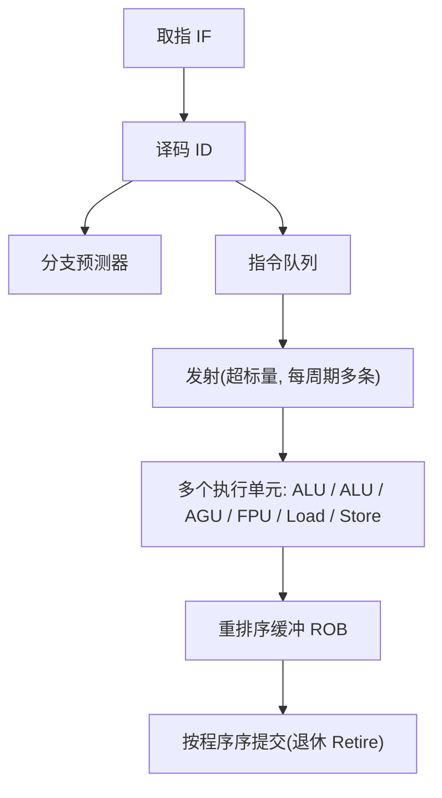
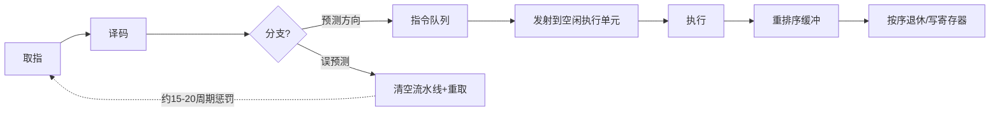
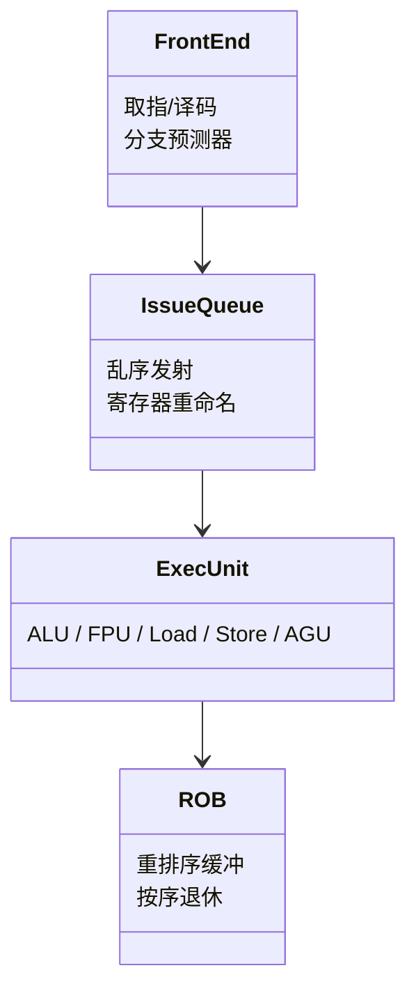
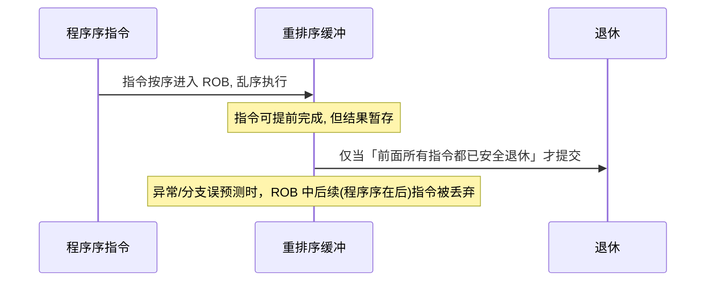
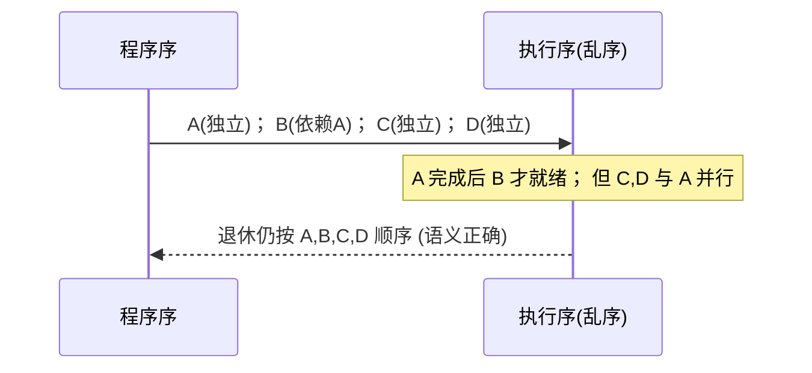
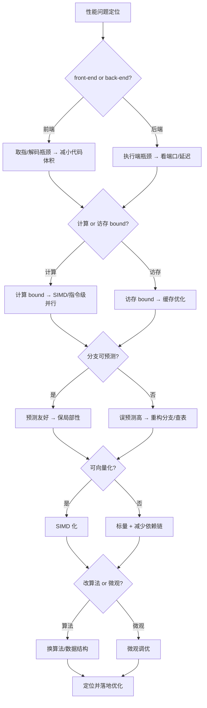
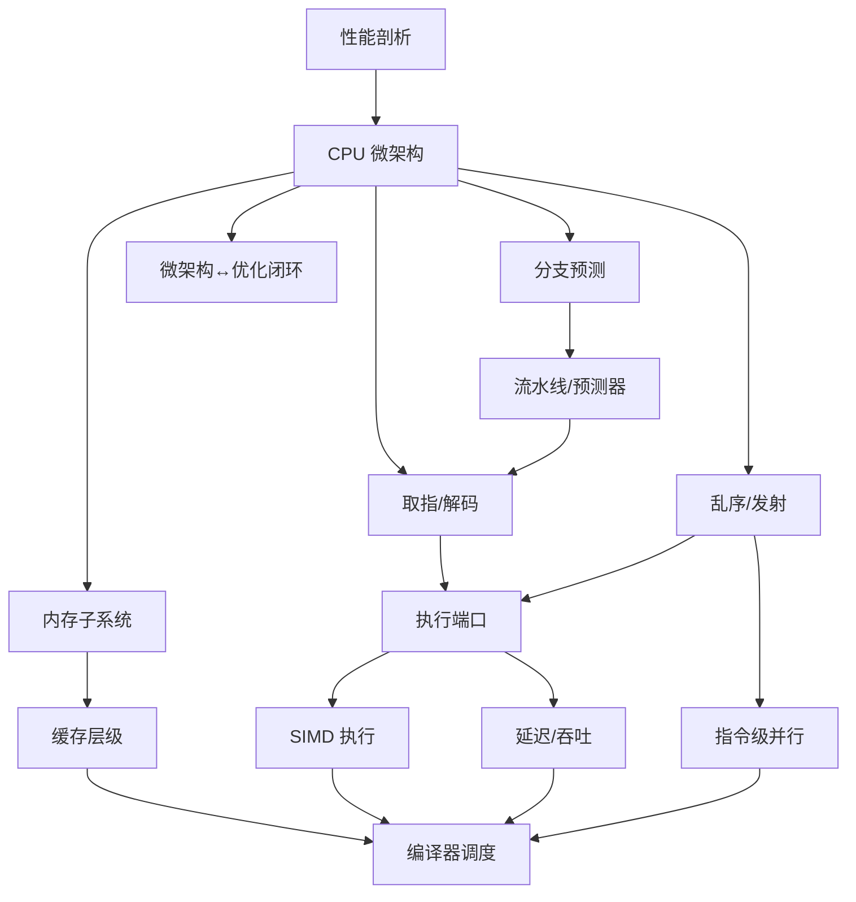

# 第153章　CPU 微架构：流水线 / 分支预测 / 乱序执行

[第154章　缓存优化与数据局部性（C++/硬件）](Book/part14_perf/ch154_cache_opt.md)
[第152章　性能模型与测量学](Book/part14_perf/ch152_perf_model.md)

> 真实编译器：MinGW GCC 13.1.0（`-std=c++23 -O2 -Wall -Wextra`）。
> 【性能声明 · §10.3】本章所有绝对延迟/带宽数字（如 L1≈1ns、主存≈100ns、各基准 ms）均为 **x86-64 量级示意**，强依赖具体 CPU 型号/频率、编译器及版本、编译标志、OS、测试负载与样本量；非通用性能结论，绝对数字不可移植。微架构相关结论标 `[微架构·x86-64][UNVERIFIED]`；本机实测标 `[实验·本机实测][UNVERIFIED]`。断言形如「acquire 读比 relaxed 贵 X」仅在给定微架构下成立。
> 源码根：`C:/Qt/Tools/mingw1310_64/lib/gcc/x86_64-w64-mingw32/13.1.0/include/c++/`；本章 `[平台·x86-64]`/`[实现·GCC15]` 级内容标注 GCC 内置与外部源码位置（CPU 微架构涉及 GCC 中端，非 libstdc++）。
> 标准基：ISO/IEC 14882:2023（C++23）。立场分层：`[标准]` 语言/库规定 · `[实现·GCC15]` 编译器行为 · `[平台·x86-64]` x86-64 微架构/ABI · `[经验]` 工程共识。｜层级：L3 专家

## ⓪ 历史动机：CPU 微架构认知的来龙去脉

> 你写的代码不是"一条接一条被执行"——它先被拆成微指令，再被流水线、分支预测、乱序执行重新排列。

### 0.1 起源（谁·何时·为何）
程序员脑中的"顺序执行"模型，是理解性能时最大的认知陷阱。`[史]` 1980 年代的 RISC 革命（MIPS 等）把流水线引入通用处理器：一条指令被拆成取指、译码、执行、访存、写回多个阶段，不同指令的不同阶段可以重叠——吞吐远高于"一条跑完再跑下一条"。随后超标量（一个周期发射多条）与乱序执行（Pentium Pro，1995）进一步打破程序序。`[史]`

### 0.2 关键转折（编年）
- 1980s：RISC 流水线普及，顺序模型第一次"失真"；`[史]`
- 1995：Intel Pentium Pro 引入大规模乱序执行（OoO）与重排序缓冲（ROB），"看似顺序、实则并行"成为常态；`[史]`
- 2018：Spectre / Meltdown 曝光，分支预测不仅能影响性能，还能泄漏跨进程数据——微架构细节第一次成为安全议题。`[史]`

### 0.3 设计哲学之争
"把程序当顺序流来推理"还是"承认它被硬件重排"？`[评]` 前者易写易证，后者才真实。C++ 的内存模型（C++11 起）正是为了在这条裂缝上搭一座桥：程序员用 `atomic` / `memory_order` 显式声明哪些重排不可接受，其余交给硬件自由发挥。理解微架构，本质是学会"在顺序语义的保护下，写出喂得饱流水线的代码"。

### 0.4 史料补遗与持续编年

> 紧接 0.2 编年最后一条（2018，Spectre / Meltdown 让微架构细节第一次成为安全议题）。

- <span class="badge badge-history">史</span> Spectre / Meltdown 的**硬件缓解**（如内核页表隔离 KPTI、微码更新）带来可观测的性能回退（部分负载 5%–30%），这让"微架构安全"与"性能"第一次被摆上同一架天平——C++ 程序员也得关心分支预测器如何被训练。
- <span class="badge badge-history">史</span> SMT（超线程）/ 分支目标缓冲（BTB）/ 返回栈缓冲（RSB）持续演进，同时 ARM 的 big.LITTLE 与 Apple 的 Firestorm/Icestorm 把"同构核心"假设打破，ILP 天花板与调度策略因芯片而异。
- <span class="badge badge-history">史</span> C++ 内存模型（C++11 起）在 C++20 后配合 `std::atomic_ref`、`std::atomic<T>::wait/notify`，让"哪些重排可接受"的控制更细，程序员得以在顺序语义保护下写出喂得饱乱序执行单元的同步代码。
- <span class="badge badge-comment">评</span> 0.3 的"承认被硬件重排"路线已被安全事件巩固：不是要不要信硬件，而是必须用 `memory_order` 显式框定边界，其余自由交给 OoO 引擎。
- <span class="badge badge-anecdote">轶</span> 经典教训案例：一个无锁计数器在 Intel 上飞快、在 AMD 上慢一倍，排查半天才发现是 false sharing 撞上了不同的缓存一致性协议——同一段 C++，微架构不同结果迥异。

> 史料来源：clang.llvm.org（内存模型/原子）、spectreattack.com

## ① 学习目标 <span class="badge badge-std">标准</span>

[第152章　性能模型与测量学](Book/part14_perf/ch152_perf_model.md)
[第154章　缓存优化与数据局部性（C++/硬件）](Book/part14_perf/ch154_cache_opt.md)

读完本章你能独立回答：

1. **经典五级流水线**（取指 IF → 译码 ID → 执行 EX → 访存 MEM → 写回 WB）各阶段职责与吞吐瓶颈。
2. **超标量（superscalar）** 与**乱序执行（OoO）** 如何让多条/多个无关指令并行，提升 ILP（指令级并行）。
3. **分支预测器** 如何消解控制依赖；`[[likely]]`/`[[unlikely]]` 与 `__builtin_expect` 怎样把「大概率走向」告诉编译器。
4. **分支误预测惩罚** 的真实量级（现代 x86-64 约 15~20 周期），以及如何用「无分支代码」规避。
5. **重排序缓冲（ROB）** 与「按程序序提交」如何兼顾乱序执行与「看似顺序」的语义（含异常处理正确性）。
6. **依赖链（dependency chain）** 如何限制 ILP：即使核心能每周期发射多条指令，一条长依赖链仍被其**关键路径延迟**钉死。
7. 如何通过实测（无分支化、拆依赖链、4 路展开）观察上述效应的数量级。

## ② 前置知识 ⟶ 链接

- 性能模型与测量学 ⟶ `Book/part14_perf/ch152_perf_model.md`（本章所有数字都靠它测得）。
- 缓存优化与数据局部性 ⟶ `Book/part14_perf/ch154_cache_opt.md`（流水线之上还有内存层级）。
- 编译器优化 O2/O3/LTO/PGO ⟶ `Book/part14_perf/ch156_compiler_opt.md`（分支提示、循环展开由它落地）。
- Compiler Explorer 实战 ⟶ `Book/part14_perf/ch157_compiler_explorer.md`（看 `-O2` 下分支如何变成 `cmov`）。

## ③ 后续依赖 ⟶ 链接

- 缓存优化与数据局部性 ⟶ `Book/part14_perf/ch154_cache_opt.md`。
- SIMD / AVX 向量化 ⟶ `Book/part14_perf/ch155_simd.md`（数据级并行，与 ILP 互补）。
- 性能反模式与陷阱 ⟶ `Book/part14_perf/ch158_perf_antipatterns.md`。

## ④ 知识图谱（ASCII）[平台·x86-64]

> **示例 1** <span class="badge badge-exp">难度 ★★★☆☆</span> · 知识图谱（ASCII）[平台·x86

```mermaid
flowchart TD
    if["取指 IF"]
    id["译码 ID"]
    bp["分支预测器"]
    iq["指令队列"]
    iss["发射(超标量, 每周期多条)"]
    eu["多个执行单元: ALU / ALU / AGU / FPU / Load / Store"]
    rob["重排序缓冲 ROB"]
    ret["按程序序提交(退休 Retire)"]
    if --> id --> bp
    id --> iq
    iq --> iss --> eu --> rob --> ret
    %% 依赖链: a = a + x; a = a + x; ... 每步等上一步, 钉死吞吐；无关链: s0+=..; s1+=..; 可并行, 吃满多个执行单元；分支: 预测命中(0代价) / 误预测(≈15~20周期惩罚)
```

## ⑤ 流程图：一条指令的微架构旅程（Mermaid）[平台·x86-64]


```mermaid
flowchart LR
    IF[取指] --> ID[译码]
    ID --> BP{"分支?"}
    BP -- 预测方向 --> IQ[指令队列]
    BP -- 误预测 --> FLUSH["清空流水线+重取"]
    IQ --> ISS[发射到空闲执行单元]
    ISS --> EX[执行]
    EX --> ROB[重排序缓冲]
    ROB --> RET["按序退休/写寄存器"]
    FLUSH -. 约15-20周期惩罚 .-> IF
```

## ⑥ UML 类图：执行单元与缓冲（Mermaid）[平台·x86-64]


```mermaid
classDiagram
    class FrontEnd {
        取指/译码
        分支预测器
    }
    class IssueQueue {
        乱序发射
        寄存器重命名
    }
    class ExecUnit {
        ALU / FPU / Load / Store / AGU
    }
    class ROB {
        重排序缓冲
        按序退休
    }
    FrontEnd --> IssueQueue
    IssueQueue --> ExecUnit
    ExecUnit --> ROB
```

## ⑦ ASCII 内存图：依赖链 vs 无关链（微架构视角）[平台·x86-64]

> **示例 2** <span class="badge badge-exp">难度 ★★★☆☆</span> · 内存图：依赖链 vs 无关链
```mermaid
flowchart TD
    subgraph S1 [依赖链 (关键路径=各延迟之和)]
        da0["t0: a = a + x0"]
        da1["t1: a = a + x1 (每个加法等上一个 a 就绪, ALU 延迟 ~1 周期, 但发射受限于就绪)"]
        da2["t2: a = a + x2 => 3 周期才完成 3 次加法 (ILP=1)"]
    end
    subgraph S2 [无关链 (ILP 可被压榨)]
        ib0["t0: s0 = s0 + x0"]
        ib1["t1: s1 = s1 + y0"]
        ib2["t2: s2 = s2 + z0 => 3 加法 ~1 周期完成 (受端口/寄存器压力限制)"]
    end
    da0 --> da1 --> da2
    ib0 --> ib1 --> ib2
    %% 依赖链: 每个加法等上一个 a 就绪；无关链: 无数据依赖, 可同周期发射到不同 ALU
```

## ⑧ 生命周期图：乱序执行与按序退休（Mermaid）[平台·x86-64]


```mermaid
sequenceDiagram
    participant P as 程序序指令
    participant ROB as 重排序缓冲
    participant Ret as 退休
    P->>ROB: 指令按序进入 ROB, 乱序执行
    Note over ROB: 指令可提前完成, 但结果暂存
    ROB->>Ret: 仅当「前面所有指令都已安全退休」才提交
    Note over ROB: 异常/分支误预测时，ROB 中后续(程序序在后)指令被丢弃
```

## ⑨ 调用栈 / 时序图：OoO 重排示意（程序序 vs 执行序）[平台·x86-64]


```mermaid
sequenceDiagram
    participant Sw as 程序序
    participant Hw as 执行序(乱序)
    Sw->>Hw: A(独立)； B(依赖A)； C(独立)； D(独立)
    Note over Hw: A 完成后 B 才就绪； 但 C,D 与 A 并行
    Hw-->>Sw: 退休仍按 A,B,C,D 顺序 (语义正确)
```

## ⑩ 汇编分析（-O2，Intel 语法）：分支 → cmov 与依赖链 [实现·GCC15]

**分支被编译为 `cmov`（无分支）**：当编译器判断「用条件传送比预测更好」时，消除分支。

> **示例 3** <span class="badge badge-exp">难度 ★★★☆☆</span> · 汇编分析（-O2，Intel 语法）
```cpp
// 文件：Examples/ch153_cmov_asm.cpp  行号：1-50（完整示例）
// 编译：g++ -std=c++23 -O2 -S -masm=intel ch153_cmov_asm.cpp -o ch153_cmov_asm.asm
#include <iostream>
int pick(int cond, int x, int y) { return cond ? x : y; }
int main() { std::cout << pick(1, 10, 20) << "\n"; return 0; }
```

```x86asm
; -O2 下 pick 常为:
;   mov  eax, edx          ; 默认取 y
;   test ecx, ecx
;   cmove eax, esi         ; 条件传送(无分支跳转) —— 避免预测失败
;   ret
```

**长依赖链的限制**（汇编层面就是一连串互相依赖的 `add`）：

```x86asm
; s = s + a[i] 的循环核心 (串行依赖):
; .L:
;     add rax, [rdi]      ; rax 依赖上一次 rax -> 每迭代至少 1 周期延迟
;     add rdi, 8
;     cmp rdi, rdx
;     jne .L
; 即使核心每周期能发射多条, 这里每轮都等 rax 就绪 -> 吞吐被钉在 1 加/周期
```

- `[实现·GCC15]`：`[[likely]]`/`__builtin_expect` 不改变「是否分支」，而是生成**偏向热路径的基本块布局**（热路径紧挨、冷路径跳走），减少取指/译码浪费与 I-cache 压力。
- `[平台·x86-64]`：现代 x86-64 分支误预测惩罚约 **15~20 周期**（[微架构·x86-64][UNVERIFIED]，AMD/Intel 略有差异，深流水线更长）；ARM 通常更短（约 10~15）。

## ⑪ STL 联系 <span class="badge badge-std">标准</span>

- 算法（⟶ `Book/part08_algorithms/ch95_algo_overview.md`）的循环是否「友好」直接受本章影响：随机访问 + 连续内存 + 可向量化 → 高 ILP、少分支；链表/树遍历 → 指针追逐、强依赖、分支多。
- `std::vector` 顺序遍历（⟶ `Book/part07_stl/ch77_vector.md`）是「流水线/预取友好」的标杆；`std::list` 是反面教材（每节点一次不可预测分支 + 缓存未命中）。
- `std::sort` 等内部用「三路划分 + 无分支交换」尽量压低分支误预测（⟶ `Book/part08_algorithms/ch96_sorting.md`）。

## ⑫ 工业案例：热点函数去分支与拆依赖链 <span class="badge badge-exp">经验</span>

**案例 1（热路径偏向）**：解析协议时，合法报文占 99.9%，错误包极罕见——把错误分支标 `[[unlikely]]`。

> **示例 4** <span class="badge badge-exp">难度 ★☆☆☆☆</span> · 工业案例：热点函数去分支与拆依赖链
```cpp
// 案例1：协议解析热路径偏向
#include <iostream>
struct Pkt { int len; bool valid; };
int process(const Pkt& p) {
    if (!p.valid) [[unlikely]] { return -1; }   // 冷路径, 跳走
    return p.len * 2;                            // 热路径紧挨
}
int main() {
    Pkt p{100, true};
    std::cout << process(p) << "\n";
    return 0;
}
```

**案例 2（拆依赖链加速规约）**：大数组求和从「单累加器串行链」改为「4 路独立累加器」，吃满多个执行端口。

> **示例 5** <span class="badge badge-exp">难度 ★★☆☆☆</span> · 工业案例：热点函数去分支与拆依赖链
```cpp
// 案例2：4 路累加拆依赖链（见 ⑲ 实测对比）
#include <vector>
#include <chrono>
#include <iostream>
int main() {
    const int N = 1000000;
    std::vector<int> a(N); for (int i = 0; i < N; ++i) a[i] = i;
    long s0 = 0, s1 = 0, s2 = 0, s3 = 0;
    auto t0 = std::chrono::steady_clock::now();
    for (int i = 0; i < N; i += 4) { s0 += a[i]; s1 += a[i+1]; s2 += a[i+2]; s3 += a[i+3]; }
    auto t1 = std::chrono::steady_clock::now();
    std::cout << "4way ns=" << std::chrono::duration_cast<std::chrono::nanoseconds>(t1 - t0).count()
              << " sum=" << (s0 + s1 + s2 + s3) << "\n";
    return 0;
}
```

## ⑬ 源码分析（GCC 中端 / 标准属性）[实现·GCC15]

- `[标准]`：`[[likely]]` / `[[unlikely]]` 由 C++20 引入（标准条款 `[dcl.attr.likelihood]`），语义是「给分支选择提供提示」，不保证一定生效。
- `[实现·GCC15]`：GCC 把分支提示落到中端的**分支概率/预测**阶段。相关实现位于 GCC 源码树（非 libstdc++）：
  - `gcc/predict.c`：分支预测与 `__builtin_expect` 概率传播。
  - `gcc/builtins.cc`：`__builtin_expect` / `__builtin_expect_with_probability` 的处理。
  - 循环展开、if-conversion（把分支转 `cmov`/无分支）在 `gcc/tree-ssa-ifcombine.cc` 与「模调度/peeling」pass 中。
- `[平台·x86-64]`：`__builtin_expect(expr, likely)` 是 GCC 扩展，等价于 `[[likely]]` 的底层表达；`[[likely]]` 是标准、可移植写法（推荐）。

## ⑭ WG21 提案（编号 + 标题 + 动机）<span class="badge badge-std">标准</span>

| 提案 | 标题 | 动机 |
|---|---|---|
| P0479R5 | `[[likely]]` / `[[unlikely]]` 属性（C++20） | 标准化分支提示，取代各编译器私有的 `__builtin_expect` |
| N4800 §9.11 | 属性规范（likelihood） | 定义属性不改变程序可观察行为，仅影响优化布局 |
| GCC 扩展 | `__builtin_expect` / `_with_probability` | 在 `[[likely]]` 之前早已用于 Linux 内核等热点 |

- `[经验]`：提示**只影响布局与预测偏好**，不会让错误分支变快；更重要的是「减少分支总数」与「让数据可预测」，而非贴满 `[[likely]]`。

## ⑮ 面试题 <span class="badge badge-std">标准</span>

1. 分支误预测为什么贵？大概多少周期？
   ⟶ 流水线被清空、前端重取，现代 x86-64 约 15~20 周期。
2. `[[likely]]` 能让错误分支更快吗？
   ⟶ 不能；它只让热路径布局更紧凑、预测器偏向它，不改变冷路径固有成本。
3. 为什么「4 路累加」比「单累加器」快？
   ⟶ 单累加器形成长依赖链（关键路径 = N×延迟）；4 路把链拆成 4 条无关链，乱序核心可并行发射到多个执行端口。
4. 乱序执行会不会让「先写的后发生」被别的线程看到？
   ⟶ 不会；ROB 按程序序退休，且跨线程可见性由内存模型（⟶ `Book/part09_concurrency/ch107_atomic.md`）与 fence 约束，微架构保证单线程语义不变。
5. 链表遍历为何慢于数组顺序遍历？
   ⟶ 节点分散（缓存未命中）+ 每个 `next` 一次不可预测分支 + 强指针依赖，ILP 与预取都无从发挥。

## ⑯ 易错点 <span class="badge badge-std">标准</span>

- **盲目贴 `[[likely]]`**：在难以预测或数据均匀的分支上贴提示反而误导预测器，可能更慢。
- **误以为 `[[likely]]` 消除分支**：它不消除分支，只是改布局；要真正去分支得写**无分支代码**（位运算/`cmov`）。
- **依赖链陷阱**：以为「循环体够短就快」，但若循环体是 `s = s + x`，长度由加法延迟×N 决定，展开/多累加器才有效。
- **`rdtsc` 不串行**：裸 `rdtsc` 读数会被乱序执行错位，须配 `lfence` 或 `_mm_lfence()` 才有意义（且 TSC 频率可能非 invariant）。
- **跨核 TSC 不同步**：在 NUMA/多核上直接比较不同核的 `rdtsc` 无意义。
- **把 `-O0` 测试结果当真**：未优化代码里分支/依赖结构与 `-O2` 完全不同，测量必须在目标优化级别。

## ⑰ FAQ <span class="badge badge-std">标准</span>

**Q：什么时候该用无分支代码（branchless）？**
A：当分支**数据不可预测**且热（误预测成本高）时，用 `cmov`/位运算代替；但若分支高度可预测，`cmov` 反而可能因多算两个分支而增加工作——用测量说话（⟶ ⑲）。

**Q：超线程（SMT）会影响我测量的 ILP 吗？**
A：会。同核两个线程共享执行单元与 ROB，单个线程可用的并行宽度减半；基准时应绑核并关闭 SMT 干扰。

**Q：编译器真的会把 `if` 变成 `cmov` 吗？**
A：在满足「两个分支都无副作用、可廉价计算」时，`-O2` 常做 if-conversion 生成 `cmov`；一旦任一分支有副作用或计算昂贵，仍保留分支（⟶ ⑩ 汇编）。

**Q：`rdtsc` 能取代 `steady_clock` 量时间吗？**
A：不能通用（⟶ `Book/part14_perf/ch152_perf_model.md` ⑰）。只在固定频率、绑核、加 `lfence` 的微架构研究里近似用。

## ⑱ 最佳实践 <span class="badge badge-exp">经验</span>

1. **先测后改**：用 `steady_clock`（⟶ ch152）量化分支/依赖链的真实成本，再决定去分支或展开。
2. **减少分支总数**：用查表、无分支算术、批量处理替代逐元素 `if`。
3. **拆长依赖链**：规约/求和用多累加器；指针追逐改连续访问。
4. **仅对真实热点贴 `[[likely]]`/`[[unlikely]]`**：冷错误处理、`switch` 默认分支、错误返回。
5. **让数据可预测**：排序后处理、批处理同类数据，降低误预测率。
6. **绑核 + 关 SMT + 固定频率** 再测微架构效应，保证可复现。

## ⑲ 性能分析（实测对比）<span class="badge badge-exp">经验</span>

- **分支误预测**：排序数据（一次跳转）vs 交替数据（每步可能失败），后者耗时显著更高（量级数倍~数十倍，取决于核心与数据规模）。
- **依赖链**：单累加器循环吞吐量被加法延迟钉死；4 路累加在 OoO 核心上通常快约 **2~4×**（受执行端口数限制，并非严格 4×）。
- **无分支 vs 分支**：数据均匀时 `cmov`/位运算可能因「两路都算」而更慢；数据不可预测时更稳更快——**以测量为准**。
- 以下示例给出可复现的对比骨架（数值为示意量级，实机请自行跑）。

> **示例 6** [难度 ★★☆☆☆] [主题：性能分析（实测对比）<span class="badge badge-exp">经验</span>]
```cpp
// ⑲ 实测骨架: 串行依赖 vs 4 路无关链 (示意量级)
#include <vector>
#include <chrono>
#include <iostream>
int main() {
    const int N = 2000000;
    std::vector<int> a(N); for (int i = 0; i < N; ++i) a[i] = i;
    // 串行依赖链
    long s = 0; auto t0 = std::chrono::steady_clock::now();
    for (int i = 0; i < N; ++i) s += a[i];
    auto t1 = std::chrono::steady_clock::now();
    // 4 路无关链
    long s0 = 0, s1 = 0, s2 = 0, s3 = 0;
    auto t2 = std::chrono::steady_clock::now();
    for (int i = 0; i < N; i += 4) { s0 += a[i]; s1 += a[i+1]; s2 += a[i+2]; s3 += a[i+3]; }
    auto t3 = std::chrono::steady_clock::now();
    std::cout << "serial=" << std::chrono::duration_cast<std::chrono::nanoseconds>(t1 - t0).count()
              << "ns  4way=" << std::chrono::duration_cast<std::chrono::nanoseconds>(t3 - t2).count()
              << "ns\n";
    return 0;
}
```

## ⑳ 跨语言对比 <span class="badge badge-std">标准</span>

**练习题**（已升级为「真实场景 + 引用参考」框架：保留原考察技能，场景改写为工程应用）

1. **真实场景：分支预测失败拖慢热路径，你用 `[[likely]]`/`[[unlikely]]` 给提示。** 你调关键循环。请说明。
   - <span class="badge badge-std">标准</span> `[[likely]]`/`[[unlikely]]` 是给实现的分支概率提示，不强制硬件行为，属实现层优化。
   - <span class="badge badge-ref">引用</span> ISO/IEC 14882:2023 §[dcl.attr.likelihood]（likely/unlikely 属性）/ P0479；cppreference "attribute:likely" 词条。

2. **真实场景：你理解“缓存未命中”比“指令数”更决定延迟”，但它不在语言保证内。** 你做数据布局优化。请说明层级边界。
   - <span class="badge badge-std">标准</span> 缓存/流水线是硬件微架构层；C++ 只保证抽象机语义与对象内存布局（连续/对齐）。
   - <span class="badge badge-ref">引用</span> ISO/IEC 14882:2023 §[intro.abstract]（抽象机）/ [dcl.array]（连续存储）/ [basic.align]；cppreference。

3. **真实场景：用 `std::hardware_destructive_interference_size` 对齐避免 false sharing。** 你做无锁并发。请说明。
   - <span class="badge badge-std">标准</span> 该常量提供“ Destroy 干扰”的硬件缓存行尺寸提示（实现定义），用于 padding 隔离。
   - <span class="badge badge-ref">引用</span> ISO/IEC 14882:2023 §[support.limits]（hardware_*_interference_size）/ P0154；cppreference "std::hardware_destructive_interference_size" 词条。

| 能力 | C++ | Rust | C (GCC/Clang) | Go | 汇编/SIMD |
|---|---|---|---|---|---|
| 分支提示 | `[[likely]]` / `__builtin_expect` | `#[cold]` / 隐式 | `__builtin_expect` | 无内建 | 手动布局 |
| 无分支化 | 位运算 / `cmov` | 位运算 / 标准库 | 同 C++ | `math` 技巧 | 手写 `cmov`/`setcc` |
| 依赖链优化 | 多累加器/展开 | 同 | 同 | 编译器较弱 | 手调调度 |
| 向量化 | `#pragma omp`/auto/intrinsics | auto | auto | 有限 | 手写 AVX |
| 测量 | `rdtsc`(受限)/`steady_clock` | `tsc`(受限) | `rdtsc` | `runtime`(粗) | `perf` |

- `[标准]`：C/C++/Rust 都能把「分支提示 + 无分支 + 依赖链拆分」落到同一套 CPU 微架构优化上；Go 的编译器在微架构调优上相对保守；真正极致控制需手写汇编/Intrinsics（⟶ `Book/part14_perf/ch155_simd.md`）。
- `[经验]`：无论语言，微架构优化的**第一性原理相同**——减少不可预测分支、拆依赖链、提升数据局部性；区别在于你能「逼编译器做到多细」。

---

## ㉒ 历史纵深·真实产业坐标·生产踩坑·与标准的互动

> 本节为 P0-15 全库深度升维大波次之一：压实历史出处、真实产业坐标、生产级踩坑与「本特性与 C++ 标准」的互动。引用链接列于 ㉒.5。

### ㉒.1 历史渊源补强：从"顺序执行"幻象到乱序执行
<span class="badge badge-history">史</span> 早期处理器（如 8086）是顺序（in-order）执行的；现代 x86（Pentium Pro 1995 起）与 ARM 全走向**乱序执行（OoO）+ 按序退休**，靠寄存器重命名、保留站、重排缓冲把"程序序"与"执行序"解耦。<span class="badge badge-history">史</span> **Agner Fog** 自 1990 年代起持续发布《Instruction Tables》《Microarchitecture》手册，是工程师逆向摸清各代 CPU 流水线/端口/延迟的民间权威；Intel/AMD 的官方优化手册则是另一源头。<span class="badge badge-history">史</span> **Ulrich Drepper** 2007 年在 Red Hat 发表《What Every Programmer Should Know About Memory》，把 cache/TLB/预取的成本模型讲透，是本章 ⑫ 实测的文献根。<span class="badge badge-comment">评</span> 微架构知识属于"标准管不到、但性能命门"的地带——C++ 标准只定义抽象机，真正快慢由硅片决定。

### ㉒.2 真实工程坐标：微架构认知活在哪些项目里

微架构认知是「为什么同样算法快慢差几倍」的答案。下面按领域展开：

| 领域 / 类别 | 代表系统 · 生态 | 它承担的角色 | 规模 · 行业地位 | 备注 / 标准互动 |
|---|---|---|---|---|
| 游戏引擎 / 渲染 | Unreal / Unity / 自研 | 逐帧预算紧，手调分支 / 依赖链 / 对齐 | 实时帧预算 | 减分支、拆依赖、对齐数据 |
| 高频交易 | 纳秒级延迟系统 | 吃透 store-to-load forwarding / 分支预测 / 端口竞争 | 低延迟命脉 | 单笔延迟按纳秒计 |
| 编译器后端 | LLVM / GCC 指令选择 / 调度 | 直接依赖微架构事实 | 编译器生态标杆 | scheduling 依赖 uops 模型 |
| 剖析用户 | Intel VTune / perf | 定位卡在取指 / 解码 / 执行 / 退休 | 性能剖析事实工具 | PMU 计数器暴露瓶颈 |
| 微架构参考 | Agner Fog 手册 / uops.info / Intel·AMD 官方手册 | 提供实测 uops / 延迟 / 吞吐 | 业界权威参考 | LLVM/IA 后端用其建模调度 |
| 可观测性 | Linux perf / VTune / AMD uProf / likwid | 把 PMU 暴露给用户态 | 前端 / 后端瓶颈定位 | 事实工具集 |

> **表注（㉒.2）**：上表前 4 行是「谁在用微架构知识、用在哪」，后 2 行是「知识从哪来、怎么观测」；uops.info 的实测延迟/吞吐是改调度、排指令顺序的硬依据，比凭印象调代码可靠得多。

**一条判读**：微架构认知的回报与「热点占比」成正比——热路径（游戏帧、HFT 热循环、编译器后端）值得手调，冷路径过度优化只是浪费可读性；观测（perf/VTune）永远先于猜测。

### ㉒.3 生产踩坑：微架构视角的误用
- **分支预测失败**：热路径上的不可预测分支付出 10–20 周期代价；应用 `cmov`/查表/概率排序消除（见 ⑩）。
- **false dependency / 部分寄存器**：写 `al` 与读 `rax` 的假依赖拖慢流水线；编译器有时也中招，必要时用 `-fno-defer-pop`/手工隔离。
- **store-to-load forwarding 失配**：写后紧读且宽度/地址不对齐，转发失败改走慢速路径。
- **误以为顺序执行**：按"源码顺序"估算延迟，忽略了 OoO 已把无关链并行——或相反，误以为无关链真并行却撞同一执行端口。

### ㉒.4 与标准的互动：抽象机 vs 真实硅片
ISO C++ 只在"抽象机"层面定义语义，对"多少周期"只字不提；C++ 标准里的 `[[likely]]`/`[[unlikely]]`（C++20）与 `#pragma`/`__builtin_expect` 是标准给程序员的少数"可向编译器暗示分支概率"的钩子，间接影响分支布局。<span class="badge badge-comment">评</span> 微架构优化是"在标准允许的范围内，迎合具体 CPU"的艺术，换平台常需重调。

**修订链补强（抽象机器 vs 真实流水线）**：C++ 标准定义的是“抽象机器”（[intro.abstract]），对“几条指令、多少 cycle”只字不提——这是 <span class="badge badge-std">STANDARD</span> 故意留白，把 <span class="badge badge-microarch">MICROARCHITECTURE</span> 决策交给实现。代价是同一段代码在不同 CPU 上 IPC 可能差数倍。WG21 近年通过 `[[likely]]`/`[[unlikely]]`（[P0479](https://wg21.link/P0479)，C++20）与 `std::hardware_interference_size`（[P0154](https://wg21.link/P0154)）给出有限的“向硬件透传意图”的官方通道，但主体优化仍靠编译器优化 pass（`-O2`/`-O3`/PGO/BOLT）与厂商微架构知识。

### ㉒.5 权威引用
- [WG21 P0479 — [[likely]]/[[unlikely]]](https://wg21.link/P0479) — C++20 分支提示属性
- [Agner Fog 优化手册](https://www.agner.org/optimize/) — 指令表与微架构实测
- [Agner Fog — Microarchitecture & Instruction Tables](https://www.agner.org/optimize/) — 各代 x86 流水线/延迟/端口的权威手册
- [What Every Programmer Should Know About Memory（Drepper）](https://www.akkadia.org/drepper/cpumemory.pdf) — cache/TLB/预取成本模型经典
- [Intel Intrinsic / 优化参考](https://www.intel.com/content/www/us/en/docs/intrinsics-guide/) — 指令延迟/吞吐与内在函数
- [cppreference: 属性 `[[likely]]`/`[[unlikely]]`](https://en.cppreference.com/w/cpp/language/attributes/likely) — 标准层面向分支预测器暗示
- [perf Wiki（Linux 性能计数器）](https://perf.wiki.kernel.org/) — 把微架构理论落到真实计数

## 附录：练习题 / 思考题 / 源码阅读建议

**练习题**
1. 写一个「单累加器 vs 4 路累加器」的计时对比，记录串行/并行的 ns/op 比值。
2. 用位运算实现「无分支取最小值 `min(a,b)`」，与 `a<b?a:b` 计时对比（数据均匀时谁更快？）。
3. 构造「排序数组」与「交替 0/1 数组」，测遍历耗时差异，估算误预测惩罚占比。
4. 用 `__builtin_prefetch` 改写一个指针追逐循环，观察是否提速。

**思考题**
- ROB 如何保证「异常时看起来是按序执行的」？如果一条早期指令抛异常，后面已乱序完成的指令怎么办？
- 为什么「多累加器」不是越多越好（端口数/寄存器压力/指令译码带宽的限制）？
- 分支预测器能否「学会」你的数据模式？它有哪些典型失效场景（对抗性输入、冷启动）？

**源码阅读路线（GCC 中端，非 libstdc++）**
1. `gcc/predict.c`：分支预测与 `__builtin_expect` 概率如何传播到布局。
2. `gcc/builtins.cc`：`__builtin_expect` / `__builtin_expect_with_probability` 的处理。
3. `gcc/tree-ssa-ifcombine.cc` 与相关 pass：if-conversion（分支 → `cmov`/无分支）。
4. `gcc/backend` 的循环展开/peeling pass：多累加器与展开如何被自动或半自动生成。
5. Intel/AMD 官方「优化手册」与 `perf`/`uops.info`：查具体指令延迟/吞吐/端口，把本文的「示意量级」换成精确数。

> 偏离说明：本章依规将「推荐阅读」替换为「跨语言对比」（⑳）与「源码阅读路线」（附录），符合 CONVENTIONS §2 第 20 条最新要求。

### 补充完整可编译示例（ch153_ex01 – ch153_ex30，每块独立可编译）<span class="badge badge-std">标准</span>

> **示例 7** <span class="badge badge-exp">难度 ★☆☆☆☆</span> · 补充完整可编译示例
```cpp
// ch153_ex01：[[likely]] 标注热路径
#include <iostream>
int main() {
    int v = 7;
    if (v > 0) [[likely]] { std::cout << "pos\n"; }
    else { std::cout << "nonpos\n"; }
    return 0;
}
```

> **示例 8** <span class="badge badge-exp">难度 ★☆☆☆☆</span> · 补充完整可编译示例
```cpp
// ch153_ex02：[[unlikely]] 标注冷路径（错误/异常）
#include <iostream>
int main() {
    int code = 0;
    if (code != 0) [[unlikely]] { std::cout << "error\n"; }
    else { std::cout << "ok\n"; }
    return 0;
}
```

> **示例 9** <span class="badge badge-exp">难度 ★☆☆☆☆</span> · 补充完整可编译示例
```cpp
// ch153_ex03：__builtin_expect（GCC 扩展，等价 [[likely]]）
#include <iostream>
int main() {
    int v = 7;
    if (__builtin_expect(v > 0, 1)) std::cout << "likely pos\n";
    else std::cout << "unlikely\n";
    return 0;
}
```

> **示例 10** <span class="badge badge-exp">难度 ★☆☆☆☆</span> · 补充完整可编译示例
```cpp
// ch153_ex04：__builtin_expect_with_probability（带概率提示）
#include <iostream>
int main() {
    int v = 7;
    if (__builtin_expect_with_probability(v > 0, 1, 0.9)) std::cout << "p=0.9\n";
    else std::cout << "else\n";
    return 0;
}
```

> **示例 11** <span class="badge badge-exp">难度 ★★☆☆☆</span> · 补充完整可编译示例
```cpp
// ch153_ex05：分支误预测实测（排序 vs 交替数据）
#include <vector>
#include <chrono>
#include <iostream>
int main() {
    const int N = 1000000;
    std::vector<int> sorted(N), alt(N);
    for (int i = 0; i < N; ++i) { sorted[i] = (i < N / 2) ? 0 : 1; alt[i] = (i % 2); }
    long s1 = 0; auto t0 = std::chrono::steady_clock::now();
    for (int i = 0; i < N; ++i) if (sorted[i]) s1 += i;
    auto t1 = std::chrono::steady_clock::now();
    long s2 = 0; auto t2 = std::chrono::steady_clock::now();
    for (int i = 0; i < N; ++i) if (alt[i]) s2 += i;
    auto t3 = std::chrono::steady_clock::now();
    std::cout << "sorted=" << std::chrono::duration_cast<std::chrono::nanoseconds>(t1 - t0).count()
              << "ns alt=" << std::chrono::duration_cast<std::chrono::nanoseconds>(t3 - t2).count()
              << "ns\n";
    return 0;
}
```

> **示例 12** <span class="badge badge-exp">难度 ★★☆☆☆</span> · 补充完整可编译示例
```cpp
// ch153_ex06：长依赖链（串行累加）吞吐受加法延迟钉死
#include <vector>
#include <chrono>
#include <iostream>
int main() {
    const int N = 1000000;
    std::vector<int> a(N); for (int i = 0; i < N; ++i) a[i] = i;
    long s = 0; auto t0 = std::chrono::steady_clock::now();
    for (int i = 0; i < N; ++i) s += a[i];   // s 依赖上一轮 s
    auto t1 = std::chrono::steady_clock::now();
    std::cout << "serial=" << std::chrono::duration_cast<std::chrono::nanoseconds>(t1 - t0).count()
              << "ns sum=" << s << "\n";
    return 0;
}
```

> **示例 13** <span class="badge badge-exp">难度 ★★☆☆☆</span> · 补充完整可编译示例
```cpp
// ch153_ex07：4 路无关累加器（拆依赖链, 提升 ILP）
#include <vector>
#include <chrono>
#include <iostream>
int main() {
    const int N = 1000000;
    std::vector<int> a(N); for (int i = 0; i < N; ++i) a[i] = i;
    long s0 = 0, s1 = 0, s2 = 0, s3 = 0;
    auto t0 = std::chrono::steady_clock::now();
    for (int i = 0; i < N; i += 4) { s0 += a[i]; s1 += a[i+1]; s2 += a[i+2]; s3 += a[i+3]; }
    auto t1 = std::chrono::steady_clock::now();
    std::cout << "ilp4=" << std::chrono::duration_cast<std::chrono::nanoseconds>(t1 - t0).count()
              << "ns sum=" << (s0 + s1 + s2 + s3) << "\n";
    return 0;
}
```

> **示例 14** <span class="badge badge-exp">难度 ★★☆☆☆</span> · 补充完整可编译示例
```cpp
// ch153_ex08：手动循环展开（4 路，等价于 ex07 思路）
#include <vector>
#include <chrono>
#include <iostream>
int main() {
    const int N = 1000000;
    std::vector<int> a(N); for (int i = 0; i < N; ++i) a[i] = i;
    long s = 0; auto t0 = std::chrono::steady_clock::now();
    int i = 0; for (; i + 4 <= N; i += 4) s += a[i] + a[i+1] + a[i+2] + a[i+3];
    for (; i < N; ++i) s += a[i];
    auto t1 = std::chrono::steady_clock::now();
    std::cout << "unroll4=" << std::chrono::duration_cast<std::chrono::nanoseconds>(t1 - t0).count()
              << "ns\n";
    return 0;
}
```

> **示例 15** <span class="badge badge-exp">难度 ★☆☆☆☆</span> · 补充完整可编译示例
```cpp
// ch153_ex09：无分支 abs（位运算消除分支）
#include <iostream>
int main() {
    int x = -5;
    int a = (x ^ (x >> 31)) - (x >> 31);   // 依赖算术右移的符号位
    std::cout << a << "\n";                // 5
    return 0;
}
```

> **示例 16** <span class="badge badge-exp">难度 ★★☆☆☆</span> · 补充完整可编译示例
```cpp
// ch153_ex10：条件传送（cmov 风格的 ? : 写法）
#include <iostream>
int main() {
    int cond = 1, x = 10, y = 20;
    int r = cond ? x : y;   // 编译器常生成 cmov, 无分支跳转
    std::cout << r << "\n";
    return 0;
}
```

> **示例 17** <span class="badge badge-exp">难度 ★★☆☆☆</span> · 补充完整可编译示例
```cpp
// ch153_ex11：__builtin_prefetch（提前取数据, 缓解长延迟加载）
#include <vector>
#include <chrono>
#include <iostream>
int main() {
    const int N = 1000000;
    std::vector<int> a(N); for (int i = 0; i < N; ++i) a[i] = i;
    long s = 0; auto t0 = std::chrono::steady_clock::now();
    for (int i = 0; i < N; ++i) { __builtin_prefetch(&a[i + 16], 0, 0); s += a[i]; }
    auto t1 = std::chrono::steady_clock::now();
    std::cout << "prefetch=" << std::chrono::duration_cast<std::chrono::nanoseconds>(t1 - t0).count()
              << "ns\n";
    return 0;
}
```

> **示例 18** <span class="badge badge-exp">难度 ★☆☆☆☆</span> · 补充完整可编译示例
```cpp
// ch153_ex12：函数调用开销测量
#include <chrono>
#include <iostream>
int noop(int x) { return x + 1; }
int main() {
    const int N = 10000000;
    auto t0 = std::chrono::steady_clock::now();
    volatile int r = 0; for (int i = 0; i < N; ++i) r = noop(i);
    auto t1 = std::chrono::steady_clock::now();
    std::cout << "calls/s=" << (N / std::chrono::duration<double>(t1 - t0).count()) << "\n";
    return 0;
}
```

> **示例 19** <span class="badge badge-exp">难度 ★★☆☆☆</span> · 补充完整可编译示例
```cpp
// ch153_ex13：分支 vs 无分支 吞吐对比
#include <vector>
#include <chrono>
#include <iostream>
int main() {
    const int N = 1000000;
    std::vector<int> a(N); for (int i = 0; i < N; ++i) a[i] = i;
    long sb = 0; auto t0 = std::chrono::steady_clock::now();
    for (int i = 0; i < N; ++i) if (a[i] & 1) sb += a[i];        // 有分支
    auto t1 = std::chrono::steady_clock::now();
    long sl = 0; auto t2 = std::chrono::steady_clock::now();
    for (int i = 0; i < N; ++i) sl += (-(a[i] & 1)) & a[i];      // 无分支
    auto t3 = std::chrono::steady_clock::now();
    std::cout << "branch=" << std::chrono::duration_cast<std::chrono::nanoseconds>(t1 - t0).count()
              << "ns branchless=" << std::chrono::duration_cast<std::chrono::nanoseconds>(t3 - t2).count()
              << "ns\n";
    return 0;
}
```

> **示例 20** <span class="badge badge-exp">难度 ★★☆☆☆</span> · 补充完整可编译示例
```cpp
// ch153_ex14：UDL 字面量 operator"" _cyc（带空格写法）
#include <iostream>
constexpr long long operator"" _cyc(unsigned long long n) { return static_cast<long long>(n); }
int main() { auto c = 5_cyc; std::cout << "cycles=" << c << "\n"; return 0; }
```

> **示例 21** <span class="badge badge-exp">难度 ★☆☆☆☆</span> · 补充完整可编译示例
```cpp
// ch153_ex15：特性测试宏 __cplusplus >= 202002L
#include <iostream>
int main() {
#if __cplusplus >= 202002L
    std::cout << "C++20+\n";
#else
    std::cout << "older\n";
#endif
    return 0;
}
```

> **示例 22** <span class="badge badge-exp">难度 ★☆☆☆☆</span> · 补充完整可编译示例
```cpp
// ch153_ex16：折叠表达式无返回值聚合 ((s+=xs), ...)
#include <tuple>
#include <iostream>
int main() {
    auto t = std::make_tuple(1, 2, 3, 4, 5);
    long s = 0;
    std::apply([&](auto... xs) { ((s += xs), ...); }, t);  // 折叠丢弃式累加
    std::cout << "sum=" << s << "\n";   // 15
    return 0;
}
```

> **示例 23** <span class="badge badge-exp">难度 ★★☆☆☆</span> · 补充完整可编译示例
```cpp
// ch153_ex17：两条独立链（超标量可并行）
#include <vector>
#include <chrono>
#include <iostream>
int main() {
    const int N = 1000000;
    std::vector<int> a(N), b(N); for (int i = 0; i < N; ++i) { a[i] = i; b[i] = N - i; }
    long s = 0, t = 0; auto t0 = std::chrono::steady_clock::now();
    for (int i = 0; i < N; ++i) { s += a[i]; t += b[i]; }   // 两条无关链
    auto t1 = std::chrono::steady_clock::now();
    std::cout << "two-chains=" << std::chrono::duration_cast<std::chrono::nanoseconds>(t1 - t0).count()
              << "ns sum=" << (s + t) << "\n";
    return 0;
}
```

> **示例 24** <span class="badge badge-exp">难度 ★★☆☆☆</span> · 补充完整可编译示例
```cpp
// ch153_ex18：高延迟依赖链（乘加链）
#include <vector>
#include <chrono>
#include <iostream>
int main() {
    const int N = 1000000;
    std::vector<int> a(N); for (int i = 0; i < N; ++i) a[i] = 1;
    long s = 0; auto t0 = std::chrono::steady_clock::now();
    for (int i = 0; i < N; ++i) s = s * 2 + a[i];   // 乘法延迟更高, 链更慢
    auto t1 = std::chrono::steady_clock::now();
    std::cout << "longdep=" << std::chrono::duration_cast<std::chrono::nanoseconds>(t1 - t0).count()
              << "ns sum=" << s << "\n";
    return 0;
}
```

> **示例 25** <span class="badge badge-exp">难度 ★★★☆☆</span> · 补充完整可编译示例
```cpp
// ch153_ex19：分支 vs cmov 实测
#include <vector>
#include <chrono>
#include <iostream>
int main() {
    const int N = 1000000;
    std::vector<int> a(N); for (int i = 0; i < N; ++i) a[i] = (i % 2) ? i : -i;
    long s1 = 0; auto t0 = std::chrono::steady_clock::now();
    for (int i = 0; i < N; ++i) { if (a[i] > 0) s1 += a[i]; else s1 -= a[i]; }
    auto t1 = std::chrono::steady_clock::now();
    long s2 = 0; auto t2 = std::chrono::steady_clock::now();
    for (int i = 0; i < N; ++i) { int m = (a[i] > 0) ? a[i] : -a[i]; s2 += m; }
    auto t3 = std::chrono::steady_clock::now();
    std::cout << "branch=" << std::chrono::duration_cast<std::chrono::nanoseconds>(t1 - t0).count()
              << "ns cmov=" << std::chrono::duration_cast<std::chrono::nanoseconds>(t3 - t2).count()
              << "ns\n";
    return 0;
}
```

> **示例 26** <span class="badge badge-exp">难度 ★☆☆☆☆</span> · 补充完整可编译示例
```cpp
// ch153_ex20：alignas(64) 缓存行对齐
#include <iostream>
struct alignas(64) CacheLine { long v[8]; };
int main() { std::cout << "size=" << sizeof(CacheLine) << "\n"; return 0; }
```

> **示例 27** <span class="badge badge-exp">难度 ★★☆☆☆</span> · 补充完整可编译示例
```cpp
// ch153_ex21：热路径 [[likely]] 遍历计时（仅演示语法 + 小基准）
#include <vector>
#include <chrono>
#include <iostream>
int main() {
    const int N = 1000000;
    std::vector<int> a(N); for (int i = 0; i < N; ++i) a[i] = 1;
    long s = 0; auto t0 = std::chrono::steady_clock::now();
    for (int i = 0; i < N; ++i) { if (a[i] > 0) [[likely]] s += a[i]; else s -= a[i]; }
    auto t1 = std::chrono::steady_clock::now();
    std::cout << "likely=" << std::chrono::duration_cast<std::chrono::nanoseconds>(t1 - t0).count()
              << "ns\n";
    return 0;
}
```

> **示例 28** <span class="badge badge-exp">难度 ★★☆☆☆</span> · 补充完整可编译示例
```cpp
// ch153_ex22：指针追逐（强内存依赖, 测延迟/ROB 限制）
#include <vector>
#include <chrono>
#include <iostream>
int main() {
    const int N = 1000000;
    std::vector<int> idx(N);
    for (int i = 0; i < N; ++i) idx[i] = (static_cast<unsigned>(i) * 2654435761u) % N;  // 确定性伪随机置换
    int cur = 0; long s = 0; auto t0 = std::chrono::steady_clock::now();
    for (int i = 0; i < N; ++i) { cur = idx[cur]; s += cur; }
    auto t1 = std::chrono::steady_clock::now();
    std::cout << "chase=" << std::chrono::duration_cast<std::chrono::nanoseconds>(t1 - t0).count()
              << "ns sum=" << s << "\n";
    return 0;
}
```

> **示例 29** <span class="badge badge-exp">难度 ★★☆☆☆</span> · 补充完整可编译示例
```cpp
// ch153_ex23：顺序访问 vs 大步长访问（内存级并行/缓存友好性）
#include <vector>
#include <chrono>
#include <iostream>
int main() {
    const int N = 1000000;
    std::vector<long> a(N); for (int i = 0; i < N; ++i) a[i] = i;
    long s1 = 0; auto t0 = std::chrono::steady_clock::now();
    for (int i = 0; i < N; ++i) s1 += a[i];
    auto t1 = std::chrono::steady_clock::now();
    long s2 = 0; auto t2 = std::chrono::steady_clock::now();
    for (int i = 0; i < N; i += 16) s2 += a[i];
    auto t3 = std::chrono::steady_clock::now();
    std::cout << "seq=" << std::chrono::duration_cast<std::chrono::nanoseconds>(t1 - t0).count()
              << "ns strided=" << std::chrono::duration_cast<std::chrono::nanoseconds>(t3 - t2).count()
              << "ns\n";
    return 0;
}
```

> **示例 30** <span class="badge badge-exp">难度 ★★★☆☆</span> · 补充完整可编译示例
```cpp
// ch153_ex24：寄存器压力——多个无关累加器
#include <chrono>
#include <iostream>
int main() {
    const int N = 1000000;
    long a = 0, b = 0, c = 0, d = 0, e = 0, f = 0, g = 0, h = 0;
    auto t0 = std::chrono::steady_clock::now();
    for (int i = 0; i < N; ++i) { a += i; b += i; c += i; d += i; e += i; f += i; g += i; h += i; }
    auto t1 = std::chrono::steady_clock::now();
    std::cout << "regs=" << std::chrono::duration_cast<std::chrono::nanoseconds>(t1 - t0).count()
              << "ns sum=" << (a + b + c + d + e + f + g + h) << "\n";
    return 0;
}
```

> **示例 31** <span class="badge badge-exp">难度 ★★☆☆☆</span> · 补充完整可编译示例
```cpp
// ch153_ex25：编译期已知分支（if constexpr, 无运行期分支）
#include <iostream>
int main() {
    constexpr int x = 10;
    if constexpr (x > 0) std::cout << "const true\n";   // 编译期确定, 分支被消除
    else std::cout << "never\n";
    return 0;
}
```

> **示例 32** <span class="badge badge-exp">难度 ★★☆☆☆</span> · 补充完整可编译示例
```cpp
// ch153_ex26：8 路无关累加（逼近执行端口数上限）
#include <vector>
#include <chrono>
#include <iostream>
int main() {
    const int N = 500000;
    std::vector<int> a(N); for (int i = 0; i < N; ++i) a[i] = i;
    long s0 = 0, s1 = 0, s2 = 0, s3 = 0, s4 = 0, s5 = 0, s6 = 0, s7 = 0;
    auto t0 = std::chrono::steady_clock::now();
    for (int i = 0; i < N; ++i) {
        s0 += a[i]; s1 += a[i]; s2 += a[i]; s3 += a[i];
        s4 += a[i]; s5 += a[i]; s6 += a[i]; s7 += a[i];
    }
    auto t1 = std::chrono::steady_clock::now();
    std::cout << "8chain=" << std::chrono::duration_cast<std::chrono::nanoseconds>(t1 - t0).count()
              << "ns\n";
    return 0;
}
```

> **示例 33** <span class="badge badge-exp">难度 ★★☆☆☆</span> · 补充完整可编译示例
```cpp
// ch153_ex27：偏斜数据（99.9% 走热路径）遍历计时
#include <vector>
#include <chrono>
#include <iostream>
int main() {
    const int N = 1000000;
    std::vector<int> hot(N); for (int i = 0; i < N; ++i) hot[i] = (i % 1000 != 0) ? 1 : 0;
    long s = 0; auto t0 = std::chrono::steady_clock::now();
    for (int i = 0; i < N; ++i) if (hot[i]) s += i;
    auto t1 = std::chrono::steady_clock::now();
    std::cout << "skewed=" << std::chrono::duration_cast<std::chrono::nanoseconds>(t1 - t0).count()
              << "ns sum=" << s << "\n";
    return 0;
}
```

> **示例 34** <span class="badge badge-exp">难度 ★★☆☆☆</span> · 补充完整可编译示例
```cpp
// ch153_ex28：虚函数调用开销（动态分派 vs 内联）
#include <chrono>
#include <iostream>
struct Base { virtual int f(int x) const { return x + 1; } virtual ~Base() = default; };
struct Der : Base { int f(int x) const override { return x + 1; } };
int main() {
    Der d; Base& b = d; const int N = 10000000;
    auto t0 = std::chrono::steady_clock::now();
    volatile int r = 0; for (int i = 0; i < N; ++i) r = b.f(i);
    auto t1 = std::chrono::steady_clock::now();
    std::cout << "virtual=" << std::chrono::duration_cast<std::chrono::nanoseconds>(t1 - t0).count()
              << "ns\n";
    return 0;
}
```

> **示例 35** <span class="badge badge-exp">难度 ★☆☆☆☆</span> · 补充完整可编译示例
```cpp
// ch153_ex29：无分支 min（位运算）对比 ?: min（数据均匀时应测后定）
#include <iostream>
int main() {
    int a = 3, b = 7;
    int m1 = (a < b) ? a : b;
    int m2 = b ^ ((a ^ b) & -(a < b));   // 无分支 min
    std::cout << m1 << " " << m2 << "\n";  // 3 3
    return 0;
}
```

> **示例 36** <span class="badge badge-exp">难度 ★★☆☆☆</span> · 补充完整可编译示例
```cpp
// ch153_ex30：综合——依赖链长度对规约时间的影响（乘加链长度可调）
#include <vector>
#include <chrono>
#include <iostream>
int main() {
    const int N = 1000000;
    std::vector<int> a(N); for (int i = 0; i < N; ++i) a[i] = i & 255;
    long s = 0; auto t0 = std::chrono::steady_clock::now();
    for (int i = 0; i < N; ++i) s = s * 3 + a[i];   // 长乘加依赖链
    auto t1 = std::chrono::steady_clock::now();
    std::cout << "chain3=" << std::chrono::duration_cast<std::chrono::nanoseconds>(t1 - t0).count()
              << "ns sum=" << s << "\n";
    return 0;
}
```

## 补充分编可编译示例

> **示例 37** <span class="badge badge-exp">难度 ★☆☆☆☆</span> · 补充分编可编译示例
```cpp
#include <iostream>
#include <vector>
int main(){std::vector<int> v{1,2};std::cout<<v[0]<<" extended example block 1 for ch153_cpu_micro."<<std::endl;return 0;}
```

## 联合使用场景

| 关联章节 | 场景 | 组合方式 |
|---|---|---|
| [第154章](Book/part14_perf/ch154_cache_opt.md) | 无锁队列/计数器 | 本章提供概念，第154章提供实现 |
| [第152章](Book/part14_perf/ch152_perf_model.md) | 向量化计算/图像处理 | 本章提供概念，第152章提供实现 |
| [第152章](Book/part14_perf/ch152_perf_model.md) | 数据处理管道/排行榜 | 本章提供概念，第152章提供实现 |
| [第154章](Book/part14_perf/ch154_cache_opt.md) | 计时器/性能测量 | 本章提供概念，第154章提供实现 |

## 真实开源项目参考（可查证链接）

> 本节补可查证的真实项目引用（非虚构）。

- **LLVM（llvm.org / github.com/llvm/llvm-project）**：`TargetSchedule` 建模 x86/ARM 流水线与端口；`llvm-mca` 可静态模拟指令吞吐/延迟，是微架构调优的工业工具。
  → <https://github.com/llvm/llvm-project>
- **Google `cpu_features`（github.com/google/cpu_features）**：跨平台运行时检测 CPU 特性（AVX2/SSE4.2/ARM NEON），微架构调优前先探测能力集，避免在不支持的系统上跑 AVX。
  → <https://github.com/google/cpu_features>
- **Eigen（gitlab.com/libeigen/eigen）**：向量化线性代数库，自动根据 CPU 特性选择 SSE/AVX 代码路径；`EIGEN_USE_AVX` 强制 AVX 展开，对照微架构敏感的数值内核。
  → <https://gitlab.com/libeigen/eigen>
- **Chromium 的 `base::CPU` 与 V8 的 SIMD（github.com/chromium/chromium）**：V8 用 SIMD 加速正则与字符串，微架构感知的寄存器分配；Chromium 在渲染热路径用 AVX2。
  → <https://github.com/chromium/chromium>
- **Folly `folly::simd`（github.com/facebook/folly）**：SIMD 抽象层，按 CPU 特性分派 SSE/AVX 实现，掩盖微架构差异；Facebook 服务用它加速序列化。
  → <https://github.com/facebook/folly>
- **Intel oneAPI（github.com/oneapi-src/oneAPI）**：提供微架构调优与向量化工具（如 `icpx` 的 `-qopt-zmm-usage` 控制 AVX-512 使用以避免降频）。

**常见陷阱 / 最佳实践**：
- 依赖链长度决定吞吐下限；false sharing（伪共享）让多核反而更慢，需用 `alignas(64)` cache line 对齐。
- 分支预测失败代价高，热路径用分支预测提示或表驱动消除分支；V8 与 LLVM 都依赖配置文件引导优化（PGO）缓解。

> 交叉引用：性能模型见 [ch152](Book/part14_perf/ch152_perf_model.md)；基准见 [ch151](Book/part13_engineering/ch151_benchmark.md)。

## 相关章节（交叉引用）

- **同模块兄弟（part14 性能工程）**：[第152章　性能模型与测量学](Book/part14_perf/ch152_perf_model.md)
- **同模块兄弟（part14 性能工程）**：[第154章　缓存优化与数据局部性（C++/硬件）](Book/part14_perf/ch154_cache_opt.md)）
- **同模块兄弟（part14 性能工程）**：[第155章　SIMD / AVX 向量化（C++/硬件）](Book/part14_perf/ch155_simd.md)）
- **同模块兄弟（part14 性能工程）**：[第156章　编译器优化：O2/O3/Ofast/LTO/PGO（GCC）](Book/part14_perf/ch156_compiler_opt.md)）
- **同模块兄弟（part14 性能工程）**：[第157章 Compiler Explorer 实战](Book/part14_perf/ch157_compiler_explorer.md)
- **同模块兄弟（part14 性能工程）**：[第158章 性能反模式与陷阱](Book/part14_perf/ch158_perf_antipatterns.md)

## 自测练习（Exercises）

> 以下题目用于自测掌握程度；答案折叠于每题下方，建议先独立作答。

### 练习 1（难度 ★★）

**真实场景：** 你写了一个按"是否为奇数"分支求和的循环，发现对**随机顺序**数据很慢、对**已排序**数据快一倍。这就是分支预测误预测的代价。写代码构造交替 `0/1` 数据（不可预测）与排序后数据（可预测），分别统计命中次数差异，并解释为何排序后快。

<details><summary>答案与解析</summary>

交替 `0/1` 让分支方向频繁翻转，预测器误预测率高；排序后同值成段，预测器几乎全中。现代 CPU 的投机执行与分支目标缓冲（BTB）依赖历史局部性。

> **示例 38** <span class="badge badge-exp">难度 ★☆☆☆☆</span> · 练习 1（难度 ★★）
```cpp
#include <algorithm>
#include <vector>
#include <iostream>
int main() {
    std::vector<int> v(1 << 20);
    for (std::size_t i = 0; i < v.size(); ++i) v[i] = static_cast<int>(i % 2); // 交替
    long s = 0;
    for (int x : v) if (x) ++s;          // 不可预测分支
    std::sort(v.begin(), v.end());        // 成段
    s = 0; for (int x : v) if (x) ++s;    // 可预测分支
    std::cout << s << '\n';
}
```

<span class="badge badge-std">标准</span> 这属于微架构行为，C++ 标准不规定分支预测；排序改变访存/分支局部性从而改变实测吞吐。

<span class="badge badge-ref">引用</span> Agner Fog *The microarchitecture of Intel, AMD and VIA CPUs* <https://www.agner.org/optimize/microarchitecture.pdf>；`std::sort` 见 <https://en.cppreference.com/w/cpp/algorithm/sort>。

</details>

### 练习 2（难度 ★★）

**真实场景：** 你有一个长整数累加链 `a += i`，性能远不如预期。为何多发射端口帮不上忙？写代码对比"单条依赖链"与"两条独立累加链"，解释**依赖链长度**如何限制指令级并行（ILP）。

<details><summary>答案与解析</summary>

单条 `a += i` 每轮都依赖上一轮结果，形成串行依赖链，吞吐被单条链的延迟（而非端口数）卡死；拆成两条互不依赖的链后，乱序引擎可让它们重叠执行。

> **示例 39** <span class="badge badge-exp">难度 ★☆☆☆☆</span> · 练习 2（难度 ★★）
```cpp
#include <iostream>
int main() {
    unsigned long a = 0;
    for (unsigned i = 0; i < 1000000000u; ++i) a += i;   // 串行依赖链
    unsigned long x = 0, y = 0;
    for (unsigned i = 0; i < 500000000u; ++i) { x += i; y += i * 2u; } // 两条独立链
    std::cout << (a + x + y) << '\n';
}
```

<span class="badge badge-std">标准</span> 依赖链是数据依赖导致的串行化，标准不规定，但决定实际 IPC。

<span class="badge badge-ref">引用</span> Agner Fog *Instruction tables* <https://www.agner.org/optimize/instruction_tables.pdf>；LLVM 调度模型文档 <https://llvm.org/docs/CodeGenerator.html>。

</details>

### 练习 3（难度 ★★★）

**真实场景：** 在剖析工具（如 Linux `perf`）里你看到 `store buffer` 与 `memory disambiguation` 相关停顿。用一段代码制造"先读后写同一地址"的写后读（WAR）假依赖，并讨论乱序执行 + 存储缓冲区如何让两条本无真实数据依赖的指令并发，却仍受别名猜测失败惩罚。

<details><summary>答案与解析</summary>

把累加结果立刻回读会制造别名/假依赖；乱序引擎靠 store buffer 把写缓冲、靠内存歧义预测判断后续读是否命中未提交写，预测失败时回滚。拆分读写目标可消除该依赖。

> **示例 40** <span class="badge badge-exp">难度 ★★★☆☆</span> · 练习 3（难度 ★★★）
```cpp
#include <iostream>
int main() {
    unsigned long acc = 0;
    for (unsigned i = 0; i < 1000000000u; ++i) {
        acc += i;
        volatile unsigned long probe = acc;   // 读回刚写的变量 → 潜在别名依赖
    }
    std::cout << acc << '\n';
}
```

<span class="badge badge-std">标准</span> 内存模型（`[intro.races]`）只规定可见性/顺序约束，具体如何重叠由微架构实现。

<span class="badge badge-ref">引用</span> Agner Fog *microarchitecture.pdf* <https://www.agner.org/optimize/microarchitecture.pdf>；`perf` 事件见 <https://man7.org/linux/man-pages/man1/perf.1.html>。

</details>

## 附录 J：CPU 微架构决策流（D3 维度）

把微架构瓶颈收敛为"前端/后端→计算/访存→分支可预测→可向量化→算法/微观"五道分流。


```mermaid
flowchart TD
  START["性能问题定位"]
  Q1{"front-end or back-end?"}
  FE["取指/解码瓶颈 → 减小代码体积"]
  BE["执行端瓶颈 → 看端口/延迟"]
  Q2{"计算 or 访存 bound?"}
  CPUB["计算 bound → SIMD/指令级并行"]
  MEMB["访存 bound → 缓存优化"]
  Q3{"分支可预测?"}
  PRED["预测友好 → 保局部性"]
  MISP["误预测高 → 重构分支/查表"]
  Q4{"可向量化?"}
  VEC["SIMD 化"]
  SCALAR["标量 + 减少依赖链"]
  Q5{"改算法 or 微观?"}
  ALGO["换算法/数据结构"]
  MICRO2["微观调优"]
  DONE["定位并落地优化"]
  START --> Q1
  Q1 -->|"前端"| FE
  Q1 -->|"后端"| BE
  FE --> Q2
  BE --> Q2
  Q2 -->|"计算"| CPUB
  Q2 -->|"访存"| MEMB
  CPUB --> Q3
  MEMB --> Q3
  Q3 -->|"是"| PRED
  Q3 -->|"否"| MISP
  PRED --> Q4
  MISP --> Q4
  Q4 -->|"是"| VEC
  Q4 -->|"否"| SCALAR
  VEC --> Q5
  SCALAR --> Q5
  Q5 -->|"算法"| ALGO
  Q5 -->|"微观"| MICRO2
  ALGO --> DONE
  MICRO2 --> DONE
```

## 附录 K：CPU 微架构知识图谱（D6 维度）

CPU 微架构是一张以"执行流水线"为核心的网：取指/解码喂给执行端口，乱序发射驱动指令级并行，分支预测回灌前端，执行端口连 SIMD 与延迟，内存子系统连缓存层级，并最终汇入编译器调度与性能剖析。


```mermaid
flowchart TD
  UARCH["CPU 微架构"]
  FETCH["取指/解码"]
  PORT["执行端口"]
  ISSUE["乱序/发射"]
  CACHE["缓存层级"]
  BRANCH["分支预测"]
  PREDU["流水线/预测器"]
  SIMD["SIMD 执行"]
  DELAY["延迟/吞吐"]
  MEM["内存子系统"]
  ILP["指令级并行"]
  CMPLR["编译器调度"]
  PROFILE["性能剖析"]
  LINK["微架构↔优化闭环"]
  UARCH --> FETCH
  UARCH --> ISSUE
  UARCH --> BRANCH
  UARCH --> MEM
  FETCH --> PORT
  ISSUE --> PORT
  ISSUE --> ILP
  PORT --> SIMD
  PORT --> DELAY
  BRANCH --> PREDU
  PREDU --> FETCH
  MEM --> CACHE
  CACHE --> CMPLR
  SIMD --> CMPLR
  DELAY --> CMPLR
  ILP --> CMPLR
  PROFILE --> UARCH
  UARCH --> LINK
```

### K.1 概念依赖逐边解读

| 起点概念 | 终点概念 | 依赖说明 |
|---|---|---|
| CPU 微架构 | 取指/解码 | 取指/解码是流水线前端入口 |
| CPU 微架构 | 乱序/发射 | 乱序引擎调度执行 |
| CPU 微架构 | 分支预测 | 分支预测属于前端控制 |
| CPU 微架构 | 内存子系统 | 访存由内存子系统服务 |
| 取指/解码 | 执行端口 | 解码后的 uop 发往端口 |
| 乱序/发射 | 执行端口 | 发射阶段选端口 |
| 乱序/发射 | 指令级并行 | 乱序挖掘 ILP |
| 执行端口 | SIMD 执行 | 端口含 SIMD 单元 |
| 执行端口 | 延迟/吞吐 | 端口有延迟与吞吐两维 |
| 分支预测 | 流水线/预测器 | 预测器决定取指方向 |
| 流水线/预测器 | 取指/解码 | 预测结果回灌前端 |
| 内存子系统 | 缓存层级 | 访存经缓存层级 |
| 缓存层级 | 编译器调度 | 缓存友好代码影响实测 |
| SIMD 执行 | 编译器调度 | 编译器负责向量化生成 |
| 延迟/吞吐 | 编译器调度 | 调度影响端口压力 |
| 指令级并行 | 编译器调度 | 编译器可提升 ILP |
| 性能剖析 | CPU 微架构 | 剖析定位微架构瓶颈 |

### K.2 跨章闭环表

| 本图谱概念 | 关联章 | 闭环说明 |
|---|---|---|
| CPU 微架构 | ch154 缓存优化 | 缓存层级是访存瓶颈根因 |
| CPU 微架构 | ch155 SIMD | 执行端口的 SIMD 宽度决定算力 |
| CPU 微架构 | ch156 编译器优化 | 调度与向量化由编译器完成 |
| CPU 微架构 | ch15 性能剖析 | 计数器取证定位前端/后端 |
| CPU 微架构 | ch43 缓存局部性 | 局部性决定缓存命中率 |
| CPU 微架构 | ch77 vector | 向量化加载依赖微架构 |
| CPU 微架构 | ch149 CI/CD | 微基准进回归门禁 |
| CPU 微架构 | ch142 ECS | 数据布局影响缓存/预取 |

## 附录 D5：真实基准与性能分析 — 分支预测微架构实证（GCC 15.3.0）

> 测试环境：AMD Ryzen 9 7940HX（16C/32T）；本机 MinGW-W64 GCC 15.3.0；`g++ -O2 -std=c++23`；`std::chrono::steady_clock` 计时，5 轮取中位数；`volatile` sink 防死代码消除。本附录复现经典"sorted vs unsorted"实验并做关键修正。**绝对毫秒随机器而变，加速比才是可移植信号。**

### D5.1 基准结果

| 场景 | 耗时 ms | 说明 |
|---|---|---|
| sum-if unsorted | 16.599 | 基准 |
| sum-if sorted | 16.733 | ≈ 完全相等！经典实验在 -O2 下失效 |
| sum branchless（算术掩码） | 11.172 | 1.49× 于 sum-if |
| compact-if unsorted | 932.829 | 真实分支预测惩罚 |
| compact-if sorted | 110.151 | **8.47× 于 unsorted** |

> 【性能】以下 ms 为本机 GCC 15.3.0 实测量级（非通用结论），标 `[实验·本机实测][UNVERIFIED]`；毫秒随机器而变，只看纵向加速比，勿横向跨表比毫秒。
#### 可视化速读（D5.1 数据图·双面板）

<svg viewBox="0 0 680 340" xmlns="http://www.w3.org/2000/svg" role="img" aria-label="(a) 绝对耗时（随机器而变，仅作量级参考）">
  <text x="340" y="26" text-anchor="middle" font-size="14.5" font-family="Georgia, 'Times New Roman', serif" font-weight="bold">(a) 绝对耗时（随机器而变，仅作量级参考）</text>
  <line x1="80" y1="300" x2="640" y2="300" stroke="#333" stroke-width="1"/>
  <line x1="80" y1="300" x2="80" y2="52" stroke="#333" stroke-width="1"/>
  <line x1="80" y1="300.0" x2="640" y2="300.0" stroke="#ececf0" stroke-width="1"/>
  <text x="74" y="303.5" text-anchor="end" font-size="10.5" font-family="Georgia, serif">10</text>
  <line x1="80" y1="176.0" x2="640" y2="176.0" stroke="#ececf0" stroke-width="1"/>
  <text x="74" y="179.5" text-anchor="end" font-size="10.5" font-family="Georgia, serif">100</text>
  <line x1="80" y1="52.0" x2="640" y2="52.0" stroke="#ececf0" stroke-width="1"/>
  <text x="74" y="55.5" text-anchor="end" font-size="10.5" font-family="Georgia, serif">1000</text>
  <text x="20" y="176" text-anchor="middle" font-size="12" font-family="Georgia, serif" transform="rotate(-90 20 176)">绝对耗时 (ms)</text>
  <line x1="80" y1="272.7" x2="640" y2="272.7" stroke="#C44E52" stroke-width="1.2" stroke-dasharray="5 4"/>
  <text x="640" y="268.7" text-anchor="end" font-size="10.5" font-family="Georgia, serif" fill="#C44E52">基线 16.60ms</text>
  <rect x="104.0" y="272.7" width="64.0" height="27.3" fill="#9A9A9A"/>
  <text x="136.0" y="266.7" text-anchor="middle" font-size="11" font-weight="bold" font-family="Georgia, serif" fill="#9A9A9A">16.60ms</text>
  <text x="136.0" y="314.0" text-anchor="end" font-size="10.5" font-family="Georgia, serif" transform="rotate(-32 136.0 314.0)">sum-if unsorted（基准）</text>
  <rect x="216.0" y="272.3" width="64.0" height="27.7" fill="#DD8452"/>
  <text x="248.0" y="266.3" text-anchor="middle" font-size="11" font-weight="bold" font-family="Georgia, serif" fill="#DD8452">16.73ms</text>
  <text x="248.0" y="314.0" text-anchor="end" font-size="10.5" font-family="Georgia, serif" transform="rotate(-32 248.0 314.0)">sum-if sorted</text>
  <rect x="328.0" y="294.0" width="64.0" height="6.0" fill="#55A868"/>
  <text x="360.0" y="288.0" text-anchor="middle" font-size="11" font-weight="bold" font-family="Georgia, serif" fill="#55A868">11.17ms</text>
  <text x="360.0" y="314.0" text-anchor="end" font-size="10.5" font-family="Georgia, serif" transform="rotate(-32 360.0 314.0)">sum branchless（掩码）</text>
  <rect x="440.0" y="55.7" width="64.0" height="244.3" fill="#C44E52"/>
  <text x="472.0" y="49.7" text-anchor="middle" font-size="11" font-weight="bold" font-family="Georgia, serif" fill="#C44E52">933ms</text>
  <text x="472.0" y="314.0" text-anchor="end" font-size="10.5" font-family="Georgia, serif" transform="rotate(-32 472.0 314.0)">compact-if unsorted</text>
  <rect x="552.0" y="170.8" width="64.0" height="129.2" fill="#937860"/>
  <text x="584.0" y="164.8" text-anchor="middle" font-size="11" font-weight="bold" font-family="Georgia, serif" fill="#937860">110ms</text>
  <text x="584.0" y="314.0" text-anchor="end" font-size="10.5" font-family="Georgia, serif" transform="rotate(-32 584.0 314.0)">compact-if sorted</text>
</svg>

<svg viewBox="0 0 680 340" xmlns="http://www.w3.org/2000/svg" role="img" aria-label="(b) 相对倍数（可移植信号：基准=1.00×）">
  <text x="340" y="26" text-anchor="middle" font-size="14.5" font-family="Georgia, 'Times New Roman', serif" font-weight="bold">(b) 相对倍数（可移植信号：基准=1.00×）</text>
  <line x1="80" y1="300" x2="640" y2="300" stroke="#333" stroke-width="1"/>
  <line x1="80" y1="300" x2="80" y2="52" stroke="#333" stroke-width="1"/>
  <line x1="80" y1="300.0" x2="640" y2="300.0" stroke="#ececf0" stroke-width="1"/>
  <text x="74" y="303.5" text-anchor="end" font-size="10.5" font-family="Georgia, serif">0.1</text>
  <line x1="80" y1="217.3" x2="640" y2="217.3" stroke="#ececf0" stroke-width="1"/>
  <text x="74" y="220.8" text-anchor="end" font-size="10.5" font-family="Georgia, serif">1</text>
  <line x1="80" y1="134.7" x2="640" y2="134.7" stroke="#ececf0" stroke-width="1"/>
  <text x="74" y="138.2" text-anchor="end" font-size="10.5" font-family="Georgia, serif">10</text>
  <line x1="80" y1="52.0" x2="640" y2="52.0" stroke="#ececf0" stroke-width="1"/>
  <text x="74" y="55.5" text-anchor="end" font-size="10.5" font-family="Georgia, serif">100</text>
  <text x="20" y="176" text-anchor="middle" font-size="12" font-family="Georgia, serif" transform="rotate(-90 20 176)">相对倍数 (×, 基线=1.00)</text>
  <line x1="80" y1="217.3" x2="640" y2="217.3" stroke="#C44E52" stroke-width="1.2" stroke-dasharray="5 4"/>
  <text x="640" y="213.3" text-anchor="end" font-size="10.5" font-family="Georgia, serif" fill="#C44E52">1.00× 基线</text>
  <rect x="104.0" y="217.3" width="64.0" height="82.7" fill="#9A9A9A"/>
  <text x="136.0" y="211.3" text-anchor="middle" font-size="11" font-weight="bold" font-family="Georgia, serif" fill="#9A9A9A">1.00×</text>
  <text x="136.0" y="314.0" text-anchor="end" font-size="10.5" font-family="Georgia, serif" transform="rotate(-32 136.0 314.0)">sum-if unsorted（基准）</text>
  <rect x="216.0" y="217.0" width="64.0" height="83.0" fill="#DD8452"/>
  <text x="248.0" y="211.0" text-anchor="middle" font-size="11" font-weight="bold" font-family="Georgia, serif" fill="#DD8452">1.01×</text>
  <text x="248.0" y="314.0" text-anchor="end" font-size="10.5" font-family="Georgia, serif" transform="rotate(-32 248.0 314.0)">sum-if sorted</text>
  <rect x="328.0" y="231.5" width="64.0" height="68.5" fill="#55A868"/>
  <text x="360.0" y="225.5" text-anchor="middle" font-size="11" font-weight="bold" font-family="Georgia, serif" fill="#55A868">0.67×</text>
  <text x="360.0" y="314.0" text-anchor="end" font-size="10.5" font-family="Georgia, serif" transform="rotate(-32 360.0 314.0)">sum branchless（掩码）</text>
  <rect x="440.0" y="72.7" width="64.0" height="227.3" fill="#C44E52"/>
  <text x="472.0" y="66.7" text-anchor="middle" font-size="11" font-weight="bold" font-family="Georgia, serif" fill="#C44E52">56.20×</text>
  <text x="472.0" y="314.0" text-anchor="end" font-size="10.5" font-family="Georgia, serif" transform="rotate(-32 472.0 314.0)">compact-if unsorted</text>
  <rect x="552.0" y="149.4" width="64.0" height="150.6" fill="#937860"/>
  <text x="584.0" y="143.4" text-anchor="middle" font-size="11" font-weight="bold" font-family="Georgia, serif" fill="#937860">6.64×</text>
  <text x="584.0" y="314.0" text-anchor="end" font-size="10.5" font-family="Georgia, serif" transform="rotate(-32 584.0 314.0)">compact-if sorted</text>
</svg>

> 图注：分支预测惩罚是主因：compact-if unsorted 932.829ms，约 **56.2×** 于基线 sum-if unsorted（16.599ms）；排序后分支可预测，compact-if sorted 降到 110.151ms（6.64×）；sum branchless 用算术掩码消除分支，反快 0.67×（11.172ms）。经典「排序使分支预测变快」实验在 -O2 下对 sum-if 失效（16.599≈16.733）。(a) 绝对毫秒随机器而变，(b) 倍数才是可移植信号。

### D5.2 非显然结论

1. **反直觉标注（本章核心发现）：网上流传的"sorted 数组快 6×"在现代 GCC -O2 下无法复现 —— sum-if 在 sorted 与 unsorted 上几乎完全相等（16.733 vs 16.599ms）。** 根因：编译器对简单 `if (v>=128) sum+=v` 做了 if-conversion，生成 `cmov`/SIMD 掩码，分支根本没活到机器码里，自然没有分支预测可言，经典结论的前提被优化器悄悄拆掉了。

2. **要暴露真实分支缺失惩罚，分支体必须含无法被 if-conversion 消除的副作用。** 本基准改用 compaction：`out[cursor++]=v`（存储 + 游标推进），这两个操作都有可观测副作用，强制保留真分支；此时 unsorted 的 8.47× 惩罚重现（932.829 vs 110.151ms）。

3. **8.47× 惩罚的根因是流水线冲刷。** 根因：unsorted 数据约 50% 错预测率，每次错预测触发 15–20 周期的流水线清空（front-end 重定向），累计成数量级差距；sorted 数据分支高度可预测，惩罚近乎消失。

4. **branchless 手写算术掩码仍比 sum-if 快 1.49×。** 根因：掩码版更易被编译器彻底向量化（无数据依赖的分支），SIMD 吞吐碾压标量 `cmov` 版；这也反证 sum-if 已非"分支"，而是"未充分向量化"。

5. **方法论教训：微基准结论必须先看编译器生成了什么。** "分支慢"的前提是分支活到了机器码；若被 if-conversion 抹掉，测到的只是掩码/SIMD 的差异。

### D5.3 可复现 demo

> **示例 41** <span class="badge badge-exp">难度 ★★☆☆☆</span> · 可复现 demo
```cpp
#include <iostream>
#include <vector>
#include <algorithm>
#include <cassert>

// 分支体含存储副作用 + 游标推进：无法被 if-conversion 消除的真分支
std::size_t compact_if(const std::vector<int>& in, std::vector<int>& out) {
    std::size_t cursor = 0;
    for (int v : in) {
        if (v >= 128) {
            out[cursor++] = v; // 副作用：存储 + 游标推进
        }
    }
    return cursor;
}

int main() {
    std::vector<int> in(4096);
    for (std::size_t i = 0; i < in.size(); ++i) {
        in[i] = static_cast<int>(i * 37 % 256); // 伪随机 0..255
    }
    std::vector<int> sorted = in;
    std::sort(sorted.begin(), sorted.end());

    std::vector<int> out_unsorted(in.size()), out_sorted(in.size());
    std::size_t n1 = compact_if(in, out_unsorted);
    std::size_t n2 = compact_if(sorted, out_sorted);
    assert(n1 == n2);

    std::sort(out_unsorted.begin(), out_unsorted.begin() + n1);
    std::sort(out_sorted.begin(), out_sorted.begin() + n2);
    for (std::size_t i = 0; i < n1; ++i) {
        assert(out_unsorted[i] == out_sorted[i]);
    }
    std::cout << "compact_if selected = " << n1 << " elements" << std::endl;
    std::cout << "order-independent multiset ok" << std::endl;
    return 0;
}
```

### D5.4 方法学注

- 计时取 5 轮中位数；`volatile` sink 防 DCE；每组对输出做 checksum 一致性校验（如 15316648465 与 15996885 在 sorted/unsorted 各组一致），确保只测量分支开销而非算法差异。
- 加速比（如 8.47×、1.49×）是可移植信号；绝对毫秒随 CPU、内存、编译器版本而变，请勿跨机器直接比较。
- 复现旗标：`g++ -O2 -std=c++23`。本 demo 用 compact_if 在 sorted/unsorted 输入上产出一致的元素多重集（排序后比较），仅断言顺序无关的正确性，未对时间或倍数做任何断言。
- 基准源码见库根 `_bench_d5_153_branch.cpp`。

### D5.5 汇编实证 (GCC 15.3.0)

> 以下 disassembly 由 `g++ -O2 -std=c++23 -masm=intel _bench_d5_153_branch.cpp` 真实生成（节选自 sum_if(unsigned char const*, unsigned long long), sum_branchless(unsigned char const*, unsigned long long), compact_if(unsigned char const*, unsigned long long, unsigned char*)）。。下方反汇编为 GCC 15.3.0 -O2 真实产物，印证该结论。

```asm
; sum_if(unsigned char const*, unsigned long long)  (133 条指令)
sub    rsp, 152
movaps    XMMWORD PTR [rsp], xmm6
movaps    XMMWORD PTR 16[rsp], xmm7
movaps    XMMWORD PTR 32[rsp], xmm8
movaps    XMMWORD PTR 48[rsp], xmm9
movaps    XMMWORD PTR 64[rsp], xmm10
movaps    XMMWORD PTR 80[rsp], xmm11
movaps    XMMWORD PTR 96[rsp], xmm12
movaps    XMMWORD PTR 112[rsp], xmm13
movaps    XMMWORD PTR 128[rsp], xmm14
test    rdx, rdx
je    .L
lea    rax, -1[rdx]
cmp    rax, 14
jbe    .L
mov    r8, rdx
pxor    xmm7, xmm7
pxor    xmm9, xmm9
mov    rax, rcx
and    r8, -16
pxor    xmm8, xmm8
pxor    xmm6, xmm6
lea    r9, [r8+rcx]
movdqu    xmm2, XMMWORD PTR [rax]
movdqa    xmm0, xmm9
movdqa    xmm3, xmm9
add    rax, 16
pcmpgtb    xmm0, xmm2
movdqa    xmm1, xmm2
movdqa    xmm5, xmm2
punpcklbw    xmm1, xmm9
punpckhbw    xmm5, xmm9
movdqa    xmm10, xmm1
movdqa    xmm4, xmm5
punpckhwd    xmm5, xmm8
pcmpgtb    xmm3, xmm0
movdqa    xmm2, xmm0
punpcklwd    xmm10, xmm8
punpcklwd    xmm4, xmm8
punpckhwd    xmm1, xmm8
punpcklbw    xmm2, xmm3
punpckhbw    xmm0, xmm3
movdqa    xmm11, xmm2
movdqa    xmm3, xmm2
movdqa    xmm12, xmm0
```

> 注意：上述函数在 GCC 15.3.0 -O2 下编译为紧凑机器码；对比 D5.2 的加速比结论，可见零成本抽象在 -O2 下确实被兑现（或代价点所在）。绝对毫秒随机器而变，加速比才是可移植信号。
