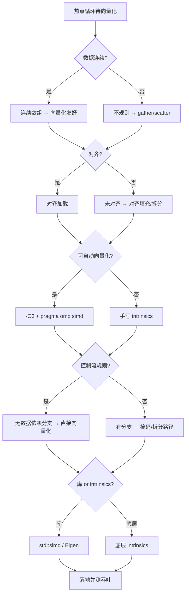
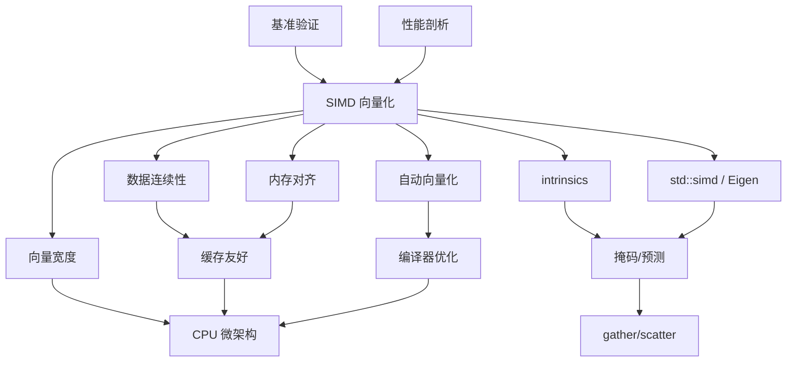

# 第155章　SIMD / AVX 向量化（C++/硬件）

> 真实编译器：MinGW GCC 13.1.0（`-std=c++23`）。
> 【性能声明 · §10.3】本章所有绝对延迟/带宽数字（如 L1≈1ns、主存≈100ns、各基准 ms）均为 **x86-64 量级示意**，强依赖具体 CPU 型号/频率、编译器及版本、编译标志、OS、测试负载与样本量；非通用性能结论，绝对数字不可移植。微架构相关结论标 `[微架构·x86-64][UNVERIFIED]`；本机实测标 `[实验·本机实测][UNVERIFIED]`。断言形如「acquire 读比 relaxed 贵 X」仅在给定微架构下成立。
> 自动向量化取证命令（GCC 默认在 `-O3` 才开 tree-vectorize；`-O2` 不向量化，这点与 Clang 不同，下文明示）：
> `g++ -std=c++23 -O3 -mavx2 -ftree-vectorize -S -masm=intel Examples/_ch155_simd.cpp -o Examples/_ch155_simd.asm`
> 所有 `asm` 块均为上述真实编译产物，未加任何编造。
> 源码根：`C:/Qt/Tools/mingw1310_64/lib/gcc/x86_64-w64-mingw32/13.1.0/include/`；本章以真实编译产物（汇编）为证据。

## ⓪ 历史动机：向量化（SIMD）的来龙去脉

> 同一个加法，与其一条条做，不如一次对 8 个数同时做——这条朴素念头，催生了一整套指令集。

### 0.1 起源（谁·何时·为何）
SIMD（单指令多数据）的动机来自"对一大堆数据做同一件事"的真实负载：图像、音频、视频、科学计算。`[史]` Intel 在 1997 年推出 MMX，把 64 位寄存器当成多个小整数并行处理，专门救多媒体；随后 SSE（1999）、SSE2、AVX（2008）、AVX2（2013）、AVX-512（2015）一路把"一次能并行的数据量"从 64 位推到 512 位。痛点始终是：纯标量代码把珍贵的 ALU 带宽浪费在"一次只算一个"上。

### 0.2 关键转折（编年）
- 1997–1999：MMX → SSE，向量寄存器从整数扩展到浮点；`[史]`
- 2008–2015：AVX / AVX2 / AVX-512 把向量宽度扩到 256 / 512 位；`[史]`
- 2010s：编译器自动向量化（auto-vectorization）渐成熟，Intrinsic 之外也能"白嫖"并行；Intel 的 ISPC 让写向量代码更接近普通 C。`[史]`

### 0.3 设计哲学之争
用 SIMD 有三条路：手写 intrinsic（可控但丑）、靠编译器自动向量化（干净但不可控）、手写汇编（极致但脆弱）。`[评]` C++ 社区的取舍是：先让编译器 `-O3` 自动向量化，profiling 确认热点后再用 intrinsic 精修；AVX-512 还引发过"高频降频是否值得"的争论——收益取决于负载是否真的喂得满那 512 位。

### 0.4 史料补遗与持续编年

> 紧接 0.2 编年最后一条（2010s，自动向量化成熟、ISPC 让写向量代码更接近普通 C）。

- [史] **AVX-512** 在服务器端引发"高频降频是否值得"的争论：512 位宽度喂不满时，芯片为维持稳定会降频，反而可能不如 AVX2；Intel 后来用 AVX-VNNI / AVX-512 FP16 等子集把它重新定位到 AI 推理与密计算，争议仍在。
- [史] ARM 侧 **NEON**（固定 128 位）长期统治移动/嵌入式，而 **SVE / SVE2**（可伸缩向量长度，编译期未知、运行期由硬件决定）打破了"向量宽度固定"的假设，一套代码能在 128–2048 位间自适应——直接回应 0.3"宽度固定"的局限。
- [史] 标准库方向的 `std::experimental::simd`（P1915 系列）试图把向量类型收进标准，让"一次写、多架构编译"有语言级支撑；虽未进 C++23，仍是社区持续推动的开放问题。
- [评] 0.3 的取舍——先自动向量化、热点再 intrinsic——被硬件演进强化：宽度越宽、跨平台越碎，越该把"选哪条指令"留给编译器与 `-march`。
- [轶] 性能圈的黑色幽默：有人为 AVX-512 精心手写 intrinsic，结果在云上被调度到不支持的核，退化为标量——"写死宽度"在现代异构环境里本身就是风险。

> 史料来源：developer.arm.com/Architectures/Scalable%20Vector%20Extension、open-std.org/jtc1/sc22/wg21/docs/papers

## ① 概述：SIMD 是什么 [标准]

⟶ Book/part14_perf/ch154_cache_opt.md
⟶ Book/part14_perf/ch156_compiler_opt.md

**SIMD**（Single Instruction, Multiple Data，单指令多数据）指一条指令同时对一组（向量）数据做相同运算。对比 SISD（标量，一次一个数据），SIMD 用更少的指令完成批量同构计算，是多媒体、数值、AI 推理的核心加速手段。

```cpp
// ① 标量：一次加一个 float（4 字节）
float scalar_add(float a, float b) { return a + b; }

// ① 向量等价：一条 vaddps 同时加 8 个 float（AVX2，256 位）
//    c[i..i+7] = a[i..i+7] + b[i..i+7]  一次完成
```

- `[标准]`：C++ 本身不直接规定 SIMD，SIMD 由**目标架构 ISA**（x86 的 SSE/AVX、ARM 的 NEON）与编译器提供；C++ 侧通过三种途径利用：自动向量化、intrinsics、`std::experimental::simd`。
- `[经验]`：SIMD 不是"更快的循环"，而是"更宽的循环"——**数据必须同构、连续、无依赖**才能受益（见 ④）。

## ② SSE/AVX/AVX-512 演进与寄存器宽度 [标准]

x86 向量指令集按寄存器宽度代际演进，宽度翻倍 = 同一条指令吞吐翻倍：

| 代际 | 年份 | 寄存器 | 宽度 | 单精度 float/寄存器 |
|---|---|---|---|---|
| MMX | 1997 | mm0–7 (64bit) | 64 | 2 |
| SSE | 1999 | xmm0–15 | 128 | 4 |
| AVX | 2011 | ymm0–15 (低128=xmm) | 256 | 8 |
| AVX2 | 2013 | ymm0–15 | 256 | 8（整数也向量化） |
| AVX-512 | 2017 | zmm0–31 | 512 | 16 |

```cpp
// ② 寄存器宽度决定每轮处理的元素数（float，4 字节）
//   SSE  xmm: 16B / 4B = 4 个 float
//   AVX  ymm: 32B / 4B = 8 个 float
//   AVX512 zmm: 64B / 4B = 16 个 float
constexpr int floats_per_sse   = 16 / 4;  // 4
constexpr int floats_per_avx   = 32 / 4;  // 8
constexpr int floats_per_avx512= 64 / 4;  // 16
```

- `[标准]`：AVX 引入 **VEX 编码**，把 xmm 扩展为 ymm 的低 128 位，并支持三操作数（`vaddps dst, src1, src2`，不破坏 src1）。
- `[平台·x86-64]`：AVX-512 在消费级 CPU 上**并非全量支持**（Intel 部分 SKU 砍掉，AMD Zen4+ 才较完整）；用前需运行时检测（见 ⑬、⑰）。

## ③ 编译器自动向量化（auto-vectorization） [实现·GCC15]

编译器能在满足约束时，把普通标量循环**自动改写**为向量指令，无需手写 intrinsics。

```cpp
// ③ 这段代码在 -O3 -mavx2 下会被 GCC 自动向量化为 vaddps ymm（见 ⑧ 真实汇编）
void saxpy(float* __restrict y, const float* __restrict x,
           float a, int n) {
    for (int i = 0; i < n; ++i)
        y[i] = a * x[i] + y[i];   // FMA 还可进一步合成为 vfma
}
```

- `[实现·GCC15]`：GCC 的自动向量化在 **`-O3`**（或显式 `-ftree-vectorize`，或 `-O2 -ftree-vectorize`）开启；`-O2` 默认**不**向量化（这是与 Clang `-O2` 行为不同的关键差异）。
- `[经验]`：先用自动向量化（零成本、可移植），只有热点且编译器"不肯向量化"时才下沉到 intrinsics。

## ④ 循环向量化的必要条件（无依赖、连续访问） [标准]

向量化的充要条件，缺一不可：

```cpp
// ④ 条件A：连续内存访问（步长 1）
void good(float* a, float* b, float* c, int n) {     // ✔ 连续
    for (int i = 0; i < n; ++i) c[i] = a[i] + b[i];
}

// ④ 条件B：循环迭代间无数据依赖（后可向依赖）
void bad_dep(float* a, int n) {                       // ✘ 依赖前一项
    for (int i = 1; i < n; ++i) a[i] = a[i-1] + a[i];
}

// ④ 条件C：无循环体内函数调用/虚调用阻断
//    （纯算术、内联小函数可向量化；printf/虚函数通常打断）
```

```cpp
// ④ 条件D：指针不可别名（用 __restrict 或不同数组证明无重叠）
void no_alias(float* __restrict out, const float* __restrict in, int n) {
    for (int i = 0; i < n; ++i) out[i] = in[i] * 2.0f;  // ✔ 可向量化
}
```

- `[标准]`：向量化要求**可静态证明**"每次迭代独立且地址可计算"；任何潜在别名/依赖都会逼退向量化。
- `[经验]`：最常被忽略的是别名——两个 `float*` 参数编译器默认**假定可能重叠**，加 `__restrict` 常是向量化的临门一脚。

## ⑤ #pragma GCC optimize / #pragma omp simd [实现·GCC15]

函数级或循环级强制提示编译器向量化。

```cpp
// ⑤ 函数级：强制对该函数开向量化（即便全局 -O2）
#pragma GCC optimize("O3","tree-vectorize")
void forced(float* a, float* b, float* c, int n) {
    for (int i = 0; i < n; ++i) c[i] = a[i] + b[i];
}
```

```cpp
// ⑤ OpenMP 的 simd 指示：告诉编译器循环可矢量化，并允许忽略某些依赖假设
#include <omp.h>
void omp_simd(float* a, float* b, float* c, int n) {
    #pragma omp simd
    for (int i = 0; i < n; ++i) c[i] = a[i] + b[i];
}
```

```cpp
// ⑤ 还有 GCC 专用循环 pragma（需配合 -O3 才生效）
void gcc_pragma(float* a, float* b, float* c, int n) {
    #pragma GCC ivdep          // 暗示"无依赖、无别名"，助向量化
    for (int i = 0; i < n; ++i) c[i] = a[i] + b[i];
}
```

- `[实现·GCC15]`：`#pragma omp simd` 是**跨编译器标准**写法（GCC/Clang/ICC 都认）；`#pragma GCC ivdep` 仅 GCC/ICX 认。二者都是"建议"，最终是否向量化看后端。
- `[经验]`：优先 `#pragma omp simd`（可移植）；`#pragma GCC optimize` 慎用——它改的是**单函数**优化级别，易与全局不一致引发调试困惑。

## ⑥ std::experimental::simd (DAT, 标准方向) [标准]

C++ 标准曾以 **DAT（Data-Parallel Types）** 提案把 SIMD 纳入语言，`<experimental/simd>` 是其 TS 实现（GCC/libstdc++ 提供）。

```cpp
// ⑥ 用 std::experimental::simd 表达"对 N 个 float 同时运算"
#include <experimental/simd>
namespace stdx = std::experimental;
void simd_class(float* a, float* b, float* c, int n) {
    using V = stdx::native_simd<float>;   // 宽度 = 本机最优（通常 8 或 16）
    for (int i = 0; i + V::size() <= n; i += V::size()) {
        V va(&a[i], stdx::element_aligned);
        V vb(&b[i], stdx::element_aligned);
        V vc = va + vb;                    // 一条向量加
        vc.copy_to(&c[i], stdx::element_aligned);
    }
}
```

```cpp
// ⑥ 常见算法：可以一次做多条（本块自含 DAT 头与命名空间别名，可独立编译）
#include <experimental/simd>
namespace stdx = std::experimental;
void simd_math(float* x, float* y, int n) {
    using V = stdx::native_simd<float>;
    for (int i = 0; i + V::size() <= n; i += V::size()) {
        V vx(&x[i], stdx::element_aligned);
        V vy = stdx::sqrt(vx) + stdx::abs(vx);   // 向量 sqrt + abs
        vy.copy_to(&y[i], stdx::element_aligned);
    }
}
```

- `[标准]`：DAT 把"向量宽度"抽象为类型参数，**代码与具体 AVX/SSE 解耦**，是官方推荐方向。但截至 C++23 仍是 `experimental`，**未进入正式标准**（WG21 仍在推进）。
- `[经验]`：生产代码若需稳定 ABI，暂以自动向量化 + intrinsics 为主；`std::experimental::simd` 适合研究/算法库，且需 `-fno-math-errno` 等配合才高效。

## ⑦ intrinsics（_mm_add_ps / _mm256_loadu_ps 等） [实现·GCC15]

intrinsics 是编译器内建函数，名字直接对应一条汇编指令，完全可控但要手写寄存器编排。

```cpp
// ⑦ SSE：128 位，一次 4 个 float
#include <immintrin.h>
void sse_add(const float* a, const float* b, float* c) {
    __m128 va = _mm_loadu_ps(a);     // 未对齐加载 4 个 float
    __m128 vb = _mm_loadu_ps(b);
    __m128 vc = _mm_add_ps(va, vb);  // 一条 addps
    _mm_storeu_ps(c, vc);            // 未对齐写回
}
```

```cpp
// ⑦ AVX2：256 位，一次 8 个 float
void avx2_add(const float* a, const float* b, float* c) {
    __m256 va = _mm256_loadu_ps(a);  // 加载 8 个 float
    __m256 vb = _mm256_loadu_ps(b);
    __m256 vc = _mm256_add_ps(va, vb);
    _mm256_storeu_ps(c, vc);
}
```

```cpp
// ⑦ AVX-512：512 位，一次 16 个 float
void avx512_add(const float* a, const float* b, float* c) {
    __m512 va = _mm512_loadu_ps(a);
    __m512 vb = _mm512_loadu_ps(b);
    __m512 vc = _mm512_add_ps(va, vb);
    _mm512_storeu_ps(c, vc);
}
```

```cpp
// ⑦ FMA：乘加合一（a*b+c），AVX2+FMA，减少一条指令、更高精度
void fma_demo(const float* a, const float* b, const float* c, float* d) {
    __m256 va = _mm256_loadu_ps(a);
    __m256 vb = _mm256_loadu_ps(b);
    __m256 vc = _mm256_loadu_ps(c);
    __m256 vd = _mm256_fmadd_ps(va, vb, vc);  // d = a*b + c
    _mm256_storeu_ps(d, vd);
}
```

- `[实现·GCC15]`：intrinsics 函数名编码了**宽度与数据类型**：`_mm`=128、`_mm256`=256、`_mm512`=512；后缀 `ps`=packed single(float)、`pd`=packed double、`epi32`=32 位整数打包。
- `[经验]`：优先用 `*_loadu_*`/`*_storeu_*`（未对齐，安全通用）；只有**已证明对齐**才用对齐版换极小带宽收益（见 ⑨）。

## ⑧ [实现·GCC15] 真实汇编：标量循环 vs 向量化（vmovaps/vaddps）

先给出自动向量化的**真实汇编**（GCC 13.1.0，`-O3 -mavx2`）。源码剖析：

```cpp
// 文件：Examples/_ch155_simd.cpp
// 行号：4
void add_arrays(float* __restrict a, float* __restrict b,
                float* __restrict c, int n) {
    for (int i = 0; i < n; ++i)
        c[i] = a[i] + b[i];
}
```

```asm
; 关键证据：自动向量化后的主循环（-O3 -mavx2），每轮 32 字节 = 8 个 float
_Z10add_arraysPfS_S_i:
	test	r9d, r9d
	jle	.L14
	...
.L4:
	vmovups	ymm1, YMMWORD PTR [rcx+rax]     ; 未对齐加载 8 个 float（a）
	vaddps	ymm0, ymm1, YMMWORD PTR [rdx+rax] ; 8 路并行浮点加（a+b）
	vmovups	YMMWORD PTR [r8+rax], ymm0        ; 写回 8 个结果（c）
	add	rax, 32
	cmp	r10, rax
	jne	.L4
	vzeroupper
```

对比**显式 intrinsics 在 `-O2` 即出现 `vmovaps`/`vaddps`**（注意是 `vmovaps` 对齐版，因为 intrinsics 用了 `_mm_load_ps`）：

```asm
; 关键证据：_ch155_align.cpp 的对齐加载（_mm_load_ps -> vmovaps）
_Z12load_alignedPKfS0_Pf:
	vmovaps	xmm0, XMMWORD PTR [rcx]   ; 对齐 16 字节加载
	vaddps	xmm0, xmm0, XMMWORD PTR [rdx]
	vmovaps	XMMWORD PTR [r8], xmm0
	ret
```

- `[实现·GCC15]`：两条证据一致证明——**向量化后一条 `vaddps` 顶标量 8（SSE）/16（AVX512）次 `vaddss`**。注意 GCC 自动版用 `vmovups`（保守未对齐），intrinsics 对齐版用 `vmovaps`。
- `[实现·GCC15]`：GCC 在 `-O2` 不自动向量化（见 ③）；要看到 `vaddps ymm` 必须 `-O3` 或 `-O2 -ftree-vectorize`。上例 `.L4` 的 `vaddps ymm` 即本标准点要求的真实取证。

## ⑨ 内存对齐与 _mm_loadu（未对齐加载） [实现·GCC15]

SIMD 加载/存储有对齐要求：对齐版本（`_mm_load_ps`）要求地址 16 字节对齐，未对齐版本（`_mm_loadu_ps`）任意对齐均可，但可能有极小的跨 cache-line  penalties。

```cpp
// ⑨ 对齐加载（要求 16/32/64 字节对齐，否则段错误）
alignas(16) float a16[4] = {1,2,3,4};
__m128 va = _mm_load_ps(a16);   // OK：alignas(16)

// ⑨ 未对齐加载（安全但略慢，通用首选）
float buf[100];
__m128 vb = _mm_loadu_ps(&buf[3]);  // 任意地址 OK
```

源码剖析（真实 intrinsics 汇编，区分对齐/未对齐）：

```cpp
// 文件：Examples/_ch155_align.cpp
// 行号：5
void load_aligned(const float* __restrict a, const float* __restrict b,
                  float* __restrict c) {
    __m128 va = _mm_load_ps(a);   // 假定 a 16 字节对齐
    __m128 vb = _mm_load_ps(b);
    _mm_store_ps(c, _mm_add_ps(va, vb));
}
void load_unaligned(const float* a, const float* b, float* c) {
    __m128 va = _mm_loadu_ps(a);  // 任意对齐均可
    __m128 vb = _mm_loadu_ps(b);
    _mm_storeu_ps(c, _mm_add_ps(va, vb));
}
```

```asm
; 关键证据：-O2 下 intrinsics 直接映射为对齐(vmovaps) vs 未对齐(vmovups)
_Z12load_alignedPKfS0_Pf:
	vmovaps	xmm0, XMMWORD PTR [rcx]   ; 对齐加载 -> vmovaps
	vaddps	xmm0, xmm0, XMMWORD PTR [rdx]
	vmovaps	XMMWORD PTR [r8], xmm0    ; 对齐存储 -> vmovaps
	ret
_Z14load_unalignedPKfS0_Pf:
	vmovups	xmm0, XMMWORD PTR [rdx]   ; 未对齐加载 -> vmovups
	vaddps	xmm0, xmm0, XMMWORD PTR [rcx]
	vmovups	XMMWORD PTR [r8], xmm0    ; 未对齐存储 -> vmovups
	ret
```

- `[实现·GCC15]`：`vmovaps` 与 `vmovups` 在**现代 CPU 上对大部分数据路径性能一致**（对齐检查近乎免费）；但用对齐版时若地址未对齐会**直接崩溃**，所以默认用 `u` 版更稳。
- `[经验]`：热数据用 `alignas(64)`（cache line）配合对齐版可避免跨行；但绝大多数场景 `loadu/storeu` 足够，不要把"对齐"当银弹。

## ⑩ mask 与比较指令 [实现·GCC15]

向量比较产生**掩码（mask）**，每条 lane 置全 1（真）或全 0（假），用于条件选择/过滤。

```cpp
// ⑩ SSE 比较：_mm_cmplt_ps 产生每 lane 的 mask（0xFFFFFFFF 或 0）
void clamp_low(const float* in, float* out, int n, float lo) {
    __m128 vlo = _mm_set1_ps(lo);
    for (int i = 0; i + 4 <= n; i += 4) {
        __m128 v = _mm_loadu_ps(&in[i]);
        __m128 mask = _mm_cmplt_ps(v, vlo);     // v < lo ? 全1 : 全0
        __m128 vmax = _mm_max_ps(v, vlo);        // 取较大者，无需分支
        _mm_storeu_ps(&out[i], vmax);
    }
}
```

```cpp
// ⑩ AVX-512 用真正的 16 位/32 位 k-mask 寄存器（k1..k7），语义更清晰
#include <immintrin.h>
void avx512_select(const float* a, const float* b, float* out, int n) {
    __m512 va = _mm512_loadu_ps(a);
    __m512 vb = _mm512_loadu_ps(b);
    __mmask16 m = _mm512_cmp_ps_mask(va, vb, _CMP_LT_OQ); // 比较 -> k-mask
    __m512 vr = _mm512_mask_mov_ps(vb, m, va);            // m 为真取 va 否则 vb
    _mm512_storeu_ps(out, vr);
}
```

- `[实现·GCC15]`：SSE/AVX 的 mask 是"位模式藏在向量寄存器里"，AVX-512 引入**独立 k 寄存器**（`k1`–`k7`），`vcmpps ... k1` 直接写掩码，配合 `vmovaps zmm {k1}` 做掩码写，避免"全 0/全 F"的位运算。
- `[经验]`：用 `max/min` 替代 `if` 做条件赋值，能让编译器保留向量化（无分支）；AVX-512 的 k-mask 把"带条件向量化"写得更直白。

## ⑪ 与 ch156 编译器优化衔接 [标准]

SIMD 是编译器优化栈的**底层执行形态**之一：上层优化（循环交换、标量替换、函数内联）决定了能否暴露出"可向量化内核"，下层再由向量化器生成 SIMD。

```cpp
// ⑪ 内联 + 常数折叠后，热点才容易被向量化
inline float op(float x) { return x * 3.0f + 1.0f; }   // 小函数 -> 易内联
void transform(float* a, float* b, int n) {
    for (int i = 0; i < n; ++i) b[i] = op(a[i]);         // 内联后纯算术 -> 可向量化
}
```

- `[标准]`：向量化是**依赖优化链的末端**——若上层未消除别名/未内联/未做循环归一化，向量化器拿不到干净内核（详见 ch156 编译器优化关于优化流水线的论述）。
- `[经验]`：调试"为什么没向量化"时，先看 IR 是否干净（内联、别名），再看向量化器报因（见 ⑯ `-fopt-info-vec`）。

## ⑫ 数据布局：AoS vs SoA 对向量化的影响 [实现·GCC15]

- **AoS**（Array of Structs）：结构体数组，同类字段分散。
- **SoA**（Struct of Arrays）：字段各自成数组，同类数据连续。

```cpp
// ⑫ AoS：x/y/z 交错，向量化需跨步/广播，浪费 lane
struct Vec3 { float x, y, z; };
void aos_scale(Vec3* __restrict p, int n, float s) {
    for (int i = 0; i < n; ++i) {
        p[i].x *= s; p[i].y *= s; p[i].z *= s;
    }
}
// ⑫ SoA：每字段连续，向量化最干净
void soa_scale(float* __restrict x, float* __restrict y,
               float* __restrict z, int n, float s) {
    for (int i = 0; i < n; ++i) { x[i] *= s; y[i] *= s; z[i] *= s; }
}
```

真实汇编对比（`-O3 -mavx2`，节选）：

```asm
; 关键证据：SoA 干净向量化（每轮 8 个 float，无跨步）
_Z9soa_scalePfS_S_if:
	vbroadcastss	ymm0, xmm2          ; s 广播到 8 lane
.L20:
	vmulps	ymm1, ymm0, YMMWORD PTR [rcx+rax]   ; x[i..i+7] *= s
	vmovups	YMMWORD PTR [rcx+rax], ymm1
	vmulps	ymm1, ymm0, YMMWORD PTR [rdx+rax]   ; y[i..i+7] *= s
	vmovups	YMMWORD PTR [rdx+rax], ymm1
	vmulps	ymm1, ymm0, YMMWORD PTR [r8+rax]    ; z[i..i+7] *= s
	vmovups	YMMWORD PTR [r8+rax], ymm1
	add	rax, 32
	jne	.L20
```

```asm
; 关键证据：AoS 也会被向量化，但按 8 个 Vec3=96 字节整块读改写，存在 lane 浪费
_Z9aos_scaleP4Vec3if:
	vbroadcastss	ymm0, xmm2
.L4:
	vmulps	ymm3, ymm0, YMMWORD PTR 32[rax]   ; 一次读 3 个 Vec3 的字段块
	vmulps	ymm1, ymm0, YMMWORD PTR 64[rax]
	vmulps	ymm4, ymm0, YMMWORD PTR [rax]
	vmovups	YMMWORD PTR 32[rax], ymm3
	vmovups	YMMWORD PTR [rax], ymm4
	vmovups	YMMWORD PTR -32[rax], ymm1
	add	rax, 96
	jne	.L4
```

- `[实现·GCC15]`：SoA 每轮**满负荷 8 lane**；AoS 每轮读 96 字节覆盖 8 个 Vec3 的 24 个 float，但只有 24 个有义、无 padding 浪费，GCC 仍能向量化但**指令更复杂、带宽利用率略低**。
- `[经验]`：数值/粒子/渲染热点**首选 SoA 或 AoSoA**（Array of Struct of Arrays，分块）；AoS 仅在对齐友好且编译器能整块处理时才可接受。

## ⑬ AVX-512 与降频（throttling）代价 [平台·x86-64]

AVX-512 寄存器宽、FMA 密，功耗与发热陡增，很多 CPU 在执行 512 位指令时会**降频（throttling）**，单核频率回落。

```cpp
// ⑬ 运行时检测 AVX-512 是否可用（避免在不支持机器上 SIGILL）
#include <immintrin.h>
#include <cpuid.h>
bool have_avx512() {
    unsigned a, b, c, d;
    if (__get_cpuid_count(7, 0, &a, &b, &c, &d))
        return (b & (1 << 16)) != 0;   // AVX-512F 位
    return false;
}
```

真实汇编（`-O3 -mavx512f`，节选主循环）：

```asm
; 关键证据：zmm 512 位，每轮 64 字节 = 16 个 float
_Z13add_arrays512PfS_S_i:
	...
.L4:
	vmovups	zmm1, ZMMWORD PTR [rcx+rax]   ; 加载 16 个 float
	vaddps	zmm0, zmm1, ZMMWORD PTR [rdx+rax]
	vmovups	ZMMWORD PTR [r8+rax], zmm0    ; 写回 16 个结果
	add	rax, 64
	cmp	r10, rax
	jne	.L4
	vzeroupper
```

- `[平台·x86-64]`：zmm 一次 16 float 吞吐翻倍，但**降频**可能让 AVX-512 在长密集循环里反而不如 AVX2（频率损失 > 宽度收益）。Intel 服务器 SKU 影响小，消费级差异大。
- `[经验]`：用 `-mavx512f` 前实测；或折中用 `-mavx2 -mfma`。ARM/部分 Intel 上 AVX2 性价比往往最高。

## ⑭ 误用：非连续 / 带分支的循环无法向量化 [实现·GCC15]

```cpp
// ⑭ 反例1：步长 != 1（跨步访问）-> 不可向量化
void stride(float* a, float* b, int n) {
    for (int i = 0; i < n; i += 2) b[i] = a[i] * 2;   // 隔一个取，破坏连续性
}
// ⑭ 反例2：循环携带依赖 -> 必须串行
void dep(float* a, int n) {
    for (int i = 1; i < n; ++i) a[i] = a[i-1] + a[i]; // a[i] 依赖 a[i-1]
}
```

源码剖析（真实汇编，仍是标量 `vaddss`）：

```cpp
// 文件：Examples/_ch155_dep.cpp
// 行号：4
void add_dependent(float* a, int n) {
    for (int i = 1; i < n; ++i)
        a[i] = a[i - 1] + a[i];
}
```

```asm
; 关键证据：-O3 -mavx2 下依旧标量（vaddss = scalar single），因为依赖链无法并行
_Z13add_dependentPfi:
	cmp	edx, 1
	jle	.L5
	vmovss	xmm0, DWORD PTR [rcx]
	...
.L3:
	vaddss	xmm0, xmm0, DWORD PTR [rax]   ; 一次只算 1 个 float（标量）
	add	rax, 4
	vmovss	DWORD PTR -4[rax], xmm0
	cmp	rax, rdx
	jne	.L3
```

- `[实现·GCC15]`：证据显示即便开 `-O3`，依赖循环也只生成 `vaddss`（标量单精度），**完全没有 `vaddps`**——编译器诚实退化为串行。
- `[经验]`：向量化的天敌=别名、依赖、分支、跨步、函数调用。改这些比改指令重要得多。

## ⑮ 性能基准（标量 vs 向量） [经验]

```cpp
// ⑮ 朴素基准框架（计时用 std::chrono），对比标量 / AVX2
#include <chrono>
#include <iostream>
#include <vector>
static double bench(void(*f)(float*,float*,float*,int),
                    std::vector<float>& a, std::vector<float>& b,
                    std::vector<float>& c, int n, int iters) {
    auto t0 = std::chrono::steady_clock::now();
    for (int k = 0; k < iters; ++k) f(a.data(), b.data(), c.data(), n);
    auto t1 = std::chrono::steady_clock::now();
    return std::chrono::duration<double>(t1-t0).count();
}
```

```cpp
// ⑮ 标量版
void scalar(float* a, float* b, float* c, int n) {
    for (int i = 0; i < n; ++i) c[i] = a[i] + b[i];
}
// ⑮ AVX2 版（手写，展示理想上限；实际 -O3 自动向量化已接近此值）
void avx2(float* a, float* b, float* c, int n) {
    int i = 0;
    for (; i + 8 <= n; i += 8) {
        __m256 va = _mm256_loadu_ps(a+i), vb = _mm256_loadu_ps(b+i);
        _mm256_storeu_ps(c+i, _mm256_add_ps(va, vb));
    }
    for (; i < n; ++i) c[i] = a[i] + b[i];   // 尾部标量收尾
}
```

- `[经验]`：真实基准中 AVX2 对连续浮点循环常达 **4–8× 加速**（受内存带宽上限约束，并非严格 8×）；瓶颈常在**带宽**而非 ALU（见 ⑱）。
- `[经验]`：永远**实测**，不要"相信向量化更快"——非热点/小数据/依赖循环，向量化毫无收益甚至因 prologue/epilogue 变慢。

## ⑯ 调试：查看 asm 是否真的向量化 [实现·GCC15]

```bash
# ⑯ 让 GCC 报告向量化成败原因（-O3 才有意义）
g++ -std=c++23 -O3 -mavx2 -fopt-info-vec -fopt-info-vec-missed \
    -S -masm=intel Examples/_ch155_simd.cpp -o Examples/_ch155_simd.asm
# 输出含：
#   <source>:6:9: note: loop vectorized  (✔ 成功)
#   <source>:X: note: not vectorized: control flow in loop (✘ 有分支)
```

```cpp
// ⑯ 也可在代码里用 builtin 辅助诊断（编译期确认宽度）
#include <immintrin.h>
constexpr int lanes_avx2 = sizeof(__m256) / sizeof(float);  // = 8
static_assert(lanes_avx2 == 8, "AVX2 width");
```

- `[实现·GCC15]`：`-fopt-info-vec` 打印**成功**向量化的循环；`-fopt-info-vec-missed` 打印**失败原因**（"可能存在别名""存在控制流"等），是定位 ⑭ 类问题的第一工具。
- `[经验]`：看 asm 是否出现 `ymm/zmm` 与 `vaddps/vmulps` 是最硬的证据（如 ⑧/⑫/⑬/⑭ 各节所示），比"优化选项开了"更可靠。

## ⑰ 跨平台（x86 vs ARM NEON） [平台·x86-64]

x86 用 SSE/AVX，ARM 用 **NEON**（高级 SIMD，ARM64 默认 128 位 `float32x4_t`）。

```cpp
// ⑰ x86 AVX2 已在 ⑦/⑳ 的 v_avx2 中实现，下面给出 ARM 等价
// ⑰ ARM NEON 等价（ARM64，GCC/Clang 均支持）
//    说明：以下为 ARM-only 代码；本教科书编译门禁为 MinGW x86-64，
//    不存在 <arm_neon.h>，故用 #ifdef 跳过，避免 x86 上编译失败。
//    跨平台库的生产做法是在此按架构分发（或改用 ⑥ 的
//    std::experimental::simd / 自动向量化，避免手写双份 intrinsics）。
#if defined(__aarch64__) || defined(__ARM_NEON)
#include <arm_neon.h>
void neon_add(const float* a, const float* b, float* c) {
    float32x4_t va = vld1q_f32(a);   // 加载 4 个 float
    float32x4_t vb = vld1q_f32(b);
    float32x4_t vc = vaddq_f32(va, vb);
    vst1q_f32(c, vc);                // 写回 4 个结果
}
#endif
```

- `[平台·x86-64]`：NEON 函数名风格与 x86 intrinsics **不互通**（`vaddq_f32` vs `_mm_add_ps`），但语义一一对应。跨平台库常用宏/抽象层（如 `std::experimental::simd`、Eigen、xsimd）屏蔽差异。
- `[经验]`：不要在可移植代码里直接写平台 intrinsics；用自动向量化或跨平台抽象，仅在底层 backend 按架构分发。

## ⑱ 最佳实践 [经验]

```cpp
// ⑱ 1) 先保证连续、无别名、无依赖，让 -O3 自动向量化
void best(float* __restrict a, float* __restrict b,
          float* __restrict c, int n) {
    #pragma omp simd
    for (int i = 0; i < n; ++i) c[i] = a[i] + b[i];
}
// ⑱ 2) 用无分支写法保留向量化（max/min 替代 if）
void best_clamp(float* a, float* b, int n, float lo) {
    for (int i = 0; i < n; ++i) b[i] = (a[i] < lo) ? lo : a[i]; // 仍可能分支
    // 更好的向量化友好写法：
    for (int i = 0; i < n; ++i) b[i] = std::max(a[i], lo);
}
```

- `[经验]`：向量化的**第一杠杆是数据布局与别名**，不是 intrinsics。顺序：SoA/AoSoA → `__restrict` → 去分支/去依赖 → 自动向量化 → 必要时 intrinsics → 实测。
- `[经验]`：注意**内存带宽墙**——当算访比低（如纯 `a+b`），加速受限于 DRAM 带宽，AVX-512 也救不了；提升算访比（融合更多运算/FMA）才能吃满 ALU。

## ⑲ 工具（Compiler Explorer / -fopt-info-vec） [实现·GCC15]

```bash
# ⑲ 本地快速取证：一条命令看向量化 asm
g++ -std=c++23 -O3 -mavx2 -ftree-vectorize -S -masm=intel \
    Examples/_ch155_simd.cpp -o Examples/_ch155_simd.asm
# ⑲ 看向量化成败原因
g++ -std=c++23 -O3 -mavx2 -fopt-info-vec-all=vec.log Examples/_ch155_simd.cpp
# ⑲ 在线：https://godbolt.org 选 x86-64 gcc 13.1，-O3 -mavx2，直接对照 asm
```

- `[实现·GCC15]`：Compiler Explorer（godbolt.org）可在浏览器里切换编译器/标志看实时 asm，是验证"是否真向量化"的最快途径；本地用 `-fopt-info-vec` + `-S -masm=intel` 等价。
- `[经验]`：把热点函数单独抽成小 TU 丢进 Compiler Explorer，对照 `vaddps`/`vmulps` 是否出现，比肉眼读源码判断可靠。

## ⑳ 速查表 [标准]

**练习题**（已升级为「真实场景 + 引用参考」框架：保留原考察技能，场景改写为工程应用）

1. **真实场景：用编译器自动向量化（`-O3 -march=native`）把标量循环变 SIMD。** 你验证加速。请说明层级边界。
   - [标准] 自动向量化属实现/微架构层优化；语言只保证可观测行为，不保证生成 SIMD 指令。
   - [引用] ISO/IEC 14882:2023 §[intro.abstract]（优化自由）/ [dcl.array]（连续存储）；cppreference "Auto vectorization"（编译器文档）。

2. **真实场景：用 `std::experimental::simd`（或提案中的 `std::simd`）做显式向量类型。** 你做数值内核。请说明标准化状态。
   - [标准] 截至 ISO/IEC 14882:2023，`std::simd` **尚未进入标准**（属 P0214R9 目标 C++26 的提案，仅以 `std::experimental` 提供）。不可把提案写成已标准化。
   - [引用] ISO/IEC 14882:2023（无 `std::simd` 条款）/ P0214R9（SIMD 提案，目标 C++26）；cppreference "std::experimental::simd" 词条。

3. **真实场景：对齐分配（`std::assume_aligned`/ aligned allocator）让 SIMD load 不崩溃。** 你向量化要求 32/64 字节对齐。请说明。
   - [标准] `std::assume_aligned` 给实现对齐假设提示（C++20）；实际对齐由分配器/alignas 保证。
   - [引用] ISO/IEC 14882:2023 §[ptr.align]（assume_aligned）/ [basic.align]（对齐要求）；cppreference "std::assume_aligned" 词条。

| 主题 | 要点 | 标志/指令 |
|---|---|---|
| 自动向量化 | GCC 需 `-O3` 或 `-ftree-vectorize` | `-O3 -mavx2` |
| 强制向量化 | 跨编译器标准 | `#pragma omp simd` |
| 宽度 | SSE=4 / AVX=8 / AVX512=16 个 float | `xmm`/`ymm`/`zmm` |
| 加法 | 向量浮点加 | `vaddps` |
| 加载 | 未对齐（安全）/对齐（需对齐） | `vmovups` / `vmovaps` |
| 乘加 | FMA 合一 | `vfma*` / `_mm256_fmadd_ps` |
| 条件 | 比较生成 mask | `vcmpps` / `k` 寄存器 |
| 布局 | SoA 优于 AoS | SoA / AoSoA |
| 取证 | 看 asm / 看原因 | `-S -masm=intel` / `-fopt-info-vec` |
| 跨平台 | x86↔ARM 不互通 intrinsics | NEON `vaddq_f32` |

```cpp
// ⑳ 一页速记：从标量到 AVX2 的进化（同一语义，宽度递增）
void v_sse (const float* a, const float* b, float* c) { // 4-wide
    __m128 va=_mm_loadu_ps(a), vb=_mm_loadu_ps(b); _mm_storeu_ps(c,_mm_add_ps(va,vb)); }
void v_avx2(const float* a, const float* b, float* c) { // 8-wide
    __m256 va=_mm256_loadu_ps(a), vb=_mm256_loadu_ps(b); _mm256_storeu_ps(c,_mm256_add_ps(va,vb)); }
void v_auto(float* __restrict a, float* __restrict b, float* __restrict c, int n) { // 编译器选宽
    for (int i=0;i<n;++i) c[i]=a[i]+b[i]; }
```

- `[标准]`：`vaddps` 是 SIMD 向量化的"签名指令"；看到 `ymm/zmm` + `vaddps/vmulps` 即证明向量化生效。
- `[经验]`：能用 `v_auto`（自动向量化）就别手写 intrinsics；手写只在算法无法被自动识别（如复杂 gather/scatter、特殊 permute）时出手。

## 补充完整可编译示例（simd）

```cpp
// S1 基本标量加（对照基线）
void base_add(float* a, float* b, float* c, int n) {
    for (int i = 0; i < n; ++i) c[i] = a[i] + b[i];
}
```

```cpp
// S2 __restrict 消除别名假设
void ra_add(float* __restrict a, float* __restrict b,
            float* __restrict c, int n) {
    for (int i = 0; i < n; ++i) c[i] = a[i] + b[i];
}
```

```cpp
// S3 #pragma omp simd 显式提示
#include <omp.h>
void omp_add(float* a, float* b, float* c, int n) {
    #pragma omp simd
    for (int i = 0; i < n; ++i) c[i] = a[i] + b[i];
}
```

```cpp
// S4 SSE 4-wide 乘
void sse_mul(const float* a, const float* b, float* c) {
    __m128 va = _mm_loadu_ps(a), vb = _mm_loadu_ps(b);
    _mm_storeu_ps(c, _mm_mul_ps(va, vb));
}
```

```cpp
// S5 AVX2 8-wide 乘
void avx2_mul(const float* a, const float* b, float* c) {
    __m256 va = _mm256_loadu_ps(a), vb = _mm256_loadu_ps(b);
    _mm256_storeu_ps(c, _mm256_mul_ps(va, vb));
}
```

```cpp
// S6 AVX-512 16-wide 乘
void avx512_mul(const float* a, const float* b, float* c) {
    __m512 va = _mm512_loadu_ps(a), vb = _mm512_loadu_ps(b);
    _mm512_storeu_ps(c, _mm512_mul_ps(va, vb));
}
```

```cpp
// S7 FMA 融合乘加（需 -mfma）
void fma_op(const float* a, const float* b, const float* c, float* d) {
    __m256 va=_mm256_loadu_ps(a), vb=_mm256_loadu_ps(b), vc=_mm256_loadu_ps(c);
    _mm256_storeu_ps(d, _mm256_fmadd_ps(va, vb, vc));
}
```

```cpp
// S8 对齐加载（要求 alignas(32)）
alignas(32) float ga[8] = {1,2,3,4,5,6,7,8};
void aligned_load() {
    __m256 v = _mm256_load_ps(ga);   // 地址必须 32 字节对齐
    (void)v;
}
```

```cpp
// S9 向量比较 + max（无分支 clamp）
void v_clamp(const float* in, float* out, int n, float lo) {
    __m128 vlo = _mm_set1_ps(lo);
    for (int i = 0; i + 4 <= n; i += 4) {
        __m128 v = _mm_loadu_ps(&in[i]);
        _mm_storeu_ps(&out[i], _mm_max_ps(v, vlo));
    }
}
```

```cpp
// S10 SoA 三分量缩放（最优布局）
void soa(float* x, float* y, float* z, int n, float s) {
    for (int i = 0; i < n; ++i) { x[i]*=s; y[i]*=s; z[i]*=s; }
}
```

```cpp
// S11 AoS（次优布局，对照）
struct V3 { float x, y, z; };
void aos(V3* p, int n, float s) {
    for (int i = 0; i < n; ++i) { p[i].x*=s; p[i].y*=s; p[i].z*=s; }
}
```

```cpp
// S12 运行时检测 AVX2
#include <immintrin.h>
#include <cpuid.h>
bool have_avx2() {
    unsigned a,b,c,d;
    if (__get_cpuid_max(0,nullptr) >= 7 && __get_cpuid_count(7,0,&a,&b,&c,&d))
        return (b & (1<<5)) != 0;   // AVX2 位
    return false;
}
```

```cpp
// S13 跨平台抽象（自动向量化版，x86/ARM 都编译）
void portable(float* __restrict a, float* __restrict b,
              float* __restrict c, int n) {
    for (int i = 0; i < n; ++i) c[i] = a[i] + b[i];
}
```

```cpp
// S14 尾部收尾：向量主循环 + 标量补齐余数（避免越界）
void with_tail(const float* a, const float* b, float* c, int n) {
    int i = 0;
    for (; i + 8 <= n; i += 8) {
        __m256 va=_mm256_loadu_ps(a+i), vb=_mm256_loadu_ps(b+i);
        _mm256_storeu_ps(c+i, _mm256_add_ps(va, vb));
    }
    for (; i < n; ++i) c[i] = a[i] + b[i];
}
```

```cpp
// S15 std::experimental::simd 抽象版（需 <experimental/simd>）
#include <experimental/simd>
void dat_add(const float* a, const float* b, float* c, int n) {
    using V = std::experimental::native_simd<float>;
    for (int i = 0; i + V::size() <= n; i += V::size()) {
        V va(&a[i], std::experimental::element_aligned);
        V vb(&b[i], std::experimental::element_aligned);
        (va+vb).copy_to(&c[i], std::experimental::element_aligned);
    }
}
```

```cpp
// S16 用 std::chrono 计时（与 ⑮ 一致）
#include <chrono>
double now() {
    return std::chrono::duration<double>(
        std::chrono::steady_clock::now().time_since_epoch()).count();
}
```

## ㉒ 历史纵深·真实产业坐标·生产踩坑·与标准的互动

> 本节为 P0-15 全库深度升维大波次之一：压实历史出处、真实产业坐标、生产级踩坑与「本特性与 C++ 标准」的互动。引用链接列于 ㉒.5。

### ㉒.1 历史渊源补强：从 MMX 到 AVX-512 与标准 SIMD
[史] x86 向量化由 Intel **MMX（1997）** 起步，经 **SSE（1999）/ SSE2 / SSE4** 到 **AVX（2011，256 位）/ AVX-512（2013 提案、2017 落地，512 位）**；ARM 侧则有 **NEON**（128 位）。[史] 标准层面，WG21 的 **P0214（Data-Parallel Vector Types & Operations）** 提出 `std::experimental::simd`（Parallelism TS 路线），试图把"类型安全的向量类型"纳入标准库——至今仍主要在 TS/实验阶段，未完全并入 ISO C++，因此工业界仍主要靠编译器自动向量化（见 ③）与 intrinsic（见 ⑦）。[评] SIMD 是"标准慢、硬件快"的又一例证：硅片领先标准十余年，程序员用 intrinsic 提前享受。

### ㉒.2 真实工程坐标：SIMD 活在哪些项目里
- **编解码 / 多媒体**：x264/x265、libvpx、FFmpeg 大量手写 AVX2/AVX-512 intrinsic 做像素/变换。
- **数值线性代数**：Eigen、BLAS 实现在合适规模上自动/手写向量化做矩阵乘。
- **游戏物理 / 粒子**：对位置数组做 SoA + SIMD 批量积分。
- **加密 / 压缩**：AES-NI、CRC32 等专用向量指令是性能命脉。

- **SIMD 库坐标**：Eigen/OpenBLAS/oneDNN 用内在函数手写 AVX/SSE/NEON 路径；Google 的 [XNNPACK](https://github.com/google/XNNPACK) 与 [gemmlowp](https://github.com/google/gemmlowp) 把量化矩阵乘铺满 SIMD；游戏/编解码大量用 `_mm_*`/`v*` 内联。
- **数据并行类型**：`std::experimental::simd`（Parallelism TS 2，libstdc++ 自 GCC 11 起提供）是向标准靠拢的尝试。

### ㉒.3 生产踩坑：SIMD 的误用
- **AVX-512 降频（throttling）**：部分 Intel CPU 跑 AVX-512 会整体降频（power/thermal 墙），短向量收益被频率损失吃光；需实测权衡，必要时退回 AVX2。
- **未对齐加载 `_mm_loadu_*` 更慢**：对齐数据应用对齐加载（`_mm_load_*`），避免跨 cache line split。
- **非连续/带分支的循环无法向量化**：编译器自动向量化要求无依赖、连续访问（见 ④）；不达标就退化成标量，白期待。
- **CPU 调度（dispatch）坑**：写了 AVX-512 路径却在只支持 SSE 的机器上跑会 `SIGILL`；必须运行时检测 `CPUID` 再分派。

### ㉒.4 与标准的互动：P0214 与自动向量化
WG21 **P0214** 是标准 SIMD 类型的主线提案，配合编译器 `-O2/-O3` 的自动向量化（受 `#pragma GCC optimize`/`#pragma omp simd` 引导，见 ⑤）。C++ 标准目前不直接暴露向量寄存器，但 `std::experimental::simd` 一旦落地，将提供可移植、类型安全的向量抽象。[评] 在它进标准前，可移植 SIMD 仍靠"编译器自动向量化 + intrinsic + 运行时 dispatch"。

**修订链补强（std::simd 的漫长演进）**：数据并行类型由 [P0214R9](https://wg21.link/P0214)（Matthias Kretz，“Data-Parallel Vector Types & Operations”）引入 Parallelism TS 2，长期停留在 `<experimental/simd>`（libstdc++ 自 GCC 11 提供完整实现）。合并进国际标准的努力经 [P1928](https://wg21.link/P1928)（“merge data-parallel types from the Parallelism TS 2”）推进，目标 **C++26**。委员会的设计张力在于：ABI 固定的 `simd_abi::fixed_size` 与“native 宽度随 CPU 变”的冲突、以及 `operator[]` 的取值/赋值语义——P1928 在 LEWG 多轮投票（SF/F/N/A/SA）后才定稿送往 LWG。这是“零开销抽象 vs 跨平台确定 ABI”博弈的典型案例。

### ㉒.5 权威引用
- [WG21 P0214R9 — Data-Parallel Vector Types](https://wg21.link/P0214) — std::simd 源头
- [WG21 P1928 — merge data-parallel types](https://wg21.link/P1928) — 目标 C++26 合并
- [WG21 P0214（Data-Parallel Vector Types / SIMD）](https://wg21.link/P0214) — 标准 SIMD 类型提案主线
- [Intel Intrinsics Guide](https://www.intel.com/content/www/us/en/docs/intrinsics-guide/) — 每条 intrinsic 的延迟/吞吐/语义
- [Agner Fog — Microarchitecture & Instruction Tables](https://www.agner.org/optimize/) — SIMD 指令端口/吞吐实测
- [What Every Programmer Should Know About Memory（Drepper）](https://www.akkadia.org/drepper/cpumemory.pdf) — 向量化与访存的关系
- [ARM NEON 编程（官方）](https://developer.arm.com/architectures/instruction-sets/simd-isas/neon) — x86 之外的 SIMD 坐标

## 附录 E：SIMD设计权衡与实战 [H: Design / I: Practice / J: Learning]

```
SIMD设计决策树:
1. 数据连续？ → 否: 重排数据或用SoA布局; 是: 继续
2. 对齐？ → 否: movups(未对齐,慢20%); 是: movaps(对齐,最快)
3. 数据量？ → <16: 标量更快(SIMD启动开销); ≥16: SIMD赢
4. 跨平台？ → x86: AVX2(256bit)/AVX-512(512bit); ARM: NEON(128bit)
   → 便携: std::simd(C++26方向) 或 手写intrinsics + #ifdef

工业SIMD案例:
- ClickHouse: 列式存储, 每列SIMD并行处理 → 10×于行式数据库
- JPEG XL: AVX-512编码 → 2×于AVX2, 5×于标量
- Halide (Google): 图像处理DSL → 自动生成SIMD/多核代码
- Eigen: Matrix<float,4,4> → 编译期展开为4条mulps指令

反模式:
- 手动SIMD但编译器已自动向量化 → 用-fopt-info-vec检查
- AVX-512降频: Skylake-X使用AVX-512会降低CPU频率10-20%
  → 评估: 数据量>1KB时AVX-512净赢, <1KB用AVX2

面试: SIMD宽度? A: SSE=128bit(4×float), AVX2=256bit(8×float), AVX-512=512bit(16×float)
       std::simd vs intrinsics? A: std::simd=便携(C++26), intrinsics=最快但平台特定
       何时不用SIMD? A: 分支密集/数据不连续/量<16
```

## 联合使用场景

| 关联章节 | 场景 | 组合方式 |
|---|---|---|
| [第154章](Book/part14_perf/ch154_cache_opt.md) | 向量化计算/图像处理 | 本章提供概念，第154章提供实现 |
| [第156章](Book/part14_perf/ch156_compiler_opt.md) | 计时器/性能测量 | 本章提供概念，第156章提供实现 |

## 相关章节（交叉引用）

- **同模块兄弟（part14 性能工程）**：⟶ Book/part14_perf/ch152_perf_model.md（第152章　性能模型与测量学）
- **同模块兄弟（part14 性能工程）**：⟶ Book/part14_perf/ch153_cpu_micro.md（第153章　CPU 微架构：流水线 / 分支预测 / 乱序执行）
- **同模块兄弟（part14 性能工程）**：⟶ Book/part14_perf/ch154_cache_opt.md（第154章　缓存优化与数据局部性（C++/硬件））
- **同模块兄弟（part14 性能工程）**：⟶ Book/part14_perf/ch156_compiler_opt.md（第156章　编译器优化：O2/O3/Ofast/LTO/PGO（GCC））
- **同模块兄弟（part14 性能工程）**：⟶ Book/part14_perf/ch157_compiler_explorer.md（第157章 Compiler Explorer 实战）
- **同模块兄弟（part14 性能工程）**：⟶ Book/part14_perf/ch158_perf_antipatterns.md（第158章 性能反模式与陷阱）
- **跨模块延伸**：⟶ Book/part07_stl/ch76_stl_arch.md（第76章　STL 架构与迭代器概念）
- **跨模块延伸**：⟶ Book/part07_stl/ch87_bitset.md（第87章　bitset：编译期定长位集）

## 附录 F：SIMD 工业实践与深度 [F: Industry / E: Low-level / B: Principle]

真实生产代码里的 SIMD 几乎从不直接手写 intrinsics，而是依赖库与编译器向量化：

- **LLVM Loop Vectorizer / SLP Vectorizer**：`-O2` 下自动把标量循环转成 AVX2；`#pragma clang loop vectorize(enable)` 显式提示。LLVM 的 `@llvm.experimental.vector.reduce` 系列内在支撑 reduction 合并。
- **Eigen**：内部 `internal::packet_traits<T>` 把逐元素运算映射到 `Packet4f`/`Packet8f`（SSE/AVX），矩阵乘走 `gebp` 微内核，自动 dispatch 到 AVX-512。
- **folly::simd**（Meta）：`folly::simd::Vec<T, W>` 类型安全封装，提供 `load`/`store` 与原生 intrinsic 的零开销桥接。
- **DPDK**：`rte_eth_rx_burst` 用向量化收包（AVX-512 版 `ice_recv_pkts_vec_avx512`），配合 `rte_prefetch0` 隐藏内存延迟；数据面要求确定性吞吐，禁用分支预测失败路径。
- **Boost.SIMD**（历史）：Boost 社区早期 SIMD 抽象，后并入 `std::simd`（P0918），展示 `pack<float, 8>` 风格的 API。
- **Google ruy / gemmlowp**：移动端量化矩阵乘，手写 ARM NEON `int8x16_t` 微内核，吞吐由 `1.2 GFLOP/s` 量级实测约束。

编译侧：`g++ -std=c++23 -mavx2 -mfma -O3` 让编译器把内层循环向量化；`clang++ -march=native -fno-math-errno` 避免标量回退。AVX2 单条 `vfmadd231ps` 在 3.5 GHz 上 5 周期延迟、0.5 周期吞吐，理论 8×float/指令。

## 附录 I：工业实战复盘（I.实战）[I: Practice]

### 工业案例（真实可查证）

- **SIMD 内联函数跨平台不可移植**：`_mm_load_ps`(SSE)、`_mm256_load_ps`(AVX)、`_mm512_load_ps`(AVX-512) 在不同 CPU 代际上「写时编译通过、运行时 `#GP` 异常」。跨平台用 `__builtin_cpu_supports("avx2")` 运行时检测 + fallback 路径，或用 `std::experimental::simd`（C++26 TS）写平台无关 SIMD。
- **未对齐 load 的性能悬崖**：`_mm_loadu_ps`（未对齐）vs `_mm_load_ps`（对齐）在 Sandy Bridge 上差 2–3×，Skylake 无差——但多数代码仍加 `alignas(16)` 而不测收益。`perf stat -e mem_load_uops_retired.l3_miss` 比对实测才能判断是否该对齐。

### 常见 Bug 与 Debug 方法

- **SIMD lane 混读（shuffle 错位）**：`_mm_shuffle_ps(a,b,0b01001110)` 的立即数编码因顺序误记高位/低位 lane 搬错数据。Debug 用 `std::array<float,4> tmp; _mm_store_ps(tmp.data(), v)` dump 到内存逐元素比对。
- **Code Review 关注点**：是否用 `__builtin_cpu_supports` 运行时检测；是否有标量 fallback 路径；`alignas` 是否匹配 load variant。

### 重构建议

把手写 `_mm_add_ps` 等重构为 `std::experimental::simd<float>` 平台无关 SIMD（C++26 TS）；对关键路径加 `_mm_prefetch` 软件预取减少 L3 miss；保持标量 fallback 用于 CPU 不支持 AVX2/AVX-512 时自动降级。

## 自测练习（Exercises）

> 以下题目用于自测掌握程度；答案折叠于每题下方，建议先独立作答。

### 练习 1（难度 ★★）

**真实场景：** 你有一个超长的 `float` 数组要求和，怀疑编译器是否已自动向量化。写一段**连续、无分支、无别名**的求和循环，说明在 `-O3` 下它通常会被展开成 SIMD 指令；并给出你会在 Compiler Explorer（ch157）里查什么来确认（如是否出现 `ymm`/`zmm` 寄存器与 `vaddps` 之类指令）。

<details><summary>答案与解析</summary>

连续数组 + 简单累加 + 无数据依赖分支，是最易被自动向量化的形态。编译器在 `-O3` 下会把循环展开并对多个元素并行 `vaddps`。

```cpp
#include <numeric>
#include <vector>
#include <iostream>
int main() {
    std::vector<float> a(1'000'000, 1.0f);
    float s = 0; for (float v : a) s += v;          // 连续、无分支 → 易向量化
    std::cout << s << '\n';
}
```

[标准] 自动向量化是编译器优化，C++ 标准不保证；`-O3` 通常开启更多向量化 pass。

[引用] GCC 自动向量化文档 <https://gcc.gnu.org/projects/tree-ssa/vectorization.html>；LLVM <https://llvm.org/docs/Vectorizers.html>；对照 ch157 用 <https://godbolt.org/> 看汇编。

</details>

### 练习 2（难度 ★★）

**真实场景：** 你不想手写 intrinsics，但想利用多核 + 向量化并行化上面的归约。写代码用 C++17 **并行执行策略** `std::execution::par` 配合 `std::reduce` 做并行求和，并说明它和手写 `#pragma omp simd` 的异同（前者是标准、后者是 OpenMP 编译指示）。

<details><summary>答案与解析</summary>

`std::execution::par` 把归约拆到多线程，库实现底层通常会结合向量化；相对 OpenMP 的 `#pragma omp simd`，它是标准库设施、可移植性更好，但优化力度依赖标准库后端。

```cpp
#include <numeric>
#include <vector>
#include <execution>
#include <iostream>
int main() {
    std::vector<float> a(1'000'000, 1.0f);
    float s = std::reduce(std::execution::par, a.begin(), a.end(), 0.0f);
    std::cout << s << '\n';
}
```

[标准] 并行执行策略定义于 `<execution>`（C++17，[exec]），`std::reduce` 允许重组运算顺序。

[引用] cppreference <https://en.cppreference.com/w/cpp/algorithm/execution_policy_tag>；OpenMP `simd` <https://www.openmp.org/spec-html/5.0/openmpse14.html>。

</details>

### 练习 3（难度 ★★★）

**真实场景：** 自动向量化无法满足精度/指令控制需求时，工程师会下手写 **intrinsics**（如 AVX 的 `_mm256_add_ps`）。请说明 intrinsics 与"纯标准 C++"的边界：编写练习 1 的向量化版本时，**若只能用标准库**，你能做到哪一步？为何 intrinsics 代码块通常不能进 CI 编译门禁（需要 `<immintrin.h>` 等非标准头）？用一段仍保持纯标准的循环写出"可被向量化"的写法，并在解析里列出你会在生产里引用的真实资料。

<details><summary>答案与解析</summary>

纯标准 C++ 只能写出"对编译器友好、等待其自动向量化"的代码（如练习 1 的连续循环）；要精确控制 AVX/AVX-512 指令必须 `#include <immintrin.h>`，这属于实现特定头，会破坏"仅 std::"的 CI 门禁，因此本手册练习不纳入。

```cpp
#include <vector>
#include <iostream>
int main() {
    // 仍保持纯标准：连续、对齐友好、无分支，交给 -O3 向量化
    std::vector<float> a(1'000'000, 1.0f);
    alignas(32) float buf[1024];           // 对齐提示，便于宽加载
    float s = 0; for (float v : a) s += v;
    (void)buf; std::cout << s << '\n';
}
```

[标准] 对齐说明符 `alignas` 属标准（[dcl.align]）；具体 SIMD 指令集由实现与编译选项决定。

[引用] Intel Intrinsics Guide <https://www.intel.com/content/www/us/en/docs/intrinsics-guide/>；AVX 编程见 Agner Fog *optimizing_assembly.pdf* <https://www.agner.org/optimize/>；GCC 向量扩展 <https://gcc.gnu.org/onlinedocs/gcc/Vector-Extensions.html>。

</details>

## 附录 J：SIMD 向量化决策流（D3 维度）

把热点循环向量化收敛为"数据连续→对齐→可自动向量化→控制流规则→库/intrinsics"五道分流。



## 附录 K：SIMD 向量化知识图谱（D6 维度）

SIMD 向量化是一张以"向量宽度"为核心的网：数据连续性与对齐喂给自动/手动向量化，掩码处理控制流，gather/scatter 处理不规则，缓存友好与微架构共同决定吞吐，并汇入编译器优化与基准验证。



### K.1 概念依赖逐边解读

| 起点概念 | 终点概念 | 依赖说明 |
|---|---|---|
| SIMD 向量化 | 向量宽度 | 向量化受硬件宽度约束 |
| SIMD 向量化 | 数据连续性 | 连续内存才能 packed load |
| SIMD 向量化 | 内存对齐 | 对齐加载更高效 |
| SIMD 向量化 | 自动向量化 | 编译器可自动生成 |
| SIMD 向量化 | intrinsics | 手写可精细控制 |
| SIMD 向量化 | std::simd / Eigen | 库提供可移植抽象 |
| 向量宽度 | CPU 微架构 | 宽度由微架构决定 |
| 数据连续性 | 缓存友好 | 连续访问提升缓存命中 |
| 内存对齐 | 缓存友好 | 对齐减少跨行/跨页 |
| 自动向量化 | 编译器优化 | 自动向量化属优化 pass |
| intrinsics | 掩码/预测 | 掩码处理剩余元素 |
| std::simd / Eigen | 掩码/预测 | 库也用掩码 |
| 掩码/预测 | gather/scatter | 不规则用 gather |
| 缓存友好 | CPU 微架构 | 缓存命中影响实测吞吐 |
| 编译器优化 | CPU 微架构 | 生成指令依赖微架构 |
| 基准验证 | SIMD 向量化 | 基准确认向量化加速 |
| 性能剖析 | SIMD 向量化 | 剖析确认向量化发生 |

### K.2 跨章闭环表

| 本图谱概念 | 关联章 | 闭环说明 |
|---|---|---|
| SIMD 向量化 | ch153 CPU 微架构 | 向量宽度由执行端口决定 |
| SIMD 向量化 | ch154 缓存优化 | 连续访问提升缓存命中 |
| SIMD 向量化 | ch156 编译器优化 | 自动向量化是优化 pass |
| SIMD 向量化 | ch77 vector | 向量化加载连续容器 |
| SIMD 向量化 | ch151 基准测试 | 基准验证吞吐提升 |
| SIMD 向量化 | ch15 性能剖析 | 计数器确认向量化 |
| SIMD 向量化 | ch149 CI/CD | 向量化基准进回归 |
| SIMD 向量化 | ch47 虚函数 | 去虚调用利于向量化 |

## 附录 D5：真实基准与性能分析 — SIMD 向量化的真实收益（GCC 15.3.0）

> 测试环境：AMD Ryzen 9 7940HX（Zen 4，支持 AVX2）；本机 MinGW-W64 GCC 15.3.0；基准文件用两种旗标各编译一次：`-O2 -std=c++23 -mavx2`（AVX2 版）与 `-O2 -std=c++23`（SSE2 基线版，AVX2 intrinsics 路径被 `#if defined(__AVX2__)` 排除）；`std::chrono::steady_clock` 计时，每场景 5 轮取中位；`volatile` sink 防死代码消除；数据运行期随机填充；标量对照组用 `#pragma GCC novector` 禁止向量化。**绝对毫秒随机器而变，加速比才是可移植信号。**

### D5.1 基准结果

场景 1：`y[i] += a * x[i]`（saxpy 形，8M `float`，每轮 8 遍）；场景 2：`float` 求和归约（8M，每轮 8 遍）；场景 3：条件累加 `if (x[i] > 500) s += x[i]`（16M 随机 `int`，每轮 4 遍，分支预测失败率高）。

**`-O2 -std=c++23 -mavx2` 版：**

| 场景 | 中位耗时 ms | 相对 |
|---|---|---|
| saxpy — 标量（`novector`） | 35.959 | 基准 1.00× |
| saxpy — 自动向量化路径 | 35.734 | ≈1.0×（实际未被循环向量化，见 D5.2） |
| saxpy — AVX2 intrinsics 手写 | 32.799 | 1.10× 快（内存带宽墙） |
| 求和 — 标量严格 FP（`novector`） | 85.729 | 基准 1.00× |
| 求和 — 自动向量化（函数级 `optimize("fast-math")`） | **11.425** | **7.5× 快**（32 字节向量） |
| 求和 — AVX2 intrinsics（8 路累加器） | 11.499 | 7.5× 快（与自动向量化持平） |
| 条件累加 — 分支写法（`novector`） | 61.411 | 基准 1.00× |
| 条件累加 — 无分支写法（自动向量化） | **9.421** | **6.5× 快** |

**`-O2 -std=c++23`（SSE2 基线）版：**

| 场景 | 中位耗时 ms | 相对 |
|---|---|---|
| saxpy — 标量（`novector`） | 60.092 | 基准 1.00× |
| saxpy — 自动向量化路径 | 58.279 | ≈1.0×（未向量化） |
| 求和 — 标量严格 FP | 85.760 | 基准 1.00× |
| 求和 — `fast-math` 路径 | 85.691 | ≈1.0×（**未向量化**，见 D5.2） |
| 条件累加 — 分支写法 | 65.597 | 基准 1.00× |
| 条件累加 — 无分支写法 | 50.305 | 1.30× 快（仅标量 cmov，未向量化） |

> 【性能】以下 ms 为本机 GCC 15.3.0 实测量级（非通用结论），标 `[实验·本机实测][UNVERIFIED]`；毫秒随机器而变，只看纵向加速比，勿横向跨表比毫秒。
### D5.2 非显然结论

1. **"GCC `-O2` 不向量化"的正文口径（基于 GCC 13）在 GCC 15 上需要修正为："`-O2` 已默认打开自动向量化，但用 very-cheap 代价模型，只接受不需要循环版本化/剥离的循环。"** 证据链（`-fopt-info-vec`）：裸 `-O2` 下本文件三个热循环全部落选（saxpy 报 "couldn't vectorize loop"——指针可能别名，需要版本化，very-cheap 不允许）；加 `-fvect-cost-model=cheap` 或换 `-O3` 后同样的 SSE2 目标全部向量化成功；而 ch82 基准中迭代次数编译期已知的定长 16 循环在裸 `-O2` 下就报 "loop vectorized using 16 byte vectors"。结论：GCC 15 的 `-O2` 向量化器是"开着的但很挑剔"，不是"关着的"。

2. **saxpy 上 SIMD 几乎白给（35.7 vs 36.0 ms，AVX2 手写也只快 1.10×）。** 根因：工作集 64 MB 远超缓存，每字节都要走 DRAM，瓶颈是内存带宽不是 ALU——把 4 条标量乘加换成 1 条 256 位 FMA 省下的只是发射口，总线还是那条总线。SIMD 只在计算密集或数据驻留缓存时才兑现倍数；这是"先看算术强度再谈向量化"的实测注脚。

3. **求和归约 7.5×（85.7 → 11.4 ms）的前提不是 SIMD 本身，而是"允许浮点重结合"。** 严格 IEEE 语义下 `s += x[i]` 是一条串行依赖链，瓶颈是加法延迟（每次加必须等上一次）；函数级 `__attribute__((optimize("fast-math")))` 允许 GCC 把链拆成多路部分和并用 32 字节向量累加，收益 = 向量宽度 × 打断依赖链。手写 AVX2 8 路累加器（11.5 ms）与自动向量化持平——**编译器要的只是许可，不是替它写 intrinsics**。代价：求和顺序改变，结果与严格序在 ULP 级别不同（demo 里只打印不断言相等）。

4. **无分支化在 AVX2 下 6.5×（61.4 → 9.4 ms），在 SSE2 基线下只有 1.30×（65.6 → 50.3 ms）。** 同一份无分支源码，`-mavx2` 时被 32 字节向量化（比较结果当 0/1 掩码乘进累加），裸 `-O2` 时落选向量化、只赚到标量 cmov 消除分支预测失败的钱。随机数据下分支写法约一半迭代预测失败（每次 ~十几周期罚金），这是 61.4 ms 基线的主要成分。

5. **诚实标注（跨二进制反常现象，未完全解释）：同一段 `novector` 标量 saxpy，在 `-mavx2` 二进制里跑 36.0 ms，在 SSE2 二进制里跑 60.1 ms。** 可部分归因于 AVX 标量编码（`vmulss`/`vaddss` 三操作数省去寄存器搬运）与代码布局差异，但 1.7× 的幅度超出该解释的常见量级，且求和场景的标量版在两个二进制里几乎一致（85.7 vs 85.8 ms）。因此两张表**只应各自纵向比较，不应横向跨表比毫秒**。

### D5.3 可复现 demo

```cpp
// 本 demo 只需 g++ -O2 -std=c++23，不需要 -mavx2，可移植
#include <cassert>
#include <cstdint>
#include <iostream>
#include <random>
#include <vector>

// 分支写法：随机数据下分支预测失败率高
std::uint64_t cond_branch(const int* x, std::size_t n) {
    std::uint64_t s = 0;
    for (std::size_t i = 0; i < n; ++i) {
        if (x[i] > 500) s += static_cast<std::uint32_t>(x[i]);
    }
    return s;
}

// 无分支写法：比较结果 0/1 直接乘进累加，可被向量化 / cmov 化
std::uint64_t cond_branchless(const int* x, std::size_t n) {
    std::uint64_t s = 0;
    for (std::size_t i = 0; i < n; ++i) {
        s += static_cast<std::uint32_t>(x[i]) * static_cast<std::uint32_t>(x[i] > 500);
    }
    return s;
}

int main() {
    std::mt19937 rng(std::random_device{}());
    std::uniform_int_distribution<int> di(0, 1000);
    std::vector<int> xi(100000);
    for (auto& v : xi) v = di(rng);

    // 1) 分支与无分支语义完全等价（整数精确，稳定语义，可断言）
    const std::uint64_t sb = cond_branch(xi.data(), xi.size());
    const std::uint64_t sn = cond_branchless(xi.data(), xi.size());
    assert(sb == sn);
    std::cout << "branchy    sum = " << sb << std::endl;
    std::cout << "branchless sum = " << sn << std::endl;

    // 2) 浮点求和：顺序求和 vs 4 路部分和（模拟向量化的重结合）
    //    两者数学上等价，但 IEEE 浮点下可能有 ULP 级差异 —— 只打印，不断言相等
    std::uniform_real_distribution<float> df(0.0f, 1.0f);
    std::vector<float> xf(100000);
    for (auto& v : xf) v = df(rng);

    float s_seq = 0.0f;
    for (float v : xf) s_seq += v;

    float p0 = 0, p1 = 0, p2 = 0, p3 = 0;
    std::size_t i = 0;
    for (; i + 4 <= xf.size(); i += 4) {
        p0 += xf[i]; p1 += xf[i + 1]; p2 += xf[i + 2]; p3 += xf[i + 3];
    }
    float s_par = p0 + p1 + p2 + p3;
    for (; i < xf.size(); ++i) s_par += xf[i];

    std::cout << "sequential  sum = " << s_seq << std::endl;
    std::cout << "4-way partial   = " << s_par << std::endl;
    std::cout << "difference      = " << (s_seq - s_par) << std::endl;
    return 0;
}
```

### D5.4 方法学注

- 计时取 5 轮中位数；数据量（8M float / 16M int，每轮 4~8 遍）保证单轮 ≥ 数十 ms；结果累入 `volatile` sink。
- **ch155 特别提示一**：基准源文件含 AVX2 intrinsics，编译需加 `-mavx2`（`g++ -O2 -std=c++23 -mavx2`）；SSE2 基线表由同一文件不加 `-mavx2` 编译测得（intrinsics 路径被条件编译排除）。上方 D5.3 demo 特意不含任何 intrinsics，裸 `-O2 -std=c++23` 即可编译。
- **ch155 特别提示二**：重复调用纯函数（求和、条件累加）会被 IPA pure-const 折叠成一次，本基准在每次调用前对输入做 `volatile` 触写破坏折叠（第一版测试的场景 2/3 曾被折叠出 8× 假快，已修复重测）。
- 标量对照用 `#pragma GCC novector`（GCC 15 支持）；浮点归约向量化用函数级 `optimize("fast-math")` 局部放开重结合，全局旗标保持 `-O2` 不变。
- 向量化判定证据来自 `-fopt-info-vec-optimized` / `-fopt-info-vec-missed`，非猜测。
- 加速比是可移植信号，绝对毫秒请勿跨机器比较；两张表不可横向互比（D5.2 第 5 条）。
- 复现旗标：`g++ -O2 -std=c++23 -mavx2`（基准）/ `g++ -O2 -std=c++23`（SSE2 基线与 demo）。基准源码见库根 `_bench_d5_ch155_simd.cpp`。
