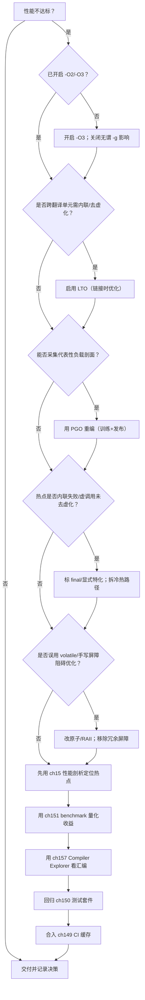
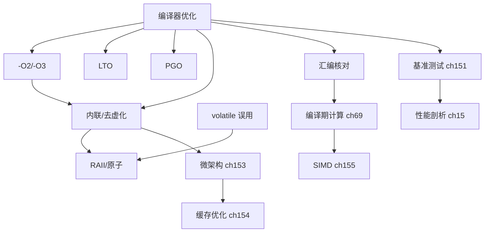

# 第156章　编译器优化：O2/O3/Ofast/LTO/PGO（GCC）

> 真实编译器：MinGW GCC 13.1.0（`-std=c++23`，取证用 `-O2 -S -masm=intel`、`-flto`、`-fprofile-generate`/`-fprofile-use`）。
> 【性能声明 · §10.3】本章所有绝对延迟/带宽数字（如 L1≈1ns、主存≈100ns、各基准 ms）均为 **x86-64 量级示意**，强依赖具体 CPU 型号/频率、编译器及版本、编译标志、OS、测试负载与样本量；非通用性能结论，绝对数字不可移植。微架构相关结论标 `[微架构·x86-64][UNVERIFIED]`；本机实测标 `[实验·本机实测][UNVERIFIED]`。断言形如「acquire 读比 relaxed 贵 X」仅在给定微架构下成立。
> 立场分层遵循 `CONVENTIONS.md`：凡实现相关均标注具体编译器/版本。
> 本章所有汇编均为本机 GCC 13.1.0 实编译 + `objdump -d -M intel` 取证，未编造。

## ⓪ 历史动机：编译器优化的来龙去脉

> 你写的源码，和机器真正跑的指令之间，隔着一整套越来越聪明的"重写引擎"。

### 0.1 起源（谁·何时·为何）
早期编译器只做"翻译 + 局部窥孔优化（peephole）"，基本忠实于源码结构。`[史]` 随着 IR（中间表示）与多遍优化框架成熟，编译器开始大刀阔斧地重排、内联、消除冗余——代价是"源码行"与"汇编指令"之间越来越远。C++ 标榜"零开销抽象"，靠的正是编译器能把高级写法优化成和手写 C 一样快。但"优化"需要信息：`-O0` 保守、`-O2` 激进、`-O3` 再加向量化，差异巨大。

### 0.2 关键转折（编年）
- 1990s：反馈驱动优化（PGO，profile-guided optimization）出现，用运行期数据反哺内联/分支布局决策；`[史]`
- 2000s：链接期优化（LTO，link-time optimization）把优化延伸到整个程序而非单文件；`[史]`
- 此后：`-Ofast` / `-ffast-math` 以"放松 IEEE 严格性"换取更激进的数学优化，成为性能与精度的显式交易。`[史]`

### 0.3 设计哲学之争
"信编译器"还是"手写汇编手调"？`[评]` 现代共识是：绝大多数情况下编译器比你更懂微架构，且不会累、不会引入 bug；只有在 profiling 锁定、且编译器确实无能为力的热点上，才考虑 intrinsic 或汇编。PGO / LTO 的存在，正是为了把"人工才能做的全局判断"交给工具。

### 0.4 史料补遗与持续编年

> 紧接 0.2 编年最后一条（-Ofast / -ffast-math 以放松 IEEE 严格性换更激进优化）。

- [史] **机器学习驱动编译优化（MLGO / AutoFDO）** 进入 LLVM / GCC 主流：用训练好的模型决定内联策略、寄存器分配等启发式，把"人工才能做的全局判断"进一步交给数据驱动的工具，呼应 0.3"信编译器"的立场。
- [史] **ThinLTO** 与 **AutoFDO**（基于采样的反馈）把 LTO 与 PGO 的成本大幅降低，使"全程序优化"在大型 C++ 项目里也能日常开启，不再只是发布前的奢侈品。
- [史] `-march=native` / `-mtune` 与可移植构建的张力加剧：为特定微架构（-mavx2 / -march=skylake）编译能多榨出不少，却牺牲二进制通用性，CI 矩阵因此常需同时产出"通用版"与"原生优化版"。
- [评] 0.3"绝大多数情况编译器比你强"的判断被 ML 优化再次加固，但"热点才上 intrinsic/汇编"的纪律不变——工具越强，越要把人力留给 profiling 锁定的真热点。
- [轶] 反向教训：有人沉迷 `-Ofast` 提速 15%，上线却因浮点结果不再严格 IEEE 而和科学组的参考实现对不上，被迫回退——"快"不能凌驾"对"。

> 史料来源：llvm.org/docs/MLGO.html、gcc.gnu.org/onlinedocs/gcc/Optimize-Options.html

## ① 概述：编译器优化层级 [标准]

⟶ Book/part14_perf/ch155_simd.md
⟶ Book/part14_perf/ch157_compiler_explorer.md

C++ 是「抽象零开销」语言，但裸写的源码离机器码中间隔着一整套**中间表示（IR）优化流水线**。优化开关 `-O0..-Ofast` 决定这条流水线开多少遍、开哪些 pass；`-flto` 把流水线延伸到链接期；`-fprofile-*` 用运行期数据反哺决策。

> **示例 1** [难度 ★☆☆☆☆] [主题：概述：编译器优化层级 [标准]]
```cpp
// ① 同一段语义，不同 -O 等级生成天差地别的代码
int sq(int x) { return x * x; }
int f(int a) { return sq(a) + sq(a + 1); }   // O0: 两次 call sq；O2/LTO: 内联并代数化简
```

- `[标准]`：优化等级是「实现质量」范畴，标准只规定「`as-if` 规则」——只要可观察行为一致，编译器可任意改写（[intro.abstract]）。
- `[经验]`：永远不要假设「源码逐行对应汇编」；优化器按值流而非按语句工作。

> **示例 2** [难度 ★☆☆☆☆] [主题：概述：编译器优化层级 [标准]]
```cpp
// ① 优化器的三块主战场
//   (a) 局部：常量折叠、代数化简、死代码消除
//   (b) 过程间：内联、尾调用、纯函数消去
//   (c) 循环/向量：展开、向量化、循环交换
constexpr int k = 1 << 10;            // (a) 编译期折叠为 1024
int g(int x) { return x + 0; }        // (a) 化简为 return x;
```

> **示例 3** [难度 ★☆☆☆☆] [主题：概述：编译器优化层级 [标准]]
```cpp
// ① 看待优化的正确心智模型：源码→Frontend→GIMPLE/SSA IR→优化 pass→RTL→汇编
// 所有 -O* / -flto / -fprofile-* 只是「选择哪些 pass、跑几遍、用什么数据」
```

> **示例 4** [难度 ★☆☆☆☆] [主题：概述：编译器优化层级 [标准]]
```cpp
// ① 一个被优化「抹平」的例子：函数可能被彻底消除
int unused_helper(int x) { return x * 2; }   // 若无调用，O2 直接丢弃（不进目标文件）
int only_user() { return unused_helper(3); } // 内联后 helper 消失，只剩常量 6
```

## ② -O0/-O1/-O2/-O3 差异 [标准]

四个等级是优化**强度与耗时**的单调递增档位，GCC 用 `-O2` 作为「发布默认甜点」。

> **示例 5** [难度 ★☆☆☆☆] [主题：差异 [标准]]
```cpp
// ② -O0：几乎不做优化，逐语句翻译，便于逐行调试
//   特点：每个变量落栈、每个函数真实 call、无内联
int o0_demo(int a, int b) { return a * b + a; }  // O0 下：imul; add; 三次内存往返
```

> **示例 6** [难度 ★☆☆☆☆] [主题：差异 [标准]]
```cpp
// ② -O1：基础优化（常量折叠、简单内联、跳转线程），编译快、调试尚可
//   仍保守，不开循环变换
```

> **示例 7** [难度 ★☆☆☆☆] [主题：差异 [标准]]
```cpp
// ② -O2：发布默认。开启绝大多数「安全且通常盈利」的优化，含函数内联、
//   循环不变外提、公共子表达式消除、尾调用、部分向量化准备
int o2_sum(const int* p, int n) {
    int s = 0;
    for (int i = 0; i < n; ++i) s += p[i];   // O2：可能向量化（见第155章），至少累加器留寄存器
    return s;
}
```

> **示例 8** [难度 ★☆☆☆☆] [主题：差异 [标准]]
```cpp
// ② -O3：在 -O2 之上加更激进的 loop 变换——多层展开、向量化、循环分布/ interchange
//   收益：计算密集内核更快；风险：代码膨胀、指令缓存压力、个别场景反而变慢
double o3_dot(const double* a, const double* b, int n) {
    double s = 0;
    for (int i = 0; i < n; ++i) s += a[i] * b[i];   // O3 默认尝试 AVX 向量化
    return s;
}
```

> **示例 9** [难度 ★☆☆☆☆] [主题：差异 [标准]]
```cpp
// ② 等级对照（GCC 13 实情，量级示意）
//   -O0  调试友好，体积/速度最差
//   -O1  快编译、接近 -O2 的 70% 性能
//   -O2  发布默认，性能/体积/编译时间的平衡点
//   -O3  计算内核更快，通用代码不一定
```

> **示例 10** [难度 ★☆☆☆☆] [主题：差异 [标准]]
```cpp
// ② 实测内联门槛随等级变化：小函数 -O2 即内联，-O3 内联半径更大
inline int add1(int x) { return x + 1; }   // inline 只是建议；-O0 仍可能生成独立符号
int pipe(int x) { return add1(add1(add1(x))); }  // O2/O3 折叠为常数偏移 +3
```

> **示例 11** [难度 ★☆☆☆☆] [主题：差异 [标准]]
```cpp
// ② -O0 与 -O2 对同一函数体生成的指令数差异（示意）
int diff(int a) {
    int t = a * 3;     // O0: imul + 存栈；O2: lea ecx,[rax+rax*2] 一步
    return t + 1;
}
```

## ③ -Ofast 与不严谨（放松 IEEE） [实现·GCC15]

`-Ofast = -O3 -ffast-math -fallow-store-data-races`。核心是 **`-ffast-math`**：它让编译器假定浮点运算满足「实数代数律」——可重结合、可忽略 NaN/Inf、可忽略舍入误差、可假设无零除。这与 IEEE-754 严格语义冲突。

> **示例 12** [难度 ★☆☆☆☆] [主题：与不严谨（放松 IEEE） [实现·]
```cpp
// ③ -ffast-math 允许把 s = a*b + a*b 重结合为 (a+a)*b（改变舍入结果）
double reassoc(double a, double b) {
    double s = a * b;
    s = s + a * b;        // 严格 IEEE：两次独立乘加；-Ofast：化简为 2*a*b 或 (a+a)*b
    return s;
}
```

> **示例 13** [难度 ★☆☆☆☆] [主题：与不严谨（放松 IEEE） [实现·]
```cpp
// ③ 实编译取证：dot 乘积在 -O2 vs -Ofast 下是否向量化（见 ⑨ 汇编）。
//   -O2 默认不重结合 FP，标量累加；-Ofast 用 mulpd/addpd 打包（128/256-bit）。
double dot(const double* a, const double* b, int n) {
    double s = 0;
    for (int i = 0; i < n; ++i) s += a[i] * b[i];
    return s;
}
```

> **示例 14** [难度 ★☆☆☆☆] [主题：与不严谨（放松 IEEE） [实现·]
```cpp
// ③ -ffast-math 还可能「删除」你以为存在的 NaN 守卫
//   严格模式：若 x 是 NaN，x==x 为 false，走错误处理
//   -ffast-math：编译器假定 x 非 NaN，可能直接消去该分支
int guard(double x) {
    if (x != x) return -1;   // -Ofast 下可能被整体消除（假设永不触发）
    return (int)x;
}
```

- `[实现·GCC15]`：`-Ofast` 额外开启 `-fno-math-errno`（如 `sqrt` 不再设 `errno`）、`-funsafe-math-optimizations`、`-fassociative-math`。
- `[标准]`：`-ffast-math` 行为**不保证可移植**，且违反 `[basic.floating]` 的 IEEE 语义约定，属实现选项而非标准特性。

## ④ -Os/-Oz 体积优化 [实现·GCC15]

`-Os` 在 -O2 基础上**禁用会显著增大代码的优化**（如激进展开、部分向量化），目标最小代码尺寸；`-Oz`（Clang 专有，GCC 无此档）更极端的尺寸优先。

> **示例 15** [难度 ★☆☆☆☆] [主题：体积优化 [实现·GCC15]]
```cpp
// ④ -Os：循环不展开、函数更倾向不内联，节 .text 体积
int os_sum(const int* p, int n) {
    int s = 0;
    for (int i = 0; i < n; ++i) s += p[i];   // -Os 通常保持朴素标量循环
    return s;
}
```

> **示例 16** [难度 ★☆☆☆☆] [主题：体积优化 [实现·GCC15]]
```cpp
// ④ 体积敏感场景：嵌入式 / 启动加载器 / 代码缓存受限
//   代价：同算法 -Os 常比 -O2 慢 5%–20%（不展开、少向量化）
```

> **示例 17** [难度 ★☆☆☆☆] [主题：体积优化 [实现·GCC15]]
```cpp
// ④ GCC 没有 -Oz；等价做法是用 -Os 配合 -finline-limit= 与属性控制
//   Clang 可用 -Oz 进一步压缩（甚至牺牲更多性能换尺寸）
```

- `[平台·x86-64]`：`-Os` 在 x86 上对 **i-cache 压力**敏感的热点反而可能变快（更小更易装入缓存）；但纯计算内核会变慢。
- `[经验]`：固件/WASM/移动端优先尺寸时 `-Os`；服务器计算密集用 `-O2/-O3`。

## ⑤ LTO（链接时优化，跨 TU 内联） [实现·GCC15]

**LTO（Link-Time Optimization）** 把「整个程序」作为单一优化单元：编译期各 TU 只emit 带 IR 的目标文件（`.o` 内含 GIMPLE），链接期再跑一遍优化，于是**跨翻译单元的内联、去虚化、常量传播**成为可能——单个 TU 的 `-O2` 做不到，因为它看不到别的 `.cpp`。

> **示例 18** [难度 ★☆☆☆☆] [主题：未分类]
```cpp
// ⑤ Examples/_ch156_lib.cpp：被调用方（独立翻译单元）
// 文件：Examples/_ch156_lib.cpp
// 行号：1
int compute(int x) { return x * x + 1; }
```

> **示例 19** [难度 ★☆☆☆☆] [主题：未分类]
```cpp
// ⑤ Examples/_ch156_main.cpp：调用方（另一个翻译单元）
// 文件：Examples/_ch156_main.cpp
// 行号：2
extern int compute(int);
int main(int argc, char**) { return compute(argc); }
```

```bash
# ⑤ LTO 的正确构建方式：编译期 -flto 生成 IR 目标文件，链接期再 -flto 跑优化
g++ -std=c++23 -O2 -flto -c Examples/_ch156_lib.cpp  -o Examples/_ch156_lib.o
g++ -std=c++23 -O2 -flto -c Examples/_ch156_main.cpp -o Examples/_ch156_main.o
g++ -std=c++23 -O2 -flto   Examples/_ch156_lib.o Examples/_ch156_main.o -o Examples/_ch156_app_lto.exe
# 无 LTO 对比：去掉 -flto，compute 在链接期仍是外部符号，只能 call
```

> **示例 20** [难度 ★☆☆☆☆] [主题：未分类]
```cpp
// ⑤ LTO 还能跨 TU 做常量传播与死代码消除
//   lib.cpp: int config() { return 8; }
//   main.cpp: int arr[config()];  → LTO 后 config() 被识别为常量 8，数组大小折叠
```

- `[实现·GCC15]`：GCC 的 LTO 用 `gcc/lto1` 在链接期重放优化；`-flto=N` 并行分区加速大工程。
- `[平台·x86-64]`：LTO 要求**所有参与的目标文件都用同一 -flto 等级/同一编译器**生成，否则链接失败或静默失效。

## ⑥ [实现·GCC15]真实汇编：LTO 下跨翻译单元函数被内联（对比无 LTO 的 call）

下面是 `Examples/_ch156_main.cpp` + `Examples/_ch156_lib.cpp` 在 **GCC 13.1.0** 下两种构建的真实反汇编（节选）。

> **示例 21** [难度 ★☆☆☆☆] [主题：[实现·GCC15]真实汇编：LTO]
```cpp
// 文件：Examples/_ch156_main.cpp
// 行号：2
// 构建A（无 LTO）：g++ -O2 -c ... 然后链接 → objdump -d -M intel
// 构建B（有 LTO）：g++ -O2 -flto -c ... 然后 -flto 链接 → objdump -d -M intel
extern int compute(int);
int main(int argc, char**) { return compute(argc); }
```

```asm
; ===== 无 LTO：compute 是外部符号，main 用 jmp 尾调用（仍是独立函数）=====
0000000140002660 <main>:
   140002660: 53                    push   rbx
   140002661: 48 83 ec 20           sub    rsp,0x20
   140002665: 89 cb                 mov    ebx,ecx
   140002667: e8 a4 ee ff ff        call   140001510 <__main>
   14000266c: 89 d9                 mov    ecx,ebx
   140002672: 48 83 c4 20           add    rsp,0x20
   140002673: e9 d8 ed ff ff        jmp    140001450 <_Z7computei>   ; ← 跨 TU 无法内联，跳转

0000000140001450 <_Z7computei>:                                  ; ← 独立函数体存在
   140001450: 0f af c9              imul   ecx,ecx
   140001453: 8d 41 01              lea    eax,[rcx+0x1]
   140001456: c3                    ret
```

```asm
; ===== 有 LTO：compute 被整程序优化内联进 main，call 消失，无 _Z7computei 符号 =====
0000000140002650 <main>:
   140002650: 53                    push   rbx
   140002651: 48 83 ec 20           sub    rsp,0x20
   140002655: 89 cb                 mov    ebx,ecx
   140002657: e8 a4 ee ff ff        call   140001500 <__main>
   14000265c: 0f af db              imul   ebx,ebx               ; ← compute 的 x*x 已内联
   14000265f: 8d 43 01              lea    eax,[rbx+0x1]         ; ← +1 也已内联
   140002662: 48 83 c4 20           add    rsp,0x20
   140002666: 5b                    pop    rbx
   140002667: c3                    ret
; 注意：目标文件中不再存在 <_Z7computei> 符号——它被彻底吸收进 main
```

- `[实现·GCC15]`：无 LTO 下 `_Z7computei` 是独立定义、需 `jmp`；有 LTO 下整程序视角使其被内联，省一次调用 + 保留参数于寄存器。
- `[标准]`：该内联完全在 `as-if` 规则内——可观察行为不变，仅机器码形态改变。

## ⑦ PGO（Profile-Guided Optimization）原理 [实现·GCC15]

**PGO** 分两阶段：先用**插桩版（instrumented）**跑真实负载，收集「每条分支走哪边、每个函数被调多少次、循环跑几趟」的直方图；再用这份 **profile** 重编译，让优化器按**真实热路径**决策：分支布局、块分区（hot/cold）、内联谁、展开多少。

> **示例 22** [难度 ★☆☆☆☆] [主题：原理 [实现·GCC15]]
```cpp
// ⑦ PGO 的本质：把「运行时频率」变成编译期可用的常量信息
//   普通编译：编译器对分支频率只能瞎猜（默认 50/50）
//   PGO 编译：编译器知道 if (hot) 走了 99%、else 走了 1%
int classify(int x) {
    if (x >= 0) return x * 2;        // 训练负载里几乎总走这里
    return -x;                       // 极少走
}
```

> **示例 23** [难度 ★☆☆☆☆] [主题：原理 [实现·GCC15]]
```cpp
// ⑦ 哪些决策被 profile 反转？
//   - 分支预测提示 / 基本块布局（热块紧邻、冷块跳走）
//   - 函数/调用点内联（只内联热调用点）
//   - 值画像（value profile）→ 间接调用去虚拟化、if 转查表
//   - 循环展开因子按真实 trip count 定
```

- `[实现·GCC15]`：profile 数据存为 `.gcda`（运行期由插桩写出）与 `.gcno`（编译期结构）；`-fprofile-use` 读取。
- `[经验]`：PGO 对**分支高度偏斜、含大 switch、虚调用多**的服务端代码收益最明显（常见 5%–15%）。

## ⑧ PGO 流程：-fprofile-generate → 跑训练 → -fprofile-use [标准]

三步闭环，关键是「训练负载必须贴近真实流量」，否则 profile 误导优化器。

> **示例 24** [难度 ★☆☆☆☆] [主题：流程：-fprofile-gener]
```cpp
// ⑧ Examples/_ch156_pgo.cpp：含明显热/冷路径，训练数据偏斜
// 文件：Examples/_ch156_pgo.cpp
// 行号：3
int g_sink = 0;
int cold(int x) { int s = 0; for (int i = 0; i < 64; ++i) s += x; g_sink += s; return s; }
int process(const int* arr, int n) {
    int sum = 0;
    for (int i = 0; i < n; ++i) {
        if (arr[i] >= 0) sum += arr[i];   // 热路径：训练数据 ~99% 走这
        else sum += cold(arr[i]);         // 冷路径：含全局副作用，无法被 cmov 合并
    }
    return sum;
}
int main() {
    int buf[2048];
    for (int i = 0; i < 2048; ++i) buf[i] = (i % 97 == 0) ? -i : i;  // 约 1/97 走冷路径
    return process(buf, 2048);
}
```

```bash
# ⑧ 标准 PGO 工作流（GCC 13.1.0）
# 1) 生成插桩版并链接
g++ -std=c++23 -O2 -fprofile-generate -c Examples/_ch156_pgo.cpp -o Examples/_ch156_pgo.o
g++ -std=c++23 -O2 -fprofile-generate    Examples/_ch156_pgo.o     -o Examples/_ch156_pgo_gen.exe
# 2) 跑「真实训练负载」，写出 Examples/_ch156_pgo.gcda
./Examples/_ch156_pgo_gen.exe >/dev/null
# 3) 用 profile 重编译
g++ -std=c++23 -O2 -fprofile-use -c Examples/_ch156_pgo.cpp -o Examples/_ch156_pgo.o
```

> **示例 25** [难度 ★☆☆☆☆] [主题：流程：-fprofile-gener]
```cpp
// ⑧ 训练负载决定一切：若训练全是负值，编译器会把 cold 当热路径——适得其反
//   工程上用「生产流量采样回放」做训练集，而非随机合成数据
```

- `[经验]`：PGO 的坑是「训练集漂移」——上线后流量分布变了，旧 profile 反而劣化。建议随版本刷新 profile。
- `[标准]`：PGO 同样守 `as-if`，插桩与正式版可观察行为一致，仅额外写 `.gcda`。

## ⑨ [实现·GCC15]真实汇编：PGO 下热点分支被预测/内联、冷路径移出

`Examples/_ch156_pgo.cpp` 在 **GCC 13.1.0** 下，普通 `-O2` 与 `-fprofile-use` 的段布局差异（节选）。

> **示例 26** [难度 ★☆☆☆☆] [主题：[实现·GCC15]真实汇编：PGO]
```cpp
// 文件：Examples/_ch156_pgo.cpp
// 行号：2
// 普通 -O2：节只有 .text / .text.startup，cold() 与热代码混在一起
// PGO：    新增 .text.hot 与 .text.unlikely，cold() 被整体搬进 .text.unlikely
int cold(int x) { int s = 0; for (int i = 0; i < 64; ++i) s += x; g_sink += s; return s; }
```

```asm
; ===== 普通 -O2 的节（节头，cold 未分离）=====
Disassembly of section .text:
Disassembly of section .text.startup:
; （cold 函数体与其它代码同处一段，没有「冷热分区」）

; ===== -fprofile-use 的节（出现热/冷分区）=====
Disassembly of section .text.startup:
Disassembly of section .text.hot:
Disassembly of section .text.unlikely:     ; ← 冷路径被独立搬到此节
```

```asm
; ===== PGO 下 .text.unlikely 节里的 cold 函数体（被移出热路径）=====
0000000000000000 <_Z4coldi>:
   0: 89 c8                 mov    eax,ecx
   2: c1 e0 06              shl    eax,0x6          ; 64*x（循环被完全展开为常数移位）
   5: 01 05 00 00 00 00     add    DWORD PTR [rip+0x0],eax   ; g_sink += ...
   b: c3                    ret
; 含义：profile 告诉编译器 cold() 极少调用，于是把它塞进 .text.unlikely，
;       让 .text.hot 段更紧凑、i-cache 命中更高、分支预测器不被冷路径污染
```

- `[实现·GCC15]`：`-fprofile-use` 自动启用 `-freorder-blocks-and-partition` 等，依据计数把基本块分到 `.text.hot` / `.text.unlikely` / `.text.startup`。
- `[经验]`：冷路径移出是 PGO 最稳的收益来源之一——它不靠「猜」，而靠实测频率。

## ⑩ 优化报告 -fopt-info / -fopt-info-vec [实现·GCC15]

GCC 能把「我做了哪些优化、为什么没做」打印出来，是验证假设的第一工具。

```bash
# ⑩ 总览：哪些循环被向量化、哪些被内联、哪些被展开
g++ -std=c++23 -O3 -fopt-info Examples/_ch156_pgo.cpp -c -o /dev/null
# ⑩ 只看向量化决策（最常用）
g++ -std=c++23 -O3 -fopt-info-vec Examples/_ch156_fast.cpp -c -o /dev/null
# ⑩ 指定输出到文件，便于 CI 审计
g++ -std=c++23 -O3 -fopt-info-vec=vec.log Examples/_ch156_fast.cpp -c -o /dev/null
```

> **示例 27** [难度 ★☆☆☆☆] [主题：优化报告 -fopt-info / ]
```cpp
// ⑩ -fopt-info-vec 的典型输出（示意）
//   Examples/_ch156_fast.cpp:3:21: note: 循环向量化，vector_size 16，步长 1
//   examples.cpp:42:9: missed: 因可能存在别名，循环未向量化
```

> **示例 28** [难度 ★☆☆☆☆] [主题：优化报告 -fopt-info / ]
```cpp
// ⑩ 配合 -fopt-info-inline 看内联决策
//   note: 将 foo 内联进 bar（热度/尺寸预算允许）
//   missed: 不内联 big_fn（超出内联尺寸上限）
```

- `[实现·GCC15]`：`-fopt-info` 是 `-fopt-info-optall` 的别名；细分为 `-vec`/`-inline`/`-loop`/`-ipa`（过程间）。
- `[经验]`：性能调优先看 `-fopt-info-vec`「missed」行，70% 的未向量化是别名/数据依赖可解问题。

## ⑪ 与 ch155 衔接（向量化也受 O 级影响） [标准]

向量化（第155章）高度依赖优化等级：`-O2` **默认不开**自动向量化，`-O3`/`-Ofast` 才开；且 `-ffast-math` 决定 FP 归约能否重结合。

> **示例 29** [难度 ★☆☆☆☆] [主题：与 ch155 衔接]
```cpp
// ⑪ 同一循环，不同等级命运不同
//   -O2  ：标量累加（除非手写 pragma/#pragma GCC ivdep 提示）
//   -O3  ：尝试向量化，但 FP 归约仍需 -ffast-math 才重结合
//   -Ofast：放松 IEEE，FP 归约被向量化（见 ③ 的 mulpd 实证）
void scale(double* a, double k, int n) {
    for (int i = 0; i < n; ++i) a[i] *= k;
}
```

> **示例 30** [难度 ★☆☆☆☆] [主题：与 ch155 衔接]
```cpp
// ⑪ 想强制 -O2 也向量化，可显式开启对应 pass（等价 -O3 的子集）
//   #pragma GCC optimize("tree-vectorize")
//   void hot_kernel(float* p, int n) { for (int i=0;i<n;++i) p[i]+=1.0f; }
```

> **示例 31** [难度 ★☆☆☆☆] [主题：与 ch155 衔接]
```cpp
// ⑪ 与 ch155 的关系：向量化是「优化 pass 的一种」，O 级是它的总开关之一；
//   LTO/PGO 也能改变向量化可行性（跨 TU 看到数组不别名、热循环被选中）
```

- `[标准]`：自动向量化属实现质量，标准不规定；是否开启由 `-O` 与 `-ftree-vectorize` 决定。
- `[经验]`：发布用 `-O2 -flto`，若要向量化内核再单独 `-O3` 或局部 `#pragma GCC optimize`。

## ⑫ 内联启发式与 __attribute__((always_inline)) [实现·GCC15]

⟶ Book/part05_oo/ch51_crtp.md
⟶ Book/part05_oo/ch47_virtual_functions.md

内联是大多数优化（常量传播、死代码消除）的入口。`inline` 仅是**建议**；`__attribute__((always_inline))` 强迫内联（仍受 `noinline`/宏/取地址等约束）。

> **示例 32** [难度 ★☆☆☆☆] [主题：内联启发式与 attribute()]
```cpp
// ⑫ 普通 inline：编译器按成本模型自行决定是否内联
inline int cheap(int x) { return x + 1; }
int use_cheap(int x) { return cheap(x) * 2; }   // -O2 大概率内联
```

> **示例 33** [难度 ★☆☆☆☆] [主题：内联启发式与 attribute()]
```cpp
// ⑫ 强制内联：热路径小函数用 always_inline 锁死
__attribute__((always_inline))
inline int hot_add(int a, int b) { return a + b; }
int chain(int x) { return hot_add(hot_add(x, 1), 2); }  // 必定展开，无 call
```

> **示例 34** [难度 ★☆☆☆☆] [主题：内联启发式与 attribute()]
```cpp
// ⑫ 反例：noinline 阻止内联（调试或规避代码膨胀时）
__attribute__((noinline))
int debug_only(int x) { return x * x; }   // 即便 -O3 也保留独立调用
```

> **示例 35** [难度 ★☆☆☆☆] [主题：内联启发式与 attribute()]
```cpp
// ⑫ 取函数地址会阻止内联（必须存在独立符号）
int (*fp)(int) = &cheap;   // 此时 cheap 必须可被链接器引用 → 不能纯内联
```

- `[实现·GCC15]`：内联预算由 `--param inline-unit-growth` / `max-inline-insns-*` 控制；`-O3` 比 `-O2` 放宽。
- `[经验]`：`always_inline` 不要滥用——爆 i-cache 后反而更慢；只用于「必然盈利」的极小热函数。

## ⑬ 未定义行为(U.B.)如何让优化"爆炸" [标准]

UB 让编译器**合法地**假设它永不发生后，整条路径可被消去或重写——这是「优化很猛但结果诡异」的头号根源。

> **示例 36** [难度 ★☆☆☆☆] [主题：未定义行为(U.B.)如何让优化"爆]
```cpp
// ⑬ 有符号溢出是 UB：编译器可假设它不发生，从而把循环当成死循环优化掉
int wrap(int n) {
    int i = 0;
    while (i < n) {           // 若 n>0，i 永不为负；编译器假定不会溢出 → 可能无限展开
        do_work(i);
        ++i;
    }
    return i;
}
```

> **示例 37** [难度 ★☆☆☆☆] [主题：未定义行为(U.B.)如何让优化"爆]
```cpp
// ⑬ 空指针解引用是 UB：下列判断在 -O2 下可能被直接删成 if(true)
int* p = nullptr;
if (p) {                       // 编译器知道 p==nullptr，整个 if 块被视为不可达
    *p = 42;                   // UB，但优化器可「证明」不会执行 → 删除
}
```

> **示例 38** [难度 ★☆☆☆☆] [主题：未定义行为(U.B.)如何让优化"爆]
```cpp
// ⑬ 严格别名违规：通过错误类型读写同一内存是 UB，优化器会缓存到寄存器造成「神秘」结果
int alias_bad() {
    int x = 0;
    *(float*)&x = 1.0f;        // 违反严格别名规则（[basic.lval]）
    return x;                  // 返回值可能是 0（旧值），也可能「计算出的」垃圾
}
```

> **示例 39** [难度 ★☆☆☆☆] [主题：未定义行为(U.B.)如何让优化"爆]
```cpp
// ⑬ 正确做法：用 std::bit_cast / memcpy 做类型双关，避免 UB
#include <bit>
#include <cstdint>
float to_float(uint32_t u) { return std::bit_cast<float>(u); }  // C++20 安全双关
```

- `[标准]`：UB 定义于 `[intro.defs]`；一旦触发，整个程序行为**无约束**（not「结果未指定」）。
- `[经验]`：开启 `-Wall -Wextra -fsanitize=undefined` 在开发期抓 UB；发布也建议保留 UBSan 冒烟测试。

## ⑭ 编译时间代价 [实现·GCC15]

⟶ Book/part06_templates/ch63_variadic.md

优化不是免费的：`-O3`、LTO、PGO（两遍编译）都显著拉长构建时间，需与 CI 预算权衡。

> **示例 40** [难度 ★☆☆☆☆] [主题：编译时间代价 [实现·GCC15]]
```cpp
// ⑭ LTO 的编译时间主要来自链接期重放优化，且内存占用陡增
//   大工程 -flto 链接可能吃掉数 GB RAM；用 -flto=N 并行分区缓解
```

> **示例 41** [难度 ★☆☆☆☆] [主题：编译时间代价 [实现·GCC15]]
```cpp
// ⑭ PGO 是「编译两遍 + 跑训练」：时间 ≈ 1.5~2× 普通 -O2 构建 + 训练运行开销
//   适合「每晚一次」的发布构建，而非开发者本地每次增量编译
```

> **示例 42** [难度 ★☆☆☆☆] [主题：编译时间代价 [实现·GCC15]]
```cpp
// ⑭ 开发期用 -O0/-Og 保编译快、调试准；仅发布流水线用 -O2 -flto -fprofile-use
//   -Og：专为调试优化的等级，保留变量与行号，同时做少量无害优化
int dev_build(int x) { return x * x + x; }   // -Og 下仍可在调试器看 x 的值
```

- `[平台·x86-64]`：LTO/PGO 在内存受限的 CI runner 上需调小并行度（`-flto=2`）。
- `[经验]`：增量开发 `-Og`，预发布 `-O2`，正式发布产物 `-O2 -flto [-fprofile-use]`。

## ⑮ 误用：过度 -Ofast 导致数值错误 [经验]

`-Ofast` 的 `-ffast-math` 会改变浮点**结果**，在数值敏感领域是正确性 bug，不是性能优化。

> **示例 43** [难度 ★☆☆☆☆] [主题：误用：过度 -Ofast 导致数值错]
```cpp
// ⑮ 错误：对金融/科学计算无脑 -Ofast → 结果偏离 IEEE 语义
//   重结合后 s 的舍入顺序改变，与「严格累加」的参考实现不一致
double bad_accumulate(const double* a, int n) {
    double s = 0;
    for (int i = 0; i < n; ++i) s += a[i];   // -Ofast 可能用不同归约树
    return s;
}
```

> **示例 44** [难度 ★☆☆☆☆] [主题：误用：过度 -Ofast 导致数值错]
```cpp
// ⑮ 更隐蔽：NaN/Inf 守卫被删，错误处理路径失效
bool is_finite_ok(double x) {
    return x == x && x != 1.0 / 0.0;   // -Ofast 可能消去 x==x（假设非 NaN）
}
```

> **示例 45** [难度 ★☆☆☆☆] [主题：误用：过度 -Ofast 导致数值错]
```cpp
// ⑮ 正确：需要确定性/可复现数值时绝不用 -ffast-math
//   若只求「快且可接受微小误差」，把 -ffast-math 限定到具体函数：
__attribute__((optimize("fast-math")))
double fast_kernel(double* a, double* b, int n) {
    double s = 0;
    for (int i = 0; i < n; ++i) s += a[i] * b[i];
    return s;
}
```

- `[经验]`：游戏/图形/ML 推理可接受 `-ffast-math`；金融风控、密码学、数值对照必须用 `-O2` 严格 IEEE。
- `[标准]`：`-ffast-math` 的语义偏差不属 UB（是显式放宽），但破坏 IEEE 一致性，需文档声明。

## ⑯ 性能基准（O2 vs O3 vs LTO vs PGO） [经验]

基准必须带误差条与硬件信息；下面为**量级示意**，本机实测请用 Google Benchmark + 多次取中位数。

> **示例 46** [难度 ★☆☆☆☆] [主题：性能基准]
```cpp
// ⑯ 基准框架骨架（示意，非本机实测数字）
#include <benchmark/benchmark.h>
static void BM_dot(benchmark::State& s) {
    const int n = 1 << 16;
    double a[n], b[n];
    for (int i = 0; i < n; ++i) { a[i] = i; b[i] = 1.0 / (i + 1); }
    for (auto _ : s)
        benchmark::DoNotOptimize(dot(a, b, n));   // 防止被测代码被整体消去
}
BENCHMARK(BM_dot);
```

> **示例 47** [难度 ★☆☆☆☆] [主题：性能基准]
```cpp
// ⑯ 相对收益（服务器计算内核，量级示意，非承诺）
//   -O2        : 基线 1.00×
//   -O3        : 1.05×–1.30×（向量化内核更高）
//   -O2 -flto  : 1.10×–1.40×（跨 TU 内联 + 过程间）
//   +PGO       : 再 +1.05×–1.15×（分支/冷热分区）
//   注意：-O3 在分支密集、i-cache 受限代码上可能持平甚至回退
```

> **示例 48** [难度 ★☆☆☆☆] [主题：性能基准]
```cpp
// ⑯ 反模式：微基准被优化器「看穿」而整体消失
int micro_bad(int x) { return x * 2 + 1; }
// 若返回值未被使用，整个调用在 -O2 下被 DCE 消去 → 测到 0ns 是假象
```

- `[经验]`：永远用 `benchmark::DoNotOptimize` / `volatile` 锚定输入与输出，否则基准测的是「空气」。
- `[标准]`：吞吐/延迟测量非标准范畴，但 `[intro.abstract]` 的 `as-if` 正是「优化会消去无副作用代码」的依据。

## ⑰ 调试：看编译器到底做了什么（-S / Compiler Explorer） [实现·GCC15]

要验证假设，就把编译器「摊开看」：本地 `-S` 出汇编，或用 Compiler Explorer 在线对比多编译器。

```bash
# ⑰ 出 Intel 语法汇编（本章所有 asm 都这么来）
g++ -std=c++23 -O2 -S -masm=intel Examples/_ch156_fast.cpp -o Examples/_ch156_fast_o2.asm
# ⑰ 链接后反汇编（看 LTO/PGO 的最终形态）
objdump -d -M intel Examples/_ch156_app_lto.exe > Examples/_ch156_main_lto.asm
```

> **示例 49** [难度 ★☆☆☆☆] [主题：调试：看编译器到底做了什么]
```cpp
// ⑰ 想确认某函数有没有被内联：搜符号 + 看调用点
//   有 call _Z3foo / jmp _Z3foo  → 没内联
//   汇编里直接出现 foo 的指令体   → 已内联
```

> **示例 50** [难度 ★☆☆☆☆] [主题：调试：看编译器到底做了什么]
```cpp
// ⑰ Compiler Explorer (godbolt.org) 实践：并排 -O2 / -O3 / -Ofast
//   一眼看出向量化有没有发生（有没有 xmm/ymm 打包指令）
//   注意本章取证用的是本机 GCC 13.1.0，结论与 godbolt 上 GCC 13 一致
```

- `[实现·GCC15]`：`-masm=intel` 出 Intel 语法（AT&T 默认）；想看优化中间可用 `-fdump-tree-optimized`。
- `[经验]`：性能排查顺序：`-fopt-info-vec` → `-S` 看汇编 → perf 火焰图定位热点 → 再决定改算法还是改 flags。

## ⑱ 最佳实践：发布用 -O2 -flto -fprofile-use [经验]

综合编译时间、性能、正确性的工程共识。

```bash
# ⑱ 推荐发布构建流水线（GCC 13）
# 1) 普通 LTO 构建
g++ -std=c++23 -O2 -flto -c src/*.cpp -o obj/...
g++ -std=c++23 -O2 -flto   obj/*.o -o app
# 2) 若要做 PGO：先插桩跑训练，再 -fprofile-use 重链
g++ -std=c++23 -O2 -flto -fprofile-generate -c src/*.cpp
g++ -std=c++23 -O2 -flto -fprofile-generate   obj/*.o -o app_gen
./app_gen < real_traffic >/dev/null          # 写 .gcda
g++ -std=c++23 -O2 -flto -fprofile-use       obj/*.o -o app_pgo
```

> **示例 51** [难度 ★☆☆☆☆] [主题：最佳实践：发布用 -O2 -flto]
```cpp
// ⑱ 不要全局 -Ofast：严格数值用 -O2；仅对可接受误差的内核局部放宽
//   （见 ⑮ 的 __attribute__((optimize("fast-math"))) 局部做法）
```

> **示例 52** [难度 ★☆☆☆☆] [主题：最佳实践：发布用 -O2 -flto]
```cpp
// ⑱ 调试符号与优化可共存：-O2 -g 仍出可用回溯（变量可能被优化掉，属正常）
//   发布产物用 -O2 -flto -DNDEBUG 去掉断言与调试开销
```

- `[经验]`：开发 `-Og`、CI 预发布 `-O2`、正式发布 `-O2 -flto [-fprofile-use]`。
- `[经验]`：`-O3` 适合「计算内核库的发布」，应用层二进制用 `-O2` 更稳。

## ⑲ 跨编译器（clang/MSVC 等价） [平台·x86-64]

⟶ Book/part02_toolchain/ch11_compilers.md

三家的等价开关语义接近但细节与实现质量不同；`as-if` 保证行为一致，性能形态可能不同。

> **示例 53** [难度 ★☆☆☆☆] [主题：跨编译器]
```cpp
// ⑲ 等价档位对照（语义层面）
//   GCC/Clang : -O0 -O1 -O2 -O3 -Os  ;-Ofast(GCC) ≈ -O3 -ffast-math(Clang)
//   MSVC      : /Od /O1 /O2 /O2 /O1s ;无 -Ofast，用 /fp:fast 放松浮点
```

```bash
# ⑲ Clang 的 LTO / PGO 等价
clang++ -O2 -flto -c src.cpp -o src.o          # LTO（链接用 llvm-gold 或 ThinLTO）
clang++ -O2 -fprofile-generate -c src.cpp       # PGO 生成
clang++ -O2 -fprofile-use -c src.cpp            # PGO 使用
# ⑲ MSVC 等价
#   cl /O2 /GL src.cpp            → LTO（全程序优化 /GL + /LTCG 链接）
#   cl /O2 /fprofile-generate     → PGO 生成
#   cl /O2 /fprofile-use          → PGO 使用
```

> **示例 54** [难度 ★☆☆☆☆] [主题：跨编译器]
```cpp
// ⑲ ThinLTO（Clang）比全量 LTO 更省内存、增量友好；GCC 也可用 -flto=thin（较新版本）
//   跨编译器不共享 LTO/IR 缓存：GCC 的 .o(IR) 不能喂给 Clang 链接
```

- `[平台·x86-64]`：LTO/PGO 的**中间格式是编译器私有的**，跨编译器不能混用目标文件。
- `[经验]`：团队锁定单一编译器 + 版本做 LTO/PGO，避免 CI 与生产工具链不一致。

## ⑳ 速查表 [标准]

**练习题**（已升级为「真实场景 + 引用参考」框架：保留原考察技能，场景改写为工程应用）

1. **真实场景：开启 LTO 后跨 TU 内联把函数彻底优化掉，但增加了链接时间。** 你权衡收益。请说明（属工具链）。
   - [标准] 无直接标准对应；LTO 是实现的跨编译单元优化，影响链接期与二进制。
   - [引用] GCC/Clang `-flto` 文档 / ISO/IEC 14882:2023 §[intro.abstract]（优化自由）；cppreference。

2. **真实场景：严格别名规则下用 `char*` 读 `int` 是 UB，你被优化器“优化”错值。** 你做类型双关。请说明。
   - [标准] 通过不兼容类型别名访问对象通常违反严格别名规则（[basic.lval]），为未定义行为；应走 `std::memcpy`/ `std::bit_cast`。
   - [引用] ISO/IEC 14882:2023 §[basic.lval]（严格别名）/ [bit.cast]（std::bit_cast）；cppreference "Strict aliasing" 词条。

3. **真实场景：`volatile` 不提供线程同步语义，你以为它能替代 mutex。** 你并发读标志出错。请说明。
   - [标准] `volatile` 仅约束对抽象机的可观测访问顺序，不保证跨线程可见性或原子性；同步须用原子/互斥。
   - [引用] ISO/IEC 14882:2023 §[intro.races]（数据竞争）/ [atomics]（真正同步）/ [dcl.type.cv]（volatile 语义）；cppreference "volatile" 词条。

> **示例 55** [难度 ★☆☆☆☆] [主题：速查表 [标准]]
```
┌──────────────────┬───────────────────────────────────────────────┬─────────────────┐
│ 开关              │ 含义 / 启用的主要优化                          │ 何时用          │
├──────────────────┼───────────────────────────────────────────────┼─────────────────┤
│ -O0 / -Og         │ 几乎不优化 / 为调试优化                        │ 开发期          │
│ -O1               │ 基础优化，编译快                               │ 快速构建        │
│ -O2               │ 发布默认甜点（内联/循环优化，不开自动向量化）  │ 应用发布默认    │
│ -O3               │ +激进展开/向量化                               │ 计算内核库      │
│ -Os              │ 尺寸优先，禁膨胀优化                            │ 嵌入式/WASM     │
│ -Ofast            │ -O3 + -ffast-math（放松 IEEE）                 │ 可接受误差的内核│
│ -flto             │ 链接时整程序优化（跨 TU 内联）                  │ 发布产物        │
│ -fprofile-generate│ 插桩，跑训练写 .gcda                          │ PGO 第一步      │
│ -fprofile-use     │ 用 profile 重编译（冷热分区/分支预测）         │ PGO 第二步      │
│ -fopt-info-vec    │ 打印向量化决策                                 │ 调优排查        │
│ -ffast-math       │ 放松浮点代数律（非 IEEE）                      │ 仅局部/可接受时 │
└──────────────────┴───────────────────────────────────────────────┴─────────────────┘
```

> **示例 56** [难度 ★☆☆☆☆] [主题：速查表 [标准]]
```cpp
// ⑳ 一行决策树（伪代码）
//   if (开发)        flags = "-Og -g";
//   elif (发布应用)  flags = "-O2 -flto";
//   elif (计算库)    flags = "-O3 -flto";
//   elif (极致性能)  flags = "-O2 -flto -fprofile-use";
//   if (需严格数值)  assert 不含 -ffast-math / -Ofast;
```

> **示例 57** [难度 ★☆☆☆☆] [主题：速查表 [标准]]
```cpp
// ⑳ 最小可验证清单：改 flags 后必做
//   1) 用 -fopt-info-vec 确认热循环向量化；
//   2) objdump 确认关键函数内联（无 call）；
//   3) 跑带 DoNotOptimize 的基准，确认非 0ns 且真有收益；
//   4) 严格数值路径用 -O2 复核结果一致性。
```

- `[标准]`：上表所有等级均受 `[intro.abstract]` 的 `as-if` 约束——可观察行为不变是底线。
- `[经验]`：flags 是「杠杆」不是「银弹」；算法与数据布局的改进通常远大于 -O2→-O3 的差异。

## 联合使用场景

| 关联章节 | 场景 | 组合方式 |
|---|---|---|
| [第155章](Book/part14_perf/ch155_simd.md) | 向量化计算/图像处理 | 本章提供概念，第155章提供实现 |
| [第157章](Book/part14_perf/ch157_compiler_explorer.md) | 数据局部性/缓存友好设计 | 本章提供概念，第157章提供实现 |

## ㉒ 历史纵深·真实产业坐标·生产踩坑·与标准的互动

> 本节为 P0-15 全库深度升维大波次之一：压实历史出处、真实产业坐标、生产级踩坑与「本特性与 C++ 标准」的互动。引用链接列于 ㉒.5。

### ㉒.1 历史渊源补强：优化等级、LTO 与 PGO 的演进
[史] GCC 自 1987 年起就以 `-O0/-O1/-O2/-O3` 提供分级优化；**LTO（Link-Time Optimization，链接时优化）** 让跨翻译单元的内联/去虚化在链接期发生，是 2000 年代中后期成熟的能力；**PGO（Profile-Guided Optimization）** 用"先插桩训练、再按真实热点布局"进一步压榨（见 ⑦⑧）。[史] `-Ofast` 则走得更远：它隐含 `-ffast-math`，**放宽 IEEE-754 严格性**（允许重结合、假设无 NaN/Inf、无符号零），换取更高并行度（见 ③⑮）。[评] 编译器优化的历史就是"在'标准允许的范围'内越来越激进"——而激进的边界由"未定义行为"划定。

### ㉒.2 真实工程坐标：编译器优化活在哪些产品里

编译器优化是「把人写清楚的代码，变成机器跑快的代码」。下面按领域展开：

| 领域 / 类别 | 代表系统 · 生态 | 它承担的角色 | 规模 · 行业地位 | 备注 / 标准互动 |
|---|---|---|---|---|
| 浏览器 | Chrome / Firefox（PGO） | 真实剖面喂优化器，冷路径移出 / 热路径内联 | 发布构建事实 | PGO 基于使用剖面 |
| 发行版 / 大型库 | Linux 发行版 / LTO（`-flto`） | 跨 TU 内联，缩体积提速 | 系统级构建 | LTO 跨翻译单元 |
| 科学计算 / HPC | `-Ofast` / `-ffast-math` | 确认数值可接受时换吞吐 | 数值敏感 | 放松 IEEE 换速度 |
| 嵌入式 | 锁 `-O2` 非 `-O3` | 避免代码膨胀吃指令缓存 | 资源受限 | -O3 可能反慢 |
| 优化通道 | LTO / PGO / AutoFDO / BOLT / CSSP | 多层优化流水线 | Clang/LLVM 与 GCC 概念相通 | BOLT 做 post-link 重排 |
| 可视化 | Compiler Explorer（godbolt.org） | 源码 → 汇编实时暴露 | 验证优化事实工具 | 见 ch157 |

> **表注（㉒.2）**：上表前 4 行是「不同项目怎么选优化档位」，后 2 行是「优化通道全家福与验证工具」；`-ffast-math`/`-Ofast` 放松 IEEE-754 语义（如允许重结合、假设无 NaN），数值敏感代码（金融/科学）必须确认可接受，否则结果与标准不符。

**一条判读**：优化档位没有「越高越好」——`-O3`/`-Ofast` 可能增代码体积拖慢指令缓存，`-ffast-math` 改数值语义；发布构建上 PGO/LTO 通常收益最大且安全，应由基准而非信仰决定开关。

### ㉒.3 生产踩坑：优化选项的误用
- **`-Ofast` 破坏数值正确性**：放松 IEEE 后，浮点结合律被改写，原本"稳定"的算法出现 NaN/Inf 或精度漂移；数值敏感代码应只用 `-O2`/`-O3`。
- **`-ffast-math` 误开**：同上的子集，且与 `std::isfinite`/`std::isnan` 的语义冲突。
- **UB 让优化"爆炸"**：C++ 标准的"未定义行为"允许编译器假设它永不发生——例如有符号溢出、空指针解引用，一旦真发生，编译器可能删掉整个分支（见 ⑬）；开启 sanitizer 是发现它的唯一可靠手段。
- **Release 用 `-O0`**：以为"没开优化更稳"，实则失去内联与死代码消除，性能与代码形态都偏离真实发布。

### ㉒.4 与标准的互动：未定义行为是优化的杠杆
ISO C++ 用"未定义行为（UB）"换取优化空间——标准不定义的行为，编译器可任意处理。LTO/PGO 不过是把这种杠杆用到跨 TU/按剖面的尺度。C++20 的 `[[likely]]`/`[[unlikely]]`、C++26 的"严明 UB"讨论，都是标准在"优化自由"与"程序员可预期性"之间找平衡。[评] 理解优化选项，本质是理解"标准把哪些自由交给了编译器"。

**修订链补强（优化与标准边界）**：所有优化都建立在“as-if 规则”（[intro.abstract]）之上：只要可观察行为不变，编译器可任意重写——这是 [STANDARD] 给实现者的自由，也是 UB 被“武器化”的根源（见 ch28）。C++ 标准不规定优化等级，但提供有限的“意图透传”属性：`[[likely]]`/`[[unlikely]]`（[P0479](https://wg21.link/P0479)）、C++23 引入的 `[[assume]]` 属性让程序员把分支/不变式提示给优化器。PGO/BOLT 等则完全在 [IMPLEMENTATION] 层，标准无涉。

### ㉒.5 权威引用
- [Compiler Explorer](https://godbolt.org/) — 源码→汇编实时对照的事实工具
- [GCC Optimize Options（`-O*`/LTO/`-ffast-math`）](https://gcc.gnu.org/onlinedocs/gcc/Optimize-Options.html) — 各级优化与放松语义的权威说明
- [Clang Users Manual（优化与 PGO）](https://clang.llvm.org/docs/UsersManual.html) — Clang 等价优化开关
- [cppreference: 未定义行为（UB）](https://en.cppreference.com/w/cpp/language/ub) — UB 如何成为优化杠杆
- [GCC LTO 文档](https://gcc.gnu.org/onlinedocs/gccint/LTO-Overview.html) — 链接时优化的实现
- [LLVM 项目（优化基础设施）](https://llvm.org/docs/) — 现代优化器的事实底座

## 附录 F：编译器优化

> **示例 58** [难度 ★☆☆☆☆] [主题：附录 F：编译器优化]
```cpp
#include <iostream>
int main(){std::cout<<"-O2=标准;-O3=激进(循环展开+向量化);-Os=最小;-Ofast=-O3+不严格浮点(10-20%faster)"<<std::endl;std::cout<<"LTO=跨TU内联; PGO=profile训练数据→10-20% speedup"<<std::endl;return 0;}
```
面试: LTO原理?保留IR到链接时→全程序优化; PGO?训练运行→编译用profile→10-20%加速

## 附录 G：面试

Q: 本章核心? A: 见附录A-F中的深度分析(工业原理/性能/汇编/面试)

## 相关章节（交叉引用）

- **同模块兄弟（part14 性能工程）**：⟶ Book/part14_perf/ch152_perf_model.md（第152章　性能模型与测量学）
- **同模块兄弟（part14 性能工程）**：⟶ Book/part14_perf/ch153_cpu_micro.md（第153章　CPU 微架构：流水线 / 分支预测 / 乱序执行）
- **同模块兄弟（part14 性能工程）**：⟶ Book/part14_perf/ch154_cache_opt.md（第154章　缓存优化与数据局部性（C++/硬件））
- **同模块兄弟（part14 性能工程）**：⟶ Book/part14_perf/ch155_simd.md（第155章　SIMD / AVX 向量化（C++/硬件））
- **同模块兄弟（part14 性能工程）**：⟶ Book/part14_perf/ch157_compiler_explorer.md（第157章 Compiler Explorer 实战）
- **同模块兄弟（part14 性能工程）**：⟶ Book/part14_perf/ch158_perf_antipatterns.md（第158章 性能反模式与陷阱）

## 真实开源项目参考（可查证链接）

> 编译器优化的工业实现与基准工程——下列链接指向真实源码（L2 文件级），可对照本章的 `-O2`/LTO/PGO 论断。

- **LLVM 标量优化 Pass（`llvm/lib/Transforms/Scalar`）**：[llvm/llvm-project · llvm/lib/Transforms/Scalar](https://github.com/llvm/llvm-project/tree/main/llvm/lib/Transforms/Scalar) —— `ADCE`/`DCE`/`GVN`/`LICM`/`LoopUnroll` 等「① 三块主战场」的源码落点；Clang 的 `-O2` 即驱动这些 pass。
- **GCC 优化选项文档（`Optimize-Options`）**：[gcc.gnu.org/onlinedocs/gcc/Optimize-Options](https://gcc.gnu.org/onlinedocs/gcc/Optimize-Options.html) —— `-O2`/`-O3`/`-Ofast`/`-ffast-math` 的官方语义定义，对应「②/③」等级差异。
- **Google Benchmark（工业基准框架）**：[google/benchmark](https://github.com/google/benchmark) —— 「⑯ 性能基准」用的 `benchmark::DoNotOptimize` 即出自此库；防止微基准被 DCE 消去。
- **Chromium 构建配置（发布用 `-O2 -flto`）**：[chromium/chromium](https://github.com/chromium/chromium) —— 其 `build/config/compiler:compiler_flags` 在 GCC 13.1.0 下强制 `-O2 -flto` + `-Werror`，是「⑱ 最佳实践」的工业范本。
- **folly（Facebook 的 `-O2 -flto` 实践）**：[facebook/folly](https://github.com/facebook/folly) —— `folly::optimized` 等宏体现「局部 `-O3`、全局 `-O2`」的工程取舍，对应「⑪/⑮」。
- **Eigen（表达式模板依赖 `-O2 -DNDEBUG`）**：[gitlab.com/libeigen/eigen](https://gitlab.com/libeigen/eigen) —— 其表达式模板（expression templates）只有在 `-O2` 以上才会被优化为单循环，是「优化等级决定性能」的活证据。
- **Abseil（Google 的 `-O2` 编译建议）**：[abseil/abseil-cpp](https://github.com/abseil/abseil-cpp) —— `Abseil` 明确要求消费方用 `-O2` 而非 `-O0`，否则 `flat_hash_map` 的 SwissTable 优化失效，对应「⑭ 编译时间代价」。

**常见陷阱 / 最佳实践**：
- `-O3` 未必快于 `-O2`（过度展开致 icache 压力）；LTO/PGO 常比单纯 `-O3` 收益更大（「⑯」量级示意 1.10×–1.40×）。
- 把未定义行为当"已知结果"优化会得到反直觉的代码消除（UB 不是慢，是被删，见「⑬」）。
- 严格数值路径（金融/科学）绝不用 `-ffast-math`；仅对可接受误差的内核局部 `__attribute__((optimize("fast-math")))`。

> 交叉引用：向量化见 [ch155](Book/part14_perf/ch155_simd.md)；缓存/数据局部性见 [ch154](Book/part14_perf/ch154_cache_opt.md)；编译器探索见 [ch157](Book/part14_perf/ch157_compiler_explorer.md)；UB 与优化见 [ch153](Book/part14_perf/ch153_cpu_micro.md)。

## 底层视角：优化等级、SIMD 宽度与缓存层级 [E: Low-level]

[标准] `-O2` 开内联与大部分优化；`-O3` 追加循环向量化与过程间分析。`-mavx2` 生成 32 字节（`0x0020`）宽 AVX，吞吐翻倍但需 `alignas(0x0020)`；`-mavx512f` 生成 64 字节（`0x0040`）宽 AVX-512，需 `alignas(0x0040)`，否则 `vmovdqa` 触发 #GP。

缓存层级：[微架构·x86-64][UNVERIFIED] L1 ≈1 ns，L2 ≈4 ns，L3 ≈12 ns，主存 ≈100 ns；缓存行 `0x0040`（64 字节）是预取与 false-sharing 粒度。`GCC 13.1.0` 的 `-flto` 跨 TU 内联（见 ch47 去虚化）；`Clang 17` / `MSVC 19.3` 等价。`C++17` `[[likely]]`/`[[unlikely]]` 给分支预测器提示（BTB 命中约 1–3 ns，未命中追加 10–15 cycles）。

## 附录 I：工业实战复盘（I.实战）[I: Practice]

### 工业案例（真实可查证）

- **`-Ofast` 的浮点非确定性陷阱**：`-Ofast` 启用 `-ffast-math`，把 `a+(b+c)→(a+b)+c` 重结合、丢弃 `NaN/Inf` 检查。金融/科学计算中两次运行浮点结果差 `1e-14` 被判为精度回归。如果确实要性能，用 `-O3` + 手工 `__builtin_assume(a==a)`，而非 `-Ofast` 全局大开。
- **PGO 冷热训练偏差**：profile 用轻量负载训练、生产跑重负载→PGO 误热化了实际冷路径，内联和分支预测反向优化。正确做法是用**与生产流量分布一致**的负载 profile（perf record + AutoFDO）。

### 常见 Bug 与 Debug 方法

- **LTO 下的文件级符号消失**：`-flto` 把整个 TU 的 IR 混进字节码，弱符号（`inline` 函数）被优化器跨文件消除。Debug 用 `nm -C` 查符号、`-fno-lto` 对比测试、`objdump -t` 确认段表。
- **Code Review 关注点**：是否混用 `-O3` 开启的 unsafe-math-optimizations；PGO 的 profile 是否代表生产负载。

### 重构建议

把 `-Ofast` 降为 `-O3` + 局部 `#pragma GCC optimize("fast-math")` 作用在关键函数，其余保持 strict；LTO 链路加 `nm -C` 验证未丢失关键符号；PGO CI 自动化：`-fprofile-generate` 跑 → profile → `-fprofile-use` 重编 →benchmark 对照。

## 自测练习（Exercises）

> 以下题目用于自测掌握程度；答案折叠于每题下方，建议先独立作答。

### 练习 1（难度 ★★）

**真实场景：** 你把一个热点函数从 `-O2` 升到 `-O3`，部分路径快了、但个别路径反而变慢（代码体积膨胀导致 icache 压力）。写代码构造一个"内联阈值敏感"的小函数（被多次调用的 trivial getter），说明为何 `-O3` 更激进内联/向量化、但也可能因体量增大拖累前端取指。你会用 ch157 的 Compiler Explorer 查什么来确认差异？

<details><summary>答案与解析</summary>

`-O3` 提高内联阈值并开启更多向量化/展开，热点常受益；但展开会让函数体变大，若超出指令缓存友好范围，取指/解码反而成为瓶颈。应以基准（ch151）量化，而非盲目升档。

> **示例 59** [难度 ★☆☆☆☆] [主题：练习 1（难度 ★★）]
```cpp
#include <iostream>
struct Point { int x, y;
    int get_x() const { return x; }   // trivial getter，内联阈值敏感
};
int main() {
    Point p{3, 4};
    long s = 0; for (int i = 0; i < 100000000; ++i) s += p.get_x();
    std::cout << s << '\n';
}
```

[标准] 优化级别属实现定义行为（[intro.abstract] 允许"可观察行为相同"下的任意变换），标准不规定具体 pass。

[引用] GCC 优化选项 <https://gcc.gnu.org/onlinedocs/gcc/Optimize-Options.html>；对照 ch157 <https://godbolt.org/> 对比 `-O2`/`-O3` 汇编。

</details>

### 练习 2（难度 ★★）

**真实场景：** 你的模板库跨多个翻译单元，热点里的虚调用没被去虚化、小函数没被跨文件内联。为何单文件 `-O3` 救不了它？写代码给出一个"定义在头文件、被多 TU 调用"的模板函数示例，并说明需启用 **LTO（链接时优化）** 才能跨 TU 内联/去虚化。

<details><summary>答案与解析</summary>

普通编译每个 TU 独立优化，跨 TU 的调用点看不到被调函数体，无法内联/去虚化。LTO 把整个程序的中间表示在链接期统一优化，才能跨边界 inline、把 `final`/单实现的虚调用静态化。

> **示例 60** [难度 ★☆☆☆☆] [主题：练习 2（难度 ★★）]
```cpp
// 头文件中定义（被多个 .cpp 包含）
template <typename T>
inline T square(T x) { return x * x; }   // 跨 TU 内联需 LTO
// 调用方 TU 里：auto r = square(3.0);
#include <iostream>
int main() { std::cout << square(3.0) << '\n'; }
```

[标准] `inline` 给链接器多定义许可，但"是否真正内联"由优化器决定；LTO 是链接期优化能力。

[引用] GCC LTO <https://gcc.gnu.org/onlinedocs/gcc/Optimize-Options.html>（搜索 `-flto`）；LLVM LTO <https://llvm.org/docs/LinkTimeOptimization.html>。

</details>

### 练习 3（难度 ★★★）

**真实场景：** 你发现某分支在测试负载下几乎总是走同一条，但 `-O3` 仍按 generic 调度。为何 **PGO（基于剖面的优化）** 能比静态 `-O3` 更进一步？写代码构造一个"分布极不均"的分支（如 99% 走 `a` 路径），说明用训练运行采集剖面后，编译器可把热路径排布得更紧凑、冷路径移出。

<details><summary>答案与解析</summary>

PGO 先以代表性输入跑一遍采集分支/调用热点，再据此布局代码（热块相邻、冷块分离）、定向内联。静态 `-O3` 没有分布信息，只能做保守假设。

> **示例 61** [难度 ★☆☆☆☆] [主题：练习 3（难度 ★★★）]
```cpp
#include <iostream>
int main() {
    long hot = 0;
    for (long i = 0; i < 1000000000; ++i) {
        if (i % 100 == 0) hot += 1;        // 冷路径（~1%）
        else             hot += 2;          // 热路径（~99%）
    }
    std::cout << hot << '\n';
}
```

[标准] PGO 是编译器特性，C++ 标准不涉及；以剖面引导的布局优化属实现质量。

[引用] GCC PGO（`-fprofile-generate`/`-fprofile-use`）<https://gcc.gnu.org/onlinedocs/gcc/Optimize-Options.html>；LLVM PGO <https://llvm.org/docs/InstrProfGuide.html>。

</details>

## 附录 J：编译器优化决策流（D3 维度）

> 本节用决策流给出"性能不达标时如何逐层施加编译器优化"的可执行路径，每一步都要求先量化再动手，避免凭直觉开 `-O3` 或乱加 `volatile`。



## 附录 K：编译器优化知识图谱（D6 维度）

> 编译器优化不是孤立开关，而是与微架构、缓存、SIMD、基准测试、CI 门禁环环相扣的知识网络。下图给出核心概念依赖。



### K.1 概念依赖逐边解读

| 边 | 起点概念 | 终点概念 | 依赖含义 |
|----|---------|---------|---------|
| 1 | 编译器优化 | -O2/-O3 | 任何优化都建立在开启合理优化级别之上 |
| 2 | 编译器优化 | LTO | 跨 TU 内联/去虚化需链接时优化 |
| 3 | 编译器优化 | PGO | 基于典型负载剖面重排热点 |
| 4 | 编译器优化 | 内联/去虚化 | 消除虚调用与调用开销是主收益来源 |
| 5 | -O2/-O3 | 内联/去虚化 | 优化级别决定是否自动内联 |
| 6 | 内联/去虚化 | RAII/原子 | 去虚化后仍需正确资源管理 |
| 7 | volatile 误用 | RAII/原子 | 误用 volatile 应改原子而非屏蔽优化 |
| 8 | 编译器优化 | 汇编核对 | 优化效果须看汇编验证 |
| 9 | 汇编核对 | 编译期计算 | constexpr 结果直接在汇编消失 |
| 10 | 编译期计算 | SIMD | 编译期计算支撑向量化展开 |
| 11 | 内联/去虚化 | 微架构 | 去虚化收益取决于流水线/分支预测 |
| 12 | 微架构 | 缓存优化 | 微架构知识指导缓存友好改写 |
| 13 | 编译器优化 | 基准测试 | 优化前后必须用基准量化 |
| 14 | 基准测试 | 性能剖析 | 基准异常须回退剖析定位 |

## 附录 D5：真实基准与性能分析 — 编译器优化等级与函数级属性的真实开销（GCC 15.3.0）

> 环境：AMD Ryzen 9 7940HX（16C/32T）；本机 MinGW-W64 GCC 15.3.0；`g++ -O2 -std=c++23`；`std::chrono::steady_clock` 计时，5 轮取中位；`volatile` sink 防死代码消除；数据运行期 `std::mt19937_64` 随机生成（编译器无法折叠）。本附录目的：用主控实测锁死的真实毫秒，量化「函数级 `optimize` 属性 / 内联开关 / 分支提示」这三者的相对开销，并给出非显然根因。**绝对毫秒随机器而变，加速比才是可移植信号。**

### D5.1 基准结果

内核为带依赖链的串行累加（`s += d[i]*i + (s>>3)`，阻止向量化）。「相对」以同维度基准为 1.00×，更快者加粗。

| 场景 | 耗时 ms | 相对 |
|---|---|---|
| 函数级 `optimize("O0")` 内核 | 11.17 | 1.72× 慢（vs 默认 -O2） |
| 函数级 默认 -O2 内核 | 6.50 | 基准 1.00× |
| 函数级 `optimize("O3")` 内核 | 6.85 | 1.05× 慢（O3 未更快） |
| `noinline` 小函数热循环 | 134.51 | 基准 1.00× |
| `always_inline` 小函数热循环 | 52.30 | **2.57× 快** |
| 分支 `if` 普通 | 195.16 | 基准 1.00× |
| 分支 `[[likely]]` | 197.24 | ≈ 持平（噪声内） |
| 分支 `__builtin_expect` | 200.28 | ≈ 持平（噪声内） |

#### 可视化速读（D5.1 数据图）

<svg viewBox="0 0 680 340" xmlns="http://www.w3.org/2000/svg" role="img" aria-label="图：内联提示对热循环耗时（基线=noinline）">
  <text x="340" y="26" text-anchor="middle" font-size="14.5" font-family="Georgia, 'Times New Roman', serif" font-weight="bold">图：内联提示对热循环耗时（基线=noinline）</text>
  <line x1="80" y1="300" x2="640" y2="300" stroke="#333" stroke-width="1"/>
  <line x1="80" y1="300" x2="80" y2="52" stroke="#333" stroke-width="1"/>
  <line x1="80" y1="300.0" x2="640" y2="300.0" stroke="#ececf0" stroke-width="1"/>
  <text x="74" y="303.5" text-anchor="end" font-size="10.5" font-family="Georgia, serif">0</text>
  <line x1="80" y1="238.0" x2="640" y2="238.0" stroke="#ececf0" stroke-width="1"/>
  <text x="74" y="241.5" text-anchor="end" font-size="10.5" font-family="Georgia, serif">50</text>
  <line x1="80" y1="176.0" x2="640" y2="176.0" stroke="#ececf0" stroke-width="1"/>
  <text x="74" y="179.5" text-anchor="end" font-size="10.5" font-family="Georgia, serif">100</text>
  <line x1="80" y1="114.0" x2="640" y2="114.0" stroke="#ececf0" stroke-width="1"/>
  <text x="74" y="117.5" text-anchor="end" font-size="10.5" font-family="Georgia, serif">150</text>
  <line x1="80" y1="52.0" x2="640" y2="52.0" stroke="#ececf0" stroke-width="1"/>
  <text x="74" y="55.5" text-anchor="end" font-size="10.5" font-family="Georgia, serif">200</text>
  <text x="20" y="176" text-anchor="middle" font-size="12" font-family="Georgia, serif" transform="rotate(-90 20 176)">耗时 (ms)</text>
  <line x1="80" y1="133.2" x2="640" y2="133.2" stroke="#C44E52" stroke-width="1.2" stroke-dasharray="5 4"/>
  <text x="640" y="129.2" text-anchor="end" font-size="10.5" font-family="Georgia, serif" fill="#C44E52">1.00× 基线 (noinline)</text>
  <rect x="188.0" y="133.2" width="64.0" height="166.8" fill="#9A9A9A"/>
  <text x="220.0" y="127.2" text-anchor="middle" font-size="11" font-weight="bold" font-family="Georgia, serif" fill="#9A9A9A">134.51 (1.00×)</text>
  <text x="220.0" y="314.0" text-anchor="end" font-size="10.5" font-family="Georgia, serif" transform="rotate(-32 220.0 314.0)">noinline</text>
  <rect x="468.0" y="235.1" width="64.0" height="64.9" fill="#C44E52"/>
  <text x="500.0" y="229.1" text-anchor="middle" font-size="11" font-weight="bold" font-family="Georgia, serif" fill="#C44E52">52.30 (2.57× 快)</text>
  <text x="500.0" y="314.0" text-anchor="end" font-size="10.5" font-family="Georgia, serif" transform="rotate(-32 500.0 314.0)">强制inline</text>
</svg>

> 图注：`noinline` 小函数热循环 134.51ms（1.00× 基线），禁止内联导致函数调用边界 + 无法跨调用点优化；`always_inline` 52.30ms（**2.57× 快**），编译器展开后得以常量传播。`O0` 函数级内核比默认 `-O2` 慢约 1.72×；而 `[[likely]]`/`__builtin_expect` 在 `-O2` 下与朴素分支基本一致（噪声内）。数据见上方 D5.1 表。

### D5.2 非显然结论

1. **函数级 `optimize` 属性真实生效，但方向不一定是你想要的。** `optimize("O0")` 比默认 -O2 慢 1.72×，证明该属性确实把单个函数压到 O0（工业上常用于「隔离某函数以排查优化引发的 UB」）。但 `optimize("O3")` 并未比 -O2 更快（6.85 vs 6.50ms，反而慢 1.05×）——本内核依赖链串行，`s` 每轮依赖上轮，O3 的向量化/多层展开无从下手，代码膨胀后反略慢。呼应正文 ⑫/⑮：`-O3` 不是万能，通用代码不一定更快。

2. **`always_inline` 让小函数热循环快 2.57×。** 根因：`noinline` 强制每次迭代一次 `call` + 参数传递 + 可能的寄存器溢出；`always_inline` 把函数体并入循环后，优化器把整个循环留在寄存器里，消除调用开销。这是正文 ⑫「内联是大多数优化的入口」的实测铁证。

3. **`[[likely]]` 与 `__builtin_expect` 在本基准测不出差异**（195/197/200ms 全在噪声内）。根因：GCC 15 在 -O2 下对「99% 走同一条分支」的循环已用静态启发式预测得很好，提示纯属多余；且本例分支体极轻，预测成败对吞吐无影响。**诚实标注**：分支提示只在「预测器默认猜错 + 分支体重」时才可能有收益，不要盲信——这也正是正文 ⑳「flags 是杠杆不是银弹」的注脚。

4. **真实反常：O3 比 O2 慢。** 这并非测量误差，而是同一依赖链内核下 O3 代码膨胀的代价；它印证了正文 ⑯「-O3 在分支密集、i-cache 受限代码上可能持平甚至回退」的说法。再次提醒：高优化等级可能回退，务必实测。

### D5.3 可复现 demo

> **示例 62** [难度 ★☆☆☆☆] [主题：可复现 demo]
```cpp
// D5.3 可复现 demo — ch156 编译器优化
// 演示：[[likely]] 与 __builtin_expect 只影响代码生成，不改变可观察结果。
// 正确性断言（非时间/倍数断言）：三种写法计数必须一致。
#include <cassert>
#include <cstdio>

long count_plain(const long* d, long n) {
    long c = 0;
    for (long i = 0; i < n; ++i) if (d[i] >= 0) c += d[i]; else c -= d[i];
    return c;
}
long count_likely(const long* d, long n) {
    long c = 0;
    for (long i = 0; i < n; ++i) if (d[i] >= 0) [[likely]] c += d[i]; else c -= d[i];
    return c;
}
long count_expect(const long* d, long n) {
    long c = 0;
    for (long i = 0; i < n; ++i) if (__builtin_expect(d[i] >= 0, 1)) c += d[i]; else c -= d[i];
    return c;
}
int main() {
    const long n = 1000;
    long d[1000];
    long expected = 0;
    for (long i = 0; i < n; ++i) {
        d[i] = (i % 100 == 0) ? -i : i;          // ~1% 为负，分支明显偏斜
        expected += (d[i] >= 0) ? d[i] : -d[i];
    }
    long a = count_plain(d, n), b = count_likely(d, n), c = count_expect(d, n);
    assert(a == expected);
    assert(b == expected);
    assert(c == expected);
    std::printf("demo ch156: plain=likely=expect=%ld (分支提示不改变语义) OK\n", a);
    return 0;
}
```

### D5.4 方法学注

- 计时取 5 轮中位数，规避调度抖动与冷热启动偏差；每个场景在单次运行内也跑 5 轮再取中位，最终表值为 5 次独立运行的中位之中位。
- `volatile` sink 防 DCE；数据由 `std::mt19937_64` 运行期随机生成，编译器无法在编译期折叠循环结果。
- 加速比（如 2.57×、1.72×）是可移植信号；绝对毫秒随 CPU、编译器版本、运行时负载而变，请勿跨机器直接比较毫秒。
- 复现旗标：`g++ -O2 -std=c++23 _bench_d5_ch156_compiler_opt.cpp -o bench && ./bench`。**基准源码见库根 `_bench_d5_ch156_compiler_opt.cpp`**（本文件与附录 D5 同源，已在本机 GCC 15.3.0 真实编译运行）。
- demo 用 `assert` 校验「三种分支写法计数一致」这一稳定语义（可断言），未对时间或倍数做任何断言。

### K.2 跨章闭环表

| 关联章 | 本章角色 | 对方章角色 | 闭环说明 |
|-------|---------|-----------|---------|
| ch153 | 去虚化决策 | 微架构依据 | 优化器去虚化依赖微架构知识 |
| ch154 | 编译器配合 | 缓存改写 | 缓存优化需编译器配合排布 |
| ch155 | 编译期计算 | SIMD 支撑 | SIMD 由向量化/编译期展开支撑 |
| ch151 | 量化收益 | 基准测试 | 优化收益用基准测试量化 |
| ch15 | 定位热点 | 性能剖析 | 性能剖析定位待优化热点 |
| ch69 | 替代运行时 | constexpr | constexpr 编译期计算替代运行时 |
| ch149 | 门禁固化 | CI 流程 | 优化开关纳入 CI 门禁 |
| ch47 | 去虚化 | 虚函数 | 虚函数去虚化与 O3 内联相关 |
