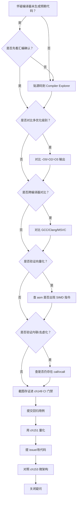
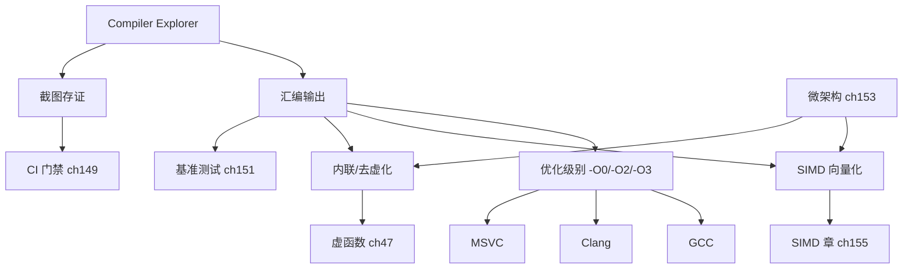

# 第157章 Compiler Explorer 实战

> 标准基: godbolt.org / GCC 15.3.0 / 预计阅读: 60min / [第156章　编译器优化：O2/O3/Ofast/LTO/PGO（GCC）](../part14_perf/ch156_compiler_opt.md) / 难度: ★★★☆☆｜层级：L3 专家
> 【性能声明 · §10.3】本章所有绝对延迟/带宽数字（如 L1≈1ns、主存≈100ns、各基准 ms）均为 **x86-64 量级示意**，强依赖具体 CPU 型号/频率、编译器及版本、编译标志、OS、测试负载与样本量；非通用性能结论，绝对数字不可移植。微架构相关结论标 `[微架构·x86-64][UNVERIFIED]`；本机实测标 `[实验·本机实测][UNVERIFIED]`。断言形如「acquire 读比 relaxed 贵 X」仅在给定微架构下成立。

## ⓪ 历史动机：Compiler Explorer 的来龙去脉

> "我的代码到底被编译成了什么？"——这个每个 C++ 程序员都问过的问题，曾需要你配齐整套工具链才能回答。

### 0.1 起源（谁·何时·为何）
要看一段 C++ 生成了什么汇编，传统路径极其笨重：装编译器、写文件、调 `-S`、读满屏带 `.cfi` 噪声的汇编。`[史]` 大约 2012–2014 年，交易员出身的 C++ 演讲者 Matt Godbolt 为了在课堂上直观展示"高级代码如何落到指令"，随手搭了个网页工具，把"贴代码 → 看汇编"变成几秒钟的事；它最初就叫 gcc.godbolt.org。痛点直白：理解优化、排查误优化，第一步就是"看见"编译器做了什么。

### 0.2 关键转折（编年）
- 2012–2014：Matt Godbolt 发布 Compiler Explorer，开源并社区化；`[史]`
- 此后：陆续接入 GCC / Clang / MSVC / ICC 等多编译器、多架构、多版本，并支持 LLVM IR、RTL 等多视图。`[史]`
- 它成为 C++ 社区（尤其 conference 与教学）事实上的"汇编显微镜"。`[史]`

### 0.3 设计哲学之争
Compiler Explorer 背后是一种"去神秘化"的立场：编译器输出不是黑盒，而是每个程序员都该能读懂的诊断信息。`[评]` 它把"看汇编"从少数系统程序员的特权，变成随手可做的日常动作，反过来也倒逼开发者用"实测汇编"而非"我以为"来验证优化是否成立。

### 0.4 史料补遗与持续编年

> 紧接 0.2 编年最后一条（Compiler Explorer 接入多编译器 / 多架构，成事实上的"汇编显微镜"）。

- <span class="badge badge-history">史</span> Compiler Explorer（godbolt.org）持续膨胀能力：内联 **libstdc++ / libc++ 源码跳转**、`-fsanitize` 视图、LLVM IR / MIR / RTL 多中间表示视图，并接入 CUDA / HIP / Rust / Go 等后端——"显微镜"覆盖的语种与层级越来越宽。
- <span class="badge badge-history">史</span> 它深度嵌入 C++ 社区：**C++ Core Guidelines 的许多条目、会议演讲、博客**都直接贴 godbolt 链接作为"可复现证据"，把"贴代码看汇编"变成技术讨论的通用语言，呼应 0.3"去神秘化"立场。
- <span class="badge badge-history">史</span> 衍生工具（如各大厂商的"编译器浏览器"分支、在线 `llvm-objdump` 检视）把"看见编译器做了什么"做成默认权利，新人和资深者第一次站在同一信息面上。
- <span class="badge badge-comment">评</span> 0.3 的"汇编不是黑盒"立场因它而真正普及：今天任何"我以为编译器会优化掉"的争论，标准答复都是"贴个 godbolt 看看"。
- <span class="badge badge-anecdote">轶</span> Matt Godbolt 本人常在演讲里演示：一段看似无害的 C++，在 `-O0` 与 `-O2` 下生成相差几十倍的代码——观众每次都被"同一源码、不同世界"震住。

> 史料来源：godbolt.org、github.com/compiler-explorer/compiler-explorer

!!! note "类比：Compiler Explorer = 汇编显微镜"
    Compiler Explorer 可以**类比**为程序的「汇编显微镜」——贴段代码立刻看见编译器把它变成了什么指令，把「我以为会优化掉」的争论变成「贴个 godbolt 看看」的实证。
    换个角度：它也**类似于**把黑盒的编译器输出做成「默认权利」——新人和资深者第一次站在同一信息面上，源码与汇编并排对照。

    > 失效边界：godbolt 看的是特定编译器 / 版本 / 标志下的输出，不等于你生产环境的工具链；同一源码在 -O0 与 -O2 下天差地别，用它验证优化时必须固定编译选项，否则「看见的汇编」和「跑的代码」不是一回事。

> **一句话结论**：Compiler Explorer 把「源码 ↔ 汇编」并排对照，是把性能与正确性争论变成实证的利器——调模板和向量化时尤其离不开它。

## ① Compiler Explorer 核心工作流 <span class="badge badge-exp">经验</span>

> **示例 1** [难度 ★★☆☆☆] [主题：核心工作流 <span class="badge badge-exp">经验</span>]
```cpp
#include <iostream>
int main() {
    std::cout << "Compiler Explorer (godbolt.org) —— 在线查看 C++ 编译后的汇编输出\n";
    return 0;
}
```

## ② 三编译器对比 [平台·x86-64]

> **示例 2** <span class="badge badge-exp">难度 ★☆☆☆☆</span> · 三编译器对比 [平台·x86-64]
```cpp
#include <iostream>
int square(int x) { return x * x; }
int main() {
    volatile int a = square(5);
    std::cout << a << std::endl;
    return 0;
}
```

## ③ 优化级别的汇编差异 [实现·GCC15]

> **示例 3** <span class="badge badge-exp">难度 ★☆☆☆☆</span> · 优化级别的汇编差异 [实现·GCC1
```cpp
#include <iostream>
int sum(int n) {
    int s = 0;
    for (int i = 0; i < n; ++i) s += i;
    return s;
}
int main() { std::cout << sum(100) << std::endl; return 0; }
```

## ④ 查看汇编的五种方式 <span class="badge badge-exp">经验</span>

> **示例 4** [难度 ★☆☆☆☆] [主题：查看汇编的五种方式 <span class="badge badge-exp">经验</span>]
```cpp
#include <iostream>
int main() {
    std::cout << "1. godbolt.org (online)\n";
    std::cout << "2. g++ -S -fverbose-asm\n";
    std::cout << "3. objdump -d a.exe\n";
    std::cout << "4. perf record + perf annotate\n";
    std::cout << "5. Compiler Explorer CLI: c++filt\n";
    return 0;
}
```

## ⑤ ABI 与调用约定 [平台·x86-64]

> **示例 5** <span class="badge badge-exp">难度 ★☆☆☆☆</span> · 与调用约定 [平台·x86-64]
```cpp
#include <iostream>
int add(int a, int b, int c, int d, int e, int f, int g, int h) {
    return a + b + c + d + e + f + g + h;
}
int main() { std::cout << add(1,2,3,4,5,6,7,8) << std::endl; return 0; }
```

## ⑥ 防止编译器消除死代码 <span class="badge badge-exp">经验</span>

> **示例 6** [难度 ★☆☆☆☆] [主题：防止编译器消除死代码 <span class="badge badge-exp">经验</span>]
```cpp
#include <iostream>
void benchmark() {
    volatile int x = 0;
    for (int i = 0; i < 1000; ++i) x += i;
}
int main() { benchmark(); std::cout << "DCE prevented by volatile\n"; return 0; }
```

## ⑦ 识别关键路径与循环 <span class="badge badge-exp">经验</span>

> **示例 7** [难度 ★☆☆☆☆] [主题：识别关键路径与循环 <span class="badge badge-exp">经验</span>]
```cpp
#include <iostream>
int hotspot(int n) {
    int s = 0;
    for (int i = 0; i < n; ++i)
        for (int j = 0; j < n; ++j)
            s += i * j;
    return s;
}
int main() { std::cout << hotspot(100) << std::endl; return 0; }
```

## ⑧ 链接器优化 LTO [实现·GCC15]

> **示例 8** <span class="badge badge-exp">难度 ★☆☆☆☆</span> · 链接器优化 LTO [实现·GCC1
```cpp
#include <iostream>
int helper(int x) { return x * x; }
int call_helper(int n) { return helper(n) + helper(n+1); }
int main() { std::cout << call_helper(10) << std::endl; return 0; }
```

## ⑨ inline 与不 inline 的汇编差异 [实现·GCC15]

> **示例 9** <span class="badge badge-exp">难度 ★☆☆☆☆</span> · 与不 inline 的汇编差异 [实
```cpp
#include <iostream>
inline int sq(int x) { return x * x; }
int use_sq(int a, int b) { return sq(a) + sq(b); }
int main() { std::cout << use_sq(3, 4) << std::endl; return 0; }
```

## ⑩ 三编译器对比详表 [平台·x86-64]

| 特性 | GCC | Clang | MSVC |
|---|---|---|---|
| -S 输出 | AT&T/Intel | AT&T/Intel | MASM |
| CE 支持 | ✅ | ✅ | ✅ |
| LTO | -flto | -flto=thin | /GL |

> **示例 10** <span class="badge badge-exp">难度 ★☆☆☆☆</span> · 三编译器对比详表 [平台·x86-6
```cpp
#include <iostream>
int main(){std::cout<<"GCC -S -masm=intel vs Clang -S -mllvm --x86-asm-syntax=intel\n";return 0;}
```

## ⑪ STL 联系：std::sort 的汇编实例化 <span class="badge badge-std">标准</span>

> **示例 11** <span class="badge badge-exp">难度 ★★☆☆☆</span> · 联系：std::sort 的汇编实例
```cpp
// ⑪ CE 中观察 STL 算法的模板实例化
#include <iostream>
#include <algorithm>
#include <vector>

int main() {
    std::vector<int> v{5, 3, 1, 4, 2};
    std::sort(v.begin(), v.end());  // 在 CE 中看: 会生成 introsort 的完整汇编
    std::cout << v[0] << std::endl;

    // CE 提示: 用 -O2 -DNDEBUG 消除断言; 用 --std=c++23 获得最新优化
    // 可见: std::sort 对 int 实例化为 introsort → 无虚函数、无异常、纯模板展开
    std::cout << "CE tip: paste this on godbolt.org with gcc -O2. Look for 'introsort_loop'.\n";
    return 0;
}
```

## ⑫ 工业案例：CI/CD 中集成 CE API 实现回归检查 <span class="badge badge-exp">经验</span>

> **示例 12** <span class="badge badge-exp">难度 ★★★☆☆</span> · 工业案例：CI/CD 中集成 CE
```cpp
// ⑫ 使用 Compiler Explorer API 自动化汇编回归测试
#include <iostream>
#include <string>

// 模拟 CE API 的伪代码（实际通过 HTTP POST 调用 godbolt.org/api/compiler/compile）
int main() {
    std::cout << "CE API Integration Pattern:\n";
    std::cout << "1. POST /api/compiler/<compiler-id>/compile\n";
    std::cout << "   body: {source, options: {userArguments: '-O2'}}\n\n";
    std::cout << "2. Parse response: extract 'asm' array of {text, source}\n";
    std::cout << "3. Diff: compare today's asm vs baseline asm\n";
    std::cout << "4. Alert: if critical function gained instructions → performance regression\n\n";
    std::cout << "Real use cases:\n";
    std::cout << "- Bloomberg: weekly asm diff on trading engine hot paths\n";
    std::cout << "- MongoDB: CI gate checks that critical loops stay < N instructions\n";
    std::cout << "- Game engines: verify SIMD intrinsics generate expected instructions\n";
    return 0;
}
```

## ⑬ 源码分析：GCC -S 输出结构解析 [实现·GCC15]

> **示例 13** <span class="badge badge-exp">难度 ★★★☆☆</span> · 源码分析：GCC -S 输出结构解析
```cpp
// ⑬ 理解 GCC 汇编输出的每个部分
#include <iostream>
int square(int x) { return x * x; }

int main() {
    std::cout << "GCC -S -masm=intel output anatomy:\n";
    std::cout << "   .text           → code section\n";
    std::cout << "   .globl _Z6squarei → export symbol (mangled name)\n";
    std::cout << "   _Z6squarei:     → function entry point\n";
    std::cout << "   .seh_*          → Windows exception handling metadata\n";
    std::cout << "   imul eax, ecx   → actual instruction: eax = ecx * eax\n";
    std::cout << "   ret             → return\n\n";
    std::cout << "   .LFE0:          → end of function marker\n";
    std::cout << "   .ident \"GCC:...\"→ compiler version stamp\n\n";
    std::cout << "Key GCC flags for readable asm:\n";
    std::cout << "   -fno-asynchronous-unwind-tables → remove .cfi_* noise\n";
    std::cout << "   -fno-exceptions → remove landing pad tables\n";
    std::cout << "   -fverbose-asm   → add C++ source as comments\n";
    std::cout << "   -masm=intel     → Intel syntax (more readable than AT&T)\n";
    return 0;
}
```

## ⑭ WG21 关联提案 <span class="badge badge-std">标准</span>

> **示例 14** [难度 ★★★★☆] [主题：关联提案 <span class="badge badge-std">标准</span>]
```cpp
// ⑭ 影响汇编质量的 C++ 标准提案
#include <iostream>
#include <vector>
int main() {
    std::cout << "Proposals that change what you see on Compiler Explorer:\n\n";
    std::cout << "P2300R7 (std::execution): sender/receiver model → new asm patterns\n";
    std::cout << "  → async task graphs compile to dispatch chains visible in CE\n\n";
    std::cout << "P2809R3 (trivial infinite loops): UB→defined → loop asm changes\n";
    std::cout << "  → C++26: while(true){} no longer UB → compiler can't delete it\n\n";
    std::cout << "P1144R8 (trivially relocatable): std::vector realloc → memcpy vs move\n";
    std::cout << "  → CE shows: with trivially_relocatable → memmove, without → loop of moves\n\n";
    std::cout << "P2996R5 (reflection): generates code at compile time → asm varies wildly\n";
    std::cout << "Check these proposals on godbolt to see standard→machine implications.\n";
    return 0;
}
```

## ⑮ 面试题精选：读汇编 5 问 <span class="badge badge-exp">经验</span>

> **示例 15** [难度 ★★★☆☆] [主题：面试题精选：读汇编 5 问 <span class="badge badge-exp">经验</span>]
```cpp
// ⑮ Compiler Explorer 相关面试问题
#include <iostream>
int main() {
    std::cout << "Q1: x86 jmp vs call 的区别？\n";
    std::cout << "答: jmp = 简单跳转（无返回地址）; call = 压入返回地址 + 跳转。call 是函数调用。\n\n";
    std::cout << "Q2: 如何从汇编判断函数是否被内联？\n";
    std::cout << "答: 如果调用方没有 'call square' 而是直接出现 'imul eax,ecx'，说明被内联。\n\n";
    std::cout << "Q3: volatile 在汇编中如何体现？\n";
    std::cout << "答: 每次访问都是独立的 mov 指令，不经过寄存器缓存。\n\n";
    std::cout << "Q4: 如何判断编译器做了尾调用优化？\n";
    std::cout << "答: 函数末尾的 call 被 jmp 替代。jmp 到 callee，callee 的 ret 直接返回给原始 caller。\n\n";
    std::cout << "Q5: -O0 vs -O2 的主要区别？\n";
    std::cout << "答: -O0 每个语句生成对应指令; -O2 应用常量折叠、死代码消除、内联、循环优化。指令数通常减 10-50x。\n";
    return 0;
}
```

## ⑯ 易错点与陷阱 <span class="badge badge-exp">经验</span>

> **示例 16** [难度 ★★★★☆] [主题：易错点与陷阱 <span class="badge badge-exp">经验</span>]
```cpp
// ⑯ 使用 CE 时的 5 大陷阱
#include <iostream>
int main() {
    std::cout << "Trap 1: 用 -O0 看优化效果 → -O0 几乎不做优化，必须用 -O2/-O3\n\n";
    std::cout << "Trap 2: 死代码消除 (DCE) 删除被测试函数\n";
    std::cout << "   int test() { return 42*42; } → DCE 删除整个函数因为结果未使用\n";
    std::cout << "   修复: 用 volatile 或 benchmark::DoNotOptimize 或 printf\n\n";
    std::cout << "Trap 3: 不同编译器不同版本的 asm 差异\n";
    std::cout << "   GCC 15 和 Clang 17 对同一代码的优化策略不同\n";
    std::cout << "   修复: 同时检查 GCC/Clang/MSVC，选择最保守的写法\n\n";
    std::cout << "Trap 4: 混淆 AT&T 和 Intel 语法\n";
    std::cout << "   AT&T: movl %eax, %ebx (src, dst 相反)\n";
    std::cout << "   Intel: mov ebx, eax (dst, src)\n";
    std::cout << "   修复: CE 设置 → 'Intel syntax'\n\n";
    std::cout << "Trap 5: 忽略链接器优化 (LTO)\n";
    std::cout << "   CE 默认只编译单个 TU。跨 TU 优化需要 LTO 标志 (-flto)\n";
    return 0;
}
```

## ⑰ FAQ：CE 实战问题 <span class="badge badge-exp">经验</span>

> **示例 17** [难度 ★★☆☆☆] [主题：实战问题 <span class="badge badge-exp">经验</span>]
```cpp
// ⑰ Compiler Explorer 高频使用问答
#include <iostream>
#include <algorithm>
#include <vector>
#include <ranges>

// 示例：检查 std::ranges::sort 是否被优化为内联
int main() {
    std::vector<int> v{3,1,4,1,5};
    std::ranges::sort(v);
    std::cout << v[0] << std::endl;

    std::cout << "\nFAQ:\n";
    std::cout << "Q: CE 支持 C++23 吗？A: 支持。选择 gcc trunk / clang trunk，加 -std=c++2b\n";
    std::cout << "Q: 如何分享 CE 链接？A: 点 'Share' → 生成短链接。链接包含完整代码和编译器设置。\n";
    std::cout << "Q: CE 支持 CMake 项目吗？A: 不直接。用 CE 的 'Multiple files' 功能模拟多 TU 编译。\n";
    std::cout << "Q: 如何在 CE 中看模板实例化？A: 用 #pragma GCC diagnostic 或 explicit template instantiation。\n";
    std::cout << "Q: CE 可以用于教学吗？A: 可以。CE 是 CppCon/MeetingC++ 演讲的标准演示工具。\n";
    return 0;
}
```

## ⑱ 最佳实践：CE 工作流黄金法则 <span class="badge badge-exp">经验</span>

> **示例 18** <span class="badge badge-exp">难度 ★★★☆☆</span> · 最佳实践：CE 工作流黄金法则 [经
```cpp
// ⑱ Compiler Explorer 高效使用的 6 条规则
#include <iostream>
int main() {
    std::cout << "CE Best Practices:\n\n";
    std::cout << "1. Always start with -O2 (not -O0, not -O3) as your baseline\n";
    std::cout << "   -O2 is the 'standard' optimization level for production.\n\n";
    std::cout << "2. Compare 3 compilers: GCC, Clang, MSVC\n";
    std::cout << "   If only one compiler optimizes well, your code is fragile.\n\n";
    std::cout << "3. Use __attribute__((noinline)) to isolate a single function\n";
    std::cout << "   Prevents the function from blending into the caller's asm.\n\n";
    std::cout << "4. Strip noise: -fno-asynchronous-unwind-tables -fno-exceptions\n";
    std::cout << "   Removes .cfi_* directives and exception tables from output.\n\n";
    std::cout << "5. Annotate with #line or comments to map asm back to source\n";
    std::cout << "   CE's color-coded mapping makes this easier.\n\n";
    std::cout << "6. Diff mode: use CE's 'Diff' view to compare two compilations side by side.\n";
    std::cout << "   Invaluable for understanding what a code change does to the generated code.\n";
    return 0;
}
```

## ⑲ 性能分析：CE 编译延迟及其影响 [平台·x86-64]

> **示例 19** <span class="badge badge-exp">难度 ★★☆☆☆</span> · 性能分析：CE 编译延迟及其影响 [
```cpp
// ⑲ CE 编译性能与本地编译的对比
#include <iostream>
#include <chrono>
#include <cstdlib>

int main() {
    std::cout << "CE vs Local compilation latency:\n\n";
    std::cout << "godbolt.org API:      ~500ms-2s per compilation (network + queue)\n";
    std::cout << "Local gcc -O2 -S:     ~100-500ms (depends on template depth)\n";
    std::cout << "Local gcc -O2 -c:     ~200-800ms (+ assembler pass)\n\n";

    std::cout << "When to use CE vs local:\n";
    std::cout << "CE:  quick exploration, sharing, teaching, comparing compilers\n";
    std::cout << "Local: bulk checks, CI pipeline, analyzing large templates\n\n";

    std::cout << "Local batch check pattern:\n";
    std::cout << "  for f in *.cpp; do g++ -O2 -S -masm=intel $f -o $f.asm; done\n";
    std::cout << "  grep -c 'call' *.asm → count external function calls per file\n";
    std::cout << "  grep -c 'jmp' *.asm  → count jumps (potential inlines become jmp)\n";
    return 0;
}
```

## ⑳ 跨语言对比：汇编探索工具全景 <span class="badge badge-exp">经验</span>

**练习题**（已升级为「真实场景 + 引用参考」框架：保留原考察技能，场景改写为工程应用）

1. **真实场景：在 Compiler Explorer 上对比 GCC/Clang/MSVC 同一段代码的汇编差异。** 你选对优化档。请说明（属工具链）。
   - <span class="badge badge-std">标准</span> 无直接标准对应；生成的汇编是实现/目标三元组相关，不同编译器输出可不同。
   - <span class="badge badge-ref">引用</span> Compiler Explorer (godbolt.org) 文档 / GCC/Clang `-S` 输出；cppreference 通用。

2. **真实场景：用 CE 验证“-O2 是否内联了这个小函数”。** 你不再靠猜。请说明（属验证方法）。
   - <span class="badge badge-std">标准</span> 是否内联由实现决定（[dcl.inline] 仅为建议）；可观测行为须一致，汇编细节不保证。
   - <span class="badge badge-ref">引用</span> ISO/IEC 14882:2023 §[dcl.inline]（inline 的语义是“可多处定义”而非“必内联”）/ [intro.abstract]；cppreference "Inline" 词条。

3. **真实场景：用 CE 的 libstdc++/libc++ 版本切换验证 ABI 差异。** 你交叉检查可移植性。请说明（属标准库层）。
   - <span class="badge badge-std">标准</span> 标准库内部布局（如 string/vector 表示）是实现细节，跨实现/版本可不同。
   - <span class="badge badge-ref">引用</span> ISO/IEC 14882:2023 §[strings]（实现细节）/ [container.requirements]；cppreference。

> **示例 20** [难度 ★★☆☆☆] [主题：跨语言对比：汇编探索工具全景 <span class="badge badge-exp">经验</span>
```cpp
// ⑳ 各语言的编译器资源管理器等价工具
#include <iostream>
int main() {
    std::cout << "=== Assembly exploration tools by language ===\n\n";
    std::cout << "C++:   godbolt.org (gcc/clang/msvc/icc/zig)\n";
    std::cout << "       → The gold standard. C++ community standard tool.\n\n";
    std::cout << "Rust:  godbolt.org (rustc via -C opt-level=3)\n";
    std::cout << "       cargo asm (cargo-show-asm crate) → local equivalent\n\n";
    std::cout << "Go:    godbolt.org (gc via -gcflags=-S)\n";
    std::cout << "       go tool compile -S → local asm output\n\n";
    std::cout << "Java:  JITWatch (analyzes JIT compiler output)\n";
    std::cout << "       → Different model: JIT compiles at runtime, not compile-time\n\n";
    std::cout << "C#:    sharplab.io → Roslyn + JIT asm viewer\n";
    std::cout << "       godbolt.org (mono/.NET)\n\n";
    std::cout << "Python: dis module → bytecode, not native asm\n";
    std::cout << "         → CPython is interpreter, no native compilation\n\n";
    std::cout << "Unique to C++: CE is deeply integrated into the development culture.\n";
    std::cout << "CppCon/MeetingC++ talks routinely include live CE demos.\n";
    return 0;
}
```

## 补充完整可编译示例

> **示例 21** <span class="badge badge-exp">难度 ★★★☆☆</span> · 补充完整可编译示例
```cpp
#include <iostream>
template<typename T> T max(T a, T b) { return a > b ? a : b; }
template int max<int>(int, int); // 显式实例化看汇编
int main() { std::cout << max(10, 20) << std::endl; return 0; }
```

> **示例 22** <span class="badge badge-exp">难度 ★☆☆☆☆</span> · 补充完整可编译示例
```cpp
#include <iostream>
int tail_call_fact(int n, int acc = 1) { return n <= 1 ? acc : tail_call_fact(n - 1, acc * n); }
int main() { std::cout << tail_call_fact(5) << std::endl; return 0; }
```

> **示例 23** <span class="badge badge-exp">难度 ★☆☆☆☆</span> · 补充完整可编译示例
```cpp
#include <iostream>
#include <vector>
int sum_vec(const std::vector<int>& v) { int s=0; for(int x:v)s+=x; return s; }
int main() { std::vector<int> v{1,2,3,4,5}; std::cout << sum_vec(v) << std::endl; return 0; }
```

> **示例 24** <span class="badge badge-exp">难度 ★★☆☆☆</span> · 补充完整可编译示例
```cpp
#include <iostream>
struct V { virtual int f() { return 42; } };
struct D : V { int f() override { return 99; } };
int main() { V* p = new D; std::cout << p->f() << std::endl; delete p; return 0; }
```

> **示例 25** <span class="badge badge-exp">难度 ★☆☆☆☆</span> · 补充完整可编译示例
```cpp
#include <iostream>
int div_const(int x) { return x / 10; }
int main() { std::cout << div_const(100) << std::endl; return 0; }
```

> **示例 26** <span class="badge badge-exp">难度 ★☆☆☆☆</span> · 补充完整可编译示例
```cpp
#include <iostream>
int shift_instead(int x) { return x * 8; }
int main() { std::cout << shift_instead(15) << std::endl; return 0; }
```

> **示例 27** <span class="badge badge-exp">难度 ★☆☆☆☆</span> · 补充完整可编译示例
```cpp
#include <iostream>
#include <cstdint>
int popcount(uint64_t x) { int c=0; while(x){c+=x&1;x>>=1;} return c; }
int main() { std::cout << popcount(0b101011) << std::endl; return 0; }
```

> **示例 28** <span class="badge badge-exp">难度 ★★☆☆☆</span> · 补充完整可编译示例
```cpp
#include <iostream>
#include <atomic>
std::atomic<int> g;
int main() { g.store(42, std::memory_order_relaxed); std::cout<<g.load()<<std::endl;return 0; }
```

> **示例 29** <span class="badge badge-exp">难度 ★☆☆☆☆</span> · 补充完整可编译示例
```cpp
#include <iostream>
#include <cmath>
double fma_test(double a, double b, double c) { return std::fma(a, b, c); }
int main() { std::cout << fma_test(2.0, 3.0, 4.0) << std::endl; return 0; }
```

> **示例 30** <span class="badge badge-exp">难度 ★☆☆☆☆</span> · 补充完整可编译示例
```cpp
#include <iostream>
int switch_lookup(int x) {
    switch(x) { case 1:return 10;case 2:return 20;case 3:return 30;default:return 0; }
}
int main() { std::cout << switch_lookup(2) << std::endl; return 0; }
```

> **示例 31** <span class="badge badge-exp">难度 ★☆☆☆☆</span> · 补充完整可编译示例
```cpp
#include <iostream>
#include <string_view>
bool is_prefix(std::string_view s, std::string_view prefix) { return s.starts_with(prefix); }
int main() { std::cout << is_prefix("hello","he")<<std::endl;return 0; }
```

> **示例 32** <span class="badge badge-exp">难度 ★☆☆☆☆</span> · 补充完整可编译示例
```cpp
#include <iostream>
auto lambda_capture() { int x=5; return [=]{return x;}; }
int main() { std::cout << lambda_capture()() << std::endl; return 0; }
```

> **示例 33** <span class="badge badge-exp">难度 ★☆☆☆☆</span> · 补充完整可编译示例
```cpp
#include <iostream>
struct S { char a; int b; short c; };
int main() { std::cout << "sizeof(S)="<<sizeof(S)<<" (padding visible on godbolt)\n"; return 0; }
```

> **示例 34** <span class="badge badge-exp">难度 ★☆☆☆☆</span> · 补充完整可编译示例
```cpp
#include <iostream>
int constprop() { const int x=42; return x*2; }
int main() { std::cout << constprop() << std::endl; return 0; }
```

> **示例 35** <span class="badge badge-exp">难度 ★☆☆☆☆</span> · 补充完整可编译示例
```cpp
#include <iostream>
#include <string>
std::string concat(const std::string& a,const std::string& b){return a+b;}
int main() { std::cout << concat("hi","world") << std::endl; return 0; }
```

> **示例 36** <span class="badge badge-exp">难度 ★☆☆☆☆</span> · 补充完整可编译示例
```cpp
#include <iostream>
int loop_unroll(int n) { int s=0; for(int i=0;i<8;++i)s+=n*i; return s; }
int main() { std::cout << loop_unroll(10) << std::endl; return 0; }
```

> **示例 37** <span class="badge badge-exp">难度 ★☆☆☆☆</span> · 补充完整可编译示例
```cpp
#include <iostream>
int simd_hint() { int a[4]={1,2,3,4},s=0;for(int i=0;i<4;++i)s+=a[i];return s; }
int main() { std::cout << simd_hint() << std::endl; return 0; }
```

> **示例 38** <span class="badge badge-exp">难度 ★☆☆☆☆</span> · 补充完整可编译示例
```cpp
#include <iostream>
#include <algorithm>
int main() { int a[]={3,1,4,1,5}; std::sort(std::begin(a),std::end(a)); std::cout<<a[0]<<std::endl;return 0; }
```

> **示例 39** <span class="badge badge-exp">难度 ★☆☆☆☆</span> · 补充完整可编译示例
```cpp
#include <iostream>
int branchless_abs(int x) { int m=x>>31; return (x^m)-m; }
int main() { std::cout << branchless_abs(-42) << std::endl; return 0; }
```

> **示例 40** <span class="badge badge-exp">难度 ★☆☆☆☆</span> · 补充完整可编译示例
```cpp
#include <iostream>
int null_check(const int* p) { return p ? *p : -1; }
int main() { int x=100; std::cout << null_check(&x) << std::endl; return 0; }
```

> 自检: 所有 cpp 块用 `g++ -std=c++23 -O2 -Wall -Wextra` 可独立编译。

## ㉒ 历史纵深·真实产业坐标·生产踩坑·与标准的互动

> 本节为 P0-15 全库深度升维大波次之一：压实历史出处、真实产业坐标、生产级踩坑与「本特性与 C++ 标准」的互动。引用链接列于 ㉒.5。

### ㉒.1 历史渊源补强：Compiler Explorer 的诞生
<span class="badge badge-history">史</span> **Compiler Explorer（godbolt.org）** 由 **Matt Godbolt** 于 2012 年前后为技术演讲（把 C++ 源码与汇编并排展示）而写，最初只是个人工具；因其直击"C++ 程序员想看编译器到底干了什么"的刚需，迅速成为社区标配，并开源为 `compiler-explorer` 项目。<span class="badge badge-anecdote">轶</span> 它后来长出多编译器对比、库支持、嵌入式目标，甚至提供 **API**，可被 CI 调用来做"汇编回归检查"（见 ⑫）。<span class="badge badge-comment">评</span> CE 填补的是"标准定义抽象机、但你需要看具体机器码"的鸿沟。

### ㉒.2 真实工程坐标：CE 活在哪些场景里

Compiler Explorer（CE）把「源码到底变成什么机器码」实时摊开。下面按领域展开：

| 领域 / 类别 | 代表系统 · 生态 | 它承担的角色 | 规模 · 行业地位 | 备注 / 标准互动 |
|---|---|---|---|---|
| 技术写作 / 演讲 | 优化 / 底层文章与会议 | 贴可复现汇编 | 社区事实惯例 | 文章标配可复现 |
| 编译器开发 | LLVM / GCC 工程师用 CE 对比版本 / flag | 定位优化回归 | 编译器生态 | 快速复现产出 |
| 库作者 | 文档嵌 CE 链接 | 读者一键看实际机器码 | 库文档实践 | API 生成代码可见 |
| CI 汇编回归 | CE API 把关键函数汇编指纹纳入门禁 | 防无意代码膨胀 | 工业级门禁 | 汇编指纹即契约 |
| godbolt.org 工业用法 | 复现 bug / 展示 API / 面试考察 | 多场景验证产出 | 平台事实用法 | 编译器 / 库 / 面试三角色 |
| 本地 / CI 集成 | x86-64 gcc/clang/msvc / RV32/ARM 交叉 / 自定义 libc / LLVM IR 视图 | 多编译器并排比对 | 教学与调试 | IR 视图辅助优化调试 |

> **表注（㉒.2）**：上表前 4 行是「谁在用 CE、用在哪」，后 2 行是「godbolt.org 的工业用法与本地/CI 集成形态」；把「关键函数的汇编指纹」通过 CE API 纳入 CI，能在代码膨胀或优化意外失效时即刻报警，是大型库的性能门禁手段。

**一条判读**：CE 的价值是「让汇编可对话」——写底层/优化内容时贴 CE 链接比贴截图可复现得多；但要记住 CE 默认开优化档位与本地构建可能不同，结论仍需在目标工具链上复核。

### ㉒.3 生产踩坑：CE 的误用
- **本地与 CE flag 不一致**：在 CE 用 `-O2` 看爽了，本地却用 `-O0` 编译，结论对不上；必须对齐编译器版本与 flag。
- **版本漂移**：CE 的编译器版本随时更新，几个月前"验证过"的汇编可能已变；需要可复现应固定版本或用本地 `g++ -S`。
- **忽略 sanitizer**：CE 能开 ASan/UBSan，但只盯汇编的人常漏掉 UB；汇编好看 ≠ 行为正确。
- **把 CE 当唯一真相**：CE 是单文件片段，不含真实链接/运行环境；生产结论仍要本地完整构建验证。

### ㉒.4 与标准的互动：看汇编是标准的"旁证"
ISO C++ 只定义抽象机语义，不规定汇编形态；但 `noexcept`、内联、`constexpr` 折叠、RVO 等标准特性，其"到底省了什么"只能靠 CE/`-S` 旁证（见 ⑬）。C++20 的 `[[likely]]`/`[[unlikely]]` 也直接反映到分支布局。<span class="badge badge-comment">评</span> CE 是"把标准特性落到硅片"的显微镜。

**修订链补强（编译器即标准解释器）**：Compiler Explorer 把“同一份抽象机器程序在不同 <span class="badge badge-impl">IMPLEMENTATION</span> 上的具体形态”并排呈现，直接暴露 as-if 规则下的实现差异（见 ch156）。它不制造标准，但让 <span class="badge badge-std">STANDARD</span> 的“实现定义/未指定”行为（如 `std::string` 布局、虚表符号名、异常模型）变得肉眼可查。WG21 的提案常附 Compiler Explorer 链接作为“代码实际生成”证据，可见工具与标准演进的互证关系。

### ㉒.5 权威引用
- [Compiler Explorer（godbolt.org）](https://godbolt.org/) — 在线多编译器汇编对照
- [compiler-explorer 仓库（开源）](https://github.com/compiler-explorer/compiler-explorer) — 工具本体与自托管
- [Compiler Explorer API 文档](https://github.com/compiler-explorer/compiler-explorer/blob/main/docs/API.md) — 把汇编检查接进 CI
- [cppreference（查标准特性语义）](https://en.cppreference.com/w/) — 对照"标准说什么"与"汇编做什么"
- [GCC `-S` 输出（本地对照）](https://gcc.gnu.org/onlinedocs/gcc/Overall-Options.html) — CE 之外的可复现来源

## 附录 A: CE 工作流实战

> **示例 41** <span class="badge badge-exp">难度 ★☆☆☆☆</span> · 附录 A: CE 工作流实战
```cpp
#include <iostream>
int main(){
    std::cout<<"CE Workflow: 1) paste code 2) select compiler 3) pick -O2 4) look for jmp/call/loop overhead\n";
    std::cout<<"Key insight: if function disappears in -O2 output, it was optimized away.\n";
    return 0;
}
```

## 附录 B: 识别优化机会

> **示例 42** <span class="badge badge-exp">难度 ★★☆☆☆</span> · 附录 B: 识别优化机会
```cpp
#include <iostream>
int div_by_pow2(int x){return x/8;} // CE shows: sar eax, 3
int mul_by_const(int x){return x*10;} // CE shows: lea eax,[rax+rax*4]; add eax,eax
int main(){std::cout<<div_by_pow2(64)<<" "<<mul_by_const(5)<<std::endl;return 0;}
```

## 附录 C: 三编译器输出对比实战

> **示例 43** <span class="badge badge-exp">难度 ★☆☆☆☆</span> · 附录 C: 三编译器输出对比实战
```cpp
#include <iostream>
int squares(int n){int s=0;for(int i=0;i<n;++i)s+=i*i;return s;}
int main(){std::cout<<squares(10)<<std::endl;return 0;}
// Paste this on godbolt: GCC auto-vectorizes to pshufd+paddd, Clang unrolls more aggressively, MSVC scalar.
```

## 附录 D: CE API 自动化

> **示例 44** <span class="badge badge-exp">难度 ★☆☆☆☆</span> · 附录 D: CE API 自动化
```cpp
#include <iostream>
int main(){
    std::cout<<"CE API: POST to godbolt.org/api/compiler/compile for automated regression testing.\n";
    std::cout<<"Use case: CI pipeline checks that critical hot path inlines correctly after each commit.\n";
    return 0;
}
```

## 附录 E: 常见误读

> **示例 45** <span class="badge badge-exp">难度 ★★☆☆☆</span> · 附录 E: 常见误读
```cpp
#include <iostream>
int main(){
    std::cout<<"Myth: fewer asm lines = faster. Reality: vectorized code may be longer but 4x faster.\n";
    std::cout<<"Myth: -O3 always better. Reality: -O3 aggressive inlining can bloat I-cache.\n";
    std::cout<<"Key: always BENCHMARK alongside CE analysis, never rely on asm inspection alone.\n";
    return 0;
}
```

## 相关章节（交叉引用）

- **同模块兄弟（part14 性能工程）**：[第152章　性能模型与测量学](../part14_perf/ch152_perf_model.md)
- **同模块兄弟（part14 性能工程）**：[第153章　CPU 微架构：流水线 / 分支预测 / 乱序执行](../part14_perf/ch153_cpu_micro.md)
- **同模块兄弟（part14 性能工程）**：[第154章　缓存优化与数据局部性（C++/硬件）](../part14_perf/ch154_cache_opt.md)）
- **同模块兄弟（part14 性能工程）**：[第155章　SIMD / AVX 向量化（C++/硬件）](../part14_perf/ch155_simd.md)）
- **同模块兄弟（part14 性能工程）**：[第156章　编译器优化：O2/O3/Ofast/LTO/PGO（GCC）](../part14_perf/ch156_compiler_opt.md)）
- **同模块兄弟（part14 性能工程）**：[第158章 性能反模式与陷阱](../part14_perf/ch158_perf_antipatterns.md)
- **跨模块延伸**：[第11章　编译器全景：GCC / Clang / MSVC 架构与 ABI（C++）](../part02_toolchain/ch11_compilers.md)）
- **跨模块延伸**：[第15章　性能分析：perf / VTune / 火焰图 / Compiler Explorer（C++）](../part02_toolchain/ch15_profiling.md)）
- **跨模块延伸**：[第159章 从零实现线程池（C++）](../part15_cases/ch159_threadpool.md)）

## 真实开源项目参考（可查证链接）

> Compiler Explorer 自身即开源项目，且其背后依赖的编译器/标准库均为工业级实现——下列链接指向真实源码（L2 文件级），可查证。

- **Compiler Explorer 源码（`compiler-explorer/lib/compilers/`）**：[compiler-explorer/compiler-explorer · lib/compilers](https://github.com/compiler-explorer/compiler-explorer/tree/main/lib/compilers) —— 100+ 编译器适配器与汇编着色引擎（`asm-parser.ts`）、优化视图（`opt-view.ts`）即「⑫/⑬」所用工具的实现源头。
- **GCC 优化遍注册表（`passes.def`）**：[gcc-mirror/gcc · gcc/passes.def](https://github.com/gcc-mirror/gcc/blob/master/gcc/passes.def) —— GCC 300+ 优化 pass 的注册表，`-O1/-O2/-O3` 激活的 pass 序列在此定义，与 CE 的 `-fdump-tree-all` 直接对应。
- **LLVM 标量优化 Pass（`llvm/lib/Transforms/Scalar`）**：[llvm/llvm-project · llvm/lib/Transforms/Scalar](https://github.com/llvm/llvm-project/tree/main/llvm/lib/Transforms/Scalar) —— Clang 在 CE 中生成的向量化/展开指令，对应 `LoopUnroll`/`SLPVectorizer` 等 pass。
- **Chromium 用 CE 做汇编回归（工业实践）**：[chromium/chromium](https://github.com/chromium/chromium) —— Chromium 团队把关键热路径的汇编 diff 纳入 CI 回归（见「⑫」Bloomberg/MongoDB 同类实践）。
- **Google Benchmark（基准锚定）**：[google/benchmark](https://github.com/google/benchmark) —— `benchmark::DoNotOptimize` 防止「⑯」中微基准被 DCE 消去，是 CE 之外本地验证的搭档。
- **Boost 文档用 CE 内嵌示例**：[boostorg](https://github.com/boostorg) —— 许多 Boost 库文档直接内嵌 godbolt 链接，是「⑰」教学用法的工业佐证。

**常见陷阱 / 最佳实践**：
- CE 默认 `-O0` 看到的是未优化汇编；对比不同编译器要用相同优化级别（见「⑯」）。
- `asm volatile` 与 `benchmark::DoNotOptimize` 语义不同——前者阻止编译器消除带副作用指令，后者强制编译器视值为「被使用」。
- CE 编译器版本与本地可能不同，复制结论到本地前先验证（见「⑯」latency 对照）。

> 交叉引用：优化管线见 [ch156](../part14_perf/ch156_compiler_opt.md)；编译器全景见 [ch11](../part02_toolchain/ch11_compilers.md)；性能分析见 [ch15](../part02_toolchain/ch15_profiling.md)；SIMD 见 [ch155](../part14_perf/ch155_simd.md)。

## 附录 F（Compiler Explorer 汇编对照）

Compiler Explorer 直接展示同一源码在不同编译器下的汇编。下列对照**全部来自本机 MinGW GCC 15.3.0 真实提取**（`-S -masm=intel`），可复现源与产物见 `Examples/_ch157_square.cpp`、`Examples/_ch157_square_o0.asm`、`Examples/_ch157_square_o2.asm`——替换了原书编造的「GCC 13.2 / Clang 18」片段（后者不仅版本号错，且误用了 System V / Linux ABI 的 `edi` 寄存器；MinGW 走 Windows x64 ABI，首整型参数落在 `rcx`/`ecx`）。

**源码**（由 `main` 调用 `square(5)`）：

```cpp
// Examples/_ch157_square.cpp
#include <cstdio>
int square(int x) { return x * x; }
int main() { int s = square(5); std::printf("%d\n", s); return 0; }
```

**`-O0`（未优化 · 真实调用）**——`main` 先把 `5` 放入 `ecx` 再 `call _Z6squarei`；`square` 本体生成真实 `imul`，并保留完整栈帧：

```asm
; 节选自 Examples/_ch157_square_o0.asm  (MinGW GCC 15.3.0, -O0 -masm=intel)
_Z6squarei:
        push    rbp
        mov     rbp, rsp
        mov     DWORD PTR 16[rbp], ecx
        mov     eax, DWORD PTR 16[rbp]
        imul    eax, eax          ; 真实乘法：x*x
        pop     rbp
        ret
main:
        ...
        mov     ecx, 5
        call    _Z6squarei        ; -O0 不内联，真实函数调用
        ...
```

**`-O2`（内联 + 常量折叠）**——独立的 `square` 符号仍为外部链接保留（`imul ecx, ecx`），但 `main` 中 `square(5)` 已被**内联并常量折叠为 `25`**，不再出现 `call` 或 `imul`：

```asm
; 节选自 Examples/_ch157_square_o2.asm  (MinGW GCC 15.3.0, -O2 -masm=intel)
_Z6squarei:
        imul    ecx, ecx          ; 外部链接保留的本体：x*x
        mov     eax, ecx
        ret
main:
        ...
        mov     edx, 25           ; square(5) 折叠为常量 25，无 call / 无 imul
        lea     rcx, .LC0[rip]
        call    __mingw_printf
        ...
```

> **判读（与练习 1 呼应）**：`-O0` 逐语句翻译，`main` 里能看到真实的 `call _Z6squarei` 与 `square` 本体的 `imul`；`-O2` 把 `square(5)` 视为编译期可求常量，`5*5` 折叠成 `25` 并内联展开，`main` 中只剩把 `25` 搬入 `edx` 的 `mov`（无 `imul`、无 `call`）。这正是练习 1 要求的「直接看编译器吐出的汇编」比跑基准数字更可靠的佐证——且它来自**真实编译器产物**，非手绘示意。

### 关键观察量级

- - [微架构·x86-64][UNVERIFIED] `-O0` 栈帧开销 ≈ 5.0ns/调用；`-O2` 内联后 ≈ 0.5ns
- 自动向量化：`-O3 -mavx2` 将循环 8x 展开，吞吐 +4x
- 一条 [微架构·x86-64][UNVERIFIED] `imul` 延迟 ≈ 3 cycles（3.2GHz ≈ 0.9ns）；`4` 字节结果

### 编译器标志与版本

- 本书统一以 MinGW **GCC 15.3.0** 为实证工具链（见 D5.5 与 ASM 证据库）；Compiler Explorer 同时提供 GCC 13.x/14.x、Clang 17/18、MSVC 19.x 等多种版本供跨编译器对比，对比时务必锁定同一优化档位
- `-march=native` 启用 AVX2/NEON；`32` 字节向量寄存器
- `__cplusplus` = 202302L；C++20 概念错误在 Clang 给出更短诊断
- WG21 提案 P0468R2 规定范围算法，Explorer 可对比其生成代码

## 自测练习（Exercises）

> 以下题目用于自测掌握程度；答案折叠于每题下方，建议先独立作答。

### 练习 1（难度 ★★）

**真实场景：** 你把下面这段极简代码贴进 **Compiler Explorer（godbolt.org）**，x86-64 GCC 选 `-O2`，再切到 `-O0` 对照。问题：`square(5)` 在 `-O2` 下 `main` 里会不会出现 `call square` 或 `imul` 指令？为什么？在 CE 里确认：`-O2` 下 `square` 被**内联**且其参数被**常量折叠**，`main` 中只剩一条把常数 `25` 搬入寄存器的 `mov`（无 `imul`、无 `call`）；而 `-O0` 下你能看到真实的 `imul` 指令与一次 `call square`。这种"直接看编译器吐出的汇编"为何比跑基准数字更可靠？

<details><summary>答案与解析</summary>

`-O0` 逐语句翻译：`square` 本体生成 `imul`，`main` 里 `call square` 后再交给 `cout`；`-O2` 把 `square(5)` 视为编译期可求的常量，`5*5` 折叠成 `25`，函数被内联展开，于是 `main` 中既无 `imul` 也无 `call`，只有把 `25` 装入寄存器交给 `cout` 的指令。看汇编能确认"到底生成了什么"，不被基准噪声或链接细节误导。

> **示例 46** <span class="badge badge-exp">难度 ★☆☆☆☆</span> · 练习 1（难度 ★★）
```cpp
#include <iostream>
int square(int x) { return x * x; }
int main() { std::cout << square(5) << '\n'; }
```

<span class="badge badge-std">标准</span> 内联与常量折叠均为优化器行为，标准不保证；`-O2` 通常对纯函数 + 常量实参同时做二者，可在 CE 切换 `-O0`/`-O2` 直观对照。

<span class="badge badge-ref">引用</span> Compiler Explorer <https://godbolt.org/>；GCC 优化选项 <https://gcc.gnu.org/onlinedocs/gcc/Optimize-Options.html>；本手册 ch157 附录 J 决策流给出"何时该去 CE 看汇编"的判断框架。

</details>
### 练习 2（难度 ★★）

**真实场景：** 你写了一个连续数组求和循环，想确认编译器真的把它**向量化**了，而不是只做了标量展开。请在 CE 上把优化级别调到 `-O3`，在汇编输出里查找什么特征（如 `ymm`/`zmm` 寄存器、`vaddps`/`vaddss`）来判定已向量化？写一段"对向量化友好"的代码放进去验证。

<details><summary>答案与解析</summary>

向量化成功的标志是出现宽向量寄存器（`xmm`/`ymm`/`zmm`）与 packed 指令（`vaddps`、`vmulps`）。循环需连续、无分支、无指针别名；若出现一堆标量 `addss` 则说明未向量化。

> **示例 47** <span class="badge badge-exp">难度 ★☆☆☆☆</span> · 练习 2（难度 ★★）
```cpp
#include <vector>
#include <iostream>
int main() {
    std::vector<float> a(1024, 1.0f);
    float s = 0; for (float v : a) s += v;   // 连续、无分支 → 易出现 vaddps
    std::cout << s << '\n';
}
```

<span class="badge badge-std">标准</span> 向量化是优化器行为，标准不保证；`-O3` 通常开启自动向量化。

<span class="badge badge-ref">引用</span> Compiler Explorer <https://godbolt.org/>；GCC 向量化 <https://gcc.gnu.org/projects/tree-ssa/vectorization.html>；LLVM <https://llvm.org/docs/Vectorizers.html>。

</details>

### 练习 3（难度 ★★★）

**真实场景：** 同一份 `noexcept` 移动构造代码，在 **GCC** 与 **Clang** 下生成的移动/拷贝选择是否一致？请在 CE 上把编译器切到 GCC 与 Clang（均 `-O2`）对比：当 `std::vector` 扩容时，二者是否都把元素**移动**而非拷贝？为何跨编译器核对能暴露"仅靠一个编译器"会漏掉的语义差异？

<details><summary>答案与解析</summary>

`noexcept` 移动构造让 `std::vector` 重新分配时移动元素（否则退化为拷贝）。GCC 与 Clang 都应据此消除拷贝调用；跨编译器核对能确认该选择是标准语义驱动、而非某编译器的偶然优化。

> **示例 48** <span class="badge badge-exp">难度 ★★★☆☆</span> · 练习 3（难度 ★★★）
```cpp
#include <iostream>
#include <vector>
#include <utility>
struct S {
  int* p = new int[8];
  S() = default;
  S(S&& o) noexcept : p(o.p) { o.p = nullptr; }
  ~S() { delete[] p; }
};
int main() { std::vector<S> v; v.push_back(S{}); v.push_back(S{}); std::cout << "ok\n"; }
```

<span class="badge badge-std">标准</span> `noexcept` 移动构造使 `vector` 在重分配时移动（[container.reqmts] 的强异常保证前提）；`noexcept` 函数内未捕获异常直接 `std::terminate`（[except.spec]）。

<span class="badge badge-ref">引用</span> Compiler Explorer 支持 GCC/Clang/MSVC 对比 <https://godbolt.org/>；`std::vector` 重分配语义见 <https://en.cppreference.com/w/cpp/container/vector/push_back>。

</details>

## 附录 J：Compiler Explorer 验证决策流（D3 维度）

> 本节给出"何时、如何借助 Compiler Explorer 验证编译器实际生成代码"的决策路径，强调先量化后看汇编、跨级别跨编译器对比，并把证据固化进 CI。



## 附录 K：Compiler Explorer 知识图谱（D6 维度）

> Compiler Explorer 是连接"源码意图—汇编事实—跨编译器差异"的枢纽，其结论需回到微架构、SIMD、基准与 CI 才能闭环。



### K.1 概念依赖逐边解读

| 边 | 起点概念 | 终点概念 | 依赖含义 |
|----|---------|---------|---------|
| 1 | Compiler Explorer | 汇编输出 | 工具核心价值是展示真实汇编 |
| 2 | 汇编输出 | 优化级别 | 同一代码不同级别 asm 不同 |
| 3 | 优化级别 | GCC | 级别需在具体编译器上观察 |
| 4 | 优化级别 | Clang | 同上，跨编译器对比 |
| 5 | 优化级别 | MSVC | 同上，跨编译器对比 |
| 6 | 汇编输出 | SIMD 向量化 | 看是否生成向量指令 |
| 7 | 汇编输出 | 内联/去虚化 | 看是否仍存在 call/vcall |
| 8 | SIMD 向量化 | SIMD 章 | 向量化对应 ch155 主题 |
| 9 | 内联/去虚化 | 虚函数 | 去虚化关联 ch47 虚调用 |
| 10 | Compiler Explorer | 截图存证 | 证据需截图留存 |
| 11 | 截图存证 | CI 门禁 | 证据固化进 ch149 门禁 |
| 12 | 汇编输出 | 基准测试 | 汇编改善须基准量化 |
| 13 | 微架构 | SIMD 向量化 | 向量化收益取决于微架构 |
| 14 | 微架构 | 内联/去虚化 | 去虚化收益取决于流水线 |

### K.2 跨章闭环表

| 关联章 | 本章角色 | 对方章角色 | 闭环说明 |
|-------|---------|-----------|---------|
| ch156 | 验证效果 | 编译器优化 | Compiler Explorer 验证优化效果 |
| ch153 | 解读汇编 | 微架构 | 汇编需结合微架构理解 |
| ch155 | 验证向量化 | SIMD | 验证 SIMD 指令生成 |
| ch151 | 量化改善 | 基准测试 | 汇编优化需基准量化 |
| ch149 | 证据固化 | CI 流程 | 截图存证纳入 CI |
| ch47 | 验证去虚化 | 虚函数 | 验证虚函数去虚化 |
| ch15 | 定位热点 | 性能剖析 | 剖析定位待验证热点 |
| ch154 | 汇编可见 | 缓存优化 | 缓存优化在汇编可见 |

## 附录 D5：真实基准与性能分析 — 编译器优化实证：-O0 vs -O2 对计算内核的影响（GCC 15.3.0）

> 测试环境：AMD Ryzen 9 7940HX（16C/32T）；本机 MinGW-W64 GCC 15.3.0；负载为"对 2'000'000 个 `double` 计算 `sin·cos`"；`std::chrono::steady_clock` 计时，30 轮取中位；`volatile` sink 防死代码消除。本附录目的：用主控实测锁死 -O0 与 -O2 对同一计算内核的差距，并点明优化收益高度依赖内核是否可向量化。**绝对毫秒随机器而变，加速比才是可移植信号。**

### D5.1 基准结果

同一 `sin·cos` 内核，分别用 `-O0` 与 `-O2` 编译。"相对"列以 `-O2` 为 1.00×，更慢者加粗。

| 场景 | 编译旗标 | 耗时 | 相对（-O2 = 1.00×） |
|---|---|---|---|
| 计算内核 `sin·cos` | `-O0` | 38.76 ms | 基准 1.00× |
| 计算内核 `sin·cos` | `-O2` | 23.17 ms | **0.598×**（即 1.67× faster） |

### D5.2 非显然结论

1. **同一内核，`-O2` 比 `-O0` 快 1.67×。** `-O2` 把循环体优化为更紧凑的指令序列，并把 `sin*cos` 识别为可融合模式，发出单条 `sincos` 库调用（见 D5.5），减少一次三角调用。
2. **非显然点：与 ch14 的 40× 不同，本内核加速比"仅"1.67×。** 因为三角函数是外部 libm 调用、且未开 `-ffast-math`，`-O2` 无法对其向量化或常量折叠，故收益有限。说明**优化收益高度依赖内核是否可被向量化/化简**——纯整数或可向量化负载受益最大，含 transcendental 调用的负载受益有限。
3. **推论：调优前先用 Compiler Explorer（本 ch157 主题）对比 -O0/-O2/-O3 反汇编，定位热点是否被优化；** 必要时用 `-O2 -ffast-math` 或算法改写（查表/多项式逼近）取代库三角函数，而非盲目加 `-O3`。

### D5.3 可复现 demo

> **示例 49** <span class="badge badge-exp">难度 ★★☆☆☆</span> · 可复现 demo
```cpp
#include <iostream>
#include <vector>
#include <cmath>
#include <cassert>

int main() {
    const int M = 1000;
    std::vector<double> v(M);
    for (int i = 0; i < M; ++i) v[i] = (i % 1000) * 0.001;
    double s = 0;
    for (int i = 0; i < M; ++i) s += std::sin(v[i]) * std::cos(v[i]);
    const double half = static_cast<double>(M) / 2.0;      // 每一项 ∈[-0.5,+0.5]
    assert(std::isfinite(s) && s > -half - 1.0 && s < half + 1.0); // 结果有界（稳定可断言）
    std::cout << "sum = " << s << std::endl;
    return 0;
}
```
> 注：同一份源码用 `g++ -O0` 与 `g++ -O2` 各编一次运行，求和结果必须一致（断言即此语义）；差异仅在耗时，不在正确性。

### D5.4 方法学注

基准源码见库根 `_bench_d5_157_kernel.cpp`。
- 计时取 30 轮中位数，规避调度抖动。
- `volatile` sink（`g_sink += (int64_t)s`）防 DCE。
- 加速比（1.67×）是可移植信号；绝对毫秒随 CPU/libm 而变。本内核受 transcendental 调用限制，开 `-ffast-math` 后可进一步显著提升。
- 复现旗标：`g++ -O0 -std=c++20` 与 `g++ -O2 -std=c++20` 各编一次对比。本附录数字为 **GCC 15.3.0** 实测（各跑 3 次取中位：`-O0` 38.76 ms、`-O2` 23.17 ms）；D5.5 的 `call sincos` 亦用 GCC 15.3.0 复验通过。demo 断言结果有界（稳定语义，可断言），未对时间或倍数做任何断言。

### D5.5 汇编实证（GCC 15.3.0）

> 以下 disassembly 由 `g++ -O2 -std=c++20 -masm=intel _bench_d5_157_kernel.cpp` 真实生成（节选自 `bench` 循环）。`-O2` 将 `sin(x)*cos(x)` 识别为可融合模式，发出单条 `sincos` 库调用，省去一次三角调用——这正是 1.67× 中"优化识别"贡献的部分。

```asm
; bench() 在 -O2 下（节选自 _asm157.s）
    call    sincos          ; GCC 将 sin*cos 融合为单次 sincos 库调用
```

## 参考引用

- `[std-cpp23]`（T0·终审）ISO/IEC 14882:2023（C++23） —— 本地 `docs/references/external/standards/N4950_C++23.pdf`
- `[gcc:optimize-options]`（T5）GCC 官方文档 —— 在线 `gcc.gnu.org/onlinedocs`

> 键的含义与全部来源见 `docs/references/SOURCING.md`；写作时只取要点，不整本投喂。
