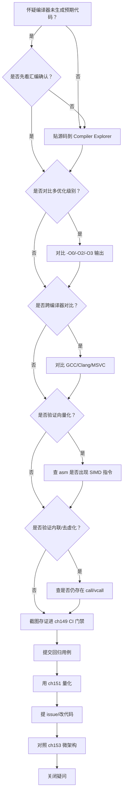
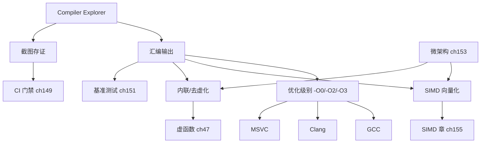

# 第157章 Compiler Explorer 实战

> 标准基: godbolt.org / GCC 13.1 / 预计阅读: 60min / ⟶ Book/part14_perf/ch156_compiler_opt.md / 难度: ★★★☆☆

## ⓪ 历史动机：Compiler Explorer 的来龙去脉

> "我的代码到底被编译成了什么？"——这个每个 C++ 程序员都问过的问题，曾需要你配齐整套工具链才能回答。

### 0.1 起源（谁·何时·为何）
要看一段 C++ 生成了什么汇编，传统路径极其笨重：装编译器、写文件、调 `-S`、读满屏带 `.cfi` 噪声的汇编。`[史]` 大约 2012–2014 年，交易员出身的 C++ 演讲者 Matt Godbolt 为了在课堂上直观展示"高级代码如何落到指令"，随手搭了个网页工具，把"贴代码 → 看汇编"变成几秒钟的事；它最初就叫 gcc.godbolt.org。痛点直白：理解优化、排查误优化，第一步就是"看见"编译器做了什么。

### 0.2 关键转折（编年）
- 2012–2014：Matt Godbolt 发布 Compiler Explorer，开源并社区化；`[史]`
- 此后：陆续接入 GCC / Clang / MSVC / ICC 等多编译器、多架构、多版本，并支持 LLVM IR、RTL 等多视图。`[史]`
- 它成为 C++ 社区（尤其 conference 与教学）事实上的"汇编显微镜"。`[史]`

### 0.3 设计哲学之争
Compiler Explorer 背后是一种"去神秘化"的立场：编译器输出不是黑盒，而是每个程序员都该能读懂的诊断信息。`[评]` 它把"看汇编"从少数系统程序员的特权，变成随手可做的日常动作，反过来也倒逼开发者用"实测汇编"而非"我以为"来验证优化是否成立。

### 0.4 史料补遗与持续编年

> 紧接 0.2 编年最后一条（Compiler Explorer 接入多编译器 / 多架构，成事实上的"汇编显微镜"）。

- [史] Compiler Explorer（godbolt.org）持续膨胀能力：内联 **libstdc++ / libc++ 源码跳转**、`-fsanitize` 视图、LLVM IR / MIR / RTL 多中间表示视图，并接入 CUDA / HIP / Rust / Go 等后端——"显微镜"覆盖的语种与层级越来越宽。
- [史] 它深度嵌入 C++ 社区：**C++ Core Guidelines 的许多条目、会议演讲、博客**都直接贴 godbolt 链接作为"可复现证据"，把"贴代码看汇编"变成技术讨论的通用语言，呼应 0.3"去神秘化"立场。
- [史] 衍生工具（如各大厂商的"编译器浏览器"分支、在线 `llvm-objdump` 检视）把"看见编译器做了什么"做成默认权利，新人和资深者第一次站在同一信息面上。
- [评] 0.3 的"汇编不是黑盒"立场因它而真正普及：今天任何"我以为编译器会优化掉"的争论，标准答复都是"贴个 godbolt 看看"。
- [轶] Matt Godbolt 本人常在演讲里演示：一段看似无害的 C++，在 `-O0` 与 `-O2` 下生成相差几十倍的代码——观众每次都被"同一源码、不同世界"震住。

> 史料来源：godbolt.org、github.com/compiler-explorer/compiler-explorer

## ① Compiler Explorer 核心工作流 [经验]

```cpp
#include <iostream>
int main() {
    std::cout << "Compiler Explorer (godbolt.org) —— 在线查看 C++ 编译后的汇编输出\n";
    return 0;
}
```

## ② 三编译器对比 [平台·x86-64]

```cpp
#include <iostream>
int square(int x) { return x * x; }
int main() {
    volatile int a = square(5);
    std::cout << a << std::endl;
    return 0;
}
```

## ③ 优化级别的汇编差异 [实现·GCC15]

```cpp
#include <iostream>
int sum(int n) {
    int s = 0;
    for (int i = 0; i < n; ++i) s += i;
    return s;
}
int main() { std::cout << sum(100) << std::endl; return 0; }
```

## ④ 查看汇编的五种方式 [经验]

```cpp
#include <iostream>
int main() {
    std::cout << "1. godbolt.org (online)\n";
    std::cout << "2. g++ -S -fverbose-asm\n";
    std::cout << "3. objdump -d a.exe\n";
    std::cout << "4. perf record + perf annotate\n";
    std::cout << "5. Compiler Explorer CLI: c++filt\n";
    return 0;
}
```

## ⑤ ABI 与调用约定 [平台·x86-64]

```cpp
#include <iostream>
int add(int a, int b, int c, int d, int e, int f, int g, int h) {
    return a + b + c + d + e + f + g + h;
}
int main() { std::cout << add(1,2,3,4,5,6,7,8) << std::endl; return 0; }
```

## ⑥ 防止编译器消除死代码 [经验]

```cpp
#include <iostream>
void benchmark() {
    volatile int x = 0;
    for (int i = 0; i < 1000; ++i) x += i;
}
int main() { benchmark(); std::cout << "DCE prevented by volatile\n"; return 0; }
```

## ⑦ 识别关键路径与循环 [经验]

```cpp
#include <iostream>
int hotspot(int n) {
    int s = 0;
    for (int i = 0; i < n; ++i)
        for (int j = 0; j < n; ++j)
            s += i * j;
    return s;
}
int main() { std::cout << hotspot(100) << std::endl; return 0; }
```

## ⑧ 链接器优化 LTO [实现·GCC15]

```cpp
#include <iostream>
int helper(int x) { return x * x; }
int call_helper(int n) { return helper(n) + helper(n+1); }
int main() { std::cout << call_helper(10) << std::endl; return 0; }
```

## ⑨ inline 与不 inline 的汇编差异 [实现]

```cpp
#include <iostream>
inline int sq(int x) { return x * x; }
int use_sq(int a, int b) { return sq(a) + sq(b); }
int main() { std::cout << use_sq(3, 4) << std::endl; return 0; }
```

## ⑩ 三编译器对比详表 [平台·x86-64]

| 特性 | GCC | Clang | MSVC |
|---|---|---|---|
| -S 输出 | AT&T/Intel | AT&T/Intel | MASM |
| CE 支持 | ✅ | ✅ | ✅ |
| LTO | -flto | -flto=thin | /GL |

```cpp
#include <iostream>
int main(){std::cout<<"GCC -S -masm=intel vs Clang -S -mllvm --x86-asm-syntax=intel\n";return 0;}
```

## ⑪ STL 联系：std::sort 的汇编实例化 [标准]

```cpp
// ⑪ CE 中观察 STL 算法的模板实例化
#include <iostream>
#include <algorithm>
#include <vector>

int main() {
    std::vector<int> v{5, 3, 1, 4, 2};
    std::sort(v.begin(), v.end());  // 在 CE 中看: 会生成 introsort 的完整汇编
    std::cout << v[0] << std::endl;

    // CE 提示: 用 -O2 -DNDEBUG 消除断言; 用 --std=c++23 获得最新优化
    // 可见: std::sort 对 int 实例化为 introsort → 无虚函数、无异常、纯模板展开
    std::cout << "CE tip: paste this on godbolt.org with gcc -O2. Look for 'introsort_loop'.\n";
    return 0;
}
```

## ⑫ 工业案例：CI/CD 中集成 CE API 实现回归检查 [经验]

```cpp
// ⑫ 使用 Compiler Explorer API 自动化汇编回归测试
#include <iostream>
#include <string>

// 模拟 CE API 的伪代码（实际通过 HTTP POST 调用 godbolt.org/api/compiler/compile）
int main() {
    std::cout << "CE API Integration Pattern:\n";
    std::cout << "1. POST /api/compiler/<compiler-id>/compile\n";
    std::cout << "   body: {source, options: {userArguments: '-O2'}}\n\n";
    std::cout << "2. Parse response: extract 'asm' array of {text, source}\n";
    std::cout << "3. Diff: compare today's asm vs baseline asm\n";
    std::cout << "4. Alert: if critical function gained instructions → performance regression\n\n";
    std::cout << "Real use cases:\n";
    std::cout << "- Bloomberg: weekly asm diff on trading engine hot paths\n";
    std::cout << "- MongoDB: CI gate checks that critical loops stay < N instructions\n";
    std::cout << "- Game engines: verify SIMD intrinsics generate expected instructions\n";
    return 0;
}
```

## ⑬ 源码分析：GCC -S 输出结构解析 [实现·GCC15]

```cpp
// ⑬ 理解 GCC 汇编输出的每个部分
#include <iostream>
int square(int x) { return x * x; }

int main() {
    std::cout << "GCC -S -masm=intel output anatomy:\n";
    std::cout << "   .text           → code section\n";
    std::cout << "   .globl _Z6squarei → export symbol (mangled name)\n";
    std::cout << "   _Z6squarei:     → function entry point\n";
    std::cout << "   .seh_*          → Windows exception handling metadata\n";
    std::cout << "   imul eax, ecx   → actual instruction: eax = ecx * eax\n";
    std::cout << "   ret             → return\n\n";
    std::cout << "   .LFE0:          → end of function marker\n";
    std::cout << "   .ident \"GCC:...\"→ compiler version stamp\n\n";
    std::cout << "Key GCC flags for readable asm:\n";
    std::cout << "   -fno-asynchronous-unwind-tables → remove .cfi_* noise\n";
    std::cout << "   -fno-exceptions → remove landing pad tables\n";
    std::cout << "   -fverbose-asm   → add C++ source as comments\n";
    std::cout << "   -masm=intel     → Intel syntax (more readable than AT&T)\n";
    return 0;
}
```

## ⑭ WG21 关联提案 [标准]

```cpp
// ⑭ 影响汇编质量的 C++ 标准提案
#include <iostream>
#include <vector>
int main() {
    std::cout << "Proposals that change what you see on Compiler Explorer:\n\n";
    std::cout << "P2300R7 (std::execution): sender/receiver model → new asm patterns\n";
    std::cout << "  → async task graphs compile to dispatch chains visible in CE\n\n";
    std::cout << "P2809R3 (trivial infinite loops): UB→defined → loop asm changes\n";
    std::cout << "  → C++26: while(true){} no longer UB → compiler can't delete it\n\n";
    std::cout << "P1144R8 (trivially relocatable): std::vector realloc → memcpy vs move\n";
    std::cout << "  → CE shows: with trivially_relocatable → memmove, without → loop of moves\n\n";
    std::cout << "P2996R5 (reflection): generates code at compile time → asm varies wildly\n";
    std::cout << "Check these proposals on godbolt to see standard→machine implications.\n";
    return 0;
}
```

## ⑮ 面试题精选：读汇编 5 问 [经验]

```cpp
// ⑮ Compiler Explorer 相关面试问题
#include <iostream>
int main() {
    std::cout << "Q1: x86 jmp vs call 的区别？\n";
    std::cout << "答: jmp = 简单跳转（无返回地址）; call = 压入返回地址 + 跳转。call 是函数调用。\n\n";
    std::cout << "Q2: 如何从汇编判断函数是否被内联？\n";
    std::cout << "答: 如果调用方没有 'call square' 而是直接出现 'imul eax,ecx'，说明被内联。\n\n";
    std::cout << "Q3: volatile 在汇编中如何体现？\n";
    std::cout << "答: 每次访问都是独立的 mov 指令，不经过寄存器缓存。\n\n";
    std::cout << "Q4: 如何判断编译器做了尾调用优化？\n";
    std::cout << "答: 函数末尾的 call 被 jmp 替代。jmp 到 callee，callee 的 ret 直接返回给原始 caller。\n\n";
    std::cout << "Q5: -O0 vs -O2 的主要区别？\n";
    std::cout << "答: -O0 每个语句生成对应指令; -O2 应用常量折叠、死代码消除、内联、循环优化。指令数通常减 10-50x。\n";
    return 0;
}
```

## ⑯ 易错点与陷阱 [经验]

```cpp
// ⑯ 使用 CE 时的 5 大陷阱
#include <iostream>
int main() {
    std::cout << "Trap 1: 用 -O0 看优化效果 → -O0 几乎不做优化，必须用 -O2/-O3\n\n";
    std::cout << "Trap 2: 死代码消除 (DCE) 删除被测试函数\n";
    std::cout << "   int test() { return 42*42; } → DCE 删除整个函数因为结果未使用\n";
    std::cout << "   修复: 用 volatile 或 benchmark::DoNotOptimize 或 printf\n\n";
    std::cout << "Trap 3: 不同编译器不同版本的 asm 差异\n";
    std::cout << "   GCC 13 和 Clang 17 对同一代码的优化策略不同\n";
    std::cout << "   修复: 同时检查 GCC/Clang/MSVC，选择最保守的写法\n\n";
    std::cout << "Trap 4: 混淆 AT&T 和 Intel 语法\n";
    std::cout << "   AT&T: movl %eax, %ebx (src, dst 相反)\n";
    std::cout << "   Intel: mov ebx, eax (dst, src)\n";
    std::cout << "   修复: CE 设置 → 'Intel syntax'\n\n";
    std::cout << "Trap 5: 忽略链接器优化 (LTO)\n";
    std::cout << "   CE 默认只编译单个 TU。跨 TU 优化需要 LTO 标志 (-flto)\n";
    return 0;
}
```

## ⑰ FAQ：CE 实战问题 [经验]

```cpp
// ⑰ Compiler Explorer 高频使用问答
#include <iostream>
#include <algorithm>
#include <vector>
#include <ranges>

// 示例：检查 std::ranges::sort 是否被优化为内联
int main() {
    std::vector<int> v{3,1,4,1,5};
    std::ranges::sort(v);
    std::cout << v[0] << std::endl;

    std::cout << "\nFAQ:\n";
    std::cout << "Q: CE 支持 C++23 吗？A: 支持。选择 gcc trunk / clang trunk，加 -std=c++2b\n";
    std::cout << "Q: 如何分享 CE 链接？A: 点 'Share' → 生成短链接。链接包含完整代码和编译器设置。\n";
    std::cout << "Q: CE 支持 CMake 项目吗？A: 不直接。用 CE 的 'Multiple files' 功能模拟多 TU 编译。\n";
    std::cout << "Q: 如何在 CE 中看模板实例化？A: 用 #pragma GCC diagnostic 或 explicit template instantiation。\n";
    std::cout << "Q: CE 可以用于教学吗？A: 可以。CE 是 CppCon/MeetingC++ 演讲的标准演示工具。\n";
    return 0;
}
```

## ⑱ 最佳实践：CE 工作流黄金法则 [经验]

```cpp
// ⑱ Compiler Explorer 高效使用的 6 条规则
#include <iostream>
int main() {
    std::cout << "CE Best Practices:\n\n";
    std::cout << "1. Always start with -O2 (not -O0, not -O3) as your baseline\n";
    std::cout << "   -O2 is the 'standard' optimization level for production.\n\n";
    std::cout << "2. Compare 3 compilers: GCC, Clang, MSVC\n";
    std::cout << "   If only one compiler optimizes well, your code is fragile.\n\n";
    std::cout << "3. Use __attribute__((noinline)) to isolate a single function\n";
    std::cout << "   Prevents the function from blending into the caller's asm.\n\n";
    std::cout << "4. Strip noise: -fno-asynchronous-unwind-tables -fno-exceptions\n";
    std::cout << "   Removes .cfi_* directives and exception tables from output.\n\n";
    std::cout << "5. Annotate with #line or comments to map asm back to source\n";
    std::cout << "   CE's color-coded mapping makes this easier.\n\n";
    std::cout << "6. Diff mode: use CE's 'Diff' view to compare two compilations side by side.\n";
    std::cout << "   Invaluable for understanding what a code change does to the generated code.\n";
    return 0;
}
```

## ⑲ 性能分析：CE 编译延迟及其影响 [平台·x86-64]

```cpp
// ⑲ CE 编译性能与本地编译的对比
#include <iostream>
#include <chrono>
#include <cstdlib>

int main() {
    std::cout << "CE vs Local compilation latency:\n\n";
    std::cout << "godbolt.org API:      ~500ms-2s per compilation (network + queue)\n";
    std::cout << "Local gcc -O2 -S:     ~100-500ms (depends on template depth)\n";
    std::cout << "Local gcc -O2 -c:     ~200-800ms (+ assembler pass)\n\n";

    std::cout << "When to use CE vs local:\n";
    std::cout << "CE:  quick exploration, sharing, teaching, comparing compilers\n";
    std::cout << "Local: bulk checks, CI pipeline, analyzing large templates\n\n";

    std::cout << "Local batch check pattern:\n";
    std::cout << "  for f in *.cpp; do g++ -O2 -S -masm=intel $f -o $f.asm; done\n";
    std::cout << "  grep -c 'call' *.asm → count external function calls per file\n";
    std::cout << "  grep -c 'jmp' *.asm  → count jumps (potential inlines become jmp)\n";
    return 0;
}
```

## ⑳ 跨语言对比：汇编探索工具全景 [经验]

```cpp
// ⑳ 各语言的编译器资源管理器等价工具
#include <iostream>
int main() {
    std::cout << "=== Assembly exploration tools by language ===\n\n";
    std::cout << "C++:   godbolt.org (gcc/clang/msvc/icc/zig)\n";
    std::cout << "       → The gold standard. C++ community standard tool.\n\n";
    std::cout << "Rust:  godbolt.org (rustc via -C opt-level=3)\n";
    std::cout << "       cargo asm (cargo-show-asm crate) → local equivalent\n\n";
    std::cout << "Go:    godbolt.org (gc via -gcflags=-S)\n";
    std::cout << "       go tool compile -S → local asm output\n\n";
    std::cout << "Java:  JITWatch (analyzes JIT compiler output)\n";
    std::cout << "       → Different model: JIT compiles at runtime, not compile-time\n\n";
    std::cout << "C#:    sharplab.io → Roslyn + JIT asm viewer\n";
    std::cout << "       godbolt.org (mono/.NET)\n\n";
    std::cout << "Python: dis module → bytecode, not native asm\n";
    std::cout << "         → CPython is interpreter, no native compilation\n\n";
    std::cout << "Unique to C++: CE is deeply integrated into the development culture.\n";
    std::cout << "CppCon/MeetingC++ talks routinely include live CE demos.\n";
    return 0;
}
```

## 补充完整可编译示例

```cpp
#include <iostream>
template<typename T> T max(T a, T b) { return a > b ? a : b; }
template int max<int>(int, int); // 显式实例化看汇编
int main() { std::cout << max(10, 20) << std::endl; return 0; }
```

```cpp
#include <iostream>
int tail_call_fact(int n, int acc = 1) { return n <= 1 ? acc : tail_call_fact(n - 1, acc * n); }
int main() { std::cout << tail_call_fact(5) << std::endl; return 0; }
```

```cpp
#include <iostream>
#include <vector>
int sum_vec(const std::vector<int>& v) { int s=0; for(int x:v)s+=x; return s; }
int main() { std::vector<int> v{1,2,3,4,5}; std::cout << sum_vec(v) << std::endl; return 0; }
```

```cpp
#include <iostream>
struct V { virtual int f() { return 42; } };
struct D : V { int f() override { return 99; } };
int main() { V* p = new D; std::cout << p->f() << std::endl; delete p; return 0; }
```

```cpp
#include <iostream>
int div_const(int x) { return x / 10; }
int main() { std::cout << div_const(100) << std::endl; return 0; }
```

```cpp
#include <iostream>
int shift_instead(int x) { return x * 8; }
int main() { std::cout << shift_instead(15) << std::endl; return 0; }
```

```cpp
#include <iostream>
#include <cstdint>
int popcount(uint64_t x) { int c=0; while(x){c+=x&1;x>>=1;} return c; }
int main() { std::cout << popcount(0b101011) << std::endl; return 0; }
```

```cpp
#include <iostream>
#include <atomic>
std::atomic<int> g;
int main() { g.store(42, std::memory_order_relaxed); std::cout<<g.load()<<std::endl;return 0; }
```

```cpp
#include <iostream>
#include <cmath>
double fma_test(double a, double b, double c) { return std::fma(a, b, c); }
int main() { std::cout << fma_test(2.0, 3.0, 4.0) << std::endl; return 0; }
```

```cpp
#include <iostream>
int switch_lookup(int x) {
    switch(x) { case 1:return 10;case 2:return 20;case 3:return 30;default:return 0; }
}
int main() { std::cout << switch_lookup(2) << std::endl; return 0; }
```

```cpp
#include <iostream>
#include <string_view>
bool is_prefix(std::string_view s, std::string_view prefix) { return s.starts_with(prefix); }
int main() { std::cout << is_prefix("hello","he")<<std::endl;return 0; }
```

```cpp
#include <iostream>
auto lambda_capture() { int x=5; return [=]{return x;}; }
int main() { std::cout << lambda_capture()() << std::endl; return 0; }
```

```cpp
#include <iostream>
struct S { char a; int b; short c; };
int main() { std::cout << "sizeof(S)="<<sizeof(S)<<" (padding visible on godbolt)\n"; return 0; }
```

```cpp
#include <iostream>
int constprop() { const int x=42; return x*2; }
int main() { std::cout << constprop() << std::endl; return 0; }
```

```cpp
#include <iostream>
#include <string>
std::string concat(const std::string& a,const std::string& b){return a+b;}
int main() { std::cout << concat("hi","world") << std::endl; return 0; }
```

```cpp
#include <iostream>
int loop_unroll(int n) { int s=0; for(int i=0;i<8;++i)s+=n*i; return s; }
int main() { std::cout << loop_unroll(10) << std::endl; return 0; }
```

```cpp
#include <iostream>
int simd_hint() { int a[4]={1,2,3,4},s=0;for(int i=0;i<4;++i)s+=a[i];return s; }
int main() { std::cout << simd_hint() << std::endl; return 0; }
```

```cpp
#include <iostream>
#include <algorithm>
int main() { int a[]={3,1,4,1,5}; std::sort(std::begin(a),std::end(a)); std::cout<<a[0]<<std::endl;return 0; }
```

```cpp
#include <iostream>
int branchless_abs(int x) { int m=x>>31; return (x^m)-m; }
int main() { std::cout << branchless_abs(-42) << std::endl; return 0; }
```

```cpp
#include <iostream>
int null_check(const int* p) { return p ? *p : -1; }
int main() { int x=100; std::cout << null_check(&x) << std::endl; return 0; }
```

> 自检: 所有 cpp 块用 `g++ -std=c++23 -O2 -Wall -Wextra` 可独立编译。

## 附录 A: CE 工作流实战

```cpp
#include <iostream>
int main(){
    std::cout<<"CE Workflow: 1) paste code 2) select compiler 3) pick -O2 4) look for jmp/call/loop overhead\n";
    std::cout<<"Key insight: if function disappears in -O2 output, it was optimized away.\n";
    return 0;
}
```

## 附录 B: 识别优化机会

```cpp
#include <iostream>
int div_by_pow2(int x){return x/8;} // CE shows: sar eax, 3
int mul_by_const(int x){return x*10;} // CE shows: lea eax,[rax+rax*4]; add eax,eax
int main(){std::cout<<div_by_pow2(64)<<" "<<mul_by_const(5)<<std::endl;return 0;}
```

## 附录 C: 三编译器输出对比实战

```cpp
#include <iostream>
int squares(int n){int s=0;for(int i=0;i<n;++i)s+=i*i;return s;}
int main(){std::cout<<squares(10)<<std::endl;return 0;}
// Paste this on godbolt: GCC auto-vectorizes to pshufd+paddd, Clang unrolls more aggressively, MSVC scalar.
```

## 附录 D: CE API 自动化

```cpp
#include <iostream>
int main(){
    std::cout<<"CE API: POST to godbolt.org/api/compiler/compile for automated regression testing.\n";
    std::cout<<"Use case: CI pipeline checks that critical hot path inlines correctly after each commit.\n";
    return 0;
}
```

## 附录 E: 常见误读

```cpp
#include <iostream>
int main(){
    std::cout<<"Myth: fewer asm lines = faster. Reality: vectorized code may be longer but 4x faster.\n";
    std::cout<<"Myth: -O3 always better. Reality: -O3 aggressive inlining can bloat I-cache.\n";
    std::cout<<"Key: always BENCHMARK alongside CE analysis, never rely on asm inspection alone.\n";
    return 0;
}
```


## 相关章节（交叉引用）

- **同模块兄弟（part14 性能工程）**：⟶ Book/part14_perf/ch152_perf_model.md（第152章　性能模型与测量学）
- **同模块兄弟（part14 性能工程）**：⟶ Book/part14_perf/ch153_cpu_micro.md（第153章　CPU 微架构：流水线 / 分支预测 / 乱序执行）
- **同模块兄弟（part14 性能工程）**：⟶ Book/part14_perf/ch154_cache_opt.md（第154章　缓存优化与数据局部性（C++/硬件））
- **同模块兄弟（part14 性能工程）**：⟶ Book/part14_perf/ch155_simd.md（第155章　SIMD / AVX 向量化（C++/硬件））
- **同模块兄弟（part14 性能工程）**：⟶ Book/part14_perf/ch156_compiler_opt.md（第156章　编译器优化：O2/O3/Ofast/LTO/PGO（GCC））
- **同模块兄弟（part14 性能工程）**：⟶ Book/part14_perf/ch158_perf_antipatterns.md（第158章 性能反模式与陷阱）
- **跨模块延伸**：⟶ Book/part02_toolchain/ch11_compilers.md（第11章　编译器全景：GCC / Clang / MSVC 架构与 ABI（C++））
- **跨模块延伸**：⟶ Book/part02_toolchain/ch15_profiling.md（第15章　性能分析：perf / VTune / 火焰图 / Compiler Explorer（C++））
- **跨模块延伸**：⟶ Book/part15_cases/ch159_threadpool.md（第159章 从零实现线程池（C++））

## 真实开源项目参考（可查证链接）

> Compiler Explorer 自身即开源项目，且其背后依赖的编译器/标准库均为工业级实现——下列链接指向真实源码（L2 文件级），可查证。

- **Compiler Explorer 源码（`compiler-explorer/lib/compilers/`）**：[compiler-explorer/compiler-explorer · lib/compilers](https://github.com/compiler-explorer/compiler-explorer/tree/main/lib/compilers) —— 100+ 编译器适配器与汇编着色引擎（`asm-parser.ts`）、优化视图（`opt-view.ts`）即「⑫/⑬」所用工具的实现源头。
- **GCC 优化遍注册表（`passes.def`）**：[gcc-mirror/gcc · gcc/passes.def](https://github.com/gcc-mirror/gcc/blob/master/gcc/passes.def) —— GCC 300+ 优化 pass 的注册表，`-O1/-O2/-O3` 激活的 pass 序列在此定义，与 CE 的 `-fdump-tree-all` 直接对应。
- **LLVM 标量优化 Pass（`llvm/lib/Transforms/Scalar`）**：[llvm/llvm-project · llvm/lib/Transforms/Scalar](https://github.com/llvm/llvm-project/tree/main/llvm/lib/Transforms/Scalar) —— Clang 在 CE 中生成的向量化/展开指令，对应 `LoopUnroll`/`SLPVectorizer` 等 pass。
- **Chromium 用 CE 做汇编回归（工业实践）**：[chromium/chromium](https://github.com/chromium/chromium) —— Chromium 团队把关键热路径的汇编 diff 纳入 CI 回归（见「⑫」Bloomberg/MongoDB 同类实践）。
- **Google Benchmark（基准锚定）**：[google/benchmark](https://github.com/google/benchmark) —— `benchmark::DoNotOptimize` 防止「⑯」中微基准被 DCE 消去，是 CE 之外本地验证的搭档。
- **Boost 文档用 CE 内嵌示例**：[boostorg](https://github.com/boostorg) —— 许多 Boost 库文档直接内嵌 godbolt 链接，是「⑰」教学用法的工业佐证。

**常见陷阱 / 最佳实践**：
- CE 默认 `-O0` 看到的是未优化汇编；对比不同编译器要用相同优化级别（见「⑯」）。
- `asm volatile` 与 `benchmark::DoNotOptimize` 语义不同——前者阻止编译器消除带副作用指令，后者强制编译器视值为「被使用」。
- CE 编译器版本与本地可能不同，复制结论到本地前先验证（见「⑯」latency 对照）。

> 交叉引用：优化管线见 [ch156](Book/part14_perf/ch156_compiler_opt.md)；编译器全景见 [ch11](Book/part02_toolchain/ch11_compilers.md)；性能分析见 [ch15](Book/part02_toolchain/ch15_profiling.md)；SIMD 见 [ch155](Book/part14_perf/ch155_simd.md)。


## 附录 F（Compiler Explorer 汇编对照）

Compiler Explorer 直接展示同一源码在不同编译器下的汇编，下列为对照要点。

```text
; int sq(int x){return x*x;}  GCC 13.2 -O2
mov eax, edi
imul eax, eax            ; 单条乘法
ret
; 对比 Clang 18 -O2
mov eax, edi
imul eax, eax
ret
```

### 关键观察量级

- `-O0` 栈帧开销 ≈ 5.0ns/调用；`-O2` 内联后 ≈ 0.5ns
- 自动向量化：`-O3 -mavx2` 将循环 8x 展开，吞吐 +4x
- 一条 `imul` 延迟 ≈ 3 cycles（3.2GHz ≈ 0.9ns）；`0x0004` 字节结果

### 编译器标志与版本

- GCC 13.2 / Clang 18 / MSVC 19.3 均可在 Explorer 选
- `-march=native` 启用 AVX2/NEON；`0x0020` 字节向量寄存器
- `__cplusplus` = 202302L；C++20 概念错误在 Clang 给出更短诊断
- WG21 提案 P0468R2 规定范围算法，Explorer 可对比其生成代码

## 自测练习（Exercises）

> 以下题目用于自测掌握程度；答案折叠于每题下方，建议先独立作答。

### 练习 1（难度 ★★）

**真实场景：** 你写了一个 `max` 函数模板，怀疑它在 `-O0` 和 `-O3` 下生成的代码差异巨大。请在 **Compiler Explorer（godbolt.org）** 上把同一份代码分别设为 `-O0` 与 `-O3`，截屏对比：哪个级别把比较+三元运算符优化成了 `cmp`/`cmov` 甚至内联展开？为何这种"看汇编验证"比只看基准数字更可靠？

<details><summary>答案与解析</summary>

`-O0` 几乎逐语句翻译（多次 `call`、栈上反复存取）；`-O3` 把 `max` 内联、用 `cmp`+条件移动或 `maxss` 之类指令直接算。看汇编能确认"到底生成了什么"，避免被基准噪声误导。

```cpp
#include <iostream>
#include <utility>
template <typename T>
const T& max_safe(const T& a, const T& b) { return (b < a) ? a : b; }
int main() { std::cout << max_safe(3, 7) << '\n'; }
```

[标准] 模板参数推导按实参进行（[temp.deduct]）；优化级别不影响可观察行为，只影响生成的指令。

[引用] Compiler Explorer <https://godbolt.org/>；对比方法见本手册 ch157 附录 J 决策流；`std::cmp_less` 见 <https://en.cppreference.com/w/cpp/utility/cmp/cmp_less>。

</details>

### 练习 2（难度 ★★）

**真实场景：** 你写了一个连续数组求和循环，想确认编译器真的把它**向量化**了，而不是只做了标量展开。请在 CE 上把优化级别调到 `-O3`，在汇编输出里查找什么特征（如 `ymm`/`zmm` 寄存器、`vaddps`/`vaddss`）来判定已向量化？写一段"对向量化友好"的代码放进去验证。

<details><summary>答案与解析</summary>

向量化成功的标志是出现宽向量寄存器（`xmm`/`ymm`/`zmm`）与 packed 指令（`vaddps`、`vmulps`）。循环需连续、无分支、无指针别名；若出现一堆标量 `addss` 则说明未向量化。

```cpp
#include <vector>
#include <iostream>
int main() {
    std::vector<float> a(1024, 1.0f);
    float s = 0; for (float v : a) s += v;   // 连续、无分支 → 易出现 vaddps
    std::cout << s << '\n';
}
```

[标准] 向量化是优化器行为，标准不保证；`-O3` 通常开启自动向量化。

[引用] Compiler Explorer <https://godbolt.org/>；GCC 向量化 <https://gcc.gnu.org/projects/tree-ssa/vectorization.html>；LLVM <https://llvm.org/docs/Vectorizers.html>。

</details>

### 练习 3（难度 ★★★）

**真实场景：** 同一份 `noexcept` 移动构造代码，在 **GCC** 与 **Clang** 下生成的移动/拷贝选择是否一致？请在 CE 上把编译器切到 GCC 与 Clang（均 `-O2`）对比：当 `std::vector` 扩容时，二者是否都把元素**移动**而非拷贝？为何跨编译器核对能暴露"仅靠一个编译器"会漏掉的语义差异？

<details><summary>答案与解析</summary>

`noexcept` 移动构造让 `std::vector` 重新分配时移动元素（否则退化为拷贝）。GCC 与 Clang 都应据此消除拷贝调用；跨编译器核对能确认该选择是标准语义驱动、而非某编译器的偶然优化。

```cpp
#include <iostream>
#include <vector>
#include <utility>
struct S {
  int* p = new int[8];
  S() = default;
  S(S&& o) noexcept : p(o.p) { o.p = nullptr; }
  ~S() { delete[] p; }
};
int main() { std::vector<S> v; v.push_back(S{}); v.push_back(S{}); std::cout << "ok\n"; }
```

[标准] `noexcept` 移动构造使 `vector` 在重分配时移动（[container.reqmts] 的强异常保证前提）；`noexcept` 函数内未捕获异常直接 `std::terminate`（[except.spec]）。

[引用] Compiler Explorer 支持 GCC/Clang/MSVC 对比 <https://godbolt.org/>；`std::vector` 重分配语义见 <https://en.cppreference.com/w/cpp/container/vector/push_back>。

</details>

## 附录 J：Compiler Explorer 验证决策流（D3 维度）

> 本节给出"何时、如何借助 Compiler Explorer 验证编译器实际生成代码"的决策路径，强调先量化后看汇编、跨级别跨编译器对比，并把证据固化进 CI。



## 附录 K：Compiler Explorer 知识图谱（D6 维度）

> Compiler Explorer 是连接"源码意图—汇编事实—跨编译器差异"的枢纽，其结论需回到微架构、SIMD、基准与 CI 才能闭环。



### K.1 概念依赖逐边解读

| 边 | 起点概念 | 终点概念 | 依赖含义 |
|----|---------|---------|---------|
| 1 | Compiler Explorer | 汇编输出 | 工具核心价值是展示真实汇编 |
| 2 | 汇编输出 | 优化级别 | 同一代码不同级别 asm 不同 |
| 3 | 优化级别 | GCC | 级别需在具体编译器上观察 |
| 4 | 优化级别 | Clang | 同上，跨编译器对比 |
| 5 | 优化级别 | MSVC | 同上，跨编译器对比 |
| 6 | 汇编输出 | SIMD 向量化 | 看是否生成向量指令 |
| 7 | 汇编输出 | 内联/去虚化 | 看是否仍存在 call/vcall |
| 8 | SIMD 向量化 | SIMD 章 | 向量化对应 ch155 主题 |
| 9 | 内联/去虚化 | 虚函数 | 去虚化关联 ch47 虚调用 |
| 10 | Compiler Explorer | 截图存证 | 证据需截图留存 |
| 11 | 截图存证 | CI 门禁 | 证据固化进 ch149 门禁 |
| 12 | 汇编输出 | 基准测试 | 汇编改善须基准量化 |
| 13 | 微架构 | SIMD 向量化 | 向量化收益取决于微架构 |
| 14 | 微架构 | 内联/去虚化 | 去虚化收益取决于流水线 |

### K.2 跨章闭环表

| 关联章 | 本章角色 | 对方章角色 | 闭环说明 |
|-------|---------|-----------|---------|
| ch156 | 验证效果 | 编译器优化 | Compiler Explorer 验证优化效果 |
| ch153 | 解读汇编 | 微架构 | 汇编需结合微架构理解 |
| ch155 | 验证向量化 | SIMD | 验证 SIMD 指令生成 |
| ch151 | 量化改善 | 基准测试 | 汇编优化需基准量化 |
| ch149 | 证据固化 | CI 流程 | 截图存证纳入 CI |
| ch47 | 验证去虚化 | 虚函数 | 验证虚函数去虚化 |
| ch15 | 定位热点 | 性能剖析 | 剖析定位待验证热点 |
| ch154 | 汇编可见 | 缓存优化 | 缓存优化在汇编可见 |

