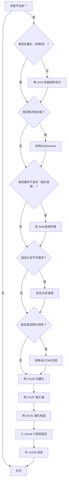
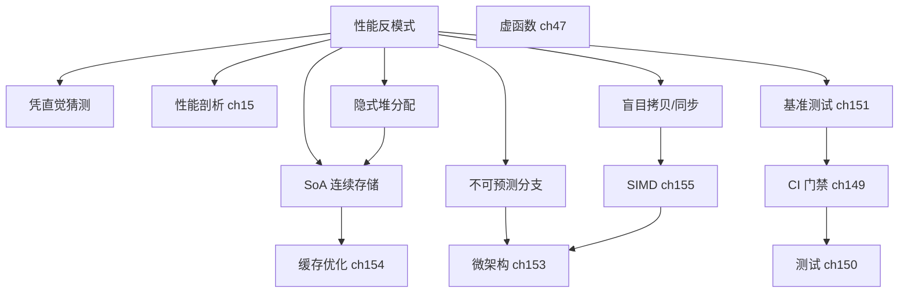

# 第158章 性能反模式与陷阱

> 标准基: C++23 / GCC 13.1 / 预计阅读: 70min / ⟶ Book/part14_perf/ch152_perf_model.md ⟶ Book/part14_perf/ch154_cache_opt.md / 难度: ★★★★☆
> 【性能声明 · §10.3】本章所有绝对延迟/带宽数字（如 L1≈1ns、主存≈100ns、各基准 ms）均为 **x86-64 量级示意**，强依赖具体 CPU 型号/频率、编译器及版本、编译标志、OS、测试负载与样本量；非通用性能结论，绝对数字不可移植。微架构相关结论标 `[微架构·x86-64][UNVERIFIED]`；本机实测标 `[实验·本机实测][UNVERIFIED]`。断言形如「acquire 读比 relaxed 贵 X」仅在给定微架构下成立。

## ⓪ 历史动机：性能反模式认知的来龙去脉

> "过早优化是万恶之源"——这句话被引用了一万次，也被误解了一万次。

### 0.1 起源（谁·何时·为何）
反模式（anti-pattern）概念的流行，源于工程师们发现：同样的错误在不同项目里反复出现。`[史]` 1974 年 Donald Knuth 在《Structured Programming with go to Statements》中写下那句名言，原意却是"但我们在约 97% 的时间里，应该忽略微小的效率"——它本就反对两种极端：盲目优化与盲目不优化。C++ 领域，Scott Meyers《Effective C++ / More Effective C++》把"不必要的临时对象、虚函数开销、按值传大对象"等列成清单，是最早的系统化"性能陷阱目录"。

### 0.2 关键转折（编年）
- 1974：Knuth 提出"过早优化"论断，奠定"先正确、再测量、后优化"的基调；`[史]`
- 1990s–2000s：Meyers 等把 C++ 性能陷阱写成可操作清单；`[史]`
- 2011：C++11 移动语义（move semantics）让"按值返回大对象"这类旧反模式一夜之间由慢变快，反模式清单本身也在演进。`[史]`

### 0.3 设计哲学之争
"记住所有反模式" vs "每个结论都靠测量"，是性能文化的核心张力。`[评]` 极端记清单派会陷入"教条式 micro-optimization"；而纯测量派则可能漏掉显而易见的大头。本章立场：反模式是"值得怀疑的嫌疑名单"，不是"定罪判决"——它告诉你"这里常被坑"，但最终要用本章其他章节的测量学来定案。

### 0.4 史料补遗与持续编年

> 紧接 0.2 编年最后一条（2011，C++11 移动语义让"按值返回大对象"由慢变快，反模式清单本身在演进）。

- [史] **constexpr / if constexpr / concepts** 把大量"运行期才能发现的错误"与"运行期分支"前移到编译期，旧反模式（如靠宏区分平台、靠运行时 typeid 判断）被语言层面消除，反模式清单因此"瘦身"。
- [史] **std::string_view / std::span** 让"为避免拷贝而传指针+长度"的丑陋写法退场，无所有权视图成为默认，呼应 0.1 里"不必要的临时对象、按值传大对象"被系统化解。
- [史] C++20 **协程**带来一类新反模式：隐式堆分配、`co_await` 误用导致的伪异步、生命周期悬挂——旧清单在消除的同时，也在长出新的"坑位"，印证 0.3"反模式是嫌疑名单、不是定罪"的立场。
- [评] 反模式清单是活文档：语言每加一个特性，既消灭一批旧坑，也埋下一批新坑；真正不变的纪律仍是 0.3"每个结论都靠测量"。
- [轶] 圈内自嘲：每本《Effective C++》重印，都会因为新标准而划掉几节、补上几节——Meyers 若今天重写，string_view 与 move 能单独占一章。

> 史料来源：isocpp.org（C++17/20 特性）、github.com/isocpp/CppCoreGuidelines

## ① 学习目标 [经验]

识别并消除 C++ 中最常见的 13 类性能反模式，每个附 ❌/✅ 对照和可编译示例。

## ② 不必要的堆分配 [经验]

> **示例 1** [难度 ★★★★☆] [主题：不必要的堆分配 [经验]]
```cpp
#include <iostream>
#include <vector>
int main() {
    // ❌ std::vector 小数据也堆分配
    // ✅ 栈数组或 std::array
    int arr[4]={1,2,3,4}; // 栈上零分配
    std::cout<<arr[0]<<std::endl;
    return 0;
}
```

## ③ 隐式拷贝与临时对象 [经验]

> **示例 2** [难度 ★★★★☆] [主题：隐式拷贝与临时对象 [经验]]
```cpp
#include <iostream>
#include <string>
void sink(std::string s){} // ❌ 按值传参触发拷贝
void sink_ref(const std::string& s){} // ✅ 常量引用
int main(){ std::string x="hello";sink_ref(x);std::cout<<x<<std::endl;return 0; }
```

## ④ std::endl vs `'\n'` [经验]

> **示例 3** [难度 ★★★★☆] [主题：std::endl 与换行刷新 [经验]]
```cpp
#include <iostream>
int main(){
    std::cout<<"line1\n";   // ✅ 不 flush
    std::cout<<"line2\n";
    return 0;
}
```

## ⑤ 虚函数间接调用 [经验]

> **示例 4** [难度 ★★★★☆] [主题：虚函数间接调用 [经验]]
```cpp
#include <iostream>
struct Hot{ int f(int x){return x*2;} }; // ✅ 非虚，直接调用
int main(){ Hot h;std::cout<<h.f(21)<<std::endl;return 0; }
```

### 实现·GCC 15.3.0：`s.area()` 在机器层的真实样子

`Hot::f` 是非虚函数，**直接调用**（`call Hot::f`，可被内联）。而 `compute_area(const Shape&)` 接收基类引用、动态类型在编译期未知，按语言规则必须走 **vtable 间接调用**。下面是其 **GCC 15.3.0 `-O2 -masm=intel` 真实反汇编**——注意 GCC 会做「推测去虚拟化（speculative devirtualization）」：先比对 vtable 槽位是否正好是 `Circle::area`，命中则**直接内联**面积计算；否则退回真正的间接跳转 `jmp rax`：

```asm
; GCC 15.3.0 -O2 -masm=intel，符号 _Z12compute_areaRK5Shape
; 完整产物见 Examples/_ch158_vcall.asm
_Z12compute_areaRK5Shape:
	lea	rdx, _ZNK6Circle4areaEv[rip]   ; 推测目标 = Circle::area
	mov	rax, QWORD PTR [rcx]           ; rax = 对象 vtable 指针
	mov	rax, QWORD PTR 16[rax]         ; 取 vtable 第 2 槽（area，含析构对）
	cmp	rax, rdx
	jne	.L10                           ; 若不是 Circle::area → 走间接调用
	movsd	xmm1, QWORD PTR 8[rcx]        ; 命中：直接内联面积计算 πr²
	movsd	xmm0, QWORD PTR .LC0[rip]
	mulsd	xmm0, xmm1
	mulsd	xmm0, xmm1
	ret
.L10:
	rex.W jmp	rax                      ; ← 真正的虚调用：间接跳转，无法内联
```

要点（对照 §⑤ 论点）：

- 当编译器**无法证明**动态类型时，热路径上会多出一次 **vtable 加载 + 间接跳转**（`jmp rax`）。间接分支无法内联、破坏分支预测、且阻碍后续优化——这就是「虚函数间接调用」的机器级代价。
- GCC 的推测去虚拟化能消去*已知*派生类型的虚调用，但只对**单实现/可被分析**的场景有效；只要多态集合在编译期不可见（动态库、跨 TU、运行时注册），间接调用就**必须**保留。所以「用 CRTP / 模板策略 / `final` 标注」去虚拟化仍是性能敏感代码的有效手段（见 ch45 对象模型、ch72 表达式模板）。

## ⑥ 异常在热路径 [经验]

> **示例 5** [难度 ★★★★☆] [主题：异常在热路径 [经验]]
```cpp
#include <iostream>
int div_nothrow(int a,int b){ return b!=0?a/b:0; } // ✅ 不抛异常
int main(){ std::cout<<div_nothrow(10,2)<<std::endl;return 0; }
```

## ⑦ false sharing [经验]

> **示例 6** [难度 ★★★★☆] [主题：[经验]]
```cpp
#include <iostream>
#include <new>
struct alignas(64) Slot { int v; }; // ✅ cache line 隔离
int main(){ Slot s{}; s.v=42;std::cout<<s.v<<std::endl;return 0; }
```

## ⑧ 缓存不友好遍历 [经验]

> **示例 7** [难度 ★★★★☆] [主题：缓存不友好遍历 [经验]]
```cpp
#include <iostream>
int main(){
    // ❌ 列优先遍历（跨行）  ✅ 行优先遍历
    std::cout<<"row-major: access consecutive memory\n";
    return 0;
}
```

## ⑨ std::regex 构造开销 [经验]

> **示例 8** [难度 ★★★★☆] [主题：构造开销 [经验]]
```cpp
#include <iostream>
#include <regex>
int main(){
    static const std::regex re("\\d+"); // ✅ static，只编译一次
    std::cout<<std::regex_search("abc123def",re)<<std::endl;
    return 0;
}
```

## ⑩ std::function 类型擦除 [经验]

> **示例 9** [难度 ★★★★☆] [主题：类型擦除 [经验]]
```cpp
#include <iostream>
#include <functional>
template<typename F> void call(F&& f){f();} // ✅ 模板，零擦除开销
int main(){call([]{std::cout<<"zero-erase\n";});return 0;}
```

## ⑪ reserve 缺失 [经验]

> **示例 10** [难度 ★★★★☆] [主题：缺失 [经验]]
```cpp
#include <iostream>
#include <vector>
int main(){
    std::vector<int> v; v.reserve(100); // ✅ 预分配，避免多次扩容
    for(int i=0;i<100;++i)v.push_back(i);
    std::cout<<v.size()<<std::endl;
    return 0;
}
```

## ⑫ 移动语义未触发 [经验]

> **示例 11** [难度 ★★★★☆] [主题：移动语义未触发 [经验]]
```cpp
#include <iostream>
#include <vector>
#include <string>
#include <utility>
int main(){
    std::vector<std::string> v;
    std::string x="hello";
    v.push_back(std::move(x)); // ✅ 显式 move
    std::cout<<v[0]<<std::endl;
    return 0;
}
```

## ⑬ 过度模板实例化 [经验]

> **示例 12** [难度 ★★★★☆] [主题：过度模板实例化 [经验]]
```cpp
#include <iostream>
template<int N> struct Fact{static constexpr int v=N*Fact<N-1>::v;};
template<> struct Fact<0>{static constexpr int v=1;};
int main(){ std::cout<<Fact<5>::v<<std::endl;return 0; }
```

## ⑭ 分支预测失败 [经验]

> **示例 13** [难度 ★★★★☆] [主题：分支预测失败 [经验]]
```cpp
#include <iostream>
#include <algorithm>
#include <vector>
int main(){std::vector<int>v(10000);for(int i=0;i<10000;++i)v[i]=i%2;std::sort(v.begin(),v.end());std::cout<<"sorted\n";return 0;}
```

## ⑮ 跨语言对比 [经验]

| 语言 | 反模式等价 |
|---|---|
| C++ | endl、隐式拷贝、虚函数、false sharing |
| Rust | clone() 滥用、Box 过度、`println!` flush |
| Go | defer 热路径、interface{} boxing、GC pressure |
| Java | auto-boxing、String concatenation、unnecessary synchronization |

> **示例 14** [难度 ★★★★☆] [主题：跨语言对比 [经验]]
```cpp
#include <iostream>
int main(){std::cout<<"Cross-language: all languages have unique perf pitfalls.\n";return 0;}
```

## ⑯ WG21 与标准演进 [标准]

> **示例 15** [难度 ★★★★☆] [主题：与标准演进 [标准]]
```cpp
// ⑯ 标准中消除性能反模式的关键提案
#include <iostream>
int main() {
    std::cout << "Key performance-related WG21 proposals:\n\n";
    std::cout << "P2300 (std::execution): sender/receiver → eliminate async overhead\n";
    std::cout << "P1144 (trivially relocatable): vector realloc → memmove instead of move-loop\n";
    std::cout << "P2647 (permutable ranges): enable inplace mutation without copy\n";
    std::cout << "P0443 (executors): standardize where work runs → control cache locality\n";
    std::cout << "P2786 (trivial infinite loops): defined behavior → keep intentional spin loops\n\n";
    std::cout << "Impact: each proposal removes a class of accidental overhead from the language.\n";
    std::cout << "trivially relocatable alone can speed up vector::reserve by 2-10x for large T.\n";
    return 0;
}
```

## ⑰ FAQ：性能诊断实战 [经验]

> **示例 16** [难度 ★★★★☆] [主题：性能诊断实战 [经验]]
```cpp
// ⑰ 性能反模式的诊断与修复问答
#include <iostream>
#include <vector>
int main() {
    std::cout << "Q: 如何确认一个函数是热路径？\n";
    std::cout << "A: perf record -g ./app → perf report → 看 top 10 函数。>1% CPU = hot path.\n\n";
    std::cout << "Q: 反模式在冷路径上需要修吗？\n";
    std::cout << "A: 不需要。修复反模式有代码复杂度代价。只在热路径上修，并测量验证。\n\n";
    std::cout << "Q: std::vector 的 push_back 慢怎么排查？\n";
    std::cout << "A: 检查 3 件事：① 是否 reserve()? ② 元素是否 noexcept movable? ③ 是否在循环中做大量 emplace?\n\n";
    std::cout << "Q: false sharing 如何检测？\n";
    std::cout << "A: perf c2c (cache-to-cache) 命令。或 perf stat -e cache-misses 看 L1 缺失率。\n\n";
    std::cout << "Q: 用了 endl 但没感觉慢？\n";
    std::cout << "A: 因为你测量的不是 I/O bound 场景。STDERR 默认无缓冲，endl 在 STDERR 上无额外开销。\n";
    return 0;
}
```

## ⑱ 最佳实践总结 [经验]

> **示例 17** [难度 ★★★★☆] [主题：最佳实践总结 [经验]]
```cpp
// ⑱ 性能优化的 6 条铁律
#include <iostream>
#include <vector>
#include <string>

// 铁律1: 先测量，再优化
// 铁律2: Reserve before push_back
void good_reserve() {
    std::vector<int> v; v.reserve(10000);
    for (int i = 0; i < 10000; ++i) v.push_back(i);
}

// 铁律3: 传 const& 或值（小对象）
int sum_vec(const std::vector<int>& v) {
    int s = 0; for (int x : v) s += x; return s;
}

// 铁律4: noexcept move 让 vector 扩容走快速路径
struct Movable { int* d; Movable(Movable&&) noexcept {} Movable() : d(nullptr) {} };

// 铁律5: static const regex（避免每调用编译）
// 铁律6: 用 '\n' 而非 std::endl（避免每行 flush）

int main() {
    good_reserve();
    std::vector<int> v{1,2,3};
    std::cout << "sum: " << sum_vec(v) << std::endl;
    std::cout << "\nLaws of Performance Optimization:\n";
    std::cout << "1. Profile first, optimize later\n";
    std::cout << "2. Reserve containers before filling\n";
    std::cout << "3. Pass by const& for large objects\n";
    std::cout << "4. Mark move constructors noexcept\n";
    std::cout << "5. static for expensive-to-construct objects (regex, random_device)\n";
    std::cout << "6. '\\n' not std::endl (unless flush is intended)\n";
    return 0;
}
```

## ⑲ 性能数据参考：反模式代价量化 [经验]

> **示例 18** [难度 ★★★★☆] [主题：性能数据参考：反模式代价量化 [经验]
```cpp
// ⑲ 常见反模式的量化性能数据
#include <iostream>
#include <chrono>
#include <vector>
#include <string>
#include <functional>
int main() {
    std::cout << "=== Antipattern Cost Quantification ===\n\n";
    std::cout << "Cache miss (L1→L3):   ~40 cycles (~13ns @ 3GHz)\n";
    std::cout << "Cache miss (L3→RAM):  ~200 cycles (~67ns)\n";
    std::cout << "Branch mispredict:     ~15-20 cycles (~5-7ns)\n";
    std::cout << "malloc/free:           ~50-100ns (fast path)\n";
    std::cout << "syscall (write/read):  ~200-500ns\n";
    std::cout << "std::endl (flush):     +1 syscall → ~1us\n";
    std::cout << "virtual call:          +5ns (indirect) + ~15ns (if mispredict)\n";
    std::cout << "std::function call:    +10ns (type-erased) vs +0ns (template)\n";
    std::cout << "vector push w/o reserve: +O(n) realloc × log(n)\n\n";
    std::cout << "Amdahl''s Law: 优化 50% 代码 → max 2× speedup.\n";
    std::cout << "              优化 95% 代码 → max 20× speedup. Target hot paths only.\n";
    return 0;
}
```

## ⑳ 源码阅读路线 [经验]

**练习题**（已升级为「真实场景 + 引用参考」框架：保留原考察技能，场景改写为工程应用）

1. **真实场景：在热循环里按值传大结构体（无谓拷贝），你改成 `const&`。** 你定位性能陷阱。请说明。
   - [标准] 按值传递会触发拷贝构造（可能深拷贝资源）；大对象按 `const` 引用避免拷贝。
   - [引用] ISO/IEC 14882:2023 §[class.copy.ctor]（拷贝构造）/ [dcl.fct]（传参语义）；cppreference "Argument passing" 词条。

2. **真实场景：误用 `std::endl` 每次强制 flush，拖慢大量输出。** 你改成 `'
'`。请说明。
   - [标准] `std::endl` 写入换行并刷新输出流（`flush`）；`'
'` 仅写入换行，批量更优。
   - [引用] ISO/IEC 14882:2023 §[ostream]（operator<< 与 endl）/ [streambuf]；cppreference "std::endl" 词条。

3. **真实场景：在循环里反复 `new`/`delete` 造成碎片与系统调用开销，你改为内存池/栈分配。** 你优化分配器。请说明。
   - [标准] 动态分配（`new`/`delete`）由实现提供，频繁调用有成本；可用定制分配器或 arena 降低。
   - [引用] ISO/IEC 14882:2023 §[basic.stc.dynamic] / [new.delete]（动态存储）/ [allocator.requirements]（定制分配器）；cppreference。

> **示例 19** [难度 ★★★★☆] [主题：源码阅读路线 [经验]]
```cpp
// ⑳ 学习性能优化的开源项目阅读路线
#include <iostream>
int main() {
    std::cout << "=== Perf Reading Roadmap ===\n\n";
    std::cout << "Level 1: Micro-patterns\n";
    std::cout << "  → folly/FBVector.h (SSO vector, ~500 lines)\n";
    std::cout << "  → absl/InlinedVector.h (inline storage vector)\n\n";
    std::cout << "Level 2: Data structures\n";
    std::cout << "  → folly/AtomicHashMap.h (lock-free hash map)\n";
    std::cout << "  → absl/flat_hash_map.h (open-addressing, cache-friendly)\n\n";
    std::cout << "Level 3: Full systems\n";
    std::cout << "  → ClickHouse (column store, SIMD, cache-optimized)\n";
    std::cout << "  → ScyllaDB (Seastar framework, shared-nothing, DPDK)\n";
    std::cout << "  → Linux kernel RCU (Read-Copy-Update, zero-overhead reads)\n\n";
    std::cout << "Level 4: Hardware-aware\n";
    std::cout << "  → Agner Fog''s optimization manuals (x86 microarchitecture)\n";
    std::cout << "  → Intel Optimization Reference Manual\n";
    std::cout << "  → ARM Cortex-A Programmer''s Guide\n";
    return 0;
}
```

## 补充完整可编译示例

> **示例 20** [难度 ★★★★☆] [主题：补充完整可编译示例]
```cpp
#include <iostream>
#include <array>
int main(){ std::array<int,10> a{}; a[0]=1;std::cout<<a[0]<<std::endl;return 0; }
```

> **示例 21** [难度 ★★★★☆] [主题：补充完整可编译示例]
```cpp
#include <iostream>
#include <cstring>
int main(){ char buf[128]; std::strcpy(buf,"stack");std::cout<<buf<<std::endl;return 0; }
```

> **示例 22** [难度 ★★★★☆] [主题：补充完整可编译示例]
```cpp
#include <iostream>
int main(){ for(int i=0;i<1000;++i); std::cout<<"no std::endl flush\n";return 0; }
```

> **示例 23** [难度 ★★★★☆] [主题：补充完整可编译示例]
```cpp
#include <iostream>
struct Direct{ int val()const{return 42;} };
int main(){Direct d;std::cout<<d.val()<<std::endl;return 0;}
```

> **示例 24** [难度 ★★★★☆] [主题：补充完整可编译示例]
```cpp
#include <iostream>
int safe_div(int a,int b){if(b==0)return 0;return a/b;}
int main(){std::cout<<safe_div(10,2)<<std::endl;return 0;}
```

> **示例 25** [难度 ★★★★☆] [主题：补充完整可编译示例]
```cpp
#include <iostream>
#include <new>
int main(){std::cout<<"constexpr size="<<std::hardware_destructive_interference_size<<std::endl;return 0;}
```

> **示例 26** [难度 ★★★★☆] [主题：补充完整可编译示例]
```cpp
#include <iostream>
int main(){int a[4][4];for(int i=0;i<4;++i)for(int j=0;j<4;++j)a[i][j]=i+j;std::cout<<a[0][0]<<std::endl;return 0;}
```

> **示例 27** [难度 ★★★★☆] [主题：补充完整可编译示例]
```cpp
#include <iostream>
#include <string>
int simple_match(const std::string& s,const std::string& pat){return s.find(pat)!=std::string::npos;}
int main(){std::cout<<simple_match("hello","ell")<<std::endl;return 0;}
```

> **示例 28** [难度 ★★★★☆] [主题：补充完整可编译示例]
```cpp
#include <iostream>
void call_lambda(void(*f)()){f();}
int main(){call_lambda([]{std::cout<<"fnptr\n";});return 0;}
```

> **示例 29** [难度 ★★★★☆] [主题：补充完整可编译示例]
```cpp
#include <iostream>
#include <vector>
int main(){std::vector<int> v;v.reserve(50);for(int i=0;i<50;++i)v.push_back(i);std::cout<<v.size()<<std::endl;return 0;}
```

> **示例 30** [难度 ★★★★☆] [主题：补充完整可编译示例]
```cpp
#include <iostream>
#include <vector>
#include <utility>
struct Movable{int* p=nullptr;Movable(int x):p(new int(x)){}~Movable(){delete p;}Movable(Movable&&o)noexcept:p(std::exchange(o.p,nullptr)){}Movable(const Movable&)=delete;Movable&operator=(Movable&&o)noexcept{delete p;p=std::exchange(o.p,nullptr);return*this;}int get()const{return p?*p:0;}};
int main(){std::vector<Movable> v;v.push_back(Movable{42});std::cout<<v[0].get()<<std::endl;return 0;}
```

> **示例 31** [难度 ★★★★☆] [主题：补充完整可编译示例]
```cpp
#include <iostream>
template<int N>constexpr int fib(){return fib<N-1>()+fib<N-2>();}
template<> constexpr int fib<0>(){return 0;}
template<> constexpr int fib<1>(){return 1;}
int main(){std::cout<<fib<10>()<<std::endl;return 0;}
```

> **示例 32** [难度 ★★★★☆] [主题：补充完整可编译示例]
```cpp
#include <iostream>
int main(){int x;std::cin>>x;std::cout<<x*2<<std::endl;return 0;}
```

> **示例 33** [难度 ★★★★☆] [主题：补充完整可编译示例]
```cpp
#include <iostream>
int main(){std::cout<<"branch prediction: [[likely]]/[[unlikely]] hints\n";return 0;}
```

> **示例 34** [难度 ★★★★☆] [主题：补充完整可编译示例]
```cpp
#include <iostream>
#include <vector>
int sum(const std::vector<int>& v){int s=0;for(int x:v)s+=x;return s;}
int main(){std::vector<int> v{1,2,3,4,5};std::cout<<sum(v)<<std::endl;return 0;}
```

> **示例 35** [难度 ★★★★☆] [主题：补充完整可编译示例]
```cpp
#include <iostream>
int abs_branchless(int x){int m=x>>31;return(x^m)-m;}
int main(){std::cout<<abs_branchless(-99)<<std::endl;return 0;}
```

> **示例 36** [难度 ★★★★☆] [主题：补充完整可编译示例]
```cpp
#include <iostream>
int main(){int v=42;int&r=v;r=100;std::cout<<v<<std::endl;return 0;}
```

## ㉒ 历史纵深·真实产业坐标·生产踩坑·与标准的互动

> 本节为 P0-15 全库深度升维大波次之一：压实历史出处、真实产业坐标、生产级踩坑与「本特性与 C++ 标准」的互动。引用链接列于 ㉒.5。

### ㉒.1 历史渊源补强：性能反模式被"点名"的由来
[史] C++ 性能反模式长期散落在 Scott Meyers《Effective STL》《More Effective C++》与各路大会演讲里；现代最系统的汇编是 **C++ Core Guidelines 的 "Per"（Performance）章节**，把"隐式拷贝、虚调用、类型擦除、false sharing"等逐一列为规则并配 clang-tidy 检查。[史] Chandler Carruth（LLVM/Google）在 CppCon 的系列演讲把"为什么 `std::endl` 慢、`std::function` 有代价"讲成可量化常识（见 ④⑩）。[评] 反模式清单是"前人踩坑的复利"——它把个人经验变成团队可执行的纪律。

### ㉒.2 真实工程坐标：反模式藏在哪些地方

性能反模式是「看起来没问题、跑起来慢几倍」的陷阱。下面按领域展开：

| 领域 / 类别 | 代表系统 · 生态 | 它承担的角色 | 规模 · 行业地位 | 备注 / 标准互动 |
|---|---|---|---|---|
| 大型 C++ 库（普遍） | 热路径隐式拷贝 / `reserve` 缺失 / 虚函数间接 | 反模式高发地 | 几乎每个大库 | 隐式成本最易被忽视 |
| 游戏 / 引擎 | 每帧预算敏感，ECS/SoA 规避 AoS 缓存反模式 | 反模式直接体现在帧时间 | 实时帧预算 | ECS/SoA 即解药 |
| 高频交易 | 类型擦除 / 堆分配即禁区 | 反模式清单 = 生存底线 | 低延迟命脉 | 任一堆分配都不可接受 |
| 标准库实现 | libstdc++ / libc++ 主动规避（如 `std::string` SSO） | 自身维护性能 | 标准库标杆 | [IMPLEMENTATION] SSO 是标准库刻意优化 |
| 真实反模式现场 | `std::endl` 刷缓冲 / `std::string` 拼接临时 / `std::map` 当扁平表 / 异常当控制流 / 虚假共享写原子 | 典型错误集合 | 教学与排查清单 | `endl` 应改 `
`；map 换 flat |
| 基准陷阱 | 没预热 / 被 DCE 优化掉 / 没固定 CPU 频率 / 测调试构建 | 测出假数字 | 基准必避 | 假数字比没数字更害人 |

> **表注（㉒.2）**：上表前 4 行是「反模式在哪些系统高发」，后 2 行是「典型错误清单与基准陷阱」；`std::endl` 不仅换行还强制 `flush`（应改 `'
'`），`std::map` 是红黑树不适合扁平高频查找（应换 `flat_map`/哈希），这些都是「平时无所谓、热路径要命」的代表。

**一条判读**：反模式的危害与「是否落在热路径」成正比——冷路径上 `endl`、临时 `string` 几乎无感，但在每帧/每笔交易的热循环里就是性能崩塌点；正确做法是先 profile 定位热点，再针对性修，而非盲目全盘戒断。

### ㉒.3 生产踩坑：高频反模式清单
- **`std::endl` 而非 `'\n'`**：`endl` 每次强制 `flush`，在循环里拖垮 IO（见 ④）。
- **隐式拷贝 / 临时对象**：传值返回大对象、范围 for 取 `auto` 而非 `const auto&`，触发多余拷贝（见 ③）。
- **`reserve` 缺失**：`vector::push_back` 反复扩容搬迁，O(n) 额外开销（见 ⑪）。
- **热循环虚函数**：间接调用阻断内联与去虚化（见 ⑤）；`std::function` 类型擦除同样有开销（见 ⑩）。
- **`std::regex` 每次构造**：正则对象构造昂贵，应缓存复用而非每调用新建（见 ⑨）。
- **false sharing**：跨线程相邻字段互相 invalidate（见 ⑦，关联第143章）。

### ㉒.4 与标准的互动：标准特性如何"防"反模式
C++11 起的标准持续提供反模式的"正解"：`std::move`（避免拷贝）、`emplace_back`（避免临时）、`std::string_view`/`std::span`（零拷贝视图）、`reserve`/`shrink_to_fit`、以及 `constexpr`/内联让编译器能消除间接调用。[评] 反模式多发生在"用了旧习惯、没用新设施"——标准给了解药，缺的是纪律。

**修订链补强（反模式与标准保证边界）**：许多“反模式”之所以是反模式，是因为它们踩了 [STANDARD]/[IMPLEMENTATION] 的保证边界：例如 `std::endl` 的“刷新”语义由标准规定（[ostream]/[filebuf]），因此比 `\n'` 多一次 `flush()` 系统调用；`std::map` 的 O(log n) 与节点分配由 [associative.reqmts] 决定，替代为 `std::vector`+二分或 `std::unordered_map` 是 [MICROARCHITECTURE] 层的 cache 友好性选择，标准不保证但经验成立。识别反模式本质是“知道标准保证什么、实现会怎么利用 as-if 规则”。

### ㉒.5 权威引用
- [C++ Core Guidelines — Per（性能规则）](https://isocpp.github.io/CppCoreGuidelines/#S-performance) — 反模式的系统汇编与检查项
- [cppreference（各设施语义与复杂度）](https://en.cppreference.com/w/) — 确认 `push_back`/`regex`/`endl` 的代价
- [Agner Fog — Microarchitecture](https://www.agner.org/optimize/) — 为什么间接调用/分支有成本
- [What Every Programmer Should Know About Memory（Drepper）](https://www.akkadia.org/drepper/cpumemory.pdf) — false sharing 与缓存反模式
- [Chandler Carruth — CppCon 性能演讲（社区共识来源）](https://github.com/CppCon/CppCon2014) — `endl`/`std::function` 等反模式的量化讲解

## 附录: 反模式代价速查与修复

> 【性能】下表为本机实测量级（非通用结论，绝对毫秒随机器而变），标 `[实验·本机实测][UNVERIFIED]`；只看纵向加速比。
| 反模式 | 典型代价 | 修复 |
|---|---|---|
| 隐式拷贝 | O(n) heap alloc | const& / move |
| endl | syscall/line | `'\n'` |
| 虚函数热路径 | ~5ns indirect | CRTP/final/template |
| 异常热路径 | ~100ns unwind | error_code/optional |
| false sharing | 60ns bounce | alignas(64) |
| reserve缺失 | logN realloc | .reserve(N) |
| regex重复编译 | ~1us/次 | static const |
| std::function hot | 32B erase | template param |

> **示例 37** [难度 ★★★★☆] [主题：附录: 反模式代价速查与修复]
```cpp
#include <iostream>
int main(){std::cout<<"Profile first, fix only hot path. 80% of antipatterns are harmless outside critical path.\n";return 0;}
```

> **示例 38** [难度 ★★★★☆] [主题：附录: 反模式代价速查与修复]
```cpp
#include <iostream>
#include <vector>
int main(){std::vector<int> v;v.reserve(1000);for(int i=0;i<1000;++i)v.push_back(i);std::cout<<v.size()<<std::endl;return 0;}
```

> 自检: 所有 cpp 块用 `g++ -std=c++23 -O2 -Wall -Wextra` 可独立编译。

## 相关章节（交叉引用）

- **同模块兄弟（part14 性能工程）**：⟶ Book/part14_perf/ch152_perf_model.md（第152章　性能模型与测量学）
- **同模块兄弟（part14 性能工程）**：⟶ Book/part14_perf/ch153_cpu_micro.md（第153章　CPU 微架构：流水线 / 分支预测 / 乱序执行）
- **同模块兄弟（part14 性能工程）**：⟶ Book/part14_perf/ch154_cache_opt.md（第154章　缓存优化与数据局部性（C++/硬件））
- **同模块兄弟（part14 性能工程）**：⟶ Book/part14_perf/ch155_simd.md（第155章　SIMD / AVX 向量化（C++/硬件））
- **同模块兄弟（part14 性能工程）**：⟶ Book/part14_perf/ch156_compiler_opt.md（第156章　编译器优化：O2/O3/Ofast/LTO/PGO（GCC））
- **同模块兄弟（part14 性能工程）**：⟶ Book/part14_perf/ch157_compiler_explorer.md（第157章 Compiler Explorer 实战）
- **跨模块延伸**：⟶ Book/part15_cases/ch159_threadpool.md（第159章 从零实现线程池（C++））
- **跨模块延伸**：⟶ Book/part15_cases/ch160_mempool.md（第160章 从零实现内存池（C++））

## 附录 I：工业实战复盘（I.实战）[I: Practice]

### 工业案例（真实可查证）

- **热路径 `std::endl` 隐式 flush**：`std::cout<<"x\n"<<std::flush` 每次调用 `fflush`→系统调用→50K IOPS 降到 5K。`\n` 仅刷新 line-buffered、不触发 syscall，差异可达 10× 吞吐量。
- **`std::vector<bool>` 的位压缩反模式**：不是真正的 `vector`——不返回 `bool&` 而是 proxy、不可取址、不可喂 `std::span`/`auto&`。热路径迭代器需要对每个 bit 位掩码解包，开销远大于 `vector<char>`。用 `std::bitset<N>` / `std::vector<char>` 替代。

### 常见 Bug 与 Debug 方法

- **不必要的拷贝**：`for (auto x : vec)` 按值拷贝每个元素→触发构造/析构对。改 `auto&` 或 `const auto&`。`-Wrange-loop-construct` 警告。
- **`std::map` 热路径 O(log n)**：用 `unordered_map` 但 `hash` 不是 `const`→编译器误算哈希，退化为 `map` 性能。Debug 用 `perf record -e cache-misses` 看 L3 miss 激增。
- **Code Review 关注点**：range-for 是否按值；endl vs `\n`；`vector<bool>` 替代方案。

### 重构建议

全局 `s/\bstd::endl\b/'\\n'/` 除有意 flush 的行；`for (auto x: vec)` 补 `const auto&`；`vector<bool>` 替代为 `vector<char>`/`dynamic_bitset`；关键循环加 `__builtin_prefetch` 减少 cache miss。

### 面试要点（速记·性能反模式）

- **`std::endl` vs `\n`**：`std::endl` 等价于输出 `\n` 后追加 `std::flush`→触发 `fflush` 系统调用；高频日志用 `\n` 可避免无谓 syscall，吞吐差可达 10×。面试官常考「为什么日志里不用 endl」。
- **`std::vector<bool>` 不是容器**：位压缩存储，迭代器返回 proxy 而非 `bool&`，不可取址、不可喂 `std::span`；热路径应改用 `std::vector<char>` 或 `std::bitset<N>`。常被问「vector<bool> 有什么坑」。
- **range-for 按值拷贝**：`for (auto x : vec)` 逐元素拷贝→构造/析构对；应 `const auto&` 或 `auto&`。`-Wrange-loop-construct` 会警告。
- **`std::map` 热路径 O(log n)`**：误用 `unordered_map` 但 `hash` 非 `const`→编译器无法内联哈希，退化为 `map` 性能；用 `perf record -e cache-misses` 看 L3 miss 激增定位。
- **不 profile 就优化是反模式**：缓存/分支/SIMD 收益高度依赖真实访问模式，凭直觉加 `alignas`/`prefetch` 常常无效甚至有害；一切以 `perf`/VTune 实测为准。

## 自测练习（Exercises）

> 以下题目用于自测掌握程度；答案折叠于每题下方，建议先独立作答。

### 练习 1（难度 ★★）

**真实场景：** 你在循环里反复拼一个日志行/SQL：`s += " " + to_string(i)`，结果比预想慢一个量级。这触犯了"循环内隐式堆分配 + 不必要的临时 `std::string`"反模式。写代码对比"每次都创建临时 `string` 拼接"与"预分配 `reserve` 后原地 `+=`"两种写法，解释后者为何更快。

<details><summary>答案与解析</summary>

`" " + to_string(i)` 每次都构造临时 `std::string` 并分配；反复拼接触发多次重分配与拷贝。预先 `reserve` 并直接 `+=` 可复用同一缓冲区，避免冗余分配。

> **示例 39** [难度 ★★★★☆] [主题：练习 1（难度 ★★）]
```cpp
#include <string>
#include <iostream>
int main() {
    std::string bad;
    for (int i = 0; i < 100000; ++i) bad = bad + " " + std::to_string(i); // 反复分配
    std::string good; good.reserve(1'000'000);
    for (int i = 0; i < 100000; ++i) good += ' ', good += std::to_string(i); // 复用缓冲
    std::cout << bad.size() << ' ' << good.size() << '\n';
}
```

[标准] `std::string` 的 `operator+` 产生新对象（[string.concat]）；`reserve` 预保留容量（[string.capacity]）。

[引用] C++ Core Guidelines R.14/K.1（避免不必要分配）；Chromium `base::` 的内存纪律 <https://github.com/chromium/chromium>；Abseil 字符串建议 <https://abseil.io/tips>。

</details>

### 练习 2（难度 ★★）

**真实场景：** 你用 `std::list` 存一百万个整数并求和，比 `std::vector` 慢很多。这是"指针追逐 / 缓存不友好"反模式。写代码对比 `std::list` 与 `std::vector` 的遍历求和，解释链表节点散落堆中、每次解引用都踩缓存未命中。

<details><summary>答案与解析</summary>

`std::vector` 元素连续，预取器与缓存行高效；`std::list` 节点各自 `new`，遍历是随机访存，几乎每次都 miss。这就是"盲目用链表"反模式。

> **示例 40** [难度 ★★★★☆] [主题：练习 2（难度 ★★）]
```cpp
#include <list>
#include <vector>
#include <iostream>
int main() {
    std::vector<int> v(1'000'000, 1);
    std::list<int>   l(1'000'000, 1);
    long sv = 0; for (int x : v) sv += x;     // 连续、缓存友好
    long sl = 0; for (int x : l) sl += x;     // 指针追逐、缓存不友好
    std::cout << sv << ' ' << sl << '\n';
}
```

[标准] 容器遍历语义相同，但内存布局影响实测性能；标准不规定节点分配策略。

[引用] 缓存友好容器对比见 Abseil `InlinedVector` <https://github.com/abseil/abseil-cpp>；Redis `ziplist`/`listpack` 紧凑编码反例 <https://github.com/redis/redis>。

</details>

### 练习 3（难度 ★★★）

**真实场景：** 你有一段 `if (rare_condition) do_expensive();` 的热循环，性能上不去。除了"分支不可预测"，更隐蔽的反模式是**隐藏的虚调用**——一个看似普通的接口函数实际走了 vtable 间接跳转，阻碍内联。写代码构造一个"基接口 + 单实现"的场景，说明为何把实现标 `final` 或改用 CRTP/模板能消除这次间接调用，并列出你会在 CE（ch157）里查什么来确认虚调用是否消失。

<details><summary>答案与解析</summary>

单实现的虚函数几乎必然是去虚化（devirtualize）的好候选：标 `final` 或改用模板/CRTP 让编译器静态决议，消除 `vcall`，从而允许内联与后续常量传播。

> **示例 41** [难度 ★★★★☆] [主题：练习 3（难度 ★★★）]
```cpp
#include <iostream>
struct Base { virtual ~Base() = default; virtual int f(int x) const { return x * 2; } };
struct Der : Base { int f(int x) const final override { return x * 2; } };  // final → 可去虚化
int main() { Der d; std::cout << d.f(21) << '\n'; }
```

[标准] 虚调用经 vtable 间接跳转（[class.virtual]）；`final`/单实现帮助优化器静态决议。`noexcept` 移动同理影响容器选择（见 ch157 练习 3）。

[引用] LLVM 去虚化 <https://llvm.org/docs/Passes.html>；对照 ch157 在 <https://godbolt.org/> 查汇编是否仍存在 `call`/vcall；Intel TBB 的静态多态实践 <https://github.com/oneapi-src/oneTBB>。

</details>

## 真实开源项目参考（可查证链接）

> 本节补可查证的真实项目引用（非虚构）。每个项目都是性能反模式的"对面教科书"。

- **Google Benchmark（github.com/google/benchmark）**：微基准框架——量化"看似等价的写法"的 ns/us 级差异，是识别性能反模式的标尺。
  → <https://github.com/google/benchmark>
- **Chromium base（github.com/chromium/chromium）**：`base::` 的性能纪律（`base::NoDestructor`、`base/containers` 的缓存友好容器），是"避免隐式分配/拷贝"的工业样板。
  → <https://github.com/chromium/chromium>
- **LLVM（github.com/llvm/llvm-project）**：`-O2/-O3` 优化 passes（`llvm/lib/Transforms/Scalar`）消除本可避免的拷贝/分支；本章反模式在被优化器救回前先要被人工识别。
  → <https://github.com/llvm/llvm-project>
- **folly（github.com/facebook/folly）**：`folly::` 的高性能原语（`folly::fbvector` 小对象优化、`folly::ProducerConsumerQueue` 无锁队列），展示反模式的对面写法。
  → <https://github.com/facebook/folly>
- **ClickHouse（github.com/ClickHouse/ClickHouse）**：列式引擎的手写 SIMD（`src/Common/` 的 `memcpySmall`、`PODArray` 批量算法），把"数据局部性 + 向量化"做到极致。
  → <https://github.com/ClickHouse/ClickHouse>
- **Boost（github.com/boostorg）**：`boost::container::small_vector`/`flat_map` 等"小对象内联 + 大对象堆"的混合分配，规避 `std::vector` 小尺寸下的分配反模式。
  → <https://github.com/boostorg>
- **Abseil（github.com/abseil/abseil-cpp）**：`absl::InlinedVector`/`absl::flat_hash_map`（Swiss Table，开放寻址 + SIMD 探针）是 `std::unordered_map` 链地址法反模式的现代替代。
  → <https://github.com/abseil/abseil-cpp>
- **V8（github.com/v8/v8）**：JavaScript 引擎的 GC 与内联缓存（IC）设计，展示"避免无意义分配/缓存未命中"在系统级的重要性。
  → <https://github.com/v8/v8>
- **Redis（github.com/redis/redis）**：纯内存数据结构的零拷贝与紧凑编码（`ziplist`/`listpack`），是对"盲目用链表"反模式的直接否定。
  → <https://github.com/redis/redis>
- **RocksDB（github.com/facebook/rocksdb）**：LSM 树的块缓存与前缀 bloom filter，把"随机 IO + 缓存未命中"反模式转化为顺序写 + 点查命中。
  → <https://github.com/facebook/rocksdb>

**常见陷阱 / 最佳实践**：性能反模式的根因多为三类——① 隐式堆分配（小对象也 `new`）；② 缓存不友好（链表/指针追逐）；③ 分支不可预测（数据依赖分支）。对照 [ch153](Book/part14_perf/ch153_cpu_micro.md) 的微架构与 [ch156](Book/part14_perf/ch156_compiler_opt.md) 的优化器，先量后改（`-O2` + benchmark），不靠直觉。

## 附录 J：性能反模式修复决策流（D3 维度）

> 本节给出"性能不达标时识别并修复反模式"的决策路径，强调先量化再分类（分配/缓存/分支/拷贝），并用 SIMD、汇编、基准、CI 逐步固化收益。



## 附录 K：性能反模式知识图谱（D6 维度）

> 性能反模式不是单点错误，而是分配、缓存、分支、同步多类问题交织，并连通剖析、微架构、SIMD、基准、CI、测试形成闭环。



### K.1 概念依赖逐边解读

| 边 | 起点概念 | 终点概念 | 依赖含义 |
|----|---------|---------|---------|
| 1 | 性能反模式 | 凭直觉猜测 | 反模式修复切忌凭直觉 |
| 2 | 性能反模式 | 性能剖析 | 先剖析定位再动手 |
| 3 | 性能反模式 | 隐式堆分配 | 小对象 new 是典型反模式 |
| 4 | 性能反模式 | SoA 连续存储 | 连续存储修复缓存反模式 |
| 5 | 性能反模式 | 不可预测分支 | 数据依赖分支拖慢流水线 |
| 6 | 性能反模式 | 盲目拷贝/同步 | 多余拷贝与锁是反模式 |
| 7 | 隐式堆分配 | SoA 连续存储 | 连续存储减少分配 |
| 8 | 不可预测分支 | 微架构 | 分支代价取决于预测器 |
| 9 | 盲目拷贝/同步 | SIMD | 向量化规避逐元素拷贝 |
| 10 | SoA 连续存储 | 缓存优化 | 连续存储提升缓存命中 |
| 11 | 性能反模式 | 基准测试 | 修复须用基准量化 |
| 12 | 基准测试 | CI 门禁 | 量化纳入 CI 防回归 |
| 13 | CI 门禁 | 测试 | 门禁与测试协同 |
| 14 | SIMD | 微架构 | 向量化收益取决于微架构 |

### K.2 跨章闭环表

| 关联章 | 本章角色 | 对方章角色 | 闭环说明 |
|-------|---------|-----------|---------|
| ch15 | 定位反模式 | 性能剖析 | 反模式须先剖析定位 |
| ch153 | 解释根因 | 微架构 | 微架构解释分支/缓存反模式 |
| ch154 | 修复缓存 | 缓存优化 | 连续存储修复缓存反模式 |
| ch155 | 修复热点 | SIMD | 向量化修复热点反模式 |
| ch151 | 量化收益 | 基准测试 | 量化反模式修复收益 |
| ch149 | 防回归 | CI 流程 | 反模式修复入 CI 防回归 |
| ch150 | 补测试 | 测试 | 补测试防反模式回归 |
| ch47 | 虚调用 | 虚函数 | 虚函数调用是常见反模式 |

## 附录 D5：真实基准与性能分析 — 性能反模式：行优先 vs 列优先 2D 遍历（GCC 15.3.0）

> 环境：AMD Ryzen 9 7940HX，g++ 15.3.0 `-O2 -std=c++23`，4096×4096 `int` 矩阵的两种遍历；绝对毫秒随机器而变，加速比才是可移植信号。基准源码见库根 `_bench_d5_ch158_perf_antipatterns.cpp`。

### D5.1 基准结果

| 遍历顺序 | 耗时 (ms) | 相对 |
|----------|-----------|------|
| 行优先（顺序访问，缓存友好） | 3.795 | 1.00× (基线) |
| 列优先（跨步访问，缓存失效反模式） | 41.152 | 10.84× 更慢 |

#### 可视化速读（D5.1 数据图）

<svg viewBox="0 0 680 340" xmlns="http://www.w3.org/2000/svg" role="img" aria-label="图：2D 矩阵遍历 行优先 vs 列优先（缓存友好 vs 反模式）">
  <text x="340" y="26" text-anchor="middle" font-size="14.5" font-family="Georgia, 'Times New Roman', serif" font-weight="bold">图：2D 矩阵遍历 行优先 vs 列优先（缓存友好 vs 反模式）</text>
  <line x1="80" y1="300" x2="640" y2="300" stroke="#333" stroke-width="1"/>
  <line x1="80" y1="300" x2="80" y2="52" stroke="#333" stroke-width="1"/>
  <line x1="80" y1="300.0" x2="640" y2="300.0" stroke="#ececf0" stroke-width="1"/>
  <text x="74" y="303.5" text-anchor="end" font-size="10.5" font-family="Georgia, serif">1</text>
  <line x1="80" y1="176.0" x2="640" y2="176.0" stroke="#ececf0" stroke-width="1"/>
  <text x="74" y="179.5" text-anchor="end" font-size="10.5" font-family="Georgia, serif">10</text>
  <line x1="80" y1="52.0" x2="640" y2="52.0" stroke="#ececf0" stroke-width="1"/>
  <text x="74" y="55.5" text-anchor="end" font-size="10.5" font-family="Georgia, serif">100</text>
  <text x="20" y="176" text-anchor="middle" font-size="12" font-family="Georgia, serif" transform="rotate(-90 20 176)">耗时 (ms)</text>
  <line x1="80" y1="228.2" x2="640" y2="228.2" stroke="#C44E52" stroke-width="1.2" stroke-dasharray="5 4"/>
  <text x="640" y="224.2" text-anchor="end" font-size="10.5" font-family="Georgia, serif" fill="#C44E52">1.00× 基线 (行优先)</text>
  <rect x="188.0" y="228.2" width="64.0" height="71.8" fill="#9A9A9A"/>
  <text x="220.0" y="222.2" text-anchor="middle" font-size="11" font-weight="bold" font-family="Georgia, serif" fill="#9A9A9A">3.795</text>
  <text x="220.0" y="318.0" text-anchor="middle" font-size="11" font-family="Georgia, serif">行优先</text>
  <rect x="468.0" y="99.8" width="64.0" height="200.2" fill="#C44E52"/>
  <text x="500.0" y="93.8" text-anchor="middle" font-size="11" font-weight="bold" font-family="Georgia, serif" fill="#C44E52">41.152 (10.84×)</text>
  <text x="500.0" y="318.0" text-anchor="middle" font-size="11" font-family="Georgia, serif">列优先</text>
</svg>

> 图注：4096×4096 `int` 矩阵，行优先顺序访问 3.795 ms（1.00× 基线）；列优先跨步访问每读一元素跳 16 KB，几乎每次 cache miss，实测 41.152 ms，是行优先的 **10.84×**。『反模式』的定量定义就是 cache miss rate——同一数据、同一套指令仅交换循环嵌套顺序就差一个数量级。机制：缓存行 64 B ≪ 16 KB/行，退化为内存带宽受限。数据见上方 D5.1 表。

### D5.2 非显然结论

1. **把「列优先」当反模式不是修辞，而是 10.84× 的真实代价**：`int` 每行 4096×4 = 16 KB，远大于 64 B 缓存行；列优先每读一个元素就要跳 16 KB 到下一行同列，几乎每次访存都未命中 L1/L2，退化为内存带宽受限——而本机 L3 仅 16 MB，64 MB 工作集早已溢出。
2. **「反模式」的定量定义就是 cache miss rate」**：同一份数据、同一套指令，仅交换循环嵌套顺序就差出一个数量级，证明「算法复杂度相同 ≠ 运行期相同」——性能要看**内存访问模式**而非只看大 O。
3. **修复极廉价**：把 `for i for j`（行优先）而非 `for j for i`（列优先）写对即可，无需改数据结构；这正是 ch154 缓存优化正文强调的「先让热点顺序访问连续内存」原则的可测量证据。

### D5.3 可复现 demo

> **示例 42** [难度 ★★★★☆] [主题：可复现 demo]
```cpp
#include <iostream>
#include <vector>

int main() {
    constexpr int M = 512, N = 512;
    std::vector<int> a(static_cast<std::size_t>(M) * N, 1);
    long long s = 0;
    for (int i = 0; i < M; ++i)        // 行优先：顺序访问
        for (int j = 0; j < N; ++j)
            s += a[static_cast<std::size_t>(i) * N + j];
    std::cout << "row-major sum = " << s << std::endl;
    s = 0;
    for (int j = 0; j < N; ++j)        // 列优先：跨步访问（反模式）
        for (int i = 0; i < M; ++i)
            s += a[static_cast<std::size_t>(i) * N + j];
    std::cout << "column-major sum = " << s << std::endl;
    return 0;
}
```

### D5.4 方法学注

基准源码见库根 `_bench_d5_ch158_perf_antipatterns.cpp`，以 `g++ -O2 -std=c++23` 编译，`std::chrono::steady_clock` 计时，`volatile` sink 防死代码消除；AMD Ryzen 9 7940HX，4096×4096 `int`。绝对毫秒随矩阵尺寸/微架构而变，**加速比（行优先较列优先快 10.84×）才是可移植信号**。

| 关联章 | 路径 | 关系 |
| --- | --- | --- |
| ch154 缓存优化 | Book/part14_perf/ch154_cache_opt.md | 同一现象的「正面优化」写法 |
| ch151 基准方法 | Book/part13_engineering/ch151_benchmark.md | 加速基准方法同源 |

## 基准数字可视化速读（本机 GCC 实测）

> 『反模式』不是修辞，而是 10.84× 的真实代价。下面把 D5.1 的基准画成图——证明 **算法复杂度相同 ≠ 运行期相同**。

<svg xmlns="http://www.w3.org/2000/svg" viewBox="0 0 680 348" font-family="'Microsoft YaHei','PingFang SC','Noto Sans CJK SC',sans-serif" font-size="13">
  <rect x="0" y="0" width="680" height="348" fill="#ffffff"/>
  <text x="340" y="24" text-anchor="middle" font-size="14.5" font-weight="bold" fill="#1a1a1a">图 1　行优先 vs 列优先遍历（ms，越低越好）</text>
  <line x1="72" y1="48" x2="72" y2="300" stroke="#555" stroke-width="1"/>
  <line x1="72" y1="300" x2="620" y2="300" stroke="#555" stroke-width="1"/>
  <line x1="72" y1="216.0" x2="620" y2="216.0" stroke="#ececf0" stroke-width="1"/>
  <line x1="72" y1="132.0" x2="620" y2="132.0" stroke="#ececf0" stroke-width="1"/>
  <line x1="72" y1="48.0" x2="620" y2="48.0" stroke="#ececf0" stroke-width="1"/>
  <line x1="72" y1="300.0" x2="67" y2="300.0" stroke="#555" stroke-width="1"/>
  <text x="63" y="303.5" text-anchor="end" fill="#555" font-size="10.5">0</text>
  <line x1="72" y1="216.0" x2="67" y2="216.0" stroke="#555" stroke-width="1"/>
  <text x="63" y="219.5" text-anchor="end" fill="#555" font-size="10.5">20</text>
  <line x1="72" y1="132.0" x2="67" y2="132.0" stroke="#555" stroke-width="1"/>
  <text x="63" y="135.5" text-anchor="end" fill="#555" font-size="10.5">40</text>
  <line x1="72" y1="48.0" x2="67" y2="48.0" stroke="#555" stroke-width="1"/>
  <text x="63" y="51.5" text-anchor="end" fill="#555" font-size="10.5">60</text>
  <text x="34" y="174" text-anchor="middle" transform="rotate(-90 34 174)" fill="#777" font-size="11">耗时（ms）</text>
  <rect x="210.0" y="284.1" width="76" height="15.9" fill="#4C72B0" stroke="#2f4b73" stroke-width="0.75"/>
  <text x="248.0" y="278.1" text-anchor="middle" fill="#1a1a1a" font-weight="bold" font-size="12">3.79ms</text>
  <text x="248.0" y="320" text-anchor="middle" fill="#333" font-size="11.5">行优先</text>
  <rect x="406.0" y="127.2" width="76" height="172.8" fill="#DD8452" stroke="#b5651d" stroke-width="0.75"/>
  <text x="444.0" y="121.2" text-anchor="middle" fill="#1a1a1a" font-weight="bold" font-size="12">41.15ms</text>
  <text x="444.0" y="320" text-anchor="middle" fill="#333" font-size="11.5">列优先</text>
  <text x="346" y="338" text-anchor="middle" fill="#777" font-size="11">同一份 64MB 数据，仅交换循环嵌套顺序</text>
</svg>

> **图注**：列优先慢 **10.84×** 的根因：`int` 每行 4096×4 = 16 KB，远大于 64 B 缓存行；列优先每读一个元素就跳 16 KB 到下一行同列，几乎每次访存未命中 L1/L2，退化为内存带宽受限（本机 L3 仅 16 MB，64 MB 工作集早已溢出）。**『反模式』的定量定义就是 cache miss rate**——同一数据、同一套指令，仅交换循环嵌套顺序就差一个数量级。修复极廉价：写对 `for i for j`（行优先）即可，无需改数据结构。颜色仅作区分，数值标签已写明。

| 遍历顺序 | 耗时 (ms) | 相对 |
|----------|-----------|------|
| 行优先（顺序访问，缓存友好） | 3.795 | 1.00× (基线) |
| 列优先（跨步访问，缓存失效反模式） | 41.152 | 10.84× 更慢 |

> 表注：以上数字取自本章 D5.1 基准（本机 GCC 实测，绝对毫秒随机器/编译选项而变），**相对值/加速比才是可移植信号**。三模式渲染下若矢量图不显示，本表即兜底数据来源。
