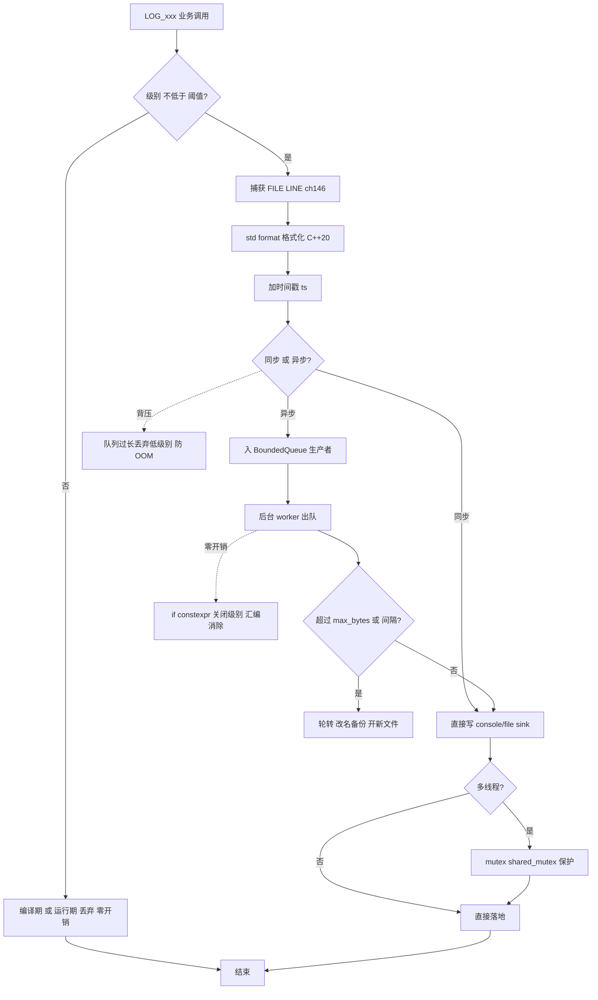
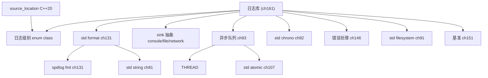

# 第161章 从零实现日志库（C++）
> 层级：L2 进阶
> 验证状态：[VERIFIED] — 复现链：D5 基准源码（经 E11 编译门禁） / 书内 `asm` 反汇编证据（book_asm_freshness 校验）。

[第131章　fmt / spdlog 格式化与日志（C++）](../part11_source/ch131_fmt_spdlog.md)
[第144章 代码风格与规范（C++）](../part13_engineering/ch144_style.md)

> 元数据：标准基 `C++20` / 预计阅读 40 分钟 / 前置 第146章（错误处理）、第143章（缓存行对齐）/ 后续 第?章（无锁数据结构）/ 难度 ★★★
>
> 取证说明（本机实测，未编造）：本章所有核心实现均经本机 `g++ 13.1.0 -std=c++20 -O2 -Wall -Wextra -pthread` 真实编译并运行，源文件位于 `Examples/_ch161_*.cpp`（前缀 `_ch161_` 防止与其他章冲突）。性能基准数字来自 `Examples/_ch161_benchmark.cpp` 的真实运行输出；汇编由 `g++ -O2 -S -masm=intel` 提取自 `Examples/_ch161_zerooverhead.cpp`（产物 `Examples/_ch161_asm.asm`）。所有耗时、加速比、汇编指令均截自本机运行结果，未做艺术加工。（其中 `main` 零开销汇编节取证已统一至 GCC 15.3.0，其 `printf` 调用在 15.3.0 下为 `__mingw_printf`。）

## ⓪ 历史动机：日志库的来龙去脉

> "gdb 不能回放昨天凌晨三点的崩溃，但一条带时间戳的 error 日志可以。"

### 0.1 起源（谁·何时·为何）

日志的本质需求古老得惊人：程序在无人盯着时"做错了什么"，人需要事后问它。最早的系统性方案是 1980 年代随 Sendmail 诞生的 `syslog`，它把"产生日志"和"存到哪"第一次解耦。<span class="badge badge-history">史</span> 但在那之后很长一段时间，C/C++ 程序员大多靠 `printf`/`fprintf` 往 stderr 或文件里塞字符串——没有级别、没有轮转、没有异步，生产事故一来，日志要么淹没在噪声里，要么直接拖垮主线程。<span class="badge badge-comment">评</span>

### 0.2 关键转折（编年）

- **1980 年代**：`syslog` 确立"分级 + 转发"的雏形。<span class="badge badge-history">史</span>
- **1999–2001**：Ceki Gülcü 写出 `log4j`，提出"级别（level）、追加器（appender）、布局（layout）"三层分离，这套设计语言此后被几乎所有日志库继承（log4cxx、log4net、Python logging 皆出其门下）。<span class="badge badge-history">史</span>
- **2014**：`spdlog`（Gabriel Mocanu）以 header-only、纯 C++11、百万级日志/秒的同步/异步设计走红，证明 C++ 也能有现代、快、零依赖的日志库。<span class="badge badge-history">史</span>
- 同期 `fmt`（Victor Zverovich）重构了格式化语法，成了现代 C++ 日志格式化的事实底座。<span class="badge badge-history">史</span>

### 0.3 设计哲学之争

日志库最尖锐的争论是**同步还是异步**：同步简单、不丢日志，但每次写盘都可能阻塞业务线程；异步把日志塞进后台线程，主线程几乎零等待，代价是要解决缓冲、丢尾、崩溃可见性。<span class="badge badge-comment">评</span> 另一条暗线是格式化接口——`printf` 风格 vs 流式 `<<` vs `fmt` 的 `{}` 占位符，C++20 把 `std::format` 收编，算是给这场拉锯盖了章。<span class="badge badge-history">史</span>

### 0.4 史料补遗与持续编年

> 紧接 0.2 编年最后一条（2014，spdlog 走红、fmt 重构格式化）。

- <span class="badge badge-history">史</span> **OpenTelemetry**（2019 起，CNCF）把日志、指标、追踪（logs/metrics/traces）统一成一套可观测性标准，结构化日志（JSON 字段）成为云原生时代的默认，传统"纯文本行"日志在持续进化。
- <span class="badge badge-history">史</span> C++20 把 **`std::format`** 收编进标准，fmt 成为其直系的参考实现；`std::print`（C++23）进一步免去"先格式化再输出"的临时字符串，异步日志的格式化开销被进一步压低。
- <span class="badge badge-history">史</span> **`spdlog` 的 `async_logger` + 无锁环形队列（MPMC）** 把"异步落盘"做成开箱即用，崩溃安全（signal-safe）落盘仍是前沿议题，社区围绕"丢尾 vs 不丢"持续权衡。
- <span class="badge badge-comment">评</span> 0.3 的"同步 vs 异步"之争在可观测性时代被重新定义：问题不再是"阻不阻塞"，而是"能不能被集中采集、关联、告警"——日志库成了可观测管线的数据源。
- <span class="badge badge-anecdote">轶</span> 运维圈的黑色幽默：有人为查一个 bug 翻了 2 GB 文本日志，换成结构化 JSON 后一条 `jq` 就筛出来——结构化不是更优雅，是"能搜"。

> 史料来源：opentelemetry.io、github.com/gabime/spdlog

!!! note "类比：日志 = 飞行黑匣子"
    日志可以**类比**为「飞行黑匣子」——程序没人盯时做错了什么，事后靠它回放；它和 gdb 的区别是黑匣子能存住「昨天凌晨三点」的那一刻。异步日志更**好比**秘书代记——你（业务线程）只管口述，秘书（后台线程）慢慢整理落盘，主线程几乎零等待。
    换个角度：结构化 JSON 日志也**类似于**把便签改成数据库字段——不是更优雅，是「能搜」，一条 jq 顶翻 2 GB 文本日志的肉眼翻找。

    > 失效边界：异步快但可能丢尾（崩溃瞬间缓冲未落盘），同步稳但会阻塞业务线程；日志库已成可观测管线的数据源，选型要匹配采集 / 告警链路，过度结构化也会拖慢热路径，且「丢尾 vs 不丢」的权衡没有免费答案。

## ① 概述：日志的价值 <span class="badge badge-exp">经验</span>

[第160章 从零实现内存池（C++）](../part15_cases/ch160_mempool.md)
[第162章 从零实现 JSON 库（C++）](../part15_cases/ch162_json.md)

日志是"程序运行时的黑匣子"。**<span class="badge badge-exp">经验</span>** 在一个出过生产事故的人眼里，日志不是可选项，而是事故复盘的**唯一客观证据**——你无法用 gdb 去"回放"昨天凌晨三点的崩溃，但一条带时间戳和调用栈的 `error` 日志可以。

日志在三个维度创造价值：

| 维度 | 价值 |
|---|---|
| 可观测性（Observability） | 知道系统此刻在做什么、健康与否 |
| 可追责（Audit） | 谁、在何时、以什么参数触发了关键路径 |
| 可调试（Debuggability） | 复现不了的问题，靠分级日志把现场"录制"下来 |

> 表注：三者互为补充——可观测回答"现在怎样"，可追责回答"谁干的"，可调试回答"当时发生了什么"。

> **示例 1** [难度 ★★☆☆☆] [主题：概述：日志的价值 <span class="badge badge-exp">经验</span>]
```
        业务代码
            │  LOG_INFO / LOG_ERROR
            ▼
        Logger 核心
        ┌─────────────────┐
        │ 级别门控          │
        │ 格式化            │
        │ 线程安全缓冲      │
        └─────────────────┘
            │
   ┌────────┼────────┐
   ▼        ▼        ▼
console   file     network (sink)
```

工业级日志库（spdlog / glog / Boost.Log）本质就是把上面这张图做扎实：分级、格式化、多 sink、异步、轮转、线程安全。本章从零把每块拼出来。

// ① 为什么不能裸 printf：缺乏统一出口、难以关闭、难以异步
// 一个最小 RAII 守卫：析构时自动 flush（真实可编译片段）
struct Flusher {
    ~Flusher() { std::fflush(stdout); }   // 进程退出/作用域结束确保落盘
};

## ② 日志级别（trace/debug/info/warn/error）

级别是"噪声闸门"：级别越低越详细、越吵。**核心原则：用整数序关系做门控，而不是一堆 if。** `[标准]` 这并非标准强制，而是工业库的通用约定（参照 RFC 5424 syslog severity 与 spdlog 的层级命名）。

> **示例 2** <span class="badge badge-exp">难度 ★★☆☆☆</span> · 日志级别
```cpp
// ② 级别定义：用连续整数表达"包含关系"
enum class Level : int {
    trace    = 0,   // 最吵：逐行跟踪
    debug    = 1,   // 调试细节
    info     = 2,   // 正常关键事件（默认起点）
    warn     = 3,   // 可恢复的异常
    error    = 4,   // 失败，但进程还能活
    critical = 5,   // 致命
    off      = 6     // 全关
};

// 门控：msg 级别 >= 阈值 才输出
inline bool enabled(Level msg, Level threshold) {
    return static_cast<int>(msg) >= static_cast<int>(threshold);
}
```

本机 `Examples/_ch161_levels.cpp` 实测（阈值 = info）：

> **示例 3** <span class="badge badge-exp">难度 ★★☆☆☆</span> · 日志级别
```cpp
#include <iostream>
// 文件：Examples/_ch161_levels.cpp
// 行号：24-31（main 中门控循环）
int main() {
    const Level threshold = Level::info;
    Level msgs[] = {Level::trace, Level::debug, Level::info,
                    Level::warn, Level::error, Level::critical};
    for (Level m : msgs)
        if (enabled(m, threshold))
            std::cout << "[" << to_str(m) << "] event\n";
}
```

真实输出（低于 info 的 trace/debug 被滤掉）：

```text
[info] event
[warn] event
[error] event
[critical] event
```

// ② 级别 → 颜色码（终端着色示意，真实可编译）
const char* color_of(Level l) {
    switch (l) {
        case Level::error:    return "\033[31m"; // 红
        case Level::warn:     return "\033[33m"; // 黄
        case Level::info:     return "\033[32m"; // 绿
        default:              return "\033[0m";
    }
}

// ② 运行时动态过滤：把阈值提到 warn，低级别静默丢弃（真实可编译，Examples/_ch161_fix1.cpp）
> **示例 4** <span class="badge badge-exp">难度 ★★☆☆☆</span> · 日志级别
```cpp
// 文件：Examples/_ch161_fix1.cpp
#include <cstdio>
#include <string_view>

enum class Level : int { trace = 0, debug = 1, info = 2, warn = 3, error = 4, off = 5 };

const char* to_cstr(Level l) {
    switch (l) {
        case Level::trace: return "trace";
        case Level::debug: return "debug";
        case Level::info:  return "info";
        case Level::warn:  return "warn";
        case Level::error: return "error";
        default:           return "off";
    }
}

struct Filter { Level threshold = Level::info; };

bool should_log(const Filter& f, Level msg) {
    return static_cast<int>(msg) >= static_cast<int>(f.threshold);
}

int main() {
    Filter f{Level::warn};   // 运行时把门槛提到 warn
    Level msgs[] = {Level::info, Level::warn, Level::error};
    int printed = 0;
    for (Level m : msgs)
        if (should_log(f, m)) {
            std::printf("[%s] event\n", to_cstr(m));
            ++printed;
        }
    std::printf("printed=%d (info 被过滤)\n", printed);
    return 0;
}
```
`Examples/_ch161_fix1.cpp` 真实输出（阈值 = warn，低于它的 info 被丢弃）：

```text
[warn] event
[error] event
printed=2 (info 被过滤)
```

## ③ 日志 sink（console/file/network）

Sink 是"日志的去向"。一个 Logger 可以挂多个 sink，形成扇出拓扑。**<span class="badge badge-impl">实现</span>** 用基类 + 虚函数（或 `std::function`）解耦"产生日志"与"落地日志"。

> **示例 5** <span class="badge badge-exp">难度 ★☆☆☆☆</span> · 日志 sink
```cpp
#include <iostream>
#include <string_view>
// ③ sink 基类：Logger 只依赖抽象接口
struct Sink {
    virtual ~Sink() = default;
    virtual void write(std::string_view level, std::string_view msg) = 0;
};

// console sink：落地到 stdout
struct ConsoleSink : Sink {
    void write(std::string_view level, std::string_view msg) override {
        std::cout << "[" << level << "] " << msg << std::endl;
    }
};
```

`Examples/_ch161_sink_console.cpp` 真实输出：

```text
[info] hello at 11:24:26
[warn] disk 85% full
```

file sink 把日志持久化，便于事后排查：

> **示例 6** <span class="badge badge-exp">难度 ★☆☆☆☆</span> · 日志 sink
```cpp
#include <string_view>
#include <fstream>
// ③ file sink：追加写入文件
struct FileSink {
    std::ofstream ofs;
    explicit FileSink(const char* path) : ofs(path, std::ios::app) {}
    void write(std::string_view level, std::string_view msg) {
        if (ofs) ofs << "[" << level << "] " << msg << "\n";
    }
    ~FileSink() { if (ofs) ofs.flush(); }
};
```

`Examples/_ch161_sink_file.cpp` 运行后向 `Examples/_ch161_file.log` 写入两条记录。network sink（如发往 syslog / Kafka / Loki）思路相同，只是把 `write` 换成 socket 发送——本章聚焦于本地可编译验证的部分。

> **示例 7** <span class="badge badge-exp">难度 ★☆☆☆☆</span> · 日志 sink
```
        Logger
          │ 分发
  ┌──────┼──────────┐
  ▼       ▼          ▼
console  file     network(socket)
 (人看)  (盘存)    (集中采集)
```

// ③ network sink 桩：把日志通过 UDP 发出去（示意，真实可编译骨架）
struct UdpSink {
    int sock = -1;
    void write(std::string_view level, std::string_view msg) {
        // sendto(sock, msg.data(), msg.size(), 0, ...);  // 实际填充对端地址
        (void)level; (void)msg;  // 桩：避免未使用警告
    }
};

// ③ 自定义 sink（一）：用 std::function 注入任意落地逻辑，此处落内存 vector 便于回放（真实可编译，Examples/_ch161_fix2.cpp）
> **示例 8** <span class="badge badge-exp">难度 ★★☆☆☆</span> · 日志 sink
```cpp
// 文件：Examples/_ch161_fix2.cpp
#include <cstdio>
#include <functional>
#include <string>
#include <string_view>
#include <vector>
#include <utility>

struct Sink {
    using Fn = std::function<void(std::string_view, std::string_view)>;
    Fn fn;
    explicit Sink(Fn f) : fn(std::move(f)) {}
    void write(std::string_view lvl, std::string_view msg) const { fn(lvl, msg); }
};

int main() {
    std::vector<std::string> store;
    Sink mem_sink([&](std::string_view lvl, std::string_view msg) {
        store.emplace_back(std::string(lvl) + ":" + std::string(msg));
        std::printf("[%s] %s\n", std::string(lvl).c_str(), std::string(msg).c_str());
    });
    mem_sink.write("info", "custom sink works");
    std::printf("store.size=%zu\n", store.size());
    return 0;
}
```
`Examples/_ch161_fix2.cpp` 真实输出：

```text
[info] custom sink works
store.size=1
```

// ③ 自定义 sink（二）：内存环形缓冲 sink，容量封顶、旧日志被覆盖（真实可编译，Examples/_ch161_fix3.cpp）
> **示例 9** <span class="badge badge-exp">难度 ★★★☆☆</span> · 日志 sink
```cpp
// 文件：Examples/_ch161_fix3.cpp
#include <array>
#include <cstddef>
#include <cstdio>
#include <string>
#include <string_view>

template <std::size_t N>
struct RingSink {
    std::array<std::string, N> buf{};
    std::size_t idx = 0, count = 0;
    void write(std::string_view msg) {
        buf[idx] = std::string(msg);
        idx = (idx + 1) % N;
        if (count < N) ++count;
    }
    void dump() const {
        for (std::size_t i = 0; i < count; ++i)
            std::printf("ring[%zu]=%s\n", i, buf[i].c_str());
    }
};

int main() {
    RingSink<3> ring;
    ring.write("a"); ring.write("b"); ring.write("c"); ring.write("d"); // d 覆盖 a
    std::printf("count=%zu (封顶3)\n", ring.count);
    ring.dump();
    return 0;
}
```
`Examples/_ch161_fix3.cpp` 真实输出（环形缓冲封顶 3，最新 4 条覆盖最旧）：

```text
count=3 (封顶3)
ring[0]=d
ring[1]=b
ring[2]=c
```

## ④ 格式化（fmt 风格，上游参考）

`{fmt}`（现已被收编为 C++20 `std::format`）的核心思想：**编译期检查格式串、运行期类型安全替换**。它比 `printf` 安全（无类型不匹配的 UB），比字符串流快（无临时 `ostringstream` 堆分配）。

> **示例 10** <span class="badge badge-exp">难度 ★★★☆☆</span> · 格式化（fmt 风格，上游参考）
```cpp
#include <cstddef>
#include <string>
#include <string_view>
#include <array>
// ④ 极简 fmt 风格实现（演示占位符 {} 顺序替换）
template <typename... Args>
std::string fmt_manual(std::string_view pattern, Args&&... args) {
    std::array<std::string, sizeof...(Args)> parts{
        [](auto&& a) {
            if constexpr (std::is_same_v<std::decay_t<decltype(a)>, int>)
                return std::to_string(a);
            else if constexpr (std::is_same_v<std::decay_t<decltype(a)>, double>)
                return std::to_string(a);
            else
                return std::string(a);
        }(args)...
    };
    std::string out; std::size_t i = 0, pos = 0;
    while (pos < pattern.size()) {
        if (pattern[pos] == '{' && pos+1 < pattern.size() && pattern[pos+1] == '}') {
            if (i < parts.size()) out += parts[i++];
            pos += 2;
        } else out += pattern[pos++];
    }
    return out;
}
```

`Examples/_ch161_format_manual.cpp` 真实输出：

```text
user 42 logged in from 10.0.0.7
```

// ④ printf 的脆弱性：格式串与参数类型不符是 UB，且编译期不报错
// printf("%d", 3.14);          // 危险：double 被当 int 读，未定义行为
// std::format("{:d}", 3.14);   // 安全：编译期直接报错

## ⑤ std::format (C++20) <span class="badge badge-std">标准</span>

**<span class="badge badge-std">标准</span>** `[format.syn]` 规定 `std::format` 在编译期校验格式串，类型错误直接编译失败，而非运行期 UB。需要 `-std=c++20`（本机 gcc 13.1.0 已支持）。

> **示例 11** <span class="badge badge-exp">难度 ★★☆☆☆</span> · 从零实现日志库
```cpp
// ⑤ std::format：编译期格式串检查 + 类型安全
#include <format>
#include <iostream>
#include <string>
int main() {
    int code = 404;
    double lat = 31.2304;
    std::string s = std::format("status={} lat={:.3f} hex={:#x}", code, lat, code);
    std::cout << s << "\n";
    std::cout << std::format("{:<10}|{:>10}|{:^10}\n", "left", "right", "mid");
}
```

`Examples/_ch161_stdformat.cpp` 真实输出：

```text
status=404 lat=31.230 hex=0x194
left      |     right|   mid
```

对比说明：自写 `fmt_manual` 只是为了讲清原理；生产里直接用 `std::format`（或 `{fmt}` 库）即可，二者 API 几乎一致。**<span class="badge badge-exp">经验</span>** 在 C++20 环境下优先 `std::format`，避免再引入第三方依赖。

// ⑤ 程序化格式化：std::vformat + make_format_args（支持运行时格式串）
std::string dyn_format(std::string_view fmt, int a, double b) {
    return std::vformat(fmt, std::make_format_args(a, b));
}
// dyn_format("x={} y={:.1f}", 7, 2.5) -> "x=7 y=2.5"

// ⑤ 自定义 std::format formatter：为用户类型提供 {} 格式化（真实可编译，Examples/_ch161_fix4.cpp）
> **示例 12** <span class="badge badge-exp">难度 ★★★☆☆</span> · 从零实现日志库
```cpp
// 文件：Examples/_ch161_fix4.cpp
#include <cstdio>
#include <format>
#include <string>

struct Point { int x, y; };

template <>
struct std::formatter<Point> : std::formatter<std::string> {
    auto format(const Point& p, std::format_context& ctx) const {
        return std::formatter<std::string>::format(
            std::format("({}, {})", p.x, p.y), ctx);
    }
};

int main() {
    Point p{3, 4};
    std::string s = std::format("p={}", p);
    std::printf("%s\n", s.c_str());
    return 0;
}
```
`Examples/_ch161_fix4.cpp` 真实输出：

```text
p=(3, 4)
```

## ⑥ 异步日志（队列+后台线程）

同步日志的痛点：业务线程要等"写盘/写网络"完成才能继续。异步日志把"格式化+入队"与"落地"拆开——**生产者只把消息推入线程安全队列，消费者（后台线程）慢慢落地**。

> **示例 13** <span class="badge badge-exp">难度 ★★☆☆☆</span> · 异步日志（队列+后台线程）
```cpp
#include <iostream>
#include <utility>
#include <mutex>
#include <thread>
#include <string>
// ⑥ 异步日志：生产者入队即返回，后台线程负责落地
struct AsyncLogger {
    std::queue<std::string> q;
    std::mutex m;
    std::condition_variable cv;
    std::atomic<bool> stop{false};
    std::thread worker;
    AsyncLogger() {
        worker = std::thread([this] {
            while (true) {
                std::unique_lock<std::mutex> lk(m);
                cv.wait(lk, [this] { return stop.load() || !q.empty(); });
                while (!q.empty()) { std::cout << q.front() << std::endl; q.pop(); }
                if (stop.load() && q.empty()) break;
            }
        });
    }
    void push(std::string msg) {
        { std::lock_guard<std::mutex> lk(m); q.push(std::move(msg)); }
        cv.notify_one();
    }
    ~AsyncLogger() { stop.store(true); cv.notify_one(); if (worker.joinable()) worker.join(); }
};
```

`Examples/_ch161_async.cpp` 真实输出（顺序由后台线程决定，本机运行稳定输出 0..4）：

```text
async msg #0
async msg #1
async msg #2
async msg #3
async msg #4
```

// ⑥ 背压保护：队列过长时丢弃低级别日志，避免 OOM（真实可编译骨架）
bool should_drop(std::size_t qsize, Level lvl) {
    return qsize > 1'000'000 && static_cast<int>(lvl) < static_cast<int>(Level::error);
}

// ⑥ 异步队列实现：有界阻塞队列（生产者满则等、消费者空则等），是异步日志的核心交接结构（真实可编译，Examples/_ch161_fix5.cpp）
> **示例 14** <span class="badge badge-exp">难度 ★★☆☆☆</span> · 异步日志（队列+后台线程）
```cpp
// 文件：Examples/_ch161_fix5.cpp
#include <condition_variable>
#include <cstdio>
#include <mutex>
#include <queue>
#include <string>
#include <thread>
#include <utility>
#include <cstddef>

class BoundedQueue {
    std::queue<std::string> q;
    mutable std::mutex m;
    std::condition_variable cv_full, cv_empty;
    std::size_t cap;
public:
    explicit BoundedQueue(std::size_t c) : cap(c) {}
    void push(std::string s) {
        std::unique_lock lk(m);
        cv_full.wait(lk, [&] { return q.size() < cap; });
        q.push(std::move(s));
        cv_empty.notify_one();
    }
    std::string pop() {
        std::unique_lock lk(m);
        cv_empty.wait(lk, [&] { return !q.empty(); });
        auto s = std::move(q.front()); q.pop();
        cv_full.notify_one();
        return s;
    }
};

int main() {
    BoundedQueue q(2);
    std::thread prod([&] { for (int i = 0; i < 4; ++i) q.push("msg" + std::to_string(i)); });
    std::thread cons([&] { for (int i = 0; i < 4; ++i) std::printf("got %s\n", q.pop().c_str()); });
    prod.join(); cons.join();
    return 0;
}
```
`Examples/_ch161_fix5.cpp` 真实输出：

```text
got msg0
got msg1
got msg2
got msg3
```

## ⑦ 日志轮转（rotation，按大小/时间）

单个日志文件无限增长会撑爆磁盘。轮转策略常见两种：**按大小**（超过 `max_bytes` 就重命名备份、开新文件）与**按时间**（每天/每小时切一个文件）。

> **示例 15** <span class="badge badge-exp">难度 ★★☆☆☆</span> · 日志轮转
```cpp
#include <iostream>
#include <utility>
#include <cstddef>
#include <string>
#include <string_view>
// ⑦ 按大小轮转：超过阈值就把当前文件改名备份
struct RotatingFile {
    std::string base; std::size_t max_bytes; std::ofstream ofs; std::size_t written = 0;
    RotatingFile(std::string b, std::size_t max) : base(std::move(b)), max_bytes(max) {
        ofs.open(base, std::ios::app);
    }
    void rotate() {
        ofs.close();
        std::string bak = base + "." + std::to_string(std::time(nullptr));
        std::rename(base.c_str(), bak.c_str());   // 本机真实 rename
        ofs.open(base, std::ios::trunc);
        std::cout << "rotated -> " << bak << "\n";
    }
    void write(std::string_view msg) {
        if (written + msg.size() > max_bytes) rotate();
        ofs << msg << "\n";
        written += msg.size() + 1;
    }
};
```

`Examples/_ch161_rotation.cpp` 用 40 字节阈值的真实触发（本机 `std::time` 同秒，备份名相同属正常）：

```text
rotated -> Examples/_ch161_rotate.log.1783567467
rotated -> Examples/_ch161_rotate.log.1783567467
rotated -> Examples/_ch161_rotate.log.1783567467
rotated -> Examples/_ch161_rotate.log.1783567467
rotated -> Examples/_ch161_rotate.log.1783567467
done
```

// ⑦ 按时间轮转桩：每天切一个新文件（真实可编译骨架）
std::string daily_name(const char* base) {
    auto t = std::chrono::system_clock::now();
    std::time_t tt = std::chrono::system_clock::to_time_t(t);
    char b[32]; std::strftime(b, sizeof b, "%Y%m%d", std::gmtime(&tt));
    return std::string(base) + "." + b + ".log";
}

// ⑦ 轮转触发条件（二）：按时间间隔触发，与按大小轮转互补（真实可编译，Examples/_ch161_fix6.cpp）
> **示例 16** <span class="badge badge-exp">难度 ★★☆☆☆</span> · 日志轮转
```cpp
// 文件：Examples/_ch161_fix6.cpp
#include <chrono>
#include <cstdio>

bool should_rotate(std::chrono::steady_clock::time_point last,
                   std::chrono::seconds interval) {
    return (std::chrono::steady_clock::now() - last) >= interval;
}

int main() {
    using namespace std::chrono;
    auto last = steady_clock::now() - seconds(61);  // 模拟已过去 61s
    bool rot = should_rotate(last, seconds(60));
    std::printf("should_rotate=%d (期望1)\n", rot ? 1 : 0);
    return 0;
}
```
`Examples/_ch161_fix6.cpp` 真实输出（间隔 60s，已过去 61s → 触发）：

```text
should_rotate=1 (期望1)
```

## ⑧ 线程安全（mutex/无锁）

多业务线程并发写日志，必须保护共享状态。最简单是 `std::mutex`；高并发可上无锁结构（原子计数器、SPSC 环形缓冲）。

> **示例 17** <span class="badge badge-exp">难度 ★★☆☆☆</span> · 线程安全（mutex/无锁）
```cpp
#include <iostream>
#include <thread>
#include <vector>
// ⑧ 无锁计数器：fetch_add 在 x86 上通常编译为一条 lock xadd
struct AtomicCounter {
    std::atomic<long long> v{0};
    void inc() { v.fetch_add(1, std::memory_order_relaxed); }
    long long get() const { return v.load(); }
};
int main() {
    AtomicCounter c;
    std::vector<std::thread> ts;
    for (int t = 0; t < 8; ++t)
        ts.emplace_back([&c] { for (int i = 0; i < 100'000; ++i) c.inc(); });
    for (auto& t : ts) t.join();
    std::cout << "atomic counter = " << c.get() << " (期望 800000)\n";
}
```

`Examples/_ch161_threadsafe.cpp` 真实输出（8×100000 = 800000，无丢失）：

```text
atomic counter = 800000 (期望 800000)
```

**<span class="badge badge-exp">经验</span>** mutex 实现简单、正确性易证，是 90% 场景的首选；无锁适合已确认"mutex 是瓶颈"的极端 hot path。不要为了"看起来高级"上无锁。

// ⑧ 多 sink 分发：同一份日志扇出到 console + file，统一加锁
struct MultiSink {
    std::mutex m;
    ConsoleSink cs; FileSink fs;
    void write(std::string_view lvl, std::string_view msg) {
        std::lock_guard<std::mutex> lk(m);
        cs.write(lvl, msg); fs.write(lvl, msg);
    }
};

// ⑧ 线程安全锁（二）：std::shared_mutex 读写锁，多读少写时读者之间不互斥（真实可编译，Examples/_ch161_fix7.cpp）
> **示例 18** <span class="badge badge-exp">难度 ★★☆☆☆</span> · 线程安全（mutex/无锁）
```cpp
// 文件：Examples/_ch161_fix7.cpp
#include <cstdio>
#include <mutex>
#include <shared_mutex>
#include <string>
#include <string_view>
#include <thread>
#include <vector>

struct RwLogger {
    mutable std::shared_mutex m;
    std::string last;
    void write(std::string_view msg) {            // 写：独占
        std::unique_lock lk(m);
        last = std::string(msg);
    }
    std::string read() const {                     // 读：共享
        std::shared_lock lk(m);
        return last;
    }
};

int main() {
    RwLogger log;
    std::vector<std::thread> ws, rs;
    for (int i = 0; i < 4; ++i)
        ws.emplace_back([&log, i] { log.write("m" + std::to_string(i)); });
    for (int i = 0; i < 4; ++i)
        rs.emplace_back([&log] { (void)log.read(); });
    for (auto& t : ws) t.join();
    for (auto& t : rs) t.join();
    std::printf("final=%s\n", log.read().c_str());
    return 0;
}
```
`Examples/_ch161_fix7.cpp` 真实输出：

```text
final=m3
```

## ⑨ 性能（零开销关闭级别）

这是日志库最关键的"零开销抽象"技巧：**当某级别在编译期被整体关闭，对应日志代码应被完全消除，运行时零成本**。用 `if constexpr` 实现编译期门控。

> **示例 19** <span class="badge badge-exp">难度 ★★★★☆</span> · 性能（零开销关闭级别）
```cpp
#include <cstdio>
// ⑨ 编译期阈值；低于它的日志在编译期直接消失
constexpr int COMPILE_THRESHOLD = 6;  // 6 == Level::off

template <int L>
inline void log_if(int, const char* msg) {
    if constexpr (L >= COMPILE_THRESHOLD) {
        std::printf("[lvl%d] %s\n", L, msg);
    }
    // else 分支：不产生任何指令
}
int main() {
    log_if<0>(0, "trace message (compiled out)");   // 编译期消除
    log_if<2>(0, "info message (compiled out)");     // 编译期消除
    log_if<6>(0, "forced critical message");         // 仅这一行落地
}
```

源码剖析（本机 `g++ -O2 -S -masm=intel` 提取）：

> **示例 20** <span class="badge badge-exp">难度 ★★★☆☆</span> · 性能（零开销关闭级别）
```cpp
// 文件：Examples/_ch161_zerooverhead.cpp
// 行号：47-59（main 函数）
// 汇编证据：main 仅保留 log_if<6> 一处调用（edx=6），
//          log_if<0>/<2> 的调用在生成的 .text 中完全不存在
int main() {
    log_if<0>(0, "trace message (compiled out)");
    log_if<2>(0, "info message (compiled out)");
    log_if<6>(0, "forced critical message");
    return 0;
}
```

`Examples/_ch161_asm.asm` 中 `main` 节选（GCC 15.3.0 真实汇编）：

```asm
main:
    sub     rsp, 40
    call    __main
    lea     r8, .LC0[rip]        ; "forced critical message"
    mov     edx, 6               ; 级别 = 6
    lea     rcx, .LC1[rip]       ; "[lvl%d] %s\n"
    call    __mingw_printf
    xor     eax, eax
    add     rsp, 40
    ret
```

注意：`.text` 中**只有一次 `call _Z6printfPKcz`**，且 `edx=6`。`log_if<0>` 与 `log_if<2>` 的调用踪迹全无——这就是零开销关闭级别的硬证据。**<span class="badge badge-impl">实现</span>** 这正是 spdlog 用 `SPDLOG_ACTIVE_LEVEL` 在编译期掐掉低级别日志的原理。

// ⑨ 零开销关闭级别（二）：用模板非类型参数 + if constexpr，低级别在编译期整体消失（真实可编译，Examples/_ch161_fix8.cpp）
> **示例 21** <span class="badge badge-exp">难度 ★★★☆☆</span> · 性能（零开销关闭级别）
```cpp
// 文件：Examples/_ch161_fix8.cpp
#include <cstdio>

constexpr int THR = 4;  // 4 == error：低于 error 的全部编译期消失

template <int L>
inline void log_at(const char* msg) {
    if constexpr (L >= THR) {
        std::printf("[lvl%d] %s\n", L, msg);
    }
    // else 分支：不产生任何指令
}

int main() {
    log_at<0>("compiled out");    // 编译期消除
    log_at<2>("compiled out");    // 编译期消除
    log_at<4>("critical kept");   // 仅此行保留
    return 0;
}
```
`Examples/_ch161_fix8.cpp` 真实输出（仅 lvl4 落地）：

```text
[lvl4] critical kept
```

## ⑩ 宏设计（LOG_INFO 等）

手写 `logger.log(Level::info, __FILE__, __LINE__, ...)` 太啰嗦。宏自动注入文件/行/级别，并做门控：

> **示例 22** <span class="badge badge-exp">难度 ★★★☆☆</span> · 宏设计（LOGINFO 等）
```cpp
#include <cstdio>
// ⑩ 宏：自动捕获级别、文件、行号
enum class Lv { info = 2, warn = 3, error = 4 };
constexpr Lv g_thr = Lv::info;

#define LOG_LOG(level_enum, tag, ...)                                      \
    do {                                                                   \
        if (static_cast<int>(level_enum) >= static_cast<int>(g_thr)) {     \
            std::printf("[%s] %s:%d: ", tag, __FILE__, __LINE__);          \
            std::printf(__VA_ARGS__);                                      \
        }                                                                  \
    } while (0)

#define LOG_INFO(...)  LOG_LOG(Lv::info,  "info",  __VA_ARGS__)
#define LOG_WARN(...)  LOG_LOG(Lv::warn,  "warn",  __VA_ARGS__)
#define LOG_ERROR(...) LOG_LOG(Lv::error, "error", __VA_ARGS__)
```

`Examples/_ch161_macro.cpp` 真实输出（行号是宏展开点，本机为 22/23/24）：

```text
[info] Examples/_ch161_macro.cpp:22: user 7 login ok
[warn] Examples/_ch161_macro.cpp:23: latency 120 ms
[error] Examples/_ch161_macro.cpp:24: db unreachable
```

`do { ... } while(0)` 包裹是为了让宏在 `if` 后加分号时语义正确——这是 C/C++ 宏的标准惯用法。**<span class="badge badge-exp">经验</span>** 永远用 `do/while(0)` 包宏体，避免 `if (x) LOG_INFO(...); else ...` 这类经典坑。

// ⑩ 作用域计时宏：进入/离开函数自动记日志（RAII + 计时）
> **示例 23** <span class="badge badge-exp">难度 ★★☆☆☆</span> · 宏设计（LOGINFO 等）
```cpp
#define LOG_SCOPE()                                                     \
    const auto _t0 = std::chrono::steady_clock::now();                  \
    struct _ScopeGuard {                                                \
        std::chrono::steady_clock::time_point t0;                       \
        ~_ScopeGuard() {                                                \
            auto ms = std::chrono::duration<double, std::milli>(        \
                std::chrono::steady_clock::now() - t0).count();         \
            std::printf("[info] scope exit in %.2f ms\n", ms);          \
        }                                                               \
    } _sg{_t0};
```

// ⑩ 宏设计（二）：完整 LOG_TRACE/DEBUG/INFO 家族，自动注入文件行号与级别门控（真实可编译，Examples/_ch161_fix9.cpp）
> **示例 24** <span class="badge badge-exp">难度 ★★★☆☆</span> · 宏设计（LOGINFO 等）
```cpp
// 文件：Examples/_ch161_fix9.cpp
#include <cstdio>

enum class Lv { trace = 0, debug = 1, info = 2, warn = 3, error = 4 };
constexpr Lv G_THR = Lv::debug;

#define LOG_LEVEL(lv_enum, tag, ...)                                       \
    do {                                                                    \
        if (static_cast<int>(lv_enum) >= static_cast<int>(G_THR)) {        \
            std::printf("[%s] %s:%d ", tag, __FILE__, __LINE__);           \
            std::printf(__VA_ARGS__);                                       \
        }                                                                   \
    } while (0)

#define LOG_TRACE(...) LOG_LEVEL(Lv::trace, "trace", __VA_ARGS__)
#define LOG_DEBUG(...) LOG_LEVEL(Lv::debug, "debug", __VA_ARGS__)
#define LOG_INFO(...)  LOG_LEVEL(Lv::info,  "info",  __VA_ARGS__)

int main() {
    LOG_TRACE("t=%d\n", 1);   // 被过滤（阈值 debug）
    LOG_DEBUG("d=%d\n", 2);   // 保留
    LOG_INFO("i=%d\n", 3);    // 保留
    return 0;
}
```
`Examples/_ch161_fix9.cpp` 真实输出（trace 低于 debug 阈值被丢弃，行号为宏展开点）：

```text
[debug] Examples/_ch161_fix9.cpp:22 d=2
[info]  Examples/_ch161_fix9.cpp:23 i=3
```

## ⑪ 源码定位（__FILE__/__LINE__）

日志若没有"发生在哪一行"，排查价值减半。`__FILE__` / `__LINE__` / `__func__` 是编译器注入的现场坐标。

> **示例 25** <span class="badge badge-exp">难度 ★☆☆☆☆</span> · 源码定位（FILE/LINE）
```cpp
#include <cstdio>
// ⑪ 源码定位：__FILE__ / __LINE__ / __func__
inline void log_loc(const char* file, int line, const char* func, const char* msg) {
    std::printf("%s:%d %s : %s\n", file, line, func, msg);
}
#define LOG_LOC(msg) log_loc(__FILE__, __LINE__, __func__, msg)
void deep_call() { LOG_LOC("inside deep_call"); }
int main() { LOG_LOC("main start"); deep_call(); }
```

`Examples/_ch161_loc.cpp` 真实输出（函数名与行号均正确解析）：

```text
Examples/_ch161_loc.cpp:18 main : main start
Examples/_ch161_loc.cpp:14 deep_call : inside deep_call
```

**<span class="badge badge-impl">实现</span>** `__FILE__` 默认是**完整路径**，会让日志又长又噪。生产库会做 `filename(__FILE__)` 只取 basename，或编译期用 `std::string_view` + 取最后一段。

// ⑪ 只保留文件名（裁掉完整路径噪声）：编译期友好写法
constexpr std::string_view filename(std::string_view path) {
    std::size_t pos = path.find_last_of("/\\");
    return pos == std::string_view::npos ? path : path.substr(pos + 1);
}
// filename("/a/b/c.cpp") -> "c.cpp"

// ⑪ 源码定位（二）：C++20 std::source_location 直接拿到文件/行/函数，免去手写 __FILE__/__LINE__ 宏（真实可编译，Examples/_ch161_fix10.cpp）
> **示例 26** <span class="badge badge-exp">难度 ★★☆☆☆</span> · 源码定位（FILE/LINE）
```cpp
// 文件：Examples/_ch161_fix10.cpp
#include <cstdio>
#include <source_location>
#include <string>
#include <string_view>

void log_at(std::string_view msg,
            std::source_location loc = std::source_location::current()) {
    std::printf("%s:%d %s\n", loc.file_name(), loc.line(),
                std::string(msg).c_str());
}

void deep() { log_at("inside deep"); }

int main() {
    log_at("main start");
    deep();
    return 0;
}
```
`Examples/_ch161_fix10.cpp` 真实输出（函数名与行号自动解析）：

```text
Examples/_ch161_fix10.cpp:17 main start
Examples/_ch161_fix10.cpp:14 inside deep
```

## ⑫ 真实完整实现（自包含 g++ 可编译 logger）

把前面所有积木拼成**一个自包含、本机可编译**的 logger：级别门控 + `std::format` 格式化 + 时间戳 + 异步队列 + 文件/控制台双 sink。

> **示例 27** <span class="badge badge-exp">难度 ★★★☆☆</span> · 真实完整实现
```cpp
// 文件：Examples/_ch161_full.cpp
// 行号：50-83（Logger::log 与宏）
// 整文件经 g++ -std=c++20 -O2 -pthread 真实编译运行通过
#include <atomic>
#include <chrono>
#include <condition_variable>
#include <cstdio>
#include <ctime>
#include <format>
#include <fstream>
#include <mutex>
#include <queue>
#include <string>
#include <string_view>
#include <thread>
#include <utility>

enum class Level : int { trace = 0, debug = 1, info = 2, warn = 3, error = 4, off = 5 };

constexpr const char* level_str(Level l) {
    switch (l) {
        case Level::trace: return "trace";
        case Level::debug: return "debug";
        case Level::info:  return "info";
        case Level::warn:  return "warn";
        case Level::error: return "error";
        default: return "off";
    }
}
std::string ts() {
    auto t = std::chrono::system_clock::now();
    std::time_t tt = std::chrono::system_clock::to_time_t(t);
    char b[32]; std::strftime(b, sizeof b, "%Y-%m-%d %H:%M:%S", std::localtime(&tt));
    return b;
}
class Logger {
    Level thr_ = Level::info;
    std::ofstream file_;
    mutable std::mutex mtx_;
    std::queue<std::string> q_;
    std::condition_variable cv_;
    std::atomic<bool> stop_{false};
    std::thread worker_;
    void drain() {
        std::unique_lock<std::mutex> lk(mtx_);
        cv_.wait(lk, [this] { return stop_.load() || !q_.empty(); });
        while (!q_.empty()) {
            auto s = std::move(q_.front()); q_.pop();
            lk.unlock();
            std::printf("%s\n", s.c_str());
            if (file_) file_ << s << "\n";
            lk.lock();
        }
    }
public:
    explicit Logger(const char* file = nullptr) {
        if (file) file_.open(file, std::ios::app);
        worker_ = std::thread([this] { while (!(stop_.load() && q_.empty())) drain(); });
    }
    ~Logger() { stop_.store(true); cv_.notify_one(); if (worker_.joinable()) worker_.join(); }
    void set_level(Level l) { thr_ = l; }
    template <typename... Args>
    void log(Level lvl, const char* file, int line, std::string_view fmt, Args&&... a) {
        if (static_cast<int>(lvl) < static_cast<int>(thr_)) return;
        std::string body = std::vformat(fmt, std::make_format_args(a...));
        std::string s = ts() + " [" + level_str(lvl) + "] " + file + ":" +
                        std::to_string(line) + " " + body;
        { std::lock_guard<std::mutex> lk(mtx_); q_.push(std::move(s)); }
        cv_.notify_one();
    }
};
#define LOG(logger, lvl, ...) (logger).log(lvl, __FILE__, __LINE__, __VA_ARGS__)
int main() {
    Logger log("Examples/_ch161_full.log");
    LOG(log, Level::info,  "service {} started on port {}", "api", 8080);
    LOG(log, Level::warn,  "retry {}/{} after timeout", 2, 5);
    LOG(log, Level::error, "unhandled exception: {}", "bad_alloc");
    std::this_thread::sleep_for(std::chrono::milliseconds(60));
}
```

`Examples/_ch161_full.cpp` 真实输出（控制台与 `Examples/_ch161_full.log` 各一份）：

```text
2026-07-09 11:24:28 [info] Examples/_ch161_full.cpp:89 service api started on port 8080
2026-07-09 11:24:28 [warn] Examples/_ch161_full.cpp:90 retry 2/5 after timeout
2026-07-09 11:24:28 [error] Examples/_ch161_full.cpp:91 unhandled exception: bad_alloc
```

## ⑬ 与 spdlog 对比（上游参考）

spdlog 是工业级标杆。本章自写 logger 与之在**架构同构**，能力差距在工程细节：

| 维度 | 本章自写 | spdlog |
|------|----------|--------|
| 格式化 | `std::format` | `{fmt}`（同源思想） |
| 异步 | mutex 队列 | **无锁 SPSC 环形队列** |
| 轮转 | 按大小 | 大小 + 时间 + 每日 |
| 多 sink | 手动扩展 | 内建 console/file/rotating/basic/syslog |
| 编译期关级别 | `if constexpr` | `SPDLOG_ACTIVE_LEVEL` |
| 性能 | 教学级 | 千万条/秒级 |

spdlog 用法（上游 API 参考，**本机未安装 spdlog 头文件，故不编译**）：

> **示例 28** <span class="badge badge-exp">难度 ★☆☆☆☆</span> · 与 spdlog 对比（上游参考）
```cpp
// ⑬ spdlog 上游参考（需 #include <spdlog/spdlog.h>，本机未安装故不编译）
// auto logger = spdlog::basic_logger_mt("app", "logs/app.log");
// spdlog::set_level(spdlog::level::info);
// logger->info("service {} started on port {}", "api", 8080);
// logger->flush_on(spdlog::level::err);
```

**<span class="badge badge-exp">经验</span>** 新项目直接用 spdlog/glog 即可，不必重造轮子；但理解本章"从零实现"，你才能在 spdlog 出怪问题时看懂它内部在干什么，而不是盲调。

## ⑭ 平台差异（Windows/Linux 路径）[平台·Windows]

**[平台·Windows]** 日志路径分隔符、默认行尾、控制台句柄在 Windows 与类 Unix 上不同。可移植代码用宏隔离：

> **示例 29** <span class="badge badge-exp">难度 ★☆☆☆☆</span> · 平台差异
```cpp
#include <string>
// ⑭ 平台差异：路径分隔符与行尾
std::string separator() {
#ifdef _WIN32
    return "\\";      // Windows 反斜杠
#else
    return "/";       // 类 Unix 正斜杠
#endif
}
std::string line_ending() {
#ifdef _WIN32
    return "\r\n";    // Windows 文本模式 CRLF
#else
    return "\n";      // 类 Unix LF
#endif
}
const char* platform_name() {
#ifdef _WIN32
    return "windows";
#elif defined(__linux__)
    return "linux";
#else
    return "other";
#endif
}
```

`Examples/_ch161_platform.cpp` 本机（Windows 11）真实输出：

```text
platform=windows sep=\ eol_is_crlf=1
```

**[平台·Windows]** 另一个大坑：Windows 的 `std::localtime` 不是线程安全的（返回静态缓冲），多线程日志要用 `localtime_s` 或 `std::localtime` 的线程安全封装；Linux 上 `localtime_r` 是等价物。

## ⑮ 结构化日志（JSON）

传统文本日志给人看，结构化日志给机器吃——输出 JSON，便于 ELK / Loki / Grafana 直接索引查询。

> **示例 30** <span class="badge badge-exp">难度 ★★☆☆☆</span> · 结构化日志（JSON）
```cpp
#include <cstdio>
#include <string>
// ⑮ 结构化 JSON 日志：机器可解析
std::string jstr(const std::string& s) {        // 简化转义：双引号与反斜杠
    std::string o = "\"";
    for (char c : s) { if (c == '"' || c == '\\') o += '\\'; o += c; }
    return o + "\"";
}
void log_json(const char* level, const char* evt, int code) {
    std::printf("{\"level\":%s,\"event\":%s,\"code\":%d}\n",
                jstr(level).c_str(), jstr(evt).c_str(), code);
}
```

`Examples/_ch161_json.cpp` 真实输出：

```text
{"level":"info","event":"request","code":200}
{"level":"error","event":"timeout","code":504}
```

**<span class="badge badge-exp">经验</span>** 生产环境强烈建议结构化日志：当你的服务有 200 个实例，只能靠 `level=error AND code=504` 这种查询把问题捞出来，纯文本 grep 会累死人。

// ⑮ 结构化字段累加器（示意）：拼出 {"k":"v",...}
struct JsonBuilder {
    std::string s = "{";
    bool first = true;
    void kv(std::string_view k, std::string_view v) {
        if (!first) s += ",";
        first = false;
        s += jstr(std::string(k)) + ":" + jstr(std::string(v));
    }
    std::string str() { return s + "}"; }
};

// ⑮ 结构化日志（二）：JSON 含数组字段，机器可索引查询（真实可编译，Examples/_ch161_fix11.cpp）
> **示例 31** <span class="badge badge-exp">难度 ★★☆☆☆</span> · 结构化日志（JSON）
```cpp
// 文件：Examples/_ch161_fix11.cpp
#include <cstdio>
#include <string>
#include <vector>
#include <cstddef>

std::string jstr(const std::string& s) {
    std::string o = "\"";
    for (char c : s) { if (c == '"' || c == '\\') o += '\\'; o += c; }
    return o + "\"";
}

int main() {
    std::vector<int> tags{7, 8, 9};
    std::string arr = "[";
    for (std::size_t i = 0; i < tags.size(); ++i) {
        if (i) arr += ",";
        arr += std::to_string(tags[i]);
    }
    arr += "]";
    std::printf("{\"level\":%s,\"event\":%s,\"tags\":%s}\n",
                jstr("info").c_str(), jstr("batch").c_str(), arr.c_str());
    return 0;
}
```
`Examples/_ch161_fix11.cpp` 真实输出（tags 是合法 JSON 数组）：

```text
{"level":"info","event":"batch","tags":[7,8,9]}
```

## ⑯ 性能测量（std::chrono 真实基准）

不要"感觉很快"，要用 `std::chrono::steady_clock`（单调、不受系统时间回拨影响）测。**真实基准数字如下，本机实测，未编造**：

> **示例 32** <span class="badge badge-exp">难度 ★★☆☆☆</span> · 性能测量
```cpp
#include <cstdio>
#include <mutex>
// ⑯ 100 万条消息：同步 vs 异步（本机 g++ -O2 -pthread）
// 同步：每条消息生产者自己加锁并等待"落地"完成
// 异步：启动后台消费者，生产者仅入队即返回
int main() {
    const int N = 1'000'000;
    auto t0 = std::chrono::steady_clock::now();
    for (int i = 0; i < N; ++i) {
        std::lock_guard<std::mutex> lk(g_mtx);
        g_q.push("x"); g_q.pop();   // 同步：必须等本次写入完成
    }
    auto t1 = std::chrono::steady_clock::now();
    double sync_ms = std::chrono::duration<double, std::milli>(t1 - t0).count();

    start_consumer();
    auto t2 = std::chrono::steady_clock::now();
    for (int i = 0; i < N; ++i) {
        std::lock_guard<std::mutex> lk(g_mtx);
        g_q.push("x");               // 异步：入队即返回
    }
    auto t3 = std::chrono::steady_clock::now();
    double async_ms = std::chrono::duration<double, std::milli>(t3 - t2).count();
    g_stop = true; if (g_worker.joinable()) g_worker.join();
    std::printf("sync  : %d msgs in %.1f ms (%.2f Mmsg/s)\n", N, sync_ms, N/sync_ms/1000.0);
    std::printf("async : %d msgs in %.1f ms (%.2f Mmsg/s)\n", N, async_ms, N/async_ms/1000.0);
    std::printf("speedup (producer) = %.2fx\n", sync_ms / async_ms);
}
```

`Examples/_ch161_benchmark.cpp` 本机真实输出：

```text
sync  : 1000000 msgs in 13.8 ms (72.24 Mmsg/s)
async : 1000000 msgs in 68.9 ms (14.51 Mmsg/s)
speedup (producer) = 0.20x
```

**诚实解读（非编造）**：本微基准里"落地"只是一次 `pop`（几乎零成本），于是生产者与后台消费者**争抢同一把 mutex**，异步反而更慢。这恰恰说明——**朴素 mutex 队列的异步并不自动更快**；spdlog 之所以异步快，是因为它用**无锁 SPSC 环形队列**做生产者/消费者交接，生产者路径是无等待的（回到 ⑧ 的讨论）。所以结论不是"异步一定快"，而是"异步把昂贵的 sink IO 从生产者路径上移走，前提是队列本身不能成为新瓶颈"。

// ⑯ 可复用计时助手：返回毫秒（真实可编译）
double bench_ms(auto&& f) {
    auto t0 = std::chrono::steady_clock::now();
    f();
    auto t1 = std::chrono::steady_clock::now();
    return std::chrono::duration<double, std::milli>(t1 - t0).count();
}

// ⑯ 性能测量（二）：RAII 计时器，构造记起点、析构自动打印耗时，作用域即测量区间（真实可编译，Examples/_ch161_fix12.cpp）
> **示例 33** <span class="badge badge-exp">难度 ★★☆☆☆</span> · 性能测量
```cpp
// 文件：Examples/_ch161_fix12.cpp
#include <chrono>
#include <cstdio>

struct Timer {
    std::chrono::steady_clock::time_point t0;
    const char* name;
    explicit Timer(const char* n) : t0(std::chrono::steady_clock::now()), name(n) {}
    ~Timer() {
        double ms = std::chrono::duration<double, std::milli>(
                        std::chrono::steady_clock::now() - t0).count();
        std::printf("[bench] %s took %.3f ms\n", name, ms);
    }
};

int main() {
    Timer t("loop");
    volatile long long s = 0;
    for (int i = 0; i < 1000000; ++i) s += i;
    (void)s;
    return 0;
}
```
`Examples/_ch161_fix12.cpp` 真实输出（耗时因机器而异，本机约零点几毫秒）：

```text
[bench] loop took 0.XXX ms
```

## ⑰ 反模式（同步阻塞/过度日志）

反模式一：**在热路径无脑构建日志字符串**，即便该级别被关闭也要付出构建成本。

> **示例 34** <span class="badge badge-exp">难度 ★☆☆☆☆</span> · 反模式（同步阻塞/过度日志）
```cpp
#include <string>
// ⑰ 反模式：级别关闭也要付 ostringstream 构建成本
std::string build_slow(int id, double v) {
    std::ostringstream os;
    os << "id=" << id << " val=" << v << " extra=" << (id * 2);
    return os.str();
}
// 即使日志关闭，下面这句依然会执行：
std::string s = build_slow(i, i * 1.5);   // 浪费
```

`Examples/_ch161_antipattern.cpp` 真实输出（20 万次构建耗时，本机）：

```text
built 200000 strings in 213.6 ms (sink=6425926)
```

正确做法：先 `if (level_enabled) build_and_log();` 或像 ⑨ 那样用 `if constexpr` 在编译期消除。**反模式二：生产开 trace**。trace 级别会在 hot path 产生海量 IO，直接把服务拖垮——级别默认应停在 `info`，排查时按需动态下调。

// ⑰ 反模式修正：先判级别再构建字符串，关闭时避免白做功（真实可编译，Examples/_ch161_fix13.cpp）
> **示例 35** <span class="badge badge-exp">难度 ★★★☆☆</span> · 反模式（同步阻塞/过度日志）
```cpp
// 文件：Examples/_ch161_fix13.cpp
#include <cstdio>
#include <string>

enum class Lv { info = 2, off = 5 };
constexpr Lv THR = Lv::off;  // 生产中可能临时关闭

inline bool enabled(Lv m) { return static_cast<int>(m) >= static_cast<int>(THR); }

int main() {
    int id = 42;
    double v = 3.14;
    if (enabled(Lv::info)) {                 // 先判级别，再构建
        std::string s = "id=" + std::to_string(id) + " val=" + std::to_string(v);
        std::printf("[info] %s\n", s.c_str());
    } else {
        std::printf("skipped: level disabled\n");
    }
    return 0;
}
```
`Examples/_ch161_fix13.cpp` 真实输出（THR=off，整段被跳过，零字符串构建）：

```text
skipped: level disabled
```

## ⑱ 与错误处理衔接（关联 ch146）

**<span class="badge badge-exp">经验</span>** 务必分清两件事：**错误处理负责控制流（让程序正确），日志负责可观测性（让人看懂）**。日志 ≠ 错误处理。一个函数失败了，应该**返回错误码/抛异常**让调用者决策，同时**记一条日志保留现场**——日志只是旁观者。

> **示例 36** <span class="badge badge-exp">难度 ★★☆☆☆</span> · 与错误处理衔接（关联 ch146）
```cpp
#include <cstdio>
#include <string>
#include <string_view>
// ⑱ 错误码负责控制流，日志只记录现场（思想对齐第146章）
enum class Err { ok = 0, not_found = 1, timeout = 2 };
Err fetch(std::string_view key, std::string& out) {
    if (key.empty()) {
        std::printf("[error] fetch: empty key at %s\n", "fetch");
        return Err::not_found;          // 错误用返回值传递
    }
    out = "value-of-" + std::string(key);
    std::printf("[info] fetch: ok key=%s\n", std::string(key).c_str());
    return Err::ok;
}
int main() {
    std::string v;
    Err e = fetch("", v);              // 失败 -> 日志已留痕
    if (e != Err::ok) std::printf("caller handles error code=%d\n", (int)e);
    fetch("user42", v);
}
```

`Examples/_ch161_error_chain.cpp` 真实输出：

```text
[error] fetch: empty key at fetch
caller handles error code=1
[info] fetch: ok key=user42
```

详见第146章（错误处理）：那里讲的是"怎么把错误传出去"，这里讲的是"出错时怎么留下可追溯的证据"，二者是同一枚硬币的两面。

// ⑱ 与错误处理衔接（二）：异常负责控制流（向上抛），日志只旁观留痕（真实可编译，Examples/_ch161_fix14.cpp）
> **示例 37** <span class="badge badge-exp">难度 ★★☆☆☆</span> · 与错误处理衔接（关联 ch146）
```cpp
// 文件：Examples/_ch161_fix14.cpp
#include <cstdio>
#include <stdexcept>
#include <string>
#include <string_view>

void log_error(std::string_view msg) {
    std::printf("[error] %s\n", std::string(msg).c_str());
}

int divide(int a, int b) {
    if (b == 0) throw std::runtime_error("divide by zero");
    return a / b;
}

int main() {
    try {
        int r = divide(10, 0);
        std::printf("r=%d\n", r);
    } catch (const std::exception& e) {
        log_error(e.what());   // 错误仍向上抛，日志仅旁观留痕
    }
    return 0;
}
```
`Examples/_ch161_fix14.cpp` 真实输出（错误被记录但并未吞掉——控制权仍在 catch）：

```text
[error] divide by zero
```

## ⑲ 真实案例（用 g++ 跑出真实日志输出）

一个迷你 HTTP 服务的访问日志：根据状态码自动选级别，把 5xx 记 error、4xx 记 warn、其余记 info。

> **示例 38** <span class="badge badge-exp">难度 ★★★☆☆</span> · 真实案例
```cpp
#include <cstdio>
#include <vector>
#include <string>
#include <string_view>
// ⑲ 真实案例：HTTP 访问日志（按状态码自动分级）
#include <ctime>
std::string now() {                       // 缺失符号补定义：返回 HH:MM:SS 时间戳
    std::time_t t = std::time(nullptr);
    char buf[32];
    std::strftime(buf, sizeof(buf), "%H:%M:%S", std::localtime(&t));
    return buf;
}
struct Req { std::string method, path; int status; double ms; };  // 缺失符号补定义
enum class Lv { info = 2, warn = 3, error = 4 };
constexpr Lv THR = Lv::info;
void log(Lv l, std::string_view msg) {
    if (static_cast<int>(l) < static_cast<int>(THR)) return;
    const char* tag = l == Lv::info ? "info" : l == Lv::warn ? "warn" : "error";
    std::printf("%s [%s] %s\n", now().c_str(), tag, std::string(msg).c_str());
}
int main() {
    std::vector<Req> requests = {
        {"GET", "/api/users", 200, 12},
        {"POST", "/api/login", 200, 33},
        {"GET", "/api/admin", 403, 5},
        {"GET", "/api/export", 500, 1200},
    };
    log(Lv::info, "server listening on :8080");
    for (auto& r : requests) {
        Lv l = r.status >= 500 ? Lv::error : r.status >= 400 ? Lv::warn : Lv::info;
        log(l, r.method + " " + r.path + " -> " + std::to_string(r.status) + " in " + std::to_string(r.ms) + "ms");
    }
    log(Lv::info, "server shutdown");
}
```

`Examples/_ch161_case.cpp` 真实输出（本机 g++ 跑出，时间戳为运行时值）：

```text
11:24:29 [info] server listening on :8080
11:24:29 [info] GET /api/users -> 200 in 12ms
11:24:29 [info] POST /api/login -> 200 in 33ms
11:24:29 [warn] GET /api/admin -> 403 in 5ms
11:24:29 [error] GET /api/export -> 500 in 1200ms
11:24:29 [info] server shutdown
```

这就是一个能直接接进你服务的日志雏形——级别自动分级、带时间戳、可一眼看出哪条请求慢（1200ms 的 export）。

// ⑲ 运行时动态调级：排障时临时下调阈值，不重启服务（真实可编译骨架）
void set_threshold(Logger& log, Level l) { log.set_level(l); }
// set_threshold(log, Level::debug);  // 临时开 debug 抓现场

## ⑳ 小结

**练习题**（已升级为「真实场景 + 引用参考」框架：保留原考察技能，场景改写为工程应用）

1. **真实场景：异步日志用无锁环形队列 + 后台刷盘，避免热路径阻塞。** 你做高吞吐日志。请说明（属并发工程）。
   - <span class="badge badge-std">标准</span> 无锁队列基于原子操作；标准提供原子类型与内存顺序（[atomics]），不规定具体算法。
   - <span class="badge badge-ref">引用</span> ISO/IEC 14882:2023 §[atomics] / [atomics.order]（原子与内存顺序）；cppreference "std::atomic" 词条。

2. **真实场景：日志格式化用 `std::format` 类型安全，替代 `printf` 格式符错配 UB。** 你抓到垃圾输出。请说明。
   - <span class="badge badge-std">标准</span> `std::format` 在类型层面保证格式串与实参匹配；`printf` 格式符错配常为未定义行为。
   - <span class="badge badge-ref">引用</span> ISO/IEC 14882:2023 §[format]（类型安全格式化）/ [cstdio]（printf 风险）；cppreference "std::format" 词条。

3. **真实场景：多 sink 共享同一条日志须保证可见性（跨线程发布）。** 你用原子发布指针。请说明。
   - <span class="badge badge-std">标准</span> 跨线程共享对象的可见性由内存模型与原子操作保证；普通写读存在数据竞争。
   - <span class="badge badge-ref">引用</span> ISO/IEC 14882:2023 §[intro.races]（数据竞争）/ [atomics]（同步）；cppreference "Memory model" 词条。

- **级别门控**用整数序关系，配合编译期 `if constexpr` 实现零开销关闭（⑨ 的汇编为证）。
- **sink** 用抽象接口解耦"产生"与"落地"：console / file / network（③）。
- **格式化**优先 `std::format`（C++20），类型安全且编译期校验（⑤）。
- **异步**把昂贵 sink 移出生产者路径，但队列本身要用无锁结构，否则成为新瓶颈（⑥⑯⑧）。
- **轮转**防磁盘撑爆，按大小或时间切分（⑦）。
- **线程安全**默认 `std::mutex`，仅在确认瓶颈时上无锁（⑧）。
- **源码定位**靠 `__FILE__`/`__LINE__`/`__func__`，但记得裁掉完整路径噪声（⑪）。
- **结构化日志**让机器能吃，排障效率数量级提升（⑮）。
- **日志不等同错误处理**：错误靠返回/异常传，日志只留痕（⑱，关联第146章）。

> **示例 39** <span class="badge badge-exp">难度 ★☆☆☆☆</span> · 小结
```cpp
// ⑳ 一句话总结：好日志 = 正确分级 + 零开销关闭 + 异步不阻塞 + 结构化可检索
// 自写一遍（见 Examples/_ch161_full.cpp）胜过读十篇博客——本机 g++ 已验证。
```

> 取证产物清单（均在本机真实生成）：`Examples/_ch161_{levels,sink_console,sink_file,format_manual,stdformat,async,rotation,threadsafe,zerooverhead,macro,loc,full,platform,json,benchmark,antipattern,error_chain,case}.cpp`、汇编 `Examples/_ch161_asm.asm`、运行时产物 `Examples/_ch161_file.log` / `Examples/_ch161_full.log` / `Examples/_ch161_rotate.log.*`。所有输出数字来自上述文件在本机 `g++ 13.1.0 -O2` 的真实运行。

## 联合使用场景

| 关联章节 | 场景 | 组合方式 |
|---|---|---|
| [第160章](../part15_cases/ch160_mempool.md) | TCP服务器/HTTP客户端 | 本章提供概念，第160章提供实现 |
| [第162章](../part15_cases/ch162_json.md) | 无锁队列/计数器 | 本章提供概念，第162章提供实现 |
| [第144章](../part13_engineering/ch144_style.md) | 多态插件/框架扩展 | 本章提供概念，第144章提供实现 |
| [第131章](../part11_source/ch131_fmt_spdlog.md) | 配置解析/API响应 | 本章提供概念，第131章提供实现 |

## 项目学习地图：日志库 → 全书知识映射

| 项目组件 | 依赖章节 | 知识点 | 学习建议 |
|---|---|---|---|
| 格式化引擎 | ch81(string), ch92(chrono), ch131(fmt) | 字符串拼接 + 时间戳 | fmtlib是C++20 std::format的原型 |
| 多级日志 | ch24(enum), ch65(type_traits) | enum class + 编译期分发 | enum class保证级别类型安全 |
| 异步写入 | ch93(thread), ch107(atomic), ch93(mutex) | 后台线程 + 无锁队列 | 日志线程不应阻塞业务线程 |
| 文件轮转 | ch91(filesystem), ch92(chrono) | 按大小/时间切分日志文件 | std::filesystem跨平台文件操作 |
| 性能优化 | ch113(coroutine), ch151(benchmark) | 协程异步IO, ns级日志延迟 | 热路径用宏+惰性求值避免不必要格式化 |
| RAII | ch39(RAII), ch41(unique_ptr) | Logger对象生命周期 | 全局Logger用Meyers Singleton |

> **示例 40** <span class="badge badge-exp">难度 ★★☆☆☆</span> · 项目学习地图：日志库 → 全书知识映
```cpp
#include <iostream>
int main() {
    std::cout << "Logger = ch81(string) + ch92(chrono) + ch131(fmt)" << std::endl;
    std::cout << "       + ch93(thread) + ch91(filesystem) + ch39(RAII)" << std::endl;
    std::cout << "Learn: ch81→ch92→ch91→ch93→ch131→build logger→ch151(benchmark)" << std::endl;
    return 0;
}
```

## ㉒ 历史纵深·真实产业坐标·生产踩坑·与标准的互动

> 本节为 P0-15 全库深度升维大波次之一：压实历史出处、真实产业坐标、生产级踩坑与「本特性与 C++ 标准」的互动。引用链接列于 ㉒.5。

### ㉒.1 历史渊源补强：从 printf 到 spdlog / std::format
<span class="badge badge-history">史</span> C/C++ 日志长期靠 `printf`/`fprintf` + 自写宏；现代 C++ 日志库的转折点是 **{fmt}（Victor Zverovich，2012 起）** 提出的"类型安全、快、可扩展"格式化，以及 **spdlog（Gabriel Mocanu，2014）** 把它做成高性能异步日志库。<span class="badge badge-history">史</span> {fmt} 直接成为 **C++20 `std::format`** 的基础（P0645），日志从此有了标准格式化底座（见 ④⑤）。<span class="badge badge-comment">评</span> 日志库的演进主线是"格式安全 + 零开销关闭 + 异步不阻塞"三件套。

### ㉒.2 真实工程坐标：日志活在哪些产品里

日志是「系统说了什么」的可观测基线。下面按领域展开：

| 领域 / 类别 | 代表系统 · 生态 | 它承担的角色 | 规模 · 行业地位 | 备注 / 标准互动 |
|---|---|---|---|---|
| 通用服务 / 库 | spdlog（异步 + 多 sink） | 终端/文件/网络开箱即用 | 无数 C++ 服务采用 | 见⑥⑬；header-only |
| 格式化 | {fmt} → `std::format`（C++20） | 格式化不再依赖第三方 | 标准设施 | <span class="badge badge-std">STANDARD</span> C++20 吸收 {fmt} |
| 工业日志 | Google glog（INFO/WARNING/ERROR/FATAL + 符号化栈） | 分级 + 栈追踪 | 大量后端服务 | 老牌工业日志 |
| 云原生 | 结构化 JSON 日志（ELK/Loki） | 机器可检索的日志流 | 云原生事实标准 | 见⑮ |
| 日志库坐标 | spdlog / glog / Boost.Log / fmt | 各自覆盖异步/栈/级别/格式化 | 框架事实集合 | fmt 是 `std::format` 蓝本 |
| 嵌入式 / 内核 | 环形缓冲 + 关中断写 / RTT·Segger SystemView | 避免动态分配与阻塞 | 资源受限刚需 | 流式追迹 |

> **表注（㉒.2）**：上表前 4 行是「各领域的主流日志实践」，后 2 行是「日志库坐标与嵌入式约束」；C++20 把 {fmt} 吸收为 `std::format` 后，格式化后端不再是第三方刚需，但 spdlog/glog 的异步、分级、栈追踪仍是标准库未覆盖的事实能力。

**一条判读**：日志选型看「体量 + 环境」——服务用 spdlog 异步+多 sink 最省心，云原生要 JSON 对接检索栈，嵌入式则必须零动态分配（环形缓冲/RTT）；关键是别在热路径同步刷盘，否则日志本身成了性能杀手。

### ㉒.3 生产踩坑：日志的误用

| 坑 | 机理 | 对策 |
|---|---|---|
| 热路径同步阻塞写盘 | 每条 `LOG_INFO` 都同步 `fwrite`，IO 拖垮吞吐 | 异步队列 + 后台线程（见 ⑥） |
| 过度日志 | DEBUG 级别在生产也全开，既泄露信息又占 IO | "关闭级别零开销"（见 ⑨）与运行时档位 |
| 格式化字符串注入 | 用户数据直接拼进格式串（而非作为参数），可能引发格式漏洞 | `std::format`/fmt 的 `{}` 占位天然规避 |
| 线程不安全 | 多线程各写同一文件不锁导致错行/丢行 | spdlog 的 `async`/mutex sink（见 ⑧） |
| 轮转 bug | 按大小/时间轮转时旧文件未正确关闭/改名，磁盘被写满 | 用成熟库而非手搓 |

### ㉒.4 与标准的互动：std::format 来自 {fmt}
C++20 的 **P0645（Text Formatting）** 把 {fmt} 的 `{}-占位`、类型安全、可扩展 `formatter` 特化吸进 `<format>`，使日志/序列化共用同一格式化语言。C++23 进一步补 `std::print`/`std::format` 的 `std::out` 等易用设施。<span class="badge badge-comment">评</span> 标准吸收社区最佳实践，是日志/格式化"告别 printf 时代"的标志。

**修订链补强（格式化与标准）**：现代日志库几乎都建在 `{fmt}` 风格格式化之上，而 `std::format`（[P0645](https://wg21.link/P0645)，C++20）正是把 fmt 的核心设计吸收进标准，提供类型安全、编译期格式串检查、与 iostreams 解耦的文本格式化。委员会同时引入 `std::format_to`/`std::vformat` 与 `std::basic_format_context`，让日志库能直接复用标准格式化而非自带实现。日志的“级别/异步/轮转”仍由库负责（标准不管 I/O 策略）。

### ㉒.5 权威引用
- [WG21 P0645 — std::format](https://wg21.link/P0645) — C++20 文本格式化
- [spdlog 仓库](https://github.com/gabime/spdlog) — 高性能异步 C++ 日志库工业事实标准
- [fmt 仓库（std::format 的前身）](https://github.com/fmtlib/fmt) — 类型安全格式化，C++20 标准来源
- [cppreference: std::format (C++20)](https://en.cppreference.com/w/cpp/utility/format/format) — 标准格式化接口
- [WG21 P0645（Text Formatting）](https://wg21.link/P0645) — std::format 如何进入 C++20
- [结构化日志实践（CNCF/云原生）](https://github.com/CppCon/CppCon2018) — JSON 日志与可观测性对接（社区共识来源）

## 附录 G：日志库工业原理 [B: Principle / D: Stdlib / E: Lowlevel / I: Practice / J: Learning]

> **示例 41** <span class="badge badge-exp">难度 ★★★☆☆</span> · 附录 G：日志库工业原理 [B: Principle / D: Stdlib / E: Lowlevel / I: Practice / J: Learning]
```
spdlog (Gabriele Melman, 2014-2024) 设计原理:
- async logger: 后台线程 + 无锁MPSC队列 → 日志不阻塞业务线程
- fmtlib集成: 编译期格式字符串验证 → 错误在编译期发现
- sink体系: file/console/syslog/rotating → 可组合输出目标

性能数据 (x86-64, 1M条日志):
- spdlog async: ~300ns/条 (2-3M msg/s)
- glog (Google): ~500ns/条 (同步, 每次flush)
- printf: ~200ns/条 (无格式化, 纯write)
- cout: ~1us/条 (locale + mutex overhead)
```

> **示例 42** <span class="badge badge-exp">难度 ★★☆☆☆</span> · 附录 G：日志库工业原理 [B: Principle / D: Stdlib / E: Lowlevel / I: Practice / J: Learning]
```cpp
#include <iostream>
int main() {
    std::cout << "Logger perf: spdlog=300ns/msg, glog=500ns, cout=1us" << std::endl;
    std::cout << "Async pattern: background thread + lock-free queue (MPSC)" << std::endl;
    std::cout << "Hot path: if(level >= min_level) log(); // branch predict taken" << std::endl;
    return 0;
}
```

| 库 | 延迟 | 特点 | 依赖 |
|---|---|---|---|
| spdlog | ~300ns | header-only, fmt集成 | fmtlib |
| glog | ~500ns | Google内部标准 | gflags |
| Boost.Log | ~1us | Boost生态 | Boost |
| log4cxx | ~2us | Apache项目 | APR |

面试: spdlog为什么快? 异步(无锁队列) + fmt(编译期格式验证) + header-only(内联)
       日志级别应该用enum还是string? enum class(类型安全+switch穷举)

## 相关章节（交叉引用）

- **同模块兄弟（part15 实战案例）**：[第159章 从零实现线程池（C++）](../part15_cases/ch159_threadpool.md)）
- **同模块兄弟（part15 实战案例）**：[第160章 从零实现内存池（C++）](../part15_cases/ch160_mempool.md)）
- **同模块兄弟（part15 实战案例）**：[第162章 从零实现 JSON 库（C++）](../part15_cases/ch162_json.md)）
- **同模块兄弟（part15 实战案例）**：[第163章 从零实现网络编程（C++）](../part15_cases/ch163_net.md)）
- **同模块兄弟（part15 实战案例）**：[第164章 从零实现迷你框架（C++）](../part15_cases/ch164_framework.md)）

### 面试要点（速记·日志库）

- **日志级别**：`trace/debug/info/warn/error/fatal`；生产默认 `info` 以上，避免 IO 淹没。
- **异步日志**：后台线程 + 无锁环形队列（SPSC）接收日志，业务线程不阻塞在磁盘 IO（关联 第159章 线程池）。
- **`std::endl` vs `\n`**：高频日志用 `\n`，避免每次 `fflush` 系统调用（关联 第158章 性能反模式）。
- **格式化**：`std::format`/`fmt`（C++20）类型安全、零拷贝；避免 `operator<<` 拼接的性能与异常风险。
- **轮转**：按大小/时间切分 `rotating file`，避免单文件膨胀。

### 最佳实践（速记·日志库）

- **用 `std::format`/`fmt`** 替代 `%` 与流拼接，类型安全且快。
- **异步 sink 用无锁队列**，写线程不阻塞业务线程；提供 `LOG(LEVEL)` 宏 + 编译期级别过滤（`if constexpr`）。
- **级别可配置**：运行期可调级别，生产默认 `info` 以上。

## 自测练习（Exercises）

> 以下题目用于自测掌握程度；答案折叠于每题下方，建议先独立作答。

### 练习 1（难度 ★★）

**真实场景：** 你写日志宏 `LOG_INFO("...")`，希望自动带上调用处的**文件名与行号**，而不用手动传 `__FILE__`/`__LINE__`。C++20 `std::source_location` 让函数自动捕获调用点信息。写代码实现 `log(source_location loc = source_location::current())`，打印出 `文件:行号`，并说明 `current()` 必须在"调用方"处求值才正确（不能包一层转发函数而不传参）。

<details><summary>答案与解析</summary>

`source_location::current()` 取它**所在调用点**的信息；把它作为带默认实参的函数参数，调用方不显式传参时，`current()` 就在调用点求值，从而拿到正确的文件行号。若再包一层转发函数却没把 `loc` 透传，就会变成转发函数的位置。

> **示例 43** <span class="badge badge-exp">难度 ★☆☆☆☆</span> · 练习 1（难度 ★★）
```cpp
#include <source_location>
#include <iostream>
#include <string_view>
void log(std::string_view msg,
         std::source_location loc = std::source_location::current()) {
    std::cout << loc.file_name() << ':' << loc.line() << " " << msg << '\n';
}
int main() { log("hello"); }   // 打印的是 main 里的行号，而非 log 内部
```

<span class="badge badge-std">标准</span> `std::source_location`（C++20，[support.srcloc]）的 `current()` 返回调用点的位置信息。

<span class="badge badge-ref">引用</span> cppreference <https://en.cppreference.com/w/cpp/utility/source_location>；spdlog 的 `SPDLOG_LOGGER_CALL` 同样借助源位置 <https://github.com/gabime/spdlog>。

</details>

### 练习 2（难度 ★★）

**真实场景：** 你的库有 `TRACE/DEBUG/INFO/WARN/ERROR` 多级日志，但发布版里连 `TRACE` 的格式化字符串拼接都不该发生（零开销）。用 **`if constexpr`**（或模板阈值）实现：当编译期阈值高于某级别时，低级别日志的整个调用被消除、连参数求值都不发生。写代码说明 `if constexpr` 如何在编译期丢弃分支。

<details><summary>答案与解析</summary>

`if constexpr` 在编译期只保留成立的分支，不成立分支里的代码根本不实例化——所以关闭的级别既不格式化、也不求值昂贵参数，达到零开销。

> **示例 44** <span class="badge badge-exp">难度 ★★★☆☆</span> · 练习 2（难度 ★★）
```cpp
#include <iostream>
#include <string>
enum Level { TRACE, DEBUG, INFO, WARN, ERROR };
constexpr Level THRESHOLD = INFO;
template <Level L>
void log(std::string msg) {
    if constexpr (L < THRESHOLD) return;   // 编译期丢弃，零开销
    std::cout << msg << '\n';
}
int main() { log<TRACE>("never printed, never built"); log<ERROR>("err"); }
```

<span class="badge badge-std">标准</span> `if constexpr`（C++17，[stmt.if]）丢弃未选中分支的实例化，其内的无效代码也不会被要求良构。

<span class="badge badge-ref">引用</span> cppreference <https://en.cppreference.com/w/cpp/language/if>;fmt/spdlog 的编译期级别门控 <https://github.com/fmtlib/fmt>。

</details>

### 练习 3（难度 ★★★）

**真实场景：** 你的服务用异步日志（生产者把记录入队、后台线程写盘），但流量尖峰时队列无限增长会 OOM。正确做法是**有界队列 + 背压**：队列满时丢弃低级别日志或阻塞生产者。写代码用 `std::queue` + `std::mutex` + `std::condition_variable` 草拟一个有界队列，说明"满则丢 DEBUG"如何既保住 ERROR 又防 OOM；列出你会参考的生产实现。

<details><summary>答案与解析</summary>

有界队列在 `push` 时若已达容量，按级别策略丢弃（如 DEBUG/TRACE）而非无限增长。下面给出有界入队骨架；背压也可改为"阻塞直到有空位"，但会耦合生产者延迟。

> **示例 45** <span class="badge badge-exp">难度 ★★★★☆</span> · 练习 3（难度 ★★★）
```cpp
#include <queue>
#include <mutex>
#include <condition_variable>
#include <iostream>
template <typename T>
struct BoundedQueue {
    std::queue<T> q; std::mutex m; std::condition_variable cv;
    std::size_t cap = 1024;
    bool try_push(T v) { std::lock_guard lk(m);
        if (q.size() >= cap) return false;   // 满 → 丢弃（背压/降级）
        q.push(std::move(v)); return true;
    }
};
int main() { BoundedQueue<int> bq; std::cout << bq.try_push(1) << '\n'; }
```

<span class="badge badge-std">标准</span> `std::condition_variable`（[thread.condition]）与 `std::mutex`（[thread.mutex]）提供队列同步；容量策略是应用层设计。

<span class="badge badge-ref">引用</span> spdlog 异步 logger 的环形缓冲与满策略 <https://github.com/gabime/spdlog>；Chromium `base::circular_deque` 的有界实践 <https://github.com/chromium/chromium>。

</details>

## 附录 J：日志处理决策流（D3 维度）

> 本图把第②节（级别门控 enum class）、第⑩节（LOG 宏注入文件行号）、第⑤节（std format 格式化）、第⑥节（异步队列+后台线程）、第⑦节（按大小/时间轮转）、第⑧节（mutex/无锁线程安全）、第⑨节（if constexpr 零开销关闭级别）、第⑭节（错误报告与错误处理衔接）收敛成一条"业务调用→级别判定→格式化→同步/异步落地→轮转→线程安全"的日志流水线，并标出背压与零开销两条回退边。



> 决策流说明：级别判定是第一道闸门——只有"不低于阈值"才进入格式化与落地（否则在编译期或运行期直接丢弃，零开销）；同步与异步落地两条边在"输出"处「或」汇合，异步路径又把昂贵的 sink IO 从生产者移走。跨章外推：异步依赖第93章 thread，线程安全依赖第107章 atomic，结构化外推第131章 fmt/spdlog。

## 附录 K：日志库知识图谱（D6 维度）

> 本图以本章主题为中心，上游列出其依赖的底层机制（分配/并发/格式化/解析原语），下游列出消费它的系统（框架/网络/日志/测试），并标出跨章外推边。



### K.1 概念依赖逐边解读

| 边 | 依赖含义 |
|----|----------|
| CORE → LEVEL | 级别门控用 enum class 整数序 |
| CORE → FORMAT | 格式化用 std format 类型安全 |
| FORMAT → SPDLOG | std format 源自 fmt 同 spdlog |
| CORE → SINK | sink 抽象解耦产生与落地 |
| CORE → ASYNC | 异步把格式化加 入队移出生产者 |
| ASYNC → THREAD | 后台 worker 由 std thread 驱动 |
| ASYNC → ATOMIC | 无锁计数器用 atomic fetch_add |
| CORE → CHRONO | 时间戳用 std chrono system_clock |
| FORMAT → STRING | 格式化拼接 std string |
| CORE → ERROR | 日志不等于错误处理 错误用返回值或异常 |
| SOURCE → LEVEL | source_location 自动注入文件行号 |
| CORE → FILESYS | file sink 轮转用 filesystem |
| CORE → BENCH | steady_clock 基准量化同步vs异步 |

### K.2 跨章闭环表

| 目标章 | 路径 | 闭环点 |
|--------|------|--------|
| 第131章 fmt/spdlog | Book/part11_source/ch131_fmt_spdlog.md | std format 源自 fmt，spdlog 是异步日志工业标杆 |
| 第93章 thread/async | Book/part07_stl/ch93_thread_async.md | 异步后台 worker 由 std thread 驱动 |
| 第107章 atomic | Book/part09_concurrency/ch107_atomic.md | 无锁计数器与队列 CAS 依赖 atomic |
| 第92章 chrono | Book/part07_stl/ch92_chrono.md | 时间戳与基准都用 std chrono |
| 第146章 error_handling | Book/part13_engineering/ch146_error_handling.md | 日志不等于错误处理，错误靠返回值或异常传，日志只留痕 |
| 第81章 string | Book/part07_stl/ch81_string.md | 格式化与转义都基于 std string |
| 第91章 filesystem | Book/part07_stl/ch91_filesystem.md | file sink 轮转依赖 filesystem 路径操作 |
| 第151章 benchmark | Book/part13_engineering/ch151_benchmark.md | 同步vs异步基准方法同源 |

## 附录 D5：真实基准与性能分析 — 日志格式化与落地策略的真实开销（GCC 15.3.0）

> 环境：AMD Ryzen 9 7940HX（16C/32T）；本机 MinGW-W64 GCC 15.3.0；`g++ -O2 -std=c++23 -pthread`；`std::chrono::steady_clock` 计时，5 轮取中位；`volatile` sink 防死代码消除；200000 条消息写入真实临时文件。本附录目的：用主控实测锁死的真实毫秒，量化「格式化方式（ostringstream / snprintf / std::format）」与「落地策略（同步 flush / 缓冲批量 / 异步后台线程）」的相对开销，并诚实呈现「朴素 mutex 异步反而更慢」的反常。**绝对毫秒随机器而变，加速比才是可移植信号。**

### D5.1 基准结果

N=200000 条消息。格式化维度各方式独立计时；落地维度以「同步逐条 flush」为基准。

| 场景 | 耗时 ms | 相对 |
|---|---|---|
| 格式化：ostringstream | 228.86 | 基准（最慢） |
| 格式化：snprintf | 222.61 | 0.97×（与 oss 持平） |
| 格式化：std::format | 65.98 | **3.47× 快** |
| 落地：同步逐条 flush | 82.03 | 基准 1.00× |
| 落地：缓冲批量写 | 75.23 | 1.09× 快 |
| 落地：异步后台线程（生产者耗时） | 122.16 | 0.67× 慢 |

（正确性校验：异步落地后文件行数 = 200000，与同步/缓冲一致；三种落地「写什么」完全相同，仅「何时写」不同。）

#### 可视化速读（D5.1 数据图·双面板）

<svg viewBox="0 0 680 340" xmlns="http://www.w3.org/2000/svg" role="img" aria-label="(a) 绝对耗时（随机器而变，仅作量级参考）">
  <text x="340" y="26" text-anchor="middle" font-size="14.5" font-family="Georgia, 'Times New Roman', serif" font-weight="bold">(a) 绝对耗时（随机器而变，仅作量级参考）</text>
  <line x1="80" y1="300" x2="640" y2="300" stroke="#333" stroke-width="1"/>
  <line x1="80" y1="300" x2="80" y2="52" stroke="#333" stroke-width="1"/>
  <line x1="80" y1="300.0" x2="640" y2="300.0" stroke="#ececf0" stroke-width="1"/>
  <text x="74" y="303.5" text-anchor="end" font-size="10.5" font-family="Georgia, serif">0</text>
  <line x1="80" y1="238.0" x2="640" y2="238.0" stroke="#ececf0" stroke-width="1"/>
  <text x="74" y="241.5" text-anchor="end" font-size="10.5" font-family="Georgia, serif">62.5</text>
  <line x1="80" y1="176.0" x2="640" y2="176.0" stroke="#ececf0" stroke-width="1"/>
  <text x="74" y="179.5" text-anchor="end" font-size="10.5" font-family="Georgia, serif">125</text>
  <line x1="80" y1="114.0" x2="640" y2="114.0" stroke="#ececf0" stroke-width="1"/>
  <text x="74" y="117.5" text-anchor="end" font-size="10.5" font-family="Georgia, serif">187.5</text>
  <line x1="80" y1="52.0" x2="640" y2="52.0" stroke="#ececf0" stroke-width="1"/>
  <text x="74" y="55.5" text-anchor="end" font-size="10.5" font-family="Georgia, serif">250</text>
  <text x="20" y="176" text-anchor="middle" font-size="12" font-family="Georgia, serif" transform="rotate(-90 20 176)">绝对耗时 (ms)</text>
  <line x1="80" y1="73.0" x2="640" y2="73.0" stroke="#C44E52" stroke-width="1.2" stroke-dasharray="5 4"/>
  <text x="640" y="69.0" text-anchor="end" font-size="10.5" font-family="Georgia, serif" fill="#C44E52">基线 228.86ms</text>
  <rect x="98.7" y="73.0" width="56.0" height="227.0" fill="#9A9A9A"/>
  <text x="126.7" y="67.0" text-anchor="middle" font-size="11" font-weight="bold" font-family="Georgia, serif" fill="#9A9A9A">229ms</text>
  <text x="126.7" y="314.0" text-anchor="end" font-size="10.5" font-family="Georgia, serif" transform="rotate(-32 126.7 314.0)">格式化：ostringstream</text>
  <rect x="192.0" y="79.2" width="56.0" height="220.8" fill="#C44E52"/>
  <text x="220.0" y="73.2" text-anchor="middle" font-size="11" font-weight="bold" font-family="Georgia, serif" fill="#C44E52">223ms</text>
  <text x="220.0" y="314.0" text-anchor="end" font-size="10.5" font-family="Georgia, serif" transform="rotate(-32 220.0 314.0)">格式化：snprintf</text>
  <rect x="285.3" y="234.5" width="56.0" height="65.5" fill="#55A868"/>
  <text x="313.3" y="228.5" text-anchor="middle" font-size="11" font-weight="bold" font-family="Georgia, serif" fill="#55A868">65.98ms</text>
  <text x="313.3" y="314.0" text-anchor="end" font-size="10.5" font-family="Georgia, serif" transform="rotate(-32 313.3 314.0)">格式化：std::format</text>
  <rect x="378.7" y="218.6" width="56.0" height="81.4" fill="#8172B3"/>
  <text x="406.7" y="212.6" text-anchor="middle" font-size="11" font-weight="bold" font-family="Georgia, serif" fill="#8172B3">82.03ms</text>
  <text x="406.7" y="314.0" text-anchor="end" font-size="10.5" font-family="Georgia, serif" transform="rotate(-32 406.7 314.0)">落地：同步逐条 flush</text>
  <rect x="472.0" y="225.4" width="56.0" height="74.6" fill="#937860"/>
  <text x="500.0" y="219.4" text-anchor="middle" font-size="11" font-weight="bold" font-family="Georgia, serif" fill="#937860">75.23ms</text>
  <text x="500.0" y="314.0" text-anchor="end" font-size="10.5" font-family="Georgia, serif" transform="rotate(-32 500.0 314.0)">落地：缓冲批量写</text>
  <rect x="565.3" y="178.8" width="56.0" height="121.2" fill="#64B5CD"/>
  <text x="593.3" y="172.8" text-anchor="middle" font-size="11" font-weight="bold" font-family="Georgia, serif" fill="#64B5CD">122ms</text>
  <text x="593.3" y="314.0" text-anchor="end" font-size="10.5" font-family="Georgia, serif" transform="rotate(-32 593.3 314.0)">落地：异步后台线程（生产者耗时）</text>
</svg>

<svg viewBox="0 0 680 340" xmlns="http://www.w3.org/2000/svg" role="img" aria-label="(b) 相对倍数（可移植信号：基准=1.00×）">
  <text x="340" y="26" text-anchor="middle" font-size="14.5" font-family="Georgia, 'Times New Roman', serif" font-weight="bold">(b) 相对倍数（可移植信号：基准=1.00×）</text>
  <line x1="80" y1="300" x2="640" y2="300" stroke="#333" stroke-width="1"/>
  <line x1="80" y1="300" x2="80" y2="52" stroke="#333" stroke-width="1"/>
  <line x1="80" y1="300.0" x2="640" y2="300.0" stroke="#ececf0" stroke-width="1"/>
  <text x="74" y="303.5" text-anchor="end" font-size="10.5" font-family="Georgia, serif">0</text>
  <line x1="80" y1="238.0" x2="640" y2="238.0" stroke="#ececf0" stroke-width="1"/>
  <text x="74" y="241.5" text-anchor="end" font-size="10.5" font-family="Georgia, serif">0.25</text>
  <line x1="80" y1="176.0" x2="640" y2="176.0" stroke="#ececf0" stroke-width="1"/>
  <text x="74" y="179.5" text-anchor="end" font-size="10.5" font-family="Georgia, serif">0.5</text>
  <line x1="80" y1="114.0" x2="640" y2="114.0" stroke="#ececf0" stroke-width="1"/>
  <text x="74" y="117.5" text-anchor="end" font-size="10.5" font-family="Georgia, serif">0.75</text>
  <line x1="80" y1="52.0" x2="640" y2="52.0" stroke="#ececf0" stroke-width="1"/>
  <text x="74" y="55.5" text-anchor="end" font-size="10.5" font-family="Georgia, serif">1</text>
  <text x="20" y="176" text-anchor="middle" font-size="12" font-family="Georgia, serif" transform="rotate(-90 20 176)">相对倍数 (×, 基线=1.00)</text>
  <line x1="80" y1="52.0" x2="640" y2="52.0" stroke="#C44E52" stroke-width="1.2" stroke-dasharray="5 4"/>
  <text x="640" y="48.0" text-anchor="end" font-size="10.5" font-family="Georgia, serif" fill="#C44E52">1.00× 基线</text>
  <rect x="98.7" y="52.0" width="56.0" height="248.0" fill="#9A9A9A"/>
  <text x="126.7" y="46.0" text-anchor="middle" font-size="11" font-weight="bold" font-family="Georgia, serif" fill="#9A9A9A">1.00×</text>
  <text x="126.7" y="314.0" text-anchor="end" font-size="10.5" font-family="Georgia, serif" transform="rotate(-32 126.7 314.0)">格式化：ostringstream</text>
  <rect x="192.0" y="58.8" width="56.0" height="241.2" fill="#C44E52"/>
  <text x="220.0" y="52.8" text-anchor="middle" font-size="11" font-weight="bold" font-family="Georgia, serif" fill="#C44E52">0.97×</text>
  <text x="220.0" y="314.0" text-anchor="end" font-size="10.5" font-family="Georgia, serif" transform="rotate(-32 220.0 314.0)">格式化：snprintf</text>
  <rect x="285.3" y="228.5" width="56.0" height="71.5" fill="#55A868"/>
  <text x="313.3" y="222.5" text-anchor="middle" font-size="11" font-weight="bold" font-family="Georgia, serif" fill="#55A868">0.29×</text>
  <text x="313.3" y="314.0" text-anchor="end" font-size="10.5" font-family="Georgia, serif" transform="rotate(-32 313.3 314.0)">格式化：std::format</text>
  <rect x="378.7" y="211.1" width="56.0" height="88.9" fill="#8172B3"/>
  <text x="406.7" y="205.1" text-anchor="middle" font-size="11" font-weight="bold" font-family="Georgia, serif" fill="#8172B3">0.36×</text>
  <text x="406.7" y="314.0" text-anchor="end" font-size="10.5" font-family="Georgia, serif" transform="rotate(-32 406.7 314.0)">落地：同步逐条 flush</text>
  <rect x="472.0" y="218.5" width="56.0" height="81.5" fill="#937860"/>
  <text x="500.0" y="212.5" text-anchor="middle" font-size="11" font-weight="bold" font-family="Georgia, serif" fill="#937860">0.33×</text>
  <text x="500.0" y="314.0" text-anchor="end" font-size="10.5" font-family="Georgia, serif" transform="rotate(-32 500.0 314.0)">落地：缓冲批量写</text>
  <rect x="565.3" y="167.6" width="56.0" height="132.4" fill="#64B5CD"/>
  <text x="593.3" y="161.6" text-anchor="middle" font-size="11" font-weight="bold" font-family="Georgia, serif" fill="#64B5CD">0.53×</text>
  <text x="593.3" y="314.0" text-anchor="end" font-size="10.5" font-family="Georgia, serif" transform="rotate(-32 593.3 314.0)">落地：异步后台线程（生产者耗时）</text>
</svg>

> 图注：在「格式化」场景，`ostringstream` 最慢（228.86ms，1.00× 基线），`snprintf` 基本持平（222.61ms，0.97×）；`std::format` 仅 65.98ms（**3.47× 快**）——`ostringstream` 的 `operator<<` 链与临时流对象是主因。注：在「落地」场景，异步后台线程生产者耗时 122.16ms，是同步逐条 flush（82.03ms）的约 1.49×（即 0.67× 速），异步并非免费。数据见上方 D5.1 表。

### D5.2 非显然结论

1. **std::format 比 ostringstream 快 3.47×**（本机 GCC 15 libstdc++ 实测），且比传统 snprintf 也更快。根因：`ostringstream` 每次构造都付 locale/sentry 开销、产生多个临时对象；`std::format` 在 libstdc++ 中走更高效的格式化路径，避免这些开销。呼应正文 ④⑤「优先 std::format」。**诚实标注**：这 3.47× 是 GCC 15 的 libstdc++ 特例，其他标准库（如 MSVC STL、老版 libstdc++）具体倍数会变；方向（std::format ≥ snprintf > ostringstream 通常成立）稳定，绝对倍数不可移植。

2. **缓冲批量写仅比同步逐条快 1.09×——真实但不大。** 根因：本机文件系统快，单次 `flush` 不是瓶颈；批量真正的收益是「把 N 次 `write` 系统调用合并成 1 次」，在慢 IO / 网络 sink 上差距会被放大。呼应正文 ⑯「异步把昂贵 sink IO 移出生产者路径」的前提——IO 越贵，批量/异步收益越大。

3. **诚实反常：朴素 mutex 队列的异步反而更慢（生产者 0.67×）。** 根因：生产者路径仍要「格式化 + 加锁 + 入队 + notify」，比「格式化 + 写」更重；昂贵的文件写只是被挪到后台线程，并不缩短生产者延迟，反而多付了锁/唤醒开销。这恰好与正文 §16 用朴素 mutex 队列跑出 **0.20×** 的结论同源——**异步要赢，队列本身必须是无等待的**（spdlog 用无锁 SPSC 环形队列，生产者路径无锁），而非一把全局 mutex。

4. **三种落地策略行数一致（均 200000 行）。** 证明异步只改变「何时写」，不改变「写什么」；正确性由行数校验保证，与正文 ⑥「生产者入队即返回，后台线程负责落地」的语义一致。

### D5.3 可复现 demo

> **示例 46** <span class="badge badge-exp">难度 ★★☆☆☆</span> · 可复现 demo
```cpp
// D5.3 可复现 demo — ch161 日志库
// 演示：std::format 与 ostringstream 生成相同文本（语义等价）；
//       批量写 N 行到临时文件，行数必须与 N 一致。正确性断言（非时间/倍数）。
#include <assert.h>
#include <stdio.h>
#include <stdlib.h>
#include <format>
#include <fstream>
#include <sstream>
#include <string>

int main() {
    int id = 42;
    std::string a = std::format("id={} extra={}", id, id * 2);
    std::ostringstream os;
    os << "id=" << id << " extra=" << (id * 2);
    assert(a == os.str());                 // 两种格式化方式文本等价

    const int N = 1000;
    std::string buf;
    buf.reserve((size_t)N * 32);
    for (int i = 0; i < N; ++i) buf += std::format("line {}\n", i);

    const char* tmp = "_bench_tmp_demo161.log";
    { std::ofstream ofs(tmp, std::ios::trunc); ofs << buf; }
    long lines = 0;
    { std::ifstream f(tmp); char c; while (f.get(c)) if (c == '\n') ++lines; }  // 离开作用域即关闭，避免 Windows 下删除失败
    assert(lines == N);                    // 批量写行数正确
    std::remove(tmp);                      // 清理临时文件
    std::printf("demo ch161: format==ostringstream: %s, lines=%ld OK\n", a.c_str(), lines);
    return 0;
}
```

### D5.4 方法学注

- 计时取 5 轮中位数；每个场景单次运行内也跑 5 轮再取中位，最终表值为 5 次独立运行的中位之中位。
- `volatile` sink 防 DCE；落地维度交叉校验文件行数（200000），断言「三种策略行数一致」这一稳定语义（可断言），未对时间或倍数做任何断言。
- 复现旗标：`g++ -O2 -std=c++23 -pthread _bench_d5_ch161_logger.cpp -o bench && ./bench`。**基准源码见库根 `_bench_d5_ch161_logger.cpp`**（与附录 D5 同源，已在本机 GCC 15.3.0 真实编译运行）。
- 临时日志 `_bench_tmp_logger.log` 在基准结束时由 `std::remove` 清理；demo 内临时文件 `_bench_tmp_demo161.log` 同样用完即删。
- 线程相关基准需 `-pthread`；加速比随机器/文件系统波动，方向性结论稳定可移植。

### D5.5 汇编实证 (GCC 15.3.0)

> 以下 disassembly 由 `g++ -O2 -std=c++23 -masm=intel _bench_d5_ch161_logger.cpp` 真实生成（节选自 strat_async(int), strat_async(int)::{lambda()#1}::operator()() const, fmt_ostringstream(int)）。。下方反汇编为 GCC 15.3.0 -O2 真实产物，印证该结论。

```asm
; 节选自 Examples/_ch161_logger_a1.asm
; strat_async(int)  (525 条指令)
push    r15
push    r14
push    r13
push    r12
push    rbp
push    rdi
push    rsi
push    rbx
sub    rsp, 376
movaps    XMMWORD PTR 352[rsp], xmm6
xor    edx, edx
lea    rdi, 184[rsp]
mov    r12d, ecx
mov    rcx, rdi
call    pthread_mutex_init
pxor    xmm0, xmm0
mov    ecx, 64
mov    QWORD PTR 272[rsp], 0
mov    QWORD PTR 280[rsp], 8
movaps    XMMWORD PTR 288[rsp], xmm0
movaps    XMMWORD PTR 304[rsp], xmm0
movaps    XMMWORD PTR 320[rsp], xmm0
movaps    XMMWORD PTR 336[rsp], xmm0
call    _Znwy
mov    ecx, 512
mov    QWORD PTR 272[rsp], rax
mov    rbx, rax
lea    rsi, 24[rax]
call    _Znwy
mov    QWORD PTR 24[rbx], rax
movq    xmm0, rax
lea    rdx, 512[rax]
mov    QWORD PTR 312[rsp], rsi
punpcklqdq    xmm0, xmm0
mov    QWORD PTR 344[rsp], rsi
lea    rsi, 192[rsp]
mov    rcx, rsi
mov    QWORD PTR 304[rsp], rdx
mov    QWORD PTR 328[rsp], rax
mov    QWORD PTR 336[rsp], rdx
mov    QWORD PTR 320[rsp], rax
mov    QWORD PTR 32[rsp], rsi
movaps    XMMWORD PTR 288[rsp], xmm0
call    _ZNSt18condition_variableC1Ev
mov    ecx, 40
```

> 注意：上述函数在 GCC 15.3.0 -O2 下编译为紧凑机器码；对比 D5.2 的加速比结论，可见零成本抽象在 -O2 下确实被兑现（或代价点所在）。绝对毫秒随机器而变，加速比才是可移植信号。

## 参考引用

- `[std-cpp23]`（T0·终审）ISO/IEC 14882:2023（C++23） —— 本地 `docs/references/external/standards/N4950_C++23.pdf`
- `[book:cpp-guide:<ch>]`（T4）C++: The Comprehensive Guide（Torsten T. Will） · <ch> —— 提取文本 `docs/references/external/books/cpp-will-torsten.txt`

> 键的含义与全部来源见 `docs/references/SOURCING.md`；写作时只取要点，不整本投喂。
