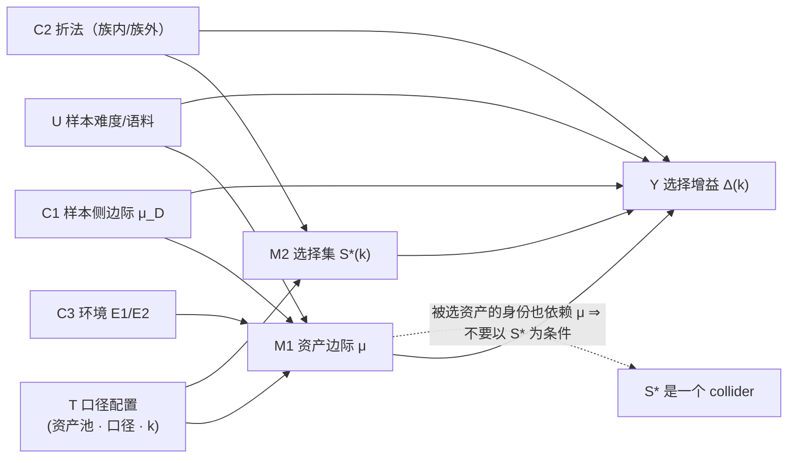

# 710-C2 · F1 的因果图、混淆变量与偏误方向

- **批次**：710 ｜ **任务**：C2 ｜ **日期**：2026-10-09
- **数据支撑**：`data/710_equal_marginal.json`（本批只读近似）、`data/677c_*`、`data/698_composition_drift.json`、
  `data/700_counterfactual_design.md`、论文 F1（`queyi_neurips2027_v1.1.tex` 行 428–452）
- **红线**：`detect_calls = 0`；**0 处**论文正文/bib 修改。

---

## 0. 一句话

> F1 的"处理"（treatment）不是一个二元变量，而是**四个旋钮**（口径 / 池内资产 / 池规模 / 预算 $k$）。
> 本批给出**顺序加法分解**（每一步一个旋钮，逐位对账）：
> $$+24.03\text{pp} \xrightarrow{-9.55} +14.48 \xrightarrow{-8.27} +6.21 \xrightarrow{-4.65} +1.55
> \xrightarrow{+10.74} +12.30\text{pp}$$
> （口径 → 去掉 2 个零产资产 → 去掉 linker → 换 $k{=}4\to1$）
> ⇒ **"构成 vs 机制"的争论被拆成可各自归因的四块**；其中**唯一必须条件化的混淆是样本侧边际
> 与折法**，而两者实测合计 **≤1.06pp**。

---

## 1. 因果图（DAG）

### 1.1 节点定义

| 记号 | 变量 | 取值 |
|---|---|---|
| $T$ | **处理**：报告口径配置 | $\{$全池-8, 池-6(去零产), 池-6(含 linker), Pool A-5$\}$ × $\{$单点, 期望$\}$ × $k$ |
| $Y$ | **结果**：选择增益 | $\Delta(k)$（pp） |
| $M_1$ | **中介**：资产边际向量 | $\mu=(\mu_a)_{a\in P}$（逐资产 catch 率） |
| $M_2$ | **中介**：选择集 | $S^\*(k)=\arg\max_k$（频率/贪心） |
| $C_1$ | **混淆**：样本侧边际 | 缺陷类型分布 $\mu_D$（及语料来源） |
| $C_2$ | **混淆**：折法 | 随机折 vs 克隆家族折（族内记忆） |
| $C_3$ | **环境** | E1(WSL/g++) vs E2(native)，决定 $\mu$ 的可测部分 |
| $U$ | **未观测**：样本难度 / 语料特异性 | 不可观测（部分由 $C_1$ 代理） |

### 1.2 图（Mermaid）

### 1.3 三条关键结构

1. **$M_1$（$\mu$）是中介而不是混淆**：$T\to\mu\to Y$ 是**要测的机制路径**
   ⇒ **不能**条件化 $\mu$（否则阻断机制）；这也是 §0 恒等式 $\Delta(1)=\mu_{\max}-\bar\mu$
   的因果读法：**在 $k{=}1$ 上，$Y$ 完全是 $\mu$ 的函数**。
2. **$C_1,C_2$ 是混淆**：它们同时影响 $\mu$/选择与 $Y$ ⇒ 必须条件化（backdoor：$T\perp U \mid C_1,C_2$）。
3. **$S^\*$ 是 collider**（$M_1\to S^\*\leftarrow$ 选择规则）⇒
   **"在 FD 选中的资产上做子集分析"会引入选择性偏误**（这是 677c §8 已登记的"单点抽样依赖一次抽样"的更一般形式）。

---

## 2. 现有实验控制了哪些路径

| 路径 | 是否混淆 | 677c/698 的控制 | 本批 710 的补强 | 控制后的残余 |
|---|---|:--:|---:|---|
| $T\to M_1\to Y$（资产边际） | ✅ 机制路径 | 未分解（只报净效应） | **顺序加法分解**（§3.1） | 0（定义分解） |
| $T\to M_2\to Y$（选择集） | ✅ 机制路径 | FD vs Random 两臂 | **$k{=}\vert P\vert$ 处集合同化** | 0 |
| $C_1\to\mu_D\to Y$（样本边际） | ⚠ **混淆** | 未控制（固定 566 帧，但语料边际未声明） | **协议 D 重加权：≤1.03pp**（$k{=}1$） | ≤0.45pp（Pool A $k{=}1$） |
| $C_2\to Y$（族内记忆） | ⚠ **混淆** | 677b 的 clone-aware split（样本侧） | **协议 A 族外折：≤1.06pp** | ≤1.06pp |
| $C_3\to M_1$（环境） | ⚠ **混淆** | 692 报告 E1/E2 能力闭包不同 | 本批未跑新环境（B2 是设计） | **未量化**（B2 的 E3/E4 才能测） |
| $U\to Y$（样本难度） | ⚠ 未观测 | 无 | 无（只能用 $C_1$ 代理） | **未知**（诚实缺口） |

> **读法**：**已被控制的混淆（$C_1,C_2$）合计 ≤1.06pp；未控制的（$C_3,U$）未量化**
> —— 这是 F1 的"机制残差 $+12.30$pp"目前的可信度边界。

---

## 3. 偏误方向与量级（用现有数据估算）

### 3.1 顺序加法分解（本批，逐位可对账）

从论文头条到"机制残差"，每一步只动**一个旋钮**（顺序分解，故各步可加）：

| 步 | 改动 | 起点 | 终点 | **该旋钮的贡献** |
|:--:|---|---:|---:|---:|
| 0 | 论文头条：单点口径 · 全池 8 · $k{=}4$ | — | **+24.0283** | — |
| 1 | ① 单点 → **期望**口径 | +24.0283 | +14.4801 | **−9.5482** |
| 2 | ② 去掉 2 个零产资产（8 → 6，即 Pool B/C） | +14.4801 | +6.2073 | **−8.2728** |
| 3 | ③ 去掉 linker（6 → Pool A 5） | +6.2073 | +1.5548 | **−4.6525** |
| 4 | ④ 换预算 $k{=}4\to k{=}1$（Pool A 的最优档） | +1.5548 | +12.2968 | **+10.7420** |
| 5 | ⑤ 同折内 → **族外折** | +12.2968 | +12.3057 | +0.0089 |
| 6 | ⑥ 样本边际 eval → uniform 重加权 | +12.3057 | +11.8450 | −0.4607 |
| — | **合计** | +24.0283 | **+11.8450** | **−12.1833** |

**三条读数**：

1. **最大两块是"口径"（−9.55）与"k 档位"（+10.74）** ——
   两者都不是"效应"，而是**报告选择**。⇒ **F1 争论的主战场是口径，不是能力**。
2. **退化资产（零产 2 个 + linker）合计 −12.93pp**，比"留下来的机制残差"（+12.30pp）还大
   ⇒ 与 698-A 的"表观增益 46.02% 来自构成"一致，但**方向被分解得更细**。
3. **$k{=}1$ 是唯一还剩 +10.74pp 的档** ⇒ 机制残差全部落在"$k{=}1$ 上选中 asan"这一件事上。

### 3.2 偏误方向规则

**问题**：如果 Pool A 的缺陷类型构成"更简单"（更容易被 asan 抓），会**高估**还是**低估**机制效应？

**形式化**：$\Delta(1) = \mu_{\max} - \bar\mu = \sum_a w_a (\mu_a - \mu_{\text{ref}})$。
若 Pool A 的样本组成让 $\mu_{\text{asan}}$ 抬高（例如内存安全类占比更高），
则 $\mu_{\max}$ 抬高而 $\bar\mu$ 也抬高——**净效应取决于抬高幅度是否集中在 asan**
（asan 是 $\mu$ 最高者 ⇒ 若样本构成只帮 asan，则 $\Delta$ **上偏**；若帮全体，则近似不变）。

**用本批数据估（协议 D）**：

| 重加权 | Pool A $\Delta(1)$ | 相对 eval 现状 |
|---|---:|---:|
| eval 现状 | +12.2968 | — |
| 语料（1137）边际 | +12.2756 | **−0.021pp** |
| 均匀 over groups | +11.8450 | **−0.452pp** |
| **偏误上界（两种极端）** | — | **≤0.45pp（≈3.7% 相对）** |

⇒ **"Pool A 的缺陷类型更简单"这一混淆在本数据上最多值 0.45pp**，
**不足以解释 +12.30pp 的残差**。**方向**：均匀化**降低**了 $\Delta$，
说明**现状的边际略偏向"帮 asan"** ⇒ 现状读数有**轻微上偏**（≤0.45pp）。

### 3.3 未控制的偏误（诚实清单）

| 偏误源 | 方向 | 量级 | 为什么没估 |
|---|---|---|---|
| $C_3$ 环境（E1/E2 混合） | 未知 | 未量化 | 692 只报 E1/E2 的 aggregate；F1 的 566 帧里 3 个 sanitizer 来自 WSL、`cw/cc/linker` 来自 native ⇒ **口径是"混合环境"**（692 已登记） |
| $U$ 样本难度 | 未知 | 未量化 | 无独立难度标注（`hung_flag` 是运行结果不能当事前难度） |
| 语料特异性（92.9% 人工植入） | 可能**上偏** | 未量化 | 需 S5（换样本池，710-C1 §4.1） |
| 单点抽样的运气 | ±（0.2 碰撞概率） | ≤9.55pp（已用期望口径消除） | ✅ 已处理 |

---

## 4. 可检验的推论（供后续批次）

| # | 推论 | 检验方式 | 若被证伪 |
|:--:|---|---|---|
| R1 | 在 $k{=}1$ 上，$\Delta$ 与 $\mu_{\max}-\bar\mu$ **恒等**（对任意"选最高边际"的选择器） | 换一个完全不同的选择器（如随机森林特征重要性）重跑 $k{=}1$ | 说明选择器并非"选最高边际"⇒ F1 的"选择能力"叙事需要重写 |
| R2 | 族外增益 ≈ 同折内增益（差 ≤1.06pp） | 换 seed / 换折数（3、10 折）重跑协议 A | 说明族内记忆比本批估计的更强 |
| R3 | 样本侧边际对 $\Delta(1)$ 的影响 ≤2pp（任何重加权） | 换更多目标边际（按 source_batch、按 planted、按真实/合成） | 说明 $C_1$ 是主混淆 ⇒ 需要 S5 换语料 |

---

## 5. 诚实边界

1. §3.1 的**顺序分解不是唯一分解**（各旋钮不独立：换 $k$ 会改变池的有效边际，
   去资产会改变 $k$ 的最优档）⇒ **各步贡献只在给定顺序下有含义**，不能读作"独立方差份额"。
2. §3.2 的"≤0.45pp"只覆盖**一种**混淆（样本侧缺陷类型边际），
   不覆盖语料来源（真实 vs 合成）的构成 —— 后者需要 S5（710-C1 §4.1）。
3. **$k{=}1$ 的恒等式是代数恒等式**（对"选最高边际"的选择器）；
   对 $k\ge2$ 没有类似封闭形式，本文件没有给出。
4. DAG 的**未观测节点 $U$** 无法从现有数据识别 ⇒ 本 DAG 是"部分可识别的"，
   不是完整因果模型（未做 do-calculus 的完整推导）。
5. 本文件**不修改**论文 F1 的任何陈述与数字；§3.1 的分解是**追加的可审计账**。

---

*文件生成：2026-10-09 ｜ 批次 710 任务 C2 ｜ `detect_calls` = 0 ｜ 未修改论文正文与 bib*
