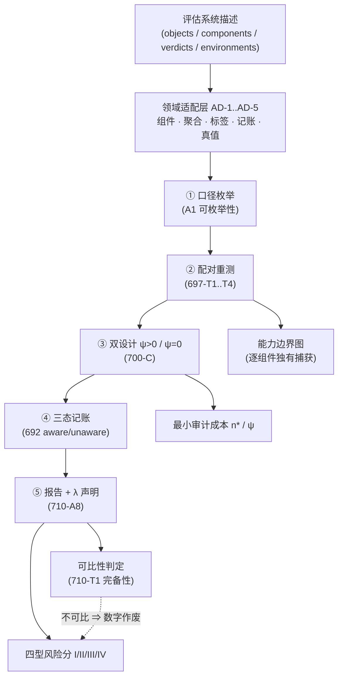

# 710-B3 · 跨领域审计协议的统一元框架

- **批次**：710 ｜ **任务**：B3 ｜ **日期**：2026-10-09
- **综合来源**：`697_measurement_drift_algebra.md`（四型 + 公理）、
  `698_audit_framework.md`（评分器）、`698_drift_algebra_extended.md`（T5/T6 + 健康度）、
  `700_cross_domain_empirical.md`（LLM 迁移分）、`700_information_theory.md`（样本复杂度）、
  `707_dual_design_landing.md`（五步协议可执行化）、`710_a8_formalization.md`（A8）、
  `710_transfer_theory.md`（定理 710-T2）
- **红线**：`detect_calls = 0`；**0 处**论文正文/bib 修改。

---

## 0. 一句话

> 把 697/698/700/707/710 的结果收成**一个可执行元框架**：
> **输入**一个评估系统（任意领域）→ **输出**该系统的**测量漂移风险评分 + 能力边界图 + 可比性判定**
> —— 中间不需要知道领域细节，只需要填 **5 个适配器**（组件 / 聚合 / 标签 / 记账 / 真值）。
> 框架的每个数字都锚在某个具体定理或实测上，**没有一处是自创指标**。

---

## 1. 输入 / 输出契约

### 1.1 输入（一个"评估系统描述"）

```jsonc
{
  "system": "<名字>",
  "domain": "<领域标签，仅用于报告，不影响计算>",
  "objects":    [ {"id": ..., "truth": "positive|negative|unknown"} ],   // 被评对象 + 真值（可缺）
  "components": [ {"id": ..., "kind": "detector|judge|rater|instrument"} ],
  "verdicts":   { "<object_id>": { "<component_id>": "catch|miss|unknown|absent" } },
  "environments": { "reference": {...}, "current": {...} },             // 两个或多个口径
  "aggregation_rules": [ "or", "max", "at_least_2", "mean", ... ],
  "label_vocabularies": [ {"name": ..., "map": {"<object_id>": "<label>"}} ],
  "accounting_calibers": ["unaware", "aware"],
  "declared_profile": ["<component_id>", ...]                            // 声称要跑/要用的组件
}
```

### 1.2 输出（四件套）

| # | 输出 | 依据 | 消费者 |
|:--:|---|---|---|
| 1 | **四型风险分**（I/II/III/IV，0–100，取最大为总风险） | 698-A §5 的评分器（已实现：`tools/detect_698_structural_goodhart.py`） | 评估系统所有者 |
| 2 | **可比性判定**（口径签名是否齐备：$(D,A,E,\Theta,P,\lambda)$ + 原始矩阵是否保留） | 710-T1（完备性判定） | 报告读者 / 复现者 |
| 3 | **能力边界图**（逐组件/逐类型盲区 + 独有捕获） | 697-C / 698-A §2 | 采购/选型决策 |
| 4 | **最小审计成本**（配对样本数 $n^\*$ 与"最低产组件"$\psi$） | 700-C / 700-F 的样本复杂度 | 预算决策者 |

---

## 2. 元框架 = 五步协议 + 五适配器

### 2.1 五步协议（707-D 已实现，`tools/audit_protocol.py`）

| 步 | 动作 | 失效模式（不做的后果） |
|:--:|---|---|
| 1 | **口径枚举** | 口径空间无限 ⇒ 不变性检验不可判定（697 定理 A3a） |
| 2 | **配对重测** | 只有设计级对照 ⇒ 构成漂移与机制效应不可分（697 定理 A1） |
| 3 | **双设计**（ψ>0 走配对；ψ=0 走设计级） | 对 Type III/IV 用配对设计 ⇒ 功效恒为 0（700-C：$\psi=0$） |
| 4 | **三态记账**（catch/miss/unknown） | "没测"写成 miss ⇒ 静默退化（692：$\Delta_{\text{unknown}}=0$） |
| 5 | **报告与 λ 声明** | 未声明 λ ⇒ 分组统计不可比（710-A8） |

### 2.2 五个领域适配器（**本批新增**，把 697–710 的领域相关部分隔离出来）

| 适配器 | 作用 | C++ 实例 | LLM 实例 | 教育评估实例（示例） |
|---|---|---|---|---|
| **AD-1 组件** | 定义"组件"与"零能力组件" | 8 检测器；零能力 = 恒 miss 资产 | judge；零能力 = 恒弃权/coin-flip | 阅卷人；零能力 = 随机给分 |
| **AD-2 聚合** | 枚举聚合族 + 判"是否对组件数敏感" | OR/max/≥2/mean/min | 多数票/OR/均值 | 平均分/中位数/最高分 |
| **AD-3 标签** | 给出词表层级（保证是真粗化链） | 34 类→14 组→8 家族 | 细/粗词表（692 两档） | 分数切点（连续 λ） |
| **AD-4 记账** | 定义"缺测量"如何表示 | unaware/aware（三组件） | 弃权 vs 未答 vs 错答 | 缺考 vs 答错 |
| **AD-5 真值** | 给出非循环真值源（可缺，缺则降级） | `expected_verdict` | 人类标注（**当前 = 0**） | 标准答案/仲裁 |

> **框架的核心主张**：**四型漂移的代数与定理与领域无关**（697–710 的所有定理只用到
> "组件 × 对象 → 三态裁决"这一结构），**领域相关性全部被隔离在 AD-1..AD-5 里**。
> 这正是定理 710-T2（迁移判据 I1–I5）在工程上的对应物：
> **I1–I5 = "五个适配器都能填"**。

---

## 3. 框架图

### 3.1 主流程（Mermaid）



### 3.2 塌陷图（缺哪个适配器 ⇒ 哪个输出死）

```
                      AD-1 组件 ──缺──▶ 输出1 的 IV 分量 = 0（Type IV 不可测）
                      AD-2 聚合 ──缺──▶ 输出1 的 IV 分量 = 0（同上，且 T1/T4 退化）
   五适配器 ──────────  AD-3 标签 ──缺──▶ 输出2 = "不可比"（Type III 静默；710-A8）
                      AD-4 记账 ──缺──▶ 输出1 的 II 分量 = 0（Type II 静默；692）
                      AD-5 真值 ──缺──▶ 输出1 的 III 分量（Goodhart）不可读
                                         ⇒ 只能测"一致/分歧"，不能测"对/错"（700-D §3）
```

### 3.3 与四型漂移的映射（可审计性表）

| 型 | 现象 | 框架里对应的**可观测** | 需要的适配器 | 阈值（698-A） |
|:--:|---|---|---|---|
| **I 构成** | 表观增益来自池/分母构成 | $g_{\text{app}}$、零产组件数、边际极差 | AD-1, AD-2 | ≥ 25 MEDIUM / ≥ 50 HIGH |
| **II 环境** | 丢失的能力被静默写成"没检出" | $\Delta_{\text{unknown}}$、负例污染率 | AD-4, AD-5 | 同上 |
| **III 标签** | 同一裁决在不同词表下给出不同的分组统计 | 跨 λ 摆幅、λ 可操纵性 | AD-3 | 同上 |
| **IV 聚合** | 不增加能力即可改变报告值 | $\sigma(\rho)$（可操纵性泛函） | AD-1, AD-2 | 同上 |

---

## 4. 已知局限（**穷尽列表**，不是举例）

1. **真值缺口是全局天花板**：AD-5 若为"声明标签"（Queyi 现状 / LLM 现状），
   则所有"错"的判定都是**相对于声明**的，不是相对于世界（692 T17：人类 IAA = 0）。
   ⇒ 框架能测"漂移"，**不能测"正确性"**。
2. **四型清单可能不完备**（700-A §5.7）：本框架只覆盖 I–IV；第五型的空间未被证明为空。
3. **评分是启发式**：四型分与总分（取最大）的阈值 25/50 是 698-A 自定，无外部标定；
   分量权重（若用平均）是任意的。
4. **适配器 A3（标签）在连续域会退化**：教育评估的分数切点是**连续参数**，
   "词表"变成"阈值族"，710-A8 的 $B_n$（Bell 数）论证不直接适用（需换成
   "切点族的势 × 噪声"论证）。
5. **AD-1 的"零能力组件"在某些领域伦理/物理上不可实现**（710-B1 §4：医疗评估）
   ⇒ Type IV 只能做回顾性替代。
6. **框架不处理时间轴**：漂移链（T5）只能逐段配对，跨段时间序列未形式化
   （698-B §4.2 的历史序列是**代理序列**，不是同一仪器的时序）。
7. **成本模型是单场景的**（698-B §2：预算策略对比只在 Queyi 的 566 条上做过）。
8. **所有量级来自 $n\le 1147$、92.9% 人工植入的语料**，不代表真实缺陷分布。

---

## 5. 开放问题（按可攻击性排序）

| # | 问题 | 为什么重要 | 最小攻击方式 |
|:--:|---|---|---|
| Q1 | **A9\*（样本轴闭包）能否形式化为真公理？** | 构成漂移（Type I）目前只有实测，没有公理位置 | 构造"边际不同但逐样本裁决相同"的配置对，验证与 A1–A8 独立（710-A1 §4.2 给了激励） |
| Q2 | **第五型漂移存在吗？** | 决定四型清单是否穷尽 | 在更大的聚合族/更多轴的模型域上穷举（700-A 的域只有 7 聚合） |
| Q3 | **λ 的可操纵性有没有"下界"？** | 710-A3 给出可达上界 92.86%（真粗化）；是否有信息论下界？ | 把"选词表"建模为对抗优化，用最大覆盖/子模的近似界（684/700-A §4 已有工具） |
| Q4 | **"零能力组件"的领域无关定义** | 迁移判据 I3 的判据现在依赖领域直觉 | 形式化：$c^\*$ 零能力 $\iff$ 对一切对象 $A(c^\*,\cdot)$ 与 $\mathcal{O}$ 独立 ⇒ 可检验的统计判据 |
| Q5 | **框架能否反哺论文主结论？** | 现在框架是"事后综合" | 用框架重跑 E1–E10 的每一条，标注每条需要哪几个适配器（可作附录矩阵） |

---

## 6. 与论文的关系（**建议，不改正文**）

| 建议位置 | 内容 | 成本 |
|---|---|---|
| 第二篇 §2（Method） | 把"五步协议"升级为"五步 + 五适配器"（本文件 §2） | 中（需重排一页） |
| 第二篇 §7（Threats） | 引用 §4 的 8 条局限（尤其第 1、4、6 条） | 低 |
| 第二篇附录 | 框架图（§3.1/§3.2）+ 四型映射表（§3.3） | 低 |
| 第一篇 §7 / 附录 | 只加一句交叉引用（统一框架在 companion paper） | 极低 |

> **红线遵守**：本文件只给建议与锚点，**0 处正文改动**；正文合并由统一批次执行。

---

*文件生成：2026-10-09 ｜ 批次 710 任务 B3 ｜ `detect_calls` = 0 ｜ 未修改论文正文与 bib*
