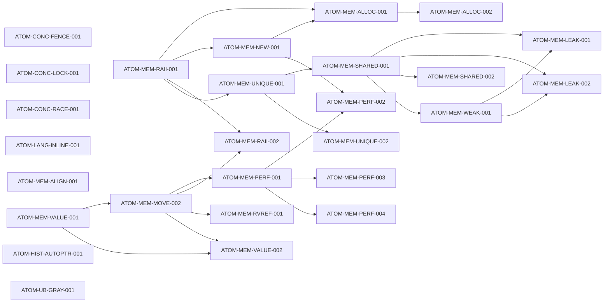

# 613 · 推荐学习路径图（C3）

> 生成：`python tools/learner_path_graph_613.py` ｜ 时间：2026-09-20T23:50:49
> 算法：Kahn 拓扑排序（同层按 难度→KC id 确定性定序）；掌握阈值 = **0.5**。
> 依赖边只取自 `prerequisites`；`successors` 仅交叉核对。

## 一、规模

| 项 | 值 |
|---|---|
| KC 总数 | 27 |
| 拓扑有序 | **27** |
| 环内节点（后置到末尾） | 0 |
| 已掌握（≥0.5） | 0 |
| 待学习 | 27 |

## 二、推荐路径（有序）

| # | KC | 难度 | 掌握度 | 状态 | 前置 |
|---|---|---|---|---|---|
| 1 | ATOM-CONC-FENCE-001 | 1 | 0.1000 | ⬜ 待学习 | — |
| 2 | ATOM-CONC-LOCK-001 | 1 | 0.1000 | ⬜ 待学习 | — |
| 3 | ATOM-CONC-RACE-001 | 2 | 0.1000 | ⬜ 待学习 | — |
| 4 | ATOM-LANG-INLINE-001 | 2 | 0.1000 | ⬜ 待学习 | — |
| 5 | ATOM-MEM-ALIGN-001 | 2 | 0.1000 | ⬜ 待学习 | — |
| 6 | ATOM-MEM-RAII-001 | 2 | 0.1000 | ⬜ 待学习 | — |
| 7 | ATOM-MEM-VALUE-001 | 2 | 0.1000 | ⬜ 待学习 | — |
| 8 | ATOM-HIST-AUTOPTR-001 | 3 | 0.1000 | ⬜ 待学习 | — |
| 9 | ATOM-UB-GRAY-001 | 5 | 0.1000 | ⬜ 待学习 | ATOM-UB-DEF-001 |
| 10 | ATOM-MEM-NEW-001 | 2 | 0.1000 | ⬜ 待学习 | ATOM-MEM-RAII-001 |
| 11 | ATOM-MEM-UNIQUE-001 | 2 | 0.1000 | ⬜ 待学习 | ATOM-MEM-RAII-001 |
| 12 | ATOM-MEM-MOVE-002 | 4 | 0.1000 | ⬜ 待学习 | ATOM-MEM-VALUE-001 |
| 13 | ATOM-MEM-ALLOC-001 | 2 | 0.1000 | ⬜ 待学习 | ATOM-MEM-NEW-001、ATOM-MEM-RAII-001 |
| 14 | ATOM-MEM-SHARED-001 | 2 | 0.1000 | ⬜ 待学习 | ATOM-MEM-UNIQUE-001 |
| 15 | ATOM-MEM-UNIQUE-002 | 2 | 0.1000 | ⬜ 待学习 | ATOM-MEM-UNIQUE-001 |
| 16 | ATOM-MEM-PERF-001 | 1 | 0.1000 | ⬜ 待学习 | ATOM-MEM-MOVE-002 |
| 17 | ATOM-MEM-RAII-002 | 2 | 0.1000 | ⬜ 待学习 | ATOM-MEM-MOVE-002、ATOM-MEM-RAII-001 |
| 18 | ATOM-MEM-RVREF-001 | 2 | 0.1000 | ⬜ 待学习 | ATOM-MEM-MOVE-002 |
| 19 | ATOM-MEM-VALUE-002 | 2 | 0.1000 | ⬜ 待学习 | ATOM-MEM-MOVE-002、ATOM-MEM-VALUE-001 |
| 20 | ATOM-MEM-ALLOC-002 | 2 | 0.1000 | ⬜ 待学习 | ATOM-MEM-ALLOC-001 |
| 21 | ATOM-MEM-SHARED-002 | 2 | 0.1000 | ⬜ 待学习 | ATOM-MEM-SHARED-001 |
| 22 | ATOM-MEM-WEAK-001 | 2 | 0.1000 | ⬜ 待学习 | ATOM-MEM-SHARED-001 |
| 23 | ATOM-MEM-PERF-002 | 2 | 0.1000 | ⬜ 待学习 | ATOM-MEM-NEW-001、ATOM-MEM-PERF-001 |
| 24 | ATOM-MEM-PERF-003 | 2 | 0.1000 | ⬜ 待学习 | ATOM-MEM-PERF-001 |
| 25 | ATOM-MEM-PERF-004 | 2 | 0.1000 | ⬜ 待学习 | ATOM-MEM-PERF-001 |
| 26 | ATOM-MEM-LEAK-001 | 2 | 0.1000 | ⬜ 待学习 | ATOM-MEM-SHARED-001、ATOM-MEM-WEAK-001 |
| 27 | ATOM-MEM-LEAK-002 | 2 | 0.1000 | ⬜ 待学习 | ATOM-MEM-SHARED-001、ATOM-MEM-WEAK-001 |

## 三、下一步建议（前 5 个可学 KC）

- **ATOM-CONC-FENCE-001**（难度 1，掌握度 0.1000）— 前置已满足
- **ATOM-CONC-LOCK-001**（难度 1，掌握度 0.1000）— 前置已满足
- **ATOM-CONC-RACE-001**（难度 2，掌握度 0.1000）— 前置已满足
- **ATOM-LANG-INLINE-001**（难度 2，掌握度 0.1000）— 前置已满足
- **ATOM-MEM-ALIGN-001**（难度 2，掌握度 0.1000）— 前置已满足

## 四、依赖图（Mermaid）

> 掌握度来源：`data/learner_state_612.jsonl`（612 为 simulate 模拟值；
> 613 C2 接入真实行为后本图自动反映真实掌握度）。
