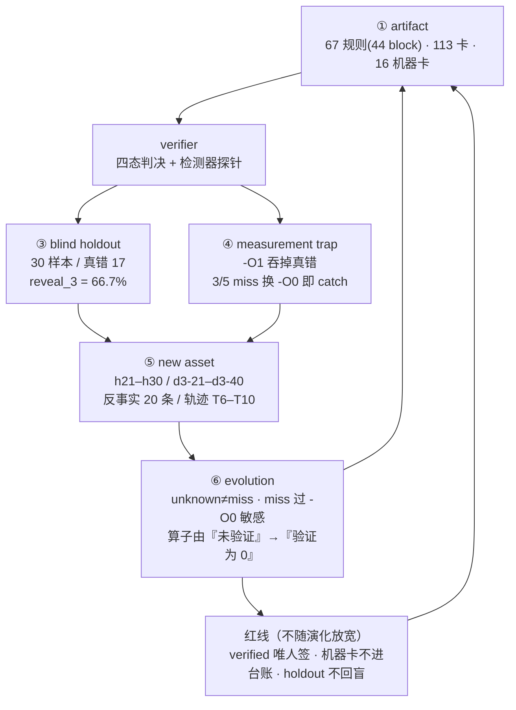

# 665 F2 · 图 1：系统闭环图（artifact → verifier → failure → new asset → verifier evolution → blind holdout）

> 用途：论文 Figure 1 草图。**每个节点都标注了 665 批的真实数字与可复算入口**，
> 不是概念示意图——图上出现的每个数都能在 `data/` 里找到出处。

---

## ASCII 版（可离线读、可贴进代码注释）

```text
┌──────────────────────────────────────────────────────────────────────────────────┐
│  ① artifact（知识资产）                                                          │
│     67 条判决规则（44 block） · 113 张 atom/evidence 卡 · 16 张 665 机器卡         │
│     入口：tools/ig_cards_665.py --build                                          │
└───────────────────────────────┬──────────────────────────────────────────────────┘
                                │  ② verify（四态判决 + 证据 provenance）
                                ▼
┌──────────────────────────────────────────────────────────────────────────────────┐
│  verifier（gate_engine + 67 规则 + sanitizer/编译器探针）                          │
│     MISS / catch / unknown 三分（unknown ≠ fail，也 ≠ miss）                      │
│     入口：tools/ig_cards_665.py --check （16/16 签名复算）                         │
└───────────────┬──────────────────────────────────┬───────────────────────────────┘
                │ ③ failure（失败样本）             │ ④ measurement trap（本批新增）
                ▼                                  ▼
┌────────────────────────────────────────┐  ┌──────────────────────────────────────┐
│ blind holdout（已 reveal，永不回盲）    │  │ 编译档陷阱：-O1 把内存操作优化掉       │
│  20 → 30 样本（真错 7 → 17）            │  │  ⇒ 5 个 miss 里 3 个换 -O0 就能 catch  │
│  reveal_3：66.7%（10/15 可测）          │  │  ⇒ "假 miss" 会造成错误结论            │
│  外部 corpus 40：43.8%（A54/B12/C0）    │  │ 入口：tools/holdout_reveal_3_665.py    │
└───────────────┬────────────────────────┘  └──────────────┬───────────────────────┘
                │ ⑤ new asset（新资产）                     │
                ▼                                          ▼
┌──────────────────────────────────────────────────────────────────────────────────┐
│  新增：10 个真错样本（h21–h30） · 20 条外部样本（d3-21–d3-40）                      │
│        10 条带真值标签的反事实案例 · 5 条轨迹（T6–T10）                            │
│  修正：ig-04 反例构造成立性不成立 ⇒ 新增 ig-16 修正探针                            │
└───────────────────────────────┬──────────────────────────────────────────────────┘
                                │ ⑥ verifier evolution（验证器/测量口径演化）
                                ▼
┌──────────────────────────────────────────────────────────────────────────────────┐
│  口径升级：unknown（检测器不可用）与 miss（未呈现）**分开统计**；                  │
│            miss 必须过一遍 **-O0 敏感性**；                                        │
│            反事实算子从"没验证"升级为"**验证为 0**"（P=R=F1=0）                    │
│  红线不变：verified 唯人签；机器卡不得进教学台账；holdout 不回盲                    │
└───────────────────────────────┬──────────────────────────────────────────────────┘
                                │ ⑦ 回灌：新资产进 ①（闭环）
                                ▼
                          （回到 ① artifact）
```

## Mermaid 版（前端/论文用）



## 图上每个数字的出处（可复算）

| 数字 | 出处 |
|---|---|
| 67 规则 / 44 block | `web/data/status.json.rules`（`tools/web_status_655.py` 现算） |
| 113 张原子/证据卡 | `tools/counts_659.py` 口径（`ATOMS_REAL=37` 等） |
| 16 张机器卡 / 四态 pass 12 unknown 4 | `data/cards_665/index_665.json` |
| holdout 30 样本 / 真错 17 | `data/holdout/holdout.json`（`extend_665` 段） |
| reveal_3 = 66.7% | `data/holdout_reveal_3_665.json` |
| 外部 corpus 43.8% / 分层 | `data/external_corpus_reveal_665.json` |
| 反事实 P=R=F1=0 | `data/counterfactual_cases_665.json` |
| verifier fast 红 125 | `queyi-verifier/pytest_fast_665.txt` |

## 诚实标注

- ③ 的 holdout **已经 reveal ⇒ 永不回盲**；665 追加的 10 个样本**不具备盲态**，
  图上把"盲化"画在 ③ 只表示**流程位置**，不代表新样本的效力。
- ④ 的敏感性只解释 miss 的**成因**，**不回改** ③ 的检出率数字（报告正文仍用 `-O1` 口径）。
- ⑥ 的演化**没有**放宽任何红线；图上红线画成独立节点，就是为了让"演化"与"松绑"看起来不是一件事。
