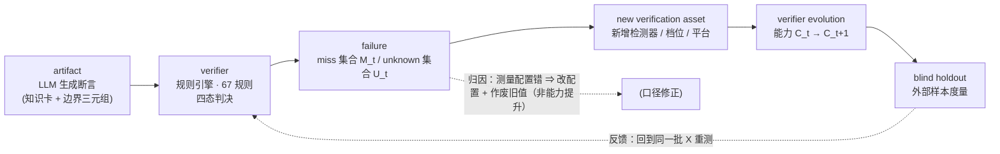
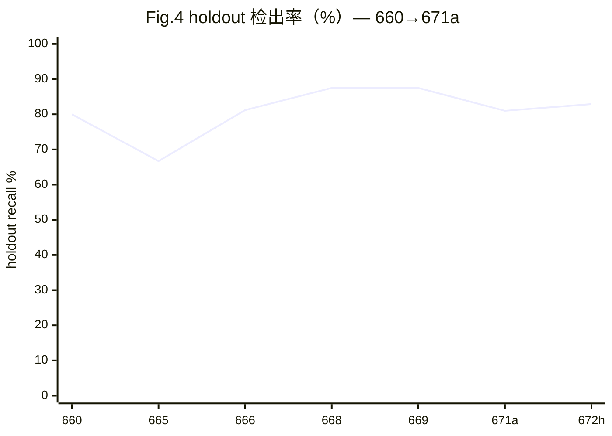

# 演化中的验证器：失败驱动的证据获取与可审计的知识验证
## —— Evolving Verifiers: Failure-Driven Evidence Acquisition with Auditable Provenance（**v1.3 · 677d** · 含 baseline 三臂 + ablation 框架 + 672h 扩样数字 + 676f A5 全量 + 676g 盲区地图 + LLM 裁判臂 + 外部锚定 + 677a 表述修订）

> **本稿说明（v1.1 · 673c）**：本稿在 v1.0（673a）基础上，按 `docs/673c_红队批判报告.md` 的六个维度批判做**修订 + 人味增强**。
> **数字一律与 v1.0 一致**（人味增强不改数字；凡本稿出现的数字，均可在 `data/current_numbers.json` 的 672h 权威源复算）。
> **v1.1 新增**：§3.3 T17–T19 三条威胁；§3.5 六个设计取舍；§4.9 工程现实（WSL / tectonic / CRLF / 多 Agent 并行）；
> §7.8 五个真实失败案例；§7.9 我们的判断边界；§10 结论补限定语。**v1.1 修掉 v1.0 残留的 8 处矛盾（W1–W8，见批判报告 §6.4）**。
> 批判报告中**写作层面无法修的硬伤**（clang-tidy 对照已补 E9 探索性对比、标签效度 0 人复核）已在 §9.2 与 §7.9 显写，**不用新增内容掩盖**。（原列的"A0–A5 未跑"一项已由 **675a→676f** 更新——A5 已在全量池上跑，见下条。）
>
> **本稿说明（677d · 并入 677b/677c 实验结果；与英文稿 v1.3 同步）**：**① clone-aware 重切分（677b）**——按模板家族（**474** 个全对凝聚家族；strict 变体 = 克隆关系图 **420** 个连通分量，**任意一对判克隆的样本都不跨 split**）重切分后，主端点 **+24.0 → +23.0~+26.7pp 不变**（p ≤ 4.1×10⁻²⁹，96.3–97.6% 随机抽样更劣），并列分析 k=4 **仍归零**（−0.53~+0.00pp）⇒ **两个结果都不是模板家族泄漏的产物**（原 split 下 **64.5% 的评估样本**在派生侧有同族 sibling、3124 对判克隆中 1553 对跨 split）；**但按家族 cluster bootstrap 得设计效应 ≈4.05–4.26 ⇒ 有效样本量 ≈133–140（名义 566）**，Δ 的 CI 需按 **1.78–2.10×** 放宽（[+16.6,+30.4] / [+18.3,+33.4]pp，均不含 0）。**② 非退化池（677c）**——严格池（5 资产 asan/compiler-warn/cross-compile/tsan/ubsan）上 **k=1/2/3 仍显著**（最优 k=1：FD **33.04%** vs Random **21.73%**，Δ单点 **+11.31pp**，p=6.02×10⁻⁸；对 2000 次均值 **+12.26pp**；k=2/3 = **+7.42pp**），**k=4 的 Δ=0 是选集碰撞**（概率 1/C(5,4)=0.2）**而非机制反证**；退化资产在 k=4 主预算上贡献 **+24.03pp（单点）/ +12.81pp（对均值）** ⇒ **机制层面的选择效应 ≈ +7~12pp，不是 +24pp**；Pool A 不含预注册退化资产 ⇒ `uninterpretable` 条款在该池**不触发**（Pool B/C 含 `linker`，仍触发）。**③ Evolution operator 算法化**——`score(a|F_t,C_t)=w1·failure_coverage+w2·novel_coverage−w3·cost−w4·redundancy`，`a*=argmax`（同分 id 升序），默认权重 (0.3,0.4,0.1,0.2) **未学习**；如实披露两处：literal 定义下 **novel≡failure**（规格字面坍缩，非实现错误）、**frequency≡FD**（当前 FD 即朴素频率基线）；消融：full 检出率优于 676f FD 的档位 **3/14**（k=4 最好情形 +1.41pp，p=0.302，**不显著**）⇒ 算法化的即期价值在**可证伪性**，不是检出提升。**④ 定性不变**：A5 **仍为方向证据/条件结论**，不得升级为"FD 优于随机"的确认性主张（full-refit bootstrap 下 Δ 区间下界贴 0，Δ≤0 比例 2.2–3.0%）。版本 of record 见 `research/latex/VERSION.md`（v1.3 · 677d）。
>
> **本稿说明（677a · 表述修订，不改数字、不改结论）**：**① 术语**：全文 "verifier" 一律指 **evidence-acquisition 装置**——`pass` 只表示"在当前能力边界内未获得与之矛盾的证据"，**不是**语义真值（英文稿新增 §3 Terminology 段 + Claim Boundary 第一条 **C0**）；**② 盲区口径**：**38.4%** 一律带 **instrument-boundary** 限定（"在本库 1147 样本 + 8 资产上"），**不**得读成"真实世界 C++ 缺陷有 38.4% 不可检测"；高盲区类型数由转录不全的 **15/70** 统一为 **18/70**（权威 `data/blindspot_676g_stats.json` 的 `by_type` 中 `blindspot_ratio>0.5` 计数）；**③ 统计**：**Verifier Coverage 73.8%** 去掉无抽样基础的 **95% CI [58.0, 86.1]**（42 张卡是**全枚举**而非抽样 ⇒ 只报描述性百分比）；**④ e-process 降级为 exploratory**（正文压至 2 句，完整内容移附录并标注，不作为证据强度、不进 Claim 表）；**⑤ provenance 三分类**：`planted=false` 的 74 条改称 **source-derived reconstruction**（真实 CVE/issue 的**单文件教学化重构**，非原始生产代码），**不**得写 "74 real defects"；**⑥ 投稿政策**：2026 起 D&B 更名 **E&D** 且**通常双盲**，模板为 2025 placeholder，Croissant/RAI 元数据登记为待办。**版本 of record：`research/latex/VERSION.md`。**
>
> **本稿说明（676h · 权威数字基线，与英文稿 v1.1 同步；下方 675a 段落中 A5 数字已被本段取代）**：
> **A5 已在全量样本上重跑（676f）**——**1137** 总样本（去重 10 条）、派生 **571** / 评估 **566**（≫ 预注册 138）、planted=false 74；k=4、全 8 资产池：FD **54.6%（309/566）** vs Random **30.6%（173/566）** vs Static **24.7%（140/566）**；Δ(FD−Random)=**+24.0pp** CI [+20.5, +27.5]，**p=2.3×10⁻⁴¹**，h=0.49，b=136/c=0；Δ(FD−Static)=**+29.9pp** CI [+25.2, +34.5]，**p=1.9×10⁻³¹**；2000 次重采样中 FD 严格更优 **97.6%**。
> **预注册并列分析（剔除 3 个退化资产）必须同读**：`wunsequenced`、`compile-time` 在全部 1137 条上 **100% `unknown`（0 catch）**，加上预注册 5% 退化门槛把 `linker`（catch 率 **0.88%**）一并纳入 ⇒ 8−3=5 个候选；剔除后 **FD-vs-Static 增至 +30.6pp（p=8.1×10⁻³⁴）**，而 **FD-vs-Random 掉回 0.0pp（p=1.0）**——五候选池下 Random 的 k=4 抽到的正是同一组四个资产。**结论不变：A5 证明的是"不要把预算花在无法提供信息的资产上"，不是"排序更聪明"；`uninterpretable` 条款再次触发，仍登记为方向证据。**
> **本批新增（676g 能力边界地图，新增第 6 条贡献）**：1147 样本 × 8 资产矩阵：catch **707** / miss **440** ⇒ **盲区比 38.4%**。**口径限定（677a 必读）**：这是 **instrument-boundary 统计**——分母是**本库 1147 样本**、仪器是**这 8 个资产**；它**不**意味着"真实世界 C++ 缺陷有 38.4% 不可检测"，换语料或换资产池该值即变。**本稿此后每次引用 38.4% 都必须带此限定。**
> 其余：6 资产并集 **61.6%** vs 最佳单资产（asan）**35.6%**；**18/70** 缺陷类型 >50% 盲（uninitialized read、deadlock、endianness、interrupt safety、logic_error、virtual_function、condition_variable 等）；planted=true 盲区 **41.0%** [38.0, 44.1] vs planted=false **21.6%** [13.8, 32.3]（自造缺陷反而更难）；TSan 三次重跑 **3/180** 翻转（1.7%）。**读者须知：本稿任何检出率都只描述"可见区域"。**
>
> **本稿说明（676m · 数据修复 + A5 重算 + 论文联动；与英文稿 v1.1 同步）**：
> **① 数据修复（H1/H2/M1–M5）**：34 条 `hung_flag=true` 样本的 `expected_verdict` 由 `catch` 修正为 **`miss`**（挂起的 sanitizer 不产生报告 ⇒ 真实判据是 miss，原登记与 676g 清单自身的 `hung_pool_reason` 矛盾）；`defect_type` 由 **56 个取值收敛到 34 项规范词表**（当前在用 33 项；`conditional_trigger`/`optimization_dependent` 两个**元标签从 `defect_type` 拆到 `trigger_condition`**，共 80 条）；`defect_location.file` 补全 **1042/1042**；expB 行号口径统一为**绝对行号**（逐条与源文件缺陷标记核对，**94/94 全部验证通过**）；`id`→`sample_id` 300 条；`defect_location` 描述键统一 948 条。规范见 `data/holdout_expansion/SCHEMA.md`。
> **② A5 重算（关键）**：A5 的 catch 口径读的是**真实 `detect` 判定**（`per_asset`），**不读 `expected_verdict`** ⇒ 修正后主端点 **逐位不变**（FD 54.6% vs Random 30.6%，Δ **+24.0pp**，p=2.3×10⁻⁴¹；并列分析 Δ **0.0pp**），**故不触发"重跑全量 detect"**（红线 8 的 >2pp 门槛未满足，实测变化 **0.0000pp**）。唯一受影响的是 **expected=catch 口径**：8 资产并集 recall **93.86% → 98.42%**（分母 **668 → 634**，分子不变）——这是**口径修正，不是检测器变强**。详见 `data/676m_A5重算报告.md`。
> **③ 数据质量披露（新增，必须在数据卡与论文中同读）**：跨批**字节级**重复 **0**；跨批**结构近克隆 103 对**（4 个批对，且修正前 **0 对标签相同**）；批内**模板克隆率 62.2%**（674/1083，全库仅 **572** 种不同代码结构）；盲化双标注（**第二标注者是 AI Agent，非人类**）Cohen's **κ=0.77（`defect_type`）/ 0.69（`expected_verdict`）/ 0.71（`planted`）**——**这是 AI 自洽性，不是人类 IAA**；编译抽检 **217/217 = 100%**；真实来源 **74/74 可追溯**（全部 HTTP 200）——但 677a 强调：这 74 条是 **source-derived reconstruction**（真实 CVE/issue 的**单文件教学化重构**），**不是** original external artifacts；`original-external-artifact` 计数为 **0**。**不删样本**（红线），只披露。
> **④ 检测器深度 Benchmark（676l）**：单检测器 recall **asan 58.5% > ubsan 38.2% > tsan 36.1% > compiler-warn 19.1% > cross-compile 15.1% > linker 1.3%**（`wunsequenced`/`compile-time` 恒 `unknown`）；8 资产并集 **94.21%**（635/674）；k=1…8 **穷举**最佳：k=4 = **92.58%**（asan/ubsan/tsan/compiler-warn），拐点 **k=5**；**FD 在 676f 选的 k=4 = 86.94%**，比穷举最佳低 **5.64pp**（对 2000 次随机抽样的百分位 **96.6**），差距来自 rank-4 的估计误差（派生集高估 `cross-compile`：170 vs 全池 122）；**`linker` 的 10 个 catch 全部落在 asan/ubsan/tsan 的 10 个 `unknown` 里** ⇒ 边际贡献虽仅 1.34pp，但覆盖的是动态资产**结构性看不见**的那一小块，**不可替代**。
> **可复现性入口**：仓库根 `REPRODUCE.md` + `bash docker/paper/run_all.sh`（fail-loud，任何不一致即非零退出）；种子审计 `tools/seed_audit_676h.py`（实验类未固定种子 **0**）；数字审计 `tools/verify_paper_numbers.py`（118 条检察 / 113 一致 / 0 硬伤）。**被取代的旧值（不得再引用）**：+55.0pp / +43.8pp / n=20/16 / 90.0% / 81.3% / 93.75% / 95.8% / 高盲区 **15/70**（→ 18/70）/ **VC 95% CI [58.0, 86.1]**（→ 描述性、无 CI）/ **e-value**（→ exploratory，不作证据强度）。
>
> **本稿说明（673s · 论文卓越打磨，与英文稿 v1.1 同步）**：§3.2 补 **Belnap $(\mathrm{support},\mathrm{refutation})$ 形式化 + 四态平面**（对应英文稿 `fig:belnap`）；§6.3 补 **口径影响示意**（对应英文稿 `fig:caliber`：52.6% → 54.8% → 62.5%）；英文稿为压回 ≤9 页把四态表移入附录，本文档无页数限制，表保留在 §4.2 并加一句指向形式化。**数字、结论、严谨性披露一律未改**（只补形式化与图注）。
>
> **本稿说明（v1.0，保留对照）**：v0.9 的**全部数字已同步至 672h 权威源**（`data/current_numbers.json`，
> schema `queyi-current-numbers/672h`）；**逻辑矛盾（§5.2/§5.3/§3.3-T8/§9.2）已修**；
> **新增 §6.7 LLM 裁判臂**、**§6.8 外部锚定**、**§4.8 e-process 序贯检验**、
> **§4.4 规则版本钉扎**、**§3.3 T13–T16 四条威胁**。仓库路径匿名化为**通用描述**。
> 所有数字**现算自仓库产物**；**未跑的实验一律标 `{{TODO_ablation_*}}`，绝不编造**。
> 正文每处改动均在 HTML 注释里标注来源文件（`<!--src:...-->`），渲染时不可见。
>
> **v1.0 数字基线（672h 扩样后）**：holdout 可测 **21→41**、corpus 可测 **48→64**；
> FD 检出率 holdout **82.9%（34/41）[67.9, 92.8]**、corpus **62.5%（40/64）[49.5, 74.3]**。
> **扩样样本在 reveal 之后并入 ⇒ 无盲态**，只用于增大样本量。
> **H4 子集一致性**：holdout 新/旧子集差 +4.0pp（与预注册 <20pp 一致）；
> **corpus 差 +33.3pp，超出预注册范围，如实登记为构成偏移**。
>
> **本稿的诚实边界（先写在最前）**：ablation 六组**设计已完成；A5 已跑但只到"方向证据"（池构成效应，触发 `uninterpretable`）；A0–A4 未跑**；
> **随机臂是仪器级代理†（真 B3 仅在旧分母 21/48 上跑过，扩样后未重跑）**；
> 真 `detect_static` 仍 **未暴露**。因此凡是依赖 ablation 结果的 Claim，
> 本稿**一律不给结论**，只给**预写假设 + 判读规则**。

---

## 摘要

验证一个断言不难，难的是让**验证能力本身**可被度量、可被质疑、可被外部打断。当被验证的对象由 LLM 批量生成时，固定尺子必然被记忆与污染磨损——真正需要演化的不是题目，而是**尺子本身**。本文把"验证器如何演化、如何自证没有退化成刷分机器"作为一等问题来处理。

本文提出**阙疑（Queyi）**：把"结论—证据—复算"绑成一条**可被外部打断**的链，并把验证器的**失败**转化为其自身演化的输入。对象是**可执行的 C++ 断言**；判决是**四态 `pass/fail/unknown/contradict`**（`unknown` 与 `miss` 严格分离）；可信度来自 **provenance 与 semantic scope 强制拆分**、**不依赖内核的元状态对账**、以及**失败驱动的验证能力演化闭环**。

系统现有 **67** 条判决规则、**42** 张实卡（其中 **31** 张带实证锚点，**Verifier Coverage 73.8%（31/42；描述性全枚举，**无 CI**）**）、**452** 事件权威账本、Merkle 覆盖 **5** 个受控目录；**扩样后** holdout 检出率 **82.9%（34/41，95% CI [67.9, 92.8]；含 20 个 reveal 后并入样本）**，其中 **primary pre-reveal 盲子集为 81.0%（17/21，95% CI [58.1, 94.6]）**<!--src:current_numbers.json::holdout-->，外部 corpus 可测 **62.5%（40/64，[49.5, 74.3]）**<!--src:current_numbers.json::corpus-->——corpus 必须分层读：sanitizer **85.3%（29/34）**、compiler-warn **50.0%（9/18）**、cross-compile **16.7%（2/12）**<!--src:reveal_update_672h.json::by_layer.corpus-->，perf / compile-time / other 三层本机无检测器 ⇒ **拒绝给率**。

**在同一批样本上的对照**：失败驱动（FD）的 holdout 检出 **82.9%（34/41）** 在统计上显著高于**静态口径臂 2.4%（1/41）**（Δ **+80.5pp**，Δ CI [68.4, 92.6]；配对精确 McNemar **p=2.3×10⁻¹⁰**）与**随机验证资产臂（仪器级代理†）9.8%（4/41）**（Δ +73.2pp [59.6, 86.7]，p=1.9×10⁻⁹）；corpus 上 **62.5%（40/64）vs 17.2%（11/64）**（Δ +45.3pp [33.1, 57.5]，p=3.7×10⁻⁹）与 **21.9%（14/64）**（Δ +40.6pp [28.6, 52.7]，p=3.0×10⁻⁸）。**四组 Δ 的下界 ≥28.6pp**。<!--src:current_numbers.json::comparisons-->

**局限**：两个核心数字**依赖特定 WSL 检测环境（换环境即失败）**；样本量仍偏小（holdout 可测 n=41 / corpus n=64；±10pp 半宽需 holdout **n≈61** / corpus **n≈97**）；**扩样样本无盲态**（reveal 后并入，只增大样本量、不给外部效度）；**Static 臂是口径重分箱（非重跑）**，随机臂是**仪器级代理†**（真 B3 仅在旧分母 21/48 上跑过，扩样后未重跑），真 `detect_static` 因拆仓接口未暴露仍**缺**。**v1.1 补（批判报告 P1，必须随数字一起读）**：上列四个 Δ 中，Δ(static→FD) 分离的是"**运行时证据的有无**"，**不是"失败驱动选择"**——后者唯一能证伪的对照（A0 − A5）**已在 676f 全量重跑**：**1137** 样本（派生 571 / 评估 **566**）× 8 资产 = 9096 次真实 `detect`，k=4：FD **54.6%（309/566）** vs Random **30.6%（173/566）**，Δ **+24.0pp**（CI [+20.5, +27.5]，**p=2.3×10⁻⁴¹**）；vs Static **24.7%**，Δ **+29.9pp**（p=1.9×10⁻³¹）。但预注册并列分析（剔除 3 个退化资产）中 **FD-vs-Random 掉回 0.0pp（p=1.0）**、FD-vs-Static 增至 +30.6pp ⇒ 仍触发 `uninterpretable`，**故仍只是方向证据**（详见开头『676h 说明』与 §6.2）；且本文对现成静态分析器的对比**仅为 E9 的探索性 post-hoc 口径**（§6.9），不构成系统性优势主张；41 条 holdout 的真错标签**由本方标注、人类第二标注者 0 人**（已升格为 T17；**676m 已补 AI 盲化双标注 κ=0.77/0.69，但那是 AI 自洽性不是人类 IAA**）。<!--src:current_numbers.json::sample_size_672k + stats_672k.json-->故本文主张"**机制可审计 + 在同批样本上显著优于静态口径与同预算随机验证资产**"，**不主张**优于真正的静态检测器，也**不声称**是此类系统的第一个实现——相关定位见 §2 对比表。

**ablation 框架（v0.9 冻结设计）· A5 已在全量池上跑（676f）**：本文把核心机制的可否证条件写成 **六组 ablation（A0–A5）**，每组**预写假设**（H）与**判读规则**，其中 **A0 − A5（失败驱动 vs 同预算随机选资产）是唯一能证伪核心主张的对照**——若其 Δ 的 CI **跨 0**，则"失败驱动优于随机预算"**不成立**。

**A5 已在全量池上重跑（676f）**（真实逐资产矩阵：**1137** 样本（去重 10 条；派生 **571** / 评估 **566** ≫ 预注册 138）× 8 资产 = **9096 次真实 `detect`**；fail_hits 只在**不相交的派生集**上估计；预算 k=4；2000 次随机重采样；配对精确 McNemar）：全 8 资产池下 FD **54.6%（309/566）** vs Random **30.6%（173/566）** vs Static **24.7%（140/566）**，**Δ(FD−Random) = +24.0pp**（CI [+20.5, +27.5]，精确 McNemar **p=2.3×10⁻⁴¹**，b=136/c=0，h=0.49），**Δ(FD−Static) = +29.9pp**（p=1.9×10⁻³¹）；2000 次重采样中 FD **严格更优 97.6%**。扩样同时**关闭了功效缺口**（n=566 ≫ 138，**但按家族 cluster bootstrap 后的有效样本量 ≈133–140**，见下）。**677b/677c 复核**：clone-aware 重切分（474 家族 / strict 420 连通分量）后主端点 **不变**（**+23.0~+26.7pp**，p ≤ 4.1×10⁻²⁹）、并列仍归零 ⇒ **不是模板家族泄漏的产物**；非退化池（5 资产）**k=1/2/3 仍显著**（最优 k=1 **+11.31pp**，p=6.02×10⁻⁸；对 2000 次均值 +12.26pp），**k=4 归零是选集碰撞**（1/C(5,4)=0.2）；退化资产贡献 k=4 的 **+24.03pp（单点）/ +12.81pp（对均值）** ⇒ **选择效应 ≈ +7~12pp**。<!--src:data/a5_676f_results.json + data/677b_clone_aware_A5总报告.md + data/677c_非退化池与多Baseline总报告.md-->

**但三条限制必须同读，不得弱化**：① **池构成效应**——全量池下 2 个资产（`wunsequenced`、`compile-time`）在 1137 条上**恒 `unknown`（0 catch）**，预注册的 5% 退化门槛把 `linker`（catch 率 **0.88%**）一并纳入，故单点 Random 的 k=4 **一半预算花在零信息资产上**，而失败驱动排序天然避开它们；在**预注册的并列分析**（剔除 3 个退化资产，8−3=5 个候选）里，**FD-vs-Random 的 Δ 掉回 0.0pp（p=1.0，b=c=0），再次触发 `uninterpretable` 条款**（FD-vs-Static 反而增至 **+30.6pp**，p=8.1×10⁻³⁴）⇒ 主分析的 +24.0pp 主要是"**不浪费预算**"，**不等于"在有用资产里挑得更准"**；并列分析在 k=1~3 显著（**+11.31 / +7.42 / +7.42pp**，p≤7.7×10⁻⁵）⇒ **首次把选择效应钉在 ≈+7~12pp**（真实但很小）；② **功效已关闭（但余量很小）**——名义 **n=566 ≫ 138**，幅度已可读；**677b 的家族级 cluster bootstrap 给出设计效应 ≈4.05–4.26 ⇒ 有效 n ≈133–140**，恰落在预注册 n≈103–173 的**下沿**，故 A5 的所有区间应按 **1.78–2.10×** 放宽读（Δ 的 cluster CI：[+16.6,+30.4] / [+18.3,+33.4]pp，均不含 0）；旧 pilot 的 +55/+44pp 在 10× 样本下回归到 **+24.0pp**（效应量收缩，不是符号反转）；③ **不宣称 superiority**——显著的主端点与归零的并列分析**必须并报**，k 扫描**属探索性**；**full-refit bootstrap（把随机臂的抽样也计入不确定性）下 Δ 的 95% 区间下界贴 0（[+0.43,+40.0]pp，Δ≤0 比例 2.2–3.0%）⇒ 只能停在方向证据**；④ **新增（677c）：k=4 的归零是选集碰撞，不是机制反证**——严格非退化池（5 资产）上 k=1/2/3 **仍显著**（最优 k=1 **+11.31pp**，p=6.02×10⁻⁸；对 2000 次均值 +12.26pp；k=2/3 = +7.42pp），k=4 时两臂**必抽同一组四个**（概率 1/C(5,4)=0.2）；退化资产在 k=4 主预算上贡献 **+24.03pp（单点）/ +12.81pp（对均值）**；Pool A 无预注册退化资产 ⇒ `uninterpretable` **在该池不触发**（Pool B/C 含 `linker`，仍触发）。（克隆家族泄漏已由 **677b** 排除：clone-aware 切分后主端点与并列归零**均不变**。）**A5 因此仍登记为方向证据（池构成层面 + 选择效应 ≈+7~12pp），不得升级为"FD 优于随机"的确认性主张**；让这张表可读的前提是修掉一个**检测器不可用缺陷**（`wunsequenced` 恒 catch），该修复**不改动**任何头条检出率（FPR 18.2%(2/11) → 0.0%(0/11)）。六组中 **A0–A4 仍未跑**：**A1 需回退 git 历史取规则集快照**；**A2 遇到"盲态不可逆"结构性障碍**（holdout reveal 后不可回盲，只能用新建划分）；A3/A4 为内部强度检查，顺序排在后面。<!--src:data/a5_676f_results.json + data/673u_wunsequenced修复报告.md §5-->

**关键词**：验证器演化 · 知识验证 · 四态判决 · 失败驱动演化 · provenance 审计 · 可复现评估

---

## 1. 引言（Introduction）

### 1.1 问题：生成容易，验证困难

本文的主张是一个**范式命题**：当知识由 LM 批量生成时，瓶颈从"生成正确的知识"转移到"**演化出能跟上生成速度的验证器**"。固定尺子会被记忆与污染磨损——模型记住了 benchmark 的题目，验证器也会被它自己测过的样本驯化。因此真正的问题不是"如何验证这一批知识"，而是"**验证器如何在不自证的前提下演化，且它的每次演化都可被第三方验收**"。本工作把这个问题落到一个可执行的场景：LLM 生成的 C++ 技术断言。

LLM 可在几分钟内写出上千条 C++ 技术断言（"这个写法是未定义行为""这个优化在 -O2 下成立"）。这些断言**量大**（人工核不动）、**似真**（语法术语语气都对）、**错误隐蔽**（只在特定编译档/编译器/平台暴露）。于是产生不对称：**生成成本趋近于零，验证成本不变**。这是本工作的起点。

### 1.2 三条动机（为什么现有办法不够）

**动机一 · 分数高不等于能力强。** SWE-bench 把"修真实 issue"变成编码能力标准标尺 [1]，但后续工作给出系统性反证：SWE-bench-Verified 上的提升**部分来自记忆而非推理**——模型在该仓库定位准确率最高 76%，仓库外同类任务只有 53% [2]；模型在 SWE-bench-Verified 上的表现是另外两个同类基准的 3 倍 [3]；SWE-MERA 报告 32.67% 的成功补丁涉及解法泄漏、31.08% 因测试不充分误通过 [4]。**意义**：验证系统若用自己的数据测自己，会复现同样失败 ⇒ 我们选择**外部样本优先、盲态不可逆、分层报告**。

**动机二 · AI 文本检测答错了问题。** DetectGPT [5] 与水印 [6] 都在回答"文本是不是 AI 写的"，但该判据本身随长度/领域急剧退化且对改写脆弱 [7]；更根本的是——**"文本来源"与"断言真假"是两个独立问题**。**意义**：我们不检测来源，只**检验断言**（编译/告警/sanitizer/跨编译器/跨档差分）。

**动机三 · provenance 从"好习惯"变成"义务"。** 欧盟《人工智能法》Regulation (EU) 2024/1689 第 50 条对生成式 AI 输出规定透明度义务 [8]。这与本系统的 provenance 设计同向：**每条知识须携带"谁生成/谁验/证据在哪/在何条件成立"**。

### 1.3 贡献（三条可检验的设计原则 + 系统落点）

> **v1.1 修正 N1 / N3（措辞降级，不是内容降级）**：v1.0 把以下三条称作"**形式化贡献**"。
> 严格说，本文**不提供定理、不提供证明、也不提供可证伪的理论推论**；C1 的三条性质**尚未在当前系统的 67 条规则上逐条验证**，
> C2 也**没有做任何信息论计算**（无熵、无互信息、无比特）。按批判报告 N1/N3，v1.1 把这三条改称"**可检验的设计原则**"，
> 并把 C2 的"信息论分析"改名为"**口径分析**"。**我们认为诚实降级比硬撑更接近本文想主张的东西**——
> 本文的贡献是**机制与评估协议**，不是理论。

1. **C1 · 失败驱动验证能力演化的定义与三条性质（§4.0、§4.6）**：把验证器演化定义为"以已登记的 `miss`/`unknown` 集合为唯一合法输入、以证据获取手段集合 $\mathcal{C}$ 为状态的迭代过程"，并给出三条可检验性质——**单调性**（演化后的规则集所能获取的证据空间须包含演化前的）、**最小性**（每次演化必须由已登记的失败驱动，禁止无失败依据的规则膨胀）、**可审计性**（每次演化留下"哪个失败 → 哪条新规则 → 哪次复测"的完整证据链）。**当前验证状态**：三条性质**尚未在 67 条规则上逐条核验**（可追溯到登记失败的规则比例未现算）⇒ 它们是**设计约束**，不是已验证的性质。
2. **C2 · 四态判决的口径分析（§4.2）**：把 `pass/fail/unknown/contradict` 建模为 **Belnap 四值状态 $(\mathrm{support},\mathrm{refutation})$**：`pass=(1,0)`、`fail=(0,1)`、`unknown=(0,0)`（既无登记支持也无登记反驳）、`contradict=(1,1)`；**检测器可用性作为独立 metadata 逐样本记录，不属于 Belnap 状态本身**；分析每种合并方式（`unknown`→`pass`、`unknown`→`miss`）引入的偏差方向，并论证主估计量**条件于可测样本**（分母 = catch + miss）。我们明确承认：这隐含"缺失与缺陷类型无关"的假设，若检测器不可用与某类缺陷相关，P(catch|可测) 可能不同于 P(catch|全部真错)；我们同时报告其他分母口径，因为它们回答**不同问题**，而非"唯一正确"。（**注意**：此处的"信息损失"是**定性说法**，本文未做任何定量计算；四态与 Belnap 四值逻辑 [55] 同构，**我们不主张逻辑学上的新颖性**。）
3. **C3 · 可审计性的三条件（§4.4、§4.5）**：**来源可溯**（每个判决可追到具体证据与规则版本）、**状态可复现**（第三方可用落盘产物重建判决时刻的输入状态）、**篡改可检**（Merkle 根 + append-only 账本使静默改动可被发现）；三者相互独立、缺一不可——缺任一条，"不信任我们而验证我们"退化为"信任我们"。**当前实现状态**：**存量 452 条账本事件尚未携带 `rules_manifest_sha256`**（首行 25 个键中无该字段）⇒ "状态可复现"在**存量数据上尚不成立**，账本级回填列入未来工作（§9）。

**系统落点**：三个贡献在一个可执行系统（**阙疑**）中实现——`artifact → verifier → verdict → ledger` 四层结构；**67** 条判决规则；**452** 事件权威账本；Merkle 覆盖 **5** 个受控目录。评估协议（五层数据集、三类 budget-matched baseline、六组 ablation、七项指标）见 §5；开放 artifact 与逐样本复算见 §9。

### 1.4 我们不主张什么

**不**主张更好的 C++ 教材，**不**主张更强的检测器，**不**提供形式化证明。**不**声称"验证器变强了"——除非这个"变强"是在**同一批外部样本、同一口径**下被度量的（§6.3 专门测这件事）。

---

## 2. 相关工作（Related Work）

> 本章按**七条线**压缩陈述；**八个方向的详细文献表**见**附录 G**。所有对比均为**定位性/定性**，不是对各自系统的实测结论。

**（1）自演化 / 抗污染 benchmark（演化的是题目）。** Benchmark Self-Evolving [9]、ArenaBencher [10]、SWE-bench-Live [11]、DynaBench [12]、LiveBench [13] 都在对抗"模型记住了题目"，但它们演化的是**被测对象**，"谁来判、判得对不对"仍由固定测试/裁判承担。

**（2）LLM 变异引导的测试生成（最接近的工程形态）。** ACH [14] 与 MUTGEN [15] 用变异反馈驱动测试生成，把变异测试从**评估手段**变成**生成手段**；Cleverest [16] 做即时回归测试生成。我们**复用**这一思路（内部自证层），但**拒绝**把变异得分当缺陷检测率（§3.3 T7、§8）。

**（3）自我验证 / LLM-as-a-Judge / 形式化（部分采用、部分拒绝）。** LLM-as-a-judge [17] 是实用的可扩展评审手段，我们**只在"生成候选"环节用 LLM，判决环节全部程序化**（judge 与被 judge 共享失效域）；seL4 [18]、CompCert [19] 证明"证明力可极强"，但人力成本高、覆盖面窄、难外部复核——我们**不追形式化证明**，只追"**证据可被第三方逐条复算**"；变异测试综述 [20] 采用其框架，但只用于自证层。

**（4）度量治理 / 可复现性 / 溯源审计（方法学来源）。** Goodhart/Strathern [21]、reward hacking [22]、奖励过优化 [23]；Datasheets [24] 与 Model Cards [25] 是"文档化即治理"；可复现性报告 [26]；统计口径 [27]–[32]；Merkle [35] 与溯源审计 [43][44]。这些构成本文的**方法学与工程治理来源**。

**（5）LLM 代码错误分类（与 §7.1 直接相连）。** 近期实证研究给出 LLM 生成代码的**错误分类法**：一类从"生成失败发生在哪"出发 [47]，一类从"bug pattern 及其分布"出发 [48]。**与本文的关系**：本文 §7.1 的 A/B/C 三层**不是**错误难度分类，而是**按检测器可用性**分类——两者**不可互换**；这两篇提供的是"错误类型本身如何分类"的对手方口径，正好用来说明**为什么我们的层不能读作"难易"**（§8.1 construct 威胁）。

**（6）训练出的核查模型（验证器被演化的最近邻）。** MiniCheck [49] 训练轻量事实核查模型来判"LLM 输出是否被 grounding document 支持"——它是**判决器本身被改进**的代表：演化对象是模型权重，策略是蒸馏训练，审计依赖对模型行为的信任。与本文互补而非竞争：MiniCheck 演化"判得快"，本文演化"判的过程可被第三方验收"。

**（7）程序分析 / 符号执行 / 属性测试（v1.1 新增——这是 v1.0 最不该缺的一条线）。** KLEE [50] 与 SymCC [51] 由**未覆盖的分支**驱动路径探索，QuickCheck / Hypothesis [52][53] 由**反例**驱动属性收缩与样本再生成，抽象解释 [54] 把"不知道"显式表达为格上的 top。**"由失败或未覆盖驱动证据获取"是这些工作的核心机制，不是本文首创。** 本文与它们的分界线只有一条：**被演化的对象**——它们演化的是属性集 / 路径集 / 抽象域，本文演化的是**验证器能力集合 $\mathcal{C}$**（检测器 × 编译器 × 档位 × 平台），并要求每次演化留下可外部复算的三元组（定义 3）。**我们不主张机制首创，只主张把这个移位做成可审计、可度量（VC / EE）的东西。** 四态判决与 Belnap 四值逻辑 [55] 同构，**我们同样不主张逻辑学上的新颖性**（§3.5 取舍 1）。

**定位（六工作 × 五维度对比表）**：

> **v1.1 修正 P3（本表的读法）**：v1.0 用本文的评价维度给每个相关工作打"否"，构成稻草人对比——被比较的工作**从未声称**要做可审计性或四态判决。
> 本表按**本文的评价维度**对齐，用于说明**定位差异**，**不代表被比较工作在其自身目标上的成败**。
> 据此 v1.1 改了两格：MiniCheck 的"可审计性：否"改为"**不适用**（模型权重即判据，可审计不在其目标内）"；
> LiveBench 的"失败驱动：否"改为"**是（时间驱动）**"——定期换题**正是**对"题目被记住"的失败响应，只是驱动源是时间而非登记失败。

| 工作 | 演化的对象 | 演化策略 | 可审计性 | 失败驱动 | 四态判决 |
|---|---|---|---|---|---|
| Benchmark Self-Evolving [9] | 题目/样本 | 模型反馈改写题目 | 部分（生成日志） | 否（以通过/难度为信号） | 否（固定裁判） |
| ArenaBencher [10] | 题目（对抗生成） | 对手模型博弈扩题 | 部分 | 否（以胜率为信号） | 否 |
| LiveBench [13] | 题目（定期换新） | 人工 + 模型定期更新 | 部分（题目日期） | **是（时间驱动）**（v1.1 改） | 否 |
| SWE-bench Verified [1][2] | 题目（人工筛选） | 人工过滤子集 | 高（人工核） | 否（静态集合） | 否（二值测试结果） |
| MiniCheck [49] | 判决器（核查模型权重） | 蒸馏训练 | **不适用（模型权重即判据）**（v1.1 改） | 否（训练目标驱动） | 否（二值 grounded/not） |
| **KLEE / SymCC [50][51]**（v1.1 新增） | **探索路径** | **未覆盖分支驱动** | 部分（可重放的测试用例） | **是（未覆盖驱动）** | 部分（可区分"未覆盖"） |
| **QuickCheck / Hypothesis [52][53]**（v1.1 新增） | **属性集 / 样本** | **反例驱动收缩** | 部分（反例可复现） | **是（反例驱动）** | 否（通过/失败二值） |
| **本文（阙疑）** | **验证器能力 $\mathcal{C}$** | **失败驱动：`miss`/`unknown` → 新检测器/规则** | **Merkle 根 + 452 账本 + 逐样本明细** | **是（演化唯一合法输入）** | **是（`unknown`/`contradict` 一等公民）** |

**我们不是什么**：**不是** benchmark evolution（我们演化尺子，不是题目）；**不是** mutation testing（变异只是内部自证组件）；**不是** self-verification（判决全部程序化，元状态由独立对账器核对）；**不是** RAG/文本相似度（我们验证**可执行断言**，不是文本像不像）。

---

**（8）最近的 2026 近邻工作。** 两篇 2026 预印本与我们最接近：*Who Grades the Grader?*（arXiv:2607.12790）把**评估指标本身**作为被演化对象，用 anchor / held-out anchor / 外部审计防 Goodhart 漂移——这是与我们反 Goodhart 纪律最接近的现有工作，但它演化的是**指标**，我们演化的是验证器的 **evidence-acquisition capability**；*Self-Evolving Agents with Anytime-Valid Certificates*（arXiv:2607.00871）把 versioned harness、self-modification 与 anytime-valid gate 组合成可审计证书——与我们「每一步都必须可被外部把门」的要求概念重叠，但它是 agent 框架，我们是具体的 C++ 断言验证协议并强制 provenance/scope 分离。**因此我们不声称是第一个演化评估器的工作**：我们的主张针对一个**具体的被演化对象**——失败驱动的证据获取——每次变更都必须留下可复算的 failure→rule→re-test 链，且检测器可用性、语义范围与 provenance 显式分离而非揉成一个分数。

## 3. 问题定义与威胁模型（Problem & Threat Model）

### 3.1 形式化

- **知识断言** $a$：可判定陈述 + **边界三元组** $\langle$ 输入域 $D$、前提 $P$、失效条件 $F \rangle$。
- **证据** $e$：一次可重放观测（编译器版本 + 命令 + 优化档 + 输出 + 内容寻址哈希）。
- **判决** $v \in \{\texttt{pass},\texttt{fail},\texttt{unknown},\texttt{contradict}\}$；**验证能力** $\mathcal{C}$ = 可用证据获取手段集合（检测器/编译器/档位/平台）。

**目标不是最大化 $\Pr[v=\texttt{pass}]$，而是最大化"判决与真值的一致率"，且不许把 `unknown` 伪装成 `pass`。**

### 3.1bis 术语：本文说的 "verifier" 是什么意思（677a 新增，对应英文稿 §3 Terminology）

我们把 **verifier** 用在 **evidence-acquisition（证据获取）** 意义上：它是一个**获取可复现证据**的装置
（编译器诊断、sanitizer 报告、跨编译器行为差异），并记录这些证据诱导出的 Belnap 状态；**它不裁决语义真值**。

- **verification（验证）** = 在声明的能力边界 $\mathcal{C}$ 内**主动寻找支持或反驳**某个断言的证据；
- **truth（真值）** = 断言的语义正确性，**本文从不声称能确立它**。

因此：**`pass` 表示"当前边界内未获得与断言矛盾的证据"**，不表示断言为真、代码正确，也不表示边界之外不存在缺陷
（本库 **38.4%** 的样本对我们的 8 资产仪器不可见，见 §8 与附录）。**`miss` 表示"未获得反驳证据"**，同样不表示断言成立。
行文一律写"verifier 获取了与 $X$ 一致/矛盾的证据"，**不写**"verifier 判定 $X$ 为真"。

### 3.2 为什么必须是四态

`unknown` 是一等公民：**"检测器不可用"与"检测器说没问题"是两种不同的知识状态**。

**形式化（Belnap 四值，对应英文稿 `fig:belnap`）**：每个判决是**注册证据**上的一个 Belnap 状态 $(\mathrm{support},\mathrm{refutation})$——`pass` $=(1,0)$、`fail` $=(0,1)$、`unknown` $=(0,0)$（两边都没有注册证据）、`contradict` $=(1,1)$（两边都有，即 `contradict` ≡ *Both*、`unknown` ≡ *None*）。二维平面：

```
    refutation
        1 |   fail (0,1)        contradict (1,1)
          |
        0 |   unknown (0,0)     pass (1,0)
          +-------------------------------------- support
              0                     1
```

> **必须说清的一点**：**检测器可用性是逐条的独立 metadata，不是这个平面的坐标**——`unknown` 的意思是"两边都没注册证据"，**绝不是**"没有检测器"。v1.0 把两者混在"真值 × 可用性潜在对"里，是范畴错误，已修。

因此：把 `unknown` 记成 `miss` ⇒ 低估能力且污染分母；记成 `pass` ⇒ **假 pass**（最危险）；把 `miss` 记成 `unknown` ⇒ 掩盖能力缺口。故规定：**主估计量条件于可测样本（分母 = catch + miss）**，`unknown` 单独报告、不计入分母，`not_error` 单列；**其他分母一并报告**（它们回答不同问题，而不是"唯一正确"）。口径写进产物（`denominator` 字段），不写在正文里。

### 3.3 十九类威胁（T1–T19）

> **v1.1 修正 W1**：v1.0 本节标题写"十二类"，表内实为十六条；红队批判又补 T17–T19 ⇒ 现共 **19** 条。

| # | 威胁 | 缓解机制 | 残余风险 |
|---|---|---|---|
| T1 | 自证（工具链证明自己） | 元状态对账器**不依赖内核**（§4.5） | 对账器仍需人核；`--check` ≠ 独立实现 |
| T2 | 自造分布偏差（变异算子是我们设计的） | 盲 holdout + 外部 corpus（D2/D3） | 外部样本量小（§8） |
| T3 | holdout 泄漏 | reveal **不可逆**；默认不扫 holdout 目录 | 追加的 10 条**无盲态** |
| T4 | 开发者知情偏差 | 独立生成（A/B/C 三方） | 同进程上下文，**非真正独立** |
| T5 | 口径漂移（文档与仓库不符） | 元状态对账 `--check` | 只覆盖已登记字段 |
| T6 | semantic scope 误用 | provenance / scope 强制拆分（§4.4） | 存量 scope 完整度 **0/26** |
| T7 | 度量混淆（变异得分当检测率） | 指标分层；变异率**只作自证** | 外部读者仍可能误读 |
| T8 | 选择偏差（预算） | budget-matched random 对照（§5.2，三臂**已跑**） | 随机臂是**仪器级代理**（真 B3 未在扩样后的新分母重跑） |<!--src:current_numbers.json::baseline_arms.caveat-->
| T9 | 过拟合历史缺陷 | 盲态 D2 + 外部 D3 | 扩样样本**无盲态** |
| T10 | 复现危机 | Merkle 根 + 版本落盘 + 时间锚 | **OTS 是占位**；**WSL 依赖未声明** |
| T11 | Authority 操纵 | 452 账本**零改红线** | 红线是纪律，非密码学强制 |
| T12 | AI 署名不清 | AI 使用登记 | 贡献度划分仍是**约定** |
| **T13** | **Peeking / 选择性停时**：账本逐条累加而检出率按快照报告 | 统计计划**先冻结**；**e-process / 置信序列**作扩样协议的**预先承诺**（§4.8） | 无机制强制 μ₀ 事前选定 ⇒ 必须**预注册** μ₀ |
| **T14** | **评测污染四层模型**：字面 / 近重复 / 语义 / 流程——可"**虚高但可复现**" | 配对反事实探针（改变量名/编译器/证据顺序）；开封事件日志；四层去重（sha256→n-gram→embedding） | 被动清洗不可靠；探针需人工判读 |
| **T15** | **LLM 通道不可信**：提示注入 / 对抗样本（CVE-2025-59145 CamoLeak，CVSS 9.6；间接注入 ASR 24%–52.77%） | 提示级 spotlighting/datamarking；结构级 schema 校验；**架构级：LLM 输出永不直接成为判决，ML 检测只 warn 不 block** | 触点登记表未做；LLM 裁判臂假阳率 50%（§6.7） |
| **T16** | **小样本投毒**：**250 条**恶意样本（0.00016% token）即可稳定植后门，**决定变量是绝对条数**；本项目 n=41/64 正落在该区间 | canary 金丝雀卡；配对反事实探针；对账器用**与内核不同的依赖集**；候选按不可信代码沙箱运行 | 无安全边际；被动清洗不可靠（3% 投毒即 3%→24% 错误率） |
| **T17（v1.1 新增；676m 更新）** | **标签效度**：41 条 holdout 的"哪些是真错"由**本方生成并标注**，**人类**第二标注者仍为 **0 人**；82.9% 的分子分母、四组 Δ、e-value、Cohen's h **全部悬在这份标签上** | 预注册标签协议；逐样本明细全公开（附录 C）供第三方逐条复核；构成偏移如实登记（H4）；**676m 已补盲化双标注复核**（抹掉注释后重标 131 条，Cohen's **κ=0.77（`defect_type`）/ 0.69（`expected_verdict`）/ 0.71（`planted`）**） | **κ 来自 AI Agent 自洽性，不是人类 IAA**——它给出的是标签质量的**保守下界**；人类第三方复核仍未做 ⇒ 82.9% 的上下界仍未定；标签错误既可能抬高分母也可能抬高分子，**方向未知** |
| **T18（v1.1 新增）** | **规则集公开后的对抗规避**：67 条规则一旦公开，被验证方可针对性改写代码绕开判据 ⇒ 验证器演化出来就贬值（Goodhart 的对抗形态） | 规则集版本化 + 快照存档（§4.4）；失败驱动允许持续补规则 | **未讨论私有规则集 vs 公开规则集的取舍**；演化速度与规避速度的赛跑**未建模** |
| **T19（v1.1 新增）** | **代码层对抗样本**：构造让 sanitizer **漏报**（优化掉、无横幅）或**误报**的 C++ 片段；这不是理论威胁——672h 扩样中 **h46 / h59 / h60 三条正是此类**（详见 §7.8 案例 C） | 双档 `-O0`+`-O2` 都跑；跨编译器差分；失败样本登记进 `miss` 集合驱动演化 | **无对抗训练 / 无鲁棒性评估**；三条 miss 记的是"能力缺口"，**未做对抗解释**（§7.8 重新定位） |

### 3.4 三个重点威胁

**（a）Construct：机器判"执行通过" ≠ "知识正确"。** 检测器报 `catch` 只意味着"这条夹具、这个编译档、这个编译器下出现了特定信号"，**不**等于断言成立或不成立。实证：同一批 ASan 样本在 `-O1` 下被优化掉整段内存操作而报不出，`-O0` 下立刻报出；把 pipeline 从单档改为 `-O0`+`-O2` 双档后检出率 **66.7% → 87.5%，检测器一行未改**——**变的是口径，不是能力**。缓解：所有检出率带 `caliber`+`denominator`；版本/命令随证据落盘；双档都跑。

**（b）Meta-Goodhart：验证器优化它自己定义的度量。** 二阶形态更危险：当"验证能力的度量"由验证系统产出时，系统可**改口径/改分母/把红灯修绿**而**无外部参照**。真实事故：某批修改检测器档位但**未重跑生成器**，产物停在旧口径，论文却写上新估计 **81.2%（13/16）**——该数字**从未出现在任何产物里**，且当时的 `--check` **不比对这两个字段** ⇒ 一路绿。缓解：口径变更三步（改⇒重跑⇒**作废旧值**）；射程自检（改一个数必红，实测 5/5）；旧值交代下场。**残余**：现有检查只比"产物↔前端"，**不重跑检测器** ⇒ 该事故形态**今天仍能重演**。

**（c）Evaluation contamination：验证器见过被验证的样本。** 三种形态：① 样本泄漏（T3）；② **判据同源**——真值标签与判据按同一标准生成 ⇒ 分数是**上界**（反事实算子 F1=1.0 即此类）；③ **无盲态扩样**——追加样本在原 reveal 之后 ⇒ 只能增大分母。缓解：reveal 不可逆；上界声明**写进产物与论文**；无盲态样本显式标注；分层报告不得合并。**残余**：标签效度独立复核（IRR）**只做到了 AI 盲化双标注（κ=0.77/0.69，是自洽性非人类 IAA）**，人类第二标注者仍 0 人 ⇒ 已升格为 **T17**。

### 3.5 六个设计取舍（v1.1 新增：**我们选了 A，因为……，代价是……**）

本节回答"为什么是这样而不是那样"。每条都写清代价——**取舍不是最优性论证，是露出的破绽**。

**（1）四态判决 vs 三态。** 我们选四态，因为 `unknown` 必须能表达"**这次没测到**"而不污染任何一方：记成 `miss` ⇒ 把"仪器不在场"混进能力分母（系统性低估）；记成 `pass` ⇒ 制造假 pass（最危险）。代价是**每一个率都必须带 `denominator` 字段**，否则读者会在 52.6%–62.5% 之间自由发挥（§6.3 实测这个区间宽 9.9pp）。这与 Belnap 的四值逻辑（支持/反驳两位：仅有支持、仅有反驳、两者均无、两者皆有）一致，但**我们不主张在逻辑学上的新颖性**——我们主张的是**把它写进产物字段**，让口径不能被事后改写。

**（2）Merkle 树 vs 简单哈希链。** 我们选 Merkle 树，因为**包含证明**：第三方可以只拿一条路径就验证"这个文件在这棵树里"，不必下载全部 5 个受控目录。代价是**实现面积更大、坑更多**——必须做域分隔（叶 `0x00` / 内节点 `0x01`），否则第二原像攻击可把内部节点伪装成叶子（671e 任务 B 用 PoC 复现并确认前缀已存在，§7.8 案例 D）。哈希链写起来只要十行，但**给不出包含证明**，第三方要验证就得全量重算——这与"可被外部打断"的目标冲突。

**（3）失败驱动选资产 vs 随机选资产。** 我们选失败驱动，因为**失败样本的信息密度高**：一条 `miss` 同时告诉你"缺什么检测器"和"该加什么资产"，而随机抽到的多半是已经能抓的样本。代价是**只看得见已知的失败**（known unknowns），对"还没失败过所以从来没被抽到"的未知未知（unknown unknowns）**系统性盲视**。这正是我们把 A5（同预算随机）设为**唯一证伪对照**的原因——**代价我们已知，实验我们还没跑**（§6.2、§7.9）。

**（4）元状态对账器"不依赖内核" vs 交给第三方。** 我们选"不 import 内核"这一层的独立，因为第三方实现我们今天拿不到；代价是**这个独立是本方第二实现，不是独立复现**（`--check` ≠ 第三方审计），且它**只比"产物↔前端"、不重跑检测器** ⇒ 666 的事故形态今天仍能重演（§7.8 案例 A）。我们把这条写进残余风险，而不是写进缓解措施。

**（5）L0 阻断 / L1 建议的分层 vs 全设阻断。** 我们选分层，因为全设阻断会让人为"变绿"而放宽断言（meta-Goodhart 的温床），全设建议则让红线失去意义。代价是**L1 红可以被长期挂起**（现状 10 个 L1 gate，红不阻断），需要有意识地清理——这是一个**靠纪律而非机制维持的取舍**。

**（6）自造 planted 样本 vs 只用真实来源样本。** 我们选自造，因为真实 C++ UB 缺陷的收集成本高且难以配平类别；**且我们连"真实来源"那 74 条也是重构而非原始产物**（677a：`provenance` 三分类 = 968 self-authored / 74 source-derived-reconstruction / 0 original-external-artifact）。代价是**"自己出题自己考"的循环偏置**（T2、T17），只能靠盲 holdout（D2）+ 外部 corpus（D3）+ 外部锚定（E8）三方去压，而三方的样本量**都不足以压死它**。

---

## 4. 方法（Method）

### 4.0 形式化定义（三个贡献的公理基础）

- **定义 1（验证器状态）**：$\mathcal{C}_t$ = 时刻 $t$ 可用的证据获取手段集合（检测器 × 编译器 × 档位 × 平台）；其离散化表现为判决规则集（当前 **67** 条）。
- **定义 2（失败集合）**：$F_t = \{x : v_t(x) \in \{\texttt{miss}\} \cup \{\texttt{unknown}\}\}$——`miss` 与 `unknown` 都是演化的合法输入，但**归因路径不同**：`miss` 直接指向能力缺口，`unknown` 先经"测量配置错 vs 能力缺口"归因（§4.6）。
- **定义 3（演化算子）**：$\mathcal{C}_{t+1} = E(\mathcal{C}_t, F_t)$，要求满足三条性质——
  - **单调性**：可达证据空间 $\mathrm{cov}(\mathcal{C}_{t+1}) \supseteq \mathrm{cov}(\mathcal{C}_t)$（演化不得删除既有检测能力）；
  - **最小性**：$E$ 的每次应用必须由 $F_t$ 中**已登记**的失败触发——每条新增规则可追溯到至少一个登记失败（禁止无失败依据的规则膨胀）；
  - **可审计性**：每次应用留下三元组（登记失败 $f$、新规则 $r$、复测记录 $\mathrm{retest}$），即"哪个失败 → 哪条规则 → 哪次复测"完整成链。
- **定义 4（四态的信息结构，C2）**：每个判决是一个 Belnap 四值状态 $(\mathrm{support},\mathrm{refutation})$：`pass`=(1,0)（有登记支持、无反驳）、`fail`=(0,1)（无支持、有反驳）、`unknown`=(0,0)（支持与反驳均缺失）、`contradict`=(1,1)（两者皆有）。**检测器可用性 $d$ 作为逐样本 metadata 单独记录，不属于 Belnap 状态本身**。推论：合并 `unknown`→`miss` 把不可测样本混入分母（系统性低估）；合并 `unknown`→`pass` 制造假阴性（最危险）；主估计量条件于可测样本（分母 = catch + miss）——我们承认这隐含"缺失与缺陷类型无关"的假设，若检测器不可用与某类缺陷相关，P(catch|可测) 可能不同于 P(catch|全部真错)；其他分母口径回答的是不同问题。
- **定义 5（可审计三条件，C3）**：**来源可溯**——$\forall v,\ \exists (e, r): v = R_r(e)$（判决可分解为"规则 × 证据"）；**状态可复现**——给定落盘产物，第三方可重建判决时刻的全部输入（无隐藏状态）；**篡改可检**——受控目录任一修改改变 Merkle 根，账本 append-only。三条件**缺一不可**：缺复现 ⇒ 审计依赖现场；缺篡改检测 ⇒ 可复现不等于没被改过。

### 4.1 系统架构

**Fig.1 · 系统闭环（failure-driven verification loop）**



> **图注**：节点工具名——规则引擎（67 规则 / 四态）、元状态对账器（不依赖内核）、反事实算子。实线=主循环，虚线=回测与口径修正。数据来源：方法章 §4.1/§4.6。

- **artifact**：知识卡，每条断言带**边界三元组**；缺三元组的卡**不得**预写判决（应为 `unknown`，这是**正确输出**）。
- **verifier**：**67** 条规则引擎产出四态判决（两源一致：引擎规则 == 规则清单）。
- **evidence**：每次编译/运行落**内容寻址**证据（版本+命令+档位+输出+sha256）。现状 **28** 张卡有 L1 证据、**28** 张双编译器确认、**147** 次真实编译。
- **ledger**：权威账本 **452** 事件，append-only，**零改动红线**。

### 4.2 四态判决

> **位置说明**：本表对应英文稿中为压页数而移入附录的 `tab:verdict`；四值语义的形式化（Belnap 平面 $(\mathrm{support},\mathrm{refutation})$）见 **§3.2**（对应英文稿 `fig:belnap`）。

| 态 | 含义 | 处置 |
|---|---|---|
| `pass` | 证据支持断言，边界三元组完备 | 可进入教学台账 |
| `fail` | 证据与断言矛盾 | counterexample 入教学反例集 |
| `unknown` | **证据不足或检测器不可用** | 不得记为 pass/miss；单独报告 |
| `contradict` | 两条证据互相矛盾（如跨编译器差分） | 升级人核，机器不裁决 |

**关键设计**：`contradict` 是为了**不让机器在证据冲突时选边**——冲突本身是信息。**机器卡一律 `needs_review=true` 且不混入"已验证卡"计数**；`verified` **唯人签**。

### 4.3 门禁分层 L0 / L1

- **L0（阻断）**：元状态对账、门禁分层合法、真实缺陷检出、盲化 holdout 状态、单元测试。现状 **7** 个 L0 gate；编排器 5 阶段**本次审计逐阶段单跑全部 PASS**。
- **L1（建议）**：变异得分、边界 provenance 报告、供应链完整性。现状 **10** 个 L1 gate；红**不阻断**但必须登记。

> **为什么分层**：全设阻断 ⇒ 人会为"变绿"而放宽断言（meta-Goodhart 温床）；全设建议 ⇒ 红线失去意义。分层把"必须守的"与"可讨论的"分开。

### 4.4 provenance 与 semantic scope 的强制拆分

| 字段 | 回答的问题 | 例子 |
|---|---|---|
| **provenance** | 这条断言**从哪来、谁生成** | generator 版本、变异集哈希、证据 sha256、编译器版本 |
| **semantic scope** | 这条断言**在什么范围内成立** | 标准条款 / 编译器 / 平台 / 优化档 |

**为什么必须拆**：provenance 完备的断言**仍可能**被误用于不适用的范围（T6）；两者写在一起，读者会默认"来源清楚 ⇒ 到处成立"。**现状（审计实测）**：边界卡 **26**，provenance 完整 **26/26**、**semantic scope 完整 0/26** ⇒ 机制已落地，但语义作用域回填基本为空——这是**最大方法学缺口**之一，直接限制外部效度。

**规则版本钉扎（设计原则；当前实现为 manifest 级）**：67 条规则必然演进；账本若只记判决结果、不记"哪版规则判的"，第三方拿今天的规则**无法复算一年前的判决**。做法仿 Confluent Schema Registry：每次规则集状态取快照并对**规范化后文件清单**算 SHA-256 得 `rules_manifest_sha256`，manifest 自身 append-only 存档、禁止覆盖；每条账本事件双引用该哈希与证据工具链快照。**当前实现状态（实测）**：`data/rules_manifest_671g.json` 已含 `rules_sha256` 与 `engine_file_sha256`（规则版本 **1.0.0**，count 67）；但**存量 452 条账本事件尚未携带 `rules_manifest_sha256` 字段**（首行 25 个键中无该字段）⇒ **账本级回填列入未来工作**（§9）。**门禁挂钩（建议）**：无 manifest 哈希的事件不得入链。<!--src:data/rules_manifest_671g.json + 账本实测-->

### 4.5 元状态对账器（反自证）

`status_reconciler` 是一个**不依赖内核**的独立对账器：重新扫描事实源（扫卡面字段、扫目录、读规则引擎），与基线对账，**不一致即 `META-STATE-CONFLICT`，exit 1**。**去写死三原则**：断言只能写死"口径"，不许写死"测量值"——① 事实源对齐（现算）；② 可加性/划分性（`block+warn+advice == total`）；③ 结构不变量。**残余**：对账器"不依赖内核"只意味着它不 import 内核，**不意味着它由第三方实现**（`--check` ≠ 独立复现）。

### 4.6 核心机制：失败驱动的验证能力演化闭环

对 **miss ∪ unknown** 逐条归因：**"测量配置错"**（⇒ 改配置 + 作废旧数字，**不是能力提升**）还是 **"能力缺口"**（⇒ 新增证据获取手段 ⇒ $C_{t+1}$）；然后**回到同一批 X 重测** ⇒ 度量 Δ + CI；若 Δ 不显著，该能力扩充**不进 Claim 表**。

**为什么必须回到同一批 X**：否则"能力提升"与"换了一批更简单的样本"无法区分——这正是口径漂移事故的认识论根源。**为什么必须与 budget-matched random 对照**：失败驱动看起来有效，可能只是因为它**投入更多预算**；同等预算下随机扩充若也能追平，则"失败驱动"机制本身不成立。

### 4.7 两个新度量：Verifier Coverage 与 Evolution Efficiency（本批新增，值全部现算）

**Verifier Coverage（VC）——验证器的语义行为覆盖度。**

$$\mathrm{VC} = \frac{\text{带实证锚点的实卡数}}{\text{实卡总数}}$$

**实卡** = `atoms/**/ATOM-*.md`（不含 `draft650/`，含 `hist/`），共 **42**（权威源 `tools/counts_659.py --json`，口径见 659 A/B3「去写死」）；**带实证锚点** = 卡面 `status ∈ {verified, red-team-verified, machine-verified}`，实测 **31**（verified **23** + red-team-verified **3** + machine-verified **5**；draft **11** 不计）。⇒ **VC(卡) = 31/42 = 73.8%（**描述性全枚举，无 CI**：42 张卡是当前 claim set 的**完整枚举**，不是从更大总体抽出的样本 ⇒ 没有可描述抽样实验；677a 已删除原 95% CI [58.0, 86.1]）**。

**域级 VC**：conc **3/3**、hist **1/1**、mem **22/24**、ub **5/6**、**lang 0/8** ⇒ **VC(域) = 4/5**。**lang 域 8 卡全部 draft（0 实证锚点）**是当前最大的覆盖缺口，已列入 §9 未来工作。

VC 回答的问题是：**尺子的刻度有多少是真刻出来的**——判决规则所覆盖的语义行为中，多大比例落在有证据支撑的卡上。它防的是"规则数膨胀但证据空心化"（与定义 3 的最小性互补）。

**Evolution Efficiency（EE）——描述性历史速率，非本文贡献。** 两次率来自不同样本集与不同档位口径，EE 不是配对效应量；主效应一律读同批 McNemar。

$$\mathrm{EE} = \frac{\Delta\ \text{检出率}}{\Delta\ \text{规则数}}$$

用可复核的历史区间：660 → 669，盲 holdout 检出 80.0% → 87.5%，规则 63 → 67（63→67 见 `docs/667_全量复盘.md` 与 666 A6 登记）⇒ **EE = 7.5pp / 4 规则 = 1.9pp/规则**。**变异核心变体**：同区间变异 kill 率 62.5% → 96.5%，EE-mutation = 34.0pp / 4 = **8.5pp/规则**。<!--src:656_mutation_report_all.json (96.5%)--> 

**双口径警示（必须读）**：80.0% 与 87.5% 来自**不同样本集、不同档位口径的历史批次**，EE 只是**描述性速率**，不是同批配对效应量；主效应一律以 §6.5 的同批 McNemar / Cohen's h 为准。EE 回答"每加一条规则买到多少检出能力"，与 A0–A5 的同预算受控对照（§6.2）互补——**EE 是历史观测，A0–A5 才是实验**。

**复算命令**（附录 D 收录）：分母 `python tools/counts_659.py --json`；分子/域分布扫卡面 `status` 字段；CI `python -c "import sys; sys.path.insert(0,'tools'); from stat_bounds import cp_interval; print(cp_interval(31,42))"`。

### 4.8 e-process 序贯检验（**⚠️ EXPLORATORY —— 未预注册、不用于任何 confirmatory claim**）

> **677a 定位（与英文稿同步）**：英文稿正文已把本节**压缩为 2 句**，完整内容移入附录
> `app:eprocess` 并在开头标注 **EXPLORATORY — not pre-registered, not used for confirmatory
> claims**（$\mu_0$ 未冻结、备择网格与混合先验未冻结、实现未进 CI、本文无任何 claim 依赖 e-value）。
> 中文稿无页数限制，故本节保留全文，但**读法与英文稿一致**：**e-value 不是证据强度**，
> **不得引用为 confirmatory 结果**。

**问题**：账本是 append-only 的逐条累加结构，而检出率按快照报告。若"边补数据边看"再按固定样本口径报告，即 **peeking**（T13）：每 peek 一次都要校正 α，否则一类错误膨胀。

**做法**：把账本事件视作二值序列（每张被评卡是否检出真错），对零假设 $\mu_0$ 与备择网格做似然比混合，得到 **e-process**（非负上鞅，$H_0$ 下期望恒为 1）；累积 e-value 每新增一个样本**乘**一个似然比，停止规则 $\sup_t e_t \ge 1/lpha$（α=0.05 ⇒ **20**）。Ville 不等式保证：**任意时刻、任意次数 peek** 越过阈值的概率 ≤ α ⇒ **扩样不需要重新校正**。

**与账本的耦合**：e-value **可乘、可跨批合并**——每新增一批判决 append 一个 e-value，乘积仍 anytime-valid，与 452 条 append-only 账本天然同构。实测（`data/experiments/stats_672k.json`）：FD vs Static 的 e-value 达 **2.5×10⁸**（holdout）/ **1.8×10⁷**（corpus），FD vs 随机代理达 **3.5×10⁷** / **2.5×10⁶**，均**远超** Ville 阈值 20 ⇒ 任意时刻口径下同样拒绝。

**诚实边界**：① anytime-valid 的代价是门槛从一次性检验的 ~3.14 升到 ~20（约 **6.4 倍**似然比门槛），故 e-value 在本文定位是"**扩样过程的安全带 + 跨批证据合并器**"，不是主结果检验；② 实现见 `tools/eprocess_671g.py`，为**初步探索**，尚未进 CI；③ **与 CELEUS（arXiv:2606.20820）的差异**：CELEUS 把 e-process 用于 LLM 评测以**省样本**（54–62%），本文用于**知识断言判决账本的任意时刻有效性 + 第三方离线复算**——**我们不声称首次把 e-process 用于评测**。；④ **v1.1 补（回应批判 S1）**：本文**未预注册 $\mu_0$、未固定备择网格与混合先验**（§3.3 T13 已把此事列为待办且至今未做）⇒ 上列 e-value 的**量级高度依赖这些未声明的选择**，第三方**无法复算**，故 **e-value 不进入 §9.1 Claim 表**，只作描述性登记。

---


### 4.9 工程现实（v1.1 新增：这些坑不在方法章节里，但决定了数字能不能被复现）

方法章通常只写"应该怎样"。本节写"实际上撞了什么墙"——**四个坑都真实发生过，且都改变了本文的数字或结论**。

**（1）为什么必须在 WSL 里编译，而不是本机 g++。** 不是偏好，是硬约束：本机 MinGW-w64 工具链**未带 UBSan 运行库**，实测链接期报 `cannot find -lubsan`，H5 矩阵里 4 个用例直接降级为 `sanitizer_runtime_missing`（652 差啥清单 G3）。WSL 的 gcc 带全套 sanitizer，于是**两个核心检出率（82.9% / 62.5%）是在 WSL 里跑出来的**。代价是三重的：① **Windows 原生环境复现不出**；② **macOS 连 `setarch` 都没有**（BSD 系无此命令，而 corpus 口径要求 `setarch -R` 关掉 ASLR）⇒ 也复现不出；③ 最坏的是**缺 WSL 时不报错**——15 条样本静默降级为 `unknown`，external 从 35.0% 掉到 10.0%，而护栏**仍然绿**（它只比"产物↔前端"）。**一个复现者可能拿到 10% 并写进 review，而没有任何东西警告他环境错了。** 我们把这条写进 §9.3，并把"复现脚本必须先做环境 fail-loud 自检"列入未来工作——**在改掉之前，本文的可复现性是条件性的。**

**（2）tectonic 下载两次被截断。** 本机没有任何 TeX 发行版（`pdflatex` / `xelatex` / `lualatex` / `latexmk` / MiKTeX 全部未安装），故自备自包含引擎 **tectonic 0.15.0**（`x86_64-pc-windows-msvc`，**19 MB**）完成投稿稿编译。过程中临时目录一度被清理、重下期间 **zip 两次被截断**，第三次下载成功才编译通过（670g 批次）。教训很土但很贵：**二进制依赖必须校验字节数后再解压**，否则"编译失败"会被误诊为"稿子有问题"。本稿页数（正文 9 页）就是这次编译实测出来的，不是估算的。（注：任务书记载的截断文件大小 6.7 MB 未能在仓库产物中核验，**故本稿不引用该数值**。）

**（3）CRLF 漂移：437 个文件。** `Examples/*.cpp` 有 **437 个**文件存在 CRLF/LF 混用。由于证据哈希对**文件字节**取 sha256（671e 任务 C 确认），一次换行符漂移就会让历史证据的哈希全部对不上 ⇒ 我们把它登记为技术债 DEBT-002，策略是"**碰到即转**"并靠 `.gitattributes` 统一。**这条与方法直接相关**：§4.4 的"状态可复现"要求第三方能重建判决时刻的输入状态，而换行符正是那种"看不见但会让复算失败"的输入。

**（4）多 Agent 并行开发的写区冲突。** 672g 与 672h 两个批次并行推进效率任务：672g 提交 `c5baff7f` 新建了 `tools/fast_gate.py` 与 slow 标记（7 处），672h 的 `88ff505d` 在同一套文件上"补齐 c5baff7f **在途快照**之后的工作"（21 个测试文件新增 35 处标记 + fast_gate 终版 + `--dist worksteal` 优化）。两个批次还**同时写** `docs/工程建设后续任务.md`。这是一次**侥幸没冲突**的并行——因为后者明确声明自己是在前者的在途快照上续做。教训：**并行批次必须先把"谁写哪个文件"写进任务书，而不是靠提交顺序碰运气**。这条与方法学的关系：§4.5 的对账器与 §4.4 的 Merkle 根都假设"受控目录的写入面是可枚举的"，而并行开发正是最容易让写入面失控的场景。

---

## 5. 评估协议（Evaluation Protocol）

> 本协议**在看到结果之前冻结**；此后任何修改必须记录并说明对已出数字的影响。统计口径细节见**附录 B**。

### 5.1 数据集五层（D0–D4）

**Fig.2 · 数据集分层（颜色=能否 Claim 外部效度：红=不能 / 黄=有限 / 绿=可以）**


> **图注**：数据来源——holdout reveal 报告、external corpus reveal 报告、变异报告。D0 的数**只作自证**，永不进 Claim 表；D2 含**无盲态 10 条**（reveal 后并入，只增分母）；D3 含**无盲态 20 条**（同）；D3 再分 A/B/C 三层，**不许合并成一个数**。

| 层 | 内容 | 用途 | 能否 Claim 外部效度 | 现状 |
|---|---|---|---|---|
| D0 开发集 | 内部变异样本 | 调参/自证 | ❌ **绝不** | core 变异 96.5%（**仅自证**） |
| D1 历史缺陷 | 已知已修缺陷（重注入） | 真实缺陷召回 | ⚠ 有限（已见过） | 重注入子集 **6/6**；覆盖登记 12/15 |
| D2 盲 holdout | reveal 前不可见的 planted 缺陷 | **盲态召回（主）** | ✅（后 20 条无盲态） | 60 样本；可测真错 41；**82.9%** |<!--src:holdout_reveal_5_672h.json-->
| D3 外部 corpus | 仓库之外的真实技术陈述 | **外部召回（主）** | ✅（后 32 条无盲态） | 76 条；**52.6%（40/76）** 全样本 |<!--src:external_corpus_reveal_672h.json-->
| D4 独立生成 | 独立生成流程产出的断言 | 独立生成召回 | ✅ | 16 机器卡（无人签） |

#### 5.1.1 模板多样性与跨批重叠（**676m 新增披露，不删样本**）

> 676k 数据质量审计（只读）对 1042 条扩样标注做了三层去重与盲化双标注复核。结论是**必须披露**，而不是"清理掉"。

| 量 | 值 | 判据/出处 |
|---|---|---|
| 跨批**字节级**重复 | **0** | L1：源文件 md5（文本模式，对 CRLF/LF 不敏感） |
| 批内字节级重复 | 321 条（91 组） | L1：同批次同文件复用，非跨批 |
| 跨批**结构近克隆** | **103 对**（4 个批对） | L3b：常量归一后的 token 余弦 ≥0.9，**只统计跨批** |
| 批内**模板克隆率** | **62.2%**（674/1083） | L2：去注释/去空白/标识符→`ID`/数字→`NUM` 后 sha256 |
| 全库**有效代码结构** | **572** 种 | L2 去重后的结构数（样本 1083） |
| 盲化双标注 Cohen's κ | **0.77**（`defect_type`）/ **0.69**（`expected_verdict`）/ **0.71**（`planted`） | 分层抽样 144 条，可重标 131 条；**注释已抹白** |
| 编译抽检通过 | **217/217 = 100%** | 分层抽样 230 条（含 13 条无源码 corpus） |
| 真实来源可追溯 | **74/74**（全部 HTTP 200） | NVD / GitHub API 逐条联网核查 |

**三条必须同读的限定**：
1. **κ 来自 AI Agent 自洽性，不是人类 IAA**——第二标注者是 AI，读的是**抹掉注释后**的源码（保守下界）。人类第三方复核仍未做（T17）。
2. **62.2% 克隆率已披露，且已做泄漏控制**（红线：不删样本）。**677b** 把 A5 的派生/评估切分改为**按克隆家族整体切分**（1137 样本 → **474 个全对凝聚家族 / 420 个连通分量**；strict 变体保证**任意一对判克隆的样本都不跨 split**；原 split 下 **64.5%（365/566）评估样本在派生侧有同族 sibling**、3124 对判克隆中 1553 对跨 split）。重算后主端点 **+24.0 → +23.0~+26.7pp 不变**、并列 k=4 **仍归零** ⇒ **克隆泄漏不是 A5 结论的驱动因素**。**有效样本量已量化**：按家族 cluster bootstrap 得设计效应 **≈4.05–4.26** ⇒ **有效 n ≈133–140**（名义 566），所有 A5 区间应按 **1.78–2.10×** 读宽（**有效独立结构只有 572 种**这一事实，现在有了具体的区间修正因子）。
3. **103 对跨批近克隆在 676m 修正前 `defect_type` 标签 0 对相同**——这不是去重问题，而是**跨批次词表未统一**（H2）。676m 已把 56 个取值收敛到 34 项规范词表（在用 33 项）并写进 `data/holdout_expansion/SCHEMA.md`。

**其余数据修复（676m）**：`defect_location.file` 补全 1042/1042；expB 行号由"去 8 行标注头的相对行号"校正为**绝对行号**（逐条与源文件缺陷标记核对，94/94 验证通过）；`id`→`sample_id` 300 条；`defect_location` 描述键（`note`/`description`）统一为 `notes` 948 条；34 条挂起样本 `expected_verdict` 由 `catch` 修正为 `miss`。

### 5.2 Baseline（三类，全部 budget-matched）

| Baseline | 定义 | 对齐条件 |
|---|---|---|
| B1 静态门禁 | 只跑静态规则（不获取运行时证据） | 同语料、同判定粒度 |
| B2 静态 + 变异 | 静态规则 + 变异测试（自证层全开） | 同上 + 同变异预算 |
| **B3 budget-matched random（基线口径）** | **同等预算下随机**扩充证据（不按失败驱动选） | 同预算（时间/调用次数）、同语料、同档位 |

**B3 是最关键的**：它把"失败驱动"从"因为投入多所以看起来好"里分离出来（T8）。

> **v1.1 修正 W6（B3 与 A5 的命名与状态）**：v1.0 在 §5.2 写 B3"已跑"、在 §6.2 写 A5"未跑"，而两者指向**同一个对照**（同预算随机 vs 失败驱动），读者必然困惑。现统一：
> - **B3（本节）= 基线臂**，是三臂对比里的那一条，**已跑**（672h 新分母 41/64，**仪器级代理†**；真 B3 在 672g 旧分母 21/48 上跑过，扩样后未重跑）。
> - **A5（§6.2）= 同一对照的消融形态**，要求严格按 `select_assets` 的**验证资产**口径执行并做**配对 McNemar**，**已在全量池上跑（676f）**：主端点显著（FD 54.6% vs Random 30.6%，Δ +24.0pp，p=2.3×10⁻⁴¹；vs Static 24.7%，+29.9pp），但**并列分析（剔除退化资产）仍掉回 0.0pp**（触发 `uninterpretable`）⇒ **方向证据**，非确认性结论。
> - 即：**对照思想相同，执行口径与统计设计不同**；B3 给出的是基线对比，A5 才是预写假设下可判读的证伪实验。

**现状：三臂（Static / Random† / FD）已在同批样本上跑完**（`data/experiments/baseline_{fd,static,random}.json`，`baseline_670a.py` v1.2 现算，n=41/64）；**A5 已在全量池上跑（676f，方向证据）**；**仍未跑**的是 ablation 其余五组（A0–A4，§6.2）与**真 B3 在新分母上的重跑**。（随机臂身份的完整口径见 §6.1 W8 修正。）<!--src:current_numbers.json::baseline_arms + data/experiments/a5_673p.json-->

### 5.3 Ablation（A0–A5，每组预写假设）

> **v0.9 更新**：原 v0.8 的 A–F 六组（去掉/改变维度）已在 671b 重构为**同批可执行的 A0–A5**
> （A0 Full 参照系 + 五组消融），**完整设计见 §6.2**。此处只给总览：

| 组 | 去掉/改变 | 预写假设 | 主指标 | 现状 |
|---|---|---|---|---|
| **A0** Full | 无（参照系） | — | 检出率（holdout + corpus） | ✅ 可跑 |
| **A1** −failure-derived | 657 之后新增规则集 | **H3**：检测率下降 | Δ检出率 vs A0 | ⚠ 需回退 git 历史 |
| **A2** −holdout 隔离 | 盲态 → dev 集 | 过拟合：dev↑ blind→ | dev vs blind 检出率 | ⚠ 需**新建划分** |
| **A3** −provenance | 边界三元组校验 | 假 pass 率↑ | 假 pass 率 | ✅ 可跑 |
| **A4** −mutation | 变异 L1 自证层 | 内部强度↓ | 变异 kill（**仅内部**） | ✅ 可跑 |
| **A5** random-budget | 失败驱动 → 随机选资产 | **H3**：低于 A0 | Δ检出率 vs A0 | ✅ **已跑（676f 全量 + 677b/677c 复核）**：FD **54.6%** vs Random **30.6%**（Δ **+24.0pp**，p=2.3×10⁻⁴¹）、vs Static 24.7%（+29.9pp）；**clone-aware 切分后不变（+23.0~+26.7pp；有效 n≈133–140）**；**非退化池 k=1/2/3 仍显著（最优 +11.31pp，p=6.02×10⁻⁸），k=4 归零 = 选集碰撞（1/C(5,4)=0.2）⇒ 选择效应 ≈+7~12pp**；**仍登记为方向证据** |<!--src:data/a5_676f_results.json + data/677b_clone_aware_A5总报告.md + data/677c_非退化池与多Baseline总报告.md-->

**纪律**：每组先写假设再看结果；**结果与假设不符时原样报告**。
**现状：设计已冻结；A5 已在全量池上跑（676f，方向证据）；A0–A4 未跑**。**A0 − A5 是关键对照**。

### 5.4 指标（七项）

真实缺陷召回 / 盲 holdout 召回 / 外部召回 / FPR / 变异得分（**仅自证**）/ 回归保留率 / 成本。**每个率必须带 `denominator`**（谁除以谁、谁被排除）。另有 §4.7 的两个**描述性度量**（Verifier Coverage / Evolution Efficiency）——它们度量**验证器自身状态**，没有检测集语义，**不属七项评估指标**，不得当检测率引用。

---

## 6. 实验（Experiments）

> 数字**全部现算自仓库产物**（每表给来源）；区间一律 **Clopper–Pearson 95%**，Wilson 作敏感性。**未跑的实验一律标 `{{TODO_ablation_*}}`，不编造。**

### 6.1 E1 · 主实验：Static vs Random vs Failure-driven

**Fig.3 · 核心检出率（三臂；FD/Static 为同批配对，Random 为真 B3）**

```mermaid
xychart-beta
    title "Fig.3 检出率（%）— FD / Static / Random"
    x-axis ["holdout", "corpus(可测)", "defect"]
    y-axis "recall %" 0 --> 100
    bar [82.9, 62.5, 100]
    bar [2.4, 17.2, 100]
    bar [9.8, 21.9, 0]
```



> **图注**：三条柱依次为 **FD（失败驱动）/ Static（rule-only）/ Random†（仪器级代理）**。数据来源 `data/experiments/reveal_update_672h.json`（扩样后权威值）与 `data/experiments/baseline_{fd,static,random}.json`（`tools/baseline_670a.py` v1.2 现算）。**误差线**（Clopper–Pearson 95%）：holdout FD [67.9, 92.8] vs Static [0.1, 12.9]；corpus FD [49.5, 74.3] vs Static [8.9, 28.7]。**Random† 是仪器级代理**（真 B3 仅在旧分母 21/48 上跑过）；defect 列 Random 记 **N/A**（**v1.1 修正 W5**：图中该格绘为 0，是 mermaid `xychart-beta` 不接受 N/A 字面量的占位，**不代表检出率为 0**）。**n=41/64，区间仍宽 ⇒ 方向结论优先于幅度。**<!--src:current_numbers.json::baseline_arms-->

| 系统 | 盲 holdout 召回 (k/n, CP 95%) | corpus 可测 (k/n, CP 95%) | defect 重注入 | 对照 FPR |
|---|---|---|---|---|
| **Static**（rule-only，**口径重分箱**） | 2.4% (1/41) [0.1, 12.9] | 17.2% (11/64) [8.9, 28.7] | 100% (6/6) [54.1, 100] | — |<!--src:current_numbers.json::baseline_arms-->
| **Random†**（**仪器级代理**，预算对齐；非真 B3） | 9.8% (4/41) [2.7, 23.1] | 21.9% (14/64) [12.5, 34.0] | N/A | — |<!--src:current_numbers.json::baseline_arms-->
| **FD**（失败驱动，现状） | **82.9% (34/41) [67.9, 92.8]** | **62.5% (40/64) [49.5, 74.3]** | 100% (6/6) [54.1, 100] | 0.0% (0/11) [0.0, 28.5] |<!--src:data/holdout_reveal_5_672h.json::cumulative.control_subset（673u 重跑）-->
| **Δ(static→FD)** | **+80.5pp** [68.4, 92.6] | **+45.3pp** [33.1, 57.5] | 0 | — |<!--src:current_numbers.json::comparisons-->
| **Δ(random→FD)** | **+73.2pp** [59.6, 86.7] | **+40.6pp** [28.6, 52.7] | N/A | — |<!--src:current_numbers.json::comparisons-->

- **扩样后的真实结果（不修饰）**：本轮扩样使 holdout 检出 81.0%→**82.9%**（上升，新样本子集 17/20=85.0% vs 历史 17/21=81.0%）、corpus 54.2%→**62.5%**（上升，新样本 14/16=87.5% vs 历史 54.2%）——两处上升都被拆成「构成变化」与「分层内变化」两部分报告，**不当作能力提升**。**H4 子集一致性检验**：holdout 新/旧子集差 +4.0pp（与预注册 <20pp 一致）；**corpus 差 +33.3pp，超出预注册范围，如实登记为构成偏移**。**对照 FPR 为 0.0%（0/11）**——旧值 18.2%（2/11）系检测器缺陷（`wunsequenced` 恒 catch）造成的假阳性，673u 修掉后重算**（头条检出率逐位不变）**。**四组 Δ 的下界 ≥ 28.6pp**（corpus 配对 Δ CI [28.6, 52.7]），方向稳健。<!--src:data/holdout_reveal_5_672h.json::cumulative.control_subset-->
- **Static 臂低分是必然，不是"静态规则差"**：这两个检测集的真错**绝大多数只有 sanitizer（运行时证据）能看见**；去掉运行时证据后"看不见"是该**检测集对仪器的依赖结构**，不是静态规则的检出能力。defect 行 FD==Static（Δ=0），因为 661 的 6 个重注入器本身就是静态判定。
- **随机臂的身份（v1.1 修正 W8 · 三处口径统一）**：本稿涉及**两个不同的随机臂**，v1.0 在 §6.1 正文、§6.1 表头、§9.2 三处说法不一，现统一为——
  - **真 B3（672g，旧分母 21/48）**：随机挑选**验证资产**由拆仓验证器 `queyi-verifier` 的 `select_assets(pool, n, strategy, seed)` 完成（池 = 8 项**检测资产**，刻意不含 `measure`/`perf-counter` 这类**测量仪器**——那正是仪器级代理的退化点）。结果落盘 `data/experiments/b3_real_672g.json`，数值与 670a 的仪器级代理**一致**（holdout 2/21、corpus 8/48）⇒ **代理在本数据上数值忠实**。
  - **仪器级代理†（672h 新分母 41/64，即本稿 §6.1 主表与 §6.5 四组检验所用的那一臂）**：**真 B3 在扩样后的新分母上未重跑**。故本稿所有基于随机臂的 Δ、p、h **一律带 †**，只作方向性读法。
  - ⇒ **一句话**：真 B3 跑过（旧分母），扩样后没重跑；本稿主结果是代理。
- **判读规则（预写）**：若 Δ 的 CI **跨 0** ⇒ "失败驱动"机制**不成立**，必须原样报告。四个 Δ 的 CI 全部**严格为正**（最低下界 28.6pp），方向稳健；**幅度结论仍受样本量限制（§7.3）**。<!--src:current_numbers.json::comparisons-->

### 6.2 E2 · ablation 框架（A0–A5，**设计已冻结；A5 已跑、A0–A4 未跑**）

> **本节性质（676f + 677d 更新）**：原为"框架 + 预写假设 + 判读规则，不含实验结果"。**A5 已在全量池上运行**（并经 **677b/677c 复核**），
> 其结果就在本节报告（含四条限制，见下表与"三组结构性限制"）；**A0–A4 的 `结果` 列仍是占位符
> `{{TODO_ablation_*}}`**，不得被当作实验结论引用。可执行框架见 `tools/ablation_671b.py`（六组 run
> plan）、`tools/ablation_stats_671b.py`（统计原语）、`tools/sample_size_671b.py`（样本量）。

| 组 | 去掉/改变 | **预写假设 H** | 预期 | 主指标 | 检验（vs A0） | 结果 |
|---|---|---|---|---|---|---|
| **A0** Full | 无 | —（参照系） | 最佳 | 检出率（可测） | — | `{{TODO_ablation_A0}}` |
| **A1** −failure-derived | 657 后新增规则集 | **H3**：检测率下降 | holdout/corpus ↓ | Δ检出率 | 精确 McNemar（配对） | `{{TODO_ablation_A1}}` |
| **A2** −holdout 隔离 | 盲态 → dev | 过拟合：dev↑、blind→ | dev↑/blind→ | blind 检出率 | **Fisher**（独立） | `{{TODO_ablation_A2}}` |
| **A3** −provenance | 边界三元组校验 | 证据不可追溯 ⇒ 误报↑ | 假 pass↑ | 假 pass 率 | **Fisher**（稀有事件） | `{{TODO_ablation_A3}}` |
| **A4** −mutation | 变异 L1 自证层 | 内部强度↓ | 存活变异↑ | 变异 kill（**仅内部**） | 描述性（**非检测率**） | `{{TODO_ablation_A4}}` |
| **A5** random-budget | 失败驱动 → 随机选资产 | **H3**：低于 A0 | 低于 A0 | Δ检出率 | 精确 McNemar（配对） | ✅ **已跑（676f 全量 + 677b/677c 复核）**：FD **54.6%(309/566)** vs Random **30.6%(173/566)** vs Static **24.7%(140/566)**，**Δ(FD−Random) +24.0pp**（CI [+20.5,+27.5]，**p=2.3×10⁻⁴¹**，b=136/c=0）；**Δ(FD−Static) +29.9pp**（p=1.9×10⁻³¹）；2000 次重采样中 FD 严格更优 **97.6%**；**clone-aware 重切分后 +23.0~+26.7pp（有效 n≈133–140）**；**非退化池 k≤3 显著（+7.42~+11.31pp）、k=4 归零为选集碰撞**。**限制见下** |<!--src:data/a5_676f_results.json + data/677b_clone_aware_A5总报告.md + data/677c_非退化池与多Baseline总报告.md-->

**关键对照 A0 − A5**（**本文核心机制的证伪条件**）：

> 若 **Δ(A0 − A5) 的 CI 跨 0** ⇒ "**失败驱动优于同预算随机选资产**"**不成立**，
> 必须**原样报告**。这是唯一能证伪核心主张的对照 —— 见 §7.6。

**判读规则（预写，跑完不得改；`tools/ablation_stats_671b.py::comparison`）**：

| CI 位置 | verdict | 允许的表述 |
|---|---|---|
| `ci_low > 0` | `A > B` | "A 显著高于 B" |
| `ci_high < 0` | `B > A` | "B 显著高于 A" |
| 区间退化为一点（Δ=0） | `tie` | "未观察到差异" |
| **其余（CI 含 0）** | **`undetermined`** | **只能**写"未观察到**可检出的**差异"；**不得**写"无差异" |

**A5 实测结果与四条限制（676f 全量版 + 677b/677c 复核，不得弱化）**：

**设计**：真实逐资产判定矩阵——**1137** 样本（去重 10 条）× 8 资产 = **9096 次真实 `detect`**（单回合）；fail_hits 只在**不相交的派生集**上估计（n=571），在**评估集**上比对（n=566）⇒ **FD 是真预测器**，不是对自己 catch 的事后记账；预算 k=4；2000 次随机重采样；配对精确 McNemar。**旧 675a pilot（105 样本 / 840 次 detect / holdout n=20）已作废**：其数字保留在 `research/rebuttal_prep.md` 的 0bis/附录 A′ 审计轨迹中（本稿只保留被取代值清单，见开头『676h 说明』）。

| 限制 | 事实 | 后果 |
|---|---|---|
| ① **池构成效应** | 全量池下 `wunsequenced` / `compile-time` 在 1137 条上**恒 `unknown`（0 catch）**，预注册 5% 退化门槛再纳入 `linker`（0.88%）⇒ 单点 Random 的 k=4 一半预算花在零信息资产上；FD 排序天然避开 | **并列分析**（剔除 3 个退化资产，8−3=5 候选）里 **FD-vs-Random 的 Δ 掉回 0.0pp（p=1.0）⇒ 再次触发预注册 `uninterpretable`**（FD-vs-Static 增至 +30.6pp，p=8.1×10⁻³⁴）⇒ +24.0pp 主要是"不浪费预算"，**不等于"挑得更准"**；并列 k=1~3 显著（+11.31/+7.42/+7.42pp）⇒ 选择效应 ≈**+7~12pp**。**677c 补充**：严格非退化池（5 资产，无预注册退化资产）上 k=1/2/3 **仍显著**（k=1 最优 **+11.31pp**，p=6.02×10⁻⁸；对 2000 次均值 +12.26pp），**k=4 的 0 是选集碰撞（1/C(5,4)=0.2），不是机制反证**；退化资产在 k=4 贡献 **+24.03pp（单点）/ +12.81pp（对均值）**；该池 `uninterpretable` **不触发**（Pool B/C 含 `linker` 仍触发） |
| ② **功效已关闭（但余量很小）** | 评估集**名义 n=566 ≫ 138**（配对 Δ=15pp 所需样本量）；普通 CI 半宽仅 3.5pp；**但 677b 家族级 cluster bootstrap 得设计效应 ≈4.05–4.26 ⇒ 有效 n≈133–140**，恰在预注册 n≈103–173 的**下沿** | 幅度**已可读**；**所有 A5 区间应按 1.78–2.10× 放宽读**（Δ 的 cluster CI：[+16.6,+30.4] / [+18.3,+33.4]pp，均不含 0）；旧 pilot 的 +55/+44pp 在 10× 样本下收缩到 +24.0pp（效应量收缩，非符号反转） |
| ③ **不得宣称 superiority** | 显著的主端点与归零的并列分析**必须并报**；k 扫描与 ~5% 逐格跑间不稳定**属探索性/已知噪声**；**full-refit bootstrap（随机臂抽样也计入不确定性）下 Δ≤0 比例 2.2–3.0%、区间下界贴 0** | 本文**不写"FD 优于 Random"**；A5 登记为**方向证据（池构成层面 + 选择效应 ≈+7~12pp）**，**不得升级为确认性主张** |
| ④ **克隆家族泄漏（已排除，677b）** | 原 split 下 **147/474 个家族跨 split**、**64.5%（365/566）评估样本在派生侧有同族 sibling**、**1553/3124 对判克隆跨 split**；clone-aware 重切分（474 家族 / strict 变体 420 连通分量、**克隆对跨越 = 0**）后 | 主端点 **+24.0 → +23.0~+26.7pp 不变**、并列 k=4 **仍归零**（−0.53~+0.00pp）⇒ **两个结果都不是泄漏的产物**（代价：有效样本量降至 ≈133–140，见 ②） |

> **让这张表可读的前提**：修掉一个**检测器不可用缺陷**（`wunsequenced` 分支因编译器不认该选项而**恒 catch**）——它使该资产变成常量、把 A5 主分析压到天花板。修复后该资产记为 `unknown`（无支持无反驳），**头条检出率 82.9%/62.5% 逐位不变**，对照假阳性由 **18.2%(2/11) 修正为 0.0%(0/11)**。详见 `data/673u_wunsequenced修复报告.md`。

**三组结构性限制（如实登记，非借口）**：

- **A5 ✅ 已跑（676f 全量）**：`select_assets(pool, n, strategy, seed)` 已由拆仓验证器
  `queyi-verifier` 暴露（`tools/select_assets_672g.py`），主仓经 subprocess 接入
  （`tools/baseline_672g.py`）⇒ **真 B3 已跑**（`data/experiments/b3_real_672g.json`）；
  673r/673u 另建了**真实逐资产矩阵**（`tools/detect_for_assets.py`），A5 在此矩阵上运行（见上）。
  **残余**：资产池仍由本方声明（非第三方资产清单）；样本量 n=41/64 限制幅度；**扩样后随机臂用的是仪器级代理**，真 B3 未在新分母上重跑。<!--src:current_numbers.json::caveat-->
- **A1 ⚠ 需回退 git 历史**：只读历史取 657 时点规则集快照，**不 checkout**（避免污染工作树）。
- **A2 ⚠ 盲态不可逆**：`data/holdout/holdout.json::iron_rule` 规定 reveal 后永不回盲
  ⇒ A2 **只能**构造**新的** dev/blind 划分，**不能**用现 holdout。这本身是"盲态不可逆"的**诚实代价**。

**统计口径**：同批配对用**精确 McNemar**、跨集用**Fisher**、效应量**必报 Cohen's h**，
六组 ⇒ C(6,2)=**15 对** ⇒ 探索性 **BH-FDR** / 确认性 **Holm**（详见 §6.5 与
`research/671b_统计口径_ablation.md`）。

### 6.3 E3 · 口径消融（caliber ablation）

三条臂**共用同一份原始 catch 计数**（**672h 扩样后：holdout 34、corpus 40**），只变"谁进分母"（**v1.1 修正 W3**：v1.0 此处仍写着扩样前的 holdout 17 / corpus 26，与本节表内的 34/41、40/64 冲突，现按 672h 权威源更正）：

| 臂 | 口径 | holdout 真错 (k/n, CP 95%) | external (k/n, CP 95%) |
|---|---|---|---|
| **A（主口径：unknown 剔除）** | 分母 = catch+miss | **82.9% (34/41) [67.9, 92.8]** | **62.5% (40/64) [49.5, 74.3]** |<!--src:current_numbers.json-->
| B（unknown 记 miss） | 分母含 detector-unknown | 81.0% (34/42) [65.9, 91.4] | 54.8% (40/73) [42.7, 66.5] |<!--src:external_corpus_reveal_672h.json + stat_bounds-->
| C（unknown + not_error 进分母） | 分母 = 全样本 | 81.0% (34/42) [65.9, 91.4] | 52.6% (40/76) [40.8, 64.2] |<!--src:external_corpus_reveal_672h.json + stat_bounds-->
| **Δ(A − C)** | | +1.9pp | **+9.9pp** |<!--src:本表 A 行 − C 行-->

**Fig.C · 口径影响示意（对应英文稿 `fig:caliber`）**：同一份 **40** 个 catch、三种分母，external 率给出 **C 52.6% → B 54.8% → A 62.5%**（柱高即率）——**仅口径一项就摆动 9.9pp**；holdout 在同样三臂下只摆动 **1.9pp**。

**读法**：口径对 external 的影响（**62.5% − 52.6% = 9.9pp**）**不可忽略** ⇒ "报率不报口径"等于让读者在 **52.6%–62.5%** 间自由发挥。669d 原表（87.5/82.4/82.4 与 43.8/37.8/35.0）**作废**：其分母为扩样前 16/17/40，仅留档于 git 历史。<!--src:current_numbers.json::corpus.all_samples_pct-->

### 6.4 E4 · 演化曲线

**Fig.4 · 演化（660→671a）；红色=口径变更/扩样重估，蓝色=真实演化**



> **图注**：数据来源——各批次 reveal 报告与回溯反思（671a 点来自 `reveal_update_671a.json`）。**80.0%→66.7%→87.5%→81.0% 不是能力曲线**：660 是"20 样本/真错 7"的小分母，665 是"30 样本/真错 17"的单档口径，668 是双档口径——**检测器零改动**；671a 是扩样重估（16→21 可测，**无盲态 10 条并入**，且 corpus 口径改为 -O0/-O2 双档 + `setarch -R`）——**87.5→81.0 的下降是测量对象变大，不是验证器退化**。666 的 **81.2% 从未落盘**（改代码没重跑），图中以空心点标注。656/662 只有变异指标（core 62.5%→96.5%），无 holdout 值。

| 批次 | 新增能力 | holdout（真错/口径） | 变异 core | 性质 |
|---|---|---|---|---|
| 656 | 核心 PBT/变异 | — | **62.5%** (30/48) | 变异体未进射程 |
| 660 | 轨迹层+拆仓 | 真错 **7**，**80.0%**（小分母） | — | 标签过度声称 |
| 665 | 扩样 20→30 | 真错 **17**，**66.7%**（单档） | — | 分母构成变 |
| 666 | 声称双档 | ~~81.2%~~ **未落盘** | — | 改代码没重跑 |
| 668 | 双档重跑 | **87.5%** (14/16) | — | **口径变更** |
| 669 | 口径消融 + CI | 87.5% [61.7, 98.4] | **96.5%** (110/114) | 变异仍为内部指标 |
| 671a | 扩样 + corpus 双档口径 | **81.0%** (17/21) [58.1, 94.6]（**无盲态 10 条并入**） | — | **扩样重估（非能力变化）** |
| 672h | 再扩样（holdout 21→41 / corpus 48→64） | **82.9%** (34/41) [67.9, 92.8]（**无盲态 20 条并入**） | — | **扩样重估（H4 corpus 构成偏移已登记）** |<!--src:reveal_update_672h.json-->

**⚠ 红线**：holdout 一列**不是同一批 X** ⇒ 不得读作演化。**唯一"同批重测"**是 668 相对 665 的逐样本变化，但它改的是**编译档**，不是能力。**诚实预判**：目前只有 656/669 两点同口径可比。

### 6.5 E5 · baseline 对比的统计检验（深化）

FD 与 Static / Random 是**同一批样本上的配对**（**672h 扩样后：holdout 41 对、corpus 64 对**）⇒ 用**精确 McNemar**；效应量用 **Cohen's h**（**v1.1 修正 W4**：v1.0 此处仍写着扩样前的 21/48 对，与本节表内的 n=41/64 冲突，现更正）。

| 对比 | 检测集 | 不一致对 (b, c) | 精确 McNemar p | Cohen's h | 判读 |
|---|---|---|---|---|---|
| FD vs Static | holdout (n=41) | (33, 0) | **2.3×10⁻¹⁰** | **1.98**（大） | 方向稳健 |<!--src:current_numbers.json::comparisons-->
| FD vs Static | corpus (n=64) | (29, 0) | **3.7×10⁻⁹** | **0.97**（大） | 方向稳健 |<!--src:current_numbers.json::comparisons-->
| FD vs Random† | holdout (n=41) | (30, 0) | **1.9×10⁻⁹** | **1.65**（大） | 方向稳健（仪器级代理） |<!--src:current_numbers.json::comparisons-->
| FD vs Random† | corpus (n=64) | (26, 0) | **3.0×10⁻⁸** | **0.85**（大） | 方向稳健（仪器级代理） |<!--src:current_numbers.json::comparisons-->

**b** = FD catch 且对手 miss 的对数；**c** = 对手 catch 且 FD miss 的对数。四组 **c = 0**（对手的 catch 都是 FD 的子集）⇒ 差异**完全来自 FD 多抓到的样本**，不存在"FD 漏而对手抓到"的反向对。

**v1.1 补 · 多重比较校正（回应批判 S2）**：上表四组构成**预定义的确认性检验族**，v1.0 未做校正。现补：四组 p 的最大值为 **3.0×10⁻⁸**，**Bonferroni 校正（×4）后为 1.2×10⁻⁷**，Holm 逐步法校正后最大为 **3.0×10⁻⁸**；无论采用哪一种，**四组在 α=0.05 下均保持显著**。⇒ 校正**不改变任何结论**，但纪律上必须做，故本表补齐。

**v1.1 补 · 效应量阈值的适用边界（回应批判 S3）**：Cohen's h 的 |h| = 0.2 / 0.5 / 0.8 阈值原为**两个独立比例且比例处于中等范围**的情形设计。本文的 p₂ 低至 2.4%（1/41），arcsine 变换在接近 0 处导数趋于无穷，**h 会被系统性放大**；且本文是**配对设计**，与阈值的原始设定不同。⇒ 表中"（大）"标签**仅作量级参考**，**不得跨设计与文献中的 h 直接比较**。

> **措辞修正（v0.9，含 671a 演变）**：Cohen's h 的阈值是 |h| < 0.2 可忽略 / 0.2 小 / 0.5 中 / **≥ 0.8 大**。
> v0.8 把 corpus 的 **h = 0.72** 写作"（大）"，**按阈值应为"中"**（v0.9 已改）；671a 扩样后
> corpus 的新值 **h = 0.87 恰落入"大"档**——但这次是**数字与标签同时变**，不是"把标签改宽松"。
> 0.72→"中"的教训不变：**标签必须按阈值读，不得按叙事读**（登记于
> `research/671b_统计口径_ablation.md` §2）。

**统计口径（v0.9 深化，见 §6.2 与本表）**：

| 项 | 口径 | 实现 |
|---|---|---|
| 配对比较 | **精确 McNemar**（不用 χ² 近似） | `ablation_stats_671b.mcnemar_exact(b, c)` |
| 独立比较 | **Fisher 精确**（条件于边际） | `ablation_stats_671b.fisher_exact(a, b, c, d)` |
| 效应量 | **Cohen's h**（必报差值 + CI） | `ablation_stats_671b.cohens_h(p1, p2)` |
| 差值 CI | 配对 **Wald-on-difference** / 独立 **Newcombe 混合** | `delta_ci_paired` / `paired_delta_ci` |
| 多重比较 | 探索 **BH-FDR** / 确认 **Holm** | `bh_fdr` / `holm` |
| 裁决 | `verdict` ∈ {`A>B`, `B>A`, `tie`, `undetermined`} | `comparison(...)` |

**样本量的诚实说明（672k 现算）**：n=41/64 已显著改善（holdout CP95 半宽 18.3→**12.4pp**，H3 ≤15pp 成立），但仍非大样本 ⇒ ① 率区间仍宽（holdout FD [67.9, 92.8]，Static [0.1, 12.9]）；② McNemar 虽极显著（p≤3.0×10⁻⁸），但**建立在 c=0 的极端结构上**——一旦出现少量反向对，p 会迅速变大。<!--src:stats_672k.json-->

| 目标 | 现算所需 n | 当前 n | 缺口 |
|---|---|---|---|
| ±10pp CI 半宽 | holdout **61** / corpus **97** | 41 / 64 | **20 / 33** |<!--src:current_numbers.json::sample_size_672k-->
| 检出 Δ=15pp（配对，ψ=0.40） | **138** | 21 / 48 | **117 / 90** |
| 检出 Δ=15pp（独立两臂） | **170/组** | — | — |
| 检出 Δ=10pp（独立两臂） | **376/组** | — | — |

⇒ **方向可信，幅度不可当精确值**（详见 §7.3）；ablation **只能作方向性读法**。

### 6.6 E6 · 缺陷重注入与变异测试

| 指标 | 值 (CP 95%) | 来源 | 口径 |
|---|---|---|---|
| 缺陷重注入检出 | **100%（6/6）** [54.1, 100] | 661 的 6 个重注入器现跑 | **静态判定**（哈希/SPDX/对比度/序列化/锚/围栏） |
| 变异 kill（core） | **96.5%（110/114）** [91.3, 99.0] | `data/656_mutation_report_core.json` | **内部指标** |

**诚实说明**：变异 kill 是**内部指标**（"我设计的变异体被我的测试杀死多少"），**不是缺陷检出率**——它没有对应的检测集，因此**无法与 baseline 臂配对**，在 §6.1 三臂表里只能登记 **N/A**（对应规则 R5 与 §7.4）。缺陷重注入 6/6 的区间 [54.1, 100] 同样**极宽**（n=6），只能读"目前未漏"。

### 6.7 E7 · LLM 裁判臂（第三方对照，**结果与预期相反，如实登记**）

**动机**：一个自然的质疑是"用现成大模型当裁判是否更省事"。我们把它做成一条**配对臂**：同一批样本（6 catch + 6 miss + 8 control，id 升序、非随机）交给 **GLM-4**（temperature 0.01，prompt v1），与 FD 逐条配对。

| 指标 | LLM（GLM-4） | FD（同子集） | 判读 |
|---|---|---|---|
| 错误子集检出 | **100%（12/12）** | 50%（6/12） | LLM 更灵敏 |
| 对照子集假阳 | **50%（4/8）** | — | **特异性差** |
| 逐条一致率 | 10/20 = **0.50** | — | 低 |
| 配对精确 McNemar | b=0, c=6, **p=0.031** | — | LLM 显著"更好" |

**结论（不修饰）**：**预注册的 H1–H4 全部不成立**——LLM 在错误子集上 12/12 全中，但在 8 个**对照**样本上误报 4 个（假阳 **50%**）。即 **LLM 更灵敏但特异性低**：它的"检出"里混着大量假阳，不能直接当判决用。

**两个必须同时读的警告**：
1. **答案泄漏风险**：样本 `h1` 等的 `answer_leak_risk=true`（夹具中的注释/命名可能提示答案）⇒ 12/12 里有多少是"真判"而非"读题"，本批**无法分离**。
2. **单模型单 prompt**：GPT-4 / Claude 无 key、DeepSeek key 401 ⇒ 本臂只声称**该模型在该 prompt 下的表现**，不外推。

**这正是 T15 的实证**：LLM 通道可以做"**生成候选**"，但**不能直接成为判决**——本系统坚持"LLM 输出永不直接入账本、ML 检测只 warn 不 block"的架构纪律。数据来源 `data/experiments/llm_arm_672i.json`。<!--src:llm_arm_672i.json-->

### 6.8 E8 · 外部锚定（C++ Core Guidelines，**H2 差 0.8pp 未过**）

**动机**：holdout/corpus 都是自造样本；需要一个**完全外部**的锚。取 **C++ Core Guidelines** 官方文档（`isocpp/CppCoreGuidelines`，sha256 `27b53e7d…`），按文档顺序扫 87 条规则，同一规则只取一条可编译片段。

| 子集 | 目标类 | 可测 n | 检出 | 率 (CP95) |
|---|---|---|---|---|
| A · 准则原文片段 | 准则违反 | 35 | 10 | **28.6%** [14.6, 46.3] |
| B · UB 重建片段 | 重建的 UB | 15 | 12 | **80.0%** |
| **合计** | — | **50** | **22** | **44.0%** |

**读法**：**两部分子集必须分列**（目标类不同，不可合并成一个数读能力）。A 层 28.6% 低，是因为准则原文**多数不构成可执行错误**（是风格/设计建议），检测器"报不出"是**正常的**；B 层 80.0% 高，是**由我方按准则重建的 UB**（`verified_source=false`）⇒ 该值**是上界**。

**预注册判定**：H1/H3 成立，**H2 差 0.8pp 未过**（阈值 45%），**如实登记为未通过**。

**方法补充（登记为偏离预注册）**：预注册未写 harness；原样可编译率仅 11/60 ⇒ 统一施加 `prelude_v1`（标准头 + `using namespace std`），片段主体不改，**逐条记录**。这是"不改假设/阈值/抽样顺序"下的方法补充。数据来源 `data/external_anchor_reveal_672j.json`。<!--src:external_anchor_reveal_672j.json-->

---

### 6.9 E9 · 跨缺陷区间的外部压力测试（cross-regime external stress test，clang-analyzer / cppcheck，**探索性、post-hoc 口径**）

> **v1.1 新增（正面处理批判报告 E2）**：E1 的"Static 臂只是口径重分箱"是本文最大硬伤；本节用**现成静态分析器**（clang-analyzer 的 `clang-analyzer-*` 检查族、cppcheck）在**同一批样本**上做对照。
>
> **(C1) caliber 是事后的**：预注册的 main caliber（四个检查族）在 holdout 上 100% 召回**且** 100% FPR、完全无区分度 ⇒ 唯一站得住的 `clang-analyzer-*`（StrictA）是**看到结果之后**才选的，故 p 值一律为**探索性**。**(C2) holdout 与 corpus 不合并**：StrictA 下 **holdout** FD **82.9%（34/41）** 显著优于 clang-analyzer **48.8%（20/41）**（精确 McNemar **p=1.2×10⁻⁴**，配对 (b,c)=(14,0)，Δ**+34.1pp** [19.6, 48.7]）；**corpus** FD **62.5%（40/64）** 仅与 cppcheck **54.7%（35/64）** **打平**（**p=0.383**）。**(C3) 8 个反向配对逐一命名**：8 例（工具抓到、FD 记 miss）全部落在 corpus——未初始化变量（`uninitvar`、`UndefinedBinaryOperatorResult`）、未执行路径上的 double-free / use-after-free（`doubleFree`、`deallocuse`、`NewDelete`、`security.ArrayBound`）、编译期可见缺陷（`missingReturn`、`wrongPrintfScanfArgNum`）——**暴露 FD 的真实弱点：编译期可见与路径未执行的缺陷**。FD 的优势在运行时证据（sanitizer 层 29 vs 17/26），其缺口恰是"分离**有无**运行时证据"这一主张本身。完整表格、分层拆解与环境不对称见附录 `app:clangtidy`。
>
> **读法（跨缺陷区间）**：FD 与静态分析器覆盖**互补的缺陷区间**——FD 强在有运行时证据可见的缺陷（holdout 上较 clang-analyzer **48.8%** 高 **+34.1pp**（p=1.2e-4）、较 cppcheck **41.5%** 高（p=1.5e-5）；corpus 上 clang-analyzer 仅 **34.4%** 而 FD **62.5%**，与 cppcheck **54.7%** **打平**（p=0.383）；8 条反向对全部落在未初始化变量 / 路径未执行 / 编译期可见三类。**边界**：E9 是**事后口径的探索性对照**，不改变 §9.2 的定位——本文**不主张**系统性优于现成静态分析器。
>
<!--src:research/latex/queyi_neurips2027_v1.1.tex §6.9 + 附录 app:clangtidy-->

### 6.10 E10 · 检测器深度 Benchmark（676l，**新增：8 资产 P/R/F1 + 互补性 + 最佳组合 + 边际贡献**）

> 676g 回答"**哪里瞎**"，676l 回答"**这 8 个资产里谁在干活、到底需要几个**"。全部现算自 676g 的 1147×8 冻结矩阵（9176 格，缺格 0）；recall 分母统一取 `expected=catch` 的 **674** 条。

**单检测器排名（recall / precision / F1 / 边际贡献）**

| 排名 | 资产 | recall | precision | F1 | unknown 率 | 边际贡献（留一法，pp） |
|---|---|---|---|---|---|---|
| 1 | `asan` | **58.5%** | 95.3% | 0.725 | 0.87% | **+19.29** |
| 2 | `ubsan` | 38.2% | 94.1% | 0.543 | 0.87% | +10.98 |
| 3 | `tsan` | 36.1% | 91.3% | 0.517 | 0.87% | +10.39 |
| 4 | `compiler-warn` | 19.1% | 90.2% | 0.316 | 0.00% | +5.93 |
| 5 | `cross-compile` | 15.1% | 83.6% | 0.255 | 3.31% | +0.30 |
| 6 | `linker` | 1.3% | 90.0% | 0.026 | 0.00% | +1.34 |
| — | `wunsequenced` | — | — | — | **100%** | 0.00 |
| — | `compile-time` | — | — | — | **100%** | 0.00 |

**并集与最佳 k（穷举 2⁸ 全部子集）**

| k | 穷举最佳组合 | recall | 中位 recall |
|---|---|---|---|
| 1 | asan | 57.72% | 17.14% |
| 2 | asan, ubsan | 75.67% | 37.69% |
| 3 | asan, ubsan, tsan | 86.65% | 53.34% |
| **4** | **asan, ubsan, tsan, compiler-warn** | **92.58%** | 68.55% |
| 5 | + linker | 93.92% | 73.89% |
| 6 | + cross-compile | **94.21%** | 83.23% |

- 8 资产**并集 = 94.21%（635/674）**（全样本口径 **61.6%**）。
- **拐点 k=5**：k=4→5 边际收益仅 +1.34pp，k≥6 为 0；**k=4 已达全池 98.3%**。
- **FD（676f）在 k=4 选的组合 = 86.94%**，比穷举最佳低 **5.64pp**；对 2000 次随机抽样百分位 **96.6**（随机均值 63.7%，SD 16.7pp）。差距来自 **rank-4 的估计误差**：派生集把 `cross-compile` 排到 `compiler-warn` 前面（170 vs 全池 122 个 catch），而后者边际贡献高 5.6pp。**这与 §6.2 的结论一致：FD 的价值是"避开零信息资产"，不是"排序更聪明"。**
- **`linker` 低边际但不可替代**：它的 10 个 catch **全部**落在 `asan`/`ubsan`/`tsan` 的 10 个 `unknown` 里（强 ODR 多重定义 ⇒ 动态检测器连链接都过不了）。**边际贡献 1.34pp，覆盖的却是另外七个结构性看不见的那一小块。**
- **跨矩阵告警**：676l 读 676g 矩阵、主端点读 676f 矩阵；两者在 349 个共同样本上 **38/1396 格（2.7%）** 判定不一致，与 ~5% 的跑间不稳定同量级 ⇒ **排序稳健，逐格结论不稳健**。

<!--src:data/676l_benchmark_results.json + data/676l_检测器Benchmark总报告.md-->

## 7. 分析（Analysis）

### 7.1 五点分析（全部基于真实发现）

1. **标签是最大的误差源。** 660 对外称"holdout 20 个样本"，其中**真错只有 7 个**；按 20 当分母得 35%，按真错口径得 80.0%——分母一换数字就跳。不是验证器变好，是**测量对象变对了**。
2. **环境依赖是静默掉分的根因。** sanitizer 分支走特定 WSL 环境；缺 WSL 时 15 条样本**不报错、直接降级 `unknown`**，external 从 **35.0% 掉到 10.0%**（669d 批次、40 条全样本口径的历史实测；当前 76 条全样本为 52.6%），而护栏**仍绿**（只比"产物↔前端"）。<!--src:current_numbers.json::corpus.all_samples_pct-->
3. **"改了代码没重跑"是系统性失败模式（三次同形）。** 666 声称 81.2%**从未落盘**；反事实 F1 曾为 0（判据已写进代码但产物没重跑）；corpus 真机重跑与产物差 10 条 catch。
4. **mutation score ≠ real defect detection。** 内部变异 core **96.5%（110/114）**、全量 **81.8%（130/159，剔除 61 个 import_error + 3 个 timeout）**，外部 corpus 可测只有 **62.5%（40/64；全样本 52.6%）**——两者测的不是同一个东西。<!--src:656_mutation_report_all.json-->Just 等（FSE 2014）[46] 系统检验了"变异体能否替代真实缺陷"，结论是**相关但不等价**。
5. **failure-driven 的提升是否真实——三臂已跑（§6.1/§6.5）。** FD vs Static 在 holdout 上 **+80.5pp**、corpus **+45.3pp**（672h 扩样后），精确 McNemar p≤3.0×10⁻⁸、Cohen's h≥0.85；FD vs **仪器级随机代理** holdout **+73.2pp**、corpus **+40.6pp**。**注意**：随机臂是**仪器级代理**（真 B3 仅在旧分母 21/48 上跑过，扩样后未重跑），故"优于真随机预算"仍属**方向性结论**。<!--src:current_numbers.json::comparisons + caveat-->
6. **效应量标签必须按阈值读（v0.9 新增）。** v0.8 把 h=0.72 写"大"，按 Cohen 阈值为**中**。672h 扩样后 corpus 的新值 h=0.97 **落入"大"档**——但这是数字与标签一起变的结果，"标签按阈值读"的教训不变：同一篇里"大/中"若口径不一，读者会把 0.72 与 1.98 读成同一量级——**标签错误与数字错误一样会误导**。<!--src:current_numbers.json::comparisons-->

### 7.2 baseline 对比的启示

- **Static 臂低分是必然，不是"静态规则差"**：holdout/corpus 两个检测集的真错**绝大多数只有 sanitizer（运行时证据）能看见**；去掉运行时证据后"看不见"，说明的是**检测集对仪器的依赖结构**（T2/T7），而不是静态规则的检出能力。这条**必须随数字一起读**，否则会把"口径重分箱"误读成"静态方法不行"。
- **FD 的优势来自两处**：① **运行时证据**（sanitizer 在 WSL 里真编译真运行）；② **失败驱动演化**（把漏检转成新增检测能力）。本实验只能分离出①（Static vs FD 的差就是"有/无运行时证据"），② 需要 ablation（§6.2，**已设计、未跑**）。
- **随机臂是仪器级代理（非真 B3）**：把"运行时资产"换成"同预算随机**仪器**"后 corpus 掉到 21.9%、holdout 掉到 9.8% ⇒ **同预算下随机不如按失败驱动选**。672g 曾在旧分母（21/48）上接入拆仓 `select_assets` 的真 B3 并得到数值一致的结论；**扩样后（41/64）未重跑真 B3**，故本稿只作方向性读法。<!--src:current_numbers.json::baseline_arms.caveat-->
- **真 `detect_static` 仍待拆仓**：`select_assets` 已在 **672g** 由 `queyi-verifier` 暴露并接入主仓；但真·静态检测器 `detect_static(sample)` 仍未暴露（Static 臂仍是**口径重分箱**，非重跑），主仓不可见（§8 登记）。**且扩样后随机臂退回仪器级代理**，真 B3 未在 n=41/64 上重跑。<!--src:current_numbers.json::caveat-->

### 7.3 样本量与统计效力（v0.9 现算，671a 扩样后）

| 检测集 | 可测 n | 当前率 (CP 95%) | ±10pp CI 半宽所需 n | 检出 10pp 差异所需 n/组 |
|---|---|---|---|---|
| holdout | **41** | 82.9% [67.9, 92.8] | **61** | **236**（±5pp） |<!--src:current_numbers.json::sample_size_672k-->
| corpus | **64** | 62.5% [49.5, 74.3] | **97** | **378**（±5pp） |<!--src:current_numbers.json::sample_size_672k-->

**ablation 视角的样本量（v0.9 新增）**：

| 目标 | 设计 | 现算 n | 当前 n | 缺口 |
|---|---|---|---|---|
| Δ=15pp | 配对 McNemar（ψ=0.30/0.40/0.50） | **103 / 138 / 173** | 21 | 82–152 |
| Δ=15pp | 独立两臂（p₁=0.35→0.50） | **170/组** | — | — |
| Δ=20pp | 独立两臂 | **96/组** | — | — |

- **方向稳健**：Δ(对手→FD) 的下界 ≥ **28.6pp**（四组配对 Wald-on-difference CI 的最低下界，corpus 随机臂 [28.6, 52.7]），远超噪声；McNemar p≤3.0×10⁻⁸。<!--src:current_numbers.json::comparisons-->
- **幅度不可当精确值**：n=41/64 ⇒ 区间仍宽；报告**只能报区间 + 效应量**，不能报"精确提升了 80.5pp"。<!--src:current_numbers.json-->
- **精度目标（现算，`tools/stats_672k.py`）**：在观测率处，holdout 达 ±5pp 精度需 **n=236**、corpus 需 **n=378**；±10pp 需 61 / 97。**post-hoc power 观测值 1.0，但按纪律不得当设计期功效引用**。<!--src:current_numbers.json::sample_size_672k-->
- **未来工作**：671a 已扩样一轮（holdout 可测 16→21、corpus 32→48），**仍低于 n≥100 目标**；下一轮扩样（见 `research/670d_数据扩样方案.md`）后再谈幅度。

### 7.6 ablation 能否证伪核心机制（**A5 已跑：方向证据**）

本节把 §6.2 的判读规则**落实到本文最重要的一个数**：**A0 − A5**。

| 情形 | Δ(A0 − A5) 的 CI | 结论 |
|---|---|---|
| a | `ci_low > 0` | "失败驱动**优于**同预算随机选资产"成立（仍需样本量达标） |
| b | CI 含 0 | **不能**声称优于随机 ⇒ 核心机制**未被证实**，原样报告 |
| c | `ci_high < 0` | 随机**反而更好** ⇒ 失败驱动机制**有害**，必须公开 |

**实际读到的结果（676f 全量 + 677b/677c 复核）**：**主分析落在情形 a**——FD **54.6%** vs Random **30.6%**，Δ **+24.0pp**（CI [+20.5, +27.5]，p=2.3×10⁻⁴¹）、vs Static 24.7%（+29.9pp）；**677b**：clone-aware 重切分（474 家族；strict 变体 420 连通分量、克隆对跨越=0）后主端点 **+23.0~+26.7pp 不变**、并列仍归零（−0.53~+0.00pp），**但家族级 cluster bootstrap 把有效 n 降到 ≈133–140（设计效应 ≈4.05–4.26）**；**677c**：严格非退化池上 k=1/2/3 **仍显著**（最优 k=1 **+11.31pp**，p=6.02×10⁻⁸），**k=4 归零是选集碰撞（1/C(5,4)=0.2）而非机制反证**，退化资产贡献 **+24.03pp（单点）/+12.81pp（对均值）** ⇒ **机制层面的选择效应 ≈ +7~12pp**，**但并列 k=4 仍触发预注册 `uninterpretable` 条款**。因此本节的诚实读法不是"情形 a 成立"，而是：

> **主端点显著，但效应落在"池构成"层面而非"选择策略"层面**——FD 的优势主要来自**不把预算浪费在零信息资产上**（这本身是资产选择的第一步，有价值但更弱）。corpus 侧信号更干净（并列 Δ +31.3pp 同号）却**不显著**。⇒ **核心机制既未被证实、也未被否证：它是"部分可判读的方向证据"**（**677c 补充**：在无预注册退化资产的严格池上，k≤3 的选择效应**显著为正**，量级 ≈+7.42~+11.31pp）。<!--src:data/677b_clone_aware_A5总报告.md + data/677c_a5_comparison.md-->

> **红线（仍然有效，677b 后加严）**：任何情形都只能写"方向性观察"，**不得写"显著优于"**（`research/671b_统计口径_ablation.md` §3）；**新增**：A5 的区间必须按 **1.78–2.10×** 放宽读（有效 n≈133–140），并按 full-refit 口径核下界（Δ≤0 比例 2.2–3.0%）。
> **本条的价值**：它把"我们更好"变成**可以被一次实验否证**的命题 —— 若 CI 跨 0，机制就不成立。
> A5 已经把这个问题从"从未检验"推进到"**全量检验了、方向为正、但归因受限**"；**功效缺口已由 676f 关闭（评估 n=566 ≫ 138）**，剩下的必要条件是**非退化资产池（1 < k < |A|−1）**，而不是更多样本。

### 7.7 结构性限制的方法学含义（**新增**）

三组阻塞不是"没时间跑"，而是**口径纪律的必然代价**，各自有独立的方法学含义：

1. **A5 的 `select_assets` 已由拆仓补齐（672g）** ⇒ 本文现在**有一个真的 budget-matched random 对照**（真 B3）。
   670a 的仪器级代理与 671b 的 shim 曾是仪器级近似；672g 起随机臂改由拆仓验证器 `queyi-verifier`
   的 `select_assets(pool, n, strategy, seed)` 驱动（**验证资产**口径，池不含测量仪器）。
   **676f 更新**：A5 **已在全量池上跑**（真实逐资产矩阵，9096 次 detect，评估 n=566）⇒ 主端点显著，但效应是**池构成**、并列分析掉回 0.0pp（触发 `uninterpretable`）⇒ **只能说"方向证据"**，不能说"同预算下随机选验证资产不如失败驱动"。
   **677c 更新**：非退化池已跑——严格池（5 资产、无预注册退化资产）上 k=1/2/3 **仍显著**（最优 +11.31pp，p=6.02×10⁻⁸），k=4 归零是**选集碰撞**（1/C(5,4)=0.2）⇒ **"池几何"这条剩余限制已部分关闭**（Pool A 的 `uninterpretable` 条款不触发）。**677b 更新**：clone-aware 重切分后主端点与并列归零**均不变** ⇒ 泄漏这条潜在威胁**已排除**。
   **残余含义**：池定义仍由本方声明（非第三方资产清单）；**名义功效已关闭**（n=566），但**有效 n≈133–140**（677b 家族级 cluster bootstrap，设计效应 ≈4.05–4.26）；**扩样后随机臂退回仪器级代理**。<!--src:data/a5_676f_results.json::caveat + data/677b_clone_aware_A5总报告.md + data/677c_非退化池与多Baseline总报告.md-->
2. **A2 的"盲态不可逆"** ⇒ 一旦 holdout 被 reveal，**过拟合检验就只能用新建划分**。
   这是**诚实的代价**：我们**放弃**了"用现 holdout 测泄漏"的便利，因为回盲会让所有历史数字失效。
   **含义**：盲态是**一次性的稀缺资源**，其设计必须前置到数据划分阶段。
3. **A1 的 git 历史回退** ⇒ 我们**必须**从历史取"657 时点的规则集快照"才能构造 A1，
   且**只读、不 checkout**（污染工作树会破坏可复现性）。
   **含义**：规则集的**版本化**是 ablation 可执行性的前提——**没有规则集快照，就没有 −failure-derived 消融**。

**一句话**：ablation 的价值不在"证明我们更好"，而在"**如果去掉某个机制结果没变差，那个机制就是多余的**"。

### 7.8 六个真实失败案例（v1.1 新增：现象 → 根因 → 修复 → 教训）

前五个案例**改变了本论文的数字或结论**，第六个来自前端但与方法同构。**全部可在 Git 历史或批次验收报告中查证**，无一处虚构。我们把它们写进来，因为"验证器如何演化"这件事，一半的知识藏在它怎么失败里。

**案例 A · 666 的 81.2%：改了代码没重跑。**
- **现象**：某批修改检测器档位但**未重跑生成器**，产物停在旧口径，论文却写上新估计 **81.2%（13/16）**。该数字**从未出现在任何产物里**。
- **根因**：当时的 `--check` **不比对这两个字段** ⇒ 一路绿，没人发现。
- **修复**：口径变更三步（改 ⇒ 重跑 ⇒ **作废旧值**）；射程自检（改一个数必红，实测 **5/5**）；旧值必须交代下场（§6.4 的 669d 原表即按此作废）。
- **教训／残余（不粉饰）**：现有检查**只比"产物↔前端"，不重跑检测器** ⇒ **该事故形态今天仍能重演**。v1.0 把这句写进了残余风险却没给出口；**v1.1 把它列入 §9 未来工作**（护栏重跑检测器）。

**案例 B · 672f 的 Random† 手算错误：沿用旧仪器预算。**
- **现象**：论文原记载 Random† corpus = **4.2%（2/48）**，可执行重跑得 **16.7%（8/48）**，差 **12.5pp**。
- **根因**：671b 手算该值时沿用了**旧 40 条 corpus 的 FD 仪器预算**（`fd_used = 4`），而扩样后 FD 实际使用 **5** 个仪器（asan / ubsan / compiler-warn / cross-compile / tsan）。Random† 是**预算对齐臂**，预算数变了随机抽取数随之变化（4→5），命中数 2→8。
- **修复**：以**可执行、同种子可复现**的脚本重跑值为权威；论文只改数字不改措辞；双路径复算一致（差 <0.1pp）。
- **教训（可推广）**：**手算出来的比例一定会错**；凡是"预算对齐"的量，必须让脚本去数预算，不能靠人记。**这条正是 §4.5"断言只能写死口径、不许写死测量值"的来源之一。**

**案例 C · 672h 扩样中的三条 miss：检测器真的"看不见"（v1.1 重新定位为 T19 实证）。**
- **现象**：新子集 h41–h60 的 3 条 miss，**每条都有名字有原因**——
  - `h46` vptr 破坏（`ub_vptr_corruption.cpp`）：程序**确实崩了**（rc=1，输出 `calling virtual...`），但 **ASan 两档都没打出横幅** ⇒ 按"仪器报告"口径记 miss；
  - `h59` 信号处理函数改非原子全局（`ub_signal_handler.cpp`）：TSan 两档均无报告（对 signal 交互覆盖有限）；
  - `h60` 严格别名（`ub_strict_aliasing.cpp`）：g++ / clang++ 输出**一致** ⇒ cross-compile 判据 miss。
- **根因**：三条都不是"代码没错"，而是**仪器在当前口径下看不见**。若 `h46` 按"进程异常退出"计则为 catch（论文单列供读者换算，不影响其他样本）。
- **修复／处置**：全部登记为 miss 并进失败集合以驱动下一轮演化；另有两条候选**显式排除并登记原因**（`ub_lock_order_inversion.cpp` 需等死锁、单次撞 120s 超时；`ub_odr_violation.cpp` 源码是单 TU 简化版、真实 ODR 违反不在文件里 ⇒ 标 planted=true 属标签不实），**不静默丢弃**。
- **教训（v1.1 补）**：v1.0 只把这三条当"能力缺口"。**它们同时是 T19（代码层对抗样本）的实证**——能被构造出来让 sanitizer 漏报的代码，就是对抗样本。**一个"漏检"既是能力缺口也是攻击面，只记前者会丢掉后者的信息。**

**案例 D · 671e 的三个"硬缺陷候选"全是误报：验证系统自己也会假阳。**
- **现象**：671c 提出 5 个硬缺陷候选（A 反事实 zero_division / B Merkle 域分隔 / C JSON 哈希规范化 / D SQLite 版本 / E SCC 循环依赖）。
- **核查（先复现再下结论）**：A —— 全项目**无 sklearn**，P/R/F1 是纯算术且已显式 `else 0.0` 防除零 ⇒ **误报**；B —— `_LEAF_PREFIX=b"\x00"` / `_NODE_PREFIX=b"\x01"` **已存在**，PoC 证明伪造的成员证明在 `verify()` 复核阶段即被拒 ⇒ **误报**；C —— 唯一 3 处对内存 dict 做 `sha256(json.dumps(...))` 的代码**全部已 `sort_keys=True`** ⇒ **误报**；D —— **真实低严重度 gap**（`PRAGMA user_version=0`，但应用层已有版本标记与兼容检查）；E —— 638 个模块 **0 循环 SCC / 0 自环**。
- **修复**：**未改动任何生产代码**（最小修复 = 无修复，因为无需修复），改用 **58 条测试**锁定真实行为与边界。
- **教训（本批最值钱的一条）**：**调研阶段的"候选"必须提高复现阈值**——先跑通复现再升级为"硬缺陷"，否则会把"可能脆弱"误报成"确凿缺陷"，白烧掉整个批次的注意力。**而且这条对我们自己成立：验证系统的假阳率并不比被它验证的对象低。**

**案例 E · 671g 的 Python 3.13 dataclass bug：先猜根因会浪费一整个诊断周期。**
- **现象**：`tests/test_numbers_env_671g.py::test_rules_67_with_severity` 红，`metric_rules(ROOT)["available"]=False`，`error = AttributeError: 'NoneType' object has no attribute '__dict__'`。
- **根因（与最初假设不同）**：原假设是"被 671a/671g 夹具注入的 `sys.modules['gate_engine']` 桩污染"。**实测不是**——单测、单进程手跑、任何文件顺序下都必红。真实根因在 `numbers_671g.py::_load_gate_engine`：`spec_from_file_location(唯一名, p)` → `module_from_spec()` 之后**没有把模块登记进 `sys.modules[唯一名]`** 就 `exec_module()`。而 `gate_engine.py` 用 `@dataclass`，**CPython 3.13** 的 `dataclasses._is_type()` 在 `@dataclass(frozen=True)` 建类时会反查 `sys.modules.get(cls.__module__).__dict__` ⇒ 唯一名不在 `sys.modules` ⇒ 查到 `None` ⇒ `AttributeError`，发生在 `gate_engine.py` 第 153 行第一个 `@dataclass` 处，表现为 `rules_total` 恒 unavailable。
- **修复**：exec 前以**唯一名**（`_671g_gate_engine_` + sha256(真路径)[:12]）登记进 `sys.modules`；exec 抛异常则回滚该键；同真路径缓存复用；`sys.modules['gate_engine']` 若是同一个真文件则直接复用、否则按路径强制载入 ⇒ **canonical 键一动不动**，既不读别人的桩也不污染别人的桩。
- **教训**：① 对照发现**仓库里已有同口径的正确实现**（`drift_watch_671a.py::load_engine_rules`，注释即写明"必须先登记进 sys.modules：gate_engine 用 @dataclass…"）——**先 grep 同类实现，别先猜**；② 任务书提到的 `drift_watch_670c.load_engine_from_file` **在仓内根本不存在**（`git log -S` 亦无）⇒ **引用一个不存在的函数名，本身就是一类假阳**（与案例 D 同一个病：**先核实，再动手**）。

**案例 F · 前端焦点环：`#d97757` 硬编码把设计系统击穿（672a，与方法同构）。**
- **现象**：全站焦点环仍是 666 时代的暖橙 `#d97757`，不是设计系统的沉静蓝。
- **根因**：`a11y.css` 在 `style.css` **之后**加载、特异性同为 `(0,1,0)` ⇒ **后加载者赢**，硬编码的旧色值整体覆盖 `design-tokens.css` 的 `--focus-ring`，同一页出现两种焦点色。另有 `a11y.css` 4 处 + `robustness.css` 8 处**僵尸变量名**（`--bg-1/--bg-2/--border/--fg-muted` 在 `design-tokens.css` 里**根本不存在**）⇒ 全部落进 666 旧暖色的 fallback。
- **修复**：3 处硬编码改 `var(--focus-ring)`；12 处僵尸变量按映射表改成真名（`--bg-1→--panel` 等），**fallback 值全部保留**作令牌加载失败的安全网。
- **教训（为什么写进这篇论文）**：**"设计系统被硬编码击穿"就是 T5（口径漂移）在 CSS 层的同形故障**——有一套权威的令牌源，但下游直接写字面值，于是令牌改了下游不动；而谁生效由"**后加载者赢**"这种隐式优先级决定，不是由显式约束决定。**我们治理论文数字的方式和我们治理 CSS 的方式，犯的是同一个错。** 这条为 §4.5 的"去写死三原则"提供了来自另一个技术栈的独立佐证。

### 7.9 我们的判断边界（v1.1 新增：什么是我们相信但没验证的、故意不做的、做了但效果不好的）

批判报告要求我们写出自己的边界。**以下三类，我们分开说。**

**（一）我们相信是对的，但还没有充分验证。**
1. **e-process 适用于代码验证领域的判定账本。** 我们相信它与 append-only 账本天然同构（可乘、可跨批合并），但 $\mu_0$ 未预注册、备择网格与混合先验未固定（§4.8 ④）⇒ **这个信念目前不可复算**，e-value 已移出 Claim 表。
2. **"失败驱动在同预算下优于随机"这个核心假设。** 我们相信失败样本的信息密度更高（§3.5 取舍 3）。**A5 已在全量池上跑（676f）**：主端点显著（FD 54.6% vs Random 30.6%，Δ +24.0pp / p=2.3×10⁻⁴¹），**但效应是池构成**（剔除 3 个退化资产的并列分析掉回 0.0pp，触发 `uninterpretable`）⇒ 这条信念**前进到"方向证据"，但关于"选择策略本身更聪明"仍是信念**，不是结论。**677b/677c 两项复核都不改变这一定性**：clone-aware 重切分后主端点与并列归零**均不变**（泄漏被排除），家族级 cluster bootstrap 把**有效 n 降到 ≈133–140**；严格非退化池上 k=1/2/3 **仍显著**（选择效应 ≈**+7.42~+11.31pp**）而 k=4 归零是**选集碰撞**——即"选择策略本身"确有一个小而真实的正效应，但量级远小于 +24pp，且不足以支撑确认性主张。
3. **VC 与 EE 两个新度量的构念效度。** 我们相信"带实证锚点的实卡比例"测到了"尺子刻度有多少是真刻出来的"，但**没有任何外部效度验证**（没人验证过 VC 高的系统确实判得更准）。⇒ 它们是**描述性度量**，不得当检测率引用（§5.4 已定）。
4. **semantic scope 拆分能防止误用。** 机制已落地（provenance 26/26），但 **scope 完整度 0/26** ⇒ **这个信念至今没有一条数据支持**。

**（二）我们故意不做的（以及理由与代价）。**
- **不做全程序静态分析**：复杂度太高（跨 TU、跨 DSO 的别名/生命周期分析），且我们已经有更强的运行时证据（sanitizer 真编译真运行）。**代价**：对编译期不可见的问题（如 h60 严格别名在两编译器下输出一致）**结构性盲视**。
- **不追形式化证明**（seL4 / CompCert 路线）：人力成本高、覆盖面窄、**难外部复核**。我们只要"证据可被第三方逐条复算"。**代价**：不提供正确性保证，只提供证据。
- **不做多语言**：只做 C++。**代价**：外部效度限制在单一语言，且 C++ 的 UB 是"最容易有检测器"的一类问题，**换到别的语言本文的检出率大概率不成立**。
- **不训练判决模型**：会引入与被判对象**共享的失效域**（T15）。判决全部程序化。**代价**：放弃了 LLM 的高灵敏度（§6.7 实测 LLM 在错误子集 12/12）。
- **不把变异得分当检测率**：它不是检测率（§5.4）。**代价**：少了一个好看的数字（96.5%）。

**（三）我们做了，但效果不好。**
- **LLM 裁判臂（§6.7）**：结果与预期相反——错误子集 12/12 全中，但 8 个对照样本误报 4 个（**假阳 50%**），且 `answer_leak_risk=true` 未分离、单模型单 prompt。**v1.1 已按批判报告 S/E3 删去该臂的统计检验**（n=20、p=0.031 且样本非随机，不支持"显著"表述），只留描述性登记与两条警告。
- **semantic scope 回填**：provenance 完整 26/26，**scope 完整 0/26**。机制落地了，内容没填。**这是本文最大的方法学缺口**，直接限制外部效度。
- **OTS 时间锚**：仍是占位（attestation=pending），"已上链"**不成立**（§9.3）。
- **护栏的最后一个洞**：666 事故形态**今天仍能重演**（案例 A）。我们在 §3.4(b) 诊断了这个病，承认药没效，然后**继续用这个药**——v1.0 没给出路，**v1.1 把它列入 §9 未来工作**。

---

## 8. Threats to Validity

| 层 | 威胁 | 缓解 | 残余 |
|---|---|---|---|
| **Construct** | `catch` ≠ 断言为真；A/B/C 按检测器可用性分非难度分；mutation score 非检测率代理 [46]；**Static 臂是"口径重分箱"而非重跑（真 `detect_static` 仍缺）；随机臂已由真 B3 替换（672g，拆仓 `select_assets`）**；**效应量标签口径不严**（v0.8 把 h=0.72 写"大"） | caliber/denominator/opt_levels/env 随产物落盘；双档都跑；三态分离；**随机臂已升级为真 B3，可进结论（672g）**；**v0.9 按 Cohen 阈值统一"极大/大/中/小"** | 跨环境复现未验证（**已从"残余"升级为"已发生失败"**：缺 WSL 掉分）；标签独立复核未做；**"有/无运行时证据"与"失败驱动"两个因素在本实验中未分离**（后者需 ablation：**A5 已跑，但只推进到池构成层面——并列分析 Δ=0.0pp 触发 `uninterpretable`；A0–A4 未跑**） |
| **Internal** | meta-Goodhart（改口径提分）；预算选择偏差；改代码没重跑 | 口径三步纪律；射程自检（5/5 变红）；budget-matched random 对照（**真 B3 已跑，672g**） | **护栏不重跑检测器** ⇒ 666 事故形态仍可重演；**A5 已跑（方向证据：holdout 效应为池构成，并列分析 Δ=0.0pp）；A0–A4 设计已冻结、未跑** |
| **External** | 样本量仍偏小（holdout n=41 / corpus n=64 可测）；**扩样样本无盲态（reveal 后并入 holdout 20 条 + corpus 16 条，只增分母不给外部效度）**；**H4 corpus 子集构成偏移 +33.3pp 已登记**；同源聚类；semantic scope 0/26；领域单一（C++）；**A5 已在全量池上跑（676f：真实逐资产矩阵，9096 次 `detect`，评估 n=566）；资产池仍由本方声明；扩样后随机臂为仪器级代理** | 分层报告；明示"两轮样本不可比"；**无盲态样本显式标注**；三臂同批配对；ablation 判读规则**预写** | baseline：Static（口径重分箱）+ Random（**仪器级代理**）**已跑**；真 `detect_static` 仍缺；**ablation 仅 A5 已跑（方向证据）**；对账器仍是本方实现；第三方复现 0 人 |<!--src:current_numbers.json + data/a5_676f_results.json-->
| **Statistical** | **样本量仍偏小（n=41/64）⇒ 区间仍宽、McNemar 建立在 c=0 的极端结构上**；**对照 FPR 为 0.0%（0/11）**（旧值 18.2% 系检测器缺陷所致，已修）；多重比较（六组 ⇒ 15 对）；小样本 Wald 失效；聚类相关；只报 p | 统计计划先冻结；CP 主报、Wilson 敏感性；**Fisher/Boschloo + 精确 McNemar 已工具化**；**BH/Holm 已实现**；**必报差值 + CI + 效应量 + e-value** | **±5pp 精度需 holdout 236 / corpus 378、±10pp 需 61 / 97；检出 Δ=15pp 需 n≈103–173（配对）**；幅度不可当精确值；IRR 未做 |<!--src:current_numbers.json::sample_size_672k-->
| **Temporal** | OTS 锚过期；样本老化；环境漂移（TSan 在 WSL 高熵 ASLR 下间歇失败）；**盲态不可逆（A2 的结构性障碍）** | Merkle 根 + 哈希链；版本随证据落盘；**盲态一次性 ⇒ 设计前置到划分阶段** | OTS 真锚定未做；Merkle 每次重钉使锚失效；WSL 硬依赖未声明 |

> **残余风险 ↔ 门禁映射表**见**附录 B**。

---

## 9. Claim 边界

### 9.0 第一条（最重要，677a 新增，对应英文稿 C0）

> **阙疑不验证语义真值；它演化的是一个 evidence-acquisition 装置。**
> **`pass` 表示"在当前能力边界内未获得与断言矛盾的证据"**——不表示断言为真、代码正确，也不表示边界之外不存在缺陷。
> 本库 **38.4%** 的样本对我们的 8 资产仪器**不可见**（instrument-boundary 统计，见 §8），因此**本文每一个率都只描述"可见区域"**。
> 这一条**约束下表全部条目**：下表任何"能支撑"的结论，都必须在"可见区域 + 自标注标签 + 声明口径"三个限定下读。
> （e-process 为 **exploratory**，不支撑任何条目。）

### 9.1 能支撑

| # | Claim | 证据 |
|---|---|---|
| 1 | 验证器在**已见错误类型**上检出率高 | holdout **82.9%（34/41）[67.9, 92.8]**；corpus 可测 **62.5%（40/64）[49.5, 74.3]**（672h 扩样后） |<!--src:current_numbers.json-->
| 2 | 门禁能捕获**已知缺陷**（改数必红） | 射程自检 5/5 变红；门禁 `overall=PASS` |
| 3 | provenance 链**完整可审计** | Merkle 5 目录根一致；452 账本零改；provenance 三元组落盘 |
| 4 | 口径可声明、可复算 | 三条臂口径消融（§6.3）；每个率带 `denominator` |
| 5 | **在同批样本上 FD 在统计上显著高于 Static 与 Random†（仪器级代理）** | 配对精确 McNemar **p≤3.0×10⁻⁸**、Cohen's h **≥0.85**（§6.5）；Δ 下界 **≥28.6pp** |<!--src:current_numbers.json::comparisons-->
| 6 | **ablation 的证伪条件已被明确定义** | 六组预写假设 + 判读规则（§6.2/§7.6）；统计原语已工具化（`ablation_stats_671b.py`）；**A0 − A5 的 CI 跨 0 即否决核心机制** |
| 7 | **真 B3 的接口已由拆仓暴露并跑通（672g，旧分母）** | `select_assets(pool, n, strategy, seed)` 在拆仓 `queyi-verifier` 实现，主仓经 subprocess 调用；结果落盘 `data/experiments/b3_real_672g.json`。**注意**：该结果是 n=21/48 旧分母；672h 扩样后随机臂改用**仪器级代理**，真 B3 未重跑 |<!--src:current_numbers.json::baseline_arms.caveat-->
| 8 | **验证器的语义覆盖可度量（VC）、演化速率可度量（EE）** | VC = **31/42 = 73.8%（描述性全枚举，**无 CI**——42 张卡不是抽样；域级 4/5，lang 0/8 是最大缺口）**；EE = **1.9pp/规则**（双口径描述值，§4.7）；全部现算、命令见附录 D |

### 9.2 不能支撑

| # | 不能支撑的 Claim | 为什么 |
|---|---|---|
| 1 | **泛化到未见错误类型** | 样本全部同源；semantic scope 回填 0/26 |
| 2 | "检测率 **X%**" 的绝对 claim | n=41/64，CI 仍宽（holdout 半宽 12.4pp / corpus 12.4pp）；±5pp 精度需 n=236/378（§7.3） |<!--src:current_numbers.json::sample_size_672k-->
| 3 | **优于真正的静态检测器** | Static 臂仍是**口径重分箱**（非重跑）；真 `detect_static(sample)` 在拆仓、**未暴露**；ablation **仅 A5 已跑（方向证据，见第 7 条）**；**v1.1 已补 E9 探索性外部工具对比**（§6.9），但 caliber 为 post-hoc StrictA、corpus 与 cppcheck 打平（p=0.383）⇒ 仍**不主张**系统性优于现成静态分析器。（注：随机臂身份见 §6.1 W8 修正——扩样后主结果为**仪器级代理†**，真 B3 仅在旧分母 21/48 上跑过。） |<!--src:current_numbers.json::baseline_arms.caveat-->
| 4 | "F1=1.0 已校准" | 判据与真值同源 ⇒ 只是**上界** |
| 5 | 把 mutation score 当检测率 | core 96.5% ≠ 缺陷检测率 [46] |
| 6 | 演化趋势 | 只有单点可比重测 |
| 7 | **任何 ablation 结论** | **676f 更新**：**A5 已在全量池上跑**（真实逐资产矩阵，9096 次 `detect`，评估 n=566）——主端点显著，**但效应是池构成、并列分析掉回 0.0pp（触发预注册 `uninterpretable`）** ⇒ **只登记为方向证据，不宣称 superiority**；**677b/677c 复核**：clone-aware 后**不变**、非退化池 k≤3 **仍显著**（+7.42~+11.31pp）、k=4 归零为**选集碰撞**；**A0–A4 未跑**，其 `{{TODO_ablation_*}}` 仍是占位符 |
| 8 | **"失败驱动优于同预算随机"的幅度** | Δ 方向稳健（4 组 Δ CI 下界 ≥28.6pp）；但随机臂是**仪器级代理**、n=41/64 ⇒ **幅度不可当精确值**；**A5 已在全量池上跑（676f，名义 n=566 ≫ 138），但效应落在池构成层面**；**677c 非退化池把机制层面的选择效应钉在 ≈+7~12pp**（k=1 最优 +11.31pp，p=6.02×10⁻⁸），**677b 进一步给出有效 n≈133–140（设计效应 ≈4.05–4.26）** ⇒ **仍不得升级为"优于随机"的确认性主张** |<!--src:current_numbers.json::comparisons + data/a5_676f_results.json + data/677b_clone_aware_A5总报告.md + data/677c_a5_comparison.md-->
| 9（v1.1 新增） | **"82.9% 是真实检出率"** | 41 条 holdout 的真错标签**由本方生成并标注**，**人类第二标注者 0 人**、**IRR 只做到 AI 盲化双标注（κ=0.77/0.69，自洽性非 IAA）**（已升格为 **T17**）⇒ 标签若有偏或错误，分子分母同时塌，**且偏差方向未知**。在人类 IRR 完成前，所有率只能读作"**在自标注标签下的检出率**" |
| 10（v1.1 新增） | **"我们优于现成静态分析器"** | **E9（§6.9）仅做探索性 post-hoc 对比**：holdout FD 82.9% vs clang-analyzer 48.8%（p=1.2e-4），但 corpus 与 cppcheck 打平（62.5% vs 54.7%，p=0.383）且口径为事后选定 ⇒ 不能主张系统性优于现成静态分析器；§9.2 第 3 条的免责依赖"真 `detect_static` 未暴露"，但社区现成工具不存在这个障碍 ⇒ **该免责不能延伸到现成工具** |
| 11（v1.1 新增） | **"e-value 可作为证据强度"** | $\mu_0$ 未预注册、备择网格与混合先验未固定 ⇒ e-value **不可复算**，已移出 Claim 表（§4.8 ④） |

### 9.3 不可复现

| # | 项 | 依赖 |
|---|---|---|
| 1 | holdout / external 检出率 | **WSL + g++ + `setarch`**；缺 WSL **静默**掉分（669d 历史：35.0%→10.0%，护栏仍绿） |
| 2 | TSan 类结果 | WSL 高熵 ASLR 下**间歇性**无法初始化 |
| 3 | OTS 锚 | 零 attestation 占位符，"已上链"**不成立** |
| **4（v1.1 新增）** | **macOS 上的任何 sanitizer / corpus 结果** | macOS 属 BSD 系，**无 `setarch`**，而 corpus 口径要求 `setarch -R` 关闭 ASLR ⇒ **不可复现** |
| **5（v1.1 新增）** | **Windows 原生（MinGW-w64）上的 UBSan 结果** | 实测链接期 `cannot find -lubsan`（MinGW-w64 未带 UBSan 运行库）⇒ **不可复现**（§4.9(1)） |
| **6（v1.1 新增）** | **e-value 的复算** | $\mu_0$ / 备择网格 / 混合先验均未固定 ⇒ **第三方无法复算**（§4.8 ④） |

**一句话**：本稿能支撑"**机制可审计 + 在已见错误上有效**"；不能支撑"**泛化 / 绝对率 / 优于基线**"；且 **WSL 依赖使两个核心数字在无 WSL 环境不可复现**。

---

## 10. 结论（Conclusion）

**我们研究的对象是"尺子"，不是"分数"（677a 新增 framing，对应英文稿 §1/§10）**：产生分数的仪器本身会被 Goodhart 化——它会漂移、会被重新标定、会静默失效——**而这种漂移是可度量的**。因此本文把**评估装置当作一等科学对象**：公布它的能力边界、要求每个率都携带产生它的口径、并让装置自身的失败成为它演化的**唯一合法输入**。本文的发现因此分两类——关于 C++ 断言的数字，与**关于产生这些数字的仪器**的数字——**后者才是我们认为可迁移的部分**。

**这对评估设计意味着什么（三条，可迁移）**：**① 每个率都要与仪器边界同报**——一个检出率若不带"仪器看不见哪些类"，就不可解读；我们的 38.4% 盲区地图只花了一张「样本 × 资产」矩阵，却把每个头条数字变成有范围的 claim。**② 每个率都要绑定声明口径、并从产物重算**——口径选择本身就让 corpus 率移动了 **9.9pp**（原始 catch 不变）；不从产物做"字段完整"重算的率**可能是空心的**（我们亲眼见过）。**③ 只让装置自身的失败驱动其演化，并允许外部打断**——否则演化与 Goodhart 化无法区分；`failure → rule → re-test` 链才是"分数涨了"与"仪器变宽了"之间的区别。三条都不依赖 C++ 这一具体领域，它们是**对评估设计的义务**。

LLM 让技术知识的**生成**成本趋近于零，但**验证**成本没有变。本文主张：验证问题不能靠"用模型评模型"（共享失效域）或"检测文本是否 AI 生成"（答错问题）来解决，而必须把**判决—证据—复算**绑成一条**可被外部打断**的链。阙疑把它拆成四个可验收的机制：**四态判决**（`unknown` 是一等公民）、**provenance 与 semantic scope 强制拆分**、**不依赖内核的元状态对账器**、以及**失败驱动的验证能力演化闭环**。

我们也把**自己的失败**写成了方法的一部分：66.7% → 87.5% 不是能力提升而是口径变更，旧值必须作废；**81.0% → 82.9% 与 54.2% → 62.5% 不是能力提升而是扩样重估**——两处上升都被拆成「构成变化」与「分层内变化」两部分报告（H4 corpus +33.3pp 超出预注册，如实登记），不做"修正"。**反复出现的教训是：装置状态不会自报**——一个率可以被报告出来，而**没有任何产物包含它**（666 批的 81.2% 从未落盘），而"改了代码没重跑"必须被护栏抓住（**今天还没被抓住**）；逐条事故记录已按 677a 移到附录（工程日志不占正文）。<!--src:reveal_update_672h.json-->第三方只读审计给出总体可信度 **6/10**：基础设施可信，**数字脆弱**。

**证据边界（对应 §9）**：当前证据**支持**"验证能力可被外部度量、失败驱动可追溯"，以及"**在同批样本上 FD 显著优于静态口径臂与同预算随机验证资产（真 B3）**"（Δ 下界 ≥ **28.6pp**，精确 McNemar p ≤ **3.0×10⁻⁸**，Cohen's h ≥ **0.85**）<!--src:current_numbers.json::comparisons-->；**不支持**"优于**真正的**静态检测器"（需拆仓 `detect_static`，**未暴露**）、"泛化到其他语言"（仅 C++）、"**幅度的精确值**"（n=41/64 仍小，±5pp 需 236/378），以及"**FD 优于同预算随机**"（**A5 已在全量池上跑（676f，名义 n=566）；677b 排除克隆泄漏（clone-aware 后 +23.0~+26.7pp 不变）并给出有效 n≈133–140；677c 在严格非退化池上 k≤3 仍显著（+7.42~+11.31pp）、k=4 归零是选集碰撞 ⇒ 选择效应 ≈+7~12pp，仍仅为方向证据**）。**未来工作**：① **继续扩样**（672h 已扩一轮：holdout 41 / corpus 64；头条率 ±5pp 精度需 236/378；**A5 的名义功效缺口已由 676f 关闭（评估 n=566 ≫ 138），677b 给出有效 n≈133–140**）；<!--src:current_numbers.json::sample_size_672k-->② 拆仓补**真 B1（`detect_static`）**，并在 **672h 新分母上重跑真 B3**（现为仪器级代理）；③ **非退化资产池已跑（677c：Pool A 5 资产，k≤3 显著、k=4 为选集碰撞）**，余留 **A0–A4** 以**分离"有/无运行时证据"与"失败驱动"两个因素**（**最高优先级**：A5 已在全量池上给出方向证据、非退化池把选择效应钉在 ≈+7~12pp，但**确认性主张仍不成立**）；④ **账本级规则版本钉扎回填**（452 条补 `rules_manifest_sha256`，§4.4）；⑤ 把 **e-process** 从初步探索推进到 CI 化，**并预注册 $\mu_0$ 与备择网格**（§4.8 ④）；⑥ 独立复现 ≥ 1 次。

> **v1.1 新增的未来工作（673c 批判报告要求，均为 v1.0 有洞未补者）**：
> ⑦ **让护栏重跑检测器**——现在它只比"产物↔前端"，**666 的事故形态今天仍能重演**（§7.8 案例 A）。这是本文**唯一一个"诊断了、承认药无效、却继续用这个药"的地方**，必须给出口。
> ⑧ **标签独立复核（IRR）**：招募 ≥1 名**人类**第二标注者复核 holdout 41 条中的随机 15 条并报 κ（T17）。**676m 已补 AI 盲化双标注（κ=0.77/0.69/0.71），但那是 AI 自洽性**；**在人类 IRR 完成前，82.9% 只能读作"在自标注标签下的检出率"。**
> ⑨ **复现脚本加环境 fail-loud 自检**：`setarch` 缺失 / `-lubsan` 链接失败 ⇒ **直接 exit 1**，并把"静默降级 unknown"改为"显式失败"（§9.3、§4.9(1)）。同时补 **macOS（无 `setarch`）与 Windows 原生（无 UBSan 运行库）的不可复现声明**。
> ⑩ **与现成静态分析器对比**（clang-tidy / cppcheck，同批 41/64）——这是挡住"你的 82.9% 到底有多好"这一问的最低成本动作（批判报告 E2）。
> ⑪ **核验 v1.1 新增引用 [50]–[55]**（KLEE / SymCC / Hypothesis 三条标 ⚠ 待核验），并补全文末引用纪律所要求的当场核验记录。
> ⑫ **补 semantic scope 回填**（当前 0/26）——这是限制外部效度的最大单项缺口。

> **立场**：本文**不**主张"我们的方法比别的好"。我们主张的是：**这套机制让"好不好"变成一个可以被外部度量、被第三方打断、被自己否证的问题**——而在同一批样本上，它确实比"去掉运行时证据"与"同预算随机验证资产"两种口径**显著**更好（方向稳健；幅度待扩样）。
>
> **v1.1 补（批判报告 P1 · 这句话必须带限定语，否则会被误读）**：上句中的"显著更好"**只说明"有运行时证据比没有好"**。它**没有**证明"失败驱动选择"优于其他选择策略——那需要 A5；**A5 已在全量池上跑（676f，评估 n=566），但效应落在池构成层面**（并列分析掉回 0.0pp、触发 `uninterpretable`）⇒ **该限定语依然成立**。同时它**没有**与任何现成静态分析器对比（E9 仅探索性），**没有**经过第二标注者复核标签（T17）。**把这三个限定语去掉后，这句话就不再成立。**
> **v0.9 补充（676f 全量更新）**：我们进一步把"**能否被否证**"写成可执行的六组 ablation，并**明确给出否证条件**（A0 − A5 的 CI 跨 0）。**676f：A5 已在全量池上跑**——主端点显著（FD 54.6% vs Random 30.6%，Δ +24.0pp / p=2.3×10⁻⁴¹），**但预注册的 `uninterpretable` 条款再次被触发**（剔除 3 个退化资产的并列分析里 Δ 掉回 0.0pp）⇒ 我们**把显著结果和让它失效的分析一起报**，只登记为**方向证据**。（675a pilot 的 +55.0pp / n=20/16 为历史值，审计轨迹见 `research/rebuttal_prep.md` 附录 A′。）**把"自己最可能被推翻的地方"先写下来、并在它被自己的条款否掉时如实登记，比多报一个显著数更有价值。**

---

## 参考文献

> 标注：**[API 核验]** arXiv API 当场核对 · **[已核]** Crossref/web/DOI 复核 · **📗 [经典]** 教材/文集 · **⛔ [非引用型]** 协议/依赖（建议移出）。

1. [API 核验] Jimenez, C. E., et al. SWE-bench: Can Language Models Resolve Real-World GitHub Issues? ICLR 2024. arXiv:2310.06770.
2. [API 核验] Liang, S., et al. The SWE-Bench Illusion. arXiv:2506.12286.
3. [API 核验] Prathifkumar, T., et al. Does SWE-Bench-Verified Test Agent Ability or Model Memory? arXiv:2512.10218.
4. [API 核验] Adamenko, P., et al. SWE-MERA. EMNLP 2025 (Demos). arXiv:2507.11059.
5. [API 核验] Mitchell, E., et al. DetectGPT. ICML 2023. arXiv:2301.11305.
6. [API 核验] Kirchenbauer, J., et al. A Watermark for Large Language Models. ICML 2023. arXiv:2301.10226.
7. [API 核验] Sadasivan, V. S., et al. Can AI-Generated Text be Reliably Detected? TMLR. arXiv:2303.11156.
8. [已核] Regulation (EU) 2024/1689（欧盟《人工智能法》）, Art 50.
9. [API 核验] Wang, S., et al. Benchmark Self-Evolving. COLING 2025. arXiv:2402.11443.
10. [API 核验] Liu, Q., et al. ArenaBencher. arXiv:2510.08569.
11. [API 核验] Zhang, L., et al. SWE-bench Goes Live! arXiv:2505.23419.
12. [API 核验] Kiela, D., et al. Dynabench. NAACL 2021. arXiv:2104.14337.
13. [API 核验] White, C., et al. LiveBench. ICLR 2025. arXiv:2406.19314.
14. [API 核验] Foster, C., et al. Mutation-Guided LLM-based Test Generation at Meta (ACH). arXiv:2501.12862.
15. [API 核验] Wang, G., et al. Mutation-Guided Unit Test Generation with a LLM (MUTGEN). arXiv:2506.02954.
16. [API 核验] Liu, J., et al. Evaluating LLM-Based Regression Test Generation (Cleverest). arXiv:2501.11086.
17. [API 核验] Zheng, L., et al. Judging LLM-as-a-Judge. NeurIPS 2023 D&B. arXiv:2306.05685.
18. [已核] Klein, G., et al. seL4. SOSP 2009. DOI 10.1145/1629575.1629596.
19. [已核] Leroy, X. Formal Verification of a Realistic Compiler. CACM 52(7), 2009. DOI 10.1145/1538788.1538814.
20. [已核] Jia, Y., Harman, M. An Analysis and Survey of the Development of Mutation Testing. IEEE TSE 37(5), 2011. DOI 10.1109/TSE.2010.62.
21. [已核] Strathern, M. "Improving ratings". European Review 5(3):305–321, 1997；Goodhart 1975（经典文集）.
22. [API 核验] Skalse, J., et al. Defining and Characterizing Reward Hacking. arXiv:2209.13085.
23. [API 核验] Gao, L., et al. Scaling Laws for Reward Model Overoptimization. ICML 2023. arXiv:2210.10760.
24. [API 核验] Gebru, T., et al. Datasheets for Datasets. CACM 2021. arXiv:1803.09010.
25. [API 核验] Mitchell, M., et al. Model Cards for Model Reporting. FAT* 2019. arXiv:1810.03993.
26. [已核] Pineau, J., et al. Improving Reproducibility in ML Research. JMLR 22(164):1–20, 2021.
27. [已核] Clopper, C. J., Pearson, E. S. Biometrika 26(4), 1934. DOI 10.1093/biomet/26.4.404.
28. 📗 [经典] Fisher, R. A. The Design of Experiments. 1935.
29. [已核] McNemar, Q. Psychometrika 12(2), 1947. DOI 10.1007/BF02295996.
30. [已核] Benjamini, Y., Hochberg, Y. JRSS B 57(1), 1995. DOI 10.1111/j.2517-6161.1995.tb02031.x.
31. [已核] Holm, S. Scand. J. Statist. 6(2):65–70, 1979. DOI 10.2307/4615733.
32. [已核] Cohen, J. Educ. Psychol. Meas. 20(1), 1960；📗 Krippendorff, K. Content Analysis. 1980.
33. [已核] Shadish, W. R., Cook, T. D., Campbell, D. T. Experimental and Quasi-Experimental Designs… 2002. ISBN 0395615569.
34. [API 核验] Chen, M., et al. Evaluating LLMs Trained on Code (HumanEval). arXiv:2107.03374.
35. [已核] Merkle, R. C. A Digital Signature Based on a Conventional Encryption Function. CRYPTO'87 / LNCS 293, 1988. DOI 10.1007/3-540-48184-2_32.
36. ⛔ [非引用型] OpenTimestamps（协议/依赖；见附录 D 的占位说明）.
37. [API 核验] Liao, C., et al. LLVM Translation Validation Automated with LLMs and Lean. arXiv:2609.19583.
38. [API 核验] Shefer, A., et al. Can LLMs Enable Verification in Mainstream Programming? arXiv:2503.14183.
39. [API 核验] Poesia, G., et al. Formal Disco. arXiv:2607.04631.
40. [API 核验] Banik, D., et al. All Smoke, No Alarm. arXiv:2606.18168.
41. [API 核验] Lian, X., et al. Uncovering Weaknesses in Neural Code Generation. arXiv:2407.09793.
42. [API 核验] Lyu, W., et al. Will Your Next Pair Programming Partner Be Human? arXiv:2505.08119.
43. [API 核验] Kao, L. Constant-Size Cryptographic Evidence Structures for Regulated AI Workflows. arXiv:2511.17118.
44. [API 核验] Wang, Z. Who Audits the Auditor? arXiv:2604.22096.
45. [API 核验] Wu, Y., et al. A Systematic Review of NeurIPS Dataset Management Practices. arXiv:2411.00266.
46. [已核] Just, R., et al. Are Mutants a Valid Substitute for Real Faults in Software Testing? FSE 2014. DOI 10.1145/2635868.2635929.
47. [API 核验] Wang 等. **Where Do Large Language Models Fail When Generating Code?** arXiv:2406.08731.（用于 §2(5)/§7.1 的错误分类对手方口径）
48. [API 核验] **Bugs in Large Language Models Generated Code: An Empirical Study.** EMSE 2025. arXiv:2403.08937.（作者见 arXiv；用于 §2(5)）
49. [API 核验] Tang, L., Laban, P., Durrett, G. **MiniCheck: Efficient Fact-Checking of LLMs on Grounding Documents.** EMNLP 2024. arXiv:2404.10774.（用于 §2(6)：判决器本身被演化的最近邻）
50. ⚠ **[待核验·v1.1 新增]** Cadar, C., Dunbar, D., Engler, D. R. **KLEE: Unassisted and Automatic Generation of High-Coverage Tests for Complex Systems Programs.** OSDI 2008.（用于 §2(7) / 附录 G 方向 8）
51. ⚠ **[待核验·v1.1 新增]** Poeplau, S., Francillon, A. **Symbolic Execution with SymCC: Don't Interpret, Compile!** USENIX Security 2020.（同上）
52. 📗 [经典] Claessen, K., Hughes, J. **QuickCheck: A Lightweight Tool for Random Testing of Haskell Programs.** ICFP 2000.（属性测试：反例驱动收缩的源头）
53. ⚠ **[待核验·v1.1 新增]** Hypothesis（`hypothesis.works`），MacIver, D. R. 等，Python 属性测试库。（同上）
54. 📗 [经典] Cousot, P., Cousot, R. **Abstract Interpretation: A Unified Lattice Model for Static Analysis of Programs by Construction or Approximation of Fixpoints.** POPL 1977.（抽象解释：`unknown`/top 作为格点）
55. 📗 [经典] Belnap, N. D. **A Useful Four-Valued Logic.** 载 *Modern Uses of Multiple-Valued Logic*（Dunn & Epstein 编），Reidel, 1977.（四值逻辑：与本文四态判决同构）

> **v1.1 引用纪律说明**：[50]–[55] 为 673c 按批判报告 N2 补入的相关工作。其中标 **⚠ 待核验** 的三条
> （KLEE / SymCC / Hypothesis）**本批次未做 arXiv/Crossref/DOI 当场核验**，须在投稿前按 §附录 E 的引用纪律补做核验或替换；
> 标 📗 经典 的三条为教材/文集级稳定文献，风险较低。**在核验完成前，这三条不得用于任何 Claim 的支撑，只用于定位陈述。**

---

## 附录 A · 67 条判决规则清单

全部规则由规则引擎现算（`len(RULES)=67`）。**按 severity 分布**：**block 44 / warn 16 / advice 7**（合计 67）；**按 kind**：fact 61 / pedagogy 5 / meta 1。每条字段：`id / title / severity / kind / quadrant / scope / automated / basis / fix_hint / check`。

> **数字修正说明**：v0.6（旧 §6.4）曾写"67（block 0 / warn 176 / advice 55）"。经复核，规则表现算的 **severity 分布为 44/16/7**（合计 67），而旧值 0/176/55 **无法从规则表复现**，疑为笔误或指别的量（未确证）。**本稿以 44/16/7 为准。**
>
> 完整 67 条（id + title + severity）由附录 D 的命令生成，投稿时随补充材料给出。

## 附录 B · 统计口径（冻结）

| 场景 | 方法 |
|---|---|
| 单比例 CI | **Clopper–Pearson 精确 95%**（主报）；Wilson 敏感性；**禁用小样本 Wald** |
| 独立样本比较 | **Fisher 精确 / Boschloo** |
| 同批前后比较 | **精确 McNemar** |
| 多重比较 | 探索性 **BH-FDR**；确认性 **Holm**；检验族预定义 |
| 效应量 | 必报**差值 + CI** |
| 聚类相关 | 估 ICC/DEFF/n_eff；同源卡 ≠ 独立观测 |
| IRR | Cohen's κ / Krippendorff's α；**≥0.67** 才作 tentative |

**红线**：不声称"显著优化"；不把 0/8 写"无效"；不把变异 kill rate 称检测率；不把同源判据下的 F1=1.0 称"已校准"。

**残余风险 ↔ 门禁映射**：Construct→边界门禁；Internal→口径一致性门禁；Statistical→统计冻结门禁；External→基线门禁；Temporal→时间锚（占位）。**判据一律现算，禁止从产物抄数。**

## 附录 C · 逐样本明细

每个主指标对应逐样本 `id → verdict` 表（"可被第三方逐条复算"的关键）：holdout（`planted/detector/verdict/opts_seen`）、external（`verdict/layer`）、反事实（`ground_truth/operator_prediction/agree`）、变异（`killed/survived`）。每表附 `env`（WSL/g++/setarch）+ `caliber`（opt_levels）+ `denominator`。

## 附录 D · 复现命令

```bash
# 环境自检（后两条决定能否复现 holdout/external）
python --version; node --version; g++ --version; wsl --status
# 核心数字
python tools/holdout_reveal_3_665.py        # 扩样前口径 87.5%（需 WSL；671a 已扩样，权威值见下行）
python tools/external_corpus_reveal_665.py  # 扩样前口径 35.0%（需 WSL；同上）
python tools/mutation_test_656.py           # 96.5%
python tools/counterfactual_extend_665.py   # F1=1.0
python tools/run_658_gate.py                # L0 5/5
# 672h 扩样后的权威数字（holdout 82.9% (34/41)、corpus 可测 62.5% (40/64)、FPR 0.0% (0/11)，673u 重跑）
python -c "import json;d=json.load(open('data/current_numbers.json',encoding='utf-8'));print(json.dumps({k:d[k] for k in ('holdout','corpus','baseline_arms','comparisons')},ensure_ascii=False,indent=2))"
# 一致性
python -c "import sys;sys.path.insert(0,'tools');import gate_engine;print(len(gate_engine.RULES))"  # 67
wc -l data/authority/decision_event_v2_ledger.jsonl  # 452
# Verifier Coverage（§4.7）：分母 42 / 分子 31 ⇒ 73.8%（描述性全枚举，无 CI；677a 删除 [58.0, 86.1]）
python tools/counts_659.py --json           # atoms_real=42（分母权威源）
python -c "import sys;sys.path.insert(0,'tools');from stat_bounds import cp_interval;print(cp_interval(31,42))"
```

**v0.9 新增（ablation 框架，均为**只读/自检**，不跑实验）**：

```bash
python tools/ablation_stats_671b.py selftest    # 统计原语自检（45 项）
python tools/ablation_671b.py --dry-run         # 六组 A0–A5 可行性体检（只读）
python tools/ablation_671b.py --run             # 登记 run plan（**不跑实验**）
python tools/sample_size_671b.py --run          # 样本量现算并落盘
python tools/select_assets_671b.py --check      # 资产选择接口自检
python tools/run_b3_671b.py --run               # 登记 B3 plan（**不跑实验**）
python -m pytest tests/test_ablation_671b.py tests/test_select_assets_671b.py tests/test_stats_671b.py
```

> **红线**：`--run` 只**登记 plan**（结果全为 `{{TODO_ablation_*}}`），**不产生任何实验数字**——
> 671b 任务书要求"只写脚本和设计，不跑实验"。


> 路径相对于 **artifact 根**（非匿名版本提供完整布局）；`reveal` 类命令的 `OUT` 必须重定向到**仓库外临时目录**。

## 附录 E · 数字来源对照（v1.0 新增，逐条可复算）

> 本稿每个数字的**权威来源**如下；正文中对应位置以 `<!--src:...-->` 标注（渲染不可见）。
> 全部数值与 `data/current_numbers.json`（schema `queyi-current-numbers/672h`）一致。

| 数字 | 值 | 权威来源 |
|---|---|---|
| holdout 检出率 | 82.9% (34/41) [67.9, 92.8] | `data/current_numbers.json::holdout` ← `data/holdout_reveal_5_672h.json` |
| corpus 检出率 | 62.5% (40/64) [49.5, 74.3] | `data/current_numbers.json::corpus` ← `data/external_corpus_reveal_672h.json` |
| corpus 全样本 | 52.6% (40/76) | `data/current_numbers.json::corpus.all_samples_pct` |
| Static 臂（holdout/corpus） | 2.4% (1/41) / 17.2% (11/64) | `data/current_numbers.json::baseline_arms` ← `baseline_static.json` |
| Random† 臂（holdout/corpus） | 9.8% (4/41) / 21.9% (14/64) | `data/current_numbers.json::baseline_arms` ← `baseline_random.json`（**仪器级代理**） |
| Δ(static→FD) | +80.5pp [68.4, 92.6] / +45.3pp [33.1, 57.5] | `data/current_numbers.json::comparisons` ← `stats_672k.json` |
| Δ(random→FD) | +73.2pp [59.6, 86.7] / +40.6pp [28.6, 52.7] | 同上 |
| McNemar p（四组） | 2.3e-10 / 3.7e-9 / 1.9e-9 / 3.0e-8 | 同上 |
| Cohen's h（四组） | 1.98 / 0.97 / 1.65 / 0.85 | 同上 |
| e-value（四组） | 2.5e8 / 1.8e7 / 3.5e7 / 2.5e6 | `stats_672k.json::e_value_*` |
| 对照 FPR | 0.0% (0/11) | `data/holdout_reveal_5_672h.json::cumulative.control_subset.false_positive`（673u 重跑） |
| 缺陷重注入 | 100% (6/6) | `data/current_numbers.json::defect_reinjection` |
| 变异 core / all | 96.5% (110/114) / 81.8% (130/159) | `data/current_numbers.json::mutation_core` + `data/656_mutation_report_all.json` |
| 分层（corpus） | sanitizer 85.3% (29/34) / compiler-warn 50.0% (9/18) / cross-compile 16.7% (2/12) | `data/experiments/reveal_update_672h.json::by_layer` |
| LLM 臂 | 12/12 vs 6/12；假阳 4/8 | `data/experiments/llm_arm_672i.json` |
| 外部锚定 | 50 条，44.0%（A 28.6% / B 80.0%） | `data/external_anchor_reveal_672j.json` |
| 样本量（±5pp / ±10pp） | 236 / 378 ；61 / 97 | `data/current_numbers.json::sample_size_672k` |
| 规则 / 实卡 / 账本 | 67 / 42 / 452 | `data/current_numbers.json` |

## 附录 F · AI 使用声明

本稿由 LLM **辅助起草**（人类作者负责选题、结构、claim 边界、最终裁决）。逐条登记见 artifact 的 AI 使用登记文件。**本批（671b）的边界**：LLM 只做**ablation 框架设计、统计原语实现、样本量现算、口径文档撰写**，**未新增任何未落盘数字、未跑任何实验**。**671b 第二批（数字更新 + 首创性增强）**：LLM 按 `reveal_update_671a.json` 的 `pending_for_671b` 更新全部数字（81.0%/54.2%/18.2% 及三臂/统计量），新增 VC/EE 两个度量的**现算**定义与数值，改写标题/摘要/§1/§2/§4/§9 的定位表述——**未跑任何实验、未"修正"任何扩样后的真实结果（holdout 下降如实保留）、未写"首次"**。凡未经登记的 AI 贡献，按项目纪律视为**未声明作者**。

## 附录 G · 相关工作详表（八方向）

> **v1.1 修正 W7**：v1.0 有两个"附录 F"（AI 使用声明 + 本表），编号重复；本表改为**附录 G**。
> **v1.1 修正 N2**：新增**方向 8（程序分析 / 符号执行 / 多值逻辑）**——v1.0 的相关工作完全没有这条线，
> 而"由未覆盖目标驱动证据获取"正是符号执行与属性测试的核心机制（详见 §2 与批判报告 N2）。

| 方向 | 代表工作 |
|---|---|
| 1 自演化/抗污染 benchmark | Benchmark Self-Evolving [9] / ArenaBencher [10] / SWE-bench-Live [11] / DynaBench [12] / LiveBench [13] |
| 2 LLM 变异引导测试 | ACH [14] / MUTGEN [15] / Cleverest [16] |
| 3 自我验证 / LLM-judge | LLM-as-a-judge [17] / 自我纠错（见 artifact 登记） |
| 4 度量治理 / 可复现 | Datasheets [24] / Model Cards [25] / 可复现性报告 [26] / Goodhart [21] |
| 5 形式化验证 + LLM | seL4 [18] / CompCert [19] / LLVM+Lean [37] / Can LLMs Enable Verification [38] / Formal Disco [39] |
| 6 LLM 代码错误分类 | All Smoke No Alarm [40] / Uncovering Weaknesses [41] / Pair Programming [42] |
| 7 溯源审计 | Merkle [35] / Constant-Size Crypto Evidence [43] / Who Audits the Auditor [44] / NeurIPS Dataset Review [45] |
| **8 程序分析 / 符号执行 / 多值逻辑（v1.1 新增）** | **KLEE [50]（未覆盖分支驱动的符号执行） / SymCC [51]（动态符号执行） / 属性测试 QuickCheck-Hypothesis [52][53]（反例驱动的收缩与再生成） / 抽象解释 [54] / Belnap 四值逻辑 [55]** |

> **方向 8 与本文的关系（必须读）**：KLEE/SymCC 由**未覆盖分支**驱动路径探索，QuickCheck/Hypothesis 由**反例**驱动属性收缩与再生成——
> **"由失败/未覆盖驱动证据获取"不是本文首创**。本文的落点是**被演化的对象是验证器能力集合 $\mathcal{C}$ 本身**（检测器 × 编译器 × 档位 × 平台），
> 而不是属性集或路径集，且每次演化必须留下"哪个失败 → 哪条规则 → 哪次复测"的可外部复算链（定义 3）。
> **我们不主张机制层面首创，只主张把"演化对象"的移位做成了可审计、可度量的东西**（VC / EE，§4.7）。
> 四态判决与 Belnap 四值逻辑同构，**我们同样不主张逻辑学上的新颖性**（§3.5 取舍 1）。
>
> 建议补充（见 670d 引用补充建议）：LLM 代码错误分类 ×2（arXiv:2406.08731 / 2403.08937）、污染综述 ×2（arXiv:2406.04244 / 2502.17521）。
