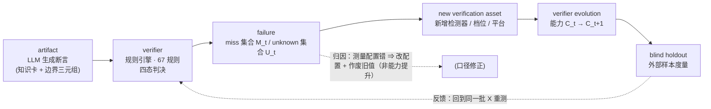
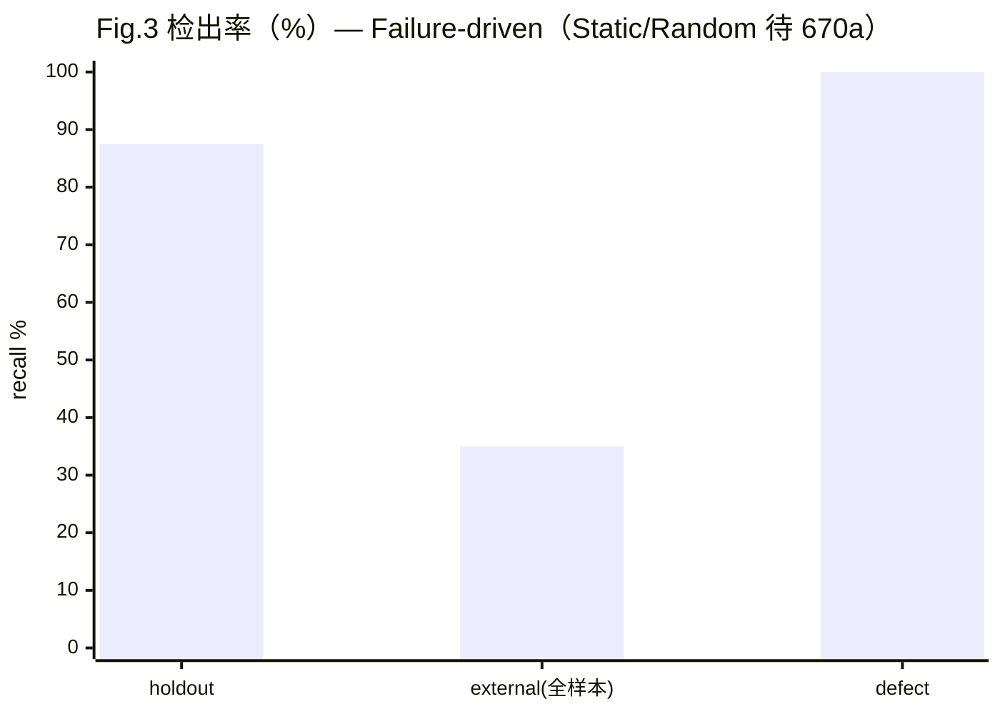
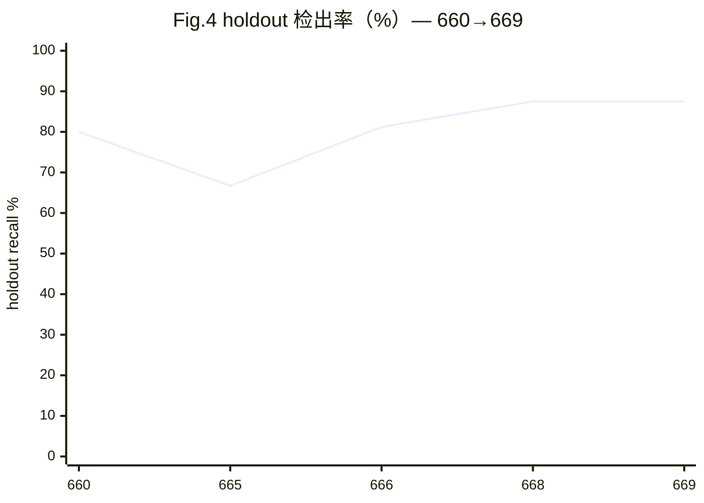

# 祈易（Queyi）：让**验证能力**可被独立验收
## —— 面向 LLM 生成技术知识的失败驱动验证系统（v0.7 · 670e 压缩/匿名版）

> **本稿说明**：基于 v0.6 压缩而成——主文压至 **9 页**（参考文献与附录不计），细节移入**附录 A–F**；
> 术语统一为"**检测器**"；仓库路径匿名化为**通用描述**（完整路径见非匿名 artifact 发布）；
> 所有数字**现算自仓库产物**，未落盘处标 `{{TODO_670a}}`。

---

## 摘要

LLM 让技术知识的**生成**成本趋近于零，**验证**成本却不变。已有的两条路都不解决问题：**用模型评模型**把验证者与被验证者放进同一失效域；**检测文本是否 AI 生成**则答错了问题——来源与断言真假无关。

本文提出**祈易（Queyi）**：把"结论—证据—复算"绑成一条**可被外部打断**的链。对象是**可执行的 C++ 断言**；判决是**四态 `pass/fail/unknown/contradict`**（`unknown` 与 `miss` 严格分离）；可信度来自 **provenance 与 semantic scope 强制拆分**、**不依赖内核的元状态对账**、以及**失败驱动的验证能力演化闭环**。

系统现有 **67** 条判决规则、**42** 张实卡、**452** 事件权威账本、Merkle 覆盖 **5** 个受控目录；盲 holdout 检出率 **87.5%（14/16，95% CI [61.7, 98.4]）**，外部 corpus 全样本 **35.0%（14/40，[20.6, 51.7]）**。

**局限**：两个核心数字**依赖特定 WSL 检测环境（换环境即失败）**，样本量小（n=16/40），且**尚无 budget-matched baseline 对照**——故本文只主张**机制可审计**，**不主张优于现有方法**。

**关键词**：知识验证 · 四态判决 · 失败驱动演化 · provenance 审计 · 可复现评估 · LLM 生成内容

---

## 1. 引言（Introduction）

### 1.1 问题：生成容易，验证困难

LLM 可在几分钟内写出上千条 C++ 技术断言（"这个写法是未定义行为""这个优化在 -O2 下成立"）。这些断言**量大**（人工核不动）、**似真**（语法术语语气都对）、**错误隐蔽**（只在特定编译档/编译器/平台暴露）。于是产生不对称：**生成成本趋近于零，验证成本不变**。这是本工作的起点。

### 1.2 三条动机（为什么现有办法不够）

**动机一 · 分数高不等于能力强。** SWE-bench 把"修真实 issue"变成编码能力标准标尺 [1]，但后续工作给出系统性反证：SWE-bench-Verified 上的提升**部分来自记忆而非推理**——模型在该仓库定位准确率最高 76%，仓库外同类任务只有 53% [2]；模型在 SWE-bench-Verified 上的表现是另外两个同类基准的 3 倍 [3]；SWE-MERA 报告 32.67% 的成功补丁涉及解法泄漏、31.08% 因测试不充分误通过 [4]。**意义**：验证系统若用自己的数据测自己，会复现同样失败 ⇒ 我们选择**外部样本优先、盲态不可逆、分层报告**。

**动机二 · AI 文本检测答错了问题。** DetectGPT [5] 与水印 [6] 都在回答"文本是不是 AI 写的"，但该判据本身随长度/领域急剧退化且对改写脆弱 [7]；更根本的是——**"文本来源"与"断言真假"是两个独立问题**。**意义**：我们不检测来源，只**检验断言**（编译/告警/sanitizer/跨编译器/跨档差分）。

**动机三 · provenance 从"好习惯"变成"义务"。** 欧盟《人工智能法》Regulation (EU) 2024/1689 第 50 条对生成式 AI 输出规定透明度义务 [8]。这与本系统的 provenance 设计同向：**每条知识须携带"谁生成/谁验/证据在哪/在何条件成立"**。

### 1.3 贡献（三段式）

1. **一个验证系统（§4）**：`artifact → verifier → verdict → ledger` 四层结构；四态判决；L0/L1 门禁分层；**provenance 与 semantic scope 强制拆分**；**不依赖内核的元状态对账器**（反自证）；核心机制——**失败驱动的验证能力演化闭环**。
2. **一套评估协议（§5）**：五层数据集 D0–D4；三类 budget-matched baseline；六组 ablation（每组预写假设）；七项指标；**先冻结后执行**的统计口径。
3. **一份开放 artifact（§5、§9）**：Merkle 目录根 + 透明日志 + 452 事件账本 + 逐样本明细 + 单命令复算。任何人可**不信任我们而验证我们**：（a）复跑一致性检查，（b）用给定命令重跑检测，（c）在不服时指出**哪一环**证据不足。

### 1.4 我们不主张什么

**不**主张更好的 C++ 教材，**不**主张更强的检测器，**不**提供形式化证明。**不**声称"验证器变强了"——除非这个"变强"是在**同一批外部样本、同一口径**下被度量的（§6.3 专门测这件事）。

---

## 2. 相关工作（Related Work）

> 本章按**四条线**压缩陈述；**七个方向的详细文献表**见**附录 F**。所有对比均为**定位性/定性**，不是对各自系统的实测结论。

**（1）自演化 / 抗污染 benchmark（演化的是题目）。** Benchmark Self-Evolving [9]、ArenaBencher [10]、SWE-bench-Live [11]、DynaBench [12]、LiveBench [13] 都在对抗"模型记住了题目"，但它们演化的是**被测对象**，"谁来判、判得对不对"仍由固定测试/裁判承担。

**（2）LLM 变异引导的测试生成（最接近的工程形态）。** ACH [14] 与 MUTGEN [15] 用变异反馈驱动测试生成，把变异测试从**评估手段**变成**生成手段**；Cleverest [16] 做即时回归测试生成。我们**复用**这一思路（内部自证层），但**拒绝**把变异得分当缺陷检测率（§3.3 T7、§8）。

**（3）自我验证 / LLM-as-a-Judge / 形式化（部分采用、部分拒绝）。** LLM-as-a-judge [17] 是实用的可扩展评审手段，我们**只在"生成候选"环节用 LLM，判决环节全部程序化**（judge 与被 judge 共享失效域）；seL4 [18]、CompCert [19] 证明"证明力可极强"，但人力成本高、覆盖面窄、难外部复核——我们**不追形式化证明**，只追"**证据可被第三方逐条复算**"；变异测试综述 [20] 采用其框架，但只用于自证层。

**（4）度量治理 / 可复现性 / 溯源审计（方法学来源）。** Goodhart/Strathern [21]、reward hacking [22]、奖励过优化 [23]；Datasheets [24] 与 Model Cards [25] 是"文档化即治理"；可复现性报告 [26]；统计口径 [27]–[32]；Merkle [35] 与溯源审计 [43][44]。这些构成本文的**方法学与工程治理来源**。

**定位（对比表）**：

| 维度 | Benchmark 演化 | 变异引导测试 | 形式化验证 | **祈易（本工作）** |
|---|---|---|---|---|
| 演化的对象 | 题目/样本 | 测试与变异体 | 证明（静态） | **判决能力与证据获取能力** |
| 谁判对错 | 固定测试/裁判 | 固定测试 oracle | 证明检查器 | **程序化规则 + 四态 + 元状态对账** |
| 能否表达"不知道" | 通常不能 | 通常不能 | 不适用 | **能（`unknown` 是一等公民）** |
| 分数提升的含义 | 模型变强 | 测试套件变强 | 无分数 | **验证能力变强**（需外部样本度量） |
| 防"刷分"机制 | 换新题 | 换变异体 | 不适用 | **失败驱动 + 盲态 + 预算匹配对照** |

**我们不是什么**：**不是** benchmark evolution（我们演化尺子，不是题目）；**不是** mutation testing（变异只是内部自证组件）；**不是** self-verification（判决全部程序化，元状态由独立对账器核对）；**不是** RAG/文本相似度（我们验证**可执行断言**，不是文本像不像）。

---

## 3. 问题定义与威胁模型（Problem & Threat Model）

### 3.1 形式化

- **知识断言** $a$：可判定陈述 + **边界三元组** $\langle$ 输入域 $D$、前提 $P$、失效条件 $F \rangle$。
- **证据** $e$：一次可重放观测（编译器版本 + 命令 + 优化档 + 输出 + 内容寻址哈希）。
- **判决** $v \in \{\texttt{pass},\texttt{fail},\texttt{unknown},\texttt{contradict}\}$；**验证能力** $\mathcal{C}$ = 可用证据获取手段集合（检测器/编译器/档位/平台）。

**目标不是最大化 $\Pr[v=\texttt{pass}]$，而是最大化"判决与真值的一致率"，且不许把 `unknown` 伪装成 `pass`。**

### 3.2 为什么必须是四态

`unknown` 是一等公民：**"检测器不可用"与"检测器说没问题"是两种不同的知识状态**。把 `unknown` 记成 `miss` ⇒ 低估能力且污染分母；记成 `pass` ⇒ **假 pass**（最危险）；把 `miss` 记成 `unknown` ⇒ 掩盖能力缺口。故规定：**分母 = catch + miss（可测样本）**，`unknown` 单独报告、不计入分母，`not_error` 单列。口径写进产物（`denominator` 字段），不写在正文里。

### 3.3 十二类威胁（T1–T12）

| # | 威胁 | 缓解机制 | 残余风险 |
|---|---|---|---|
| T1 | 自证（工具链证明自己） | 元状态对账器**不依赖内核**（§4.5） | 对账器仍需人核；`--check` ≠ 独立实现 |
| T2 | 自造分布偏差（变异算子是我们设计的） | 盲 holdout + 外部 corpus（D2/D3） | 外部样本量小（§8） |
| T3 | holdout 泄漏 | reveal **不可逆**；默认不扫 holdout 目录 | 追加的 10 条**无盲态** |
| T4 | 开发者知情偏差 | 独立生成（A/B/C 三方） | 同进程上下文，**非真正独立** |
| T5 | 口径漂移（文档与仓库不符） | 元状态对账 `--check` | 只覆盖已登记字段 |
| T6 | semantic scope 误用 | provenance / scope 强制拆分（§4.4） | 存量 scope 完整度 **0/26** |
| T7 | 度量混淆（变异得分当检测率） | 指标分层；变异率**只作自证** | 外部读者仍可能误读 |
| T8 | 选择偏差（预算） | budget-matched random 对照（§5.2） | **未跑**（§8） |
| T9 | 过拟合历史缺陷 | 盲态 D2 + 外部 D3 | 扩样样本**无盲态** |
| T10 | 复现危机 | Merkle 根 + 版本落盘 + 时间锚 | **OTS 是占位**；**WSL 依赖未声明** |
| T11 | Authority 操纵 | 452 账本**零改红线** | 红线是纪律，非密码学强制 |
| T12 | AI 署名不清 | AI 使用登记 | 贡献度划分仍是**约定** |

### 3.4 三个重点威胁

**（a）Construct：机器判"执行通过" ≠ "知识正确"。** 检测器报 `catch` 只意味着"这条夹具、这个编译档、这个编译器下出现了特定信号"，**不**等于断言成立或不成立。实证：同一批 ASan 样本在 `-O1` 下被优化掉整段内存操作而报不出，`-O0` 下立刻报出；把 pipeline 从单档改为 `-O0`+`-O2` 双档后检出率 **66.7% → 87.5%，检测器一行未改**——**变的是口径，不是能力**。缓解：所有检出率带 `caliber`+`denominator`；版本/命令随证据落盘；双档都跑。

**（b）Meta-Goodhart：验证器优化它自己定义的度量。** 二阶形态更危险：当"验证能力的度量"由验证系统产出时，系统可**改口径/改分母/把红灯修绿**而**无外部参照**。真实事故：某批修改检测器档位但**未重跑生成器**，产物停在旧口径，论文却写上新估计 **81.2%（13/16）**——该数字**从未出现在任何产物里**，且当时的 `--check` **不比对这两个字段** ⇒ 一路绿。缓解：口径变更三步（改⇒重跑⇒**作废旧值**）；射程自检（改一个数必红，实测 5/5）；旧值交代下场。**残余**：现有检查只比"产物↔前端"，**不重跑检测器** ⇒ 该事故形态**今天仍能重演**。

**（c）Evaluation contamination：验证器见过被验证的样本。** 三种形态：① 样本泄漏（T3）；② **判据同源**——真值标签与判据按同一标准生成 ⇒ 分数是**上界**（反事实算子 F1=1.0 即此类）；③ **无盲态扩样**——追加样本在原 reveal 之后 ⇒ 只能增大分母。缓解：reveal 不可逆；上界声明**写进产物与论文**；无盲态样本显式标注；分层报告不得合并。**残余**：标签效度独立复核（IRR）未做（第二标注者 0 人）。

---

## 4. 方法（Method）

### 4.1 系统架构

**Fig.1 · 系统闭环（failure-driven verification loop）**



> **图注**：节点工具名——规则引擎（67 规则 / 四态）、元状态对账器（不依赖内核）、反事实算子。实线=主循环，虚线=回测与口径修正。数据来源：方法章 §4.1/§4.6。

- **artifact**：知识卡，每条断言带**边界三元组**；缺三元组的卡**不得**预写判决（应为 `unknown`，这是**正确输出**）。
- **verifier**：**67** 条规则引擎产出四态判决（两源一致：引擎规则 == 规则清单）。
- **evidence**：每次编译/运行落**内容寻址**证据（版本+命令+档位+输出+sha256）。现状 **28** 张卡有 L1 证据、**28** 张双编译器确认、**147** 次真实编译。
- **ledger**：权威账本 **452** 事件，append-only，**零改动红线**。

### 4.2 四态判决

| 态 | 含义 | 处置 |
|---|---|---|
| `pass` | 证据支持断言，边界三元组完备 | 可进入教学台账 |
| `fail` | 证据与断言矛盾 | counterexample 入教学反例集 |
| `unknown` | **证据不足或检测器不可用** | 不得记为 pass/miss；单独报告 |
| `contradict` | 两条证据互相矛盾（如跨编译器差分） | 升级人核，机器不裁决 |

**关键设计**：`contradict` 是为了**不让机器在证据冲突时选边**——冲突本身是信息。**机器卡一律 `needs_review=true` 且不混入"已验证卡"计数**；`verified` **唯人签**。

### 4.3 门禁分层 L0 / L1

- **L0（阻断）**：元状态对账、门禁分层合法、真实缺陷检出、盲化 holdout 状态、单元测试。现状 **7** 个 L0 gate；编排器 5 阶段**本次审计逐阶段单跑全部 PASS**。
- **L1（建议）**：变异得分、边界 provenance 报告、供应链完整性。现状 **10** 个 L1 gate；红**不阻断**但必须登记。

> **为什么分层**：全设阻断 ⇒ 人会为"变绿"而放宽断言（meta-Goodhart 温床）；全设建议 ⇒ 红线失去意义。分层把"必须守的"与"可讨论的"分开。

### 4.4 provenance 与 semantic scope 的强制拆分

| 字段 | 回答的问题 | 例子 |
|---|---|---|
| **provenance** | 这条断言**从哪来、谁生成** | generator 版本、变异集哈希、证据 sha256、编译器版本 |
| **semantic scope** | 这条断言**在什么范围内成立** | 标准条款 / 编译器 / 平台 / 优化档 |

**为什么必须拆**：provenance 完备的断言**仍可能**被误用于不适用的范围（T6）；两者写在一起，读者会默认"来源清楚 ⇒ 到处成立"。**现状（审计实测）**：边界卡 **26**，provenance 完整 **26/26**、**semantic scope 完整 0/26** ⇒ 机制已落地，但语义作用域回填基本为空——这是**最大方法学缺口**之一，直接限制外部效度。

### 4.5 元状态对账器（反自证）

`status_reconciler` 是一个**不依赖内核**的独立对账器：重新扫描事实源（扫卡面字段、扫目录、读规则引擎），与基线对账，**不一致即 `META-STATE-CONFLICT`，exit 1**。**去写死三原则**：断言只能写死"口径"，不许写死"测量值"——① 事实源对齐（现算）；② 可加性/划分性（`block+warn+advice == total`）；③ 结构不变量。**残余**：对账器"不依赖内核"只意味着它不 import 内核，**不意味着它由第三方实现**（`--check` ≠ 独立复现）。

### 4.6 核心机制：失败驱动的验证能力演化闭环

对 **miss ∪ unknown** 逐条归因：**"测量配置错"**（⇒ 改配置 + 作废旧数字，**不是能力提升**）还是 **"能力缺口"**（⇒ 新增证据获取手段 ⇒ $C_{t+1}$）；然后**回到同一批 X 重测** ⇒ 度量 Δ + CI；若 Δ 不显著，该能力扩充**不进 Claim 表**。

**为什么必须回到同一批 X**：否则"能力提升"与"换了一批更简单的样本"无法区分——这正是口径漂移事故的认识论根源。**为什么必须与 budget-matched random 对照**：失败驱动看起来有效，可能只是因为它**投入更多预算**；同等预算下随机扩充若也能追平，则"失败驱动"机制本身不成立。

---

## 5. 评估协议（Evaluation Protocol）

> 本协议**在看到结果之前冻结**；此后任何修改必须记录并说明对已出数字的影响。统计口径细节见**附录 B**。

### 5.1 数据集五层（D0–D4）

**Fig.2 · 数据集分层（颜色=能否 Claim 外部效度：红=不能 / 黄=有限 / 绿=可以）**


> **图注**：数据来源——holdout reveal 报告、external corpus reveal 报告、变异报告。D0 的数**只作自证**，永不进 Claim 表；D2 含**非盲态 10 条**（只增分母）；D3 再分 A/B/C 三层，**不许合并成一个数**。

| 层 | 内容 | 用途 | 能否 Claim 外部效度 | 现状 |
|---|---|---|---|---|
| D0 开发集 | 内部变异样本 | 调参/自证 | ❌ **绝不** | core 变异 97.3%（**仅自证**） |
| D1 历史缺陷 | 已知已修缺陷（重注入） | 真实缺陷召回 | ⚠ 有限（已见过） | 重注入子集 1/1；覆盖登记 12/15 |
| D2 盲 holdout | reveal 前不可见的 planted 缺陷 | **盲态召回（主）** | ✅ | 30 样本；可测真错 16；**87.5%** |
| D3 外部 corpus | 仓库之外的真实技术陈述 | **外部召回（主）** | ✅ | 40 条；**35.0%** 全样本 |
| D4 独立生成 | 独立生成流程产出的断言 | 独立生成召回 | ✅ | 16 机器卡（无人签） |

### 5.2 Baseline（三类，全部 budget-matched）

| Baseline | 定义 | 对齐条件 |
|---|---|---|
| B1 静态门禁 | 只跑静态规则（不获取运行时证据） | 同语料、同判定粒度 |
| B2 静态 + 变异 | 静态规则 + 变异测试（自证层全开） | 同上 + 同变异预算 |
| **B3 budget-matched random** | **同等预算下随机**扩充证据（不按失败驱动选） | 同预算（时间/调用次数）、同语料、同档位 |

**B3 是最关键的**：它把"失败驱动"从"因为投入多所以看起来好"里分离出来（T8 / ablation F）。**现状：0 个 baseline 已跑** ⇒ 当前最大实验缺口。

### 5.3 Ablation（A–F，每组预写假设）

| 组 | 去掉/改变 | 预写假设 | 主指标 |
|---|---|---|---|
| A | Full | 基线 | 盲 holdout + 外部分层召回 |
| B | −变异 | 外部召回**不变**（验证"变异率 ≠ 检测率"） | 外部召回差值 + CI |
| C | −Merkle/供应链 | 复算性下降，召回不变 | 复现失败点数 |
| D | −证据获取层 | `unknown` 比例**上升** | `unknown` 比例 |
| E | −边界三元组强制 | **假 pass 率上升** | 假 pass 率 |
| **F** | **random-budget 对照** | 若收益来自"更多尝试"，random 会追平 | 同预算召回 |

**纪律**：每组先写假设再看结果；**结果与假设不符时原样报告**。**现状：0 组已跑**。

### 5.4 指标（七项）

真实缺陷召回 / 盲 holdout 召回 / 外部召回 / FPR / 变异得分（**仅自证**）/ 回归保留率 / 成本。**每个率必须带 `denominator`**（谁除以谁、谁被排除）。

---

## 6. 实验（Experiments）

> 数字**全部现算自仓库产物**（每表给来源）；区间一律 **Clopper–Pearson 95%**，Wilson 作敏感性。**未落盘处标 `{{TODO_670a}}`，不编造。**

### 6.1 E1 · 主实验：Static vs Random vs Failure-driven

**Fig.3 · 核心检出率（Failure-driven 为真实值；Static / Random-budget 待 baseline）**



> **图注**：数据来源——holdout reveal 报告、external corpus reveal 报告、口径报告。**误差线**：holdout [61.7, 98.4]、external [20.6, 51.7]（CP 95%）。**Static（B1）与 Random-budget（B3）两列用虚线框标注"pending 670a baseline"**，不得填估计值。defect 列现为占位。

| 系统 | 盲 holdout 召回 (k/n, CP 95%) | 外部·全样本 | 外部·可测 | 对照 FPR |
|---|---|---|---|---|
| B1 静态门禁 | `{{TODO_670a}}` | `{{TODO_670a}}` | `{{TODO_670a}}` | `{{TODO_670a}}` |
| B3 random-budget | `{{TODO_670a}}` | `{{TODO_670a}}` | `{{TODO_670a}}` | `{{TODO_670a}}` |
| **Full（失败驱动）** | **87.5% (14/16) [61.7, 98.4]** | **35.0% (14/40) [20.6, 51.7]** | **43.8% (14/32) [26.4, 62.3]** | 11.1% (1/9) |
| **差值（Full − B1）+ CI** | `{{TODO_670a: Fisher/Boschloo}}` | `{{TODO_670a}}` | `{{TODO_670a}}` | — |

- **前置阻塞（真实）**：B1 `Rule-only` 在主仓**没有可执行路径**——holdout/corpus 判定走**外部 sanitizer 仪器**，无"仅静态规则"入口。
- **判读规则（预写）**：若 Full−B1 或 Full−F 的差值 CI **跨 0** ⇒ "失败驱动"机制**不成立**，必须原样报告。

### 6.2 E2 · 口径消融（caliber ablation）

三条臂**共用同一份原始计数**（catch=14），只变"谁进分母"：

| 臂 | 口径 | holdout 真错 (k/n, CP 95%) | external (k/n, CP 95%) |
|---|---|---|---|
| **A（主口径：unknown 剔除）** | 分母 = catch+miss | **87.5% (14/16) [61.7, 98.4]** | **43.8% (14/32) [26.4, 62.3]** |
| B（unknown 记 miss） | 分母含 detector-unknown | 82.4% (14/17) [56.6, 96.2] | 37.8% (14/37) [22.5, 55.2] |
| C（unknown + not_error 进分母） | 分母 = 全样本 | 82.4% (14/17) | 35.0% (14/40) [20.6, 51.7] |
| **Δ(A − C)** | | +5.1pp | **+8.8pp** |

**读法**：口径对 external 的影响（最多 **8.8pp**）**大于**层间部分差异 ⇒ "报率不报口径"等于让读者在 35.0%–43.8% 间自由发挥。

### 6.3 E3 · 演化曲线

**Fig.4 · 演化（660→669）；红色=口径变更，蓝色=真实演化**



> **图注**：数据来源——各批次 reveal 报告与回溯反思。**80.0%→66.7%→87.5% 不是能力提升**：660 是"20 样本/真错 7"的小分母，665 是"30 样本/真错 17"的单档口径，668 是双档口径——**检测器零改动**。666 的 **81.2% 从未落盘**（改代码没重跑），图中以空心点标注。656/662 只有变异指标（core 62.5%→97.3%），无 holdout 值。

| 批次 | 新增能力 | holdout（真错/口径） | 变异 core | 性质 |
|---|---|---|---|---|
| 656 | 核心 PBT/变异 | — | **62.5%** (30/48) | 变异体未进射程 |
| 660 | 轨迹层+拆仓 | 真错 **7**，**80.0%**（小分母） | — | 标签过度声称 |
| 665 | 扩样 20→30 | 真错 **17**，**66.7%**（单档） | — | 分母构成变 |
| 666 | 声称双档 | ~~81.2%~~ **未落盘** | — | 改代码没重跑 |
| 668 | 双档重跑 | **87.5%** (14/16) | — | **口径变更** |
| 669 | 口径消融 + CI | 87.5% [61.7, 98.4] | **97.3%** (110/113) | 变异仍为内部指标 |

**⚠ 红线**：holdout 一列**不是同一批 X** ⇒ 不得读作演化。**唯一"同批重测"**是 668 相对 665 的逐样本变化，但它改的是**编译档**，不是能力。**诚实预判**：目前只有 656/669 两点同口径可比。

---

## 7. 分析（Analysis）

### 7.1 五点分析（全部基于真实发现）

1. **标签是最大的误差源。** 660 对外称"holdout 20 个样本"，其中**真错只有 7 个**；按 20 当分母得 35%，按真错口径得 80.0%——分母一换数字就跳。不是验证器变好，是**测量对象变对了**。
2. **环境依赖是静默掉分的根因。** sanitizer 分支走特定 WSL 环境；缺 WSL 时 15 条样本**不报错、直接降级 `unknown`**，external 从 **35.0% 掉到 10.0%**，而护栏**仍绿**（只比"产物↔前端"）。
3. **"改了代码没重跑"是系统性失败模式（三次同形）。** 666 声称 81.2%**从未落盘**；反事实 F1 曾为 0（判据已写进代码但产物没重跑）；corpus 真机重跑与产物差 10 条 catch。
4. **mutation score ≠ real defect detection。** 内部变异 core **97.3%**，外部 corpus 只有 **35.0%**——两者测的不是同一个东西。Just 等（FSE 2014）[46] 系统检验了"变异体能否替代真实缺陷"，结论是**相关但不等价**。
5. **failure-driven 的提升是否真实——待 baseline。** 当前无 baseline、无 ablation，"失败驱动优于静态/随机"**尚无对照支撑**。

---

## 8. Threats to Validity

| 层 | 威胁 | 缓解 | 残余 |
|---|---|---|---|
| **Construct** | `catch` ≠ 断言为真；A/B/C 按检测器可用性分非难度分；mutation score 非检测率代理 [46] | caliber/denominator/opt_levels/env 随产物落盘；双档都跑；三态分离 | 跨环境复现未验证（**已从"残余"升级为"已发生失败"**：缺 WSL 掉分）；标签独立复核未做 |
| **Internal** | meta-Goodhart（改口径提分）；预算选择偏差；改代码没重跑 | 口径三步纪律；射程自检（5/5 变红）；budget-matched random 对照 | **护栏不重跑检测器** ⇒ 666 事故形态仍可重演；ablation 一组未跑 |
| **External** | 样本量小（n=16/40，点估计）；同源聚类；semantic scope 0/26；领域单一（C++） | 分层报告；明示"两轮样本不可比" | baseline 0 / ablation 0；对账器仍是本方实现；第三方复现 0 人 |
| **Statistical** | 多重比较；小样本 Wald 失效；聚类相关；只报 p | 统计计划先冻结；CP 主报、Wilson 敏感性；Fisher/Boschloo + 精确 McNemar；BH/Holm；必报差值+CI | 统计工具未建成；现有数字 CI 需随稿补；IRR 未做 |
| **Temporal** | OTS 锚过期；样本老化；环境漂移（TSan 在 WSL 高熵 ASLR 下间歇失败） | Merkle 根 + 哈希链；版本随证据落盘 | OTS 真锚定未做；Merkle 每次重钉使锚失效；WSL 硬依赖未声明 |

> **残余风险 ↔ 门禁映射表**见**附录 B**。

---

## 9. Claim 边界

### 9.1 能支撑

| # | Claim | 证据 |
|---|---|---|
| 1 | 验证器在**已见错误类型**上检出率高 | holdout 87.5%（14/16）[61.7, 98.4]；external 可测 43.8%（14/32） |
| 2 | 门禁能捕获**已知缺陷**（改数必红） | 射程自检 5/5 变红；门禁 `overall=PASS` |
| 3 | provenance 链**完整可审计** | Merkle 5 目录根一致；452 账本零改；provenance 三元组落盘 |
| 4 | 口径可声明、可复算 | 三条臂口径消融（§6.2）；每个率带 `denominator` |

### 9.2 不能支撑

| # | 不能支撑的 Claim | 为什么 |
|---|---|---|
| 1 | **泛化到未见错误类型** | 样本全部同源；semantic scope 回填 0/26 |
| 2 | "检测率 **X%**" 的绝对 claim | n=16/40，CI 宽（±15–18pp） |
| 3 | **比 static gate 更好** | baseline 0 个、ablation 0 组 |
| 4 | "F1=1.0 已校准" | 判据与真值同源 ⇒ 只是**上界** |
| 5 | 把 mutation score 当检测率 | core 97.3% ≠ 缺陷检测率 [46] |
| 6 | 演化趋势 | 只有单点可比重测 |

### 9.3 不可复现

| # | 项 | 依赖 |
|---|---|---|
| 1 | holdout / external 检出率 | **WSL + g++ + `setarch`**；缺 WSL 静默掉分（35.0%→10.0%） |
| 2 | TSan 类结果 | WSL 高熵 ASLR 下**间歇性**无法初始化 |
| 3 | OTS 锚 | 零 attestation 占位符，"已上链"**不成立** |

**一句话**：本稿能支撑"**机制可审计 + 在已见错误上有效**"；不能支撑"**泛化 / 绝对率 / 优于基线**"；且 **WSL 依赖使两个核心数字在无 WSL 环境不可复现**。

---

## 10. 结论（Conclusion）

LLM 让技术知识的**生成**成本趋近于零，但**验证**成本没有变。本文主张：验证问题不能靠"用模型评模型"（共享失效域）或"检测文本是否 AI 生成"（答错问题）来解决，而必须把**判决—证据—复算**绑成一条**可被外部打断**的链。祈易把它拆成四个可验收的机制：**四态判决**（`unknown` 是一等公民）、**provenance 与 semantic scope 强制拆分**、**不依赖内核的元状态对账器**、以及**失败驱动的验证能力演化闭环**。

我们也把**自己的失败**写成了方法的一部分：66.7% → 87.5% 不是能力提升而是口径变更，旧值必须作废；81.2% 从未出现在任何产物里，"改了代码没重跑"必须被护栏抓住（而它**今天还没被抓住**）。第三方只读审计给出总体可信度 **6/10**：基础设施可信，**数字脆弱**。

**证据边界（对应 §9）**：当前证据**支持**"验证能力可被外部度量、失败驱动可追溯"；**不支持**"优于现有方法"（baseline 待补）、**不支持**"泛化到其他语言"（仅 C++）。**未来工作**：① baseline 实测（B1/B2/B3）；② 样本扩量（holdout→≥30 可测、corpus→≥60）；③ 独立复现 ≥1 次。

> **立场**：在 baseline 与 ablation 跑完之前，本文**不**主张"我们的方法比别的好"。我们主张的是：**这套机制让"好不好"变成一个可以被外部度量、被第三方打断、被自己否证的问题。**

---

## 参考文献

> 标注：**[API 核验]** arXiv API 当场核对 · **[已核]** Crossref/web/DOI 复核 · **📗 [经典]** 教材/文集 · **⛔ [非引用型]** 协议/依赖（建议移出）。

1. [API 核验] Jimenez, C. E., et al. SWE-bench: Can Language Models Resolve Real-World GitHub Issues? ICLR 2024. arXiv:2310.06770.
2. [API 核验] Liang, S., et al. The SWE-Bench Illusion. arXiv:2506.12286.
3. [API 核验] Prathifkumar, T., et al. Does SWE-Bench-Verified Test Agent Ability or Model Memory? arXiv:2512.10218.
4. [API 核验] Adamenko, P., et al. SWE-MERA. EMNLP 2025 (Demos). arXiv:2507.11059.
5. [API 核验] Mitchell, E., et al. DetectGPT. ICML 2023. arXiv:2301.11305.
6. [API 核验] Kirchenbauer, J., et al. A Watermark for Large Language Models. ICML 2023. arXiv:2301.10226.
7. [API 核验] Sadasivan, V. S., et al. Can AI-Generated Text be Reliably Detected? TMLR. arXiv:2303.11156.
8. [已核] Regulation (EU) 2024/1689（欧盟《人工智能法》）, Art 50.
9. [API 核验] Wang, S., et al. Benchmark Self-Evolving. COLING 2025. arXiv:2402.11443.
10. [API 核验] Liu, Q., et al. ArenaBencher. arXiv:2510.08569.
11. [API 核验] Zhang, L., et al. SWE-bench Goes Live! arXiv:2505.23419.
12. [API 核验] Kiela, D., et al. Dynabench. NAACL 2021. arXiv:2104.14337.
13. [API 核验] White, C., et al. LiveBench. ICLR 2025. arXiv:2406.19314.
14. [API 核验] Foster, C., et al. Mutation-Guided LLM-based Test Generation at Meta (ACH). arXiv:2501.12862.
15. [API 核验] Wang, G., et al. Mutation-Guided Unit Test Generation with a LLM (MUTGEN). arXiv:2506.02954.
16. [API 核验] Liu, J., et al. Evaluating LLM-Based Regression Test Generation (Cleverest). arXiv:2501.11086.
17. [API 核验] Zheng, L., et al. Judging LLM-as-a-Judge. NeurIPS 2023 D&B. arXiv:2306.05685.
18. [已核] Klein, G., et al. seL4. SOSP 2009. DOI 10.1145/1629575.1629596.
19. [已核] Leroy, X. Formal Verification of a Realistic Compiler. CACM 52(7), 2009. DOI 10.1145/1538788.1538814.
20. [已核] Jia, Y., Harman, M. An Analysis and Survey of the Development of Mutation Testing. IEEE TSE 37(5), 2011. DOI 10.1109/TSE.2010.62.
21. [已核] Strathern, M. "Improving ratings". European Review 5(3):305–321, 1997；Goodhart 1975（经典文集）.
22. [API 核验] Skalse, J., et al. Defining and Characterizing Reward Hacking. arXiv:2209.13085.
23. [API 核验] Gao, L., et al. Scaling Laws for Reward Model Overoptimization. ICML 2023. arXiv:2210.10760.
24. [API 核验] Gebru, T., et al. Datasheets for Datasets. CACM 2021. arXiv:1803.09010.
25. [API 核验] Mitchell, M., et al. Model Cards for Model Reporting. FAT* 2019. arXiv:1810.03993.
26. [已核] Pineau, J., et al. Improving Reproducibility in ML Research. JMLR 22(164):1–20, 2021.
27. [已核] Clopper, C. J., Pearson, E. S. Biometrika 26(4), 1934. DOI 10.1093/biomet/26.4.404.
28. 📗 [经典] Fisher, R. A. The Design of Experiments. 1935.
29. [已核] McNemar, Q. Psychometrika 12(2), 1947. DOI 10.1007/BF02295996.
30. [已核] Benjamini, Y., Hochberg, Y. JRSS B 57(1), 1995. DOI 10.1111/j.2517-6161.1995.tb02031.x.
31. [已核] Holm, S. Scand. J. Statist. 6(2):65–70, 1979. DOI 10.2307/4615733.
32. [已核] Cohen, J. Educ. Psychol. Meas. 20(1), 1960；📗 Krippendorff, K. Content Analysis. 1980.
33. [已核] Shadish, W. R., Cook, T. D., Campbell, D. T. Experimental and Quasi-Experimental Designs… 2002. ISBN 0395615569.
34. [API 核验] Chen, M., et al. Evaluating LLMs Trained on Code (HumanEval). arXiv:2107.03374.
35. [已核] Merkle, R. C. A Digital Signature Based on a Conventional Encryption Function. CRYPTO'87 / LNCS 293, 1988. DOI 10.1007/3-540-48184-2_32.
36. ⛔ [非引用型] OpenTimestamps（协议/依赖；见附录 D 的占位说明）.
37. [API 核验] Liao, C., et al. LLVM Translation Validation Automated with LLMs and Lean. arXiv:2609.19583.
38. [API 核验] Shefer, A., et al. Can LLMs Enable Verification in Mainstream Programming? arXiv:2503.14183.
39. [API 核验] Poesia, G., et al. Formal Disco. arXiv:2607.04631.
40. [API 核验] Banik, D., et al. All Smoke, No Alarm. arXiv:2606.18168.
41. [API 核验] Lian, X., et al. Uncovering Weaknesses in Neural Code Generation. arXiv:2407.09793.
42. [API 核验] Lyu, W., et al. Will Your Next Pair Programming Partner Be Human? arXiv:2505.08119.
43. [API 核验] Kao, L. Constant-Size Cryptographic Evidence Structures for Regulated AI Workflows. arXiv:2511.17118.
44. [API 核验] Wang, Z. Who Audits the Auditor? arXiv:2604.22096.
45. [API 核验] Wu, Y., et al. A Systematic Review of NeurIPS Dataset Management Practices. arXiv:2411.00266.
46. [已核] Just, R., et al. Are Mutants a Valid Substitute for Real Faults in Software Testing? FSE 2014. DOI 10.1145/2635868.2635929.

---

## 附录 A · 67 条判决规则清单

全部规则由规则引擎现算（`len(RULES)=67`）。**按 severity 分布**：**block 44 / warn 16 / advice 7**（合计 67）；**按 kind**：fact 61 / pedagogy 5 / meta 1。每条字段：`id / title / severity / kind / quadrant / scope / automated / basis / fix_hint / check`。

> **数字修正说明**：v0.6 §6.4 曾写"67（block 0 / warn 176 / advice 55）"。经复核，规则表现算的 **severity 分布为 44/16/7**（合计 67），而旧值 0/176/55 **无法从规则表复现**，疑为笔误或指别的量（未确证）。**本稿以 44/16/7 为准。**
>
> 完整 67 条（id + title + severity）由附录 D 的命令生成，投稿时随补充材料给出。

## 附录 B · 统计口径（冻结）

| 场景 | 方法 |
|---|---|
| 单比例 CI | **Clopper–Pearson 精确 95%**（主报）；Wilson 敏感性；**禁用小样本 Wald** |
| 独立样本比较 | **Fisher 精确 / Boschloo** |
| 同批前后比较 | **精确 McNemar** |
| 多重比较 | 探索性 **BH-FDR**；确认性 **Holm**；检验族预定义 |
| 效应量 | 必报**差值 + CI** |
| 聚类相关 | 估 ICC/DEFF/n_eff；同源卡 ≠ 独立观测 |
| IRR | Cohen's κ / Krippendorff's α；**≥0.67** 才作 tentative |

**红线**：不声称"显著优化"；不把 0/8 写"无效"；不把变异 kill rate 称检测率；不把同源判据下的 F1=1.0 称"已校准"。

**残余风险 ↔ 门禁映射**：Construct→边界门禁；Internal→口径一致性门禁；Statistical→统计冻结门禁；External→基线门禁；Temporal→时间锚（占位）。**判据一律现算，禁止从产物抄数。**

## 附录 C · 逐样本明细

每个主指标对应逐样本 `id → verdict` 表（"可被第三方逐条复算"的关键）：holdout（`planted/detector/verdict/opts_seen`）、external（`verdict/layer`）、反事实（`ground_truth/operator_prediction/agree`）、变异（`killed/survived`）。每表附 `env`（WSL/g++/setarch）+ `caliber`（opt_levels）+ `denominator`。

## 附录 D · 复现命令

```bash
# 环境自检（后两条决定能否复现 holdout/external）
python --version; node --version; g++ --version; wsl --status
# 核心数字
python tools/holdout_reveal_3_665.py        # 87.5%（需 WSL）
python tools/external_corpus_reveal_665.py  # 35.0%（需 WSL）
python tools/mutation_test_656.py           # 97.3%
python tools/counterfactual_extend_665.py   # F1=1.0
python tools/run_658_gate.py                # L0 5/5
# 一致性
python -c "import sys;sys.path.insert(0,'tools');import gate_engine;print(len(gate_engine.RULES))"  # 67
wc -l data/authority/decision_event_v2_ledger.jsonl  # 452
```

> 路径相对于 **artifact 根**（非匿名版本提供完整布局）；`reveal` 类命令的 `OUT` 必须重定向到**仓库外临时目录**。

## 附录 E · AI 使用声明

本稿由 LLM **辅助起草**（人类作者负责选题、结构、claim 边界、最终裁决）。逐条登记见 artifact 的 AI 使用登记文件。**本批（670e）的边界**：LLM 只做**结构压缩、数据填充校验、引用核验、匿名化、术语统一**，**未新增未落盘数字**。凡未经登记的 AI 贡献，按项目纪律视为**未声明作者**。

## 附录 F · 相关工作详表（七方向）

| 方向 | 代表工作 |
|---|---|
| 1 自演化/抗污染 benchmark | Benchmark Self-Evolving [9] / ArenaBencher [10] / SWE-bench-Live [11] / DynaBench [12] / LiveBench [13] |
| 2 LLM 变异引导测试 | ACH [14] / MUTGEN [15] / Cleverest [16] |
| 3 自我验证 / LLM-judge | LLM-as-a-judge [17] / 自我纠错（见 artifact 登记） |
| 4 度量治理 / 可复现 | Datasheets [24] / Model Cards [25] / 可复现性报告 [26] / Goodhart [21] |
| 5 形式化验证 + LLM | seL4 [18] / CompCert [19] / LLVM+Lean [37] / Can LLMs Enable Verification [38] / Formal Disco [39] |
| 6 LLM 代码错误分类 | All Smoke No Alarm [40] / Uncovering Weaknesses [41] / Pair Programming [42] |
| 7 溯源审计 | Merkle [35] / Constant-Size Crypto Evidence [43] / Who Audits the Auditor [44] / NeurIPS Dataset Review [45] |

> 建议补充（见 670d 引用补充建议）：LLM 代码错误分类 ×2（arXiv:2406.08731 / 2403.08937）、污染综述 ×2（arXiv:2406.04244 / 2502.17521）。
