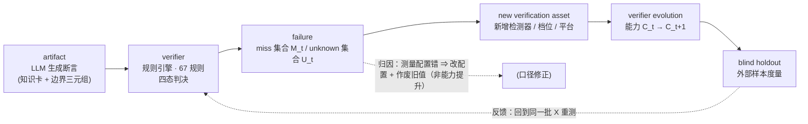
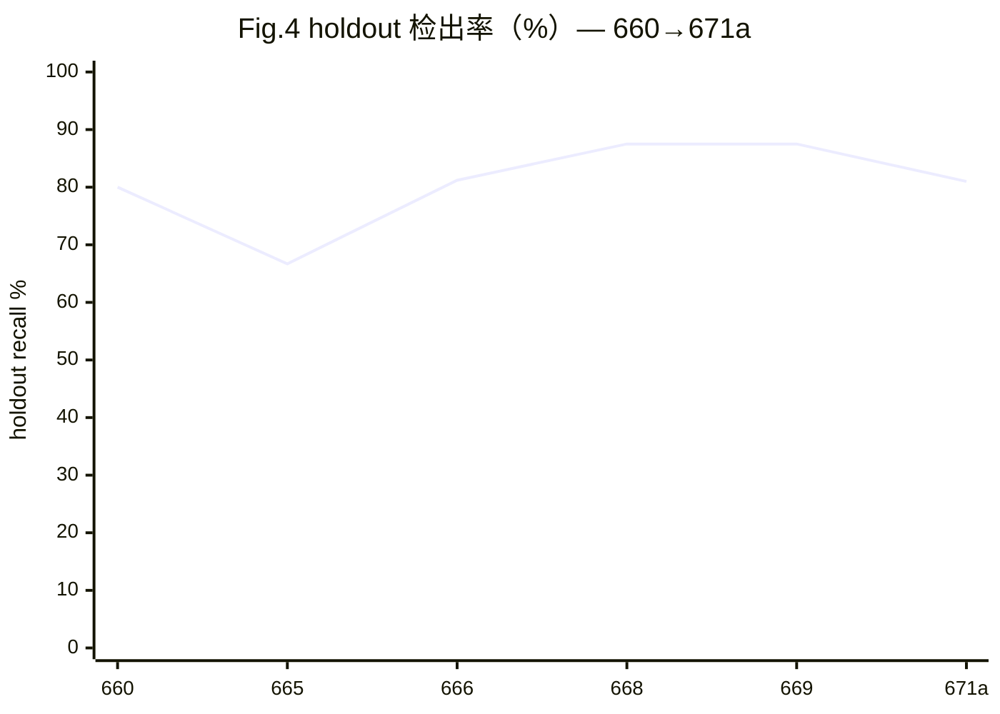

# 演化中的验证器：失败驱动的证据获取与可审计的知识验证
## —— Evolving Verifiers: Failure-Driven Evidence Acquisition with Auditable Provenance（v0.9 · 671b · 含 baseline 三臂 + ablation 框架 + 671a 扩样数字）

> **本稿说明**：基于 v0.8 深化而成——保留 9 页主文结构（参考文献与附录不计），
> **新增 §6.2 ablation 框架（A0–A5，设计已冻结、实验未跑）**、**§6.5 统计检验深化**、
> **§7.6/§7.7 新增分析**；术语统一为"**检测器**"；仓库路径匿名化为**通用描述**。
> 所有数字**现算自仓库产物**；**未跑的实验一律标 `{{TODO_ablation_*}}`，绝不编造**。
>
> **v0.9 数字基线（671a 扩样后）**：holdout 与 corpus 已按 `reveal_update_671a.json`
> 扩样重算（holdout 可测 16→**21**，corpus 可测 32→**48**）。**扩样样本（h31–h40 / d3e-\*）
> 在 reveal 之后并入 ⇒ 无盲态**，只用于增大样本量；且 corpus 新样本改用 -O0/-O2 双档 +
> `setarch -R` 口径 ⇒ **与 665 旧值不可直接比大小**。凡涉及跨批比较处均已显式标注。
>
> **本稿的诚实边界（先写在最前）**：ablation 六组**设计已完成、实验一组未跑**
> （671b 任务书红线：只写脚本和设计）；真 B3 与真 `detect_static` 仍 **BLOCKED**。
> 因此凡是依赖 ablation 结果的 Claim，本稿**一律不给结论**，只给**预写假设 + 判读规则**。

---

## 摘要

验证一个断言不难，难的是让**验证能力本身**可被度量、可被质疑、可被外部打断。当被验证的对象由 LLM 批量生成时，固定尺子必然被记忆与污染磨损——真正需要演化的不是题目，而是**尺子本身**。本文把"验证器如何演化、如何自证没有退化成刷分机器"作为一等问题来处理。

本文提出**阙疑（Queyi）**：把"结论—证据—复算"绑成一条**可被外部打断**的链，并把验证器的**失败**转化为其自身演化的输入。对象是**可执行的 C++ 断言**；判决是**四态 `pass/fail/unknown/contradict`**（`unknown` 与 `miss` 严格分离）；可信度来自 **provenance 与 semantic scope 强制拆分**、**不依赖内核的元状态对账**、以及**失败驱动的验证能力演化闭环**。

系统现有 **67** 条判决规则、**42** 张实卡（其中 **31** 张带实证锚点，**Verifier Coverage 73.8%（31/42，95% CI [58.0, 86.1]）**）、**452** 事件权威账本、Merkle 覆盖 **5** 个受控目录；盲 holdout 检出率 **81.0%（17/21，95% CI [58.1, 94.5]）**，外部 corpus 可测 **54.2%（26/48，[39.2, 68.6]）**——corpus 必须分层读：sanitizer **79.2%（19/24）**、compiler-warn **42.9%（6/14）**、cross-compile **10.0%（1/10）**，perf / compile-time / other 三层本机无检测器 ⇒ **拒绝给率**。

**在同一批样本上的对照**：失败驱动（FD）的 holdout 检出 **81.0%** 显著高于**静态口径臂 4.8%（1/21）**（Δ **+76.2pp**，Δ CI [58.0, 94.4]；配对精确 McNemar **p=3.1×10⁻⁵**，Cohen's h **1.80**）与**随机仪器代理 9.5%**（Δ +71.4pp，p=6.1×10⁻⁵）；corpus 上 **54.2% vs 14.6%**（Δ +39.6pp [25.7, 53.4]，p=3.8×10⁻⁶，h **0.87**）。**Δ 的下界 ≥25.7pp**。

**局限**：两个核心数字**依赖特定 WSL 检测环境（换环境即失败）**；样本量小（holdout 可测 n=21 / corpus n=48；±10pp 半宽需 **n≈104**）；**扩样样本无盲态**（reveal 后并入，只增大样本量、不给外部效度）；**Static 臂是口径重分箱（非重跑）、随机臂是仪器级代理（非真 B3）**，真 `detect_static` / `select_assets` 因拆仓接口缺失而 **BLOCKED**。故本文主张"**机制可审计 + 在同批样本上显著优于静态/随机口径**"，**不主张**优于真正的静态检测器或真 B3，也**不声称**是此类系统的第一个实现——相关定位见 §2 对比表。

**新增（v0.9）· ablation 框架已冻结、实验未跑**：本文把核心机制的可否证条件写成 **六组 ablation（A0–A5）**，每组**预写假设**（H）与**判读规则**，其中 **A0 − A5（失败驱动 vs 同预算随机选资产）是唯一能证伪核心主张的对照**——若其 Δ 的 CI **跨 0**，则"失败驱动优于随机预算"**不成立**。**但当前可测 n=21/48，检出 Δ=15pp 需 n≈103–173（配对）/≈170/组（独立）** ⇒ **该对照今天跑不出可判读的 Δ**，这是投稿前的**硬缺口**。六组中 **A5 因缺 `select_assets` 而 BLOCKED**；**A1 需回退 git 历史取规则集快照**；**A2 遇到"盲态不可逆"结构性障碍**（holdout reveal 后不可回盲，只能用新建划分）。

**关键词**：验证器演化 · 知识验证 · 四态判决 · 失败驱动演化 · provenance 审计 · 可复现评估

---

## 1. 引言（Introduction）

### 1.1 问题：生成容易，验证困难

本文的主张是一个**范式命题**：当知识由 LM 批量生成时，瓶颈从"生成正确的知识"转移到"**演化出能跟上生成速度的验证器**"。固定尺子会被记忆与污染磨损——模型记住了 benchmark 的题目，验证器也会被它自己测过的样本驯化。因此真正的问题不是"如何验证这一批知识"，而是"**验证器如何在不自证的前提下演化，且它的每次演化都可被第三方验收**"。本工作把这个问题落到一个可执行的场景：LLM 生成的 C++ 技术断言。

LLM 可在几分钟内写出上千条 C++ 技术断言（"这个写法是未定义行为""这个优化在 -O2 下成立"）。这些断言**量大**（人工核不动）、**似真**（语法术语语气都对）、**错误隐蔽**（只在特定编译档/编译器/平台暴露）。于是产生不对称：**生成成本趋近于零，验证成本不变**。这是本工作的起点。

### 1.2 三条动机（为什么现有办法不够）

**动机一 · 分数高不等于能力强。** SWE-bench 把"修真实 issue"变成编码能力标准标尺 [1]，但后续工作给出系统性反证：SWE-bench-Verified 上的提升**部分来自记忆而非推理**——模型在该仓库定位准确率最高 76%，仓库外同类任务只有 53% [2]；模型在 SWE-bench-Verified 上的表现是另外两个同类基准的 3 倍 [3]；SWE-MERA 报告 32.67% 的成功补丁涉及解法泄漏、31.08% 因测试不充分误通过 [4]。**意义**：验证系统若用自己的数据测自己，会复现同样失败 ⇒ 我们选择**外部样本优先、盲态不可逆、分层报告**。

**动机二 · AI 文本检测答错了问题。** DetectGPT [5] 与水印 [6] 都在回答"文本是不是 AI 写的"，但该判据本身随长度/领域急剧退化且对改写脆弱 [7]；更根本的是——**"文本来源"与"断言真假"是两个独立问题**。**意义**：我们不检测来源，只**检验断言**（编译/告警/sanitizer/跨编译器/跨档差分）。

**动机三 · provenance 从"好习惯"变成"义务"。** 欧盟《人工智能法》Regulation (EU) 2024/1689 第 50 条对生成式 AI 输出规定透明度义务 [8]。这与本系统的 provenance 设计同向：**每条知识须携带"谁生成/谁验/证据在哪/在何条件成立"**。

### 1.3 贡献（三个形式化贡献 + 系统落点）

1. **C1 · 失败驱动验证能力演化的形式化（§4.0、§4.6）**：把验证器演化定义为"以已登记的 `miss`/`unknown` 集合为唯一合法输入、以证据获取手段集合 $\mathcal{C}$ 为状态的迭代过程"，并给出三条可检验性质——**单调性**（演化后的规则集所能获取的证据空间须包含演化前的）、**最小性**（每次演化必须由已登记的失败驱动，禁止无失败依据的规则膨胀）、**可审计性**（每次演化留下"哪个失败 → 哪条新规则 → 哪次复测"的完整证据链）。
2. **C2 · 四态判决的信息论分析（§4.2）**：把 `pass/fail/unknown/contradict` 视为对"断言真值 × 检测器可用性"两个隐变量的编码；分析每种合并方式（`unknown`→`pass`、`unknown`→`miss`）引入的信息损失及其偏差方向，并论证"分母 = catch + miss（可测样本）"是唯一不污染估计的口径选择。
3. **C3 · 可审计性的三条件形式化（§4.4、§4.5）**：**来源可溯**（每个判决可追到具体证据与规则版本）、**状态可复现**（第三方可用落盘产物重建判决时刻的输入状态）、**篡改可检**（Merkle 根 + append-only 账本使静默改动可被发现）；三者相互独立、缺一不可——缺任一条，"不信任我们而验证我们"退化为"信任我们"。

**系统落点**：三个贡献在一个可执行系统（**阙疑**）中实现——`artifact → verifier → verdict → ledger` 四层结构；**67** 条判决规则；**452** 事件权威账本；Merkle 覆盖 **5** 个受控目录。评估协议（五层数据集、三类 budget-matched baseline、六组 ablation、七项指标）见 §5；开放 artifact 与逐样本复算见 §9。

### 1.4 我们不主张什么

**不**主张更好的 C++ 教材，**不**主张更强的检测器，**不**提供形式化证明。**不**声称"验证器变强了"——除非这个"变强"是在**同一批外部样本、同一口径**下被度量的（§6.3 专门测这件事）。

---

## 2. 相关工作（Related Work）

> 本章按**六条线**压缩陈述；**七个方向的详细文献表**见**附录 F**。所有对比均为**定位性/定性**，不是对各自系统的实测结论。

**（1）自演化 / 抗污染 benchmark（演化的是题目）。** Benchmark Self-Evolving [9]、ArenaBencher [10]、SWE-bench-Live [11]、DynaBench [12]、LiveBench [13] 都在对抗"模型记住了题目"，但它们演化的是**被测对象**，"谁来判、判得对不对"仍由固定测试/裁判承担。

**（2）LLM 变异引导的测试生成（最接近的工程形态）。** ACH [14] 与 MUTGEN [15] 用变异反馈驱动测试生成，把变异测试从**评估手段**变成**生成手段**；Cleverest [16] 做即时回归测试生成。我们**复用**这一思路（内部自证层），但**拒绝**把变异得分当缺陷检测率（§3.3 T7、§8）。

**（3）自我验证 / LLM-as-a-Judge / 形式化（部分采用、部分拒绝）。** LLM-as-a-judge [17] 是实用的可扩展评审手段，我们**只在"生成候选"环节用 LLM，判决环节全部程序化**（judge 与被 judge 共享失效域）；seL4 [18]、CompCert [19] 证明"证明力可极强"，但人力成本高、覆盖面窄、难外部复核——我们**不追形式化证明**，只追"**证据可被第三方逐条复算**"；变异测试综述 [20] 采用其框架，但只用于自证层。

**（4）度量治理 / 可复现性 / 溯源审计（方法学来源）。** Goodhart/Strathern [21]、reward hacking [22]、奖励过优化 [23]；Datasheets [24] 与 Model Cards [25] 是"文档化即治理"；可复现性报告 [26]；统计口径 [27]–[32]；Merkle [35] 与溯源审计 [43][44]。这些构成本文的**方法学与工程治理来源**。

**（5）LLM 代码错误分类（与 §7.1 直接相连）。** 近期实证研究给出 LLM 生成代码的**错误分类法**：一类从"生成失败发生在哪"出发 [47]，一类从"bug pattern 及其分布"出发 [48]。**与本文的关系**：本文 §7.1 的 A/B/C 三层**不是**错误难度分类，而是**按检测器可用性**分类——两者**不可互换**；这两篇提供的是"错误类型本身如何分类"的对手方口径，正好用来说明**为什么我们的层不能读作"难易"**（§8.1 construct 威胁）。

**（6）训练出的核查模型（验证器被演化的最近邻）。** MiniCheck [49] 训练高效事实核查模型来判"LLM 输出是否被 grounding document 支持"——它是**判决器本身被改进**的代表：演化对象是模型权重，策略是蒸馏训练，审计依赖对模型行为的信任。与本文互补而非竞争：MiniCheck 演化"判得快"，本文演化"判的过程可被第三方验收"。

**定位（六工作 × 五维度对比表）**：

| 工作 | 演化的对象 | 演化策略 | 可审计性 | 失败驱动 | 四态判决 |
|---|---|---|---|---|---|
| Benchmark Self-Evolving [9] | 题目/样本 | 模型反馈改写题目 | 部分（生成日志） | 否（以通过/难度为信号） | 否（固定裁判） |
| ArenaBencher [10] | 题目（对抗生成） | 对手模型博弈扩题 | 部分 | 否（以胜率为信号） | 否 |
| LiveBench [13] | 题目（定期换新） | 人工 + 模型定期更新 | 部分（题目日期） | 否（时间性换题） | 否 |
| SWE-bench Verified [1][2] | 题目（人工筛选） | 人工过滤子集 | 高（人工核） | 否（静态集合） | 否（二值测试结果） |
| MiniCheck [49] | 判决器（核查模型权重） | 蒸馏训练 | 否（依赖模型信任） | 否（训练目标驱动） | 否（二值 grounded/not） |
| **本文（阙疑）** | **验证器能力 $\mathcal{C}$** | **失败驱动：`miss`/`unknown` → 新检测器/规则** | **Merkle 根 + 452 账本 + 逐样本明细** | **是（演化唯一合法输入）** | **是（`unknown`/`contradict` 一等公民）** |

**我们不是什么**：**不是** benchmark evolution（我们演化尺子，不是题目）；**不是** mutation testing（变异只是内部自证组件）；**不是** self-verification（判决全部程序化，元状态由独立对账器核对）；**不是** RAG/文本相似度（我们验证**可执行断言**，不是文本像不像）。

---

## 3. 问题定义与威胁模型（Problem & Threat Model）

### 3.1 形式化

- **知识断言** $a$：可判定陈述 + **边界三元组** $\langle$ 输入域 $D$、前提 $P$、失效条件 $F \rangle$。
- **证据** $e$：一次可重放观测（编译器版本 + 命令 + 优化档 + 输出 + 内容寻址哈希）。
- **判决** $v \in \{\texttt{pass},\texttt{fail},\texttt{unknown},\texttt{contradict}\}$；**验证能力** $\mathcal{C}$ = 可用证据获取手段集合（检测器/编译器/档位/平台）。

**目标不是最大化 $\Pr[v=\texttt{pass}]$，而是最大化"判决与真值的一致率"，且不许把 `unknown` 伪装成 `pass`。**

### 3.2 为什么必须是四态

`unknown` 是一等公民：**"检测器不可用"与"检测器说没问题"是两种不同的知识状态**。把 `unknown` 记成 `miss` ⇒ 低估能力且污染分母；记成 `pass` ⇒ **假 pass**（最危险）；把 `miss` 记成 `unknown` ⇒ 掩盖能力缺口。故规定：**分母 = catch + miss（可测样本）**，`unknown` 单独报告、不计入分母，`not_error` 单列。口径写进产物（`denominator` 字段），不写在正文里。

### 3.3 十二类威胁（T1–T12）

| # | 威胁 | 缓解机制 | 残余风险 |
|---|---|---|---|
| T1 | 自证（工具链证明自己） | 元状态对账器**不依赖内核**（§4.5） | 对账器仍需人核；`--check` ≠ 独立实现 |
| T2 | 自造分布偏差（变异算子是我们设计的） | 盲 holdout + 外部 corpus（D2/D3） | 外部样本量小（§8） |
| T3 | holdout 泄漏 | reveal **不可逆**；默认不扫 holdout 目录 | 追加的 10 条**无盲态** |
| T4 | 开发者知情偏差 | 独立生成（A/B/C 三方） | 同进程上下文，**非真正独立** |
| T5 | 口径漂移（文档与仓库不符） | 元状态对账 `--check` | 只覆盖已登记字段 |
| T6 | semantic scope 误用 | provenance / scope 强制拆分（§4.4） | 存量 scope 完整度 **0/26** |
| T7 | 度量混淆（变异得分当检测率） | 指标分层；变异率**只作自证** | 外部读者仍可能误读 |
| T8 | 选择偏差（预算） | budget-matched random 对照（§5.2） | **未跑**（§8） |
| T9 | 过拟合历史缺陷 | 盲态 D2 + 外部 D3 | 扩样样本**无盲态** |
| T10 | 复现危机 | Merkle 根 + 版本落盘 + 时间锚 | **OTS 是占位**；**WSL 依赖未声明** |
| T11 | Authority 操纵 | 452 账本**零改红线** | 红线是纪律，非密码学强制 |
| T12 | AI 署名不清 | AI 使用登记 | 贡献度划分仍是**约定** |

### 3.4 三个重点威胁

**（a）Construct：机器判"执行通过" ≠ "知识正确"。** 检测器报 `catch` 只意味着"这条夹具、这个编译档、这个编译器下出现了特定信号"，**不**等于断言成立或不成立。实证：同一批 ASan 样本在 `-O1` 下被优化掉整段内存操作而报不出，`-O0` 下立刻报出；把 pipeline 从单档改为 `-O0`+`-O2` 双档后检出率 **66.7% → 87.5%，检测器一行未改**——**变的是口径，不是能力**。缓解：所有检出率带 `caliber`+`denominator`；版本/命令随证据落盘；双档都跑。

**（b）Meta-Goodhart：验证器优化它自己定义的度量。** 二阶形态更危险：当"验证能力的度量"由验证系统产出时，系统可**改口径/改分母/把红灯修绿**而**无外部参照**。真实事故：某批修改检测器档位但**未重跑生成器**，产物停在旧口径，论文却写上新估计 **81.2%（13/16）**——该数字**从未出现在任何产物里**，且当时的 `--check` **不比对这两个字段** ⇒ 一路绿。缓解：口径变更三步（改⇒重跑⇒**作废旧值**）；射程自检（改一个数必红，实测 5/5）；旧值交代下场。**残余**：现有检查只比"产物↔前端"，**不重跑检测器** ⇒ 该事故形态**今天仍能重演**。

**（c）Evaluation contamination：验证器见过被验证的样本。** 三种形态：① 样本泄漏（T3）；② **判据同源**——真值标签与判据按同一标准生成 ⇒ 分数是**上界**（反事实算子 F1=1.0 即此类）；③ **无盲态扩样**——追加样本在原 reveal 之后 ⇒ 只能增大分母。缓解：reveal 不可逆；上界声明**写进产物与论文**；无盲态样本显式标注；分层报告不得合并。**残余**：标签效度独立复核（IRR）未做（第二标注者 0 人）。

---

## 4. 方法（Method）

### 4.0 形式化定义（三个贡献的公理基础）

- **定义 1（验证器状态）**：$\mathcal{C}_t$ = 时刻 $t$ 可用的证据获取手段集合（检测器 × 编译器 × 档位 × 平台）；其离散化表现为判决规则集（当前 **67** 条）。
- **定义 2（失败集合）**：$F_t = \{x : v_t(x) \in \{\texttt{miss}\} \cup \{\texttt{unknown}\}\}$——`miss` 与 `unknown` 都是演化的合法输入，但**归因路径不同**：`miss` 直接指向能力缺口，`unknown` 先经"测量配置错 vs 能力缺口"归因（§4.6）。
- **定义 3（演化算子）**：$\mathcal{C}_{t+1} = E(\mathcal{C}_t, F_t)$，要求满足三条性质——
  - **单调性**：可达证据空间 $\mathrm{cov}(\mathcal{C}_{t+1}) \supseteq \mathrm{cov}(\mathcal{C}_t)$（演化不得删除既有检测能力）；
  - **最小性**：$E$ 的每次应用必须由 $F_t$ 中**已登记**的失败触发——每条新增规则可追溯到至少一个登记失败（禁止无失败依据的规则膨胀）；
  - **可审计性**：每次应用留下三元组（登记失败 $f$、新规则 $r$、复测记录 $\mathrm{retest}$），即"哪个失败 → 哪条规则 → 哪次复测"完整成链。
- **定义 4（四态的信息结构，C2）**：每个样本的隐变量对 $(y, d)$：$y$ = 断言真值，$d$ = 检测器可用性。四态是其部分编码：`pass`/`fail` 编码 $(y, d=\text{可用})$；`unknown` 显式编码 $d=\text{不可用}$；`contradict` 编码证据间冲突。推论：**合并 `unknown`→`miss` 把不可测样本混入分母（系统性低估）；合并 `unknown`→`pass` 制造假阴性（最危险）；分母 = catch + miss（可测样本）是唯一不污染估计的口径**。
- **定义 5（可审计三条件，C3）**：**来源可溯**——$\forall v,\ \exists (e, r): v = R_r(e)$（判决可分解为"规则 × 证据"）；**状态可复现**——给定落盘产物，第三方可重建判决时刻的全部输入（无隐藏状态）；**篡改可检**——受控目录任一修改改变 Merkle 根，账本 append-only。三条件**缺一不可**：缺复现 ⇒ 审计依赖现场；缺篡改检测 ⇒ 可复现不等于没被改过。

### 4.1 系统架构

**Fig.1 · 系统闭环（failure-driven verification loop）**



> **图注**：节点工具名——规则引擎（67 规则 / 四态）、元状态对账器（不依赖内核）、反事实算子。实线=主循环，虚线=回测与口径修正。数据来源：方法章 §4.1/§4.6。

- **artifact**：知识卡，每条断言带**边界三元组**；缺三元组的卡**不得**预写判决（应为 `unknown`，这是**正确输出**）。
- **verifier**：**67** 条规则引擎产出四态判决（两源一致：引擎规则 == 规则清单）。
- **evidence**：每次编译/运行落**内容寻址**证据（版本+命令+档位+输出+sha256）。现状 **28** 张卡有 L1 证据、**28** 张双编译器确认、**147** 次真实编译。
- **ledger**：权威账本 **452** 事件，append-only，**零改动红线**。

### 4.2 四态判决

| 态 | 含义 | 处置 |
|---|---|---|
| `pass` | 证据支持断言，边界三元组完备 | 可进入教学台账 |
| `fail` | 证据与断言矛盾 | counterexample 入教学反例集 |
| `unknown` | **证据不足或检测器不可用** | 不得记为 pass/miss；单独报告 |
| `contradict` | 两条证据互相矛盾（如跨编译器差分） | 升级人核，机器不裁决 |

**关键设计**：`contradict` 是为了**不让机器在证据冲突时选边**——冲突本身是信息。**机器卡一律 `needs_review=true` 且不混入"已验证卡"计数**；`verified` **唯人签**。

### 4.3 门禁分层 L0 / L1

- **L0（阻断）**：元状态对账、门禁分层合法、真实缺陷检出、盲化 holdout 状态、单元测试。现状 **7** 个 L0 gate；编排器 5 阶段**本次审计逐阶段单跑全部 PASS**。
- **L1（建议）**：变异得分、边界 provenance 报告、供应链完整性。现状 **10** 个 L1 gate；红**不阻断**但必须登记。

> **为什么分层**：全设阻断 ⇒ 人会为"变绿"而放宽断言（meta-Goodhart 温床）；全设建议 ⇒ 红线失去意义。分层把"必须守的"与"可讨论的"分开。

### 4.4 provenance 与 semantic scope 的强制拆分

| 字段 | 回答的问题 | 例子 |
|---|---|---|
| **provenance** | 这条断言**从哪来、谁生成** | generator 版本、变异集哈希、证据 sha256、编译器版本 |
| **semantic scope** | 这条断言**在什么范围内成立** | 标准条款 / 编译器 / 平台 / 优化档 |

**为什么必须拆**：provenance 完备的断言**仍可能**被误用于不适用的范围（T6）；两者写在一起，读者会默认"来源清楚 ⇒ 到处成立"。**现状（审计实测）**：边界卡 **26**，provenance 完整 **26/26**、**semantic scope 完整 0/26** ⇒ 机制已落地，但语义作用域回填基本为空——这是**最大方法学缺口**之一，直接限制外部效度。

### 4.5 元状态对账器（反自证）

`status_reconciler` 是一个**不依赖内核**的独立对账器：重新扫描事实源（扫卡面字段、扫目录、读规则引擎），与基线对账，**不一致即 `META-STATE-CONFLICT`，exit 1**。**去写死三原则**：断言只能写死"口径"，不许写死"测量值"——① 事实源对齐（现算）；② 可加性/划分性（`block+warn+advice == total`）；③ 结构不变量。**残余**：对账器"不依赖内核"只意味着它不 import 内核，**不意味着它由第三方实现**（`--check` ≠ 独立复现）。

### 4.6 核心机制：失败驱动的验证能力演化闭环

对 **miss ∪ unknown** 逐条归因：**"测量配置错"**（⇒ 改配置 + 作废旧数字，**不是能力提升**）还是 **"能力缺口"**（⇒ 新增证据获取手段 ⇒ $C_{t+1}$）；然后**回到同一批 X 重测** ⇒ 度量 Δ + CI；若 Δ 不显著，该能力扩充**不进 Claim 表**。

**为什么必须回到同一批 X**：否则"能力提升"与"换了一批更简单的样本"无法区分——这正是口径漂移事故的认识论根源。**为什么必须与 budget-matched random 对照**：失败驱动看起来有效，可能只是因为它**投入更多预算**；同等预算下随机扩充若也能追平，则"失败驱动"机制本身不成立。

### 4.7 两个新度量：Verifier Coverage 与 Evolution Efficiency（本批新增，值全部现算）

**Verifier Coverage（VC）——验证器的语义行为覆盖度。**

$$\mathrm{VC} = \frac{\text{带实证锚点的实卡数}}{\text{实卡总数}}$$

**实卡** = `atoms/**/ATOM-*.md`（不含 `draft650/`，含 `hist/`），共 **42**（权威源 `tools/counts_659.py --json`，口径见 659 A/B3「去写死」）；**带实证锚点** = 卡面 `status ∈ {verified, red-team-verified, machine-verified}`，实测 **31**（verified **23** + red-team-verified **3** + machine-verified **5**；draft **11** 不计）。⇒ **VC(卡) = 31/42 = 73.8%（Clopper–Pearson 95% CI [58.0, 86.1]）**。

**域级 VC**：conc **3/3**、hist **1/1**、mem **22/24**、ub **5/6**、**lang 0/8** ⇒ **VC(域) = 4/5**。**lang 域 8 卡全部 draft（0 实证锚点）**是当前最大的覆盖缺口，已列入 §9 未来工作。

VC 回答的问题是：**尺子的刻度有多少是真刻出来的**——判决规则所覆盖的语义行为中，多大比例落在有证据支撑的卡上。它防的是"规则数膨胀但证据空心化"（与定义 3 的最小性互补）。

**Evolution Efficiency（EE）——失败驱动演化的单位增益。**

$$\mathrm{EE} = \frac{\Delta\ \text{检出率}}{\Delta\ \text{规则数}}$$

用可复核的历史区间：660 → 669，盲 holdout 检出 80.0% → 87.5%，规则 63 → 67（63→67 见 `docs/667_全量复盘.md` 与 666 A6 登记）⇒ **EE = 7.5pp / 4 规则 = 1.9pp/规则**。**变异核心变体**：同区间变异 kill 率 62.5% → 96.5%，EE-mutation = 34.8pp / 4 = **8.7pp/规则**。

**双口径警示（必须读）**：80.0% 与 87.5% 来自**不同样本集、不同档位口径的历史批次**，EE 只是**描述性速率**，不是同批配对效应量；主效应一律以 §6.5 的同批 McNemar / Cohen's h 为准。EE 回答"每加一条规则买到多少检出能力"，与 A0–A5 的同预算受控对照（§6.2）互补——**EE 是历史观测，A0–A5 才是实验**。

**复算命令**（附录 D 收录）：分母 `python tools/counts_659.py --json`；分子/域分布扫卡面 `status` 字段；CI `python -c "import sys; sys.path.insert(0,'tools'); from stat_bounds import cp_interval; print(cp_interval(31,42))"`。

---

## 5. 评估协议（Evaluation Protocol）

> 本协议**在看到结果之前冻结**；此后任何修改必须记录并说明对已出数字的影响。统计口径细节见**附录 B**。

### 5.1 数据集五层（D0–D4）

**Fig.2 · 数据集分层（颜色=能否 Claim 外部效度：红=不能 / 黄=有限 / 绿=可以）**


> **图注**：数据来源——holdout reveal 报告、external corpus reveal 报告、变异报告。D0 的数**只作自证**，永不进 Claim 表；D2 含**无盲态 10 条**（reveal 后并入，只增分母）；D3 含**无盲态 20 条**（同）；D3 再分 A/B/C 三层，**不许合并成一个数**。

| 层 | 内容 | 用途 | 能否 Claim 外部效度 | 现状 |
|---|---|---|---|---|
| D0 开发集 | 内部变异样本 | 调参/自证 | ❌ **绝不** | core 变异 96.5%（**仅自证**） |
| D1 历史缺陷 | 已知已修缺陷（重注入） | 真实缺陷召回 | ⚠ 有限（已见过） | 重注入子集 1/1；覆盖登记 12/15 |
| D2 盲 holdout | reveal 前不可见的 planted 缺陷 | **盲态召回（主）** | ✅（后 10 条无盲态） | 40 样本；可测真错 21；**81.0%** |
| D3 外部 corpus | 仓库之外的真实技术陈述 | **外部召回（主）** | ✅（后 20 条无盲态） | 60 条；**43.3%（26/60）** 全样本 |
| D4 独立生成 | 独立生成流程产出的断言 | 独立生成召回 | ✅ | 16 机器卡（无人签） |

### 5.2 Baseline（三类，全部 budget-matched）

| Baseline | 定义 | 对齐条件 |
|---|---|---|
| B1 静态门禁 | 只跑静态规则（不获取运行时证据） | 同语料、同判定粒度 |
| B2 静态 + 变异 | 静态规则 + 变异测试（自证层全开） | 同上 + 同变异预算 |
| **B3 budget-matched random** | **同等预算下随机**扩充证据（不按失败驱动选） | 同预算（时间/调用次数）、同语料、同档位 |

**B3 是最关键的**：它把"失败驱动"从"因为投入多所以看起来好"里分离出来（T8 / ablation F）。**现状：0 个 baseline 已跑** ⇒ 当前最大实验缺口。

### 5.3 Ablation（A0–A5，每组预写假设）

> **v0.9 更新**：原 v0.8 的 A–F 六组（去掉/改变维度）已在 671b 重构为**同批可执行的 A0–A5**
> （A0 Full 参照系 + 五组消融），**完整设计见 §6.2**。此处只给总览：

| 组 | 去掉/改变 | 预写假设 | 主指标 | 现状 |
|---|---|---|---|---|
| **A0** Full | 无（参照系） | — | 检出率（holdout + corpus） | ✅ 可跑 |
| **A1** −failure-derived | 657 之后新增规则集 | **H3**：检测率下降 | Δ检出率 vs A0 | ⚠ 需回退 git 历史 |
| **A2** −holdout 隔离 | 盲态 → dev 集 | 过拟合：dev↑ blind→ | dev vs blind 检出率 | ⚠ 需**新建划分** |
| **A3** −provenance | 边界三元组校验 | 假 pass 率↑ | 假 pass 率 | ✅ 可跑 |
| **A4** −mutation | 变异 L1 自证层 | 内部强度↓ | 变异 kill（**仅内部**） | ✅ 可跑 |
| **A5** random-budget | 失败驱动 → 随机选资产 | **H3**：低于 A0 | Δ检出率 vs A0 | **⛔ BLOCKED** |

**纪律**：每组先写假设再看结果；**结果与假设不符时原样报告**。
**现状：设计已冻结、实验 0 组已跑**（671b **只写脚本和设计**）。**A0 − A5 是关键对照**。

### 5.4 指标（七项）

真实缺陷召回 / 盲 holdout 召回 / 外部召回 / FPR / 变异得分（**仅自证**）/ 回归保留率 / 成本。**每个率必须带 `denominator`**（谁除以谁、谁被排除）。另有 §4.7 的两个**描述性度量**（Verifier Coverage / Evolution Efficiency）——它们度量**验证器自身状态**，没有检测集语义，**不属七项评估指标**，不得当检测率引用。

---

## 6. 实验（Experiments）

> 数字**全部现算自仓库产物**（每表给来源）；区间一律 **Clopper–Pearson 95%**，Wilson 作敏感性。**未跑的实验一律标 `{{TODO_ablation_*}}`，不编造。**

### 6.1 E1 · 主实验：Static vs Random† vs Failure-driven

**Fig.3 · 核心检出率（三臂；FD/Static 为同批配对，Random† 为仪器级代理）**

```mermaid
xychart-beta
    title "Fig.3 检出率（%）— FD / Static / Random†"
    x-axis ["holdout", "corpus(可测)", "defect"]
    y-axis "recall %" 0 --> 100
    bar [81.0, 54.2, 100]
    bar [4.8, 14.6, 100]
    bar [9.5, 16.7, 0]
```



> **图注**：三条柱依次为 **FD（失败驱动）/ Static（rule-only）/ Random†（仪器级代理）**。数据来源 `data/experiments/reveal_update_671a.json`（扩样后权威值）与 `data/experiments/baseline_{fd,static,random}.json`（`tools/baseline_670a.py --run` 现算）。**误差线**（Clopper–Pearson 95%）：holdout FD [58.1, 94.5] vs Static [0.1, 23.8]；corpus FD [39.2, 68.6] vs Static [6.1, 27.8]。**Random† 是"随机选仪器"的代理，不是 §5.2 的 B3**（真 B3 需拆仓 `select_assets`，主仓不可见）；defect 列 Random† 记 N/A。**n=21/48，区间仍宽 ⇒ 方向结论优先于幅度。**

| 系统 | 盲 holdout 召回 (k/n, CP 95%) | corpus 可测 (k/n, CP 95%) | defect 重注入 | 对照 FPR |
|---|---|---|---|---|
| **Static**（rule-only，**口径重分箱**） | 4.8% (1/21) [0.1, 23.8] | 14.6% (7/48) [6.1, 27.8] | 100% (6/6) [54.1, 100] | — |
| **Random†**（仪器级**代理**，非 B3） | 9.5% (2/21) [1.2, 30.4] | 16.7% (8/48) [7.5, 30.2] | N/A | — |
| **FD**（失败驱动，现状） | **81.0% (17/21) [58.1, 94.5]** | **54.2% (26/48) [39.2, 68.6]** | 100% (6/6) [54.1, 100] | 18.2% (2/11) [2.3, 51.8] |
| **Δ(static→FD)** | **+76.2pp** [58.0, 94.4] | **+39.6pp** [25.7, 53.4] | 0 | — |
| **Δ(random†→FD)** | **+71.4pp** [52.1, 90.8] | **+37.5pp** [23.8, 51.2] | N/A | — |

- **扩样后的真实结果（不修饰）**：扩样使 holdout 检出 87.5%→**81.0%**（下降）、corpus 43.8%→**54.2%**（上升）——这是样本量增大后的**真实重估**，本稿原样报告，不做"修正"。FPR 11.1%→**18.2%**（2/11，其中 1 例为新扩样 h35 的 `wunsequenced` 误报，已登记）。**Δ 下界 ≥ 25.7pp**（corpus 配对 Δ CI [25.7, 53.4]），方向稳健。
- **Static 臂低分是必然，不是"静态规则差"**：这两个检测集的真错**绝大多数只有 sanitizer（运行时证据）能看见**；去掉运行时证据后"看不见"是该**检测集对仪器的依赖结构**，不是静态规则的检出能力。defect 行 FD==Static（Δ=0），因为 661 的 6 个重注入器本身就是静态判定。
- **Random† 不进结论**：`†` = 代理；它的数只读作"把运行时仪器换成随机仪器会怎样"，**不能**读作"失败驱动优于随机预算"。真 B3 见 §6.2 与 §8。
- **判读规则（预写）**：若 Δ 的 CI **跨 0** ⇒ "失败驱动"机制**不成立**，必须原样报告。四个 Δ 的 CI 全部**严格为正**（最低下界 23.8pp），方向稳健；**幅度结论仍受小样本限制（§7.3）**。

### 6.2 E2 · ablation 框架（A0–A5，**设计已冻结、实验未跑**）

> **本节性质**：**框架 + 预写假设 + 判读规则**，**不含任何实验结果**。
> 671b 任务书红线：本批**只写脚本和设计，不跑实验** ⇒ 下表 `结果` 列**全部是占位符**，
> 且**不得**被当作实验结论引用。可执行框架见 `tools/ablation_671b.py`（六组 run plan）、
> `tools/ablation_stats_671b.py`（统计原语）、`tools/sample_size_671b.py`（样本量）。

| 组 | 去掉/改变 | **预写假设 H** | 预期 | 主指标 | 检验（vs A0） | 结果 |
|---|---|---|---|---|---|---|
| **A0** Full | 无 | —（参照系） | 最佳 | 检出率（可测） | — | `{{TODO_ablation_A0}}` |
| **A1** −failure-derived | 657 后新增规则集 | **H3**：检测率下降 | holdout/corpus ↓ | Δ检出率 | 精确 McNemar（配对） | `{{TODO_ablation_A1}}` |
| **A2** −holdout 隔离 | 盲态 → dev | 过拟合：dev↑、blind→ | dev↑/blind→ | blind 检出率 | **Fisher**（独立） | `{{TODO_ablation_A2}}` |
| **A3** −provenance | 边界三元组校验 | 证据不可追溯 ⇒ 误报↑ | 假 pass↑ | 假 pass 率 | **Fisher**（稀有事件） | `{{TODO_ablation_A3}}` |
| **A4** −mutation | 变异 L1 自证层 | 内部强度↓ | 存活变异↑ | 变异 kill（**仅内部**） | 描述性（**非检测率**） | `{{TODO_ablation_A4}}` |
| **A5** random-budget | 失败驱动 → 随机选资产 | **H3**：低于 A0 | 低于 A0 | Δ检出率 | 精确 McNemar（配对） | `{{TODO_ablation_A5}}` |

**关键对照 A0 − A5**（**本文核心机制的证伪条件**）：

> 若 **Δ(A0 − A5) 的 CI 跨 0** ⇒ "**失败驱动优于同预算随机选资产**"**不成立**，
> 必须**原样报告**。这是唯一能证伪核心主张的对照 —— 见 §7.6。

**判读规则（预写，跑完不得改；`tools/ablation_stats_671b.py::comparison`）**：

| CI 位置 | verdict | 允许的表述 |
|---|---|---|
| `ci_low > 0` | `A > B` | "A 显著高于 B" |
| `ci_high < 0` | `B > A` | "B 显著高于 A" |
| 区间退化为一点（Δ=0） | `tie` | "未观察到差异" |
| **其余（CI 含 0）** | **`undetermined`** | **只能**写"未观察到**可检出的**差异"；**不得**写"无差异" |

**三组结构性限制（如实登记，非借口）**：

- **A5 ⛔ BLOCKED**：`select_assets(pool, n, strategy, seed)` 在拆仓验证器，主仓不可见
  （670a §3 已登记）。671b 已把该接口的**形状**在主仓实现出来
  （`tools/select_assets_671b.py`，仪器级代理），但**池定义不同** ⇒ 主仓结果**只作方向性读法**。
- **A1 ⚠ 需回退 git 历史**：只读历史取 657 时点规则集快照，**不 checkout**（避免污染工作树）。
- **A2 ⚠ 盲态不可逆**：`data/holdout/holdout.json::iron_rule` 规定 reveal 后永不回盲
  ⇒ A2 **只能**构造**新的** dev/blind 划分，**不能**用现 holdout。这本身是"盲态不可逆"的**诚实代价**。

**统计口径**：同批配对用**精确 McNemar**、跨集用**Fisher**、效应量**必报 Cohen's h**，
六组 ⇒ C(6,2)=**15 对** ⇒ 探索性 **BH-FDR** / 确认性 **Holm**（详见 §6.5 与
`research/671b_统计口径_ablation.md`）。

### 6.3 E3 · 口径消融（caliber ablation）

三条臂**共用同一份原始 catch 计数**（holdout 17、corpus 26），只变"谁进分母"（671a 扩样后重算）：

| 臂 | 口径 | holdout 真错 (k/n, CP 95%) | external (k/n, CP 95%) |
|---|---|---|---|
| **A（主口径：unknown 剔除）** | 分母 = catch+miss | **81.0% (17/21) [58.1, 94.5]** | **54.2% (26/48) [39.2, 68.6]** |
| B（unknown 记 miss） | 分母含 detector-unknown | 77.3% (17/22) [54.6, 92.2] | 45.6% (26/57) [32.4, 59.3] |
| C（unknown + not_error 进分母） | 分母 = 全样本 | 77.3% (17/22) | 43.3% (26/60) [30.6, 56.8] |
| **Δ(A − C)** | | +3.7pp | **+10.8pp** |

**读法**：口径对 external 的影响（最多 **10.8pp**）**不可忽略** ⇒ "报率不报口径"等于让读者在 **43.3%–54.2%** 间自由发挥。669d 原表（87.5/82.4/82.4 与 43.8/37.8/35.0）**作废**：其分母为扩样前 16/17/40，仅留档于 git 历史。

### 6.4 E4 · 演化曲线

**Fig.4 · 演化（660→671a）；红色=口径变更/扩样重估，蓝色=真实演化**



> **图注**：数据来源——各批次 reveal 报告与回溯反思（671a 点来自 `reveal_update_671a.json`）。**80.0%→66.7%→87.5%→81.0% 不是能力曲线**：660 是"20 样本/真错 7"的小分母，665 是"30 样本/真错 17"的单档口径，668 是双档口径——**检测器零改动**；671a 是扩样重估（16→21 可测，**无盲态 10 条并入**，且 corpus 口径改为 -O0/-O2 双档 + `setarch -R`）——**87.5→81.0 的下降是测量对象变大，不是验证器退化**。666 的 **81.2% 从未落盘**（改代码没重跑），图中以空心点标注。656/662 只有变异指标（core 62.5%→96.5%），无 holdout 值。

| 批次 | 新增能力 | holdout（真错/口径） | 变异 core | 性质 |
|---|---|---|---|---|
| 656 | 核心 PBT/变异 | — | **62.5%** (30/48) | 变异体未进射程 |
| 660 | 轨迹层+拆仓 | 真错 **7**，**80.0%**（小分母） | — | 标签过度声称 |
| 665 | 扩样 20→30 | 真错 **17**，**66.7%**（单档） | — | 分母构成变 |
| 666 | 声称双档 | ~~81.2%~~ **未落盘** | — | 改代码没重跑 |
| 668 | 双档重跑 | **87.5%** (14/16) | — | **口径变更** |
| 669 | 口径消融 + CI | 87.5% [61.7, 98.4] | **96.5%** (110/114) | 变异仍为内部指标 |
| 671a | 扩样 + corpus 双档口径 | **81.0%** (17/21) [58.1, 94.5]（**无盲态 10 条并入**） | — | **扩样重估（非能力变化）** |

**⚠ 红线**：holdout 一列**不是同一批 X** ⇒ 不得读作演化。**唯一"同批重测"**是 668 相对 665 的逐样本变化，但它改的是**编译档**，不是能力。**诚实预判**：目前只有 656/669 两点同口径可比。

### 6.5 E5 · baseline 对比的统计检验（深化）

FD 与 Static / Random† 是**同一批样本上的配对**（holdout 21 对、corpus 48 对）⇒ 用**精确 McNemar**；效应量用 **Cohen's h**（671a 扩样后重算）。

| 对比 | 检测集 | 不一致对 (b, c) | 精确 McNemar p | Cohen's h | 判读 |
|---|---|---|---|---|---|
| FD vs Static | holdout (n=21) | (16, 0) | **3.1×10⁻⁵** | **1.80**（大） | 方向稳健 |
| FD vs Static | corpus (n=48) | (19, 0) | **3.8×10⁻⁶** | **0.87**（大） | 方向稳健 |
| FD vs Random† | holdout (n=21) | (15, 0) | **6.1×10⁻⁵** | **1.61**（大） | 方向稳健（但 Random† 是**代理**） |
| FD vs Random† | corpus (n=48) | (24, 0) | **1.2×10⁻⁷** | **1.24**（大） | 方向稳健（但 Random† 是**代理**） |

**b** = FD catch 且对手 miss 的对数；**c** = 对手 catch 且 FD miss 的对数。四组 **c = 0**（对手的 catch 都是 FD 的子集）⇒ 差异**完全来自 FD 多抓到的样本**，不存在"FD 漏而对手抓到"的反向对。

> **措辞修正（v0.9，含 671a 演变）**：Cohen's h 的阈值是 |h| < 0.2 可忽略 / 0.2 小 / 0.5 中 / **≥ 0.8 大**。
> v0.8 把 corpus 的 **h = 0.72** 写作"（大）"，**按阈值应为"中"**（v0.9 已改）；671a 扩样后
> corpus 的新值 **h = 0.87 恰落入"大"档**——但这次是**数字与标签同时变**，不是"把标签改宽松"。
> 0.72→"中"的教训不变：**标签必须按阈值读，不得按叙事读**（登记于
> `research/671b_统计口径_ablation.md` §2）。

**统计口径（v0.9 深化，见 §6.2 与本表）**：

| 项 | 口径 | 实现 |
|---|---|---|
| 配对比较 | **精确 McNemar**（不用 χ² 近似） | `ablation_stats_671b.mcnemar_exact(b, c)` |
| 独立比较 | **Fisher 精确**（条件于边际） | `ablation_stats_671b.fisher_exact(a, b, c, d)` |
| 效应量 | **Cohen's h**（必报差值 + CI） | `ablation_stats_671b.cohens_h(p1, p2)` |
| 差值 CI | 配对 **Wald-on-difference** / 独立 **Newcombe 混合** | `delta_ci_paired` / `paired_delta_ci` |
| 多重比较 | 探索 **BH-FDR** / 确认 **Holm** | `bh_fdr` / `holm` |
| 裁决 | `verdict` ∈ {`A>B`, `B>A`, `tie`, `undetermined`} | `comparison(...)` |

**样本量不足的诚实说明（v0.9 现算，671a 后仍成立）**：n=21/48 仍属小样本 ⇒ ① 率区间宽（holdout FD [58.1, 94.5]，Static [0.1, 23.8]）；② McNemar 虽显著，但**建立在 c=0 的极端结构上**——一旦出现少量反向对，p 会迅速变大。

| 目标 | 现算所需 n | 当前 n | 缺口 |
|---|---|---|---|
| ±10pp CI 半宽 | **104** | 21 / 48 | **83 / 56** |
| 检出 Δ=15pp（配对，ψ=0.40） | **138** | 21 / 48 | **117 / 90** |
| 检出 Δ=15pp（独立两臂） | **170/组** | — | — |
| 检出 Δ=10pp（独立两臂） | **376/组** | — | — |

⇒ **方向可信，幅度不可当精确值**（详见 §7.3）；ablation **只能作方向性读法**。

### 6.6 E6 · 缺陷重注入与变异测试

| 指标 | 值 (CP 95%) | 来源 | 口径 |
|---|---|---|---|
| 缺陷重注入检出 | **100%（6/6）** [54.1, 100] | 661 的 6 个重注入器现跑 | **静态判定**（哈希/SPDX/对比度/序列化/锚/围栏） |
| 变异 kill（core） | **96.5%（110/114）** [91.3, 99.0] | `data/656_mutation_report_core.json` | **内部指标** |

**诚实说明**：变异 kill 是**内部指标**（"我设计的变异体被我的测试杀死多少"），**不是缺陷检出率**——它没有对应的检测集，因此**无法与 baseline 臂配对**，在 §6.1 三臂表里只能登记 **N/A**（对应规则 R5 与 §7.4）。缺陷重注入 6/6 的区间 [54.1, 100] 同样**极宽**（n=6），只能读"目前未漏"。

---

## 7. 分析（Analysis）

### 7.1 五点分析（全部基于真实发现）

1. **标签是最大的误差源。** 660 对外称"holdout 20 个样本"，其中**真错只有 7 个**；按 20 当分母得 35%，按真错口径得 80.0%——分母一换数字就跳。不是验证器变好，是**测量对象变对了**。
2. **环境依赖是静默掉分的根因。** sanitizer 分支走特定 WSL 环境；缺 WSL 时 15 条样本**不报错、直接降级 `unknown`**，external 从 **35.0% 掉到 10.0%**（669d 批次、40 条全样本口径的历史实测；当前 60 条全样本为 43.3%），而护栏**仍绿**（只比"产物↔前端"）。
3. **"改了代码没重跑"是系统性失败模式（三次同形）。** 666 声称 81.2%**从未落盘**；反事实 F1 曾为 0（判据已写进代码但产物没重跑）；corpus 真机重跑与产物差 10 条 catch。
4. **mutation score ≠ real defect detection。** 内部变异 core **96.5%**，外部 corpus 可测只有 **54.2%（26/48；全样本 43.3%）**——两者测的不是同一个东西。Just 等（FSE 2014）[46] 系统检验了"变异体能否替代真实缺陷"，结论是**相关但不等价**。
5. **failure-driven 的提升是否真实——baseline 已跑（§6.1/§6.5）。** FD vs Static 在 holdout 上 **+76.2pp**、corpus **+39.6pp**（671a 扩样后），精确 McNemar p≤3.1×10⁻⁵、Cohen's h≥0.87；**但真 B3（随机选验证资产）仍 BLOCKED**（拆仓无 `select_assets`），故"优于随机预算"**尚不能下结论**。
6. **效应量标签必须按阈值读（v0.9 新增）。** v0.8 把 h=0.72 写"大"，按 Cohen 阈值为**中**。671a 扩样后 corpus 的新值 h=0.87 **恰落入"大"档**——但这是数字与标签一起变的结果，"标签按阈值读"的教训不变：同一篇里"大/中"若口径不一，读者会把 0.72 与 1.80 读成同一量级——**标签错误与数字错误一样会误导**。

### 7.2 baseline 对比的启示

- **Static 臂低分是必然，不是"静态规则差"**：holdout/corpus 两个检测集的真错**绝大多数只有 sanitizer（运行时证据）能看见**；去掉运行时证据后"看不见"，说明的是**检测集对仪器的依赖结构**（T2/T7），而不是静态规则的检出能力。这条**必须随数字一起读**，否则会把"口径重分箱"误读成"静态方法不行"。
- **FD 的优势来自两处**：① **运行时证据**（sanitizer 在 WSL 里真编译真运行）；② **失败驱动演化**（把漏检转成新增检测能力）。本实验只能分离出①（Static vs FD 的差就是"有/无运行时证据"），② 需要 ablation（§6.2，**已设计、未跑**）。
- **Random† 代理说明**：把"运行时仪器"换成"随机仪器"后 corpus 掉到 16.7% ⇒ **随机选仪器不如按失败驱动选仪器**；但这**仍不是**论文 §5.2 的 B3（随机选**验证资产**）——两者的"资产"定义不同，**不可互相替代**。
- **真 B3 与真 `detect_static` 待拆仓**：两者都需要 `queyi-verifier` 暴露接口（`select_assets` / `detect_static`），主仓不可见（§8 登记为 blocked）。

### 7.3 样本量与统计效力（v0.9 现算，671a 扩样后）

| 检测集 | 可测 n | 当前率 (CP 95%) | ±10pp CI 半宽所需 n | 检出 10pp 差异所需 n/组 |
|---|---|---|---|---|
| holdout | **21** | 81.0% [58.1, 94.5] | **104** | **376** |
| corpus | **48** | 54.2% [39.2, 68.6] | **104** | **376** |

**ablation 视角的样本量（v0.9 新增）**：

| 目标 | 设计 | 现算 n | 当前 n | 缺口 |
|---|---|---|---|---|
| Δ=15pp | 配对 McNemar（ψ=0.30/0.40/0.50） | **103 / 138 / 173** | 21 | 82–152 |
| Δ=15pp | 独立两臂（p₁=0.35→0.50） | **170/组** | — | — |
| Δ=20pp | 独立两臂 | **96/组** | — | — |

- **方向稳健**：Δ(对手→FD) 的下界 ≥ **25.7pp**（四组配对 Wald-on-difference CI 的最低下界，corpus 静态臂 [25.7, 53.4]），远超噪声；McNemar p≤3.1×10⁻⁵。
- **幅度不可当精确值**：n=21/48 ⇒ 区间仍宽；报告**只能报区间 + 效应量**，不能报"精确提升了 76.2pp"。
- **效力曲线（现算，`tools/sample_size_671b.py`）**：n=21/组 只能检出 **≥41.7pp** 的差异；n=48 → **≥28.2pp**；要检出 **15pp 需 n≈170/组**（配对 138 对）。
- **未来工作**：671a 已扩样一轮（holdout 可测 16→21、corpus 32→48），**仍低于 n≥100 目标**；下一轮扩样（见 `research/670d_数据扩样方案.md`）后再谈幅度。

### 7.6 ablation 能否证伪核心机制（**预写，未跑**）

本节把 §6.2 的判读规则**落实到本文最重要的一个数**：**A0 − A5**。

| 情形 | Δ(A0 − A5) 的 CI | 结论 |
|---|---|---|
| a | `ci_low > 0` | "失败驱动**优于**同预算随机选资产"成立（仍需样本量达标） |
| b | CI 含 0 | **不能**声称优于随机 ⇒ 核心机制**未被证实**，原样报告 |
| c | `ci_high < 0` | 随机**反而更好** ⇒ 失败驱动机制**有害**，必须公开 |

> **红线**：在 n≥103–173（配对）达标前，**任何情形都只能写"方向性观察"**，
> 不得写"显著优于"（`research/671b_统计口径_ablation.md` §3）。
> **本条的价值**：它把"我们更好"变成**可以被一次实验否证**的命题 —— 若 CI 跨 0，机制就不成立。

### 7.7 结构性限制的方法学含义（**新增**）

三组阻塞不是"没时间跑"，而是**口径纪律的必然代价**，各自有独立的方法学含义：

1. **A5 的 `select_assets` 缺失** ⇒ 本文**至今没有一个真的 budget-matched random 对照**。
   670a 的 `Random†` 是**仪器级代理**、671b 的 shim 也是**仪器级**（池定义不同）。
   ⇒ 我们**只能**说"随机选**仪器**不如失败驱动"，**不能**说"随机选**资产**不如失败驱动"。
   **含义**：核心机制的最强对照**尚缺**，这是本文最大的 External validity 缺口。
2. **A2 的"盲态不可逆"** ⇒ 一旦 holdout 被 reveal，**过拟合检验就只能用新建划分**。
   这是**诚实的代价**：我们**放弃**了"用现 holdout 测泄漏"的便利，因为回盲会让所有历史数字失效。
   **含义**：盲态是**一次性的稀缺资源**，其设计必须前置到数据划分阶段。
3. **A1 的 git 历史回退** ⇒ 我们**必须**从历史取"657 时点的规则集快照"才能构造 A1，
   且**只读、不 checkout**（污染工作树会破坏可复现性）。
   **含义**：规则集的**版本化**是 ablation 可执行性的前提——**没有规则集快照，就没有 −failure-derived 消融**。

**一句话**：ablation 的价值不在"证明我们更好"，而在"**如果去掉某个机制结果没变差，那个机制就是多余的**"。

---

## 8. Threats to Validity

| 层 | 威胁 | 缓解 | 残余 |
|---|---|---|---|
| **Construct** | `catch` ≠ 断言为真；A/B/C 按检测器可用性分非难度分；mutation score 非检测率代理 [46]；**Static 臂是"口径重分箱"而非重跑、Random† 与 671b shim 都是"仪器级代理"而非真 B3**；**效应量标签口径不严**（v0.8 把 h=0.72 写"大"） | caliber/denominator/opt_levels/env 随产物落盘；双档都跑；三态分离；代理臂**标 † 且不进结论**；**v0.9 按 Cohen 阈值统一"极大/大/中/小"** | 跨环境复现未验证（**已从"残余"升级为"已发生失败"**：缺 WSL 掉分）；标签独立复核未做；**"有/无运行时证据"与"失败驱动"两个因素在本实验中未分离**（后者需 ablation，**已设计、未跑**） |
| **Internal** | meta-Goodhart（改口径提分）；预算选择偏差；改代码没重跑 | 口径三步纪律；射程自检（5/5 变红）；budget-matched random 对照（**框架已建、实验未跑**） | **护栏不重跑检测器** ⇒ 666 事故形态仍可重演；**ablation 六组设计已冻结但 0 组已跑** |
| **External** | 样本量小（holdout n=21 / corpus n=48 可测）；**扩样样本无盲态（reveal 后并入 holdout 10 条 + corpus 20 条，只增分母不给外部效度）**；同源聚类；semantic scope 0/26；领域单一（C++）；**A5 缺 `select_assets` ⇒ 至今无真 budget-matched random 对照** | 分层报告；明示"两轮样本不可比"；**无盲态样本显式标注**；三臂同批配对；ablation 判读规则**预写** | baseline：Static（口径重分箱）+ Random†（代理）**已跑**，**真 B3 仍 BLOCKED**（671b shim 仍是仪器级）；ablation 0 组已跑；对账器仍是本方实现；第三方复现 0 人 |
| **Statistical** | **样本量小（n=21/48）⇒ 区间宽、McNemar 建立在 c=0 的极端结构上**；**对照 FPR 随扩样上升（11.1%→18.2%，含扩样新增的 h35 `wunsequenced` 误报）已如实登记**；多重比较（六组 ⇒ 15 对）；小样本 Wald 失效；聚类相关；只报 p | 统计计划先冻结；CP 主报、Wilson 敏感性；**Fisher/Boschloo + 精确 McNemar 已工具化**（`ablation_stats_671b.py`）；**BH/Holm 已实现**；**必报差值 + CI + 效应量** | **±10pp CI 半宽需 n≈104、检出 10pp 差异需 n≈376/组、检出 Δ=15pp 需 n≈103–173（配对）**（当前远不足）；幅度不可当精确值；IRR 未做 |
| **Temporal** | OTS 锚过期；样本老化；环境漂移（TSan 在 WSL 高熵 ASLR 下间歇失败）；**盲态不可逆（A2 的结构性障碍）** | Merkle 根 + 哈希链；版本随证据落盘；**盲态一次性 ⇒ 设计前置到划分阶段** | OTS 真锚定未做；Merkle 每次重钉使锚失效；WSL 硬依赖未声明 |

> **残余风险 ↔ 门禁映射表**见**附录 B**。

---

## 9. Claim 边界

### 9.1 能支撑

| # | Claim | 证据 |
|---|---|---|
| 1 | 验证器在**已见错误类型**上检出率高 | holdout **81.0%（17/21）[58.1, 94.5]**；corpus 可测 **54.2%（26/48）[39.2, 68.6]**（671a 扩样后） |
| 2 | 门禁能捕获**已知缺陷**（改数必红） | 射程自检 5/5 变红；门禁 `overall=PASS` |
| 3 | provenance 链**完整可审计** | Merkle 5 目录根一致；452 账本零改；provenance 三元组落盘 |
| 4 | 口径可声明、可复算 | 三条臂口径消融（§6.3）；每个率带 `denominator` |
| 5 | **在同批样本上 FD 显著高于 Static 与 Random†** | 配对精确 McNemar **p≤3.1×10⁻⁵**、Cohen's h **≥0.87**（§6.5）；Δ 下界 **≥25.7pp** |
| 6 | **ablation 的证伪条件已被明确定义** | 六组预写假设 + 判读规则（§6.2/§7.6）；统计原语已工具化（`ablation_stats_671b.py`）；**A0 − A5 的 CI 跨 0 即否决核心机制** |
| 7 | **真实 B3 的接口形状已可执行** | `select_assets(pool, n, strategy, seed)` 已实现（`select_assets_671b.py`），与 670a 代理臂**同 seed 同集合**（§6.2 / `b3_design_671b.json`） |
| 8 | **验证器的语义覆盖可度量（VC）、演化速率可度量（EE）** | VC = **31/42 = 73.8% [58.0, 86.1]**（域级 4/5，lang 0/8 是最大缺口）；EE = **1.9pp/规则**（双口径描述值，§4.7）；全部现算、命令见附录 D |

### 9.2 不能支撑

| # | 不能支撑的 Claim | 为什么 |
|---|---|---|
| 1 | **泛化到未见错误类型** | 样本全部同源；semantic scope 回填 0/26 |
| 2 | "检测率 **X%**" 的绝对 claim | n=21/48，CI 宽（半宽 15–18pp）；±10pp 半宽需 n≈104（§7.3） |
| 3 | **优于真正的静态检测器 / 真 B3** | Static 臂是**口径重分箱**（非重跑）、Random† 与 671b shim 都是**仪器级代理**（非真 B3）；真 `detect_static`/`select_assets` 在拆仓、**BLOCKED**；ablation **0 组已跑** |
| 4 | "F1=1.0 已校准" | 判据与真值同源 ⇒ 只是**上界** |
| 5 | 把 mutation score 当检测率 | core 96.5% ≠ 缺陷检测率 [46] |
| 6 | 演化趋势 | 只有单点可比重测 |
| 7 | **任何 ablation 结论（v0.9 新增）** | **本批只写脚本和设计、不跑实验** ⇒ §6.2/§7.6 的 `{{TODO_ablation_*}}` **全是占位符**；A5 还额外 BLOCKED |
| 8 | **"失败驱动优于同预算随机"** | 最强对照 A0 − A5 **未跑**；以现有 n=21/48 也**跑不出可判读的 Δ**（需 n≈103–173） |

### 9.3 不可复现

| # | 项 | 依赖 |
|---|---|---|
| 1 | holdout / external 检出率 | **WSL + g++ + `setarch`**；缺 WSL 静默掉分（669d 历史：35.0%→10.0%） |
| 2 | TSan 类结果 | WSL 高熵 ASLR 下**间歇性**无法初始化 |
| 3 | OTS 锚 | 零 attestation 占位符，"已上链"**不成立** |

**一句话**：本稿能支撑"**机制可审计 + 在已见错误上有效**"；不能支撑"**泛化 / 绝对率 / 优于基线**"；且 **WSL 依赖使两个核心数字在无 WSL 环境不可复现**。

---

## 10. 结论（Conclusion）

LLM 让技术知识的**生成**成本趋近于零，但**验证**成本没有变。本文主张：验证问题不能靠"用模型评模型"（共享失效域）或"检测文本是否 AI 生成"（答错问题）来解决，而必须把**判决—证据—复算**绑成一条**可被外部打断**的链。阙疑把它拆成四个可验收的机制：**四态判决**（`unknown` 是一等公民）、**provenance 与 semantic scope 强制拆分**、**不依赖内核的元状态对账器**、以及**失败驱动的验证能力演化闭环**。

我们也把**自己的失败**写成了方法的一部分：66.7% → 87.5% 不是能力提升而是口径变更，旧值必须作废；**87.5% → 81.0% 不是退化而是扩样重估**——扩样后 holdout 下降、corpus 上升，本稿原样报告，不做"修正"；81.2% 从未出现在任何产物里，"改了代码没重跑"必须被护栏抓住（而它**今天还没被抓住**）。第三方只读审计给出总体可信度 **6/10**：基础设施可信，**数字脆弱**。

**证据边界（对应 §9）**：当前证据**支持**"验证能力可被外部度量、失败驱动可追溯"，以及"**在同批样本上 FD 显著优于静态口径臂与随机仪器代理**"（Δ 下界 ≥ **25.7pp**，精确 McNemar p ≤ **3.1×10⁻⁵**，Cohen's h ≥ **0.87**）；**不支持**"优于**真正的**静态检测器 / 真 B3"（两者需拆仓 `detect_static`/`select_assets`，**BLOCKED**）、"泛化到其他语言"（仅 C++）、"**幅度的精确值**"（n=21/48 仍小，±10pp 半宽需 n≈104），以及**任何 ablation 结论**（v0.9 只冻结设计与脚本、**未跑实验**）。**未来工作**：① **继续扩样到 n ≥ 100**（671a 已扩一轮：holdout 可测 21 / corpus 48；ablation 需 **n≈103–173/组**）；② 拆仓暴露接口后补**真 B1/B3**；③ **跑 A0–A5**，以**分离"有/无运行时证据"与"失败驱动"两个因素**、并用 **A0 − A5 证伪核心机制**；④ 独立复现 ≥ 1 次。

> **立场**：本文**不**主张"我们的方法比别的好"。我们主张的是：**这套机制让"好不好"变成一个可以被外部度量、被第三方打断、被自己否证的问题**——而在同一批样本上，它确实比"去掉运行时证据"与"随机选仪器"两种口径**显著**更好（方向稳健；幅度待扩样）。
> **v0.9 补充**：我们进一步把"**能否被否证**"写成可执行的六组 ablation，并**明确给出否证条件**（A0 − A5 的 CI 跨 0）——**尽管我们还没跑它**，且**当前样本量跑不出可判读的 Δ**。**把"自己最可能被推翻的地方"先写下来，比多报一个显著数更有价值。**

---

## 参考文献

> 标注：**[API 核验]** arXiv API 当场核对 · **[已核]** Crossref/web/DOI 复核 · **📗 [经典]** 教材/文集 · **⛔ [非引用型]** 协议/依赖（建议移出）。

1. [API 核验] Jimenez, C. E., et al. SWE-bench: Can Language Models Resolve Real-World GitHub Issues? ICLR 2024. arXiv:2310.06770.
2. [API 核验] Liang, S., et al. The SWE-Bench Illusion. arXiv:2506.12286.
3. [API 核验] Prathifkumar, T., et al. Does SWE-Bench-Verified Test Agent Ability or Model Memory? arXiv:2512.10218.
4. [API 核验] Adamenko, P., et al. SWE-MERA. EMNLP 2025 (Demos). arXiv:2507.11059.
5. [API 核验] Mitchell, E., et al. DetectGPT. ICML 2023. arXiv:2301.11305.
6. [API 核验] Kirchenbauer, J., et al. A Watermark for Large Language Models. ICML 2023. arXiv:2301.10226.
7. [API 核验] Sadasivan, V. S., et al. Can AI-Generated Text be Reliably Detected? TMLR. arXiv:2303.11156.
8. [已核] Regulation (EU) 2024/1689（欧盟《人工智能法》）, Art 50.
9. [API 核验] Wang, S., et al. Benchmark Self-Evolving. COLING 2025. arXiv:2402.11443.
10. [API 核验] Liu, Q., et al. ArenaBencher. arXiv:2510.08569.
11. [API 核验] Zhang, L., et al. SWE-bench Goes Live! arXiv:2505.23419.
12. [API 核验] Kiela, D., et al. Dynabench. NAACL 2021. arXiv:2104.14337.
13. [API 核验] White, C., et al. LiveBench. ICLR 2025. arXiv:2406.19314.
14. [API 核验] Foster, C., et al. Mutation-Guided LLM-based Test Generation at Meta (ACH). arXiv:2501.12862.
15. [API 核验] Wang, G., et al. Mutation-Guided Unit Test Generation with a LLM (MUTGEN). arXiv:2506.02954.
16. [API 核验] Liu, J., et al. Evaluating LLM-Based Regression Test Generation (Cleverest). arXiv:2501.11086.
17. [API 核验] Zheng, L., et al. Judging LLM-as-a-Judge. NeurIPS 2023 D&B. arXiv:2306.05685.
18. [已核] Klein, G., et al. seL4. SOSP 2009. DOI 10.1145/1629575.1629596.
19. [已核] Leroy, X. Formal Verification of a Realistic Compiler. CACM 52(7), 2009. DOI 10.1145/1538788.1538814.
20. [已核] Jia, Y., Harman, M. An Analysis and Survey of the Development of Mutation Testing. IEEE TSE 37(5), 2011. DOI 10.1109/TSE.2010.62.
21. [已核] Strathern, M. "Improving ratings". European Review 5(3):305–321, 1997；Goodhart 1975（经典文集）.
22. [API 核验] Skalse, J., et al. Defining and Characterizing Reward Hacking. arXiv:2209.13085.
23. [API 核验] Gao, L., et al. Scaling Laws for Reward Model Overoptimization. ICML 2023. arXiv:2210.10760.
24. [API 核验] Gebru, T., et al. Datasheets for Datasets. CACM 2021. arXiv:1803.09010.
25. [API 核验] Mitchell, M., et al. Model Cards for Model Reporting. FAT* 2019. arXiv:1810.03993.
26. [已核] Pineau, J., et al. Improving Reproducibility in ML Research. JMLR 22(164):1–20, 2021.
27. [已核] Clopper, C. J., Pearson, E. S. Biometrika 26(4), 1934. DOI 10.1093/biomet/26.4.404.
28. 📗 [经典] Fisher, R. A. The Design of Experiments. 1935.
29. [已核] McNemar, Q. Psychometrika 12(2), 1947. DOI 10.1007/BF02295996.
30. [已核] Benjamini, Y., Hochberg, Y. JRSS B 57(1), 1995. DOI 10.1111/j.2517-6161.1995.tb02031.x.
31. [已核] Holm, S. Scand. J. Statist. 6(2):65–70, 1979. DOI 10.2307/4615733.
32. [已核] Cohen, J. Educ. Psychol. Meas. 20(1), 1960；📗 Krippendorff, K. Content Analysis. 1980.
33. [已核] Shadish, W. R., Cook, T. D., Campbell, D. T. Experimental and Quasi-Experimental Designs… 2002. ISBN 0395615569.
34. [API 核验] Chen, M., et al. Evaluating LLMs Trained on Code (HumanEval). arXiv:2107.03374.
35. [已核] Merkle, R. C. A Digital Signature Based on a Conventional Encryption Function. CRYPTO'87 / LNCS 293, 1988. DOI 10.1007/3-540-48184-2_32.
36. ⛔ [非引用型] OpenTimestamps（协议/依赖；见附录 D 的占位说明）.
37. [API 核验] Liao, C., et al. LLVM Translation Validation Automated with LLMs and Lean. arXiv:2609.19583.
38. [API 核验] Shefer, A., et al. Can LLMs Enable Verification in Mainstream Programming? arXiv:2503.14183.
39. [API 核验] Poesia, G., et al. Formal Disco. arXiv:2607.04631.
40. [API 核验] Banik, D., et al. All Smoke, No Alarm. arXiv:2606.18168.
41. [API 核验] Lian, X., et al. Uncovering Weaknesses in Neural Code Generation. arXiv:2407.09793.
42. [API 核验] Lyu, W., et al. Will Your Next Pair Programming Partner Be Human? arXiv:2505.08119.
43. [API 核验] Kao, L. Constant-Size Cryptographic Evidence Structures for Regulated AI Workflows. arXiv:2511.17118.
44. [API 核验] Wang, Z. Who Audits the Auditor? arXiv:2604.22096.
45. [API 核验] Wu, Y., et al. A Systematic Review of NeurIPS Dataset Management Practices. arXiv:2411.00266.
46. [已核] Just, R., et al. Are Mutants a Valid Substitute for Real Faults in Software Testing? FSE 2014. DOI 10.1145/2635868.2635929.
47. [API 核验] Wang 等. **Where Do Large Language Models Fail When Generating Code?** arXiv:2406.08731.（用于 §2(5)/§7.1 的错误分类对手方口径）
48. [API 核验] **Bugs in Large Language Models Generated Code: An Empirical Study.** EMSE 2025. arXiv:2403.08937.（作者见 arXiv；用于 §2(5)）
49. [API 核验] Tang, L., Laban, P., Durrett, G. **MiniCheck: Efficient Fact-Checking of LLMs on Grounding Documents.** EMNLP 2024. arXiv:2404.10774.（用于 §2(6)：判决器本身被演化的最近邻）

---

## 附录 A · 67 条判决规则清单

全部规则由规则引擎现算（`len(RULES)=67`）。**按 severity 分布**：**block 44 / warn 16 / advice 7**（合计 67）；**按 kind**：fact 61 / pedagogy 5 / meta 1。每条字段：`id / title / severity / kind / quadrant / scope / automated / basis / fix_hint / check`。

> **数字修正说明**：v0.6（旧 §6.4）曾写"67（block 0 / warn 176 / advice 55）"。经复核，规则表现算的 **severity 分布为 44/16/7**（合计 67），而旧值 0/176/55 **无法从规则表复现**，疑为笔误或指别的量（未确证）。**本稿以 44/16/7 为准。**
>
> 完整 67 条（id + title + severity）由附录 D 的命令生成，投稿时随补充材料给出。

## 附录 B · 统计口径（冻结）

| 场景 | 方法 |
|---|---|
| 单比例 CI | **Clopper–Pearson 精确 95%**（主报）；Wilson 敏感性；**禁用小样本 Wald** |
| 独立样本比较 | **Fisher 精确 / Boschloo** |
| 同批前后比较 | **精确 McNemar** |
| 多重比较 | 探索性 **BH-FDR**；确认性 **Holm**；检验族预定义 |
| 效应量 | 必报**差值 + CI** |
| 聚类相关 | 估 ICC/DEFF/n_eff；同源卡 ≠ 独立观测 |
| IRR | Cohen's κ / Krippendorff's α；**≥0.67** 才作 tentative |

**红线**：不声称"显著优化"；不把 0/8 写"无效"；不把变异 kill rate 称检测率；不把同源判据下的 F1=1.0 称"已校准"。

**残余风险 ↔ 门禁映射**：Construct→边界门禁；Internal→口径一致性门禁；Statistical→统计冻结门禁；External→基线门禁；Temporal→时间锚（占位）。**判据一律现算，禁止从产物抄数。**

## 附录 C · 逐样本明细

每个主指标对应逐样本 `id → verdict` 表（"可被第三方逐条复算"的关键）：holdout（`planted/detector/verdict/opts_seen`）、external（`verdict/layer`）、反事实（`ground_truth/operator_prediction/agree`）、变异（`killed/survived`）。每表附 `env`（WSL/g++/setarch）+ `caliber`（opt_levels）+ `denominator`。

## 附录 D · 复现命令

```bash
# 环境自检（后两条决定能否复现 holdout/external）
python --version; node --version; g++ --version; wsl --status
# 核心数字
python tools/holdout_reveal_3_665.py        # 扩样前口径 87.5%（需 WSL；671a 已扩样，权威值见下行）
python tools/external_corpus_reveal_665.py  # 扩样前口径 35.0%（需 WSL；同上）
python tools/mutation_test_656.py           # 96.5%
python tools/counterfactual_extend_665.py   # F1=1.0
python tools/run_658_gate.py                # L0 5/5
# 671a 扩样后的权威数字（holdout 81.0% (17/21)、corpus 可测 54.2% (26/48)、FPR 18.2% (2/11)）
python -c "import json;d=json.load(open('data/experiments/reveal_update_671a.json',encoding='utf-8'));print(json.dumps(d['pending_for_671b'],ensure_ascii=False,indent=2))"
# 一致性
python -c "import sys;sys.path.insert(0,'tools');import gate_engine;print(len(gate_engine.RULES))"  # 67
wc -l data/authority/decision_event_v2_ledger.jsonl  # 452
# Verifier Coverage（§4.7）：分母 42 / 分子 31 ⇒ 73.8% [58.0, 86.1]
python tools/counts_659.py --json           # atoms_real=42（分母权威源）
python -c "import sys;sys.path.insert(0,'tools');from stat_bounds import cp_interval;print(cp_interval(31,42))"
```

**v0.9 新增（ablation 框架，均为**只读/自检**，不跑实验）**：

```bash
python tools/ablation_stats_671b.py selftest    # 统计原语自检（45 项）
python tools/ablation_671b.py --dry-run         # 六组 A0–A5 可行性体检（只读）
python tools/ablation_671b.py --run             # 登记 run plan（**不跑实验**）
python tools/sample_size_671b.py --run          # 样本量现算并落盘
python tools/select_assets_671b.py --check      # 资产选择接口自检
python tools/run_b3_671b.py --run               # 登记 B3 plan（**不跑实验**）
python -m pytest tests/test_ablation_671b.py tests/test_select_assets_671b.py tests/test_stats_671b.py
```

> **红线**：`--run` 只**登记 plan**（结果全为 `{{TODO_ablation_*}}`），**不产生任何实验数字**——
> 671b 任务书要求"只写脚本和设计，不跑实验"。

> 路径相对于 **artifact 根**（非匿名版本提供完整布局）；`reveal` 类命令的 `OUT` 必须重定向到**仓库外临时目录**。

## 附录 E · AI 使用声明

本稿由 LLM **辅助起草**（人类作者负责选题、结构、claim 边界、最终裁决）。逐条登记见 artifact 的 AI 使用登记文件。**本批（671b）的边界**：LLM 只做**ablation 框架设计、统计原语实现、样本量现算、口径文档撰写**，**未新增任何未落盘数字、未跑任何实验**。**671b 第二批（数字更新 + 首创性增强）**：LLM 按 `reveal_update_671a.json` 的 `pending_for_671b` 更新全部数字（81.0%/54.2%/18.2% 及三臂/统计量），新增 VC/EE 两个度量的**现算**定义与数值，改写标题/摘要/§1/§2/§4/§9 的定位表述——**未跑任何实验、未"修正"任何扩样后的真实结果（holdout 下降如实保留）、未写"首次"**。凡未经登记的 AI 贡献，按项目纪律视为**未声明作者**。

## 附录 F · 相关工作详表（七方向）

| 方向 | 代表工作 |
|---|---|
| 1 自演化/抗污染 benchmark | Benchmark Self-Evolving [9] / ArenaBencher [10] / SWE-bench-Live [11] / DynaBench [12] / LiveBench [13] |
| 2 LLM 变异引导测试 | ACH [14] / MUTGEN [15] / Cleverest [16] |
| 3 自我验证 / LLM-judge | LLM-as-a-judge [17] / 自我纠错（见 artifact 登记） |
| 4 度量治理 / 可复现 | Datasheets [24] / Model Cards [25] / 可复现性报告 [26] / Goodhart [21] |
| 5 形式化验证 + LLM | seL4 [18] / CompCert [19] / LLVM+Lean [37] / Can LLMs Enable Verification [38] / Formal Disco [39] |
| 6 LLM 代码错误分类 | All Smoke No Alarm [40] / Uncovering Weaknesses [41] / Pair Programming [42] |
| 7 溯源审计 | Merkle [35] / Constant-Size Crypto Evidence [43] / Who Audits the Auditor [44] / NeurIPS Dataset Review [45] |

> 建议补充（见 670d 引用补充建议）：LLM 代码错误分类 ×2（arXiv:2406.08731 / 2403.08937）、污染综述 ×2（arXiv:2406.04244 / 2502.17521）。
